# Part 013 — Command, Query, Event Model

> A production agent should not “just do things.”
>
> It should issue explicit commands, perform explicit queries, and produce explicit events.

This part introduces the **Command, Query, Event model** for enterprise-grade stateful multi-agent AI systems.

The goal is not to force every system into textbook CQRS or event sourcing. The goal is to create a clear operational language:

- **queries** read state;
- **commands** request state change;
- **events** record what happened;
- **proposals** represent what an agent wants;
- **commitments** represent what the authoritative system accepted.

This separation is critical when LLM agents interact with business systems, external tools, humans, and long-running workflows.

---

## 1. Kaufman Framing

Using Kaufman's method, this topic decomposes into a few practical skills:

1. identify whether an operation is a command, query, or event;
2. prevent queries from causing hidden side effects;
3. prevent agent recommendations from becoming committed facts;
4. validate commands before mutation;
5. emit events after authoritative state changes;
6. connect events to runs, traces, approvals, and policy versions;
7. design outbox/inbox flows for reliable integration;
8. make side effects auditable and replayable.

### Target Performance

By the end of this part, you should be able to:

- explain command-query separation in agent systems;
- design typed command, query, and event envelopes;
- distinguish proposed events from committed events;
- model agent actions as command proposals;
- use events for audit and integration;
- design command handlers and reducers;
- avoid “agent directly mutates database” architecture;
- design an outbox/inbox model for reliable event delivery;
- reason about event sourcing vs event notification vs event-carried state transfer.

---

# 2. The Core Model

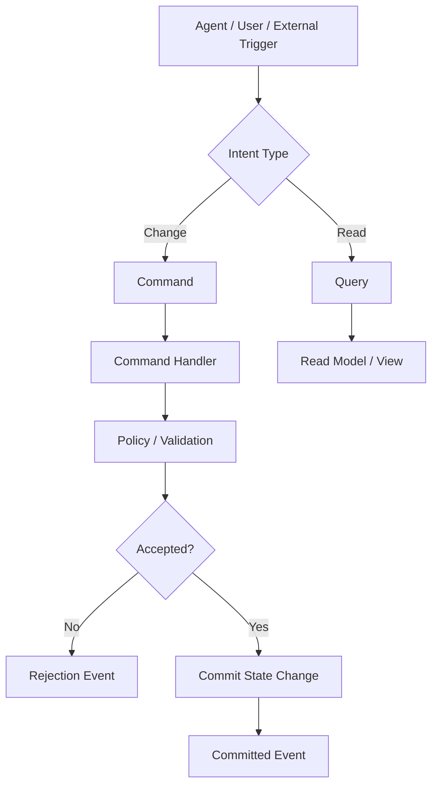

## Definitions

| Concept | Meaning | Example |
|---|---|---|
| Query | request to read data | `GetCaseSummary` |
| Command | request to change state | `ApproveNoticeDraft` |
| Event | fact that something happened | `NoticeDraftApproved` |
| Proposed event | agent-generated suggestion | `CaseEscalationProposed` |
| Committed event | authoritative fact | `CaseEscalated` |
| Command handler | validates and applies command | `handle_approve_notice` |
| Read model | optimized projection for query | `CaseDashboardView` |
| Event log | durable sequence of facts | append-only event store/table |
| Outbox | reliable outgoing event staging | `event_outbox` table |
| Inbox | dedup for incoming events/messages | `processed_message` table |

The key principle:

> Commands are intentions. Events are facts.

---

# 3. Why This Matters for AI Agents

LLM agents blur boundaries if you let them.

Bad design:

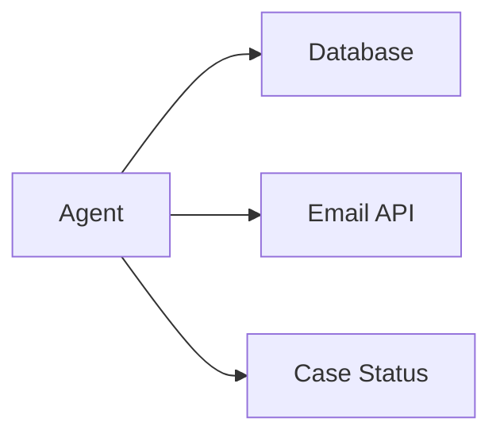

The agent reads, decides, mutates, and notifies directly. This is hard to validate, retry, audit, and recover.

Better design:

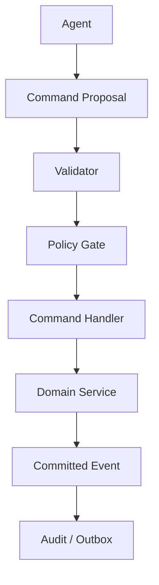

The agent proposes. The system authorizes and commits.

---

# 4. Command-Query Separation

A query should not change state.

A command may change state but should not be used casually as a read.

## Query Example

```python
from pydantic import BaseModel, Field


class GetCaseSummaryQuery(BaseModel):
    query_id: str
    tenant_id: str
    case_id: str
    requested_by: str
    include_evidence_refs: bool = True


class CaseSummaryView(BaseModel):
    case_id: str
    status: str
    risk_level: str | None
    assigned_team: str | None
    evidence_count: int
    last_updated_at: str
```

## Command Example

```python
class ApproveNoticeDraftCommand(BaseModel):
    command_id: str
    tenant_id: str
    case_id: str
    draft_id: str
    reviewer_id: str
    approval_comment: str | None = None
    expected_case_version: int
    policy_version: str
```

The query reads. The command changes state after validation.

---

# 5. Agent-Safe Interpretation

Agents should be allowed to perform many queries, fewer commands, and very few direct external side effects.

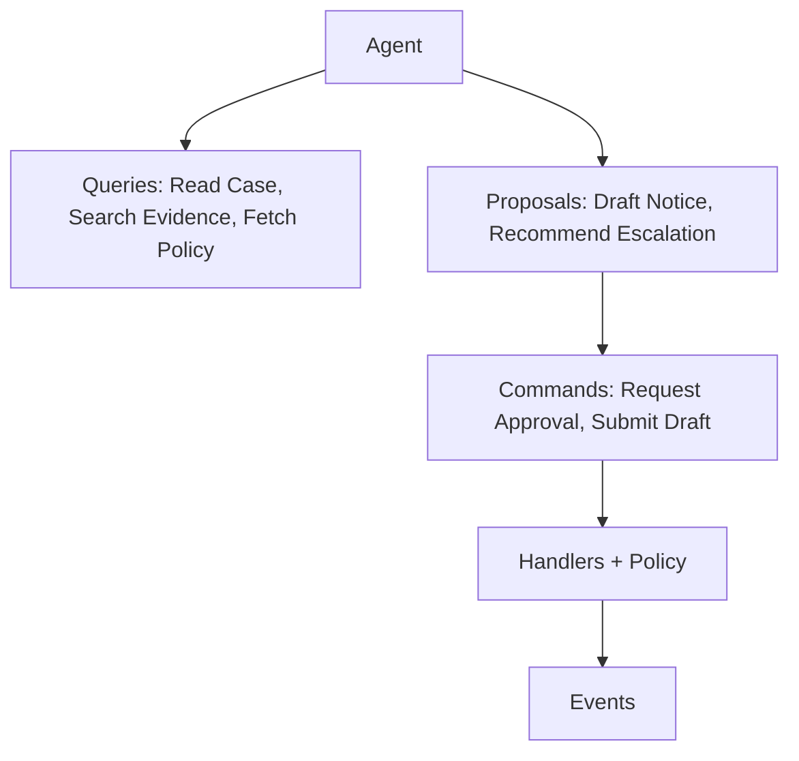

## Practical Rule

| Operation | Agent Permission |
|---|---|
| read approved evidence | often allowed |
| summarize document | allowed |
| propose risk level | allowed |
| create draft artifact | often allowed |
| approve decision | usually not allowed |
| send notice | usually requires human/policy gate |
| close case | usually workflow/domain service |
| delete evidence | almost never direct agent authority |

---

# 6. Command Envelope

A command should carry operational metadata.

```python
from typing import Any
from pydantic import BaseModel


class CommandEnvelope(BaseModel):
    command_id: str
    command_type: str
    command_version: str
    tenant_id: str
    requested_by_actor_type: str
    requested_by_actor_id: str
    run_id: str | None = None
    thread_id: str | None = None
    correlation_id: str
    causation_id: str | None = None
    idempotency_key: str
    expected_aggregate_version: int | None = None
    policy_version: str | None = None
    payload_schema: str
    payload: dict[str, Any]
```

## Why These Fields Matter

| Field | Purpose |
|---|---|
| `command_id` | unique command identity |
| `command_type` | routing |
| `command_version` | schema evolution |
| `tenant_id` | isolation |
| `actor` | accountability |
| `run_id` | trace to agent execution |
| `correlation_id` | group related operations |
| `causation_id` | causal chain |
| `idempotency_key` | safe retry |
| `expected_aggregate_version` | optimistic concurrency |
| `policy_version` | governance/audit |
| `payload_schema` | validation |

A command without metadata is operationally weak.

---

# 7. Command Handler

A command handler validates and applies a command.

```python
class CommandResult(BaseModel):
    command_id: str
    status: str  # accepted, rejected, requires_approval
    events: list["EventEnvelope"] = []
    reason: str | None = None


async def handle_approve_notice_draft(command: CommandEnvelope) -> CommandResult:
    payload = ApproveNoticeDraftCommand.model_validate(command.payload)

    case = await load_case(payload.tenant_id, payload.case_id)

    if case.version != payload.expected_case_version:
        return CommandResult(
            command_id=command.command_id,
            status="rejected",
            reason="Case version conflict.",
        )

    if not await reviewer_can_approve(payload.reviewer_id, payload.case_id):
        return CommandResult(
            command_id=command.command_id,
            status="rejected",
            reason="Reviewer is not authorized.",
        )

    event = EventEnvelope(
        event_id=new_id("evt"),
        event_type="notice_draft.approved",
        event_version="1.0",
        tenant_id=payload.tenant_id,
        aggregate_type="notice_draft",
        aggregate_id=payload.draft_id,
        correlation_id=command.correlation_id,
        causation_id=command.command_id,
        run_id=command.run_id,
        actor_type="user",
        actor_id=payload.reviewer_id,
        payload_schema="NoticeDraftApproved.v1",
        payload={
            "case_id": payload.case_id,
            "draft_id": payload.draft_id,
            "reviewer_id": payload.reviewer_id,
            "comment": payload.approval_comment,
        },
        occurred_at=now_iso(),
    )

    await append_event(event)

    return CommandResult(
        command_id=command.command_id,
        status="accepted",
        events=[event],
    )
```

The handler is deterministic authority. The agent is not.

---

# 8. Query Model

Queries should be optimized for reading and safe to repeat.

```python
class QueryEnvelope(BaseModel):
    query_id: str
    query_type: str
    query_version: str
    tenant_id: str
    requested_by_actor_type: str
    requested_by_actor_id: str
    run_id: str | None = None
    correlation_id: str
    payload_schema: str
    payload: dict[str, Any]


class QueryResult(BaseModel):
    query_id: str
    status: str
    data: dict | None = None
    source_refs: list[str] = []
    error_message: str | None = None
```

## Query Invariants

1. Query does not mutate domain state.
2. Query is authorized.
3. Query result includes source references when used by agents.
4. Query result is safe to repeat.
5. Query output is bounded.
6. Query respects tenant isolation.
7. Query may be cached if policy allows.

Queries can still be sensitive. Read-only does not mean unrestricted.

---

# 9. Event Envelope

Events are facts.

```python
class EventEnvelope(BaseModel):
    event_id: str
    event_type: str
    event_version: str
    tenant_id: str
    aggregate_type: str
    aggregate_id: str
    correlation_id: str
    causation_id: str | None = None
    run_id: str | None = None
    thread_id: str | None = None
    actor_type: str
    actor_id: str
    payload_schema: str
    payload: dict[str, Any]
    occurred_at: str
```

## Event Invariants

1. Events are immutable.
2. Events are append-only.
3. Events record facts, not wishes.
4. Events include schema version.
5. Events include actor and tenant.
6. Events include correlation/causation.
7. Events can be replayed or audited.
8. Events should not contain unnecessary sensitive data.

---

# 10. Proposed vs Committed Events

This is crucial for AI systems.

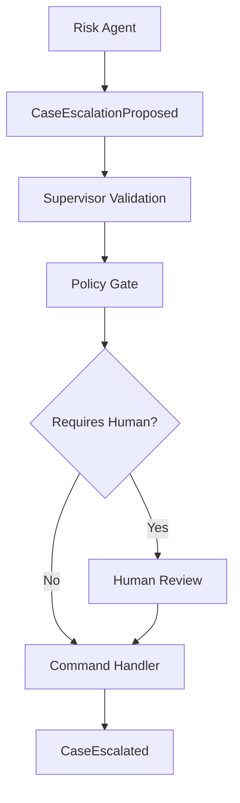

## Proposed Event

```python
class CaseEscalationProposed(BaseModel):
    case_id: str
    current_status: str
    proposed_status: str
    rationale: str
    evidence_refs: list[str]
    confidence: float
    proposed_by_agent: str
```

## Committed Event

```python
class CaseEscalated(BaseModel):
    case_id: str
    from_status: str
    to_status: str
    approved_by_actor_type: str
    approved_by_actor_id: str
    approval_id: str | None
```

The proposed event is a recommendation.

The committed event is a domain fact.

---

# 11. Event Types in Agent Systems

| Event Type | Example | Meaning |
|---|---|---|
| runtime event | `run.started` | execution lifecycle fact |
| model event | `model.response_received` | model call fact |
| tool event | `tool.call_committed` | tool execution fact |
| proposed domain event | `case.escalation_proposed` | agent recommendation |
| committed domain event | `case.escalated` | business fact |
| human event | `approval.granted` | human decision |
| policy event | `policy.decision_recorded` | governance fact |
| audit event | `audit.recorded` | compliance record |
| integration event | `notice.sent` | external communication fact |

Avoid one generic event stream with vague payloads.

---

# 12. Event Sourcing vs Event Notification

Not every event-driven system is event sourced.

## Event Notification

A service emits an event to say something happened.

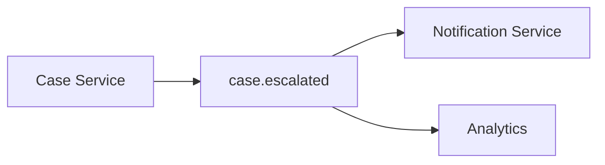

Consumers may need to call back for details.

## Event-Carried State Transfer

The event contains enough state for consumers.

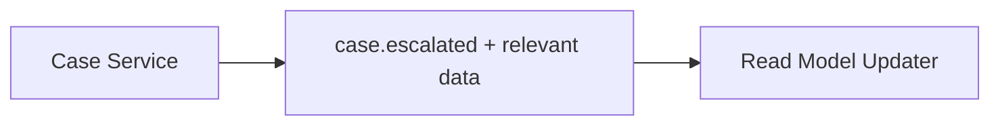

## Event Sourcing

Application state is derived from a sequence of events.

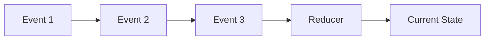

Event sourcing can be powerful, but it adds complexity. For agent systems, it is often enough to use:

- committed domain events for audit;
- runtime events for execution;
- outbox for reliable integration;
- snapshots/checkpoints for resume.

Do not adopt event sourcing blindly.

---

# 13. CQRS in Agent Systems

CQRS separates write models from read models.

In an agent system:

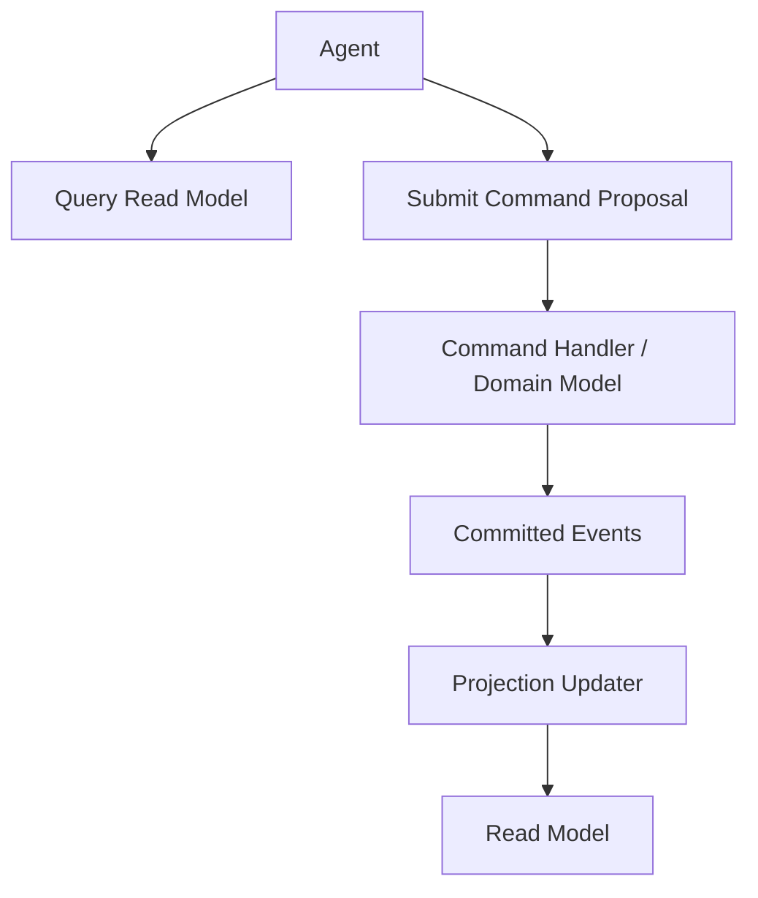

## Why Useful?

- agents can query optimized read models;
- writes remain controlled by command handlers;
- audit events support traceability;
- projections can be tailored to context assembly;
- read-side denormalization improves agent context building.

## Caution

CQRS adds complexity:

- eventual consistency;
- projection lag;
- duplicate event handling;
- schema evolution;
- operational overhead.

Use it where separation gives real value.

---

# 14. Read Models for Agents

Agents often need read models optimized for reasoning, not transaction processing.

Example:

```python
class CaseAgentContextView(BaseModel):
    case_id: str
    status: str
    risk_level: str | None
    allegation_summary: str
    key_evidence_refs: list[str]
    missing_evidence: list[str]
    recent_events: list[str]
    allowed_actions: list[str]
    policy_notes: list[str]
    version: int
```

This read model is not the domain aggregate. It is a projection for context.

## Read Model Invariants

1. It is derived.
2. It includes source refs/version.
3. It is refreshed from authoritative state.
4. It may be stale.
5. It must not be mutated directly.
6. Agents should know freshness where relevant.

---

# 15. Command Proposals from Agents

Instead of letting agents issue final commands, create proposals.

```python
class CommandProposal(BaseModel):
    proposal_id: str
    run_id: str
    agent_name: str
    proposed_command_type: str
    payload: dict
    rationale: str
    evidence_refs: list[str]
    confidence: float
    requires_human_review_reason: str | None = None
```

Pipeline:

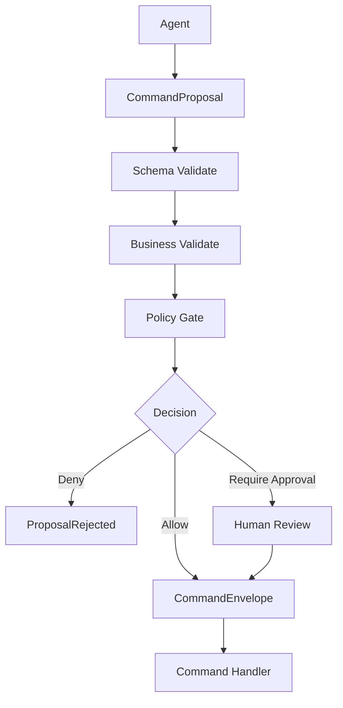

This keeps agent autonomy bounded.

---

# 16. Command Validation Layers

A command should pass multiple layers.

| Layer | Example |
|---|---|
| schema validation | required fields present |
| identity/auth validation | actor can request action |
| tenant validation | tenant matches aggregate |
| version validation | expected aggregate version |
| lifecycle validation | transition allowed from current state |
| policy validation | risk/approval rules |
| evidence validation | required evidence exists |
| idempotency validation | duplicate command handled safely |
| rate/budget validation | runtime limits respected |

Never rely on one validation layer.

---

# 17. Command Outcomes

A command does not only succeed or fail.

```python
class CommandOutcome(str, Enum):
    ACCEPTED = "accepted"
    REJECTED = "rejected"
    REQUIRES_APPROVAL = "requires_approval"
    DUPLICATE_ACCEPTED = "duplicate_accepted"
    CONFLICT = "conflict"
    VALIDATION_ERROR = "validation_error"
```

This is important for idempotency and retry.

A duplicate command with the same idempotency key may return the original accepted result, not execute again.

---

# 18. Outbox Pattern

When a service commits state and publishes an event, a crash can occur between database commit and message publish.

Outbox pattern solves this by writing the event to the same transactional boundary as the state change.

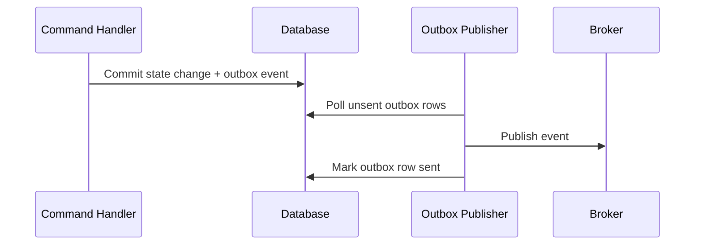

## Outbox Row

```python
class OutboxMessage(BaseModel):
    outbox_id: str
    tenant_id: str
    event_type: str
    event_version: str
    payload: dict
    status: str  # pending, published, failed
    attempts: int
    created_at: str
    published_at: str | None = None
```

Outbox does not eliminate duplicates. It makes publishing reliable enough when paired with consumer deduplication.

---

# 19. Inbox Pattern

Consumers should deduplicate incoming messages.

```python
class InboxMessage(BaseModel):
    message_id: str
    consumer_name: str
    received_at: str
    processed_at: str | None = None
    status: str
```

Processing flow:

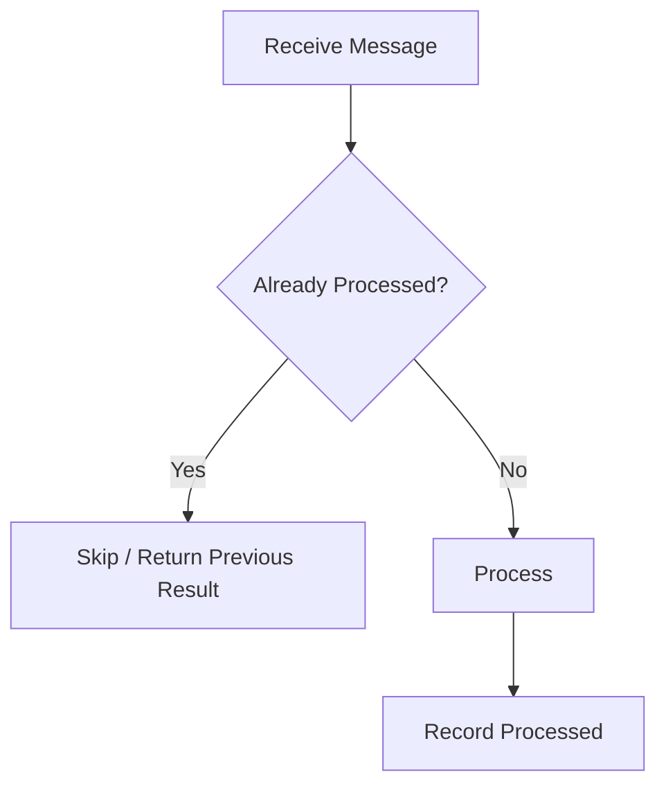

Inbox is especially important when:

- broker delivers at least once;
- publisher may retry;
- consumers crash;
- external notifications must not duplicate;
- read model projection must be idempotent.

---

# 20. Event Ordering

Do not assume perfect global order.

Ordering may be guaranteed only within:

- aggregate stream;
- partition key;
- tenant;
- topic partition;
- workflow run.

## Event Version Checks

```python
class AggregateEvent(BaseModel):
    aggregate_id: str
    aggregate_version: int
    event_type: str
    payload: dict
```

Consumer can detect gaps:

```python
def apply_event(current_version: int, event: AggregateEvent):
    expected = current_version + 1

    if event.aggregate_version != expected:
        raise ValueError(
            f"Out-of-order event: expected {expected}, got {event.aggregate_version}"
        )
```

For many systems, per-aggregate ordering is enough.

---

# 21. Causation and Correlation

Correlation groups related work.

Causation explains why an event happened.

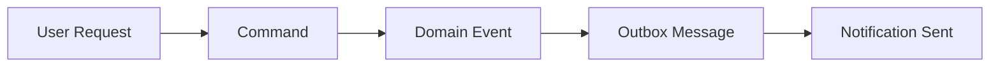

All can share one `correlation_id`.

Each step can reference the previous step as `causation_id`.

This is critical for forensic tracing.

---

# 22. Agent Audit Trail with Commands and Events

A good audit trail connects:

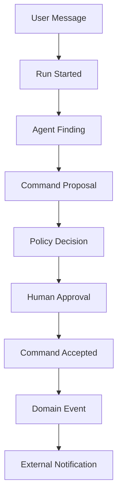

For an incident, you can answer:

- What did the user ask?
- What did the agent infer?
- What command did it propose?
- Which policy applied?
- Who approved?
- Which command handler committed?
- Which event was emitted?
- Which external side effect occurred?

---

# 23. Command and Event Security

Security controls:

- authorize queries;
- authorize commands;
- validate tenant/aggregate ownership;
- sign or verify external events if needed;
- reject unknown event versions;
- do not expose internal commands to untrusted agents;
- separate command proposal from command execution;
- sanitize event payloads before model context;
- avoid sensitive data in broad integration events.

## Agent Rule

> Agents may propose commands. They should not bypass command handlers.

---

# 24. Python Dispatcher

A simple command dispatcher:

```python
from collections.abc import Awaitable, Callable
from typing import Protocol


class CommandHandler(Protocol):
    async def __call__(self, command: CommandEnvelope) -> CommandResult:
        ...


class CommandDispatcher:
    def __init__(self) -> None:
        self._handlers: dict[str, CommandHandler] = {}

    def register(self, command_type: str, handler: CommandHandler) -> None:
        self._handlers[command_type] = handler

    async def dispatch(self, command: CommandEnvelope) -> CommandResult:
        handler = self._handlers.get(command.command_type)
        if handler is None:
            return CommandResult(
                command_id=command.command_id,
                status="rejected",
                reason=f"No handler for {command.command_type}",
            )

        return await handler(command)
```

In production, the dispatcher also handles:

- idempotency;
- authorization;
- telemetry;
- validation;
- retry classification;
- transaction boundary;
- outbox write.

---

# 25. Agent Tool Mapping

In an agent runtime, a “tool” can map to either a query or a command proposal.

| Tool Name | Underlying Operation |
|---|---|
| `get_case_summary` | query |
| `search_evidence` | query |
| `create_notice_draft` | command, low-risk artifact creation |
| `propose_case_escalation` | command proposal |
| `request_approval` | command |
| `send_approved_notice` | command with strict policy gate |

Do not expose `send_notice` directly if approval is required.

Expose `send_approved_notice` and make the handler verify approval.

---

# 26. Command/Query/Event Practice Example

Regulatory case flow:

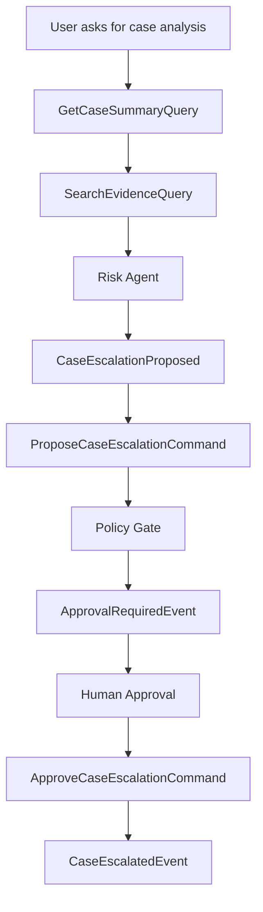

## Key Observation

The agent produced a recommendation. The system performed authoritative transitions.

---

# 27. Testing Command/Query/Event Boundaries

Test cases:

| Test | Expected |
|---|---|
| query repeated twice | no domain mutation |
| command without permission | rejected |
| command with stale aggregate version | conflict |
| command duplicate idempotency key | same result returned |
| proposed escalation without evidence | rejected |
| human approval missing | command requires approval |
| event replay | reconstructs expected state |
| outbox publish retry | no duplicate consumer side effect |
| unknown event version | rejected or routed to compatibility handler |

## Test Sketch

```python
async def test_query_does_not_mutate_case():
    before = await load_case("tenant_1", "case_1")
    await handle_get_case_summary(
        GetCaseSummaryQuery(
            query_id="q1",
            tenant_id="tenant_1",
            case_id="case_1",
            requested_by="user_1",
        )
    )
    after = await load_case("tenant_1", "case_1")

    assert after.version == before.version
    assert after.status == before.status
```

---

# 28. Anti-Patterns

## Anti-Pattern 1 — Agent Direct Database Mutation

```python
agent_tool("update_case_status", {"status": "closed"})
```

Use a command handler.

## Anti-Pattern 2 — Event Before Commit

```text
Publish CaseClosed, then try to close case.
```

Events should reflect committed facts.

## Anti-Pattern 3 — Query with Hidden Side Effect

```python
get_case_summary(case_id)  # also marks case as reviewed
```

Separate command from query.

## Anti-Pattern 4 — Treating Agent Output as Event

```text
The agent said the notice was sent.
```

A notice is sent when the notification service commits it.

## Anti-Pattern 5 — No Causation Chain

You cannot explain why a decision happened.

---

# 29. Production Checklist

Before exposing an operation to agents:

- [ ] is it a query, command, or event?
- [ ] if command, who is authorized?
- [ ] if command, what state transition is allowed?
- [ ] if command, is idempotency required?
- [ ] if command, what events are emitted?
- [ ] if query, is it side-effect free?
- [ ] if query, is result source-referenced?
- [ ] if event, is it proposed or committed?
- [ ] does the event include version?
- [ ] does it include correlation/causation?
- [ ] is there a handler, not direct mutation?
- [ ] is there an audit trail?
- [ ] do outbox/inbox patterns protect delivery?
- [ ] are duplicates safe?
- [ ] is tenant isolation enforced?

---

# 30. Practice Drill

Design C/Q/E for an enterprise multi-agent enforcement assistant.

Operations:

- fetch case;
- search evidence;
- propose risk update;
- create analyst brief;
- request approval;
- approve notice;
- send notice;
- close case.

Deliverables:

1. query schemas;
2. command schemas;
3. proposed events;
4. committed events;
5. command handlers;
6. policy gates;
7. event envelope;
8. outbox messages;
9. inbox dedup rules;
10. audit trace diagram.

---

# 31. What Top 1% Engineers Pay Attention To

Top engineers ask:

- Is this operation read or write?
- Is this an intention or a fact?
- Can the agent only propose?
- What handler owns authority?
- What validation happens before commit?
- What event proves the state changed?
- What if the command is retried?
- What if the event is delivered twice?
- What if the read model is stale?
- What if policy changes between proposal and approval?
- What if a human approves the wrong version?
- Can we trace causation from user request to side effect?

They use commands, queries, and events to control ambiguity.

---

# 32. Summary

In this part, we covered:

- command-query separation;
- command envelopes;
- query envelopes;
- event envelopes;
- proposed vs committed events;
- command handlers;
- read models;
- CQRS in agent systems;
- event sourcing vs event notification;
- command proposals;
- validation layers;
- command outcomes;
- outbox pattern;
- inbox pattern;
- event ordering;
- causation/correlation;
- security;
- testing;
- anti-patterns.

The key idea:

> Agents should produce explicit proposals. Authoritative systems commit explicit commands and record explicit events.

The next part goes deeper into the operational consequence: **idempotency, retry, and deduplication**.

---

## References

- Martin Fowler: Command Query Separation.
- Martin Fowler: CQRS.
- Martin Fowler: Event Sourcing.
- Martin Fowler: What do you mean by Event-Driven?
- AWS Builders Library: making retries safe with idempotent APIs.
