# Part 014 — Idempotency, Retry, and Deduplication

> Retrying an agent is easy.
>
> Retrying an agent safely after it has touched the world is hard.

Enterprise agent systems fail in subtle ways:

- duplicate emails;
- duplicate tickets;
- duplicate approvals;
- duplicate case transitions;
- duplicate payments;
- duplicate notifications;
- duplicate memory writes;
- duplicate tool side effects;
- duplicate external API calls after resume.

This part focuses on **idempotency, retry, deduplication, and exactly-once illusions**.

These topics are not optional. Stateful AI systems call tools, mutate workflows, pause for humans, resume after failures, and run across distributed infrastructure. That means failures are normal.

---

## 1. Kaufman Framing

Using Kaufman's method, this skill decomposes into:

1. classify operations by side effect;
2. identify retry-safe operations;
3. generate stable idempotency keys;
4. record operation attempts and outcomes;
5. deduplicate commands, events, messages, and tool calls;
6. handle crash windows;
7. separate retry from compensation;
8. apply backoff, jitter, and retry budgets;
9. avoid exactly-once assumptions;
10. test failure and resume scenarios.

### Target Performance

By the end of this part, you should be able to:

- explain idempotency in agentic systems;
- design idempotency records for tool calls and commands;
- build retry policies that do not duplicate side effects;
- use outbox/inbox patterns for deduplication;
- reason about ambiguous completion;
- design semantic idempotency keys;
- handle at-least-once delivery;
- avoid exactly-once myths;
- test crash windows in workflows.

---

# 2. The Core Problem

A model call can be retried. A read-only query can often be retried.

But a side effect is different.

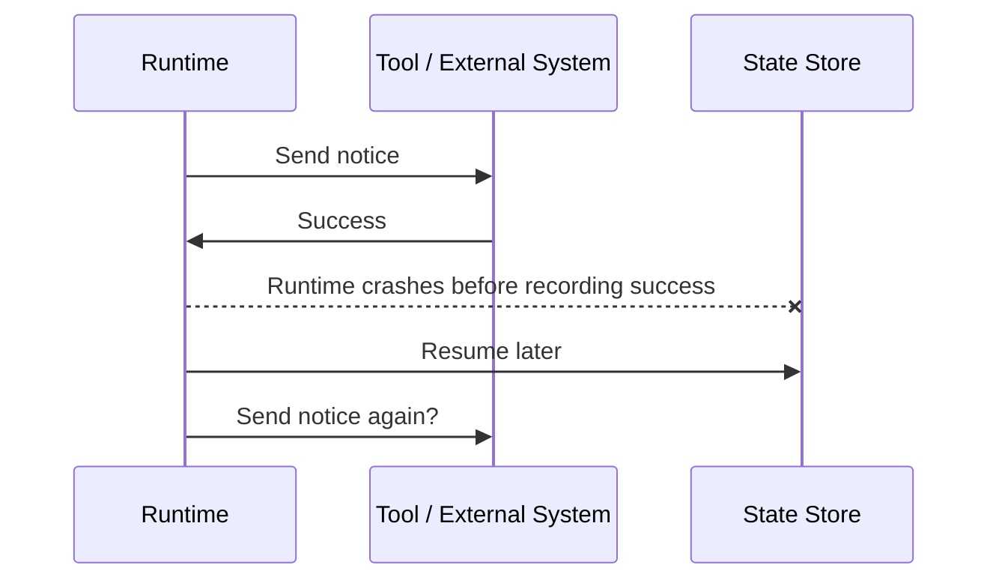

The runtime does not know whether the first notice was sent unless the operation was designed for reconciliation.

This is the core challenge.

---

# 3. What Is Idempotency?

An operation is idempotent when performing it multiple times has the same effect as performing it once.

Examples:

| Operation | Idempotent? | Notes |
|---|---:|---|
| `GET case summary` | usually yes | read-only |
| `PUT status = CLOSED` | often yes | if same value and version rules |
| `POST create ticket` | not by default | may create duplicates |
| `send email` | not by default | duplicates visible to recipient |
| `charge card` | not by default | financial risk |
| `create draft with idempotency key` | can be | if key reused |
| `append audit event` | semantically tricky | duplicate audit events may be bad |
| `store memory` | depends | duplicates/pollution possible |

## Important Distinction

Technical idempotency:

> Same request key returns same result.

Semantic idempotency:

> The business meaning does not duplicate.

A tool can be technically idempotent but semantically wrong if the key is poorly chosen.

---

# 4. Retry Safety Matrix

| Operation Type | Retry Safety | Required Control |
|---|---|---|
| pure computation | safe | deterministic input |
| model call | usually safe but variable | budget + trace |
| read-only query | safe if authorized | timeout/backoff |
| create artifact draft | safe with key | idempotency record |
| internal mutation | needs care | expected version + key |
| external notification | risky | idempotency + approval + reconciliation |
| payment/financial action | high risk | provider idempotency + ledger |
| deletion | very high risk | approval + tombstone + compensation strategy |
| memory write | risky | dedup + source refs |

The more visible or irreversible the side effect, the stronger the idempotency design must be.

---

# 5. Exactly-Once Is Usually an Illusion

Distributed systems often provide at-least-once delivery or at-least-once execution.

Your code may run more than once because:

- worker crashes after side effect;
- HTTP client times out after server succeeds;
- message broker redelivers;
- outbox publisher retries;
- model/tool gateway retries;
- workflow engine retries activity;
- user double-clicks;
- frontend resubmits;
- agent resumes from checkpoint;
- deployment restarts worker.

You should assume:

> Any side-effecting operation can be attempted more than once.

Then design so repeated attempts are safe.

---

# 6. Idempotency Key

An idempotency key identifies a logical operation.

```python
from pydantic import BaseModel


class IdempotencyKey(BaseModel):
    tenant_id: str
    operation_type: str
    logical_target_id: str
    logical_operation_id: str

    def value(self) -> str:
        return ":".join(
            [
                self.tenant_id,
                self.operation_type,
                self.logical_target_id,
                self.logical_operation_id,
            ]
        )
```

Example keys:

```text
tenant_a:send_notice:case_123:notice_draft_456
tenant_a:create_brief:case_123:run_789
tenant_a:approve_notice:draft_456:approval_001
tenant_a:update_risk:case_123:risk_assessment_777
```

## Key Design Rules

1. Key should represent business intent.
2. Key should be stable across retries.
3. Key should not be random per attempt.
4. Key should include tenant/scope.
5. Key should distinguish different logical operations.
6. Key should be stored durably.
7. Key should be sent to downstream APIs if supported.
8. Key should bind to a request hash.

Bad:

```python
idempotency_key = uuid4()
```

This creates a new key on every retry.

Better:

```python
idempotency_key = f"{tenant_id}:send_notice:{case_id}:{draft_id}"
```

---

# 7. Idempotency Record

Store idempotency records.

```python
from typing import Literal
from pydantic import BaseModel


class IdempotencyRecord(BaseModel):
    key: str
    tenant_id: str
    operation_type: str
    request_hash: str
    status: Literal["started", "committed", "failed", "compensated"]
    response_ref: str | None = None
    external_ref: str | None = None
    created_at: str
    updated_at: str
```

## Flow

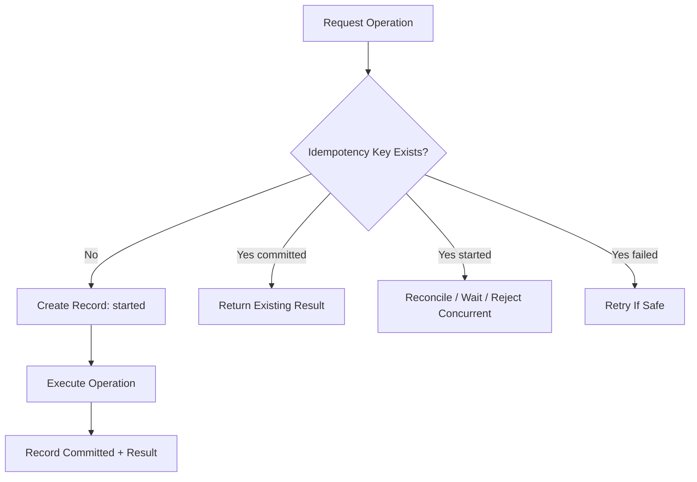

## Request Hash

The same idempotency key should not be used for a different payload.

```python
import hashlib
import json


def stable_hash(payload: dict) -> str:
    encoded = json.dumps(payload, sort_keys=True, separators=(",", ":")).encode()
    return hashlib.sha256(encoded).hexdigest()
```

If key exists but hash differs, reject.

---

# 8. Idempotent Command Handling

Command handler with idempotency:

```python
class IdempotencyConflict(Exception):
    pass


async def handle_command_idempotently(command: CommandEnvelope) -> CommandResult:
    request_hash = stable_hash(command.payload)

    existing = await load_idempotency_record(command.idempotency_key)

    if existing:
        if existing.request_hash != request_hash:
            raise IdempotencyConflict("Same idempotency key used with different payload.")

        if existing.status == "committed":
            return await load_previous_command_result(existing.response_ref)

        if existing.status == "started":
            return CommandResult(
                command_id=command.command_id,
                status="conflict",
                reason="Operation already in progress.",
            )

    await create_idempotency_record(
        key=command.idempotency_key,
        tenant_id=command.tenant_id,
        operation_type=command.command_type,
        request_hash=request_hash,
        status="started",
    )

    result = await execute_command_business_logic(command)

    await mark_idempotency_committed(
        key=command.idempotency_key,
        response=result,
    )

    return result
```

In production, this must be transactional with the state change where possible.

---

# 9. Idempotent Tool Execution

Tool calls need idempotency too.

```python
class ToolExecutionRequest(BaseModel):
    run_id: str
    tool_call_id: str
    tool_name: str
    tenant_id: str
    input: dict
    idempotency_key: str
    effect_type: str


class ToolExecutionOutcome(BaseModel):
    tool_call_id: str
    status: str
    output: dict | None = None
    external_ref: str | None = None
```

Tool executor flow:

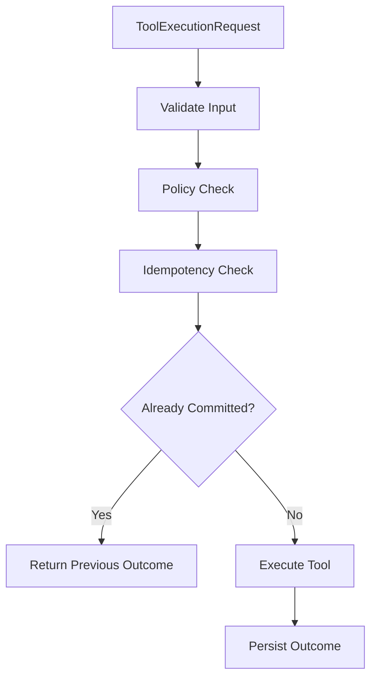

The agent should not own this logic. The tool executor should.

---

# 10. Crash Windows

## Window 1 — Before Side Effect

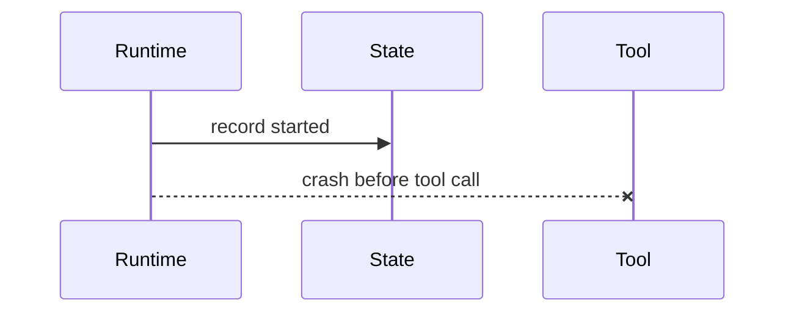

Resume can safely retry.

## Window 2 — During Side Effect

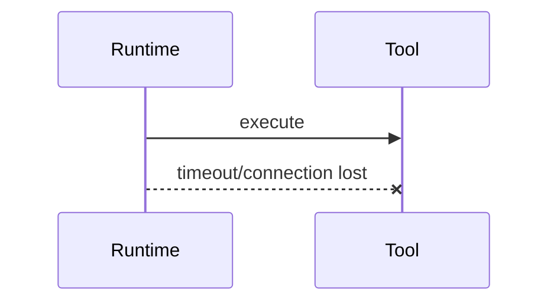

Completion is ambiguous. Need reconciliation.

## Window 3 — After Side Effect Before Record

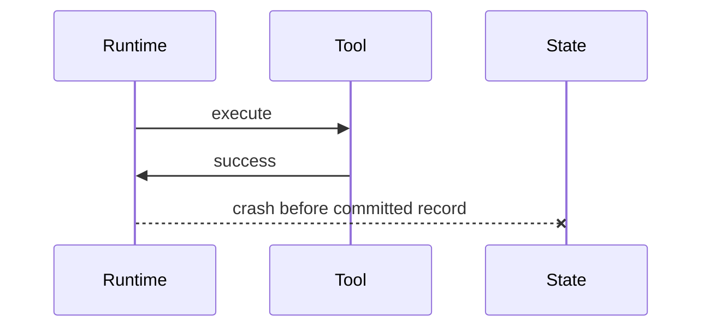

Resume must not blindly retry. It must check downstream using idempotency key or external reference.

---

# 11. Reconciliation

Reconciliation resolves ambiguous operation state.

```python
class ReconciliationResult(BaseModel):
    resolved: bool
    status: str
    external_ref: str | None = None
    reason: str


async def reconcile_tool_operation(record: IdempotencyRecord) -> ReconciliationResult:
    if record.external_ref:
        status = await lookup_external_status(record.external_ref)
    else:
        status = await lookup_by_idempotency_key(record.key)

    if status == "committed":
        return ReconciliationResult(
            resolved=True,
            status="committed",
            external_ref=record.external_ref,
            reason="External system confirms commit.",
        )

    if status == "not_found":
        return ReconciliationResult(
            resolved=True,
            status="not_committed",
            reason="External system has no record for key.",
        )

    return ReconciliationResult(
        resolved=False,
        status="unknown",
        reason="External system cannot confirm.",
    )
```

If the downstream system does not support lookup/idempotency, your operation is riskier.

---

# 12. Retry Policy

Retry should be explicit.

```python
from enum import Enum
from pydantic import BaseModel, Field


class RetryDecision(str, Enum):
    RETRY = "retry"
    DO_NOT_RETRY = "do_not_retry"
    RECONCILE = "reconcile"
    ESCALATE = "escalate"


class RetryPolicy(BaseModel):
    max_attempts: int = Field(ge=1)
    base_delay_ms: int = Field(ge=0)
    max_delay_ms: int = Field(ge=0)
    jitter: bool = True
    retryable_error_types: set[str]
```

## Retry Decision Matrix

| Error | Retry? |
|---|---|
| validation error | no, maybe repair model output |
| policy denied | no |
| unauthorized | no, unless token refresh is valid |
| rate limited | yes with backoff |
| transient network | yes |
| timeout before side effect | maybe |
| timeout during side effect | reconcile |
| server 5xx | maybe |
| budget exceeded | no |
| human approval missing | interrupt |
| duplicate command | return existing result |
| conflict/version mismatch | no automatic retry without reload |

---

# 13. Backoff and Jitter

Retries without delay can amplify outages.

```python
import random


def compute_backoff_ms(
    *,
    attempt: int,
    base_delay_ms: int,
    max_delay_ms: int,
    jitter: bool,
) -> int:
    delay = min(max_delay_ms, base_delay_ms * (2 ** max(0, attempt - 1)))

    if jitter:
        return random.randint(0, delay)

    return delay
```

## Why Jitter?

If many workers retry at the same time, they can create a retry storm.

Jitter spreads retries over time.

---

# 14. Retry Budget

Retries should have a budget.

```python
class RetryBudget(BaseModel):
    max_total_attempts: int
    max_total_delay_ms: int
    max_retry_cost_usd: float
```

Retry budget prevents:

- cost explosion;
- provider overload;
- infinite loops;
- noisy neighbor problems;
- delayed failure visibility.

A retry policy without a budget can become an outage amplifier.

---

# 15. Deduplication

Deduplication prevents the same logical message/event/tool call from being processed more than once.

Dedup keys may include:

- command id;
- idempotency key;
- event id;
- message id;
- aggregate id + aggregate version;
- tool call id;
- external reference id;
- approval id.

## Dedup Table

```python
class ProcessedMessage(BaseModel):
    consumer_name: str
    message_id: str
    processed_at: str
    result_ref: str | None = None
```

Consumer logic:

```python
async def process_message_once(consumer_name: str, message_id: str, handler):
    if await already_processed(consumer_name, message_id):
        return await load_previous_result(consumer_name, message_id)

    result = await handler()

    await mark_processed(consumer_name, message_id, result)

    return result
```

Again, production code must make this atomic with side effects where possible.

---

# 16. Outbox + Inbox Together

Outbox alone does not prevent duplicate consumer effects.

Inbox alone does not guarantee publish after commit.

Together:

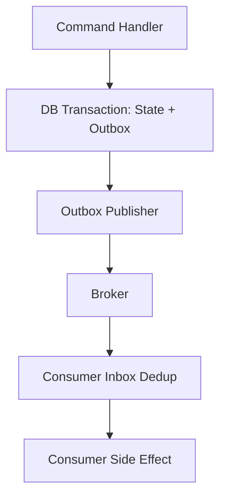

## Key Rules

1. Producer writes state and outbox together.
2. Publisher may publish more than once.
3. Consumer deduplicates.
4. Consumer side effect is idempotent if possible.
5. Message includes stable event id.
6. Consumer records processed message.

This is a practical reliability foundation.

---

# 17. Agent Resume and Dedup

When an agent resumes from checkpoint, it may re-enter a step.

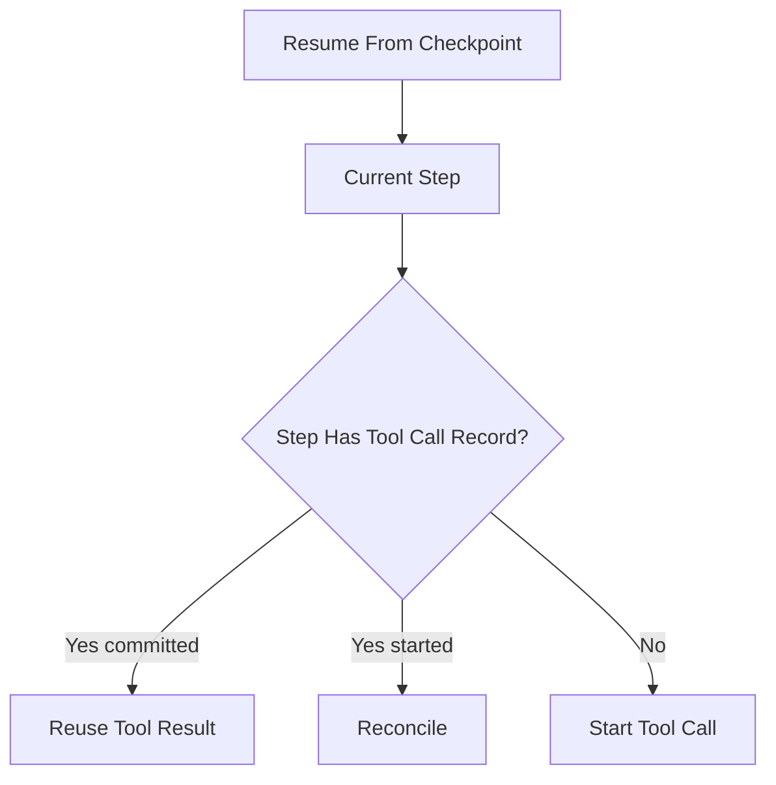

## Resume Rule

> Never ask only “what does the agent want to do now?”
>
> Ask “what already happened for this logical operation?”

This requires durable records.

---

# 18. Idempotency and Human Approval

Human approval can also duplicate.

Example:

- reviewer clicks approve;
- UI times out;
- reviewer clicks approve again;
- backend receives two approvals.

Use approval command idempotency.

```python
class ApprovalCommand(BaseModel):
    approval_id: str
    decision_package_id: str
    reviewer_id: str
    decision: str
    expected_package_version: int
```

Idempotency key:

```text
tenant_a:approval:decision_package_123:reviewer_456
```

If the same reviewer approves the same package twice, return the original result.

If a different decision is submitted with same key, reject conflict.

---

# 19. Idempotency and Memory Writes

Memory writes are often ignored, but duplicates matter.

Bad:

```text
User prefers concise answers.
User prefers concise answers.
User prefers concise answers.
```

Memory pollution affects future behavior.

Use semantic dedup:

```python
class MemoryWriteRequest(BaseModel):
    subject_id: str
    memory_type: str
    content: str
    source_ref: str
    idempotency_key: str
```

Possible key:

```text
tenant_a:memory:user_123:preference:source_msg_456
```

Memory service should detect duplicates and update confidence/source refs instead of appending blindly.

---

# 20. Idempotency and Artifact Creation

Artifacts should not duplicate on retry.

Example:

```text
Create analyst brief for case_123 from risk_assessment_999
```

Key:

```text
tenant_a:create_artifact:analyst_brief:case_123:risk_assessment_999
```

If retried, return the same artifact.

```python
class ArtifactCreateRequest(BaseModel):
    artifact_type: str
    case_id: str
    source_refs: list[str]
    content_hash: str
    idempotency_key: str
```

If content differs for same key, reject or create a new version explicitly.

---

# 21. Idempotency and External Notifications

External notification is high risk.

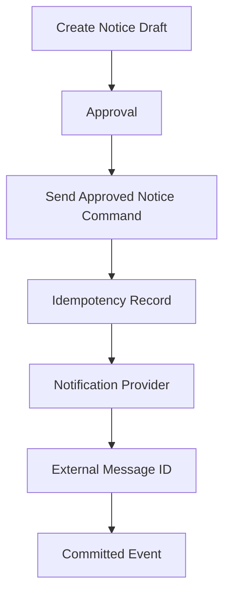

## Rules

1. Draft creation is not sending.
2. Approval is not sending.
3. Send command requires approval ID.
4. Send command has stable idempotency key.
5. Provider idempotency key is used if available.
6. External message ID is stored.
7. Retry reconciles before resending.
8. User-visible duplicate prevention is mandatory.

---

# 22. Idempotency and Model Calls

Model calls are usually not idempotent in output because generation may vary.

But they can be idempotent at the runtime level:

- same logical step;
- same input context hash;
- same prompt version;
- same model route;
- previous result reused if already committed.

```python
class ModelCallRecord(BaseModel):
    model_call_key: str
    run_id: str
    step_name: str
    input_hash: str
    prompt_version: str
    model: str
    status: str
    response_ref: str | None = None
```

For expensive deterministic-ish steps, reuse committed model output on resume.

For creative/exploratory steps, rerun may be acceptable if no side effects have occurred.

---

# 23. Semantic Idempotency

Some operations need domain-specific idempotency.

Example:

```text
"Send the legally approved notice for case_123"
```

The semantic operation is not “send this HTTP request.” It is “send this approved notice once.”

The key should bind to:

- tenant;
- case ID;
- approved notice/draft ID;
- approval ID;
- recipient;
- notice type.

If the draft changes, it is a different logical operation and should require a new key/approval.

---

# 24. Dedup Windows and Retention

How long should idempotency records live?

It depends.

| Operation | Suggested Dedup Retention |
|---|---|
| read-only query | short or none |
| model call cache | hours/days depending on use |
| artifact creation | artifact lifetime |
| internal mutation | business audit window |
| approval | approval lifetime |
| external notification | long enough to prevent visible duplicates |
| payment | financial/legal retention |
| audit event | compliance retention |

Do not expire idempotency records too early for high-impact operations.

---

# 25. Distributed Locks Are Not Enough

A lock can prevent concurrent execution, but it does not solve crash-after-side-effect.

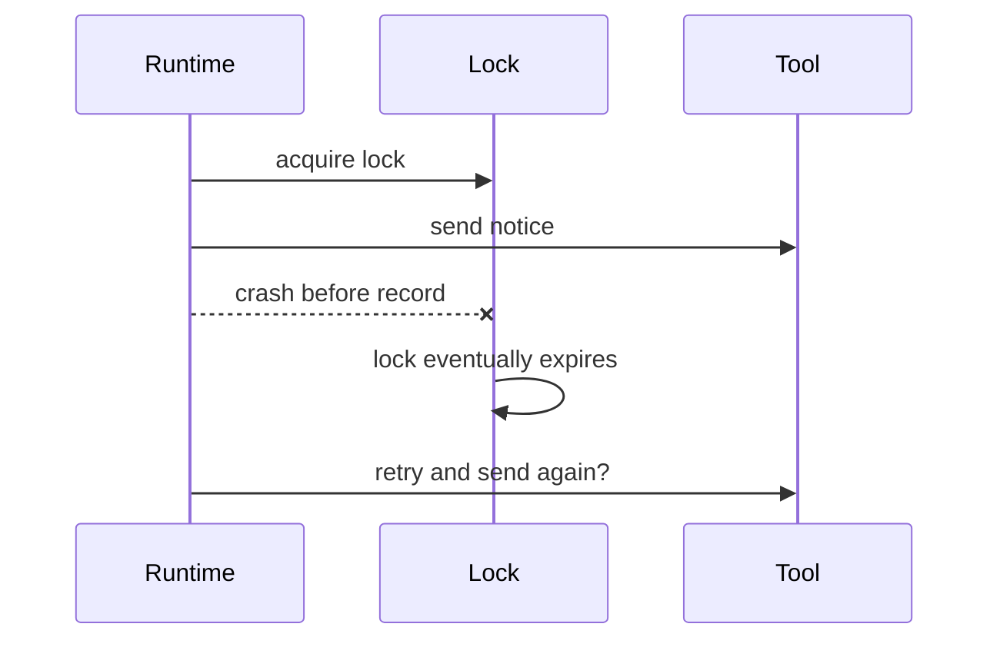

Locks help with concurrency. Idempotency helps with retry safety.

Use both when needed, but do not confuse them.

---

# 26. Compensation

Not every duplicate can be prevented. Sometimes you need compensation.

Examples:

| Side Effect | Compensation |
|---|---|
| reserve resource | release reservation |
| create draft | archive duplicate |
| send wrong internal notification | send correction |
| update case status | transition back with audit |
| charge payment | refund |
| send external legal notice | human remediation, not true compensation |

High-impact operations may not be fully compensatable. That means prevention matters more.

---

# 27. Retry Placement

Retries can happen at multiple layers:

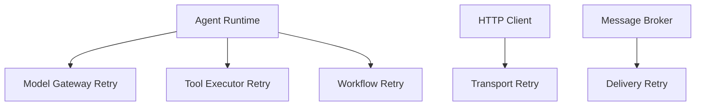

Too many retry layers multiply attempts.

## Retry Placement Rule

> Retry at the layer that understands operation semantics.

For side-effecting tools, the tool executor or command handler usually understands semantics better than a generic HTTP client.

---

# 28. Agent Loop Retry vs Step Retry

Do not restart the entire agent loop for a local transient error unless designed.

Bad:

```text
Tool timed out, rerun whole agent from beginning.
```

Better:

```text
Retry the specific tool step using the same idempotency key, or reconcile.
```

Agent loop retry can cause:

- different reasoning path;
- new tool calls;
- duplicate artifacts;
- inconsistent state;
- cost explosion.

Use checkpointed step retry.

---

# 29. Observability

Track idempotency and retry behavior.

| Metric/Event | Why |
|---|---|
| idempotency hit rate | shows duplicate attempts |
| idempotency conflict count | bad key reuse/payload drift |
| retry attempts | dependency health |
| retry exhausted count | reliability issue |
| ambiguous operation count | reconciliation gap |
| duplicate event detected | consumer health |
| compensation count | side-effect risk |
| retry cost | budget impact |
| tool timeout after started | crash/ambiguity risk |

Logs should include:

- idempotency key;
- command id;
- event id;
- tool call id;
- external ref;
- run id;
- correlation id;
- retry attempt;
- decision.

---

# 30. Failure Testing

You must test failure windows.

## Test Scenarios

| Scenario | Expected |
|---|---|
| retry same command same payload | returns same result |
| retry same key different payload | conflict |
| worker crashes before tool call | safe retry |
| worker crashes after tool success before checkpoint | reconciliation prevents duplicate |
| event delivered twice | consumer processes once |
| approval submitted twice | one approval recorded |
| model output repair retry | no duplicate tool call |
| outbox publisher publishes twice | inbox dedups |
| provider timeout after commit | lookup by idempotency key |
| dedup record expired too early | test reveals duplicate risk |

## Crash Injection

Build test hooks:

```python
class CrashPoint(str, Enum):
    BEFORE_TOOL_CALL = "before_tool_call"
    AFTER_TOOL_CALL_BEFORE_RECORD = "after_tool_call_before_record"
    AFTER_RECORD_BEFORE_CHECKPOINT = "after_record_before_checkpoint"
```

Then run simulations.

---

# 31. Python Idempotent Operation Wrapper

```python
class IdempotencyStore:
    async def get(self, key: str) -> IdempotencyRecord | None:
        ...

    async def create_started(
        self,
        *,
        key: str,
        tenant_id: str,
        operation_type: str,
        request_hash: str,
    ) -> None:
        ...

    async def mark_committed(
        self,
        *,
        key: str,
        response_ref: str,
        external_ref: str | None = None,
    ) -> None:
        ...


async def execute_once(
    *,
    store: IdempotencyStore,
    key: str,
    tenant_id: str,
    operation_type: str,
    payload: dict,
    operation,
):
    request_hash = stable_hash(payload)

    existing = await store.get(key)

    if existing:
        if existing.request_hash != request_hash:
            raise IdempotencyConflict("Idempotency key reused with different payload.")

        if existing.status == "committed":
            return await load_response(existing.response_ref)

        if existing.status == "started":
            raise RuntimeError("Operation already started; reconcile or wait.")

    await store.create_started(
        key=key,
        tenant_id=tenant_id,
        operation_type=operation_type,
        request_hash=request_hash,
    )

    result = await operation()

    response_ref = await persist_response(result)

    await store.mark_committed(
        key=key,
        response_ref=response_ref,
        external_ref=getattr(result, "external_ref", None),
    )

    return result
```

A real implementation should use database transactions and unique constraints.

---

# 32. Database Constraints

Application logic is not enough. Use storage constraints.

Examples:

```sql
CREATE UNIQUE INDEX ux_idempotency_key
ON idempotency_records (tenant_id, key);

CREATE UNIQUE INDEX ux_processed_message
ON processed_messages (consumer_name, message_id);

CREATE UNIQUE INDEX ux_aggregate_version
ON aggregate_events (aggregate_id, aggregate_version);
```

The database should enforce uniqueness.

---

# 33. Anti-Patterns

## Anti-Pattern 1 — Random Idempotency Key Per Retry

```python
key = str(uuid4())
```

This defeats idempotency.

## Anti-Pattern 2 — Retrying Non-Idempotent Side Effects

```text
Timeout sending email. Send again blindly.
```

Reconcile first.

## Anti-Pattern 3 — Generic Retry Around Agent Loop

```python
retry(run_entire_agent)
```

Retry specific safe steps.

## Anti-Pattern 4 — Outbox Without Consumer Dedup

Publisher retries can duplicate consumer side effects.

## Anti-Pattern 5 — Lock Instead of Idempotency

Lock expiry after crash can still duplicate.

## Anti-Pattern 6 — Expiring High-Impact Keys Too Early

Duplicates can happen after record expiry.

---

# 34. Production Checklist

Before adding retries to an agentic operation:

- [ ] is the operation read-only or side-effecting?
- [ ] if side-effecting, is it idempotent?
- [ ] is the idempotency key stable?
- [ ] does the key bind to request hash?
- [ ] is the record durable?
- [ ] is there a unique constraint?
- [ ] can duplicate request return previous result?
- [ ] can ambiguous completion be reconciled?
- [ ] does downstream support idempotency?
- [ ] is retry budget bounded?
- [ ] does retry use backoff and jitter?
- [ ] are retries placed at the right layer?
- [ ] are outbox and inbox used where needed?
- [ ] are event consumers idempotent?
- [ ] is human approval deduplicated?
- [ ] is memory write deduplicated?
- [ ] are crash windows tested?
- [ ] are duplicate side effects observable?
- [ ] is compensation defined if prevention fails?

---

# 35. Practice Drill

Design reliable side-effect handling for a case-notice system.

Scenario:

- agent drafts notice;
- human approves;
- system sends notice;
- worker may crash at any point;
- notification provider may timeout;
- event broker may redeliver;
- user may click approve twice;
- agent may resume after checkpoint.

Deliverables:

1. idempotency key design;
2. command schema;
3. approval dedup model;
4. tool call record;
5. outbox message;
6. inbox consumer dedup;
7. retry policy;
8. reconciliation function;
9. crash window tests;
10. observability metrics.

---

# 36. What Top 1% Engineers Pay Attention To

Top engineers ask:

- What if this runs twice?
- What if it succeeds but caller times out?
- What if the worker crashes after side effect?
- What if the event is delivered twice?
- What if approval is submitted twice?
- What if the same key has different payload?
- What if the provider does not support idempotency?
- What if dedup data expires?
- What if retry layers multiply attempts?
- What if compensation is impossible?
- What if the agent resumes and chooses a different path?
- What record proves this side effect happened once?

They do not treat retries as a generic reliability feature. They treat retries as a controlled form of repeated execution.

---

# 37. Summary

In this part, we covered:

- idempotency;
- retry safety;
- exactly-once illusions;
- idempotency keys;
- idempotency records;
- request hashes;
- idempotent command handling;
- idempotent tool execution;
- crash windows;
- reconciliation;
- retry policies;
- backoff and jitter;
- retry budgets;
- deduplication;
- outbox and inbox;
- resume safety;
- human approval dedup;
- memory/artifact dedup;
- external notification safety;
- semantic idempotency;
- retention;
- locks vs idempotency;
- compensation;
- retry placement;
- failure testing.

The key principle:

> Any side effect that can be retried must be designed as if it will be retried.

The next part begins the multi-agent collaboration phase with **agent roles and responsibility modeling**.

---

## References

- AWS Builders Library: Making retries safe with idempotent APIs.
- AWS Builders Library: Timeouts, retries, and backoff with jitter.
- Temporal documentation: Activities should be idempotent because they may be retried.
- Temporal blog: Idempotency and durable execution.
