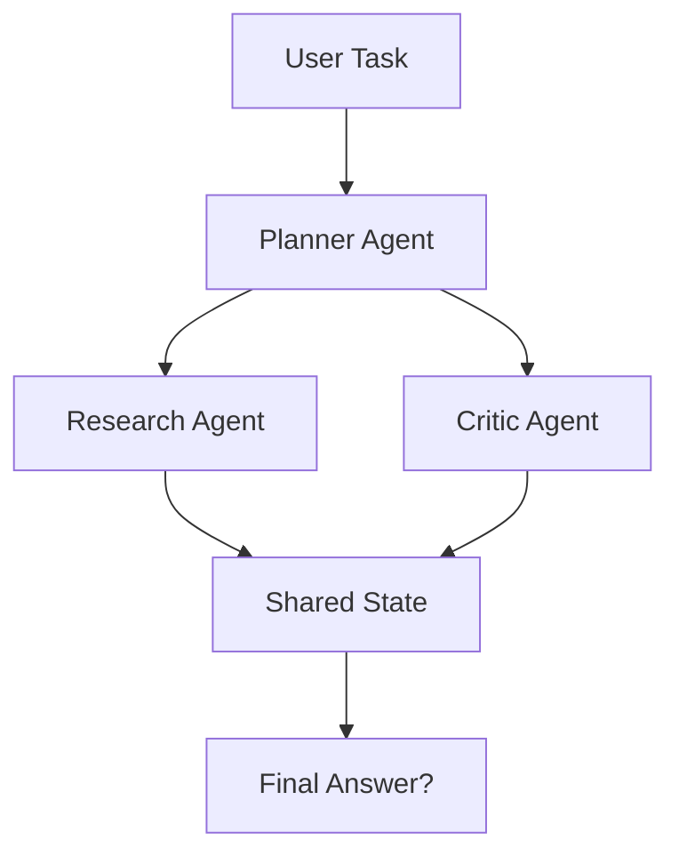
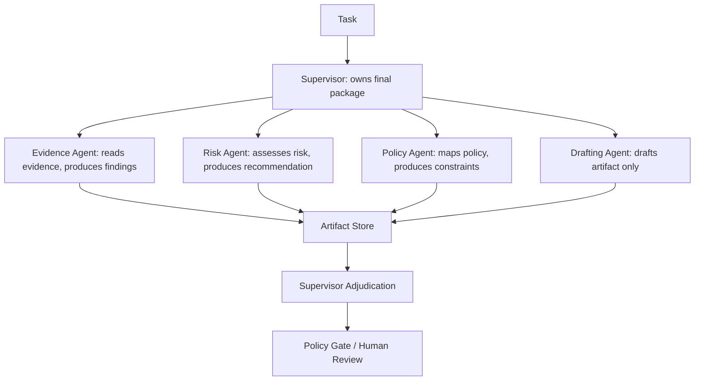
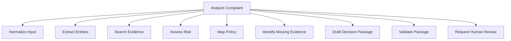
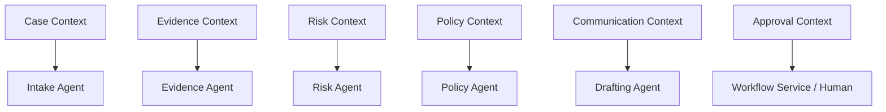
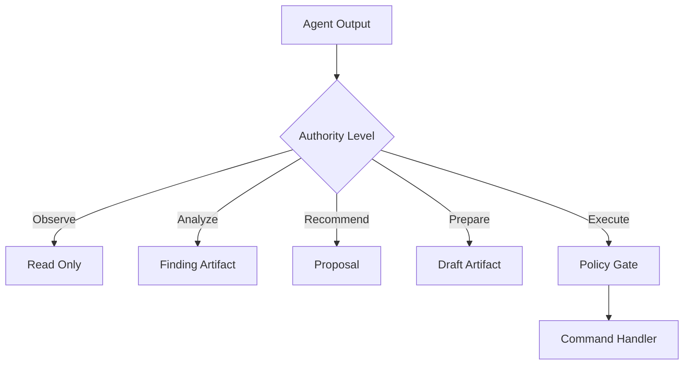
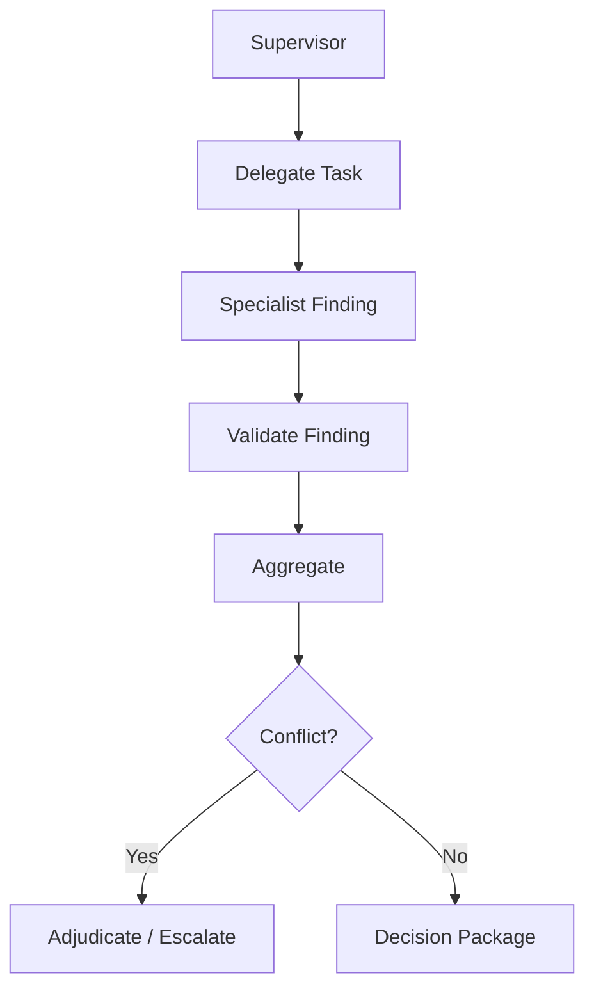
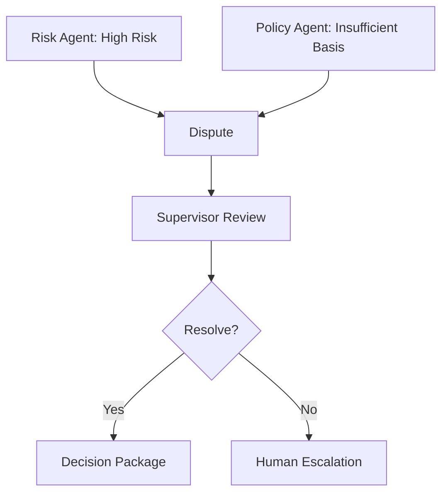
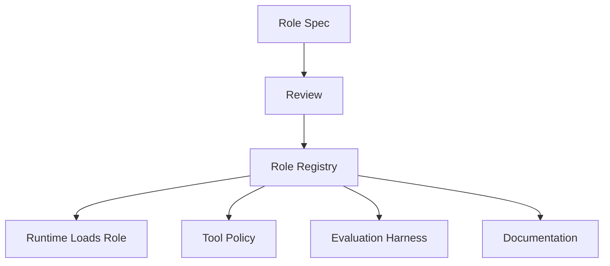
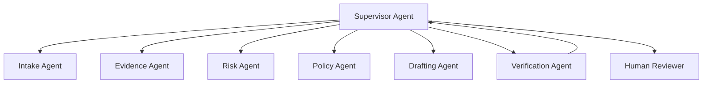

# Part 015 — Agent Roles and Responsibility Modeling

> A multi-agent system does not become better because it has more agents.
>
> It becomes better when each agent has a clear responsibility, bounded authority, explicit tools, observable outputs, and a known escalation path.

Many agent systems fail because the designer creates agents as personalities:

- “researcher”
- “planner”
- “critic”
- “executor”
- “manager”
- “analyst”
- “reviewer”

These names sound useful, but they are incomplete.

An enterprise-grade multi-agent system needs more than names. It needs **responsibility modeling**.

This part teaches how to design agent roles like production system components, not like characters in a role-play prompt.

---

## 1. Kaufman Framing

Using Kaufman's learning method, we deconstruct this skill into smaller capabilities:

1. define the work to be done;
2. identify decision rights;
3. split responsibilities by bounded context;
4. assign authority levels;
5. bind tools to responsibilities;
6. define output contracts;
7. define escalation paths;
8. define failure ownership;
9. define observability and audit requirements;
10. test whether the role design is coherent.

### Target Performance

By the end of this part, you should be able to:

- distinguish role, responsibility, capability, authority, and accountability;
- design an agent role charter;
- create a responsibility matrix for a multi-agent system;
- avoid overlapping or ambiguous agent ownership;
- assign tools using least privilege;
- define agent escalation rules;
- design role-specific output contracts;
- model multi-agent collaboration using RACI-like thinking;
- identify weak agent role designs before they become production incidents.

---

# 2. Why Role Modeling Matters

Without role modeling:



Questions remain unclear:

- Who owns the final answer?
- Who can call tools?
- Who can mutate state?
- Who validates evidence?
- Who escalates?
- Who stops the loop?
- Who is accountable if output is wrong?
- Which agent is allowed to disagree?
- Which output becomes authoritative?

With responsibility modeling:



Each agent has a bounded job.

---

# 3. Core Vocabulary

| Concept | Meaning |
|---|---|
| Role | named position in the system |
| Responsibility | work the role must perform |
| Capability | what the role can technically do |
| Authority | what the role is allowed to decide |
| Accountability | who/what owns the consequence |
| Tool grant | allowed tool with mode and limits |
| Output contract | typed result the role must produce |
| Escalation path | where unresolved issues go |
| Boundary | what the role must not do |

These are different.

A role may have a capability but lack authority.

Example:

- drafting agent may technically generate a notice;
- it does not have authority to send the notice.

---

# 4. Role Is Not Personality

Bad role definition:

```text
You are a smart compliance expert.
Do your best.
Be careful.
```

Better role definition:

```text
Role: Regulatory Policy Mapping Agent
Responsibility: Map case facts to relevant policy categories.
Authority: May recommend policy category; may not update case status.
Tools: read-only policy search, read-only case evidence search.
Output: PolicyMappingOutput v1.
Escalation: escalate if policy conflict or confidence < 0.7.
```

The second version is operable.

---

# 5. Agent Role Charter

An agent role charter documents the role.

```python
from enum import Enum
from pydantic import BaseModel, Field


class AuthorityLevel(str, Enum):
    OBSERVE = "observe"
    ANALYZE = "analyze"
    RECOMMEND = "recommend"
    PREPARE = "prepare"
    EXECUTE_REVERSIBLE = "execute_reversible"
    EXECUTE_HIGH_IMPACT = "execute_high_impact"


class ToolMode(str, Enum):
    READ = "read"
    DRAFT = "draft"
    WRITE = "write"
    EXECUTE = "execute"


class ToolGrant(BaseModel):
    tool_name: str
    mode: ToolMode
    max_calls: int = Field(ge=0)
    requires_approval: bool


class AgentRoleCharter(BaseModel):
    role_name: str
    purpose: str
    responsibilities: list[str]
    non_responsibilities: list[str]
    authority_level: AuthorityLevel
    allowed_tools: list[ToolGrant]
    output_contracts: list[str]
    escalation_conditions: list[str]
    owner_team: str
```

A charter is useful because it forces explicit choices.

---

# 6. Example Role Charter

```python
risk_agent_charter = AgentRoleCharter(
    role_name="risk-assessment-agent",
    purpose="Assess risk level for a regulatory case using approved evidence.",
    responsibilities=[
        "Review evidence references provided by supervisor.",
        "Identify severity indicators.",
        "Produce risk assessment with confidence and evidence refs.",
        "List missing evidence or uncertainty.",
    ],
    non_responsibilities=[
        "Do not update case status.",
        "Do not send external notices.",
        "Do not approve enforcement action.",
        "Do not invent evidence references.",
    ],
    authority_level=AuthorityLevel.RECOMMEND,
    allowed_tools=[
        ToolGrant(
            tool_name="case_evidence_search",
            mode=ToolMode.READ,
            max_calls=5,
            requires_approval=False,
        ),
        ToolGrant(
            tool_name="policy_threshold_lookup",
            mode=ToolMode.READ,
            max_calls=3,
            requires_approval=False,
        ),
    ],
    output_contracts=["RiskAssessmentOutput.v1"],
    escalation_conditions=[
        "confidence < 0.7",
        "conflicting evidence",
        "missing required evidence",
        "risk appears critical",
    ],
    owner_team="case-intelligence-platform",
)
```

This role is narrow, testable, and governable.

---

# 7. Responsibility Decomposition

Start from work, not from agents.

Example business task:

> Analyze a regulatory complaint and prepare a decision package.

Decompose work:



Then decide which work needs an agent.

| Work | Agent Needed? | Why |
|---|---:|---|
| normalize structured input | maybe no | deterministic parser may suffice |
| extract entities | maybe | ambiguous documents |
| search evidence | maybe | query formulation useful |
| assess risk | yes | judgment and synthesis |
| map policy | yes | interpretation |
| identify missing evidence | yes | reasoning |
| draft package | yes | language generation |
| validate schema | no | deterministic |
| request human review | no | workflow command |

Do not create an agent for every box automatically.

---

# 8. Bounded Context Thinking

Agent roles should map to bounded contexts.

A bounded context is a conceptual boundary where terms and rules have specific meaning.

Examples:

- case intake;
- evidence management;
- risk assessment;
- policy mapping;
- customer communication;
- approval workflow;
- audit and compliance;
- notification delivery.



The benefit:

- clearer language;
- clearer tools;
- clearer authority;
- clearer ownership;
- clearer tests.

---

# 9. Decision Rights Matrix

A decision rights matrix defines who can decide what.

| Decision | Evidence Agent | Risk Agent | Policy Agent | Drafting Agent | Supervisor | Human |
|---|---:|---:|---:|---:|---:|---:|
| Search evidence | yes | limited | limited | no | yes | yes |
| Mark evidence authoritative | no | no | no | no | no | yes/service |
| Assign risk recommendation | no | yes | no | no | review | approve if required |
| Assign final risk field | no | no | no | no | propose | approve/service |
| Map policy category | no | no | yes | no | review | approve if required |
| Draft notice | no | no | no | yes | review | approve |
| Send notice | no | no | no | no | no | yes/service |
| Close case | no | no | no | no | propose | yes/service |

This prevents accidental authority escalation.

---

# 10. RACI for Agents

RACI is a responsibility assignment model:

- **Responsible**: does the work;
- **Accountable**: owns the outcome;
- **Consulted**: provides input;
- **Informed**: receives updates.

For agent systems, adapt it carefully.

| Task | Responsible | Accountable | Consulted | Informed |
|---|---|---|---|---|
| produce evidence summary | evidence agent | supervisor | policy/risk agents | human reviewer |
| assess risk | risk agent | supervisor | evidence/policy agents | human reviewer |
| approve notice | human reviewer | business owner | supervisor package | audit service |
| send notice | notification service | business owner | approval service | case service |

Agents can be responsible for analysis. They are rarely accountable for high-impact outcomes.

---

# 11. Authority Boundaries

Authority should be explicit.



## Authority Levels

| Level | Meaning |
|---|---|
| observe | may read allowed context |
| analyze | may produce findings |
| recommend | may propose action |
| prepare | may create draft artifacts |
| execute reversible | may execute safe reversible action |
| execute high-impact | requires strict policy/human control |

Most enterprise agents should live in analyze/recommend/prepare.

---

# 12. Capability Scope

Capability scope answers:

> What can this agent technically do?

Authority answers:

> What is this agent allowed to decide?

These are not the same.

```python
class CapabilityScope(BaseModel):
    can_read_state: list[str]
    can_write_state: list[str]
    can_create_artifacts: list[str]
    can_call_tools: list[str]
    can_request_human_review: bool
    can_trigger_side_effects: bool
```

Example:

```python
drafting_agent_scope = CapabilityScope(
    can_read_state=["case_summary", "risk_assessment", "policy_mapping"],
    can_write_state=[],
    can_create_artifacts=["notice_draft", "analyst_brief"],
    can_call_tools=["template_lookup"],
    can_request_human_review=False,
    can_trigger_side_effects=False,
)
```

Even if the agent can draft, it cannot send.

---

# 13. Tool Assignment

Assign tools by responsibility.

Bad:

```text
All agents can use all tools.
```

Better:

| Agent | Tools |
|---|---|
| evidence agent | `search_case_evidence`, `fetch_document_excerpt` |
| risk agent | `search_case_evidence`, `risk_threshold_lookup` |
| policy agent | `policy_search`, `policy_version_lookup` |
| drafting agent | `template_lookup`, `create_draft_artifact` |
| supervisor | `read_findings`, `request_human_review` |

## Tool Grant Rules

1. Grant read tools more freely than write tools.
2. Grant side-effect tools rarely.
3. Bind tool access to role, run, tenant, and risk.
4. Enforce tool policy outside prompts.
5. Record every tool call.
6. Use tool contracts with effect classification.

---

# 14. Output Ownership

Each agent should own a specific output contract.

| Agent | Output |
|---|---|
| evidence agent | `EvidenceSummaryOutput` |
| risk agent | `RiskAssessmentOutput` |
| policy agent | `PolicyMappingOutput` |
| drafting agent | `NoticeDraftOutput` |
| supervisor | `DecisionPackage` |
| critic/verifier | `VerificationReport` |

If two agents produce the same output type, define whether they are alternatives, reviewers, or redundant validators.

Ambiguous output ownership creates conflict.

---

# 15. Agent Role Specification

A complete role spec:

```python
class AgentRoleSpec(BaseModel):
    role_name: str
    version: str
    purpose: str
    bounded_context: str
    responsibilities: list[str]
    non_responsibilities: list[str]
    input_contracts: list[str]
    output_contracts: list[str]
    authority_level: AuthorityLevel
    capability_scope: CapabilityScope
    allowed_tools: list[ToolGrant]
    escalation_conditions: list[str]
    failure_modes: list[str]
    owner_team: str
```

This can live in configuration, registry, or control plane.

---

# 16. Supervisor as Integrator

A supervisor is not just “the boss agent.”

The supervisor owns integration.

Responsibilities:

- decompose task;
- assign specialist tasks;
- manage budgets;
- aggregate findings;
- detect conflicts;
- request clarification;
- decide whether to escalate;
- produce final decision package;
- avoid duplicate specialist work.

Non-responsibilities:

- perform every specialist analysis itself;
- bypass policy gates;
- mutate high-impact domain state directly;
- hide uncertainty;
- silently ignore conflicts.



---

# 17. Specialist Agents

A specialist agent should be narrow.

Good specialist traits:

- specific domain;
- specific tools;
- specific output;
- limited authority;
- clear escalation;
- measurable quality.

Bad specialist traits:

- broad purpose;
- overlapping responsibility;
- vague output;
- unbounded tools;
- no stop condition;
- no owner.

## Specialist Design Rule

> A specialist should be replaceable by a deterministic service, another model, or a human without changing the rest of the architecture too much.

That means the boundary matters.

---

# 18. Critic, Reviewer, Verifier, Judge

These are often confused.

| Role | Purpose |
|---|---|
| critic | find weaknesses and alternatives |
| reviewer | assess output against criteria |
| verifier | check factual/contract/evidence correctness |
| judge | score or choose between outputs |
| validator | deterministic schema/business rule check |
| adjudicator | resolve conflicts and decide path |

Do not call everything a critic.

In enterprise systems, deterministic validators and evidence verifiers are often more important than generic critics.

---

# 19. Escalation Modeling

Every role needs escalation conditions.

```python
class EscalationRule(BaseModel):
    condition: str
    target: str
    severity: str
    required_context: list[str]
```

Examples:

| Condition | Escalate To |
|---|---|
| confidence below threshold | supervisor |
| missing required evidence | human analyst |
| policy conflict | policy specialist/human |
| high-risk side effect | approval workflow |
| tool access denied | supervisor/runtime |
| repeated validation failure | ops/human |
| suspected prompt injection | security workflow |

Escalation should be a typed runtime event, not a vague message.

---

# 20. Conflict Modeling

Agents can disagree.

Do not hide disagreements.

```python
class AgentDispute(BaseModel):
    dispute_id: str
    run_id: str
    subject: str
    agent_a: str
    agent_b: str
    disagreement_summary: str
    evidence_refs: list[str]
    proposed_resolution: str | None = None
```

Conflict flow:



A disagreement is valuable information.

---

# 21. Accountability Model

Accountability cannot be assigned to an LLM in the organizational sense.

For high-impact systems:

| Layer | Accountable Owner |
|---|---|
| model behavior | platform/model owner |
| prompt/role config | agent platform owner |
| domain policy | business/policy owner |
| final decision | authorized human/service owner |
| runtime reliability | platform engineering |
| data quality | data owner |
| security boundary | security/platform owner |

An agent can be the actor in telemetry. A human/team/system must own accountability.

---

# 22. Role Registry

A role registry stores approved agent role specifications.



Benefits:

- versioned roles;
- reviewable changes;
- controlled tool grants;
- evaluation by role;
- easier audit;
- rollout/rollback.

## Role Versioning

Changing any of these should version the role:

- purpose;
- authority level;
- tool grants;
- output contract;
- escalation condition;
- model route;
- prompt template;
- policy constraints.

---

# 23. Role Evaluation

Evaluate each role separately.

| Role | Evaluation Focus |
|---|---|
| evidence agent | source coverage, hallucinated refs, relevance |
| risk agent | risk calibration, evidence quality, uncertainty |
| policy agent | policy mapping correctness |
| drafting agent | clarity, factuality, tone, completeness |
| supervisor | delegation quality, conflict handling, stop behavior |
| verifier | false positives/negatives |
| router | routing accuracy/confidence |

Do not evaluate the whole system only through final answer quality. That hides weak roles.

---

# 24. Example: Enforcement Case Role Model



## Roles

| Agent | Responsibility | Authority |
|---|---|---|
| intake | normalize complaint, detect missing fields | analyze |
| evidence | search and summarize evidence | analyze |
| risk | recommend severity | recommend |
| policy | map facts to policy categories | recommend |
| drafting | create decision package/draft notice | prepare |
| verification | verify evidence refs and contract compliance | analyze |
| supervisor | integrate findings and decide escalation | recommend/prepare |
| human | approve high-impact action | approve |

This is safer than one giant “case agent.”

---

# 25. Anti-Patterns

## Anti-Pattern 1 — Agent Theater

Creating many agents with no real separation of responsibility.

```text
Researcher, Analyst, Thinker, Reviewer, Expert, Manager
```

If they share the same tools, context, prompt style, and output, they may not add much.

## Anti-Pattern 2 — Overlapping Authority

Two agents can both decide final risk.

Result: conflict or silent overwrite.

## Anti-Pattern 3 — All Tools Everywhere

Every agent can call every tool.

Result: least-privilege failure.

## Anti-Pattern 4 — No Escalation

Agent keeps trying even when uncertain.

Result: hallucinated confidence.

## Anti-Pattern 5 — Human as Afterthought

Human sees final answer but not evidence, uncertainty, or policy basis.

Result: weak review.

## Anti-Pattern 6 — Supervisor Bottleneck

Supervisor performs all work and delegates only cosmetically.

Result: slow and expensive system.

---

# 26. Role Design Heuristics

## Heuristic 1 — Split by Responsibility, Not by Persona

Do not create “smart agents.” Create bounded responsibilities.

## Heuristic 2 — Separate Analysis from Authority

Analysis agents produce findings. Authority lives in workflow, policy, and humans.

## Heuristic 3 — Give Each Agent One Primary Output

If an agent produces everything, it owns nothing clearly.

## Heuristic 4 — Prefer Fewer Agents First

Start with the smallest role set that gives real separation.

## Heuristic 5 — Make Escalation Cheap

A good agent knows when to stop.

## Heuristic 6 — Evaluate Roles Independently

If you cannot evaluate a role, you probably have not defined it well.

---

# 27. Production Checklist

Before adding an agent role:

- [ ] what work does it own?
- [ ] what work does it explicitly not own?
- [ ] what output contract does it produce?
- [ ] what tools does it need?
- [ ] what tools are forbidden?
- [ ] what state can it read?
- [ ] what state can it mutate, if any?
- [ ] what authority level does it have?
- [ ] what are its stop conditions?
- [ ] where does it escalate?
- [ ] who owns the role config?
- [ ] how is the role evaluated?
- [ ] what telemetry identifies its behavior?
- [ ] what failure modes are expected?
- [ ] what happens if it disagrees with another agent?
- [ ] how is the role versioned?

---

# 28. Practice Drill

Design a role model for an enterprise case-management multi-agent system.

Requirements:

- complaint intake;
- evidence search;
- risk analysis;
- policy mapping;
- missing evidence detection;
- decision package drafting;
- high-risk human approval;
- external notice sending;
- full audit trail.

Deliverables:

1. role inventory;
2. role charter for each agent;
3. responsibility matrix;
4. decision rights matrix;
5. tool grants;
6. output contracts;
7. escalation conditions;
8. conflict model;
9. role evaluation criteria;
10. anti-pattern review.

---

# 29. What Top 1% Engineers Pay Attention To

Top engineers ask:

- Why does this role exist?
- What output does it own?
- What authority does it have?
- What tools does it really need?
- What can it never do?
- What happens when it is uncertain?
- What happens when it conflicts with another role?
- Who owns its prompt/config?
- How is it evaluated?
- How does it fail safely?
- Can we remove this agent and simplify the system?
- Does this role map to a real bounded context?
- Does this role improve correctness or just make the demo look agentic?

They avoid both extremes: one giant magical agent and dozens of decorative agents.

---

# 30. Summary

In this part, we covered:

- role vs responsibility vs authority;
- agent role charters;
- bounded context thinking;
- decision rights;
- RACI-style modeling;
- capability scope;
- tool assignment;
- output ownership;
- supervisor and specialist responsibilities;
- critic/reviewer/verifier/judge distinction;
- escalation and conflict modeling;
- accountability;
- role registry;
- role evaluation;
- enforcement case role model;
- anti-patterns;
- production checklist.

The key principle:

> An agent role is a production responsibility boundary, not a personality prompt.

The next part focuses on one of the most famous and overused collaboration patterns: **Planner–Executor–Critic**.

---

## References

- Enterprise architecture responsibility assignment patterns such as RACI.
- Domain-driven design bounded context thinking.
- Least privilege and separation-of-duty principles.
- Multi-agent orchestration patterns used in modern agent frameworks.
