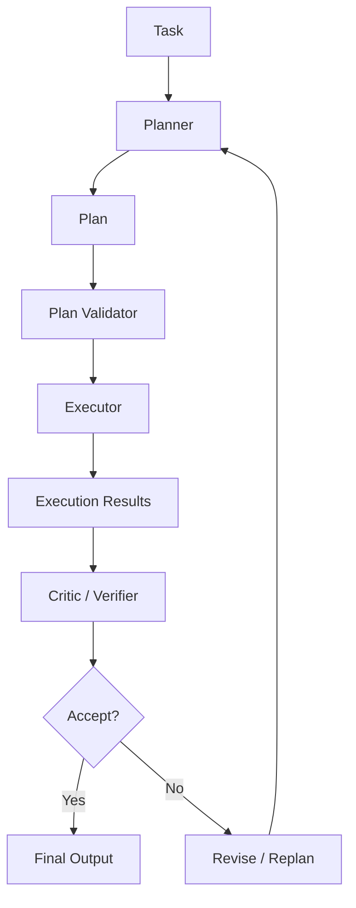
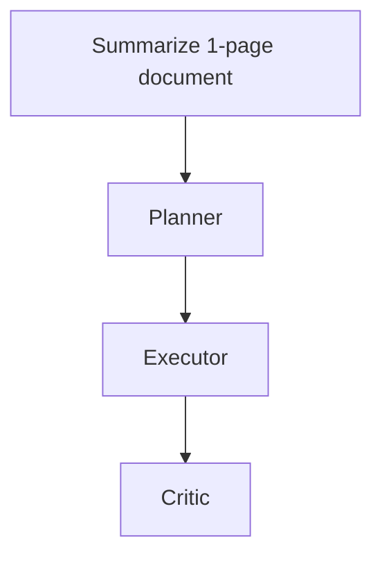
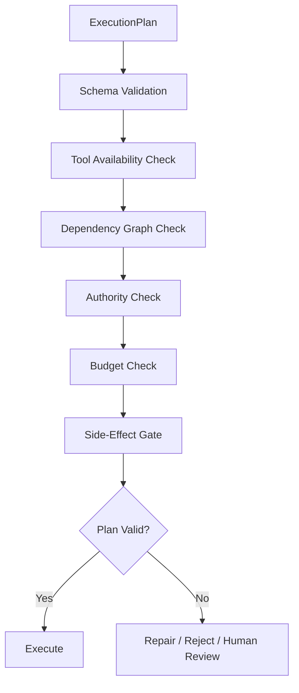
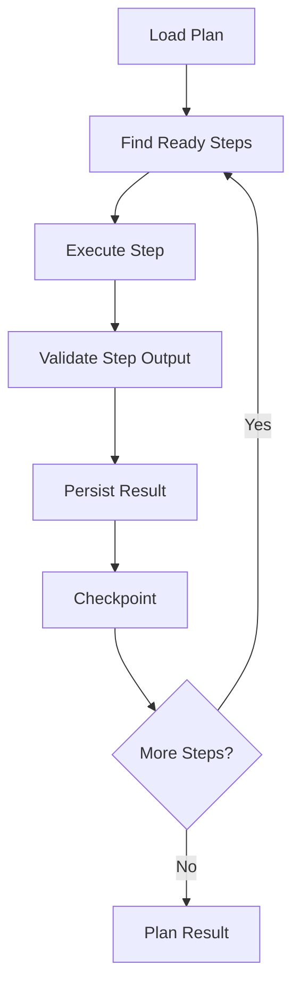
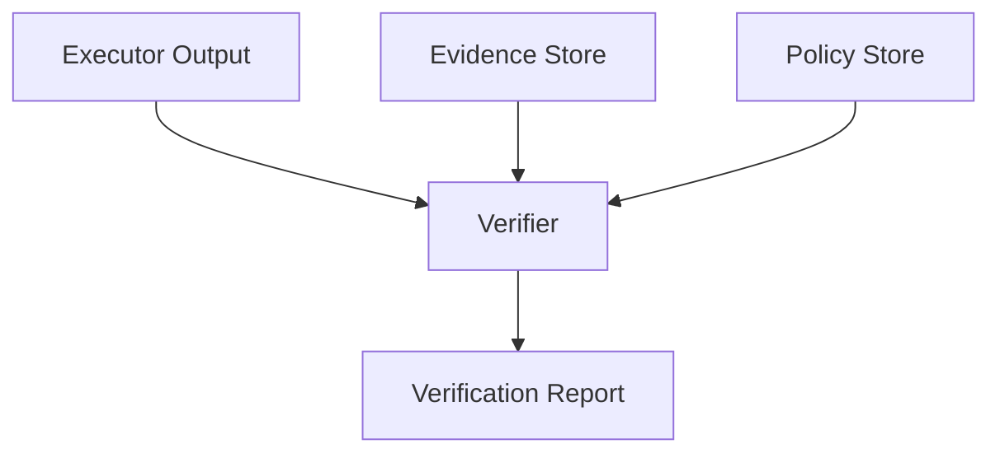
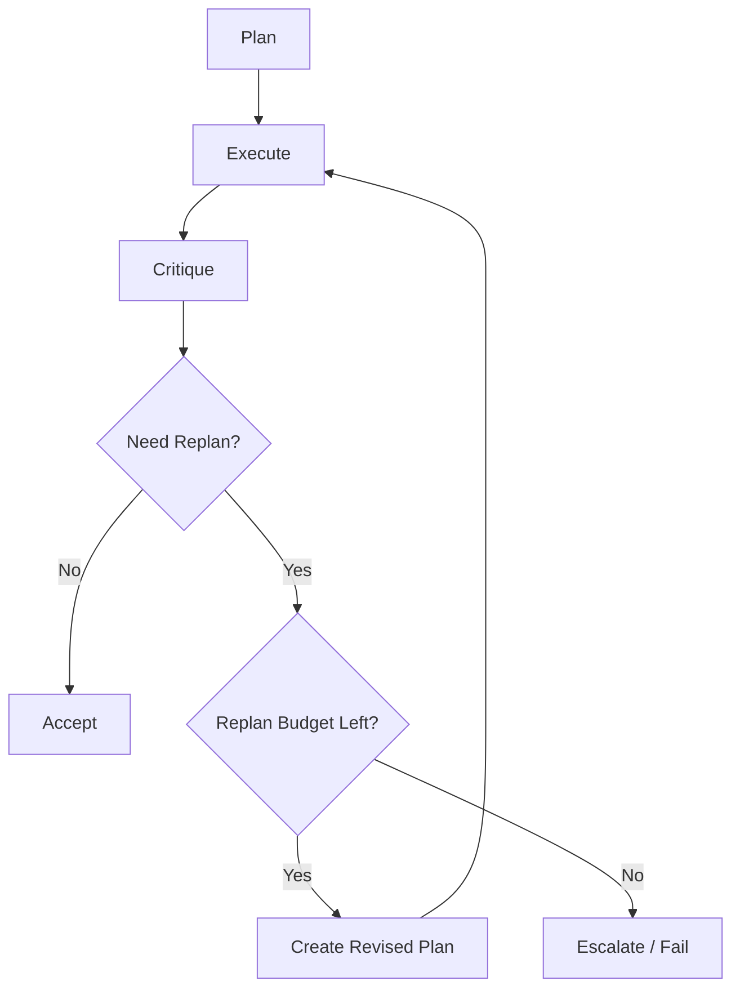
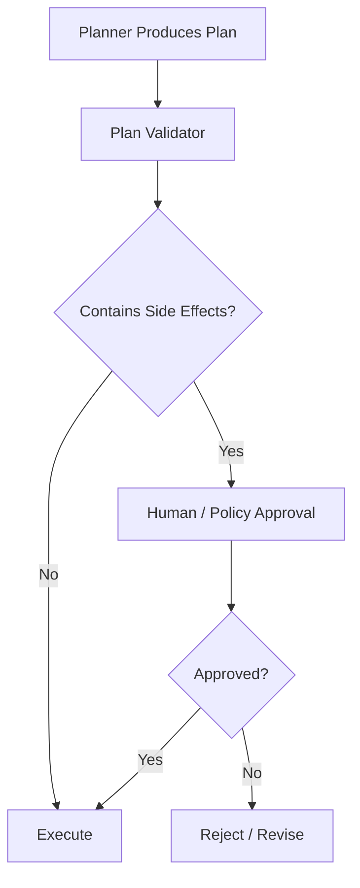
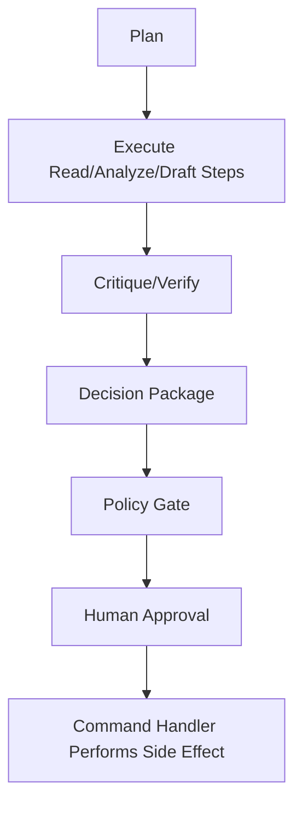
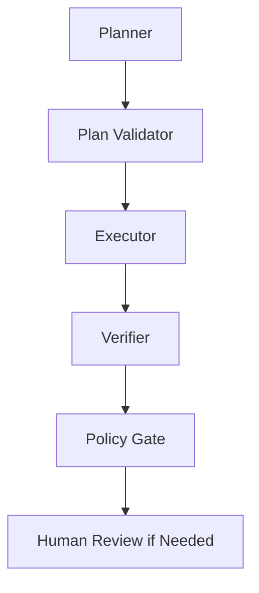

# Part 016 — Planner–Executor–Critic Pattern

> Planner–Executor–Critic is useful.
>
> It is also one of the most overused and misunderstood patterns in agentic AI.

The pattern sounds intuitive:

1. a planner creates a plan;
2. an executor performs the plan;
3. a critic reviews the result.

This can improve structure and quality. But in enterprise systems, it can also create:

- unnecessary cost;
- recursive loops;
- fake review;
- unclear authority;
- brittle plans;
- hidden side effects;
- planner hallucination;
- critic hallucination;
- overconfidence from self-review.

This part explains how to use Planner–Executor–Critic responsibly.

---

## 1. Kaufman Framing

The sub-skill is:

> Decide when planning, execution, and critique should be separated, and implement the separation with typed contracts, budgets, and stop conditions.

This decomposes into:

1. identify whether planning is needed;
2. define plan schema;
3. bind plan steps to allowed actions;
4. validate plan before execution;
5. execute steps with checkpoints;
6. verify results using evidence and contracts;
7. replan only under explicit conditions;
8. prevent infinite critique/retry loops;
9. separate critic from validator;
10. keep authority outside the agent loop.

### Target Performance

By the end of this part, you should be able to:

- explain when Planner–Executor–Critic is useful;
- identify when it is overkill;
- model plans as typed artifacts;
- design executor step contracts;
- distinguish critic, verifier, validator, and judge;
- implement replanning safely;
- define stop conditions;
- prevent side effects before approval;
- evaluate the pattern in production.

---

# 2. The Basic Pattern



The enterprise version adds:

- typed plan;
- plan validation;
- authority boundaries;
- tool policy;
- checkpoints;
- execution result artifacts;
- critic output contract;
- retry budget;
- human review if needed.

---

# 3. When the Pattern Is Useful

Use Planner–Executor–Critic when:

- task has multiple dependent steps;
- task requires decomposition;
- execution involves multiple tools;
- quality requires review;
- errors are costly but recoverable;
- plan can be validated before execution;
- side effects can be delayed until approval;
- execution results can be verified.

Examples:

- complex case analysis;
- incident investigation;
- software migration plan;
- document review workflow;
- research synthesis;
- regulatory decision package preparation;
- multi-step data cleanup with approval.

---

# 4. When the Pattern Is Overkill

Do not use it when:

- task is simple;
- deterministic workflow already exists;
- a single tool call solves it;
- latency matters more than planning;
- output is low risk;
- plan cannot be meaningfully validated;
- critic has no independent evidence;
- planner and critic see identical context and add no value.

Example overkill:



A direct summarizer with validation may be better.

---

# 5. Planner Responsibilities

The planner should:

- understand objective;
- decompose work into steps;
- identify dependencies;
- define required evidence/tools;
- mark side-effecting steps;
- estimate risk;
- define stop conditions;
- identify human approval points;
- produce a typed plan.

The planner should not:

- execute tools directly;
- mutate domain state;
- approve its own plan;
- hide uncertainty;
- create unbounded steps;
- invent unavailable tools.

## Planner Output Contract

```python
from enum import Enum
from pydantic import BaseModel, Field


class StepEffect(str, Enum):
    READ = "read"
    ANALYZE = "analyze"
    DRAFT = "draft"
    MUTATE_INTERNAL = "mutate_internal"
    NOTIFY_EXTERNAL = "notify_external"


class PlanStep(BaseModel):
    step_id: str
    title: str
    objective: str
    required_inputs: list[str] = Field(default_factory=list)
    allowed_tools: list[str] = Field(default_factory=list)
    effect: StepEffect
    expected_output_contract: str
    depends_on: list[str] = Field(default_factory=list)
    max_attempts: int = Field(default=1, ge=1)
    requires_human_approval: bool = False


class ExecutionPlan(BaseModel):
    plan_id: str
    run_id: str
    objective: str
    assumptions: list[str] = Field(default_factory=list)
    steps: list[PlanStep]
    stop_conditions: list[str]
    risk_notes: list[str] = Field(default_factory=list)
```

A plan is not a paragraph. It is a structured artifact.

---

# 6. Plan Validation

Before execution, validate the plan.



## Plan Validation Rules

1. Every step has a unique ID.
2. Dependencies reference existing steps.
3. Dependency graph is acyclic unless loops are explicitly modeled.
4. Tools exist and are allowed.
5. Side-effecting steps require policy gates.
6. Expected output contracts exist.
7. Max attempts are bounded.
8. Plan fits runtime budget.
9. Human approval points are explicit.
10. No step says “do whatever is necessary.”

## Python Validator Sketch

```python
def validate_plan(plan: ExecutionPlan, allowed_tools: set[str]) -> list[str]:
    errors: list[str] = []

    step_ids = {step.step_id for step in plan.steps}
    if len(step_ids) != len(plan.steps):
        errors.append("Duplicate step IDs.")

    for step in plan.steps:
        for dep in step.depends_on:
            if dep not in step_ids:
                errors.append(f"Step {step.step_id} depends on unknown step {dep}.")

        for tool in step.allowed_tools:
            if tool not in allowed_tools:
                errors.append(f"Step {step.step_id} uses unavailable tool {tool}.")

        if step.effect in {StepEffect.MUTATE_INTERNAL, StepEffect.NOTIFY_EXTERNAL}:
            if not step.requires_human_approval:
                errors.append(f"Side-effecting step {step.step_id} requires approval.")

    return errors
```

In production, use stronger graph validation and policy checks.

---

# 7. Executor Responsibilities

The executor performs approved plan steps.

The executor should:

- execute one step at a time or bounded parallel steps;
- respect dependencies;
- call only allowed tools;
- validate outputs;
- checkpoint after each step;
- record attempts;
- return structured execution results;
- stop when policy/budget/deadline fails.

The executor should not:

- silently change the plan;
- invent new tools;
- bypass approval;
- retry unboundedly;
- mutate state outside command handlers.

## Execution Result

```python
class StepStatus(str, Enum):
    PENDING = "pending"
    RUNNING = "running"
    SUCCEEDED = "succeeded"
    FAILED = "failed"
    SKIPPED = "skipped"
    REQUIRES_APPROVAL = "requires_approval"


class StepExecutionResult(BaseModel):
    step_id: str
    status: StepStatus
    output_ref: str | None = None
    error_type: str | None = None
    error_message: str | None = None
    attempts: int = 0


class PlanExecutionResult(BaseModel):
    plan_id: str
    run_id: str
    step_results: list[StepExecutionResult]
    completed: bool
```

---

# 8. Executor Flow



## Step Execution Pseudocode

```python
async def execute_plan(plan: ExecutionPlan) -> PlanExecutionResult:
    results: dict[str, StepExecutionResult] = {}

    while len(results) < len(plan.steps):
        ready_steps = [
            step
            for step in plan.steps
            if step.step_id not in results
            and all(dep in results and results[dep].status == StepStatus.SUCCEEDED for dep in step.depends_on)
        ]

        if not ready_steps:
            break

        for step in ready_steps:
            result = await execute_step(step)
            results[step.step_id] = result
            await checkpoint_step_result(plan.run_id, result)

            if result.status == StepStatus.FAILED:
                return PlanExecutionResult(
                    plan_id=plan.plan_id,
                    run_id=plan.run_id,
                    step_results=list(results.values()),
                    completed=False,
                )

    return PlanExecutionResult(
        plan_id=plan.plan_id,
        run_id=plan.run_id,
        step_results=list(results.values()),
        completed=len(results) == len(plan.steps),
    )
```

This is simplified, but it shows the control structure.

---

# 9. Critic Responsibilities

A critic reviews output quality.

The critic should:

- identify missing work;
- identify contradictions;
- identify weak evidence;
- identify unclear assumptions;
- identify policy concerns;
- recommend accept/revise/escalate;
- produce structured critique.

The critic should not:

- act as deterministic validator;
- approve high-impact actions alone;
- endlessly nitpick;
- invent requirements;
- rewrite the whole output without trace;
- bypass evidence.

## Critique Contract

```python
class CritiqueDecision(str, Enum):
    ACCEPT = "accept"
    REVISE = "revise"
    ESCALATE = "escalate"
    REJECT = "reject"


class CritiqueFinding(BaseModel):
    finding_type: str
    severity: str
    description: str
    evidence_refs: list[str] = Field(default_factory=list)
    suggested_fix: str | None = None


class CritiqueReport(BaseModel):
    report_id: str
    plan_id: str
    run_id: str
    decision: CritiqueDecision
    findings: list[CritiqueFinding]
    confidence: float = Field(ge=0.0, le=1.0)
```

A critique must be bounded.

---

# 10. Critic vs Validator vs Verifier vs Judge

These roles are different.

| Role | Function | Usually LLM? |
|---|---|---:|
| validator | check schema/rules | no |
| verifier | check evidence/factual claims | sometimes |
| critic | identify quality issues | yes/sometimes |
| judge | score or choose between candidates | yes/sometimes |
| policy gate | enforce authority/policy | no |
| human reviewer | accountability/approval | human |

## Example

For a notice draft:

- validator checks required fields;
- verifier checks evidence refs exist;
- critic checks clarity and completeness;
- policy gate checks approval requirement;
- human approves external sending.

Do not outsource all of these to one “critic agent.”

---

# 11. Verification Should Use Independent Evidence

A critic that sees only the executor's answer may rubber-stamp hallucinations.

Better:



Verifier should check:

- cited evidence exists;
- evidence supports claim;
- policy references exist;
- output follows contract;
- unsupported claims are flagged.

---

# 12. Replanning

Replanning is useful when execution reveals new information.

But replanning must be bounded.



## Replanning Conditions

Allow replanning when:

- tool result invalidates assumption;
- required evidence missing;
- dependency fails;
- policy condition changes;
- human requests revision;
- critic finds blocking issue.

Do not replan just because the model can think of another approach.

## Replan Budget

```python
class ReplanPolicy(BaseModel):
    max_replans: int = Field(ge=0)
    allowed_reasons: list[str]
    require_human_after_replans: int
```

---

# 13. Planning Horizon

The planner should not always plan everything upfront.

| Horizon | Use |
|---|---|
| short-horizon | dynamic/uncertain tasks |
| full-horizon | stable multi-step workflow |
| rolling plan | investigation/research |
| hierarchical plan | complex enterprise workflow |

## Rolling Plan


Rolling plans reduce hallucinated long plans.

Useful when the agent does not yet know enough.

---

# 14. Plan as Artifact

Plans should be stored.

```python
class PlanArtifact(BaseModel):
    artifact_id: str
    artifact_type: str = "execution_plan"
    plan: ExecutionPlan
    created_by: str
    created_at: str
    approved_by: str | None = None
```

Why store plans?

- audit;
- replay;
- debugging;
- comparison;
- evaluation;
- human review;
- incident investigation.

Do not let plans exist only inside prompt context.

---

# 15. Plan Approval

High-impact plans require approval before execution.



A plan that includes “send notice” or “update case status” should not be executed just because it is well-structured.

---

# 16. Side Effects in Planner–Executor

The safest pattern:



Agents plan and prepare. Authoritative services commit.

---

# 17. Planner Failure Modes

| Failure | Description | Mitigation |
|---|---|---|
| hallucinated tool | plan references unavailable tool | tool registry validation |
| vague step | step not executable | step contract |
| overlong plan | too many steps | budget and horizon limit |
| unsafe side effect | plan includes high-impact action | policy gate |
| wrong dependency | invalid order | DAG validation |
| hidden assumption | assumption not listed | assumption field required |
| planner overconfidence | no uncertainty | risk notes/confidence |
| stale context | plan based on old state | state version refs |

---

# 18. Executor Failure Modes

| Failure | Description | Mitigation |
|---|---|---|
| plan drift | executor changes plan silently | require plan amendment |
| tool overuse | executor calls extra tools | tool call budget |
| duplicate side effect | retry unsafe step | idempotency |
| partial execution | crash mid-plan | checkpoints |
| dependency skip | executes without prerequisite | dependency enforcement |
| invalid output | unvalidated step result | output contracts |
| hidden failure | result marked success incorrectly | verifier/tests |
| no cancellation | long-running step hangs | deadline/cancellation |

---

# 19. Critic Failure Modes

| Failure | Description | Mitigation |
|---|---|---|
| rubber stamp | accepts weak output | independent evidence |
| excessive nitpicking | endless revisions | critique budget |
| hallucinated critique | flags nonexistent issue | evidence refs |
| authority confusion | critic approves action | separate policy gate |
| bias toward complexity | always asks for more | severity threshold |
| same-context blindness | sees same flawed context | independent retrieval |
| no measurable rubric | subjective review | rubric/output contract |

---

# 20. Self-Critique Trap

A common pattern:

```text
Generate answer.
Now critique your answer.
Now improve it.
```

This can help for low-risk writing quality. But it is weak for enterprise correctness.

Why?

- same model may share same blind spots;
- critique may be performative;
- no independent evidence;
- no deterministic validation;
- no policy enforcement;
- no audit boundary.

Use self-critique as a local quality step, not as a control.

---

# 21. Planner–Executor–Verifier Variant

For enterprise systems, prefer:



The verifier checks facts, evidence, and contracts.

The critic can still comment on quality, but verification is more important.

---

# 22. Evaluation Strategy

Evaluate each stage.

| Stage | Evaluation |
|---|---|
| planner | plan completeness, tool validity, dependency correctness |
| executor | step success, tool correctness, budget compliance |
| verifier | false positive/negative, evidence coverage |
| critic | useful findings, low noise |
| replanner | improved outcome, no loop |
| full pattern | task success, cost, latency, safety |

Do not only score final output.

---

# 23. Cost and Latency

Planner–Executor–Critic increases calls.

Possible cost structure:

```text
planner call
+ N executor calls
+ M tool calls
+ critic/verifier call
+ possible replanning
```

This may be justified for high-value tasks. It is wasteful for simple tasks.

## Optimization

- use deterministic validation before LLM critique;
- use small model for planning if adequate;
- use specialized verifier;
- skip critic for low-risk outputs;
- cache/reuse read-only tool results;
- limit replanning;
- prefer workflow for predictable steps.

---

# 24. Security Considerations

Planner–Executor–Critic introduces new attack surfaces.

Risks:

- planner includes malicious instruction from retrieved content;
- executor follows unsafe plan;
- critic ignores prompt injection;
- plan references unauthorized resources;
- side-effect step bypasses approval;
- hidden tool arguments embedded in plan.

Controls:

- validate plan against tool registry;
- treat retrieved text as untrusted;
- enforce permissions outside prompts;
- classify step effects;
- require approval for side effects;
- validate tool inputs;
- log plan and execution.

---

# 25. Python Orchestrator Sketch

```python
class Planner:
    async def create_plan(self, objective: str) -> ExecutionPlan:
        ...


class PlanValidator:
    def validate(self, plan: ExecutionPlan) -> list[str]:
        ...


class Executor:
    async def execute(self, plan: ExecutionPlan) -> PlanExecutionResult:
        ...


class Critic:
    async def critique(self, plan: ExecutionPlan, result: PlanExecutionResult) -> CritiqueReport:
        ...


class PlannerExecutorCriticOrchestrator:
    def __init__(
        self,
        planner: Planner,
        validator: PlanValidator,
        executor: Executor,
        critic: Critic,
        replan_policy: ReplanPolicy,
    ) -> None:
        self.planner = planner
        self.validator = validator
        self.executor = executor
        self.critic = critic
        self.replan_policy = replan_policy

    async def run(self, objective: str) -> PlanExecutionResult:
        replan_count = 0
        plan = await self.planner.create_plan(objective)

        while True:
            errors = self.validator.validate(plan)
            if errors:
                if replan_count >= self.replan_policy.max_replans:
                    raise ValueError(f"Invalid plan: {errors}")
                replan_count += 1
                plan = await self.planner.create_plan(
                    f"Revise plan. Previous errors: {errors}. Objective: {objective}"
                )
                continue

            result = await self.executor.execute(plan)
            critique = await self.critic.critique(plan, result)

            if critique.decision == CritiqueDecision.ACCEPT:
                return result

            if critique.decision == CritiqueDecision.ESCALATE:
                await request_human_review(plan, result, critique)
                return result

            if replan_count >= self.replan_policy.max_replans:
                await request_human_review(plan, result, critique)
                return result

            replan_count += 1
            plan = await self.planner.create_plan(
                f"Revise plan based on critique: {critique.model_dump()}"
            )
```

This is simplified, but shows control boundaries.

A production version needs:

- state/checkpointing;
- tool policy;
- idempotency;
- budgets;
- telemetry;
- typed artifacts;
- human interrupts;
- cancellation.

---

# 26. Production Checklist

Before using Planner–Executor–Critic:

- [ ] is planning actually needed?
- [ ] is the plan typed?
- [ ] is the plan validated?
- [ ] are tools checked against registry?
- [ ] are side effects marked?
- [ ] are side effects gated?
- [ ] are dependencies valid?
- [ ] are budgets explicit?
- [ ] are checkpoints saved after steps?
- [ ] is executor forbidden from silent plan changes?
- [ ] is critique bounded?
- [ ] does verifier use independent evidence?
- [ ] is replanning limited?
- [ ] are failure modes observable?
- [ ] is human review inserted for high-impact steps?
- [ ] is final authority outside the agent loop?
- [ ] are costs and latency acceptable?

---

# 27. Practice Drill

Design Planner–Executor–Critic for an AI-assisted enforcement case review.

Task:

> Prepare a decision package for whether a regulatory case should be escalated.

Requirements:

- search evidence;
- identify missing evidence;
- assess risk;
- map policy;
- draft package;
- verify evidence references;
- require human approval for escalation;
- prevent external notice sending during agent loop.

Deliverables:

1. `ExecutionPlan` schema;
2. plan validation rules;
3. allowed tools by step;
4. executor result schema;
5. verifier report schema;
6. critique rubric;
7. replan policy;
8. human review gate;
9. failure mode table;
10. telemetry fields.

---

# 28. What Top 1% Engineers Pay Attention To

Top engineers ask:

- Does this task need a planner?
- Can a deterministic workflow do this better?
- Is the plan executable or just prose?
- Can the plan be validated before execution?
- Can executor change the plan?
- Are side effects delayed until approval?
- Does critic have independent evidence?
- Is verifier different from critic?
- What stops endless replanning?
- What is the cost of this pattern?
- What happens after partial execution?
- What happens if the plan is wrong but critique accepts it?
- What happens if critique is right but low severity?
- What is the final authority boundary?

They use Planner–Executor–Critic as a tool, not as a default architecture.

---

# 29. Summary

In this part, we covered:

- basic Planner–Executor–Critic pattern;
- when it is useful;
- when it is overkill;
- planner responsibilities;
- typed execution plans;
- plan validation;
- executor responsibilities;
- step execution results;
- critic responsibilities;
- critic vs validator/verifier/judge;
- independent verification;
- replanning;
- planning horizon;
- plan artifacts;
- plan approval;
- side-effect gating;
- failure modes;
- self-critique trap;
- evaluation;
- cost/latency;
- security;
- Python orchestrator sketch;
- production checklist.

The key principle:

> Planning is useful only when plans are explicit, validated, bounded, and separated from authority.

The next part continues collaboration patterns with **Supervisor–Worker and Routing Patterns**.

---

## References

- Classical planning/execution separation in workflow and autonomous systems.
- Enterprise workflow validation and approval patterns.
- Multi-agent orchestration patterns used in modern AI agent frameworks.
- Reliability patterns: checkpointing, idempotency, and bounded retries.
