# Part 017 — Supervisor–Worker and Routing Patterns

> A supervisor–worker system is not “one smart manager with many smart helpers.”
>
> It is a controlled delegation architecture with explicit task contracts, authority boundaries, state ownership, routing criteria, and aggregation rules.

In Part 015, we modeled agent roles and responsibilities. In Part 016, we studied Planner–Executor–Critic. Now we move to one of the most practical enterprise multi-agent patterns: **Supervisor–Worker**.

This pattern is useful when:

- work needs specialist decomposition;
- central control is required;
- authority must remain explicit;
- outputs must be aggregated;
- state must be coherent;
- failures must be isolated;
- agents should not freely coordinate with each other.

We will also cover routing patterns because routing is often the first step in deciding which worker should handle which task.

---

## 1. Kaufman Framing

Using Kaufman's framework, this skill decomposes into:

1. define supervisor responsibilities;
2. define worker responsibilities;
3. create delegation task contracts;
4. route work to specialists;
5. control worker tools and budgets;
6. aggregate worker outputs;
7. handle worker failure;
8. detect conflicts;
9. escalate safely;
10. maintain state ownership and auditability.

### Target Performance

By the end of this part, you should be able to:

- design supervisor–worker architecture;
- choose between static routing, dynamic routing, and policy-based routing;
- model worker tasks as typed contracts;
- define worker result contracts;
- aggregate findings without overwriting state;
- implement bounded fan-out/fan-in;
- handle partial failure;
- avoid supervisor bottlenecks;
- prevent workers from exceeding authority;
- make delegation and routing auditable.

---

# 2. The Basic Pattern

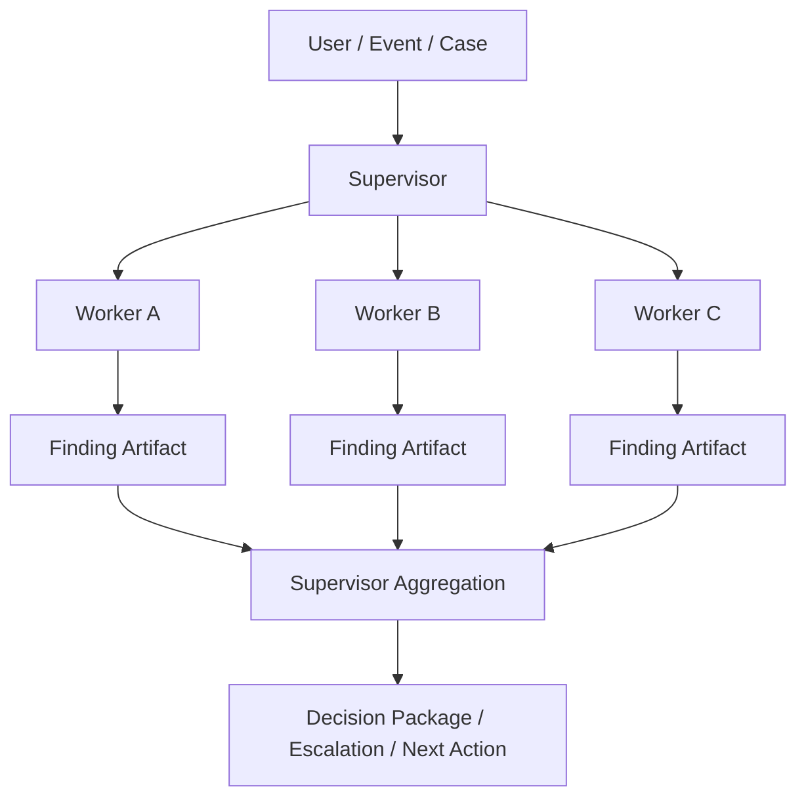

The supervisor:

- receives objective;
- decomposes work;
- assigns tasks;
- controls budget;
- integrates findings;
- resolves or escalates conflict;
- produces final package.

Workers:

- execute narrow tasks;
- use limited tools;
- produce typed outputs;
- do not own final authority.

---

# 3. Supervisor Responsibilities

The supervisor owns orchestration, not every detail.

## Responsibilities

- understand objective;
- classify task;
- choose workers;
- create delegated tasks;
- enforce budgets;
- monitor worker progress;
- validate worker outputs;
- aggregate results;
- detect disagreement;
- decide whether to continue, stop, or escalate;
- produce final decision package.

## Non-Responsibilities

- perform every specialist task itself;
- bypass policy;
- mutate high-impact domain state directly;
- let workers write canonical state freely;
- ignore worker uncertainty;
- create unbounded loops;
- hide unresolved conflict.

## Supervisor Contract

```python
from pydantic import BaseModel, Field
from enum import Enum


class SupervisorDecision(str, Enum):
    CONTINUE = "continue"
    COMPLETE = "complete"
    ESCALATE = "escalate"
    REQUEST_HUMAN_REVIEW = "request_human_review"
    FAIL = "fail"


class SupervisorState(BaseModel):
    run_id: str
    objective: str
    delegated_task_ids: list[str] = Field(default_factory=list)
    finding_refs: list[str] = Field(default_factory=list)
    open_questions: list[str] = Field(default_factory=list)
    conflicts: list[str] = Field(default_factory=list)
    decision: SupervisorDecision | None = None
```

The supervisor state should be durable and checkpointed.

---

# 4. Worker Responsibilities

A worker is a bounded specialist.

## Responsibilities

- accept a specific task;
- use only allowed tools;
- stay within budget;
- produce the expected output contract;
- include evidence/source references;
- declare uncertainty;
- escalate blockers;
- stop when done or blocked.

## Non-Responsibilities

- decide final business outcome;
- grant tools to other agents;
- mutate canonical domain state;
- call tools outside assigned scope;
- recursively spawn uncontrolled agents;
- silently change the objective.

## Worker Task Contract

```python
class WorkerTask(BaseModel):
    task_id: str
    parent_run_id: str
    assigned_worker: str
    objective: str
    input_refs: list[str]
    allowed_tools: list[str]
    expected_output_contract: str
    max_tool_calls: int = Field(ge=0)
    deadline_ms: int = Field(ge=1)
    escalation_conditions: list[str] = Field(default_factory=list)
```

## Worker Result Contract

```python
class WorkerResultStatus(str, Enum):
    SUCCEEDED = "succeeded"
    FAILED = "failed"
    BLOCKED = "blocked"
    PARTIAL = "partial"


class WorkerResult(BaseModel):
    task_id: str
    worker_name: str
    status: WorkerResultStatus
    output_ref: str | None = None
    summary: str
    evidence_refs: list[str] = Field(default_factory=list)
    confidence: float = Field(ge=0.0, le=1.0)
    blockers: list[str] = Field(default_factory=list)
    recommended_next_steps: list[str] = Field(default_factory=list)
```

A worker result is not just text. It is an operational artifact.

---

# 5. Routing Pattern Overview

Routing chooses where work should go.

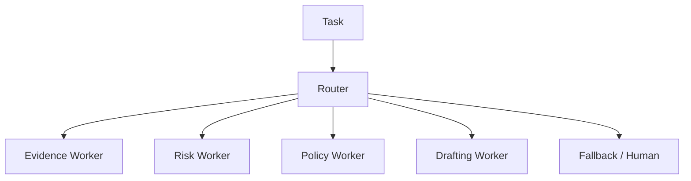

Routing can be:

| Routing Type | Description |
|---|---|
| static | fixed mapping from task type to worker |
| rules-based | deterministic rule selects worker |
| classifier-based | model or ML classifier selects worker |
| policy-based | policy engine selects allowed worker |
| capability-based | worker selected by declared capability |
| load-aware | worker selected by availability/capacity |
| risk-aware | high-risk tasks routed to stricter workflow |
| hybrid | combination of above |

---

# 6. Static Routing

Static routing maps known task types to workers.

```python
STATIC_ROUTES = {
    "evidence_summary": "evidence-worker",
    "risk_assessment": "risk-worker",
    "policy_mapping": "policy-worker",
    "notice_draft": "drafting-worker",
}
```

## When to Use

Use static routing when:

- task taxonomy is stable;
- responsibility is clear;
- routing must be explainable;
- low latency matters;
- ambiguity is low.

## Pros

- simple;
- deterministic;
- easy to test;
- easy to audit.

## Cons

- brittle if taxonomy changes;
- poor handling of ambiguous tasks;
- may route overloaded workers;
- cannot adapt to nuanced context.

Static routing is underrated. Many enterprise workflows should start here.

---

# 7. Rules-Based Routing

Rules-based routing uses explicit conditions.

```python
def route_task(task_type: str, risk_level: str | None, has_policy_issue: bool) -> str:
    if risk_level in {"high", "critical"}:
        return "senior-review-supervisor"

    if has_policy_issue:
        return "policy-worker"

    if task_type == "evidence_summary":
        return "evidence-worker"

    return "fallback-human-triage"
```

## Good For

- regulated routing;
- risk escalation;
- deterministic fallbacks;
- policy-driven assignment;
- operational predictability.

## Rule

> If a routing decision is business-critical and deterministic, do not outsource it to an LLM.

---

# 8. Classifier-Based Routing

A model can classify ambiguous tasks.

```python
class RoutingDecision(BaseModel):
    route: str
    confidence: float = Field(ge=0.0, le=1.0)
    rationale: str
    fallback_required: bool = False
```

## Use When

- input is natural language;
- categories are known;
- ambiguity exists;
- fallback is available;
- routing errors are recoverable.

## Controls

- confidence threshold;
- fallback route;
- evaluation set;
- route taxonomy version;
- confusion matrix;
- monitoring drift.

## Classifier Routing Flow

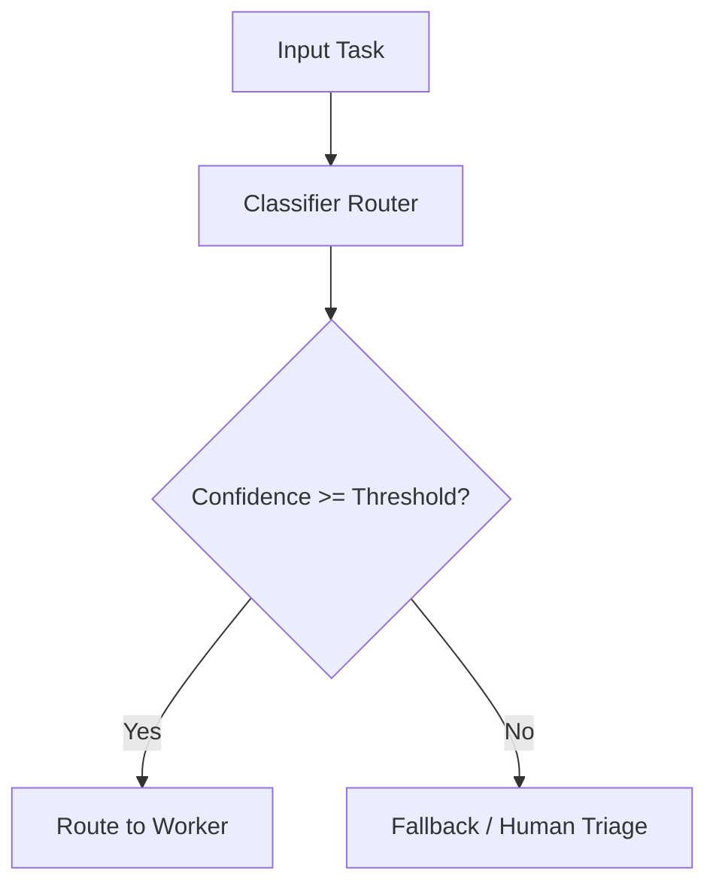

Classifier routing should never be silent for low-confidence decisions.

---

# 9. Capability-Based Routing

Workers declare capabilities.

```python
class WorkerCapability(BaseModel):
    worker_name: str
    task_types: list[str]
    tool_scopes: list[str]
    max_risk_level: str
    output_contracts: list[str]
    supports_parallel: bool
```

Router selects a worker based on capability.

```python
def route_by_capability(
    task_type: str,
    required_contract: str,
    workers: list[WorkerCapability],
) -> list[str]:
    return [
        worker.worker_name
        for worker in workers
        if task_type in worker.task_types
        and required_contract in worker.output_contracts
    ]
```

## Good For

- extensible platforms;
- plugin-like worker systems;
- dynamic worker registry;
- model/provider specialization;
- tenant-specific capabilities.

## Risk

Capability-based routing can become too dynamic. Add policy gates and allowlists.

---

# 10. Risk-Aware Routing

Risk should influence routing.

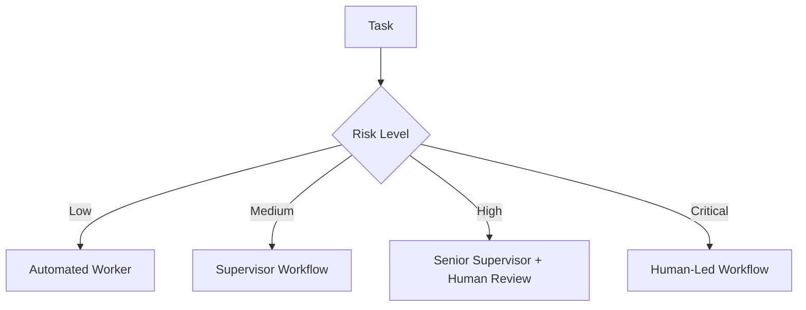

Risk-aware routing prevents excessive autonomy in high-impact cases.

## Example

| Risk | Route |
|---|---|
| low | single worker, automated |
| medium | supervisor + specialists |
| high | supervisor + verifier + human |
| critical | human-led with agent assistance |

---

# 11. Load-Aware Routing

Enterprise systems also need capacity control.

```python
class WorkerLoad(BaseModel):
    worker_name: str
    active_tasks: int
    max_concurrency: int
    healthy: bool


def route_by_load(candidates: list[WorkerLoad]) -> str | None:
    healthy = [w for w in candidates if w.healthy and w.active_tasks < w.max_concurrency]
    if not healthy:
        return None
    return min(healthy, key=lambda w: w.active_tasks).worker_name
```

Load-aware routing is useful for:

- expensive model workers;
- slow tools;
- tenant quotas;
- avoiding provider rate limits;
- avoiding supervisor bottlenecks.

---

# 12. Routing Decision Record

Every routing decision should be recorded.

```python
class RoutingRecord(BaseModel):
    routing_id: str
    run_id: str
    task_id: str
    route: str
    routing_strategy: str
    confidence: float | None = None
    rationale: str | None = None
    fallback_used: bool = False
    policy_version: str
```

Why?

- audit;
- debugging;
- evaluation;
- route drift detection;
- accountability;
- production analytics.

---

# 13. Delegation Flow

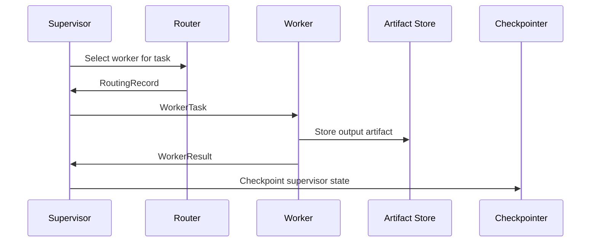

The supervisor should not depend on worker chat text. It should depend on worker result artifacts.

---

# 14. Fan-Out/Fan-In

Supervisor often fans out tasks and then aggregates results.

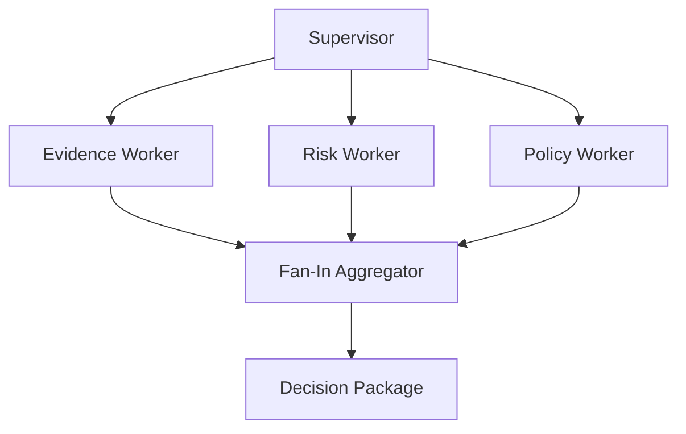

## Safe Fan-Out Rules

1. Fan out only independent tasks.
2. Bound concurrency.
3. Give each worker a budget.
4. Give each worker a deadline.
5. Preserve partial failures.
6. Aggregate typed outputs.
7. Do not let workers overwrite each other.

## Python Sketch

```python
import asyncio
from collections.abc import Awaitable, Callable
from typing import TypeVar

T = TypeVar("T")


async def run_workers_bounded(
    worker_calls: list[Callable[[], Awaitable[T]]],
    limit: int,
) -> list[T]:
    semaphore = asyncio.Semaphore(limit)

    async def run_one(call: Callable[[], Awaitable[T]]) -> T:
        async with semaphore:
            return await call()

    async with asyncio.TaskGroup() as group:
        tasks = [group.create_task(run_one(call)) for call in worker_calls]

    return [task.result() for task in tasks]
```

---

# 15. Aggregation

Aggregation is not concatenation.

Bad:

```text
Evidence says X.
Risk says Y.
Policy says Z.
Final answer: X Y Z.
```

Better aggregation:

```python
class AggregatedFinding(BaseModel):
    finding_refs: list[str]
    consistent_points: list[str]
    conflicts: list[str]
    missing_evidence: list[str]
    recommended_decision: str | None
    requires_human_review: bool
```

Aggregation should:

- normalize worker results;
- compare evidence;
- detect contradictions;
- identify missing information;
- determine if confidence is sufficient;
- produce a decision package or escalation.

---

# 16. Partial Failure Handling

Workers can fail independently.

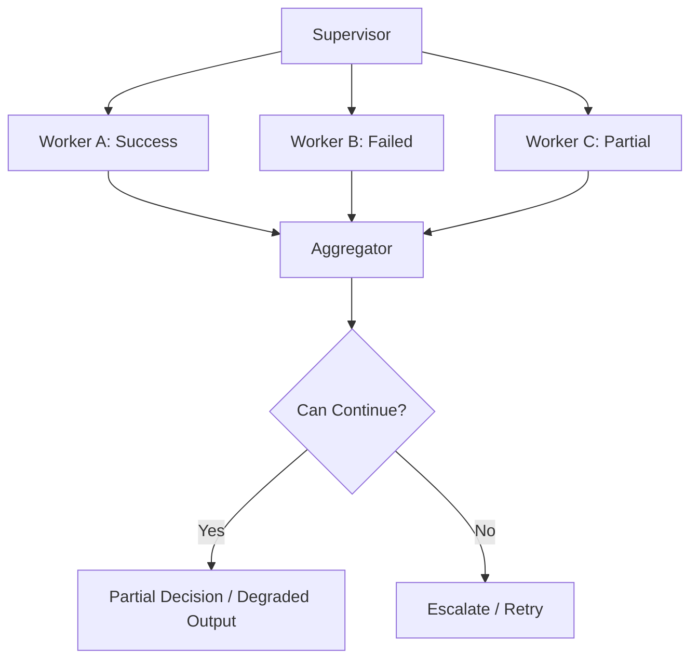

## Failure Policy

```python
class WorkerFailurePolicy(BaseModel):
    worker_name: str
    required: bool
    retryable: bool
    max_attempts: int
    fallback_worker: str | None = None
    allow_partial_result: bool = False
```

Some workers are required; others are optional.

Example:

- evidence worker may be required;
- drafting worker may be skipped until evidence is complete;
- policy worker may fallback to human if unavailable.

---

# 17. Supervisor Stop Conditions

Supervisor must know when to stop.

Stop conditions:

- objective completed;
- required workers succeeded;
- required evidence missing;
- confidence below threshold;
- conflict unresolved;
- budget exhausted;
- deadline reached;
- policy boundary hit;
- human approval required;
- repeated worker failure.

```python
class SupervisorStopReason(str, Enum):
    COMPLETE = "complete"
    MISSING_EVIDENCE = "missing_evidence"
    LOW_CONFIDENCE = "low_confidence"
    UNRESOLVED_CONFLICT = "unresolved_conflict"
    BUDGET_EXHAUSTED = "budget_exhausted"
    HUMAN_REQUIRED = "human_required"
    WORKER_FAILURE = "worker_failure"
```

A good supervisor stops instead of pretending certainty.

---

# 18. State Ownership

Supervisor owns orchestration state.

Workers own task-local reasoning and output artifacts.

Canonical business state remains outside both.

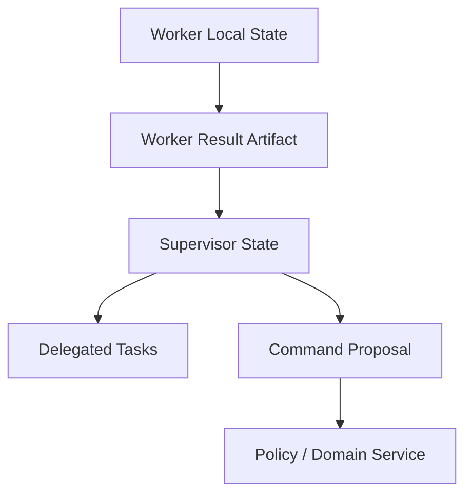

## Rule

> Workers append findings. Supervisors aggregate findings. Domain services commit business state.

---

# 19. Preventing Worker Overreach

Workers may try to exceed scope.

Controls:

- allowed tools list;
- output contract;
- authority statement;
- policy-enforced tool executor;
- state mutation restrictions;
- budget;
- validator;
- supervisor review.

Do not rely on prompt instructions alone.

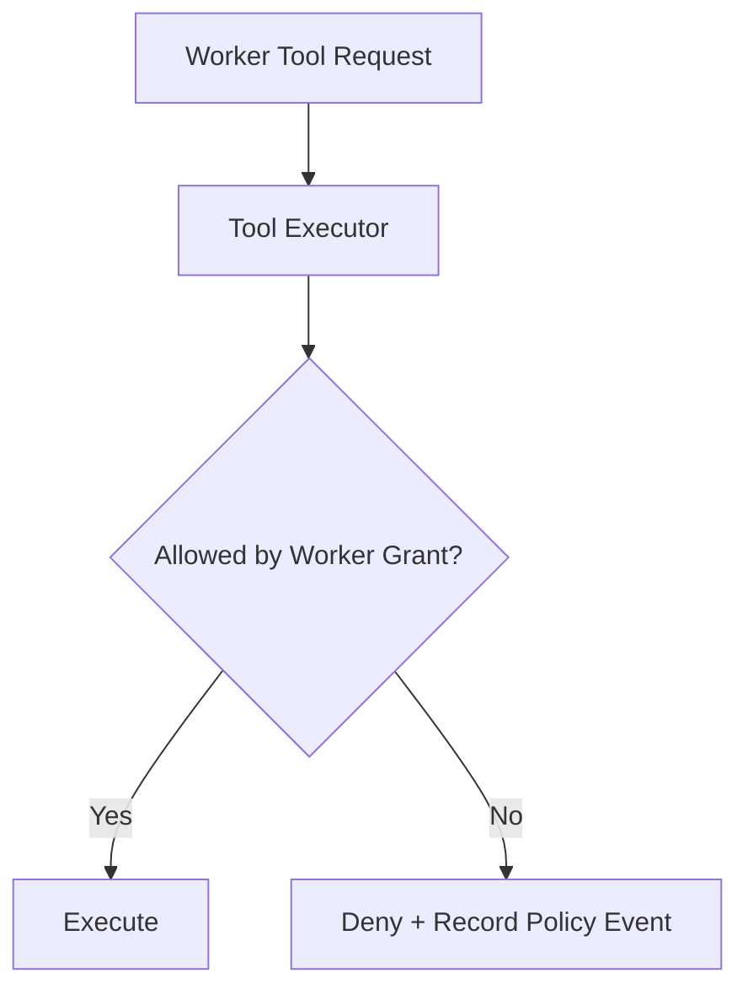

---

# 20. Supervisor Bottleneck

Supervisor can become bottleneck.

Causes:

- too many workers;
- too much context;
- aggregation not structured;
- supervisor performs specialist tasks;
- sequential delegation when parallel is safe;
- repeated replanning.

Mitigations:

- bounded parallelism;
- typed worker results;
- artifact references instead of full text;
- sub-supervisors for large domains;
- deterministic aggregation where possible;
- route simple tasks directly.

---

# 21. Hierarchical Supervisor–Worker

For large systems:

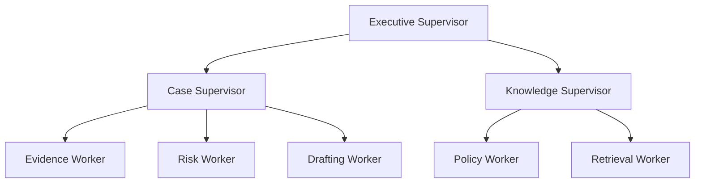

Use hierarchy when:

- work spans multiple bounded contexts;
- teams own different capabilities;
- permissions differ by domain;
- scale is large;
- audit paths require layered responsibility.

Avoid hierarchy when a single supervisor with few workers is enough.

---

# 22. Routing + Supervisor Hybrid

A common enterprise pattern:

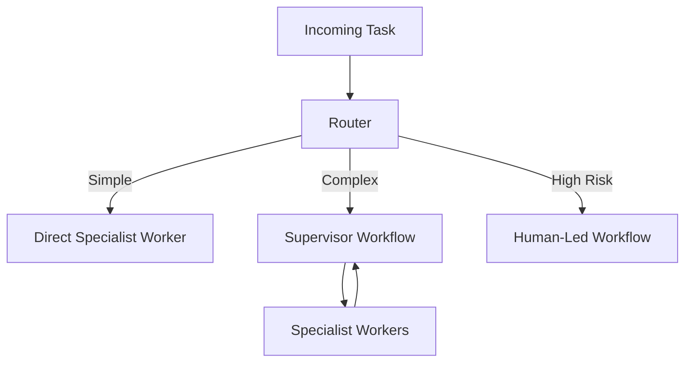

This avoids using a supervisor for every simple task.

## Decision

| Task Type | Route |
|---|---|
| simple extraction | direct worker |
| ambiguous multi-step analysis | supervisor |
| high-risk regulated action | supervisor + human |
| unknown category | human triage |

---

# 23. Worker Registry

A worker registry stores worker specs.

```python
class WorkerSpec(BaseModel):
    worker_name: str
    version: str
    capabilities: list[str]
    input_contracts: list[str]
    output_contracts: list[str]
    tool_grants: list[str]
    max_concurrency: int
    max_risk_level: str
    owner_team: str
```

Registry benefits:

- controlled routing;
- versioning;
- evaluation by worker;
- rollout/rollback;
- tenant-specific enablement;
- health/capacity tracking.

---

# 24. Evaluation

Evaluate routing and worker quality separately.

| Component | Evaluation |
|---|---|
| router | accuracy, confidence calibration, fallback rate |
| supervisor | delegation quality, aggregation quality, stop behavior |
| evidence worker | source coverage, hallucinated refs |
| risk worker | calibration, evidence alignment |
| policy worker | policy mapping accuracy |
| drafting worker | factuality, clarity, tone |
| aggregator | conflict detection, missing evidence detection |

End-to-end success can hide routing failures.

---

# 25. Observability

Track:

- routing decision;
- worker selected;
- worker version;
- task contract;
- tool calls;
- worker latency;
- worker confidence;
- worker failures;
- retries;
- fallback usage;
- aggregation decision;
- supervisor stop reason;
- human escalation.

## Trace Shape

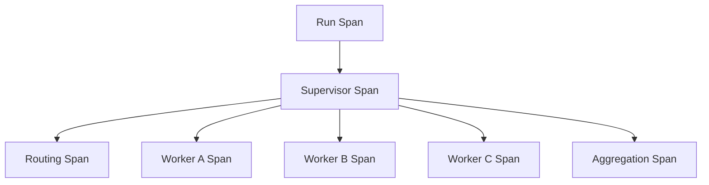

Every worker task should have trace correlation.

---

# 26. Anti-Patterns

## Anti-Pattern 1 — Supervisor as God Agent

Supervisor does everything and delegates nothing meaningful.

## Anti-Pattern 2 — Workers Own Final State

Specialists mutate canonical domain state.

## Anti-Pattern 3 — Routing Without Fallback

Low-confidence routing still picks a worker.

## Anti-Pattern 4 — Unbounded Fan-Out

Supervisor calls every worker for every task.

## Anti-Pattern 5 — Aggregation by Concatenation

No conflict detection or adjudication.

## Anti-Pattern 6 — Worker Tool Sprawl

Every worker can call every tool.

## Anti-Pattern 7 — Silent Partial Failure

One worker fails, but final output ignores missing perspective.

---

# 27. Production Checklist

Before shipping supervisor–worker routing:

- [ ] supervisor responsibilities are explicit;
- [ ] worker responsibilities are explicit;
- [ ] worker task contract is typed;
- [ ] worker result contract is typed;
- [ ] routing strategy is documented;
- [ ] low-confidence fallback exists;
- [ ] worker tool grants are least privilege;
- [ ] worker budgets are enforced;
- [ ] fan-out concurrency is bounded;
- [ ] partial failure policy exists;
- [ ] aggregation detects conflicts;
- [ ] supervisor stop conditions exist;
- [ ] worker outputs are artifacts;
- [ ] routing records are persisted;
- [ ] trace spans link supervisor and workers;
- [ ] evaluation covers routing and workers separately;
- [ ] high-risk actions require policy/human gates.

---

# 28. Practice Drill

Design a supervisor–worker system for enterprise case review.

Workers:

- evidence worker;
- risk worker;
- policy worker;
- drafting worker;
- verifier worker.

Requirements:

- route simple cases directly to summary worker;
- route complex cases to supervisor;
- high-risk cases require human review;
- workers cannot mutate case status;
- supervisor aggregates findings;
- conflicting findings escalate;
- worker failures are visible.

Deliverables:

1. supervisor state model;
2. worker task schema;
3. worker result schema;
4. routing strategy;
5. worker registry;
6. tool grants;
7. aggregation model;
8. failure policy;
9. stop conditions;
10. observability fields.

---

# 29. What Top 1% Engineers Pay Attention To

Top engineers ask:

- Does this task need a supervisor?
- Can routing handle ambiguity?
- What happens when routing confidence is low?
- What does each worker own?
- What can each worker never do?
- Does the supervisor aggregate or merely concatenate?
- Are worker failures visible?
- Are partial results safe?
- Is fan-out bounded?
- Does routing consider risk?
- Are routing decisions evaluated?
- Can the supervisor stop?
- Is worker output a typed artifact?
- Is final authority outside worker outputs?

They design delegation like a production workflow, not like a chatroom.

---

# 30. Summary

In this part, we covered:

- supervisor responsibilities;
- worker responsibilities;
- worker task/result contracts;
- routing strategies;
- static routing;
- rules-based routing;
- classifier-based routing;
- capability-based routing;
- risk-aware routing;
- load-aware routing;
- routing records;
- delegation flow;
- fan-out/fan-in;
- aggregation;
- partial failure;
- stop conditions;
- state ownership;
- worker overreach prevention;
- supervisor bottlenecks;
- hierarchical supervisor-worker systems;
- routing/supervisor hybrids;
- worker registry;
- evaluation;
- observability;
- anti-patterns.

The key principle:

> Supervisor–worker is a controlled delegation architecture, not a free-form multi-agent conversation.

The next part focuses on what happens when agents disagree: **Consensus, Voting, and Adjudication**.

---

## References

- Multi-agent orchestration patterns in modern agent frameworks.
- Enterprise workflow delegation and escalation patterns.
- Distributed systems fan-out/fan-in reliability patterns.
- Least privilege and separation-of-duty security principles.
