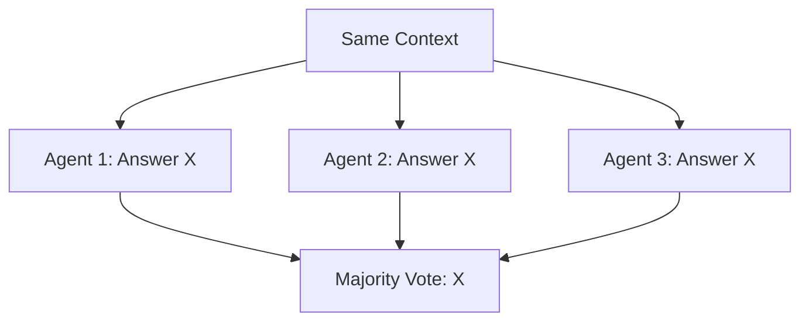
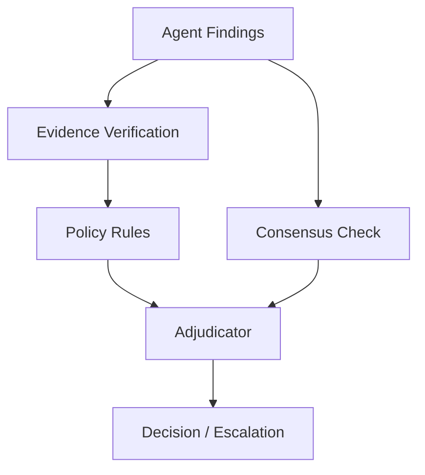
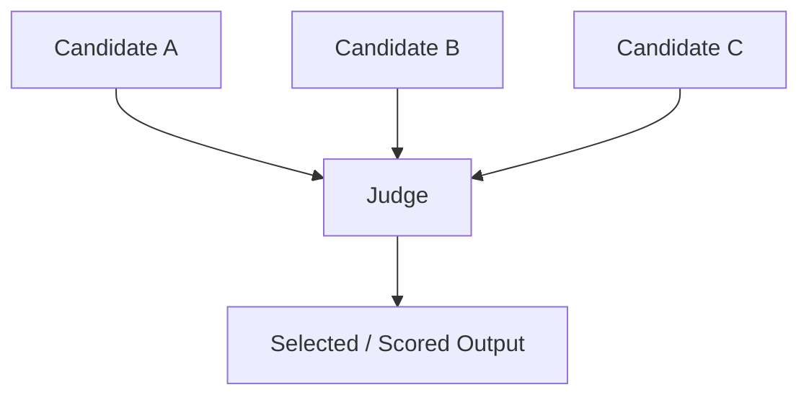
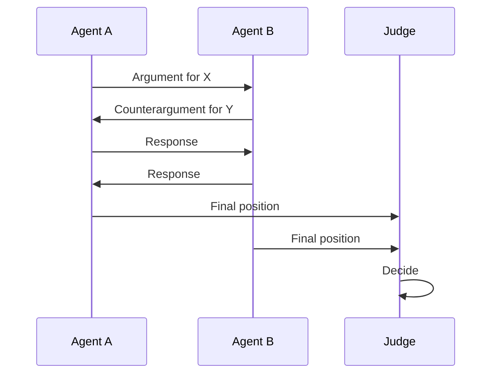
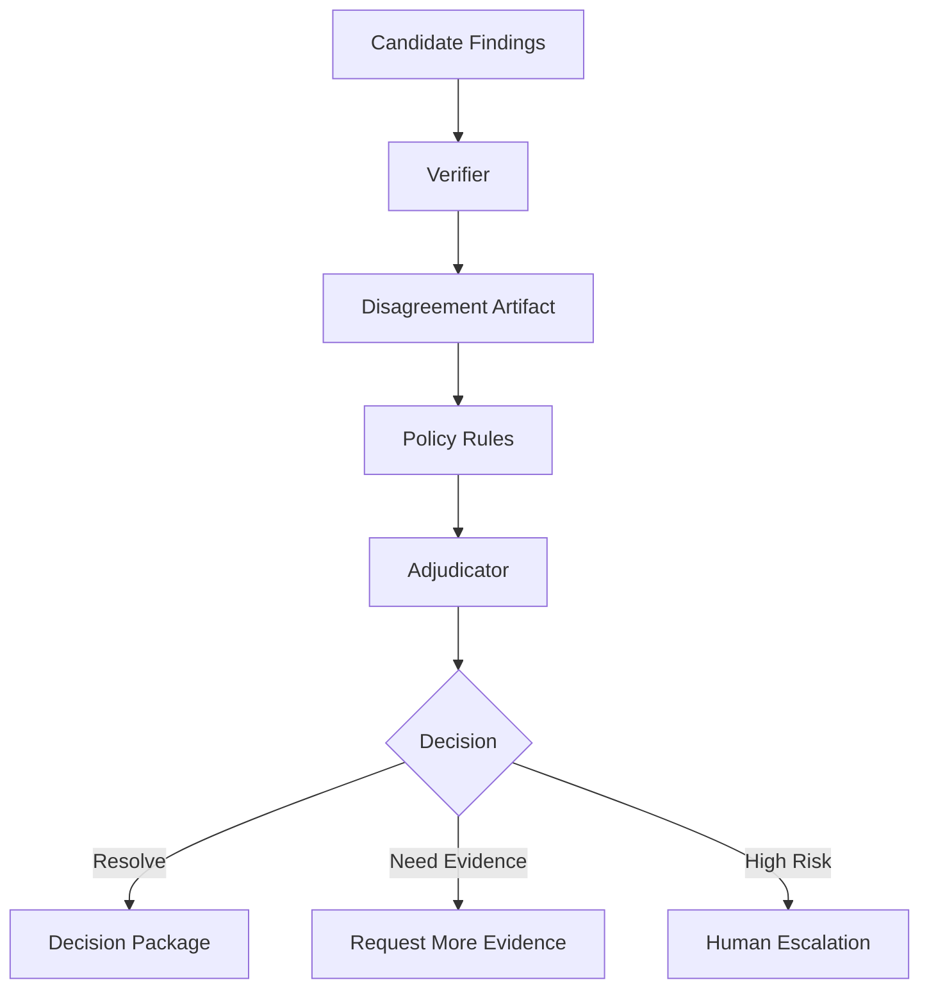

# Part 018 — Consensus, Voting, and Adjudication

> Three agents agreeing does not make something true.
>
> It may only mean they share the same context, the same model bias, or the same hallucination.

Multi-agent systems often use patterns such as:

- multiple agents vote;
- several models answer and a judge selects;
- agents debate until they agree;
- specialist agents produce findings and a supervisor decides;
- critic agents review outputs.

These patterns can help. But they can also create false confidence.

This part explains how to design **consensus, voting, and adjudication** in enterprise-grade stateful multi-agent AI systems.

The central idea:

> Consensus is not authority. Evidence and policy still matter.

---

## 1. Kaufman Framing

Using Kaufman's method, this skill decomposes into:

1. identify what disagreement means;
2. model agent outputs as comparable artifacts;
3. choose voting/adjudication strategy;
4. weight evidence quality;
5. avoid correlated-agent false consensus;
6. separate scoring from authority;
7. define escalation thresholds;
8. preserve minority reports;
9. validate claims independently;
10. evaluate judge behavior.

### Target Performance

By the end of this part, you should be able to:

- distinguish consensus, voting, judging, verification, and adjudication;
- design typed disagreement artifacts;
- implement majority vote, weighted vote, quorum, and judge selection;
- recognize when voting is unsafe;
- design an adjudicator agent/service;
- preserve evidence and dissent;
- escalate unresolved conflict;
- avoid “LLM democracy” as a false control;
- build evaluation for adjudication quality.

---

# 2. Core Vocabulary

| Concept | Meaning |
|---|---|
| Consensus | multiple actors converge on same answer |
| Voting | actors cast explicit choices |
| Majority vote | most votes win |
| Weighted vote | votes weighted by confidence/source/role |
| Quorum | minimum participation/agreement threshold |
| Judge | actor/model selects or scores output |
| Verifier | checks claims against evidence |
| Adjudicator | resolves conflict using rules/evidence/policy |
| Dissent | minority disagreement preserved as artifact |
| Escalation | unresolved issue sent to human/higher authority |

Do not treat these as interchangeable.

---

# 3. Why Simple Voting Is Dangerous



If all agents saw the same flawed context, the vote is not independent.

## Failure Modes

| Failure | Description |
|---|---|
| correlated error | agents share same wrong context/model bias |
| hallucinated consensus | all agents invent same unsupported claim |
| popularity over correctness | majority wins despite weak evidence |
| confidence inflation | agreement mistaken for truth |
| authority confusion | vote bypasses policy/human approval |
| hidden dissent | minority warning lost |
| judge bias | judge prefers polished answer |
| adversarial influence | injected context sways all agents |

Voting can improve robustness only when independence and evidence are designed.

---

# 4. When Voting Helps

Voting can help when:

- task is low-to-medium risk;
- candidates are independent enough;
- answer space is constrained;
- outputs are comparable;
- evaluation criteria are explicit;
- evidence can be checked;
- final action is reversible or reviewable.

Examples:

- choosing best summary among drafts;
- classifying document category with confidence;
- selecting test cases generated by multiple agents;
- ranking candidate plans;
- deciding whether output passes style rubric.

Voting is weaker for:

- legal/regulatory decisions;
- irreversible side effects;
- factual claims without evidence;
- security-sensitive actions;
- ambiguous policy interpretation.

---

# 5. Consensus vs Adjudication

Consensus asks:

> Do multiple agents agree?

Adjudication asks:

> Given evidence, rules, authority, and uncertainty, what should the system do?



Consensus may be an input to adjudication, but not a replacement for it.

---

# 6. Typed Candidate Output

Before voting, outputs must be comparable.

```python
from enum import Enum
from pydantic import BaseModel, Field


class RiskLevel(str, Enum):
    LOW = "low"
    MEDIUM = "medium"
    HIGH = "high"
    CRITICAL = "critical"


class CandidateRiskAssessment(BaseModel):
    candidate_id: str
    produced_by: str
    risk_level: RiskLevel
    confidence: float = Field(ge=0.0, le=1.0)
    rationale: str
    evidence_refs: list[str]
    uncertainty: list[str] = Field(default_factory=list)
```

If outputs are free-form prose, voting is unreliable.

---

# 7. Disagreement Artifact

Disagreement should be first-class state.

```python
class DisagreementType(str, Enum):
    CLASSIFICATION = "classification"
    FACTUAL = "factual"
    POLICY = "policy"
    RISK = "risk"
    EVIDENCE = "evidence"
    ACTION = "action"


class DisagreementArtifact(BaseModel):
    disagreement_id: str
    run_id: str
    subject: str
    disagreement_type: DisagreementType
    candidates: list[str]
    summary: str
    evidence_refs: list[str]
    severity: str
    requires_escalation: bool
```

A disagreement is not a failure. It is a signal.

---

# 8. Majority Vote

Majority vote selects the most frequent answer.

```python
from collections import Counter


def majority_vote(values: list[str]) -> tuple[str, int]:
    counts = Counter(values)
    winner, count = counts.most_common(1)[0]
    return winner, count
```

## Use For

- constrained labels;
- low-risk classification;
- style choice;
- candidate selection;
- simple binary checks.

## Do Not Use For

- high-impact decisions;
- open-ended factual truth;
- policy interpretation;
- side-effect approval;
- cases where candidates are not independent.

## Majority Vote with Tie Handling

```python
def majority_vote_with_tie(values: list[str]) -> str | None:
    counts = Counter(values)
    top = counts.most_common()

    if len(top) > 1 and top[0][1] == top[1][1]:
        return None

    return top[0][0]
```

Tie should usually escalate or trigger more evidence gathering.

---

# 9. Weighted Vote

Weighted voting uses weights.

Possible weights:

- agent reliability;
- evidence quality;
- confidence calibration;
- role relevance;
- historical performance;
- source freshness;
- domain authority.

```python
class WeightedVote(BaseModel):
    value: str
    weight: float
    voter: str
    rationale: str | None = None


def weighted_vote(votes: list[WeightedVote]) -> dict[str, float]:
    scores: dict[str, float] = {}

    for vote in votes:
        scores[vote.value] = scores.get(vote.value, 0.0) + vote.weight

    return scores
```

## Warning

Do not blindly use model self-reported confidence as weight. LLM confidence can be poorly calibrated.

Prefer weights based on:

- validated evidence;
- role expertise;
- historical evaluation;
- tool-backed verification;
- deterministic checks.

---

# 10. Quorum

A quorum requires minimum agreement.

```python
class QuorumRule(BaseModel):
    min_votes: int
    min_agreement_ratio: float = Field(ge=0.0, le=1.0)


def check_quorum(total_votes: int, winning_votes: int, rule: QuorumRule) -> bool:
    if total_votes < rule.min_votes:
        return False
    return (winning_votes / total_votes) >= rule.min_agreement_ratio
```

Example:

- at least 3 assessments;
- at least 80% agree;
- if not, escalate.

## Use When

- multiple independent reviewers exist;
- automated decision is low-risk;
- fallback is available;
- disagreement should not be ignored.

---

# 11. Confidence Calibration

Confidence is not correctness.

An agent can be confidently wrong.

## Better Confidence Inputs

| Signal | Better Than Self-Confidence? |
|---|---:|
| evidence refs exist | yes |
| evidence supports claim | yes |
| validator passes | yes |
| historical accuracy | yes |
| independent verifier agrees | yes |
| model says “I am 95% sure” | weak |
| agents agree with same context | weak |

Use confidence as one feature, not the final decision.

---

# 12. Evidence-Weighted Adjudication

Evidence quality should matter more than number of agents.

```python
class EvidenceQuality(str, Enum):
    LOW = "low"
    MEDIUM = "medium"
    HIGH = "high"


class EvidenceBackedClaim(BaseModel):
    claim: str
    evidence_refs: list[str]
    evidence_quality: EvidenceQuality
    produced_by: str
    confidence: float = Field(ge=0.0, le=1.0)
```

Adjudication should ask:

- Is evidence relevant?
- Is evidence authoritative?
- Is evidence current?
- Does evidence actually support the claim?
- Is there contrary evidence?
- Is the claim within policy scope?

---

# 13. Judge Pattern

A judge selects or scores outputs.



## Judge Output Contract

```python
class JudgeDecision(BaseModel):
    decision_id: str
    selected_candidate_id: str | None = None
    scores: dict[str, float]
    rationale: str
    concerns: list[str] = Field(default_factory=list)
    requires_human_review: bool
```

## Judge Risks

- prefers longer/polished answers;
- ignores subtle factual errors;
- shares same model bias;
- lacks domain authority;
- invents evaluation criteria;
- gives false precision.

## Judge Controls

- explicit rubric;
- blind evaluation when possible;
- evidence access;
- deterministic pre-validation;
- judge evaluation set;
- human review for high-impact decisions.

---

# 14. Rubric-Based Judging

Use a rubric.

```python
class RubricCriterion(BaseModel):
    name: str
    description: str
    weight: float = Field(ge=0.0)


class RubricScore(BaseModel):
    criterion: str
    score: float = Field(ge=0.0, le=1.0)
    rationale: str


class RubricJudgment(BaseModel):
    candidate_id: str
    scores: list[RubricScore]
    total_score: float = Field(ge=0.0, le=1.0)
```

Example criteria:

- factual support;
- completeness;
- policy alignment;
- clarity;
- uncertainty disclosure;
- evidence traceability;
- actionability.

Rubric forces explicit judgment.

---

# 15. Debate Pattern

Agents debate before a decision.



## Use Sparingly

Debate can surface issues, but it can also waste tokens and amplify persuasive hallucination.

Use debate when:

- alternatives are plausible;
- reasoning quality matters;
- debate is bounded;
- judge has evidence/rubric;
- final authority remains controlled.

## Debate Controls

- max turns;
- evidence required;
- no new tools after debate starts unless allowed;
- final positions structured;
- dissent preserved;
- judge separate from debaters.

---

# 16. Independent Generation

Consensus is more useful when candidates are generated independently.

Independence can vary by:

- different prompts;
- different models;
- different retrieved context slices;
- different tools;
- different agents/roles;
- different sampling;
- different reasoning strategy.

But independence is never perfect.

## Correlation Risk

If candidates share:

- same flawed source;
- same prompt;
- same model;
- same memory;
- same tool bug;
- same retrieval failure;

then agreement is weaker.

Record how candidates were generated.

---

# 17. Preserve Dissent

Do not discard minority reports.

```python
class DissentReport(BaseModel):
    dissent_id: str
    candidate_id: str
    dissenter: str
    summary: str
    evidence_refs: list[str]
    severity: str
    recommended_escalation: bool
```

Minority dissent may be the most important signal in high-risk systems.

Example:

- 4 agents say medium risk;
- 1 policy verifier says evidence is legally insufficient.

The dissent should not be lost.

---

# 18. Adjudicator Pattern

An adjudicator resolves disagreement using evidence, policy, and rules.



## Adjudicator Responsibilities

- compare candidates;
- inspect evidence;
- apply policy/rubric;
- preserve dissent;
- identify uncertainty;
- decide if system can proceed;
- escalate when authority is insufficient.

## Adjudicator Output

```python
class AdjudicationOutcome(str, Enum):
    RESOLVED = "resolved"
    NEEDS_MORE_EVIDENCE = "needs_more_evidence"
    HUMAN_REVIEW_REQUIRED = "human_review_required"
    REJECTED = "rejected"


class AdjudicationDecision(BaseModel):
    adjudication_id: str
    run_id: str
    outcome: AdjudicationOutcome
    selected_position: str | None = None
    rationale: str
    evidence_refs: list[str]
    dissent_refs: list[str] = Field(default_factory=list)
    required_next_actions: list[str] = Field(default_factory=list)
```

Adjudication is stronger than simple voting.

---

# 19. Rule-Based Adjudication

Some adjudication should be deterministic.

Example:

```python
def adjudicate_risk(
    assessments: list[CandidateRiskAssessment],
    critical_evidence_missing: bool,
) -> AdjudicationDecision:
    if critical_evidence_missing:
        return AdjudicationDecision(
            adjudication_id="adj_1",
            run_id=assessments[0].candidate_id,
            outcome=AdjudicationOutcome.NEEDS_MORE_EVIDENCE,
            rationale="Critical evidence is missing.",
            evidence_refs=[],
            required_next_actions=["collect_required_evidence"],
        )

    if any(a.risk_level == RiskLevel.CRITICAL for a in assessments):
        return AdjudicationDecision(
            adjudication_id="adj_1",
            run_id=assessments[0].candidate_id,
            outcome=AdjudicationOutcome.HUMAN_REVIEW_REQUIRED,
            rationale="At least one assessment indicates critical risk.",
            evidence_refs=[
                ref
                for assessment in assessments
                for ref in assessment.evidence_refs
            ],
            required_next_actions=["human_review"],
        )

    # simplified
    winner, _ = majority_vote([a.risk_level.value for a in assessments])
    return AdjudicationDecision(
        adjudication_id="adj_1",
        run_id=assessments[0].candidate_id,
        outcome=AdjudicationOutcome.RESOLVED,
        selected_position=winner,
        rationale="Resolved by low-risk majority rule.",
        evidence_refs=[],
    )
```

In high-impact domains, use deterministic rules before model judgment.

---

# 20. Human Escalation

Human escalation should occur when:

- disagreement is high severity;
- evidence is insufficient;
- policy conflict exists;
- side effect is high impact;
- confidence is low;
- critical dissent exists;
- quorum fails;
- adjudicator lacks authority.

## Human Review Package

```python
class HumanAdjudicationPackage(BaseModel):
    package_id: str
    run_id: str
    question: str
    candidate_summaries: list[str]
    disagreement_summary: str
    evidence_refs: list[str]
    dissent_refs: list[str]
    system_recommendation: str | None
    required_decision: str
```

Do not send humans a raw debate transcript only. Send a structured package.

---

# 21. Consensus Thresholds by Risk

| Risk | Consensus Strategy |
|---|---|
| low | majority vote may be enough |
| medium | weighted vote + verifier |
| high | adjudicator + evidence check + human threshold |
| critical | human-led decision, agents assist |

Higher risk means less reliance on automated consensus.

---

# 22. Consensus for Routing

Voting can be used for routing.

Example:

- router model A selects `policy`;
- router model B selects `risk`;
- rules router selects `human`;
- risk-aware policy says high risk.

Adjudication result:

```text
Route to human/supervisor, not because majority won, but because risk policy dominates.
```

Routing should be conservative when uncertainty is high.

---

# 23. Consensus for Evaluation

Consensus can help evaluate outputs.

Examples:

- multiple judges score answer quality;
- verifier checks evidence;
- deterministic validator checks schema;
- human sample review calibrates judges.

But never assume automated judges are ground truth.

Use human-labeled evaluation sets for calibration.

---

# 24. Aggregation Patterns

## Pattern 1 — Majority Label

Good for simple labels.

## Pattern 2 — Best Candidate Selection

Judge selects best draft/plan.

## Pattern 3 — Evidence Merge

Merge non-conflicting findings.

## Pattern 4 — Conflict Escalation

Preserve conflict and escalate.

## Pattern 5 — Conservative Max Risk

If any credible agent flags high risk, escalate.

## Pattern 6 — Weighted Specialist Adjudication

Policy agent outweighs drafting agent on policy interpretation.

## Pattern 7 — Human Final Authority

Agents prepare decision package; human decides.

---

# 25. Conservative Max-Risk Rule

In safety/regulatory systems, sometimes use conservative escalation.

```python
def requires_escalation(assessments: list[CandidateRiskAssessment]) -> bool:
    return any(
        assessment.risk_level in {RiskLevel.HIGH, RiskLevel.CRITICAL}
        and assessment.evidence_refs
        for assessment in assessments
    )
```

This does not mean the highest-risk assessment is automatically true.

It means the system should not auto-close the issue.

---

# 26. Adjudication Observability

Track:

- number of candidates;
- candidate producers;
- model versions;
- context versions;
- agreement ratio;
- disagreement type;
- evidence quality;
- judge decision;
- dissent preserved;
- escalation rate;
- human override rate;
- later correctness outcome.

These metrics reveal whether consensus is helping or hiding errors.

---

# 27. Evaluating Judges

Judge models need evaluation.

Test:

- do they prefer long answers?
- do they detect unsupported claims?
- do they respect rubric weights?
- do they preserve uncertainty?
- do they escalate correctly?
- do they overrule strong evidence?
- do they handle adversarial candidates?
- do they handle abstention?

A judge that always chooses a winner is dangerous.

It must know when not to decide.

---

# 28. Abstention

Abstention is a valid output.

```python
class JudgeOutcome(str, Enum):
    SELECT = "select"
    TIE = "tie"
    ABSTAIN = "abstain"
    ESCALATE = "escalate"
```

A system that cannot abstain will hallucinate decisions under uncertainty.

Abstention should trigger:

- more evidence;
- human review;
- fallback workflow;
- degraded output;
- safe stop.

---

# 29. Anti-Patterns

## Anti-Pattern 1 — LLM Democracy

Three agents vote, majority wins, action is taken.

No evidence, no policy, no authority.

## Anti-Pattern 2 — Same Model, Same Prompt, Fake Independence

Five copies of the same agent agree.

This is not strong consensus.

## Anti-Pattern 3 — Critic as Policy Gate

Critic says output is okay, so system executes side effect.

Use real policy gate.

## Anti-Pattern 4 — Dissent Deleted

Minority warning disappears from final answer.

## Anti-Pattern 5 — Judge Without Rubric

Judge picks “best” with no criteria.

## Anti-Pattern 6 — Confidence Averaging

Average self-reported confidence and call it truth.

## Anti-Pattern 7 — No Escalation Path

Consensus failure leads to endless debate.

---

# 30. Production Checklist

Before using consensus/voting/adjudication:

- [ ] are candidate outputs typed?
- [ ] are candidates independent enough?
- [ ] is evidence required?
- [ ] is the answer space constrained?
- [ ] is voting appropriate for risk level?
- [ ] is quorum defined?
- [ ] are ties handled?
- [ ] is dissent preserved?
- [ ] is judge rubric explicit?
- [ ] is judge evaluated?
- [ ] is verifier separate from judge where needed?
- [ ] are policy gates outside consensus?
- [ ] is human escalation defined?
- [ ] are confidence scores calibrated or treated carefully?
- [ ] are disagreement artifacts stored?
- [ ] is adjudication observable?
- [ ] can the system abstain?

---

# 31. Practice Drill

Design adjudication for a risk assessment workflow.

Scenario:

- evidence agent summarizes documents;
- risk agent A says medium risk;
- risk agent B says high risk;
- policy agent says evidence is insufficient;
- drafting agent wants to prepare notice;
- supervisor must decide next step.

Deliverables:

1. candidate assessment schema;
2. disagreement artifact;
3. evidence quality model;
4. voting strategy;
5. adjudication rules;
6. human escalation threshold;
7. dissent report;
8. judge rubric;
9. observability fields;
10. anti-pattern analysis.

Expected safe outcome:

> Do not send notice. Preserve high-risk concern and policy insufficiency. Request more evidence or human review.

---

# 32. What Top 1% Engineers Pay Attention To

Top engineers ask:

- Are these agents independent?
- What does agreement actually prove?
- What evidence supports the winning answer?
- What happened to dissent?
- Is voting appropriate for this risk level?
- Is the judge calibrated?
- Can the judge abstain?
- Is confidence self-reported or validated?
- Does policy override consensus?
- What happens on tie?
- What happens when one credible specialist flags critical risk?
- Are humans given a structured disagreement package?
- Is consensus being used as a control theater?

They do not confuse agreement with truth.

---

# 33. Summary

In this part, we covered:

- consensus;
- voting;
- majority vote;
- weighted vote;
- quorum;
- confidence calibration;
- evidence-weighted adjudication;
- judge pattern;
- rubric-based judging;
- debate pattern;
- independent generation;
- dissent preservation;
- adjudicator pattern;
- rule-based adjudication;
- human escalation;
- consensus thresholds by risk;
- routing consensus;
- evaluation consensus;
- aggregation patterns;
- conservative max-risk rule;
- observability;
- judge evaluation;
- abstention;
- anti-patterns.

The key principle:

> Multi-agent agreement is a signal, not authority. Evidence, policy, and accountability still decide.

The next part focuses on **Human-in-the-Loop Control Points**: approval, review, override, audit, and escalation.

---

## References

- Ensemble and adjudication patterns in AI evaluation.
- Human-in-the-loop review patterns in regulated workflows.
- Decision theory concepts: uncertainty, abstention, and escalation.
- Enterprise governance principles: separation of duties, evidence, auditability.
