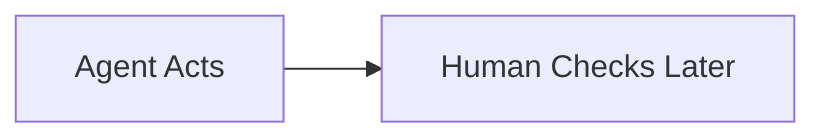
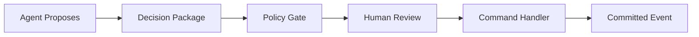
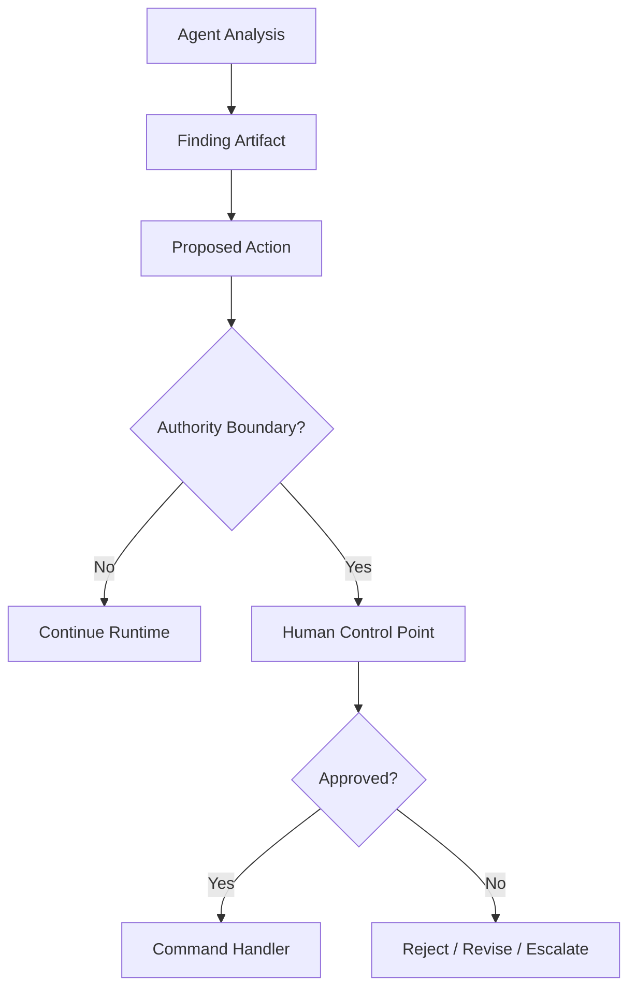
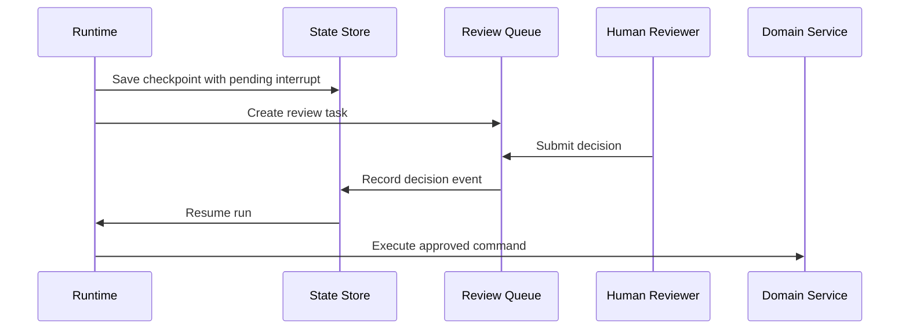
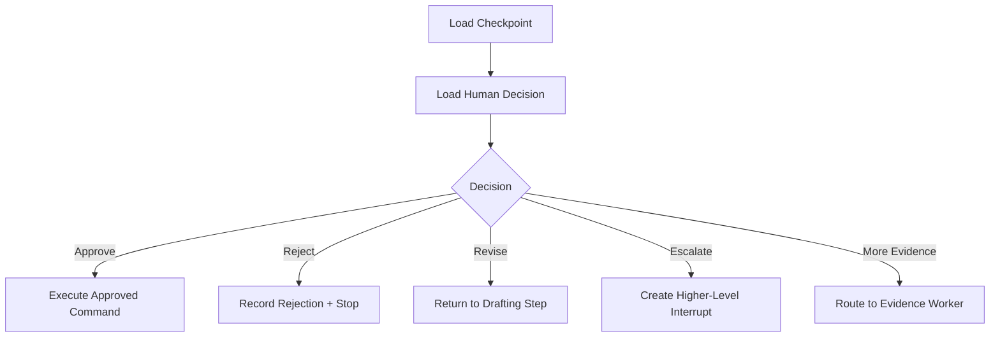
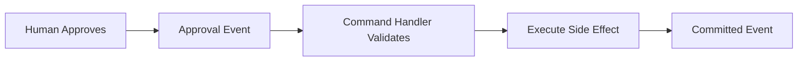
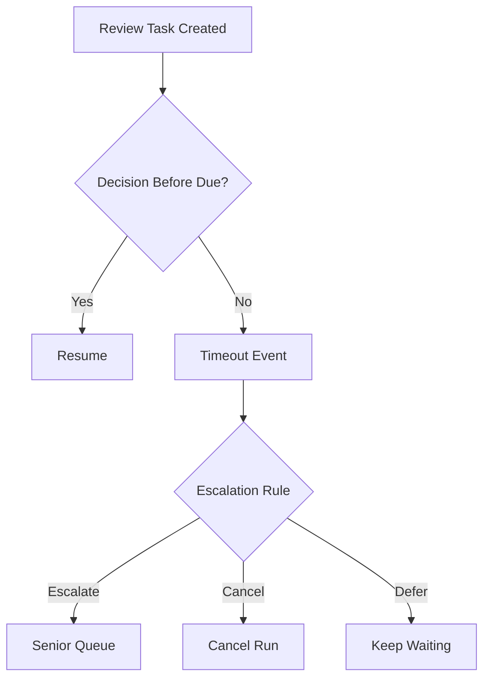
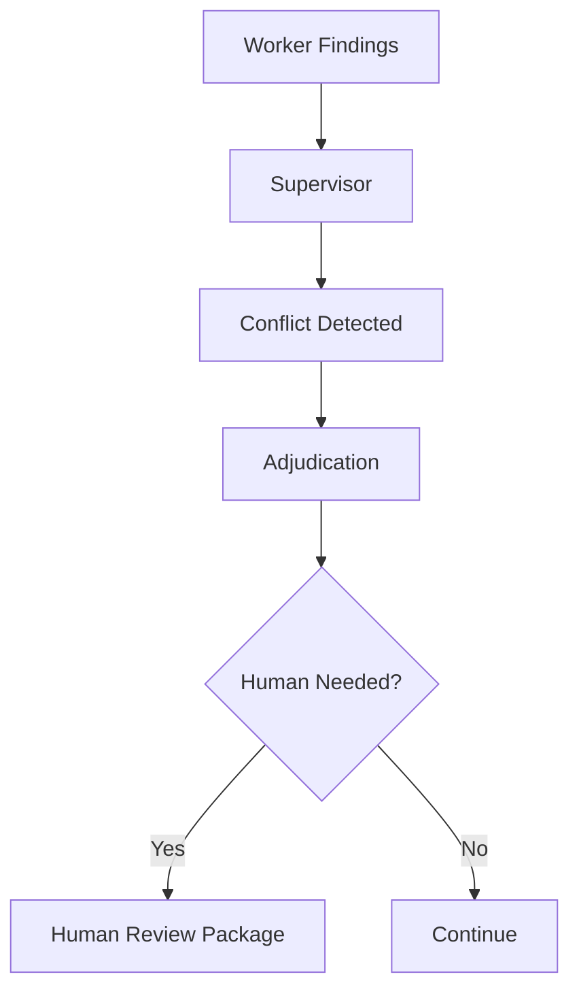
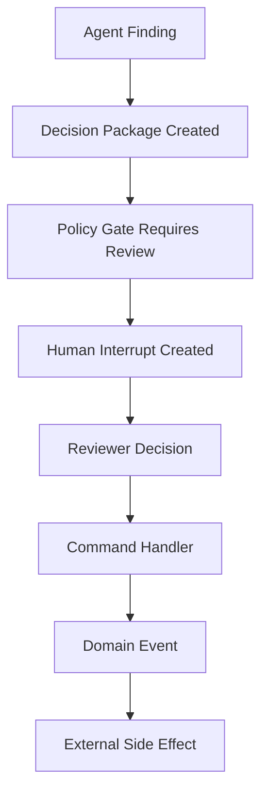

# Part 019 — Human-in-the-Loop Control Points

> Human-in-the-loop is not a button that says “approve.”
>
> It is a durable control point in a stateful system: with context, evidence, decision rights, policy, audit, timeout, escalation, and resume semantics.

Many teams add human review late:



That is not human-in-the-loop. That is post-hoc inspection.

Enterprise-grade human-in-the-loop means the system is explicitly designed to pause before authority crosses a risk boundary:



This part explains how to design human control points for stateful multi-agent systems.

---

## 1. Kaufman Framing

Using Kaufman's method, we deconstruct this skill into:

1. identify where human control is needed;
2. classify control type: approval, review, override, escalation, exception handling;
3. produce decision packages humans can actually evaluate;
4. persist interrupts durably;
5. resume safely after decision;
6. record decisions immutably;
7. prevent approval bypass;
8. handle timeout and delegation;
9. measure human review quality;
10. avoid human rubber-stamping.

### Target Performance

By the end of this part, you should be able to:

- design human-in-the-loop points as runtime states;
- distinguish human-in-the-loop, human-on-the-loop, and human-out-of-the-loop;
- create typed approval and decision package models;
- design interrupt/resume flows;
- place human review before high-impact side effects;
- implement audit-ready approval events;
- handle reviewer roles and authorization;
- model timeout, escalation, override, and rejection;
- prevent human review from becoming a fake control.

---

# 2. Human Control Modes

Human involvement is not one thing.

| Mode | Meaning | Example |
|---|---|---|
| Human-in-the-loop | human must approve before action continues | approve notice before send |
| Human-on-the-loop | system acts, human monitors/overrides | monitor low-risk auto-classification |
| Human-out-of-the-loop | no human involved | deterministic low-risk transformation |
| Human-over-the-loop | human sets policy/thresholds, reviews aggregate performance | governance board reviews metrics |
| Human-after-the-loop | post-hoc audit | monthly sample review |

In regulated/high-impact systems, be precise.

## Control Mode by Risk

| Risk | Suggested Control |
|---|---|
| low, reversible | automated + monitoring |
| medium, reviewable | human-on-the-loop or sampled review |
| high, externally visible | human-in-the-loop |
| critical, irreversible | human-led workflow with agent assistance |

---

# 3. The Human Control Boundary

Humans should be inserted at **authority transitions**, not randomly.

Authority transitions include:

- draft to send;
- recommendation to decision;
- internal note to official notice;
- risk score proposal to domain field update;
- evidence summary to legal/regulatory conclusion;
- reversible action to irreversible action;
- low-risk workflow to high-risk escalation.



A useful rule:

> Put humans where authority changes, not where the model merely thinks.

---

# 4. Approval Is a Command

Approval should not be a chat message.

Bad:

```text
User: approved
```

Better:

```python
from enum import Enum
from pydantic import BaseModel, Field


class HumanDecisionType(str, Enum):
    APPROVE = "approve"
    REJECT = "reject"
    REVISE = "revise"
    ESCALATE = "escalate"
    REQUEST_MORE_EVIDENCE = "request_more_evidence"


class HumanDecisionCommand(BaseModel):
    command_id: str
    tenant_id: str
    decision_package_id: str
    reviewer_id: str
    decision: HumanDecisionType
    comment: str | None = None
    expected_package_version: int
    idempotency_key: str
```

Approval is an explicit command with:

- reviewer identity;
- package version;
- decision type;
- idempotency;
- comment;
- authorization;
- audit trail.

---

# 5. Decision Package

A reviewer needs a structured package.

```python
class DecisionPackage(BaseModel):
    decision_package_id: str
    tenant_id: str
    run_id: str
    subject_type: str
    subject_id: str
    title: str
    proposed_action: str
    proposed_by: str
    rationale: str
    evidence_refs: list[str]
    risk_level: str
    confidence: float = Field(ge=0.0, le=1.0)
    known_uncertainties: list[str] = Field(default_factory=list)
    alternatives: list[str] = Field(default_factory=list)
    policy_basis: list[str] = Field(default_factory=list)
    side_effect_preview: dict = Field(default_factory=dict)
    version: int
```

## What a Good Decision Package Contains

- proposed action;
- rationale;
- evidence references;
- risk classification;
- confidence and uncertainty;
- policy basis;
- alternatives;
- side-effect preview;
- downstream impact;
- prior similar decisions if allowed;
- reviewer options;
- deadline;
- escalation path.

Humans should not approve opaque text.

---

# 6. Human Interrupt as Runtime State

Human review should pause execution durably.

```python
class HumanInterruptStatus(str, Enum):
    PENDING = "pending"
    DECIDED = "decided"
    EXPIRED = "expired"
    CANCELLED = "cancelled"
    ESCALATED = "escalated"


class HumanInterrupt(BaseModel):
    interrupt_id: str
    run_id: str
    thread_id: str
    tenant_id: str
    reason: str
    required_role: str
    decision_package_id: str
    status: HumanInterruptStatus
    created_at: str
    expires_at: str | None = None
```

## Interrupt Flow



The runtime is paused, not forgotten.

---

# 7. Resume After Human Decision

Resume must be deterministic.



## Resume Invariants

1. Resume starts from latest valid checkpoint.
2. Decision package version matches expected version.
3. Reviewer is authorized.
4. Decision is recorded before action.
5. Approved action matches package.
6. Side effects use idempotency.
7. Rejection/revision/escalation has explicit path.

---

# 8. Reviewer Authorization

Not every human can approve every action.

```python
class ReviewerAuthorization(BaseModel):
    reviewer_id: str
    roles: list[str]
    tenant_id: str
    scopes: list[str]
    max_risk_level: str
```

Approval check:

```python
def can_approve_notice(reviewer: ReviewerAuthorization, risk_level: str) -> bool:
    if "notice:approve" not in reviewer.scopes:
        return False

    if risk_level in {"high", "critical"} and "senior_reviewer" not in reviewer.roles:
        return False

    return True
```

Human identity and role checks belong outside the model.

---

# 9. Approval Event

Record approval as an immutable event.

```python
class HumanDecisionEvent(BaseModel):
    event_id: str
    event_type: str = "human.decision_recorded"
    event_version: str = "1.0"
    tenant_id: str
    run_id: str
    interrupt_id: str
    decision_package_id: str
    reviewer_id: str
    decision: HumanDecisionType
    comment: str | None = None
    policy_version: str
    occurred_at: str
```

Audit should show:

- who decided;
- what they saw;
- what version they saw;
- when they decided;
- what policy applied;
- what action followed.

---

# 10. Approval Is Not Execution

Approval and execution are separate.



A human approving a notice does not mean the notice was sent.

The notification service emits `notice.sent` after successful execution.

This distinction prevents audit confusion.

---

# 11. Override

Override allows a human to intentionally bypass or modify a system recommendation.

Overrides need stricter controls.

```python
class HumanOverrideCommand(BaseModel):
    command_id: str
    tenant_id: str
    decision_package_id: str
    reviewer_id: str
    original_recommendation: str
    override_decision: str
    override_reason: str
    evidence_refs: list[str]
    expected_package_version: int
```

## Override Rules

- require reason;
- require higher authority for high risk;
- record original recommendation;
- record override rationale;
- maybe trigger sample review;
- never silently replace system output.

Overrides are valuable feedback for evaluation and calibration.

---

# 12. Rejection and Revision

Human decisions should support more than approve/reject.

| Decision | Meaning |
|---|---|
| approve | action may proceed |
| reject | action must not proceed |
| revise | return to drafting/planning |
| request more evidence | route to evidence collection |
| escalate | send to higher authority |
| defer | wait until external condition |
| override | choose different action |

A binary approve/reject workflow is often too weak.

---

# 13. Human Review Queue

A review queue is a system component.

```python
class ReviewTask(BaseModel):
    review_task_id: str
    tenant_id: str
    interrupt_id: str
    decision_package_id: str
    required_role: str
    priority: str
    status: str
    assigned_to: str | None = None
    created_at: str
    due_at: str | None = None
```

Queue features:

- role-based assignment;
- priority;
- SLA/deadline;
- escalation;
- workload balancing;
- audit;
- conflict-of-interest checks;
- reviewer comments;
- reassignment.

Do not implement human review only as a chat prompt.

---

# 14. Timeout and Escalation

Human review can expire.



## Timeout Policy

```python
class ReviewTimeoutPolicy(BaseModel):
    interrupt_type: str
    timeout_minutes: int
    on_timeout: str  # escalate, cancel, defer, auto_reject
    escalation_role: str | None = None
```

Be careful with auto-approval. It is usually unsafe for high-impact actions.

---

# 15. Separation of Duties

In regulated workflows, the person who requested or drafted an action may not be allowed to approve it.

```python
def separation_of_duties_ok(proposer_id: str, reviewer_id: str) -> bool:
    return proposer_id != reviewer_id
```

This also applies to AI-assisted workflows:

- agent drafts;
- user requests;
- reviewer approves;
- service executes.

For sensitive actions, enforce reviewer independence.

---

# 16. Human Review UX

A good UI is part of correctness.

Reviewer should see:

- proposed action;
- generated output/draft;
- evidence references;
- policy basis;
- uncertainty;
- risk level;
- side-effect preview;
- system confidence;
- dissent/conflicts;
- previous reviewer comments;
- allowed decisions;
- consequence of approval.

Bad UI:

```text
Approve this AI output? [Yes] [No]
```

Good UI:

```text
Approve sending Notice Draft #456 to Entity ABC under Policy P-2026-04?
Evidence: doc_1, doc_7.
Known uncertainty: missing inspection record for May.
Consequence: external legal notice will be sent and case status will move to NOTIFIED.
```

Human review quality depends on decision context.

---

# 17. Rubber-Stamping Risk

Human-in-the-loop can become fake control.

Causes:

- too many approvals;
- poor decision package;
- time pressure;
- automation bias;
- reviewer lacks domain expertise;
- unclear accountability;
- no feedback loop;
- no sampling of approved decisions;
- UI makes approval too easy.

## Controls

- risk-based routing;
- decision package quality checks;
- reviewer training;
- randomized audit;
- require comments for high-risk approvals;
- track approval latency;
- track override/rejection rates;
- compare outcomes after approval;
- monitor reviewer variance.

---

# 18. Human Feedback as Data

Human decisions are valuable evaluation data.

Events to collect:

- approval;
- rejection;
- revision request;
- override;
- escalation;
- evidence requested;
- comment;
- time to decision;
- reviewer role;
- downstream outcome.

Use this to improve:

- routing;
- prompts;
- agent roles;
- evaluation sets;
- policy thresholds;
- UI;
- training examples.

But do not blindly train on all approvals. Human approval may also be wrong.

---

# 19. Review Quality Metrics

| Metric | Signal |
|---|---|
| approval rate | may show quality or rubber-stamping |
| rejection rate | output quality issue or strict review |
| override rate | system recommendation mismatch |
| revision rate | drafting/planning quality |
| escalation rate | uncertainty/risk |
| time to decision | workload/friction |
| approval after high uncertainty | possible risk |
| reviewer disagreement | policy ambiguity |
| post-approval incident rate | review effectiveness |
| sampled audit defect rate | true quality signal |

Metrics need interpretation.

---

# 20. Human-in-the-Loop in Multi-Agent Systems

In multi-agent systems, humans may review:

- supervisor decision package;
- disagreement artifact;
- high-risk dissent;
- notice draft;
- policy conflict;
- tool side-effect preview;
- memory update;
- final case transition.



Do not ask humans to review every agent message. Ask them to review meaningful control points.

---

# 21. Human Review for Memory

Memory writes may require human review when:

- memory is sensitive;
- memory affects future decisions;
- memory is organization-wide;
- memory is derived from ambiguous conversation;
- memory could encode bias or stale facts.

Example memory approval:

```python
class MemoryApprovalPackage(BaseModel):
    package_id: str
    proposed_memory: str
    subject_type: str
    subject_id: str
    source_refs: list[str]
    sensitivity: str
    retention: str
    proposed_by: str
```

Not all memory should be automatic.

---

# 22. Human Review for Tools

High-impact tools require approval.

Examples:

- send external notice;
- file regulatory action;
- freeze account;
- delete data;
- execute payment;
- update official status;
- send customer communication.

Tool executor should enforce approval:

```python
class ToolApprovalRequirement(BaseModel):
    tool_name: str
    effect_type: str
    min_reviewer_role: str
    approval_required: bool
```

If an agent asks to call a high-impact tool without approval, deny.

---

# 23. Human Review for Policy Exceptions

Sometimes a human approves an exception.

Example:

- proceed despite missing non-critical evidence;
- override default risk threshold;
- reopen closed case;
- send notice outside normal SLA.

Exceptions need strong audit.

```python
class PolicyExceptionDecision(BaseModel):
    exception_id: str
    policy_id: str
    requested_exception: str
    approver_id: str
    justification: str
    expires_at: str | None = None
```

Policy exceptions should not become hidden precedent unless explicitly governed.

---

# 24. Audit Trail

Human control points need an audit chain.



For every high-impact action, audit should answer:

- what was proposed?
- by whom/what?
- based on what evidence?
- what did the human see?
- who approved?
- under what authority?
- what happened after approval?
- was the action actually executed?
- was it later overridden or reversed?

---

# 25. Python Review Flow Sketch

```python
class ReviewService:
    async def create_interrupt(
        self,
        *,
        run_id: str,
        thread_id: str,
        tenant_id: str,
        decision_package: DecisionPackage,
        required_role: str,
    ) -> HumanInterrupt:
        interrupt = HumanInterrupt(
            interrupt_id=new_id("hint"),
            run_id=run_id,
            thread_id=thread_id,
            tenant_id=tenant_id,
            reason=f"Human review required for {decision_package.proposed_action}",
            required_role=required_role,
            decision_package_id=decision_package.decision_package_id,
            status=HumanInterruptStatus.PENDING,
            created_at=now_iso(),
        )

        await save_decision_package(decision_package)
        await save_interrupt(interrupt)
        await create_review_task(interrupt)

        return interrupt

    async def submit_decision(
        self,
        command: HumanDecisionCommand,
    ) -> HumanDecisionEvent:
        package = await load_decision_package(command.decision_package_id)

        if package.version != command.expected_package_version:
            raise ValueError("Decision package version mismatch.")

        if not await reviewer_authorized(command.reviewer_id, package):
            raise PermissionError("Reviewer not authorized.")

        event = HumanDecisionEvent(
            event_id=new_id("evt"),
            tenant_id=command.tenant_id,
            run_id=package.run_id,
            interrupt_id=await get_interrupt_id(package.decision_package_id),
            decision_package_id=package.decision_package_id,
            reviewer_id=command.reviewer_id,
            decision=command.decision,
            comment=command.comment,
            policy_version="policy_2026_06",
            occurred_at=now_iso(),
        )

        await append_event(event)
        await mark_interrupt_decided(event.interrupt_id)

        return event
```

This code is intentionally simplified, but the boundaries are visible.

---

# 26. Failure Modes

| Failure | Description | Mitigation |
|---|---|---|
| approval lost | decision stored only in UI | durable event |
| wrong reviewer | no authorization check | role/scope validation |
| stale package approved | package changed after review | expected version |
| approval bypass | tool executes without approval | tool executor policy |
| duplicate approval | user submits twice | idempotency key |
| rubber stamping | humans approve blindly | metrics/audit/risk-based review |
| opaque package | reviewer lacks evidence | decision package requirements |
| timeout ignored | pending forever | timeout/escalation policy |
| approval != execution confusion | audit says approved but not sent | separate events |
| no rejection path | only approve available | richer decision types |
| conflict hidden | reviewer sees only final answer | include dissent/conflicts |

---

# 27. Production Checklist

Before adding a human control point:

- [ ] what authority boundary is being controlled?
- [ ] what risk requires human involvement?
- [ ] what role can approve?
- [ ] is reviewer authorization enforced?
- [ ] is decision package typed?
- [ ] are evidence refs included?
- [ ] is uncertainty included?
- [ ] is side-effect preview included?
- [ ] is interrupt durable?
- [ ] is resume deterministic?
- [ ] is approval separated from execution?
- [ ] is decision version checked?
- [ ] is idempotency handled?
- [ ] is timeout/escalation defined?
- [ ] is rejection/revision supported?
- [ ] is audit event immutable?
- [ ] are metrics collected?
- [ ] is rubber-stamping monitored?

---

# 28. Practice Drill

Design human-in-the-loop for an enforcement notice workflow.

Requirements:

- agent drafts notice;
- risk agent flags high risk;
- policy agent identifies applicable rule;
- supervisor creates decision package;
- human reviewer approves/rejects/revises;
- notice can only be sent after approval;
- approval expires after 48 hours;
- reviewer cannot be original requester;
- all decisions must be auditable.

Deliverables:

1. decision package schema;
2. interrupt schema;
3. review task schema;
4. approval command;
5. human decision event;
6. timeout policy;
7. reviewer authorization rule;
8. separation-of-duties rule;
9. resume flow;
10. failure mode tests.

---

# 29. What Top 1% Engineers Pay Attention To

Top engineers ask:

- Why is a human needed here?
- What exactly is the human approving?
- What evidence does the human see?
- What does approval authorize?
- What does approval not authorize?
- What happens if the package changes?
- What happens if the reviewer is not qualified?
- What happens if the reviewer disagrees?
- What happens if the review times out?
- What happens if approval is duplicated?
- What event proves approval happened?
- What event proves execution happened?
- Is this reducing risk or creating control theater?

They treat human review as a system design problem.

---

# 30. Summary

In this part, we covered:

- human control modes;
- authority boundaries;
- approval as command;
- decision packages;
- human interrupts;
- resume after decision;
- reviewer authorization;
- approval events;
- approval vs execution;
- override;
- rejection and revision;
- review queues;
- timeout and escalation;
- separation of duties;
- review UX;
- rubber-stamping risk;
- feedback as data;
- review quality metrics;
- human review for multi-agent systems, memory, tools, and policy exceptions;
- audit trails;
- Python review flow;
- failure modes;
- production checklist.

The key principle:

> Human-in-the-loop is only meaningful when the human has the right context, authority, timing, and audit trail.

The next part begins memory architecture: **short-term, long-term, episodic, semantic, and procedural memory**.

---

## References

- LangGraph documentation: interrupts and human-in-the-loop execution with persistence/checkpointers.
- NIST AI Risk Management Framework: risk governance and accountability.
- Enterprise workflow patterns: approval, separation of duties, audit trail, escalation.
