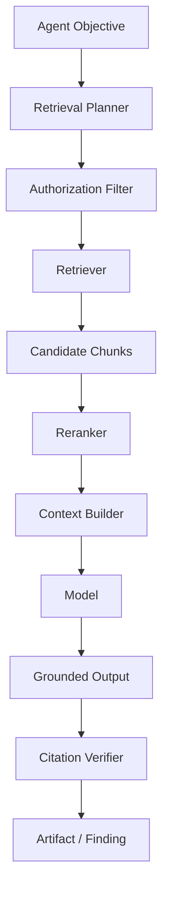
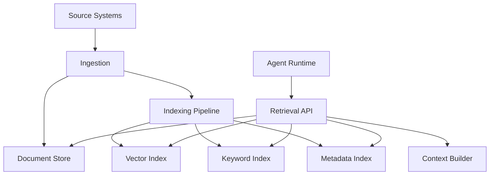
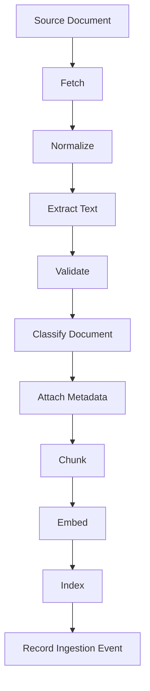
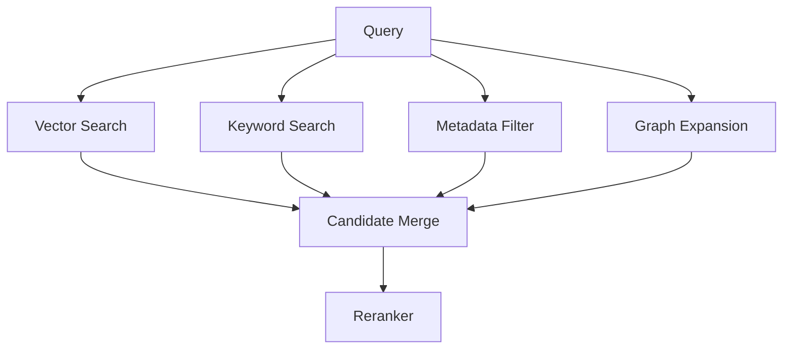
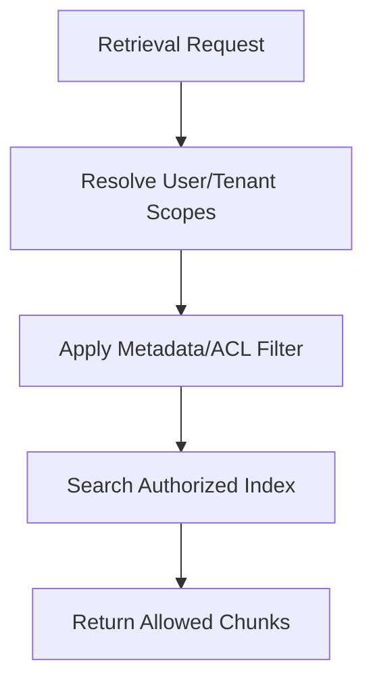
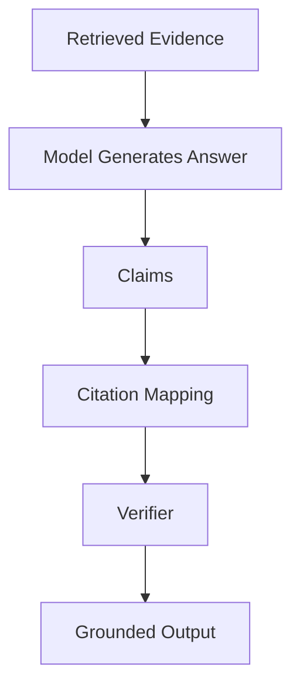
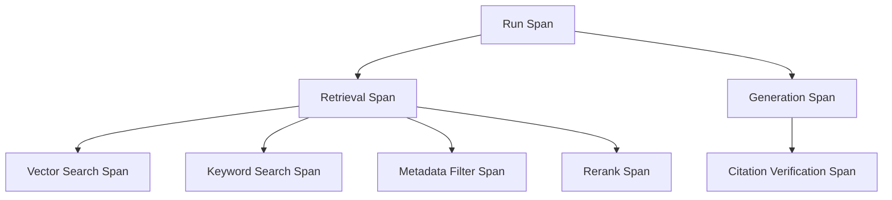
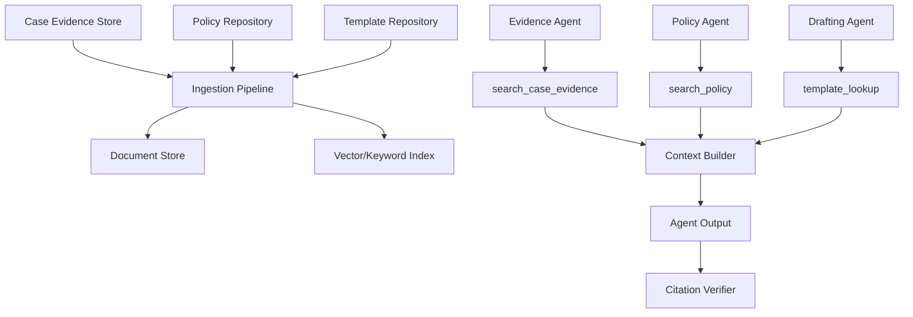
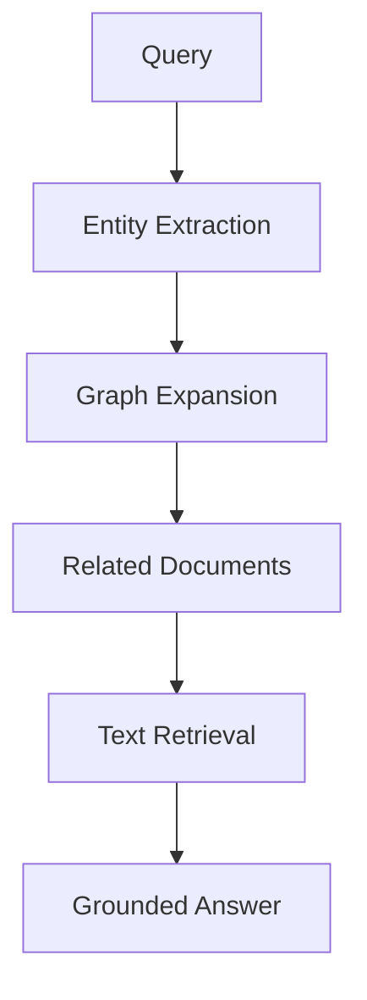
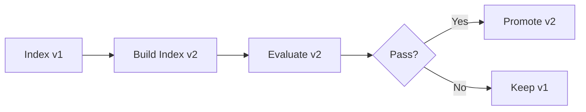

# Part 022 — RAG as a System Component, Not a Feature

> RAG is not “put a vector database next to the LLM.”
>
> RAG is a subsystem for controlled evidence acquisition, indexing, retrieval, ranking, grounding, authorization, freshness, evaluation, and audit.

Retrieval-Augmented Generation is often introduced as:

1. chunk documents;
2. embed chunks;
3. retrieve top-k chunks;
4. pass chunks to the LLM;
5. generate answer.

That is a useful starting point, but it is not enterprise-grade.

In stateful multi-agent systems, RAG must answer:

- Which corpus is authoritative?
- Who can retrieve which document?
- What version was retrieved?
- Is the document fresh?
- Was the chunk relevant?
- Was the answer grounded?
- Did the agent cite correct evidence?
- Did retrieval miss critical evidence?
- Did prompt injection enter through retrieval?
- Can the decision be audited later?

This part treats RAG as a production system component.

---

## 1. Kaufman Framing

Using Kaufman's method, we deconstruct enterprise RAG into:

1. define corpus and authority;
2. ingest documents safely;
3. chunk and enrich metadata;
4. index for retrieval;
5. retrieve by task and permission;
6. rank and filter evidence;
7. assemble context with provenance;
8. generate grounded output;
9. verify citations;
10. evaluate retrieval and answer quality;
11. monitor drift, freshness, and failures.

### Target Performance

By the end of this part, you should be able to:

- design an enterprise RAG pipeline;
- distinguish retrieval, grounding, and generation;
- model document/chunk metadata;
- enforce tenant and document authorization;
- handle freshness and versioning;
- combine vector, keyword, metadata, and graph retrieval;
- use reranking;
- prevent prompt injection from retrieved content;
- evaluate retrieval precision/recall and grounding;
- design RAG observability and audit trails.

---

# 2. RAG in the Agent Runtime



RAG is not just the retriever. It includes:

- query planning;
- authorization;
- retrieval;
- reranking;
- context assembly;
- generation;
- citation verification;
- audit.

---

# 3. RAG System Boundaries

A RAG subsystem has several boundaries.



## Components

| Component | Responsibility |
|---|---|
| source connector | fetch data from source systems |
| ingestion pipeline | normalize and validate documents |
| document store | store canonical document/content refs |
| chunker | split documents into retrievable units |
| metadata enricher | attach tenant, ACL, version, type, date |
| embedding pipeline | create vector representations |
| index store | support retrieval |
| retrieval API | serve authorized retrieval |
| reranker | improve candidate ordering |
| context builder | assemble retrieved evidence into model context |
| verifier | check grounded output/citations |
| evaluator | measure quality |

---

# 4. Corpus Authority

Not every corpus should be treated equally.

| Corpus | Authority |
|---|---|
| official policy repository | high |
| case evidence store | high for case facts |
| user-uploaded document | evidence, not instruction |
| public web page | low/variable |
| internal wiki | medium, may be stale |
| chat history | conversation record |
| model-generated summary | derived |
| previous agent output | derived/proposed |

RAG must preserve source authority.

A policy excerpt from an official policy repository is not equal to an email containing someone's interpretation of the policy.

---

# 5. Document Model

```python
from enum import Enum
from pydantic import BaseModel, Field


class DocumentAuthority(str, Enum):
    AUTHORITATIVE = "authoritative"
    CURATED = "curated"
    USER_PROVIDED = "user_provided"
    EXTERNAL = "external"
    MODEL_DERIVED = "model_derived"


class DocumentRecord(BaseModel):
    document_id: str
    tenant_id: str
    source_system: str
    source_uri: str | None = None
    title: str
    document_type: str
    authority: DocumentAuthority
    version: str | None = None
    effective_from: str | None = None
    effective_until: str | None = None
    created_at: str
    updated_at: str
    access_labels: list[str] = Field(default_factory=list)
    content_hash: str
```

Document metadata is part of retrieval quality and security.

---

# 6. Chunk Model

```python
class ChunkRecord(BaseModel):
    chunk_id: str
    document_id: str
    tenant_id: str
    chunk_index: int
    text: str
    token_count: int
    section_title: str | None = None
    page_number: int | None = None
    heading_path: list[str] = Field(default_factory=list)
    content_hash: str
    embedding_model: str | None = None
    index_version: str
    access_labels: list[str] = Field(default_factory=list)
```

Chunks need enough metadata to support:

- citations;
- permission filtering;
- relevance ranking;
- source reconstruction;
- deletion;
- reindexing;
- freshness checks.

---

# 7. Ingestion Pipeline



## Ingestion Invariants

1. Source identity is recorded.
2. Content hash is computed.
3. Document version is recorded.
4. Access labels are attached.
5. Text extraction quality is checked.
6. Chunking strategy is versioned.
7. Embedding model version is recorded.
8. Index version is recorded.
9. Deletion/reindexing path exists.
10. Ingestion emits audit events.

---

# 8. Chunking Strategy

Chunking affects retrieval.

## Common Strategies

| Strategy | Use |
|---|---|
| fixed-size chunk | simple baseline |
| heading-aware chunk | policy/docs/manuals |
| semantic chunk | coherent topic units |
| page-based chunk | PDFs/legal docs |
| paragraph chunk | short texts |
| sliding window | preserve context overlap |
| table-aware chunk | structured data |
| code-aware chunk | repositories |

Bad chunking can destroy meaning.

Example: splitting policy condition from exception creates wrong retrieval.

## Chunking Rule

> Chunk by meaning and citation needs, not just token count.

---

# 9. Metadata Matters

Metadata enables precise retrieval.

Useful fields:

- tenant ID;
- document type;
- authority;
- effective date;
- policy version;
- case ID;
- entity ID;
- language;
- jurisdiction;
- access labels;
- source system;
- section heading;
- page number;
- content hash;
- index version.

Metadata filtering often matters as much as vector similarity.

---

# 10. Retrieval Types

Enterprise RAG usually needs hybrid retrieval.

| Retrieval Type | Strength |
|---|---|
| vector search | semantic similarity |
| keyword/BM25 | exact term matching |
| metadata filtering | permission/scope/freshness |
| graph traversal | relationships |
| SQL/query | structured data |
| curated lookup | authoritative mappings |
| temporal retrieval | effective-date logic |
| multimodal retrieval | images/tables/scans |

## Hybrid Retrieval



Vector-only retrieval is often insufficient for enterprise.

---

# 11. Query Planning

Agents may need to reformulate retrieval queries.

```python
class RetrievalQueryPlan(BaseModel):
    objective: str
    queries: list[str]
    required_document_types: list[str]
    metadata_filters: dict
    max_results: int = Field(ge=1, le=50)
    freshness_required: bool = False
```

Example:

```text
Objective: Determine whether policy P applies to case_123.
Queries:
- "policy P applicability entity type X"
- "exception for entity type X policy P"
Required document types: policy, guidance
Metadata filters: policy_version=2026-06
```

Query planning is useful, but retrieval API must enforce authorization and limits.

---

# 12. Authorization Before Retrieval

Do not retrieve first and filter later in the prompt.



## Retrieval Request

```python
class RetrievalRequest(BaseModel):
    request_id: str
    tenant_id: str
    requester_id: str
    run_id: str
    query: str
    document_types: list[str] = Field(default_factory=list)
    metadata_filters: dict = Field(default_factory=dict)
    max_results: int = Field(ge=1, le=50)
```

The retriever should never depend on model obedience for access control.

---

# 13. Reranking

Initial retrieval can be noisy. Reranking improves order.

Reranker inputs:

- query;
- candidate chunk;
- metadata;
- task type;
- source authority;
- freshness;
- role-specific criteria.

```python
class RetrievedChunk(BaseModel):
    chunk_id: str
    document_id: str
    text: str
    retrieval_score: float
    metadata: dict


class RerankedChunk(BaseModel):
    chunk_id: str
    rerank_score: float
    reason: str | None = None
```

Reranking should be evaluated because it can also introduce bias.

---

# 14. Grounding

Grounding means output claims are supported by retrieved evidence.



## Grounded Output Contract

```python
class GroundedClaim(BaseModel):
    claim: str
    evidence_refs: list[str]
    confidence: float = Field(ge=0.0, le=1.0)


class GroundedAnswer(BaseModel):
    answer: str
    claims: list[GroundedClaim]
    missing_evidence: list[str] = Field(default_factory=list)
```

If no evidence supports a claim, it should not appear as fact.

---

# 15. Citation Verification

The system should verify cited chunks exist and support claims.

```python
class CitationVerificationResult(BaseModel):
    claim: str
    evidence_refs_exist: bool
    evidence_supports_claim: bool
    unsupported_reason: str | None = None
```

Verification can be:

- deterministic existence check;
- lexical overlap check;
- model-assisted entailment check;
- human review for high-risk claims.

Schema-valid citations are not enough. The cited source must actually support the claim.

---

# 16. Freshness

Enterprise RAG must handle freshness.

Examples:

- policy effective dates;
- product documentation versions;
- current customer status;
- active case evidence;
- superseded guidance;
- expired procedures.

## Freshness Metadata

```python
class FreshnessMetadata(BaseModel):
    effective_from: str | None = None
    effective_until: str | None = None
    indexed_at: str
    source_updated_at: str | None = None
    superseded_by: str | None = None
```

## Freshness Rule

> If the answer depends on current state, query the authoritative system, not stale memory or old indexed chunks.

RAG is not a replacement for live source-of-truth queries.

---

# 17. Versioning

Record versions:

- document version;
- chunking version;
- embedding model version;
- index version;
- retrieval algorithm version;
- reranker version;
- prompt/context builder version;
- policy version.

```python
class RetrievalManifest(BaseModel):
    retrieval_id: str
    query: str
    index_version: str
    embedding_model: str
    retriever_version: str
    reranker_version: str | None = None
    returned_chunk_ids: list[str]
```

This allows debugging when retrieval behavior changes.

---

# 18. RAG and Multi-Agent Systems

Different agents need different retrieval.

| Agent | Retrieval Need |
|---|---|
| evidence agent | broad case evidence search |
| policy agent | authoritative policy/guidance |
| risk agent | evidence + risk rubric |
| drafting agent | approved facts + templates |
| verifier | source documents for citations |
| supervisor | findings and conflict summaries |

Do not let every agent retrieve everything.

Use role-based retrieval profiles.

```python
class RetrievalProfile(BaseModel):
    agent_name: str
    allowed_document_types: list[str]
    allowed_corpora: list[str]
    max_results: int
    requires_authoritative_sources: bool
```

---

# 19. RAG and Tool Calling

RAG can be exposed as tools.

Examples:

- `search_case_evidence`
- `fetch_document_excerpt`
- `search_policy`
- `get_effective_policy_version`
- `verify_citation`
- `find_similar_cases`

Each retrieval tool needs a contract and permission model.

Do not expose a generic unrestricted `search_all_documents` tool unless heavily governed.

---

# 20. RAG Failure Modes

| Failure | Description | Mitigation |
|---|---|---|
| retrieval miss | critical evidence not returned | hybrid retrieval + eval |
| irrelevant retrieval | noisy chunks | reranking + filtering |
| stale retrieval | old document used | freshness metadata |
| unauthorized retrieval | access control failure | pre-retrieval ACL |
| prompt injection | retrieved text contains instructions | isolation + policy/tool gates |
| citation hallucination | cites nonexistent source | citation verifier |
| citation mismatch | source does not support claim | entailment/human verification |
| chunk boundary error | relevant context split | better chunking |
| index drift | behavior changes after reindex | index versioning |
| over-retrieval | context polluted | top-k/rerank/budget |
| under-retrieval | insufficient evidence | sufficiency checks |
| source authority confusion | email treated as policy | authority metadata |

---

# 21. Retrieval Evaluation

Evaluate retrieval independently from generation.

## Retrieval Metrics

| Metric | Meaning |
|---|---|
| recall@k | did retrieval find needed evidence? |
| precision@k | are retrieved chunks relevant? |
| MRR | how high was first relevant result? |
| nDCG | ranking quality |
| coverage | did retrieval cover all required aspects? |
| authorization correctness | no forbidden chunks |
| freshness correctness | no superseded chunks |
| latency | retrieval performance |
| cost | indexing/query cost |

## Golden Set

Create test cases:

```python
class RetrievalTestCase(BaseModel):
    test_id: str
    query: str
    required_chunk_ids: list[str]
    forbidden_chunk_ids: list[str] = Field(default_factory=list)
    metadata_filters: dict = Field(default_factory=dict)
```

Run retrieval regression after:

- chunking changes;
- embedding model changes;
- index updates;
- reranker changes;
- corpus changes.

---

# 22. Generation Evaluation

Evaluate grounded answers.

| Metric | Meaning |
|---|---|
| answer correctness | final answer correct |
| faithfulness | answer supported by retrieved evidence |
| citation accuracy | citations support claims |
| abstention quality | refuses/flags missing evidence |
| completeness | covers required aspects |
| hallucination rate | unsupported claims |
| policy compliance | respects allowed source/authority |
| uncertainty disclosure | states limitations |

RAG evaluation should include both retrieval and generation.

---

# 23. RAG Observability

Track:

- retrieval query;
- metadata filters;
- index version;
- retriever version;
- reranker version;
- returned chunk IDs;
- chunk scores;
- document authority;
- access labels;
- omitted chunks;
- latency;
- token contribution;
- citation verification results;
- output claims.

## Trace Shape



If answer quality drops, observability helps locate whether retrieval or generation failed.

---

# 24. RAG Security

Security risks:

- unauthorized data retrieval;
- cross-tenant leakage;
- prompt injection;
- sensitive data in prompt;
- retrieval of secrets;
- malicious documents;
- poisoned corpus;
- tool abuse through retrieved instructions;
- metadata leakage.

Controls:

- tenant-scoped indexes or strict ACL filters;
- document sensitivity labels;
- pre-retrieval authorization;
- post-retrieval redaction;
- untrusted content isolation;
- source trust scoring;
- ingestion validation;
- corpus change audit;
- deletion propagation;
- access logging.

Do not rely on the LLM to ignore data it was not supposed to see.

---

# 25. RAG for Regulated Case Management

Example architecture:



## Key Rules

- case evidence retrieval must be case-scoped;
- policy retrieval must respect effective date;
- drafting agent should use approved facts, not raw unverified evidence;
- citation verifier checks every evidence reference;
- high-impact outputs require human review.

---

# 26. RAG and Structured Data

Do not use vector search for everything.

If the question is:

> What is the current case status?

Use domain database/service.

If the question is:

> Which evidence documents discuss repeated late filings?

Use retrieval.

If the question is:

> Which policy version was active on June 1?

Use policy service/effective-date query.

## Rule

> Use RAG for unstructured evidence. Use authoritative queries for structured current facts.

---

# 27. RAG and Tables

Tables are often mishandled.

Bad chunking:

```text
Split table rows across chunks with no headers.
```

Better:

- preserve headers;
- include row/column labels;
- convert to structured representation;
- store table metadata;
- cite cell ranges if needed.

For high-risk tabular reasoning, use structured extraction and validation, not only embeddings.

---

# 28. RAG and PDFs/Scans

PDF ingestion can fail due to:

- OCR errors;
- layout issues;
- footnotes;
- columns;
- tables;
- headers/footers;
- page references;
- scanned images.

In regulated systems:

- track extraction quality;
- preserve page numbers;
- allow human inspection;
- cite page/source;
- avoid overtrusting OCR;
- reprocess when extraction pipeline improves.

---

# 29. RAG and Knowledge Graphs

RAG retrieves text. Knowledge graphs retrieve relationships.

Hybrid pattern:



Useful for:

- entity relationships;
- case linkage;
- policy applicability;
- ownership/control structures;
- enforcement history.

We will cover knowledge graphs deeper in Part 023.

---

# 30. RAG Evaluation Harness

A minimal harness:

```python
class RagEvaluationCase(BaseModel):
    case_id: str
    question: str
    expected_answer_points: list[str]
    required_evidence_refs: list[str]
    forbidden_evidence_refs: list[str] = Field(default_factory=list)


class RagEvaluationResult(BaseModel):
    case_id: str
    retrieved_refs: list[str]
    answer: str
    cited_refs: list[str]
    retrieval_recall: float
    citation_accuracy: float
    grounded: bool
```

Evaluation should run in CI/CD for retrieval/index changes.

---

# 31. RAG Operations

Operational tasks:

- reindex corpus;
- delete documents;
- update ACLs;
- rotate embedding model;
- backfill metadata;
- rebuild chunks;
- validate index consistency;
- detect stale documents;
- monitor retrieval quality;
- rollback bad index;
- investigate bad answer.

RAG is an operational system.

---

# 32. Deployment and Index Versioning

Do not overwrite production index without rollback.



Record index version in run manifest.

If a bad index caused bad outputs, you need to know which runs used it.

---

# 33. Anti-Patterns

## Anti-Pattern 1 — Vector DB as Magic Memory

Embeddings do not solve authority, freshness, permission, or provenance.

## Anti-Pattern 2 — Retrieve Then Filter in Prompt

Unauthorized data already leaked to the model.

## Anti-Pattern 3 — No Source Metadata

Cannot audit or cite.

## Anti-Pattern 4 — Top-K Without Rerank

Noisy chunks pollute context.

## Anti-Pattern 5 — RAG for Current Structured Facts

Use authoritative services instead.

## Anti-Pattern 6 — No Retrieval Evaluation

You cannot know whether retrieval is good.

## Anti-Pattern 7 — Citation Theater

Generated citations exist but do not support claims.

## Anti-Pattern 8 — Ignoring Freshness

Old policy/document drives current decision.

---

# 34. Production Checklist

Before shipping RAG:

- [ ] corpus authority is classified;
- [ ] ingestion pipeline is versioned;
- [ ] document metadata includes tenant/access/version;
- [ ] chunking strategy is tested;
- [ ] embedding/index versions are recorded;
- [ ] pre-retrieval authorization is enforced;
- [ ] retrieval supports metadata filters;
- [ ] hybrid retrieval considered;
- [ ] reranking evaluated;
- [ ] context builder labels untrusted evidence;
- [ ] prompt injection controls exist;
- [ ] citations are verified;
- [ ] freshness is enforced;
- [ ] deletion/reindexing works;
- [ ] retrieval evaluation set exists;
- [ ] generation faithfulness evaluation exists;
- [ ] observability links chunks to outputs;
- [ ] bad index rollback is possible;
- [ ] RAG failures have escalation paths.

---

# 35. Practice Drill

Design RAG for an enterprise regulatory case assistant.

Requirements:

- retrieve case evidence by case ID;
- retrieve policy by effective date;
- retrieve templates by notice type;
- enforce tenant and case access;
- preserve page/section citations;
- reject stale policy;
- isolate user-uploaded document text as untrusted;
- verify citations before decision package;
- evaluate retrieval recall.

Deliverables:

1. document model;
2. chunk model;
3. ingestion pipeline;
4. metadata schema;
5. retrieval request schema;
6. retrieval profile by agent;
7. authorization filter;
8. freshness rule;
9. reranking strategy;
10. citation verifier;
11. RAG evaluation dataset;
12. observability plan.

---

# 36. What Top 1% Engineers Pay Attention To

Top engineers ask:

- What corpus is authoritative?
- What exactly was retrieved?
- Was the user allowed to retrieve it?
- What version was retrieved?
- Was the document effective at the relevant time?
- Did retrieval miss critical evidence?
- Did reranking bury the important chunk?
- Did the output cite real supporting evidence?
- Did retrieved content contain malicious instructions?
- Is RAG being used for data that should come from a database?
- Can we replay retrieval later?
- Can we rollback a bad index?
- Is retrieval quality measured separately from generation?
- Is citation accuracy tested?
- What happens when evidence is missing?

They treat RAG as evidence infrastructure, not a prompt trick.

---

# 37. Summary

In this part, we covered:

- RAG as subsystem;
- RAG runtime boundaries;
- corpus authority;
- document model;
- chunk model;
- ingestion pipeline;
- chunking;
- metadata;
- retrieval types;
- query planning;
- authorization;
- reranking;
- grounding;
- citation verification;
- freshness;
- versioning;
- multi-agent retrieval profiles;
- RAG tools;
- failure modes;
- retrieval evaluation;
- generation evaluation;
- observability;
- security;
- regulated case management architecture;
- structured data vs RAG;
- tables/PDFs;
- knowledge graphs;
- evaluation harness;
- operations;
- index versioning;
- anti-patterns.

The key principle:

> RAG is not a feature. It is the evidence supply chain for agentic reasoning.

The next part goes deeper into **Knowledge Graphs and Symbolic State for Agent Reasoning**.

---

## References

- Retrieval-augmented generation architecture and evaluation literature.
- Enterprise search/retrieval engineering: indexing, metadata, ACL filtering, ranking, and relevance evaluation.
- Model Context Protocol concepts: resources and tools as separate boundaries.
- AI security patterns: prompt injection, data leakage, and retrieval poisoning controls.
