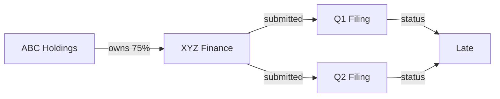
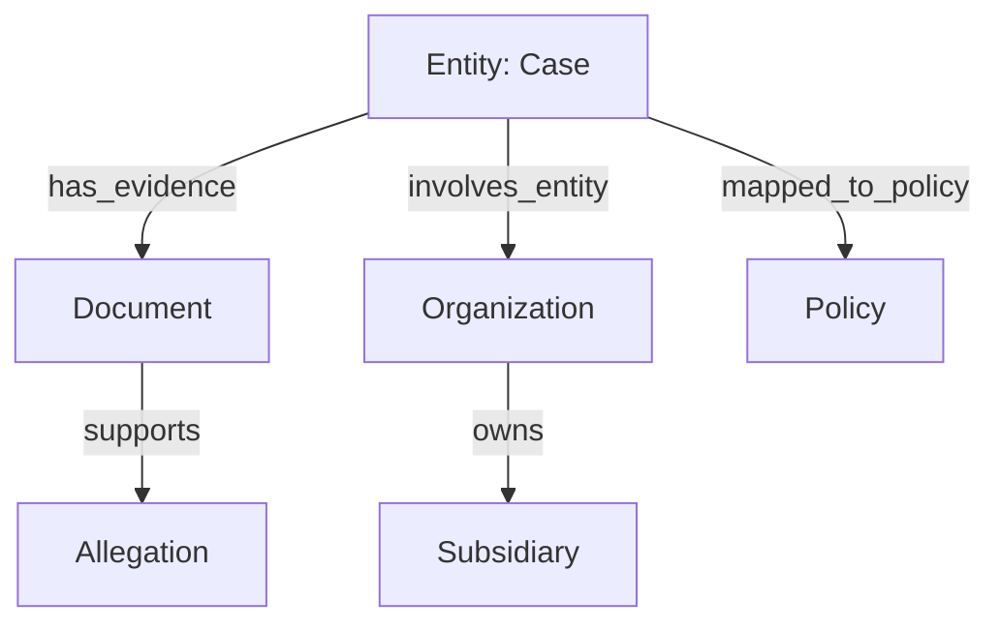
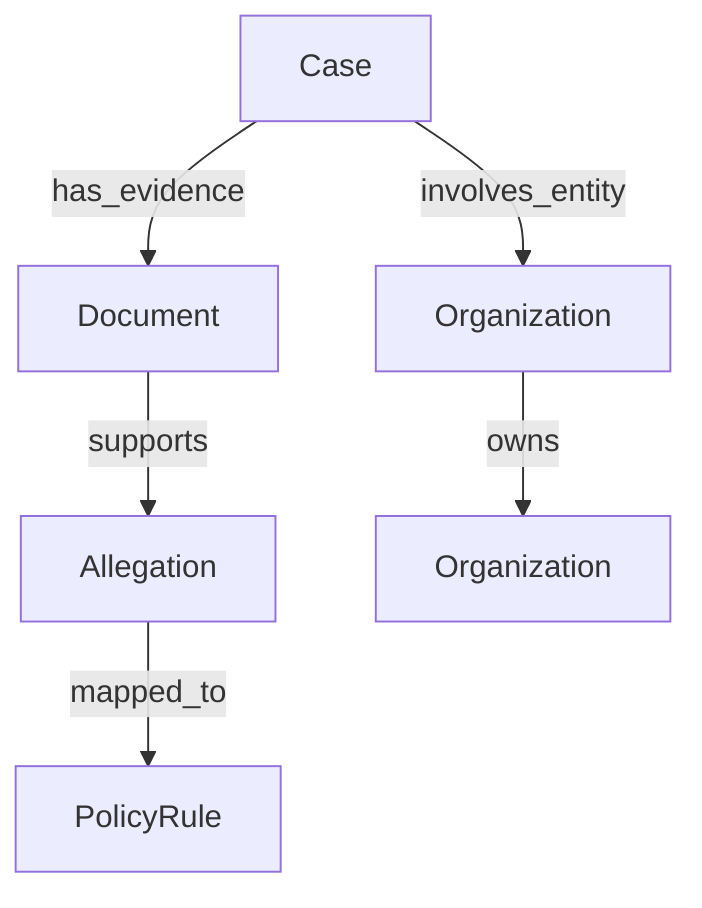
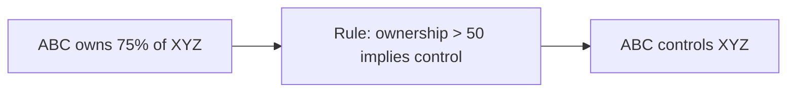
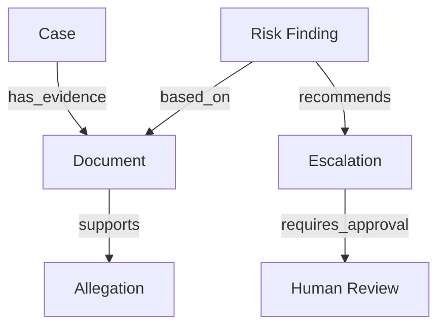
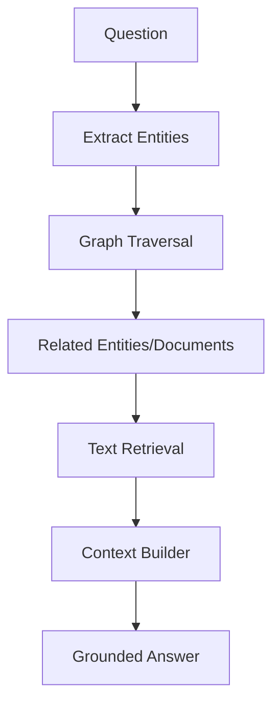
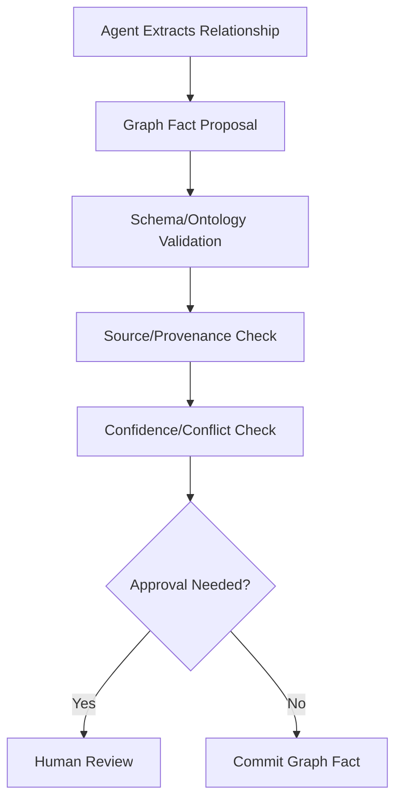
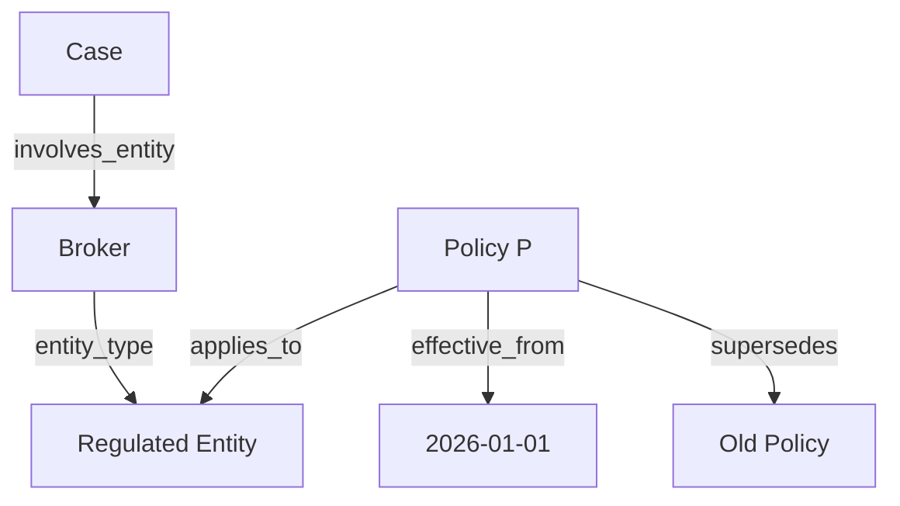
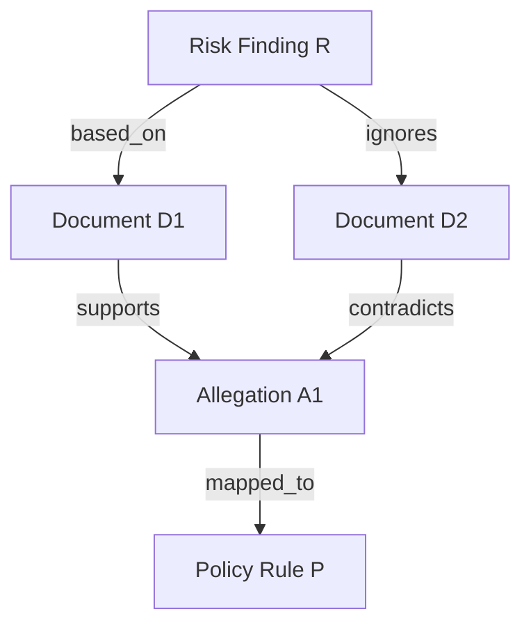
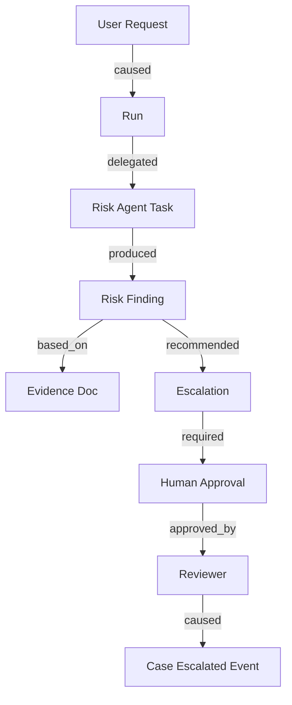

# Part 023 — Knowledge Graphs and Symbolic State

> Vector retrieval helps an agent find relevant text.
>
> Symbolic state helps an agent understand **entities, relationships, constraints, temporal validity, ownership, policy applicability, and causal structure**.

RAG is strong for unstructured evidence. But many enterprise AI problems are not only text problems.

They are relationship problems:

- Which entity owns which account?
- Which policy applies to which case type?
- Which evidence supports which allegation?
- Which case is related to which prior enforcement action?
- Which regulation supersedes which earlier rule?
- Which user has authority over which tenant and case?
- Which notice draft was approved by which reviewer under which policy version?
- Which agent finding conflicts with which evidence?

These questions are easier to answer when part of the system knowledge is represented as symbolic state or a knowledge graph.

This part explains how to use knowledge graphs and symbolic state in enterprise-grade stateful multi-agent AI systems.

---

## 1. Kaufman Framing

Using Kaufman's method, we deconstruct the skill into:

1. identify when text retrieval is insufficient;
2. model entities and relationships;
3. represent facts as triples or typed edges;
4. attach provenance and temporal validity;
5. separate asserted facts from inferred facts;
6. resolve entities across systems;
7. combine graph retrieval with text retrieval;
8. expose graph capabilities as governed tools;
9. use graph constraints for validation;
10. evaluate graph quality and reasoning safety.

### Target Performance

By the end of this part, you should be able to:

- explain why knowledge graphs complement RAG;
- design entity, relationship, and fact models;
- model provenance, confidence, and validity windows;
- distinguish symbolic state, domain state, memory, and artifacts;
- implement simple graph operations in Python;
- use graph traversal for context engineering;
- design graph-RAG patterns;
- avoid unsafe inferred facts;
- govern graph updates from agents;
- test graph consistency and quality.

---

# 2. Why Knowledge Graphs Matter

A text chunk can say:

```text
ABC Holdings owns 75% of XYZ Finance. XYZ Finance submitted late filings in Q1 and Q2.
```

A vector index can retrieve this text.

A graph can represent:



Now the system can ask:

- What entities are connected to XYZ Finance?
- Does ABC Holdings control XYZ Finance?
- Which filings were late?
- Which evidence supports each edge?
- Is this relationship current or expired?
- Which policy applies to controlled entities?

This is not just retrieval. It is structured reasoning over relationships.

---

# 3. Knowledge Graph vs RAG vs Memory vs Domain State

| Concept | Purpose | Example |
|---|---|---|
| RAG | retrieve relevant evidence text | policy paragraph, document excerpt |
| Knowledge graph | represent entities and relationships | company owns account |
| Memory | reusable behavioral/domain hint | analyst prefers evidence table |
| Domain state | authoritative business state | case status is under review |
| Artifact | durable produced output | risk assessment report |
| Event log | record of what happened | notice approved |

A graph can reference all of these, but it should not blur them.

## Rule

> A knowledge graph can organize facts. It should not silently become the authoritative source for all business state.

If account status is owned by a core banking system, query that system.

If ownership relationships are curated into a graph, use the graph with provenance.

---

# 4. Basic Graph Model

A graph consists of:

- nodes/entities;
- edges/relationships;
- properties;
- labels/types;
- provenance;
- confidence;
- validity;
- source references.



## Triple Model

A simple symbolic fact can be represented as:

```text
subject -- predicate --> object
```

Example:

```text
ABC Holdings -- owns --> XYZ Finance
Document 123 -- supports --> Allegation 456
Policy P -- applies_to --> EntityType Broker
```

---

# 5. RDF-Style Thinking

RDF-style modeling represents information as subject-predicate-object triples.

You do not have to use RDF infrastructure to benefit from the mental model.

```python
from pydantic import BaseModel, Field


class Triple(BaseModel):
    subject: str
    predicate: str
    object: str
    source_refs: list[str] = Field(default_factory=list)
    confidence: float = Field(ge=0.0, le=1.0)
```

Example:

```python
triple = Triple(
    subject="org:abc_holdings",
    predicate="owns",
    object="org:xyz_finance",
    source_refs=["doc:ownership_filing_2026"],
    confidence=0.95,
)
```

Triples are simple. Enterprise graph facts need more metadata.

---

# 6. Enterprise Fact Model

```python
from enum import Enum
from pydantic import BaseModel, Field


class FactStatus(str, Enum):
    ASSERTED = "asserted"
    INFERRED = "inferred"
    DISPUTED = "disputed"
    SUPERSEDED = "superseded"
    RETRACTED = "retracted"


class GraphFact(BaseModel):
    fact_id: str
    tenant_id: str
    subject_id: str
    predicate: str
    object_id: str
    status: FactStatus
    source_refs: list[str]
    confidence: float = Field(ge=0.0, le=1.0)
    valid_from: str | None = None
    valid_until: str | None = None
    created_by: str
    created_at: str
    supersedes: list[str] = Field(default_factory=list)
```

This model supports:

- provenance;
- confidence;
- temporal validity;
- disputed facts;
- supersession;
- audit.

A production graph fact should not be just `(subject, predicate, object)`.

---

# 7. Entity Model

```python
class EntityType(str, Enum):
    PERSON = "person"
    ORGANIZATION = "organization"
    CASE = "case"
    DOCUMENT = "document"
    POLICY = "policy"
    ACCOUNT = "account"
    ALLEGATION = "allegation"
    NOTICE = "notice"
    AGENT_FINDING = "agent_finding"


class Entity(BaseModel):
    entity_id: str
    tenant_id: str
    entity_type: EntityType
    canonical_name: str
    aliases: list[str] = Field(default_factory=list)
    source_refs: list[str] = Field(default_factory=list)
    created_at: str
```

Entities are the anchors of relationships.

---

# 8. Relationship Types

Relationship vocabulary should be governed.

Examples:

| Predicate | Meaning |
|---|---|
| `owns` | ownership/control relationship |
| `controls` | effective control |
| `employed_by` | employment relationship |
| `submitted` | entity submitted document |
| `supports` | evidence supports claim |
| `contradicts` | evidence contradicts claim |
| `applies_to` | policy applies to subject |
| `supersedes` | newer policy replaces older |
| `approved_by` | action approved by actor |
| `caused_by` | event caused by prior event |
| `related_to` | weak relationship |

Avoid letting agents invent arbitrary predicates.

Use a relationship registry.

```python
class RelationshipSpec(BaseModel):
    predicate: str
    description: str
    allowed_subject_types: list[EntityType]
    allowed_object_types: list[EntityType]
    requires_source_ref: bool = True
    allows_inference: bool = False
```

---

# 9. Ontology and Schema

An ontology defines valid entity and relationship types.

In enterprise systems, ontology can be lightweight.



## Ontology Benefits

- prevents arbitrary graph sprawl;
- improves consistency;
- supports validation;
- helps retrieval;
- supports UI/explainability;
- helps agent tools operate safely.

## Ontology Risk

Over-modeling can slow delivery. Start with high-value relationships.

---

# 10. Entity Resolution

Entity resolution maps mentions to canonical entities.

Example:

- `ABC Holdings Ltd.`
- `ABC Holdings`
- `ABC HLDGS`
- `org:abc_holdings`

All may refer to the same entity.

```python
class EntityMention(BaseModel):
    mention_id: str
    text: str
    source_ref: str
    candidate_entity_ids: list[str]
    selected_entity_id: str | None = None
    confidence: float = Field(ge=0.0, le=1.0)
```

Entity resolution errors are dangerous because they corrupt relationships.

## Controls

- confidence threshold;
- human review for ambiguous critical entities;
- alias registry;
- source-based constraints;
- tenant isolation;
- audit of merges/splits.

---

# 11. Provenance

Every graph edge should answer:

> Why do we believe this relationship exists?

```python
class GraphProvenance(BaseModel):
    fact_id: str
    source_refs: list[str]
    extraction_method: str  # manual, deterministic, model_extracted, imported
    extractor_version: str | None = None
    reviewer_id: str | None = None
```

Provenance matters because graph facts can influence future decisions.

## Provenance Levels

| Level | Meaning |
|---|---|
| imported authoritative | from trusted source system |
| human curated | reviewed by authorized person |
| deterministic extracted | extracted by rule/parser |
| model extracted | proposed by LLM |
| inferred | derived from other facts |
| disputed | contested or low confidence |

Agent-extracted facts should usually start as proposals.

---

# 12. Temporal Validity

Relationships change.

Examples:

- ownership changes;
- policy superseded;
- account closed;
- role revoked;
- approval expired;
- case status changed.

Graph facts need validity windows.

```python
class TemporalFact(BaseModel):
    fact_id: str
    subject_id: str
    predicate: str
    object_id: str
    valid_from: str
    valid_until: str | None = None
```

## Temporal Query Example

```python
def fact_valid_at(fact: TemporalFact, timestamp: str) -> bool:
    if timestamp < fact.valid_from:
        return False
    if fact.valid_until is not None and timestamp >= fact.valid_until:
        return False
    return True
```

Do not answer “which policy applies?” without considering effective date.

---

# 13. Asserted vs Inferred Facts

Asserted fact:

```text
Document D states that ABC owns XYZ.
```

Inferred fact:

```text
ABC may control XYZ because ownership is above threshold.
```

These are different.



Inferred facts should record:

- inference rule;
- source facts;
- rule version;
- confidence;
- validity.

```python
class InferenceRecord(BaseModel):
    inferred_fact_id: str
    rule_id: str
    rule_version: str
    source_fact_ids: list[str]
    created_at: str
```

---

# 14. Symbolic Constraints

Graphs can enforce constraints.

Examples:

- a `Person` cannot `supersede` a `Policy`;
- a `Document` can `support` an `Allegation`;
- a `Policy` can `apply_to` a `CaseType`;
- `approved_by` requires object type `Person` or `Role`;
- `owns` should connect organizations/persons to assets/entities.

```python
def validate_fact_against_relationship_spec(
    fact: GraphFact,
    subject: Entity,
    object_: Entity,
    spec: RelationshipSpec,
) -> list[str]:
    errors: list[str] = []

    if subject.entity_type not in spec.allowed_subject_types:
        errors.append("Invalid subject type.")

    if object_.entity_type not in spec.allowed_object_types:
        errors.append("Invalid object type.")

    if spec.requires_source_ref and not fact.source_refs:
        errors.append("Source reference required.")

    return errors
```

Symbolic validation reduces nonsensical graph growth.

---

# 15. Graph as Symbolic State

Symbolic state is structured state that represents facts and relationships.

Examples:

- case-to-evidence graph;
- entity ownership graph;
- policy applicability graph;
- approval dependency graph;
- agent finding graph;
- tool side-effect graph.



Symbolic state helps agents and workflows reason about dependencies.

---

# 16. Graph-RAG

Graph-RAG combines graph traversal with text retrieval.



Example:

Question:

> “Why is XYZ Finance considered high risk?”

Graph traversal:

- find case involving XYZ;
- find allegations;
- find evidence supporting allegations;
- find policies mapped to allegations;
- retrieve relevant document excerpts.

This produces better context than vector search alone.

---

# 17. Graph Retrieval Tool

```python
class GraphTraversalRequest(BaseModel):
    tenant_id: str
    start_entity_id: str
    predicates: list[str]
    max_depth: int = Field(ge=1, le=5)
    valid_at: str | None = None
    max_results: int = Field(ge=1, le=100)


class GraphPath(BaseModel):
    path_id: str
    entity_ids: list[str]
    fact_ids: list[str]
    score: float = Field(ge=0.0, le=1.0)


class GraphTraversalResult(BaseModel):
    paths: list[GraphPath]
```

The graph tool should enforce:

- tenant authorization;
- predicate allowlist;
- max depth;
- max results;
- sensitivity filters;
- temporal validity;
- provenance requirements.

---

# 18. Graph Context Blocks

Graph results should be converted into context carefully.

```python
class GraphContextBlock(BaseModel):
    title: str
    entity_summary: str
    relationships: list[str]
    source_fact_ids: list[str]
    source_refs: list[str]
    warnings: list[str] = Field(default_factory=list)
```

Example block:

```text
Graph Context: Entity Relationship Summary
- XYZ Finance is owned by ABC Holdings, source doc_12, confidence 0.95.
- XYZ Finance is involved in Case C-100, source case_system, confidence 1.0.
- Document D-45 supports allegation A-7.
Warning: Ownership fact valid_until is unknown.
```

Label inferred facts clearly.

---

# 19. Knowledge Graph Update Flow

Agents may propose graph facts.



## Fact Proposal

```python
class GraphFactProposal(BaseModel):
    proposal_id: str
    run_id: str
    proposed_by: str
    tenant_id: str
    subject_id: str
    predicate: str
    object_id: str
    source_refs: list[str]
    confidence: float = Field(ge=0.0, le=1.0)
    rationale: str
```

Agents propose. Graph service commits.

---

# 20. Conflict Handling

Graph facts can conflict.

Examples:

- two different ownership percentages;
- policy A supersedes policy B, but another source says both active;
- entity resolution maps mention to wrong entity;
- evidence supports and contradicts same allegation.

```python
class GraphConflict(BaseModel):
    conflict_id: str
    tenant_id: str
    fact_ids: list[str]
    conflict_type: str
    summary: str
    severity: str
    requires_review: bool
```

Conflicts should be explicit, not overwritten.

---

# 21. Graph Confidence

Confidence should not be only model self-confidence.

Signals:

- source authority;
- extraction method;
- human review;
- corroborating sources;
- recency;
- consistency with existing graph;
- rule-based validation.

```python
def graph_fact_confidence(
    *,
    source_authority: float,
    extraction_quality: float,
    corroboration: float,
    recency: float,
) -> float:
    return (
        0.40 * source_authority
        + 0.25 * extraction_quality
        + 0.25 * corroboration
        + 0.10 * recency
    )
```

This is illustrative; calibrate with evaluation data.

---

# 22. Graph Query Patterns

Useful graph query patterns:

| Pattern | Example |
|---|---|
| neighborhood | show related entities |
| path finding | how is A connected to B? |
| dependency lookup | what evidence supports finding? |
| impact analysis | what cases depend on policy P? |
| temporal query | what was true at date T? |
| contradiction lookup | which facts conflict? |
| lineage | what sources produced this fact? |
| authorization graph | what can user U access? |

These patterns often support better agent reasoning than raw text retrieval.

---

# 23. Graph and Policy Applicability

Policy applicability is a strong graph use case.



A policy agent can traverse:

1. case entity;
2. entity type;
3. jurisdiction;
4. effective date;
5. applicable policy;
6. exceptions.

Then retrieve policy text for grounding.

---

# 24. Graph and Evidence Reasoning

Evidence graph:



This makes gaps visible.

A verifier can ask:

- Which claims lack support?
- Which contradictory evidence was ignored?
- Which findings depend on weak evidence?
- Which policies lack mapped evidence?

---

# 25. Graph and Agent Audit

Agent runs can be represented graphically.



This is powerful for audit and incident investigation.

---

# 26. Storage Choices

| Store | Fit |
|---|---|
| relational tables | simple fact tables, strong governance |
| graph database | rich traversal and relationship queries |
| RDF triple store | standards-based triples/SPARQL |
| document DB | flexible metadata/facts |
| search index | graph-enriched retrieval |
| hybrid | common enterprise approach |

You do not need a graph database to start. You need a graph model.

A relational `facts` table can be enough for early versions.

---

# 27. Simple In-Memory Graph Sketch

```python
from collections import defaultdict


class SimpleGraph:
    def __init__(self) -> None:
        self.out_edges: dict[str, list[GraphFact]] = defaultdict(list)

    def add_fact(self, fact: GraphFact) -> None:
        self.out_edges[fact.subject_id].append(fact)

    def neighbors(
        self,
        start: str,
        predicates: set[str] | None = None,
    ) -> list[GraphFact]:
        edges = self.out_edges.get(start, [])
        if predicates is None:
            return edges
        return [edge for edge in edges if edge.predicate in predicates]
```

This is for learning, not production.

Production needs persistence, authorization, indexes, consistency controls, and audit.

---

# 28. Graph Evaluation

Evaluate graph quality.

| Metric | Meaning |
|---|---|
| entity resolution precision | correct entity merges |
| entity resolution recall | duplicate entities avoided |
| relationship precision | asserted edges are correct |
| relationship recall | important edges captured |
| provenance coverage | edges have sources |
| temporal correctness | valid dates correct |
| conflict detection | contradictions found |
| query usefulness | graph improves task quality |
| stale fact rate | outdated facts used |
| unauthorized fact access | security failure |

Graph quality directly affects agent reasoning.

---

# 29. Graph Security

Security risks:

- cross-tenant relationships;
- sensitive relationship disclosure;
- inferred sensitive facts;
- poisoned graph facts;
- unauthorized traversal;
- prompt injection via graph text labels;
- stale relationships;
- over-broad graph tools.

Controls:

- tenant partitioning;
- ACL filters;
- predicate allowlists;
- traversal depth limits;
- source trust;
- human review for broad-scope facts;
- audit every graph write;
- redact sensitive labels;
- separate inferred facts;
- conflict detection.

---

# 30. Anti-Patterns

## Anti-Pattern 1 — Vector Search for Relationship Questions

Vector retrieval may find text but not compute relationship paths.

## Anti-Pattern 2 — Graph Without Provenance

Edges become unverifiable.

## Anti-Pattern 3 — Agent Writes Graph Directly

Model hallucination becomes system fact.

## Anti-Pattern 4 — No Temporal Validity

Old relationships treated as current.

## Anti-Pattern 5 — Unlimited Graph Traversal

Agents retrieve too much or leak data.

## Anti-Pattern 6 — Inferred Facts Treated as Asserted

Derived conclusions become overtrusted.

## Anti-Pattern 7 — Ontology Overengineering

Months spent modeling low-value relationships before delivering value.

---

# 31. Production Checklist

Before adding graph/symbolic state:

- [ ] what relationship questions must be answered?
- [ ] what entity types are needed?
- [ ] what predicates are allowed?
- [ ] what source proves each fact?
- [ ] are facts asserted or inferred?
- [ ] is temporal validity needed?
- [ ] who can write facts?
- [ ] who can approve facts?
- [ ] how are conflicts handled?
- [ ] how is entity resolution validated?
- [ ] are graph tools permissioned?
- [ ] is traversal bounded?
- [ ] are graph facts included with provenance?
- [ ] can facts be superseded/retracted?
- [ ] is graph quality evaluated?
- [ ] does graph complement, not replace, domain state?

---

# 32. Practice Drill

Design a knowledge graph for a regulatory case assistant.

Requirements:

- cases involve entities;
- entities own/control other entities;
- documents support or contradict allegations;
- allegations map to policy rules;
- policy rules have effective dates;
- agent findings must cite evidence;
- human approvals cause domain events;
- graph facts need provenance and confidence;
- agents can propose facts but not directly commit them.

Deliverables:

1. entity types;
2. relationship registry;
3. graph fact schema;
4. provenance model;
5. temporal validity model;
6. entity resolution workflow;
7. graph traversal tool contract;
8. graph-RAG context block;
9. conflict handling;
10. graph evaluation tests.

---

# 33. What Top 1% Engineers Pay Attention To

Top engineers ask:

- Is this a text retrieval problem or a relationship problem?
- What entities matter?
- What relationships matter?
- Who asserts each fact?
- What source proves it?
- Is it current?
- Is it inferred?
- Can it be disputed?
- Can it be retracted?
- Can the agent access this relationship?
- Is graph traversal bounded?
- Does the graph improve reasoning measurably?
- Are we over-modeling?
- Are we under-modeling critical relationships?

They use symbolic state where structure matters and RAG where evidence text matters.

---

# 34. Summary

In this part, we covered:

- why knowledge graphs matter;
- graph vs RAG vs memory vs domain state;
- triples;
- enterprise graph facts;
- entities;
- relationship registry;
- ontology;
- entity resolution;
- provenance;
- temporal validity;
- asserted vs inferred facts;
- symbolic constraints;
- symbolic state;
- graph-RAG;
- graph traversal tools;
- graph context blocks;
- graph update flow;
- conflict handling;
- confidence;
- query patterns;
- policy applicability;
- evidence reasoning;
- agent audit graphs;
- storage choices;
- security;
- evaluation;
- anti-patterns.

The key principle:

> Use text retrieval to find evidence. Use symbolic state to reason over relationships, constraints, and validity.

The next part focuses on **Memory Governance and Forgetting**.

---

## References

- W3C RDF Concepts: graph data represented as subject-predicate-object triples and RDF datasets.
- Knowledge graph engineering patterns: entity resolution, provenance, ontology, temporal validity, and graph traversal.
- Enterprise data governance principles: source authority, lineage, access control, retention, and audit.
- Graph-RAG patterns combining graph traversal with text retrieval.
