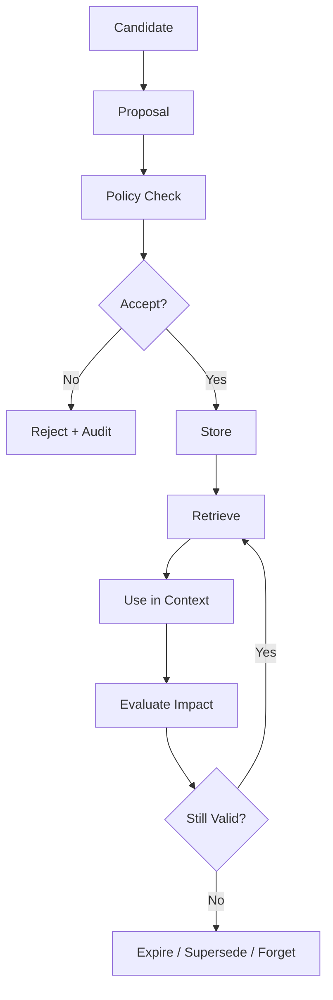
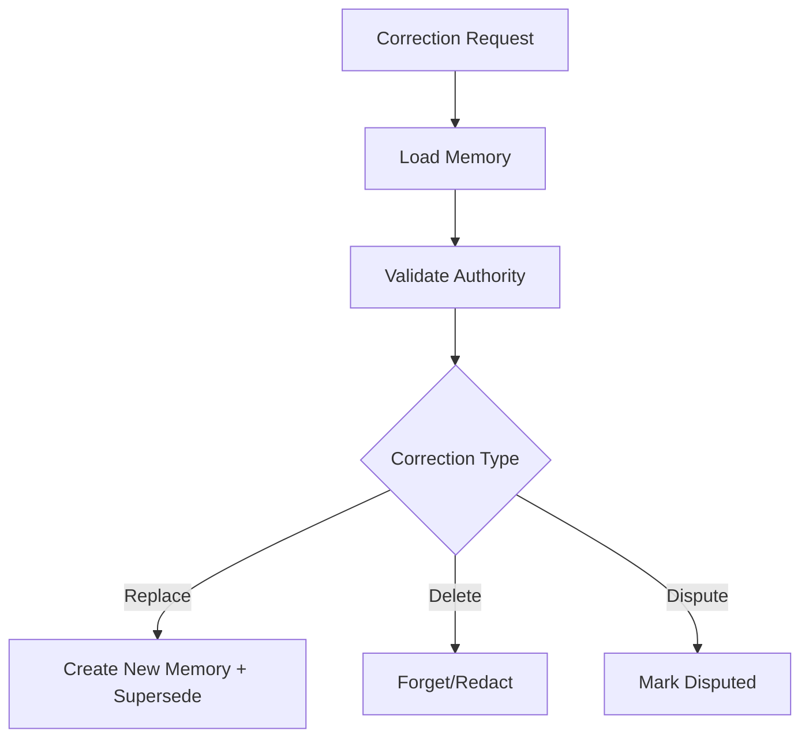
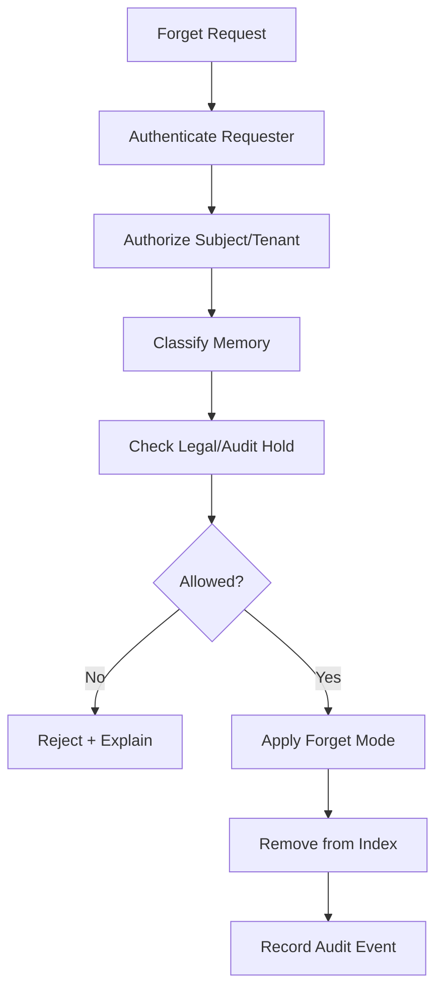
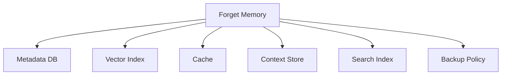

# Part 024 — Memory Governance and Forgetting

> Memory without governance is not intelligence.
>
> It is slowly accumulating operational, privacy, security, and correctness debt.

In Part 020, we introduced memory architecture. This part goes deeper into the governance lifecycle:

- what may be remembered;
- who may write memory;
- who may read memory;
- what evidence supports memory;
- how long memory should live;
- when memory must expire;
- how memory is superseded;
- how memory is forgotten;
- how memory use is audited;
- how memory quality is measured;
- how memory avoids becoming ungoverned source of truth.

Enterprise memory must be designed as a controlled data product, not a hidden cache of model-generated text.

---

## 1. Kaufman Framing

Using Kaufman's method, memory governance decomposes into:

1. classify memory sensitivity;
2. define memory scope and purpose;
3. require provenance and evidence quality;
4. enforce write policies;
5. enforce read policies;
6. set retention and expiry;
7. support supersession and correction;
8. support forgetting/deletion/redaction;
9. audit memory lifecycle;
10. evaluate memory impact and harm.

### Target Performance

By the end of this part, you should be able to:

- design a full memory lifecycle;
- define memory policy rules;
- classify memory by sensitivity and scope;
- evaluate evidence quality for memory;
- implement retention and expiry;
- handle forget requests;
- design supersession and correction flows;
- audit memory writes, reads, uses, and deletions;
- prevent memory poisoning and stale memory;
- decide when memory should be replaced by domain state, policy, or workflow config.

---

# 2. Memory Lifecycle

Memory has a lifecycle.



A memory service should manage the whole lifecycle, not just `save()` and `search()`.

---

# 3. Memory Policy Questions

Before saving memory, ask:

- What is the purpose?
- What is the scope?
- What is the source?
- Is it sensitive?
- Is it stable?
- Is it verified?
- Is it user-specific, team-specific, or tenant-wide?
- Can it affect decisions?
- When should it expire?
- Can the subject request deletion?
- Who can read it?
- Who can update it?
- What happens if it conflicts with source of truth?

If these questions feel too heavy, the memory probably should not be stored.

---

# 4. Memory Governance Model

```python
from enum import Enum
from pydantic import BaseModel, Field


class MemoryPurpose(str, Enum):
    PERSONALIZATION = "personalization"
    TASK_CONTINUITY = "task_continuity"
    DOMAIN_LEARNING = "domain_learning"
    PROCESS_IMPROVEMENT = "process_improvement"
    SAFETY_WARNING = "safety_warning"
    AUDIT_SUPPORT = "audit_support"


class MemorySensitivity(str, Enum):
    PUBLIC = "public"
    INTERNAL = "internal"
    CONFIDENTIAL = "confidential"
    RESTRICTED = "restricted"


class MemoryGovernancePolicy(BaseModel):
    purpose: MemoryPurpose
    allowed_scopes: list[str]
    max_retention_days: int | None
    requires_source_refs: bool
    requires_human_approval: bool
    allowed_sensitivity: list[MemorySensitivity]
    can_affect_decisions: bool
    deletion_supported: bool
```

This can be stored as config and enforced by the memory service.

---

# 5. Memory Scope and Blast Radius

Memory scope determines blast radius.

| Scope | Blast Radius |
|---|---|
| run | current execution only |
| thread | current conversation/task |
| user | one user |
| team | group of users |
| tenant | organization |
| domain | cross-tenant domain logic |
| global | platform-wide |

Higher scope requires stronger governance.

## Scope Rule

> A memory should be stored at the narrowest scope that satisfies its purpose.

Do not store a user preference as tenant policy.

Do not store a one-case lesson as global procedure.

---

# 6. Memory Sensitivity Classification

Memory may contain sensitive data.

| Sensitivity | Example |
|---|---|
| public | public documentation preference |
| internal | internal terminology |
| confidential | case analysis pattern |
| restricted | personal data, secrets, legal-sensitive facts |

Restricted data should usually not be stored as agent memory unless the system is specifically designed for it with strong controls.

## Classification Function

```python
class MemoryClassification(BaseModel):
    sensitivity: MemorySensitivity
    contains_personal_data: bool
    contains_secret: bool
    contains_regulated_data: bool
    reason: str
```

Automated classification can assist, but high-risk cases may need deterministic rules or human review.

---

# 7. Purpose Limitation

Do not store memory without purpose.

Bad:

```text
Remember everything about this case.
```

Better:

```text
Store analyst formatting preference for future decision packages.
```

Purpose affects:

- retention;
- access;
- retrieval;
- deletion;
- evaluation;
- audit;
- whether memory can influence decisions.

## Purpose-to-Retention Example

| Purpose | Retention |
|---|---|
| personalization | until changed/deleted |
| task continuity | thread/run lifetime |
| domain learning | reviewed retention |
| safety warning | longer but reviewed |
| audit support | compliance retention |
| process improvement | aggregate/anonymize if possible |

---

# 8. Evidence Quality

Memory quality depends on evidence quality.

```python
class EvidenceQuality(str, Enum):
    HIGH = "high"
    MEDIUM = "medium"
    LOW = "low"
    UNVERIFIED = "unverified"


class MemoryEvidenceAssessment(BaseModel):
    source_refs: list[str]
    quality: EvidenceQuality
    source_authority: str
    verified_by: str | None = None
    notes: str | None = None
```

## Evidence Quality Ranking

| Source | Typical Quality |
|---|---|
| authoritative domain event | high |
| human-approved decision | high |
| curated policy document | high |
| verified artifact | medium/high |
| user statement | medium, context-dependent |
| model-generated summary | low unless source-backed |
| untrusted retrieved document | low/variable |
| inferred memory | variable |

Memory without evidence should rarely influence enterprise decisions.

---

# 9. Memory Write Decision

```python
class MemoryWriteOutcome(str, Enum):
    ACCEPT = "accept"
    REJECT = "reject"
    REQUIRE_APPROVAL = "require_approval"
    STORE_AS_THREAD_STATE = "store_as_thread_state"
    STORE_AS_ARTIFACT = "store_as_artifact"
    USE_DOMAIN_STATE_INSTEAD = "use_domain_state_instead"


class MemoryWritePolicyDecision(BaseModel):
    outcome: MemoryWriteOutcome
    reason: str
    required_reviewer_role: str | None = None
```

Sometimes the correct decision is not accept/reject. It is “this is not memory.”

Examples:

- current case status → use domain state;
- draft report → artifact;
- active runtime note → checkpoint/execution state;
- user temporary instruction → thread state;
- policy rule → versioned policy config.

---

# 10. Memory Write Policy Example

```python
def decide_memory_write(
    *,
    purpose: MemoryPurpose,
    sensitivity: MemorySensitivity,
    scope: str,
    evidence_quality: EvidenceQuality,
    can_affect_decisions: bool,
) -> MemoryWritePolicyDecision:
    if sensitivity == MemorySensitivity.RESTRICTED:
        return MemoryWritePolicyDecision(
            outcome=MemoryWriteOutcome.REJECT,
            reason="Restricted information cannot be stored as general agent memory.",
        )

    if evidence_quality == EvidenceQuality.UNVERIFIED and can_affect_decisions:
        return MemoryWritePolicyDecision(
            outcome=MemoryWriteOutcome.REJECT,
            reason="Decision-impacting memory requires verified evidence.",
        )

    if scope in {"tenant", "domain", "global"}:
        return MemoryWritePolicyDecision(
            outcome=MemoryWriteOutcome.REQUIRE_APPROVAL,
            reason="Broad-scope memory requires human approval.",
            required_reviewer_role="memory_governance_reviewer",
        )

    if purpose == MemoryPurpose.TASK_CONTINUITY:
        return MemoryWritePolicyDecision(
            outcome=MemoryWriteOutcome.STORE_AS_THREAD_STATE,
            reason="Task continuity belongs to thread state, not long-term memory.",
        )

    return MemoryWritePolicyDecision(
        outcome=MemoryWriteOutcome.ACCEPT,
        reason="Memory satisfies scope, sensitivity, and evidence requirements.",
    )
```

Policy must be enforced outside the model.

---

# 11. Read Governance

Memory read access also needs control.

Questions:

- Can this agent read this memory type?
- Can this user access this memory?
- Does this tenant own it?
- Is it too sensitive for this task?
- Is the memory expired?
- Is the memory under dispute?
- Is memory allowed to influence this decision?

```python
class MemoryReadPolicyDecision(BaseModel):
    allowed: bool
    reason: str
    redactions: list[str] = Field(default_factory=list)
```

## Read Rule

> Retrieval authorization must happen before memory enters context.

Do not retrieve restricted memory and ask the model not to use it.

---

# 12. Memory Influence Level

Some memory may be used only as preference, not as decision evidence.

| Influence Level | Meaning |
|---|---|
| display-only | can be shown but not used for decisions |
| personalization | tone/format preference |
| context hint | may guide search/reasoning |
| evidence candidate | may point to sources |
| decision support | may influence recommendation |
| authoritative | should rarely be memory |

Most memory should not be authoritative.

```python
class MemoryInfluence(str, Enum):
    DISPLAY_ONLY = "display_only"
    PERSONALIZATION = "personalization"
    CONTEXT_HINT = "context_hint"
    EVIDENCE_CANDIDATE = "evidence_candidate"
    DECISION_SUPPORT = "decision_support"
    AUTHORITATIVE = "authoritative"
```

If memory is authoritative, ask whether it should be domain state or policy instead.

---

# 13. Retention Policy

Memory needs retention.

```python
class RetentionPolicy(BaseModel):
    memory_type: str
    scope: str
    max_age_days: int | None
    review_interval_days: int | None
    delete_on_subject_request: bool
    archive_before_delete: bool = False
```

## Retention Examples

| Memory Type | Retention |
|---|---|
| thread continuation note | thread lifetime |
| user preference | until changed/deleted |
| team formatting preference | reviewed periodically |
| tenant procedure | versioned and reviewed |
| episodic case lesson | retention tied to case policy |
| safety warning | longer but reviewed |
| unverified hint | short expiry |

Retention should match purpose and risk.

---

# 14. Expiry

Expired memory should not be retrieved.

```python
from datetime import datetime, timezone


def is_expired(expires_at: str | None) -> bool:
    if expires_at is None:
        return False
    return datetime.fromisoformat(expires_at).replace(tzinfo=timezone.utc) <= datetime.now(timezone.utc)
```

Expiry is different from deletion.

Expired memory may still exist for audit but should be excluded from context.

---

# 15. Review and Revalidation

Some memory should be periodically reviewed.

Examples:

- tenant-wide procedures;
- policy interpretation memory;
- safety warnings;
- domain lessons;
- high-impact decision support memory.

```python
class MemoryReviewTask(BaseModel):
    review_task_id: str
    memory_id: str
    reason: str
    required_role: str
    due_at: str
    status: str
```

Review outcomes:

- keep;
- update;
- supersede;
- expire;
- delete;
- reduce influence level;
- narrow scope.

---

# 16. Supersession

Memory often changes.

Bad:

```text
Overwrite old memory silently.
```

Better:


```python
class MemorySupersessionRecord(BaseModel):
    record_id: str
    new_memory_id: str
    superseded_memory_ids: list[str]
    reason: str
    actor_id: str
    occurred_at: str
```

Supersession preserves traceability.

---

# 17. Correction

A correction fixes wrong memory.

```python
class MemoryCorrectionRequest(BaseModel):
    request_id: str
    memory_id: str
    requested_by: str
    correction_reason: str
    proposed_replacement: str | None = None
```

Correction flow:



Do not merely edit memory content without audit.

---

# 18. Disputed Memory

Memory may be disputed.

```python
class MemoryDispute(BaseModel):
    dispute_id: str
    memory_id: str
    disputed_by: str
    reason: str
    status: str
    created_at: str
```

Disputed memory should usually be:

- excluded from decision support;
- labeled in context if included;
- sent for review;
- prevented from broad influence.

---

# 19. Forgetting

Forgetting can mean several things.

| Forget Mode | Meaning |
|---|---|
| hide | exclude from retrieval |
| expire | mark no longer valid |
| redact | remove sensitive parts |
| delete | remove record/content |
| tombstone | preserve deletion marker |
| anonymize | remove subject identity |
| aggregate | keep statistical value only |

Which mode is appropriate depends on legal, operational, and audit requirements.

---

# 20. Forget Request Model

```python
class ForgetMode(str, Enum):
    HIDE = "hide"
    EXPIRE = "expire"
    REDACT = "redact"
    DELETE = "delete"
    TOMBSTONE = "tombstone"
    ANONYMIZE = "anonymize"


class MemoryForgetRequest(BaseModel):
    request_id: str
    tenant_id: str
    memory_id: str
    requested_by: str
    reason: str
    requested_mode: ForgetMode
```

## Forget Decision

```python
class MemoryForgetDecision(BaseModel):
    allowed: bool
    mode: ForgetMode | None = None
    reason: str
    requires_review: bool = False
```

---

# 21. Forgetting Flow



Important: forgetting must propagate to indexes.

If memory is deleted from metadata DB but remains in vector index, forgetting failed.

---

# 22. Deletion Propagation

Memory may exist in multiple places:

- metadata database;
- vector index;
- cache;
- context logs;
- artifacts;
- backups;
- event logs;
- analytics datasets.

Deletion/forgetting strategy must define propagation.



Some systems use tombstones so deleted memory is not reintroduced during reindexing.

---

# 23. Memory Tombstone

```python
class MemoryTombstone(BaseModel):
    memory_id: str
    tenant_id: str
    deleted_at: str
    deleted_by: str
    reason: str
    replacement_memory_id: str | None = None
```

A tombstone prevents re-creation from old source.

Useful when:

- source remains available;
- index rebuilds happen;
- old event streams may replay;
- deletion must be remembered without retaining content.

---

# 24. Redaction

Redaction removes sensitive content while preserving safe parts.

Example:

Original:

```text
User Jane Doe at jane@example.com prefers short reports.
```

Redacted:

```text
User prefers short reports.
```

Redaction should be recorded.

```python
class MemoryRedactionRecord(BaseModel):
    memory_id: str
    redacted_fields: list[str]
    reason: str
    actor_id: str
    occurred_at: str
```

---

# 25. Memory and Backups

Backups complicate deletion.

Enterprise systems need a policy:

- delete from active systems immediately;
- prevent retrieval from deleted memory;
- allow backup expiry cycle;
- avoid restoring deleted memory;
- keep tombstones separately;
- document behavior.

For many compliance regimes, exact behavior must be reviewed legally. From engineering perspective, the key is to make deletion behavior explicit and testable.

---

# 26. Memory Audit Trail

Audit events:

| Event | Meaning |
|---|---|
| `memory.write_proposed` | agent/user proposed memory |
| `memory.write_accepted` | memory stored |
| `memory.write_rejected` | memory rejected |
| `memory.read` | memory retrieved |
| `memory.used_in_context` | memory included in model context |
| `memory.expired` | memory expired |
| `memory.superseded` | replaced by newer memory |
| `memory.disputed` | challenged |
| `memory.redacted` | sensitive part removed |
| `memory.deleted` | removed |
| `memory.tombstoned` | deletion marker created |

## Audit Event Model

```python
class MemoryLifecycleEvent(BaseModel):
    event_id: str
    event_type: str
    tenant_id: str
    memory_id: str | None
    actor_id: str
    run_id: str | None = None
    reason: str
    payload: dict = Field(default_factory=dict)
    occurred_at: str
```

---

# 27. Memory Use in Context

Record memory usage, not only retrieval.

A memory can be retrieved but omitted.

A memory can be included but ignored.

A memory can influence output.

```python
class MemoryContextUsage(BaseModel):
    context_id: str
    run_id: str
    memory_id: str
    usage_type: str  # retrieved, included, cited, rejected, conflicted
    reason: str | None = None
```

This is essential for explaining behavior.

---

# 28. Memory Quality Evaluation

Memory should prove its value.

| Metric | Meaning |
|---|---|
| acceptance rate | proposal quality |
| rejection reason distribution | policy friction |
| retrieval precision | relevance |
| stale memory usage | governance failure |
| conflict rate | quality/source issue |
| human correction rate | memory wrongness |
| harmful influence rate | safety risk |
| usefulness rating | value signal |
| token cost | context overhead |
| deletion SLA | governance performance |
| unauthorized retrieval attempts | security signal |

If memory does not improve outcomes, reduce scope or disable it.

---

# 29. Memory Poisoning Governance

Memory poisoning controls:

- write policy;
- source trust scoring;
- prompt injection filtering;
- human approval for broad scope;
- confidence threshold;
- expiry;
- dispute process;
- retrieval isolation;
- evaluation;
- anomaly detection.

## Poisoning Scenarios

| Scenario | Control |
|---|---|
| malicious doc says remember unsafe rule | reject untrusted instruction |
| user tries to persist policy override | require approval/deny |
| model hallucination saved as memory | source requirement |
| stale fact persists | expiry/revalidation |
| wrong scope promotion | governance review |
| repeated duplicate memory | dedup/supersession |

---

# 30. Privacy and Data Minimization

Memory should be minimal.

Principles:

- store only what is needed;
- prefer references over raw sensitive content;
- classify sensitivity;
- limit scope;
- set expiry;
- support deletion;
- avoid storing secrets;
- avoid broad memory for personal data;
- log access;
- encrypt sensitive storage;
- redact context logs.

Memory can make systems more useful but also more invasive.

---

# 31. Governance by Memory Type

| Memory Type | Governance |
|---|---|
| user preference | user-controlled, deletable |
| team preference | team owner review |
| tenant procedure | approval/versioning |
| episodic lesson | source-backed, retention tied to case |
| safety warning | high review, longer retention |
| semantic fact | provenance + conflict detection |
| procedural instruction | better as policy/config |
| personal data | strict minimization/review |

Procedural memory is often better managed as code/config/policy.

---

# 32. Memory Policy Registry

A memory policy registry stores governance rules.

```python
class MemoryPolicyRule(BaseModel):
    rule_id: str
    memory_type: str
    scope: str
    purpose: MemoryPurpose
    max_sensitivity: MemorySensitivity
    max_retention_days: int | None
    requires_approval: bool
    can_affect_decisions: bool
    owner_team: str
```

Benefits:

- consistent enforcement;
- reviewable governance;
- versioning;
- audit;
- tenant customization;
- rollout/rollback.

---

# 33. Operational Jobs

Memory governance needs background jobs:

- expire old memories;
- remove expired memories from index;
- review broad-scope memories;
- detect duplicates;
- detect stale policy-linked memories;
- process deletion requests;
- rebuild indexes excluding tombstones;
- sample memory usage for audit;
- report memory quality metrics.

Memory governance is operational work.

---

# 34. Testing Memory Governance

Test cases:

| Test | Expected |
|---|---|
| restricted memory proposal | rejected |
| tenant-wide memory proposal | requires approval |
| expired memory retrieval | excluded |
| deleted memory in vector index | not returned |
| memory conflicts with domain state | domain wins |
| same source memory proposed twice | dedup |
| correction request | supersedes old memory |
| disputed memory | excluded from decision support |
| forget request | tombstone/index deletion |
| broad procedural memory | policy/config path recommended |

## Test Sketch

```python
def test_expired_memory_not_retrieved(memory_service):
    memory = create_memory(expires_at="2020-01-01T00:00:00+00:00")
    memory_service.store(memory)

    results = memory_service.retrieve(query="relevant query")

    assert memory.memory_id not in [m.memory_id for m in results]
```

---

# 35. Anti-Patterns

## Anti-Pattern 1 — Memory as Hidden Database

Storing business facts in memory instead of source-of-truth systems.

## Anti-Pattern 2 — No Forgetting

Memory grows forever and becomes compliance debt.

## Anti-Pattern 3 — No Provenance

Nobody knows why the system believes something.

## Anti-Pattern 4 — Broad Scope by Default

A local preference becomes tenant-wide behavior.

## Anti-Pattern 5 — Agent Writes Memory Freely

Prompt injection or hallucination becomes future context.

## Anti-Pattern 6 — Deleted But Still Indexed

Forget request processed in metadata but vector index still returns it.

## Anti-Pattern 7 — Memory Used as Policy

Free-text memory overrides formal policy.

## Anti-Pattern 8 — No Metrics

Nobody knows whether memory helps or harms.

---

# 36. Production Checklist

Before enabling long-term memory:

- [ ] memory types are defined;
- [ ] memory purposes are defined;
- [ ] sensitivity classification exists;
- [ ] scope rules exist;
- [ ] write policy exists;
- [ ] read policy exists;
- [ ] provenance is required;
- [ ] evidence quality is assessed;
- [ ] retention policy exists;
- [ ] expiry is enforced;
- [ ] broad-scope memory requires approval;
- [ ] memory can be superseded;
- [ ] memory can be disputed;
- [ ] forgetting is implemented;
- [ ] deletion propagates to indexes;
- [ ] tombstones prevent reintroduction;
- [ ] memory usage is audited;
- [ ] memory quality metrics exist;
- [ ] memory poisoning controls exist;
- [ ] domain state wins over memory.

---

# 37. Practice Drill

Design memory governance for an enterprise case assistant.

Requirements:

- store user formatting preferences;
- store team decision package checklist;
- store lessons from prior approved cases;
- reject restricted personal data;
- reject untrusted procedural instructions;
- require approval for tenant-wide memory;
- expire unverified memory after 30 days;
- support forget request;
- prevent deleted memory from returning in vector search;
- audit memory use in context.

Deliverables:

1. memory policy registry;
2. sensitivity classification model;
3. write decision function;
4. read decision function;
5. retention policy;
6. expiry job;
7. forget request flow;
8. tombstone model;
9. memory audit event schema;
10. tests for poisoning, expiry, deletion, and conflict.

---

# 38. What Top 1% Engineers Pay Attention To

Top engineers ask:

- Why are we remembering this?
- Who benefits?
- Who could be harmed?
- Is this source-backed?
- Is this personal or sensitive?
- Is this stable enough to remember?
- Is this better represented as domain state?
- Is this better represented as policy/config?
- What is the narrowest safe scope?
- When does it expire?
- How do we correct it?
- How do we forget it?
- Is it removed from indexes?
- Can we prove when it influenced output?
- Are we measuring whether memory helps?

They treat memory as a governed lifecycle, not a convenience cache.

---

# 39. Summary

In this part, we covered:

- memory lifecycle;
- governance questions;
- memory governance model;
- scope and blast radius;
- sensitivity classification;
- purpose limitation;
- evidence quality;
- memory write outcomes;
- write policies;
- read governance;
- influence levels;
- retention;
- expiry;
- review/revalidation;
- supersession;
- correction;
- disputed memory;
- forgetting modes;
- forget request flow;
- deletion propagation;
- tombstones;
- redaction;
- backups;
- audit trail;
- memory use in context;
- memory quality evaluation;
- memory poisoning governance;
- privacy and data minimization;
- policy registry;
- operational jobs;
- tests;
- anti-patterns.

The key principle:

> The ability to remember is only safe when paired with the ability to justify, limit, correct, and forget.

The next part begins tool governance with **Tool Contract Engineering**.

---

## References

- NIST AI Risk Management Framework: governance, mapping, measuring, and managing AI risk.
- OWASP Top 10 for LLM Applications: sensitive information disclosure, prompt injection, excessive agency, and related risks.
- Enterprise privacy/data governance principles: purpose limitation, data minimization, retention, access control, deletion, and audit.
- Model Context Protocol authorization concepts for restricted resource access.
