# Part 026 — MCP and Enterprise Tooling

> MCP is not “a plugin system for tools.”
>
> It is a boundary model for connecting AI applications to external capabilities and context through standardized concepts such as tools, resources, and prompts.

The **Model Context Protocol** is useful because it pushes teams to separate several ideas that are often mixed together:

- executable tools;
- readable resources;
- reusable prompts;
- clients;
- servers;
- authorization;
- capability discovery;
- transport boundaries;
- runtime integration.

This part explains how to reason about MCP in enterprise-grade stateful multi-agent AI systems.

The goal is not to memorize every protocol field. The goal is to understand how MCP-style boundaries affect architecture, security, governance, and operations.

---

## 1. Kaufman Framing

Using Kaufman's method, we deconstruct MCP tooling into:

1. understand MCP client/server roles;
2. distinguish tools, resources, and prompts;
3. decide what should be exposed through MCP;
4. apply authorization and tenant boundaries;
5. design enterprise MCP server contracts;
6. integrate MCP with stateful agent runtime;
7. govern tool/resource discovery;
8. secure transports and execution;
9. observe and audit MCP calls;
10. avoid turning MCP into an ungoverned tool marketplace.

### Target Performance

By the end of this part, you should be able to:

- explain MCP concepts in enterprise terms;
- design tools/resources/prompts as separate capabilities;
- define MCP server boundaries by bounded context;
- route MCP tool calls through policy and audit;
- enforce authorization before resource/tool access;
- design MCP registry and approval workflows;
- identify MCP security risks;
- integrate MCP with Python agent runtime;
- choose when not to use MCP;
- build an enterprise governance model for MCP-based tools.

---

# 2. MCP Mental Model

MCP standardizes how AI applications connect to external context and capabilities.

A simplified architecture:

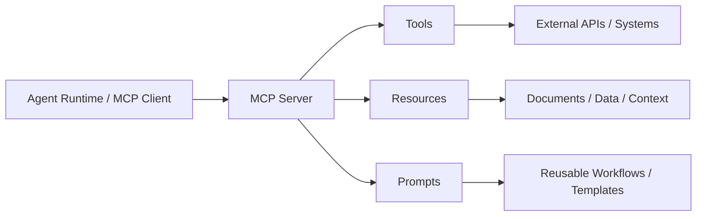

The MCP server exposes capabilities.

The MCP client consumes them.

In enterprise systems, the agent runtime often acts as or embeds the MCP client, but should still route calls through governance controls.

---

# 3. Tools, Resources, Prompts

MCP distinguishes:

| Concept | Meaning | Example |
|---|---|---|
| Tool | function the model/application can execute | `search_case_evidence` |
| Resource | context/data the model/application can read | `case://123/evidence/doc_1` |
| Prompt | reusable templated message/workflow | `draft_notice_prompt` |

This distinction is architecturally important.

## Tool

Executable action.

May have side effects.

Needs schema, auth, effect classification, idempotency, audit.

## Resource

Readable context/data.

Needs authorization, freshness, sensitivity, provenance, caching policy.

## Prompt

Reusable template or workflow instruction.

Needs versioning, ownership, review, rollout, evaluation.

---

# 4. Why the Distinction Matters

Bad architecture:

```text
Everything is a tool.
```

Examples:

- `get_policy_text` as tool;
- `draft_prompt` as tool;
- `read_document` as tool;
- `send_notice` as tool.

This blurs read context, executable action, and instruction templates.

Better:

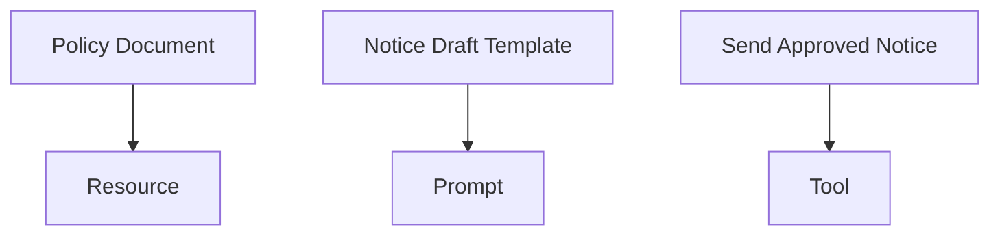

Resources are not tools.

Prompts are not tools.

Tools can change state.

---

# 5. Enterprise MCP Server Boundaries

Do not create one giant MCP server exposing everything.

Use bounded-context MCP servers.

Examples:

| MCP Server | Exposes |
|---|---|
| Case MCP Server | case resources, case read tools, case command tools |
| Evidence MCP Server | evidence resources/search tools |
| Policy MCP Server | policy resources/prompts/tools |
| Notification MCP Server | draft/send tools |
| Approval MCP Server | review tasks, approval commands |
| Knowledge Graph MCP Server | graph traversal tools/resources |
| Memory MCP Server | governed memory resources/tools |

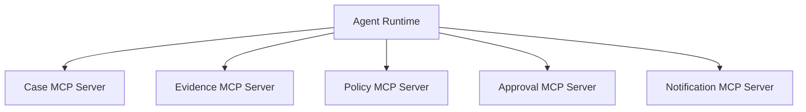

Boundaries improve:

- ownership;
- authorization;
- scaling;
- audit;
- incident isolation;
- versioning.

---

# 6. MCP Client in Stateful Agent Runtime

In a stateful runtime, MCP client calls should not bypass runtime controls.

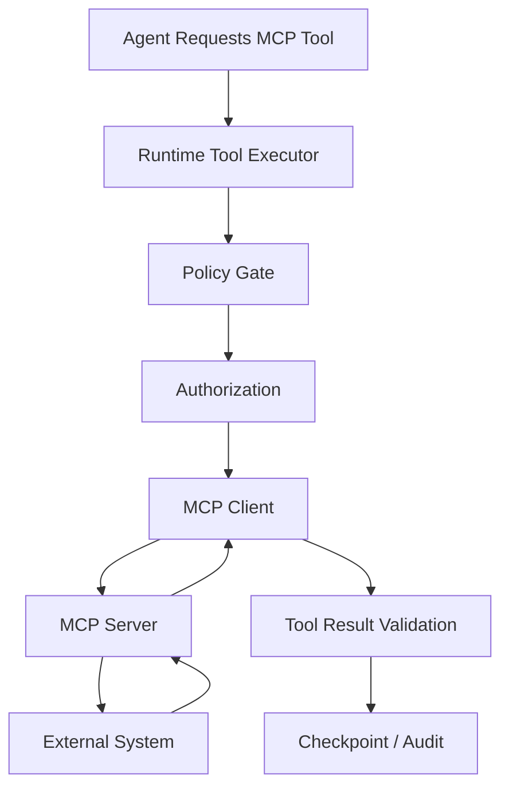

The runtime should still own:

- run ID;
- tenant context;
- policy;
- idempotency;
- timeout;
- audit;
- checkpoint;
- human approval.

MCP provides protocol boundary, not full enterprise governance by itself.

---

# 7. MCP Resource Access

Resources are context/data.

Examples:

```text
case://case_123/summary
evidence://case_123/document/doc_77
policy://P-2026-06/rule/section-4
memory://user_123/preferences
graph://entity/org_abc/neighborhood
```

## Resource Access Controls

Resources require:

- tenant isolation;
- user/agent authorization;
- sensitivity label;
- freshness/version;
- provenance;
- redaction;
- access logging.

Do not retrieve resource data into model context unless authorization has already passed.

---

# 8. MCP Tool Access

MCP tools need the same discipline as any enterprise tool.

```python
from pydantic import BaseModel, Field


class McpToolPolicy(BaseModel):
    server_name: str
    tool_name: str
    effect_type: str
    required_scopes: list[str]
    idempotency_required: bool
    human_approval_required: bool
    max_timeout_ms: int = Field(ge=1)
```

A tool exposed via MCP is not automatically safe.

The enterprise runtime should classify and govern it.

---

# 9. MCP Prompts

Prompts in MCP-style architecture are reusable templates/workflows.

Examples:

- `case_intake_summary_prompt`
- `risk_assessment_prompt`
- `policy_mapping_prompt`
- `notice_draft_prompt`
- `human_review_package_prompt`

Prompt governance:

- owner;
- version;
- allowed agent roles;
- evaluation set;
- rollout percentage;
- change review;
- deprecation;
- prompt injection hardening;
- output contract compatibility.

## Prompt Registry

```python
class PromptRegistryRecord(BaseModel):
    prompt_name: str
    version: str
    owner_team: str
    allowed_agent_roles: list[str]
    output_contract: str
    evaluated: bool
    deprecated: bool = False
```

Prompts should be treated like production config.

---

# 10. Authorization

MCP authorization matters especially for restricted servers and HTTP-based transports.

Enterprise authorization should answer:

- who is the resource owner?
- who is the user?
- which tenant?
- which agent role?
- which scopes?
- which resource/tool?
- which transport?
- which session/run?
- which policy version?

```python
class McpAuthorizationContext(BaseModel):
    tenant_id: str
    user_id: str | None
    agent_name: str
    run_id: str
    scopes: list[str]
    resource_owner: str | None = None
```

## Important Rule

> Authorization must be enforced by the server/runtime, not by model prompt.

---

# 11. Delegated Authorization

A common enterprise pattern:

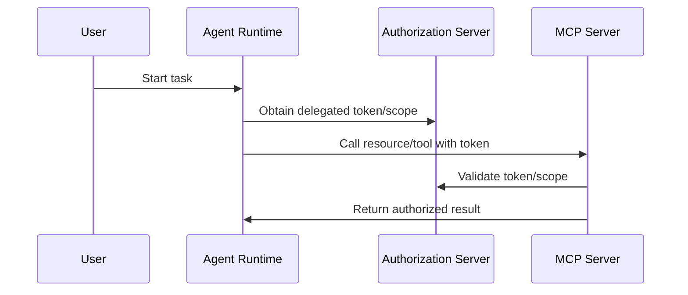

Delegated access should be scoped and auditable.

Avoid broad long-lived credentials in agent runtime.

---

# 12. Transport Considerations

MCP can be used over different transports depending on implementation and deployment.

Enterprise concerns:

- local vs remote execution;
- process boundary;
- network boundary;
- authentication;
- encryption;
- logging;
- sandboxing;
- command injection risk;
- deployment ownership;
- availability.

## Local Server Risk

Local MCP servers can expose powerful machine capabilities. Treat local process execution carefully.

Controls:

- allowlist servers;
- pin versions;
- review server source/vendor;
- sandbox execution;
- restrict environment variables;
- avoid passing secrets;
- log server startup;
- prevent arbitrary command construction.

---

# 13. MCP Server Registry

Enterprise systems need a registry of approved MCP servers.

```python
class McpServerRegistryRecord(BaseModel):
    server_name: str
    version: str
    owner_team: str
    transport: str
    allowed_environments: list[str]
    allowed_tenants: list[str]
    exposes_tools: list[str]
    exposes_resources: list[str]
    exposes_prompts: list[str]
    security_review_status: str
    enabled: bool
```

Registry supports:

- discovery;
- approval;
- enable/disable;
- ownership;
- rollout;
- audit;
- incident response.

---

# 14. Capability Discovery

MCP supports capability discovery patterns. Enterprise systems should not blindly expose discovered capabilities to agents.

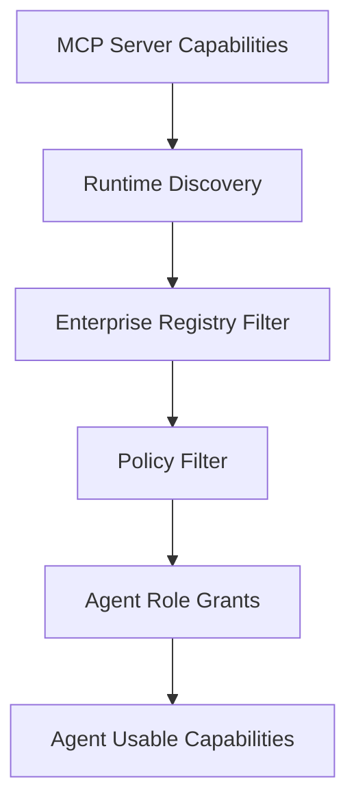

Discovery is not authorization.

A server may expose 50 tools. A given agent may get 3.

---

# 15. MCP Server Design by Bounded Context

Example: Evidence MCP Server.

## Resources

- `evidence://case/{case_id}/document/{document_id}`
- `evidence://case/{case_id}/summary`

## Tools

- `search_case_evidence`
- `fetch_document_excerpt`
- `verify_evidence_ref`

## Prompts

- `evidence_summary_prompt`
- `missing_evidence_prompt`

## Policies

- case-scoped access only;
- no cross-tenant retrieval;
- user-uploaded documents labeled untrusted;
- page/section refs required;
- retrieval audit event emitted.

This is a clean bounded context.

---

# 16. MCP Tool Contract Wrapper

Wrap MCP tools in enterprise contracts.

```python
class EnterpriseMcpToolContract(BaseModel):
    mcp_server: str
    mcp_tool_name: str
    enterprise_tool_name: str
    version: str
    effect_type: str
    input_schema: dict
    output_schema: dict
    required_scopes: list[str]
    approval_required: bool
    idempotency_required: bool
    owner_team: str
```

The wrapper maps protocol capability to enterprise policy.

---

# 17. MCP Resource Contract Wrapper

```python
class EnterpriseMcpResourceContract(BaseModel):
    mcp_server: str
    resource_uri_pattern: str
    resource_type: str
    sensitivity: str
    required_scopes: list[str]
    cache_policy: str
    freshness_policy: str
    owner_team: str
```

Resource contracts should define:

- access scope;
- sensitivity;
- freshness;
- caching;
- redaction;
- audit.

---

# 18. MCP Prompt Contract Wrapper

```python
class EnterpriseMcpPromptContract(BaseModel):
    mcp_server: str
    prompt_name: str
    version: str
    purpose: str
    input_contract: str
    output_contract: str
    allowed_agent_roles: list[str]
    evaluation_suite: str | None = None
    owner_team: str
```

Prompts are behavior artifacts. Govern them.

---

# 19. Runtime Integration Pattern

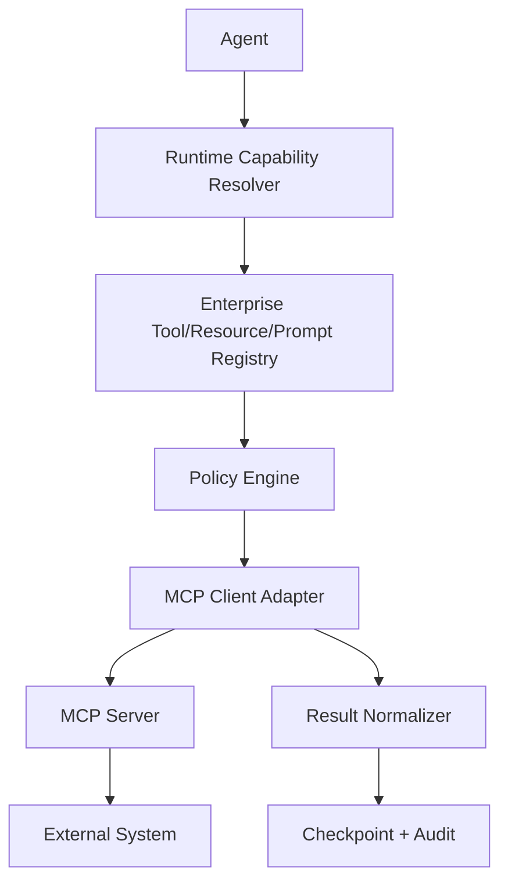

The runtime adapter should normalize MCP responses into the internal tool/result/event models described in previous parts.

---

# 20. Tool Result Normalization

MCP server outputs may vary.

Normalize them into enterprise result contracts.

```python
class NormalizedCapabilityResult(BaseModel):
    capability_type: str  # tool, resource, prompt
    server_name: str
    capability_name: str
    status: str
    data: dict | None = None
    source_refs: list[str] = []
    external_ref: str | None = None
    error_type: str | None = None
```

This prevents protocol-specific details from leaking everywhere.

---

# 21. Stateful MCP Calls

MCP calls inside long-running workflows must be checkpointed.

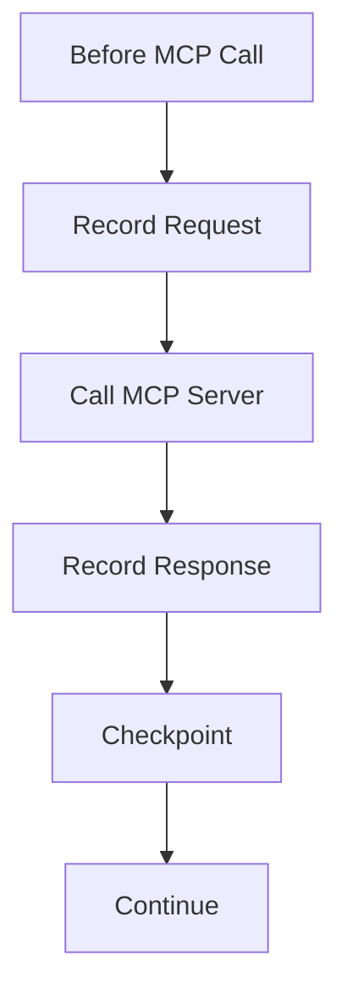

For side-effecting MCP tools:

- idempotency key required;
- external reference stored;
- reconciliation supported;
- result included in run manifest/audit.

---

# 22. MCP and Human-in-the-Loop

MCP tools can trigger human review workflows.

Example:

- `request_human_approval`
- `get_review_task`
- `submit_review_decision`

But approval logic should remain authoritative.

Do not let a generic MCP server mark high-impact approval without reviewer authorization and audit.

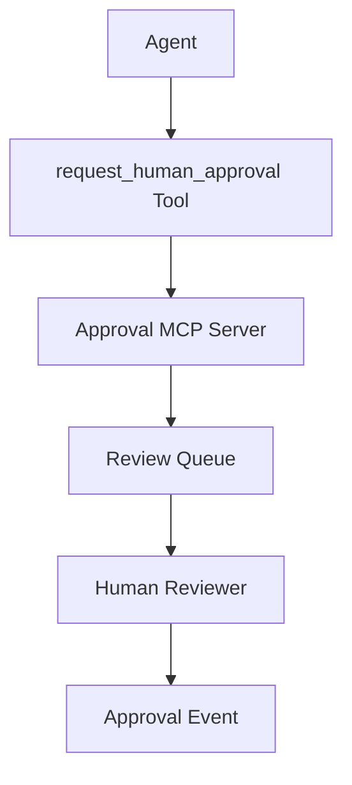

---

# 23. MCP and Memory

Memory can be exposed through MCP.

But memory read/write must be governed.

## Memory Resources

- `memory://user/{user_id}/preferences`
- `memory://team/{team_id}/procedures`

## Memory Tools

- `propose_memory_write`
- `forget_memory`
- `search_memory`

## Rules

- agents propose writes;
- policy decides acceptance;
- broad-scope memory requires approval;
- retrieval requires authorization;
- memory usage is audited.

---

# 24. MCP and RAG

RAG can be exposed through MCP resources/tools.

Examples:

- resources for documents/chunks;
- tools for search/retrieval;
- prompts for summary/drafting templates.

But RAG governance remains necessary:

- authorization before retrieval;
- source authority;
- freshness;
- citation verification;
- prompt injection isolation;
- index versioning.

MCP standardizes access, not evidence quality.

---

# 25. MCP and Knowledge Graphs

Graph capabilities can be MCP tools/resources.

Examples:

- `graph://entity/{entity_id}/neighbors`
- `traverse_entity_relationships`
- `find_policy_applicability_path`
- `verify_graph_fact`

Controls:

- traversal depth;
- predicate allowlist;
- tenant ACL;
- provenance requirement;
- temporal validity;
- result size limit.

---

# 26. Security Risks

MCP-style tooling introduces risks:

| Risk | Description |
|---|---|
| capability sprawl | too many tools/resources exposed |
| authorization bypass | model sees unauthorized data |
| malicious server | untrusted MCP server exfiltrates data |
| local execution risk | local server launches unsafe process |
| prompt injection | resource text influences tool use |
| excessive agency | tool enables high-impact action |
| supply chain risk | server package compromised |
| secret leakage | environment variables exposed |
| confused deputy | agent acts with user's broad credentials |
| audit gap | protocol call not linked to run |

MCP should be treated as a security boundary.

---

# 27. Enterprise MCP Security Controls

Controls:

- approved server registry;
- server version pinning;
- signed artifacts where possible;
- least-privilege scopes;
- tenant isolation;
- resource ACLs;
- tool effect classification;
- human approval for high-impact tools;
- network egress controls;
- sandbox local servers;
- no broad secrets in environment;
- capability filtering by role;
- audit every call;
- incident kill switch.

## Kill Switch

```python
class McpCapabilityKillSwitch(BaseModel):
    server_name: str
    capability_name: str | None = None
    disabled: bool
    reason: str
```

You should be able to disable a server or capability quickly.

---

# 28. Observability

Track:

- server name/version;
- capability type;
- capability name/version;
- agent name;
- run/thread/tenant;
- authorization decision;
- policy decision;
- latency;
- payload size;
- error type;
- tool effect;
- approval ID;
- idempotency key;
- resource URI;
- prompt version;
- result source refs.

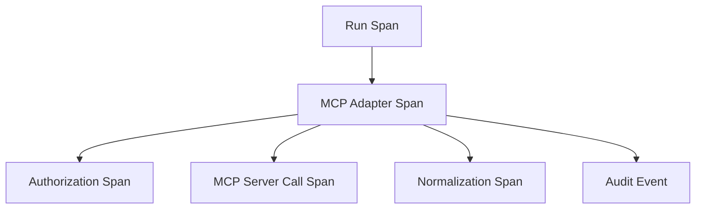

---

# 29. MCP Audit Events

```python
class McpAuditEvent(BaseModel):
    event_id: str
    tenant_id: str
    run_id: str
    agent_name: str
    server_name: str
    capability_type: str
    capability_name: str
    decision: str
    policy_version: str | None = None
    resource_uri: str | None = None
    tool_call_id: str | None = None
    occurred_at: str
```

Events:

- server discovered;
- capability listed;
- capability allowed/denied;
- resource read;
- tool requested;
- tool executed;
- prompt retrieved;
- server disabled;
- policy violation.

---

# 30. MCP Evaluation

Evaluate MCP integration.

| Evaluation | Question |
|---|---|
| capability selection | did agent choose correct MCP capability? |
| authorization | unauthorized access blocked? |
| tool argument quality | valid arguments? |
| resource relevance | retrieved resource useful? |
| prompt behavior | prompt version produces expected output? |
| security | injection/exfiltration blocked? |
| latency | acceptable? |
| reliability | server errors handled? |
| audit | calls traceable? |

MCP integration should be part of your agent evaluation suite.

---

# 31. When Not to Use MCP

MCP is useful, but not always necessary.

Do not use MCP when:

- direct internal API is simpler and safer;
- strict transactional semantics are needed;
- latency budget is extremely tight;
- capability is highly sensitive and not ready for general discovery;
- the server cannot be governed;
- the tool requires deep runtime coupling;
- you need deterministic workflow execution rather than model-discovered capability.

MCP is a boundary option, not a universal architecture.

---

# 32. Python Adapter Sketch

```python
class McpClientAdapter:
    def __init__(self, registry, policy_engine, mcp_client, telemetry):
        self.registry = registry
        self.policy_engine = policy_engine
        self.mcp_client = mcp_client
        self.telemetry = telemetry

    async def call_tool(self, request: ToolRequest, auth_context: McpAuthorizationContext) -> ToolResult:
        contract = await self.registry.get_tool_contract(
            server_name=request.input["server_name"],
            tool_name=request.tool_name,
        )

        decision = await self.policy_engine.decide_mcp_tool(
            contract=contract,
            auth_context=auth_context,
            request=request,
        )

        if decision.decision == "deny":
            return ToolResult(
                tool_call_id=request.tool_call_id,
                status=ToolResultStatus.POLICY_DENIED,
                error_message=decision.reason,
            )

        if decision.decision == "require_approval":
            return ToolResult(
                tool_call_id=request.tool_call_id,
                status=ToolResultStatus.APPROVAL_REQUIRED,
                error_message=decision.reason,
            )

        raw_result = await self.mcp_client.call_tool(
            server_name=contract.mcp_server,
            tool_name=contract.mcp_tool_name,
            arguments=request.input,
        )

        normalized = normalize_mcp_tool_result(raw_result, contract)

        return ToolResult(
            tool_call_id=request.tool_call_id,
            status=ToolResultStatus.SUCCESS,
            output=normalized.data,
            external_ref=normalized.external_ref,
        )
```

This is intentionally schematic. Production code needs transport handling, auth tokens, timeout, idempotency, retries, redaction, tracing, and checkpointing.

---

# 33. Enterprise MCP Architecture Example

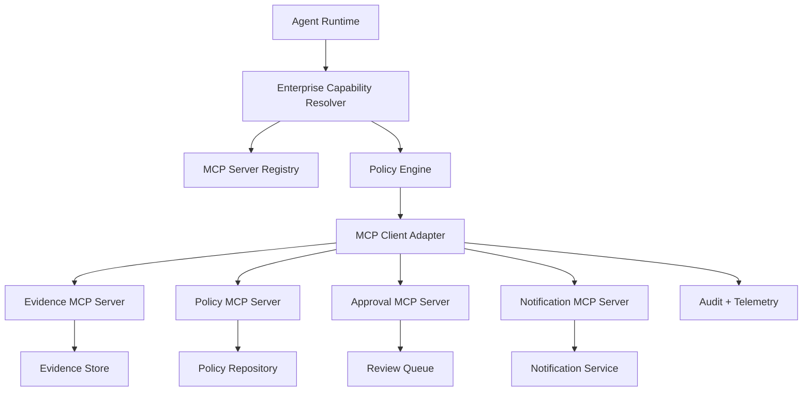

The runtime does not blindly trust MCP. It governs MCP.

---

# 34. Anti-Patterns

## Anti-Pattern 1 — MCP Server Marketplace Without Governance

Agents can install/use any server.

## Anti-Pattern 2 — Discovery Equals Permission

Server exposes tool, so agent can call it.

## Anti-Pattern 3 — Everything as Tool

Resources and prompts are mis-modeled as tools.

## Anti-Pattern 4 — Broad User Token

Agent uses user's full access token everywhere.

## Anti-Pattern 5 — Local Server with Secrets

Local MCP server can read environment secrets unnecessarily.

## Anti-Pattern 6 — No Run Correlation

MCP calls cannot be tied to agent run/audit.

## Anti-Pattern 7 — No Kill Switch

Bad server/tool cannot be disabled quickly.

## Anti-Pattern 8 — Tool Output Directly Trusted

Untrusted resource content becomes instruction.

---

# 35. Production Checklist

Before using MCP in enterprise agents:

- [ ] approved MCP server registry exists;
- [ ] server owner is identified;
- [ ] server version is pinned;
- [ ] capabilities are classified as tools/resources/prompts;
- [ ] tools have effect classification;
- [ ] resources have sensitivity/access policy;
- [ ] prompts are versioned/evaluated;
- [ ] discovery is filtered by policy;
- [ ] authorization is enforced server-side/runtime-side;
- [ ] tenant isolation is enforced;
- [ ] high-impact tools require approval;
- [ ] local execution is sandboxed;
- [ ] secrets are not broadly exposed;
- [ ] all calls are traced/audited;
- [ ] capability kill switch exists;
- [ ] MCP failures are handled gracefully;
- [ ] MCP output is normalized;
- [ ] prompt injection controls exist;
- [ ] evaluation covers MCP behavior.

---

# 36. Practice Drill

Design MCP integration for a case-management agent platform.

Servers:

- Case MCP Server;
- Evidence MCP Server;
- Policy MCP Server;
- Approval MCP Server;
- Notification MCP Server.

Deliverables:

1. server boundary map;
2. tools/resources/prompts per server;
3. authorization model;
4. tool effect classification;
5. resource sensitivity model;
6. prompt registry;
7. MCP server registry;
8. runtime adapter flow;
9. audit event schema;
10. kill switch design;
11. security threat model;
12. tests for unauthorized access and high-impact tool gating.

---

# 37. What Top 1% Engineers Pay Attention To

Top engineers ask:

- Is this a tool, resource, or prompt?
- Who owns this MCP server?
- What capabilities does it expose?
- Which capabilities should this agent actually see?
- What authorization scope is used?
- Can a retrieved resource influence tool calls?
- Can this server access secrets?
- Can this capability cause side effects?
- Is local execution safe?
- Are calls linked to run/audit?
- Can we disable it quickly?
- Is this better as direct internal API?
- Does MCP simplify integration or hide risk?

They see MCP as a useful protocol boundary, not a substitute for architecture.

---

# 38. Summary

In this part, we covered:

- MCP mental model;
- tools, resources, and prompts;
- enterprise MCP server boundaries;
- MCP client inside stateful runtime;
- resource access;
- tool access;
- prompt governance;
- authorization;
- delegated authorization;
- transport considerations;
- server registry;
- capability discovery filtering;
- bounded-context server design;
- enterprise contract wrappers;
- runtime integration;
- result normalization;
- stateful MCP calls;
- human-in-the-loop;
- memory/RAG/knowledge graph via MCP;
- security risks;
- controls;
- observability;
- audit events;
- evaluation;
- when not to use MCP;
- adapter sketch;
- enterprise reference architecture;
- anti-patterns;
- production checklist.

The key principle:

> MCP standardizes connection. Enterprise architecture must still govern authority, data, state, risk, and audit.

The next part focuses on **Permissioning and Policy Enforcement for Agent Actions**.

---

## References

- Model Context Protocol specification 2025-11-25: tools, resources, prompts, clients, servers, and authorization.
- Model Context Protocol authorization specification: transport-level authorization for restricted MCP servers.
- OpenAI Agents SDK documentation: agents, tools, guardrails, sessions, handoffs, and tracing.
- LangGraph documentation: persistence, durable execution, and checkpointed stateful workflows.
- OWASP Top 10 for LLM Applications: excessive agency, prompt injection, sensitive information disclosure, and supply-chain concerns.
