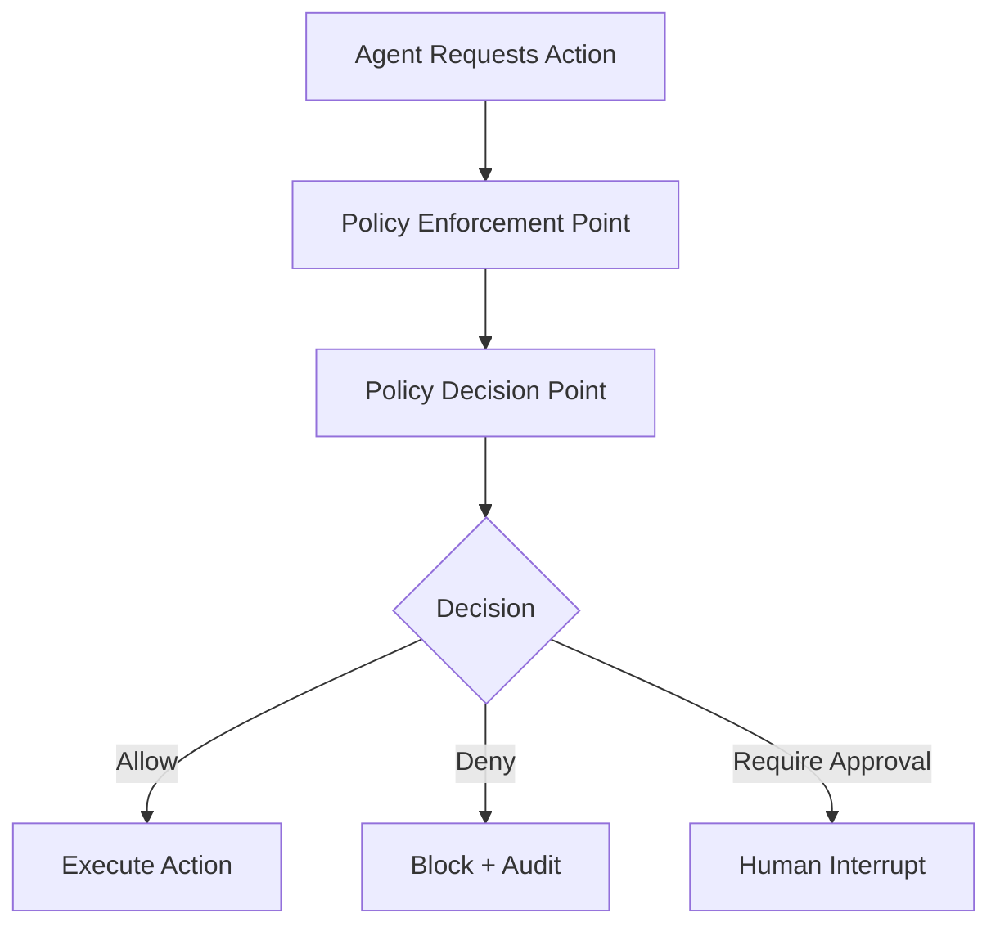
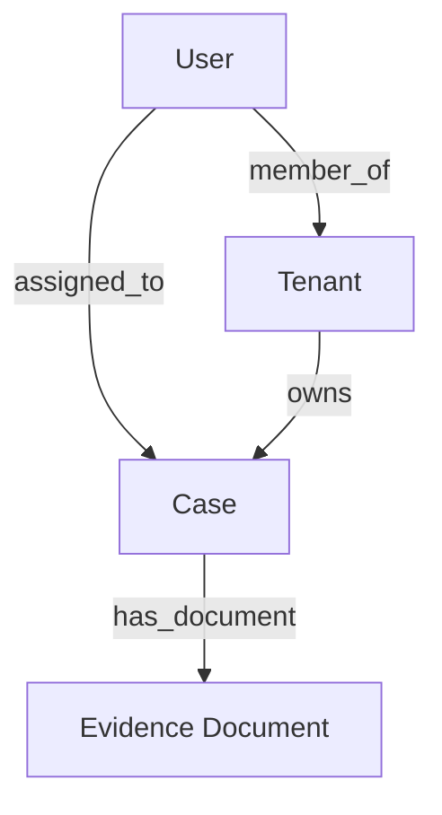
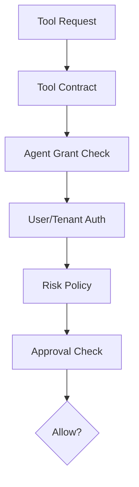
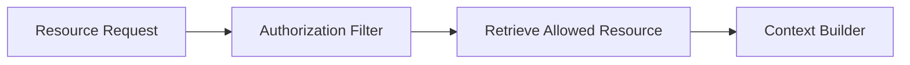
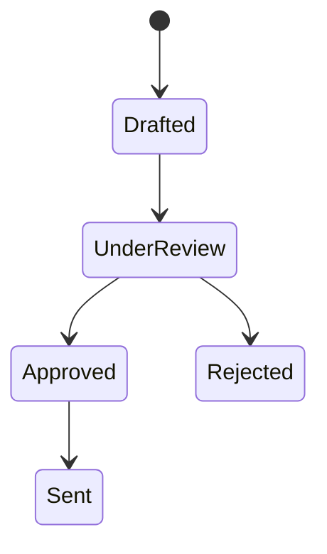
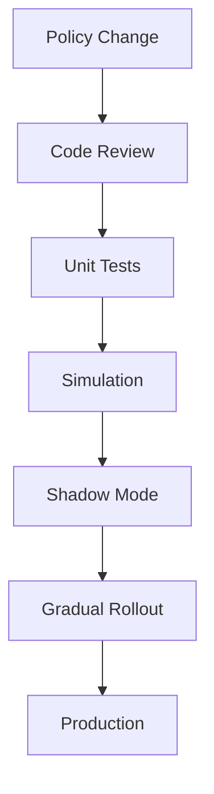
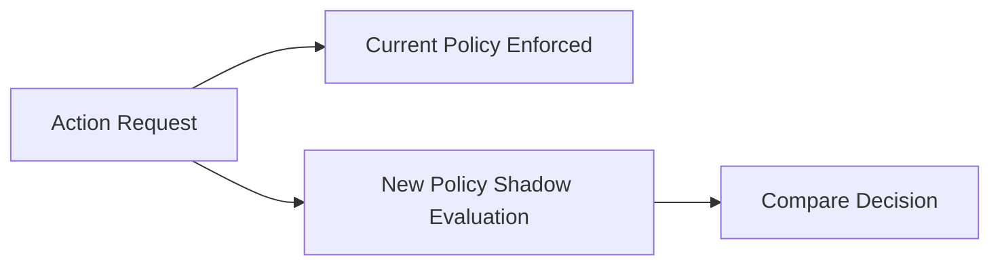
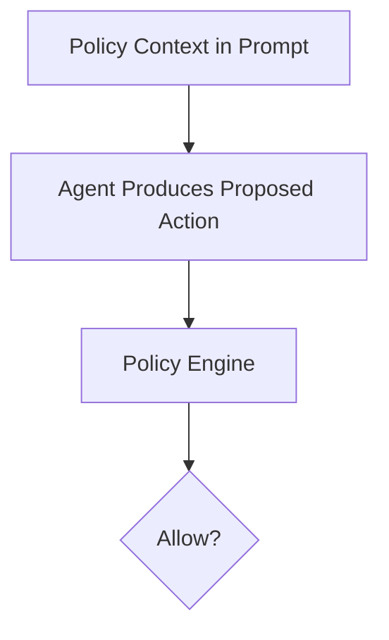
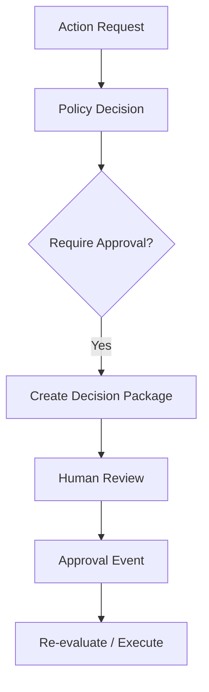

# Part 027 — Permissioning and Policy Enforcement

> In enterprise agent systems, the question is not only “Can the model do this?”
>
> The real question is: **“Is this actor, agent, tenant, tool, data scope, risk level, and workflow state allowed to do this action right now?”**

Permissioning and policy enforcement are the control layer that prevents agentic systems from turning reasoning into unauthorized action.

A prompt can say:

```text
Do not access unauthorized data.
```

But a prompt is not an authorization system.

A prompt can say:

```text
Do not send external notices without approval.
```

But a prompt is not a policy engine.

This part explains how to design permissioning and policy enforcement for enterprise-grade stateful multi-agent AI systems.

---

## 1. Kaufman Framing

Using Kaufman's framework, we deconstruct this skill into:

1. identify protected resources and actions;
2. define actors: user, agent, service, tenant, role;
3. separate authentication from authorization;
4. model permissions with RBAC, ABAC, ReBAC, and risk-based policies;
5. place enforcement points before data/tool/state access;
6. log policy decisions;
7. version policies;
8. test policies;
9. support simulation/shadow mode;
10. audit and explain decisions.

### Target Performance

By the end of this part, you should be able to:

- design policy enforcement around agent actions;
- distinguish policy decision point and policy enforcement point;
- model tool, resource, memory, graph, RAG, and workflow policies;
- implement a policy request/decision contract;
- use RBAC, ABAC, ReBAC, and risk-based policy together;
- enforce policy outside prompts;
- log decisions for audit;
- design policy-as-code workflow;
- prevent excessive agency;
- test policy behavior before production rollout.

---

# 2. Core Model: PDP and PEP

A common architecture separates:

- **Policy Decision Point (PDP)**: decides allow/deny/require approval.
- **Policy Enforcement Point (PEP)**: enforces the decision at runtime.



The model can propose actions. The PEP enforces policy.

## Example

Agent says:

```json
{
  "tool": "send_notice",
  "case_id": "case_123"
}
```

The PEP checks:

- tool contract;
- agent role;
- user identity;
- tenant;
- case risk;
- approval state;
- workflow state;
- policy version;
- idempotency;
- side-effect type.

Only then can execution continue.

---

# 3. Authentication vs Authorization

Authentication answers:

> Who are you?

Authorization answers:

> What are you allowed to do?

In agent systems, there are several identities:

| Identity | Example |
|---|---|
| human user | analyst, reviewer, admin |
| agent role | risk-agent, drafting-agent |
| runtime service | agent-runtime-service |
| tool service | notification-service |
| tenant | organization/customer |
| workload identity | Kubernetes/service account |
| external app | MCP server, connector |

A policy decision often depends on a combination of human + agent + service identity.

---

# 4. Actor Model

```python
from enum import Enum
from pydantic import BaseModel, Field


class ActorType(str, Enum):
    USER = "user"
    AGENT = "agent"
    SERVICE = "service"
    SYSTEM = "system"


class Actor(BaseModel):
    actor_type: ActorType
    actor_id: str
    roles: list[str] = Field(default_factory=list)
    scopes: list[str] = Field(default_factory=list)
```

## Composite Actor Context

```python
class AgentActionActorContext(BaseModel):
    user: Actor | None = None
    agent: Actor
    runtime_service: Actor
    tenant_id: str
```

A runtime action may be caused by a user but executed by an agent through a service.

Audit must preserve the chain.

---

# 5. Protected Actions

List actions explicitly.

| Action | Protected? | Why |
|---|---:|---|
| read case summary | yes | sensitive data |
| search evidence | yes | data access |
| fetch policy | maybe | internal policy |
| propose risk | yes | affects workflow |
| create draft | yes | artifact creation |
| update case status | yes | domain mutation |
| request approval | yes | workflow impact |
| send notice | yes | external side effect |
| write memory | yes | future behavior |
| traverse graph | yes | relationship disclosure |
| call external API | yes | data exfiltration/side effect |

If an action can affect data, state, cost, security, or people, protect it.

---

# 6. Policy Request Contract

```python
class PolicyRequest(BaseModel):
    request_id: str
    tenant_id: str
    run_id: str | None = None
    thread_id: str | None = None
    actor_context: AgentActionActorContext
    action: str
    resource_type: str
    resource_id: str | None = None
    resource_attributes: dict = Field(default_factory=dict)
    environment: dict = Field(default_factory=dict)
    risk_context: dict = Field(default_factory=dict)
```

The policy request should include enough context to decide.

Examples:

- action: `tool.call`
- resource_type: `tool`
- resource_id: `send_approved_notice`
- risk_context: `case_risk=high`
- environment: `workflow_state=waiting_for_approval`

---

# 7. Policy Decision Contract

```python
class PolicyDecisionType(str, Enum):
    ALLOW = "allow"
    DENY = "deny"
    REQUIRE_APPROVAL = "require_approval"
    REQUIRE_MORE_CONTEXT = "require_more_context"


class PolicyDecision(BaseModel):
    request_id: str
    decision: PolicyDecisionType
    reason: str
    policy_id: str
    policy_version: str
    obligations: list[str] = Field(default_factory=list)
    advice: list[str] = Field(default_factory=list)
```

## Obligations vs Advice

| Type | Meaning |
|---|---|
| obligation | must be enforced if action proceeds |
| advice | informational recommendation |

Example obligations:

- redact field `customer_ssn`;
- require approval role `senior_reviewer`;
- log audit event;
- use idempotency key;
- enforce max 3 tool calls;
- mask external recipient.

---

# 8. RBAC

Role-Based Access Control grants permissions by role.

Example:

| Role | Permission |
|---|---|
| analyst | read case, create draft |
| senior_reviewer | approve high-risk notice |
| admin | manage configuration |
| risk-agent | propose risk assessment |
| drafting-agent | create draft artifact |
| notification-service | send approved notice |

RBAC is simple and useful.

But RBAC alone is insufficient for agent systems because context matters.

Example:

- a senior reviewer may approve high-risk notices;
- but not for a tenant they do not belong to;
- not if they were the requester;
- not if approval package version is stale;
- not if required evidence is missing.

---

# 9. ABAC

Attribute-Based Access Control uses attributes.

Attributes can include:

- tenant;
- department;
- risk level;
- case status;
- data sensitivity;
- time;
- environment;
- tool effect type;
- document authority;
- workflow state;
- approval presence;
- agent role.

Example:

```python
def can_read_case(actor: Actor, tenant_id: str, case_attrs: dict) -> bool:
    if "case:read" not in actor.scopes:
        return False

    if case_attrs["tenant_id"] != tenant_id:
        return False

    if case_attrs.get("sensitivity") == "restricted" and "restricted:read" not in actor.scopes:
        return False

    return True
```

ABAC is essential for enterprise AI because agent actions are contextual.

---

# 10. ReBAC

Relationship-Based Access Control uses relationships.

Examples:

- user is assigned analyst for case;
- reviewer belongs to tenant;
- manager supervises analyst;
- entity belongs to organization;
- agent role is allowed for workflow node;
- document belongs to case;
- memory belongs to user/team.

ReBAC pairs naturally with knowledge graphs.



Policy:

> User can read evidence document if user is assigned to case and document belongs to case.

---

# 11. Risk-Based Policy

Agent systems need risk-aware policy.

| Risk | Example Policy |
|---|---|
| low | allow automated draft |
| medium | allow recommendation, require review for mutation |
| high | require senior approval |
| critical | human-led workflow only |

```python
def decide_by_risk(action: str, risk_level: str) -> PolicyDecisionType:
    if action == "external_notification":
        return PolicyDecisionType.REQUIRE_APPROVAL

    if risk_level in {"high", "critical"} and action == "domain_mutation":
        return PolicyDecisionType.REQUIRE_APPROVAL

    if risk_level == "critical" and action == "auto_decide":
        return PolicyDecisionType.DENY

    return PolicyDecisionType.ALLOW
```

Risk policy should be deterministic and auditable.

---

# 12. Tool Policy

Tool policy combines:

- tool effect type;
- agent grant;
- user scopes;
- tenant;
- risk;
- workflow state;
- approval status;
- idempotency.



## Example Policy

| Tool | Policy |
|---|---|
| `search_case_evidence` | allowed if user/agent can read case evidence |
| `create_notice_draft` | allowed if case is under review |
| `send_approved_notice` | requires approval event and idempotency |
| `delete_evidence` | deny to agents |
| `grant_tool_access` | deny to agents |

---

# 13. Resource Policy

Resource policy controls data access.

Examples:

- RAG document retrieval;
- MCP resource read;
- memory retrieval;
- graph traversal;
- artifact read;
- conversation history access.

Resource policy should apply **before** data enters model context.



Never retrieve unauthorized data and rely on prompt instructions not to use it.

---

# 14. Memory Policy

Memory policy controls:

- read;
- write;
- update;
- supersede;
- forget;
- scope promotion;
- influence level.

Example:

```python
def can_agent_write_memory(memory_scope: str, sensitivity: str, agent_role: str) -> PolicyDecisionType:
    if sensitivity == "restricted":
        return PolicyDecisionType.DENY

    if memory_scope in {"tenant", "domain", "global"}:
        return PolicyDecisionType.REQUIRE_APPROVAL

    if agent_role not in {"supervisor-agent", "memory-curator-agent"}:
        return PolicyDecisionType.DENY

    return PolicyDecisionType.ALLOW
```

Memory affects future behavior, so memory policy is critical.

---

# 15. Workflow Policy

Workflow policy controls state transitions.

Example:



Policy:

- drafting agent can create draft;
- reviewer can approve;
- notification service can send only approved draft;
- agent cannot move directly from drafted to sent.

```python
class TransitionPolicyRequest(BaseModel):
    from_state: str
    to_state: str
    actor_roles: list[str]
    approval_id: str | None = None
    risk_level: str
```

---

# 16. Policy Enforcement Points

Place PEPs at every sensitive boundary.

| Boundary | PEP |
|---|---|
| API request | API gateway/application |
| agent tool call | tool executor |
| resource retrieval | retrieval service |
| memory read/write | memory service |
| graph traversal | graph service |
| workflow transition | orchestrator |
| command handler | domain service |
| side effect | integration service |
| prompt/resource discovery | capability resolver |

Do not have only one policy check at request start. State changes over time.

---

# 17. Policy Decision Logging

Every important decision should be logged.

```python
class PolicyDecisionLog(BaseModel):
    decision_log_id: str
    request_id: str
    tenant_id: str
    run_id: str | None
    action: str
    resource_type: str
    resource_id: str | None
    decision: PolicyDecisionType
    reason: str
    policy_id: str
    policy_version: str
    actor_summary: dict
    created_at: str
```

Decision logs support:

- audit;
- debugging;
- incident response;
- policy tuning;
- explainability;
- compliance.

---

# 18. Policy Explainability

A policy decision should explain itself.

Bad:

```text
Denied.
```

Better:

```text
Denied because drafting-agent is not allowed to call send_approved_notice, and no approval event exists for draft_456 under policy notice-send-v3.
```

Policy explanation should be:

- specific;
- safe to show to the right audience;
- linked to policy version;
- not leaking sensitive internals to unauthorized users.

---

# 19. Policy Versioning

Policies evolve.

Version policies because decisions depend on them.

```python
class PolicyMetadata(BaseModel):
    policy_id: str
    version: str
    owner_team: str
    effective_from: str
    effective_until: str | None = None
    description: str
```

Run manifest should record policy version.

If a run was approved under old policy, audit must know that.

---

# 20. Policy-as-Code

Policy-as-code means policies are written, tested, reviewed, versioned, and deployed like software.

Workflow:



Examples of policy-as-code engines include OPA/Rego-style models, custom rule engines, and domain-specific policy services.

The exact engine is less important than the discipline:

- version;
- test;
- review;
- deploy;
- monitor;
- rollback.

---

# 21. Example Rego-Like Policy Shape

This is illustrative, not production-ready Rego.

```rego
default allow = false

allow {
  input.action == "tool.call"
  input.resource.tool_name == "search_case_evidence"
  "case:evidence:read" in input.actor.user.scopes
  input.resource.case_tenant == input.tenant_id
}

require_approval {
  input.action == "tool.call"
  input.resource.effect == "external_notification"
}
```

A policy engine can reason over structured input.

Important:

> Policy input quality determines decision quality.

---

# 22. Shadow Mode

Shadow mode evaluates policy without enforcing it.



Use shadow mode when:

- changing high-impact policy;
- introducing new approval requirement;
- testing stricter memory policy;
- migrating tool grants;
- reducing false denials.

Shadow mode logs what would have happened.

---

# 23. Policy Simulation

Simulation tests policy against scenarios.

```python
class PolicyScenario(BaseModel):
    scenario_id: str
    description: str
    request: PolicyRequest
    expected_decision: PolicyDecisionType
```

Examples:

- risk agent tries to send notice → deny;
- senior reviewer approves high-risk notice → allow/require command validation;
- drafting agent creates draft → allow;
- user from different tenant reads case → deny;
- memory proposal with restricted data → deny;
- critical case auto-close → deny.

Policy simulation should run in CI/CD.

---

# 24. Policy Testing

Test layers:

- unit tests for rules;
- scenario tests for workflows;
- regression tests for previous incidents;
- fuzz tests for missing attributes;
- adversarial tests for prompt-injection-influenced tool calls;
- shadow-mode analysis;
- audit log completeness tests.

## Test Example

```python
def test_agent_cannot_send_notice_without_approval():
    request = build_policy_request(
        action="tool.call",
        resource_type="tool",
        resource_id="send_approved_notice",
        actor_roles=["drafting-agent"],
        risk_level="medium",
        approval_id=None,
    )

    decision = evaluate_policy(request)

    assert decision.decision in {
        PolicyDecisionType.DENY,
        PolicyDecisionType.REQUIRE_APPROVAL,
    }
```

---

# 25. Deny by Default

For agent actions, prefer deny by default.

```python
def evaluate_policy(request: PolicyRequest) -> PolicyDecision:
    # default deny unless a rule allows or requires approval
    return PolicyDecision(
        request_id=request.request_id,
        decision=PolicyDecisionType.DENY,
        reason="No policy rule allowed this action.",
        policy_id="default",
        policy_version="1.0",
    )
```

Deny-by-default reduces excessive agency risk.

---

# 26. Policy and Prompt Interaction

Prompt instructions can mention policy, but cannot enforce policy.



Use prompt policy to guide behavior.

Use policy engine to enforce behavior.

---

# 27. Excessive Agency Controls

Excessive agency occurs when an LLM-enabled component has too much ability to act.

Controls:

- least-privilege tools;
- deny-by-default policy;
- side-effect classification;
- approval gates;
- tool call budgets;
- action allowlists;
- tenant scopes;
- idempotency;
- decision logs;
- human review for high-impact actions;
- capability kill switch.

This is not just security. It is enterprise safety.

---

# 28. Policy Obligations

A policy can return obligations.

Example:

```python
decision = PolicyDecision(
    request_id="req_1",
    decision=PolicyDecisionType.ALLOW,
    reason="Allowed with redaction.",
    policy_id="case-read",
    policy_version="2.1",
    obligations=["redact:personal_identifiers", "audit:resource_read"],
)
```

The PEP must enforce obligations before allowing action.

If obligations cannot be enforced, deny.

---

# 29. Policy and Human Approval

Policy often returns `REQUIRE_APPROVAL`.



Approval itself must be authorized.

A human approval event is input to a later policy decision.

---

# 30. Policy and Stateful Runtime

Policies can depend on runtime state.

Examples:

- current workflow node;
- checkpoint state;
- pending approval;
- retry count;
- budget remaining;
- tool call count;
- previous denial;
- human decision;
- case version.

```python
class RuntimePolicyContext(BaseModel):
    workflow_node: str
    tool_calls_used: int
    budget_remaining_usd: float
    pending_interrupt: bool
    approval_ids: list[str]
```

Policy enforcement must happen during execution, not just at task start.

---

# 31. Policy Drift

Policy drift occurs when system behavior changes because policies, prompts, tools, or context change independently.

Controls:

- policy versioning;
- run manifest;
- policy simulation;
- shadow mode;
- gradual rollout;
- incident regression tests;
- policy change approval;
- metrics.

Track:

- deny rate;
- approval rate;
- override rate;
- policy conflicts;
- false deny/allow;
- escalation volume.

---

# 32. Policy Observability

Metrics:

| Metric | Meaning |
|---|---|
| allow rate | policy permissiveness |
| deny rate | blocked actions |
| approval-required rate | human workload |
| policy latency | performance |
| obligation failure rate | enforcement issue |
| false deny | productivity issue |
| false allow | safety issue |
| shadow difference rate | rollout risk |
| top denied actions | agent/tool misuse |
| policy version distribution | rollout tracking |

Traces should include policy decision spans.

---

# 33. Policy Failure Modes

| Failure | Description | Mitigation |
|---|---|---|
| prompt-only policy | model asked to self-enforce | PEP/PDP |
| missing context | policy cannot decide correctly | required attributes |
| stale policy | old rules applied | version/effective dates |
| fail open | policy outage allows action | fail closed for high-risk |
| overbroad grant | agent sees too many tools | least privilege |
| no decision log | audit gap | decision logging |
| approval bypass | tool ignores approval | PEP at tool executor |
| policy sprawl | inconsistent rules | registry and ownership |
| untested change | production break | simulation/shadow mode |
| no rollback | bad policy persists | versioned rollout |

---

# 34. Fail Open vs Fail Closed

When policy engine fails, what happens?

| Action Risk | Failure Mode |
|---|---|
| low-risk read | maybe fail open with audit/degraded |
| sensitive read | fail closed |
| internal mutation | fail closed |
| external side effect | fail closed |
| irreversible action | fail closed |
| emergency workflow | special break-glass policy |

Break-glass must be audited.

---

# 35. Break-Glass Access

Break-glass allows emergency override.

```python
class BreakGlassCommand(BaseModel):
    command_id: str
    actor_id: str
    reason: str
    resource_type: str
    resource_id: str
    expires_at: str
```

Rules:

- require strong authentication;
- require reason;
- time-limited;
- high visibility;
- post-incident review;
- never silent.

Break-glass is not a normal workaround.

---

# 36. Production Checklist

Before shipping policy enforcement:

- [ ] protected actions/resources identified;
- [ ] actors modeled;
- [ ] PDP/PEP boundary defined;
- [ ] RBAC/ABAC/ReBAC needs identified;
- [ ] risk policy defined;
- [ ] tool policy enforced outside prompt;
- [ ] resource policy enforced before retrieval;
- [ ] memory policy enforced;
- [ ] workflow policy enforced;
- [ ] policy decisions logged;
- [ ] policy version recorded in run manifest;
- [ ] obligations supported;
- [ ] human approval integrated;
- [ ] deny-by-default for agent actions;
- [ ] tests and simulations exist;
- [ ] shadow mode exists for high-impact changes;
- [ ] policy observability exists;
- [ ] fail-open/fail-closed behavior defined;
- [ ] break-glass governed.

---

# 37. Practice Drill

Design policy enforcement for an enforcement case agent platform.

Actions:

- read case;
- search evidence;
- propose risk update;
- create notice draft;
- request approval;
- send approved notice;
- write memory;
- traverse entity graph.

Deliverables:

1. actor model;
2. resource/action inventory;
3. RBAC roles;
4. ABAC attributes;
5. ReBAC relationships;
6. policy request schema;
7. policy decision schema;
8. PEP placement diagram;
9. tool policy rules;
10. memory policy rules;
11. workflow transition rules;
12. policy simulation cases;
13. decision log schema.

---

# 38. What Top 1% Engineers Pay Attention To

Top engineers ask:

- Is this policy enforced or merely suggested?
- Where is the PEP?
- What attributes does the PDP need?
- What happens if attributes are missing?
- Is this actor a user, agent, service, or composite?
- Does the agent have least privilege?
- Does the policy depend on workflow state?
- Does the tool enforce approval?
- Are decisions logged with policy version?
- Can we simulate policy before rollout?
- Can we explain denials?
- What happens if the policy engine is down?
- Is there a break-glass path?
- Is policy sprawl creating inconsistency?

They treat policy enforcement as part of runtime correctness.

---

# 39. Summary

In this part, we covered:

- PDP/PEP model;
- authentication vs authorization;
- actor modeling;
- protected actions;
- policy request/decision contracts;
- RBAC;
- ABAC;
- ReBAC;
- risk-based policy;
- tool/resource/memory/workflow policy;
- enforcement points;
- decision logging;
- explainability;
- policy versioning;
- policy-as-code;
- Rego-like rule shape;
- shadow mode;
- simulation/testing;
- deny-by-default;
- prompt-policy interaction;
- excessive agency controls;
- obligations;
- human approval;
- stateful runtime policy;
- drift;
- observability;
- failure modes;
- fail-open/fail-closed;
- break-glass.

The key principle:

> Agents may reason about policy, but systems must enforce policy.

The next part focuses on **Side Effects and Transaction Boundaries**.

---

## References

- Open Policy Agent documentation: policy evaluation, Rego policy language, structured data input, and policy decisions.
- OWASP Top 10 for LLM Applications: excessive agency, prompt injection, sensitive information disclosure, insecure output handling.
- NIST AI Risk Management Framework: govern, map, measure, manage functions for AI risk management.
- Enterprise authorization patterns: RBAC, ABAC, ReBAC, PDP/PEP, policy-as-code, decision logging.
