# Part 028 — Side Effects and Transaction Boundaries

> A model output is reversible.
>
> A sent notice, updated account, deleted record, charged card, or filed regulatory action may not be.

Side effects are where agentic AI leaves the language world and changes real systems.

This part focuses on:

- transaction boundaries;
- side-effect classification;
- command handlers;
- tool execution;
- approval boundaries;
- outbox/inbox;
- sagas;
- compensation;
- idempotency;
- reconciliation;
- crash windows;
- exactly-once illusions;
- human review before irreversible actions.

If you want enterprise-grade agents, you must engineer side effects explicitly.

---

## 1. Kaufman Framing

Using Kaufman's method, side-effect engineering decomposes into:

1. classify effect type;
2. identify transaction boundaries;
3. separate proposal from commit;
4. enforce approval before high-impact actions;
5. make side effects idempotent;
6. record attempts and outcomes;
7. use outbox/inbox for integration;
8. design compensation;
9. reconcile ambiguous completion;
10. test crash windows.

### Target Performance

By the end of this part, you should be able to:

- distinguish pure reasoning, draft creation, internal mutation, external notification, and irreversible action;
- define transaction boundaries around agent tool calls;
- design command handlers for side effects;
- prevent duplicate side effects during retry/resume;
- use saga patterns for multi-step processes;
- apply outbox/inbox for event delivery;
- design compensation actions;
- handle crash-after-side-effect cases;
- decide when human approval is required;
- audit side-effect lifecycle.

---

# 2. What Is a Side Effect?

A side effect is an operation that changes state outside the local reasoning process.

Examples:

| Operation | Side Effect? |
|---|---:|
| summarize text | no |
| classify document | no, unless persisted |
| create draft artifact | yes, low-risk |
| write memory | yes |
| update case status | yes |
| send email | yes |
| create ticket | yes |
| delete record | yes, high-risk |
| charge payment | yes, high-risk |
| call read-only API | usually no, but may leak access logs |
| trigger workflow | yes |

Tool calls should declare effect type.

---

# 3. Side-Effect Taxonomy

| Effect Type | Meaning | Example |
|---|---|---|
| none | pure reasoning/computation | risk explanation in memory only |
| read | read state | get case summary |
| draft | create non-final artifact | create notice draft |
| internal mutation | change internal system | update case risk |
| external notification | send outside boundary | email regulated entity |
| external transaction | financial/legal operation | payment, filing |
| irreversible | cannot safely undo | delete evidence |
| meta-effect | changes permissions/config | grant tool access |

## Control Level

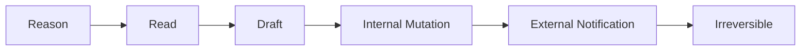

Risk increases as you move right.

---

# 4. Proposal vs Commit

A safe architecture separates proposed action from committed side effect.

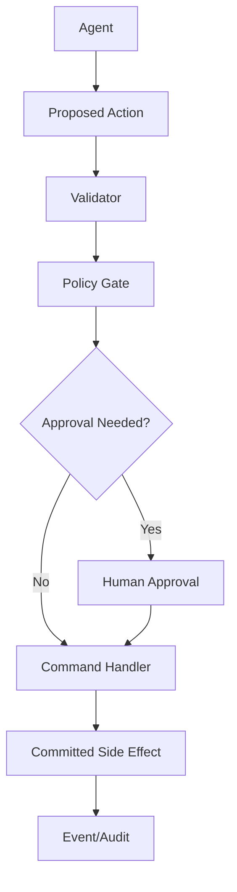

The agent should usually produce:

- command proposal;
- draft artifact;
- decision package;
- tool request.

The authoritative service commits the side effect.

---

# 5. Transaction Boundary

A transaction boundary defines what is committed atomically.

Example single-database transaction:

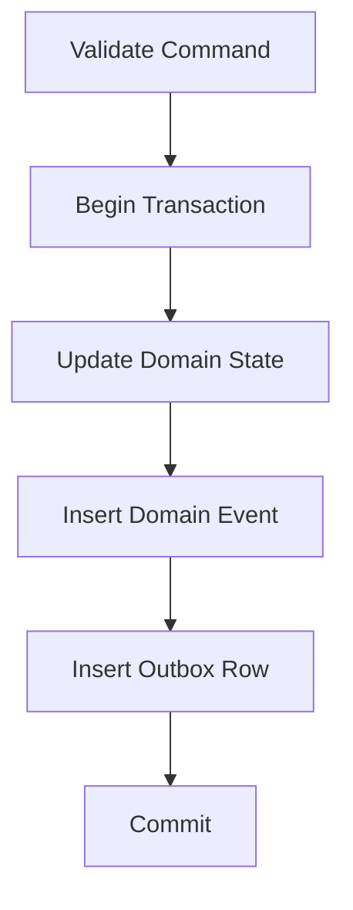

This is strong if all writes are in one database.

But agent workflows often involve external systems, where distributed transactions are not available.

That is where sagas, idempotency, and reconciliation matter.

---

# 6. Command Handler Boundary

Side effects should be performed by command handlers or controlled services, not raw agent calls.

```python
from pydantic import BaseModel, Field


class SendApprovedNoticeCommand(BaseModel):
    command_id: str
    tenant_id: str
    case_id: str
    notice_draft_id: str
    approval_id: str
    recipient_id: str
    expected_case_version: int
    idempotency_key: str
```

Command handler validates:

- approval exists;
- approval matches draft;
- reviewer authorized;
- case version matches;
- recipient valid;
- policy allows sending;
- idempotency key not already committed.

---

# 7. Side-Effect Lifecycle

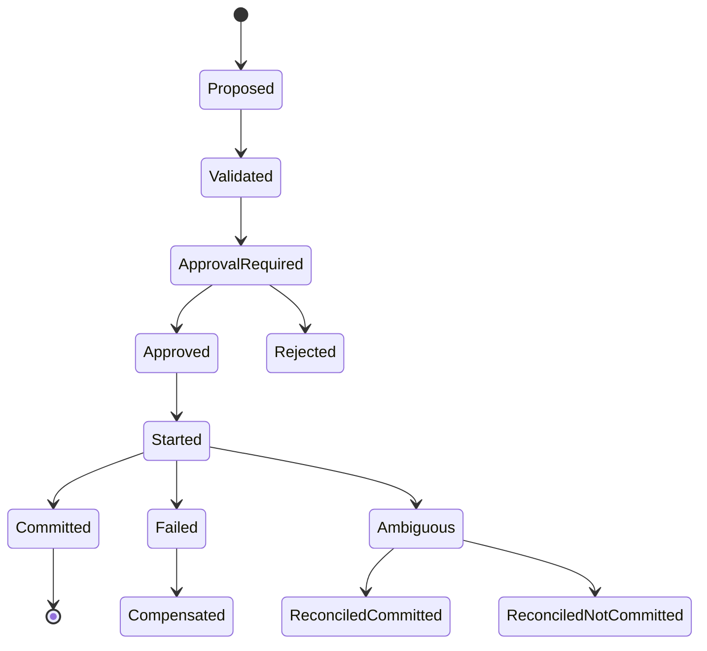

Track lifecycle explicitly.

---

# 8. Side-Effect Record

```python
class SideEffectStatus(str, Enum):
    PROPOSED = "proposed"
    VALIDATED = "validated"
    APPROVAL_REQUIRED = "approval_required"
    APPROVED = "approved"
    STARTED = "started"
    COMMITTED = "committed"
    FAILED = "failed"
    AMBIGUOUS = "ambiguous"
    COMPENSATED = "compensated"


class SideEffectRecord(BaseModel):
    side_effect_id: str
    tenant_id: str
    run_id: str
    command_id: str
    effect_type: str
    target_type: str
    target_id: str
    idempotency_key: str
    status: SideEffectStatus
    external_ref: str | None = None
    approval_id: str | None = None
    created_at: str
    updated_at: str
```

This record is central to retry, audit, and recovery.

---

# 9. Idempotency Boundary

Side effects must be idempotent at the logical operation level.

Bad key:

```python
key = uuid4()
```

Good key:

```text
tenant_a:send_notice:case_123:draft_456:approval_789
```

## Idempotency Rule

> The same logical side effect must use the same idempotency key across retries, resumes, and duplicate requests.

The key should bind to:

- tenant;
- action;
- target;
- approved artifact;
- approval;
- recipient;
- operation version.

---

# 10. Request Hash

Prevent key reuse with different payload.

```python
import hashlib
import json


def request_hash(payload: dict) -> str:
    return hashlib.sha256(
        json.dumps(payload, sort_keys=True, separators=(",", ":")).encode()
    ).hexdigest()
```

If same idempotency key appears with different hash, reject.

This avoids accidentally sending a different notice under same logical key.

---

# 11. Outbox Pattern

When committing domain state and publishing events, use outbox.

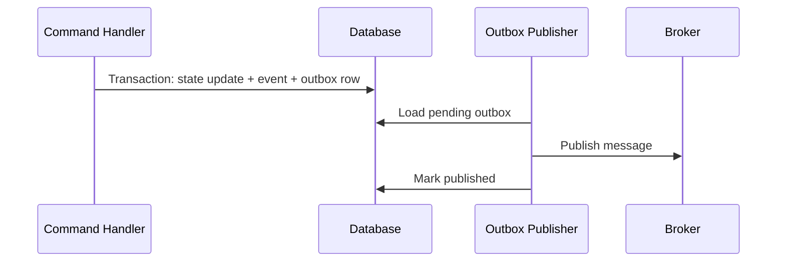

Outbox solves:

- state committed but event not published;
- publisher crash;
- broker retry;
- operational visibility.

It does not eliminate duplicate publishes. Consumers still need dedup.

---

# 12. Inbox Pattern

Consumers use inbox/dedup records.

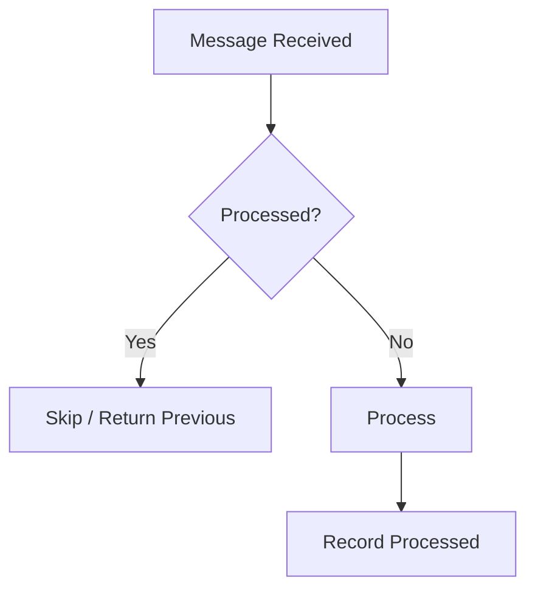

Inbox solves:

- broker redelivery;
- duplicate outbox publish;
- consumer retry;
- crash before ack.

For side-effecting consumers, inbox is essential.

---

# 13. Saga Pattern

A saga coordinates a multi-step business process using local transactions and compensations.

Example:

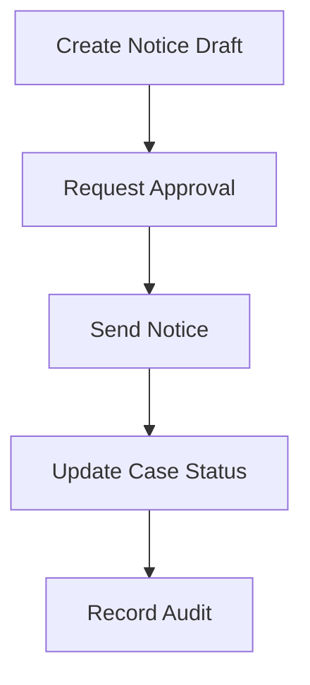

If a later step fails, earlier steps may need compensation.

## Saga Step Model

```python
class SagaStep(BaseModel):
    step_id: str
    name: str
    command_type: str
    compensation_command_type: str | None = None
    idempotency_key: str
    status: str
```

## Saga State

```python
class SagaState(BaseModel):
    saga_id: str
    tenant_id: str
    run_id: str
    current_step: str
    steps: list[SagaStep]
    status: str
```

Sagas fit long-running agent workflows with approvals and external side effects.

---

# 14. Orchestration vs Choreography

## Orchestration

A central coordinator controls saga steps.

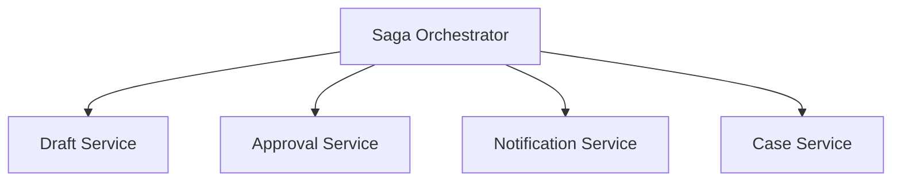

Pros:

- easier to understand;
- central state;
- easier audit;
- explicit control.

Cons:

- orchestrator complexity;
- potential bottleneck.

## Choreography

Services react to events.

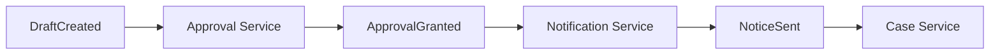

Pros:

- decoupled;
- scalable;
- service autonomy.

Cons:

- harder to trace;
- harder to control;
- harder to reason about global state.

For high-risk agentic workflows, orchestration is often easier to govern.

---

# 15. Reservation-Confirmation Pattern

Useful for external actions.

Example:

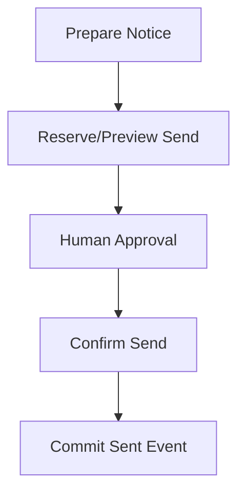

Similar idea:

- preview before commit;
- reserve before capture;
- draft before send;
- validate before mutate.

This pattern gives humans and policy gates a safe checkpoint.

---

# 16. Approval Boundary

Approval should authorize a specific action, not a vague future action.

Approval should bind to:

- artifact version;
- target;
- recipient;
- policy version;
- risk level;
- expiry;
- reviewer;
- allowed command.

```python
class ApprovalGrant(BaseModel):
    approval_id: str
    tenant_id: str
    approved_action: str
    target_id: str
    artifact_id: str
    artifact_version: int
    reviewer_id: str
    expires_at: str | None
```

Command handler must verify approval matches command.

---

# 17. External Side Effects

External side effects are risky because you do not control all state.

Examples:

- email provider;
- payment provider;
- government filing system;
- customer notification;
- third-party ticketing;
- external webhook.

Controls:

- idempotency key;
- external reference ID;
- retry policy;
- reconciliation API;
- timeout handling;
- audit;
- compensation plan;
- manual remediation path.

---

# 18. Ambiguous Completion

A timeout does not mean failure.

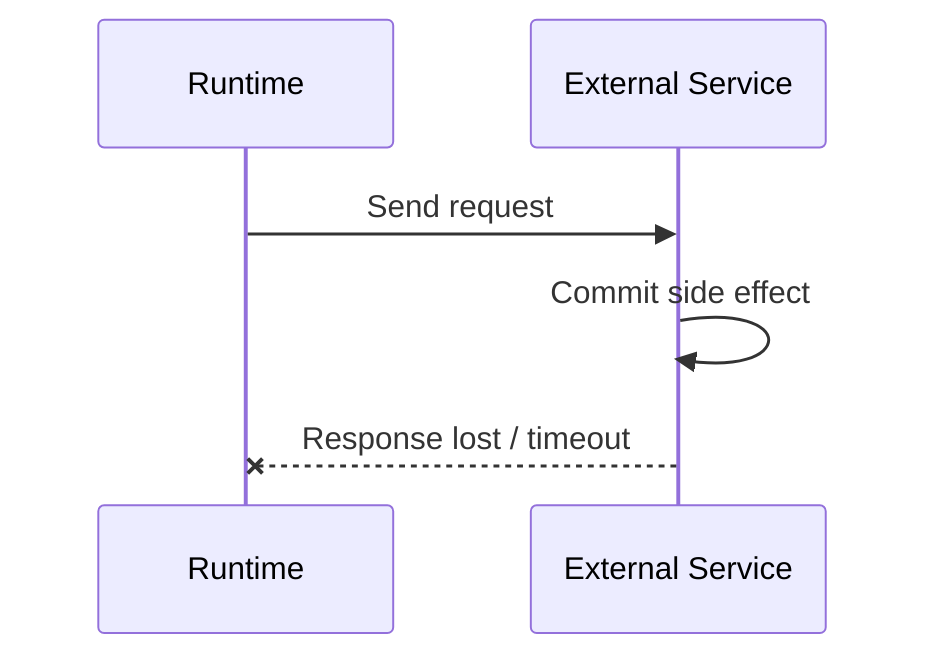

The runtime sees timeout but side effect may have happened.

## Strategy

1. mark side effect `AMBIGUOUS`;
2. reconcile by idempotency key/external lookup;
3. if committed, record committed;
4. if not committed, retry if safe;
5. if unknown, escalate.

---

# 19. Reconciliation Model

```python
class ReconciliationRequest(BaseModel):
    side_effect_id: str
    idempotency_key: str
    external_ref: str | None = None


class ReconciliationOutcome(BaseModel):
    status: str  # committed, not_committed, unknown
    external_ref: str | None = None
    reason: str
```

Reconciliation is required for side effects where duplicate action is harmful.

---

# 20. Compensation

Compensation is a business action that mitigates a previous side effect.

Examples:

| Side Effect | Compensation |
|---|---|
| create draft | archive/delete draft |
| reserve resource | release reservation |
| update status | transition back with audit |
| send internal notification | send correction |
| charge payment | refund |
| send legal notice | often no true compensation |

Not all actions are compensatable.

If compensation is impossible, prevention and approval become more important.

---

# 21. Compensation Command

```python
class CompensationCommand(BaseModel):
    command_id: str
    tenant_id: str
    original_side_effect_id: str
    compensation_type: str
    reason: str
    requested_by: str
    idempotency_key: str
```

Compensation should also be idempotent and audited.

---

# 22. Transactional Outbox for Agent Commands

Agent proposes command.

Command handler commits state and outbox.

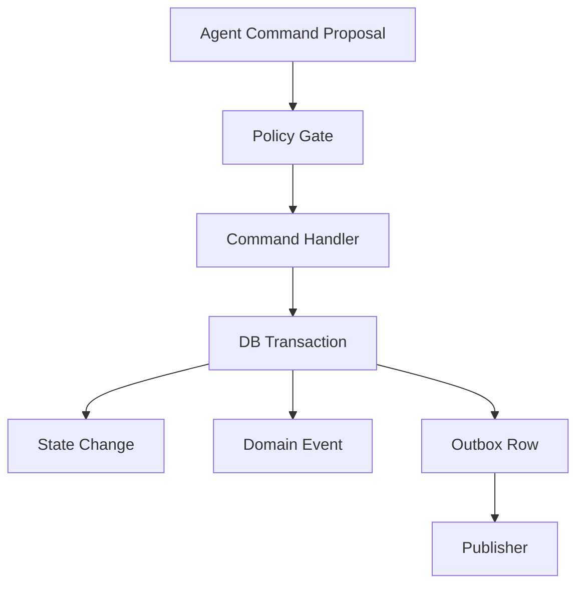

Agent should not publish integration events directly.

---

# 23. Domain Event vs Integration Event

Domain event:

> Something happened in the domain.

Integration event:

> Something external consumers should know.

They may differ.

Example:

- domain event: `NoticeApproved`
- integration event: `SendNoticeRequested`
- external event: `NoticeSent`

Keep meanings clear.

---

# 24. Transaction Boundary With Checkpoint

Agent runtime checkpoint and domain transaction are separate.

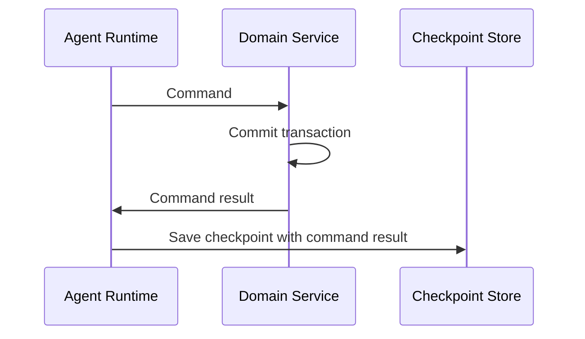

Crash after domain commit before checkpoint creates ambiguity.

Solution:

- command idempotency;
- command result lookup;
- side-effect record;
- resume reconciliation.

---

# 25. Runtime-State vs Domain-State Commit

Do not commit runtime state as if domain state changed.

Bad:

```text
checkpoint.state["notice_sent"] = true
```

Better:

- notification service emits `NoticeSent`;
- runtime records reference to event;
- domain service updates case status if applicable.

Runtime state tracks execution. Domain state tracks business reality.

---

# 26. Side Effects in Multi-Agent Systems

Workers should rarely perform side effects.

Preferred pattern:

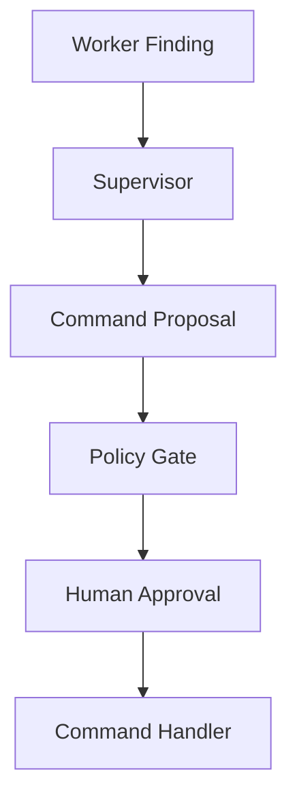

Specialist agents produce findings and drafts.

Supervisor proposes side effects.

Authoritative services commit side effects.

---

# 27. Tool Effect Enforcement

Tool executor should enforce effect policy.

```python
def require_approval_for_effect(effect_type: str) -> bool:
    return effect_type in {
        "external_notification",
        "external_transaction",
        "irreversible",
    }
```

The tool name alone is not enough. Use tool contract metadata.

---

# 28. Exactly-Once Illusion

Exactly-once side effects are difficult across distributed systems.

Assume:

- commands can be retried;
- messages can be redelivered;
- workers can crash;
- external services can timeout;
- responses can be lost;
- humans can double-submit.

Design for **at-least-once attempts** with idempotent effects and deduplication.

---

# 29. Concurrency and Versioning

Use expected version for domain mutations.

```python
class UpdateCaseRiskCommand(BaseModel):
    command_id: str
    tenant_id: str
    case_id: str
    new_risk_level: str
    expected_case_version: int
    rationale: str
    evidence_refs: list[str]
```

If version mismatch:

- reload state;
- re-evaluate;
- ask human;
- reject stale command.

Do not blindly overwrite.

---

# 30. Side-Effect Observability

Track:

- proposed action;
- policy decision;
- approval ID;
- command ID;
- idempotency key;
- side-effect status;
- external reference;
- retry count;
- reconciliation outcome;
- compensation action;
- event IDs;
- latency;
- failure type.

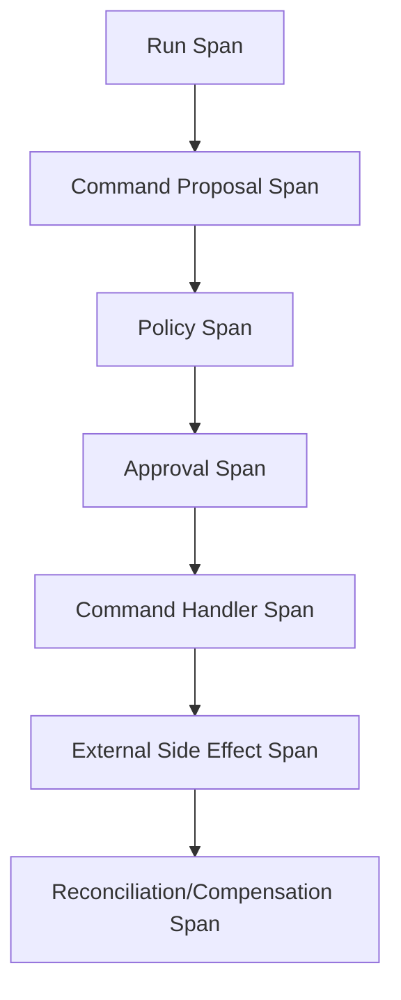

---

# 31. Side-Effect Audit Trail

Audit chain:

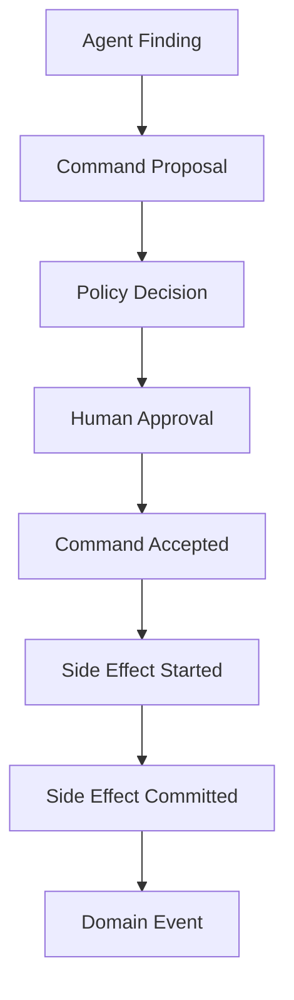

For every high-impact side effect, answer:

- who/what proposed it?
- what evidence supported it?
- which policy allowed it?
- who approved it?
- what command committed it?
- did external system confirm it?
- was it retried?
- was it compensated?

---

# 32. Side-Effect Failure Modes

| Failure | Description | Mitigation |
|---|---|---|
| duplicate send | retry without idempotency | stable key + provider support |
| stale approval | artifact changed after approval | expected version |
| approval bypass | tool executes directly | PEP at tool executor |
| crash after commit | runtime lacks record | command result lookup |
| event lost | state committed but no publish | outbox |
| duplicate event | retry publish | inbox dedup |
| no compensation | irreversible failure | stronger prevention |
| worker overreach | specialist calls side-effect tool | tool grants |
| domain/runtime mismatch | checkpoint says done, domain not | domain event source |
| timeout ambiguity | unknown external state | reconciliation |

---

# 33. Python Side-Effect Executor Sketch

```python
class SideEffectExecutor:
    def __init__(self, idempotency_store, policy_engine, audit_log):
        self.idempotency_store = idempotency_store
        self.policy_engine = policy_engine
        self.audit_log = audit_log

    async def execute(self, command: SendApprovedNoticeCommand) -> SideEffectRecord:
        existing = await self.idempotency_store.get(command.idempotency_key)

        if existing and existing.status == "committed":
            return await load_side_effect_record(existing.result_ref)

        decision = await self.policy_engine.evaluate_send_notice(command)

        if decision.decision != "allow":
            raise PermissionError(decision.reason)

        record = await create_side_effect_record(
            command=command,
            status=SideEffectStatus.STARTED,
        )

        try:
            external_ref = await send_notice_to_provider(
                command,
                idempotency_key=command.idempotency_key,
            )

            await mark_side_effect_committed(
                record.side_effect_id,
                external_ref=external_ref,
            )

            return await load_side_effect_record(record.side_effect_id)

        except TimeoutError:
            await mark_side_effect_ambiguous(record.side_effect_id)
            raise
```

Production code needs transactions, locking/unique constraints, retries, reconciliation, and telemetry.

---

# 34. Testing Crash Windows

Inject failures.

```python
class CrashPoint(str, Enum):
    BEFORE_COMMAND_COMMIT = "before_command_commit"
    AFTER_COMMAND_COMMIT_BEFORE_RESPONSE = "after_command_commit_before_response"
    AFTER_EXTERNAL_SEND_BEFORE_RECORD = "after_external_send_before_record"
    AFTER_OUTBOX_WRITE_BEFORE_PUBLISH = "after_outbox_write_before_publish"
```

Test expectations:

| Crash Point | Expected |
|---|---|
| before command commit | safe retry |
| after command commit before response | idempotent command returns prior result |
| after external send before record | reconciliation prevents duplicate |
| after outbox write before publish | publisher later sends |
| after publish before mark sent | duplicate possible, inbox dedups |

---

# 35. Production Checklist

Before allowing side effects:

- [ ] effect type classified;
- [ ] proposal separated from commit;
- [ ] command handler owns mutation;
- [ ] approval required for high-impact effect;
- [ ] approval binds to artifact/version/action;
- [ ] idempotency key stable;
- [ ] request hash stored;
- [ ] side-effect record exists;
- [ ] expected domain version checked;
- [ ] external reference stored;
- [ ] timeout creates ambiguous state;
- [ ] reconciliation path exists;
- [ ] compensation path defined if possible;
- [ ] outbox used for event publishing;
- [ ] inbox used by consumers;
- [ ] retries are bounded;
- [ ] audit trail complete;
- [ ] workers cannot bypass tool grants;
- [ ] crash windows tested;
- [ ] fail-closed behavior defined.

---

# 36. Practice Drill

Design side-effect handling for an enforcement notice workflow.

Steps:

1. agent drafts notice;
2. verifier checks citations;
3. supervisor proposes send;
4. policy requires senior approval;
5. reviewer approves;
6. notification service sends notice;
7. case status changes to notified;
8. audit event is recorded.

Deliverables:

1. side-effect taxonomy;
2. command schema;
3. approval grant schema;
4. side-effect record;
5. idempotency key;
6. outbox events;
7. inbox dedup model;
8. saga steps;
9. compensation plan;
10. reconciliation flow;
11. crash-window tests;
12. observability fields.

---

# 37. What Top 1% Engineers Pay Attention To

Top engineers ask:

- What exactly changes if this action succeeds?
- Is it reversible?
- Who has authority to commit it?
- What if it runs twice?
- What if it succeeds but response is lost?
- What if approval is stale?
- What if artifact changed after approval?
- What if event publish fails?
- What if consumer receives event twice?
- What if compensation is impossible?
- What if runtime checkpoint lies?
- What if worker crashes during side effect?
- What event proves the side effect happened?
- What state is authoritative?

They do not let agents “just call the tool.”

---

# 38. Summary

In this part, we covered:

- side-effect taxonomy;
- proposal vs commit;
- transaction boundaries;
- command handlers;
- side-effect lifecycle;
- side-effect records;
- idempotency;
- request hashes;
- outbox;
- inbox;
- sagas;
- orchestration vs choreography;
- reservation-confirmation;
- approval boundaries;
- external side effects;
- ambiguous completion;
- reconciliation;
- compensation;
- transactional outbox for agent commands;
- domain vs integration events;
- checkpoint/domain transaction mismatch;
- multi-agent side-effect control;
- exactly-once illusion;
- concurrency/versioning;
- observability;
- audit;
- failure modes;
- executor sketch;
- crash-window tests;
- production checklist.

The key principle:

> A side effect is not complete because the agent said so. It is complete when the authoritative system commits it and the event trail proves it.

The next part begins the security, safety, and governance phase with **Threat Modeling Agentic Systems**.

---

## References

- AWS Builders Library: retries, idempotency, backoff, and distributed system failure handling.
- Enterprise integration patterns: transactional outbox, inbox/deduplication, sagas, compensation.
- Temporal documentation: activity retries and idempotency principles for durable execution.
- OWASP Top 10 for LLM Applications: excessive agency and insecure output handling.
