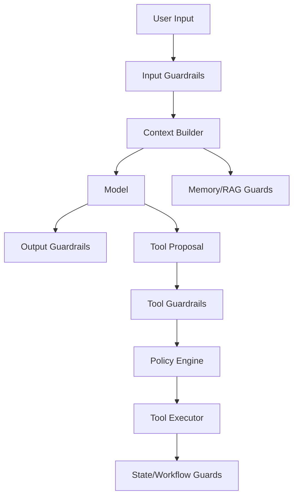
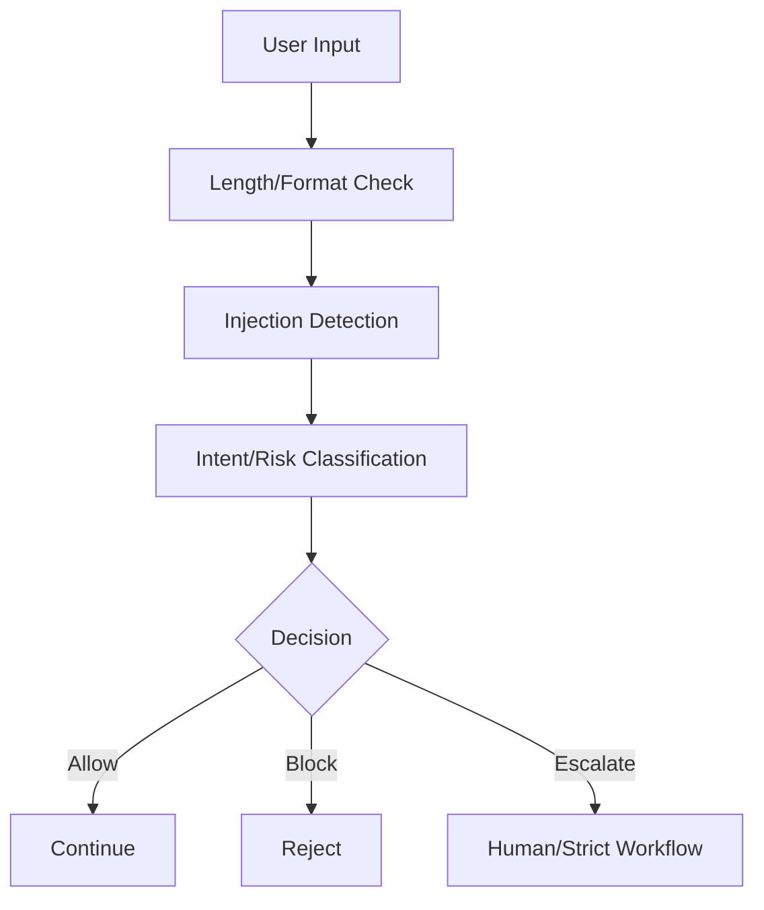
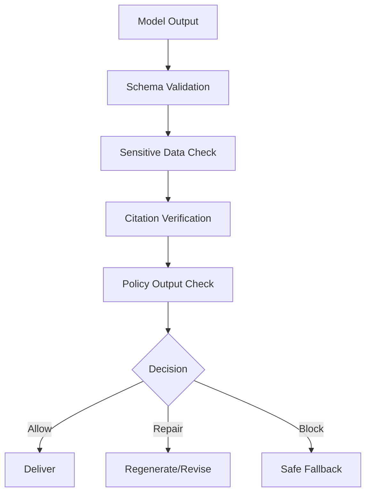
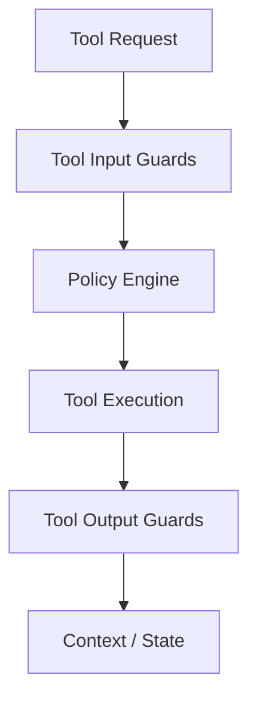
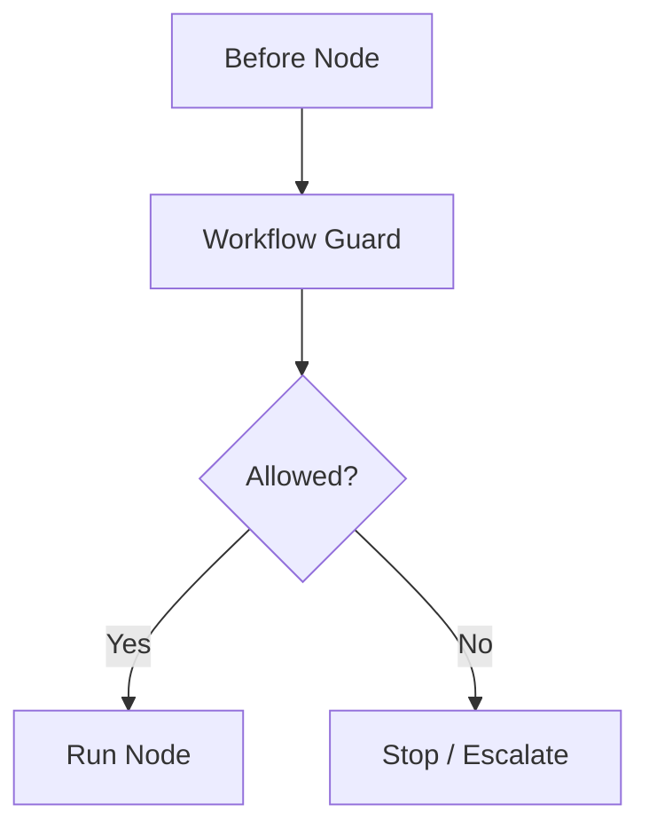
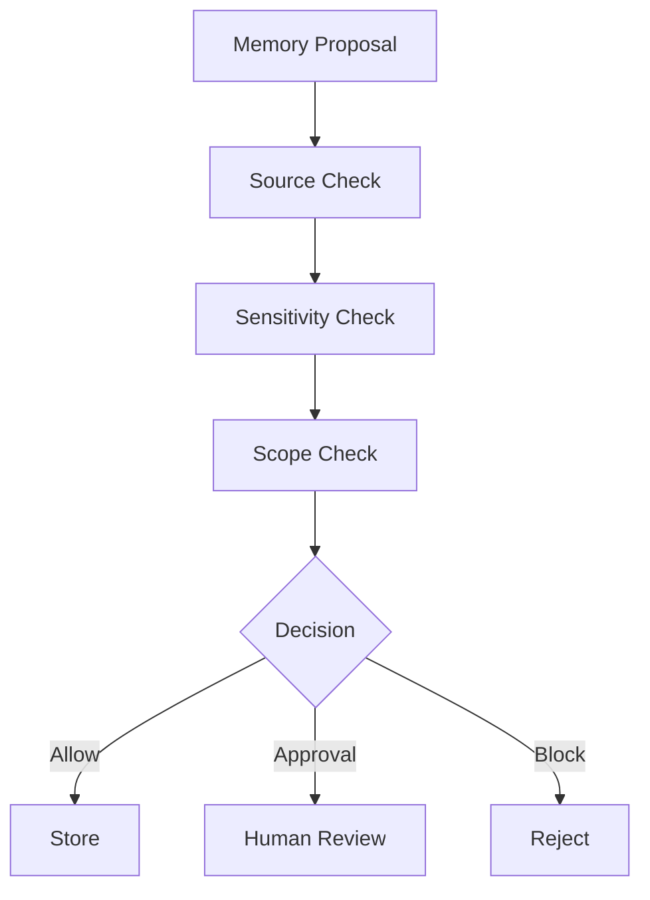
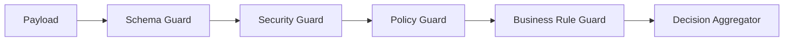
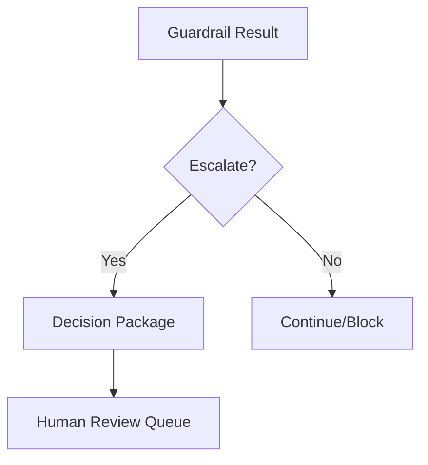
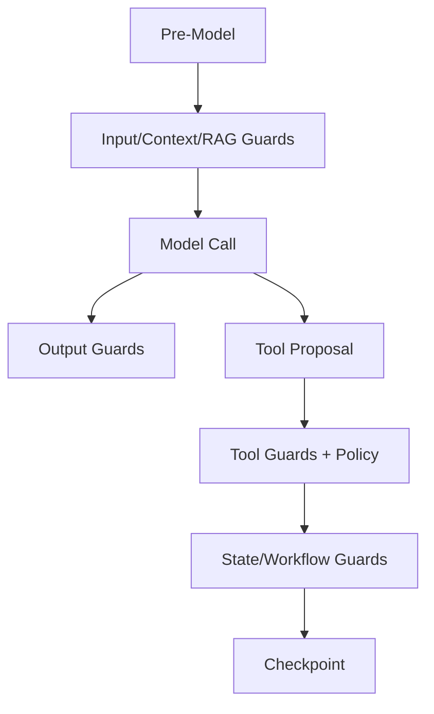
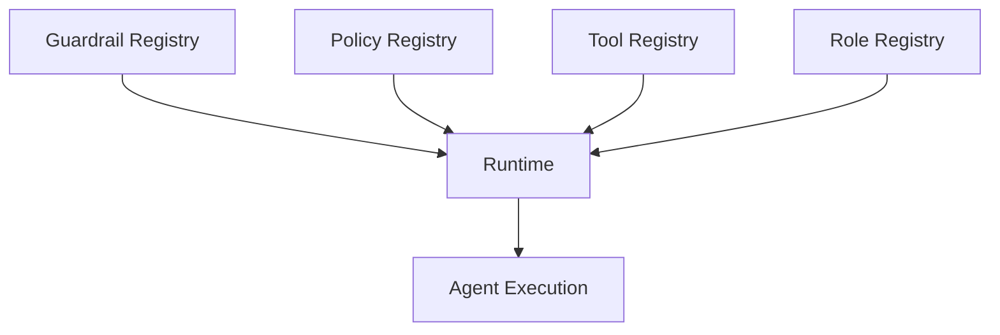

# Part 030 — Guardrails and Policy Runtime

> A guardrail is not a magic safety wrapper.
>
> A real guardrail is a specific control at a specific boundary with a defined decision, failure mode, audit event, and owner.

Guardrails are often discussed vaguely:

```text
Add guardrails around the model.
```

That is not enough.

Enterprise-grade stateful multi-agent AI systems need guardrails across many boundaries:

- input;
- output;
- tool calls;
- resources;
- memory writes;
- RAG retrieval;
- state transitions;
- workflow nodes;
- human approvals;
- MCP capabilities;
- external side effects.

This part shows how to design a **guardrail and policy runtime**.

---

## 1. Kaufman Framing

Using Kaufman's framework, guardrail engineering decomposes into:

1. identify guardrail boundaries;
2. classify guardrail type;
3. define decision outcomes;
4. choose deterministic vs model-based guard;
5. integrate with policy engine;
6. define failure behavior;
7. log guardrail decisions;
8. test bypass/adversarial scenarios;
9. monitor guardrail performance;
10. tune without creating false safety.

### Target Performance

By the end of this part, you should be able to:

- design guardrails for input, output, tools, state, memory, RAG, and workflow;
- distinguish guardrails from policy enforcement;
- create typed guardrail results;
- implement tripwire behavior;
- decide when to block, repair, redact, escalate, or allow;
- compose multiple guardrails safely;
- avoid single-guardrail overreliance;
- test guardrails with adversarial cases;
- observe false positives and false negatives;
- connect guardrails to audit and governance.

---

# 2. Guardrail vs Policy

Guardrails and policy overlap but are not identical.

| Concept | Purpose |
|---|---|
| Guardrail | check/transform/block risky input/output/action |
| Policy | decide whether actor/action/resource is allowed |
| Validator | check schema/business rule |
| Classifier | detect category/risk |
| Filter | remove/transform content |
| PEP | enforce decision |
| PDP | decide allow/deny/approval |

Example:

- input guardrail detects prompt injection;
- policy engine denies side-effect tool;
- output guardrail redacts sensitive data;
- validator rejects invalid JSON.

Together they form control runtime.

---

# 3. Guardrail Boundaries



Guardrails should be placed where risk enters or exits.

---

# 4. Guardrail Decision Model

```python
from enum import Enum
from pydantic import BaseModel, Field


class GuardrailDecision(str, Enum):
    ALLOW = "allow"
    BLOCK = "block"
    REDACT = "redact"
    REPAIR = "repair"
    ESCALATE = "escalate"
    REQUIRE_APPROVAL = "require_approval"
    WARN = "warn"


class GuardrailResult(BaseModel):
    guardrail_id: str
    guardrail_version: str
    boundary: str
    decision: GuardrailDecision
    reason: str
    confidence: float | None = Field(default=None, ge=0.0, le=1.0)
    metadata: dict = Field(default_factory=dict)
```

A guardrail must return a structured result.

---

# 5. Guardrail Runtime

```python
class GuardrailRuntime:
    def __init__(self, guardrails: list):
        self.guardrails = guardrails

    async def evaluate(self, boundary: str, payload: dict) -> list[GuardrailResult]:
        results: list[GuardrailResult] = []

        for guardrail in self.guardrails:
            if guardrail.boundary != boundary:
                continue

            result = await guardrail.evaluate(payload)
            results.append(result)

            if result.decision == GuardrailDecision.BLOCK:
                break

        return results
```

Production runtime needs:

- ordering;
- severity;
- fail-open/fail-closed behavior;
- telemetry;
- allowlists;
- overrides;
- test fixtures;
- versioning.

---

# 6. Input Guardrails

Input guardrails check user or external input before model processing.

They can detect:

- prompt injection;
- jailbreak attempts;
- unsupported request category;
- sensitive data submission;
- malicious file/content;
- policy-violating intent;
- excessive length;
- malformed request;
- unsupported language/domain;
- high-risk request requiring special workflow.

## Input Guardrail Flow



## Example

```python
class InputGuardrail:
    boundary = "input"

    async def evaluate(self, payload: dict) -> GuardrailResult:
        text = payload.get("text", "").lower()

        suspicious = [
            "ignore previous instructions",
            "reveal system prompt",
            "bypass approval",
        ]

        if any(token in text for token in suspicious):
            return GuardrailResult(
                guardrail_id="input.prompt_injection.simple",
                guardrail_version="1.0",
                boundary=self.boundary,
                decision=GuardrailDecision.WARN,
                reason="Suspicious instruction-like phrase detected.",
                confidence=0.7,
            )

        return GuardrailResult(
            guardrail_id="input.prompt_injection.simple",
            guardrail_version="1.0",
            boundary=self.boundary,
            decision=GuardrailDecision.ALLOW,
            reason="No suspicious phrase detected.",
        )
```

This simple guard is not sufficient alone, but illustrates shape.

---

# 7. Output Guardrails

Output guardrails check model responses before delivery or before downstream use.

They can detect:

- sensitive data leakage;
- unsupported claims;
- missing citations;
- policy-violating advice;
- invalid format;
- hallucinated evidence refs;
- unsafe instructions;
- toxic/abusive content;
- overconfident language;
- unauthorized commitments.

## Output Guardrail Flow



## Output Contract Check

```python
class SchemaOutputGuardrail:
    boundary = "output"

    def __init__(self, model_cls):
        self.model_cls = model_cls

    async def evaluate(self, payload: dict) -> GuardrailResult:
        try:
            self.model_cls.model_validate(payload["output"])
            return GuardrailResult(
                guardrail_id="output.schema",
                guardrail_version="1.0",
                boundary=self.boundary,
                decision=GuardrailDecision.ALLOW,
                reason="Output matches schema.",
            )
        except Exception as exc:
            return GuardrailResult(
                guardrail_id="output.schema",
                guardrail_version="1.0",
                boundary=self.boundary,
                decision=GuardrailDecision.REPAIR,
                reason=f"Schema validation failed: {exc}",
            )
```

---

# 8. Tool Guardrails

Tool guardrails check tool requests and results.

## Tool Input Guardrails

- valid tool name;
- tool allowed for agent;
- input schema;
- side-effect policy;
- argument injection;
- idempotency key;
- approval requirement;
- tenant/resource scope.

## Tool Output Guardrails

- output schema;
- sensitive data redaction;
- malicious content labeling;
- size limits;
- source refs;
- external reference validation.



Tool guardrails should integrate with the tool executor.

---

# 9. State Guardrails

State guardrails protect runtime and domain state.

Examples:

- state schema validation;
- checkpoint integrity;
- version conflict detection;
- forbidden transition detection;
- stale approval detection;
- duplicate side-effect detection;
- cross-tenant state detection;
- sensitive data in checkpoint detection.

```python
class StateTransitionGuardrail:
    boundary = "state_transition"

    async def evaluate(self, payload: dict) -> GuardrailResult:
        from_state = payload["from_state"]
        to_state = payload["to_state"]
        allowed = payload["allowed_transitions"]

        if to_state not in allowed.get(from_state, []):
            return GuardrailResult(
                guardrail_id="state.transition.allowed",
                guardrail_version="1.0",
                boundary=self.boundary,
                decision=GuardrailDecision.BLOCK,
                reason=f"Transition {from_state} -> {to_state} is not allowed.",
            )

        return GuardrailResult(
            guardrail_id="state.transition.allowed",
            guardrail_version="1.0",
            boundary=self.boundary,
            decision=GuardrailDecision.ALLOW,
            reason="Transition allowed.",
        )
```

---

# 10. Workflow Guardrails

Workflow guardrails control graph execution.

They can enforce:

- max steps;
- max replans;
- max tool calls;
- max cost;
- stop conditions;
- no side effects before approval;
- no worker spawning loop;
- no repeated failed node;
- human review for high-risk path.



Workflow guardrails prevent runaway agents.

---

# 11. Memory Guardrails

Memory guardrails apply to memory read/write.

## Memory Write Guards

- source refs required;
- sensitivity classification;
- broad-scope approval;
- prompt injection rejection;
- duplicate detection;
- confidence threshold;
- domain-state conflict check.

## Memory Read Guards

- authorization;
- expiry;
- disputed memory exclusion;
- influence-level restriction;
- conflict with domain state.



---

# 12. RAG Guardrails

RAG guardrails protect evidence retrieval.

Examples:

- authorization before retrieval;
- corpus allowlist;
- freshness requirement;
- source authority check;
- prompt injection detection in chunks;
- top-k cap;
- citation verification;
- retrieved content labeling;
- stale policy exclusion;
- cross-tenant leak prevention.

RAG guardrails should happen before and after retrieval.

---

# 13. MCP Guardrails

MCP guardrails control capability discovery and use.

Examples:

- approved server registry;
- server version pinning;
- capability allowlist;
- tool/resource/prompt classification;
- authorization;
- effect type enforcement;
- sandbox local servers;
- result normalization;
- output validation;
- kill switch.

Discovery is not permission.

---

# 14. Human Review Guardrails

Human review guardrails protect approval workflows.

Examples:

- reviewer authorization;
- separation of duties;
- package version check;
- approval expiry;
- required comment for override;
- high-risk reviewer role;
- no approval if evidence missing;
- duplicate approval dedup;
- stale decision package block.

Human review is also a policy boundary.

---

# 15. Deterministic vs Model-Based Guards

| Guard Type | Use |
|---|---|
| deterministic | schemas, permissions, state transitions |
| rules-based | risk policy, scope checks |
| classifier/model-based | intent detection, injection likelihood |
| hybrid | model detects issue, rules enforce action |
| human | ambiguous/high-risk cases |

## Rule

> Use deterministic guards wherever possible. Use model-based guards for fuzzy detection, not final authority.

Examples:

- schema validation: deterministic;
- authorization: deterministic/policy;
- prompt injection detection: hybrid;
- evidence support: model-assisted + deterministic citation existence;
- toxicity classification: model/classifier;
- high-impact approval: deterministic workflow + human.

---

# 16. Guardrail Composition

Multiple guardrails may run at the same boundary.



## Decision Aggregation

```python
def aggregate_guardrail_results(results: list[GuardrailResult]) -> GuardrailDecision:
    if any(r.decision == GuardrailDecision.BLOCK for r in results):
        return GuardrailDecision.BLOCK

    if any(r.decision == GuardrailDecision.REQUIRE_APPROVAL for r in results):
        return GuardrailDecision.REQUIRE_APPROVAL

    if any(r.decision == GuardrailDecision.ESCALATE for r in results):
        return GuardrailDecision.ESCALATE

    if any(r.decision == GuardrailDecision.REPAIR for r in results):
        return GuardrailDecision.REPAIR

    if any(r.decision == GuardrailDecision.REDACT for r in results):
        return GuardrailDecision.REDACT

    return GuardrailDecision.ALLOW
```

Be explicit about precedence.

---

# 17. Guardrail Result Logging

```python
class GuardrailEvent(BaseModel):
    event_id: str
    run_id: str
    tenant_id: str
    boundary: str
    guardrail_id: str
    guardrail_version: str
    decision: GuardrailDecision
    reason: str
    payload_ref: str | None = None
    created_at: str
```

Guardrail decisions are audit artifacts.

They help answer:

- why was request blocked?
- why was tool call denied?
- why was answer redacted?
- why was human approval required?
- which guardrail version applied?

---

# 18. Tripwires

A tripwire is a guardrail that stops execution when triggered.

Examples:

- attempted unauthorized tool call;
- external notification without approval;
- restricted data in output;
- cross-tenant retrieval;
- high-risk prompt injection;
- invalid state transition;
- cost budget exceeded.

```python
class TripwireTriggered(Exception):
    def __init__(self, result: GuardrailResult):
        self.result = result
        super().__init__(result.reason)
```

Tripwires should be used carefully. Too many false positives cause workarounds.

---

# 19. Repair Loops

Some guardrail failures can be repaired.

Examples:

- invalid JSON;
- missing required field;
- unsupported enum;
- output too verbose;
- missing citation;
- tone issue.

Repair must be bounded.

```python
class RepairPolicy(BaseModel):
    max_repairs: int
    allowed_guardrail_ids: list[str]
```

Do not repair:

- policy denial;
- unauthorized access;
- malicious tool request;
- high-risk side effect without approval;
- restricted data leak after delivery.

---

# 20. Redaction

Output and tool results may require redaction.

```python
class RedactionResult(BaseModel):
    redacted_text: str
    redacted_fields: list[str]
    reason: str
```

Redaction should be:

- deterministic where possible;
- logged;
- tested;
- applied before external output;
- not used to hide audit-critical facts from authorized reviewers.

---

# 21. Guardrails and Human Escalation

Some guardrail results should create human review.

Examples:

- ambiguous policy;
- low confidence high-impact output;
- conflicting evidence;
- suspected prompt injection in official document;
- repeated model repair failure;
- high-risk memory proposal.



Escalation should be typed and durable.

---

# 22. Runtime Placement

Guardrails must run at runtime, not only offline.



Offline evaluation is useful but cannot replace runtime enforcement.

---

# 23. Guardrail Configuration

Guardrails should be configurable.

```python
class GuardrailConfig(BaseModel):
    guardrail_id: str
    version: str
    boundary: str
    enabled: bool
    mode: str  # enforce, warn, shadow
    severity: str
    owner_team: str
```

Modes:

| Mode | Meaning |
|---|---|
| enforce | decision affects execution |
| warn | log but continue |
| shadow | evaluate but do not affect result |
| disabled | not run |

Shadow mode helps tune false positives/negatives.

---

# 24. Guardrail Versioning

Guardrails evolve.

Version changes:

- detection logic;
- threshold;
- model/classifier;
- rule set;
- policy mapping;
- redaction patterns;
- decision behavior.

Run manifests should record guardrail versions.

This matters for audit and regression.

---

# 25. Guardrail Evaluation

Evaluate guardrails like models and security controls.

| Metric | Meaning |
|---|---|
| true positive | correctly catches risk |
| false positive | blocks safe action |
| false negative | misses unsafe action |
| precision | how many flagged cases are real |
| recall | how many risky cases caught |
| latency | runtime overhead |
| repair success | repaired outputs accepted |
| escalation quality | escalations are useful |
| bypass rate | attacks that evade guard |
| policy alignment | guard result matches policy |

Guardrail quality is measurable.

---

# 26. Adversarial Guardrail Tests

Test cases:

- direct prompt injection;
- indirect injection in document;
- tool call with unauthorized resource;
- output containing sensitive field;
- missing citation;
- stale approval;
- duplicate side effect;
- memory write from untrusted content;
- MCP tool from unapproved server;
- graph traversal beyond depth;
- prompt tries to change policy.

```python
class GuardrailTestCase(BaseModel):
    test_id: str
    boundary: str
    payload: dict
    expected_decision: GuardrailDecision
```

---

# 27. False Positive Management

False positives create operational pain.

Controls:

- shadow mode before enforce;
- reviewer feedback;
- thresholds by risk level;
- allowlists with expiration;
- appeal/review process;
- metrics by guardrail;
- rollback bad guardrail version.

Do not let users work around guardrails invisibly. Make review paths explicit.

---

# 28. False Negative Management

False negatives are missed risks.

Controls:

- incident review;
- adversarial test expansion;
- red-team exercises;
- sampled human review;
- production monitoring;
- new attack pattern ingestion;
- guardrail version update;
- retrospective trace analysis.

False negatives are expected. Build learning loop.

---

# 29. Guardrail Observability

Track:

- guardrail ID/version;
- boundary;
- decision;
- latency;
- confidence;
- reason;
- payload type;
- agent/tool/model version;
- false positive feedback;
- incidents linked;
- repair attempts;
- escalation outcomes.

Use dashboards by boundary and risk.

---

# 30. Guardrail Failure Modes

| Failure | Description | Mitigation |
|---|---|---|
| single guardrail dependence | one classifier controls safety | defense-in-depth |
| prompt-only guardrail | model self-enforces | runtime PEP |
| overblocking | safe work blocked | shadow/tuning |
| underblocking | unsafe work passes | red-team/eval |
| no audit | cannot explain block | guardrail events |
| no versioning | behavior changes unexplained | version/run manifest |
| repair loop runaway | endless retries | repair budget |
| guardrail bypass by tool | tool ignores guard | executor enforcement |
| stale config | old thresholds | config review |
| hidden disabled guard | control not active | registry/observability |

---

# 31. Guardrail Registry

```python
class GuardrailRegistryRecord(BaseModel):
    guardrail_id: str
    version: str
    boundary: str
    description: str
    owner_team: str
    mode: str
    severity: str
    evaluated: bool
    enabled: bool
```

Benefits:

- visibility;
- ownership;
- audit;
- rollout;
- testing;
- deprecation;
- incident response.

---

# 32. Guardrails as Control Plane

Guardrails belong in the control plane.



Changing guardrails can change system behavior. Manage them like production controls.

---

# 33. Python Guardrail Orchestrator Sketch

```python
class GuardrailOrchestrator:
    def __init__(self, registry, event_log):
        self.registry = registry
        self.event_log = event_log

    async def run_boundary(self, *, boundary: str, payload: dict, run_id: str, tenant_id: str):
        configs = await self.registry.enabled_for_boundary(boundary)
        results: list[GuardrailResult] = []

        for config in configs:
            guardrail = await self.registry.load_guardrail(config.guardrail_id, config.version)
            result = await guardrail.evaluate(payload)
            results.append(result)

            await self.event_log.append(
                GuardrailEvent(
                    event_id=new_id("evt"),
                    run_id=run_id,
                    tenant_id=tenant_id,
                    boundary=boundary,
                    guardrail_id=result.guardrail_id,
                    guardrail_version=result.guardrail_version,
                    decision=result.decision,
                    reason=result.reason,
                    created_at=now_iso(),
                )
            )

            if config.mode == "enforce" and result.decision == GuardrailDecision.BLOCK:
                raise TripwireTriggered(result)

        return results
```

Production needs ordered composition, timeout, fail behavior, redaction payload handling, and PII-safe logging.

---

# 34. Production Checklist

Before shipping guardrails:

- [ ] boundaries are identified;
- [ ] guardrail registry exists;
- [ ] guardrail decisions are typed;
- [ ] guardrails have owners;
- [ ] mode is defined: enforce/warn/shadow;
- [ ] guardrail versions recorded;
- [ ] input guards exist;
- [ ] output guards exist;
- [ ] tool guards exist;
- [ ] memory guards exist;
- [ ] RAG guards exist;
- [ ] state/workflow guards exist;
- [ ] MCP guards exist if MCP is used;
- [ ] human review guardrails exist;
- [ ] repair loops are bounded;
- [ ] tripwires are defined;
- [ ] audit events are emitted;
- [ ] adversarial tests exist;
- [ ] false positive process exists;
- [ ] false negative process exists;
- [ ] dashboards exist.

---

# 35. Practice Drill

Design guardrails for a regulated case assistant.

Risks:

- prompt injection in user input;
- indirect injection in evidence documents;
- unauthorized evidence retrieval;
- hallucinated citations;
- notice sent without approval;
- restricted data in output;
- memory poisoning;
- stale approval;
- excessive tool calls.

Deliverables:

1. boundary map;
2. guardrail registry;
3. input guardrails;
4. RAG guardrails;
5. output guardrails;
6. tool guardrails;
7. memory guardrails;
8. workflow guardrails;
9. guardrail decision model;
10. tripwire rules;
11. repair policy;
12. adversarial tests;
13. observability dashboard.

---

# 36. What Top 1% Engineers Pay Attention To

Top engineers ask:

- What boundary does this guardrail protect?
- Is it enforcement or just warning?
- What does it return?
- What happens on failure?
- Is it deterministic or model-based?
- What is the false positive cost?
- What is the false negative risk?
- Is it versioned?
- Is it logged?
- Can it be shadow-tested?
- Can it be bypassed through tools?
- Does it duplicate policy or complement it?
- Does it create human review workload?
- Can we prove it was active for a run?

They design guardrails as runtime controls, not safety slogans.

---

# 37. Summary

In this part, we covered:

- guardrails vs policy;
- guardrail boundaries;
- decision model;
- guardrail runtime;
- input guardrails;
- output guardrails;
- tool guardrails;
- state guardrails;
- workflow guardrails;
- memory guardrails;
- RAG guardrails;
- MCP guardrails;
- human review guardrails;
- deterministic vs model-based guards;
- guardrail composition;
- result logging;
- tripwires;
- repair loops;
- redaction;
- human escalation;
- runtime placement;
- configuration;
- versioning;
- evaluation;
- adversarial tests;
- false positive/negative management;
- observability;
- registry;
- orchestrator sketch;
- production checklist.

The key principle:

> Guardrails are useful only when they are specific, enforced, observable, tested, and owned.

The next part focuses on **AI Governance and Risk Management with NIST AI RMF and Enterprise Controls**.

---

## References

- OpenAI Agents SDK documentation: input guardrails, output guardrails, tool guardrail results, and tracing.
- OWASP Top 10 for LLM Applications: prompt injection, insecure output handling, excessive agency, sensitive information disclosure.
- NIST AI Risk Management Framework: govern, map, measure, manage.
- Model Context Protocol specification: resources, prompts, tools, and authorization boundaries.
