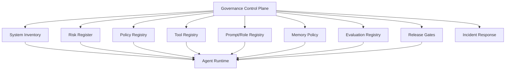
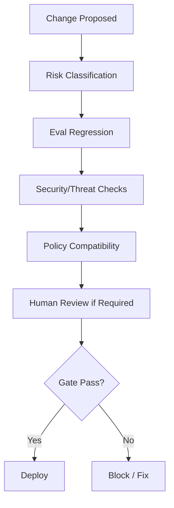
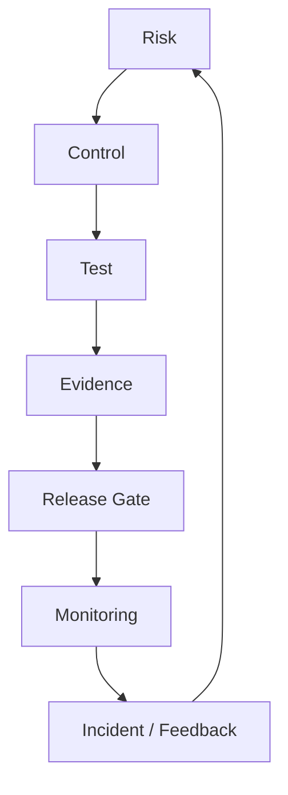

# Part 031 — AI Governance and Risk Management

> Governance is not paperwork after engineering.
>
> Governance is the operating system that decides which AI capabilities may exist, how they are controlled, who owns risk, how evidence is collected, and when the system must stop.

For enterprise-grade stateful multi-agent AI systems, governance cannot be reduced to:

```text
Add a policy page.
Add a model card.
Add human review.
```

A production multi-agent AI system has many moving parts:

- models;
- prompts;
- tools;
- MCP servers;
- RAG indexes;
- memory;
- workflows;
- policies;
- guardrails;
- human reviewers;
- audit trails;
- evaluation suites;
- deployment gates;
- incident response;
- data retention;
- risk ownership.

Governance connects these parts into an accountable operating model.

This part uses NIST AI RMF-style thinking as a practical organizing lens, but the goal is engineering execution: controls, evidence, responsibilities, risk tiers, and release gates.

---

## 1. Kaufman Framing

Using Kaufman's method, AI governance decomposes into:

1. identify the AI system and its intended use;
2. classify impact and risk;
3. map stakeholders and affected parties;
4. identify assets, harms, and controls;
5. assign ownership and accountability;
6. define control catalog;
7. measure system quality and risk;
8. manage deployment and change;
9. monitor production behavior;
10. respond to incidents and continuously improve.

### Target Performance

By the end of this part, you should be able to:

- create an AI system inventory entry;
- classify risk tier for a stateful multi-agent system;
- map NIST AI RMF-style Govern/Map/Measure/Manage activities into engineering controls;
- define a control catalog for agents, tools, memory, RAG, and human review;
- build a risk register;
- define accountability and RACI;
- create release gates;
- design an evidence pack for audit;
- connect evaluation results to deployment decisions;
- handle incident response and rollback.

---

# 2. Governance Is a Control Plane

A helpful mental model:



Governance is not only committee approval. It should influence runtime behavior through registries, policy engines, gates, and observability.

---

# 3. NIST AI RMF Lens

NIST AI RMF organizes risk management around four high-level functions:

- **Govern**
- **Map**
- **Measure**
- **Manage**

For an engineering team, translate them as:

| Function | Engineering Translation |
|---|---|
| Govern | ownership, policy, accountability, roles, operating model |
| Map | use case, context, assets, stakeholders, impacts, risks |
| Measure | evals, monitoring, red-teaming, metrics, evidence |
| Manage | controls, mitigations, release gates, incident response, rollback |

Do not treat these as sequential checklist items. They are continuous functions across system lifecycle.

---

# 4. AI System Inventory

You cannot govern systems you cannot inventory.

```python
from enum import Enum
from pydantic import BaseModel, Field


class AiSystemType(str, Enum):
    COPILOT = "copilot"
    AGENT_WORKFLOW = "agent_workflow"
    MULTI_AGENT_SYSTEM = "multi_agent_system"
    AUTONOMOUS_WORKER = "autonomous_worker"


class AiSystemInventoryEntry(BaseModel):
    system_id: str
    name: str
    system_type: AiSystemType
    owner_team: str
    business_owner: str
    intended_use: str
    prohibited_uses: list[str]
    user_groups: list[str]
    affected_parties: list[str]
    data_domains: list[str]
    tools_enabled: list[str]
    memory_enabled: bool
    external_side_effects: list[str]
    risk_tier: str
    production_status: str
```

Inventory entries should be reviewed when capabilities change.

---

# 5. Intended Use and Misuse

Every AI system needs intended-use boundaries.

## Intended Use

Example:

```text
Assist compliance analysts by summarizing case evidence, producing risk recommendations, drafting decision packages, and preparing notices for human approval.
```

## Prohibited Use

Example:

```text
The system must not independently approve enforcement action, send external legal notices without authorized approval, make final legal determinations, or update official case status without command-handler policy checks.
```

Intended use must map to actual runtime controls.

If the system says “must not send notices,” then the notification tool must enforce approval.

---

# 6. Risk Tiering

Risk tiering determines control strength.

```python
class RiskTier(str, Enum):
    LOW = "low"
    MEDIUM = "medium"
    HIGH = "high"
    CRITICAL = "critical"


class RiskTierAssessment(BaseModel):
    system_id: str
    risk_tier: RiskTier
    rationale: str
    factors: list[str]
    required_controls: list[str]
```

## Risk Factors

| Factor | Higher Risk When |
|---|---|
| autonomy | system can act without review |
| side effects | external or irreversible actions |
| data sensitivity | personal, regulated, confidential |
| affected parties | users/customers/public impacted |
| domain | legal, financial, healthcare, safety |
| scale | many users/cases/actions |
| opacity | hard to explain/debug |
| dependency | humans rely heavily on output |
| memory | future behavior affected |
| integration | tools/MCP/external APIs |

---

# 7. Risk Tier Control Matrix

| Control | Low | Medium | High | Critical |
|---|---:|---:|---:|---:|
| system inventory | yes | yes | yes | yes |
| eval suite | basic | component + regression | full + adversarial | full + human review |
| tool policy | yes | yes | strict | strict |
| human approval | sampled | for high-impact | required | human-led |
| memory governance | basic | scoped | strict | strict/limited |
| RAG citation verification | recommended | required | required | required |
| audit trail | basic | detailed | detailed | forensic |
| release gate | lightweight | required | strict | executive/business approval |
| incident response | basic | required | required | required |
| kill switch | recommended | required | required | required |

Risk tier should change the engineering process.

---

# 8. Governance Roles

| Role | Responsibility |
|---|---|
| business owner | owns business outcome and residual risk |
| system owner | owns runtime/service delivery |
| model/platform owner | owns model/provider routing and platform controls |
| data owner | owns data access, quality, retention |
| security owner | owns threat model and security controls |
| policy owner | owns policy rules and approval criteria |
| evaluation owner | owns eval datasets/metrics/gates |
| human review owner | owns reviewer workflow and quality |
| incident owner | coordinates response and remediation |

Governance fails when ownership is implicit.

---

# 9. RACI Example

| Activity | Responsible | Accountable | Consulted | Informed |
|---|---|---|---|---|
| define intended use | product/system owner | business owner | legal/security/data | engineering |
| approve side-effect tool | platform/security | business owner | legal/policy | ops |
| create eval suite | evaluation owner | system owner | domain experts | governance |
| update policy rules | policy owner | business owner | engineering/security | reviewers |
| approve production release | system owner | business owner | security/eval/legal | stakeholders |
| incident response | incident owner | business owner | security/platform/legal | users/ops |

An AI system without accountability is not enterprise-ready.

---

# 10. Risk Register

```python
class RiskStatus(str, Enum):
    OPEN = "open"
    MITIGATED = "mitigated"
    ACCEPTED = "accepted"
    TRANSFERRED = "transferred"
    CLOSED = "closed"


class AiRiskRecord(BaseModel):
    risk_id: str
    system_id: str
    title: str
    description: str
    impact: RiskTier
    likelihood: RiskTier
    owner: str
    controls: list[str]
    residual_risk: RiskTier
    status: RiskStatus
    review_date: str
```

## Example Risks

| Risk | Control |
|---|---|
| hallucinated evidence in decision package | citation verifier + human review |
| notice sent without approval | tool policy + command handler approval check |
| stale policy used | effective-date retrieval + policy version |
| memory poisoning | memory write policy + approval |
| cross-tenant data leak | retrieval ACL + tenant isolation tests |
| duplicate side effect after retry | idempotency + reconciliation |
| reviewer rubber-stamping | review metrics + sampled audit |
| prompt injection in evidence doc | context isolation + tool gating |

---

# 11. Control Catalog

Controls should be explicit, tested, and owned.

```python
class ControlType(str, Enum):
    PREVENTIVE = "preventive"
    DETECTIVE = "detective"
    CORRECTIVE = "corrective"
    GOVERNANCE = "governance"


class AiControl(BaseModel):
    control_id: str
    name: str
    control_type: ControlType
    description: str
    owner: str
    evidence_artifacts: list[str]
    test_frequency: str
```

## Control Examples

| Control | Type |
|---|---|
| tool authorization | preventive |
| human approval | preventive |
| citation verification | preventive/detective |
| eval regression gate | preventive |
| trace monitoring | detective |
| kill switch | corrective |
| memory deletion | corrective |
| risk register review | governance |
| incident postmortem | governance/corrective |

---

# 12. Control Mapping

Map controls to risks.

```python
class RiskControlMapping(BaseModel):
    risk_id: str
    control_ids: list[str]
    coverage_notes: str
```

This prevents vague statements like:

```text
We have guardrails.
```

Instead:

```text
Risk R-004 memory poisoning is mitigated by controls C-011 memory write policy, C-012 broad-scope memory approval, C-013 memory audit event, and C-014 memory expiry job.
```

---

# 13. Evidence Pack

An evidence pack proves governance controls exist and operated.

```python
class EvidencePack(BaseModel):
    system_id: str
    release_id: str
    inventory_ref: str
    risk_register_ref: str
    eval_report_refs: list[str]
    threat_model_ref: str
    policy_version: str
    tool_registry_snapshot: str
    prompt_registry_snapshot: str
    memory_policy_snapshot: str | None = None
    approval_workflow_ref: str | None = None
    incident_runbook_ref: str
```

Evidence packs are useful for:

- release review;
- audit;
- incident response;
- customer assurance;
- internal governance.

---

# 14. Release Gates

Release gates determine whether a change can ship.



## Gate Types

| Gate | Checks |
|---|---|
| model change gate | eval pass, cost/latency, safety |
| prompt change gate | regression, guardrails, output schema |
| tool change gate | effect classification, auth, tests |
| RAG index gate | retrieval eval, freshness, ACL |
| memory policy gate | sensitivity, retention, write policy |
| workflow gate | state transitions, approval, idempotency |
| high-risk release gate | business/security/eval approval |

---

# 15. Change Risk

Different changes need different scrutiny.

| Change | Risk |
|---|---|
| typo in low-risk prompt | low |
| model provider/model route change | medium/high |
| new read-only tool | medium |
| new side-effect tool | high |
| enabling long-term memory | high |
| changing approval policy | high |
| changing RAG index/chunking | medium/high |
| removing citation verifier | high |
| allowing autonomous external action | critical |

Governance should be risk-sensitive, not bureaucracy-sensitive.

---

# 16. Run Manifest

Every run should record governance-relevant versions.

```python
class GovernanceRunManifest(BaseModel):
    run_id: str
    system_id: str
    release_id: str
    model_versions: list[str]
    prompt_versions: list[str]
    role_versions: list[str]
    tool_versions: list[str]
    policy_versions: list[str]
    guardrail_versions: list[str]
    rag_index_versions: list[str]
    memory_policy_version: str | None = None
    eval_suite_version: str | None = None
```

If an incident occurs, this manifest is gold.

---

# 17. Model and Prompt Governance

Prompts are behavior configuration.

Governance should cover:

- owner;
- version;
- intended use;
- prohibited use;
- output contract;
- evaluation suite;
- change approval;
- rollback path;
- deployment status.

```python
class PromptGovernanceRecord(BaseModel):
    prompt_id: str
    version: str
    owner_team: str
    intended_agent_roles: list[str]
    output_contract: str
    eval_suite_id: str
    approved_for_risk_tiers: list[str]
    deprecated: bool = False
```

Model route changes also need evaluation because behavior can shift even with same prompt.

---

# 18. Tool Governance

Tool governance covers:

- effect classification;
- auth scopes;
- allowed agents;
- side-effect controls;
- idempotency;
- approval requirement;
- owner;
- version;
- kill switch;
- tests.

A side-effecting tool without governance is an unbounded authority leak.

---

# 19. Memory Governance

Memory governance covers:

- purpose;
- scope;
- source;
- sensitivity;
- retention;
- deletion;
- influence level;
- write approval;
- read authorization;
- audit.

Memory governance is especially important because memory changes future behavior.

---

# 20. RAG Governance

RAG governance covers:

- corpus authority;
- ingestion controls;
- ACL;
- index version;
- freshness;
- chunking strategy;
- retrieval eval;
- citation verification;
- prompt injection isolation;
- deletion propagation.

RAG is evidence infrastructure, so governance must treat it like a data product.

---

# 21. Human Review Governance

Human review governance covers:

- reviewer qualification;
- authorization;
- separation of duties;
- decision package quality;
- approval expiry;
- review SLA;
- rubber-stamping metrics;
- override tracking;
- sampled audit.

Human review is not automatically safe. It must be governed too.

---

# 22. Evaluation Governance

Evaluation governance covers:

- dataset ownership;
- dataset versioning;
- label quality;
- test coverage;
- metrics;
- thresholds;
- judge calibration;
- false positive/negative analysis;
- regression gates;
- production monitoring.

Evaluation is the measurement function of governance.

Part 032 goes deep into this.

---

# 23. Incident Governance

Incident response should be defined before incidents.

AI incident examples:

- unauthorized side effect;
- data leak;
- repeated hallucinated recommendation;
- memory poisoning;
- tool abuse;
- RAG index corruption;
- prompt injection success;
- evaluator/regression gate failure;
- human approval failure.

## Incident Response Questions

- Which runs are affected?
- Which release/model/prompt/tool version?
- What side effects happened?
- What data was exposed?
- What memory was written?
- Which users/tenants affected?
- Which controls failed?
- What should be disabled?
- What remediation is required?
- What eval/test should prevent recurrence?

---

# 24. Kill Switch Governance

Kill switches need ownership and procedure.

Targets:

- system;
- agent role;
- tool;
- MCP server;
- model route;
- prompt version;
- RAG index;
- memory writes;
- side-effect command;
- tenant.

```python
class GovernanceKillSwitch(BaseModel):
    target_type: str
    target_id: str
    activated_by: str
    reason: str
    activated_at: str
    expires_at: str | None = None
```

Kill switches should be tested like disaster recovery.

---

# 25. Monitoring Governance

Monitor both quality and risk.

| Metric | Governance Meaning |
|---|---|
| policy denial rate | attempted unsafe/unauthorized actions |
| approval rate | human workload/control |
| override rate | model/system mismatch |
| hallucination/citation failure | evidence quality |
| retrieval miss rate | RAG failure |
| memory rejection rate | memory risk |
| guardrail trigger rate | risk signal |
| cost spike | runaway agent |
| latency spike | operational degradation |
| incident count | control effectiveness |
| human audit defect rate | true quality risk |

Governance must be connected to monitoring dashboards.

---

# 26. Residual Risk Acceptance

Not every risk can be eliminated.

Residual risk must be accepted by the right owner.

```python
class ResidualRiskAcceptance(BaseModel):
    risk_id: str
    accepted_by: str
    role: str
    rationale: str
    accepted_until: str
    required_monitoring: list[str]
```

Engineers should not silently accept business/legal risk alone.

---

# 27. Enterprise Control Pattern



Good governance creates a loop.

---

# 28. Governance Anti-Patterns

## Anti-Pattern 1 — Governance After Launch

Controls are added only after incident.

## Anti-Pattern 2 — Paper Policy Without Runtime Enforcement

Policy says human approval required, but tool can still execute.

## Anti-Pattern 3 — No System Inventory

Nobody knows which agents exist.

## Anti-Pattern 4 — No Risk Owner

Engineering makes implicit risk decisions.

## Anti-Pattern 5 — Evaluation Theater

A few demo examples are treated as evidence.

## Anti-Pattern 6 — Human Review Theater

Humans approve without evidence/context.

## Anti-Pattern 7 — No Run Manifest

Cannot reconstruct incidents.

## Anti-Pattern 8 — No Kill Switch

Unsafe capability cannot be stopped quickly.

---

# 29. Production Checklist

Before production release:

- [ ] system inventory entry exists;
- [ ] intended/prohibited uses documented;
- [ ] risk tier assigned;
- [ ] business owner assigned;
- [ ] system owner assigned;
- [ ] data/security/policy/eval owners assigned;
- [ ] risk register exists;
- [ ] control catalog exists;
- [ ] threat model complete;
- [ ] evaluation report complete;
- [ ] tool registry snapshot reviewed;
- [ ] prompt/role registry snapshot reviewed;
- [ ] RAG index/version evaluated;
- [ ] memory policy reviewed if memory enabled;
- [ ] human review workflow tested if required;
- [ ] release gate passed;
- [ ] run manifest captured;
- [ ] monitoring dashboard ready;
- [ ] incident runbook ready;
- [ ] kill switches tested;
- [ ] residual risks accepted by owner.

---

# 30. Practice Drill

Create a governance pack for a multi-agent case management system.

System:

- evidence agent;
- risk agent;
- policy agent;
- drafting agent;
- supervisor;
- verifier;
- human reviewer;
- RAG;
- memory;
- external notice tool.

Deliverables:

1. AI system inventory entry;
2. intended/prohibited use;
3. risk tier assessment;
4. owner/RACI matrix;
5. risk register with at least 10 risks;
6. control catalog;
7. risk-control mapping;
8. release gate checklist;
9. run manifest schema;
10. evidence pack;
11. incident response runbook;
12. monitoring dashboard metrics.

---

# 31. What Top 1% Engineers Pay Attention To

Top engineers ask:

- Who owns this system?
- Who owns residual risk?
- What is the intended use?
- What is explicitly prohibited?
- What risk tier is this?
- What controls prove the risk is managed?
- Which controls are runtime-enforced?
- Which controls are merely procedural?
- What evidence shows controls worked?
- What changes require review?
- Can we reconstruct every high-impact run?
- Can we stop the system quickly?
- Are eval results tied to release decisions?
- Is human review meaningful or theater?
- Are memory/RAG/tool risks governed?

They make governance executable.

---

# 32. Summary

In this part, we covered:

- governance as control plane;
- NIST AI RMF-style Govern/Map/Measure/Manage mapping;
- AI system inventory;
- intended/prohibited use;
- risk tiering;
- control matrix;
- governance roles;
- RACI;
- risk register;
- control catalog;
- risk-control mapping;
- evidence packs;
- release gates;
- change risk;
- run manifest;
- model/prompt/tool/memory/RAG/human/eval governance;
- incident governance;
- kill switch governance;
- monitoring;
- residual risk acceptance;
- anti-patterns;
- production checklist.

The key principle:

> Enterprise AI governance is not separate from architecture. It is architecture for accountability.

The next part begins the evaluation phase: **Evaluation Engineering**.

---

## References

- NIST AI Risk Management Framework 1.0: Govern, Map, Measure, and Manage functions for AI risk management.
- NIST AI RMF Generative AI Profile: cross-sector profile and companion resource for generative AI risk management.
- NIST AI RMF Playbook: suggested actions aligned with AI RMF functions and subcategories.
- OWASP Top 10 for LLM Applications: security and safety risks relevant to LLM-enabled systems.
