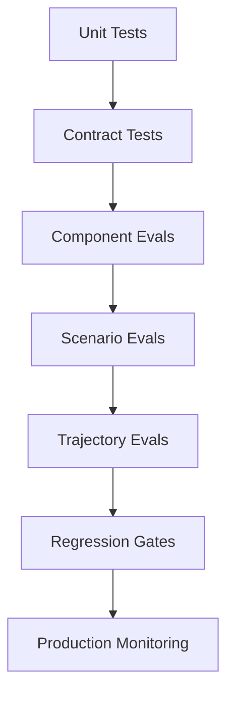
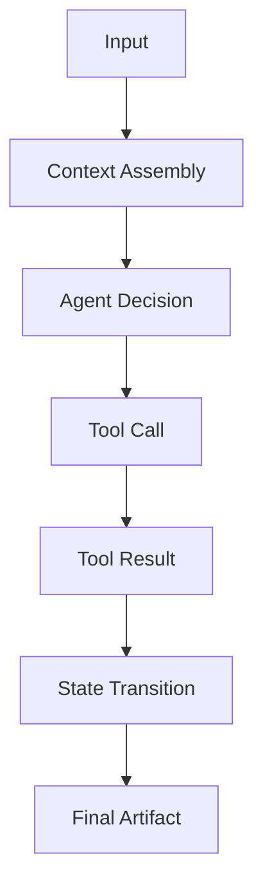
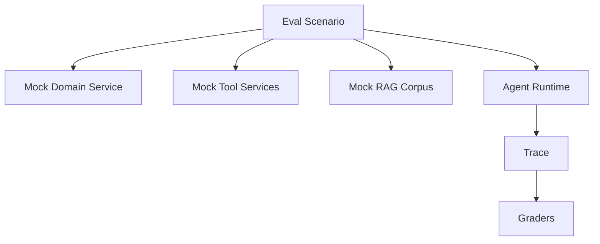
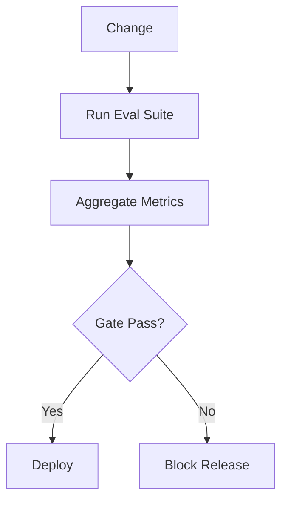
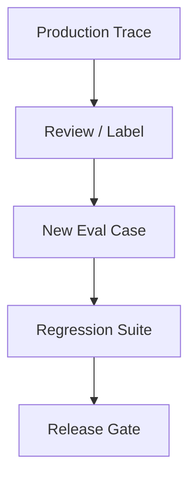
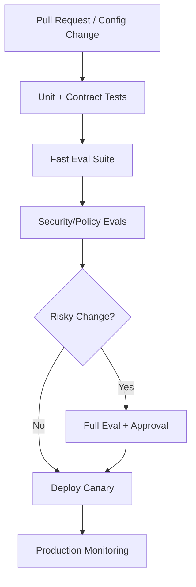
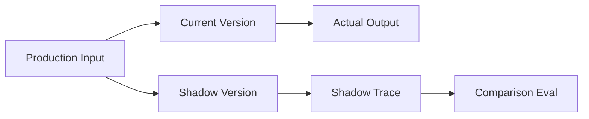

# Part 032 — Evaluation Engineering

> You cannot productionize what you cannot evaluate.
>
> And you cannot evaluate an agentic system only by reading a few final answers.

Evaluation engineering is the discipline of designing tests, datasets, metrics, judges, simulations, regression gates, and production feedback loops for AI systems.

For enterprise-grade stateful multi-agent systems, evaluation must cover:

- final answer quality;
- tool selection;
- tool arguments;
- RAG retrieval;
- citation grounding;
- memory behavior;
- policy compliance;
- guardrail behavior;
- workflow trajectory;
- human handoff quality;
- side-effect safety;
- cost/latency;
- reliability under failure;
- security/adversarial cases.

This part is intentionally engineering-heavy.

---

## 1. Kaufman Framing

Using Kaufman's method, evaluation engineering decomposes into:

1. define expected behavior;
2. build golden datasets;
3. create scenario simulations;
4. define metrics;
5. build deterministic graders;
6. calibrate model-based judges;
7. evaluate components separately;
8. evaluate trajectories end-to-end;
9. create regression gates;
10. connect production feedback to evals.

### Target Performance

By the end of this part, you should be able to:

- design an eval taxonomy for multi-agent systems;
- create golden sets and scenario datasets;
- build deterministic and LLM-as-judge graders;
- evaluate RAG retrieval separately from generation;
- evaluate tool use and workflow trajectories;
- simulate human approvals and tool failures;
- design CI/CD regression gates;
- measure pass/fail, quality, safety, latency, and cost;
- handle flaky/non-deterministic evals;
- turn incidents into regression tests.

---

# 2. Why Traditional Testing Is Not Enough

Traditional tests:

```python
assert function(input) == expected_output
```

AI systems are probabilistic.

The same input can produce:

- different wording;
- different reasoning path;
- different tool call order;
- different retrieved documents;
- different confidence;
- different output quality.

But this does not mean evaluation is impossible.

It means evaluation must be layered.



---

# 3. Evaluation Taxonomy

| Eval Type | What It Tests |
|---|---|
| unit test | deterministic function/policy/schema |
| contract test | input/output/tool/event schema |
| component eval | one agent/tool/retriever |
| RAG eval | retrieval + grounding |
| tool-use eval | tool selection and arguments |
| memory eval | memory write/read/use behavior |
| policy eval | allow/deny/approval decisions |
| guardrail eval | block/allow/repair/escalate decisions |
| trajectory eval | multi-step agent path |
| scenario simulation | realistic task with mocked systems |
| adversarial eval | attack/abuse cases |
| regression eval | prevent previously fixed failures |
| production eval | sampled real-world traces/outcomes |

Do not rely on one eval type.

---

# 4. Evaluation Unit of Analysis

For agentic systems, evaluate multiple layers.



Each layer can fail.

## Layered Eval Questions

| Layer | Question |
|---|---|
| context | did agent receive right information? |
| retrieval | were relevant documents found? |
| reasoning | was recommendation supported? |
| tool | did agent choose correct tool? |
| policy | was unsafe action blocked? |
| state | was transition valid? |
| artifact | is final output correct and grounded? |
| trajectory | was the path efficient and safe? |

---

# 5. Golden Set

A golden set is a curated dataset of test cases with expected behavior.

```python
from enum import Enum
from pydantic import BaseModel, Field


class EvalRiskLevel(str, Enum):
    LOW = "low"
    MEDIUM = "medium"
    HIGH = "high"
    CRITICAL = "critical"


class GoldenCase(BaseModel):
    case_id: str
    name: str
    input: dict
    expected_behavior: dict
    expected_sources: list[str] = Field(default_factory=list)
    forbidden_actions: list[str] = Field(default_factory=list)
    risk_level: EvalRiskLevel
    tags: list[str] = Field(default_factory=list)
```

Golden cases should include:

- normal cases;
- edge cases;
- adversarial cases;
- previous incidents;
- high-risk cases;
- missing information cases;
- policy conflict cases;
- ambiguous cases.

---

# 6. Golden Set Quality

A bad golden set creates false confidence.

Good golden sets are:

- representative;
- versioned;
- reviewed by domain experts;
- labeled with expected behavior;
- diverse by risk category;
- explicit about source evidence;
- updated from production incidents;
- split into dev/test/holdout where appropriate.

## Common Golden Set Mistakes

| Mistake | Consequence |
|---|---|
| only happy-path examples | misses real failures |
| labels too vague | graders unreliable |
| no source refs | cannot evaluate grounding |
| no adversarial cases | security blind spots |
| no missing-evidence cases | model hallucinates |
| no high-risk cases | deployment risk |
| stale labels | false failures/passes |

---

# 7. Expected Behavior, Not Only Expected Answer

For agent systems, expected output may include trajectory constraints.

Example:

```python
expected_behavior = {
    "must_call_tools": ["search_case_evidence", "fetch_policy_excerpt"],
    "must_not_call_tools": ["send_approved_notice"],
    "must_output_contract": "RiskAssessmentOutput.v1",
    "must_include_evidence_refs": ["doc_1", "doc_7"],
    "must_escalate_if": "confidence < 0.7",
    "expected_risk_level": "high",
}
```

The final answer is only one part of the behavior.

---

# 8. Dataset Schema

```python
class EvalDataset(BaseModel):
    dataset_id: str
    name: str
    version: str
    owner: str
    description: str
    cases: list[GoldenCase]
    created_at: str
```

Dataset versioning matters.

If evaluation improves or worsens, you need to know whether system changed or dataset changed.

---

# 9. Deterministic Graders

Use deterministic graders whenever possible.

Examples:

- JSON schema valid;
- required field present;
- forbidden tool not called;
- citation ref exists;
- policy decision equals expected;
- no external side effect;
- state transition allowed;
- latency below threshold;
- cost below budget.

```python
class EvalResult(BaseModel):
    case_id: str
    metric: str
    passed: bool
    score: float
    reason: str


def grade_forbidden_tools(trace: dict, forbidden_tools: list[str]) -> EvalResult:
    called = [call["tool_name"] for call in trace.get("tool_calls", [])]
    violations = sorted(set(called).intersection(forbidden_tools))

    return EvalResult(
        case_id=trace["case_id"],
        metric="forbidden_tool_calls",
        passed=not violations,
        score=0.0 if violations else 1.0,
        reason=f"Violations: {violations}" if violations else "No forbidden tools called.",
    )
```

Deterministic graders are reliable and cheap.

---

# 10. Model-Based Judges

Some qualities need judgment.

Examples:

- rationale quality;
- answer helpfulness;
- completeness;
- policy mapping quality;
- tone;
- whether evidence supports claim;
- whether uncertainty is clearly disclosed.

A model-based judge can help, but it must be calibrated.

## Judge Output Contract

```python
class JudgeScore(BaseModel):
    score: float = Field(ge=0.0, le=1.0)
    passed: bool
    rationale: str
    confidence: float = Field(ge=0.0, le=1.0)
```

## Judge Rule

> A judge is an evaluation instrument, not ground truth.

Use human-labeled examples to calibrate judge behavior.

---

# 11. Judge Calibration

Calibration questions:

- does judge agree with expert labels?
- does judge prefer longer answers?
- does judge miss subtle hallucinations?
- does judge over-penalize concise answers?
- does judge handle abstention correctly?
- does judge detect unsupported claims?
- does judge follow rubric weights?

## Calibration Dataset

```python
class JudgeCalibrationCase(BaseModel):
    case_id: str
    candidate_output: str
    expert_score: float
    expert_reason: str
    rubric: dict
```

Track judge correlation with expert labels.

---

# 12. Rubric-Based Evaluation

Use rubrics for subjective quality.

```python
class RubricCriterion(BaseModel):
    name: str
    weight: float = Field(ge=0.0)
    description: str


class Rubric(BaseModel):
    rubric_id: str
    criteria: list[RubricCriterion]
```

Example criteria:

| Criterion | Weight |
|---|---:|
| factual correctness | 0.35 |
| evidence grounding | 0.25 |
| completeness | 0.15 |
| uncertainty disclosure | 0.10 |
| policy compliance | 0.10 |
| clarity | 0.05 |

Rubrics make judgment less vague.

---

# 13. RAG Evaluation

Evaluate retrieval and generation separately.

## Retrieval Eval

```python
class RetrievalEvalCase(BaseModel):
    case_id: str
    query: str
    required_chunk_ids: list[str]
    forbidden_chunk_ids: list[str] = Field(default_factory=list)
    metadata_filters: dict = Field(default_factory=dict)
```

Metrics:

- recall@k;
- precision@k;
- MRR;
- nDCG;
- authorization correctness;
- freshness correctness;
- latency.

## Grounding Eval

Check:

- claims have citations;
- citations exist;
- citations support claims;
- no unsupported claims;
- missing evidence is disclosed.

---

# 14. Tool-Use Evaluation

Tool eval checks whether the agent used tools correctly.

| Metric | Question |
|---|---|
| tool selection | did it choose correct tool? |
| argument validity | schema-valid arguments? |
| argument correctness | right case ID/filter? |
| tool budget | unnecessary calls avoided? |
| forbidden tool use | unsafe tools avoided? |
| sequence | tools called in right order? |
| result use | did agent incorporate result correctly? |

## Tool Eval Example

```python
def grade_required_tool_order(trace: dict, required_order: list[str]) -> EvalResult:
    called = [call["tool_name"] for call in trace.get("tool_calls", [])]

    cursor = 0
    for tool in called:
        if cursor < len(required_order) and tool == required_order[cursor]:
            cursor += 1

    passed = cursor == len(required_order)

    return EvalResult(
        case_id=trace["case_id"],
        metric="required_tool_order",
        passed=passed,
        score=1.0 if passed else 0.0,
        reason=f"Called sequence: {called}",
    )
```

---

# 15. Memory Evaluation

Memory eval checks:

- write proposal quality;
- rejected unsafe memory;
- correct scope;
- retrieval relevance;
- stale memory exclusion;
- conflict handling;
- forgetting/deletion;
- memory improves output.

## Test Cases

| Case | Expected |
|---|---|
| user preference | stored user-scoped |
| restricted data | rejected |
| tenant-wide instruction | requires approval |
| stale memory | excluded |
| conflicting domain state | domain wins |
| deleted memory | not retrieved |
| malicious document memory | rejected |

---

# 16. Policy and Guardrail Evaluation

Policy/guardrail eval should be deterministic where possible.

```python
class PolicyEvalCase(BaseModel):
    case_id: str
    policy_request: dict
    expected_decision: str
    expected_obligations: list[str] = Field(default_factory=list)
```

Metrics:

- allow accuracy;
- deny accuracy;
- approval-required accuracy;
- false allow;
- false deny;
- obligation enforcement;
- latency.

False allow is usually more dangerous than false deny.

---

# 17. Trajectory Evaluation

Trajectory eval scores the full path, not only final output.

```python
class TrajectoryStep(BaseModel):
    step_type: str
    name: str
    input_ref: str | None = None
    output_ref: str | None = None
    status: str


class AgentTrajectory(BaseModel):
    run_id: str
    case_id: str
    steps: list[TrajectoryStep]
    final_output_ref: str | None = None
```

Trajectory checks:

- correct route;
- required tools called;
- forbidden tools avoided;
- human approval inserted;
- no loops;
- no excessive cost;
- correct final state;
- side effects not duplicated;
- escalation when required.

---

# 18. Multi-Agent Evaluation

Evaluate each agent and orchestration.

| Component | Eval |
|---|---|
| router | correct route/confidence/fallback |
| supervisor | delegation, aggregation, stop behavior |
| evidence agent | source relevance |
| risk agent | calibration and evidence |
| policy agent | policy mapping |
| drafting agent | factual draft |
| verifier | citation/fact checking |
| adjudicator | conflict resolution |
| human package | review usefulness |

End-to-end pass can hide weak specialists.

---

# 19. Simulation Harness

A simulation harness runs realistic scenarios against mocked or sandboxed systems.



Simulation lets you test:

- tool failure;
- policy denial;
- missing evidence;
- human approval;
- stale data;
- side-effect ambiguity;
- prompt injection;
- multi-agent disagreement.

---

# 20. Scenario Model

```python
class EvalScenario(BaseModel):
    scenario_id: str
    name: str
    initial_domain_state: dict
    user_input: str
    rag_corpus_refs: list[str]
    memory_records: list[dict] = Field(default_factory=list)
    tool_mocks: dict = Field(default_factory=dict)
    human_decisions: list[dict] = Field(default_factory=list)
    expected_behavior: dict
```

This supports reproducible end-to-end tests.

---

# 21. Failure Injection

Inject failures intentionally.

Examples:

- retriever misses required doc;
- tool times out;
- policy engine returns deny;
- worker crashes;
- human approval expires;
- external provider commits but response lost;
- memory store contains stale memory;
- RAG chunk contains prompt injection.

Failure injection turns reliability design into testable behavior.

---

# 22. Regression Gates

A regression gate blocks release if evals fail.



## Gate Policy Example

```python
class RegressionGate(BaseModel):
    gate_id: str
    eval_suite_id: str
    min_overall_score: float
    max_critical_failures: int
    required_metrics: dict
```

Example requirements:

```text
- no forbidden tool calls
- no critical policy false allows
- citation accuracy >= 0.95
- retrieval recall@10 >= 0.90
- high-risk scenario pass rate >= 0.98
- latency p95 <= target
```

---

# 23. Critical Failures

Not all failures are equal.

Critical failures:

- unauthorized data access;
- external side effect without approval;
- forbidden tool call;
- cross-tenant leak;
- missing human review in high-risk case;
- unsupported high-impact claim;
- duplicate side effect;
- memory poisoning accepted;
- policy false allow.

A single critical failure may block release even if average score is high.

---

# 24. Metrics Aggregation

Avoid hiding tail risk with averages.

Report:

- pass rate;
- critical failure count;
- per-risk-tier pass rate;
- per-component score;
- p50/p95 latency;
- cost per scenario;
- regression delta vs previous release;
- confidence intervals when possible;
- flaky test rate.

## Example Report

```python
class EvalSuiteReport(BaseModel):
    suite_id: str
    run_id: str
    release_candidate: str
    overall_pass_rate: float
    critical_failures: int
    metric_scores: dict
    failed_case_ids: list[str]
    started_at: str
    completed_at: str
```

---

# 25. Handling Non-Determinism

Non-determinism is normal.

Controls:

- fixed seeds where supported;
- temperature controls;
- multiple runs per case;
- confidence intervals;
- deterministic graders;
- threshold margins;
- flaky-case tracking;
- judge calibration;
- holdout sets;
- compare distributions, not one run only.

## Multi-Run Eval

```python
class MultiRunCaseResult(BaseModel):
    case_id: str
    runs: int
    pass_count: int

    @property
    def pass_rate(self) -> float:
        return self.pass_count / self.runs
```

For high-risk cases, require high pass-rate stability.

---

# 26. Human Evaluation

Human evaluation is needed for:

- domain correctness;
- nuanced policy interpretation;
- review package usefulness;
- tone/communication quality;
- ambiguous cases;
- judge calibration;
- incident analysis.

Human evaluation should be structured.

```python
class HumanEvalLabel(BaseModel):
    case_id: str
    reviewer_id: str
    score: float = Field(ge=0.0, le=1.0)
    label: str
    rationale: str
    error_categories: list[str] = Field(default_factory=list)
```

Do not ask humans only “good or bad?” Give rubrics.

---

# 27. Production Feedback Loop

Production creates new eval cases.

Sources:

- user corrections;
- human rejections;
- overrides;
- incidents;
- policy denials;
- guardrail triggers;
- low-confidence outputs;
- failed citations;
- customer complaints;
- sampled traces.



Every incident should become at least one regression test.

---

# 28. Eval Data Governance

Eval datasets may contain sensitive data.

Controls:

- de-identification;
- access control;
- retention;
- consent/legal review where needed;
- synthetic alternatives;
- secure storage;
- label provenance;
- dataset versioning;
- holdout protection.

Evaluation data is production data risk in another form.

---

# 29. Eval Registry

```python
class EvalSuiteRegistryRecord(BaseModel):
    suite_id: str
    name: str
    version: str
    owner: str
    system_id: str
    risk_tiers_covered: list[str]
    dataset_refs: list[str]
    grader_refs: list[str]
    gate_refs: list[str]
```

Registry benefits:

- ownership;
- versioning;
- coverage tracking;
- release traceability;
- audit evidence.

---

# 30. Eval Trace Requirements

To evaluate agent behavior, traces must include:

- context sources;
- model calls;
- tool calls;
- tool arguments;
- tool results;
- policy decisions;
- guardrail results;
- state transitions;
- human decisions;
- final artifacts;
- costs/latency;
- errors/retries.

Without traces, trajectory eval is weak.

---

# 31. CI/CD Integration

Typical flow:



Use fast evals for every change and deeper evals for high-risk changes.

---

# 32. Canary and Shadow Evaluation

Canary:

- limited traffic;
- compare metrics;
- rollback if risk.

Shadow:

- run new version without affecting user;
- compare outputs/decisions;
- useful for model/prompt/policy changes.



---

# 33. Evaluation Anti-Patterns

## Anti-Pattern 1 — Demo-Based Evaluation

Five hand-picked examples.

## Anti-Pattern 2 — Final Answer Only

No tool/trajectory/policy eval.

## Anti-Pattern 3 — LLM Judge Without Calibration

Judge gives confident but unvalidated scores.

## Anti-Pattern 4 — No Negative Cases

System never tested on missing evidence or attacks.

## Anti-Pattern 5 — Average Score Hides Critical Failure

One unauthorized side effect is unacceptable.

## Anti-Pattern 6 — Stale Golden Set

Eval no longer reflects production.

## Anti-Pattern 7 — No CI Gate

Eval exists but does not block releases.

## Anti-Pattern 8 — No Incident-to-Eval Loop

Same failure repeats.

---

# 34. Python Mini Eval Runner

```python
class EvalRunner:
    def __init__(self, runtime, graders):
        self.runtime = runtime
        self.graders = graders

    async def run_case(self, case: GoldenCase) -> list[EvalResult]:
        trace = await self.runtime.run_eval_case(case.input)

        results: list[EvalResult] = []
        for grader in self.graders:
            results.append(await grader.grade(case, trace))

        return results

    async def run_suite(self, dataset: EvalDataset) -> list[EvalResult]:
        all_results: list[EvalResult] = []

        for case in dataset.cases:
            all_results.extend(await self.run_case(case))

        return all_results
```

Production runners need parallelism, retries, cost control, trace storage, dataset versioning, and reporting.

---

# 35. Production Checklist

Before relying on evals:

- [ ] evaluation taxonomy defined;
- [ ] golden set exists;
- [ ] high-risk cases included;
- [ ] adversarial cases included;
- [ ] missing-evidence cases included;
- [ ] deterministic graders exist;
- [ ] model judges calibrated;
- [ ] RAG eval separated from generation eval;
- [ ] tool-use eval exists;
- [ ] policy/guardrail eval exists;
- [ ] trajectory eval exists;
- [ ] simulation harness exists;
- [ ] critical failure policy defined;
- [ ] regression gate blocks releases;
- [ ] eval dataset versioned;
- [ ] eval results stored;
- [ ] production feedback creates new cases;
- [ ] eval data governed;
- [ ] eval coverage reviewed periodically.

---

# 36. Practice Drill

Build an evaluation plan for a case-management multi-agent system.

Capabilities:

- evidence retrieval;
- risk assessment;
- policy mapping;
- notice drafting;
- human approval;
- side-effect notification;
- memory;
- guardrails.

Deliverables:

1. eval taxonomy;
2. golden set schema;
3. 20 golden case categories;
4. RAG eval metrics;
5. tool-use eval metrics;
6. trajectory eval checks;
7. judge rubric;
8. judge calibration plan;
9. failure injection scenarios;
10. CI regression gate;
11. production feedback loop;
12. eval registry entry.

---

# 37. What Top 1% Engineers Pay Attention To

Top engineers ask:

- What behavior are we evaluating?
- Is the eval representative?
- Does it include high-risk failures?
- Are labels trustworthy?
- Are judges calibrated?
- Are we evaluating retrieval separately?
- Are we evaluating tool trajectories?
- What is a critical failure?
- Does eval block release?
- Are evals flaky?
- Did production incidents become tests?
- Are eval datasets versioned?
- Are eval results tied to run manifests?
- Are we measuring cost and latency too?
- Can we explain why score changed?

They know evals are not a side project. They are the quality system for AI.

---

# 38. Summary

In this part, we covered:

- evaluation taxonomy;
- layered evaluation;
- golden sets;
- dataset schema;
- deterministic graders;
- model-based judges;
- judge calibration;
- rubric evaluation;
- RAG eval;
- tool-use eval;
- memory eval;
- policy/guardrail eval;
- trajectory eval;
- multi-agent eval;
- simulation harness;
- scenario modeling;
- failure injection;
- regression gates;
- critical failures;
- metrics aggregation;
- non-determinism;
- human evaluation;
- production feedback loops;
- eval data governance;
- eval registry;
- trace requirements;
- CI/CD integration;
- canary/shadow eval;
- anti-patterns;
- mini eval runner;
- production checklist.

The key principle:

> Evaluation is the engineering discipline that turns AI behavior from anecdote into managed evidence.

The next part focuses on **Reliability and Failure Modeling**.

---

## References

- OpenAI API documentation: evaluations and evaluation best practices for testing model outputs against criteria.
- OpenAI API documentation: graders for evaluating model performance against reference answers.
- LangSmith documentation and platform concepts: tracing, evaluation, monitoring, datasets, and experiments for LLM/agent systems.
- NIST AI Risk Management Framework: measuring and managing AI risk through evidence and controls.
