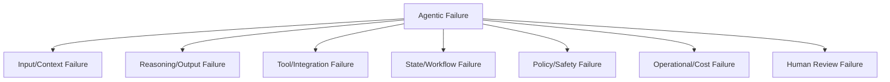
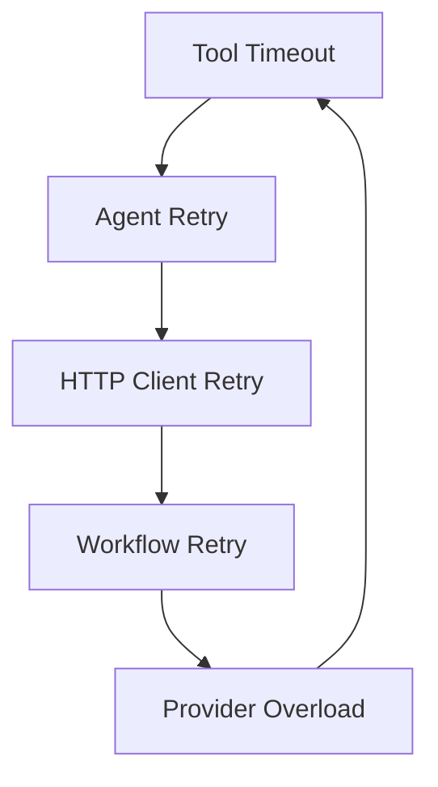
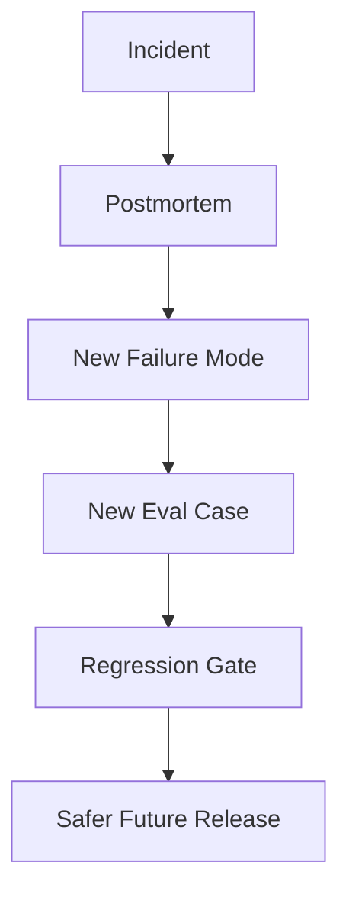

# Part 033 — Reliability and Failure Modeling

> Reliability for agentic AI is not only uptime.
>
> A system can be available, fast, and still unreliable if it makes unsupported decisions, loops forever, calls the wrong tool, ignores policy, loses state, or spends thousands of dollars on useless retries.

Traditional reliability asks:

- Is the service up?
- Is latency acceptable?
- Are errors low?
- Is saturation controlled?

Agentic reliability adds:

- Did the agent follow the right trajectory?
- Did it retrieve the right evidence?
- Did it avoid forbidden tools?
- Did it stop when uncertain?
- Did it avoid duplicate side effects?
- Did it preserve state across resume?
- Did it remain within budget?
- Did it escalate when required?
- Did it avoid hallucinated authority?
- Did it degrade safely under dependency failure?

This part builds a reliability and failure-modeling framework for enterprise-grade stateful multi-agent AI systems.

---

## 1. Kaufman Framing

Using Kaufman's method, reliability decomposes into:

1. identify expected behavior;
2. identify failure modes;
3. classify failure impact;
4. define detection signals;
5. define mitigation controls;
6. design fallback and degradation paths;
7. set budgets and SLOs;
8. test failure scenarios;
9. monitor production;
10. feed incidents back into evaluation.

### Target Performance

By the end of this part, you should be able to:

- define agentic reliability beyond uptime;
- create failure mode catalogs;
- model loops, deadlocks, hallucinations, drift, and cost explosions;
- design retry, timeout, budget, and circuit-breaker controls;
- distinguish transient, deterministic, semantic, and policy failures;
- define SLOs for agentic workflows;
- design graceful degradation;
- test chaos/failure scenarios;
- create incident-to-eval loops;
- reason about reliability at component, workflow, and system levels.

---

# 2. Reliability Definition for Agentic Systems

A reliable agentic system:

1. completes intended tasks within acceptable time/cost;
2. uses allowed data and tools;
3. produces grounded outputs;
4. respects policy and authority boundaries;
5. preserves state across long-running execution;
6. handles dependency failures safely;
7. avoids duplicate side effects;
8. stops or escalates under uncertainty;
9. provides auditability;
10. degrades gracefully.

## Reliability Is Multi-Dimensional

| Dimension | Example |
|---|---|
| availability | runtime accepts tasks |
| latency | workflow finishes within target |
| correctness | output matches expected behavior |
| grounding | claims supported by evidence |
| safety | forbidden actions avoided |
| policy compliance | approval gates respected |
| state durability | resume works after crash |
| cost reliability | budget respected |
| security reliability | injection/data leak controls work |
| operational reliability | failures observable and recoverable |

Do not optimize only one dimension.

---

# 3. Failure Taxonomy



## Categories

| Category | Example |
|---|---|
| input/context | missing evidence, poisoned context |
| reasoning/output | hallucinated claim, wrong risk |
| tool/integration | timeout, invalid arguments |
| state/workflow | lost checkpoint, invalid transition |
| policy/safety | approval bypass, forbidden action |
| operational/cost | infinite loop, budget explosion |
| human review | rubber-stamp, stale approval |

---

# 4. Failure Mode Record

```python
from enum import Enum
from pydantic import BaseModel, Field


class FailureSeverity(str, Enum):
    LOW = "low"
    MEDIUM = "medium"
    HIGH = "high"
    CRITICAL = "critical"


class FailureMode(BaseModel):
    failure_id: str
    name: str
    category: str
    description: str
    severity: FailureSeverity
    detection_signals: list[str]
    mitigations: list[str]
    fallback: str | None = None
    eval_cases: list[str] = Field(default_factory=list)
```

Failure modes should be tracked like risks and test cases.

---

# 5. Agent Loop Failures

Agent loops happen when the system keeps reasoning/calling tools without progress.

Examples:

- planner keeps revising plan;
- executor repeatedly repairs invalid output;
- agent keeps searching evidence;
- critic keeps asking for more work;
- supervisor keeps delegating;
- tool failure triggers full-agent rerun;
- retrieval returns noisy results and agent never stops.

## Loop Signals

| Signal | Meaning |
|---|---|
| repeated same tool call | no progress |
| repeated same node | loop |
| repeated validation failure | output repair stuck |
| high token growth | context/loop issue |
| no new artifacts | no productive progress |
| replan count high | unstable plan |
| same error repeated | deterministic failure |

## Controls

- max steps;
- max replans;
- max tool calls;
- max repair attempts;
- progress detector;
- loop detection by state hash;
- budget limits;
- human escalation;
- safe stop.

---

# 6. Progress Detection

A workflow should know whether it is making progress.

```python
class ProgressSnapshot(BaseModel):
    run_id: str
    step_count: int
    artifacts_created: int
    new_evidence_refs: int
    completed_objectives: list[str]
    open_blockers: list[str]
    state_hash: str
```

Simple loop detector:

```python
def repeated_state_hashes(history: list[ProgressSnapshot], window: int = 3) -> bool:
    if len(history) < window:
        return False

    recent = history[-window:]
    return len({snapshot.state_hash for snapshot in recent}) == 1
```

If state does not change after several steps, stop or escalate.

---

# 7. Deadlocks

Deadlock occurs when workflow cannot continue because components wait on each other.

Examples:

- supervisor waits for worker that waits for supervisor clarification;
- tool waits for approval that was never created;
- human review waits for decision package missing required fields;
- policy engine requires context that context builder cannot obtain;
- two agents wait for each other's output.

## Deadlock Detection

- pending state exceeds SLA;
- no runnable nodes;
- unresolved dependency cycle;
- review task missing assignee;
- required artifact absent;
- waiting reason unchanged.

## Controls

- explicit dependency graph;
- timeout for pending states;
- dead-letter queue;
- escalation policy;
- workflow invariant checks;
- state machine validation.

---

# 8. Hallucination Failures

Hallucination means output contains unsupported or false information.

Agentic hallucination is dangerous when it influences tools, state, or humans.

Examples:

- cites nonexistent evidence;
- invents policy rule;
- says notice was sent when only drafted;
- claims human approval exists;
- fabricates confidence;
- invents tool result;
- summarizes unverified memory as fact.

## Controls

- grounded output schema;
- citation verifier;
- source refs required;
- model output is proposal, not fact;
- policy/domain state source of truth;
- verifier agent/service;
- human review for high-impact claims;
- output guardrails.

---

# 9. Drift

Drift means behavior changes over time.

Sources:

- model version changes;
- prompt changes;
- tool changes;
- RAG index changes;
- memory accumulation;
- policy changes;
- data distribution shifts;
- user behavior changes;
- dependency changes.

## Drift Signals

| Signal | Meaning |
|---|---|
| eval regression | offline behavior changed |
| approval/rejection rate shift | quality/policy drift |
| citation failure increase | RAG drift |
| tool denial increase | tool-use drift |
| memory conflict increase | memory drift |
| latency/cost shift | runtime drift |
| human override increase | recommendation drift |

## Controls

- version all components;
- run manifests;
- regression evals;
- canary/shadow;
- monitoring;
- drift alerts;
- rollback.

---

# 10. Cost Explosion

Agentic systems can spend too much through:

- loops;
- excessive tool calls;
- large context;
- repeated retrieval;
- model retries;
- multi-agent fan-out;
- unnecessary critics/judges;
- reprocessing same artifacts;
- no budget enforcement.

## Cost Controls

```python
class CostBudget(BaseModel):
    max_model_calls: int
    max_tool_calls: int
    max_tokens: int
    max_usd: float
    max_wall_clock_seconds: int
```

Budget enforcement:

```python
def check_budget(used: dict, budget: CostBudget) -> bool:
    return (
        used["model_calls"] <= budget.max_model_calls
        and used["tool_calls"] <= budget.max_tool_calls
        and used["tokens"] <= budget.max_tokens
        and used["usd"] <= budget.max_usd
        and used["seconds"] <= budget.max_wall_clock_seconds
    )
```

Budgets should be checked during execution, not only at the end.

---

# 11. Retry Storms

Retries can amplify outages.

Example:



## Controls

- retry at semantic layer;
- exponential backoff;
- jitter;
- retry budget;
- circuit breaker;
- idempotency;
- timeout classification;
- avoid retrying deterministic validation errors;
- avoid rerunning entire agent for one tool failure.

---

# 12. Circuit Breakers

A circuit breaker stops calls to unhealthy dependency.

```python
class CircuitState(str, Enum):
    CLOSED = "closed"
    OPEN = "open"
    HALF_OPEN = "half_open"


class CircuitBreakerStatus(BaseModel):
    dependency_name: str
    state: CircuitState
    failure_count: int
    opened_at: str | None = None
```

When open:

- fail fast;
- use cached/degraded response;
- route to fallback;
- escalate;
- stop high-risk workflow.

Circuit breakers prevent agent systems from hammering failing dependencies.

---

# 13. Timeout Hierarchy

Timeouts should compose.

```text
run deadline
  workflow node deadline
    model call timeout
    tool call timeout
      HTTP/database timeout
```

Rules:

1. child timeout < parent deadline;
2. timeout creates typed error;
3. side-effect timeout may require reconciliation;
4. expired run should stop gracefully;
5. cancellation should propagate.

---

# 14. Graceful Degradation

Graceful degradation means providing a safe reduced capability.

Examples:

| Failure | Degradation |
|---|---|
| RAG unavailable | ask for retry or use cached approved summary |
| policy service unavailable | fail closed for side effects |
| memory unavailable | continue without personalization |
| verifier unavailable | require human review |
| external notification unavailable | keep draft and retry later |
| model provider degraded | route to fallback model if eval-approved |
| evidence search partial | disclose missing evidence |

Do not degrade from safe to unsafe.

---

# 15. Fallback Design

Fallbacks must be explicit.

```python
class FallbackPolicy(BaseModel):
    failure_type: str
    fallback_action: str
    allowed_risk_tiers: list[str]
    requires_human_review: bool
```

Example:

```text
If citation verifier fails:
- low-risk: ask model to include evidence refs and mark unverified
- high-risk: block decision package and require human review
```

Fallback is policy, not improvisation.

---

# 16. Model Provider Failure

Model failures:

- timeout;
- rate limit;
- degraded quality;
- empty response;
- malformed structured output;
- provider outage;
- model behavior drift;
- cost spike.

Controls:

- model gateway;
- provider routing;
- fallback models;
- schema validation;
- retry policy;
- eval-approved model routes;
- cost budget;
- observability by model version.

Never switch to a fallback model for high-risk workflows without evaluation approval.

---

# 17. RAG Failure

RAG failures:

- retrieval miss;
- stale document;
- unauthorized chunk;
- irrelevant top-k;
- index outage;
- embedding drift;
- poisoned corpus;
- citation mismatch.

Controls:

- hybrid retrieval;
- metadata filters;
- freshness checks;
- retriever eval;
- citation verifier;
- index versioning;
- fallback to human evidence search;
- do not hallucinate when evidence missing.

---

# 18. Tool Failure

Tool failures:

- validation error;
- authorization denied;
- timeout;
- dependency failure;
- side-effect ambiguous;
- output schema invalid;
- external API changed;
- duplicate request;
- rate limit.

Controls:

- typed error taxonomy;
- retry classification;
- idempotency;
- reconciliation;
- circuit breakers;
- output validation;
- fallback;
- escalation.

---

# 19. Memory Failure

Memory failures:

- stale memory retrieved;
- sensitive memory leaked;
- poisoned memory accepted;
- deleted memory still indexed;
- wrong scope memory used;
- memory conflicts with domain state;
- memory store unavailable.

Controls:

- memory governance;
- expiry;
- read/write policy;
- conflict checks;
- tombstones;
- index deletion propagation;
- memory-off degradation.

If memory fails, agent should usually continue without memory rather than inventing it.

---

# 20. Human Review Failure

Human review failures:

- task not assigned;
- timeout ignored;
- unauthorized reviewer;
- stale package approved;
- reviewer rubber-stamps;
- reviewer lacks evidence;
- duplicate approval;
- approval not bound to action.

Controls:

- review queue monitoring;
- reviewer authorization;
- package versioning;
- approval expiry;
- idempotency;
- review metrics;
- escalation.

---

# 21. State Durability Failure

State failures:

- checkpoint not saved;
- checkpoint corrupt;
- state schema migration fails;
- resume repeats side effect;
- state/data mismatch;
- lost human decision;
- wrong thread_id;
- cross-tenant state leak.

Controls:

- durable checkpointer;
- schema versioning;
- state integrity checks;
- idempotency records;
- domain event reconciliation;
- migration tests;
- tenant partitioning;
- resume audit event.

---

# 22. Reliability Patterns

| Pattern | Use |
|---|---|
| timeout | prevent hanging |
| retry with backoff | transient failures |
| idempotency | safe retry |
| circuit breaker | failing dependency |
| bulkhead | isolate failure |
| outbox/inbox | reliable integration |
| checkpointing | resume state |
| saga | long-running process |
| compensation | mitigate side effect |
| graceful degradation | safe partial capability |
| human escalation | uncertainty/high risk |
| dead-letter queue | unprocessable work |

Agentic reliability is a combination of distributed systems patterns and AI-specific controls.

---

# 23. Bulkheads

Bulkheads isolate failure.

Examples:

- separate worker pools by tenant;
- separate high-risk workflows;
- separate tool executors for external side effects;
- rate limits per agent/tool/tenant;
- isolate experimental agents;
- separate memory writes from core workflow;
- separate model provider quotas.

Without bulkheads, one runaway agent can affect all users.

---

# 24. SLOs for Agentic Systems

Service Level Objectives should include more than latency.

Examples:

| SLO | Example |
|---|---|
| availability | 99.9% task intake availability |
| latency | 95% low-risk tasks complete < 30s |
| workflow completion | 98% valid tasks reach terminal state |
| policy compliance | 0 critical false allows |
| grounding | 95% citations verified |
| side-effect safety | 0 duplicate external notices |
| cost | 99% runs under budget |
| human review SLA | 95% high-risk reviews assigned < 10m |
| eval regression | release blocked if critical failures > 0 |

## Error Budget

For critical safety failures, error budget may be zero.

---

# 25. Reliability Metrics

Map classic golden signals to agentic signals.

| Classic Signal | Agentic Extension |
|---|---|
| latency | run duration, node duration, approval latency |
| traffic | runs, tool calls, retrievals, approvals |
| errors | model/tool/policy/guardrail failures |
| saturation | worker queues, model rate limits, token budget, review backlog |

Additional signals:

- loop detections;
- cost per run;
- citation failures;
- policy denials;
- retries;
- ambiguous side effects;
- stuck workflows;
- memory conflicts;
- escalation rate.

---

# 26. Error Taxonomy

```python
class AgentErrorType(str, Enum):
    VALIDATION = "validation"
    POLICY_DENIED = "policy_denied"
    AUTHORIZATION = "authorization"
    MODEL_TIMEOUT = "model_timeout"
    MODEL_MALFORMED_OUTPUT = "model_malformed_output"
    TOOL_TIMEOUT = "tool_timeout"
    TOOL_AMBIGUOUS_SIDE_EFFECT = "tool_ambiguous_side_effect"
    RETRIEVAL_MISS = "retrieval_miss"
    CITATION_UNSUPPORTED = "citation_unsupported"
    STATE_CONFLICT = "state_conflict"
    BUDGET_EXCEEDED = "budget_exceeded"
    HUMAN_REVIEW_TIMEOUT = "human_review_timeout"
    UNKNOWN = "unknown"
```

Typed errors enable better retry/fallback.

---

# 27. Reliability Event

```python
class ReliabilityEvent(BaseModel):
    event_id: str
    run_id: str
    tenant_id: str
    event_type: str
    severity: FailureSeverity
    component: str
    error_type: AgentErrorType | None = None
    message: str
    retryable: bool
    occurred_at: str
```

Events create a structured reliability trail.

---

# 28. Chaos Testing for Agents

Chaos testing intentionally injects failure.

Scenarios:

- model timeout;
- malformed model output;
- retriever returns stale policy;
- tool API times out after commit;
- worker crashes after checkpoint;
- human approval delayed;
- policy engine unavailable;
- memory store returns conflicting memory;
- MCP server unavailable;
- vector index returns malicious chunk.

Expected behavior should be safe, not necessarily successful.

---

# 29. Failure Injection Harness

```python
class FailureInjectionRule(BaseModel):
    component: str
    failure_type: str
    probability: float = Field(ge=0.0, le=1.0)
    applies_to_tags: list[str] = Field(default_factory=list)


class FailureInjectionConfig(BaseModel):
    rules: list[FailureInjectionRule]
```

Use in simulation environments, not casually in production.

---

# 30. Incident-to-Eval Loop

Every incident should produce:

1. root cause analysis;
2. failed control identification;
3. new eval case;
4. new guardrail/policy/test if needed;
5. monitoring update;
6. runbook update;
7. residual risk review.



This is how reliability improves.

---

# 31. Reliability Anti-Patterns

## Anti-Pattern 1 — Retry Everything

Retries without idempotency and classification create duplicate side effects and storms.

## Anti-Pattern 2 — No Stop Conditions

Agent loops until cost/deadline explodes.

## Anti-Pattern 3 — Uptime-Only SLO

System is up but producing unsafe outputs.

## Anti-Pattern 4 — Fallback to Unsafe Model

High-risk workflow switches to unvalidated model.

## Anti-Pattern 5 — Degrade by Ignoring Policy

Dependency failure makes system permissive.

## Anti-Pattern 6 — No Typed Errors

Everything is generic failure.

## Anti-Pattern 7 — No Incident Regression

Same bug comes back.

## Anti-Pattern 8 — Human Escalation as Black Hole

Escalated tasks never complete or timeout.

---

# 32. Production Checklist

Before claiming reliability:

- [ ] failure modes cataloged;
- [ ] severity classification defined;
- [ ] typed error taxonomy exists;
- [ ] timeouts at all levels;
- [ ] retry policy by error type;
- [ ] idempotency for side effects;
- [ ] circuit breakers for dependencies;
- [ ] cost/token budgets enforced;
- [ ] loop/deadlock detection exists;
- [ ] graceful degradation paths defined;
- [ ] human escalation paths monitored;
- [ ] checkpoint/resume tested;
- [ ] RAG failure modes tested;
- [ ] memory failure modes tested;
- [ ] chaos/failure injection in staging;
- [ ] SLOs include correctness/safety signals;
- [ ] incidents become evals;
- [ ] dashboards show agentic reliability metrics.

---

# 33. Practice Drill

Design a reliability plan for a multi-agent case assistant.

Capabilities:

- RAG evidence retrieval;
- policy mapping;
- risk assessment;
- drafting;
- human approval;
- external notice sending;
- memory;
- MCP tools.

Deliverables:

1. reliability definition;
2. top 20 failure modes;
3. severity classification;
4. detection signals;
5. mitigation controls;
6. fallback policy;
7. retry/circuit-breaker policy;
8. SLOs;
9. chaos scenarios;
10. incident-to-eval workflow;
11. dashboard metrics;
12. production checklist.

---

# 34. What Top 1% Engineers Pay Attention To

Top engineers ask:

- What does reliability mean for this agent?
- What can fail besides infrastructure?
- What happens if the model loops?
- What happens if the retriever misses evidence?
- What happens if policy engine is unavailable?
- What happens if tool times out after success?
- What happens if memory is stale?
- What happens if human review never happens?
- What happens if fallback model behaves differently?
- What happens if cost spikes?
- Are failures typed?
- Are retries safe?
- Are SLOs measuring correctness and safety?
- Did incidents become evals?

They design agents to fail safely, visibly, and recoverably.

---

# 35. Summary

In this part, we covered:

- reliability definition for agentic systems;
- failure taxonomy;
- failure mode records;
- loop failures;
- progress detection;
- deadlocks;
- hallucination;
- drift;
- cost explosion;
- retry storms;
- circuit breakers;
- timeout hierarchy;
- graceful degradation;
- fallback design;
- model/RAG/tool/memory/human/state failures;
- reliability patterns;
- bulkheads;
- SLOs;
- metrics;
- error taxonomy;
- reliability events;
- chaos testing;
- failure injection;
- incident-to-eval loop;
- anti-patterns;
- production checklist.

The key principle:

> Reliable agentic systems do not merely keep running. They keep making controlled, grounded, policy-compliant progress—or stop safely.

The next part focuses on **Observability and Runtime Forensics**.

---

## References

- Google SRE Book: monitoring distributed systems and the four golden signals of latency, traffic, errors, and saturation.
- OpenTelemetry documentation: traces, metrics, logs, context propagation, and observability concepts.
- OpenAI Agents SDK tracing documentation: tracing LLM generations, tool calls, handoffs, guardrails, and custom events.
- LangGraph documentation: persistence, checkpoints, durable state, and long-running stateful workflows.
