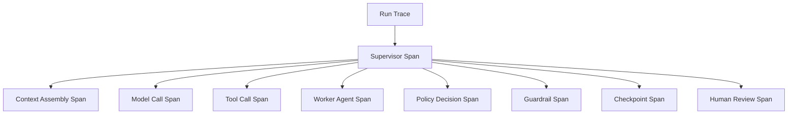
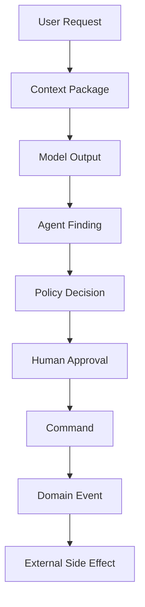
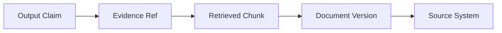
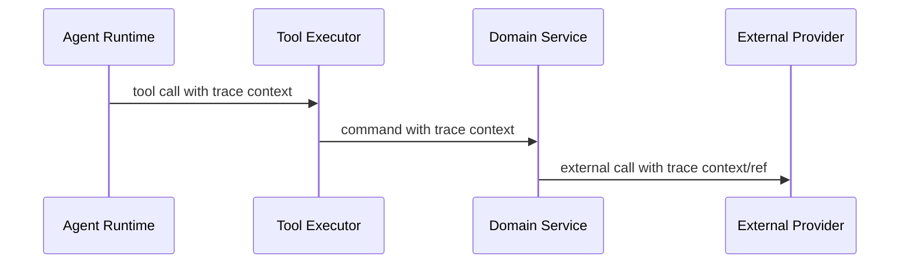
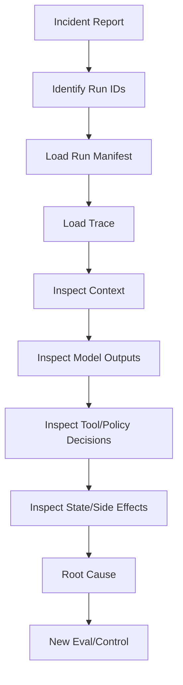
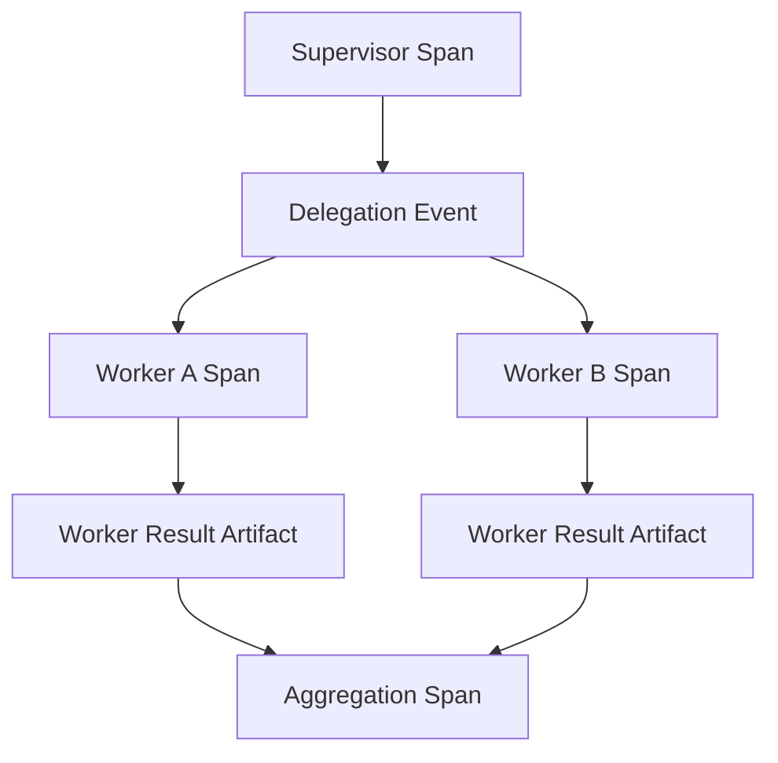

# Part 034 — Observability and Runtime Forensics

> If you cannot reconstruct why an agent did something, you do not have an enterprise system.
>
> You have a probabilistic black box with logs.

Observability for agentic AI must answer questions that normal service logs cannot:

- What context did the agent see?
- Which model and prompt version were used?
- Which tools were available?
- Which tool did the model propose?
- Which tools were denied by policy?
- Which evidence chunks were retrieved?
- Which citations supported which claims?
- Which memory records influenced context?
- Which human decision approved an action?
- Which checkpoint was resumed?
- Which side effect was committed?
- Which guardrail fired?
- Which policy version allowed/denied action?
- What changed between the good run and the bad run?

This part designs observability and runtime forensics for enterprise-grade stateful multi-agent AI systems.

---

## 1. Kaufman Framing

Using Kaufman's framework, observability decomposes into:

1. identify forensic questions;
2. define trace/span/event model;
3. instrument model calls;
4. instrument tool calls;
5. instrument context assembly;
6. instrument policy/guardrails;
7. instrument state/checkpoints;
8. correlate evidence, artifacts, and decisions;
9. build dashboards and alerts;
10. support incident replay and investigation.

### Target Performance

By the end of this part, you should be able to:

- design trace structure for multi-agent workflows;
- distinguish logs, metrics, traces, spans, and events;
- create run manifests;
- instrument model/tool/RAG/memory/policy/guardrail calls;
- design evidence trails and decision trails;
- define forensic queries;
- support replay and time-travel debugging;
- build observability dashboards;
- avoid trace data leakage;
- turn observability into reliability and governance evidence.

---

# 2. Observability Signals

Modern observability usually uses:

| Signal | Meaning |
|---|---|
| traces | path of a request/workflow through components |
| spans | timed operation inside a trace |
| metrics | numeric measurements over time |
| logs | timestamped records/events |
| events | structured facts that happened |
| profiles | resource usage detail |
| baggage/context | cross-service correlation data |

Agent systems need all of these, plus AI-specific artifacts.

---

# 3. Trace Mental Model



A trace should show the workflow path.

A span should show an operation.

An event should show something significant inside a span.

---

# 4. Agent Trace Structure

```python
from enum import Enum
from pydantic import BaseModel, Field


class SpanKind(str, Enum):
    RUN = "run"
    AGENT = "agent"
    MODEL_CALL = "model_call"
    TOOL_CALL = "tool_call"
    RETRIEVAL = "retrieval"
    CONTEXT_ASSEMBLY = "context_assembly"
    POLICY_DECISION = "policy_decision"
    GUARDRAIL = "guardrail"
    STATE_CHECKPOINT = "state_checkpoint"
    HUMAN_REVIEW = "human_review"
    SIDE_EFFECT = "side_effect"


class AgentSpan(BaseModel):
    span_id: str
    parent_span_id: str | None
    trace_id: str
    run_id: str
    span_kind: SpanKind
    name: str
    started_at: str
    ended_at: str | None = None
    attributes: dict = Field(default_factory=dict)
```

Attributes should include version and identity metadata.

---

# 5. Run Manifest

A run manifest is the forensic header for a run.

```python
class RunManifest(BaseModel):
    run_id: str
    thread_id: str
    tenant_id: str
    user_id: str | None
    system_id: str
    release_id: str
    objective: str
    agent_versions: list[str]
    model_versions: list[str]
    prompt_versions: list[str]
    tool_versions: list[str]
    policy_versions: list[str]
    guardrail_versions: list[str]
    rag_index_versions: list[str]
    memory_policy_version: str | None = None
    started_at: str
```

Without a run manifest, debugging becomes archaeology.

---

# 6. Correlation IDs

Use correlation IDs across systems.

```python
class CorrelationContext(BaseModel):
    trace_id: str
    run_id: str
    thread_id: str
    tenant_id: str
    correlation_id: str
    causation_id: str | None = None
```

Correlation lets you connect:

- API request;
- agent run;
- tool call;
- domain command;
- outbox event;
- external provider call;
- audit event.

---

# 7. Instrumenting Context Assembly

Context assembly is often the hidden cause of failure.

Track:

- builder version;
- source types;
- source refs;
- token count;
- omitted sources;
- compression method;
- memory records included;
- retrieved chunks included;
- policy context included;
- sufficiency report;
- trust labels;
- prompt injection signals.

```python
class ContextAssemblyEvent(BaseModel):
    event_id: str
    run_id: str
    context_id: str
    builder_version: str
    included_source_refs: list[str]
    omitted_source_refs: list[str]
    token_estimate: int
    sufficiency_passed: bool
    warnings: list[str] = Field(default_factory=list)
```

Question to answer:

> Did the model have the information it needed?

---

# 8. Instrumenting Model Calls

Track:

- model provider;
- model name/version;
- prompt version;
- input token count;
- output token count;
- temperature/parameters;
- response status;
- structured output validation result;
- latency;
- cost;
- safety/guardrail signals;
- retry count.

Do not necessarily store raw prompts forever. Store references, hashes, redacted snapshots, and access-controlled traces.

```python
class ModelCallEvent(BaseModel):
    event_id: str
    run_id: str
    model_call_id: str
    model: str
    prompt_version: str
    input_token_count: int
    output_token_count: int
    latency_ms: int
    cost_usd: float | None = None
    output_validation_status: str
```

---

# 9. Instrumenting Tool Calls

Track:

- tool name/version;
- effect type;
- agent name;
- input schema version;
- argument hash;
- authorization decision;
- policy decision;
- approval ID;
- idempotency key;
- timeout;
- retry count;
- external reference;
- output validation status;
- error type.

```python
class ToolCallTraceEvent(BaseModel):
    event_id: str
    run_id: str
    tool_call_id: str
    tool_name: str
    tool_version: str
    effect_type: str
    policy_decision: str
    status: str
    idempotency_key: str | None = None
    external_ref: str | None = None
```

Tool traces are essential for side-effect forensics.

---

# 10. Instrumenting RAG

Track retrieval as first-class spans.

```python
class RetrievalTraceEvent(BaseModel):
    event_id: str
    run_id: str
    retrieval_id: str
    query: str
    retriever_version: str
    index_version: str
    returned_chunk_ids: list[str]
    selected_chunk_ids: list[str]
    authorization_filter_applied: bool
    freshness_filter_applied: bool
    latency_ms: int
```

Also track:

- metadata filters;
- document authority;
- scores;
- reranker version;
- omitted candidates;
- citation verification.

Question to answer:

> Did the answer fail because retrieval failed or reasoning failed?

---

# 11. Instrumenting Memory

Track:

- memory retrieval request;
- memory records returned;
- memory records included in context;
- memory write proposals;
- memory write decisions;
- memory conflicts;
- memory supersession;
- forget requests;
- tombstones.

```python
class MemoryUsageEvent(BaseModel):
    event_id: str
    run_id: str
    memory_id: str
    usage_type: str  # retrieved, included, cited, rejected, conflicted
    reason: str | None = None
```

Memory observability is important because memory influences future runs.

---

# 12. Instrumenting Policy

Track every important policy decision.

```python
class PolicyTraceEvent(BaseModel):
    event_id: str
    run_id: str
    policy_request_id: str
    policy_id: str
    policy_version: str
    action: str
    resource_type: str
    resource_id: str | None
    decision: str
    reason: str
    obligations: list[str] = Field(default_factory=list)
```

Questions:

- Why was tool denied?
- Why was approval required?
- Which policy version applied?
- Were obligations enforced?

---

# 13. Instrumenting Guardrails

Track:

- guardrail ID/version;
- boundary;
- decision;
- confidence;
- reason;
- repair attempt;
- tripwire status;
- escalation created.

```python
class GuardrailTraceEvent(BaseModel):
    event_id: str
    run_id: str
    guardrail_id: str
    guardrail_version: str
    boundary: str
    decision: str
    reason: str
    confidence: float | None = None
```

Guardrails are controls. Controls need evidence.

---

# 14. Instrumenting State and Checkpoints

Track:

- checkpoint ID;
- state schema version;
- node;
- parent checkpoint;
- state hash;
- saved_at;
- resume event;
- migration applied;
- replay/time-travel reference.

```python
class CheckpointTraceEvent(BaseModel):
    event_id: str
    run_id: str
    thread_id: str
    checkpoint_id: str
    node_name: str
    state_schema_version: str
    state_hash: str
    parent_checkpoint_id: str | None = None
```

Question:

> What exact state did the run resume from?

---

# 15. Instrumenting Human Review

Track:

- decision package ID/version;
- reviewer ID/role;
- required role;
- decision;
- comment;
- approval expiry;
- package source refs;
- time to decision;
- separation-of-duties check;
- downstream command.

```python
class HumanReviewTraceEvent(BaseModel):
    event_id: str
    run_id: str
    decision_package_id: str
    package_version: int
    reviewer_id: str
    decision: str
    decision_latency_ms: int
    downstream_command_id: str | None = None
```

Human review must be traceable because it transfers authority.

---

# 16. Decision Trail

A decision trail connects:



A decision trail should answer:

- what did the user ask?
- what did the agent see?
- what did it infer?
- what policy applied?
- who approved?
- what command committed?
- what event proves the outcome?

---

# 17. Evidence Trail

An evidence trail connects output claims to sources.



## Claim Trace Model

```python
class ClaimTrace(BaseModel):
    claim_id: str
    run_id: str
    output_artifact_id: str
    claim_text: str
    evidence_refs: list[str]
    citation_verification_status: str
```

Evidence trail is essential for grounding and audit.

---

# 18. Artifact Lineage

Artifacts should have lineage.

```python
class ArtifactLineage(BaseModel):
    artifact_id: str
    artifact_type: str
    created_by_agent: str
    run_id: str
    input_artifact_refs: list[str]
    source_refs: list[str]
    model_call_refs: list[str]
    tool_call_refs: list[str]
    created_at: str
```

Examples:

- risk assessment derived from evidence summaries;
- notice draft derived from approved facts;
- decision package derived from worker findings.

---

# 19. Runtime Forensics Questions

Forensics should answer:

## Context

- What context did model see?
- What was omitted?
- Was content trusted/untrusted?
- Was required evidence missing?

## Model

- Which model?
- Which prompt?
- What output?
- Did schema validation pass?

## Tools

- Which tools proposed?
- Which tools executed?
- Which tools denied?
- What side effects committed?

## Policy

- Which policy allowed/denied?
- Why approval required?
- Was approval valid?

## State

- Which checkpoint?
- What node?
- Was resume safe?

## Evidence

- Which sources support claim?
- Were citations verified?

## Human

- Who approved?
- What package/version?

---

# 20. Forensic Query Examples

| Question | Needed Data |
|---|---|
| Why did notice send? | tool trace, policy decision, approval, command, event |
| Why did risk become high? | risk output, evidence refs, policy/rubric, model call |
| Why did agent loop? | trace steps, state hashes, tool calls |
| Why was data leaked? | context, retrieval auth, output guardrail, logs |
| Why did eval regress? | run manifest versions, context, model, prompt |
| Why was approval bypassed? | policy/tool trace, command handler audit |
| Which runs used bad RAG index? | run manifests with index version |
| Which memories influenced this output? | memory usage events |

Design storage so these queries are possible.

---

# 21. Metrics Dashboard

Dashboards should include:

- run count;
- success/failure rate;
- latency p50/p95;
- cost per run;
- token usage;
- model error rate;
- tool error rate;
- policy denial rate;
- guardrail trigger rate;
- retrieval recall proxy;
- citation verification failure;
- memory conflict rate;
- human review backlog;
- side-effect ambiguity count;
- loop/deadlock detections.

Use classic service metrics plus agentic metrics.

---

# 22. Logs vs Events

Logs are often free-form.

Events should be structured facts.

Bad log:

```text
Agent did something weird.
```

Better event:

```json
{
  "event_type": "tool.policy_denied",
  "run_id": "run_123",
  "tool_name": "send_approved_notice",
  "agent_name": "drafting-agent",
  "policy_version": "notice-send-v3",
  "reason": "Missing approval_id"
}
```

Structured events make forensics possible.

---

# 23. OpenTelemetry Mapping

A practical mapping:

| Agent Concept | OTel Concept |
|---|---|
| run | trace |
| workflow node | span |
| model call | span |
| tool call | span |
| retrieval | span |
| policy decision | event/span |
| guardrail decision | event/span |
| checkpoint | event |
| human decision | event/span |
| side effect | span + event |
| tenant/run IDs | attributes/baggage with care |

Use standard telemetry concepts, but add AI-specific attributes.

---

# 24. Python Tracing Sketch

```python
from contextlib import asynccontextmanager


class Tracer:
    @asynccontextmanager
    async def span(self, name: str, attributes: dict):
        span_id = new_id("span")
        start = now_iso()
        try:
            yield span_id
            status = "success"
        except Exception:
            status = "error"
            raise
        finally:
            end = now_iso()
            await record_span(
                span_id=span_id,
                name=name,
                attributes={**attributes, "status": status},
                started_at=start,
                ended_at=end,
            )
```

Use actual OpenTelemetry or platform SDKs in production. The sketch shows instrumentation shape.

---

# 25. Trace Context Propagation

When a tool calls another service, propagate trace context.



Without propagation, traces break at service boundaries.

---

# 26. Sensitive Trace Data

Traces may contain sensitive data.

Controls:

- store references instead of raw content;
- redact known sensitive fields;
- classify trace fields;
- restrict trace access;
- apply retention policy;
- avoid secrets in prompts;
- hash large inputs;
- use secure artifact store for full context;
- separate debug traces from audit events.

Observability must not become exfiltration.

---

# 27. Trace Sampling

Sampling reduces cost but can harm forensics.

For high-risk systems:

- sample 100% of high-impact side-effect runs;
- sample 100% of policy denials;
- sample 100% of guardrail tripwires;
- sample 100% of incidents;
- sample lower-risk success paths if needed;
- preserve audit events even when debug trace sampled.

Audit and debug traces have different retention requirements.

---

# 28. Replay and Time Travel

Replay means rerunning or reconstructing a workflow.

Types:

| Type | Meaning |
|---|---|
| forensic replay | reconstruct what happened from records |
| deterministic replay | rerun deterministic workflow steps |
| model replay | rerun model call, may differ |
| state time travel | inspect checkpoint history |
| shadow replay | run new version on old inputs |
| eval replay | turn incident into eval case |

Because models are probabilistic, replay may not reproduce output exactly. Store enough artifacts to inspect original behavior.

---

# 29. Replay Requirements

To replay/investigate, store:

- run manifest;
- input refs;
- context package refs;
- model call metadata;
- model output refs;
- tool request/result refs;
- policy/guardrail decisions;
- checkpoint IDs;
- artifact lineage;
- human decisions;
- side-effect records;
- RAG chunk refs;
- memory usage refs.

---

# 30. Incident Reconstruction Workflow



Forensics should be a workflow, not manual log grep.

---

# 31. Observability for Multi-Agent Systems

Track agent interactions.



Record:

- delegation task;
- worker role/version;
- worker input refs;
- worker output refs;
- confidence;
- conflicts;
- aggregation decision.

Multi-agent observability should reveal disagreement, not hide it.

---

# 32. Observability for Cost

Track cost by:

- run;
- tenant;
- agent;
- model;
- tool;
- RAG retrieval;
- judge/eval;
- workflow node.

```python
class CostEvent(BaseModel):
    event_id: str
    run_id: str
    component: str
    cost_usd: float
    tokens_in: int | None = None
    tokens_out: int | None = None
    occurred_at: str
```

Cost explosion is a reliability incident.

---

# 33. Observability for Evaluation

Eval reports should link to traces.

For each failed eval case:

- trace ID;
- context package;
- tool sequence;
- model output;
- grader result;
- failed metric;
- diff from previous release.

This makes eval actionable.

---

# 34. Alerting

Alerts should cover:

- critical policy false allow;
- external side-effect without approval;
- duplicate side effect;
- cross-tenant retrieval;
- cost spike;
- loop/deadlock detection;
- guardrail tripwire spike;
- citation verification failure spike;
- human review backlog;
- model provider error spike;
- RAG index failure.

Avoid alert fatigue. Alert on user/risk impact.

---

# 35. Observability Anti-Patterns

## Anti-Pattern 1 — Only Final Logs

No trace of context, tools, or policy.

## Anti-Pattern 2 — Raw Prompt Logging Everywhere

Sensitive data leaks into logs.

## Anti-Pattern 3 — No Version Metadata

Cannot compare behavior across releases.

## Anti-Pattern 4 — Tool Calls Without Policy Trace

Cannot explain why tool executed.

## Anti-Pattern 5 — RAG Without Chunk IDs

Cannot verify evidence.

## Anti-Pattern 6 — Memory Usage Invisible

Cannot know why behavior changed.

## Anti-Pattern 7 — Human Approval Without Package Version

Cannot prove what was approved.

## Anti-Pattern 8 — No Run Manifest

Incident reconstruction fails.

---

# 36. Production Checklist

Before claiming observability:

- [ ] run trace exists;
- [ ] run manifest exists;
- [ ] context assembly instrumented;
- [ ] model calls instrumented;
- [ ] tool calls instrumented;
- [ ] RAG retrieval instrumented;
- [ ] memory usage instrumented;
- [ ] policy decisions instrumented;
- [ ] guardrail decisions instrumented;
- [ ] checkpoints instrumented;
- [ ] human review instrumented;
- [ ] side effects instrumented;
- [ ] evidence trail exists;
- [ ] artifact lineage exists;
- [ ] correlation IDs propagate;
- [ ] sensitive trace data redacted;
- [ ] sampling policy defined;
- [ ] dashboards exist;
- [ ] incident reconstruction workflow exists;
- [ ] eval failures link to traces.

---

# 37. Practice Drill

Design observability for an AI-assisted notice workflow.

Flow:

- user asks for case review;
- supervisor delegates evidence/risk/policy work;
- RAG retrieves evidence;
- risk agent recommends high risk;
- drafting agent creates notice;
- verifier checks citations;
- policy requires approval;
- human approves;
- notification tool sends notice;
- case status updates.

Deliverables:

1. trace hierarchy;
2. run manifest schema;
3. context event schema;
4. model call event;
5. tool call event;
6. RAG retrieval event;
7. policy/guardrail event;
8. checkpoint event;
9. human review event;
10. side-effect event;
11. evidence trail;
12. forensic query list;
13. dashboard metrics;
14. sensitive data handling policy.

---

# 38. What Top 1% Engineers Pay Attention To

Top engineers ask:

- Can I reconstruct why this happened?
- What did the model see?
- What did it not see?
- Which versions were active?
- Which evidence supported the claim?
- Which tool was called, by whom, under what policy?
- Which guardrail fired?
- Which human approved what version?
- Which side effect committed?
- Can we link eval failure to trace?
- Can we identify all runs affected by bad index/prompt/tool?
- Are traces leaking sensitive data?
- Are we sampling the wrong things?
- Are observability signals tied to SLOs?

They design forensics before the incident.

---

# 39. Summary

In this part, we covered:

- observability signals;
- trace mental model;
- agent span model;
- run manifest;
- correlation IDs;
- context assembly instrumentation;
- model call instrumentation;
- tool instrumentation;
- RAG instrumentation;
- memory instrumentation;
- policy and guardrail instrumentation;
- checkpoint instrumentation;
- human review instrumentation;
- decision trails;
- evidence trails;
- artifact lineage;
- forensic queries;
- metrics dashboards;
- logs vs events;
- OpenTelemetry mapping;
- trace context propagation;
- sensitive trace data;
- sampling;
- replay and time travel;
- incident reconstruction;
- multi-agent observability;
- cost observability;
- evaluation observability;
- alerting;
- anti-patterns;
- production checklist.

The key principle:

> Observability is the difference between “the agent did something” and “we can prove why, how, under which authority, with which evidence, and what changed.”

The next part is the capstone: **Reference Architecture and Capstone: Enterprise Case Management Multi-Agent System**.

---

## References

- OpenTelemetry documentation: traces, spans, metrics, logs, context propagation, and observability concepts.
- OpenAI Agents SDK tracing documentation: built-in tracing for LLM generations, tool calls, handoffs, guardrails, and custom events.
- Google SRE Book: monitoring distributed systems and the four golden signals.
- LangGraph documentation: persistence, checkpoints, and stateful long-running workflows.
