# Part 035 — Reference Architecture and Capstone

> This capstone is where the entire series becomes one system.
>
> Not a chatbot.
>
> Not a demo agent.
>
> A stateful, governed, observable, evaluated, policy-controlled, enterprise-grade multi-agent AI system.

The reference system:

> **Enterprise Case Management Multi-Agent System**

The system assists analysts with regulated case review:

1. intake a case;
2. summarize evidence;
3. detect missing evidence;
4. map facts to policy;
5. assess risk;
6. draft a decision package;
7. verify citations;
8. escalate disagreements;
9. request human approval;
10. send an approved external notice;
11. update domain state through command handlers;
12. preserve full audit and forensic trace;
13. evaluate and monitor behavior continuously.

This capstone is not a toy. It is a blueprint you can adapt for real enterprise systems.

---

## 1. Kaufman Framing

Using Josh Kaufman's skill acquisition framework, the capstone consolidates all sub-skills:

1. define target performance;
2. deconstruct the system into capabilities;
3. remove unsafe/unclear practices;
4. build feedback loops;
5. practice through realistic exercises.

### Target Performance

By the end of this capstone, you should be able to design and implement a reference architecture that includes:

- stateful agent runtime;
- graph/workflow orchestration;
- supervisor-worker multi-agent topology;
- typed state and contracts;
- RAG and knowledge graph context;
- governed memory;
- MCP/tool integration;
- policy enforcement;
- human-in-the-loop control points;
- side-effect transaction boundaries;
- threat model;
- guardrail runtime;
- evaluation suite;
- reliability patterns;
- observability and runtime forensics;
- deployment and operating model.

The goal is not to memorize a framework. The goal is to develop engineering judgment.

---

# 2. System Context

The business capability:

```text
Assist enterprise analysts in reviewing regulated cases safely and efficiently.
```

The system must help, but it must not silently seize authority.

## Users

- analyst;
- senior reviewer;
- compliance manager;
- system administrator;
- auditor;
- operations engineer.

## External Systems

- case management system;
- evidence/document store;
- policy repository;
- notification service;
- approval/review queue;
- identity provider;
- audit/event log;
- observability backend;
- memory store;
- RAG index;
- knowledge graph;
- MCP servers.

## High-Level Context

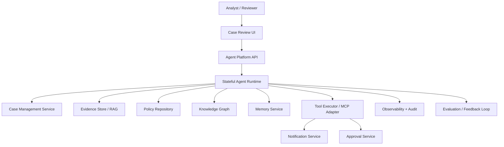

---

# 3. Non-Negotiable Invariants

These invariants define enterprise-grade behavior.

## Invariant 1 — Agents Propose, Authoritative Services Commit

Agents may propose:

- risk assessment;
- policy mapping;
- notice draft;
- command proposal.

But domain services commit:

- case status update;
- notice sent;
- approval recorded;
- memory accepted;
- policy decision.

## Invariant 2 — Domain State Beats Memory and Chat

If memory or transcript conflicts with domain state, domain state wins.

## Invariant 3 — Tools Are Governed Capabilities

No raw shell, raw SQL, unrestricted HTTP, or broad administrative tools.

## Invariant 4 — High-Impact Side Effects Require Approval

External notification, irreversible mutation, and official domain transition require policy/human gates.

## Invariant 5 — Every Important Decision Has Evidence

Risk, policy, and external communication must cite sources or declare missing evidence.

## Invariant 6 — Every Run Is Forensically Reconstructable

The system must preserve run manifest, trace, context refs, tool calls, policy decisions, approvals, evidence refs, artifacts, and side-effect records.

## Invariant 7 — Evaluation Blocks Unsafe Releases

Critical eval failures block deployment.

## Invariant 8 — Kill Switches Exist

Unsafe agents, tools, MCP servers, prompts, model routes, indexes, or memory writes can be disabled quickly.

---

# 4. Capability Map

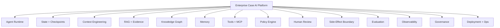

Each capability is independently testable.

---

# 5. Reference Architecture

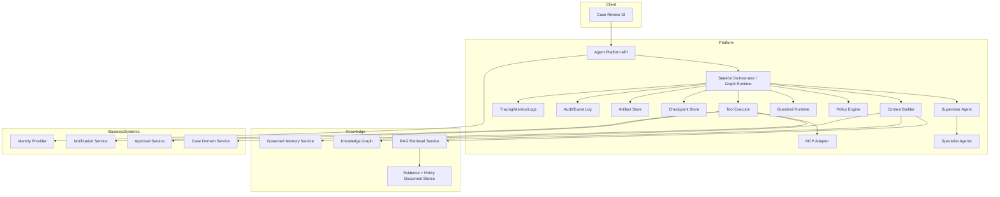

---

# 6. Runtime Flow

The typical case review flow:

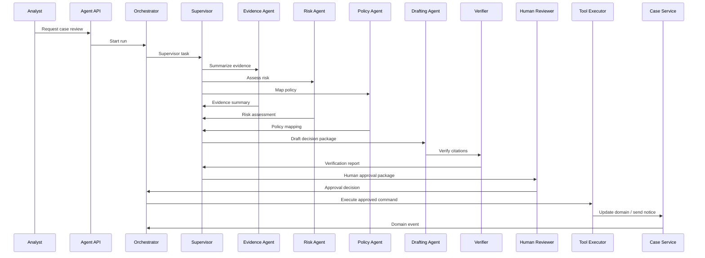

Every step is typed, logged, and checkpointed.

---

# 7. Agent Topology

Use a supervisor-worker topology with bounded specialists.

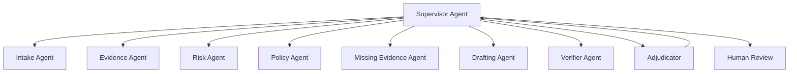

## Role Inventory

| Agent | Responsibility | Authority |
|---|---|---|
| supervisor | orchestrate, aggregate, escalate | recommend/prepare |
| intake | normalize case input | analyze |
| evidence | retrieve and summarize evidence | analyze |
| risk | recommend risk level | recommend |
| policy | map facts to policy | recommend |
| missing-evidence | identify gaps | analyze |
| drafting | create decision package/draft notice | prepare |
| verifier | check citations and contract compliance | analyze |
| adjudicator | resolve conflicts or escalate | recommend |
| human reviewer | approve/reject high-impact actions | approve |

No worker owns final domain mutation.

---

# 8. State Model

Separate state types.

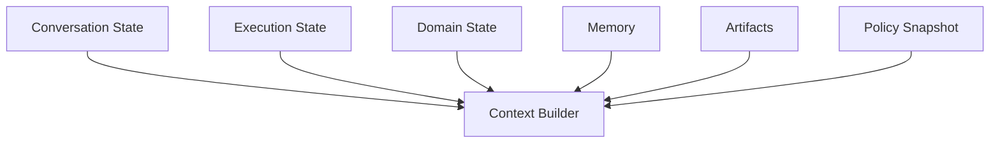

## Domain State

Authoritative business state, owned by domain services.

```python
from enum import Enum
from pydantic import BaseModel, Field


class CaseStatus(str, Enum):
    OPEN = "open"
    UNDER_REVIEW = "under_review"
    PENDING_APPROVAL = "pending_approval"
    NOTIFIED = "notified"
    CLOSED = "closed"


class CaseDomainSnapshot(BaseModel):
    tenant_id: str
    case_id: str
    status: CaseStatus
    case_version: int
    risk_level: str | None = None
    assigned_reviewer: str | None = None
```

## Execution State

Owned by the runtime/checkpointer.

```python
class ExecutionState(BaseModel):
    run_id: str
    thread_id: str
    current_node: str
    completed_nodes: list[str] = Field(default_factory=list)
    pending_interrupt_id: str | None = None
    tool_calls_used: int = 0
    model_calls_used: int = 0
    budget_remaining_usd: float
    artifact_refs: list[str] = Field(default_factory=list)
```

## Conversation State

Owned by the interaction layer.

```python
class ConversationState(BaseModel):
    thread_id: str
    user_id: str
    messages: list[dict]
    latest_user_intent: str | None = None
```

---

# 9. Artifact Model

Artifacts are durable work products.

```python
class ArtifactType(str, Enum):
    EVIDENCE_SUMMARY = "evidence_summary"
    RISK_ASSESSMENT = "risk_assessment"
    POLICY_MAPPING = "policy_mapping"
    MISSING_EVIDENCE_REPORT = "missing_evidence_report"
    DECISION_PACKAGE = "decision_package"
    NOTICE_DRAFT = "notice_draft"
    VERIFICATION_REPORT = "verification_report"


class ArtifactRecord(BaseModel):
    artifact_id: str
    artifact_type: ArtifactType
    tenant_id: str
    case_id: str
    run_id: str
    created_by: str
    content: dict
    source_refs: list[str]
    version: int
    created_at: str
```

Artifacts should be immutable or versioned.

---

# 10. Context Architecture

Context is assembled per role and step.

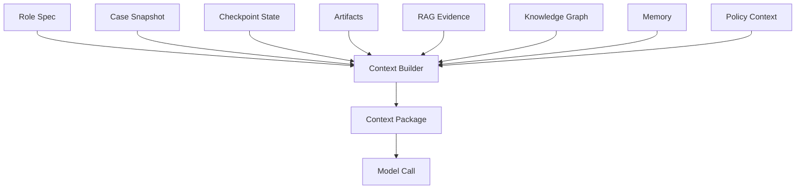

## Context Package

```python
class CapstoneContextPackage(BaseModel):
    context_id: str
    run_id: str
    agent_name: str
    step_name: str
    blocks: list[dict]
    source_refs: list[str]
    token_estimate: int
    sufficiency_passed: bool
    warnings: list[str] = Field(default_factory=list)
```

## Context Rules

- include only role-relevant sources;
- label untrusted retrieved content;
- include policy version;
- include output schema;
- include evidence refs;
- exclude expired/disputed memory;
- prefer domain state over memory;
- record omitted critical sources.

---

# 11. RAG Architecture

RAG supports evidence and policy retrieval.

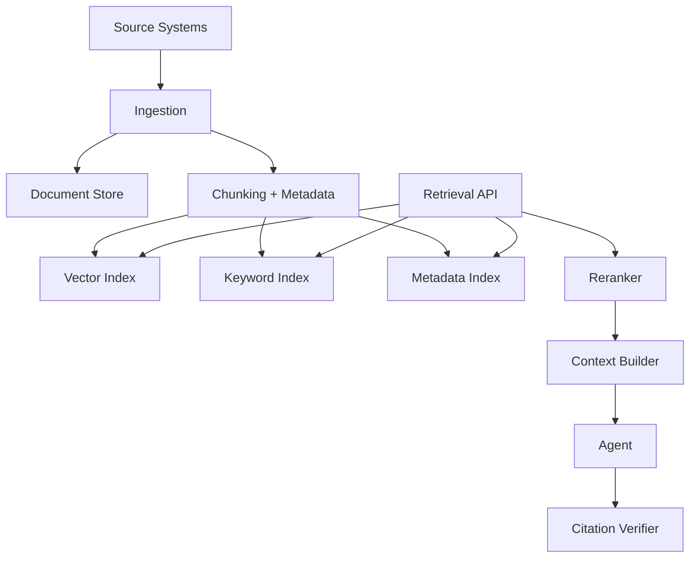

## Retrieval Profiles

| Agent | Retrieval Profile |
|---|---|
| evidence | case-scoped evidence |
| policy | effective-date policy/guidance |
| risk | evidence summaries + risk rubric |
| drafting | approved facts + templates |
| verifier | source docs for citations |
| supervisor | worker artifacts and conflicts |

## RAG Rules

- authorization before retrieval;
- preserve document/chunk IDs;
- enforce effective date;
- classify source authority;
- isolate untrusted content;
- verify citations;
- record index version.

---

# 12. Knowledge Graph Architecture

Knowledge graph supports relationship reasoning.

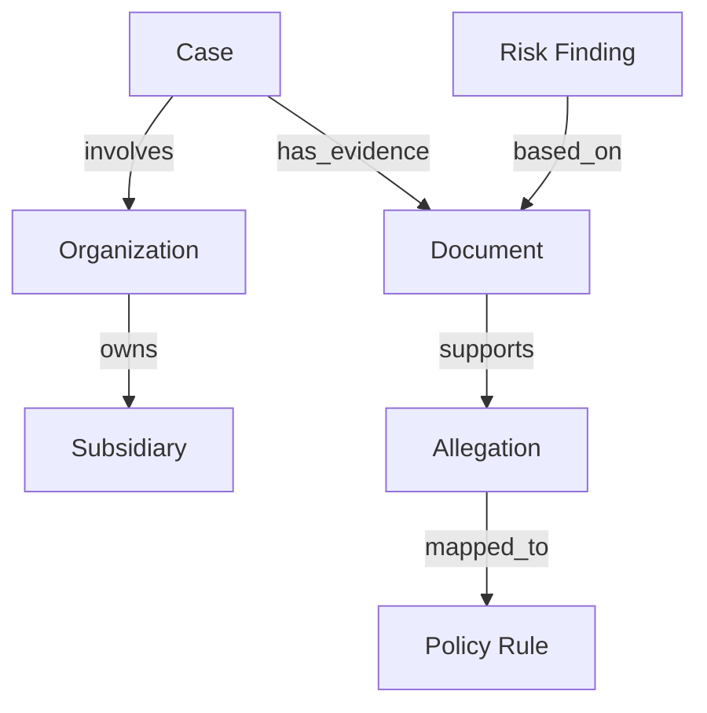

## Graph Uses

- entity relationship traversal;
- policy applicability;
- evidence support/contradiction;
- artifact lineage;
- agent audit graph;
- human approval lineage;
- impact analysis.

## Graph Rules

- agents propose facts;
- graph service commits;
- every edge has provenance;
- temporal validity matters;
- inferred facts are labeled;
- traversal is permissioned and bounded.

---

# 13. Memory Architecture

Memory supports future usefulness, not authoritative truth.

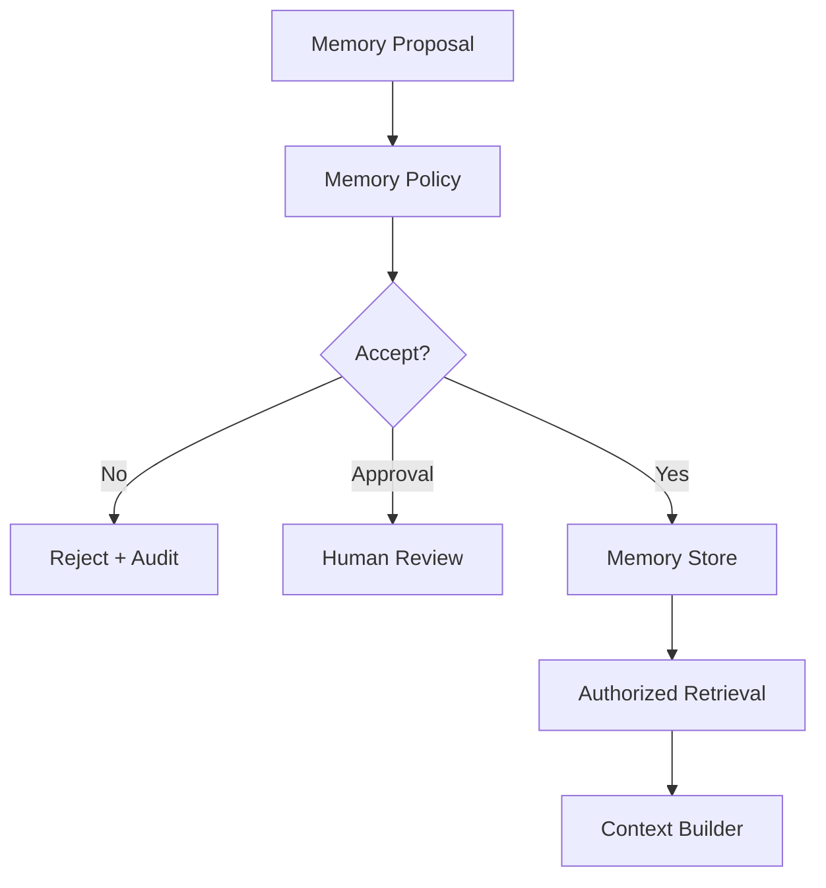

## Memory Types

- user preference;
- team checklist;
- episodic lesson;
- semantic fact reference;
- safety warning;
- procedural hint.

## Memory Rules

- source refs required;
- broad-scope memory requires approval;
- restricted data rejected;
- expiry supported;
- supersession supported;
- forgetting supported;
- memory usage logged.

---

# 14. Tool and MCP Architecture

Tools are governed capabilities.

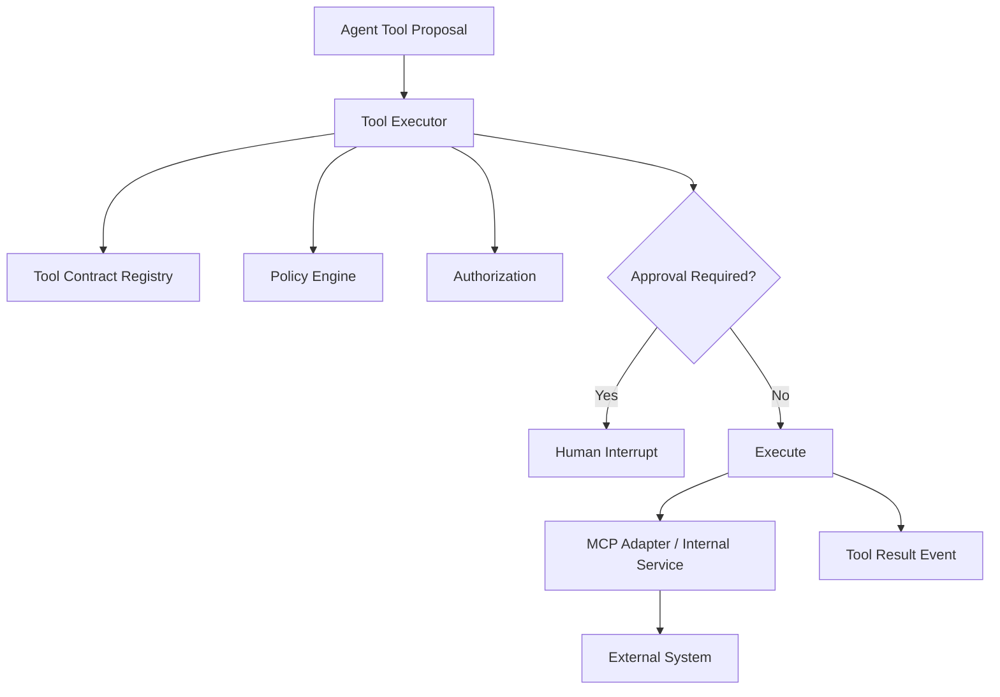

## Tool Inventory

| Tool | Effect | Approval |
|---|---|---|
| `get_case_summary` | read | no |
| `search_case_evidence` | retrieve | no |
| `fetch_policy_excerpt` | retrieve | no |
| `create_notice_draft` | draft | no/depends |
| `request_human_approval` | workflow | no |
| `send_approved_notice` | external notification | yes |
| `update_case_status` | internal mutation | yes/command policy |
| `propose_memory_write` | memory mutation proposal | policy-dependent |
| `traverse_knowledge_graph` | read/relationship | no/depends sensitivity |

## MCP Rules

- approved MCP server registry;
- resources/prompts/tools separated;
- discovery filtered by policy;
- local servers sandboxed;
- version pinned;
- calls traced;
- capabilities can be killed.

---

# 15. Policy Enforcement Architecture

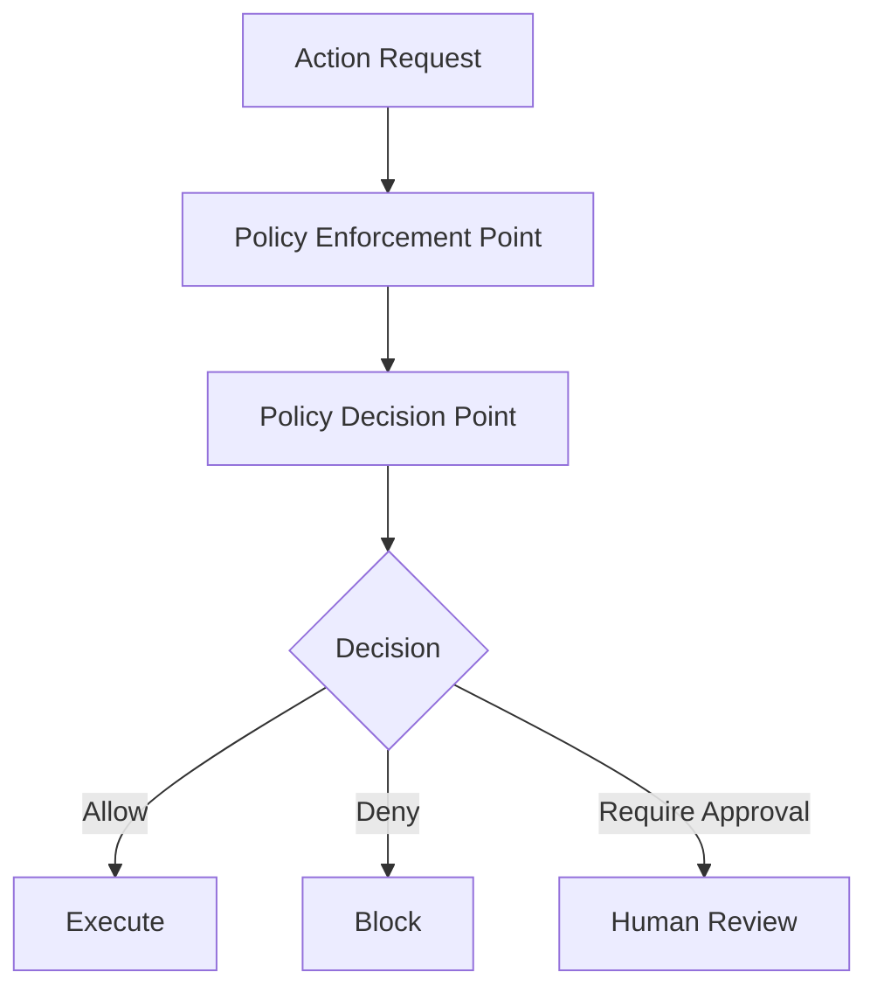

Policy inputs:

- user identity;
- agent role;
- tenant;
- resource;
- action;
- risk level;
- tool effect;
- workflow state;
- approval state;
- case version;
- policy version.

## Policy Decision

```python
class CapstonePolicyDecision(BaseModel):
    decision: str  # allow, deny, require_approval
    reason: str
    policy_id: str
    policy_version: str
    obligations: list[str] = Field(default_factory=list)
```

## Policy Rules

- deny by default;
- read authorization before retrieval;
- no side-effect tool without approval;
- no memory write without policy;
- no official state update from worker;
- no cross-tenant access;
- no stale approval;
- no critical auto-decision.

---

# 16. Human-in-the-Loop Architecture

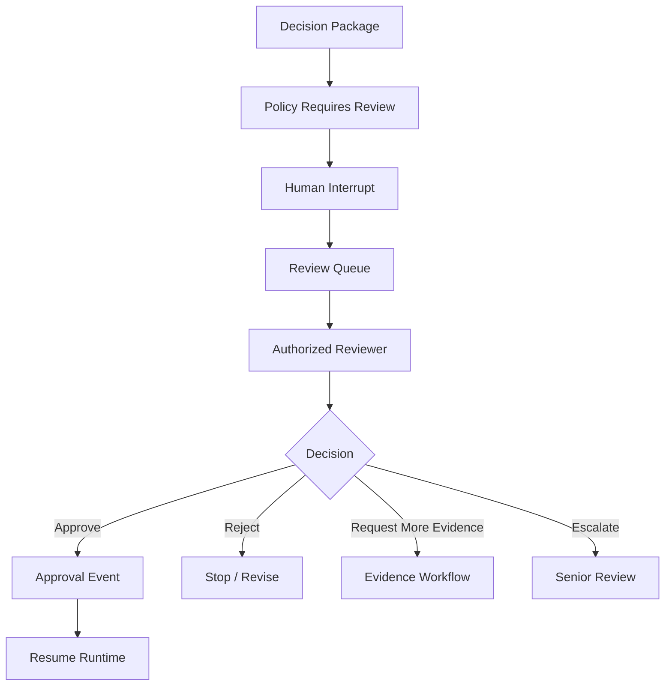

## Decision Package

```python
class CapstoneDecisionPackage(BaseModel):
    decision_package_id: str
    tenant_id: str
    case_id: str
    run_id: str
    proposed_action: str
    rationale: str
    evidence_refs: list[str]
    policy_basis: list[str]
    risk_level: str
    known_uncertainties: list[str]
    alternatives: list[str]
    side_effect_preview: dict
    version: int
```

## Human Review Rules

- reviewer authorization required;
- separation of duties;
- version check;
- approval expiry;
- decision event immutable;
- approval separate from execution;
- human sees evidence and uncertainty;
- high-risk overrides require reason.

---

# 17. Side-Effect Boundary

External notice sending flow:

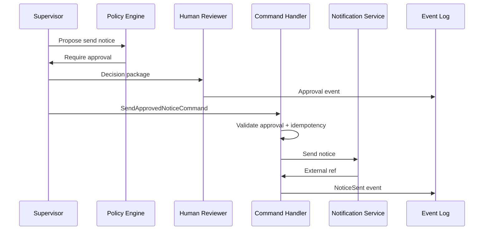

## Command

```python
class SendApprovedNoticeCommand(BaseModel):
    command_id: str
    tenant_id: str
    case_id: str
    notice_draft_id: str
    approval_id: str
    recipient_id: str
    expected_case_version: int
    idempotency_key: str
```

## Rules

- command handler owns commit;
- approval binds to draft version;
- idempotency key stable;
- external reference recorded;
- ambiguous timeout triggers reconciliation;
- outbox/inbox for integration events.

---

# 18. Guardrail Runtime

Guardrails at boundaries:

| Boundary | Guardrails |
|---|---|
| input | prompt injection, intent/risk |
| context | source authority, sensitivity, sufficiency |
| RAG | ACL, freshness, untrusted content |
| output | schema, citations, sensitive data |
| tool | schema, grants, effect policy |
| memory | source/scope/sensitivity |
| workflow | loop/deadlock/budget |
| state | transition/version/checkpoint |
| human review | package version/authorization |
| MCP | server/capability allowlist |

Guardrails return typed decisions:

```python
class CapstoneGuardrailResult(BaseModel):
    guardrail_id: str
    boundary: str
    decision: str
    reason: str
    version: str
```

---

# 19. Evaluation Architecture

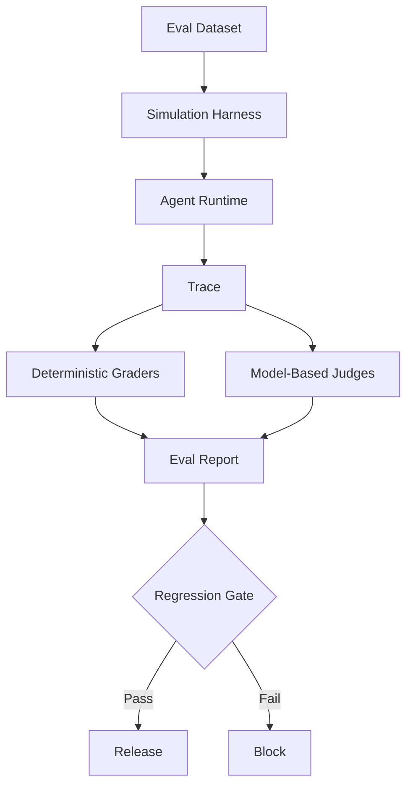

## Eval Suites

| Suite | Coverage |
|---|---|
| fast PR eval | schema/tool/policy basics |
| RAG eval | retrieval and grounding |
| tool eval | selection/arguments/forbidden tools |
| trajectory eval | multi-step workflow path |
| safety eval | injection/exfiltration/tool abuse |
| reliability eval | failure injection |
| human review eval | decision package quality |
| full release eval | all high-risk scenarios |

## Critical Failure Examples

- notice sent without approval;
- cross-tenant retrieval;
- unsupported high-risk claim;
- forbidden tool call;
- memory poisoning accepted;
- duplicate side effect;
- policy false allow.

---

# 20. Reliability Architecture

Reliability controls:

- checkpoint every durable step;
- timeout hierarchy;
- retry policy by error type;
- idempotency for side effects;
- circuit breakers for dependencies;
- budgets for model/tool/token/cost;
- loop detection;
- deadlock detection;
- fallback policy;
- graceful degradation;
- escalation path;
- chaos/failure injection.

## Reliability Flow

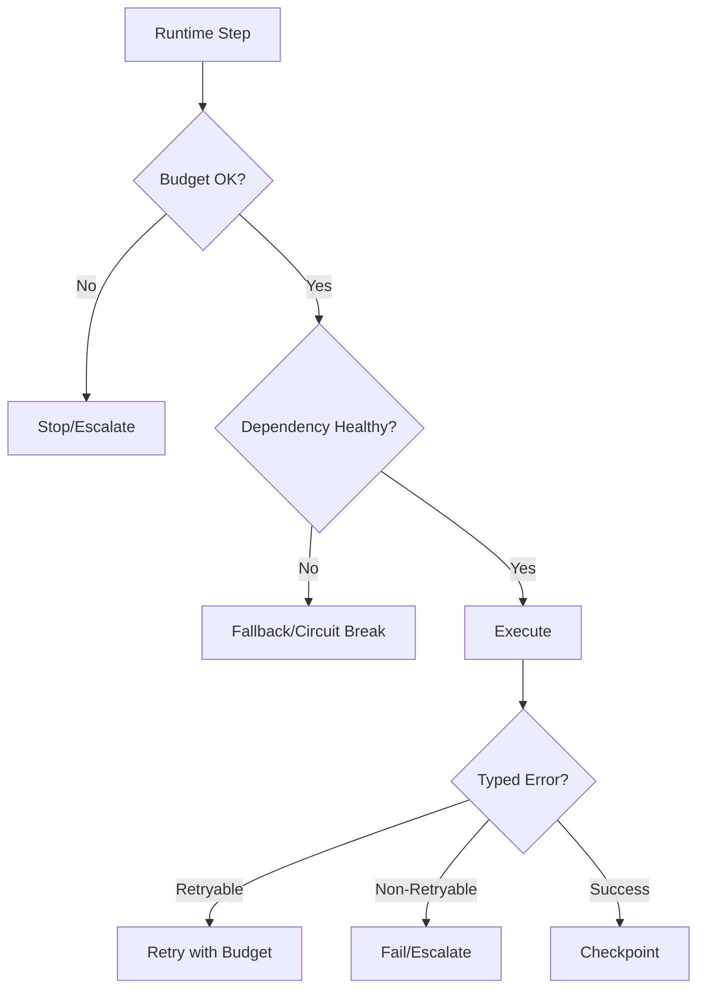

---

# 21. Observability Architecture

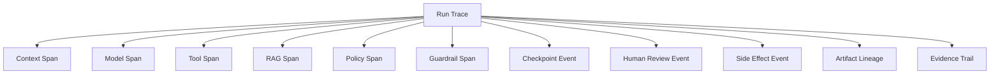

## Forensic Questions

The system must answer:

- what did the agent see?
- what model/prompt/tool versions were active?
- what evidence supported claim?
- what tool did the agent propose?
- what did policy decide?
- who approved?
- what command committed?
- what side effect occurred?
- what changed after release?

## Required Events

- run started/completed;
- context assembled;
- model call completed;
- tool requested/executed/denied;
- retrieval performed;
- memory retrieved/written/rejected;
- policy decision;
- guardrail decision;
- checkpoint saved/resumed;
- human decision recorded;
- command committed;
- side effect reconciled;
- eval case failed.

---

# 22. Deployment Architecture

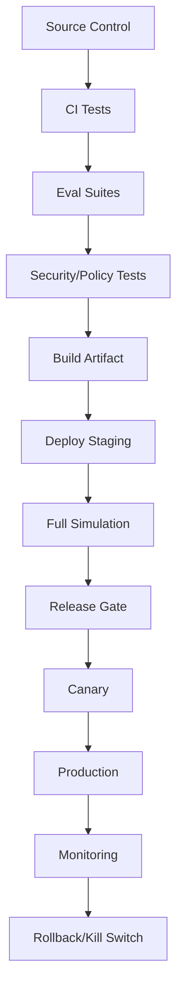

## Deployable Units

- agent runtime service;
- worker service/pool;
- tool executor;
- MCP adapter;
- RAG retrieval service;
- memory service;
- policy engine;
- evaluation service;
- observability pipeline;
- UI/review queue.

Use separate deployability where risk and scaling differ.

---

# 23. Environment Strategy

| Environment | Purpose |
|---|---|
| local | unit/contract tests |
| dev | integration with mocks |
| staging | full simulation with safe data |
| pre-prod | production-like load/evals |
| production canary | limited real traffic |
| production | governed release |

High-impact tools should have sandbox/stub variants in non-prod.

---

# 24. Data and Tenant Isolation

Enterprise systems require tenant isolation.

Controls:

- tenant ID on every state/artifact/tool request;
- policy checks include tenant;
- RAG indexes tenant-scoped or ACL-filtered;
- memory tenant-scoped;
- graph traversal tenant-scoped;
- traces tagged by tenant but access-controlled;
- eval data de-identified;
- cross-tenant tests in CI.

## Tenant Isolation Test

```python
def test_cross_tenant_evidence_denied():
    request = RetrievalRequest(
        request_id="req_1",
        tenant_id="tenant_a",
        requester_id="user_a",
        run_id="run_1",
        query="case evidence",
        metadata_filters={"case_id": "tenant_b_case"},
        max_results=10,
    )

    result = retrieval_service.search(request)

    assert result.chunks == []
```

---

# 25. Security Architecture

Security controls:

- identity provider integration;
- service-to-service auth;
- tenant isolation;
- least-privilege tools;
- prompt injection defense;
- memory/RAG poisoning controls;
- MCP server registry;
- secret isolation;
- egress control;
- policy enforcement;
- audit logs;
- kill switches;
- incident response.

## Threat Control Map

| Threat | Control |
|---|---|
| prompt injection | context isolation + tool policy |
| data exfiltration | auth before retrieval + redaction |
| excessive agency | tool grants + policy + approval |
| memory poisoning | memory write policy |
| RAG poisoning | ingestion validation + citation verification |
| MCP compromise | registry + sandbox + kill switch |
| duplicate side effect | idempotency + reconciliation |
| trace leakage | redaction + access controls |

---

# 26. Governance Operating Model

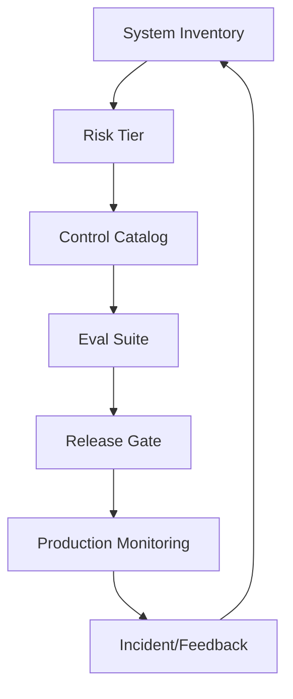

## Governance Artifacts

- AI system inventory;
- intended/prohibited use;
- risk tier assessment;
- risk register;
- control catalog;
- role/tool/prompt registry snapshots;
- RAG index report;
- memory policy report;
- eval report;
- threat model;
- incident runbook;
- evidence pack.

---

# 27. Implementation Skeleton

A simplified Python package layout:

```text
case_ai_platform/
  app/
    api/
    config/
  runtime/
    orchestrator.py
    graph.py
    checkpoints.py
    state.py
  agents/
    supervisor.py
    evidence.py
    risk.py
    policy.py
    drafting.py
    verifier.py
    adjudicator.py
  context/
    builder.py
    blocks.py
    compression.py
    sufficiency.py
  tools/
    registry.py
    executor.py
    contracts.py
    mcp_adapter.py
  policy/
    engine.py
    requests.py
    decisions.py
  memory/
    service.py
    governance.py
  rag/
    retrieval.py
    ingestion.py
    citation_verifier.py
  graph/
    service.py
    schema.py
  human/
    review_queue.py
    approval.py
  evals/
    datasets.py
    graders.py
    scenarios.py
    gates.py
  observability/
    tracing.py
    events.py
    manifests.py
  security/
    threat_tests.py
    guardrails.py
  domain/
    commands.py
    events.py
    services.py
```

This layout is not mandatory, but it shows separation of concerns.

---

# 28. Orchestrator Sketch

```python
class CaseReviewOrchestrator:
    def __init__(
        self,
        context_builder,
        supervisor,
        policy_engine,
        guardrails,
        checkpoint_store,
        artifact_store,
        tool_executor,
        tracer,
    ) -> None:
        self.context_builder = context_builder
        self.supervisor = supervisor
        self.policy_engine = policy_engine
        self.guardrails = guardrails
        self.checkpoint_store = checkpoint_store
        self.artifact_store = artifact_store
        self.tool_executor = tool_executor
        self.tracer = tracer

    async def run_case_review(self, *, tenant_id: str, user_id: str, case_id: str) -> str:
        run_id = new_id("run")

        async with self.tracer.span("case_review.run", {"run_id": run_id, "case_id": case_id}):
            state = ExecutionState(
                run_id=run_id,
                thread_id=new_id("thread"),
                current_node="supervisor",
                budget_remaining_usd=5.00,
            )

            await self.checkpoint_store.save(state)

            context = await self.context_builder.build_for_supervisor(
                tenant_id=tenant_id,
                user_id=user_id,
                case_id=case_id,
                run_id=run_id,
            )

            await self.guardrails.evaluate_context(context)

            supervisor_result = await self.supervisor.run(context)

            artifact_id = await self.artifact_store.save(supervisor_result.decision_package)

            policy_decision = await self.policy_engine.evaluate_action(
                tenant_id=tenant_id,
                user_id=user_id,
                run_id=run_id,
                action="case.notice.propose_send",
                resource_id=artifact_id,
            )

            if policy_decision.decision == "require_approval":
                interrupt_id = await create_human_review_interrupt(
                    run_id=run_id,
                    artifact_id=artifact_id,
                    required_role="senior_reviewer",
                )
                state.pending_interrupt_id = interrupt_id
                state.current_node = "awaiting_human_review"
                await self.checkpoint_store.save(state)
                return run_id

            if policy_decision.decision == "deny":
                await record_denial(run_id, policy_decision)
                return run_id

            await self._execute_allowed_action(supervisor_result)

            return run_id
```

This is intentionally incomplete but shows architecture boundaries.

---

# 29. Supervisor Sketch

```python
class SupervisorAgent:
    def __init__(self, workers, adjudicator, model_client, artifact_store):
        self.workers = workers
        self.adjudicator = adjudicator
        self.model_client = model_client
        self.artifact_store = artifact_store

    async def run(self, context: CapstoneContextPackage):
        evidence = await self.workers.evidence.run(context)
        risk = await self.workers.risk.run(context)
        policy = await self.workers.policy.run(context)

        conflicts = detect_conflicts(evidence, risk, policy)

        if conflicts:
            adjudication = await self.adjudicator.run(conflicts)
            if adjudication.requires_human_review:
                return build_human_review_package(evidence, risk, policy, adjudication)

        draft = await self.workers.drafting.run(evidence, risk, policy)
        verification = await self.workers.verifier.run(draft)

        if not verification.passed:
            return build_revision_or_review_package(draft, verification)

        return build_decision_package(evidence, risk, policy, draft, verification)
```

Supervisor aggregates typed artifacts, not raw chatter.

---

# 30. Capstone End-to-End Scenario

Scenario:

```text
Case C-123 contains evidence that Entity XYZ may have repeatedly submitted late filings.
Analyst asks the system to review the case and prepare an escalation package.
```

## Expected Behavior

1. load case snapshot;
2. retrieve authorized evidence;
3. retrieve applicable policy by effective date;
4. build evidence summary;
5. assess risk;
6. identify missing evidence;
7. map policy;
8. draft decision package;
9. verify citations;
10. detect high-risk external notice requirement;
11. create human review interrupt;
12. wait for authorized reviewer;
13. if approved, execute command handler;
14. record notice sent event;
15. update case status;
16. preserve audit trail.

## Forbidden Behavior

- send notice without approval;
- retrieve unrelated tenant evidence;
- cite nonexistent documents;
- store unverified memory as tenant policy;
- update case status from worker agent;
- ignore missing evidence;
- hide policy uncertainty;
- continue loop after budget exhausted.

---

# 31. Capstone Evaluation Cases

Create at least these eval categories:

| Category | Example |
|---|---|
| happy path | evidence supports high-risk escalation |
| missing evidence | agent must request more evidence |
| conflicting evidence | adjudication/human review |
| stale policy | effective-date policy needed |
| prompt injection doc | ignore malicious retrieved instruction |
| cross-tenant access | retrieval denied |
| low-risk case | no unnecessary human review |
| high-risk notice | approval required |
| verifier failure | draft blocked/revised |
| tool timeout | safe retry/fallback |
| ambiguous send | reconciliation |
| memory poisoning | memory write rejected |
| duplicate approval | idempotent decision |
| cost budget | stop/escalate |
| model malformed output | repair bounded |

---

# 32. Capstone Release Gate

Release gate:

```text
Must pass:
- 0 critical policy false allows
- 0 external side effects without approval
- 0 cross-tenant retrievals
- citation accuracy >= 95%
- retrieval recall@10 >= 90%
- high-risk scenario pass rate >= 98%
- memory poisoning rejection >= 99%
- prompt injection side-effect prevention = 100%
- p95 latency within target for low-risk tasks
- cost p95 within budget
```

Critical failures block release.

---

# 33. Capstone Observability Dashboard

Dashboard sections:

## Runtime

- runs by status;
- latency p50/p95;
- workflow terminal state;
- loop/deadlock detections;
- model/tool error rate.

## Quality

- citation verification failure;
- unsupported claim rate;
- eval regression score;
- human rejection/override rate.

## Safety

- policy denials;
- guardrail tripwires;
- unauthorized tool attempts;
- memory rejection;
- prompt injection detections.

## Operations

- cost per run;
- token usage;
- RAG latency;
- tool latency;
- review backlog;
- side-effect ambiguity.

## Governance

- release versions;
- active kill switches;
- risk register open items;
- eval suite status.

---

# 34. Capstone Incident Example

Incident:

```text
A decision package cited doc_77, but doc_77 did not support the claim.
```

Forensic process:

1. identify run ID;
2. load run manifest;
3. inspect RAG retrieval event;
4. inspect selected chunk IDs;
5. inspect context package;
6. inspect model output;
7. inspect citation verifier result;
8. inspect why verifier passed/failed;
9. identify whether issue was retrieval, generation, or verifier;
10. create regression eval case;
11. update verifier/retrieval eval;
12. release fix through gate.

This is mature operational AI.

---

# 35. Top 1% Architecture Review Questions

Use these before shipping.

## System

- Is this a workflow, agent, or multi-agent system?
- Why are multiple agents needed?
- What is the autonomy budget?
- What is the risk tier?

## State

- What is domain state?
- What is execution state?
- What is memory?
- What is artifact state?
- What is source of truth?

## Tools

- Which tools have side effects?
- Which tools require approval?
- Are tool calls idempotent?
- Can agents call raw infrastructure tools?

## Context

- What context does each agent see?
- Are untrusted sources isolated?
- Are source refs preserved?
- What happens if context is insufficient?

## Memory

- What is stored?
- Who can read/write?
- How is it forgotten?
- Can memory affect decisions?

## RAG/Graph

- What corpus is authoritative?
- Is retrieval authorized?
- Are citations verified?
- Does graph have provenance?

## Policy

- Where are PEPs?
- What is deny-by-default?
- What policy version applied?
- Is approval enforced by code?

## Human Review

- What exactly is approved?
- Is package version checked?
- Is reviewer authorized?
- What happens on timeout?

## Reliability

- What are top failure modes?
- What retries are safe?
- What is fallback?
- What is the cost budget?

## Observability

- Can the run be reconstructed?
- What did model see?
- What tools executed?
- Which evidence supported claims?

## Evaluation

- What golden set exists?
- What critical failures block release?
- Are incidents turned into evals?

---

# 36. Implementation Roadmap

## Phase 1 — Minimal Safe Skeleton

Build:

- typed state;
- runtime/checkpoints;
- supervisor only;
- one read-only tool;
- policy engine stub;
- trace/run manifest;
- simple eval harness.

Avoid side effects.

## Phase 2 — Evidence and Policy

Add:

- RAG retrieval;
- policy retrieval;
- evidence summaries;
- citation verifier;
- context builder;
- RAG evals.

## Phase 3 — Multi-Agent Specialists

Add:

- evidence agent;
- risk agent;
- policy agent;
- drafting agent;
- verifier;
- supervisor aggregation.

## Phase 4 — Human Review and Side Effects

Add:

- decision package;
- human interrupt;
- approval service;
- command handler;
- idempotency;
- outbox/inbox;
- notification sandbox.

## Phase 5 — Governance and Production Controls

Add:

- tool registry;
- memory governance;
- guardrail runtime;
- threat model;
- release gates;
- dashboards;
- kill switches;
- incident runbook.

## Phase 6 — Production Hardening

Add:

- load/cost controls;
- circuit breakers;
- chaos/failure injection;
- canary/shadow eval;
- full audit/evidence pack;
- operational runbooks.

---

# 37. Capstone Practice Project

Build a simplified but production-shaped prototype.

## Required Components

1. FastAPI or similar API layer.
2. Pydantic contracts for state/artifacts/tools.
3. Stateful graph/orchestrator.
4. Supervisor agent.
5. Two specialist agents: evidence and risk.
6. Mock RAG corpus.
7. Citation verifier.
8. Policy engine.
9. Human approval interrupt.
10. Tool executor with one side-effecting sandbox tool.
11. Checkpoint store.
12. Trace/event store.
13. Evaluation harness with at least 20 scenarios.

## Required Safety Tests

- prompt injection does not call send tool;
- high-risk notice requires approval;
- cross-tenant retrieval denied;
- missing evidence produces escalation;
- duplicate side effect prevented;
- stale approval rejected;
- memory poisoning rejected;
- verifier blocks unsupported citation.

## Required Observability

- run manifest;
- context event;
- model call event;
- tool call event;
- policy decision;
- guardrail decision;
- checkpoint event;
- approval event;
- side-effect event;
- artifact lineage.

---

# 38. Maturity Model

## Level 0 — Demo

- prompt + tool calls;
- no durable state;
- no policy;
- no eval;
- no audit.

## Level 1 — Prototype

- typed outputs;
- simple tools;
- basic traces;
- manual testing.

## Level 2 — Controlled Pilot

- stateful runtime;
- read-only tools;
- RAG with citations;
- basic evals;
- human review.

## Level 3 — Production-Ready

- policy engine;
- tool registry;
- memory governance;
- guardrails;
- side-effect boundaries;
- regression gates;
- observability;
- incident response.

## Level 4 — Enterprise Platform

- multi-tenant governance;
- MCP registry;
- model/tool/prompt registries;
- advanced evals;
- runtime forensics;
- risk management;
- self-service capability onboarding;
- mature SRE/AI governance.

## Level 5 — Strategic Capability

- continuous evaluation;
- adaptive but governed memory;
- mature graph/RAG evidence infrastructure;
- organization-wide AI control plane;
- measurable business and risk outcomes.

---

# 39. Final Production Checklist

Before enterprise launch:

- [ ] intended/prohibited uses defined;
- [ ] risk tier assigned;
- [ ] system owner and business owner assigned;
- [ ] role charters written;
- [ ] state model separated;
- [ ] domain state source of truth defined;
- [ ] checkpointing enabled;
- [ ] context builder versioned;
- [ ] RAG ingestion/index/eval ready;
- [ ] graph facts have provenance;
- [ ] memory governance enabled;
- [ ] tool contracts and grants defined;
- [ ] MCP servers approved if used;
- [ ] policy engine enforced at PEPs;
- [ ] guardrail runtime enabled;
- [ ] human review durable and audited;
- [ ] side effects idempotent and command-handled;
- [ ] outbox/inbox or equivalent reliability pattern implemented;
- [ ] threat model complete;
- [ ] eval suite passes release gate;
- [ ] reliability failure modes tested;
- [ ] observability dashboard ready;
- [ ] incident runbook ready;
- [ ] kill switches tested;
- [ ] evidence pack generated;
- [ ] residual risk accepted.

---

# 40. What Top 1% Engineers Internalize

Top engineers do not think:

```text
How do I make the agent smarter?
```

They think:

```text
How do I make the system correct, bounded, observable, governable, recoverable, and useful even when the model is uncertain or wrong?
```

They know:

- state is architecture;
- context is control;
- tools are authority;
- memory is liability unless governed;
- RAG is evidence infrastructure;
- policy must be enforced;
- humans need decision packages;
- side effects need transaction boundaries;
- evals are release gates;
- observability is forensics;
- governance is runtime architecture;
- reliability means safe progress or safe stop.

This is the mindset shift from AI demo builder to enterprise AI systems engineer.

---

# 41. Series Closure

Across the full series, we covered:

1. Kaufman skill map;
2. target performance and decomposition;
3. enterprise AI mental model;
4. agentic taxonomy;
5. state machines;
6. control plane vs data plane;
7. orchestration topologies;
8. determinism vs autonomy;
9. stateful runtime design;
10. Python runtime architecture;
11. domain/conversation/execution state;
12. typed agent contracts;
13. command/query/event model;
14. idempotency and retry;
15. agent roles;
16. planner-executor-critic;
17. supervisor-worker routing;
18. consensus/adjudication;
19. human-in-the-loop;
20. memory architecture;
21. context engineering;
22. RAG as system component;
23. knowledge graphs;
24. memory governance;
25. tool contracts;
26. MCP tooling;
27. permissioning/policy;
28. side effects/transactions;
29. threat modeling;
30. guardrails;
31. AI governance;
32. evaluation;
33. reliability;
34. observability;
35. capstone reference architecture.

The connective tissue:

> Enterprise-grade stateful multi-agent AI is not a model problem. It is a distributed systems, product, security, governance, data, evaluation, and operations problem where the model is only one component.

---

# 42. Final Practice: Build the Capstone

Your final exercise:

Build a working prototype of the case-management reference architecture.

Minimum version:

- one supervisor;
- two workers;
- one RAG store;
- one policy engine;
- one human review interrupt;
- one side-effecting sandbox tool;
- checkpointing;
- eval harness;
- trace events.

Then iterate:

1. add verifier;
2. add memory governance;
3. add graph traversal;
4. add guardrails;
5. add MCP adapter;
6. add failure injection;
7. add release gates;
8. add incident replay.

The purpose is not to build a perfect platform immediately.

The purpose is to practice the architecture until the design instincts become automatic.

---

# 43. Final Summary

This capstone presented a complete reference architecture for an enterprise-grade stateful multi-agent AI case management system.

We covered:

- system context;
- invariants;
- capability map;
- reference architecture;
- runtime flow;
- agent topology;
- state model;
- artifacts;
- context architecture;
- RAG;
- knowledge graph;
- memory;
- tools and MCP;
- policy enforcement;
- human review;
- side effects;
- guardrails;
- evaluation;
- reliability;
- observability;
- deployment;
- tenant isolation;
- security;
- governance;
- implementation skeleton;
- orchestrator and supervisor sketches;
- end-to-end scenario;
- eval cases;
- release gate;
- dashboard;
- incident example;
- review questions;
- implementation roadmap;
- practice project;
- maturity model;
- production checklist.

The final principle:

> The top 1% engineer does not merely make agents act. They make agentic systems accountable.

---

## References

- LangGraph documentation: durable execution, persistence/checkpoints, interrupts, and long-running stateful workflows.
- OpenAI Agents SDK documentation: agents, tools, guardrails, sessions, handoffs, and tracing.
- Model Context Protocol specification: tools, resources, prompts, clients, servers, and authorization boundaries.
- NIST AI Risk Management Framework: Govern, Map, Measure, and Manage functions for AI risk.
- OWASP Top 10 for LLM Applications: prompt injection, excessive agency, sensitive information disclosure, insecure output handling, and supply-chain risks.
- OpenTelemetry documentation: traces, spans, metrics, logs, context propagation, and observability signals.
