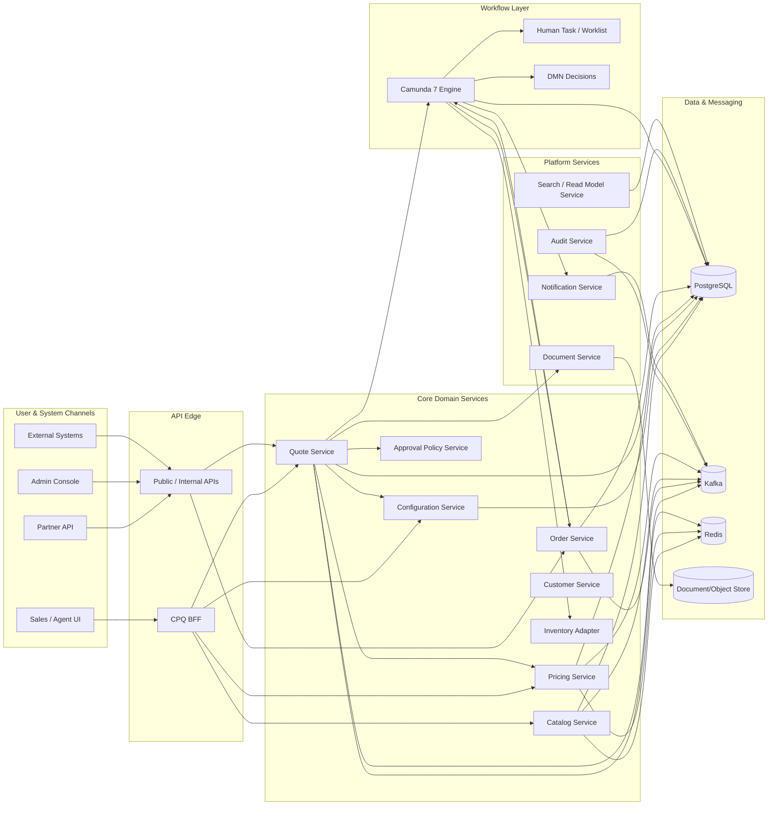
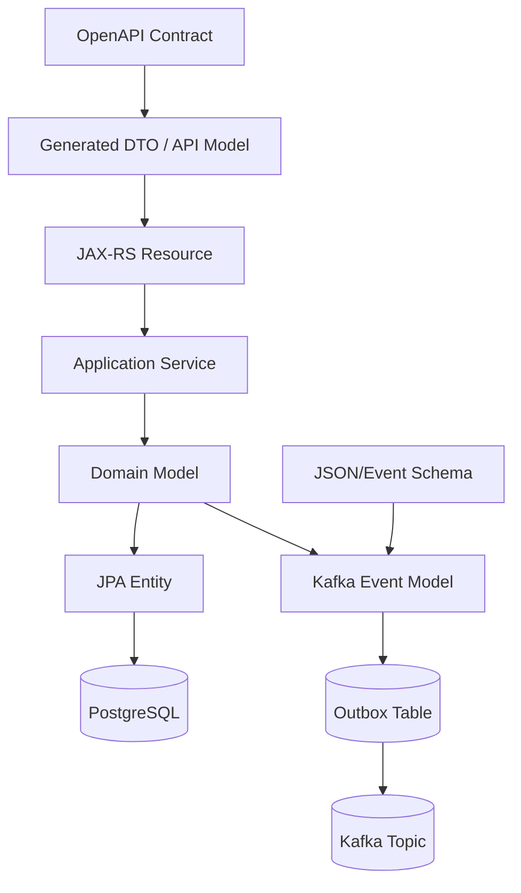
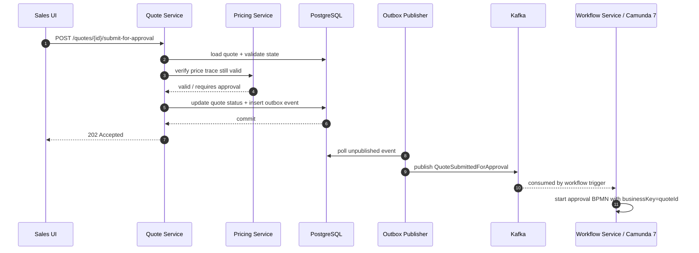
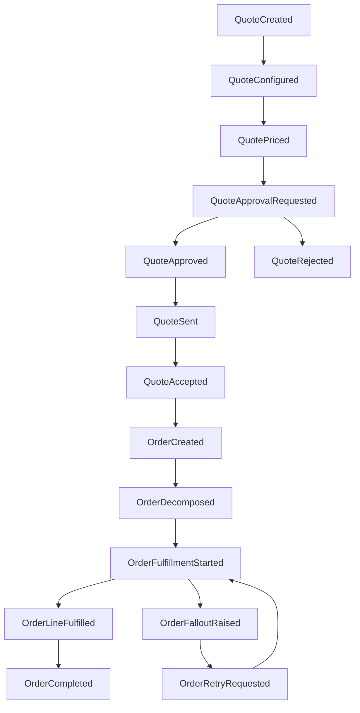
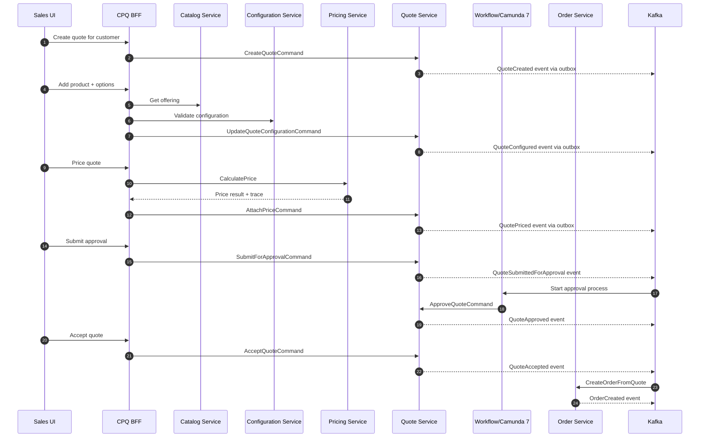

# Part 001 — System Scope and Architecture Map

Kita tidak sedang membangun aplikasi quote sederhana. Kita sedang membangun **platform CPQ + OMS enterprise-grade**: sistem yang menangani konfigurasi produk, pricing, approval, quotation, acceptance, order capture, orchestration, fulfillment coordination, audit, exception handling, dan integration event ke sistem lain.

Perbedaan utamanya ada di sini:

> Playground project fokus pada “fitur jalan”. Enterprise platform fokus pada “fitur tetap benar ketika data berubah, user bersamaan, approval berbeda, integrasi gagal, order sebagian sukses, proses tertunda, dan auditor bertanya enam bulan kemudian”.

Part ini adalah peta medan. Setelah part ini kamu harus punya gambaran jelas tentang:

1. sistem apa yang akan dibangun,
2. batas mana yang sengaja tidak kita bangun,
3. service apa saja yang dibutuhkan,
4. data apa yang menjadi source of truth,
5. bagaimana OpenAPI, Schema-first, Jersey, EclipseLink, PostgreSQL, Camunda 7, Kafka, dan Redis ditempatkan secara masuk akal,
6. invariant apa yang harus dijaga sejak awal.

Kita mulai dari scope, bukan dari framework.

---

## 1. Problem Statement

Platform yang akan kita bangun melayani proses:

```text
product catalog → configure → price → quote → approve → accept → order → orchestrate → fulfill → close/fallout
```

Dalam dunia enterprise, proses ini hampir tidak pernah lurus. Contohnya:

- produk bisa berupa bundle dengan dependency dan incompatibility,
- harga bisa punya discount, surcharge, contract price, promotion, tax placeholder, dan manual override,
- quote bisa direvisi berkali-kali,
- approval bisa tergantung margin, discount, region, customer segment, product risk, dan sales hierarchy,
- order bisa dipecah menjadi beberapa fulfillment item,
- fulfillment bisa sebagian sukses dan sebagian gagal,
- proses bisa butuh manual intervention,
- event harus dikirim ke CRM, Billing, Inventory, ERP, Notification, dan Data Platform,
- semua keputusan penting harus bisa dijelaskan ulang.

Sistem seperti ini tidak bisa dimodelkan sebagai CRUD biasa.

Salah satu kesalahan paling mahal dalam CPQ/OMS adalah memperlakukan quote seperti shopping cart dan order seperti row header-detail biasa. Untuk sistem kecil, mungkin cukup. Untuk sistem enterprise, itu biasanya menjadi sumber bug lifecycle, pricing drift, data audit lemah, dan proses recovery yang kacau.

---

## 2. Target System yang Akan Dibangun

Kita akan membangun reference implementation dengan karakteristik berikut:

- **Java microservices** sebagai runtime utama.
- **OpenAPI-first** untuk HTTP API contract.
- **Schema-first** untuk payload, command, event, dan validation contract.
- **JAX-RS/Jersey** untuk REST resource layer.
- **PostgreSQL** sebagai transactional source of truth.
- **JPA EclipseLink** untuk persistence mapping di service yang cocok memakai ORM.
- **Camunda 7** untuk BPMN/DMN workflow orchestration.
- **Kafka** untuk integration events dan asynchronous propagation.
- **Redis** untuk cache, TTL-based ephemeral state, idempotency helper, dan read optimization tertentu.
- **Outbox pattern** untuk menghubungkan transaksi database dan event publishing.
- **Operational control plane** untuk admin, replay, compensation, incident visibility, dan recovery.

Yang kita bangun bukan hanya code, tetapi **sistem berpikir**: bagaimana memutuskan boundary, data ownership, consistency model, failure behavior, dan observability.

---

## 3. Non-Goals

Agar pembelajaran tajam, beberapa hal sengaja tidak menjadi fokus utama:

| Area | Tidak Menjadi Fokus | Alasannya |
|---|---|---|
| Basic Java | Syntax, OOP dasar, collection dasar | Sudah diasumsikan dikuasai. |
| Basic SQL/PostgreSQL | SELECT/JOIN/index dasar | Seri ini memakai PostgreSQL untuk desain sistem, bukan tutorial SQL dari nol. |
| Basic Kafka | Producer/consumer hello world | Fokus kita adalah event architecture CPQ/OMS. |
| Basic Redis | SET/GET/cache sederhana | Fokus pada boundary penggunaan Redis di sistem enterprise. |
| UI detail | Pixel-perfect frontend | Kita hanya bahas BFF dan user journey kritikal. |
| Full billing engine | Invoice, tax final, payment reconciliation | Billing adalah downstream boundary, bukan inti CPQ/OMS. |
| Full ERP | Procurement/accounting/warehouse lengkap | Kita cukup desain integration boundary. |
| Camunda 8 migration deep dive | Zeebe, Operate, Tasklist, connectors | Seri ini fokus Camunda 7; migration fence dibahas nanti. |

Non-goal bukan berarti tidak penting. Non-goal berarti tidak boleh mengaburkan inti pembelajaran.

---

## 4. First Architecture Sketch

Secara kasar, sistem kita akan terlihat seperti ini:



Diagram ini belum final. Di part berikutnya kita akan menguji apakah boundary-nya benar dari domain lifecycle.

Untuk sekarang, simpan satu prinsip:

> Service boundary tidak boleh ditentukan dari tabel database. Service boundary harus ditentukan dari ownership atas keputusan bisnis, lifecycle, invariant, dan failure mode.

---

## 5. Capability Map

Sebelum bicara service, kita bicara capability.

Capability adalah kemampuan bisnis atau teknis yang harus ada agar sistem bisa menjalankan quote-to-order secara defensible.

| Capability | Tanggung Jawab | Contoh Keputusan |
|---|---|---|
| Product Catalog | Menyediakan produk, offering, bundle, attribute, constraint metadata | Produk A boleh dijual ke segment X? |
| Configuration | Memvalidasi kombinasi pilihan produk | Option B wajib jika product C dipilih? |
| Pricing | Menghitung price component, discount, surcharge, override, trace | Discount 15% valid atau butuh approval? |
| Quote Management | Mengelola lifecycle commercial proposal | Quote boleh diedit setelah approved? |
| Approval | Menentukan apakah quote perlu approval dan siapa approver | Margin rendah harus approval level berapa? |
| Order Management | Mengubah accepted quote menjadi fulfillment intent | Quote version mana yang menjadi order? |
| Workflow Orchestration | Mengatur proses long-running, retry, task, escalation | Kalau inventory gagal, retry atau fallout? |
| Inventory Integration | Mengecek availability dan reservation | Stock cukup untuk semua order line? |
| Document Generation | Membuat proposal/quote artifact immutable | PDF memakai template versi apa? |
| Notification | Mengirim pesan ke user/system | Approval reminder kapan dikirim? |
| Audit | Mencatat perubahan, keputusan, dan alasan | Siapa override harga? Kenapa? |
| Search/Read Model | Menyediakan query lintas entity untuk UI/ops | Tampilkan order stuck 24 jam terakhir. |
| Admin Control Plane | Mengelola config, rule, process, recovery | Re-run failed event / fix stuck process. |

Dari capability map, baru kita turunkan service map.

---

## 6. Proposed Service Boundary

Kita akan mulai dengan boundary seperti ini:

| Service | Primary Ownership | Bukan Tanggung Jawabnya |
|---|---|---|
| `catalog-service` | Product offering, product spec, bundle metadata, catalog version | Menghitung final price. |
| `configuration-service` | Configuration validation, compatibility, dependency graph | Menyimpan quote lifecycle. |
| `pricing-service` | Price calculation, price trace, discount rule, surcharge | Approval workflow execution. |
| `quote-service` | Quote aggregate, quote line, quote lifecycle, revision, acceptance | Fulfillment orchestration. |
| `approval-policy-service` | Approval requirement, approval matrix, approval decision support | Human task execution. |
| `order-service` | Order aggregate, order line, order lifecycle, decomposition result | Catalog authoring. |
| `workflow-service` | BPMN deployment, process start/correlation helper, workflow facade | Menjadi source of truth semua domain state. |
| `document-service` | Quote/order document generation and artifact metadata | Mengubah price atau order. |
| `notification-service` | Notification template, delivery attempt, retry | Menentukan business approval. |
| `audit-service` | Append-only audit and decision trail | Menjadi transactional source untuk quote/order. |
| `search-service` | Denormalized read model for search and ops | Menjadi source of truth. |
| `admin-service` | Operational command, replay, config view, recovery UI API | Bypass invariant domain. |

Boundary ini tidak sempurna. Ia adalah starting point. Sepanjang seri, kita akan menguji boundary ini dengan skenario nyata.

---

## 7. Core Architectural Invariants

Sebelum menulis code, kita butuh invariant. Invariant adalah aturan yang tidak boleh dilanggar walau sistem sedang sibuk, event telat, user klik dua kali, atau service downstream gagal.

### 7.1 Quote Invariants

1. Quote memiliki identity stabil.
2. Quote revision bersifat eksplisit.
3. Accepted quote harus menunjuk ke satu quote revision yang immutable.
4. Harga yang ditampilkan ke customer harus bisa direkonstruksi.
5. Manual override harus menyimpan actor, reason, timestamp, dan policy impact.
6. Quote yang sudah accepted tidak boleh diam-diam berubah karena catalog atau price rule berubah.
7. Quote expiry harus deterministic.
8. Approval decision harus terikat pada quote revision, bukan hanya quote header.

### 7.2 Order Invariants

1. Order berasal dari accepted quote atau valid order capture command.
2. Order harus punya commercial snapshot yang cukup untuk audit.
3. Fulfillment boleh asynchronous, tetapi order identity dan line identity harus stabil.
4. Order status harus merepresentasikan progress aggregate, bukan sekadar status teknis workflow.
5. Duplicate submit tidak boleh membuat order ganda.
6. Cancellation/amendment harus lewat command yang terkontrol.
7. Partial failure harus terlihat dan recoverable.

### 7.3 Pricing Invariants

1. Setiap price result punya price trace.
2. Rounding rule harus konsisten.
3. Discount manual harus dibedakan dari discount rule-based.
4. Price calculation harus version-aware.
5. Pricing cache tidak boleh menjadi source of truth.
6. Reprice harus menghasilkan revision/trace baru, bukan menimpa jejak lama tanpa alasan.

### 7.4 Workflow Invariants

1. Workflow process instance bukan pengganti domain aggregate.
2. Business key harus bisa menghubungkan process instance dengan quote/order.
3. Task completion harus idempotent dari sudut pandang domain command.
4. Retry teknis tidak boleh menciptakan side effect bisnis ganda.
5. Incident harus dapat diklasifikasikan: transient, data issue, integration issue, policy issue, human issue.

### 7.5 Event Invariants

1. Event yang sudah dipublish tidak boleh diubah.
2. Event harus menyatakan fakta yang sudah terjadi, bukan harapan.
3. Event consumer harus idempotent.
4. Event schema harus versioned.
5. Outbox record harus berada dalam transaksi yang sama dengan perubahan aggregate.
6. Replay tidak boleh merusak state saat ini.

Invariant ini akan terus muncul. Kalau kamu bisa menjaga invariant ini, desain sistemmu naik kelas.

---

## 8. Why Camunda 7 Is in the Architecture

Camunda 7 kita gunakan bukan karena semua hal harus jadi BPMN. Kita gunakan karena CPQ/OMS punya proses long-running yang natural:

- quote approval,
- discount exception handling,
- order orchestration,
- fulfillment retry,
- manual fallout,
- escalation,
- SLA monitoring,
- compensation,
- operational recovery.

Namun ada batas penting:

> Camunda mengorkestrasi proses. Domain service tetap menjaga invariant domain.

Jangan menaruh semua logic bisnis di BPMN. BPMN bagus untuk alur, dependency, wait state, retry, task, escalation, dan compensation. Tetapi validasi aggregate, consistency rule, dan domain transition harus tetap berada di service domain.

### 8.1 Camunda 7 Placement

Ada beberapa pola deployment:

| Pola | Deskripsi | Kapan Cocok |
|---|---|---|
| Embedded engine per service | Engine berjalan di aplikasi service | Cocok untuk service ownership kuat, tetapi operasional bisa tersebar. |
| Shared workflow service | Camunda engine sebagai service terpisah | Cocok untuk platform orchestration yang dipakai quote/order. |
| Remote engine via REST | Service domain memanggil Camunda REST | Cocok jika ingin domain service tidak embed engine. |

Untuk seri ini, baseline kita:

```text
workflow-service owns Camunda 7 engine integration
quote-service/order-service own domain state
Camunda process instance references business key
external task/service task calls domain commands
```

Artinya, workflow-service bukan “God service”. Ia hanya memfasilitasi orchestration.

---

## 9. Why OpenAPI-first and Schema-first

CPQ/OMS adalah sistem lintas service, lintas tim, dan lintas channel. Kalau contract tidak eksplisit, integrasi menjadi rapuh.

OpenAPI-first berarti:

1. API contract ditulis sebelum implementation detail.
2. Endpoint, request, response, status code, error model, dan versioning didesain sebagai public contract.
3. Code generation boleh digunakan, tetapi generated code harus punya boundary jelas.
4. Breaking change harus terlihat di review.
5. Contract test menjadi quality gate.

Schema-first berarti:

1. payload event punya schema eksplisit,
2. command payload punya schema eksplisit,
3. validation rule di contract tidak tersembunyi di controller,
4. schema evolution dipikirkan sebelum production,
5. consumer bisa memvalidasi compatibility.

### 9.1 Contract Layers



Perhatikan boundary-nya:

- API DTO bukan domain model.
- JPA entity bukan domain model untuk semua kasus.
- Event payload bukan internal entity dump.
- OpenAPI contract bukan tempat semua business rule kompleks.

Contract-first bukan berarti contract menjadi domain. Contract adalah perjanjian integrasi.

---

## 10. Why PostgreSQL + EclipseLink JPA

PostgreSQL menjadi source of truth untuk aggregate penting:

- catalog version,
- product offering,
- configuration rule metadata,
- price rule metadata,
- quote,
- quote line,
- quote revision,
- order,
- order line,
- outbox,
- audit,
- workflow correlation metadata,
- read model tertentu.

EclipseLink JPA kita gunakan untuk service yang cocok dengan relational aggregate mapping. Tetapi kita tidak akan memakai ORM secara naif.

ORM akan bermasalah jika:

- aggregate terlalu besar,
- lazy loading bocor ke resource layer,
- entity dipakai sebagai API response,
- transaction boundary tidak jelas,
- cascade dipakai tanpa memahami ownership,
- optimistic locking diabaikan,
- query operasional dipaksa lewat object graph.

Prinsip kita:

```text
JPA for transactional aggregate persistence.
SQL/read model for operational query.
Outbox for reliable event handoff.
Explicit DTO for API and event contract.
```

---

## 11. Why Kafka

Kafka dipakai untuk menyebarkan fakta bisnis setelah transaksi domain selesai. Contoh event:

- `QuoteCreated`
- `QuoteConfigured`
- `QuotePriced`
- `QuoteApprovalRequested`
- `QuoteApproved`
- `QuoteAccepted`
- `OrderCreated`
- `OrderDecomposed`
- `OrderFulfillmentStarted`
- `OrderLineFulfilled`
- `OrderCompleted`
- `OrderFalloutRaised`

Kafka bukan pengganti database transactional. Kafka juga bukan tempat melempar command sembarangan agar service lain “nanti tahu sendiri”.

Pemisahan yang akan kita gunakan:

| Type | Makna | Contoh |
|---|---|---|
| Command | Permintaan melakukan sesuatu | `SubmitQuoteForApprovalCommand` |
| Event | Fakta yang sudah terjadi | `QuoteSubmittedForApproval` |
| Query | Permintaan membaca state | `GetQuoteById` |
| Notification | Pesan delivery ke manusia/sistem | `ApprovalReminderEmailRequested` |

Dalam desain enterprise, membedakan command dan event bukan formalitas. Ini mencegah sistem menjadi tidak deterministik.

---

## 12. Why Redis

Redis dipakai untuk state yang **boleh hilang atau bisa dibangun ulang**, atau state ephemeral yang memang punya TTL.

Contoh penggunaan yang masuk akal:

- catalog lookup cache,
- price preview cache,
- idempotency key dengan TTL,
- distributed rate limit,
- short-lived quote editing session marker,
- expensive rule result cache,
- temporary workflow correlation helper.

Contoh penggunaan yang berbahaya:

- menyimpan accepted quote final hanya di Redis,
- menjadikan Redis sebagai source of truth approval,
- distributed lock untuk menutupi desain transaction yang buruk,
- cache tanpa invalidation event,
- TTL yang menghapus bukti audit.

Prinsipnya:

> Redis mempercepat dan membantu koordinasi sementara. PostgreSQL tetap menjaga kebenaran utama.

---

## 13. Runtime Transaction Model

Kita perlu membedakan transaksi lokal, workflow transaction, dan event propagation.



Hal penting:

- API response tidak harus menunggu semua downstream selesai.
- Commit database terjadi sebelum event dipublish.
- Event dipublish melalui outbox, bukan langsung dari memory setelah `entityManager.persist()`.
- Workflow dimulai berdasarkan event atau explicit command, tetapi harus tetap idempotent.
- Quote service tetap source of truth status quote.

---

## 14. System of Record vs System of Engagement vs System of Automation

Dalam CPQ/OMS, kita harus membedakan tiga peran:

| Peran | Contoh | Fungsi |
|---|---|---|
| System of Record | PostgreSQL per domain service | Menyimpan state otoritatif. |
| System of Engagement | UI/BFF/API | Interaksi user dan partner. |
| System of Automation | Camunda 7, Kafka consumers, schedulers | Menjalankan proses, reaksi, retry, escalation. |

Masalah besar muncul ketika system of automation dianggap system of record. Contoh buruk:

```text
Order dianggap completed karena BPMN token mencapai end event,
padahal order aggregate belum menyimpan semua fulfillment result.
```

Yang benar:

```text
BPMN mencapai step completion → memanggil order command → order aggregate transition ke COMPLETED → event OrderCompleted dipublish.
```

Workflow engine boleh menggerakkan proses, tetapi domain aggregate yang memutuskan state bisnis final.

---

## 15. Canonical User Journeys

Kita akan memakai beberapa journey sebagai test bed sepanjang seri.

### 15.1 Happy Path Quote-to-Order

```text
Sales creates quote
→ adds customer
→ selects product offering
→ configures product
→ validates configuration
→ prices quote
→ submits for approval
→ manager approves
→ sales sends quote document
→ customer accepts
→ order is created
→ order is decomposed
→ fulfillment succeeds
→ order is completed
```

### 15.2 Discount Exception

```text
Sales applies manual discount above threshold
→ pricing detects policy impact
→ quote requires approval
→ approval BPMN starts
→ approver requests justification
→ sales adds justification
→ approver approves/rejects
```

### 15.3 Expired Quote

```text
Quote priced on day 1
→ quote expires on day 15
→ customer attempts acceptance on day 20
→ system rejects acceptance
→ sales must reprice or create revision
```

### 15.4 Partial Fulfillment Fallout

```text
Order contains 3 lines
→ line 1 fulfilled
→ line 2 pending external inventory
→ line 3 fails due to invalid downstream data
→ order enters PARTIAL_FALLOUT
→ case worker fixes mapping
→ workflow retries line 3
→ order continues
```

### 15.5 Duplicate Submit

```text
User double-clicks Accept Quote
→ two requests arrive
→ idempotency key or aggregate guard prevents duplicate order
→ same result returned or conflict handled safely
```

These journeys are more valuable than abstract architecture diagrams. Architecture is correct only if it survives these journeys.

---

## 16. Domain Event Map

Awal event map:



Event map ini bukan sekadar dokumentasi. Ini akan menjadi dasar:

- topic design,
- outbox table,
- consumer idempotency,
- read model projection,
- audit trail,
- operational dashboard,
- replay policy.

---

## 17. Data Ownership Map

| Data | Owner Service | Read by | Update by |
|---|---|---|---|
| Product Offering | Catalog | Config, Pricing, Quote, BFF | Catalog only |
| Configuration Rule | Configuration | Quote, BFF | Configuration only |
| Price Rule | Pricing | Quote | Pricing only |
| Quote | Quote | BFF, Workflow, Search, Document | Quote only |
| Approval Policy | Approval Policy | Quote, Workflow | Approval Policy only |
| Process Instance | Workflow | Admin, Ops | Workflow/Camunda only |
| Order | Order | BFF, Workflow, Search | Order only |
| Audit Record | Audit | Admin, Compliance | Append-only via Audit |
| Search Projection | Search | BFF, Admin | Projection consumers |
| Document Artifact | Document | Quote, Order, BFF | Document only |

Jika service lain perlu data, ia harus membaca lewat API, event projection, atau replicated read model. Ia tidak boleh diam-diam join tabel milik service lain.

Dalam implementasi lokal/monorepo, mungkin semua tabel berada di satu PostgreSQL instance untuk kemudahan development. Tetapi secara ownership, schema harus diperlakukan terpisah.

---

## 18. First Repository Shape

Struktur awal:

```text
learn-enterprise-cpq-oms-camunda7/
  README.md
  docs/
    architecture/
      context-map.md
      adr/
      diagrams/
    api/
      openapi/
      schemas/
    process/
      bpmn/
      dmn/
  platform/
    docker-compose.yml
    postgres/
    kafka/
    redis/
    camunda7/
  services/
    catalog-service/
    configuration-service/
    pricing-service/
    quote-service/
    approval-policy-service/
    order-service/
    workflow-service/
    document-service/
    notification-service/
    audit-service/
    search-service/
    admin-service/
  libs/
    common-api/
    common-errors/
    common-observability/
    common-outbox/
    common-security/
  tests/
    contract-tests/
    integration-tests/
    e2e-scenarios/
    performance-tests/
```

Kita tidak mulai dari membuat semua service sekaligus. Kita mulai dari vertical slice:

```text
catalog → configuration → pricing → quote → approval workflow → order
```

Service lain muncul ketika dibutuhkan oleh lifecycle.

---

## 19. Build Order

Urutan implementasi akan seperti ini:

| Stage | Fokus | Output |
|---|---|---|
| 1 | Domain skeleton | Entity, value object, command, state machine. |
| 2 | Contract skeleton | OpenAPI, schema, generated DTO boundary. |
| 3 | Persistence skeleton | PostgreSQL schema, EclipseLink mapping, migration. |
| 4 | Quote vertical slice | Create/configure/price quote. |
| 5 | Approval workflow | BPMN/DMN quote approval. |
| 6 | Event outbox | Publish quote events reliably. |
| 7 | Order creation | Accepted quote → order aggregate. |
| 8 | Order orchestration | Camunda order fulfillment process. |
| 9 | Fallout and recovery | Incident, retry, manual fix, compensation. |
| 10 | Production readiness | Observability, testing, ops, performance, security. |

Ini sengaja bukan urutan “buat semua CRUD”. Kita membangun melalui skenario yang memaksa desain menjadi benar.

---

## 20. Architecture Fitness Functions

Architecture fitness function adalah cara menguji apakah arsitektur masih sehat.

Untuk seri ini, fitness function awal:

| Fitness Function | Cara Menguji |
|---|---|
| API compatibility | Contract diff tidak boleh breaking tanpa version bump. |
| Event compatibility | Schema evolution test harus lulus. |
| Quote immutability | Accepted quote revision tidak berubah setelah catalog update. |
| Pricing traceability | Setiap displayed price punya trace. |
| Idempotent order creation | Duplicate acceptance tidak menciptakan order ganda. |
| Workflow-domain separation | Process completion tidak langsung dianggap domain completion. |
| Outbox reliability | DB commit tanpa event publish bisa dipulihkan oleh publisher. |
| Consumer idempotency | Replay event tidak menggandakan side effect. |
| Audit completeness | Approval/override/acceptance punya actor, timestamp, reason/context. |
| Operational recovery | Failed fulfillment bisa masuk fallout dan dilanjutkan. |

Kalau fitur baru merusak salah satu fitness function ini, fitur itu belum production-grade.

---

## 21. Failure Classes

Enterprise platform harus mengklasifikasikan failure.

| Failure Class | Contoh | Respons Sistem |
|---|---|---|
| Validation failure | Product option tidak valid | Reject command, return 400/domain error. |
| Business conflict | Quote sudah accepted, masih diedit | Reject transition, return conflict. |
| Policy failure | Discount butuh approval | Move lifecycle ke approval required. |
| Transient technical failure | Inventory timeout | Retry with budget. |
| Persistent integration failure | Downstream rejects payload | Fallout/manual intervention. |
| Duplicate command | Double submit order | Idempotent result / safe conflict. |
| Data corruption | Missing required historical snapshot | Block process, raise incident. |
| Workflow incident | Job failed repeatedly | Incident queue + recovery action. |
| Event poison | Consumer cannot parse/process event | DLQ + schema/data investigation. |

Failure classification harus muncul di code, API error model, BPMN incident, logs, metrics, dan runbook.

---

## 22. The First Slice We Will Eventually Build

Minimal production-shaped slice:



Setiap step ini akan punya:

- API contract,
- command model,
- domain validation,
- persistence transaction,
- outbox event,
- audit trail,
- idempotency consideration,
- failure behavior.

---

## 23. Anti-Patterns yang Akan Kita Hindari

| Anti-Pattern | Kenapa Berbahaya | Alternatif |
|---|---|---|
| Quote as cart | Tidak cukup untuk revision, approval, expiry, trace | Quote as commercial proposal aggregate. |
| Order as copied quote | Fulfillment lifecycle berbeda dari quote lifecycle | Order as fulfillment intent with commercial snapshot. |
| BPMN owns all state | Sulit audit domain dan integrasi | Domain aggregate owns state; BPMN orchestrates. |
| Entity exposed as API | Contract bocor dan migration sulit | DTO/API model explicit. |
| Event as entity dump | Coupling tinggi dan schema rapuh | Purpose-built integration event. |
| Cache as truth | Data hilang/stale merusak bisnis | PostgreSQL as truth, Redis as acceleration. |
| Direct DB access across service | Ownership rusak | API/event/read model. |
| Approval hardcoded in controller | Policy tidak auditable dan sulit berubah | Approval policy + DMN/process. |
| Retry everywhere | Side effect ganda | Retry budget + idempotency + failure class. |
| Search from OLTP aggregate tables only | Query lambat dan coupling UI | Projection/read model. |

---

## 24. Decision Log Awal

| Decision | Baseline | Rationale |
|---|---|---|
| API style | REST with OpenAPI-first | Cocok untuk internal/external integration contract. |
| REST implementation | JAX-RS/Jersey | Explicit resource/filter/mapper model. |
| Persistence | PostgreSQL + EclipseLink JPA | Relational transactional core dengan ORM terkendali. |
| Workflow | Camunda 7 | Cocok untuk BPMN/DMN, human task, long-running process. |
| Events | Kafka + outbox | Reliable asynchronous propagation. |
| Cache | Redis | Ephemeral cache/idempotency/rate-limit helper. |
| Service decomposition | Domain capability boundary | Menghindari table-driven microservices. |
| Source of truth | Per-service PostgreSQL schema | Ownership jelas meski development pakai satu instance. |
| Search | Projection/read model | Menghindari query lintas aggregate yang mahal. |
| Audit | Dedicated append-oriented audit model | Regulatory defensibility. |

Decision ini belum final selamanya. Tetapi setiap perubahan harus lewat alasan arsitektural, bukan preferensi tool.

---

## 25. What “Good” Looks Like

Part ini berhasil jika kamu bisa menjelaskan sistem tanpa menyebut framework lebih dulu.

Ciri pemahaman yang benar:

- Kamu tahu beda catalog, configuration, pricing, quote, order, workflow, dan fulfillment.
- Kamu tahu kenapa quote harus punya revision dan price trace.
- Kamu tahu kenapa accepted quote harus immutable.
- Kamu tahu kenapa order bukan sekadar copy quote.
- Kamu tahu kenapa Camunda tidak boleh menjadi domain database.
- Kamu tahu kenapa Kafka event harus keluar dari outbox.
- Kamu tahu kenapa Redis tidak boleh menjadi source of truth.
- Kamu tahu kenapa OpenAPI DTO tidak boleh langsung menjadi JPA entity.
- Kamu tahu failure mana yang harus diretry, mana yang harus menjadi fallout, dan mana yang harus ditolak.

Kalau ini belum terasa natural, jangan lompat ke code dulu. CPQ/OMS enterprise gagal paling sering bukan karena kurang code, tetapi karena model awalnya salah.

---

## 26. Latihan Desain

Sebelum lanjut, jawab sendiri pertanyaan ini:

1. Jika product catalog berubah setelah quote dikirim ke customer, apakah quote lama berubah?
2. Jika discount rule berubah setelah quote approved, apakah approval lama masih valid?
3. Jika customer klik accept dua kali, apa yang mencegah order ganda?
4. Jika Camunda process instance selesai tetapi order aggregate gagal update, state mana yang dipercaya?
5. Jika Kafka consumer memproses event yang sama dua kali, apa yang terjadi?
6. Jika Redis kehilangan semua key, fitur mana yang boleh terganggu dan fitur mana yang tidak boleh rusak?
7. Jika approver menyetujui quote revision 3, lalu sales membuat revision 4, approval itu masih berlaku?
8. Jika order line 2 gagal fulfillment tetapi line 1 sukses, apakah order failed, partial, atau completed?
9. Jika price calculation memakai data catalog version 10, apa yang harus disimpan di price trace?
10. Jika auditor meminta alasan manual discount enam bulan kemudian, data apa yang harus tersedia?

Pertanyaan ini akan menjadi benang merah seri.

---

## 27. Summary

Kita sudah menetapkan peta awal:

- sistem adalah platform CPQ/OMS enterprise-grade,
- domain lifecycle lebih penting daripada framework,
- service boundary mengikuti capability dan invariant,
- PostgreSQL menjadi source of truth,
- EclipseLink JPA dipakai secara terkendali,
- OpenAPI/Schema-first menjaga contract,
- Camunda 7 mengorkestrasi proses long-running,
- Kafka menyebarkan fakta bisnis secara asynchronous,
- Redis membantu cache/ephemeral coordination, bukan truth,
- audit, idempotency, failure classification, dan recovery adalah bagian inti sejak awal.

Di part berikutnya kita masuk lebih dalam ke domain: **CPQ/OMS Domain From First Principles**. Kita akan membongkar apa sebenarnya product, configuration, price, quote, order, fulfillment, dan lifecycle—tanpa terjebak dalam istilah vendor atau template CRUD.

---

## References

- Camunda 7 Enterprise support announcements and Camunda 7.24 LTS lifecycle: <https://docs.camunda.org/enterprise/announcement/>
- Camunda release policy: <https://docs.camunda.org/enterprise/release-policy/>
- OpenAPI Specification v3.2.0: <https://spec.openapis.org/oas/v3.2.0.html>
- Jakarta RESTful Web Services 4.0: <https://jakarta.ee/specifications/restful-ws/4.0/>
- Jakarta Persistence specification: <https://jakarta.ee/specifications/persistence/>
- EclipseLink project: <https://projects.eclipse.org/projects/ee4j.eclipselink>
- Apache Kafka documentation: <https://kafka.apache.org/documentation/>
- Redis data type documentation: <https://redis.io/docs/latest/develop/data-types/>
- PostgreSQL official site and documentation: <https://www.postgresql.org/docs/>
