# Part 002 — CPQ/OMS Domain From First Principles

Di part sebelumnya kita membuat peta arsitektur. Sekarang kita turun ke akar masalah: **apa sebenarnya domain CPQ/OMS?**

Kita akan sengaja menunda pembahasan framework. Bukan karena framework tidak penting, tetapi karena framework tidak bisa menyelamatkan domain model yang salah.

CPQ/OMS enterprise adalah domain yang terlihat sederhana dari luar:

```text
Configure → Price → Quote → Order
```

Tetapi di dalamnya ada banyak keputusan penting:

- Apa beda product, offering, bundle, option, dan configuration?
- Apa beda price, charge, discount, tax placeholder, margin, dan total?
- Apa beda quote, cart, proposal, contract draft, dan order?
- Kapan quote boleh diedit?
- Kapan harga harus dikunci?
- Kapan approval lama menjadi invalid?
- Apa yang sebenarnya terjadi saat quote accepted?
- Mengapa order tidak boleh dianggap sekadar copy quote?
- Mengapa fulfillment failure tidak selalu berarti order failed?

Jika pertanyaan ini belum dijawab, microservices hanya akan memperbanyak kekacauan.

---

## 1. The Real Shape of CPQ/OMS

CPQ/OMS bukan satu proses linear. Ia adalah gabungan dari beberapa model:

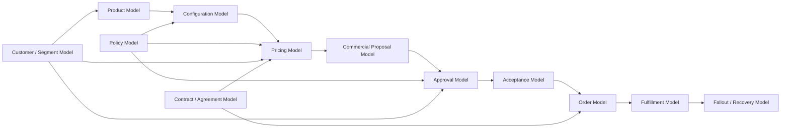

Satu command user sering menyentuh banyak model. Contoh: “Apply discount 20%” bisa berdampak ke pricing, margin, approval, quote revision, audit, dan document.

Karena itu, domain model harus memisahkan:

1. **apa yang dijual**,
2. **bagaimana ia dikonfigurasi**,
3. **berapa harganya dan kenapa**,
4. **proposal komersial apa yang diberikan ke customer**,
5. **siapa yang harus menyetujui**,
6. **apa yang customer terima**,
7. **apa yang harus dipenuhi oleh operasi**.

Sistem yang gagal biasanya mencampur semua ini dalam satu objek bernama `QuoteLine` atau `OrderItem`.

---

## 2. Domain Vocabulary

Kita mulai dengan vocabulary yang stabil.

| Term | Makna | Catatan Penting |
|---|---|---|
| Product Specification | Definisi teknis/logis dari produk | Contoh: broadband, SIM card, cloud VM, support package. |
| Product Offering | Produk yang dapat dijual dalam konteks pasar tertentu | Mengikat spec dengan commercial metadata. |
| Bundle | Kombinasi offering yang dijual bersama | Bisa mandatory/optional. |
| Option | Pilihan dalam konfigurasi | Contoh speed, region, storage size, support level. |
| Attribute | Nilai karakteristik produk/configuration | Bisa user-provided atau derived. |
| Eligibility | Apakah customer/channel/region boleh membeli offering | Bukan pricing, tetapi gating. |
| Configuration | Hasil pilihan user terhadap product offering | Harus valid terhadap constraint. |
| Price Rule | Aturan kalkulasi harga | Bisa versioned dan context-aware. |
| Price Component | Bagian harga yang bisa dijelaskan | Base price, discount, surcharge, fee. |
| Price Trace | Jejak mengapa harga menjadi demikian | Wajib untuk audit dan dispute. |
| Quote | Proposal komersial kepada customer | Bukan order dan bukan cart biasa. |
| Quote Revision | Versi eksplisit dari quote | Approval harus terkait revision. |
| Approval | Keputusan otorisasi terhadap proposal | Biasanya policy-driven. |
| Acceptance | Tindakan customer menerima quote tertentu | Mengunci commercial basis untuk order. |
| Order | Intent untuk memenuhi apa yang sudah diterima | Memiliki lifecycle fulfillment. |
| Order Line | Unit fulfillment/commercial item dalam order | Tidak selalu 1:1 dengan quote line. |
| Decomposition | Pemecahan order menjadi action fulfillment | Bisa menghasilkan technical order/sub-order. |
| Fulfillment | Eksekusi pemenuhan produk/layanan | Bisa asynchronous dan partial. |
| Fallout | Kondisi gagal yang butuh recovery | Bukan sekadar exception teknis. |
| Amendment | Perubahan terhadap order/agreement aktif | Bukan edit bebas. |
| Renewal | Perpanjangan commercial agreement | Bisa reprice dan reapproval. |

Vocabulary ini akan kita jadikan bahasa seri. Kalau istilahnya kabur, desainnya ikut kabur.

---

## 3. CPQ Is Not a Cart

Shopping cart biasanya punya mental model:

```text
cart = temporary container of items before checkout
```

Quote enterprise punya mental model berbeda:

```text
quote = versioned commercial proposal with configuration, price, terms, approval, expiry, and audit trail
```

Perbedaannya besar.

| Aspek | Cart | Enterprise Quote |
|---|---|---|
| Tujuan | Menampung item sementara | Proposal komersial defensible |
| Lifecycle | Add/remove/checkout | Draft/configured/priced/approved/sent/accepted/expired |
| Revision | Biasanya tidak eksplisit | Wajib eksplisit |
| Approval | Jarang | Sering kompleks |
| Price Trace | Minimal | Wajib |
| Expiry | Sederhana | Terkait validity, policy, contract, pricing |
| Audit | Rendah | Tinggi |
| Document | Tidak selalu | Proposal artifact penting |
| Legal/Commercial Weight | Rendah | Bisa tinggi |

Jika quote dimodelkan seperti cart, beberapa masalah akan muncul:

- quote lama berubah saat catalog berubah,
- approval berlaku untuk data yang sudah berubah,
- customer menerima proposal yang tidak sama dengan yang diapprove,
- audit tidak bisa menjelaskan harga,
- order dibuat dari state yang tidak stabil.

Jadi sejak awal kita harus menganggap quote sebagai aggregate yang punya lifecycle dan revision.

---

## 4. Product Model: What Can Be Sold

Product model menjawab pertanyaan:

> Apa yang bisa dijual, kepada siapa, dalam kombinasi apa, dan dengan pilihan apa?

Product model minimal:

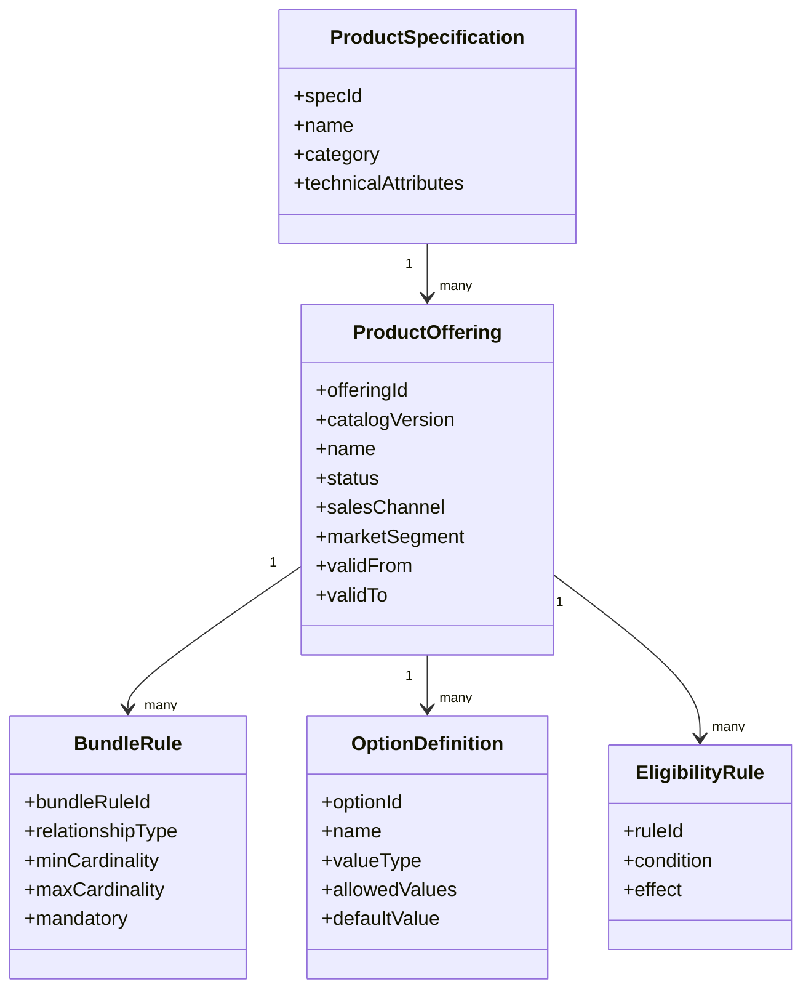

### 4.1 Specification vs Offering

Product specification adalah definisi produk. Product offering adalah produk yang benar-benar dijual dalam konteks commercial.

Contoh:

```text
Product Specification:
  Fiber Internet Service

Product Offerings:
  Fiber 100 Mbps - Residential - Jakarta
  Fiber 500 Mbps - Residential - Jakarta
  Fiber 1 Gbps - Enterprise - Jakarta
  Fiber 500 Mbps - Partner Channel Promo
```

Mengapa harus dipisah?

Karena satu produk teknis bisa punya banyak cara dijual. Jika tidak dipisah, catalog akan menjadi campuran antara engineering product, market package, promo, eligibility, dan pricing.

### 4.2 Catalog Version

Catalog harus versioned.

Tanpa catalog version, quote lama sulit direkonstruksi. Contoh:

```text
Customer menerima quote tanggal 1.
Catalog berubah tanggal 5.
Auditor bertanya tanggal 20: kenapa quote menampilkan option X?
```

Jawaban yang benar harus bisa menunjuk:

```text
Quote revision 3 menggunakan catalog version 2026.07.01.
Offering FIBER-500-JKT saat itu memiliki option router-premium=true.
```

Tanpa versioning, sistem hanya bisa menebak.

---

## 5. Configuration Model: What Is Chosen

Configuration menjawab:

> Dari offering yang tersedia, kombinasi pilihan apa yang customer pilih, dan apakah kombinasi itu valid?

Configuration bukan sekadar list option. Ia adalah hasil keputusan yang harus bisa divalidasi.

Contoh konfigurasi:

```json
{
  "offeringId": "fiber-enterprise-bundle",
  "catalogVersion": "2026.07.01",
  "attributes": {
    "bandwidth": "1Gbps",
    "staticIp": true,
    "router": "managed-premium",
    "supportLevel": "24x7",
    "contractTermMonths": 24
  }
}
```

Validasi konfigurasi bisa meliputi:

- `1Gbps` hanya tersedia di area tertentu,
- `managed-premium router` wajib untuk bandwidth di atas `500Mbps`,
- `24x7 support` hanya untuk customer enterprise,
- contract term 24 bulan membuka discount tertentu,
- static IP maksimal 8 untuk package tertentu,
- option A incompatible dengan option B.

### 5.1 Configuration as Constraint Problem

Mental model yang berguna:

```text
configuration = selected values + constraint graph + validation result + explanation
```

Bukan hanya:

```text
configuration = map<string, string>
```

Kita butuh explanation karena user enterprise perlu tahu kenapa pilihan ditolak.

Contoh error buruk:

```text
Invalid configuration.
```

Contoh error baik:

```text
Router 'basic' is not allowed when bandwidth is '1Gbps'.
Use 'managed-premium' or lower bandwidth to 500Mbps.
```

### 5.2 Configuration State

Configuration bisa punya state:

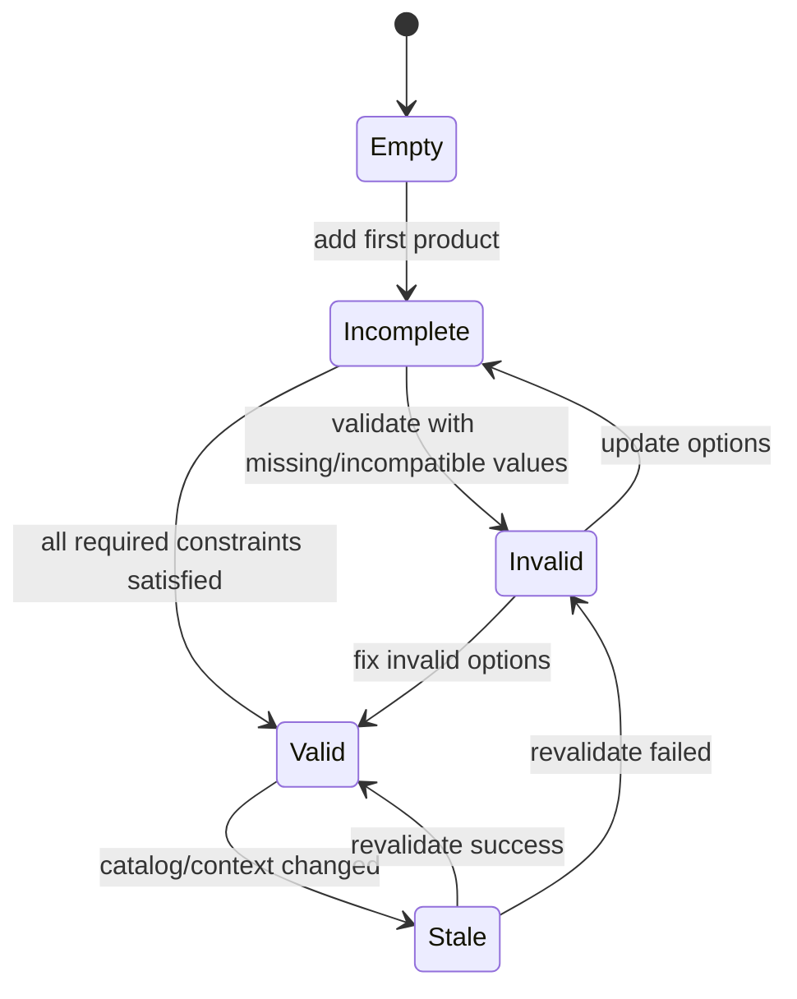

State `Stale` penting. Enterprise system sering punya long-running quote. Quote bisa dibuat hari ini, diproses minggu depan. Context bisa berubah.

---

## 6. Pricing Model: Why the Number Is the Number

Pricing menjawab:

> Berapa harga proposal ini, dan mengapa angka itu muncul?

Harga bukan hanya total.

Harga enterprise biasanya terdiri dari:

- base recurring charge,
- one-time charge,
- installation fee,
- discount rule,
- manual discount,
- surcharge,
- promotion,
- contract commitment,
- rounding,
- tax placeholder,
- margin indicator,
- approval impact.

Minimal price model:

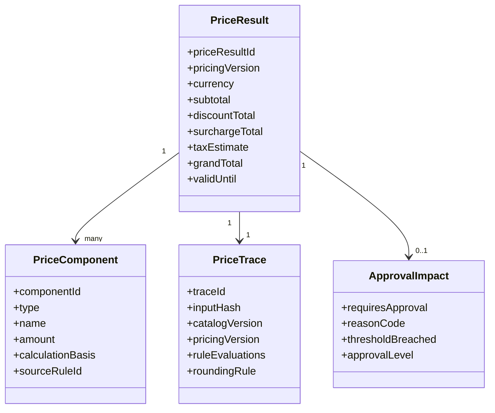

### 6.1 Price Result Must Be Reproducible Enough

Kita tidak selalu harus bisa menjalankan ulang engine lama secara identik selamanya. Tetapi kita harus menyimpan cukup data untuk menjelaskan hasil.

Minimal yang harus disimpan:

- pricing version,
- catalog version,
- input configuration snapshot/hash,
- customer segment/context,
- rule IDs yang berlaku,
- price components,
- manual override reason,
- rounding rule,
- validity period,
- approval impact.

Tanpa price trace, dispute harga menjadi debat opini.

### 6.2 Price Lock vs Price Preview

Bedakan:

| Jenis Harga | Makna | Boleh Dipakai untuk Order? |
|---|---|---|
| Price Preview | Estimasi cepat untuk UI | Tidak langsung. |
| Calculated Price | Hasil resmi kalkulasi pada quote revision | Bisa jika masih valid. |
| Approved Price | Harga yang sudah melewati approval | Bisa jika quote revision sama dan belum expired. |
| Accepted Price | Harga yang diterima customer | Menjadi dasar order/commercial snapshot. |

Ini mencegah bug seperti:

```text
UI menampilkan preview dari cache,
lalu order dibuat memakai preview itu tanpa kalkulasi resmi.
```

---

## 7. Quote Model: Commercial Proposal Aggregate

Quote menjawab:

> Proposal komersial apa yang sedang diajukan kepada customer, dalam versi mana, dengan konfigurasi dan harga apa, dan status lifecycle apa?

Quote aggregate minimal:

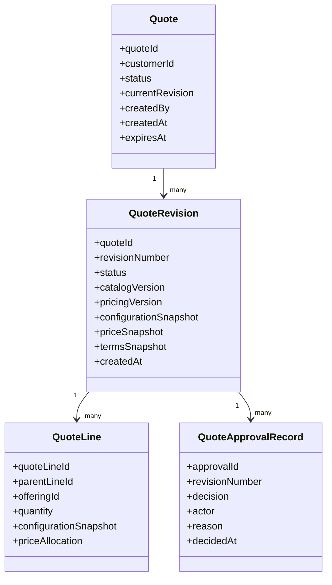

### 7.1 Quote Revision Is Not Optional

Revision adalah cara kita menjaga kebenaran.

Contoh:

```text
Revision 1: Sales membuat quote.
Revision 2: Sales mengubah bandwidth.
Revision 3: Pricing dihitung ulang.
Revision 4: Manager approve discount.
Revision 5: Sales mengubah discount lagi.
```

Apakah approval revision 4 masih berlaku untuk revision 5?

Biasanya tidak. Karena objek yang disetujui sudah berubah.

Tanpa revision, sistem sulit menjawab.

### 7.2 Quote Status

State awal:

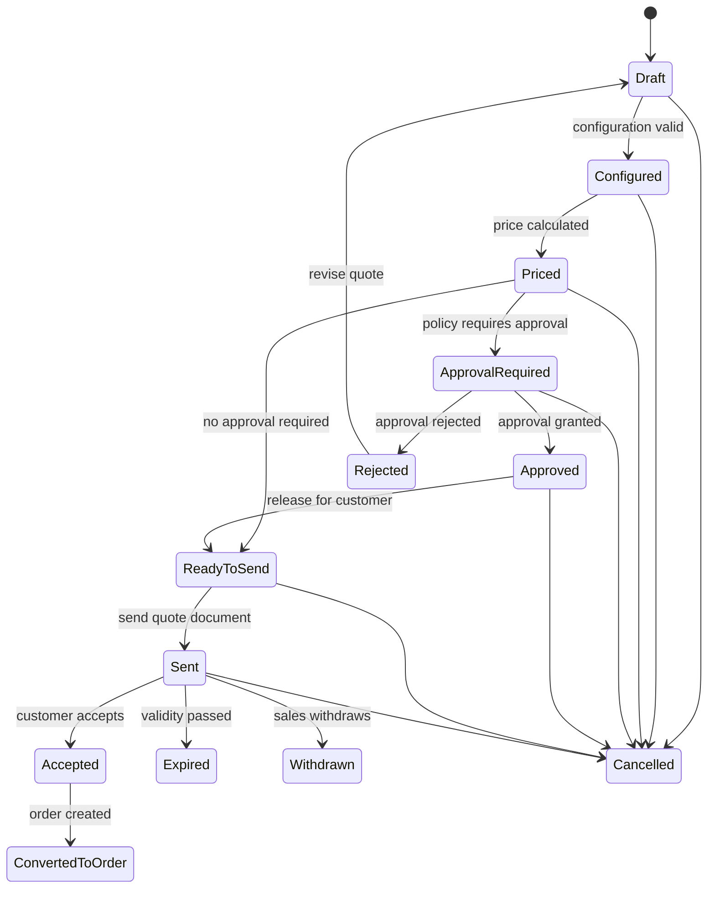

State ini tidak final, tetapi cukup sebagai baseline.

### 7.3 Quote Lifecycle Rules

Beberapa rule penting:

| Rule | Alasan |
|---|---|
| Draft quote boleh diedit. | Belum menjadi proposal resmi. |
| Priced quote harus reprice jika configuration berubah. | Price trace lama tidak berlaku. |
| Approved quote harus kehilangan approval jika field material berubah. | Approval berlaku untuk proposal tertentu. |
| Sent quote tidak boleh berubah diam-diam. | Customer harus menerima proposal yang jelas. |
| Accepted quote harus immutable. | Menjadi dasar order. |
| Expired quote tidak boleh accepted tanpa revalidation/reprice. | Commercial validity sudah lewat. |
| Converted quote tidak boleh membuat order kedua. | Mencegah duplicate order. |

---

## 8. Approval Model: Authority Over Exceptions

Approval bukan sekadar task “approve/reject”. Approval adalah kontrol otoritas atas risiko komersial.

Approval bisa dipicu oleh:

- discount melebihi threshold,
- margin di bawah minimum,
- contract term khusus,
- customer risk segment,
- product risk,
- manual price override,
- non-standard terms,
- region/channel rule,
- order value besar,
- combination of factors.

Approval model minimal:

```text
approval requirement = policy evaluation result against quote revision
approval decision = authorized actor decision over that exact revision
```

### 8.1 Approval Must Bind to Revision

Approval tanpa revision adalah jebakan.

Contoh buruk:

```text
Quote Q-100 approved = true
```

Contoh baik:

```text
Quote Q-100 revision 4 approved by manager M-7 for discount override reason X at timestamp T.
```

Jika revision berubah, approval harus dievaluasi ulang.

### 8.2 Approval Decision States

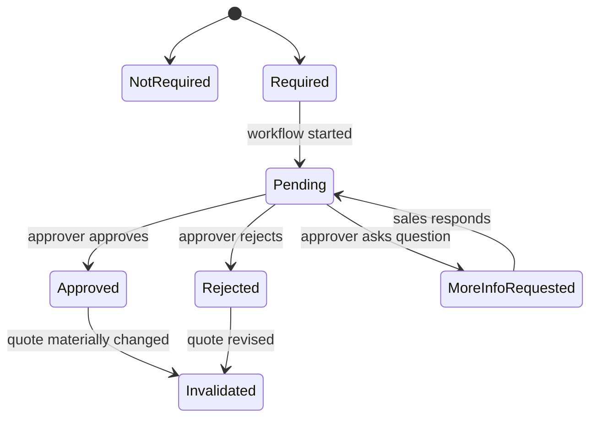

Approval bukan domain terpisah total dari quote. Ia adalah keputusan terhadap quote revision.

---

## 9. Acceptance Model: The Commercial Lock

Acceptance menjawab:

> Customer menerima proposal yang mana, kapan, melalui channel apa, dan dengan bukti apa?

Acceptance harus menyimpan:

- accepted quote id,
- accepted revision number,
- actor/customer identity,
- acceptance timestamp,
- channel,
- document/artifact reference,
- terms snapshot,
- price snapshot,
- idempotency key/request id,
- order creation correlation.

Acceptance adalah titik transisi penting:

```text
before acceptance: proposal can be revised under rules
at acceptance: commercial basis is locked
behind acceptance: order can be created
```

### 9.1 Acceptance Guard

Sebelum quote accepted, sistem harus memeriksa:

1. quote status eligible untuk acceptance,
2. quote belum expired,
3. revision yang accepted adalah revision current atau revision yang dikirim,
4. approval valid jika diperlukan,
5. price validity masih berlaku,
6. customer identity/channel valid,
7. belum ada acceptance/order sebelumnya untuk quote revision tersebut,
8. idempotency key aman.

Jika guard ini diabaikan, duplicate order dan pricing dispute akan muncul.

---

## 10. Order Model: Fulfillment Intent

Order menjawab:

> Apa yang harus dipenuhi oleh organisasi setelah customer menerima proposal?

Order bukan sekadar quote yang disalin.

Quote adalah proposal. Order adalah intent eksekusi.

| Aspek | Quote | Order |
|---|---|---|
| Fokus | Commercial proposal | Fulfillment execution |
| Bisa direvisi? | Ya, dengan revision | Tidak bebas; pakai amendment/cancel/change order |
| Status utama | Draft/priced/approved/sent/accepted | Created/decomposed/in fulfillment/completed/fallout/cancelled |
| Data penting | Configuration, price, terms, approval | Fulfillment item, reservation, provisioning, shipment, activation |
| User utama | Sales/customer/approver | Operations/system/integration |
| Failure utama | Approval/expiry/pricing invalid | Integration/fulfillment/fallout |

### 10.1 Order Aggregate

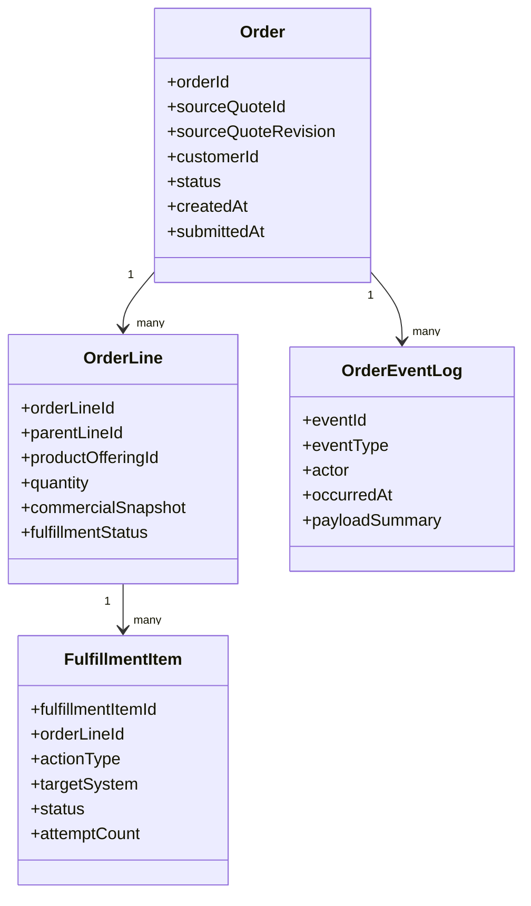

### 10.2 Order Status

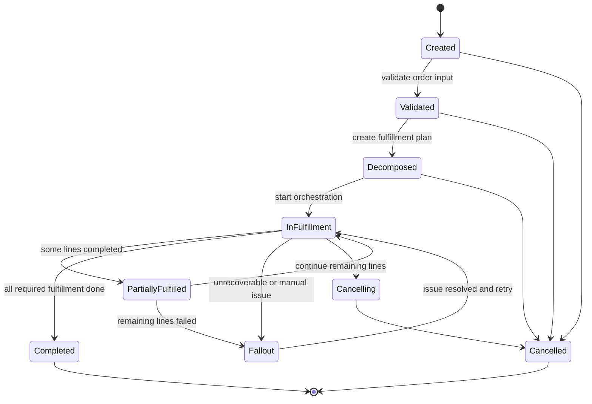

Order lifecycle lebih panjang dan lebih operasional daripada quote lifecycle.

---

## 11. Decomposition Model: From Commercial Line to Work

Quote line dan order line tidak selalu sama dengan fulfillment item.

Contoh:

```text
Quote line:
  Enterprise Internet Bundle

Order lines:
  Internet Access
  Managed Router
  Static IP Package
  24x7 Support

Fulfillment items:
  Check network availability
  Reserve port
  Ship router
  Configure router
  Assign static IP
  Activate service
  Notify customer
```

Decomposition menjawab:

> Dari commercial order, pekerjaan teknis/operasional apa yang harus dilakukan?

Ini sering menjadi boundary antara CPQ/OMS dan downstream systems.

### 11.1 Decomposition Invariants

1. Decomposition harus deterministic untuk input version tertentu.
2. Decomposition result harus disimpan, bukan dihitung ulang sembarangan.
3. Fulfillment item harus punya identity stabil.
4. Retry fulfillment tidak boleh membuat item baru kecuali memang ada command replan.
5. Manual modification terhadap fulfillment plan harus diaudit.

---

## 12. Fulfillment Model: Progress Under Failure

Fulfillment enterprise jarang atomic.

Satu order bisa:

- butuh beberapa sistem downstream,
- berlangsung beberapa menit, jam, atau hari,
- sebagian sukses sebagian gagal,
- menunggu manual task,
- butuh compensation,
- butuh retry dengan backoff,
- butuh cancellation di tengah jalan.

Karena itu fulfillment state harus cukup ekspresif.

### 12.1 Fulfillment Item State

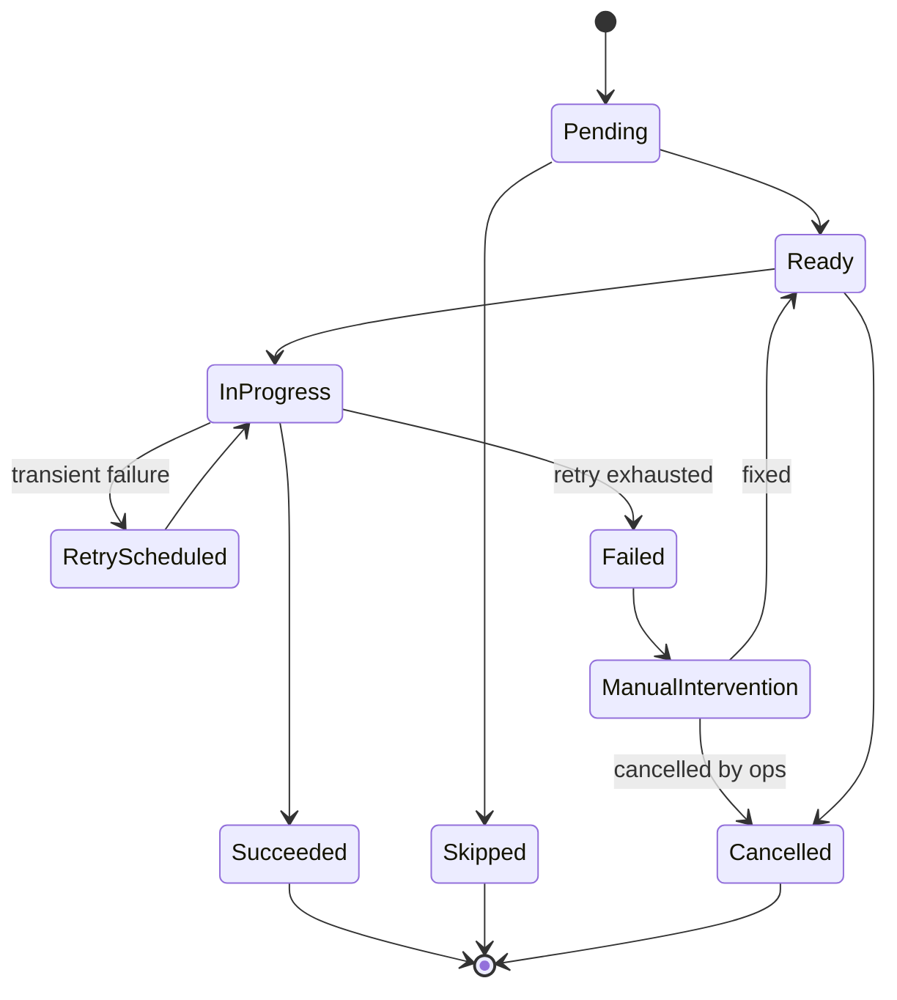

Status order aggregate harus dihitung dari status fulfillment item, tetapi tidak boleh sekadar query realtime tanpa domain decision.

---

## 13. Fallout Model: Failure as Domain Concept

Fallout adalah kondisi ketika proses tidak bisa lanjut secara otomatis dan butuh tindakan khusus.

Fallout bukan sekadar exception stack trace.

Contoh fallout:

- downstream inventory menolak data karena mapping produk salah,
- customer address tidak valid untuk provisioning,
- order line conflict dengan active service lama,
- payment precondition belum terpenuhi,
- manual approval hilang karena policy mismatch,
- cancellation gagal karena sebagian fulfillment sudah selesai.

Fallout record minimal:

```text
falloutId
sourceType: ORDER / ORDER_LINE / FULFILLMENT_ITEM / WORKFLOW
sourceId
category
severity
status
ownerGroup
rootCauseCode
humanDescription
technicalDetailsRef
createdAt
resolvedAt
resolutionAction
```

### 13.1 Fallout Lifecycle

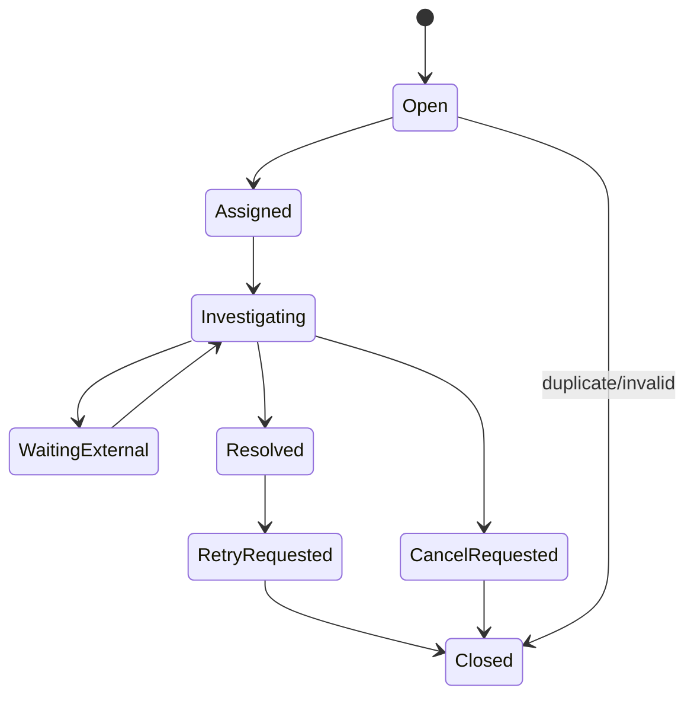

Jika fallout tidak dimodelkan, operations team akan bekerja dari log, spreadsheet, dan manual database update. Itu bukan enterprise-grade.

---

## 14. Commands and Events

Domain harus dibangun dari command dan event yang jelas.

### 14.1 Quote Commands

| Command | Tujuan | Guard Utama |
|---|---|---|
| `CreateQuote` | Membuat quote draft | Customer/channel valid. |
| `AddQuoteLine` | Menambah offering ke quote | Quote editable, offering eligible. |
| `UpdateConfiguration` | Mengubah configuration | Quote editable, config valid/incomplete allowed. |
| `CalculateQuotePrice` | Mengikat price result ke quote revision | Config valid. |
| `ApplyManualDiscount` | Menerapkan override | Actor punya authority atau approval required. |
| `SubmitQuoteForApproval` | Memulai approval | Quote priced, not expired. |
| `ApproveQuoteRevision` | Menyetujui revision | Actor authorized, revision matches. |
| `RejectQuoteRevision` | Menolak revision | Actor authorized. |
| `SendQuote` | Mengirim proposal | Approved/ready, document generated. |
| `AcceptQuote` | Customer menerima quote | Not expired, approval valid, idempotent. |
| `WithdrawQuote` | Menarik proposal | Status eligible. |
| `ExpireQuote` | Menandai expired | Validity passed. |

### 14.2 Quote Events

| Event | Makna |
|---|---|
| `QuoteCreated` | Quote baru dibuat. |
| `QuoteLineAdded` | Line ditambah. |
| `QuoteConfigurationUpdated` | Configuration berubah. |
| `QuoteConfigured` | Configuration valid. |
| `QuotePriced` | Price resmi dihitung dan disimpan. |
| `QuoteApprovalRequired` | Policy membutuhkan approval. |
| `QuoteSubmittedForApproval` | Approval workflow diminta. |
| `QuoteRevisionApproved` | Revision tertentu disetujui. |
| `QuoteRevisionRejected` | Revision tertentu ditolak. |
| `QuoteSent` | Proposal dikirim. |
| `QuoteAccepted` | Customer menerima quote revision. |
| `QuoteExpired` | Quote melewati validity. |
| `QuoteConvertedToOrder` | Order berhasil dibuat dari quote. |

### 14.3 Order Commands

| Command | Tujuan | Guard Utama |
|---|---|---|
| `CreateOrderFromQuote` | Membuat order dari accepted quote | Quote accepted, no duplicate order. |
| `ValidateOrder` | Validasi order sebelum decomposition | Required snapshot lengkap. |
| `DecomposeOrder` | Membuat fulfillment plan | Order validated. |
| `StartFulfillment` | Memulai orchestration | Plan exists. |
| `MarkFulfillmentItemSucceeded` | Menandai item sukses | Item in progress. |
| `MarkFulfillmentItemFailed` | Menandai item gagal | Attempt valid. |
| `RaiseFallout` | Membuat fallout | Failure classified. |
| `ResolveFallout` | Menyelesaikan fallout | Actor authorized. |
| `RetryFulfillmentItem` | Retry setelah fix | Item retryable. |
| `CancelOrder` | Memulai cancellation | Status cancellable. |
| `CompleteOrder` | Menyelesaikan order | Semua required item done. |

### 14.4 Order Events

| Event | Makna |
|---|---|
| `OrderCreated` | Order dibuat. |
| `OrderValidated` | Order lolos validasi. |
| `OrderDecomposed` | Fulfillment plan dibuat. |
| `OrderFulfillmentStarted` | Fulfillment dimulai. |
| `FulfillmentItemStarted` | Item mulai dikerjakan. |
| `FulfillmentItemSucceeded` | Item sukses. |
| `FulfillmentItemFailed` | Item gagal. |
| `OrderFalloutRaised` | Order masuk fallout. |
| `OrderFalloutResolved` | Fallout selesai. |
| `OrderCompleted` | Order selesai. |
| `OrderCancellationStarted` | Cancellation dimulai. |
| `OrderCancelled` | Order dibatalkan. |

---

## 15. Aggregate Boundaries

Aggregate bukan sekadar tabel utama. Aggregate adalah boundary consistency.

### 15.1 Quote Aggregate Boundary

Quote aggregate menjaga:

- current status,
- current revision pointer,
- editability,
- revision creation,
- price attachment,
- approval validity,
- acceptance guard,
- conversion guard.

Quote aggregate tidak harus menyimpan seluruh catalog object. Ia menyimpan snapshot/references yang diperlukan.

### 15.2 Pricing Aggregate/Service Boundary

Pricing service menjaga:

- pricing rule version,
- calculation algorithm,
- price component structure,
- price trace,
- approval impact output.

Pricing service tidak boleh mengubah quote langsung. Ia mengembalikan price result. Quote service memutuskan apakah price result diattach ke quote revision.

### 15.3 Order Aggregate Boundary

Order aggregate menjaga:

- order status,
- source quote reference,
- commercial snapshot,
- order line status,
- fulfillment plan reference,
- fallout status,
- cancellation/completion rules.

Workflow boleh memanggil order command, tetapi tidak boleh bypass aggregate.

---

## 16. Lifecycle Coupling

Quote dan order lifecycle terhubung, tetapi tidak sama.

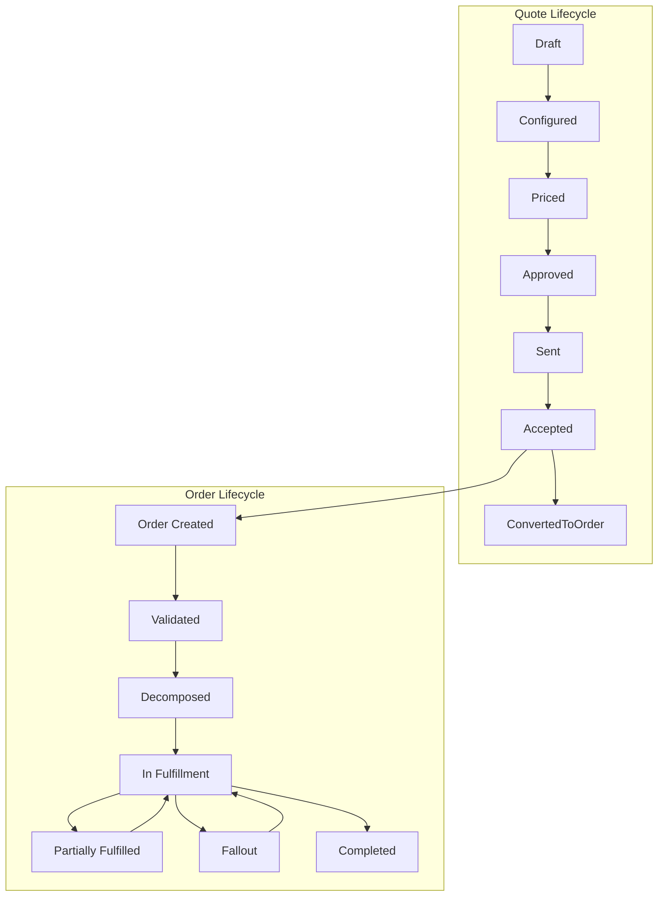

Titik integrasi kritikal adalah `QuoteAccepted → OrderCreated`.

Di titik ini, kita harus menjamin:

- accepted quote revision immutable,
- order creation idempotent,
- commercial snapshot cukup,
- event/correlation tersimpan,
- workflow bisa dimulai tanpa kehilangan state.

---

## 17. The Snapshot Principle

Snapshot adalah salah satu konsep paling penting di CPQ/OMS.

Ketika quote/order dibuat, jangan hanya menyimpan reference ke data yang bisa berubah. Simpan snapshot yang diperlukan untuk menjelaskan keputusan.

### 17.1 Snapshot yang Dibutuhkan

| Snapshot | Disimpan di | Tujuan |
|---|---|---|
| Catalog snapshot/reference version | Quote revision | Menjelaskan product/offering saat quote dibuat. |
| Configuration snapshot | Quote revision/order line | Menjelaskan pilihan customer. |
| Price snapshot | Quote revision/order | Menjaga accepted commercial value. |
| Terms snapshot | Quote revision/order | Menjaga syarat commercial. |
| Approval snapshot | Quote revision | Menjelaskan authority dan decision. |
| Document snapshot/reference | Quote sent/accepted | Bukti proposal yang dikirim. |
| Customer context snapshot | Quote/order | Menjelaskan segment/eligibility saat transaksi. |

Snapshot bukan berarti semua data diduplikasi tanpa batas. Snapshot berarti menyimpan cukup context untuk audit dan deterministic behavior.

---

## 18. State Machine Before Tables

Sebelum mendesain tabel, desain state machine.

Jika langsung membuat tabel, kita cenderung membuat:

```text
quote(id, status, total_price, customer_id)
quote_line(id, quote_id, product_id, quantity, price)
```

Itu terlalu miskin untuk enterprise CPQ.

State machine memaksa kita bertanya:

- status apa saja yang valid?
- transition apa saja yang boleh?
- siapa actor transition?
- data apa yang wajib tersedia sebelum transition?
- transition mana yang menghasilkan event?
- transition mana yang membutuhkan audit reason?
- transition mana yang idempotent?
- transition mana yang invalidates approval?

Contoh transition table:

| Current State | Command | Guard | Next State | Event |
|---|---|---|---|---|
| Draft | UpdateConfiguration | Quote editable | Draft/Configured | `QuoteConfigurationUpdated` |
| Configured | CalculatePrice | Config valid | Priced | `QuotePriced` |
| Priced | SubmitForApproval | Approval required | ApprovalRequired | `QuoteSubmittedForApproval` |
| ApprovalRequired | ApproveRevision | Actor authorized + revision match | Approved | `QuoteRevisionApproved` |
| Approved | SendQuote | Document generated | Sent | `QuoteSent` |
| Sent | AcceptQuote | Not expired + approval valid | Accepted | `QuoteAccepted` |
| Accepted | CreateOrder | No order exists | ConvertedToOrder | `QuoteConvertedToOrder` |

Transition table ini akan menjadi dasar service method dan test.

---

## 19. Domain Errors

Domain error harus spesifik. Jangan semua menjadi `400 Bad Request` tanpa makna.

Contoh domain error quote:

| Error Code | Meaning |
|---|---|
| `QUOTE_NOT_EDITABLE` | Quote status tidak mengizinkan perubahan. |
| `QUOTE_REVISION_MISMATCH` | Command menargetkan revision lama. |
| `QUOTE_EXPIRED` | Quote sudah melewati validity. |
| `QUOTE_APPROVAL_REQUIRED` | Quote tidak bisa dikirim/accepted sebelum approval. |
| `QUOTE_APPROVAL_INVALIDATED` | Approval tidak berlaku karena quote berubah. |
| `QUOTE_PRICE_STALE` | Price tidak valid terhadap configuration/context saat ini. |
| `QUOTE_ALREADY_ACCEPTED` | Acceptance sudah pernah terjadi. |
| `QUOTE_ALREADY_CONVERTED` | Order sudah pernah dibuat. |

Contoh domain error order:

| Error Code | Meaning |
|---|---|
| `ORDER_DUPLICATE_SOURCE_QUOTE` | Accepted quote sudah punya order. |
| `ORDER_NOT_CANCELLABLE` | Status tidak mengizinkan cancellation. |
| `FULFILLMENT_ITEM_NOT_RETRYABLE` | Item tidak boleh retry. |
| `FALLOUT_NOT_RESOLVED` | Order belum bisa lanjut. |
| `ORDER_COMPLETION_GUARD_FAILED` | Required fulfillment belum selesai. |

Domain error seperti ini akan masuk ke API error model di part khusus.

---

## 20. Domain Events Are Facts

Event harus menyatakan fakta, bukan instruksi.

Buruk:

```text
ProcessOrderNow
SendApprovalEmail
UpdateSearchIndex
```

Lebih baik:

```text
QuoteAccepted
QuoteApprovalRequested
OrderCreated
OrderFalloutRaised
```

Mengapa?

Karena event dipakai oleh banyak consumer. Jika event berupa instruksi ke satu consumer, event itu sulit direuse dan coupling meningkat.

Command boleh imperative. Event harus past tense.

---

## 21. Business Key and Correlation

CPQ/OMS punya banyak ID:

- quote id,
- quote revision,
- order id,
- order line id,
- fulfillment item id,
- process instance id,
- task id,
- customer id,
- document id,
- correlation id,
- request id,
- idempotency key,
- Kafka event id,
- outbox id.

Jangan mencampur semuanya.

### 21.1 ID Semantics

| ID | Fungsi |
|---|---|
| `quoteId` | Identity quote aggregate. |
| `revisionNumber` | Versi proposal. |
| `orderId` | Identity order aggregate. |
| `processInstanceId` | Runtime workflow instance. |
| `businessKey` | Correlation key workflow ke domain. |
| `correlationId` | Trace lintas request/event/service. |
| `requestId` | Satu request masuk. |
| `idempotencyKey` | Deduplication command tertentu. |
| `eventId` | Identity event. |

Kesalahan umum:

```text
Menggunakan processInstanceId sebagai orderId.
```

Itu membuat domain bergantung pada workflow runtime. Jangan.

---

## 22. Bounded Context Draft

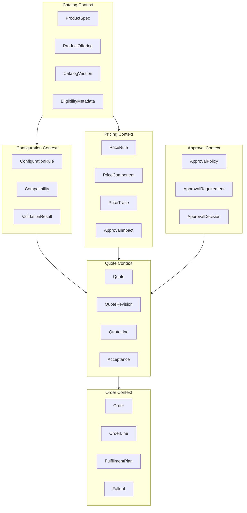

Bounded context bukan berarti semua harus jadi service fisik sejak hari pertama. Tetapi boundary bahasa dan ownership harus jelas sejak awal.

---

## 23. Implementation Consequence

Domain model ini memengaruhi code.

### 23.1 Jangan Mulai dari Controller

Urutan buruk:

```text
JAX-RS resource → DTO → entity → repository → status string
```

Urutan lebih baik:

```text
state machine → command → aggregate method → domain event → persistence → API adapter
```

### 23.2 Application Service Shape

Contoh conceptual flow:

```java
public QuoteResult acceptQuote(AcceptQuoteCommand command) {
    Quote quote = quoteRepository.get(command.quoteId());

    quote.accept(
        command.revisionNumber(),
        command.customerActor(),
        command.acceptanceChannel(),
        command.idempotencyKey(),
        clock.now()
    );

    quoteRepository.save(quote);
    outbox.saveAll(quote.pullDomainEvents());

    return QuoteResult.from(quote);
}
```

Poinnya bukan syntax. Poinnya:

- application service mengatur transaction,
- aggregate menjaga invariant,
- event keluar dari domain transition,
- outbox tersimpan dalam transaksi yang sama,
- API adapter tidak memutuskan business transition sendiri.

---

## 24. Enterprise Domain Smells

Waspadai smell berikut:

| Smell | Dampak |
|---|---|
| Semua status berupa string bebas | Transition tidak terkendali. |
| Quote line menyimpan current product reference saja | Quote lama berubah saat catalog berubah. |
| Approval hanya boolean | Tidak tahu siapa/kenapa/revision mana. |
| Price hanya total | Tidak bisa audit/dispute. |
| Order dibuat langsung dari UI payload | Tidak ada accepted commercial lock. |
| Workflow task mengubah DB quote langsung | Domain invariant bisa bypass. |
| Consumer Kafka update banyak aggregate tanpa idempotency | Replay berbahaya. |
| Redis dipakai untuk status order | Kehilangan key merusak truth. |
| Search query join semua tabel domain | Operasional lambat dan coupling tinggi. |
| Manual fix lewat SQL production | Recovery tidak auditable. |

Kalau smell ini muncul, jangan buru-buru menambal. Biasanya modelnya perlu dikoreksi.

---

## 25. Working Mental Model

Simpan model ringkas ini:

```text
Catalog defines what can be sold.
Configuration captures what is selected.
Pricing explains the commercial numbers.
Quote packages configuration + price + terms into a versioned proposal.
Approval authorizes risky proposal deviations.
Acceptance locks a specific proposal revision.
Order converts accepted commercial intent into fulfillment intent.
Workflow orchestrates long-running work.
Events publish facts.
Audit preserves explanation.
Fallout makes failure recoverable.
```

Kalau satu konsep mengambil alih konsep lain, desain mulai rusak.

---

## 26. Practice: Model the Edge Cases

Sebelum lanjut, coba modelkan jawaban untuk kasus ini:

### Case 1 — Catalog Change

```text
Quote Q1 revision 2 memakai catalog version V10.
Catalog berubah ke V11.
Sales membuka Q1 lagi.
```

Pertanyaan:

- Apakah quote otomatis berubah?
- Apakah harus muncul warning stale?
- Apakah user boleh revalidate terhadap V11?
- Apakah revision baru dibuat?

### Case 2 — Approval Invalidated

```text
Manager approve quote revision 3.
Sales mengubah discount setelah approval.
```

Pertanyaan:

- Apakah approval masih valid?
- Transition apa yang terjadi?
- Event apa yang dipublish?
- Apa audit reason-nya?

### Case 3 — Duplicate Acceptance

```text
Customer klik accept dua kali karena network lambat.
```

Pertanyaan:

- Guard apa yang mencegah duplicate order?
- Apakah response kedua success idempotent atau conflict?
- Data apa yang harus disimpan?

### Case 4 — Partial Fulfillment

```text
Order punya 3 fulfillment items.
Item 1 success, item 2 success, item 3 failed karena downstream data mapping.
```

Pertanyaan:

- Status order apa?
- Apakah order boleh completed?
- Apakah perlu fallout?
- Siapa owner recovery?

### Case 5 — Price Dispute

```text
Customer bertanya kenapa discount hanya 12%, bukan 15%.
```

Pertanyaan:

- Data apa yang harus tersedia?
- Apakah price trace cukup?
- Apakah approval policy perlu disimpan?
- Apakah document artifact relevan?

Jika kamu bisa menjawab edge case ini dengan state, command, event, dan invariant, kamu sudah berpikir seperti engineer sistem enterprise.

---

## 27. Summary

Part ini membongkar domain CPQ/OMS dari first principles:

- CPQ bukan cart sederhana.
- Quote adalah proposal komersial versioned.
- Product specification berbeda dari product offering.
- Configuration adalah constraint problem, bukan map option biasa.
- Pricing harus menghasilkan trace, bukan hanya total.
- Approval harus terikat pada quote revision.
- Acceptance mengunci commercial basis.
- Order adalah fulfillment intent, bukan copy quote.
- Decomposition mengubah commercial order menjadi work item.
- Fulfillment harus tahan partial success, retry, dan fallout.
- Event harus menyatakan fakta.
- Workflow mengorkestrasi, domain aggregate menjaga invariant.

Di part berikutnya kita akan menetapkan **Enterprise Requirements and Non-Functional Bar**: apa standar production-grade yang harus dipenuhi sistem ini sebelum layak disebut enterprise platform.

---

## References

- OpenAPI Specification v3.2.0: <https://spec.openapis.org/oas/v3.2.0.html>
- Jakarta RESTful Web Services 4.0: <https://jakarta.ee/specifications/restful-ws/4.0/>
- Jakarta Persistence specification: <https://jakarta.ee/specifications/persistence/>
- Camunda 7 Enterprise support announcements: <https://docs.camunda.org/enterprise/announcement/>
- Camunda 7 documentation: <https://docs.camunda.org/manual/latest/>
- PostgreSQL documentation: <https://www.postgresql.org/docs/>
- Apache Kafka documentation: <https://kafka.apache.org/documentation/>
- Redis documentation: <https://redis.io/docs/latest/>
