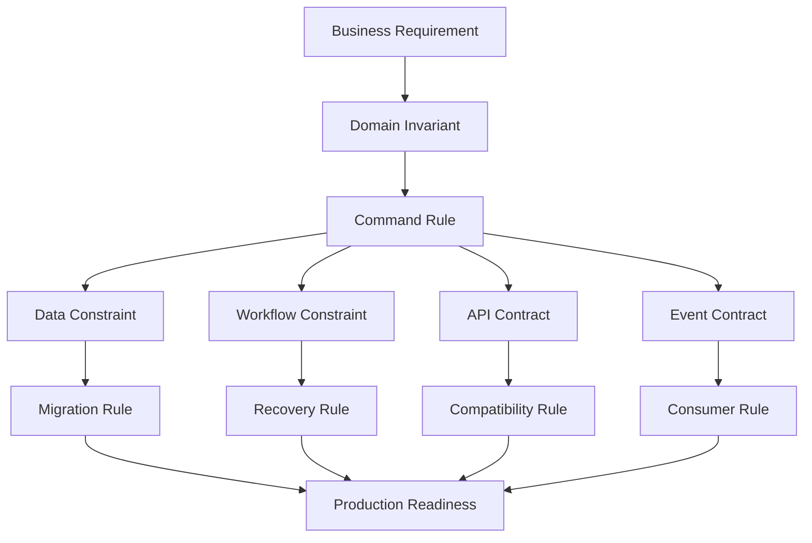
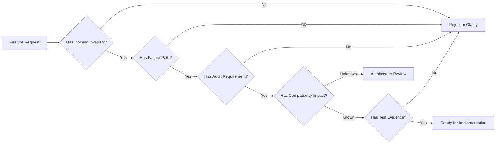

# Part 003 — Enterprise Requirements and Non-Functional Bar

Production-grade CPQ/OMS bukan berarti aplikasinya punya banyak microservice, Kafka, Redis, Camunda, PostgreSQL, OpenAPI, dan dashboard. Itu baru daftar teknologi.

Enterprise-grade berarti sistem punya **bar kualitas** yang bisa diuji ketika tekanan bisnis, data, integrasi, approval, concurrency, dan failure mulai terjadi bersamaan.

CPQ/OMS yang benar harus bisa menjawab pertanyaan seperti ini:

- Apakah quote yang diterima customer bisa direkonstruksi ulang 18 bulan kemudian?
- Apakah harga yang sudah disetujui bisa berubah diam-diam karena rule pricing baru?
- Apakah order bisa dibuat dua kali dari quote yang sama karena user double click atau retry network?
- Apakah approval tetap valid jika quote diubah setelah disetujui?
- Apakah workflow bisa recovery ketika inventory system down selama dua jam?
- Apakah case worker bisa memahami kenapa sebuah order stuck tanpa membaca log mentah?
- Apakah auditor bisa melihat siapa mengubah discount, kapan, dari nilai berapa ke nilai berapa, dengan alasan apa?
- Apakah engineer bisa men-deploy rule, API, process definition, atau migration tanpa menghancurkan in-flight quote/order?

Jika sistem tidak bisa menjawab ini, sistem belum production-grade.

Part ini membangun standar requirement dan non-functional bar yang akan dipakai untuk seluruh seri.

---

## 1. Mental Model: Enterprise Requirement Bukan Wish List

Requirement enterprise bukan kalimat seperti:

> Sistem harus scalable, reliable, secure, dan maintainable.

Kalimat itu benar, tapi tidak bisa diuji.

Requirement yang berguna harus punya bentuk:

```text
Dalam konteks <situasi bisnis/teknis>,
sistem harus mempertahankan <invariant>,
dengan bukti <observable evidence>,
ketika terjadi <normal path atau failure path>,
agar <konsekuensi bisnis/regulasi> tetap terkendali.
```

Contoh lemah:

```text
Quote harus aman.
```

Contoh kuat:

```text
Ketika sales user mengubah discount pada quote yang sudah pernah dipricing,
sistem harus membatalkan price snapshot lama, menandai quote sebagai membutuhkan repricing,
dan menyimpan audit event yang berisi actor, old value, new value, reason code,
serta correlation id agar approval lama tidak bisa dipakai untuk submit order.
```

Perbedaan keduanya sangat besar.

Yang pertama hanya aspirasi. Yang kedua memaksa desain state machine, audit log, quote versioning, authorization, pricing snapshot, approval invalidation, dan observability.

---

## 2. Enterprise Bar Untuk Seri Ini

Kita akan memakai bar berikut sebagai baseline.

Ini bukan angka universal untuk semua perusahaan. Ini adalah **engineering bar** agar desain yang kita bangun tidak jatuh menjadi playground project.

| Area | Bar Minimum Untuk Seri Ini | Kenapa Penting |
|---|---|---|
| Correctness | Setiap quote/order command harus menjaga invariant domain | CPQ/OMS adalah sistem komersial; salah harga dan salah order berdampak finansial |
| Reproducibility | Quote, price, approval, dan order decision harus bisa direkonstruksi | Audit, dispute, renewal, amendment, compliance |
| Idempotency | Semua command eksternal yang berisiko retry harus idempotent | Network retry, user double submit, duplicate event |
| Auditability | Semua perubahan material harus punya actor, timestamp, reason, before/after, correlation | Defensibility dan operational recovery |
| Workflow recovery | Process instance tidak boleh menjadi black box | Order fallout harus bisa dipahami dan dipulihkan |
| Event consistency | Event harus diterbitkan dari perubahan state yang committed | Menghindari ghost event dan missing event |
| Backward compatibility | API, event, DB, dan process changes harus aman untuk in-flight data | Enterprise system punya long-running quote/order |
| Observability | Business key, quote id, order id, process id, trace id harus bisa dikorelasikan | Debugging distributed system tanpa korelasi akan gagal |
| Security | Authorization harus berbasis action + resource + tenant + commercial authority | CPQ punya data harga, discount, approval, dan customer-sensitive data |
| Operability | Sistem harus punya runbook, retry policy, incident taxonomy, dan repair mechanism | Failure pasti terjadi; yang penting bisa dikontrol |

Bar ini akan mengarahkan keputusan arsitektur kita.

---

## 3. Diagram: Dari Business Requirement Ke Architecture Constraint



Setiap requirement yang serius harus punya jejak ke desain.

Jika requirement berhenti di dokumen, ia tidak akan menjaga sistem.

---

## 4. Functional Requirement Utama CPQ/OMS

Kita pecah requirement fungsional menjadi lifecycle, bukan sekadar fitur UI.

### 4.1 Product Catalog Requirement

Catalog service harus mendukung:

- product offering aktif/nonaktif
- product specification
- bundle dan package
- option dan add-on
- attribute dan constraint
- compatibility rule
- eligibility rule
- effective dating
- catalog version
- commercial metadata
- fulfillment metadata

Invariant awal:

```text
A quote line must reference a product offering version, not only a mutable product code.
```

Kenapa?

Karena product definition bisa berubah. Quote historis tidak boleh berubah makna karena catalog hari ini berubah.

Contoh buruk:

```text
quote_line.product_code = 'FIBER_100MBPS'
```

Contoh lebih aman:

```text
quote_line.product_offering_id = 'po_fiber_100'
quote_line.product_offering_version = 17
quote_line.catalog_effective_from = '2026-07-01T00:00:00+07:00'
```

### 4.2 Configuration Requirement

Configuration service harus mendukung:

- validasi pilihan product
- dependency antar option
- mutually exclusive option
- required option
- quantity rule
- compatibility check
- explanation trace
- invalid configuration report

Invariant:

```text
A configured quote line cannot move to pricing unless all mandatory configuration constraints are satisfied.
```

Ini bukan sekadar validasi form. Ini lifecycle gate.

### 4.3 Pricing Requirement

Pricing service harus mendukung:

- base price
- recurring charge
- one-time charge
- usage price placeholder
- discount
- surcharge
- promotion
- manual override
- tax placeholder
- rounding policy
- currency
- price trace
- price snapshot

Invariant:

```text
An accepted quote must carry an immutable price snapshot produced from a known pricing rule version.
```

Tanpa price snapshot, renewal, dispute, order amendment, dan audit akan rapuh.

### 4.4 Quote Requirement

Quote service harus mendukung:

- create quote
- add/remove/update quote line
- configure quote
- price quote
- request approval
- approve/reject
- revise
- accept
- expire
- cancel
- convert to order

Invariant:

```text
A quote cannot be accepted if its latest material version has not been priced and approved according to policy.
```

Kata kunci: **latest material version**.

Tidak semua perubahan harus membatalkan approval. Mengubah internal note mungkin tidak material. Mengubah discount 30% jelas material.

### 4.5 Approval Requirement

Approval requirement tidak boleh hanya menjadi tabel `approval_status`.

Ia harus mendukung:

- approval matrix
- approval authority
- delegated approval
- escalation
- SLA
- rejection reason
- rework loop
- approval invalidation
- approval evidence

Invariant:

```text
An approval decision is valid only for the quote version and commercial delta that it reviewed.
```

Jika quote berubah, approval lama harus dievaluasi ulang.

### 4.6 Order Requirement

Order service harus mendukung:

- order capture
- quote-to-order conversion
- idempotent submit
- order validation
- order decomposition
- orchestration
- external fulfillment integration
- cancellation
- amendment
- fallout
- recovery

Invariant:

```text
A quote can produce at most one active customer order unless the business explicitly models split-order semantics.
```

Jika tidak, duplicate order akan muncul dari retry, race condition, atau user action yang berulang.

---

## 5. Non-Functional Requirements Yang Harus Menjadi Design Input

### 5.1 Correctness

Correctness adalah requirement nomor satu.

Dalam CPQ/OMS, wrong but fast lebih buruk daripada slow but safe.

Correctness mencakup:

- valid state transition
- valid price calculation
- valid approval authority
- valid quote-to-order conversion
- valid order decomposition
- valid compensation
- valid audit trail

Contoh correctness rule:

```text
If a quote is already ACCEPTED, no command may mutate quote lines.
```

Kemungkinan implementasi:

- guard di domain service
- optimistic locking di database
- API error `409 Conflict`
- audit event untuk rejected mutation attempt jika penting

### 5.2 Reproducibility

Reproducibility berarti kita bisa menjawab:

> Bagaimana sistem sampai ke keputusan ini?

Untuk CPQ/OMS, yang harus reproducible:

- product offering version
- selected configuration
- pricing rule version
- price components
- discount decision
- approval chain
- quote version
- order decomposition
- workflow path
- external system response

Reproducibility tidak selalu berarti menjalankan ulang rule lama. Biasanya lebih aman menyimpan snapshot keputusan.

```text
Rule evaluates current policy.
Snapshot preserves historical decision.
```

### 5.3 Idempotency

Idempotency bukan optimasi. Ini requirement inti.

Command yang wajib idempotent:

- create quote dari request eksternal
- submit quote
- accept quote
- convert quote to order
- submit order
- publish event
- consume event
- create fulfillment request
- send notification

Contoh key:

```text
idempotency_key = tenant_id + actor_id + command_type + client_request_id
```

Untuk command kritikal, jangan hanya simpan di Redis. Redis bisa membantu fast lookup, tetapi source of truth idempotency untuk commercial action sebaiknya tetap ada di database transaksional.

### 5.4 Availability

Availability harus dibaca per capability.

Tidak semua capability butuh availability yang sama.

| Capability | Availability Expectation | Degradation Strategy |
|---|---:|---|
| Product browse | Tinggi | Serve stale catalog read model jika masih dalam allowed staleness |
| Quote edit | Tinggi | Block material mutation jika pricing/config dependency unavailable |
| Pricing | Sangat penting | Cache reference data, tetapi jangan accept quote tanpa reliable price snapshot |
| Approval task | Tinggi | Human task queue harus recoverable |
| Order submit | Sangat penting | Idempotent submission, clear pending state |
| Fulfillment orchestration | Tinggi, async tolerant | Retry, incident, manual recovery |
| Reporting | Lebih rendah | Async projection, degraded dashboard |

Kesalahan umum: semua endpoint diberi target availability sama, lalu desain menjadi mahal dan kabur.

### 5.5 Latency

Latency harus dibagi berdasarkan jenis operasi.

| Operation | Target Design Thinking |
|---|---|
| Read catalog | Harus cepat, cacheable, boleh stale dalam batas tertentu |
| Configure quote | Interaktif, perlu feedback cepat |
| Price quote | Interaktif untuk small quote, async untuk complex quote |
| Submit approval | Command cepat, workflow async |
| Convert quote to order | Command harus idempotent, orchestration boleh async |
| Fulfillment | Long-running, workflow-driven |

Jangan memaksa semua proses menjadi synchronous hanya agar UI terlihat sederhana.

UI bisa mendapat status:

```text
ORDER_SUBMISSION_ACCEPTED
ORDER_CREATION_IN_PROGRESS
ORDER_PENDING_FULFILLMENT
ORDER_FALLOUT_REQUIRES_ACTION
```

### 5.6 Consistency

Tidak semua data harus strongly consistent. Tapi kita harus eksplisit.

| Data/Decision | Consistency Requirement |
|---|---|
| Quote mutation | Strong within quote aggregate |
| Quote version | Strong |
| Price snapshot attached to accepted quote | Strong |
| Approval decision for quote version | Strong |
| Event projection/search index | Eventually consistent |
| Reporting | Eventually consistent |
| Notification | Eventually consistent |
| Catalog cache | Eventually consistent with explicit staleness policy |

Prinsip:

```text
Strong consistency for irreversible commercial commitments.
Eventual consistency for derived views and notifications.
```

### 5.7 Operability

Operability berarti sistem bisa dijalankan, bukan hanya dikodekan.

Minimal harus ada:

- dashboard business process
- dashboard service health
- dashboard event lag
- dashboard DB saturation
- dashboard failed job/process incident
- runbook untuk common failure
- manual retry mechanism
- manual compensation mechanism
- audit-safe repair path

Operator tidak boleh dipaksa membuka database production dan mengubah row secara manual sebagai recovery default.

### 5.8 Security

Security CPQ/OMS bukan hanya login.

Yang harus dilindungi:

- customer data
- commercial pricing
- discount authority
- quote visibility
- approval action
- order action
- document download
- audit log integrity
- admin configuration
- workflow operation

Authorization harus mengevaluasi:

```text
subject + action + resource + tenant + commercial authority + lifecycle state
```

Contoh:

```text
User A boleh melihat quote Q.
User A belum tentu boleh memberi discount 40%.
User A belum tentu boleh approve discount yang ia sendiri ajukan.
User A belum tentu boleh convert quote to order setelah expiry.
```

### 5.9 Evolvability

Enterprise CPQ/OMS hidup lama.

Yang harus bisa berubah:

- product model
- pricing rule
- approval policy
- quote schema
- order schema
- event schema
- API contract
- BPMN process
- DMN decision table
- integration adapter

Evolvability harus didesain, bukan berharap refactor nanti.

---

## 6. Requirement Matrix Per Lifecycle

| Lifecycle Stage | Main Risk | Required Control | Evidence |
|---|---|---|---|
| Catalog publish | Product definition salah | Approval + versioned catalog | Catalog version + publish audit |
| Quote draft | Invalid line/config | Configuration validation | Validation result |
| Quote pricing | Wrong price | Price trace + rule version | Price snapshot |
| Approval | Unauthorized approval | Authority check | Approval decision record |
| Acceptance | Stale quote accepted | Version/state guard | Accepted quote event |
| Order creation | Duplicate order | Idempotency + unique constraint | Order creation command record |
| Order orchestration | External failure | Workflow retry + incident | Process instance + incident record |
| Fulfillment | Partial completion | Saga/compensation | Fulfillment state history |
| Amendment | Wrong delta | Versioned commercial agreement | Amendment quote/order link |
| Cancellation | Incomplete reversal | Compensation checklist | Cancellation process trace |

---

## 7. The Hard Requirement: State Must Be Defensible

CPQ/OMS state is not just current state.

It has four layers:

```text
1. Current state
2. Historical state
3. Decision state
4. Recovery state
```

### 7.1 Current State

Current state answers:

```text
What is the quote/order status now?
```

Example:

```text
quote.status = APPROVED
order.status = FULFILLMENT_IN_PROGRESS
```

### 7.2 Historical State

Historical state answers:

```text
What changed over time?
```

Example:

```text
QUOTE_LINE_DISCOUNT_CHANGED
old_discount = 10%
new_discount = 25%
reason = COMPETITIVE_MATCH
actor = sales.user.123
```

### 7.3 Decision State

Decision state answers:

```text
Why did the system allow this?
```

Example:

```text
approval_policy_version = 14
approval_rule = DISCOUNT_OVER_20_REQUIRES_MANAGER
approver = manager.456
approved_at = 2026-07-02T10:15:00+07:00
```

### 7.4 Recovery State

Recovery state answers:

```text
What is broken and what can be done safely?
```

Example:

```text
process_instance_id = abc
incident_type = INVENTORY_RESERVATION_TIMEOUT
retryable = true
manual_action = RETRY_RESERVATION
compensation_available = true
```

Aplikasi dummy hanya menyimpan current state. Sistem enterprise harus menyimpan keempatnya.

---

## 8. Concrete Invariant Catalog

Kita akan memakai invariant berikut sebagai desain awal.

### 8.1 Quote Invariants

```text
QI-001: A quote must belong to exactly one tenant.
QI-002: A quote must have a stable quote number visible to business users.
QI-003: A quote must have an internal immutable technical id.
QI-004: A quote line must belong to exactly one quote version.
QI-005: A material quote change must create a new quote version or mark current version as dirty.
QI-006: A quote cannot be accepted while pricing status is DIRTY, FAILED, or EXPIRED.
QI-007: A quote cannot be accepted if required approval is missing or invalidated.
QI-008: An accepted quote cannot be materially mutated.
QI-009: An expired quote cannot be accepted without revalidation.
QI-010: A quote converted to order must record the resulting order id.
```

### 8.2 Pricing Invariants

```text
PI-001: Price calculation must declare pricing rule version.
PI-002: Price snapshot must contain component-level breakdown.
PI-003: Manual override must include actor, authority, reason, and scope.
PI-004: Currency and rounding policy must be explicit.
PI-005: Accepted price snapshot must be immutable.
```

### 8.3 Approval Invariants

```text
AI-001: Approval decision must reference quote id and quote version.
AI-002: Approver must have authority for the requested approval scope.
AI-003: Approval cannot be reused after material quote change.
AI-004: Rejection must include reason code.
AI-005: Self-approval must be explicitly allowed by policy or denied by default.
```

### 8.4 Order Invariants

```text
OI-001: Order must reference its source quote when created from quote.
OI-002: Quote-to-order conversion must be idempotent.
OI-003: Order line must preserve commercial snapshot from accepted quote.
OI-004: Fulfillment state transition must be monotonic unless explicitly compensated.
OI-005: Cancelled order cannot continue fulfillment except through compensation process.
```

### 8.5 Event Invariants

```text
EI-001: Event must describe a committed state transition.
EI-002: Event must have globally unique event id.
EI-003: Event must carry aggregate id, aggregate type, version, tenant id, and occurred_at.
EI-004: Event publication must be retryable without duplicate business effect.
EI-005: Consumers must tolerate duplicate events.
```

---

## 9. Requirement To Architecture Mapping

| Requirement | Architecture Consequence |
|---|---|
| Quote price must be reproducible | Store price snapshot, rule version, catalog version, price component breakdown |
| Approval valid only for quote version | Approval table/process must reference quote version; quote mutation invalidates approval |
| Order creation must be idempotent | Command idempotency table + unique constraint on accepted quote conversion |
| Workflow must recover from external failure | Camunda process with retry, incident, manual task/fallout state |
| Search must not slow write model | Projection/read model separated from transactional aggregate |
| External events must not publish before DB commit | Transactional outbox |
| Business user must inspect stuck order | Operational view using business key + process instance + domain state |
| Catalog changes must not rewrite history | Versioned catalog references and quote snapshot |
| API must evolve safely | OpenAPI compatibility checks and versioning rules |
| Long-running process must survive deployment | Process definition versioning and migration policy |

---

## 10. Failure Requirement Catalog

A serious requirement set includes failure paths.

### 10.1 User Failure

- user double-clicks submit
- user edits stale quote tab
- user tries to approve own discount
- user accepts expired quote
- user opens quote from wrong tenant
- user retries after timeout

Design response:

- idempotency
- optimistic locking
- state guard
- authorization guard
- clear conflict response
- audit event when needed

### 10.2 System Failure

- pricing service timeout
- catalog cache stale
- Kafka broker unavailable
- outbox publisher down
- Camunda job executor backlog
- database deadlock
- Redis eviction
- external inventory outage

Design response:

- timeout budget
- retry budget
- circuit breaker
- pending state
- outbox retry
- incident management
- reconciliation job
- manual recovery

### 10.3 Data Failure

- corrupted reference data
- missing catalog version
- duplicate customer identifier
- invalid migration
- inconsistent projection
- orphan process instance
- event replay with old schema

Design response:

- constraints
- migration validation
- reconciliation queries
- schema compatibility
- repair command
- audit-safe correction

### 10.4 Business Failure

- wrong approval policy
- wrong promotion
- wrong discount authority
- customer disputes quote
- regulatory audit request
- order fulfilled with wrong product

Design response:

- versioned rules
- decision snapshot
- approval trace
- compensation path
- defensible audit trail

---

## 11. Example: Convert A Vague Requirement Into A Testable One

Vague requirement:

```text
Sales can submit quote for approval.
```

Enterprise-grade version:

```text
When a sales user submits a quote for approval,
the system must verify that the quote belongs to the user's tenant,
that the quote is in PRICED status,
that its price snapshot is not dirty,
that all required configuration constraints are satisfied,
that the quote has not expired,
and that the latest material quote version has no existing active approval request.

If the checks pass,
the system creates an approval workflow instance with quote id, quote version,
business key, requested approval scope, and correlation id.

If any check fails,
the system rejects the command with a deterministic business error and does not create a workflow instance.
```

This requirement directly creates:

- API contract
- authorization rule
- domain guard
- database query
- workflow start command
- error model
- test cases
- audit event

---

## 12. Non-Functional Bar As Quality Gates



Kualitas enterprise muncul dari gate seperti ini, bukan dari slide arsitektur.

---

## 13. Practical SLO/SLA Thinking

SLO angka spesifik harus dinegosiasikan dengan bisnis dan operasi. Namun kita butuh contoh target desain.

| Capability | Example Engineering Target | Notes |
|---|---:|---|
| Catalog read API | p95 < 150 ms | Cache/read model friendly |
| Quote load API | p95 < 300 ms | Depends on line count |
| Small quote pricing | p95 < 700 ms | For interactive pricing |
| Complex quote pricing | Async accepted < 300 ms | Price completion via event/status |
| Submit approval | Command accepted < 500 ms | Workflow continues async |
| Convert quote to order | Command accepted < 800 ms | Full orchestration async |
| Order fulfillment step | Depends on external system | Use timeout/retry/incident |
| Search projection lag | < 1 minute for normal load | Must be visible as metric |
| Outbox publish lag | < 30 seconds for normal load | Must alert when growing |

Jangan menyalin angka ini sebagai dogma. Gunakan sebagai cara berpikir.

Yang penting:

```text
Each SLO must map to architecture, test, metric, and operational response.
```

---

## 14. Anti-Requirements: Hal Yang Sengaja Tidak Kita Janjikan

Sistem enterprise yang sehat tahu apa yang tidak dijanjikan.

Contoh anti-requirement:

```text
The system does not guarantee that search results are immediately consistent with quote mutation.
Search is eventually consistent and must expose projection freshness.
```

```text
The system does not allow direct mutation of accepted quote commercial terms.
Changes must go through amendment flow.
```

```text
The system does not treat Redis as source of truth for accepted commercial commitments.
```

```text
The system does not guarantee synchronous order fulfillment completion at order submission time.
Order submission accepts the command and exposes orchestration status.
```

Anti-requirement mencegah ekspektasi salah.

---

## 15. Enterprise Requirement Template

Gunakan template ini untuk setiap fitur besar.

```mdx
## Requirement: <Name>

### Business Context
<Why this exists>

### Actors
<Who can trigger it>

### Preconditions
<What must be true before command>

### Command
<What is requested>

### Domain Invariants
<Rules that cannot be violated>

### State Transition
<Before -> After>

### Data Written
<Entities/tables/snapshots/events>

### Events Emitted
<Committed facts>

### Workflow Impact
<Process start/correlation/task/incident>

### Authorization
<Subject/action/resource/tenant/policy>

### Idempotency
<Key, duplicate behavior, persistence>

### Failure Paths
<Business/system/data failures>

### Audit Evidence
<What must be recorded>

### Observability
<Logs, metrics, traces, business key>

### Compatibility Impact
<API/event/DB/process compatibility>

### Tests
<Unit, integration, contract, workflow, scenario>
```

---

## 16. Example Requirement: Accept Quote

### Business Context

Customer agrees to quote. System must freeze commercial terms and prepare order conversion.

### Actors

- sales user
- customer portal user
- integration client

### Preconditions

- quote belongs to tenant
- quote is not expired
- quote is in `APPROVED` or policy allows no approval
- quote has valid price snapshot
- quote has no dirty material changes
- actor has accept authority

### Command

```http
POST /quotes/{quoteId}/accept
Idempotency-Key: <client generated key>
```

### Domain Invariants

```text
Accepted quote is immutable for material fields.
Accepted quote must preserve price snapshot.
Accepted quote must preserve configuration snapshot.
Accepted quote must preserve approval evidence.
```

### State Transition

```text
APPROVED -> ACCEPTED
```

or:

```text
PRICED -> ACCEPTED
```

only if approval policy says no approval required.

### Data Written

- quote status update
- quote accepted timestamp
- accepted by
- acceptance channel
- immutable commercial snapshot
- idempotency command record
- audit record
- outbox event

### Events Emitted

```json
{
  "eventType": "QuoteAccepted",
  "aggregateType": "Quote",
  "aggregateId": "quo_123",
  "aggregateVersion": 12,
  "tenantId": "tenant_a",
  "occurredAt": "2026-07-02T10:00:00+07:00"
}
```

### Failure Paths

| Failure | Response |
|---|---|
| Quote expired | `409 Conflict`, reason `QUOTE_EXPIRED` |
| Price dirty | `409 Conflict`, reason `QUOTE_REPRICE_REQUIRED` |
| Missing approval | `409 Conflict`, reason `APPROVAL_REQUIRED` |
| Duplicate idempotency key | Return prior result |
| Concurrent mutation | `409 Conflict`, reason `QUOTE_VERSION_CONFLICT` |
| DB commit success but event publish fails | Outbox publisher retries |

### Audit Evidence

- actor
- channel
- quote version
- acceptance timestamp
- price snapshot id
- approval decision ids
- correlation id

### Observability

- log: `quote.accept.command.received`
- metric: `quote_accept_total`
- metric: `quote_accept_conflict_total{reason}`
- trace attributes: `tenant_id`, `quote_id`, `quote_version`, `correlation_id`

### Tests

- accept approved quote succeeds
- accept expired quote fails
- accept dirty quote fails
- duplicate accept returns same result
- concurrent accept creates one accepted result
- outbox event created in same DB transaction

---

## 17. Definition Of Done Untuk Fitur Enterprise

Fitur tidak selesai ketika endpoint berhasil dipanggil.

Fitur selesai jika:

- invariant tertulis
- state transition jelas
- API contract ada
- error contract ada
- persistence behavior jelas
- transaction boundary jelas
- idempotency behavior jelas
- event behavior jelas
- workflow impact jelas
- audit behavior jelas
- authorization behavior jelas
- observability behavior jelas
- failure paths diuji
- migration impact jelas
- runbook impact jelas

Jika salah satu hilang, fitur belum enterprise-ready.

---

## 18. Top 1% Engineering Lens

Engineer biasa bertanya:

> Endpoint apa yang perlu dibuat?

Engineer kuat bertanya:

> Invariant apa yang harus dijaga?

Engineer biasa bertanya:

> Tabelnya apa saja?

Engineer kuat bertanya:

> State apa yang tidak boleh hilang, tidak boleh berubah, dan harus bisa dipertanggungjawabkan?

Engineer biasa bertanya:

> Kalau external system error, retry saja?

Engineer kuat bertanya:

> Retry sampai kapan, dengan idempotency apa, efek duplikatnya bagaimana, kapan menjadi incident, siapa yang bisa repair, dan apa audit trail-nya?

Engineer biasa bertanya:

> Bisa pakai Kafka untuk event?

Engineer kuat bertanya:

> Event ini committed fact atau command terselubung? Siapa owner schema-nya? Bagaimana consumer replay? Bagaimana duplicate handling? Bagaimana event publication tidak lepas dari DB commit?

Inilah cara requirement berubah menjadi arsitektur.

---

## 19. Checklist Part 003

Sebelum lanjut, pastikan kamu bisa menjawab:

- Apa perbedaan requirement aspiratif dan requirement testable?
- Kenapa CPQ/OMS membutuhkan reproducibility?
- Kenapa accepted quote harus immutable secara material?
- Kenapa approval harus terikat pada quote version?
- Kenapa order submission harus idempotent?
- Kenapa search boleh eventually consistent tapi quote acceptance tidak?
- Kenapa Redis tidak boleh menjadi source of truth untuk commercial commitment?
- Kenapa workflow incident harus menjadi bagian dari requirement, bukan afterthought?

---

## 20. Latihan Desain

Ambil requirement ini:

```text
Sales user can apply manual discount to quote line.
```

Ubah menjadi enterprise requirement dengan template:

- business context
- actors
- preconditions
- command
- invariant
- state transition
- authorization
- data written
- event emitted
- workflow impact
- failure paths
- audit evidence
- tests

Kunci jawaban tidak hanya satu. Yang penting: requirement harus memaksa desain yang aman.

---

## 21. Ringkasan

Part ini menetapkan bar.

CPQ/OMS enterprise tidak bisa dibangun hanya dari CRUD quote, CRUD order, dan beberapa integration call.

Yang kita bangun adalah sistem yang mempertahankan:

- commercial correctness
- quote/order lifecycle integrity
- price reproducibility
- approval defensibility
- idempotent order creation
- workflow recovery
- auditability
- compatibility
- operability

Di part berikutnya, kita akan menerjemahkan bar ini menjadi **reference architecture dan service boundary**.

Service boundary yang baik bukan sekadar memisahkan noun. Boundary yang baik memisahkan ownership, lifecycle, consistency, failure, dan decision authority.
