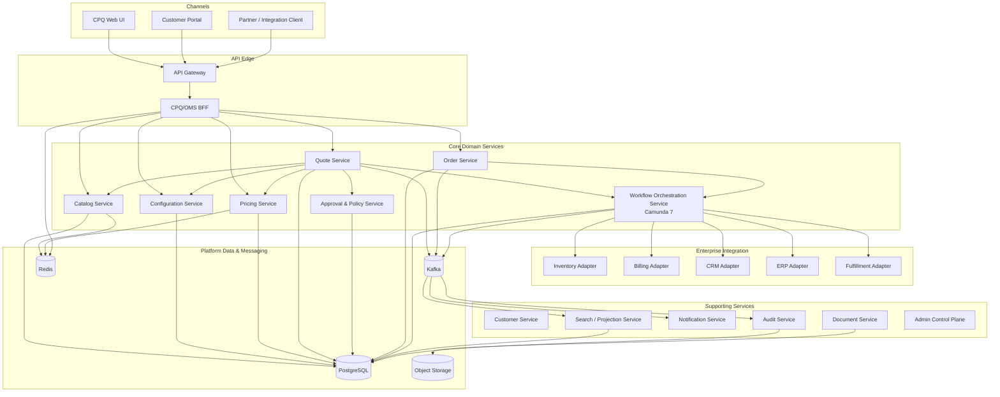
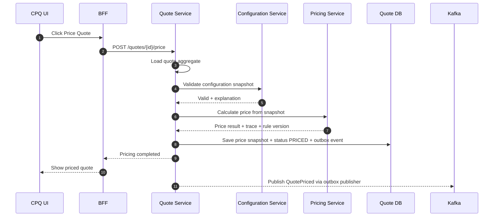
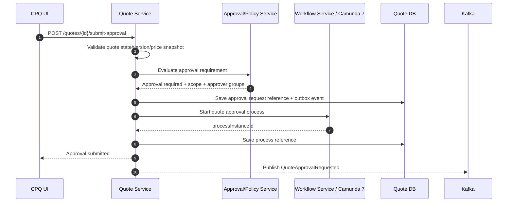
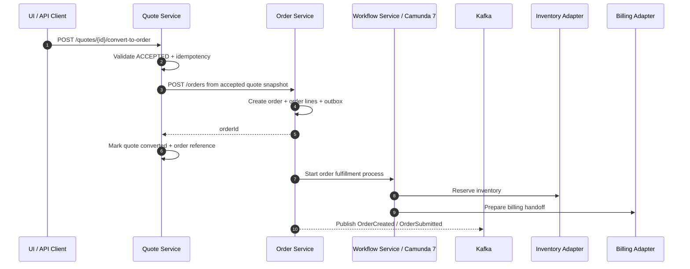

# Part 004 — Reference Architecture and Service Boundaries

Sekarang kita punya bar requirement.

Pertanyaan berikutnya:

> Bagaimana membagi sistem CPQ/OMS menjadi service boundary yang tidak rapuh?

Jawaban buruk:

```text
Buat service berdasarkan tabel:
ProductService, QuoteService, OrderService, PriceService, UserService.
```

Jawaban itu terlihat rapi, tapi sering gagal di enterprise system.

Service boundary tidak boleh hanya mengikuti entity. Boundary harus mengikuti:

- ownership keputusan bisnis
- lifecycle yang berbeda
- consistency requirement
- data authority
- failure isolation
- team ownership
- regulatory/audit responsibility
- change frequency
- integration pressure

CPQ/OMS adalah domain yang deceptively complex. Dari luar terlihat seperti flow sederhana:

```text
Configure -> Price -> Quote -> Approve -> Order -> Fulfill
```

Tetapi dalam enterprise implementation, setiap panah membawa aturan, exception, versioning, audit, dan integration contract.

---

## 1. Prinsip Boundary

Kita akan memakai lima prinsip utama.

### 1.1 Boundary Memiliki Data Authority

Service yang benar bukan hanya punya endpoint. Ia punya otoritas atas data tertentu.

Contoh:

```text
Quote Service owns quote lifecycle and quote version.
Pricing Service owns price calculation logic and price trace.
Catalog Service owns product offering version.
Order Service owns customer order lifecycle.
Workflow Service owns process orchestration state.
```

Jika dua service sama-sama bisa mengubah status quote, boundary sudah bocor.

### 1.2 Boundary Memiliki Decision Authority

Beberapa service tidak hanya menyimpan data; mereka membuat keputusan.

Contoh:

| Service | Decision Authority |
|---|---|
| Configuration Service | Apakah konfigurasi produk valid? |
| Pricing Service | Berapa harga dan komponennya? |
| Approval/Policy Service | Apakah quote butuh approval dan siapa yang boleh approve? |
| Order Orchestration Service | Step fulfillment apa yang harus dijalankan? |
| Inventory Adapter | Bagaimana menerjemahkan reservation request ke sistem inventory eksternal? |

Jangan campur decision authority tanpa alasan kuat.

### 1.3 Boundary Mengikuti Transaction Boundary

Dalam microservices, transaksi ACID lintas service harus dihindari.

Maka kita harus tahu state mana yang harus committed bersama.

Contoh:

```text
Quote status update + quote version update + audit record + outbox event
```

Ini sebaiknya satu transaksi di Quote Service.

Tapi:

```text
Quote accepted + Order created + Inventory reserved + Billing account updated
```

Ini tidak realistis sebagai satu transaksi. Ini harus menjadi orchestration/saga.

### 1.4 Boundary Mengikuti Failure Boundary

Jika pricing service down, apakah quote draft masih bisa diedit?

Jika document service down, apakah order fulfillment harus berhenti?

Jika notification service down, apakah quote acceptance harus gagal?

Boundary yang baik membuat failure bisa didegradasi secara terkendali.

### 1.5 Boundary Mengikuti Change Frequency

Pricing rule sering berubah. Product catalog berubah dengan siklus bisnis. Order orchestration berubah karena integrasi fulfillment. Audit schema sebaiknya sangat stabil.

Service yang berubah dengan alasan berbeda sebaiknya tidak dipaksa berada dalam modul runtime yang sama jika dampaknya besar.

---

## 2. Reference Architecture Besar



Diagram ini bukan deployment final. Ini reference map.

Beberapa service bisa digabung pada tahap awal, tetapi boundary konseptualnya harus tetap jelas.

---

## 3. Service Boundary Catalog

### 3.1 Catalog Service

Catalog Service adalah authority untuk product offering.

Owned concepts:

- product specification
- product offering
- bundle
- option
- attribute definition
- compatibility metadata
- eligibility metadata
- commercial metadata
- fulfillment metadata
- catalog version
- effective dating

Tidak boleh dimiliki Catalog Service:

- quote line decision
- customer-specific discount
- final accepted price
- order fulfillment state

Primary APIs:

```http
GET /catalog/product-offerings
GET /catalog/product-offerings/{id}
GET /catalog/versions/{version}/product-offerings/{id}
POST /catalog/publications
```

Events:

```text
CatalogVersionPublished
ProductOfferingRetired
ProductOfferingChanged
```

Database authority:

```text
catalog_product_spec
catalog_product_offering
catalog_product_option
catalog_product_constraint
catalog_version
catalog_publication
```

Important invariant:

```text
Published catalog versions are immutable.
```

Why?

Quote history depends on catalog version stability.

---

### 3.2 Configuration Service

Configuration Service adalah authority untuk validitas konfigurasi produk.

Owned concepts:

- configuration session
- option selection
- configuration rule
- compatibility graph
- validation result
- configuration explanation

Tidak boleh dimiliki Configuration Service:

- final quote status
- final price
- approval decision
- order state

Primary APIs:

```http
POST /configurations/validate
POST /configurations/explain
POST /configuration-sessions
PATCH /configuration-sessions/{id}
```

Events:

```text
ConfigurationValidated
ConfigurationInvalidated
```

Important invariant:

```text
A configuration validation result must reference catalog version and rule version.
```

Configuration Service boleh stateless untuk simple validation, atau stateful untuk complex guided selling. Keputusan ini tergantung UX dan kompleksitas rule.

---

### 3.3 Pricing Service

Pricing Service adalah authority untuk price calculation.

Owned concepts:

- price list
- price rule
- discount rule
- promotion rule
- surcharge rule
- rounding policy
- price component
- price trace
- pricing rule version

Tidak boleh dimiliki Pricing Service:

- quote lifecycle
- approval workflow
- order fulfillment
- customer order state

Primary APIs:

```http
POST /prices/calculate
POST /prices/explain
GET /pricing-rules/{version}
```

Events:

```text
PricingRulePublished
PromotionActivated
PromotionExpired
```

Important invariant:

```text
Pricing calculation result must be deterministic for the same input snapshot and rule version.
```

Jika pricing service membaca live mutable catalog/customer data tanpa snapshot, deterministic behavior akan rusak.

---

### 3.4 Quote Service

Quote Service adalah authority untuk quote lifecycle.

Owned concepts:

- quote
- quote version
- quote line
- quote line tree
- quote material change
- quote status
- quote price snapshot reference
- quote approval reference
- quote acceptance
- quote expiry

Tidak boleh dimiliki Quote Service:

- product catalog master
- pricing rule master
- approval authority policy master
- order orchestration internals

Primary APIs:

```http
POST /quotes
GET /quotes/{id}
PATCH /quotes/{id}
POST /quotes/{id}/lines
PATCH /quotes/{id}/lines/{lineId}
POST /quotes/{id}/price
POST /quotes/{id}/submit-approval
POST /quotes/{id}/accept
POST /quotes/{id}/convert-to-order
```

Events:

```text
QuoteCreated
QuoteLineAdded
QuoteMateriallyChanged
QuotePriced
QuoteApprovalRequested
QuoteApproved
QuoteRejected
QuoteAccepted
QuoteExpired
QuoteConvertedToOrder
```

Important invariant:

```text
Quote Service is the only service allowed to transition quote lifecycle state.
```

Quote Service boleh memanggil Pricing Service, Configuration Service, dan Approval Service. Tetapi hasilnya harus disimpan sebagai quote-owned snapshot/reference sesuai lifecycle.

---

### 3.5 Approval & Policy Service

Approval/Policy Service adalah authority untuk commercial governance.

Owned concepts:

- approval policy
- approval matrix
- approval request
- approval decision
- approver authority
- escalation rule
- delegation
- policy version

Tidak boleh dimiliki Approval Service:

- quote line mutation
- product catalog definition
- order fulfillment state

Primary APIs:

```http
POST /approval/evaluate
POST /approval/requests
POST /approval/requests/{id}/approve
POST /approval/requests/{id}/reject
GET /approval/policies/{version}
```

Events:

```text
ApprovalRequired
ApprovalRequested
ApprovalGranted
ApprovalRejected
ApprovalInvalidated
ApprovalEscalated
```

Important invariant:

```text
Approval decision must reference the exact quote version and approval scope.
```

Approval process bisa dijalankan dengan Camunda user task, tetapi authority policy-nya tetap harus jelas.

---

### 3.6 Order Service

Order Service adalah authority untuk customer order lifecycle.

Owned concepts:

- customer order
- order version
- order line
- order decomposition result
- order status
- order amendment
- order cancellation
- order commercial snapshot

Tidak boleh dimiliki Order Service:

- quote mutation
- pricing master rule
- external inventory implementation detail
- workflow engine internals

Primary APIs:

```http
POST /orders
GET /orders/{id}
POST /orders/{id}/submit
POST /orders/{id}/cancel
POST /orders/{id}/amend
```

Events:

```text
OrderCreated
OrderSubmitted
OrderDecomposed
OrderFulfillmentStarted
OrderCompleted
OrderCancelled
OrderFalloutRaised
```

Important invariant:

```text
Order created from quote must preserve accepted quote commercial snapshot.
```

Order Service tidak boleh menghitung ulang harga dari rule saat order dibuat, kecuali business explicitly demands repricing. Default aman: preserve accepted quote.

---

### 3.7 Workflow Orchestration Service With Camunda 7

Workflow Service mengelola long-running business process.

Owned concepts:

- process definition deployment
- process instance
- business key
- task correlation
- external task worker interaction
- retry policy
- incident classification
- compensation path
- process migration policy

Tidak boleh dimiliki Workflow Service:

- source-of-truth domain aggregate
- final commercial data
- product catalog master
- price master

Primary APIs:

```http
POST /workflows/quote-approval/start
POST /workflows/order-fulfillment/start
POST /workflows/messages/correlate
GET /workflows/business-keys/{businessKey}
```

Events:

```text
WorkflowStarted
WorkflowTaskCreated
WorkflowTaskCompleted
WorkflowIncidentRaised
WorkflowCompleted
WorkflowCompensationStarted
```

Important invariant:

```text
Workflow state coordinates domain services but does not replace domain state.
```

Camunda process instance is not the order. It orchestrates order progress.

Jika order status hanya hidup di Camunda variable, sistem akan sulit dicari, diaudit, dan diintegrasikan.

---

### 3.8 Customer Service

Customer Service adalah authority untuk customer/account identity relevant to CPQ/OMS.

Owned concepts:

- customer account reference
- billing account reference
- contact
- customer segment
- eligibility attribute

Batas penting:

Customer Service dalam seri ini bukan full CRM. Ia menjadi anti-corruption layer untuk customer data yang dibutuhkan CPQ/OMS.

Primary APIs:

```http
GET /customers/{id}
GET /customers/{id}/eligibility-context
```

Events:

```text
CustomerSegmentChanged
CustomerEligibilityChanged
```

Important invariant:

```text
Quote must store customer reference and required customer snapshot, not depend entirely on mutable customer profile.
```

---

### 3.9 Document Service

Document Service membuat dan menyimpan artifact.

Owned concepts:

- quote proposal PDF
- order confirmation PDF
- document template
- template version
- generated document metadata
- storage reference

Tidak boleh dimiliki Document Service:

- quote lifecycle decision
- order lifecycle decision
- approval decision

Primary APIs:

```http
POST /documents/quote-proposals
GET /documents/{id}
```

Events:

```text
DocumentGenerated
DocumentGenerationFailed
```

Important invariant:

```text
Generated document must reference the source business snapshot and template version.
```

---

### 3.10 Notification Service

Notification Service mengirim komunikasi.

Owned concepts:

- notification request
- channel
- template
- template version
- delivery attempt
- delivery status

Tidak boleh dimiliki Notification Service:

- quote acceptance
- approval decision
- order fulfillment state

Primary APIs:

```http
POST /notifications
GET /notifications/{id}
```

Events consumed:

```text
QuoteApprovalRequested
QuoteAccepted
OrderSubmitted
OrderFalloutRaised
```

Events emitted:

```text
NotificationSent
NotificationFailed
```

Important invariant:

```text
Notification failure must not silently change business lifecycle state.
```

---

### 3.11 Audit Service

Audit Service menyimpan evidence lintas domain.

Owned concepts:

- audit event
- actor
- action
- resource
- before/after
- reason
- correlation id
- business key
- retention policy

Primary APIs:

```http
POST /audit-events
GET /audit-events?resourceType=Quote&resourceId={id}
```

Important invariant:

```text
Audit records must be append-only from business perspective.
```

Audit bisa diisi melalui event stream, synchronous write, atau hybrid. Untuk commercial critical actions, service owner biasanya juga menyimpan local audit atau outbox event agar evidence tidak hilang.

---

### 3.12 Search / Projection Service

Search Service menyediakan read model untuk query yang tidak cocok di transactional aggregate.

Owned concepts:

- quote search document
- order search document
- task search document
- projection lag
- index rebuild state

Tidak boleh dimiliki Search Service:

- quote source of truth
- order source of truth
- approval decision source of truth

Primary APIs:

```http
GET /search/quotes
GET /search/orders
GET /search/tasks
```

Important invariant:

```text
Search result is eventually consistent and must not be used as source of truth for irreversible command validation.
```

---

### 3.13 Admin Control Plane

Admin Control Plane mengelola configuration dan operational controls.

Owned concepts:

- feature flag
- rule publication control
- process deployment control
- tenant configuration
- operational override
- maintenance mode

Batas penting:

Admin Control Plane tidak boleh menjadi backdoor untuk bypass invariant domain.

Jika admin perlu repair, repair harus berupa command yang audit-safe.

---

## 4. Why Not One CPQ Service And One OMS Service?

Untuk versi awal, mungkin masuk akal membuat modular monolith atau fewer services.

Tetapi boundary tetap perlu dipisah secara konseptual.

Masalah jika semua digabung tanpa boundary:

- pricing rule berubah lalu quote lifecycle ikut regression
- catalog model berubah lalu order fulfillment rusak
- workflow variable menjadi source of truth
- approval logic tersebar di UI, quote service, dan process script
- audit tidak konsisten
- integration retry mengunci transaksi utama
- search query membebani write database
- release kecil menjadi berisiko besar

Jadi pertanyaannya bukan:

```text
Haruskah semua boundary menjadi microservice fisik sejak hari pertama?
```

Pertanyaan yang benar:

```text
Apakah ownership, transaction boundary, dan failure boundary sudah eksplisit sejak hari pertama?
```

---

## 5. Recommended Initial Runtime Shape

Untuk build-from-scratch yang tetap realistis, kita bisa mulai dengan hybrid:

```text
1. Core CPQ services as separate deployables:
   - catalog-service
   - configuration-service
   - pricing-service
   - quote-service

2. Core OMS services as separate deployables:
   - order-service
   - workflow-service

3. Supporting services:
   - audit-service
   - notification-service
   - document-service
   - search-service

4. Integration adapters:
   - inventory-adapter
   - billing-adapter
   - crm-adapter
   - fulfillment-adapter
```

Jika resource tim kecil, beberapa supporting services bisa dimulai sebagai module terpisah dalam deployable yang sama. Tetapi public contract dan data authority tetap dipisah.

---

## 6. Service Ownership Matrix

| Capability | Owner Service | Source of Truth | Sync API? | Event? | Workflow? |
|---|---|---|---|---|---|
| Product offering | Catalog | Catalog DB | Yes | Yes | No |
| Configuration validation | Configuration | Config rules DB | Yes | Optional | No |
| Price calculation | Pricing | Pricing rules DB | Yes | Yes for rule publication | No |
| Quote lifecycle | Quote | Quote DB | Yes | Yes | Starts approval workflow |
| Approval policy | Approval/Policy | Approval DB | Yes | Yes | Often yes |
| Order lifecycle | Order | Order DB | Yes | Yes | Starts fulfillment workflow |
| Fulfillment orchestration | Workflow | Camunda DB + domain state | Internal/API | Yes | Yes |
| Inventory reservation | Inventory Adapter | External system + adapter log | Yes/Async | Yes | Used by workflow |
| Notification delivery | Notification | Notification DB | Async preferred | Yes | No |
| Audit trail | Audit | Audit DB | Yes/Event | Yes | No |
| Search | Search | Projection DB/index | Query only | Consumes | No |

---

## 7. Interaction Pattern: Price Quote



Important detail:

Quote Service owns the lifecycle transition to `PRICED`. Pricing Service owns calculation, not quote state.

---

## 8. Interaction Pattern: Submit Quote For Approval



Ada variasi desain: workflow bisa dimulai sebelum/bersama update quote. Namun kita harus menjaga failure path.

Jika DB commit berhasil tapi start workflow gagal, perlu recovery job.

Jika workflow start berhasil tapi DB update gagal, perlu compensation/correlation cleanup.

Untuk mengurangi risiko, sering lebih aman:

1. Quote Service commit state `APPROVAL_REQUEST_PENDING_WORKFLOW_START` + outbox.
2. Workflow starter worker membaca outbox/internal command.
3. Setelah Camunda process start, Quote Service dikorelasikan kembali.

Itu sedikit lebih kompleks, tapi failure-nya lebih recoverable.

---

## 9. Interaction Pattern: Convert Quote To Order



Potential issue:

Quote Service and Order Service are separate transaction boundaries.

We need idempotency and reconciliation.

Safer variant:

```text
Quote Service records conversion intent.
Order Service consumes QuoteAccepted/QuoteConversionRequested.
Order Service creates order idempotently.
Quote Service receives OrderCreated and records order reference.
```

Trade-off:

- synchronous variant easier for UX
- async variant more resilient
- both need idempotency

---

## 10. Data Ownership Rule

Setiap service punya database sendiri secara logical ownership.

Ini tidak selalu berarti cluster PostgreSQL berbeda. Tetapi schema ownership harus jelas.

```text
catalog_service owns catalog schema
quote_service owns quote schema
order_service owns order schema
workflow_service owns camunda schema
```

Anti-pattern:

```sql
-- Pricing service directly joins quote_service.quote_line in production path
SELECT *
FROM quote.quote_line ql
JOIN pricing.price_rule pr ON ...
```

Kenapa buruk?

Karena Pricing Service menjadi tergantung struktur internal Quote Service.

Lebih baik Pricing Service menerima pricing input snapshot:

```json
{
  "tenantId": "tenant_a",
  "quoteId": "quo_123",
  "quoteVersion": 7,
  "catalogVersion": 15,
  "customerSegment": "enterprise",
  "lines": [
    {
      "lineId": "ql_1",
      "productOfferingId": "fiber_100",
      "quantity": 1,
      "selectedOptions": []
    }
  ]
}
```

---

## 11. API Boundary Rule

OpenAPI-first contract bukan hanya dokumentasi.

Untuk seri ini:

- setiap service public API punya OpenAPI contract
- DTO API tidak sama dengan entity JPA
- generated code boleh dipakai di edge, bukan menular ke domain model
- error model harus konsisten
- idempotency header distandardisasi
- pagination/filtering distandardisasi
- compatibility check masuk CI

Contoh boundary:

```text
API DTO -> Application Command -> Domain Model -> Persistence Entity
```

Jangan lakukan:

```text
JPA Entity = API Request = Kafka Event = Camunda Variable
```

Itu mempercepat demo, tapi menghancurkan evolvability.

---

## 12. Event Boundary Rule

Event adalah fakta yang sudah terjadi, bukan permintaan terselubung.

Good event:

```text
QuoteAccepted
OrderCreated
ApprovalGranted
CatalogVersionPublished
```

Suspicious event:

```text
PleaseCreateOrder
DoPricingNow
SendEmailCommand
```

Command boleh dikirim via message, tapi namanya harus eksplisit sebagai command dan owner-nya jelas.

Untuk domain event, gunakan pola:

```json
{
  "eventId": "evt_01",
  "eventType": "QuoteAccepted",
  "eventVersion": 1,
  "tenantId": "tenant_a",
  "aggregateType": "Quote",
  "aggregateId": "quo_123",
  "aggregateVersion": 11,
  "occurredAt": "2026-07-02T11:00:00+07:00",
  "correlationId": "corr_abc",
  "causationId": "cmd_xyz",
  "payload": {}
}
```

---

## 13. Workflow Boundary Rule

Camunda 7 workflow harus diperlakukan sebagai orchestrator.

Ia bagus untuk:

- long-running process
- BPMN visibility
- human task
- async retry
- incident
- escalation
- compensation
- external task orchestration

Ia tidak boleh menjadi tempat utama untuk:

- quote aggregate state
- order aggregate state
- pricing rule
- product catalog
- audit source of truth tunggal
- authorization policy utama

Rule:

```text
Domain service owns business state.
Workflow owns process coordination state.
```

Contoh variabel Camunda yang aman:

```json
{
  "tenantId": "tenant_a",
  "businessKey": "order_ord_123",
  "orderId": "ord_123",
  "orderVersion": 3,
  "fulfillmentPlanId": "fp_456"
}
```

Contoh variabel Camunda yang berbahaya:

```json
{
  "allOrderLines": [...],
  "finalPrice": 1000000,
  "approvalMatrix": [...],
  "customerProfile": {...}
}
```

Camunda variable bukan pengganti database domain.

---

## 14. Redis Boundary Rule

Redis dalam seri ini dipakai untuk:

- cache catalog read model
- cache pricing reference data
- short-lived idempotency acceleration
- rate limiting
- distributed coordination ringan dengan caveat
- BFF session/cache

Redis tidak dipakai sebagai:

- source of truth quote/order
- source of truth accepted price
- source of truth approval
- source of truth audit
- satu-satunya idempotency record untuk irreversible command

Rule:

```text
Redis may accelerate decisions, but PostgreSQL must preserve commitments.
```

---

## 15. PostgreSQL Boundary Rule

PostgreSQL adalah source of truth untuk aggregate dan evidence.

Namun jangan menjadikannya shared database liar.

Allowed:

```text
Each service owns its schema.
A service may read/write only its own schema.
Cross-service data flows through API/events/projections.
```

Dangerous:

```text
Any service can join any table because all tables are in the same PostgreSQL instance.
```

Untuk local development, satu PostgreSQL instance boleh berisi banyak schema. Untuk production, keputusan instance/cluster tergantung scaling, isolation, compliance, dan operations.

Logical ownership tetap wajib.

---

## 16. BFF Boundary

BFF bukan tempat business logic utama.

BFF bertugas:

- compose UI-specific response
- reduce chatty calls
- handle view model
- handle session context
- perform lightweight orchestration for reads
- translate user journey to service calls

BFF tidak boleh:

- menghitung price final
- menentukan approval policy
- mengubah order lifecycle langsung di database
- bypass service authorization
- menyimpan source of truth quote/order

Rule:

```text
BFF optimizes experience. Domain services preserve truth.
```

---

## 17. Boundary Smells

Waspadai tanda-tanda berikut.

### 17.1 Shared Entity Smell

```text
All services import QuoteEntity.
```

Ini bukan microservices. Ini distributed monolith.

### 17.2 Workflow God Smell

```text
Camunda process variables contain the complete order aggregate.
```

Workflow menjadi database bayangan.

### 17.3 Pricing Leakage Smell

```text
Quote Service has many if/else for discount, promotion, price list, and rounding.
```

Pricing decision bocor ke Quote Service.

### 17.4 Catalog Mutability Smell

```text
Quote line only stores product code and always reads latest catalog.
```

Historical quote bisa berubah makna.

### 17.5 Event Command Confusion Smell

```text
Event name is OrderCreateRequest but published to topic domain-events.
```

Consumer tidak tahu ini fakta atau instruksi.

### 17.6 Admin Backdoor Smell

```text
Admin console can update quote status directly.
```

Invariant domain bisa dilewati.

---

## 18. Boundary Decision Record Template

Gunakan format ini untuk setiap service boundary.

```mdx
# ADR: <Boundary Name>

## Context
<Business and technical reason>

## Decision
<What this service owns and does not own>

## Owned Data
<Tables, schema, aggregate, snapshots>

## Owned Decisions
<Business decisions under this boundary>

## Public Contracts
<OpenAPI/event contracts>

## Consistency Model
<Strong/eventual/async orchestration>

## Failure Model
<What happens when this service is down or slow>

## Security Model
<Who can do what>

## Audit Model
<What evidence it records>

## Consequences
<Trade-offs>

## Rejected Alternatives
<Why not another boundary>
```

---

## 19. Example ADR: Pricing Service Boundary

### Context

Pricing changes frequently and has specialized commercial rules. Quote lifecycle needs pricing result, but should not own pricing logic.

### Decision

Create Pricing Service as owner of price calculation and price explanation.

### Owned Data

- price list
- price rule
- discount rule
- promotion rule
- rounding policy
- rule publication

### Owned Decisions

- calculate price components
- apply promotion rule
- apply discount eligibility
- explain price

### Public Contracts

```http
POST /prices/calculate
POST /prices/explain
```

Events:

```text
PricingRulePublished
PromotionActivated
PromotionExpired
```

### Consistency Model

Quote Service calls Pricing Service synchronously for interactive pricing. Quote Service stores returned price snapshot.

### Failure Model

If Pricing Service unavailable:

- quote editing may continue
- price action fails or becomes async pending
- quote cannot be accepted with dirty/missing price snapshot

### Security Model

Only authorized services/users can request manual override calculation.

### Audit Model

Pricing Service records rule version and calculation trace. Quote Service records selected price snapshot attached to quote.

### Consequences

Pros:

- pricing evolves independently
- quote lifecycle remains clean
- reproducibility improves

Cons:

- snapshot contract must be strict
- latency must be managed
- version compatibility is required

### Rejected Alternative

Put pricing logic inside Quote Service.

Rejected because pricing changes frequently and would contaminate quote lifecycle with commercial rule complexity.

---

## 20. Deployment Boundary Is Not Always Domain Boundary

Ada tiga level boundary:

```text
Conceptual boundary: ownership and model separation
Code boundary: module/package separation
Runtime boundary: independently deployed service
```

Jangan lompat langsung ke runtime boundary tanpa conceptual boundary.

Untuk tahap awal:

- conceptual boundary harus jelas sejak awal
- code boundary harus cukup kuat
- runtime boundary bisa bertahap

Contoh evolusi:

```text
Stage 1: Modular monolith with catalog/pricing/quote/order modules
Stage 2: Extract pricing and catalog as services
Stage 3: Extract workflow/order integration separately
Stage 4: Scale projections, notifications, document generation independently
```

Tetapi karena seri ini membangun microservices production-grade, kita akan langsung mendesain service deployable. Namun kita tetap akan menjaga agar reasoning-nya tidak sekadar “karena microservices”.

---

## 21. Recommended Repository-Level Shape

Detail repository akan dibahas di Part 005, tetapi boundary awalnya seperti ini:

```text
learn-enterprise-cpq-oms-camunda7/
  contracts/
    openapi/
      catalog-service.yaml
      configuration-service.yaml
      pricing-service.yaml
      quote-service.yaml
      order-service.yaml
      workflow-service.yaml
    events/
      quote-events.schema.json
      order-events.schema.json
      catalog-events.schema.json
  services/
    catalog-service/
    configuration-service/
    pricing-service/
    quote-service/
    approval-service/
    order-service/
    workflow-service/
    audit-service/
    notification-service/
    document-service/
    search-service/
  adapters/
    inventory-adapter/
    billing-adapter/
    crm-adapter/
    fulfillment-adapter/
  platform/
    docker-compose/
    database/
    kafka/
    redis/
    camunda/
  docs/
    adr/
    runbooks/
    decision-models/
```

Rule:

```text
Contracts are first-class source artifacts.
```

---

## 22. Architecture Review Questions

Sebelum menerima service boundary, tanyakan:

1. Data apa yang service ini miliki?
2. Keputusan bisnis apa yang service ini buat?
3. State transition apa yang hanya boleh dilakukan service ini?
4. Apa yang terjadi jika service ini down?
5. Apakah service ini butuh synchronous API, event, atau workflow?
6. Apakah service ini menyimpan snapshot atau reference?
7. Apa audit evidence yang wajib disimpan?
8. Bagaimana contract-nya berevolusi?
9. Apakah ada in-flight process yang terdampak?
10. Apa alternatif boundary yang ditolak dan kenapa?

Jika jawaban tidak jelas, boundary belum matang.

---

## 23. Minimal End-To-End Flow Dengan Boundary

```mermaid
flowchart LR
    A[Catalog publishes product offering version] --> B[Sales creates quote]
    B --> C[Configuration validates selected options]
    C --> D[Pricing calculates price snapshot]
    D --> E[Quote stores priced version]
    E --> F[Approval policy evaluates requirement]
    F --> G[Camunda starts approval workflow]
    G --> H[Approver approves task]
    H --> I[Quote becomes approved]
    I --> J[Customer accepts quote]
    J --> K[Order service creates order from snapshot]
    K --> L[Camunda orchestrates fulfillment]
    L --> M[Inventory/Billing/Fulfillment adapters execute steps]
    M --> N[Order completed or fallout]
```



Setiap panah punya contract. Setiap state change punya owner.

---

## 24. What We Will Build Next

Part berikutnya akan masuk ke repository layout dan engineering foundation.

Kita akan mendesain:

- folder structure
- Maven module boundary
- contract-first build flow
- generated code boundary
- shared library rule
- local development stack
- database schema ownership
- service bootstrap convention
- baseline CI gates

Tujuannya bukan membuat skeleton kosong.

Tujuannya membuat fondasi repo yang mencegah arsitektur membusuk sejak commit pertama.

---

## 25. Checklist Part 004

Pastikan kamu bisa menjawab:

- Kenapa service boundary tidak boleh hanya mengikuti entity?
- Apa bedanya data authority dan decision authority?
- Kenapa Quote Service boleh menyimpan price snapshot tapi tidak memiliki pricing rule?
- Kenapa Workflow Service tidak boleh menjadi source of truth order?
- Kenapa BFF tidak boleh berisi commercial business logic?
- Kenapa Redis tidak boleh menyimpan commercial commitment final?
- Apa risiko shared database tanpa schema ownership?
- Kapan boundary konseptual tidak harus langsung menjadi service deployable?

---

## 26. Ringkasan

Reference architecture CPQ/OMS harus menjaga ownership.

Boundary utama seri ini:

- Catalog Service owns product offering versions
- Configuration Service owns product validity decisions
- Pricing Service owns calculation and price trace
- Quote Service owns quote lifecycle
- Approval/Policy Service owns commercial governance
- Order Service owns customer order lifecycle
- Workflow Service with Camunda 7 owns orchestration state
- Integration adapters isolate external systems
- Audit/Search/Document/Notification support enterprise operation

Prinsip paling penting:

```text
Domain services own truth.
Workflow coordinates long-running process.
Events distribute committed facts.
Read models serve query experience.
Caches accelerate but do not own commitments.
```

Dengan boundary ini, kita bisa mulai membangun repository dan engineering foundation secara serius di Part 005.
