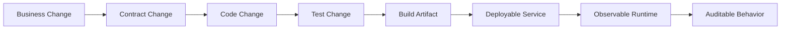
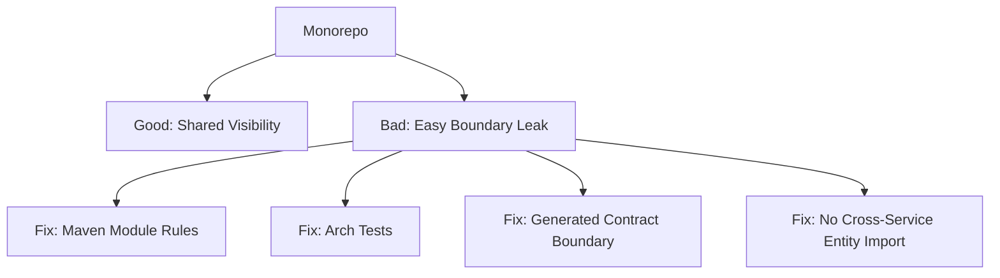
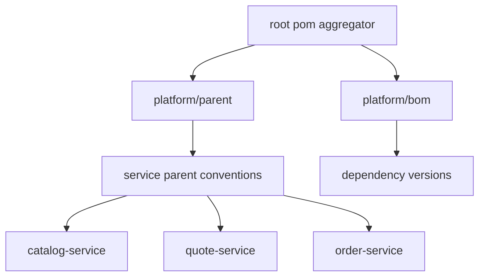
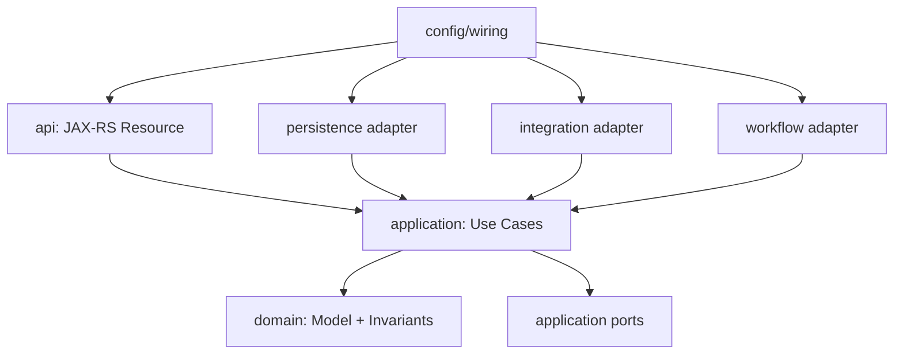
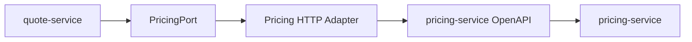
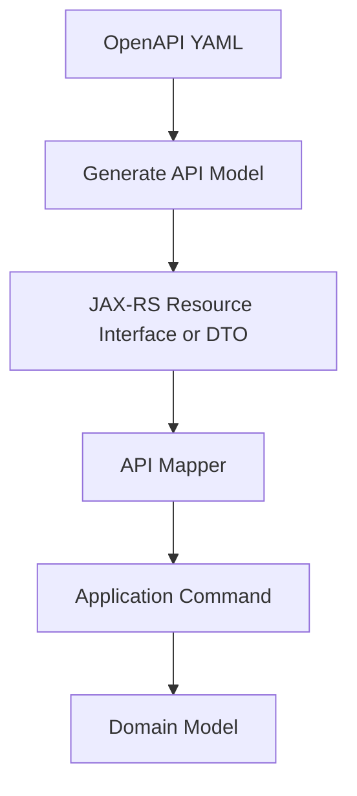
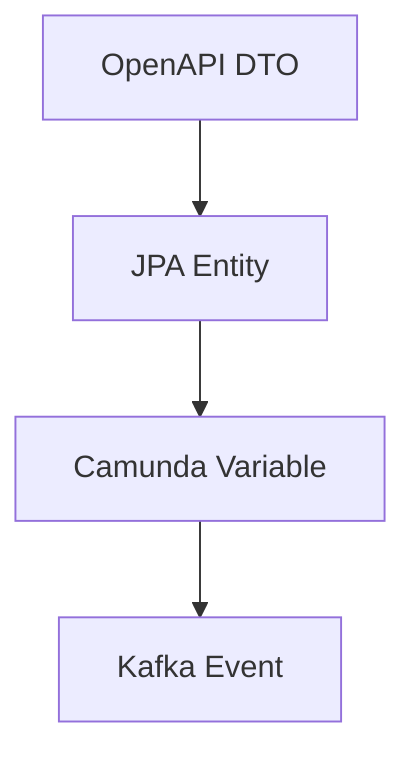
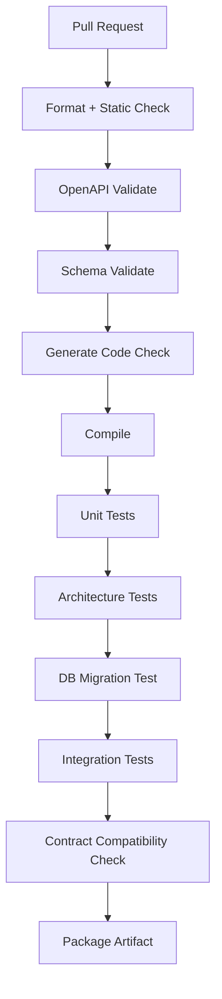
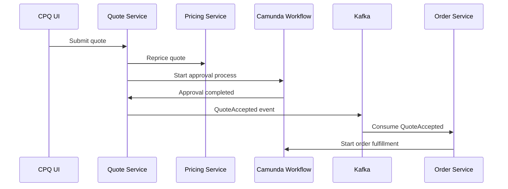

# Part 005 — Repository Layout and Engineering Foundation

Kita belum menulis satu endpoint pun.

Itu sengaja.

Platform CPQ/OMS enterprise tidak gagal karena engineer tidak bisa membuat REST API. Platform seperti ini gagal karena sejak awal repository-nya sudah tidak memberi pagar terhadap kompleksitas: contract bercampur dengan entity, workflow bercampur dengan pricing, event schema hidup di tempat berbeda dari publisher, test fixture tidak mewakili skenario bisnis, dan build pipeline tidak bisa membedakan perubahan aman dari perubahan berbahaya.

Part ini membangun **engineering foundation**: bagaimana bentuk repository, module, dependency boundary, generated code boundary, quality gate, dan workflow kerja agar sistem bisa tumbuh tanpa berubah menjadi bola lumpur.

Materi ini bukan tutorial Maven dasar. Kita hanya memakai Maven sebagai alat struktur. Fokusnya adalah bagaimana repository menjadi **mesin produksi software enterprise**, bukan folder tempat menaruh source code.

---

## 1. Target Part Ini

Setelah part ini, kamu harus bisa menjawab pertanyaan berikut dengan tegas:

1. Di mana kontrak OpenAPI disimpan?
2. Di mana event schema disimpan?
3. Di mana generated DTO boleh hidup?
4. Apakah service boleh import entity dari service lain?
5. Bagaimana memisahkan domain model, API model, persistence model, dan workflow model?
6. Apa yang dicek CI sebelum merge?
7. Bagaimana layout repository mencegah dependency leak?
8. Bagaimana engineer baru memahami sistem dari folder structure saja?
9. Apa batas shared library yang sehat?
10. Bagaimana kita mencegah CPQ/OMS menjadi satu monolith microservice palsu?

Kalau repository tidak bisa membantu menjawab itu, repository belum siap untuk sistem enterprise.

---

## 2. Mental Model: Repository Sebagai Factory

Repository enterprise bukan hanya tempat menyimpan kode.

Repository adalah **factory** yang menerima perubahan mentah dan menghasilkan artifact yang dapat dipercaya:



Perubahan bisnis pada CPQ/OMS biasanya terlihat sederhana:

> Diskon lebih dari 25% harus butuh approval regional manager.

Tetapi efek teknisnya menyebar:

- price calculation harus menghasilkan trace baru,
- quote lifecycle mungkin berubah,
- approval policy berubah,
- BPMN quote approval bisa berubah,
- DMN decision table bisa berubah,
- API response mungkin perlu expose `approvalRequired`,
- audit event harus mencatat decision reason,
- test scenario harus menambahkan variasi quote,
- production support perlu tahu bagaimana mengecek stuck approval.

Repository yang sehat membuat dampak itu terlihat.

Repository yang buruk menyembunyikannya sampai production incident.

---

## 3. Baseline Keputusan: Modular Monorepo Untuk Reference Implementation

Untuk seri ini, baseline yang paling efektif adalah **modular monorepo**.

Bukan karena monorepo selalu lebih baik, tapi karena tujuan kita adalah membangun sistem CPQ/OMS dari scratch dengan banyak boundary yang harus dipelajari bersama.

### Kenapa modular monorepo masuk akal untuk seri ini?

1. **Contract bisa direview bersama implementasi.**
2. **Shared test fixture bisa konsisten.**
3. **Cross-service refactoring lebih mudah saat fase learning/building.**
4. **CI bisa menjalankan dependency-aware build.**
5. **Arsitektur terlihat dalam satu pohon.**
6. **Kita bisa melatih boundary tanpa overhead organisasi multirepo.**

### Apa bahayanya?

Monorepo bisa membuat engineer malas menjaga batas.

Karena semua source code dekat, service A bisa tergoda import class internal service B. Ini adalah kegagalan boundary.

Solusinya bukan langsung multirepo.

Solusinya adalah **module boundary + dependency rule + CI enforcement**.



---

## 4. Struktur Repository Target

Kita akan memakai struktur seperti ini:

```txt
enterprise-cpq-oms/
  README.md
  pom.xml
  .editorconfig
  .gitignore
  .github/
    workflows/
      ci.yml
      contract-check.yml
      migration-check.yml
  docs/
    adr/
    architecture/
    runbooks/
    decision-traces/
  build-tools/
    openapi/
    schema/
    quality-gates/
  contracts/
    openapi/
      catalog-service/
      configuration-service/
      pricing-service/
      quote-service/
      order-service/
      workflow-service/
      notification-service/
      document-service/
    events/
      catalog/
      pricing/
      quote/
      order/
      workflow/
    examples/
  platform/
    bom/
    parent/
    testkit/
    observability/
    security/
    common-errors/
  services/
    catalog-service/
    configuration-service/
    pricing-service/
    quote-service/
    order-service/
    workflow-service/
    audit-service/
    search-service/
    notification-service/
    document-service/
    bff-service/
  deployments/
    local/
    dev/
    staging/
    prod-template/
  tools/
    scripts/
    local-dev/
```

Folder ini bukan dekorasi. Setiap folder punya kontrak sosial.

| Folder | Tanggung Jawab | Batas Keras |
|---|---|---|
| `contracts/openapi` | Kontrak HTTP API | Tidak boleh berisi logic Java |
| `contracts/events` | Kontrak event Kafka | Tidak boleh mengambil bentuk dari JPA entity |
| `platform/bom` | Versi dependency terkontrol | Tidak boleh memuat business logic |
| `platform/testkit` | Fixture dan helper test lintas service | Tidak boleh menjadi tempat logic production |
| `services/*` | Implementasi service | Tidak boleh import internal package service lain |
| `docs/adr` | Keputusan arsitektur | Tidak boleh diganti diam-diam tanpa alasan |
| `deployments` | Manifest runtime | Tidak boleh menjadi sumber config bisnis |

---

## 5. Maven Layout: Ikuti Convention, Jangan Berdebat Dengan Tooling

Maven punya standard directory layout yang umum dipakai seperti `src/main/java`, `src/main/resources`, `src/test/java`, dan `src/test/resources`. Keuntungannya sederhana: engineer Java yang melihat module baru langsung tahu di mana source, resource, dan test berada.

Di enterprise project, convention seperti ini bernilai besar karena menurunkan cognitive load.

Struktur module service akan terlihat seperti ini:

```txt
services/quote-service/
  pom.xml
  src/
    main/
      java/
        com/acme/cpqoms/quote/
          api/
          application/
          domain/
          persistence/
          integration/
          workflow/
          config/
      resources/
        META-INF/
          persistence.xml
        db/
          migration/
        logback.xml
    test/
      java/
        com/acme/cpqoms/quote/
      resources/
    integration-test/
      java/
      resources/
```

Kita tidak melawan Maven convention hanya untuk terlihat unik.

Yang kita modifikasi adalah **module boundary**, bukan directory convention.

---

## 6. Root POM: Aggregator, Bukan Tempat Kekacauan

Root `pom.xml` sebaiknya menjadi aggregator.

Contoh bentuknya:

```xml
<project>
  <modelVersion>4.0.0</modelVersion>

  <groupId>com.acme.cpqoms</groupId>
  <artifactId>enterprise-cpq-oms</artifactId>
  <version>1.0.0-SNAPSHOT</version>
  <packaging>pom</packaging>

  <modules>
    <module>platform/bom</module>
    <module>platform/parent</module>
    <module>platform/testkit</module>
    <module>platform/common-errors</module>
    <module>platform/security</module>

    <module>services/catalog-service</module>
    <module>services/configuration-service</module>
    <module>services/pricing-service</module>
    <module>services/quote-service</module>
    <module>services/order-service</module>
    <module>services/workflow-service</module>
    <module>services/audit-service</module>
    <module>services/search-service</module>
    <module>services/notification-service</module>
    <module>services/document-service</module>
    <module>services/bff-service</module>
  </modules>
</project>
```

Root POM tidak seharusnya menjadi tempat seluruh plugin, dependency, profile, dan special case dilempar tanpa struktur.

Gunakan pola ini:



### Prinsipnya

- `root pom` tahu daftar module.
- `platform/bom` tahu versi dependency.
- `platform/parent` tahu plugin dan build convention.
- service POM hanya menyatakan dependency yang benar-benar dipakai.

Kalau service POM penuh dengan override, foundation belum stabil.

---

## 7. BOM: Dependency Version Sebagai Governance

Enterprise CPQ/OMS tidak boleh membiarkan setiap service memilih versi library sendiri.

Buat BOM internal:

```txt
platform/bom/
  pom.xml
```

Contoh konsep:

```xml
<dependencyManagement>
  <dependencies>
    <dependency>
      <groupId>org.glassfish.jersey</groupId>
      <artifactId>jersey-bom</artifactId>
      <version>${jersey.version}</version>
      <type>pom</type>
      <scope>import</scope>
    </dependency>

    <dependency>
      <groupId>org.eclipse.persistence</groupId>
      <artifactId>eclipselink</artifactId>
      <version>${eclipselink.version}</version>
    </dependency>

    <dependency>
      <groupId>org.camunda.bpm</groupId>
      <artifactId>camunda-bom</artifactId>
      <version>${camunda7.version}</version>
      <type>pom</type>
      <scope>import</scope>
    </dependency>
  </dependencies>
</dependencyManagement>
```

BOM bukan sekadar kenyamanan.

BOM adalah cara organisasi menjawab:

> Versi library apa yang diperbolehkan di sistem ini?

Tanpa BOM, kamu akan punya distributed dependency drift.

Distributed dependency drift berarti satu service memakai versi serializer A, service lain memakai versi B, bug muncul hanya di kombinasi tertentu, dan incident postmortem berakhir dengan kalimat: “ternyata versi library-nya beda.”

---

## 8. Parent POM: Build Policy, Bukan Business Policy

`platform/parent` berisi aturan build:

- compiler target,
- encoding,
- test plugin,
- integration test plugin,
- generated source directory,
- static analysis,
- dependency convergence,
- forbidden dependency,
- packaging convention,
- reproducible build setting.

Yang tidak boleh berada di parent POM:

- approval rule,
- pricing threshold,
- tenant behavior,
- product catalog default,
- workflow routing,
- environment secret.

Parent POM adalah build policy.

Business policy harus hidup di domain/config/rule artifact yang punya lifecycle sendiri.

---

## 9. Service Module Internal Layout

Setiap service memakai internal package yang konsisten:

```txt
com.acme.cpqoms.quote
  api
  application
  domain
  persistence
  integration
  workflow
  config
```

Bentuk ini bukan layered architecture textbook. Ini pagar praktis.

### `api`

Berisi Jersey/JAX-RS resource, request mapper, response mapper, exception mapper.

Tidak boleh berisi:

- pricing calculation,
- order decomposition,
- JPA query kompleks,
- Camunda process orchestration logic.

### `application`

Berisi use case orchestration dalam service boundary:

- `CreateQuoteCommandHandler`,
- `AddQuoteLineCommandHandler`,
- `SubmitQuoteForApprovalUseCase`,
- `AcceptQuoteUseCase`,
- transaction boundary,
- port interface ke dependency luar.

### `domain`

Berisi model bisnis dan invariant:

- `Quote`,
- `QuoteLine`,
- `QuoteStatus`,
- `PriceSnapshot`,
- `ApprovalRequirement`,
- domain service murni.

Domain tidak tahu Jersey, EclipseLink, Kafka, Redis, atau Camunda.

### `persistence`

Berisi JPA entity, repository implementation, query object, mapper antara entity dan domain.

Persistence tidak boleh menjadi domain.

### `integration`

Berisi Kafka producer/consumer, HTTP client adapter, Redis adapter, outbox publisher.

### `workflow`

Berisi adapter Camunda 7:

- process starter,
- external task handler,
- delegate,
- process variable mapper,
- business key builder,
- incident adapter.

Workflow package tidak boleh mengandung seluruh business logic. Camunda mengorkestrasi, domain memutuskan.

### `config`

Berisi wiring, dependency injection, resource registration, persistence config, client config.

---

## 10. Dependency Rule Di Dalam Service

Rule sederhana:



Lebih eksplisit:

| Package | Boleh Depend Ke | Tidak Boleh Depend Ke |
|---|---|---|
| `domain` | Java standard/value types internal | JAX-RS, JPA, Kafka, Redis, Camunda |
| `application` | domain, port interface | Jersey resource, concrete Kafka client, concrete Redis client |
| `api` | application, generated API model | JPA entity, Camunda runtime service langsung |
| `persistence` | application port, domain mapper, JPA | JAX-RS resource |
| `integration` | application port, external clients | API resource |
| `workflow` | application use case/port | JPA entity exposed as process variable |
| `config` | semua untuk wiring | business decision logic |

Kalau `QuoteResource` memanggil `EntityManager` langsung, boundary bocor.

Kalau `QuoteEntity` dipakai sebagai response API, boundary bocor.

Kalau Camunda process variable menyimpan JPA entity, boundary bocor dan future migration menjadi mahal.

---

## 11. Cross-Service Dependency Rule

Service tidak boleh import class internal service lain.

Salah:

```java
import com.acme.cpqoms.pricing.domain.PriceCalculationResult;
```

Benar:

```java
import com.acme.cpqoms.pricing.client.model.PriceCalculationResponse;
```

Atau lebih baik lagi:

```java
import com.acme.cpqoms.quote.application.port.PricingPort;
```

Kemudian adapter HTTP/Kafka menerjemahkan kontrak eksternal ke port internal.



Cross-service contract lewat:

- OpenAPI,
- event schema,
- explicit client module generated,
- anti-corruption adapter.

Bukan lewat shared domain jar.

Shared domain jar antar-service adalah salah satu jalan tercepat menuju distributed monolith.

---

## 12. Generated Code Boundary

OpenAPI-first dan schema-first akan menghasilkan code.

Generated code berguna.

Generated code juga berbahaya jika dibiarkan masuk ke domain.

Aturan:

1. Generated DTO boleh dipakai di boundary API/client.
2. Generated DTO tidak boleh menjadi domain model.
3. Generated DTO tidak boleh menjadi JPA entity.
4. Generated client tidak boleh dipanggil langsung dari domain/application tanpa port.
5. Generated code harus masuk folder yang jelas, misalnya `target/generated-sources/openapi`.
6. Perubahan generated code harus berasal dari perubahan contract, bukan edit manual.

Contoh flow:



Anti-pattern:



Satu model dipakai untuk semua boundary terlihat hemat, tapi sebenarnya menunda biaya. Pada CPQ/OMS, setiap boundary punya alasan berubah yang berbeda.

---

## 13. Shared Library: Apa Yang Boleh dan Tidak Boleh

Shared library harus kecil dan membosankan.

Yang boleh dishare:

- error envelope,
- correlation ID utilities,
- security principal model minimal,
- pagination primitives,
- test fixture base,
- observability conventions,
- generated API clients,
- schema validation helper.

Yang tidak boleh dishare:

- `Quote`,
- `Order`,
- `PriceCalculationResult` sebagai domain object,
- approval policy logic,
- business workflow logic,
- JPA mapped superclass yang memaksa semua service sama,
- generic repository framework internal yang terlalu pintar.

Rule:

> Share boring infrastructure, not living business concepts.

Kenapa?

Karena business concept berevolusi berbeda per bounded context.

`QuoteLine` dalam quote service adalah commercial proposal line.

`OrderLine` dalam order service adalah fulfillment intent line.

`InvoiceLine` dalam billing adalah financial charge line.

Mereka terlihat mirip, tapi tidak sama.

---

## 14. Contract Folder Sebagai Source of Truth Boundary

`contracts/` harus menjadi folder yang selalu dibaca ketika ada perubahan integrasi.

```txt
contracts/
  openapi/
    quote-service/
      v1/
        quote-api.yaml
        components/
          schemas.yaml
          parameters.yaml
          responses.yaml
          errors.yaml
        examples/
          create-quote-request.json
          quote-response-approved.json
  events/
    quote/
      v1/
        quote-created.schema.json
        quote-priced.schema.json
        quote-submitted-for-approval.schema.json
        quote-approved.schema.json
        quote-accepted.schema.json
```

Setiap contract harus punya:

- owner,
- version,
- status,
- compatibility rule,
- example,
- consumer notes,
- deprecation policy.

Kalau contract hanya YAML tanpa example, contract belum cukup.

Example membuat ambiguity terlihat.

---

## 15. Testkit: Senjata Rahasia Enterprise Build

Platform CPQ/OMS punya banyak skenario.

Kalau setiap service membuat fixture sendiri, hasilnya drift.

Buat `platform/testkit`:

```txt
platform/testkit/
  src/main/java/com/acme/cpqoms/testkit/
    catalog/
      ProductOfferingFixture.java
    quote/
      QuoteScenarioBuilder.java
    pricing/
      PriceAssertion.java
    order/
      OrderScenarioBuilder.java
    workflow/
      ProcessScenario.java
    kafka/
      EventAssert.java
    db/
      DatabaseFixture.java
```

Testkit tidak boleh menjadi domain logic production.

Testkit bertugas membangun skenario:

```java
QuoteScenario enterpriseRouterBundleQuote = QuoteScenarioBuilder
    .newQuote()
    .forEnterpriseCustomer("CUST-ENT-001")
    .withBundle("ENTERPRISE-NETWORK-BUNDLE")
    .withOption("STATIC-IP")
    .withContractTermMonths(36)
    .withRequestedDiscountPercent(30)
    .expectApprovalRequired("REGIONAL_MANAGER")
    .build();
```

Testkit bagus membuat test berbicara dalam bahasa bisnis.

Testkit buruk menyembunyikan assertion penting.

---

## 16. CI Pipeline Sebagai Architecture Enforcement

Pipeline minimal enterprise tidak hanya menjalankan `mvn test`.

Pipeline harus menjawab:

1. Apakah contract valid?
2. Apakah perubahan API breaking?
3. Apakah event schema backward compatible?
4. Apakah migration database aman?
5. Apakah dependency rule dilanggar?
6. Apakah generated code up to date?
7. Apakah unit/integration/contract test lolos?
8. Apakah artifact reproducible?
9. Apakah security scan menemukan issue kritis?
10. Apakah service masih bisa start dengan config minimal?

Contoh pipeline konseptual:



CI bukan polisi yang menyebalkan.

CI adalah cara membuat kualitas tidak bergantung pada ingatan manusia.

---

## 17. Quality Gate Yang Bernilai

Tidak semua metric bernilai sama.

Coverage tinggi tapi assertion dangkal tidak membantu CPQ/OMS.

Quality gate yang lebih relevan:

| Gate | Kenapa Penting |
|---|---|
| Contract validation | Mencegah API rusak sebelum implementasi |
| API diff compatibility | Mencegah consumer break diam-diam |
| Event schema compatibility | Mencegah consumer Kafka gagal deserialize |
| Migration dry-run | Mencegah deployment gagal di database |
| Dependency convergence | Mencegah classpath conflict |
| Architecture test | Mencegah boundary leak |
| Idempotency tests | Mencegah duplicate quote/order side effect |
| Workflow tests | Mencegah BPMN berubah tanpa skenario |
| Failure path tests | Mencegah happy-path only system |
| Startup test | Mencegah service tidak bisa boot di environment baru |

Coverage tetap berguna, tapi bukan target utama.

Target utama adalah **confidence terhadap behavior kritis**.

---

## 18. Architecture Test Dengan Rule Yang Bisa Dibaca

Kita akan menulis architecture tests pada part testing nanti. Tetapi foundation-nya harus ada sejak awal.

Contoh rule:

```txt
- domain package must not depend on jakarta.ws.rs
- domain package must not depend on jakarta.persistence
- domain package must not depend on org.camunda
- api package must not access persistence package directly
- service module must not import internal package from another service module
- generated model must not be used in domain package
```

Ini bukan perfeksionisme.

Ini menjaga sistem tetap bisa dipahami.

CPQ/OMS punya kompleksitas domain yang cukup besar. Jangan tambahkan kompleksitas accidental dari dependency liar.

---

## 19. Environment Configuration Foundation

Jangan hardcode environment behavior.

Gunakan struktur config yang membedakan:

1. **Build-time config**: compiler target, generated source, plugin.
2. **Deploy-time config**: DB host, Kafka bootstrap server, Redis endpoint.
3. **Runtime business config**: feature flag, approval threshold, product rule version.
4. **Secret config**: credential, token, certificate.

Jangan campur.

Contoh environment keys:

```txt
CPQOMS_SERVICE_NAME=quote-service
CPQOMS_ENV=dev
CPQOMS_DB_URL=jdbc:postgresql://localhost:5432/quote
CPQOMS_KAFKA_BOOTSTRAP_SERVERS=localhost:9092
CPQOMS_REDIS_URI=redis://localhost:6379
CPQOMS_CAMUNDA_BASE_URL=http://localhost:8080/engine-rest
CPQOMS_OTEL_EXPORTER_OTLP_ENDPOINT=http://localhost:4317
```

Rule:

- secret tidak masuk git,
- config punya default lokal yang aman,
- config validasi saat startup,
- service gagal cepat jika config wajib hilang,
- business config punya audit trail.

---

## 20. Observability Convention Sejak Repository

Observability tidak ditambahkan belakangan.

Sejak awal, setiap service harus punya convention:

- `correlationId`,
- `causationId`,
- `requestId`,
- `tenantId`,
- `customerId` bila aman,
- `quoteId`,
- `orderId`,
- `processInstanceId`,
- `businessKey`,
- `eventId`,
- `eventType`,
- `kafkaTopic`,
- `kafkaPartition`,
- `kafkaOffset`.

Jangan menunggu production incident untuk menyadari log tidak bisa dikorelasikan dengan process instance.

CPQ/OMS sering gagal dalam perjalanan panjang:



Tanpa correlation convention, debugging sequence ini menjadi archaeology.

---

## 21. ADR: Keputusan Harus Bisa Dilacak

Setiap keputusan besar harus masuk `docs/adr`.

Contoh:

```txt
docs/adr/
  0001-use-modular-monorepo.md
  0002-use-openapi-first.md
  0003-use-eclipselink-jpa.md
  0004-use-camunda-7-with-migration-fence.md
  0005-use-transactional-outbox-for-events.md
  0006-do-not-share-domain-model-between-services.md
```

Template ADR:

```md
# ADR-0006: Do Not Share Domain Model Between Services

## Status
Accepted

## Context
Quote, order, pricing, and billing use similar terms but have different lifecycle and invariants.

## Decision
Services may share generated contracts, primitives, and infrastructure helpers, but must not share mutable domain model jars.

## Consequences
- More mapping code.
- Better boundary isolation.
- Less accidental coupling.
- Easier future service extraction or migration.

## Reversal Criteria
If two modules are proven to be one bounded context and deployed together permanently, shared model can be reconsidered.
```

ADR bukan dokumen mati. ADR adalah memory sistem.

---

## 22. Local Development Foundation

Local development harus cukup realistis untuk menemukan integration bugs, tetapi tidak harus meniru production sepenuhnya.

Minimal local stack:

- PostgreSQL per service atau schema per service,
- Kafka,
- Redis,
- Camunda 7 engine,
- service dependencies,
- observability collector opsional,
- test data seed.

Folder:

```txt
deployments/local/
  compose.yaml
  postgres/
  kafka/
  redis/
  camunda/
  seed/
```

Part Docker/Kubernetes tidak akan diulang di sini. Yang penting untuk CPQ/OMS adalah local environment harus bisa menjalankan skenario:

1. Create quote.
2. Configure quote line.
3. Price quote.
4. Submit approval.
5. Complete approval task.
6. Accept quote.
7. Publish event.
8. Create order.
9. Start order workflow.

Kalau local stack tidak bisa menjalankan skenario itu, local stack belum membuktikan architecture.

---

## 23. Minimal Skeleton Yang Akan Kita Bangun

Struktur awal:

```txt
enterprise-cpq-oms/
  pom.xml
  platform/
    bom/pom.xml
    parent/pom.xml
    common-errors/pom.xml
    testkit/pom.xml
  contracts/
    openapi/quote-service/v1/quote-api.yaml
    events/quote/v1/quote-created.schema.json
  services/
    quote-service/
      pom.xml
      src/main/java/com/acme/cpqoms/quote/
        api/
        application/
        domain/
        persistence/
        integration/
        workflow/
        config/
```

Kita mulai dari quote service karena quote adalah pusat CPQ.

Tetapi sejak awal repository harus menampung order, workflow, pricing, dan catalog. CPQ tanpa OMS hanya berhenti di proposal. OMS tanpa CPQ kehilangan konteks commercial agreement.

---

## 24. Naming Convention

Naming harus konsisten.

### Service artifact

```txt
catalog-service
configuration-service
pricing-service
quote-service
order-service
workflow-service
audit-service
search-service
notification-service
document-service
bff-service
```

### Package

```txt
com.acme.cpqoms.catalog
com.acme.cpqoms.configuration
com.acme.cpqoms.pricing
com.acme.cpqoms.quote
com.acme.cpqoms.order
```

### Database

```txt
cpqoms_catalog
cpqoms_configuration
cpqoms_pricing
cpqoms_quote
cpqoms_order
cpqoms_workflow
```

### Kafka topic

```txt
cpqoms.quote.v1.events
cpqoms.order.v1.events
cpqoms.pricing.v1.events
```

### Event type

```txt
quote.created.v1
quote.priced.v1
quote.submitted_for_approval.v1
quote.approved.v1
quote.accepted.v1
order.created.v1
order.fulfillment_started.v1
```

Naming yang buruk membuat observability buruk.

Kalau topic, API, table, log, dan process variable memakai istilah berbeda untuk konsep yang sama, debugging akan mahal.

---

## 25. Process Artifact Layout

Camunda 7 artifact tidak boleh tersebar random.

Untuk workflow service:

```txt
services/workflow-service/
  src/main/resources/
    bpmn/
      quote-approval.bpmn
      order-fulfillment.bpmn
      order-cancellation.bpmn
    dmn/
      quote-approval-policy.dmn
      discount-threshold.dmn
    forms/
      quote-approval.form.json
```

Kalau Camunda embedded di service tertentu, tetap pisahkan:

```txt
services/quote-service/src/main/resources/workflow/
  bpmn/
  dmn/
```

Rule:

- BPMN harus punya versioning strategy.
- DMN harus punya test case.
- Process variable schema harus eksplisit.
- Business key format harus konsisten.
- Process artifact change harus melewati review seperti code.

Workflow definition adalah production code.

Jangan treat BPMN/DMN seperti gambar.

---

## 26. Database Migration Layout

Setiap service yang punya database harus punya migration folder sendiri.

```txt
services/quote-service/src/main/resources/db/migration/
  V001__create_quote_tables.sql
  V002__create_quote_line_tables.sql
  V003__create_quote_audit_tables.sql
  V004__create_quote_outbox_table.sql
```

Rule:

- migration harus forward-only,
- destructive migration harus lewat expand-contract pattern,
- reference data harus punya lifecycle,
- migration test wajib jalan di CI,
- migration tidak boleh mengandalkan data lokal developer.

CPQ/OMS sering menyimpan historical commercial records. Migration yang sembrono bisa merusak bukti harga dan approval.

---

## 27. Build Artifact Boundary

Setiap service menghasilkan artifact deployable sendiri.

```txt
quote-service.jar
pricing-service.jar
order-service.jar
workflow-service.jar
```

Jangan menghasilkan satu artifact raksasa bernama `cpqoms-platform.jar` lalu menyebutnya microservices.

Tetapi jangan juga memecah service hanya karena noun berbeda.

Build artifact harus mengikuti ownership, lifecycle, data boundary, dan runtime scaling need.

---

## 28. Release Discipline

Untuk reference implementation, kita bisa memakai satu version stream.

Untuk enterprise nyata, ada beberapa pilihan:

| Strategy | Cocok Untuk | Risiko |
|---|---|---|
| Single platform version | Early product, tightly coordinated release | Semua service ikut release walau tidak berubah |
| Independent service version | Mature microservices | Compatibility governance lebih berat |
| Contract version + service version | Enterprise integration heavy | Butuh tooling dan discipline kuat |

Untuk CPQ/OMS, contract version lebih penting daripada artifact version.

Consumer tidak peduli build number internal. Consumer peduli apakah API/event mereka masih bisa dipakai.

---

## 29. Engineering Foundation Checklist

Sebelum lanjut ke contract-first, repository harus punya checklist ini:

- [ ] Root aggregator POM ada.
- [ ] BOM internal ada.
- [ ] Parent POM build convention ada.
- [ ] Folder `contracts/openapi` ada.
- [ ] Folder `contracts/events` ada.
- [ ] Minimal `quote-service` module ada.
- [ ] Service package boundary jelas.
- [ ] Generated code boundary jelas.
- [ ] JPA entity tidak menjadi API model.
- [ ] Domain model tidak depend ke framework.
- [ ] CI minimal compile/test/contract validate disiapkan.
- [ ] ADR awal dibuat.
- [ ] Local environment skeleton ada.
- [ ] Testkit skeleton ada.
- [ ] Observability naming convention ditulis.

Checklist ini bukan administrasi. Ini fondasi agar part selanjutnya tidak dibangun di atas pasir.

---

## 30. Common Failure Modes

### Failure 1: Shared `common-domain`

Awalnya terlihat praktis:

```txt
platform/common-domain/Quote.java
platform/common-domain/Order.java
```

Lalu pricing butuh field khusus, order butuh field lain, audit butuh field immutable, API butuh field optional. Class menjadi penuh annotation dan nullable field.

Akhirnya semua service ikut berubah setiap satu service berubah.

Itu distributed monolith.

### Failure 2: Generated DTO Masuk Domain

`CreateQuoteRequest` langsung dipakai sebagai domain command.

Akibatnya setiap perubahan API menjadi perubahan domain.

Padahal API adalah interface eksternal, domain adalah model invariant internal.

### Failure 3: Workflow Menjadi Domain

Semua business rule dimasukkan ke BPMN delegate.

Akibatnya domain tidak bisa dites tanpa Camunda runtime.

Camunda seharusnya mengorkestrasi lifecycle, bukan menjadi tempat semua keputusan bisnis.

### Failure 4: Contract Setelah Implementasi

Engineer membuat endpoint dulu, lalu generate OpenAPI belakangan.

Akibatnya contract hanya cermin kebetulan implementasi, bukan desain integrasi.

### Failure 5: CI Hanya Unit Test

Unit test hijau, tapi contract broken, migration gagal, process definition tidak deployable, event schema tidak compatible.

CI seperti itu memberi rasa aman palsu.

---

## 31. Latihan Praktis

Untuk memastikan part ini bukan hanya konsep, lakukan latihan berikut saat membangun repo:

1. Buat root repository `enterprise-cpq-oms`.
2. Buat root aggregator POM.
3. Buat `platform/bom`.
4. Buat `platform/parent`.
5. Buat `platform/common-errors`.
6. Buat `platform/testkit`.
7. Buat `services/quote-service`.
8. Buat package internal quote service.
9. Buat folder `contracts/openapi/quote-service/v1`.
10. Buat folder `contracts/events/quote/v1`.
11. Buat ADR `0001-use-modular-monorepo.md`.
12. Buat ADR `0002-do-not-share-domain-model-between-services.md`.
13. Buat placeholder CI yang menjalankan compile dan test.

Definition of done:

- `mvn clean verify` berjalan dari root.
- Quote service tidak import service lain.
- Domain package quote tidak punya dependency framework.
- Contract folder ada walau contract belum lengkap.
- ADR menjelaskan keputusan layout.

---

## 32. Takeaway

Engineering foundation yang baik bukan tentang folder cantik.

Engineering foundation yang baik membuat perubahan sulit dilakukan dengan cara salah.

Untuk CPQ/OMS enterprise, repository harus menjaga empat boundary besar:

1. **Contract boundary** — bagaimana sistem lain berinteraksi.
2. **Domain boundary** — di mana invariant bisnis hidup.
3. **Persistence boundary** — bagaimana data disimpan tanpa membocorkan storage model.
4. **Workflow boundary** — bagaimana lifecycle diorkestrasi tanpa menelan domain.

Kalau empat boundary ini kuat, sistem punya peluang tumbuh.

Kalau empat boundary ini bocor, teknologi apa pun hanya mempercepat kekacauan.

---

## References

- Apache Maven — Introduction to the Standard Directory Layout: `https://maven.apache.org/guides/introduction/introduction-to-the-standard-directory-layout.html`
- Apache Maven — POM Reference: `https://maven.apache.org/pom.html`
- OpenAPI Specification v3.2.0: `https://spec.openapis.org/oas/v3.2.0.html`
