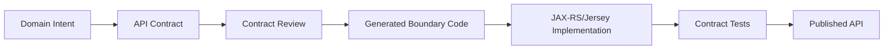
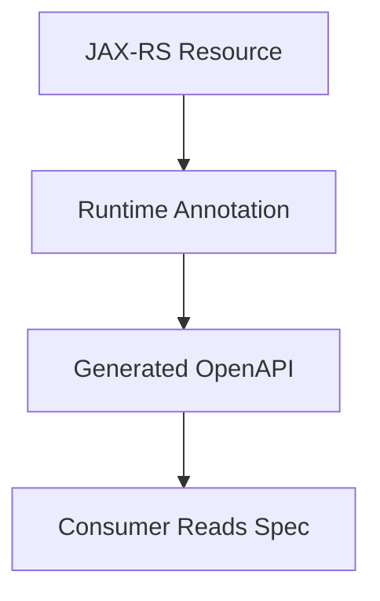
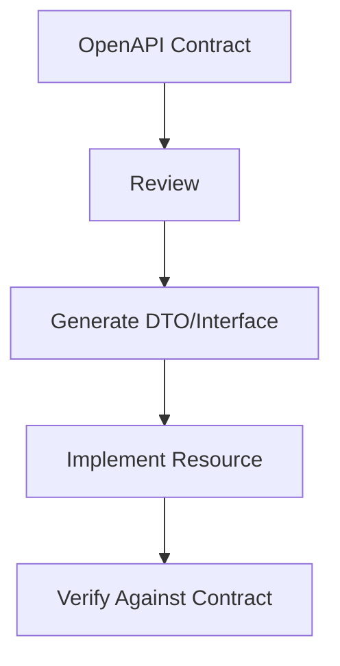
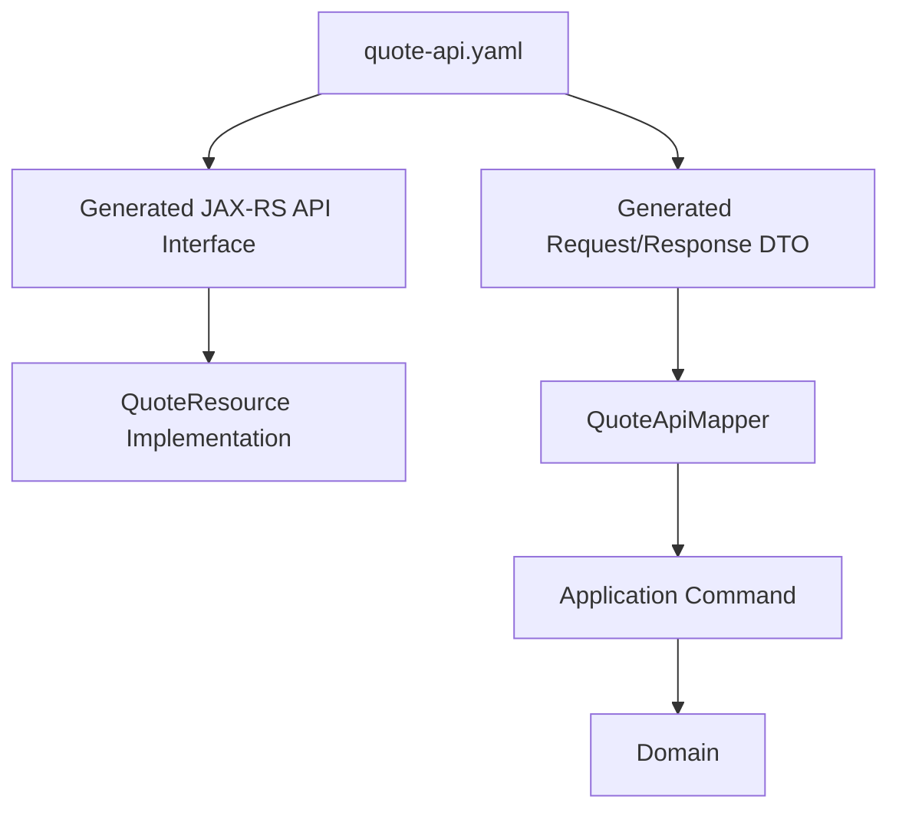
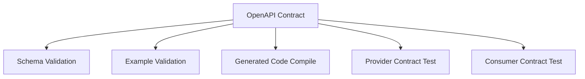

# Part 006 — OpenAPI First Contract Strategy

CPQ/OMS enterprise adalah sistem yang penuh boundary.

Frontend butuh membaca quote. Pricing service butuh menerima konfigurasi. Order service butuh menerima accepted quote. Workflow service butuh memulai approval process. External CRM mungkin ingin membuat quote. Billing mungkin ingin menerima order completion. Audit service ingin memahami siapa mengubah apa.

Kalau boundary ini tidak didesain, boundary akan terbentuk sendiri dari kebetulan implementasi.

Itu berbahaya.

Part ini membahas **OpenAPI-first contract strategy**: bagaimana kontrak API didesain sebelum implementasi, dijaga oleh CI, dipakai untuk generate boundary code, dan dievolusi tanpa merusak consumer.

Kita tidak sedang belajar OpenAPI syntax dari nol. Kita memakai OpenAPI sebagai alat governance untuk sistem CPQ/OMS enterprise.

---

## 1. OpenAPI-First: Definisi Yang Dipakai Di Seri Ini

Dalam seri ini, **OpenAPI-first** berarti:

> HTTP API contract ditulis, direview, divalidasi, diberi example, dan diuji compatibility-nya sebelum implementation dianggap selesai.

Bukan berarti semua desain harus sempurna sebelum coding.

Bukan berarti engineer tidak boleh melakukan spike.

Artinya: contract adalah artifact utama, bukan hasil sampingan dari controller/resource yang sudah dibuat.



OpenAPI sendiri adalah standard deskripsi API HTTP yang programming-language agnostic. Karena itu, ia cocok menjadi boundary antara backend Java, frontend, partner system, test tooling, dan documentation tooling.

---

## 2. Kenapa CPQ/OMS Butuh Contract-First

Di aplikasi kecil, endpoint bisa tumbuh organik.

Di CPQ/OMS enterprise, itu tidak cukup.

Alasannya:

1. **Banyak consumer.** UI, BFF, CRM, ERP, billing, inventory, workflow, partner.
2. **Lifecycle panjang.** Quote bisa direvisi, disubmit, disetujui, diterima, expired, converted ke order.
3. **Data sensitif.** Harga, diskon, approval, margin, kontrak.
4. **Audit penting.** Perubahan API bisa mengubah bukti keputusan.
5. **Backward compatibility mahal.** Consumer enterprise tidak selalu bisa upgrade cepat.
6. **Generated clients membantu, tapi hanya kalau contract stabil.**
7. **Workflow butuh correlation.** API harus expose identifier yang tepat.
8. **Error harus bisa dioperasikan.** Consumer harus tahu mana error retryable, mana business rejection.

API CPQ/OMS bukan sekadar transport.

API adalah representasi eksplisit dari commercial lifecycle.

---

## 3. Code-First vs Contract-First

### Code-first



Kelebihan:

- cepat untuk prototype,
- simple untuk single-team service,
- dekat dengan implementasi.

Kelemahan untuk CPQ/OMS enterprise:

- contract sering mengikuti struktur internal,
- breaking change tidak terlihat sebelum terlambat,
- example sering miskin,
- reviewer bisnis/QA sulit ikut sebelum code selesai,
- API design kalah oleh convenience framework.

### Contract-first



Kelebihan:

- consumer bisa review lebih awal,
- compatibility bisa dicek,
- API tidak otomatis mengikuti JPA entity,
- mock server/test bisa dibuat lebih cepat,
- documentation lebih natural,
- governance lebih kuat.

Kelemahan:

- butuh disiplin,
- ada mapping code,
- generator harus dikontrol,
- contract review bisa menjadi bottleneck jika prosesnya buruk.

Untuk seri ini, kita memilih contract-first.

Karena CPQ/OMS adalah integration-heavy system.

---

## 4. Contract Bukan Persistence Model

Ini aturan paling penting:

> OpenAPI schema tidak boleh menjadi cermin JPA entity.

Contoh buruk:

```yaml
QuoteEntity:
  type: object
  properties:
    id:
      type: integer
      format: int64
    version:
      type: integer
    createdAt:
      type: string
    updatedAt:
      type: string
    lazyLoadedLines:
      type: array
```

Masalahnya:

- nama `Entity` bocor,
- internal numeric id bocor,
- optimistic locking internal bocor tanpa desain,
- lazy loading concern bocor,
- API consumer dipaksa memahami storage model.

Contoh lebih baik:

```yaml
Quote:
  type: object
  required:
    - quoteId
    - quoteNumber
    - status
    - customer
    - currency
    - totals
    - lifecycle
  properties:
    quoteId:
      type: string
      format: uuid
    quoteNumber:
      type: string
      example: Q-2026-00001234
    status:
      $ref: '#/components/schemas/QuoteStatus'
    customer:
      $ref: '#/components/schemas/QuoteCustomerRef'
    currency:
      type: string
      minLength: 3
      maxLength: 3
      example: USD
    totals:
      $ref: '#/components/schemas/QuoteTotals'
    lifecycle:
      $ref: '#/components/schemas/QuoteLifecycle'
```

API model bicara sebagai contract bisnis.

Persistence model bicara sebagai storage strategy.

Jangan samakan.

---

## 5. Struktur Contract Folder

Dari Part 005, kita pakai struktur:

```txt
contracts/openapi/
  quote-service/
    v1/
      quote-api.yaml
      components/
        schemas.yaml
        parameters.yaml
        responses.yaml
        errors.yaml
        headers.yaml
        security.yaml
      examples/
        create-quote-request.json
        create-quote-response.json
        quote-priced-response.json
        submit-quote-response.json
        conflict-error.json
```

Untuk service lain:

```txt
contracts/openapi/
  catalog-service/v1/catalog-api.yaml
  configuration-service/v1/configuration-api.yaml
  pricing-service/v1/pricing-api.yaml
  order-service/v1/order-api.yaml
  workflow-service/v1/workflow-api.yaml
```

Rule:

- Setiap API punya owner.
- Setiap endpoint punya operationId stabil.
- Setiap request/response penting punya example.
- Error response memakai model seragam.
- Header correlation/idempotency distandarkan.
- Security scheme eksplisit.
- Breaking change butuh major version atau migration path.

---

## 6. API Surface Awal Untuk Quote Service

Quote service adalah pusat CPQ.

API awal tidak boleh terlalu besar, tapi harus mewakili lifecycle.

```yaml
openapi: 3.1.0
info:
  title: Quote Service API
  version: 1.0.0
  description: API for managing enterprise CPQ quote lifecycle.
servers:
  - url: https://api.acme.example/cpq/quote-service/v1
paths:
  /quotes:
    post:
      operationId: createQuote
      summary: Create a draft quote
  /quotes/{quoteId}:
    get:
      operationId: getQuote
      summary: Get quote by id
  /quotes/{quoteId}/lines:
    post:
      operationId: addQuoteLine
      summary: Add a quote line
  /quotes/{quoteId}/price:
    post:
      operationId: priceQuote
      summary: Price current quote configuration
  /quotes/{quoteId}/submit-for-approval:
    post:
      operationId: submitQuoteForApproval
      summary: Submit quote for approval workflow
  /quotes/{quoteId}/accept:
    post:
      operationId: acceptQuote
      summary: Accept approved quote and request order creation
  /quotes/{quoteId}/cancel:
    post:
      operationId: cancelQuote
      summary: Cancel quote
```

Perhatikan pola:

- Query state memakai `GET /quotes/{quoteId}`.
- Perubahan lifecycle memakai command endpoint.
- Kita tidak memakai `PUT /quotes/{quoteId}` untuk semua hal.

Kenapa?

Karena CPQ/OMS bukan CRUD.

`submit-for-approval`, `accept`, dan `cancel` adalah command dengan invariant berbeda.

---

## 7. Resource Endpoint vs Command Endpoint

REST purist mungkin tidak suka command endpoint seperti `/submit-for-approval`.

Tetapi dalam domain lifecycle enterprise, command eksplisit sering lebih defensible daripada update generik.

Bandingkan:

```http
PATCH /quotes/{quoteId}
{
  "status": "SUBMITTED_FOR_APPROVAL"
}
```

Dengan:

```http
POST /quotes/{quoteId}/submit-for-approval
{
  "submittedBy": "user-123",
  "comment": "Customer needs approval today."
}
```

Yang kedua lebih baik karena:

- intent jelas,
- authorization bisa spesifik,
- audit lebih kuat,
- invariant lebih mudah diuji,
- workflow trigger jelas,
- error bisa spesifik,
- idempotency bisa dipasang per command.

Untuk CPQ/OMS, status bukan field yang bebas diedit.

Status adalah hasil dari command valid.

---

## 8. Lifecycle State Harus Terlihat Dalam Contract

Quote status minimal:

```yaml
QuoteStatus:
  type: string
  enum:
    - DRAFT
    - CONFIGURED
    - PRICED
    - APPROVAL_REQUIRED
    - APPROVAL_IN_PROGRESS
    - APPROVED
    - REJECTED
    - ACCEPTED
    - EXPIRED
    - CANCELLED
```

Tapi status saja tidak cukup.

Consumer butuh tahu action apa yang boleh dilakukan.

Tambahkan lifecycle affordance:

```yaml
QuoteLifecycle:
  type: object
  required:
    - allowedActions
    - version
  properties:
    allowedActions:
      type: array
      items:
        $ref: '#/components/schemas/QuoteAction'
    version:
      type: integer
      format: int64
      description: Optimistic concurrency version for quote lifecycle changes.

QuoteAction:
  type: string
  enum:
    - ADD_LINE
    - REMOVE_LINE
    - PRICE
    - SUBMIT_FOR_APPROVAL
    - APPROVE
    - REJECT
    - ACCEPT
    - CANCEL
```

Ini membantu UI tidak menebak.

Tetapi allowed actions bukan pengganti server-side authorization. Ia hanya affordance.

Server tetap harus menolak command yang tidak sah.

---

## 9. Idempotency Sebagai Contract, Bukan Detail Internal

Command seperti create quote, submit approval, accept quote, dan create order harus idempotent.

Idempotency harus muncul di contract.

Contoh header:

```yaml
IdempotencyKey:
  name: Idempotency-Key
  in: header
  required: true
  schema:
    type: string
    minLength: 16
    maxLength: 128
  description: Unique key provided by the caller to make command retry safe.
```

Correlation header:

```yaml
CorrelationId:
  name: X-Correlation-Id
  in: header
  required: false
  schema:
    type: string
    minLength: 8
    maxLength: 128
  description: Correlates requests, logs, workflow instances, and events.
```

Kenapa required untuk idempotency pada command tertentu?

Karena network retry adalah realitas.

Kalau user klik Accept Quote dan request timeout, UI akan retry. Tanpa idempotency, quote bisa menghasilkan dua order.

Itu bukan bug kecil.

Itu incident enterprise.

---

## 10. Optimistic Concurrency Dalam API

Quote bisa diedit oleh beberapa user.

Maka lifecycle-changing command harus membawa expected version.

```yaml
SubmitQuoteForApprovalRequest:
  type: object
  required:
    - expectedVersion
  properties:
    expectedVersion:
      type: integer
      format: int64
      minimum: 0
    comment:
      type: string
      maxLength: 2000
```

Kalau version tidak cocok, return conflict:

```yaml
ConflictError:
  allOf:
    - $ref: '#/components/schemas/ApiError'
    - type: object
      properties:
        currentVersion:
          type: integer
          format: int64
        conflictingResource:
          type: string
```

Jangan sembunyikan concurrency di database saja.

Consumer perlu tahu bahwa command gagal karena state berubah.

---

## 11. Error Model: Business Error vs Technical Error

Kita akan detail di Part 019. Di sini kita pasang fondasinya.

Semua API harus memakai error envelope konsisten:

```yaml
ApiError:
  type: object
  required:
    - errorId
    - code
    - message
    - category
    - retryable
    - timestamp
  properties:
    errorId:
      type: string
      format: uuid
    code:
      type: string
      example: QUOTE_STATE_CONFLICT
    message:
      type: string
    category:
      $ref: '#/components/schemas/ErrorCategory'
    retryable:
      type: boolean
    timestamp:
      type: string
      format: date-time
    details:
      type: object
      additionalProperties: true

ErrorCategory:
  type: string
  enum:
    - VALIDATION
    - BUSINESS_RULE
    - CONFLICT
    - AUTHORIZATION
    - NOT_FOUND
    - RATE_LIMIT
    - DEPENDENCY_FAILURE
    - INTERNAL
```

Status code mapping:

| HTTP Status | Kapan Dipakai |
|---|---|
| `400` | Request syntactically valid JSON tapi semantic validation gagal |
| `401` | Caller belum terautentikasi |
| `403` | Caller terautentikasi tapi tidak punya authority |
| `404` | Resource tidak ditemukan atau tidak visible untuk tenant |
| `409` | State/version conflict |
| `422` | Business rule menolak command walau struktur valid |
| `429` | Rate limit |
| `500` | Bug/internal failure |
| `503` | Dependency/runtime unavailable |

Jangan return `500` untuk quote yang tidak bisa disubmit karena belum priced.

Itu business error, bukan internal server error.

---

## 12. API Design Untuk Pricing

Pricing API harus reproducible.

Bad design:

```http
POST /price
{
  "productId": "P1",
  "quantity": 10
}
```

Masalah:

- catalog version tidak jelas,
- currency tidak jelas,
- customer segment tidak jelas,
- contract term tidak jelas,
- effective date tidak jelas,
- discount rule version tidak jelas,
- trace tidak ada.

Better:

```yaml
PriceQuoteRequest:
  type: object
  required:
    - quoteId
    - pricingContext
    - lines
  properties:
    quoteId:
      type: string
      format: uuid
    pricingContext:
      $ref: '#/components/schemas/PricingContext'
    lines:
      type: array
      minItems: 1
      items:
        $ref: '#/components/schemas/PricingLineInput'

PricingContext:
  type: object
  required:
    - tenantId
    - customerSegment
    - currency
    - effectiveDate
    - catalogVersion
  properties:
    tenantId:
      type: string
    customerSegment:
      type: string
    currency:
      type: string
      minLength: 3
      maxLength: 3
    effectiveDate:
      type: string
      format: date
    catalogVersion:
      type: string
    promotionCodes:
      type: array
      items:
        type: string
```

Pricing response harus membawa trace:

```yaml
PriceCalculationResult:
  type: object
  required:
    - priceSnapshotId
    - totals
    - lineResults
    - trace
  properties:
    priceSnapshotId:
      type: string
      format: uuid
    totals:
      $ref: '#/components/schemas/QuoteTotals'
    lineResults:
      type: array
      items:
        $ref: '#/components/schemas/PriceLineResult'
    trace:
      type: array
      items:
        $ref: '#/components/schemas/PriceTraceEntry'
```

CPQ pricing yang tidak bisa dijelaskan adalah liability.

---

## 13. API Design Untuk Configuration

Configuration API harus bisa menjawab dua hal:

1. Apakah konfigurasi valid?
2. Kalau tidak valid, kenapa?

Contoh response:

```yaml
ConfigurationValidationResult:
  type: object
  required:
    - valid
    - violations
    - normalizedConfiguration
  properties:
    valid:
      type: boolean
    violations:
      type: array
      items:
        $ref: '#/components/schemas/ConfigurationViolation'
    normalizedConfiguration:
      $ref: '#/components/schemas/ProductConfiguration'

ConfigurationViolation:
  type: object
  required:
    - code
    - message
    - severity
    - path
  properties:
    code:
      type: string
      example: OPTION_REQUIRES_PARENT_OPTION
    message:
      type: string
    severity:
      type: string
      enum: [ERROR, WARNING]
    path:
      type: string
      example: lines[0].options[2]
```

Jangan hanya return `valid=false`.

Enterprise CPQ UI butuh memberi feedback actionable kepada sales/user.

---

## 14. API Design Untuk Order Conversion

Accept quote biasanya menghasilkan order.

Tapi jangan desain API yang berpura-pura semua sinkron.

Bad:

```http
POST /quotes/{quoteId}/accept

200 OK
{
  "orderId": "..."
}
```

Kalau order creation asynchronous, ini misleading.

Better:

```yaml
AcceptQuoteResponse:
  type: object
  required:
    - quoteId
    - acceptanceId
    - orderCreationStatus
  properties:
    quoteId:
      type: string
      format: uuid
    acceptanceId:
      type: string
      format: uuid
    orderCreationStatus:
      type: string
      enum:
        - REQUESTED
        - CREATED
        - FAILED
    orderId:
      type: string
      format: uuid
      nullable: true
```

Atau return `202 Accepted` bila order creation benar-benar async.

Yang penting: contract harus jujur tentang consistency model.

---

## 15. Status Code Strategy Untuk Command Async

| Scenario | Recommended Status |
|---|---|
| Command selesai sinkron dan resource dibuat | `201 Created` |
| Command diterima tapi proses async | `202 Accepted` |
| Command berhasil mengubah state existing resource | `200 OK` atau `204 No Content` |
| Idempotent retry dengan hasil sama | status sama atau `200 OK` dengan idempotency result |
| State conflict | `409 Conflict` |
| Business rule rejection | `422 Unprocessable Entity` |

Jangan semua command return `200 OK`.

Status code adalah bagian dari contract operasional.

---

## 16. Search API Tidak Sama Dengan List All

CPQ/OMS butuh search quote/order.

Jangan buat endpoint naïf:

```http
GET /quotes
```

Lalu semua filter opsional ditambahkan tanpa desain.

Better:

```http
GET /quotes?customerId=C-001&status=APPROVED&createdFrom=2026-01-01&createdTo=2026-01-31&pageSize=50&pageToken=abc
```

Contract harus mendefinisikan:

- filter yang diizinkan,
- default ordering,
- pagination strategy,
- max page size,
- consistency expectation,
- searchable fields,
- partial response atau projection bila perlu.

Contoh schema:

```yaml
QuoteSearchResponse:
  type: object
  required:
    - items
    - page
  properties:
    items:
      type: array
      items:
        $ref: '#/components/schemas/QuoteSummary'
    page:
      $ref: '#/components/schemas/PageInfo'

PageInfo:
  type: object
  required:
    - pageSize
    - hasNext
  properties:
    pageSize:
      type: integer
    nextPageToken:
      type: string
      nullable: true
    hasNext:
      type: boolean
```

Untuk enterprise, offset pagination bisa bermasalah pada data besar dan data yang berubah cepat. Token/cursor pagination sering lebih stabil untuk operational views.

---

## 17. OperationId Harus Stabil

`operationId` bukan detail kecil.

Generator client, documentation, dan test sering memakai operationId.

Rule:

- gunakan verb + domain object,
- jangan rename tanpa alasan kuat,
- jangan generate random,
- jangan pakai duplicate operationId.

Contoh:

```yaml
operationId: createQuote
operationId: addQuoteLine
operationId: priceQuote
operationId: submitQuoteForApproval
operationId: acceptQuote
operationId: cancelQuote
```

OperationId harus terbaca seperti use case.

---

## 18. Security Scheme Di Contract

Security tidak boleh hanya ada di gateway config.

OpenAPI harus menjelaskan security requirement:

```yaml
components:
  securitySchemes:
    bearerAuth:
      type: http
      scheme: bearer
      bearerFormat: JWT

security:
  - bearerAuth: []
```

Tetapi jangan terlalu percaya pada contract.

Contract hanya menyatakan requirement.

Authorization tetap harus ditegakkan server-side berdasarkan tenant, role, ownership, approval authority, dan lifecycle state.

Contoh:

- sales rep boleh edit draft quote miliknya,
- sales manager boleh approve discount tertentu,
- finance boleh melihat margin field,
- customer user mungkin hanya boleh melihat accepted quote tertentu,
- system client order-service boleh membaca accepted quote untuk conversion.

API schema harus mendukung visibility, tetapi tidak boleh membocorkan data sensitif secara default.

---

## 19. Field-Level Sensitivity

Quote response bisa memiliki field sensitif:

- margin,
- internal cost,
- approval reason,
- discount justification,
- policy evaluation trace,
- customer-specific pricing.

Jangan otomatis expose semua field.

Buat response view:

```yaml
Quote:
  type: object
  properties:
    quoteId:
      type: string
    totals:
      $ref: '#/components/schemas/QuoteTotals'
    approval:
      $ref: '#/components/schemas/QuoteApprovalSummary'

QuoteInternalCommercials:
  type: object
  description: Internal commercial fields visible only to authorized roles.
  properties:
    marginAmount:
      type: string
    marginPercent:
      type: string
    costBasis:
      type: string
```

Bisa dipisah endpoint:

```http
GET /quotes/{quoteId}
GET /quotes/{quoteId}/internal-commercials
```

Atau memakai projection berdasarkan authorization.

Yang penting: jangan biarkan field sensitif bocor karena DTO dibuat dari entity.

---

## 20. Compatibility Rules

Perubahan API harus dikategorikan.

### Umumnya non-breaking

- menambah optional response field,
- menambah optional request field dengan default aman,
- menambah enum hanya jika consumer siap unknown enum,
- menambah endpoint baru,
- menambah error code baru dalam kategori yang sudah didefinisikan.

### Umumnya breaking

- menghapus field,
- mengganti tipe field,
- membuat optional field menjadi required,
- mengubah semantic field,
- rename field,
- menghapus enum value,
- mengubah status code utama,
- mengubah authentication requirement,
- mengubah pagination format,
- mengubah idempotency behavior.

### Perubahan yang sering diremehkan

Menambah enum value bisa breaking untuk consumer yang generate enum strict.

Maka enum harus punya strategy:

- consumer harus handle unknown,
- atau major version saat enum berubah,
- atau gunakan string code + documentation jika domain sangat volatile.

---

## 21. Versioning Strategy

Baseline seri ini:

```txt
/cpq/quote-service/v1/quotes
/cpq/pricing-service/v1/prices
/cpq/order-service/v1/orders
```

Kenapa path version?

Karena paling mudah dipahami dan dioperasikan di enterprise environment.

Alternative seperti media type versioning bisa lebih elegan, tetapi sering membuat gateway, docs, dan debugging lebih rumit.

Rule:

- `v1` tidak berarti semua field frozen selamanya.
- Breaking change butuh `v2` atau migration path eksplisit.
- `v1` dan `v2` bisa hidup berdampingan sementara.
- Deprecation policy harus tertulis.
- Consumer migration harus bisa dipantau.

Versioning bukan pengganti compatibility discipline.

Kalau setiap perubahan kecil melahirkan `v2`, design governance gagal.

---

## 22. Contract Review Checklist

Sebelum API merge:

- [ ] Apakah endpoint merepresentasikan use case, bukan table?
- [ ] Apakah command lifecycle eksplisit?
- [ ] Apakah idempotency dibutuhkan dan sudah ada?
- [ ] Apakah optimistic concurrency dibutuhkan dan sudah ada?
- [ ] Apakah error model seragam?
- [ ] Apakah response membawa data sensitif?
- [ ] Apakah status code jujur terhadap sync/async behavior?
- [ ] Apakah API model bebas dari JPA/entity naming?
- [ ] Apakah example tersedia untuk happy path dan failure path?
- [ ] Apakah field required benar-benar required?
- [ ] Apakah nullable dipakai dengan alasan jelas?
- [ ] Apakah enum evolution aman?
- [ ] Apakah pagination/search punya batas?
- [ ] Apakah security scheme dan authorization notes jelas?
- [ ] Apakah backward compatibility dicek?

Review API bukan review syntax YAML.

Review API adalah review desain integrasi.

---

## 23. Generated Code Policy Untuk Jersey/JAX-RS

Dalam stack kita, implementasi HTTP memakai JAX-RS/Jersey.

Ada beberapa strategi generator:

1. Generate model DTO saja.
2. Generate JAX-RS interface/resource skeleton.
3. Generate client SDK untuk consumer internal.
4. Generate documentation/mock.

Baseline yang aman:

- generate DTO dan interface boundary,
- implement resource secara eksplisit,
- mapping DTO ke command/application model manual atau via mapper yang jelas,
- jangan generate domain,
- jangan generate persistence.

Flow:



Generated code harus menjadi boundary, bukan arsitek sistem.

---

## 24. Mapper Bukan Boilerplate Murahan

Banyak engineer benci mapper.

Tetapi dalam enterprise CPQ/OMS, mapper adalah tempat boundary dijaga.

Contoh:

```java
public final class QuoteApiMapper {

    public CreateQuoteCommand toCommand(
            CreateQuoteRequest request,
            AuthenticatedPrincipal principal,
            String idempotencyKey,
            String correlationId
    ) {
        return new CreateQuoteCommand(
                principal.tenantId(),
                principal.userId(),
                request.customerId(),
                request.currency(),
                request.requestedEffectiveDate(),
                idempotencyKey,
                correlationId
        );
    }
}
```

Mapper melakukan translasi:

- API naming ke domain naming,
- principal ke tenant/user,
- header ke command metadata,
- nullable external field ke internal optional/value object,
- string code ke value object.

Kalau mapper terlihat terlalu besar, mungkin API terlalu bocor atau use case terlalu kompleks.

---

## 25. API Example Sebagai Testable Documentation

Example bukan kosmetik.

Example adalah cara menangkap semantic expectation.

Contoh create quote request:

```json
{
  "customerId": "cust_10001",
  "currency": "USD",
  "requestedEffectiveDate": "2026-07-02",
  "salesChannel": "DIRECT_SALES"
}
```

Contoh conflict error:

```json
{
  "errorId": "8b758e12-90e3-4dd7-9f8e-8b10a4ec76c0",
  "code": "QUOTE_VERSION_CONFLICT",
  "message": "Quote was modified by another transaction.",
  "category": "CONFLICT",
  "retryable": false,
  "timestamp": "2026-07-02T10:15:30Z",
  "details": {
    "quoteId": "0bd2267d-4aac-4e21-a2d5-8c203873560e",
    "expectedVersion": 7,
    "currentVersion": 8
  }
}
```

CI bisa memvalidasi example terhadap schema.

Kalau example tidak valid, documentation bohong.

---

## 26. Contract Testing Strategy

Contract-first butuh test.

Minimal:



### Provider contract test

Memastikan service implementation memenuhi contract.

Contoh:

- `POST /quotes` menerima request valid,
- response sesuai schema,
- error response sesuai schema,
- required headers diproses,
- status code sesuai contract.

### Consumer contract test

Memastikan consumer memakai contract secara benar.

Contoh:

- BFF bisa parse `Quote` response,
- order service bisa membaca accepted quote representation,
- frontend tidak bergantung pada field undocumented.

Contract tanpa test adalah wishful thinking.

---

## 27. API Governance Di Pull Request

Setiap PR yang mengubah `contracts/openapi/**` harus menjawab:

1. Apakah perubahan ini backward compatible?
2. Consumer mana yang terdampak?
3. Apakah example ditambah/diubah?
4. Apakah generated code berubah?
5. Apakah provider test berubah?
6. Apakah documentation berubah?
7. Apakah ada migration/deprecation note?

Template PR:

```md
## API Contract Change

- Service: quote-service
- Version: v1
- Change type: additive / breaking / deprecation / documentation
- Consumer impact:
- Compatibility result:
- Examples updated: yes/no
- Generated code updated: yes/no
- Provider tests updated: yes/no
- Rollback plan:
```

Ini bukan birokrasi.

Ini mencegah perubahan kecil menghancurkan consumer besar.

---

## 28. Designing For Workflow Correlation

Karena kita memakai Camunda 7, API harus mendukung correlation.

Quote approval flow butuh:

- `quoteId`,
- `quoteNumber`,
- `tenantId`,
- `requestedBy`,
- `approvalPolicyVersion`,
- `processInstanceId`,
- `businessKey`,
- `approvalTaskId` bila diekspos melalui task API.

Tetapi hati-hati.

Jangan expose semua internal Camunda ID ke external consumer tanpa alasan.

Recommended:

```yaml
QuoteApprovalSummary:
  type: object
  properties:
    approvalStatus:
      type: string
      enum:
        - NOT_REQUIRED
        - REQUIRED
        - IN_PROGRESS
        - APPROVED
        - REJECTED
    approvalRequestId:
      type: string
      format: uuid
      nullable: true
    submittedAt:
      type: string
      format: date-time
      nullable: true
```

Internal observability boleh menyimpan `processInstanceId`.

External API tidak harus selalu expose-nya.

Boundary harus sadar audience.

---

## 29. Contract Untuk Long-Running Operation

Order fulfillment bisa berlangsung lama.

Jangan desain endpoint sinkron palsu.

Pattern:

```http
POST /orders/{orderId}/start-fulfillment
202 Accepted
{
  "operationId": "op_123",
  "status": "ACCEPTED",
  "statusUrl": "/operations/op_123"
}
```

Schema:

```yaml
OperationStatus:
  type: object
  required:
    - operationId
    - status
  properties:
    operationId:
      type: string
    status:
      type: string
      enum:
        - ACCEPTED
        - RUNNING
        - SUCCEEDED
        - FAILED
        - CANCELLED
    resourceId:
      type: string
      nullable: true
    failure:
      $ref: '#/components/schemas/ApiError'
```

CPQ/OMS punya banyak operation yang tidak selesai dalam satu request:

- approval,
- order fulfillment,
- inventory reservation,
- document generation,
- external billing handoff,
- cancellation compensation.

API harus jujur dengan waktu.

---

## 30. Jangan Membuat API Terlalu Chatty

CPQ UI sering butuh satu layar besar:

- quote header,
- customer summary,
- line items,
- configuration status,
- price totals,
- approval status,
- allowed actions,
- recent activity.

Kalau UI harus memanggil 12 endpoint setiap refresh, latency dan failure probability naik.

Solusi bukan membuat quote service tahu semua hal.

Solusi biasanya:

- BFF composition,
- read model/projection,
- summary endpoint,
- field projection,
- cache dengan invalidation jelas.

Contract BFF berbeda dari domain service contract.

BFF boleh optimized untuk screen.

Domain service API harus optimized untuk capability boundary.

---

## 31. Anti-Pattern API Dalam CPQ/OMS

### Anti-pattern 1: Generic Update Status

```http
PATCH /quotes/{id}
{ "status": "APPROVED" }
```

Ini melewati approval invariant.

### Anti-pattern 2: Entity Dump

```http
GET /quote-entities/{id}
```

Ini membocorkan persistence model.

### Anti-pattern 3: Boolean Mystery

```json
{ "valid": false }
```

Tanpa violation detail, UI dan support tidak bisa bertindak.

### Anti-pattern 4: Semua Error 400

Business conflict, validation error, authorization error, dan dependency failure dicampur.

Consumer tidak tahu harus retry, ubah input, atau escalate.

### Anti-pattern 5: Async Tapi Return Success Final

Endpoint accept quote return order created padahal order creation async.

Ini membuat downstream observability kacau.

### Anti-pattern 6: Field Sensitif Di Response Default

Margin dan internal cost muncul di quote response umum.

Ini security bug, bukan sekadar API design issue.

---

## 32. Minimal Quote API Contract Skeleton

File:

```txt
contracts/openapi/quote-service/v1/quote-api.yaml
```

Skeleton:

```yaml
openapi: 3.1.0
info:
  title: Quote Service API
  version: 1.0.0
  description: API for enterprise CPQ quote lifecycle.

servers:
  - url: https://api.acme.example/cpq/quote-service/v1

tags:
  - name: Quotes
    description: Quote lifecycle operations

paths:
  /quotes:
    post:
      tags: [Quotes]
      operationId: createQuote
      summary: Create a draft quote
      parameters:
        - $ref: '#/components/parameters/CorrelationId'
        - $ref: '#/components/parameters/IdempotencyKey'
      requestBody:
        required: true
        content:
          application/json:
            schema:
              $ref: '#/components/schemas/CreateQuoteRequest'
      responses:
        '201':
          description: Quote created
          content:
            application/json:
              schema:
                $ref: '#/components/schemas/Quote'
        '400':
          $ref: '#/components/responses/BadRequest'
        '409':
          $ref: '#/components/responses/Conflict'
        '422':
          $ref: '#/components/responses/BusinessRuleRejected'

  /quotes/{quoteId}:
    get:
      tags: [Quotes]
      operationId: getQuote
      summary: Get quote by id
      parameters:
        - $ref: '#/components/parameters/CorrelationId'
        - name: quoteId
          in: path
          required: true
          schema:
            type: string
            format: uuid
      responses:
        '200':
          description: Quote found
          content:
            application/json:
              schema:
                $ref: '#/components/schemas/Quote'
        '404':
          $ref: '#/components/responses/NotFound'

components:
  parameters:
    CorrelationId:
      name: X-Correlation-Id
      in: header
      required: false
      schema:
        type: string
        minLength: 8
        maxLength: 128
    IdempotencyKey:
      name: Idempotency-Key
      in: header
      required: true
      schema:
        type: string
        minLength: 16
        maxLength: 128

  schemas:
    CreateQuoteRequest:
      type: object
      required:
        - customerId
        - currency
      properties:
        customerId:
          type: string
        currency:
          type: string
          minLength: 3
          maxLength: 3
        requestedEffectiveDate:
          type: string
          format: date

    Quote:
      type: object
      required:
        - quoteId
        - quoteNumber
        - status
        - currency
        - lifecycle
      properties:
        quoteId:
          type: string
          format: uuid
        quoteNumber:
          type: string
        status:
          $ref: '#/components/schemas/QuoteStatus'
        currency:
          type: string
        lifecycle:
          $ref: '#/components/schemas/QuoteLifecycle'

    QuoteStatus:
      type: string
      enum:
        - DRAFT
        - CONFIGURED
        - PRICED
        - APPROVAL_REQUIRED
        - APPROVAL_IN_PROGRESS
        - APPROVED
        - REJECTED
        - ACCEPTED
        - EXPIRED
        - CANCELLED

    QuoteLifecycle:
      type: object
      required:
        - allowedActions
        - version
      properties:
        allowedActions:
          type: array
          items:
            type: string
        version:
          type: integer
          format: int64

    ApiError:
      type: object
      required:
        - errorId
        - code
        - message
        - category
        - retryable
        - timestamp
      properties:
        errorId:
          type: string
          format: uuid
        code:
          type: string
        message:
          type: string
        category:
          type: string
        retryable:
          type: boolean
        timestamp:
          type: string
          format: date-time

  responses:
    BadRequest:
      description: Invalid request
      content:
        application/json:
          schema:
            $ref: '#/components/schemas/ApiError'
    Conflict:
      description: State conflict
      content:
        application/json:
          schema:
            $ref: '#/components/schemas/ApiError'
    BusinessRuleRejected:
      description: Business rule rejected the command
      content:
        application/json:
          schema:
            $ref: '#/components/schemas/ApiError'
    NotFound:
      description: Resource not found
      content:
        application/json:
          schema:
            $ref: '#/components/schemas/ApiError'
```

Skeleton ini belum final, tapi sudah menunjukkan arah: lifecycle, idempotency, correlation, error model, dan non-entity response.

---

## 33. Definition of Done Untuk API Contract

Sebuah endpoint CPQ/OMS belum selesai sampai:

- [ ] OpenAPI path didefinisikan.
- [ ] OperationId stabil.
- [ ] Request schema ada.
- [ ] Response schema ada.
- [ ] Error response ada.
- [ ] Security requirement ada.
- [ ] Idempotency rule jelas.
- [ ] Correlation header jelas.
- [ ] Example request/response ada.
- [ ] Example error ada.
- [ ] Generated code compile.
- [ ] Provider test memvalidasi response terhadap schema.
- [ ] Breaking change check lolos.
- [ ] Mapper dari API ke application model ada.
- [ ] Tidak ada JPA entity di API boundary.

Kalau endpoint hanya “jalan di Postman”, belum selesai.

---

## 34. Takeaway

OpenAPI-first bukan tentang YAML.

OpenAPI-first adalah cara membuat boundary sistem terlihat sebelum runtime.

Untuk CPQ/OMS enterprise, API harus mengekspresikan:

1. lifecycle,
2. command intent,
3. consistency model,
4. idempotency,
5. concurrency,
6. auditability,
7. security visibility,
8. error semantics,
9. compatibility commitment.

Kontrak yang baik membuat implementasi lebih lambat di awal, tetapi jauh lebih murah saat sistem mulai punya banyak consumer.

Kontrak yang buruk membuat implementasi cepat di awal, lalu setiap perubahan menjadi negosiasi penuh risiko.

Di part berikutnya, kita akan menyambungkan OpenAPI dengan **schema-first data contracts**, terutama untuk event schema, canonical payload, compatibility, dan bagaimana mencegah event Kafka menjadi dump internal state.

---

## References

- OpenAPI Specification v3.2.0: `https://spec.openapis.org/oas/v3.2.0.html`
- OpenAPI Specification v3.1.0: `https://spec.openapis.org/oas/v3.1.0.html`
- OpenAPI Initiative — Upgrading from OpenAPI 3.0 to 3.1: `https://learn.openapis.org/upgrading/v3.0-to-v3.1.html`
