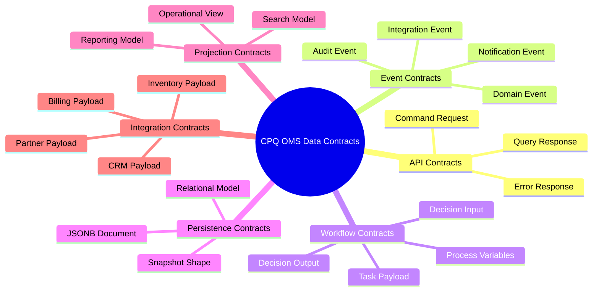
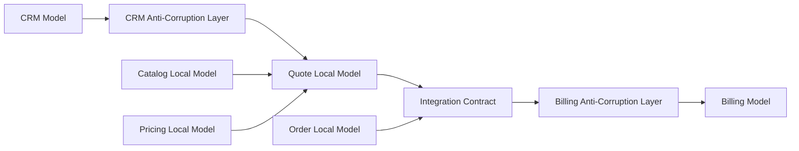
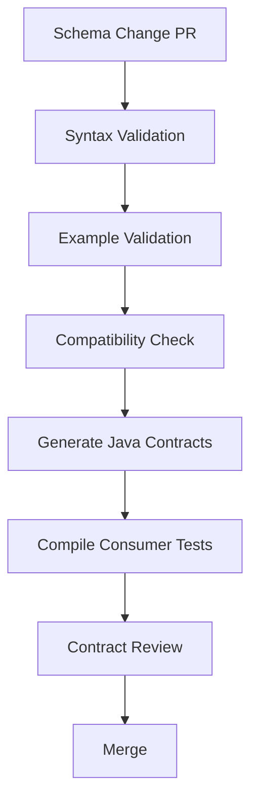
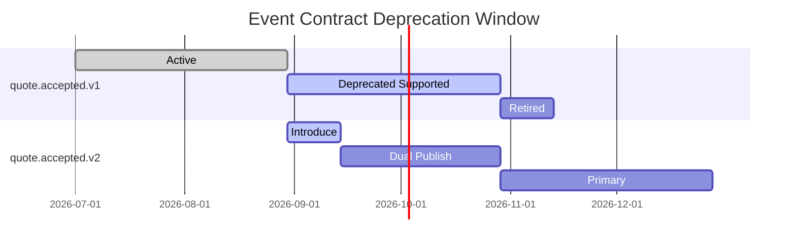
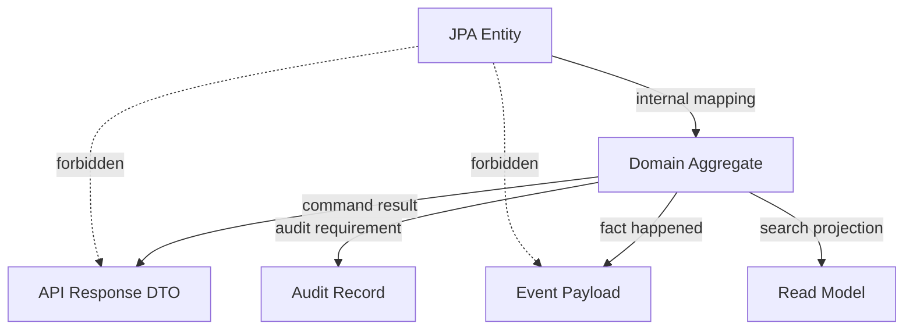
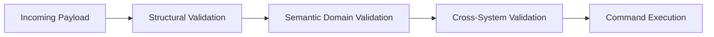
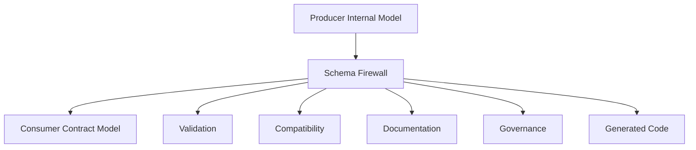

# Part 007 — Schema First Data Contracts

OpenAPI-first mengatur **HTTP contract**.

Schema-first mengatur **data meaning**.

Di CPQ/OMS enterprise, data bergerak melewati banyak boundary: frontend, Quote Service, Pricing Service, Catalog Service, Order Service, Camunda process, Kafka events, audit store, reporting projection, document generator, notification, CRM, billing, inventory, dan external partner API.

Kalau skema data hanya dianggap “class Java yang kebetulan diserialisasi ke JSON”, sistem akan cepat rapuh.

Masalahnya bukan hanya field hilang atau tipe salah.

Masalah yang lebih mahal adalah ketika setiap service memakai kata yang sama untuk makna yang berbeda:

- `price` berarti recurring price di Pricing Service, tetapi total charge di Quote Service.
- `status` berarti lifecycle state di Order Service, tetapi fulfillment state di downstream system.
- `productId` berarti product specification di Catalog Service, tetapi product offering di Quote Service.
- `validUntil` berarti quote expiration di Quote Service, tetapi catalog effective end date di Catalog Service.
- `discount` berarti discount request di frontend, tetapi approved adjustment di Pricing Service.

Schema-first adalah disiplin untuk mencegah semantic drift.

Part ini bukan tutorial JSON Schema dari nol. Kita akan membangun cara berpikir dan aturan desain agar skema menjadi **kontrak evolutif** yang aman untuk platform CPQ/OMS enterprise.

---

## 1. Definisi Schema-First Di Seri Ini

Dalam seri ini, **schema-first** berarti:

> Struktur, constraint, meaning, compatibility rule, ownership, versioning, dan example data didefinisikan sebelum data dipakai lintas boundary.

Boundary di sini bukan hanya REST API.

Boundary mencakup:

1. request/response HTTP,
2. Kafka event payload,
3. command payload,
4. Camunda process variable contract,
5. audit event,
6. read model projection,
7. document generation input,
8. integration payload ke sistem eksternal,
9. test fixture canonical,
10. migration payload.

Kalau OpenAPI-first menjawab:

> Endpoint apa yang tersedia dan bagaimana dipanggil?

Schema-first menjawab:

> Data apa yang boleh lewat, apa maknanya, siapa pemiliknya, dan bagaimana ia boleh berubah?

---

## 2. Mengapa CPQ/OMS Membutuhkan Schema-First

CPQ/OMS bukan sistem data sederhana.

Quote dan order adalah hasil dari banyak keputusan:

- customer eligibility,
- product availability,
- configuration validity,
- pricing rule,
- discount approval,
- tax approximation,
- inventory reservation,
- contract term,
- fulfillment feasibility,
- manual override,
- workflow decision,
- commercial acceptance.

Satu payload quote bisa terlihat seperti JSON biasa, tetapi sebenarnya berisi jejak keputusan bisnis.

Contoh payload buruk:

```json
{
  "quoteId": "Q-1001",
  "customerId": "C-9",
  "items": [
    {
      "productId": "P-1",
      "qty": 1,
      "price": 100,
      "discount": 20
    }
  ],
  "status": "APPROVED"
}
```

Payload ini terlalu ambigu untuk enterprise.

Pertanyaan yang tidak terjawab:

- `productId` mengacu ke product offering, product spec, SKU, package, atau external product?
- `price` gross, net, recurring, one-time, tax-inclusive, atau after-discount?
- `discount` requested, approved, absolute, percentage, manual override, atau promo?
- `status` status quote, approval, pricing, atau fulfillment readiness?
- `APPROVED` diset oleh siapa, melalui policy mana, dan berdasarkan versi rule apa?
- Apakah harga bisa direproduksi ulang enam bulan kemudian?
- Apakah payload ini aman untuk replay?
- Apakah consumer lama akan rusak ketika field baru ditambah?

Schema-first memaksa pertanyaan itu dijawab sebelum sistem produksi menanggung biaya ambiguitas.

---

## 3. Taxonomy Data Contract Dalam CPQ/OMS

Tidak semua schema punya fungsi yang sama.

Kesalahan umum adalah membuat satu “canonical quote schema” lalu memaksanya dipakai di semua tempat.

Itu terlihat rapi di awal, tetapi biasanya menjadi monster.

Kita butuh taxonomy.



Setiap kategori punya rule berbeda.

### 3.1 Command Request Schema

Command request membawa intensi.

Contoh:

- `CreateQuoteRequest`,
- `AddQuoteLineRequest`,
- `ConfigureQuoteLineRequest`,
- `RequestPriceCalculationRequest`,
- `SubmitQuoteForApprovalRequest`,
- `AcceptQuoteRequest`,
- `CreateOrderFromQuoteRequest`,
- `CancelOrderRequest`.

Command schema tidak boleh menjadi mirror entity database.

Command harus menyatakan:

- siapa melakukan aksi,
- aksi apa yang diminta,
- terhadap aggregate apa,
- dengan precondition apa,
- idempotency key apa,
- expected version apa,
- alasan/justification apa bila dibutuhkan.

### 3.2 Query Response Schema

Query response membawa representasi untuk pembacaan.

Ia boleh denormalized.

Ia boleh disesuaikan untuk UI/BFF.

Ia tidak harus sama dengan command request.

Contoh:

- `QuoteSummaryResponse`,
- `QuoteDetailResponse`,
- `PriceBreakdownResponse`,
- `OrderTimelineResponse`,
- `ApprovalTaskViewResponse`.

Kesalahan umum:

> Menggunakan response schema sebagai update request.

Itu membuat client bisa mengubah field yang seharusnya read-only.

### 3.3 Domain Event Schema

Domain event menyatakan sesuatu yang sudah terjadi di domain owner.

Contoh:

- `QuoteCreated`,
- `QuoteLineConfigured`,
- `QuotePriced`,
- `QuoteSubmittedForApproval`,
- `QuoteApproved`,
- `QuoteAccepted`,
- `OrderCreated`,
- `OrderDecomposed`,
- `OrderFulfillmentFailed`.

Domain event tidak boleh bernama seperti command.

Salah:

```text
CalculatePriceEvent
ApproveQuoteEvent
CreateOrderEvent
```

Benar:

```text
QuotePriceCalculated
QuoteApproved
OrderCreated
```

Nama event harus berbentuk fakta lampau.

### 3.4 Integration Event Schema

Integration event adalah event yang sengaja dibuat untuk consumer eksternal atau lintas bounded context.

Ia boleh berbeda dari domain event internal.

Misalnya Quote Service punya domain event internal:

```text
QuoteLinePriceSnapshotReplaced
```

Tetapi event integrasi yang dipublish adalah:

```text
QuotePricedV1
```

Kenapa?

Karena consumer tidak perlu tahu detail internal replacement snapshot. Consumer butuh fakta bisnis yang stabil.

### 3.5 Audit Event Schema

Audit event bukan sekadar event domain.

Audit event harus menjawab:

- actor,
- action,
- target,
- before/after bila relevan,
- reason,
- source channel,
- correlation id,
- request id,
- decision id,
- policy/rule version,
- timestamp,
- tamper-evidence strategy.

Domain event boleh mengatakan `QuoteApproved`.

Audit event harus bisa menjelaskan **siapa menyetujui, atas authority apa, kapan, dari channel mana, dengan justification apa, dan terhadap quote version berapa**.

### 3.6 Workflow Contract Schema

Camunda process variables sering menjadi tempat bocornya data tidak terkendali.

Jangan jadikan process variable sebagai dump seluruh quote.

Process variable contract harus kecil, eksplisit, dan versioned.

Contoh variable untuk quote approval:

```json
{
  "quoteId": "Q-2026-000001",
  "quoteVersion": 7,
  "tenantId": "tenant-a",
  "approvalCaseId": "APR-1001",
  "approvalLevel": "SALES_MANAGER",
  "totalContractValue": {
    "amount": "125000.00",
    "currency": "USD"
  },
  "requestedDiscountPercent": "18.50",
  "requiresFinanceApproval": true
}
```

Process variable bukan source of truth. Ia adalah context untuk workflow routing.

Source of truth tetap di domain service.

---

## 4. Prinsip Desain Schema CPQ/OMS

### 4.1 Schema Harus Memisahkan Identity, Reference, Snapshot, Dan Decision

Empat hal ini sering tercampur.

| Konsep | Arti | Contoh | Risiko Bila Tercampur |
|---|---|---|---|
| Identity | Identifier milik entity/agregat | `quoteId`, `orderId` | Entity sulit dilacak |
| Reference | Pointer ke master data | `productOfferingId` | Historical data berubah saat catalog berubah |
| Snapshot | Salinan nilai pada waktu tertentu | `productNameSnapshot` | Quote tidak reproducible |
| Decision | Hasil rule/policy | `approvalRequired=true` | Keputusan tidak audit-able |

Dalam CPQ/OMS, snapshot penting karena quote adalah artifact historis.

Kalau quote dibuat dengan harga produk versi 2026.07, quote tidak boleh berubah hanya karena product catalog berubah besok.

Schema yang baik membedakan:

```json
{
  "productOfferingRef": {
    "id": "PO-FIBER-1G",
    "version": "2026.07"
  },
  "productSnapshot": {
    "displayName": "Fiber Internet 1Gbps",
    "commercialFamily": "BROADBAND",
    "capturedAt": "2026-07-02T10:15:30Z"
  }
}
```

Reference menjawab “asalnya dari mana”.

Snapshot menjawab “apa yang dipakai saat keputusan dibuat”.

### 4.2 Monetary Value Tidak Boleh Floating Point

Harga, diskon, tax, penalty, dan charge tidak boleh direpresentasikan sebagai floating point.

Gunakan string decimal atau integer minor unit, disertai currency dan scale policy.

Contoh:

```json
{
  "amount": "1250.75",
  "currency": "USD"
}
```

Atau:

```json
{
  "minorAmount": 125075,
  "currency": "USD",
  "scale": 2
}
```

Untuk seri ini, external contract akan memakai string decimal agar readable dan menghindari loss akibat JSON number parser yang berbeda.

Internal Java memakai `BigDecimal` dengan rounding policy eksplisit.

### 4.3 Time Harus Jelas: Instant, Local Date, Effective Window

CPQ/OMS banyak memakai waktu:

- quote created time,
- quote expiration,
- catalog effective date,
- price list effective date,
- approval SLA due date,
- order requested completion date,
- reservation expiration,
- contract start/end.

Jangan memakai `date` atau `timestamp` tanpa semantics.

Gunakan nama yang menunjukkan meaning:

```json
{
  "quoteCreatedAt": "2026-07-02T03:20:10Z",
  "quoteExpiresAt": "2026-07-16T23:59:59Z",
  "catalogEffectiveDate": "2026-07-01",
  "requestedActivationDate": "2026-08-01"
}
```

Rule umum:

- `...At` untuk instant/timestamp,
- `...Date` untuk calendar date,
- `validFor` untuk effective window,
- `expiresAt` untuk expiration instant.

### 4.4 Enum Harus Dianggap Contract Berbahaya

Enum terlihat aman, tetapi enum sangat sering merusak consumer.

Jika producer menambah enum value baru dan consumer lama memakai switch exhaustive, consumer bisa crash.

Untuk field yang bisa berubah lintas domain, gunakan salah satu strategi:

1. enum ketat hanya untuk internal stable contract,
2. string dengan documented known values,
3. enum dengan `UNKNOWN` fallback di client,
4. compatibility test untuk enum expansion.

Contoh status quote boleh enum ketat karena lifecycle milik Quote Service.

Tetapi external reason code lebih aman sebagai string dengan registry.

### 4.5 Optional Field Harus Punya Meaning

`optional` bukan berarti “kami lupa”.

Optional harus punya alasan:

- not applicable,
- not yet calculated,
- hidden by authorization,
- unknown from upstream,
- temporarily unavailable,
- deprecated.

Kalau alasan tidak jelas, consumer akan membuat asumsi sendiri.

Pattern yang lebih baik:

```json
{
  "creditCheck": {
    "status": "NOT_REQUESTED"
  }
}
```

Bukan:

```json
{
  "creditScore": null
}
```

---

## 5. Canonical Model Vs Local Model

Banyak enterprise ingin satu canonical model untuk semua hal.

Motivasinya bagus: mengurangi mapping.

Efek sampingnya sering buruk: canonical model menjadi terlalu besar, terlalu kompromistis, dan terlalu lambat berubah.

Dalam seri ini, kita pakai prinsip:

> Canonical model hanya dipakai di boundary yang membutuhkan shared language. Local model tetap dimiliki bounded context masing-masing.



### 5.1 Local Model

Local model bebas mengoptimalkan dirinya untuk invariant domain.

Quote Service boleh punya:

- `QuoteAggregate`,
- `QuoteLineTree`,
- `QuotePriceSnapshot`,
- `ApprovalState`,
- `CommercialTermSnapshot`.

Pricing Service boleh punya:

- `PriceContext`,
- `PriceComponent`,
- `AdjustmentPolicy`,
- `TaxPlaceholder`,
- `RoundingDecision`.

Catalog Service boleh punya:

- `ProductOffering`,
- `ProductSpecification`,
- `CharacteristicDefinition`,
- `ConfigurationRule`,
- `EligibilityRule`.

Tidak perlu memaksa semua menjadi satu `Product` global.

### 5.2 Integration Contract

Integration contract adalah data yang sengaja distabilkan untuk lintas context.

Contoh `QuoteAcceptedV1`:

- quote identity,
- customer reference,
- accepted quote version,
- accepted lines,
- price snapshot,
- commercial terms,
- acceptance actor,
- acceptance timestamp,
- correlation id.

Ia tidak harus memuat semua detail internal Quote Service.

---

## 6. Envelope Untuk Event Contract

Untuk Kafka event, jangan hanya publish payload domain mentah.

Gunakan envelope.

Envelope menyediakan metadata yang diperlukan untuk routing, tracing, idempotency, compatibility, dan observability.

Contoh envelope:

```json
{
  "eventId": "evt-01J1Y9X9MP3A9WJ1K8F7QKABCD",
  "eventType": "quote.accepted.v1",
  "eventVersion": 1,
  "occurredAt": "2026-07-02T10:15:30Z",
  "publishedAt": "2026-07-02T10:15:31Z",
  "producer": "quote-service",
  "tenantId": "tenant-a",
  "aggregateType": "quote",
  "aggregateId": "Q-2026-000001",
  "aggregateVersion": 12,
  "correlationId": "corr-9c1c",
  "causationId": "cmd-77a1",
  "schemaRef": "schema://cpq.quote.accepted.v1",
  "data": {
    "quoteId": "Q-2026-000001",
    "quoteVersion": 12,
    "acceptedAt": "2026-07-02T10:15:30Z"
  }
}
```

### 6.1 Field Envelope Minimal

| Field | Wajib | Alasan |
|---|---:|---|
| `eventId` | Ya | Deduplication consumer |
| `eventType` | Ya | Routing dan handler selection |
| `eventVersion` | Ya | Compatibility dan migration |
| `occurredAt` | Ya | Waktu fakta domain terjadi |
| `publishedAt` | Ya | Observability publish lag |
| `producer` | Ya | Ownership dan debugging |
| `tenantId` | Hampir selalu | Multi-tenancy dan isolation |
| `aggregateId` | Ya untuk domain event | Ordering dan correlation |
| `aggregateVersion` | Ya bila aggregate versioned | Detect gap/out-of-order |
| `correlationId` | Ya | Trace end-to-end |
| `causationId` | Sangat disarankan | Chain of command/event |
| `schemaRef` | Ya | Schema governance |
| `data` | Ya | Payload bisnis |

CloudEvents bisa dijadikan inspirasi atau standard envelope bila organisasi sudah mengadopsinya. CloudEvents sendiri mendefinisikan cara umum mendeskripsikan event data agar interoperable lintas service dan platform.

### 6.2 `occurredAt` Bukan `publishedAt`

`occurredAt` adalah waktu fakta domain terjadi.

`publishedAt` adalah waktu event keluar ke broker.

Dalam outbox pattern, keduanya bisa berbeda.

Jangan menimpa `occurredAt` saat event dipublish ulang.

---

## 7. Schema Naming Convention

Naming convention bukan kosmetik. Ia mempengaruhi evolusi.

Gunakan pola:

```text
<domain>.<aggregate-or-capability>.<fact-or-contract>.<version>
```

Contoh:

```text
cpq.quote.created.v1
cpq.quote.line-configured.v1
cpq.quote.priced.v1
cpq.quote.accepted.v1
cpq.order.created.v1
cpq.order.fulfillment-failed.v1
cpq.catalog.product-offering-published.v1
```

Untuk file:

```text
schemas/events/quote/quote-accepted.v1.schema.json
schemas/events/order/order-created.v1.schema.json
schemas/commands/quote/create-quote-request.v1.schema.json
schemas/workflow/quote-approval/quote-approval-context.v1.schema.json
```

Untuk Java package generated:

```text
com.example.cpq.contract.event.quote.v1
com.example.cpq.contract.command.quote.v1
com.example.cpq.contract.workflow.approval.v1
```

---

## 8. Compatibility Rules

Compatibility adalah inti schema-first.

Tanpa compatibility rule, versi hanya angka.

### 8.1 Backward Compatibility

Consumer baru bisa membaca data lama.

Contoh:

- field baru di consumer diberi default,
- consumer tahan terhadap field yang tidak ada,
- parser bisa membaca event lama.

### 8.2 Forward Compatibility

Consumer lama bisa menerima data baru tanpa gagal.

Contoh:

- consumer mengabaikan unknown field,
- enum expansion tidak membuat crash,
- field baru tidak wajib untuk consumer lama.

### 8.3 Full Compatibility

Kedua arah aman.

Ini ideal, tetapi tidak selalu mungkin.

### 8.4 Breaking Change

Breaking change antara lain:

- rename field,
- remove field,
- change type,
- change semantics,
- make optional field required,
- narrow allowed values,
- change unit/currency meaning,
- change array ordering semantics,
- change id meaning,
- change event meaning dengan nama sama.

Perubahan semantics adalah breaking change walaupun schema validator masih hijau.

Contoh paling berbahaya:

```text
price.amount dulu berarti net recurring monthly charge.
price.amount sekarang berarti total contract value.
```

Schema secara teknis tidak berubah, tetapi contract rusak.

### 8.5 Rule Evolusi Aman

| Perubahan | Aman? | Catatan |
|---|---:|---|
| Tambah optional field | Biasanya ya | Consumer harus ignore unknown |
| Tambah required field | Tidak | Butuh versi baru |
| Rename field | Tidak | Tambah field baru, deprecate lama |
| Hapus field | Tidak | Deprecate dulu, monitor consumer |
| Ubah number ke string | Tidak | Versi baru |
| Ubah enum dengan value baru | Tergantung | Consumer harus punya fallback |
| Tambah event type baru | Ya | Consumer tidak wajib subscribe |
| Ubah arti event type lama | Tidak | Buat event type baru |
| Ubah unit measurement | Tidak | Versi baru atau field baru |

---

## 9. JSON Schema Untuk Contract Data

JSON Schema cocok untuk mendeskripsikan struktur JSON, validasi, constraint, dan dokumentasi data. Versi modern yang umum dipakai saat ini adalah Draft 2020-12.

Dalam proyek ini, kita akan memakai JSON Schema untuk:

- Kafka event payload,
- command payload non-HTTP,
- workflow variable contract,
- audit event,
- document generation input,
- reusable domain value schema.

OpenAPI tetap dipakai untuk HTTP API. JSON Schema dipakai untuk schema artifact yang lebih umum.

### 9.1 Common Value Schema

Buat reusable schema untuk value yang berulang.

`money.v1.schema.json`:

```json
{
  "$schema": "https://json-schema.org/draft/2020-12/schema",
  "$id": "schema://cpq.common.money.v1",
  "title": "MoneyV1",
  "type": "object",
  "additionalProperties": false,
  "required": ["amount", "currency"],
  "properties": {
    "amount": {
      "type": "string",
      "pattern": "^-?[0-9]+(\\.[0-9]{1,6})?$",
      "description": "Decimal monetary amount represented as string to avoid floating point ambiguity."
    },
    "currency": {
      "type": "string",
      "pattern": "^[A-Z]{3}$"
    }
  }
}
```

`reference.v1.schema.json`:

```json
{
  "$schema": "https://json-schema.org/draft/2020-12/schema",
  "$id": "schema://cpq.common.reference.v1",
  "title": "ReferenceV1",
  "type": "object",
  "additionalProperties": false,
  "required": ["id"],
  "properties": {
    "id": { "type": "string", "minLength": 1 },
    "version": { "type": "string" },
    "displayName": { "type": "string" }
  }
}
```

### 9.2 Quote Accepted Event Schema

```json
{
  "$schema": "https://json-schema.org/draft/2020-12/schema",
  "$id": "schema://cpq.quote.accepted.v1",
  "title": "QuoteAcceptedV1",
  "type": "object",
  "additionalProperties": false,
  "required": [
    "eventId",
    "eventType",
    "eventVersion",
    "occurredAt",
    "producer",
    "tenantId",
    "aggregateId",
    "aggregateVersion",
    "correlationId",
    "data"
  ],
  "properties": {
    "eventId": { "type": "string", "minLength": 1 },
    "eventType": { "const": "quote.accepted.v1" },
    "eventVersion": { "const": 1 },
    "occurredAt": { "type": "string", "format": "date-time" },
    "publishedAt": { "type": "string", "format": "date-time" },
    "producer": { "const": "quote-service" },
    "tenantId": { "type": "string", "minLength": 1 },
    "aggregateType": { "const": "quote" },
    "aggregateId": { "type": "string", "minLength": 1 },
    "aggregateVersion": { "type": "integer", "minimum": 1 },
    "correlationId": { "type": "string", "minLength": 1 },
    "causationId": { "type": "string" },
    "schemaRef": { "const": "schema://cpq.quote.accepted.v1" },
    "data": {
      "type": "object",
      "additionalProperties": false,
      "required": [
        "quoteId",
        "quoteVersion",
        "customerRef",
        "acceptedAt",
        "acceptedBy",
        "commercialTotal"
      ],
      "properties": {
        "quoteId": { "type": "string" },
        "quoteVersion": { "type": "integer", "minimum": 1 },
        "customerRef": {
          "type": "object",
          "required": ["id"],
          "properties": {
            "id": { "type": "string" },
            "displayName": { "type": "string" }
          }
        },
        "acceptedAt": { "type": "string", "format": "date-time" },
        "acceptedBy": {
          "type": "object",
          "required": ["actorId", "actorType"],
          "properties": {
            "actorId": { "type": "string" },
            "actorType": { "type": "string" }
          }
        },
        "commercialTotal": { "$ref": "schema://cpq.common.money.v1" }
      }
    }
  }
}
```

Prinsip penting: event payload tidak perlu memuat seluruh quote jika consumer hanya perlu accepted fact.

Tetapi bila downstream Order Service perlu membuat order dari quote, ia harus bisa mengambil quote snapshot melalui API atau event khusus yang berisi sufficient order creation snapshot.

Jangan menyembunyikan dependency.

---

## 10. Schema Registry Strategy

Schema registry bukan hanya tool. Ia adalah governance boundary.

Minimal registry harus menyimpan:

- schema id,
- schema version,
- owner service,
- compatibility mode,
- lifecycle status,
- changelog,
- examples,
- consumer list bila diketahui,
- deprecation status.

Contoh metadata:

```yaml
schemaId: schema://cpq.quote.accepted.v1
name: QuoteAcceptedV1
owner: quote-service
domain: quote
type: integration-event
compatibility: backward
status: active
introducedIn: 2026.07.0
deprecatedIn: null
replacement: null
consumers:
  - order-service
  - audit-service
  - notification-service
examples:
  - examples/events/quote/quote-accepted.v1.example.json
```

### 10.1 Registry Sebagai Folder Git

Untuk awal project, registry bisa berupa folder Git:

```text
contracts/
  schemas/
    common/
      money.v1.schema.json
      actor.v1.schema.json
      reference.v1.schema.json
    events/
      quote/
        quote-created.v1.schema.json
        quote-priced.v1.schema.json
        quote-accepted.v1.schema.json
      order/
        order-created.v1.schema.json
    workflow/
      quote-approval/
        approval-context.v1.schema.json
  examples/
    events/
      quote/
        quote-accepted.v1.example.json
  metadata/
    quote-accepted.v1.yaml
```

Tidak semua organisasi harus langsung memakai platform registry terpisah.

Yang wajib adalah rule dan automation.

### 10.2 Registry Check Di CI

CI harus menjalankan:

1. schema syntax validation,
2. example validation,
3. compatibility check terhadap versi sebelumnya,
4. naming convention check,
5. owner metadata check,
6. forbidden field check,
7. generated code compilation,
8. consumer contract test bila tersedia.



---

## 11. Versioning Strategy

Gunakan versioning eksplisit pada contract lintas boundary.

### 11.1 Event Versioning

Event type membawa versi:

```text
quote.accepted.v1
quote.accepted.v2
```

Jangan membuat field `version=2` tetapi nama event tetap `quote.accepted` tanpa routing jelas.

Handler consumer menjadi lebih rumit dan observability lebih kabur.

### 11.2 Schema Version Vs Business Version

Bedakan:

- schema version,
- aggregate version,
- catalog version,
- rule version,
- quote version,
- API version.

Contoh:

```json
{
  "eventType": "quote.priced.v1",
  "eventVersion": 1,
  "aggregateVersion": 8,
  "data": {
    "quoteId": "Q-1",
    "quoteVersion": 8,
    "catalogVersion": "2026.07",
    "pricingRuleVersion": "pricing-ruleset-2026.07.15"
  }
}
```

Jangan memakai satu `version` untuk semua.

### 11.3 Deprecation Window

Breaking change harus memakai window:

1. introduce new version,
2. dual publish bila perlu,
3. migrate consumers,
4. monitor old consumer lag/use,
5. freeze old version,
6. remove after approved window.



---

## 12. Command Contract Pattern

Command contract berbeda dari event.

Command membawa intensi yang bisa berhasil atau gagal.

Contoh `SubmitQuoteForApprovalRequest`:

```json
{
  "commandId": "cmd-01J1YA1",
  "idempotencyKey": "submit-quote-Q-1-v7-user-55",
  "tenantId": "tenant-a",
  "quoteId": "Q-2026-000001",
  "expectedQuoteVersion": 7,
  "submittedBy": {
    "actorId": "user-55",
    "actorType": "SALES_REP"
  },
  "reason": "Customer requested commercial approval for 18.5% discount.",
  "requestedAt": "2026-07-02T10:15:30Z"
}
```

Command schema harus memiliki:

- command identity,
- idempotency key,
- target aggregate,
- expected version,
- actor,
- reason bila aksi signifikan,
- timestamp bila perlu,
- precondition.

### 12.1 Command Response

Untuk command yang bisa diproses cepat:

```json
{
  "quoteId": "Q-2026-000001",
  "quoteVersion": 8,
  "state": "PENDING_APPROVAL"
}
```

Untuk command async:

```json
{
  "commandId": "cmd-01J1YA1",
  "accepted": true,
  "trackingRef": {
    "type": "processInstance",
    "id": "camunda-process-123"
  }
}
```

Jangan mengembalikan `200 OK` seolah semua selesai bila hanya masuk queue/process.

---

## 13. Workflow Variable Contract Untuk Camunda 7

Camunda 7 process variables mudah menjadi dependency tersembunyi.

Service task, external worker, listener, DMN decision, dan user task form bisa membaca variable yang sama.

Kalau variable tidak dikontrakkan, perubahan kecil bisa merusak process runtime.

### 13.1 Rule Variable

Variable harus:

- minimal,
- named clearly,
- versioned,
- validated before process start,
- tidak menyimpan data rahasia yang tidak perlu,
- tidak menjadi pengganti database.

Contoh schema:

```json
{
  "$schema": "https://json-schema.org/draft/2020-12/schema",
  "$id": "schema://cpq.workflow.quote-approval-context.v1",
  "title": "QuoteApprovalContextV1",
  "type": "object",
  "additionalProperties": false,
  "required": [
    "tenantId",
    "quoteId",
    "quoteVersion",
    "approvalCaseId",
    "totalContractValue",
    "requestedDiscountPercent",
    "submittedBy"
  ],
  "properties": {
    "tenantId": { "type": "string" },
    "quoteId": { "type": "string" },
    "quoteVersion": { "type": "integer", "minimum": 1 },
    "approvalCaseId": { "type": "string" },
    "totalContractValue": { "$ref": "schema://cpq.common.money.v1" },
    "requestedDiscountPercent": {
      "type": "string",
      "pattern": "^[0-9]+(\\.[0-9]{1,4})?$"
    },
    "submittedBy": { "$ref": "schema://cpq.common.actor.v1" }
  }
}
```

### 13.2 Jangan Simpan Full Quote Di Process Variable

Full quote bisa besar, sensitif, berubah, dan sulit dimigrasikan.

Process variable cukup menyimpan reference dan routing context.

Jika worker butuh data terbaru, ambil dari Quote Service.

Jika worker butuh snapshot tertentu, ambil quote snapshot berdasarkan quote id + version.

---

## 14. Audit Contract Pattern

Audit schema harus lebih stabil dari event biasa.

Audit dipakai untuk menjawab sengketa, compliance, dan investigasi.

Contoh audit event:

```json
{
  "auditId": "aud-01J1YB",
  "tenantId": "tenant-a",
  "occurredAt": "2026-07-02T10:15:30Z",
  "actor": {
    "actorId": "user-55",
    "actorType": "SALES_MANAGER",
    "displayName": "A. Manager"
  },
  "action": "QUOTE_APPROVED",
  "target": {
    "type": "quote",
    "id": "Q-2026-000001",
    "version": 8
  },
  "reason": "Discount within delegated authority.",
  "decisionTrace": {
    "policyId": "discount-approval-policy",
    "policyVersion": "2026.07",
    "decisionId": "dmn-decision-777"
  },
  "correlationId": "corr-9c1c",
  "requestId": "req-abc",
  "source": {
    "channel": "web-cpq",
    "ipAddressHash": "sha256:..."
  }
}
```

Audit contract harus didesain dengan privacy boundary.

Jangan menyimpan PII mentah bila tidak diperlukan.

Jangan menyimpan secret.

Jangan menyimpan full request body tanpa klasifikasi.

---

## 15. Schema Dan Persistence: Jangan Disamakan

Database schema dan data contract schema berbeda.

Database schema mengoptimalkan:

- integrity,
- query,
- transaction,
- storage,
- locking,
- migration.

Contract schema mengoptimalkan:

- meaning,
- compatibility,
- consumer safety,
- boundary clarity,
- validation,
- evolution.

Jangan expose JPA entity sebagai API/event schema.



Entity bisa berubah karena persistence optimization.

Contract tidak boleh ikut berubah tanpa alasan boundary.

---

## 16. Validation Strategy

Validation harus berlapis.

### 16.1 Structural Validation

Cek tipe, required field, pattern, format.

Dilakukan oleh JSON Schema/OpenAPI validator.

### 16.2 Semantic Validation

Cek meaning bisnis:

- quote exists,
- expected version matches,
- product offering active,
- quantity within allowed range,
- discount within policy,
- customer eligible,
- quote state allows command.

Dilakukan oleh domain service.

### 16.3 Cross-System Validation

Cek dependency eksternal:

- inventory available,
- billing account valid,
- customer credit status acceptable,
- address serviceable.

Dilakukan melalui integration boundary.

Jangan berharap JSON Schema menyelesaikan semua validasi.



---

## 17. Generated Code Boundary

Generated code boleh dipakai, tetapi jangan biarkan generated class menjadi domain model.

Pattern:

```text
contract DTO -> application command -> domain model -> persistence entity
```

Contoh Java boundary:

```java
public final class SubmitQuoteForApprovalMapper {
    public SubmitQuoteForApprovalCommand toCommand(SubmitQuoteForApprovalRequest request) {
        return new SubmitQuoteForApprovalCommand(
            new TenantId(request.getTenantId()),
            new QuoteId(request.getQuoteId()),
            QuoteVersion.of(request.getExpectedQuoteVersion()),
            ActorRef.of(request.getSubmittedBy().getActorId(), request.getSubmittedBy().getActorType()),
            IdempotencyKey.of(request.getIdempotencyKey()),
            request.getReason()
        );
    }
}
```

Generated DTO hanya berada di adapter layer.

Domain layer tidak mengimpor package generated.

---

## 18. Schema Review Checklist

Setiap schema lintas boundary harus lolos checklist berikut.

### 18.1 Meaning

- Apakah nama field jelas?
- Apakah field punya owner?
- Apakah field punya unit?
- Apakah field punya lifecycle?
- Apakah null/absent punya arti jelas?

### 18.2 Compatibility

- Apakah perubahan backward compatible?
- Apakah consumer lama aman terhadap unknown field?
- Apakah enum expansion aman?
- Apakah field required benar-benar harus required?
- Apakah ada deprecation plan?

### 18.3 Auditability

- Apakah actor tersedia untuk aksi penting?
- Apakah timestamp jelas?
- Apakah correlation id tersedia?
- Apakah decision trace tersedia bila ada rule/policy?
- Apakah snapshot cukup untuk reproduksi?

### 18.4 Security

- Apakah payload mengandung PII?
- Apakah payload mengandung secret?
- Apakah field sensitif perlu masking?
- Apakah tenant id wajib?
- Apakah consumer boleh melihat semua field?

### 18.5 Operability

- Apakah event bisa didedup?
- Apakah event bisa direplay?
- Apakah event bisa dicari berdasarkan aggregate id?
- Apakah schemaRef jelas?
- Apakah example tersedia?

---

## 19. Anti-Pattern Schema Dalam CPQ/OMS

### 19.1 The Universal Quote JSON

Satu JSON quote untuk semua kebutuhan.

Akibat:

- terlalu besar,
- consumer coupling tinggi,
- sulit evolve,
- data sensitif bocor,
- performance buruk,
- sulit audit field meaning.

Solusi: buat schema per use case.

### 19.2 Entity-Shaped API

API mengikuti table/entity.

Akibat:

- client tahu internal persistence,
- field internal sulit diubah,
- invariant domain bocor,
- authorization sulit.

Solusi: command/query DTO.

### 19.3 Event As Database Replication

Kafka dipakai untuk menyalin row database.

Akibat:

- consumer harus memahami internal table,
- breaking change database menjadi breaking change event,
- event kehilangan meaning bisnis.

Solusi: publish business facts.

### 19.4 Stringly-Typed Everything

Semua field string agar fleksibel.

Akibat:

- validation lemah,
- consumer logic penuh parsing,
- error runtime meningkat,
- contract tidak bermakna.

Solusi: tipe eksplisit dengan pattern dan value object.

### 19.5 Enum Explosion

Semua reason, status, code, category dibuat enum global.

Akibat:

- release coordination tinggi,
- consumer sering rusak,
- domain autonomy turun.

Solusi: enum hanya untuk lifecycle internal yang stabil; gunakan code registry untuk reason yang berkembang.

---

## 20. Practical Folder Layout

Di repository seri ini, contract layout yang disarankan:

```text
contracts/
  README.md
  openapi/
    quote-service.yaml
    order-service.yaml
    catalog-service.yaml
    pricing-service.yaml
  json-schema/
    common/
      money.v1.schema.json
      actor-ref.v1.schema.json
      tenant-ref.v1.schema.json
    events/
      quote/
        quote-created.v1.schema.json
        quote-priced.v1.schema.json
        quote-accepted.v1.schema.json
      order/
        order-created.v1.schema.json
    commands/
      quote/
        submit-quote-for-approval.v1.schema.json
    workflow/
      quote-approval/
        quote-approval-context.v1.schema.json
  examples/
    events/
    commands/
    workflow/
  metadata/
    schemas.yaml
  scripts/
    validate-schemas.sh
    check-compatibility.sh
```

Generated Java artifacts:

```text
platform-contracts/
  cpq-contract-common/
  cpq-contract-events/
  cpq-contract-commands/
  cpq-contract-workflow/
```

Do not put generated contracts into every service manually.

Publish them as versioned artifacts.

---

## 21. CPQ/OMS Contract Examples Yang Akan Dipakai Nanti

Kita akan memakai beberapa schema penting sepanjang seri:

### 21.1 Quote Lifecycle Events

```text
quote.created.v1
quote.line-added.v1
quote.line-configured.v1
quote.pricing-requested.v1
quote.priced.v1
quote.submitted-for-approval.v1
quote.approved.v1
quote.rejected.v1
quote.accepted.v1
quote.expired.v1
quote.cancelled.v1
```

### 21.2 Order Lifecycle Events

```text
order.created.v1
order.decomposed.v1
order.submitted-to-fulfillment.v1
order.fulfillment-started.v1
order.fulfillment-completed.v1
order.fulfillment-failed.v1
order.cancelled.v1
order.completed.v1
```

### 21.3 Catalog Events

```text
catalog.product-offering-published.v1
catalog.product-offering-retired.v1
catalog.price-list-published.v1
catalog.configuration-rule-published.v1
```

### 21.4 Workflow Contracts

```text
workflow.quote-approval-context.v1
workflow.order-fulfillment-context.v1
workflow.fallout-case-context.v1
```

---

## 22. Mental Model: Schema Sebagai Firewall

Schema bukan dokumentasi pasif.

Schema adalah firewall antara sistem.

Firewall ini menahan:

- ambiguity,
- accidental coupling,
- unsafe evolution,
- invalid payload,
- semantic drift,
- unauthorized data exposure,
- unreplayable event,
- unauditable decision.



Engineer biasa melihat schema sebagai file.

Engineer top-tier melihat schema sebagai **control surface** untuk evolusi enterprise system.

---

## 23. Latihan Desain

Ambil use case:

> Sales rep menerima quote yang sudah approved dan customer menyetujui quote tersebut. Sistem harus membuat order dari quote.

Desain minimal tiga schema:

1. `AcceptQuoteRequest`,
2. `QuoteAcceptedV1`,
3. `CreateOrderFromQuoteRequest`.

Pastikan setiap schema menjawab:

- siapa actor-nya,
- quote version berapa,
- idempotency key apa,
- accepted timestamp apa,
- snapshot apa yang dibutuhkan order,
- correlation id apa,
- event bisa dedup atau tidak,
- consumer bisa replay atau tidak.

Jika schema kamu hanya berisi `quoteId`, desainmu belum cukup untuk enterprise.

---

## 24. Ringkasan

Schema-first di CPQ/OMS bukan sekadar validasi JSON.

Ia adalah strategi untuk menjaga meaning, compatibility, auditability, dan autonomy antar-service.

Aturan inti part ini:

1. Bedakan command, query response, event, audit, workflow variable, persistence, dan projection schema.
2. Jangan expose JPA entity sebagai contract.
3. Pisahkan identity, reference, snapshot, dan decision.
4. Monetary value harus eksplisit dan tidak floating point.
5. Time field harus punya semantics.
6. Event harus punya envelope.
7. Compatibility rule harus tertulis dan diuji.
8. Process variable Camunda harus kecil dan versioned.
9. Schema registry bisa sederhana, tetapi governance tidak boleh kosong.
10. Perubahan semantics adalah breaking change walaupun struktur JSON tidak berubah.

Part berikutnya akan masuk ke domain yang lebih konkret: **Product Catalog**.

Kita akan membangun model catalog enterprise yang bisa mendukung product offering, product specification, bundle, option, characteristic, compatibility rule, eligibility, lifecycle, versioning, dan snapshot untuk quote.

---

## References

- JSON Schema — Draft 2020-12: `https://json-schema.org/draft/2020-12`
- JSON Schema Specification: `https://json-schema.org/specification`
- CloudEvents Specification: `https://cloudevents.io/`
- CloudEvents GitHub Specification: `https://github.com/cloudevents/spec`
- OpenAPI Specification: `https://spec.openapis.org/`
