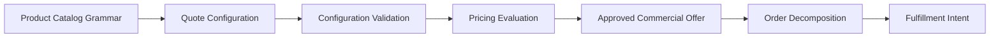
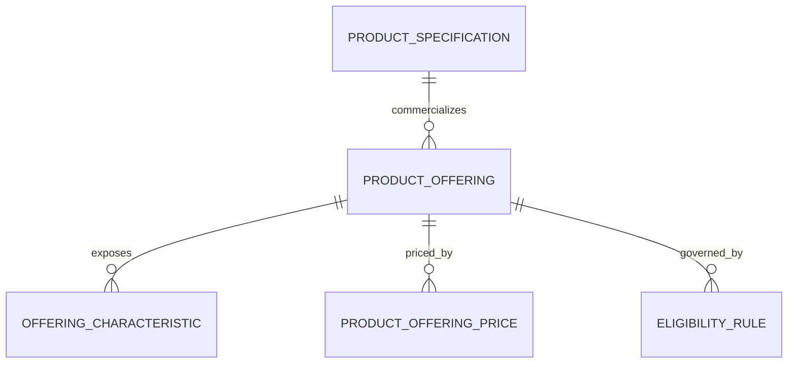
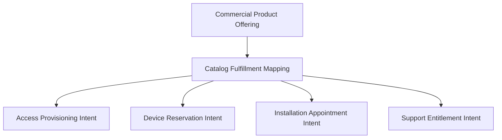
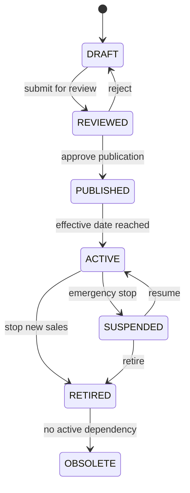
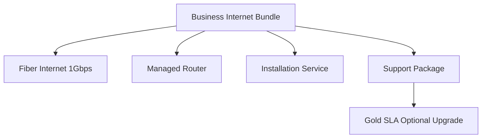
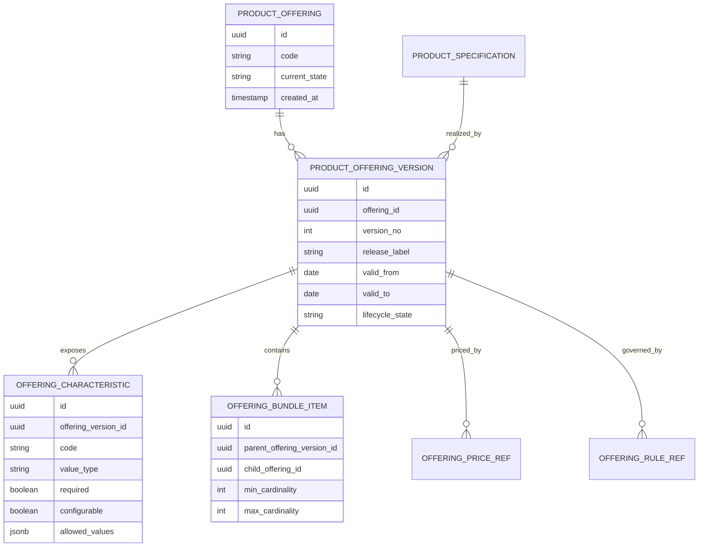
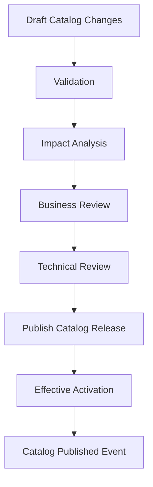
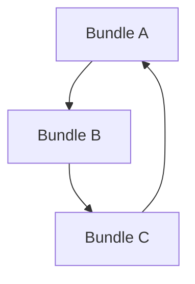

# Part 008 — Domain Modeling for Product Catalog

Product catalog adalah jantung CPQ.

Tetapi “catalog” sering disalahpahami sebagai tabel produk.

Itu terlalu dangkal.

Dalam CPQ/OMS enterprise, product catalog adalah **commercial knowledge base** yang menjawab:

- apa yang bisa dijual,
- kepada siapa bisa dijual,
- kapan bisa dijual,
- dalam kombinasi apa bisa dijual,
- dengan konfigurasi apa bisa dijual,
- aturan apa yang membuat konfigurasi valid,
- pricing input apa yang dibutuhkan,
- fulfillment intent apa yang akan dihasilkan,
- snapshot apa yang harus dibawa ke quote dan order.

Kalau catalog model salah, semua service lain akan dipaksa menambal:

- Configuration Service menjadi penuh special case,
- Pricing Service tidak tahu price component mana yang relevan,
- Quote Service menyimpan data produk yang tidak stabil,
- Order Service tidak bisa decompose fulfillment,
- Camunda workflow harus membaca terlalu banyak exception,
- customer service tidak bisa menjelaskan kenapa suatu kombinasi invalid.

Part ini membangun product catalog dari first principles untuk platform CPQ/OMS production-grade.

---

## 1. Product Catalog Bukan Product Table

Product table sederhana biasanya seperti ini:

```text
product_id | name | price | active
```

Untuk sistem retail sederhana, ini mungkin cukup.

Untuk CPQ/OMS enterprise, ini gagal cepat.

Kenapa?

Karena “produk” dalam CPQ bukan hanya item yang dijual. Produk adalah struktur komersial yang punya rules, options, constraints, lifecycle, eligibility, price inputs, dan fulfillment mapping.

Contoh broadband enterprise:

- Fiber Internet 1Gbps,
- static IP add-on,
- managed router,
- installation service,
- 24x7 support,
- SLA gold,
- contract term 12/24/36 bulan,
- bandwidth burst option,
- discount tier,
- location availability,
- serviceability check,
- CPE inventory dependency,
- activation appointment.

Apakah semua ini satu row product?

Tidak.

Kita butuh model.

---

## 2. Mental Model: Catalog Sebagai Grammar

Cara paling efektif melihat catalog enterprise:

> Product catalog adalah grammar untuk membangun commercial offer yang valid.

Ia menentukan kata benda, atribut, pilihan, dan aturan kombinasi.

Quote adalah kalimat yang dibentuk dari grammar itu.

Configuration engine adalah parser/validator.

Pricing engine adalah evaluator commercial expression.

Order orchestration adalah compiler dari commercial intent menjadi fulfillment intent.



Kalau grammar ambigu, semua tahap berikutnya ikut ambigu.

---

## 3. Core Concepts

Kita akan memakai beberapa konsep utama.

| Concept | Pertanyaan Yang Dijawab |
|---|---|
| Product Specification | “Apa kapabilitas/produk secara teknis atau konseptual?” |
| Product Offering | “Apa yang dijual ke market/customer?” |
| Product Offering Price | “Bagaimana offering ini dihargai?” |
| Characteristic Definition | “Atribut apa yang bisa/harus dikonfigurasi?” |
| Option | “Pilihan nilai apa yang tersedia?” |
| Bundle | “Kombinasi offering apa yang dijual bersama?” |
| Constraint Rule | “Kombinasi apa yang valid/invalid?” |
| Eligibility Rule | “Siapa/lokasi/channel/segment mana yang boleh membeli?” |
| Lifecycle State | “Catalog item ini draft, active, retired, atau obsolete?” |
| Effective Period | “Berlaku dari kapan sampai kapan?” |
| Snapshot | “Nilai catalog apa yang dipakai saat quote dibuat?” |

TM Forum Product Catalog Management API dapat dijadikan referensi industri karena ia memodelkan lifecycle catalog element dan konsultasi catalog element untuk proses seperti ordering, campaign, dan sales. Tetapi dalam seri ini kita tidak akan menyalin model TMF apa adanya; kita mengambil konsep yang berguna lalu membuat model internal yang lebih mudah dibangun dan diuji.

---

## 4. Product Specification Vs Product Offering

Ini pemisahan paling penting.

### 4.1 Product Specification

Product Specification menjelaskan **apa produk itu secara konseptual/teknis**.

Contoh:

```text
Internet Access Service
Managed Router
Static IP Service
Installation Service
Support Plan
```

Ia menjawab:

- karakteristik apa yang dimiliki,
- technical capability apa yang direpresentasikan,
- fulfillment domain apa yang terlibat,
- dependency teknis apa yang ada.

### 4.2 Product Offering

Product Offering menjelaskan **apa yang dijual secara komersial**.

Contoh:

```text
Fiber Internet 1Gbps Business Plan
Fiber Internet 500Mbps Business Plan
Managed Router Premium Add-On
Gold SLA Support Package
```

Offering mengikat product specification ke market, segment, price model, lifecycle, dan eligibility.



### 4.3 Kenapa Harus Dipisah?

Karena satu specification bisa punya banyak offering.

Contoh:

`Internet Access Service` bisa dijual sebagai:

- Residential Fiber 100Mbps,
- Business Fiber 1Gbps,
- Enterprise Dedicated Internet,
- Promotional 6-month Fiber Plan.

Sebaliknya, satu offering bisa membungkus beberapa specification.

Contoh:

`Business Internet Starter Bundle` mencakup:

- Internet Access Service,
- Installation Service,
- Managed Router,
- Basic Support.

Kalau specification dan offering dicampur, catalog akan penuh duplikasi.

---

## 5. Commercial Model Vs Technical Model

Product catalog CPQ punya dua wajah:

1. commercial model,
2. technical/fulfillment model.

Commercial model dipahami sales/customer.

Technical model dipahami fulfillment system.

Contoh commercial line:

```text
Business Fiber 1Gbps with Managed Router and Gold Support
```

Fulfillment decomposition bisa menjadi:

```text
- provision fiber access service
- reserve ONT device
- ship managed router
- configure static IP block
- schedule installation
- activate support entitlement
```

Jangan memaksa sales UI memilih fulfillment component teknis satu per satu.

Tetapi jangan juga membuat Order Service menebak fulfillment dari string nama produk.

Catalog harus menyediakan mapping eksplisit.



---

## 6. Aggregate Boundary Dalam Catalog Service

Catalog Service tidak harus punya satu aggregate besar.

Kandidat aggregate:

- `ProductSpecification`,
- `ProductOffering`,
- `ProductOfferingPrice`,
- `CatalogPublication`,
- `RuleSet`,
- `BundleDefinition`.

Untuk build awal, kita gunakan boundary:

```text
ProductOfferingAggregate
```

Yang mencakup:

- offering identity,
- offering version,
- lifecycle,
- effective period,
- linked specification refs,
- exposed characteristics,
- allowed options,
- price refs,
- eligibility refs,
- compatibility refs,
- fulfillment mapping refs.

Namun rule detail dan price detail bisa dimiliki service berbeda:

- Pricing Service memiliki price calculation logic,
- Configuration Service mengevaluasi constraint kompleks,
- Catalog Service menyimpan definisi dan metadata.

Catalog Service bukan tempat semua rule runtime dieksekusi.

---

## 7. Catalog Lifecycle

Catalog item punya lifecycle.

Minimal:

```text
DRAFT -> REVIEWED -> PUBLISHED -> ACTIVE -> RETIRED -> OBSOLETE
```



### 7.1 State Meaning

| State | Meaning | Bisa Dijual? | Bisa Dipakai Quote Lama? |
|---|---|---:|---:|
| DRAFT | Sedang disusun | Tidak | Tidak |
| REVIEWED | Siap approval | Tidak | Tidak |
| PUBLISHED | Sudah disetujui, menunggu effective date | Tidak sampai effective | Tidak untuk new quote |
| ACTIVE | Berlaku untuk new quote | Ya | Ya |
| RETIRED | Tidak boleh untuk new quote | Tidak | Ya, untuk quote/order existing |
| OBSOLETE | Tidak dipakai lagi | Tidak | Hanya historical |
| SUSPENDED | Dihentikan sementara | Tidak | Tergantung policy |

### 7.2 Retired Bukan Deleted

Jangan hard delete catalog item yang pernah dipakai quote/order.

Quote historis butuh reference dan snapshot.

Order amendment mungkin butuh membandingkan offering lama dengan offering baru.

Audit butuh menjelaskan rule saat keputusan dibuat.

---

## 8. Versioning Dan Effective Dating

Catalog berubah terus.

Harga berubah.

Eligibility berubah.

Bundle berubah.

Characteristic berubah.

Kalau catalog tidak versioned, quote tidak reproducible.

### 8.1 Version Identity

Gunakan identity stabil + version.

```text
productOfferingId = PO-FIBER-1G-BIZ
version = 2026.07
```

Atau numeric version:

```text
productOfferingId = PO-FIBER-1G-BIZ
version = 12
```

Untuk enterprise, version label bisa nyaman untuk business, tetapi internal numeric version lebih mudah untuk locking.

Kita bisa menyimpan keduanya:

```json
{
  "offeringId": "PO-FIBER-1G-BIZ",
  "offeringVersion": 12,
  "releaseLabel": "2026.07",
  "validFor": {
    "startDate": "2026-07-01",
    "endDate": "2026-12-31"
  }
}
```

### 8.2 Effective Date Rule

Catalog query untuk CPQ harus menjawab:

> Pada tanggal quote effective tertentu, offering mana yang aktif?

Bukan hanya:

> Offering mana yang active sekarang?

Karena quote bisa dibuat hari ini untuk contract start bulan depan.

### 8.3 Quote Snapshot Rule

Saat quote line dibuat, simpan:

- offering id,
- offering version,
- display name snapshot,
- characteristic definition snapshot,
- selected options,
- relevant rule version,
- price list reference,
- fulfillment mapping reference.

Jangan hanya simpan offering id.

---

## 9. Characteristic Definition

Characteristic adalah atribut yang dapat dikonfigurasi atau dibawa oleh produk.

Contoh untuk Fiber Internet:

- bandwidth,
- contract term,
- static IP count,
- installation type,
- router model,
- SLA tier,
- service address,
- billing frequency.

Characteristic definition harus punya metadata:

```json
{
  "code": "BANDWIDTH",
  "name": "Bandwidth",
  "valueType": "ENUM",
  "required": true,
  "configurable": true,
  "multiValued": false,
  "allowedValues": [
    { "code": "500M", "displayName": "500 Mbps" },
    { "code": "1G", "displayName": "1 Gbps" }
  ]
}
```

### 9.1 Value Type

Minimal value type:

```text
STRING
NUMBER
INTEGER
BOOLEAN
ENUM
MONEY
DATE
DATE_TIME
ADDRESS_REF
PRODUCT_REF
```

Jangan semua dibuat string.

### 9.2 Required Vs Derived

Ada characteristic yang dipilih user.

Ada yang diturunkan sistem.

Contoh:

- `BANDWIDTH` dipilih user,
- `ACCESS_TECHNOLOGY` diturunkan dari serviceability,
- `INSTALLATION_REQUIRED` diturunkan dari existing service,
- `MIN_CONTRACT_TERM` diturunkan dari promotion.

Schema harus membedakan:

```json
{
  "code": "INSTALLATION_REQUIRED",
  "source": "DERIVED",
  "configurable": false
}
```

---

## 10. Options Dan Option Groups

Option adalah nilai yang bisa dipilih.

Option group mengelompokkan pilihan.

Contoh:

```text
Router Option Group
- No Router
- Standard Managed Router
- Premium Managed Router
```

Option metadata:

- code,
- display name,
- description,
- lifecycle,
- effective period,
- eligibility,
- price impact ref,
- fulfillment impact ref,
- compatibility tags.

### 10.1 Option Price Impact

Option tidak selalu punya harga langsung.

Kadang option menjadi input pricing rule.

Contoh:

```text
SLA_TIER = GOLD
```

Bisa menghasilkan:

- monthly recurring charge + $500,
- setup fee waived,
- approval required if discounted.

Jangan simpan semua price di option jika pricing rule lebih kompleks.

Catalog cukup menyatakan option tersedia dan price component reference.

---

## 11. Bundle Modeling

Bundle adalah offering yang terdiri dari offering lain.

Contoh:

```text
Business Internet Bundle
- Fiber Internet 1Gbps
- Managed Router
- Installation
- Basic Support
```

Bundle harus menjawab:

- child offering apa saja,
- mandatory atau optional,
- cardinality,
- dependency,
- discount/bundle price behavior,
- lifecycle alignment,
- decomposition behavior.



### 11.1 Bundle Cardinality

Contoh:

```json
{
  "childOfferingRef": {
    "id": "PO-STATIC-IP"
  },
  "minCardinality": 0,
  "maxCardinality": 5,
  "defaultQuantity": 0
}
```

### 11.2 Bundle Price Policy

Bundle bisa priced dengan beberapa cara:

1. sum of child prices,
2. bundle-level fixed price,
3. child price with bundle discount,
4. promotional bundle price,
5. mixed recurring/one-time charge.

Catalog harus menyatakan pricing model, tetapi Pricing Service menghitung hasil akhir.

---

## 12. Constraint Rules

Constraint rule menentukan kombinasi valid/invalid.

Contoh:

- Gold SLA hanya tersedia untuk bandwidth minimal 1Gbps.
- Static IP lebih dari 8 membutuhkan business segment.
- Premium router tidak tersedia di region tertentu.
- Installation self-service tidak tersedia untuk enterprise dedicated access.
- Contract term 36 bulan wajib untuk promo tertentu.

### 12.1 Rule Representation

Untuk awal, jangan langsung membuat rule engine kompleks.

Mulai dengan taxonomy rule:

```text
REQUIRES
EXCLUDES
LIMITS
DEFAULTS
DERIVES
ELIGIBILITY
```

Contoh:

```json
{
  "ruleId": "RULE-GOLD-SLA-REQUIRES-1G",
  "type": "REQUIRES",
  "when": {
    "characteristic": "SLA_TIER",
    "operator": "EQUALS",
    "value": "GOLD"
  },
  "then": {
    "characteristic": "BANDWIDTH",
    "operator": "GREATER_THAN_OR_EQUALS",
    "value": "1G"
  },
  "message": "Gold SLA requires bandwidth of at least 1Gbps."
}
```

### 12.2 Explainability

Configuration engine harus bisa menjelaskan invalid configuration.

Jangan hanya mengembalikan:

```text
400 Bad Request
```

Kembalikan explanation:

```json
{
  "code": "CONFIGURATION_RULE_VIOLATED",
  "message": "Gold SLA requires bandwidth of at least 1Gbps.",
  "ruleId": "RULE-GOLD-SLA-REQUIRES-1G",
  "affectedFields": ["SLA_TIER", "BANDWIDTH"]
}
```

CPQ adalah tool sales. Explanation adalah bagian dari UX.

---

## 13. Eligibility Rules

Eligibility menjawab:

> Offering ini boleh dijual kepada siapa, di mana, melalui channel apa, dan pada kondisi apa?

Eligibility dimension:

- customer segment,
- customer type,
- region,
- service address,
- sales channel,
- partner,
- campaign,
- contract type,
- existing product ownership,
- credit status,
- inventory/serviceability.

### 13.1 Eligibility Bukan Configuration

Configuration menjawab:

> Kombinasi pilihan ini valid atau tidak?

Eligibility menjawab:

> Customer/context ini boleh membeli offering ini atau tidak?

Jangan campur keduanya.

Contoh:

```text
Gold SLA requires 1Gbps bandwidth.
```

Itu configuration constraint.

```text
Gold SLA only available for enterprise customers in Jakarta region.
```

Itu eligibility.

### 13.2 Eligibility Result

Eligibility result harus kaya:

```json
{
  "eligible": false,
  "reasonCode": "REGION_NOT_SUPPORTED",
  "message": "This offering is not available for the selected service address.",
  "blocking": true,
  "alternatives": [
    { "offeringId": "PO-FIBER-500M-BIZ", "displayName": "Business Fiber 500Mbps" }
  ]
}
```

---

## 14. Product Catalog Data Model Awal

Kita akan mulai dengan relational model yang tidak terlalu over-engineered, tetapi cukup untuk enterprise evolution.



### 14.1 Why JSONB For Allowed Values?

Allowed values bisa berubah bentuk antar characteristic.

Tetapi jangan semua dijadikan JSONB.

Rule:

- identity, lifecycle, effective date, owner, state: column,
- flexible metadata/options: JSONB,
- query-critical field: column/index,
- audit-critical field: explicit column or audit record.

---

## 15. Catalog Publication Model

Perubahan catalog tidak boleh langsung aktif begitu row disimpan.

Butuh publication process.

Publication menjawab:

- perubahan apa yang masuk release,
- siapa review,
- kapan effective,
- impact ke quote/order apa,
- rollback plan apa,
- compatibility dengan active offering apa.



### 15.1 Impact Analysis

Sebelum publish, sistem harus bisa menjawab:

- offering baru apa,
- offering retire apa,
- characteristic berubah apa,
- price ref berubah apa,
- rule berubah apa,
- quote draft mana yang terdampak,
- active campaign mana yang terdampak,
- order amendment mana yang mungkin terdampak.

Ini bukan nice-to-have. Ini requirement enterprise.

---

## 16. Catalog Snapshot Untuk Quote

Quote tidak boleh tergantung pada mutable catalog.

Saat quote line dibuat, Quote Service mengambil catalog snapshot.

Snapshot minimal:

```json
{
  "offeringRef": {
    "id": "PO-FIBER-1G-BIZ",
    "version": 12,
    "releaseLabel": "2026.07"
  },
  "displayName": "Business Fiber 1Gbps",
  "description": "High-speed business fiber internet service.",
  "characteristics": [
    {
      "code": "BANDWIDTH",
      "displayName": "Bandwidth",
      "valueType": "ENUM",
      "selectedValue": "1G"
    },
    {
      "code": "CONTRACT_TERM",
      "displayName": "Contract Term",
      "valueType": "ENUM",
      "selectedValue": "24M"
    }
  ],
  "capturedAt": "2026-07-02T10:15:30Z"
}
```

Snapshot bukan berarti copy semua catalog metadata.

Snapshot berarti copy data yang dibutuhkan untuk:

- display quote,
- reproduce pricing context,
- audit decision,
- create order,
- explain customer agreement.

---

## 17. Catalog API Boundary

Catalog Service menyediakan API untuk use case, bukan table browsing.

Endpoint kandidat:

```text
GET /product-offerings?segment=&channel=&effectiveDate=&serviceAddressRef=
GET /product-offerings/{offeringId}/versions/{version}
GET /product-offerings/{offeringId}/configuration-model?effectiveDate=
POST /product-offerings/eligibility-check
POST /catalog-publications
POST /catalog-publications/{publicationId}/submit
POST /catalog-publications/{publicationId}/approve
POST /catalog-publications/{publicationId}/publish
```

### 17.1 Query Catalog For Selling

Frontend/BFF biasanya tidak butuh seluruh catalog.

Ia butuh sellable offering untuk context tertentu.

Request:

```json
{
  "tenantId": "tenant-a",
  "customerSegment": "BUSINESS",
  "channel": "DIRECT_SALES",
  "effectiveDate": "2026-07-02",
  "serviceAddressRef": "ADDR-1"
}
```

Response:

```json
{
  "items": [
    {
      "offeringId": "PO-FIBER-1G-BIZ",
      "offeringVersion": 12,
      "displayName": "Business Fiber 1Gbps",
      "summary": "Fiber internet for business customers.",
      "eligible": true
    }
  ]
}
```

### 17.2 Configuration Model API

Configuration Service bisa mengambil model konfigurasi:

```json
{
  "offeringId": "PO-FIBER-1G-BIZ",
  "offeringVersion": 12,
  "characteristics": [...],
  "rules": [...],
  "bundleItems": [...]
}
```

Jangan membuat Configuration Service query table Catalog secara langsung.

Boundary harus tetap lewat contract.

---

## 18. Catalog Event

Catalog publish harus menghasilkan event.

Contoh:

```text
catalog.product-offering-published.v1
catalog.product-offering-retired.v1
catalog.catalog-release-activated.v1
```

Consumer:

- BFF invalidates cache,
- Configuration Service refreshes model,
- Pricing Service refreshes price reference,
- Quote Service validates draft quote impact,
- Search projection updates index.

Event payload harus cukup untuk invalidation, bukan seluruh catalog.

```json
{
  "eventType": "catalog.product-offering-published.v1",
  "data": {
    "offeringId": "PO-FIBER-1G-BIZ",
    "offeringVersion": 12,
    "releaseLabel": "2026.07",
    "validFor": {
      "startDate": "2026-07-01",
      "endDate": "2026-12-31"
    },
    "changedCapabilities": [
      "CHARACTERISTICS",
      "ELIGIBILITY",
      "PRICE_REFS"
    ]
  }
}
```

---

## 19. Cache Strategy Untuk Catalog

Catalog read traffic tinggi.

Tetapi catalog correctness penting.

Cache boleh, tapi harus version-aware.

Cache key contoh:

```text
catalog:offering-model:tenant-a:PO-FIBER-1G-BIZ:v12
catalog:sellable-offerings:tenant-a:BUSINESS:DIRECT_SALES:2026-07-02:region-jkt
```

Rule:

- cache immutable versioned offering lebih aman,
- cache “active catalog” harus invalidated oleh publication event,
- TTL bukan pengganti invalidation,
- cache response harus menyimpan catalog version/effective date,
- quote creation harus mencatat version yang dipakai.

---

## 20. Catalog And Pricing Boundary

Catalog tidak menghitung final price.

Catalog menyediakan:

- offering price refs,
- price component eligibility,
- characteristic price influence metadata,
- price list reference,
- pricing model type.

Pricing Service menghitung:

- base recurring charge,
- one-time charge,
- discount,
- promotion,
- surcharge,
- tax placeholder,
- rounding,
- total.

Contoh catalog price reference:

```json
{
  "priceRefs": [
    {
      "priceCode": "MRC-FIBER-1G",
      "chargeType": "RECURRING",
      "billingFrequency": "MONTHLY",
      "appliesTo": "BASE_OFFERING"
    },
    {
      "priceCode": "OTC-INSTALLATION",
      "chargeType": "ONE_TIME",
      "appliesTo": "INSTALLATION"
    }
  ]
}
```

Pricing Service resolves price codes using price list/rules.

---

## 21. Catalog And Order Decomposition Boundary

Order Service butuh fulfillment mapping.

Catalog menyediakan mapping dari commercial offering ke fulfillment intent template.

Contoh:

```json
{
  "offeringId": "PO-FIBER-1G-BIZ",
  "fulfillmentTemplates": [
    {
      "intentType": "ACCESS_PROVISIONING",
      "provider": "network-activation",
      "inputMappings": [
        { "fromCharacteristic": "BANDWIDTH", "toField": "bandwidth" },
        { "fromCharacteristic": "SERVICE_ADDRESS", "toField": "addressRef" }
      ]
    },
    {
      "intentType": "INSTALLATION_APPOINTMENT",
      "provider": "field-service",
      "condition": "INSTALLATION_REQUIRED == true"
    }
  ]
}
```

Jangan membuat Order Service hardcode:

```java
if (productCode.equals("PO-FIBER-1G-BIZ")) {
   createFiberOrder();
}
```

Itu akan menjadi maintenance nightmare.

---

## 22. Data Ownership

Catalog Service owns:

- product offering definition,
- product specification metadata,
- characteristic definitions,
- bundle definitions,
- catalog lifecycle,
- catalog publication,
- eligibility metadata,
- configuration model metadata,
- fulfillment mapping metadata.

Pricing Service owns:

- price calculation,
- discount policy,
- promotion evaluation,
- price trace,
- price component output.

Quote Service owns:

- selected configuration,
- quote line snapshot,
- quote lifecycle,
- customer-specific commercial offer,
- accepted quote artifact.

Order Service owns:

- order lifecycle,
- order decomposition result,
- fulfillment state,
- amendment/cancellation state.

Camunda owns no domain data.

Camunda orchestrates process.

---

## 23. Catalog Modeling Anti-Patterns

### 23.1 Product Code As Logic

Hardcoding product codes in Java services.

Symptom:

```java
if ("GOLD_SLA".equals(optionCode)) {
    requireApproval();
}
```

Better:

- catalog/rule metadata declares approval trigger,
- policy engine evaluates,
- service consumes decision.

### 23.2 Catalog As Static Config File Forever

Static YAML/JSON is acceptable for bootstrapping.

It fails when business users need lifecycle, approval, effective date, impact analysis, and audit.

Use static seed for early stage, but model publication path early.

### 23.3 No Versioning

If offering is mutable in place, quote reproducibility dies.

### 23.4 One Global Product Entity

Global product entity becomes dumping ground.

Better: split product specification, offering, price, configuration, fulfillment mapping.

### 23.5 UI-Driven Catalog Model

If catalog is modeled only for current UI screen, backend will fail when new channel appears.

Catalog should model domain grammar, not one page layout.

### 23.6 Fulfillment Leakage Into Sales

If sales must understand all provisioning components, CPQ UX becomes unusable.

Commercial offer should hide technical detail while preserving mapping.

---

## 24. Minimum Catalog Capability For Build-From-Scratch Project

Untuk seri ini, kita tidak akan membangun seluruh universe TMF-style catalog.

Minimum production-grade scope:

1. Product offering with version.
2. Product specification reference.
3. Effective dating.
4. Lifecycle state.
5. Characteristic definitions.
6. Allowed values/options.
7. Bundle item relation.
8. Eligibility rule reference.
9. Configuration rule reference.
10. Price code references.
11. Fulfillment template references.
12. Publication workflow.
13. Catalog snapshot API.
14. Catalog published event.
15. Cache invalidation support.
16. Audit trail for catalog changes.

Ini cukup untuk CPQ/OMS enterprise skeleton yang bisa berkembang.

---

## 25. Example Product Catalog Model

Kita gunakan contoh broadband business.

### 25.1 Product Specification

```json
{
  "specificationId": "PS-INTERNET-ACCESS",
  "name": "Internet Access Service",
  "category": "CONNECTIVITY",
  "characteristicDefinitions": [
    {
      "code": "BANDWIDTH",
      "valueType": "ENUM",
      "allowedValues": ["500M", "1G", "10G"]
    },
    {
      "code": "ACCESS_TYPE",
      "valueType": "ENUM",
      "allowedValues": ["FIBER", "ETHERNET"]
    }
  ]
}
```

### 25.2 Product Offering

```json
{
  "offeringId": "PO-FIBER-1G-BIZ",
  "version": 12,
  "releaseLabel": "2026.07",
  "displayName": "Business Fiber 1Gbps",
  "specificationRefs": [
    { "id": "PS-INTERNET-ACCESS", "version": 3 }
  ],
  "validFor": {
    "startDate": "2026-07-01",
    "endDate": "2026-12-31"
  },
  "lifecycleState": "ACTIVE",
  "characteristics": [
    {
      "code": "BANDWIDTH",
      "required": true,
      "configurable": false,
      "defaultValue": "1G"
    },
    {
      "code": "CONTRACT_TERM",
      "required": true,
      "configurable": true,
      "allowedValues": ["12M", "24M", "36M"]
    }
  ],
  "priceRefs": [
    { "priceCode": "MRC-FIBER-1G-BIZ", "chargeType": "RECURRING" }
  ]
}
```

### 25.3 Bundle

```json
{
  "offeringId": "PO-BIZ-INTERNET-BUNDLE",
  "version": 5,
  "displayName": "Business Internet Bundle",
  "bundleItems": [
    {
      "childOfferingId": "PO-FIBER-1G-BIZ",
      "minCardinality": 1,
      "maxCardinality": 1,
      "mandatory": true
    },
    {
      "childOfferingId": "PO-MANAGED-ROUTER",
      "minCardinality": 0,
      "maxCardinality": 1,
      "mandatory": false
    },
    {
      "childOfferingId": "PO-GOLD-SLA",
      "minCardinality": 0,
      "maxCardinality": 1,
      "mandatory": false
    }
  ]
}
```

---

## 26. Catalog Validation Rules

Sebelum offering dipublish, validasi:

1. offering code unique,
2. version monotonic,
3. effective period tidak overlap untuk same release policy,
4. linked specification exists,
5. characteristic code valid,
6. required characteristic punya default atau harus supplied,
7. allowed values match value type,
8. bundle child exists dan active/effective compatible,
9. price ref exists,
10. rule ref exists,
11. fulfillment template valid,
12. no circular bundle dependency,
13. retired offering tidak dipakai sebagai mandatory child active bundle,
14. publication has approver,
15. impact analysis completed.

### 26.1 Circular Bundle Detection

Bundle bisa membuat graph.

Harus dicegah cycle.



Cycle seperti ini harus invalid.

Deteksi menggunakan graph traversal saat publication validation.

---

## 27. Catalog Testing Strategy

Catalog test bukan hanya repository test.

Buat scenario catalog:

### 27.1 Happy Path

- active offering muncul untuk segment valid,
- configuration model lengkap,
- price refs tersedia,
- quote snapshot bisa dibuat.

### 27.2 Lifecycle Path

- draft tidak sellable,
- published future tidak sellable hari ini,
- active sellable,
- retired tidak muncul untuk new quote,
- retired masih bisa resolve snapshot historical.

### 27.3 Eligibility Path

- customer eligible,
- customer not eligible with reason,
- alternative offering returned.

### 27.4 Constraint Path

- invalid option combination returns explanation,
- default derived characteristic applied,
- required characteristic missing returns actionable error.

### 27.5 Publication Path

- publication rejects circular bundle,
- publication rejects missing price ref,
- publication emits event after activation,
- cache invalidated after publication.

---

## 28. Implementation Sketch: Domain Types

Contoh domain type di Java:

```java
public final class ProductOfferingId {
    private final String value;

    private ProductOfferingId(String value) {
        if (value == null || value.isBlank()) {
            throw new IllegalArgumentException("ProductOfferingId must not be blank");
        }
        this.value = value;
    }

    public static ProductOfferingId of(String value) {
        return new ProductOfferingId(value);
    }

    public String value() {
        return value;
    }
}
```

Offering version:

```java
public final class OfferingVersion {
    private final int value;

    private OfferingVersion(int value) {
        if (value < 1) {
            throw new IllegalArgumentException("Offering version must be positive");
        }
        this.value = value;
    }

    public static OfferingVersion of(int value) {
        return new OfferingVersion(value);
    }

    public int value() {
        return value;
    }
}
```

Product offering aggregate sketch:

```java
public final class ProductOffering {
    private final ProductOfferingId id;
    private final OfferingVersion version;
    private final String displayName;
    private final EffectivePeriod validFor;
    private final CatalogLifecycleState lifecycleState;
    private final List<CharacteristicDefinition> characteristics;
    private final List<BundleItem> bundleItems;
    private final List<PriceReference> priceReferences;

    public boolean isSellableOn(LocalDate date) {
        return lifecycleState == CatalogLifecycleState.ACTIVE
            && validFor.includes(date);
    }

    public CatalogSnapshot snapshotAt(Instant capturedAt) {
        if (lifecycleState == CatalogLifecycleState.DRAFT) {
            throw new IllegalStateException("Draft offering cannot be snapshotted for quote");
        }
        return CatalogSnapshot.from(this, capturedAt);
    }
}
```

Domain object menjaga invariant, bukan hanya getter/setter.

---

## 29. MDX Series Boundary: Apa Yang Belum Dibahas

Part ini belum membahas detail:

- configuration engine algorithm,
- pricing engine algorithm,
- JPA mapping,
- PostgreSQL indexes,
- Camunda publication workflow,
- Kafka outbox implementation,
- Redis cache implementation.

Itu akan dibahas di part khusus.

Di sini kita hanya membangun domain model catalog agar part berikutnya punya fondasi yang benar.

---

## 30. Ringkasan

Product catalog enterprise bukan tabel produk.

Ia adalah grammar komersial yang memungkinkan sistem membangun quote valid, menghitung price, menjalankan approval, membuat order, dan melakukan fulfillment secara defensible.

Aturan inti part ini:

1. Pisahkan Product Specification dan Product Offering.
2. Pisahkan commercial model dan technical/fulfillment model.
3. Versioning dan effective dating wajib.
4. Retired bukan deleted.
5. Characteristic harus typed, bukan string bebas.
6. Option bisa punya price/fulfillment impact, tetapi bukan tempat final pricing logic.
7. Bundle adalah graph, jadi validasi cycle wajib.
8. Constraint dan eligibility adalah konsep berbeda.
9. Quote harus menyimpan catalog snapshot.
10. Catalog publication butuh validation, impact analysis, approval, activation, event, dan audit.

Part berikutnya akan membangun **Configuration Engine Design**: bagaimana mengambil grammar catalog ini lalu memvalidasi konfigurasi quote line dengan rule, dependency graph, compatibility matrix, explanation, dan incremental validation.

---

## References

- TM Forum — Product Catalog Management API TMF620 v5.0: `https://www.tmforum.org/open-digital-architecture/open-apis/product-catalog-management-api-TMF620/v5.0`
- TM Forum — TMF620 Product Catalog Management API User Guide v5.0.0: `https://www.tmforum.org/resources/specifications/tmf620-product-catalog-management-api-user-guide-v5-0-0/`
- TM Forum — Product Catalog Management Component: `https://www.tmforum.org/oda/directory/components-map/core-commerce-management/TMFC001`
- OpenAPI Specification: `https://spec.openapis.org/`
- JSON Schema Specification: `https://json-schema.org/specification`
