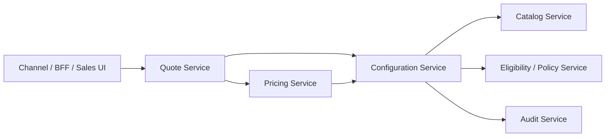
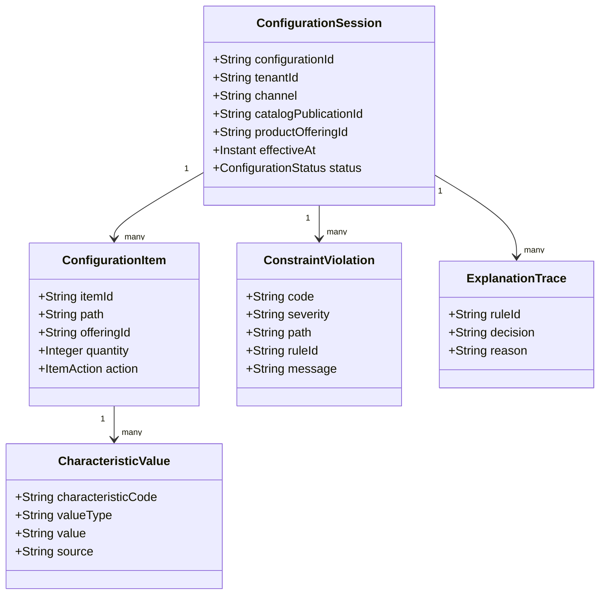
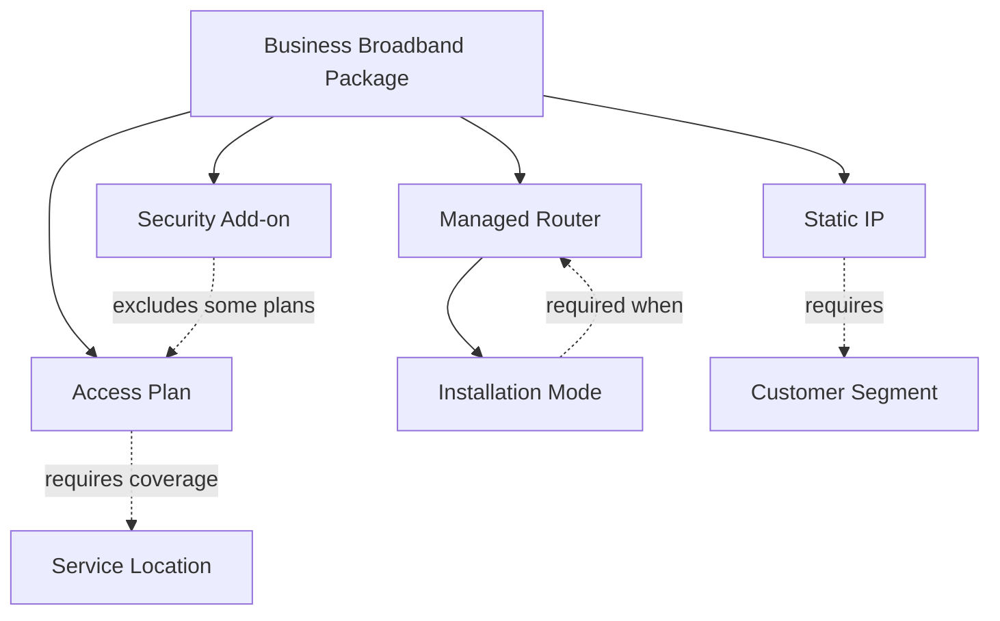
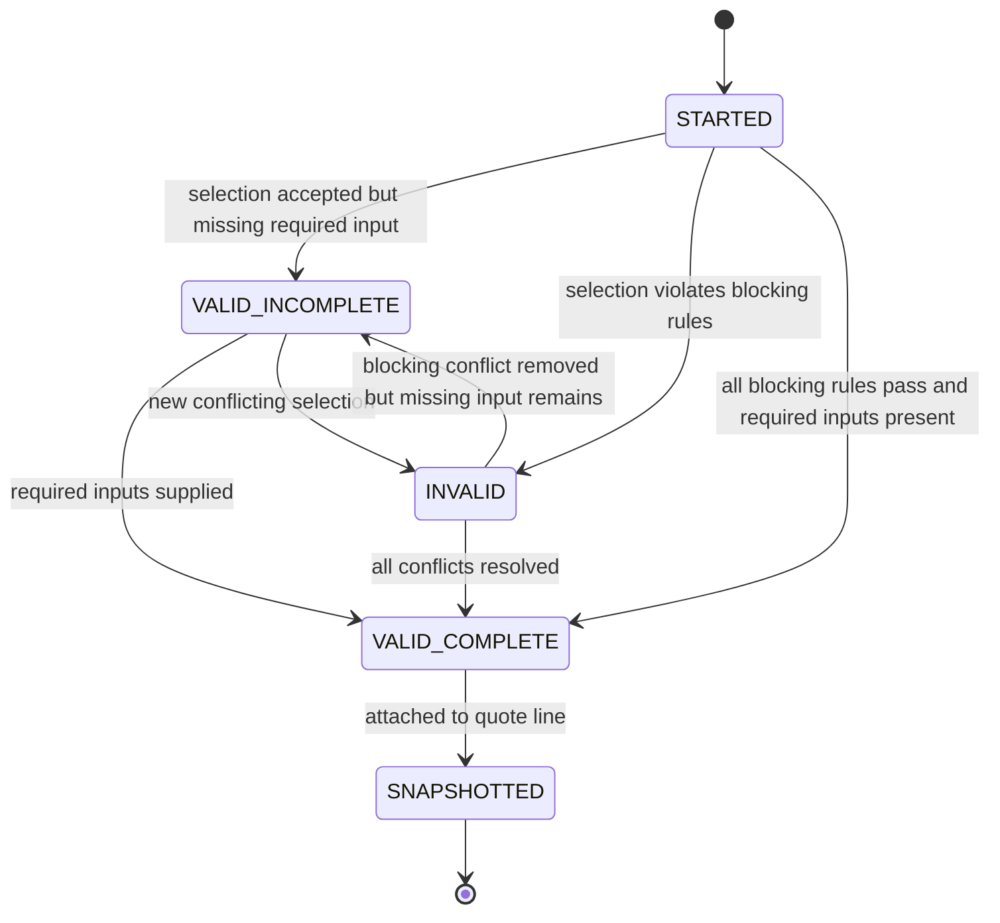
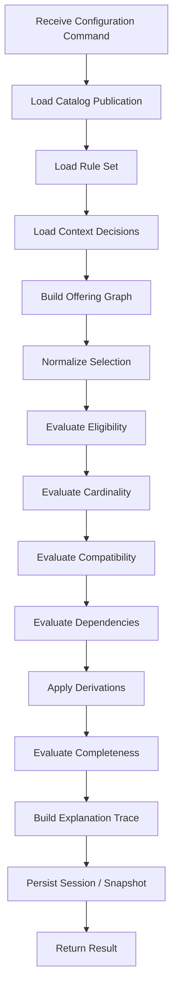
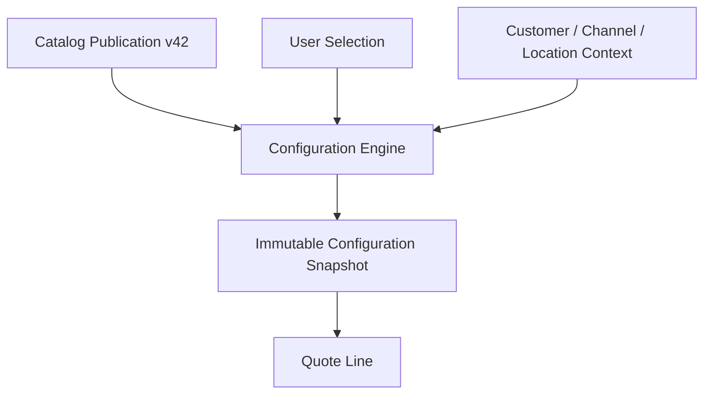
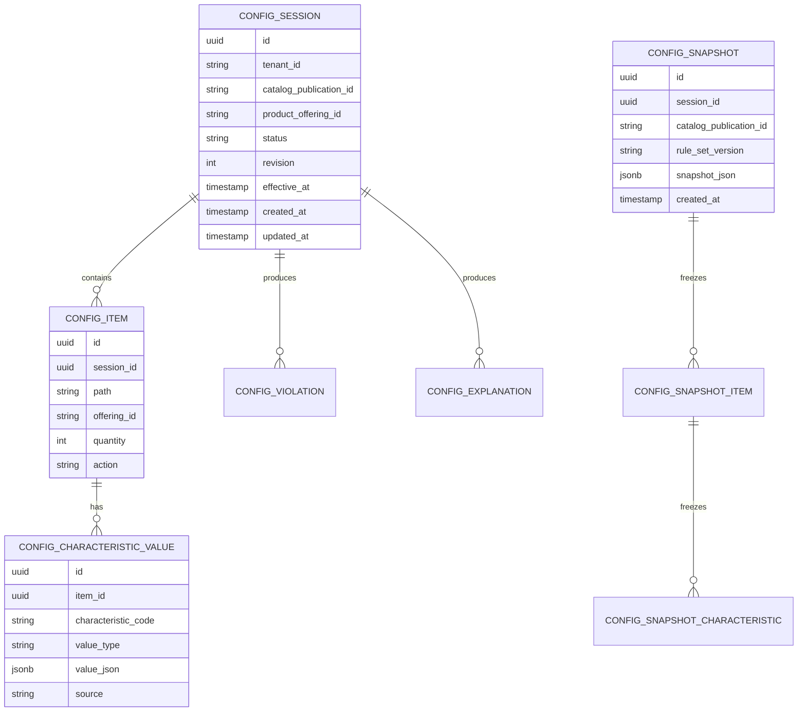
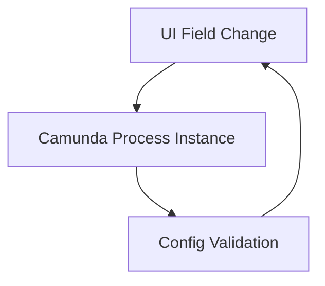
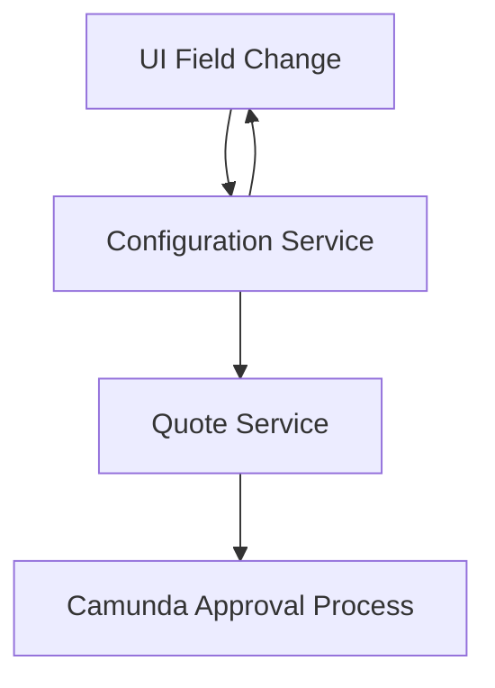

# Part 009 — Configuration Engine Design

A CPQ configuration engine answers a deceptively simple question:

> Given a customer, channel, catalog version, product offering, selected options, and business context, is this configuration valid, complete, explainable, and safe to price or order?

The weak implementation answers only this:

> Did the current UI form submit enough fields?

That second version is how enterprise CPQ systems become expensive forms with hidden business rules scattered across frontend code, database triggers, pricing scripts, order validation, and fulfillment fallout handlers.

This part builds the mental model and design skeleton for a production-grade configuration engine. Not a toy configurator. Not a hardcoded bundle selector. A real engine that can survive catalog versioning, bundled products, eligibility, dependency rules, invalid combinations, partial configuration, explainability, pricing handoff, quote snapshotting, and operational debugging.

We will not repeat basic Java, REST, SQL, Redis, Kafka, or JPA. Here we care about the **shape of the engine**.

---

## 1. The Configuration Engine Is Not the Product Catalog

The catalog defines what can exist.

The configuration engine evaluates what can be selected **now**.

That distinction matters.

A product catalog says:

- Broadband 1 Gbps exists.
- Static IP is an add-on.
- Managed router is an add-on.
- Static IP requires a business customer segment.
- Managed router has installation variants.
- Broadband 1 Gbps is available only in specific locations.

A configuration engine says:

- For this customer, in this channel, on this date, using catalog publication `CAT-2026-07-A`, these options are eligible.
- This submitted selection is invalid because `STATIC_IP` requires customer segment `BUSINESS`.
- This submitted selection is incomplete because router installation mode is mandatory when managed router is selected.
- This submitted selection is valid but has warnings because the selected access technology may require manual feasibility confirmation.
- This submitted selection is now frozen into a quote snapshot so later catalog changes do not silently rewrite commercial intent.

The product catalog is the dictionary.

The configuration engine is the grammar checker.

Pricing is a later phase. Ordering is a later phase. Fulfillment is a later phase. Configuration must produce an object that can be priced and eventually converted into an order without requiring everyone downstream to reinterpret raw user intent.

---

## 2. Where the Configuration Engine Sits

Configuration lives between catalog discovery and pricing.



The configuration service should not become the quote service. It should not own quote lifecycle, approval, pricing totals, or order submission. Its job is narrower and more defensible:

1. Load the relevant catalog publication.
2. Build a configurable model for a product offering.
3. Accept partial or complete selections.
4. Validate selections against rules and constraints.
5. Derive dependent choices or calculated characteristics when appropriate.
6. Return a normalized configuration result.
7. Provide an explanation trace.
8. Create a stable snapshot for quote pricing and order conversion.

A useful boundary test:

> Could the same configuration engine validate a product selection for quote creation, quote amendment, renewal, and order change without knowing the workflow state?

If yes, the boundary is probably healthy.

If no, the configuration engine is leaking quote/order lifecycle logic.

---

## 3. Inputs and Outputs

A configuration engine must be deterministic. The same input snapshot must produce the same validation result.

That means the engine input is not just “selected options”. It includes the context needed to interpret the selection.

### 3.1 Configuration Input

```json
{
  "tenantId": "telco-id",
  "channel": "SALES_PORTAL",
  "customerRef": {
    "customerId": "CUST-10001",
    "segment": "BUSINESS",
    "accountType": "CORPORATE"
  },
  "locationRef": {
    "serviceAddressId": "ADDR-90001",
    "region": "JAKARTA"
  },
  "catalogPublicationId": "CAT-2026-07-A",
  "productOfferingId": "PO-BROADBAND-BUSINESS",
  "effectiveAt": "2026-07-02T10:00:00+07:00",
  "configuration": {
    "items": [
      {
        "path": "root.access",
        "offeringId": "PO-BROADBAND-1G",
        "characteristics": {
          "contractTermMonths": 24
        }
      },
      {
        "path": "root.addons.staticIp",
        "offeringId": "PO-STATIC-IP",
        "quantity": 1
      }
    ]
  }
}
```

### 3.2 Configuration Output

```json
{
  "configurationId": "CFG-20260702-000001",
  "status": "VALID_INCOMPLETE",
  "catalogPublicationId": "CAT-2026-07-A",
  "productOfferingId": "PO-BROADBAND-BUSINESS",
  "normalizedConfiguration": {
    "items": []
  },
  "violations": [
    {
      "code": "MANDATORY_CHARACTERISTIC_MISSING",
      "severity": "ERROR",
      "path": "root.addons.router.installationMode",
      "message": "Installation mode is required when managed router is selected.",
      "ruleId": "RULE-ROUTER-INSTALL-MODE-001"
    }
  ],
  "warnings": [],
  "explanations": [
    {
      "ruleId": "RULE-STATIC-IP-BUSINESS-SEGMENT-001",
      "decision": "PASSED",
      "because": [
        "customer.segment == BUSINESS",
        "offering == PO-STATIC-IP"
      ]
    }
  ],
  "nextRequiredInputs": [
    {
      "path": "root.addons.router.installationMode",
      "allowedValues": ["SELF_INSTALL", "TECHNICIAN_INSTALL"]
    }
  ]
}
```

Notice the output is not only `true` or `false`. Enterprise CPQ needs:

- status,
- normalized selection,
- violation list,
- warning list,
- explanation trace,
- next required input,
- catalog/rule version references,
- stable identifiers for audit and reproduction.

A boolean validator is not enough.

---

## 4. Core Concepts

The configuration engine has a small vocabulary. Keep this vocabulary explicit.

| Concept | Meaning | Owned By |
|---|---|---|
| Product Specification | Technical/commercial blueprint of a product type | Catalog |
| Product Offering | Sellable product/package exposed to market/channel/customer segment | Catalog |
| Characteristic | Configurable attribute such as speed, term, color, bandwidth, address type | Catalog |
| Value Domain | Allowed value set or range for a characteristic | Catalog / Config |
| Option | Selectable child offering or configurable feature | Catalog |
| Rule | Constraint or derivation logic over context and selections | Catalog / Config / Policy |
| Configuration Session | Evaluation session for one selected offering and context | Config |
| Configuration Item | Normalized selected offering or option in the configuration tree | Config |
| Violation | Failed rule with severity and location | Config |
| Explanation | Human/system-readable reason behind a decision | Config |
| Snapshot | Immutable representation of validated configuration for quote/order | Quote / Config |

The central object is not a flat list. It is a **configuration tree**.



---

## 5. Configuration Is a Graph Problem, Not a Form Problem

A real product offering has relationships:

- parent-child,
- requires,
- excludes,
- optional,
- mandatory,
- cardinality,
- compatibility,
- eligibility,
- derivation,
- effective dating,
- channel exposure,
- regional availability.

Forms hide these relationships until they break.

A better mental model is:



The engine should operate on this graph. The UI can render it as a wizard, tree, accordion, or guided selling flow. But the backend model cannot be reduced to UI layout.

A UI field is a presentation detail.

A configuration characteristic is a domain fact.

---

## 6. Rule Taxonomy

Configuration rules should be categorized. Without taxonomy, every rule becomes “custom logic”, and the engine eventually turns into a landfill.

### 6.1 Eligibility Rules

Eligibility determines whether an offering or option can be selected in a context.

Examples:

- Static IP is available only for business customers.
- Premium SLA is available only in enterprise channel.
- Fiber plan is available only where fiber coverage exists.
- Promotional bundle is available only until a specific effective date.

Eligibility answers:

> Can this be selected at all?

### 6.2 Cardinality Rules

Cardinality controls minimum and maximum selection count.

Examples:

- Select exactly one access plan.
- Select zero or one router option.
- Select between one and five static IP blocks.
- Select at least one security feature for regulated customers.

Cardinality answers:

> How many selections are required or allowed?

### 6.3 Compatibility Rules

Compatibility controls whether selected options can coexist.

Examples:

- IPv6-only plan cannot be combined with legacy static IPv4 block.
- Self-install is not compatible with enterprise managed router.
- Bronze SLA is not compatible with 24/7 managed security monitoring.

Compatibility answers:

> Can these selected things coexist?

### 6.4 Dependency Rules

Dependency means one selection requires another selection or characteristic.

Examples:

- Static IP requires business broadband access.
- Managed router requires installation mode.
- Security monitoring requires customer contact details.

Dependency answers:

> If this is selected, what else must exist?

### 6.5 Derivation Rules

Derivation fills or computes values from context.

Examples:

- Installation region derives from service address.
- Default SLA derives from customer segment.
- Minimum contract term derives from selected discount package.

Derivation answers:

> What value can be safely inferred?

### 6.6 Completeness Rules

Completeness determines whether a configuration has enough data for the next stage.

A configuration may be valid but incomplete.

Example:

- Customer selected managed router, but installation slot is not selected yet.
- Product option selection is compatible, but service address qualification is pending.

Completeness answers:

> Is this configuration ready to price, approve, or order?

### 6.7 Warning Rules

Warnings do not block progression but must be visible.

Examples:

- Manual feasibility check may be required.
- Promotion expires soon.
- Selected combination has historically high fallout rate.

Warnings answer:

> What should the user or downstream process know, even though the configuration is not blocked?

---

## 7. Do Not Put All Rules in One Place

A common mistake is to build a single “rules service” that owns every rule in the company. It starts clean and becomes impossible to reason about.

A better approach is rule locality.

| Rule Type | Preferred Owner | Why |
|---|---|---|
| Product composition | Catalog | Defines product structure |
| Option cardinality | Catalog / Config | Close to configuration model |
| Customer eligibility | Policy / Eligibility | Depends on customer/account/segment rules |
| Regional availability | Availability / Qualification | Depends on network/service coverage |
| Pricing discount eligibility | Pricing / Policy | Pricing-specific consequence |
| Approval threshold | Approval / Policy | Workflow and authorization consequence |
| Order decomposition rule | Order | Fulfillment-specific consequence |

The configuration engine can call or consume policy decisions, but it should not own all policy.

A useful invariant:

> The configuration engine decides whether a product selection is structurally and contextually valid. It does not decide whether a salesperson is allowed to approve a discount, whether finance can bill it, or whether fulfillment can install it tomorrow.

---

## 8. Determinism: The Engine Must Be Re-runnable

Enterprise CPQ requires forensic replay.

Six months later, someone may ask:

- Why was this option allowed?
- Why did this quote pass validation?
- Why was this configuration priced in that way?
- Why did order fulfillment reject this supposedly valid configuration?

If the engine cannot reproduce its decision, it is not enterprise-grade.

Determinism requires every evaluation to record:

- input payload,
- catalog publication version,
- rule set version,
- policy decision references,
- external qualification result references,
- effective timestamp,
- tenant,
- channel,
- customer segment,
- engine version,
- generated explanation trace.

Do not evaluate against “current catalog” when creating a quote. Evaluate against a specific publication.

Do not evaluate against “now” implicitly. Pass `effectiveAt`.

Do not silently call changing external services and forget the result. Snapshot the result or reference a versioned qualification response.

---

## 9. Configuration Status Model

A binary status is too weak.

Use a status model like this:



Status meanings:

| Status | Meaning | Can Price? | Can Order? |
|---|---|---:|---:|
| `STARTED` | Session created, not enough evaluation yet | No | No |
| `VALID_INCOMPLETE` | No blocking conflict, but mandatory input missing | Usually no | No |
| `INVALID` | Blocking rule violation exists | No | No |
| `VALID_COMPLETE` | Ready for pricing/quote progression | Yes | Usually not directly |
| `SNAPSHOTTED` | Immutable representation attached to quote/order | Yes, if quote state permits | Yes, through order conversion |

The important distinction is `INVALID` vs `VALID_INCOMPLETE`.

A configuration can be incomplete without being wrong.

A wizard-style UI needs that distinction to guide the user. A backend quote lifecycle needs that distinction to prevent accidental submission.

---

## 10. The Evaluation Pipeline

The engine should be structured as a pipeline, not as random nested `if` statements.



Each stage should be independently testable.

Bad design:

```java
if (offering.equals("PO_STATIC_IP") && customer.getType().equals("BUSINESS")) {
    // ...
}
```

Better design:

```java
public interface ConfigurationRule {
    RuleEvaluation evaluate(ConfigurationContext context, ConfigurationGraph graph);
}
```

Then each rule becomes data-driven or at least isolated:

```java
public final class RequiresCustomerSegmentRule implements ConfigurationRule {
    private final String requiredSegment;
    private final String targetOfferingId;

    @Override
    public RuleEvaluation evaluate(ConfigurationContext context, ConfigurationGraph graph) {
        boolean selected = graph.containsOffering(targetOfferingId);
        if (!selected) {
            return RuleEvaluation.notApplicable(ruleId());
        }

        if (requiredSegment.equals(context.customerSegment())) {
            return RuleEvaluation.pass(ruleId(), "Customer segment matches required segment.");
        }

        return RuleEvaluation.fail(
            ruleId(),
            "OFFERING_NOT_ELIGIBLE_FOR_SEGMENT",
            "/items/" + targetOfferingId,
            "Offering " + targetOfferingId + " requires customer segment " + requiredSegment
        );
    }
}
```

The goal is not to make all rules Java classes. The goal is to preserve a rule boundary so rule behavior is explainable and testable.

---

## 11. Rule Representation Options

There are several ways to represent rules.

### 11.1 Database-Configured Rules

Good for simple rules:

- required characteristic,
- min/max cardinality,
- requires option,
- excludes option,
- allowed values by channel,
- effective date windows.

Example table shape:

```sql
configuration_rule (
    rule_id,
    catalog_publication_id,
    rule_type,
    target_path,
    condition_json,
    assertion_json,
    severity,
    message_template,
    effective_from,
    effective_to
)
```

Pros:

- business-configurable,
- easy to version,
- easy to audit,
- simple to explain.

Cons:

- complex conditions become unreadable,
- debugging JSON logic can become painful,
- rule language must be governed.

### 11.2 Java Rule Plugins

Good for complex logic:

- graph traversal,
- external qualification interpretation,
- custom compatibility logic,
- high-performance validation,
- special product families.

Pros:

- testable with normal code,
- safer for complex behavior,
- better IDE support,
- better refactoring.

Cons:

- deployment needed for changes,
- business users cannot directly modify,
- versioning must be explicit.

### 11.3 DMN Rules

DMN can help where the logic is tabular and business-readable:

- eligibility matrix,
- segment/channel decision,
- approval-triggering hints,
- guided selling recommendations.

But do not force every configuration rule into DMN. A deep product graph with dependencies and cardinality is often better represented as structured catalog metadata plus graph validation.

### 11.4 Hybrid Approach

A practical enterprise design uses a hybrid:

| Rule Shape | Representation |
|---|---|
| Cardinality | Catalog metadata / DB-configured rule |
| Requires/excludes | Catalog relation table / DB-configured rule |
| Customer segment eligibility | Policy service or DMN |
| Regional availability | Qualification service result |
| Complex product family validation | Java rule plugin |
| Approval hints | DMN / Policy service |
| UI guidance | Derived from config result, not separate frontend logic |

The anti-pattern is not “rules in code”. The anti-pattern is **unversioned, untested, unexplained rules hidden in random places**.

---

## 12. Normalization Before Validation

Never validate raw input directly.

Normalize first.

Raw UI input may contain:

- duplicate selections,
- missing default quantities,
- unordered items,
- display-specific paths,
- old option IDs,
- unknown characteristics,
- string values that should be typed,
- frontend-only labels.

Normalization should produce a canonical configuration tree:

```java
public final class NormalizedConfiguration {
    private final ProductOfferingId rootOfferingId;
    private final List<ConfigurationItem> items;
    private final Map<Path, ConfigurationItem> itemByPath;
    private final Map<String, CharacteristicValue> valuesByCanonicalKey;
    private final List<NormalizationWarning> warnings;
}
```

Normalization responsibilities:

1. Resolve aliases to canonical IDs.
2. Default quantity where allowed.
3. Sort items into deterministic order.
4. Remove frontend-only fields.
5. Validate primitive type shape.
6. Reject unknown paths unless explicitly allowed.
7. Attach catalog metadata references.
8. Preserve original input in audit record for debugging.

Do not allow pricing or order conversion to consume raw UI shape.

---

## 13. Configuration Paths

Every item needs a stable path.

Example:

```txt
root
root.access
root.addons.staticIp
root.addons.router
root.addons.router.installation
```

A path is not merely UI nesting. It identifies where a selected offering appears within the configured product structure.

Why this matters:

- The same offering can appear in multiple locations.
- Violations need precise location.
- Pricing may attach components to specific lines.
- Order decomposition needs parent-child context.
- Audit logs need readable diffs.

Do not use array index as the primary path.

Bad:

```txt
/items/0/options/2
```

Better:

```txt
root.addons.router.installation
```

You can still include JSON Pointer paths in API errors, but domain paths should remain stable across display changes.

---

## 14. Partial Configuration

Enterprise CPQ must support partial configuration.

Sales users do not always know everything upfront. Guided selling may gradually narrow options. External qualification may be pending. Some information may be known only after customer confirmation.

Therefore, validation should support modes:

| Mode | Purpose |
|---|---|
| `INTERACTIVE` | Validate partial input and return next required actions |
| `QUOTE_READY` | Strict validation before quote pricing or approval |
| `ORDER_READY` | Strict validation before order submission/conversion |
| `AMENDMENT` | Validate delta change against existing asset/contract |
| `RENEWAL` | Validate renewal-specific selection and carry-over rules |

The same rule can behave differently by mode.

Example:

- In `INTERACTIVE`, missing installation slot is a required next input.
- In `QUOTE_READY`, missing installation slot may be allowed if quote can be priced without scheduling.
- In `ORDER_READY`, missing installation slot may block submission.

Mode-specific validation must be explicit. Do not infer it from UI screen name.

---

## 15. Configuration Snapshot

A quote must not depend on live catalog after it is accepted.

Once a valid configuration enters quote pricing, create a snapshot containing:

- root product offering ID,
- catalog publication ID,
- selected items,
- selected characteristics,
- derived characteristics,
- rule set version,
- validation result,
- explanation trace,
- relevant external qualification references,
- display labels needed for document generation,
- selected quantities,
- effective date.

A snapshot is not a cache. It is evidence.



Later, the catalog may change. The quote must still explain what was offered and why it was valid at that time.

---

## 16. API Design

Configuration APIs should be command-oriented, not CRUD-only.

### 16.1 Start Session

```http
POST /configuration-sessions
```

Creates a session for a root offering and context.

Request:

```json
{
  "tenantId": "telco-id",
  "catalogPublicationId": "CAT-2026-07-A",
  "productOfferingId": "PO-BROADBAND-BUSINESS",
  "channel": "SALES_PORTAL",
  "customerRef": { "customerId": "CUST-10001", "segment": "BUSINESS" },
  "effectiveAt": "2026-07-02T10:00:00+07:00"
}
```

### 16.2 Evaluate Selection

```http
POST /configuration-sessions/{configurationId}/commands/evaluate-selection
```

This is not a simple update. It is an evaluation command.

Request:

```json
{
  "idempotencyKey": "a0b87e5e-0b51-4d69-98b0-283b07f8c231",
  "mode": "INTERACTIVE",
  "selectionPatch": [
    {
      "op": "add",
      "path": "root.addons.staticIp",
      "offeringId": "PO-STATIC-IP",
      "quantity": 1
    }
  ]
}
```

Response:

```json
{
  "configurationId": "CFG-001",
  "revision": 7,
  "status": "VALID_INCOMPLETE",
  "violations": [],
  "warnings": [],
  "nextRequiredInputs": []
}
```

### 16.3 Create Snapshot

```http
POST /configuration-sessions/{configurationId}/commands/create-snapshot
```

This should fail unless validation mode requirements are satisfied.

Response:

```json
{
  "configurationSnapshotId": "CFG-SNAP-001",
  "configurationId": "CFG-001",
  "catalogPublicationId": "CAT-2026-07-A",
  "ruleSetVersion": "CONFIG-RULESET-42",
  "status": "SNAPSHOTTED"
}
```

---

## 17. Data Model Sketch

Configuration data needs both operational session state and immutable snapshot state.



Why store both normalized relational rows and snapshot JSON?

- Relational rows support operational queries and constraints.
- Snapshot JSON preserves exact evidence shape for replay and audit.
- Quote/order downstream may need a compact immutable payload.

Do not store only JSON if you need search, reporting, locking, and lifecycle queries.

Do not store only normalized rows if you need exact historical reconstruction across schema evolution.

Use both deliberately.

---

## 18. JPA/EclipseLink Mapping Considerations

Configuration trees can tempt you into overusing ORM relationships.

Avoid loading an entire product configuration graph accidentally for every small validation.

Guidelines:

1. Use aggregate boundaries deliberately.
2. Keep `ConfigurationSessionEntity` as aggregate root for session mutations.
3. Use optimistic locking on session revision.
4. Avoid bidirectional relationships unless needed.
5. Prefer explicit repository methods for loading validation views.
6. Keep snapshot as immutable append-only record.
7. Do not expose JPA entities to API DTOs.
8. Do not reuse catalog entities as configuration entities.

Example skeleton:

```java
@Entity
@Table(name = "config_session")
public class ConfigurationSessionEntity {

    @Id
    private UUID id;

    @Column(name = "tenant_id", nullable = false)
    private String tenantId;

    @Column(name = "catalog_publication_id", nullable = false)
    private String catalogPublicationId;

    @Column(name = "product_offering_id", nullable = false)
    private String productOfferingId;

    @Enumerated(EnumType.STRING)
    @Column(name = "status", nullable = false)
    private ConfigurationStatus status;

    @Version
    @Column(name = "revision", nullable = false)
    private long revision;

    @OneToMany(mappedBy = "session", cascade = CascadeType.ALL, orphanRemoval = true)
    private List<ConfigurationItemEntity> items = new ArrayList<>();
}
```

The `@Version` field matters because interactive configuration can be edited by multiple browser tabs, integrations, or retrying clients.

Concurrency is not theoretical here.

---

## 19. Redis Boundary

Redis can help configuration, but it must not become the source of truth.

Good Redis uses:

- cache compiled catalog graph by publication ID,
- cache allowed option trees for common channel/segment contexts,
- store short-lived idempotency keys,
- prevent cache stampede during catalog publication load,
- cache interactive session view for UI speed if backed by database truth.

Dangerous Redis uses:

- storing the only copy of a configuration session,
- storing approval-relevant validation evidence only in cache,
- using distributed lock as the only correctness mechanism,
- caching eligibility without tenant/channel/effective-date keys,
- no TTL governance,
- no invalidation on catalog publication change.

Cache key design example:

```txt
cpq:config:compiled-catalog:{tenantId}:{catalogPublicationId}
cpq:config:option-tree:{tenantId}:{catalogPublicationId}:{channel}:{segment}:{offeringId}
cpq:config:idempotency:{tenantId}:{configurationId}:{idempotencyKey}
```

If a cache entry cannot be safely recreated from source-of-truth data, it is not a cache.

---

## 20. Kafka Events

The configuration engine should publish meaningful events, not internal chatter.

Potential events:

| Event | Meaning |
|---|---|
| `ConfigurationSessionStarted` | A new configuration session exists |
| `ConfigurationEvaluated` | A selection was evaluated and produced a status |
| `ConfigurationBecameValidComplete` | Configuration reached pricing-ready state |
| `ConfigurationInvalidated` | Previously valid config became invalid due to change |
| `ConfigurationSnapshotCreated` | Immutable snapshot created for quote/order use |

Avoid publishing an event for every keystroke. Configuration can be interactive and noisy.

Publish lifecycle-relevant events.

Event payload should include:

- tenant ID,
- configuration ID,
- revision,
- root offering ID,
- catalog publication ID,
- status,
- violation summary,
- snapshot ID if available,
- correlation ID,
- occurredAt.

The event should not include huge internal rule traces unless the event is specifically for audit/logging and governed accordingly.

---

## 21. Camunda 7 Interaction Boundary

Camunda 7 should not orchestrate every click in an interactive configurator.

Use the configuration service for interactive evaluation.

Use Camunda 7 when configuration state triggers a lifecycle process:

- quote submitted for approval,
- manual feasibility needed,
- order decomposition needed,
- fulfillment fallout raised,
- amendment requires multi-step approval,
- compensation needs business tracking.

Bad:



Better:



Workflow is for business process lifecycle.

Configuration is for product selection correctness.

Do not confuse them.

---

## 22. Explainability

A configuration engine without explanations is a black box.

Enterprise users need explanations because:

- sales users must know how to fix invalid quotes,
- approvers need confidence in quote validity,
- support teams need to investigate complaints,
- compliance teams need audit trails,
- developers need to debug production issues,
- downstream systems need structured violation codes.

Explanation should be structured, not just text.

Example:

```json
{
  "ruleId": "RULE-STATIC-IP-SEGMENT-001",
  "ruleType": "ELIGIBILITY",
  "targetPath": "root.addons.staticIp",
  "decision": "FAILED",
  "inputs": [
    { "name": "customer.segment", "value": "RESIDENTIAL" },
    { "name": "selectedOffering", "value": "PO-STATIC-IP" }
  ],
  "expected": "customer.segment == BUSINESS",
  "message": "Static IP is available only for business customers."
}
```

Do not expose sensitive internal rule details to all consumers. You may need multiple explanation levels:

| Level | Audience | Content |
|---|---|---|
| User explanation | Sales/channel user | Human-friendly reason and next action |
| Support explanation | Operations/support | Rule ID, path, input values, decision |
| Audit explanation | Compliance/audit | Immutable input/output trace and rule version |
| Developer explanation | Engineering | Full diagnostic trace, maybe internal only |

---

## 23. Invalid Configuration Handling

Invalid configurations are not exceptional in the technical sense. They are part of normal CPQ interaction.

Do not return HTTP 500 for business-invalid selection.

Use a successful command response if the command was processed but produced invalid domain state.

Example:

```http
200 OK
```

```json
{
  "status": "INVALID",
  "violations": [
    {
      "code": "MUTUALLY_EXCLUSIVE_OPTIONS",
      "severity": "ERROR",
      "path": "root.addons",
      "message": "Legacy IPv4 block cannot be combined with IPv6-only plan."
    }
  ]
}
```

Use HTTP conflict for concurrency or stale revision:

```http
409 Conflict
```

```json
{
  "type": "https://errors.example.com/concurrency/stale-revision",
  "title": "Stale configuration revision",
  "detail": "Expected revision 7 but current revision is 9.",
  "currentRevision": 9
}
```

Business invalidity is not the same as transport failure.

---

## 24. Conflict Resolution

In interactive CPQ, users need help resolving conflicts.

A mature engine should return possible resolutions.

Example:

```json
{
  "code": "MUTUALLY_EXCLUSIVE_OPTIONS",
  "conflictingPaths": [
    "root.access.ipv6OnlyPlan",
    "root.addons.legacyIpv4Block"
  ],
  "resolutionOptions": [
    {
      "action": "REMOVE_SELECTION",
      "path": "root.addons.legacyIpv4Block",
      "label": "Remove Legacy IPv4 Block"
    },
    {
      "action": "CHANGE_SELECTION",
      "path": "root.access",
      "allowedOfferingIds": ["PO-BROADBAND-DUALSTACK"]
    }
  ]
}
```

This is the difference between a validator and a guided configuration engine.

A validator says no.

A configuration engine says no, explains why, and shows safe next moves.

---

## 25. Handling Catalog Changes

Catalog changes are dangerous because they can invalidate active quotes.

You need clear rules:

| Scenario | Recommended Behavior |
|---|---|
| Draft quote, not priced | Can revalidate against newer catalog if user chooses |
| Priced quote, not submitted | Require explicit reprice/revalidate action |
| Submitted for approval | Usually freeze config unless approval process returns to draft |
| Approved quote | Freeze unless quote revision is created |
| Accepted quote | Freeze permanently for order conversion |
| Order in progress | Use order snapshot, not live catalog |

Do not silently revalidate accepted quotes against the latest catalog.

A catalog publication change should create events or tasks for impacted draft quotes, not mutate them invisibly.

---

## 26. Configuration Diff

Enterprise CPQ needs diffs.

Use cases:

- quote revision,
- amendment,
- approval comparison,
- audit investigation,
- customer negotiation,
- renewal carry-over,
- order change.

A configuration diff should show:

- added item,
- removed item,
- changed characteristic,
- changed quantity,
- changed derived value,
- changed validation status,
- changed rule explanation,
- pricing-impact hint.

Example:

```json
{
  "changes": [
    {
      "changeType": "ADDED_ITEM",
      "path": "root.addons.staticIp",
      "offeringId": "PO-STATIC-IP"
    },
    {
      "changeType": "CHANGED_CHARACTERISTIC",
      "path": "root.access",
      "characteristicCode": "contractTermMonths",
      "before": 12,
      "after": 24
    }
  ]
}
```

Diff is a first-class feature, not a developer debugging helper.

---

## 27. Failure Modes

Configuration engines fail in predictable ways.

### 27.1 Rule Explosion

Symptoms:

- thousands of rules with overlapping conditions,
- rule changes break unrelated products,
- nobody can explain why something is invalid,
- test suite becomes huge but still misses production cases.

Mitigation:

- rule taxonomy,
- product family ownership,
- rule linting,
- impact analysis before publication,
- scenario catalog,
- rule versioning,
- explanation trace.

### 27.2 UI-Backend Drift

Symptoms:

- UI allows selection backend rejects,
- backend allows selection UI cannot display,
- frontend has duplicated eligibility logic,
- quote can be created by API but not by UI.

Mitigation:

- backend is source of configuration truth,
- UI renders allowed options from backend,
- same OpenAPI contract for UI and integrations,
- frontend never implements blocking business rules alone.

### 27.3 Catalog Version Drift

Symptoms:

- quote created under one catalog but priced with another,
- customer sees outdated package,
- order conversion fails because offering no longer exists.

Mitigation:

- catalog publication ID required everywhere,
- snapshot after validation,
- revalidation policy explicit,
- publication impact analysis.

### 27.4 Hidden External Dependency

Symptoms:

- validation randomly changes because availability or customer service response changed,
- no one can reproduce old decision.

Mitigation:

- version or snapshot external decisions,
- record qualification response reference,
- treat external uncertainty as pending/warning where possible.

### 27.5 Over-Orchestration

Symptoms:

- Camunda process instance per UI field change,
- workflow database grows rapidly,
- operations team cannot distinguish real business process from interactive noise.

Mitigation:

- keep interactive validation outside BPMN,
- trigger workflow only at business lifecycle boundaries.

---

## 28. Testing Strategy

Configuration testing needs scenario coverage, not only unit tests.

### 28.1 Unit Tests

Test individual rule behavior:

```java
@Test
void staticIpRequiresBusinessCustomer() {
    var context = contextWithSegment("RESIDENTIAL");
    var graph = selectedOffering("PO-STATIC-IP");

    var result = rule.evaluate(context, graph);

    assertThat(result.decision()).isEqualTo(FAILED);
    assertThat(result.violationCode()).isEqualTo("OFFERING_NOT_ELIGIBLE_FOR_SEGMENT");
}
```

### 28.2 Graph Tests

Test product family structure:

- mandatory access plan,
- optional router,
- static IP requires business segment,
- router installation required only when router selected.

### 28.3 Scenario Tests

Build scenario catalog:

| Scenario | Expected Result |
|---|---|
| Business customer + broadband + static IP | Valid complete |
| Residential customer + static IP | Invalid |
| Managed router without installation mode | Valid incomplete |
| IPv6-only plan + legacy IPv4 block | Invalid |
| Expired promotion bundle | Invalid or warning depending policy |

### 28.4 Snapshot Replay Tests

Take historical snapshot and rerun engine against captured rule/catalog version.

Expected result must match.

If replay changes unexpectedly, you broke audit reproducibility.

### 28.5 Property-Like Tests

Useful invariants:

- Reordering input items should not change result.
- Duplicate idempotent command should not create duplicate item.
- Removing an invalid option should not leave stale violation.
- Snapshot creation should be impossible for invalid configuration.
- Same input + same versioned context should produce same result.

---

## 29. Production Readiness Checklist

A configuration engine is not production-ready until these questions have strong answers:

- Can we explain every invalid configuration?
- Can we reproduce a validation decision from six months ago?
- Can we identify which quotes are impacted by a catalog change?
- Can we validate partial configuration without blocking guided selling?
- Can we create immutable snapshots for quote and order conversion?
- Can we test product families without booting the whole platform?
- Can we handle concurrent edits safely?
- Can we avoid frontend-backend rule drift?
- Can we distinguish business invalidity from system failure?
- Can we operate when Redis is unavailable?
- Can we publish meaningful lifecycle events without event spam?
- Can we keep Camunda 7 out of interactive UI noise?

If the answer is no, the engine may still work in demos. It is not yet enterprise-grade.

---

## 30. Practical Implementation Sequence

Build the engine in this order:

1. Define configuration vocabulary and status model.
2. Define OpenAPI command/response contracts.
3. Define normalized configuration tree DTO.
4. Define catalog graph read model.
5. Implement normalization.
6. Implement rule interface and rule evaluation result.
7. Implement cardinality and dependency rules.
8. Implement eligibility integration boundary.
9. Implement explanation trace.
10. Implement persistence for sessions and snapshots.
11. Add optimistic locking and idempotency.
12. Add Kafka lifecycle events.
13. Add Redis cache for compiled catalog graph.
14. Add scenario test catalog.
15. Add replay test from snapshot.
16. Add impact analysis for catalog publication changes.

Do not start with a fancy rule UI.

Start with a deterministic engine.

---

## 31. Key Takeaways

A production-grade configuration engine is not a form validator. It is a deterministic product-selection reasoning system.

It must know:

- what can be selected,
- why it can be selected,
- what is missing,
- what is invalid,
- how to resolve conflicts,
- what version of catalog/rules was used,
- how to snapshot the result,
- how to replay the decision later.

The engine should be strict about correctness, generous about guidance, and boring in its operational behavior.

That is what makes it enterprise-grade.

---

## References

- TM Forum, Product Catalog Management API TMF620: standardized lifecycle management and consultation of catalog elements during ordering, campaign, and sales processes.
- TM Forum, Quote Management API TMF648: standardized mechanism for placing customer quotes with necessary quote parameters.
- TM Forum, Product Ordering Management API TMF622: standardized mechanism for placing product orders based on product offerings defined in a catalog.
