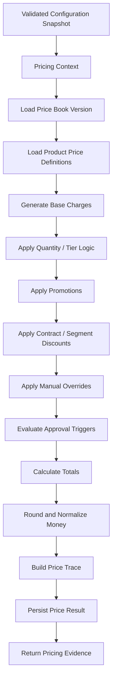
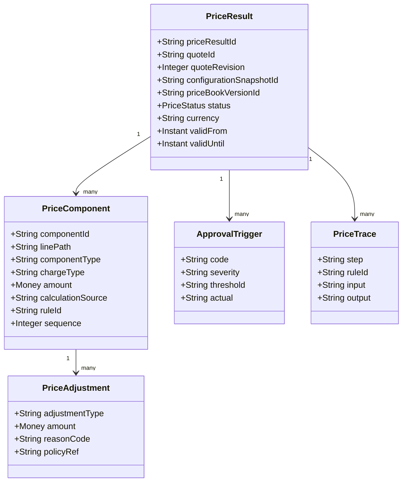
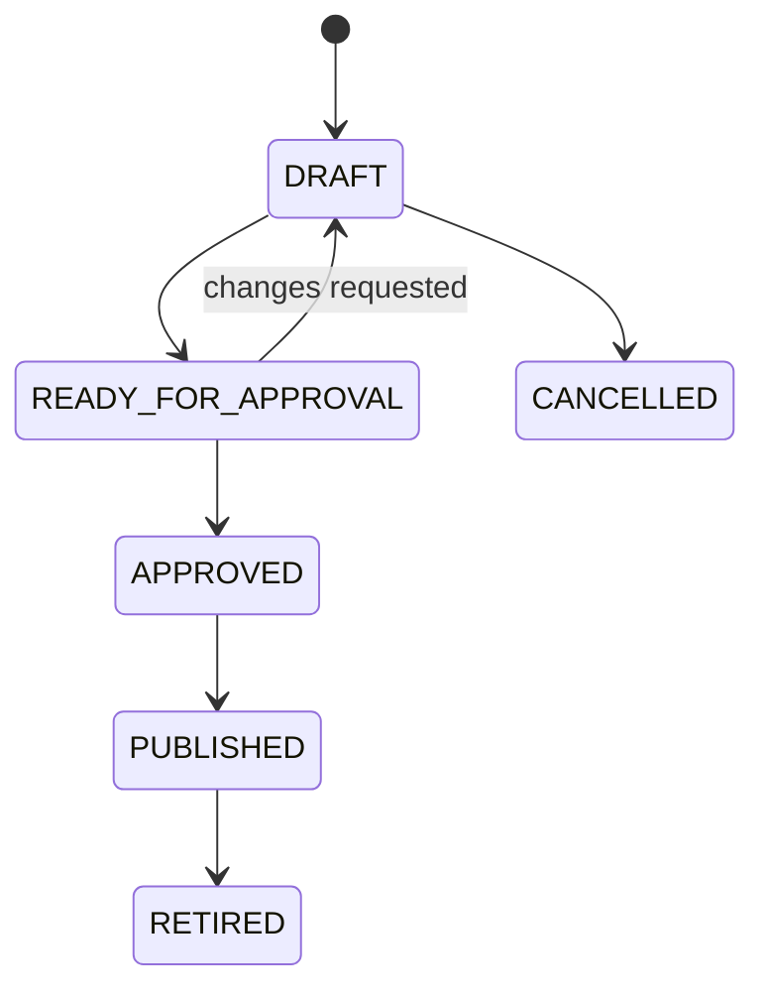
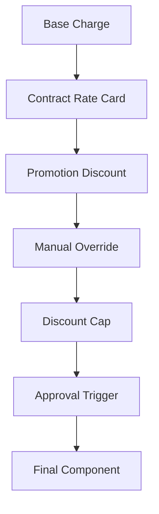
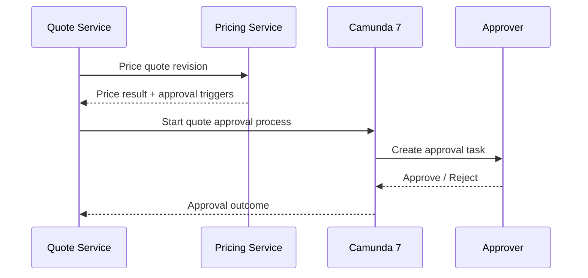
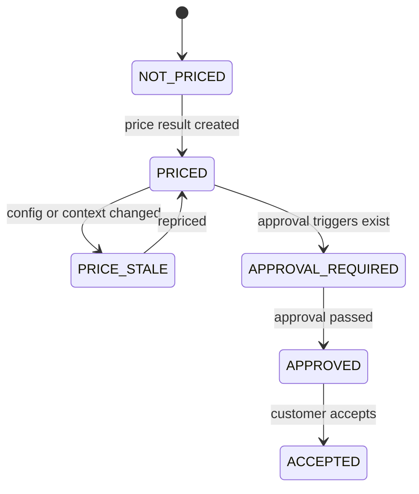
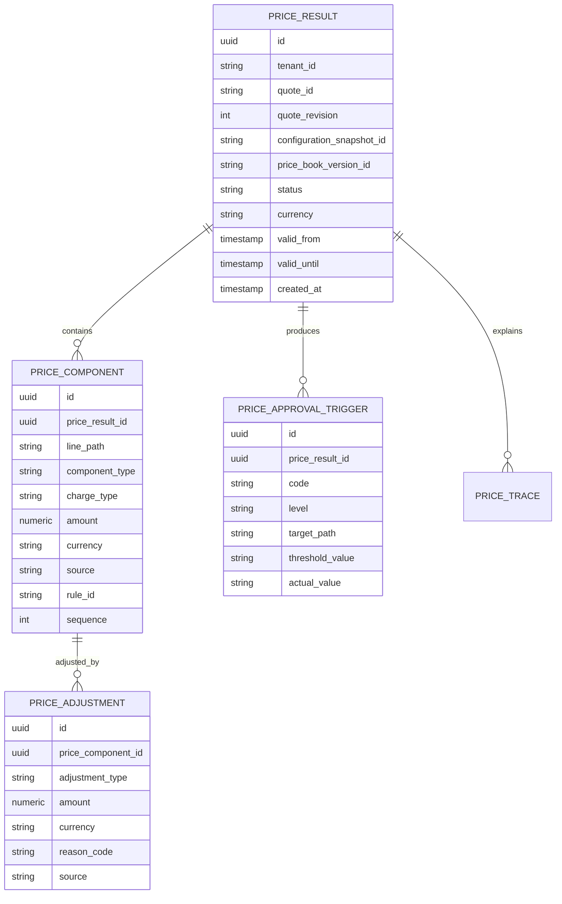

# Part 010 — Pricing Engine Design

A pricing engine does not merely calculate a number.

A pricing engine produces **commercial evidence**.

That evidence must explain:

- which product was priced,
- which configuration snapshot was used,
- which price book version was used,
- which charges were produced,
- which discounts were applied,
- which overrides were requested,
- which approval rules were triggered,
- how totals were rounded,
- why the result is reproducible,
- whether the price is valid for quote acceptance or order conversion.

A weak pricing implementation returns this:

```json
{
  "total": 1200000
}
```

A production-grade pricing engine returns a traceable price structure:

```json
{
  "priceResultId": "PRICE-20260702-00001",
  "status": "PRICED_WITH_APPROVAL_REQUIRED",
  "currency": "IDR",
  "totals": {
    "oneTimeTotal": { "amount": "500000", "currency": "IDR" },
    "recurringMonthlyTotal": { "amount": "1200000", "currency": "IDR" }
  },
  "components": [],
  "approvalTriggers": [],
  "trace": []
}
```

The second response is harder to build. It is also the only one that can survive enterprise CPQ.

---

## 1. Pricing Is a Pipeline, Not a Formula

In simple software, price is a formula.

```txt
price = basePrice - discount
```

In enterprise CPQ, pricing is a pipeline:



Each stage must be testable and explainable.

If a price changes, you need to know which stage changed it.

---

## 2. The Pricing Engine Is Not the Quote Service

The quote service owns quote lifecycle:

- draft,
- configured,
- priced,
- approval pending,
- approved,
- accepted,
- expired,
- cancelled,
- revised.

The pricing engine owns price calculation and price evidence.

It should not decide whether a quote can be accepted. It should return pricing result status and approval triggers. The quote service and approval workflow decide lifecycle progression.

Boundary rule:

> Pricing can say “this result requires approval because discount exceeds threshold.” Quote/workflow decides who approves it and whether the quote moves forward.

Do not let pricing become workflow.

Do not let workflow recalculate pricing secretly.

---

## 3. Pricing Inputs

The pricing engine must receive a stable configuration snapshot, not a live mutable configuration session.

Minimum input:

```json
{
  "tenantId": "telco-id",
  "quoteId": "QUOTE-10001",
  "quoteRevision": 3,
  "configurationSnapshotId": "CFG-SNAP-10001",
  "priceBookVersionId": "PB-2026-Q3-IDR",
  "effectiveAt": "2026-07-02T10:00:00+07:00",
  "channel": "SALES_PORTAL",
  "customerRef": {
    "customerId": "CUST-10001",
    "segment": "BUSINESS",
    "accountType": "CORPORATE"
  },
  "commercialContext": {
    "contractTermMonths": 24,
    "currency": "IDR",
    "salesRegion": "JAKARTA",
    "campaignCode": "BIZ-FIBER-Q3"
  },
  "manualOverrides": []
}
```

Do not price against “latest price book” unless the business explicitly allows volatile price previews.

For quote pricing, price book version must be explicit or resolved once and then recorded.

---

## 4. Pricing Outputs

A pricing output should contain:

- result ID,
- quote reference,
- configuration snapshot reference,
- price book version,
- status,
- totals,
- line-level price components,
- discount components,
- surcharge components,
- tax placeholders or tax integration references,
- manual overrides,
- approval triggers,
- explanation trace,
- validity window,
- reproducibility metadata.

Example:

```json
{
  "priceResultId": "PRICE-10001-R3",
  "quoteId": "QUOTE-10001",
  "quoteRevision": 3,
  "configurationSnapshotId": "CFG-SNAP-10001",
  "priceBookVersionId": "PB-2026-Q3-IDR",
  "status": "PRICED_WITH_APPROVAL_REQUIRED",
  "currency": "IDR",
  "validFrom": "2026-07-02T10:00:00+07:00",
  "validUntil": "2026-07-16T23:59:59+07:00",
  "totals": {
    "oneTimeTotal": { "amount": "500000", "currency": "IDR" },
    "recurringMonthlyTotal": { "amount": "1200000", "currency": "IDR" },
    "discountTotal": { "amount": "300000", "currency": "IDR" }
  },
  "approvalTriggers": [
    {
      "code": "DISCOUNT_EXCEEDS_SALES_AUTHORITY",
      "severity": "APPROVAL_REQUIRED",
      "threshold": "10%",
      "actual": "15%"
    }
  ]
}
```

The output is not just for UI display. It is used by approval, audit, document generation, order conversion, and customer dispute handling.

---

## 5. Core Pricing Concepts

| Concept | Meaning |
|---|---|
| Price Book | Published set of price definitions for a market, currency, tenant, channel, or period |
| Price Book Version | Immutable version of a price book used for reproducible pricing |
| Charge | Monetary amount associated with product/configuration item |
| Charge Type | One-time, recurring, usage, deposit, installation, cancellation, adjustment |
| Price Component | Atomic explainable unit of price calculation |
| Price Rule | Logic that generates or modifies price components |
| Discount | Negative adjustment subject to policy and approval |
| Surcharge | Positive adjustment based on condition |
| Override | Manual change to price or discount requested by authorized user |
| Approval Trigger | Condition that requires workflow approval |
| Price Trace | Explanation record showing how result was produced |
| Price Snapshot | Immutable price evidence attached to quote/order |

The most important object is the **price component**.

Do not store only totals.

Totals are derived evidence. Components are primary evidence.

---

## 6. Price Component Model

A price component is an atomic commercial fact.



Example components:

| Component | Charge Type | Amount |
|---|---|---:|
| Broadband 1Gbps base monthly charge | Recurring monthly | 1,500,000 IDR |
| Managed router monthly charge | Recurring monthly | 200,000 IDR |
| Installation fee | One-time | 500,000 IDR |
| Business campaign discount | Recurring monthly discount | -300,000 IDR |

A quote document may show a simplified summary. Internally, keep the full component tree.

---

## 7. Money Model

Never represent money with floating point.

Use a decimal representation with explicit currency.

In Java, this usually means `BigDecimal` plus a currency code.

```java
public record Money(BigDecimal amount, String currency) {
    public Money {
        Objects.requireNonNull(amount, "amount");
        Objects.requireNonNull(currency, "currency");
        if (currency.length() != 3) {
            throw new IllegalArgumentException("currency must be ISO-like 3-letter code");
        }
    }

    public Money add(Money other) {
        requireSameCurrency(other);
        return new Money(amount.add(other.amount), currency);
    }

    public Money subtract(Money other) {
        requireSameCurrency(other);
        return new Money(amount.subtract(other.amount), currency);
    }

    private void requireSameCurrency(Money other) {
        if (!currency.equals(other.currency)) {
            throw new IllegalArgumentException("currency mismatch");
        }
    }
}
```

Do not pass raw `BigDecimal` across your domain model without currency.

Do not assume all tenants use one currency forever.

Do not mix currencies in a single total unless you have an explicit FX conversion model and audit trail.

---

## 8. Charge Types

Enterprise CPQ pricing must distinguish charge types.

| Charge Type | Meaning | Example |
|---|---|---|
| `ONE_TIME` | Charged once | installation fee |
| `RECURRING_MONTHLY` | Charged every month | broadband subscription |
| `RECURRING_ANNUAL` | Charged every year | annual support plan |
| `USAGE` | Charged based on consumption | data overage |
| `DEPOSIT` | Refundable/non-refundable deposit | device deposit |
| `CANCELLATION` | Fee when terminating | early termination fee |
| `ADJUSTMENT` | Manual or system adjustment | goodwill credit |

Do not aggregate one-time and recurring charges into one number without preserving type.

A quote with:

```txt
500,000 one-time + 1,200,000 monthly
```

is not equivalent to:

```txt
1,700,000 total
```

The second form destroys commercial meaning.

---

## 9. Price Book Versioning

A price book is mutable in planning.

A price book version is immutable once published.



Quote pricing must reference a published version.

Recommended fields:

```sql
price_book (
    id,
    tenant_id,
    code,
    market,
    currency,
    status
)

price_book_version (
    id,
    price_book_id,
    version_label,
    status,
    effective_from,
    effective_to,
    published_at,
    published_by
)
```

A price definition belongs to a version:

```sql
product_price_definition (
    id,
    price_book_version_id,
    product_offering_id,
    charge_type,
    amount,
    currency,
    billing_period,
    effective_from,
    effective_to
)
```

Do not update published price definitions in place.

Create a new version.

---

## 10. Pricing Rule Types

Pricing rules should be categorized just like configuration rules.

### 10.1 Base Price Rules

Generate charges from selected offerings.

Example:

- `PO-BROADBAND-1G` produces recurring monthly charge 1,500,000 IDR.
- `PO-MANAGED-ROUTER` produces recurring monthly charge 200,000 IDR.
- `PO-INSTALLATION-TECHNICIAN` produces one-time charge 500,000 IDR.

### 10.2 Quantity Rules

Multiply or tier prices by quantity.

Example:

- Static IP block price = unit price × number of blocks.
- Device license has volume tier based on seat count.

### 10.3 Term Rules

Apply price behavior based on contract duration.

Example:

- 24-month term qualifies for 10% recurring discount.
- Month-to-month contract adds flexibility surcharge.

### 10.4 Promotion Rules

Apply campaign-specific discounts or bundles.

Example:

- `BIZ-FIBER-Q3` gives installation fee waiver.
- First three months discounted by 50%.

### 10.5 Segment Rules

Apply prices or discounts by customer segment.

Example:

- Enterprise customers get negotiated rate card.
- Public sector customers require special approval for some offers.

### 10.6 Override Rules

Apply manual changes requested by sales users.

Example:

- Sales requests additional 5% recurring discount.
- Manager waives installation fee.

### 10.7 Approval Trigger Rules

Detect pricing outcomes that require approval.

Example:

- Discount above 10% requires sales manager approval.
- Negative margin requires finance approval.
- Manual override on regulated product requires compliance approval.

Approval trigger rules should not approve. They trigger workflow.

---

## 11. Pricing Pipeline Design

Represent pricing as sequential stages.

```java
public interface PricingStage {
    PricingStageResult apply(PricingContext context, PriceWorkingSet workingSet);
}
```

Possible stages:

```java
List<PricingStage> stages = List.of(
    new LoadBaseChargesStage(),
    new QuantityExpansionStage(),
    new TermDiscountStage(),
    new PromotionStage(),
    new ManualOverrideStage(),
    new ApprovalTriggerStage(),
    new TotalsStage(),
    new RoundingStage(),
    new TraceStage()
);
```

Each stage receives a working set and produces either:

- new components,
- adjusted components,
- warnings,
- approval triggers,
- trace entries,
- fatal pricing errors.

The stage order is a business decision. Make it explicit.

If manual override applies before promotion, result may differ from promotion before manual override.

Do not hide ordering inside incidental code execution.

---

## 12. Price Calculation Source

Every component should know its source.

Examples:

| Source | Meaning |
|---|---|
| `PRICE_BOOK` | Direct price definition from price book |
| `PROMOTION` | Promotional rule applied |
| `CONTRACT_RATE_CARD` | Customer-specific contracted rate |
| `MANUAL_OVERRIDE` | User-entered override |
| `SYSTEM_ADJUSTMENT` | Automated adjustment |
| `TAX_ENGINE` | External/internal tax calculation |
| `MIGRATED_LEGACY_PRICE` | Price carried from legacy system |

This is critical for audit and approval.

A discount from a public promotion and a discount manually requested by a salesperson are not the same even if the amount is equal.

---

## 13. Discounts

Discounts need structure.

A discount has:

- discount type,
- amount or percentage,
- target component or line,
- validity window,
- source,
- reason,
- stackability rule,
- approval consequence,
- maximum allowed threshold,
- trace reference.

Example:

```json
{
  "discountId": "DISC-BIZ-Q3-001",
  "discountType": "PERCENTAGE",
  "percentage": "10.00",
  "target": "root.access",
  "chargeType": "RECURRING_MONTHLY",
  "source": "PROMOTION",
  "reasonCode": "BIZ_FIBER_Q3_CAMPAIGN",
  "stackable": false
}
```

Do not model discount only as negative amount. You will lose governance.

---

## 14. Discount Stacking

Discount stacking is where many CPQ systems become unpredictable.

You need rules like:

- public promotion cannot stack with contract discount,
- manual override stacks after promotion,
- maximum total discount is 20%,
- installation waiver cannot combine with activation credit,
- enterprise rate card overrides public price book.

Represent the stacking policy explicitly.



The ordering should be visible in trace.

Example trace:

```json
[
  { "step": "BASE_PRICE", "amount": "1500000" },
  { "step": "PROMOTION", "ruleId": "PROMO-Q3", "delta": "-150000" },
  { "step": "MANUAL_OVERRIDE", "delta": "-75000" },
  { "step": "DISCOUNT_CAP_CHECK", "decision": "PASSED" }
]
```

---

## 15. Manual Overrides

Manual override is not a direct edit to total.

It is a request to modify pricing under governance.

Override fields:

```json
{
  "overrideId": "OVR-001",
  "targetPath": "root.access",
  "chargeType": "RECURRING_MONTHLY",
  "overrideType": "DISCOUNT_PERCENTAGE",
  "value": "15.00",
  "reasonCode": "COMPETITIVE_MATCH",
  "comment": "Customer has competing offer from provider X.",
  "requestedBy": "sales.user@example.com"
}
```

Override evaluation should answer:

- Is the override shape valid?
- Is the requester allowed to request it?
- Is the requested value within self-approval authority?
- Does it require manager approval?
- Does it require finance approval?
- Does it violate hard floor/margin rules?
- Is the reason code mandatory?

Some override failures are blocking. Some produce approval triggers.

Do not conflate them.

---

## 16. Approval Triggers

Pricing produces approval triggers. It does not own approval process.

Example triggers:

```json
[
  {
    "code": "DISCOUNT_EXCEEDS_SELF_APPROVAL_LIMIT",
    "level": "SALES_MANAGER",
    "targetPath": "root.access",
    "threshold": "10%",
    "actual": "15%"
  },
  {
    "code": "INSTALLATION_FEE_WAIVED",
    "level": "SALES_OPS",
    "targetPath": "root.installation",
    "threshold": "0",
    "actual": "-500000 IDR"
  }
]
```

Quote service can use these triggers to start a Camunda 7 approval process.



Do not let Camunda recalculate discounts. It should use the price result evidence.

---

## 17. Rounding

Rounding is not a formatting detail.

It changes money.

Define rounding policy explicitly:

- currency scale,
- component-level rounding,
- line-level rounding,
- total-level rounding,
- tax rounding,
- percentage discount rounding,
- prorated charge rounding,
- display rounding vs ledger rounding.

Example policy:

```json
{
  "currency": "IDR",
  "amountScale": 0,
  "roundingMode": "HALF_UP",
  "roundAt": "COMPONENT_AND_TOTAL"
}
```

Be careful: different industries and jurisdictions may require different rules. The pricing engine should support explicit policy, not hidden default behavior.

---

## 18. Validity Window

A price is not timeless.

Price results should have a validity window:

- quote price valid until date,
- promotion expiry date,
- price book effective window,
- customer-specific rate validity,
- campaign deadline.

The validity window should be derived from the strictest relevant constraint.

Example:

```txt
Price book valid until: 2026-09-30
Promotion valid until: 2026-07-15
Customer rate valid until: 2026-12-31
Quote price validity: 14 days

Result valid until: 2026-07-15 or quote-created-at + 14 days, whichever is earlier
```

Do not allow accepted quotes to use expired price results unless business policy explicitly supports price locking.

---

## 19. Repricing Policy

Repricing must be intentional.

Scenarios:

| Scenario | Recommended Behavior |
|---|---|
| Draft quote changed | Reprice required |
| Configuration snapshot changed | Existing price result invalidated |
| Manual override added | Reprice required |
| Price book changed | Existing draft may need reprice depending policy |
| Submitted quote | Reprice only by returning to draft or creating revision |
| Approved quote | Reprice invalidates approval unless policy says otherwise |
| Accepted quote | No reprice; create amendment/change order |

Quote service should track pricing state:



Do not overwrite historical price results. Create a new result per quote revision or pricing attempt.

---

## 20. Price Result Persistence

A practical persistence model:



Store components relationally for query and reporting.

Store a complete price result JSON snapshot for audit and replay.

As with configuration, both forms serve different purposes.

---

## 21. JPA/EclipseLink Mapping Considerations

Money and price components need careful mapping.

Example embeddable:

```java
@Embeddable
public class MoneyEmbeddable {

    @Column(name = "amount", nullable = false, precision = 19, scale = 4)
    private BigDecimal amount;

    @Column(name = "currency", nullable = false, length = 3)
    private String currency;
}
```

Example component entity:

```java
@Entity
@Table(name = "price_component")
public class PriceComponentEntity {

    @Id
    private UUID id;

    @ManyToOne(fetch = FetchType.LAZY, optional = false)
    @JoinColumn(name = "price_result_id", nullable = false)
    private PriceResultEntity priceResult;

    @Column(name = "line_path", nullable = false)
    private String linePath;

    @Enumerated(EnumType.STRING)
    @Column(name = "charge_type", nullable = false)
    private ChargeType chargeType;

    @Embedded
    private MoneyEmbeddable money;

    @Column(name = "source", nullable = false)
    private String source;

    @Column(name = "rule_id")
    private String ruleId;
}
```

Guidelines:

1. Price results are append-only.
2. Do not update historical components.
3. Use explicit sequence numbers to preserve calculation order.
4. Do not lazy-load components accidentally in high-volume quote search.
5. Use projections/read models for summary screens.
6. Keep entity mapping separate from API DTOs.
7. Store exact snapshot JSON for audit.

---

## 22. API Design

Pricing APIs should be command-oriented.

### 22.1 Price Quote Revision

```http
POST /pricing/commands/price-quote-revision
```

Request:

```json
{
  "idempotencyKey": "e36be59a-0e57-4f68-99f5-33e71ecdd81a",
  "tenantId": "telco-id",
  "quoteId": "QUOTE-10001",
  "quoteRevision": 3,
  "configurationSnapshotId": "CFG-SNAP-10001",
  "priceBookVersionId": "PB-2026-Q3-IDR",
  "effectiveAt": "2026-07-02T10:00:00+07:00",
  "manualOverrides": []
}
```

Response:

```json
{
  "priceResultId": "PRICE-10001-R3-A1",
  "status": "PRICED",
  "currency": "IDR",
  "totals": {
    "oneTimeTotal": { "amount": "500000", "currency": "IDR" },
    "recurringMonthlyTotal": { "amount": "1200000", "currency": "IDR" }
  }
}
```

### 22.2 Preview Price

```http
POST /pricing/commands/preview-price
```

Preview pricing can be more volatile and cacheable, but must be clearly marked as preview.

Preview should not be used for accepted quote/order conversion.

### 22.3 Explain Price Result

```http
GET /pricing/price-results/{priceResultId}/explanation
```

Returns trace and component explanation.

Do not overload the quote summary endpoint with full trace unless requested.

---

## 23. Idempotency

Pricing commands may be retried.

A retry should not create multiple price results for the same logical attempt.

Use idempotency key scoped by:

- tenant,
- quote ID,
- quote revision,
- configuration snapshot ID,
- command type,
- idempotency key.

If the same key is retried with the same payload, return the same result.

If the same key is retried with different payload, return conflict.

This prevents duplicate price results from network retries or frontend double submission.

---

## 24. Redis Boundary

Good Redis uses in pricing:

- cache price book version metadata,
- cache compiled price rules,
- cache preview price results for short TTL,
- store idempotency key results,
- guard against cache stampede on hot price book load.

Dangerous Redis uses:

- storing official quote price only in Redis,
- using cached price after price book invalidation,
- caching price without customer/segment/channel/effective date,
- caching manual override results without user authority context,
- no TTL on preview results.

Key examples:

```txt
cpq:pricing:price-book:{tenantId}:{priceBookVersionId}
cpq:pricing:compiled-rules:{tenantId}:{priceBookVersionId}
cpq:pricing:preview:{tenantId}:{hashOfInput}
cpq:pricing:idempotency:{tenantId}:{quoteId}:{quoteRevision}:{idempotencyKey}
```

Official quote price evidence belongs in PostgreSQL.

Redis can accelerate. It cannot replace evidence.

---

## 25. Kafka Events

Pricing events should represent durable commercial milestones.

Potential events:

| Event | Meaning |
|---|---|
| `QuotePricingRequested` | Quote service requested pricing |
| `QuotePriced` | Price result created successfully |
| `QuotePricingFailed` | Pricing failed due to blocking issue |
| `QuotePriceBecameStale` | Quote change invalidated existing price |
| `PriceApprovalRequired` | Pricing produced approval triggers |
| `PriceBookPublished` | New price book version published |
| `PriceBookRetired` | Price book version no longer active |

Event payload example:

```json
{
  "eventType": "QuotePriced",
  "tenantId": "telco-id",
  "quoteId": "QUOTE-10001",
  "quoteRevision": 3,
  "priceResultId": "PRICE-10001-R3-A1",
  "configurationSnapshotId": "CFG-SNAP-10001",
  "priceBookVersionId": "PB-2026-Q3-IDR",
  "status": "PRICED_WITH_APPROVAL_REQUIRED",
  "occurredAt": "2026-07-02T10:00:02+07:00"
}
```

Do not put full component details in every integration event unless consumers genuinely need it. Use event references and query APIs for details.

---

## 26. Price Trace

A price trace is not a log line. It is structured evidence.

Example:

```json
{
  "traceId": "TRACE-001",
  "steps": [
    {
      "sequence": 10,
      "stage": "BASE_CHARGE",
      "targetPath": "root.access",
      "ruleId": "PRICE-BASE-BROADBAND-1G",
      "input": { "offeringId": "PO-BROADBAND-1G" },
      "output": { "amount": "1500000", "currency": "IDR" }
    },
    {
      "sequence": 20,
      "stage": "PROMOTION",
      "targetPath": "root.access",
      "ruleId": "PROMO-BIZ-FIBER-Q3",
      "input": { "segment": "BUSINESS", "contractTermMonths": 24 },
      "output": { "discount": "-300000", "currency": "IDR" }
    }
  ]
}
```

Trace must be:

- ordered,
- versioned,
- linked to rule IDs,
- linked to components,
- safe to expose at different detail levels,
- immutable once result is created.

---

## 27. Tax Boundary

Tax is often complex enough to be separate.

For this CPQ/OMS architecture, treat tax as one of three models:

| Model | Meaning |
|---|---|
| Placeholder | Quote shows tax-exclusive or estimated-tax pricing |
| Internal Tax Rule | Pricing engine calculates simple tax based on configured rules |
| External Tax Engine | Pricing calls dedicated tax service/system |

Do not hide tax calculation inside random price formula code.

If external tax is used, record:

- tax engine request reference,
- tax engine response reference,
- jurisdiction inputs,
- calculation timestamp,
- tax amount,
- whether tax is estimate or final.

Quote document must clearly distinguish estimated vs final tax if relevant.

---

## 28. Margin Boundary

Margin calculation may require cost data.

Cost data may be sensitive and may not belong in the main pricing result exposed to sales users.

Possible design:

- pricing engine calculates commercial price,
- margin service evaluates margin using cost model,
- pricing result records margin approval trigger but does not expose raw cost broadly,
- approval process exposes margin evidence only to authorized approvers.

Do not leak sensitive cost data through generic price explanation APIs.

---

## 29. Quote Document Boundary

The pricing engine does not generate quote PDFs.

It produces price evidence. Document service renders it.

Document service needs:

- display name,
- line hierarchy,
- charge type,
- amount,
- discount display policy,
- validity date,
- terms summary,
- tax/fee wording,
- approval status if relevant.

Do not let document templates recalculate totals.

Documents should render the approved price result.

---

## 30. Failure Modes

### 30.1 Price Drift

Symptoms:

- UI preview differs from final quote price,
- quote document total differs from backend total,
- accepted quote uses a price result different from approved result.

Mitigation:

- official price result ID,
- immutable price snapshots,
- document renders from price result,
- accepted quote references approved price result.

### 30.2 Untraceable Discounts

Symptoms:

- discounts appear as negative numbers without reason,
- approval cannot determine who requested override,
- audit cannot identify rule source.

Mitigation:

- structured discount model,
- reason codes,
- source fields,
- approval triggers,
- price trace.

### 30.3 Pricing Against Live Mutable Configuration

Symptoms:

- price changes while user edits quote,
- approvals apply to different config than final accepted quote,
- order conversion fails because priced line no longer exists.

Mitigation:

- price only immutable configuration snapshots,
- invalidate price when config changes,
- quote revisioning.

### 30.4 Hidden Rounding Differences

Symptoms:

- sum of line prices differs from displayed total,
- finance/billing rejects quote,
- customer dispute over cents/units.

Mitigation:

- explicit rounding policy,
- consistent Money type,
- trace rounding stages,
- document display uses same rounded values.

### 30.5 Promotion Chaos

Symptoms:

- expired promotions still apply,
- promotions stack unexpectedly,
- sales cannot explain price.

Mitigation:

- promotion versioning,
- stackability rules,
- effective dating,
- scenario tests,
- promotion impact analysis.

### 30.6 Approval Bypass

Symptoms:

- manual discount accepted without approval,
- quote accepted before pricing approval completed,
- workflow approval references stale price.

Mitigation:

- quote lifecycle guards,
- approval triggers from price result,
- approved price result ID locked on quote,
- reprice invalidates approval.

---

## 31. Testing Strategy

Pricing needs more than happy-path tests.

### 31.1 Component Generation Tests

Example:

```java
@Test
void broadbandPlanGeneratesMonthlyBaseCharge() {
    var snapshot = configurationWithOffering("PO-BROADBAND-1G");
    var result = pricingEngine.price(snapshot, contextWithPriceBook("PB-2026-Q3-IDR"));

    assertThat(result.components())
        .anyMatch(c -> c.chargeType() == RECURRING_MONTHLY
                    && c.money().amount().compareTo(new BigDecimal("1500000")) == 0);
}
```

### 31.2 Discount Tests

Test:

- promotion applies,
- promotion does not apply outside date,
- discount cap enforced,
- non-stackable promotions do not stack,
- manual override creates approval trigger.

### 31.3 Snapshot Replay Tests

Given:

- configuration snapshot,
- price book version,
- pricing context,
- pricing engine version,

rerun and compare expected result.

If published price evidence changes unexpectedly, audit reproducibility is broken.

### 31.4 Rounding Tests

Test rounding with edge values:

- percentage discount causing fractional amount,
- quantity × price with decimals,
- total of rounded lines vs rounded total,
- zero amount,
- negative adjustment,
- large amount.

### 31.5 Approval Trigger Tests

Test exact thresholds:

- discount = 10% should not require manager if threshold is `> 10%`,
- discount = 10.01% should require manager,
- installation waiver always requires sales ops,
- negative margin requires finance.

Boundary conditions are where approval bugs hide.

---

## 32. Production Readiness Checklist

A pricing engine is not production-ready until these are true:

- Price results are immutable.
- Price book versions are immutable after publication.
- Every total can be derived from components.
- Every discount has source and reason.
- Manual overrides are governed.
- Approval triggers are structured.
- Repricing policy is explicit.
- Price validity is explicit.
- Money uses decimal + currency, not floating point.
- Rounding policy is explicit and tested.
- Quote documents render from price result, not recalculated templates.
- Accepted quotes reference a final approved price result.
- Historical price decisions can be replayed or explained.
- Redis is only acceleration, not commercial evidence.
- Kafka events are lifecycle events, not noisy calculation internals.

---

## 33. Practical Implementation Sequence

Build pricing in this order:

1. Define Money type and charge type taxonomy.
2. Define price component model.
3. Define price result status model.
4. Define price book and price book version tables.
5. Implement base charge generation.
6. Implement totals by charge type.
7. Implement price trace.
8. Implement discount model.
9. Implement promotion and term discount stage.
10. Implement manual override model.
11. Implement approval trigger stage.
12. Implement rounding policy.
13. Implement immutable price result persistence.
14. Implement idempotent price command.
15. Publish `QuotePriced` event through outbox.
16. Wire quote lifecycle to price result ID.
17. Add replay tests.
18. Add quote document rendering contract.

Do not start with promotion UI.

Start with immutable price evidence.

---

## 34. Key Takeaways

A pricing engine is not a calculator. It is a commercial evidence generator.

It must produce a price that is:

- correct,
- explainable,
- reproducible,
- auditable,
- versioned,
- approval-aware,
- safe for document generation,
- safe for order conversion.

The hard part is not adding numbers.

The hard part is preserving meaning.

When your system can answer “why is this price what it is?” months after the quote was accepted, you are building enterprise CPQ, not a demo.

---

## References

- TM Forum, Quote Management API TMF648: standardized mechanism for placing customer quotes with necessary quote parameters.
- TM Forum, Product Catalog Management API TMF620: catalog lifecycle and consultation of catalog elements during ordering, campaign, and sales processes.
- TM Forum, Product Ordering Management API TMF622: product orders are based on product offerings defined in a catalog and include characteristics such as pricing, options, and market.
