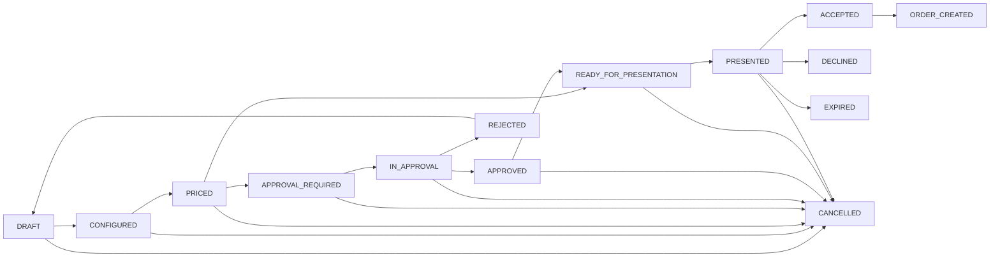
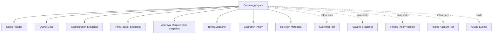
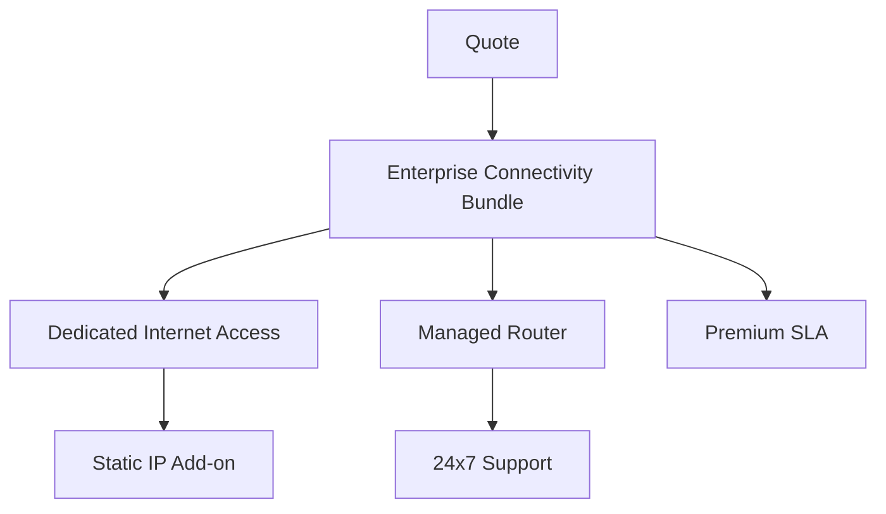
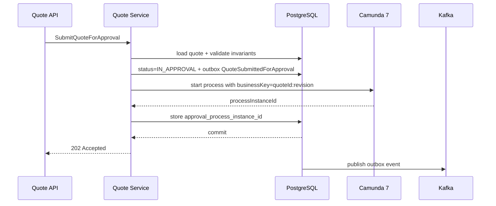

# Part 011 — Quote Domain and Lifecycle

Quote adalah pusat gravitasi CPQ. Bukan karena quote adalah layar paling sering dibuka, tetapi karena quote adalah tempat perusahaan mengubah **kemungkinan komersial** menjadi **janji komersial yang bisa diaudit**.

Di sistem kecil, quote sering diperlakukan seperti draft invoice: ada customer, ada item, ada harga, lalu tombol submit. Di sistem enterprise, model itu cepat runtuh. Quote bisa memiliki bundle bertingkat, konfigurasi kompleks, price trace, discount override, approval, expiration, revision, negotiation, document generation, legal clause, channel policy, dan state yang harus sinkron dengan workflow manusia maupun mesin.

Mental model yang lebih kuat:

> Quote adalah snapshot komersial yang menjawab: “untuk customer ini, pada waktu ini, dengan aturan katalog/pricing/policy versi ini, perusahaan bersedia menawarkan konfigurasi ini dengan harga dan syarat ini, selama kondisi quote masih valid.”

Kalimat itu penting. Quote bukan hanya data. Quote adalah **evidence**.

---

## 1. Apa yang Harus Dipecahkan Oleh Quote Domain

Quote domain harus menjawab beberapa pertanyaan keras:

1. Produk apa yang ditawarkan?
2. Konfigurasi apa yang dipilih?
3. Apakah konfigurasi valid?
4. Harga apa yang dihitung?
5. Mengapa harga itu muncul?
6. Siapa yang mengubah harga atau discount?
7. Apakah perubahan itu butuh approval?
8. Versi quote mana yang diterima customer?
9. Apakah quote masih valid?
10. Apakah quote bisa berubah setelah disetujui?
11. Apakah order yang dibuat berasal dari quote yang benar?
12. Bagaimana membuktikan isi quote enam bulan kemudian?

Kalau sistem tidak bisa menjawab pertanyaan-pertanyaan itu, quote belum enterprise-grade.

TM Forum Quote Management API memosisikan Quote sebagai bagian dari pre-ordering management, yaitu mekanisme standar untuk membuat customer quote beserta parameter quote yang diperlukan. Ini cocok dengan desain kita: quote berada sebelum order, tetapi harus cukup kaya untuk menjadi dasar order yang defensible.

---

## 2. Quote Bukan Cart, Bukan Order, Bukan Invoice

Salah satu sumber bug CPQ adalah mencampur quote dengan konsep lain.

| Konsep | Tujuan | Mutability | Risiko Jika Dicampur |
|---|---|---:|---|
| Cart | Menampung pilihan sementara user | Sangat mutable | Harga dan approval terlihat seolah final padahal belum |
| Quote | Janji komersial bersyarat | Mutable sampai locked/accepted | Audit dan approval rusak jika quote dianggap sekadar cart |
| Order | Permintaan fulfillment berdasarkan komitmen | Harus dikontrol ketat | Fulfillment bisa berubah karena negosiasi quote |
| Invoice | Klaim pembayaran | Hampir immutable | Billing kacau jika quote dianggap invoice |
| Contract | Komitmen legal jangka panjang | Immutable atau amend-only | Legal exposure jika quote langsung dianggap kontrak |

Quote berada di antara eksplorasi dan komitmen. Ia masih bisa dinegosiasikan, tetapi semua perubahan yang bermakna harus dapat ditelusuri.

---

## 3. Lifecycle Besar Quote

Lifecycle quote enterprise biasanya bukan sekadar `DRAFT -> APPROVED -> ACCEPTED`.

Minimum lifecycle yang layak:



Lifecycle ini belum wajib sama persis di semua perusahaan, tetapi memberi vocabulary yang lebih aman.

Hal yang perlu diperhatikan:

- `DRAFT` bukan berarti valid.
- `CONFIGURED` berarti struktur produk valid, belum tentu harga final.
- `PRICED` berarti pricing engine menghasilkan price result yang lengkap dan traceable.
- `APPROVAL_REQUIRED` berarti sistem mendeteksi policy breach atau override yang memerlukan human/manager decision.
- `IN_APPROVAL` berarti quote sedang dimiliki oleh workflow approval.
- `APPROVED` berarti quote boleh dipresentasikan, tetapi belum tentu sudah dipresentasikan.
- `PRESENTED` berarti customer sudah menerima offer formal.
- `ACCEPTED` berarti customer menerima quote tertentu, bukan quote number secara umum.
- `ORDER_CREATED` berarti quote telah menjadi basis order capture.

---

## 4. State Bukan Sekadar Status Field

Di database, status sering terlihat seperti satu kolom:

```sql
quote_status VARCHAR(40) NOT NULL
```

Tapi secara domain, state adalah kombinasi dari:

- status utama,
- version/revision,
- lock state,
- approval state,
- pricing freshness,
- expiration,
- document state,
- customer acceptance state,
- order conversion state.

Contoh quote yang tampak `APPROVED` bisa sebenarnya tidak boleh dipakai jika:

- quote sudah expired,
- catalog snapshot corrupt,
- price result invalidated oleh manual change,
- document yang dipresentasikan bukan revision yang disetujui,
- approval sudah dibatalkan karena quote direvisi,
- customer acceptance mengarah ke revision lama,
- quote sudah converted ke order dan tidak boleh converted ulang.

Jadi status tunggal hanya ringkasan. Sistem harus punya invariant yang lebih kaya.

---

## 5. Quote Aggregate Boundary

Quote aggregate harus melindungi konsistensi internal quote. Ia tidak harus memuat seluruh dunia.

Boundary yang masuk akal:



Quote aggregate tidak boleh melakukan query langsung ke pricing engine setiap kali dibaca. Quote harus menyimpan price result snapshot yang bisa diaudit.

Quote aggregate juga tidak boleh menyimpan seluruh customer profile sebagai data mutable. Ia cukup menyimpan reference dan beberapa snapshot komersial yang relevan, misalnya customer segment saat quote dihitung.

---

## 6. Quote Header

Quote header menyimpan identitas dan metadata utama.

Contoh field:

| Field | Fungsi |
|---|---|
| `quote_id` | ID teknis immutable |
| `quote_number` | Nomor bisnis yang terlihat user/customer |
| `revision` | Nomor revisi quote |
| `status` | Ringkasan lifecycle |
| `customer_id` | Customer target |
| `account_id` | Account atau billing context |
| `sales_channel` | Channel yang membuat quote |
| `currency` | Currency quote |
| `valid_from` | Awal validitas offer |
| `valid_until` | Akhir validitas offer |
| `created_by` | Pembuat quote |
| `owner_user_id` | Sales/agent owner |
| `tenant_id` | Tenant/enterprise segment |
| `version` | Optimistic lock version |
| `created_at` | Waktu dibuat |
| `updated_at` | Waktu terakhir berubah |

`quote_id` dan `quote_number` jangan disamakan.

- `quote_id` adalah identifier sistem.
- `quote_number` adalah identifier bisnis.
- `revision` menentukan versi komersial.

Dalam enterprise, customer biasanya menerima `quote_number + revision` atau dokumen quote yang merepresentasikan revision tertentu.

---

## 7. Quote Line Tree

Quote line bukan list datar. Di CPQ enterprise, quote line biasanya membentuk tree.

Contoh:



Line tree penting karena:

- bundle parent menentukan child yang wajib/opsional,
- discount bisa berlaku di parent atau child,
- tax/charge bisa dihitung per line,
- order decomposition bisa berasal dari subtree,
- cancellation/change order harus tahu dependency line.

Field penting quote line:

| Field | Fungsi |
|---|---|
| `quote_line_id` | ID line |
| `parent_line_id` | Relasi tree |
| `line_number` | Urutan human-readable |
| `product_offering_id` | Offering yang dipilih |
| `product_spec_id` | Spec underlying |
| `catalog_version` | Versi catalog saat dipilih |
| `action` | ADD / MODIFY / DELETE / NO_CHANGE untuk change quote |
| `quantity` | Jumlah |
| `configuration_status` | Valid/invalid/partial |
| `pricing_status` | Fresh/stale/not_priced |
| `fulfillment_hint` | Hints untuk order decomposition |

Line harus cukup kaya untuk dikonversi ke order, tetapi tidak boleh menjadi copy seluruh product catalog.

---

## 8. Snapshot Principle

Quote harus menyimpan snapshot dari hal-hal yang dibutuhkan untuk membuktikan offer.

Snapshot bukan sekadar cache. Snapshot adalah bukti.

Yang biasanya perlu disnapshot:

1. Selected product offering.
2. Selected product characteristics.
3. Selected options.
4. Configuration result.
5. Price components.
6. Applied discount/promotion.
7. Manual override reason.
8. Approval policy evaluation result.
9. Validity window.
10. Terms and commercial conditions.
11. Document template version.
12. Generated document hash.

Yang tidak perlu disnapshot penuh:

- seluruh customer master,
- seluruh product catalog,
- seluruh price book,
- seluruh user profile,
- seluruh approval organization tree.

Ambil bagian yang relevan untuk pembuktian quote.

---

## 9. Quote Revisioning

Quote revisioning adalah salah satu fitur yang sering diremehkan.

Quote bisa berubah karena:

- customer minta opsi baru,
- sales mengubah quantity,
- pricing berubah,
- discount override ditolak,
- validity diperpanjang,
- legal term berubah,
- customer segment berubah,
- catalog offering tidak lagi tersedia,
- approval expired,
- dokumen perlu diperbaiki.

Ada dua pola revisi:

### 9.1 Mutable Draft, Immutable Presented Revision

Selama quote belum dipresentasikan, quote bisa berubah di revision yang sama. Setelah dipresentasikan, perubahan signifikan membuat revision baru.

Cocok untuk organisasi yang ingin mengurangi jumlah revision internal.

### 9.2 Immutable Every Meaningful Commercial Change

Setiap perubahan konfigurasi, price, discount, atau term membuat revision baru.

Cocok untuk domain yang audit/regulasi tinggi.

Rekomendasi untuk seri ini:

> Draft boleh mutable secara controlled, tetapi setiap transition melewati boundary formal seperti `PRICED`, `APPROVED`, `PRESENTED`, atau `ACCEPTED` harus menghasilkan record yang bisa direkonstruksi.

---

## 10. Revision Identity

Jangan hanya menyimpan:

```text
QUOTE-2026-000123
```

Simpan:

```text
quote_id      = UUID teknis
quote_number  = Q-2026-000123
revision      = 3
quote_version = Q-2026-000123-R3
```

Lalu event, approval, document, dan order conversion harus mengarah ke `quote_id + revision`, bukan hanya `quote_id`.

Kesalahan umum:

```text
Order references quote_id only.
```

Akibatnya saat quote direvisi setelah order dibuat, order terlihat berasal dari quote versi baru. Ini fatal secara audit.

Yang benar:

```text
Order references accepted_quote_id + accepted_quote_revision + accepted_price_result_id + accepted_document_id.
```

---

## 11. Quote Command Model

Quote domain sebaiknya diekspos sebagai command, bukan generic update.

Contoh command:

```text
CreateQuote
AddQuoteLine
RemoveQuoteLine
ConfigureQuoteLine
ValidateQuoteConfiguration
PriceQuote
ApplyManualDiscount
SubmitQuoteForApproval
ApproveQuote
RejectQuote
GenerateQuoteDocument
PresentQuote
AcceptQuote
DeclineQuote
ExpireQuote
CancelQuote
ConvertQuoteToOrder
```

Kenapa bukan `PATCH /quotes/{id}`?

Karena lifecycle quote punya invariant. Generic patch membuat user bisa mengubah field tanpa melewati rule domain.

Contoh command endpoint:

```http
POST /quotes/{quoteId}/commands/price
POST /quotes/{quoteId}/commands/submit-for-approval
POST /quotes/{quoteId}/commands/present
POST /quotes/{quoteId}/commands/accept
```

Atau lebih REST-ish dengan action resource:

```http
POST /quotes/{quoteId}/pricing-runs
POST /quotes/{quoteId}/approval-submissions
POST /quotes/{quoteId}/presentations
POST /quotes/{quoteId}/acceptances
```

Pilih salah satu style, tetapi jangan membiarkan lifecycle dikendalikan oleh update field bebas.

---

## 12. Quote Invariants

Invariant adalah hukum domain yang tidak boleh dilanggar.

Contoh invariant quote:

1. Quote tidak bisa dipresentasikan jika belum priced.
2. Quote tidak bisa dipresentasikan jika approval required tetapi belum approved.
3. Quote tidak bisa accepted jika expired.
4. Quote tidak bisa accepted jika revision yang diterima bukan revision terbaru yang presented.
5. Quote tidak bisa converted ke order lebih dari sekali, kecuali domain mengizinkan split order dengan aturan eksplisit.
6. Price result harus mengacu ke configuration snapshot yang sama.
7. Approval decision harus mengacu ke price result yang sama.
8. Manual discount harus memiliki reason code dan actor.
9. Quote line child tidak boleh hidup tanpa parent active.
10. Accepted quote harus immutable untuk field komersial.

Invariant ini harus berada di domain/application service, bukan hanya UI.

---

## 13. Pricing Freshness

Pricing freshness adalah status apakah price result masih valid terhadap quote configuration saat ini.

State sederhana:

```text
NOT_PRICED
FRESH
STALE
FAILED
```

Perubahan berikut membuat price menjadi stale:

- add/remove line,
- change quantity,
- change selected option,
- change contract term,
- change customer segment,
- change currency,
- apply/remove manual discount,
- catalog version forced update,
- pricing policy version forced update.

Jika quote `STALE`, sistem tidak boleh:

- submit approval,
- generate final document,
- present quote,
- accept quote,
- convert order.

Stale pricing sering menjadi bug mahal karena sales melihat total lama setelah konfigurasi berubah.

---

## 14. Approval Freshness

Approval juga bisa stale.

Approval menjadi stale jika:

- price berubah,
- discount berubah,
- line berubah,
- approval policy berubah secara material,
- quote validity diperpanjang,
- document terms berubah,
- approver yang memberi approval kehilangan authority sebelum finalization, jika policy perusahaan mengatur demikian.

Quote yang sudah approved tidak otomatis tetap approved setelah perubahan komersial.

Prinsip:

> Approval menyetujui snapshot tertentu, bukan quote object yang terus berubah.

---

## 15. Document Freshness

Document generated harus mengacu pada revision dan price result tertentu.

Minimal simpan:

| Field | Fungsi |
|---|---|
| `document_id` | ID dokumen |
| `quote_id` | Quote |
| `quote_revision` | Revision |
| `template_version` | Template dokumen |
| `generated_at` | Waktu generate |
| `generated_by` | Actor/system |
| `content_hash` | Hash binary/content |
| `storage_uri` | Lokasi object storage |
| `status` | GENERATED / SENT / VOIDED |

Quote tidak boleh accepted berdasarkan dokumen yang sudah stale.

---

## 16. Expiration Model

Quote expiration bukan cron sederhana.

Ada beberapa jenis expiration:

1. Commercial validity expiration.
2. Approval expiration.
3. Price commitment expiration.
4. Customer response deadline.
5. Inventory reservation expiration.
6. Document/legal term expiration.

Di sistem sederhana, semuanya disatukan di `valid_until`. Di enterprise, minimal bedakan:

```text
quote.valid_until
price_result.valid_until
approval.valid_until
reservation.valid_until
presentation.response_due_at
```

Ketika quote expired, sistem perlu memutuskan:

- apakah quote bisa diperpanjang?
- apakah harus reprice?
- apakah approval harus ulang?
- apakah document lama harus void?
- apakah customer acceptance terlambat bisa diterima manual?

---

## 17. Quote Locking

Quote perlu lock pada fase tertentu.

Jenis lock:

| Lock | Fungsi |
|---|---|
| Edit lock | Mencegah concurrent edit |
| Approval lock | Mencegah perubahan selama approval |
| Presentation lock | Mencegah perubahan setelah document dikirim |
| Acceptance lock | Mencegah perubahan setelah customer accept |
| Conversion lock | Mencegah double conversion ke order |

Lock bisa hard atau soft.

Hard lock berarti command ditolak.

Soft lock berarti command memerlukan explicit revision baru.

Contoh:

- Quote `IN_APPROVAL`: discount tidak boleh diubah langsung. Harus withdraw approval lalu revise.
- Quote `PRESENTED`: konfigurasi tidak boleh diubah di revision yang sama. Harus create revision baru.
- Quote `ACCEPTED`: field komersial immutable. Hanya metadata non-komersial yang boleh berubah.

---

## 18. Optimistic Concurrency

Quote adalah objek yang sering diedit oleh beberapa user/process.

Gunakan optimistic locking:

```java
@Entity
@Table(name = "quote")
public class QuoteEntity {
  @Id
  @Column(name = "quote_id")
  private UUID id;

  @Version
  @Column(name = "entity_version")
  private long version;

  @Column(name = "status", nullable = false)
  private String status;
}
```

API command harus membawa expected version:

```json
{
  "expectedVersion": 17,
  "discount": {
    "type": "PERCENTAGE",
    "value": 12.5,
    "reasonCode": "STRATEGIC_ACCOUNT"
  }
}
```

Jika versi tidak cocok, return conflict:

```json
{
  "type": "https://errors.example.com/concurrency-conflict",
  "title": "Quote was modified by another actor",
  "status": 409,
  "detail": "Expected version 17 but current version is 18.",
  "quoteId": "...",
  "currentVersion": 18
}
```

Tanpa optimistic lock, approval dan pricing mudah memakai data lama.

---

## 19. Idempotency Untuk Command Penting

Beberapa command quote harus idempotent:

- create quote,
- price quote,
- submit approval,
- generate document,
- present quote,
- accept quote,
- convert to order.

Gunakan idempotency key:

```http
Idempotency-Key: 7c3d2e1a-quote-acceptance-20260702
```

Simpan hasil command berdasarkan:

```text
tenant_id + actor_id/client_id + endpoint/command_type + idempotency_key
```

Idempotency bukan hanya mencegah duplicate insert. Ia harus mengembalikan hasil yang sama untuk retry yang sama.

---

## 20. Quote Events

Quote domain harus menerbitkan event yang stabil.

Contoh domain event:

```text
QuoteCreated
QuoteLineAdded
QuoteConfigurationChanged
QuoteConfigurationValidated
QuotePriced
QuotePricingFailed
QuoteApprovalRequired
QuoteSubmittedForApproval
QuoteApproved
QuoteRejected
QuoteDocumentGenerated
QuotePresented
QuoteAccepted
QuoteDeclined
QuoteExpired
QuoteCancelled
QuoteConvertedToOrder
```

Event harus menyertakan revision.

Contoh envelope:

```json
{
  "eventId": "01J...",
  "eventType": "QuotePriced",
  "eventVersion": "1.0",
  "occurredAt": "2026-07-02T10:15:30Z",
  "tenantId": "enterprise-a",
  "aggregateType": "Quote",
  "aggregateId": "8a84...",
  "aggregateVersion": 18,
  "businessKey": "Q-2026-000123-R3",
  "correlationId": "...",
  "causationId": "...",
  "payload": {
    "quoteId": "8a84...",
    "quoteNumber": "Q-2026-000123",
    "revision": 3,
    "priceResultId": "5f01...",
    "totalAmount": "1250000.00",
    "currency": "IDR",
    "approvalRequired": true
  }
}
```

---

## 21. JPA Persistence Shape

Quote table shape awal:

```sql
CREATE TABLE quote (
  quote_id UUID PRIMARY KEY,
  tenant_id VARCHAR(80) NOT NULL,
  quote_number VARCHAR(80) NOT NULL,
  revision INTEGER NOT NULL,
  status VARCHAR(40) NOT NULL,
  customer_id VARCHAR(80) NOT NULL,
  account_id VARCHAR(80),
  sales_channel VARCHAR(40) NOT NULL,
  currency CHAR(3) NOT NULL,
  valid_from TIMESTAMPTZ,
  valid_until TIMESTAMPTZ,
  pricing_status VARCHAR(40) NOT NULL,
  approval_status VARCHAR(40) NOT NULL,
  document_status VARCHAR(40) NOT NULL,
  accepted_at TIMESTAMPTZ,
  converted_order_id UUID,
  created_by VARCHAR(120) NOT NULL,
  owner_user_id VARCHAR(120),
  entity_version BIGINT NOT NULL,
  created_at TIMESTAMPTZ NOT NULL,
  updated_at TIMESTAMPTZ NOT NULL,
  UNIQUE (tenant_id, quote_number, revision)
);
```

Quote line:

```sql
CREATE TABLE quote_line (
  quote_line_id UUID PRIMARY KEY,
  quote_id UUID NOT NULL REFERENCES quote(quote_id),
  parent_quote_line_id UUID REFERENCES quote_line(quote_line_id),
  line_number VARCHAR(40) NOT NULL,
  action VARCHAR(20) NOT NULL,
  product_offering_id VARCHAR(120) NOT NULL,
  product_spec_id VARCHAR(120),
  catalog_version VARCHAR(80) NOT NULL,
  quantity NUMERIC(18, 6) NOT NULL,
  configuration_status VARCHAR(40) NOT NULL,
  pricing_status VARCHAR(40) NOT NULL,
  selected_characteristics JSONB NOT NULL,
  configuration_snapshot JSONB,
  sort_order INTEGER NOT NULL,
  created_at TIMESTAMPTZ NOT NULL,
  updated_at TIMESTAMPTZ NOT NULL
);
```

Price result snapshot:

```sql
CREATE TABLE quote_price_result (
  price_result_id UUID PRIMARY KEY,
  quote_id UUID NOT NULL REFERENCES quote(quote_id),
  quote_revision INTEGER NOT NULL,
  configuration_hash VARCHAR(128) NOT NULL,
  pricing_policy_version VARCHAR(80) NOT NULL,
  currency CHAR(3) NOT NULL,
  subtotal_amount NUMERIC(19, 4) NOT NULL,
  discount_amount NUMERIC(19, 4) NOT NULL,
  tax_estimate_amount NUMERIC(19, 4),
  total_amount NUMERIC(19, 4) NOT NULL,
  price_trace JSONB NOT NULL,
  valid_until TIMESTAMPTZ,
  created_at TIMESTAMPTZ NOT NULL
);
```

Kenapa ada JSONB? Karena snapshot dan trace sering punya bentuk polymorphic. Tapi field yang sering dicari/filter tetap harus jadi kolom normal.

---

## 22. EclipseLink Mapping Notes

Quote aggregate dengan line tree bisa dimapping sebagai `@OneToMany`, tetapi hati-hati dengan fetch explosion.

Pola aman:

- Load header untuk list/search.
- Load aggregate penuh hanya untuk command.
- Pisahkan read model untuk UI detail jika perlu.
- Gunakan optimistic lock di root.
- Jangan expose entity sebagai DTO.
- Jangan biarkan lazy loading terjadi di serialization JAX-RS.

Contoh root entity:

```java
@Entity
@Table(name = "quote")
public class QuoteEntity {
  @Id
  @Column(name = "quote_id")
  private UUID id;

  @Version
  @Column(name = "entity_version")
  private long version;

  @OneToMany(mappedBy = "quote", cascade = CascadeType.ALL, orphanRemoval = true)
  private List<QuoteLineEntity> lines = new ArrayList<>();

  public void submitForApproval(Actor actor, Clock clock) {
    ensurePriced();
    ensureApprovalRequired();
    ensureNotExpired(clock);
    ensureNoStaleDocumentDependency();
    this.status = QuoteStatus.IN_APPROVAL;
    this.approvalStatus = ApprovalStatus.PENDING;
  }
}
```

Catatan: contoh ini bukan final implementation. Part persistence dan mapping akan lebih detail di part EclipseLink/JPA.

---

## 23. Service Layer Shape

Quote service jangan menjadi fat service yang memanggil semua hal secara acak.

Pisahkan application service berdasarkan command family:

```text
QuoteCreationService
QuoteConfigurationCommandService
QuotePricingCommandService
QuoteApprovalCommandService
QuotePresentationCommandService
QuoteAcceptanceCommandService
QuoteConversionService
QuoteQueryService
```

Application service bertugas:

1. authorization check,
2. load aggregate,
3. validate expected version,
4. call domain method,
5. persist change,
6. append outbox event,
7. return command result.

Bukan tempat menaruh semua business rule.

---

## 24. Workflow Boundary Dengan Camunda 7

Quote approval bisa diorkestrasi Camunda 7.

Tapi quote lifecycle tidak boleh sepenuhnya tinggal di BPMN.

Rule:

- Quote aggregate adalah source of truth status quote.
- Camunda process adalah source of truth orchestration approval.
- Keduanya dikorelasikan oleh business key.

Camunda 7 mendukung business key untuk mengasosiasikan process instance dengan identifier bisnis yang bermakna, misalnya order id pada proses order. Untuk quote approval, business key yang baik adalah `quoteNumber-revision` atau `quoteId:revision`.

Diagram boundary:



Ada dua opsi transaksi:

1. DB commit dulu, lalu start Camunda via outbox/async worker.
2. Start Camunda dalam command flow setelah DB update.

Untuk robustness, opsi pertama sering lebih aman: command menulis intent, lalu worker memulai process. Jika Camunda down, retry bisa dilakukan tanpa kehilangan status domain.

---

## 25. Quote Approval as Snapshot

Approval request harus membawa snapshot.

Approval task tidak boleh query quote terbaru tanpa memastikan revision cocok.

Approval payload minimal:

```json
{
  "quoteId": "...",
  "quoteNumber": "Q-2026-000123",
  "revision": 3,
  "priceResultId": "...",
  "totalAmount": "1250000.00",
  "currency": "IDR",
  "discountSummary": {
    "manualDiscountAmount": "100000.00",
    "manualDiscountPercent": "8.0"
  },
  "approvalReasons": [
    "DISCOUNT_EXCEEDS_SALES_LIMIT",
    "MARGIN_BELOW_THRESHOLD"
  ]
}
```

Ketika approver menekan approve, command harus memastikan:

- quote masih revision yang sama,
- price result masih sama,
- approval process instance masih aktif,
- approver punya authority,
- quote belum expired,
- quote belum withdrawn/revised.

---

## 26. Quote Acceptance

Acceptance adalah domain moment yang sangat penting.

Acceptance bisa datang dari:

- customer portal,
- sales agent atas nama customer,
- e-signature system,
- email confirmation manual,
- CRM integration,
- API partner.

Jangan hanya set status `ACCEPTED`.

Acceptance record perlu menyimpan:

| Field | Fungsi |
|---|---|
| `acceptance_id` | ID acceptance |
| `quote_id` | Quote |
| `quote_revision` | Revision yang diterima |
| `accepted_by` | Customer/user/system actor |
| `accepted_at` | Waktu acceptance |
| `acceptance_channel` | Portal/API/email/manual |
| `evidence_type` | Signature/click/email/reference |
| `evidence_ref` | Ref ke dokumen/e-signature/email |
| `accepted_document_id` | Dokumen yang diterima |
| `price_result_id` | Price result yang diterima |

Acceptance harus immutable.

---

## 27. Convert Quote to Order

Convert quote to order bukan copy-paste line.

Ia adalah transformasi dari commercial intent menjadi fulfillment intent.

Validasi sebelum conversion:

1. Quote accepted.
2. Quote not expired pada waktu acceptance atau conversion sesuai policy.
3. Quote revision yang accepted masih sama.
4. Price result accepted tersedia.
5. Document accepted tersedia jika wajib.
6. Order belum pernah dibuat untuk acceptance ini.
7. Customer/account masih eligible untuk order capture.
8. Inventory/reservation policy terpenuhi jika berlaku.
9. Required billing/contract data lengkap.
10. Idempotency key valid.

Output conversion:

```text
OrderCreatedFromQuote
```

Dengan payload:

```json
{
  "orderId": "...",
  "quoteId": "...",
  "quoteNumber": "Q-2026-000123",
  "quoteRevision": 3,
  "acceptanceId": "...",
  "priceResultId": "...",
  "convertedAt": "2026-07-02T10:15:30Z"
}
```

---

## 28. Failure Modeling

Quote lifecycle harus punya jawaban untuk failure.

| Failure | Expected Handling |
|---|---|
| Pricing engine timeout | Quote tetap, pricing status FAILED/STALE, user bisa retry |
| Approval process start gagal | Quote masuk pending workflow start atau revert ke approval required dengan incident |
| Approval callback duplicate | Idempotent approve/reject |
| Document generation gagal | Document status FAILED, quote tidak bisa presented |
| Customer accept expired quote | Reject atau manual exception flow |
| Convert to order timeout | Use idempotency and check existing order by acceptance id |
| Kafka publish gagal | Outbox retry, domain commit tetap aman |
| Concurrent quote edit | 409 conflict dengan current version |
| Approval after quote revision | Reject as stale approval |
| Price changed after approval | Mark approval stale dan require reapproval |

Enterprise-grade bukan berarti tidak gagal. Enterprise-grade berarti failure tidak membuat data komersial ambigu.

---

## 29. Anti-Patterns

### 29.1 Quote as CRUD Entity

Jika semua dilakukan lewat `PATCH /quote`, domain lifecycle akan bocor.

### 29.2 Quote Stores Only Current Total

Tanpa price trace, total tidak bisa dijelaskan.

### 29.3 Approval Approves Quote ID Only

Approval harus mengacu ke revision dan price result.

### 29.4 Order References Quote ID Only

Order harus mengacu ke accepted revision.

### 29.5 Quote Document Regenerated In Place

Dokumen formal harus immutable. Jika salah, void dan generate dokumen baru.

### 29.6 Workflow Owns All Domain State

Camunda mengorkestrasi, tetapi quote aggregate tetap penjaga invariant.

### 29.7 Catalog Always Live

Quote tidak boleh berubah makna hanya karena catalog live berubah.

---

## 30. Minimal API Surface

Contoh API surface quote service:

```http
POST   /quotes
GET    /quotes/{quoteId}
GET    /quotes?customerId=&status=&createdFrom=&createdTo=
POST   /quotes/{quoteId}/lines
DELETE /quotes/{quoteId}/lines/{lineId}
POST   /quotes/{quoteId}/configuration-validations
POST   /quotes/{quoteId}/pricing-runs
POST   /quotes/{quoteId}/discount-overrides
POST   /quotes/{quoteId}/approval-submissions
POST   /quotes/{quoteId}/documents
POST   /quotes/{quoteId}/presentations
POST   /quotes/{quoteId}/acceptances
POST   /quotes/{quoteId}/declines
POST   /quotes/{quoteId}/cancellations
POST   /quotes/{quoteId}/order-conversions
```

Query endpoint boleh banyak, command endpoint harus eksplisit.

---

## 31. Read Model Untuk UI

UI CPQ butuh data yang berbeda dari aggregate command.

Read model quote detail bisa berisi:

- header,
- line tree,
- configuration messages,
- price summary,
- price breakdown,
- approval requirement,
- active approval task,
- document status,
- next allowed actions,
- warnings,
- audit summary.

`nextAllowedActions` sangat berguna:

```json
{
  "quoteId": "...",
  "status": "PRICED",
  "nextAllowedActions": [
    "SUBMIT_FOR_APPROVAL",
    "REPRICE",
    "CANCEL"
  ],
  "blockedActions": [
    {
      "action": "PRESENT",
      "reason": "APPROVAL_REQUIRED"
    }
  ]
}
```

Jangan memaksa frontend menebak lifecycle.

---

## 32. Audit Model

Quote audit harus mencatat:

- command type,
- actor,
- before/after summary,
- reason code,
- correlation id,
- request id,
- source channel,
- affected revision,
- event id,
- process instance id jika terkait workflow.

Audit bukan log string.

Audit adalah data terstruktur.

Contoh:

```json
{
  "auditType": "QUOTE_DISCOUNT_OVERRIDDEN",
  "quoteId": "...",
  "revision": 3,
  "actor": "sales-123",
  "reasonCode": "STRATEGIC_ACCOUNT",
  "before": { "manualDiscountPercent": "5.0" },
  "after": { "manualDiscountPercent": "8.0" },
  "correlationId": "...",
  "occurredAt": "2026-07-02T10:15:30Z"
}
```

---

## 33. Practical Build Sequence

Untuk membangun quote domain dari scratch, jangan mulai dari semua fitur.

Urutan efektif:

1. Create quote header.
2. Add/remove quote line.
3. Store line tree.
4. Attach configuration snapshot.
5. Run pricing and store price result.
6. Mark pricing stale on quote mutation.
7. Detect approval required.
8. Submit approval placeholder.
9. Add Camunda approval process.
10. Generate document snapshot.
11. Present quote.
12. Accept quote.
13. Convert to order command placeholder.
14. Add outbox events.
15. Add idempotency.
16. Add audit.
17. Add read model.
18. Add failure/retry handling.

Jangan mulai dengan UI quote builder. Mulai dengan lifecycle dan invariants.

---

## 34. Design Review Checklist

Sebuah quote domain layak enterprise jika jawaban untuk pertanyaan ini jelas:

- Apa bedanya quote id, quote number, dan revision?
- Apa yang membuat quote price stale?
- Approval menyetujui apa tepatnya?
- Dokumen mengacu ke revision mana?
- Order mengacu ke quote revision mana?
- Bagaimana mencegah double order conversion?
- Bagaimana menangani accept quote yang expired?
- Apakah quote bisa diedit saat approval berjalan?
- Apakah price trace bisa direkonstruksi?
- Apakah manual override punya reason dan actor?
- Apa yang terjadi jika workflow start gagal?
- Apakah event membawa aggregate version?
- Apakah read model menunjukkan next allowed actions?
- Apakah accepted quote immutable?

Jika ada jawaban yang kabur, domain belum matang.

---

## 35. Penutup

Quote adalah tempat konfigurasi, harga, approval, dokumen, dan komitmen customer bertemu. Karena itu quote domain harus didesain sebagai lifecycle system, bukan CRUD resource.

Prinsip utama part ini:

1. Quote adalah commercial evidence.
2. Revision adalah identitas komersial.
3. Snapshot adalah bukti, bukan cache.
4. Approval menyetujui snapshot tertentu.
5. Acceptance harus immutable.
6. Conversion ke order harus idempotent.
7. Camunda mengorkestrasi, tetapi aggregate menjaga invariant.
8. Event harus membawa revision dan version.
9. UI harus diberi next allowed actions.
10. Failure harus menghasilkan state yang jelas, bukan data ambigu.

Part berikutnya akan masuk ke order domain. Order bukan quote yang “sudah jadi”. Order adalah fulfillment intent dengan lifecycle, decomposition, orchestration, fallout, dan compensation yang jauh lebih keras.

---

## References

- TM Forum, Quote Management API TMF648: https://www.tmforum.org/open-digital-architecture/open-apis/quote-management-api-TMF648/v4.0
- TM Forum, Product Ordering Management API TMF622: https://www.tmforum.org/open-digital-architecture/open-apis/product-ordering-management-api-TMF622/v5.0
- Camunda, RuntimeService JavaDoc and business key description: https://docs.camunda.org/javadoc/camunda-bpm-platform/7.6/org/camunda/bpm/engine/RuntimeService.html
- Camunda Blog, How to Use Business Keys: https://camunda.com/blog/2018/10/business-key/
