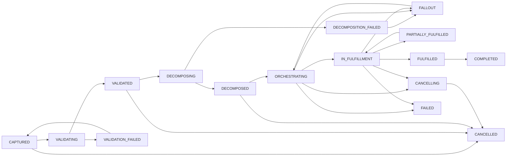
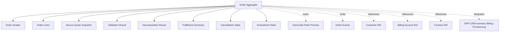
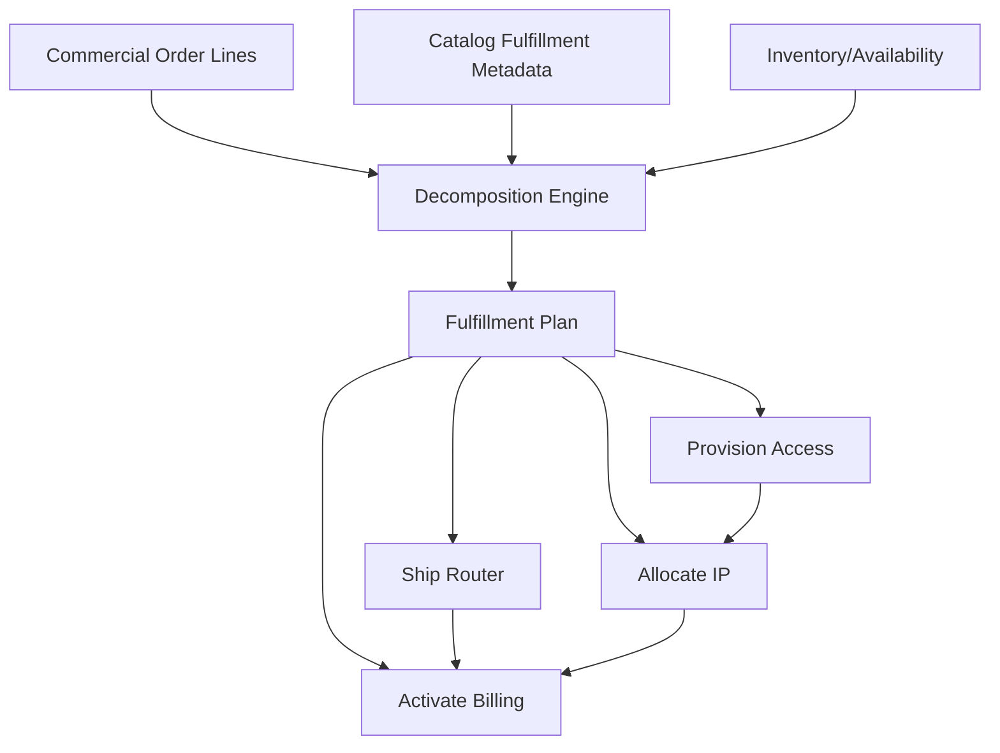
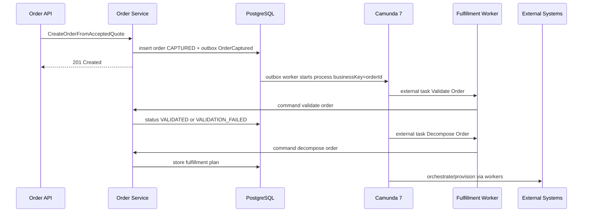

# Part 012 — Order Domain and Lifecycle

Order adalah titik perubahan besar dalam CPQ/OMS.

Quote menjawab:

> “Apa yang perusahaan bersedia tawarkan?”

Order menjawab:

> “Apa yang harus perusahaan realisasikan, kendalikan, dan pertanggungjawabkan?”

Perbedaan ini membuat order domain jauh lebih keras daripada quote. Quote masih berorientasi negosiasi. Order berorientasi eksekusi. Quote boleh gagal menjadi order tanpa konsekuensi operasional besar. Order yang salah bisa memicu fulfillment salah, billing salah, kontrak salah, SLA salah, inventory salah, dan customer impact nyata.

TM Forum Product Ordering API memosisikan product order sebagai mekanisme standar untuk menempatkan product order dengan parameter order yang diperlukan, dan product order dibuat berdasarkan product offering dari catalog. Itu cocok dengan mental model kita: order bukan objek bebas, tetapi hasil transformasi dari offering/configuration/quote yang sudah tervalidasi.

---

## 1. Order Bukan Quote Dengan Status Baru

Kesalahan paling umum:

```text
Quote accepted -> update status menjadi ORDERED -> selesai.
```

Ini salah secara domain.

Quote dan order punya intensi berbeda:

| Aspek | Quote | Order |
|---|---|---|
| Tujuan | Offer komersial | Eksekusi fulfillment |
| Orientasi | Negotiation | Delivery/control |
| Mutability | Bisa direvisi sampai accepted | Controlled amendment/cancellation |
| Kebenaran utama | Price/configuration/approval evidence | Fulfillment state and obligation |
| Workflow | Approval/presentation | Decomposition/provisioning/fallout |
| Failure | Bisa reprice/revise | Harus recover/compensate |
| Audit | Commercial defensibility | Operational and contractual defensibility |

Order harus menjadi aggregate/domain sendiri.

---

## 2. Order Lifecycle Besar

Lifecycle minimal order enterprise:



State ini perlu disesuaikan dengan domain bisnis, tetapi pattern-nya penting:

1. capture,
2. validate,
3. decompose,
4. orchestrate,
5. fulfill,
6. fallout/recover,
7. complete/cancel/fail.

---

## 3. Order Aggregate Boundary

Order aggregate melindungi konsistensi order header dan order line tree.



Order aggregate tidak harus menyimpan seluruh detail provisioning per external system. Namun ia harus tahu fulfillment obligation dan status line secara cukup untuk mengontrol lifecycle.

---

## 4. Order Header

Field penting:

| Field | Fungsi |
|---|---|
| `order_id` | ID teknis immutable |
| `order_number` | Nomor bisnis |
| `status` | Lifecycle utama |
| `order_type` | NEW / CHANGE / CANCEL / RENEWAL / SUSPEND / RESUME |
| `source_quote_id` | Quote asal jika ada |
| `source_quote_revision` | Revision quote yang diterima |
| `acceptance_id` | Evidence acceptance |
| `customer_id` | Customer |
| `account_id` | Account/billing context |
| `requested_start_date` | Desired start |
| `requested_completion_date` | Desired completion |
| `committed_completion_date` | Commitment setelah validasi/planning |
| `priority` | Normal/high/escalated |
| `tenant_id` | Tenant/segment |
| `created_by` | Actor/source system |
| `entity_version` | Optimistic lock |

Source quote fields harus immutable setelah order dibuat.

---

## 5. Order Line Tree

Order line biasanya berasal dari quote line tree, tetapi tidak selalu sama.

Contoh quote:

```text
Enterprise Connectivity Bundle
  Dedicated Internet
  Managed Router
  Premium SLA
```

Order decomposition bisa menghasilkan:

```text
Order
  Access Circuit Provisioning
  IP Allocation
  Router Shipment
  Router Configuration
  SLA Monitoring Setup
  Billing Activation
```

Ada dua tree berbeda:

1. **Commercial order line tree** — apa yang customer beli.
2. **Fulfillment order/task tree** — apa yang operasi harus lakukan.

Jangan paksakan satu tree untuk semua kebutuhan.

---

## 6. Commercial Order Line

Commercial order line menyimpan produk/offer yang menjadi kewajiban customer-facing.

Field penting:

| Field | Fungsi |
|---|---|
| `order_line_id` | ID line |
| `parent_order_line_id` | Parent tree |
| `source_quote_line_id` | Trace ke quote line |
| `line_number` | Human-readable line number |
| `action` | ADD / MODIFY / DELETE / NO_CHANGE |
| `product_offering_id` | Offering yang dipesan |
| `product_spec_id` | Spec |
| `quantity` | Jumlah |
| `configuration_snapshot` | Config accepted |
| `price_snapshot` | Price accepted |
| `status` | Line lifecycle |
| `fulfillment_status` | Summary fulfillment |

Order line harus mengacu ke accepted quote line jika berasal dari quote.

---

## 7. Order Line Action Semantics

Action sangat penting untuk change order.

| Action | Arti |
|---|---|
| `ADD` | Produk/fitur baru akan ditambahkan |
| `MODIFY` | Produk existing akan diubah |
| `DELETE` | Produk existing akan dihentikan/dihapus |
| `NO_CHANGE` | Produk existing tetap, muncul karena bundle/dependency |
| `SUSPEND` | Layanan dihentikan sementara |
| `RESUME` | Layanan diaktifkan kembali |

Untuk new order, mayoritas line `ADD`.

Untuk change order, bisa campuran:

```text
Managed WAN Bundle            MODIFY
  Primary Link                 NO_CHANGE
  Backup Link                  ADD
  Old Router                   DELETE
  New Router                   ADD
```

Jika action tidak dimodelkan eksplisit, order amendment akan menjadi kacau.

---

## 8. Order Capture

Order capture adalah proses membuat order dari input valid.

Sumber order:

- accepted quote,
- direct order API,
- CRM integration,
- partner channel,
- renewal engine,
- change order flow,
- cancellation request.

Untuk seri ini, jalur utama:

```text
Accepted Quote -> ConvertQuoteToOrder -> OrderCaptured
```

Capture harus idempotent.

Key yang aman:

```text
tenant_id + acceptance_id
```

Jika request conversion diulang, sistem mengembalikan order yang sama.

---

## 9. Order Validation

Order validation berbeda dari quote validation.

Quote validation bertanya:

> “Apakah offer ini valid secara komersial?”

Order validation bertanya:

> “Apakah organisasi bisa dan boleh menjalankan order ini sekarang?”

Validation dimensions:

1. Source quote valid.
2. Acceptance evidence valid.
3. Customer/account active.
4. Billing account ready.
5. Contract prerequisite ready.
6. Inventory/reservation available.
7. Address/service location valid.
8. Regulatory/KYC requirement satisfied.
9. Product still orderable atau grandfathered allowed.
10. Required fulfillment data complete.
11. No conflicting active order.
12. No duplicate order.

Validation result harus disimpan, bukan hilang di log.

---

## 10. Validation Result Model

```json
{
  "validationResultId": "...",
  "orderId": "...",
  "status": "FAILED",
  "checks": [
    {
      "code": "BILLING_ACCOUNT_MISSING",
      "severity": "BLOCKER",
      "message": "Billing account is required before fulfillment can start.",
      "target": "order.accountId"
    },
    {
      "code": "INSTALLATION_ADDRESS_UNVERIFIED",
      "severity": "WARNING",
      "message": "Address can be verified manually during fallout.",
      "target": "orderLine[2].serviceLocation"
    }
  ]
}
```

Bedakan:

- blocker: order tidak boleh lanjut,
- warning: order boleh lanjut dengan risiko/monitoring,
- manual review: masuk fallout/manual task,
- external pending: menunggu sistem eksternal.

---

## 11. Decomposition

Decomposition adalah transformasi dari commercial order ke execution plan.

Input:

- order line tree,
- product spec,
- fulfillment metadata,
- customer/location context,
- inventory state,
- action semantics,
- dependency graph.

Output:

- fulfillment items,
- dependencies,
- responsible system/team,
- orchestration plan,
- compensation hints.

Diagram:



Decomposition harus deterministic untuk input yang sama.

Jika catalog fulfillment metadata berubah, order existing tidak boleh berubah diam-diam.

---

## 12. Fulfillment Plan

Fulfillment plan bisa disimpan sebagai JSONB atau normalized tables tergantung kebutuhan query.

Minimal model:

```text
fulfillment_item_id
order_id
order_line_id
item_type
responsible_system
action
status
depends_on[]
input_payload
result_payload
retry_policy
compensation_action
```

Fulfillment item bukan Camunda task. Ia adalah domain execution unit. Camunda bisa mengorkestrasi item tersebut.

---

## 13. Order Orchestration Dengan Camunda 7

Order process adalah kandidat kuat untuk Camunda 7 karena punya:

- langkah panjang,
- wait state,
- external system calls,
- manual fallout,
- retry,
- SLA,
- compensation,
- visibility operational.

Camunda process bisa memiliki business key `orderNumber` atau `orderId`.



Prinsip penting:

> Camunda mengatur alur, Order Service menjaga state dan invariant.

Jangan biarkan process variable menjadi source of truth utama order.

---

## 14. Process State vs Domain State

Camunda punya process instance state. Order punya domain state.

Keduanya tidak sama.

| Camunda | Order Domain |
|---|---|
| Token berada di activity tertentu | Status order/customer-facing |
| Job failed | Fulfillment step failed atau technical retry? |
| User task active | Fallout/manual review diperlukan |
| Process ended | Order mungkin completed/cancelled/failed |
| Incident | Operational incident, belum tentu domain failed |

Jangan expose Camunda activity ID sebagai order status customer-facing.

Mapping harus eksplisit.

---

## 15. Order Status vs Fulfillment Status

Order status utama bisa ringkas:

```text
CAPTURED
VALIDATING
VALIDATED
IN_PROGRESS
FALLOUT
COMPLETED
CANCELLING
CANCELLED
FAILED
```

Line fulfillment status bisa lebih rinci:

```text
PENDING
READY
BLOCKED
IN_PROGRESS
WAITING_EXTERNAL
COMPLETED
FAILED
CANCELLED
COMPENSATED
```

Jangan memaksa semua detail fulfillment masuk ke order header status.

---

## 16. Fallout

Fallout adalah kondisi ketika order tidak bisa lanjut secara otomatis dan membutuhkan intervensi atau recovery.

Fallout bukan sekadar error.

Contoh fallout:

- alamat tidak valid,
- inventory tidak tersedia setelah sebelumnya available,
- provisioning system menolak payload,
- data customer tidak lengkap,
- billing account belum aktif,
- duplicate service detected,
- external system timeout melebihi retry budget,
- field engineer scheduling gagal,
- router shipment gagal,
- regulatory check pending.

Fallout harus punya case state:

```text
OPEN
ASSIGNED
IN_REVIEW
WAITING_CUSTOMER
WAITING_EXTERNAL
RESOLVED
CANCELLED
ESCALATED
```

---

## 17. Fallout Case Model

```sql
CREATE TABLE order_fallout_case (
  fallout_case_id UUID PRIMARY KEY,
  order_id UUID NOT NULL,
  order_line_id UUID,
  fulfillment_item_id UUID,
  status VARCHAR(40) NOT NULL,
  severity VARCHAR(20) NOT NULL,
  reason_code VARCHAR(80) NOT NULL,
  description TEXT NOT NULL,
  owner_group VARCHAR(120),
  owner_user_id VARCHAR(120),
  opened_at TIMESTAMPTZ NOT NULL,
  resolved_at TIMESTAMPTZ,
  resolution_code VARCHAR(80),
  entity_version BIGINT NOT NULL
);
```

Fallout resolution harus command-based:

```text
AssignFalloutCase
RequestCustomerInfo
RetryFulfillmentItem
SkipFulfillmentItem
CorrectOrderData
CancelOrderFromFallout
MarkFalloutResolved
EscalateFallout
```

Jangan memberi tombol “edit database order data” ke support.

---

## 18. Cancellation

Cancellation lebih sulit daripada create.

Order bisa dibatalkan pada fase berbeda:

| Fase | Cancellation Complexity |
|---|---|
| CAPTURED | Mudah, belum ada fulfillment |
| VALIDATED | Relatif mudah |
| DECOMPOSED | Perlu batalkan fulfillment plan |
| IN_FULFILLMENT | Perlu kompensasi sebagian |
| PARTIALLY_FULFILLED | Sangat domain-specific |
| COMPLETED | Biasanya bukan cancellation, tetapi termination/change order |

Cancellation command harus menjawab:

- siapa yang meminta cancel?
- alasan cancel?
- apakah customer-initiated atau internal?
- apakah ada penalty?
- apakah sudah ada resource terprovision?
- apakah billing activation sudah terjadi?
- apakah shipment sudah keluar?
- apakah compensation berhasil?

---

## 19. Compensation

Compensation bukan rollback database transaction.

Compensation adalah aksi bisnis untuk membalik efek yang sudah terjadi.

Contoh:

| Forward Action | Compensation |
|---|---|
| Reserve inventory | Release reservation |
| Allocate IP | Release IP |
| Ship router | Create return shipment / stop shipment |
| Activate billing | Deactivate billing / credit note request |
| Create contract | Void contract / amendment |
| Provision service | Deprovision service |

Camunda BPMN compensation event bisa membantu memodelkan beberapa scenario, tetapi action compensation tetap harus domain-specific dan idempotent.

---

## 20. Amendment and Change Order

Enterprise OMS harus mendukung perubahan setelah order/service existing.

Jenis perubahan:

- add product,
- remove product,
- change speed/plan,
- move address,
- change billing account,
- suspend/resume,
- renew,
- terminate.

Change order harus mengacu ke installed base/current asset.

Mental model:

```text
Current Product Inventory + Desired Future State -> Delta -> Change Order
```

Jangan hanya copy order lama lalu edit line.

---

## 21. Installed Base Boundary

Order fulfillment menciptakan atau mengubah installed base/product inventory.

Order service tidak harus menjadi product inventory service, tetapi harus tahu boundary-nya.

Setelah fulfillment completed:

```text
OrderCompleted -> ProductInventoryUpdated
```

Untuk change order:

```text
ProductInventorySnapshot -> Change Quote -> Accepted Change Quote -> Change Order
```

Installed base snapshot penting agar perubahan punya baseline.

---

## 22. Order Events

Event penting:

```text
OrderCaptured
OrderValidationStarted
OrderValidated
OrderValidationFailed
OrderDecompositionStarted
OrderDecomposed
OrderDecompositionFailed
OrderOrchestrationStarted
OrderFulfillmentStarted
OrderFulfillmentItemStarted
OrderFulfillmentItemCompleted
OrderFulfillmentItemFailed
OrderFalloutOpened
OrderFalloutResolved
OrderCancellationRequested
OrderCancellationStarted
OrderCancelled
OrderCompensationStarted
OrderCompensationCompleted
OrderCompleted
OrderFailed
```

Event harus membawa:

- order id,
- order number,
- order version,
- source quote id/revision jika ada,
- business key,
- process instance id jika relevan,
- correlation id,
- causation id.

---

## 23. Order Database Shape

Header:

```sql
CREATE TABLE customer_order (
  order_id UUID PRIMARY KEY,
  tenant_id VARCHAR(80) NOT NULL,
  order_number VARCHAR(80) NOT NULL,
  order_type VARCHAR(40) NOT NULL,
  status VARCHAR(40) NOT NULL,
  customer_id VARCHAR(80) NOT NULL,
  account_id VARCHAR(80),
  source_quote_id UUID,
  source_quote_number VARCHAR(80),
  source_quote_revision INTEGER,
  acceptance_id UUID,
  requested_start_date DATE,
  requested_completion_date DATE,
  committed_completion_date DATE,
  priority VARCHAR(30) NOT NULL,
  process_instance_id VARCHAR(80),
  created_by VARCHAR(120) NOT NULL,
  entity_version BIGINT NOT NULL,
  created_at TIMESTAMPTZ NOT NULL,
  updated_at TIMESTAMPTZ NOT NULL,
  UNIQUE (tenant_id, order_number),
  UNIQUE (tenant_id, acceptance_id)
);
```

Order line:

```sql
CREATE TABLE customer_order_line (
  order_line_id UUID PRIMARY KEY,
  order_id UUID NOT NULL REFERENCES customer_order(order_id),
  parent_order_line_id UUID REFERENCES customer_order_line(order_line_id),
  source_quote_line_id UUID,
  line_number VARCHAR(40) NOT NULL,
  action VARCHAR(30) NOT NULL,
  status VARCHAR(40) NOT NULL,
  fulfillment_status VARCHAR(40) NOT NULL,
  product_offering_id VARCHAR(120) NOT NULL,
  product_spec_id VARCHAR(120),
  quantity NUMERIC(18, 6) NOT NULL,
  configuration_snapshot JSONB NOT NULL,
  price_snapshot JSONB,
  sort_order INTEGER NOT NULL,
  created_at TIMESTAMPTZ NOT NULL,
  updated_at TIMESTAMPTZ NOT NULL
);
```

Fulfillment item:

```sql
CREATE TABLE fulfillment_item (
  fulfillment_item_id UUID PRIMARY KEY,
  order_id UUID NOT NULL REFERENCES customer_order(order_id),
  order_line_id UUID REFERENCES customer_order_line(order_line_id),
  item_type VARCHAR(80) NOT NULL,
  responsible_system VARCHAR(80) NOT NULL,
  action VARCHAR(40) NOT NULL,
  status VARCHAR(40) NOT NULL,
  input_payload JSONB NOT NULL,
  result_payload JSONB,
  retry_count INTEGER NOT NULL,
  max_retry_count INTEGER NOT NULL,
  created_at TIMESTAMPTZ NOT NULL,
  updated_at TIMESTAMPTZ NOT NULL
);
```

---

## 24. Idempotency and Duplicate Protection

Order create harus sangat ketat.

Duplicate order bisa terjadi karena:

- user double click,
- partner retry,
- network timeout,
- Kafka redelivery,
- workflow retry,
- job executor retry,
- manual recovery salah.

Protection layer:

1. Idempotency key pada API.
2. Unique constraint pada acceptance id.
3. Unique command log.
4. Outbox idempotent publication.
5. Consumer deduplication.
6. External system idempotency reference.

Jangan mengandalkan satu layer saja.

---

## 25. External System Interaction

OMS sering berhadapan dengan sistem eksternal:

- CRM,
- ERP,
- Billing,
- Inventory,
- Provisioning,
- Shipping,
- Field service,
- Contract management,
- Notification,
- Document management.

Pola aman:

```text
Order Service -> Camunda process -> Worker -> Anti-Corruption Adapter -> External System
```

Worker jangan menulis order state langsung tanpa command.

Yang benar:

```text
Worker receives task
Worker calls external system
Worker sends CompleteFulfillmentItem command to Order Service
Order Service validates and updates state
```

---

## 26. Anti-Corruption Layer

External systems punya model berbeda.

Jangan biarkan external payload masuk ke order aggregate mentah-mentah.

Anti-corruption adapter bertugas:

- translate command,
- map status,
- normalize error,
- enforce timeout,
- attach correlation id,
- handle retries,
- emit technical diagnostics,
- return domain result.

Contoh mapping:

```text
External: ERR_771_PORT_OCCUPIED
Domain: RESOURCE_UNAVAILABLE / BLOCKER / requires fallout
```

---

## 27. Timeout and Retry Discipline

Order orchestration harus punya retry budget.

Tidak semua error boleh retry.

| Error | Retry? | Handling |
|---|---:|---|
| HTTP 503 external system | Yes | exponential backoff within budget |
| HTTP 400 invalid payload | No | open fallout / bug incident |
| Business reject inventory unavailable | No automatic retry | open fallout or alternative product |
| Timeout unknown result | Maybe | query status before retry command |
| Duplicate request | Idempotent success | return existing external reference |

Retry tanpa domain awareness bisa membuat duplicate provisioning.

---

## 28. Unknown Outcome Problem

Salah satu masalah tersulit:

> Kita mengirim request ke external system, timeout, dan tidak tahu apakah external system berhasil atau gagal.

Jangan langsung retry create secara buta.

Gunakan external correlation id:

```text
externalRequestId = orderId + fulfillmentItemId + attemptGroup
```

Flow:

1. Send request with external idempotency/correlation id.
2. If timeout, mark item `WAITING_UNKNOWN_OUTCOME`.
3. Query external system by correlation id.
4. If found success, complete item.
5. If found failed, mark failed/fallout.
6. If not found after retry budget, open fallout.

---

## 29. Order Query Model

User dan operation team butuh query yang berbeda.

Sales/customer view:

- order number,
- status customer-facing,
- estimated completion,
- products ordered,
- blockers visible to customer,
- next action required from customer.

Operations view:

- process instance,
- current activity,
- fulfillment items,
- external references,
- fallout cases,
- retry state,
- SLA breach risk,
- owner group.

Jangan expose satu read model untuk semua persona.

---

## 30. Customer-Facing Status

Customer-facing status harus stabil dan tidak terlalu teknis.

Contoh mapping:

| Internal State | Customer Status |
|---|---|
| CAPTURED / VALIDATING | Order received |
| VALIDATED / DECOMPOSED | Preparing order |
| IN_FULFILLMENT | In progress |
| WAITING_CUSTOMER | Waiting for your action |
| FALLOUT internal only | In progress / Needs review |
| COMPLETED | Completed |
| CANCELLING | Cancelling |
| CANCELLED | Cancelled |
| FAILED | Unable to complete |

Jangan tampilkan “Camunda incident” ke customer.

---

## 31. SLA and Milestone Model

Order lifecycle harus punya milestone.

Contoh:

```text
ORDER_CAPTURED
ORDER_VALIDATED
ORDER_DECOMPOSED
FULFILLMENT_STARTED
CUSTOMER_INFO_REQUESTED
INSTALLATION_SCHEDULED
SERVICE_ACTIVATED
BILLING_ACTIVATED
ORDER_COMPLETED
```

Milestone bisa dipakai untuk:

- SLA tracking,
- customer notification,
- operational dashboard,
- escalation,
- audit.

Milestone bukan sama dengan status. Status menunjukkan posisi sekarang. Milestone menunjukkan sesuatu pernah terjadi.

---

## 32. Notification Boundary

Order service jangan langsung kirim email di dalam transaction.

Pola:

```text
Order state changes -> Order event -> Notification service decides template/channel -> sends notification
```

Order event harus cukup kaya, tetapi tidak menjadi template email.

Contoh event:

```json
{
  "eventType": "OrderMilestoneReached",
  "payload": {
    "orderId": "...",
    "orderNumber": "O-2026-000778",
    "milestone": "INSTALLATION_SCHEDULED",
    "customerId": "...",
    "scheduledAt": "2026-07-09T09:00:00+07:00"
  }
}
```

---

## 33. Order Audit

Audit order harus bisa menjawab:

- order dibuat dari quote revision mana?
- siapa menerima quote?
- kapan order dibuat?
- validation apa yang gagal?
- siapa override blocker?
- fulfillment item mana yang gagal?
- external system memberi response apa?
- siapa resolve fallout?
- compensation apa yang dilakukan?
- kapan customer diberitahu?

Audit harus menggabungkan:

- domain audit,
- workflow history,
- integration trace,
- event log,
- external reference.

---

## 34. JPA Aggregate Loading

Order aggregate bisa besar. Jangan selalu load semuanya.

Gunakan pola:

- `OrderHeaderRepository` untuk list/search.
- `OrderAggregateRepository` untuk command penting.
- `FulfillmentItemRepository` untuk worker command spesifik.
- Read model/projection untuk operations dashboard.

Jika satu order bisa memiliki ratusan fulfillment item, aggregate load harus hati-hati.

Jangan memaksa DDD aggregate murni jika ukuran dan concurrency tidak cocok. Enterprise engineering harus pragmatis.

---

## 35. Command Service Shape

Pisahkan command service:

```text
OrderCaptureService
OrderValidationService
OrderDecompositionService
OrderOrchestrationService
FulfillmentCommandService
FalloutCommandService
CancellationService
CompensationService
OrderQueryService
```

Setiap command service:

1. validate authz,
2. validate idempotency,
3. load necessary state,
4. enforce invariant,
5. update state,
6. append domain event to outbox,
7. return command result.

---

## 36. OpenAPI Surface

Contoh API:

```http
POST /orders
GET  /orders/{orderId}
GET  /orders?customerId=&status=&createdFrom=&createdTo=
POST /orders/from-quote
POST /orders/{orderId}/validations
POST /orders/{orderId}/decompositions
POST /orders/{orderId}/orchestrations
POST /orders/{orderId}/cancellations
GET  /orders/{orderId}/fulfillment-items
POST /orders/{orderId}/fulfillment-items/{itemId}/completions
POST /orders/{orderId}/fulfillment-items/{itemId}/failures
GET  /orders/{orderId}/fallout-cases
POST /orders/{orderId}/fallout-cases/{caseId}/resolutions
```

Worker-facing endpoint harus dibedakan dari user-facing endpoint secara security dan authorization.

---

## 37. Security and Authorization

Order action lebih sensitif daripada quote action.

Authorization examples:

| Action | Required Authority |
|---|---|
| Create order from accepted quote | Sales/order capture role or trusted integration |
| Override validation blocker | Operations supervisor |
| Retry fulfillment item | Operations role |
| Cancel order in fulfillment | Cancellation authority + policy check |
| Force complete item | Restricted break-glass role |
| Resolve fallout | Assigned group or supervisor |
| View operational trace | Internal operations only |

Break-glass action harus punya audit ekstra.

---

## 38. Failure Modeling Table

| Failure | Handling |
|---|---|
| Duplicate quote conversion | Return existing order by acceptance id |
| Validation service timeout | Mark validation failed/transient and retry or manual review |
| Decomposition rule missing | Open decomposition fallout, do not start fulfillment |
| Camunda process start failed | Outbox retry, order remains captured/ready-for-orchestration |
| External provisioning timeout | Unknown outcome handling |
| External business rejection | Open fallout with reason code |
| Worker duplicate completion | Idempotent completion by fulfillment item version/status |
| Cancel during provisioning | Transition to cancelling and execute compensation plan |
| Compensation failed | Open compensation fallout/escalation |
| Event publish failed | Outbox retry |
| Read model stale | UI indicates projection lag or falls back to source query |

---

## 39. Anti-Patterns

### 39.1 Order Status Mirrors Camunda Activity

Camunda activity is operational. Order status is domain/customer-facing.

### 39.2 One Giant Order Process Does Everything

BPMN becomes unreadable and untestable. Split subprocesses by capability.

### 39.3 External System Writes Order Tables

All state changes must go through order commands.

### 39.4 Retry Everything

Retry without understanding unknown outcome creates duplicate side effects.

### 39.5 No Source Quote Revision

Audit cannot prove what customer accepted.

### 39.6 Fulfillment Plan Not Persisted

If plan only exists in process variables, recovery and audit are weak.

### 39.7 Fallout Is Just Ticket Comment

Fallout must be structured domain state.

---

## 40. Practical Build Sequence

Build order domain in this order:

1. Order header and commercial line model.
2. Create order from accepted quote.
3. Idempotency by acceptance id.
4. Source quote revision snapshot.
5. Order validation command.
6. Validation result persistence.
7. Decomposition command.
8. Fulfillment item model.
9. Camunda process start via outbox.
10. Worker command endpoints.
11. Fulfillment item completion/failure.
12. Fallout case model.
13. Cancellation model.
14. Compensation hooks.
15. Order events.
16. Operations read model.
17. SLA/milestone model.
18. External integration adapters.
19. Failure drills.
20. Audit review.

Jangan mulai dari BPMN detail. Mulai dari domain lifecycle dan invariant.

---

## 41. Design Review Checklist

Order domain belum enterprise-grade jika tidak bisa menjawab:

- Order dibuat dari quote revision mana?
- Bagaimana mencegah duplicate conversion?
- Apa beda order status dan fulfillment item status?
- Apa yang terjadi jika decomposition gagal?
- Apakah fulfillment plan persisted?
- Bagaimana unknown outcome external call ditangani?
- Bagaimana cancel saat order partially fulfilled?
- Compensation apa yang tersedia untuk setiap external side effect?
- Siapa boleh override validation blocker?
- Bagaimana fallout case diassign dan diresolve?
- Apakah customer-facing status stabil?
- Apakah process instance punya business key?
- Apakah worker mengubah state melalui command?
- Apakah order event membawa aggregate version?
- Apakah audit bisa membuktikan end-to-end journey?

---

## 42. Penutup

Order domain adalah execution control layer. Ia mengambil commercial evidence dari quote, lalu mengubahnya menjadi fulfillment obligation yang harus dieksekusi, dipantau, dikoreksi, atau dikompensasi.

Prinsip utama part ini:

1. Order bukan quote dengan status baru.
2. Order harus menyimpan source quote revision.
3. Capture harus idempotent.
4. Validation dan decomposition adalah lifecycle eksplisit.
5. Commercial order line berbeda dari fulfillment item.
6. Camunda mengorkestrasi, bukan menjadi database order utama.
7. External interaction harus melewati anti-corruption layer.
8. Unknown outcome harus dimodelkan.
9. Fallout adalah domain state, bukan catatan bebas.
10. Cancellation dan compensation harus dirancang sejak awal.

Part berikutnya akan masuk ke state machines dan lifecycle invariants. Di sana kita akan mengikat quote dan order lifecycle menjadi aturan transisi yang eksplisit, testable, dan tahan terhadap race condition.

---

## References

- TM Forum, Product Ordering Management API TMF622: https://www.tmforum.org/open-digital-architecture/open-apis/product-ordering-management-api-TMF622/v5.0
- TM Forum, Quote Management API TMF648: https://www.tmforum.org/open-digital-architecture/open-apis/quote-management-api-TMF648/v4.0
- Camunda, RuntimeService JavaDoc and business key description: https://docs.camunda.org/javadoc/camunda-bpm-platform/7.6/org/camunda/bpm/engine/RuntimeService.html
- Camunda, ProcessInstance JavaDoc: https://docs.camunda.org/javadoc/camunda-bpm-platform/7.3/org/camunda/bpm/engine/runtime/ProcessInstance.html
