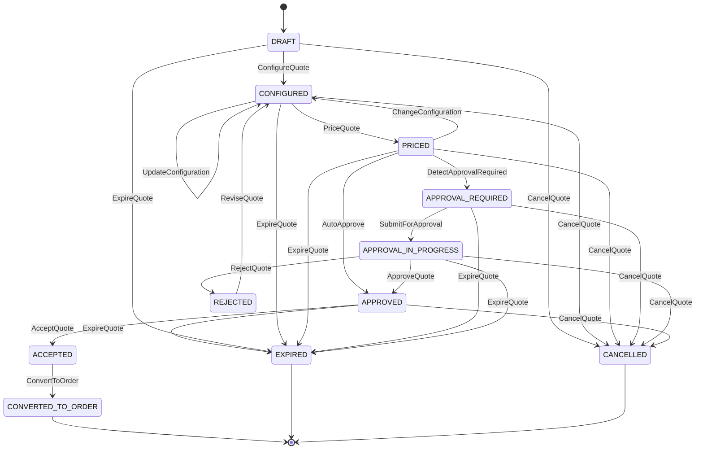
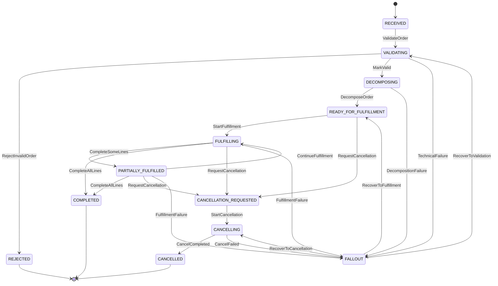

# Part 013 — State Machines and Lifecycle Invariants

CPQ/OMS yang production-grade tidak bisa hanya memakai kolom `status`.

Kolom `status` hanya menyimpan nama keadaan. State machine menjelaskan:

1. state apa saja yang valid,
2. transisi apa saja yang legal,
3. siapa atau apa yang boleh memicu transisi,
4. precondition apa yang harus benar sebelum transisi,
5. side effect apa yang boleh terjadi setelah transisi,
6. event apa yang harus diterbitkan,
7. audit evidence apa yang harus ditinggalkan,
8. transisi mana yang terminal dan tidak boleh dibalik,
9. kegagalan mana yang bisa di-retry, di-compensate, atau harus masuk fallout.

Dalam CPQ/OMS, state machine bukan hiasan arsitektur. Ia adalah tulang punggung correctness.

Sistem yang buruk biasanya punya status seperti ini:

```text
DRAFT -> SUBMITTED -> APPROVED -> ORDERED
```

Kelihatannya sederhana. Tapi begitu production berjalan, pertanyaannya muncul:

- Apakah quote yang sudah `APPROVED` boleh diedit?
- Apakah perubahan kecil pada contact information membatalkan approval?
- Apakah perubahan discount membatalkan approval?
- Apakah quote yang expired masih boleh accepted?
- Apakah order boleh dibuat dua kali dari quote yang sama?
- Apakah order line bisa `COMPLETED` saat parent order masih `VALIDATING`?
- Apakah cancel order bisa dilakukan saat ada fulfillment step yang sudah completed?
- Apakah retry dari Kafka consumer boleh mengubah state dua kali?
- Apakah Camunda process boleh memajukan state entity langsung?
- Apakah DB constraint bisa menangkap sebagian kesalahan lifecycle?

State machine menjawab pertanyaan itu secara eksplisit.

Top 1% engineer tidak memulai dari framework. Ia memulai dari **transition legality** dan **domain invariants**.

---

## 1. Status Bukan Lifecycle

`status` adalah data.

Lifecycle adalah aturan.

State machine adalah model yang membuat lifecycle bisa dieksekusi, diuji, diaudit, dan dipertahankan saat sistem tumbuh.

Perbedaan sederhananya:

| Konsep | Pertanyaan yang Dijawab |
|---|---|
| Status | Sekarang entity ada di keadaan apa? |
| Lifecycle | Bagaimana entity boleh bergerak dari satu keadaan ke keadaan lain? |
| State machine | Apa aturan formal untuk setiap perpindahan keadaan? |
| Invariant | Kebenaran apa yang tidak boleh dilanggar oleh state apa pun? |
| Command | Permintaan eksplisit untuk mengubah lifecycle. |
| Event | Fakta bahwa lifecycle sudah berubah. |
| Workflow | Orkestrasi pekerjaan lintas service/manusia untuk mencapai state tertentu. |

Kesalahan umum adalah membuat workflow engine menjadi pemilik state domain.

Itu berbahaya.

Camunda 7 boleh mengorkestrasi proses, assign task, menunggu callback, retry job, dan mencatat process history. Tapi state quote/order tetap harus dimiliki domain service masing-masing.

Aturan dasarnya:

> Process state coordinates work. Domain state defines truth.

Kalau Camunda process instance mengatakan approval selesai, tapi quote service belum berhasil commit `APPROVED`, maka quote belum approved.

Kalau order process sudah sampai service task `Notify Customer`, tapi order aggregate masih `VALIDATING`, maka ada inconsistency yang harus dideteksi.

---

## 2. Vocabulary yang Harus Konsisten

Sebelum desain lifecycle, kita butuh vocabulary yang ketat.

### 2.1 State

State adalah kondisi stabil entity.

Contoh quote state:

```text
DRAFT
CONFIGURED
PRICED
APPROVAL_REQUIRED
APPROVAL_IN_PROGRESS
APPROVED
REJECTED
ACCEPTED
CONVERTED_TO_ORDER
EXPIRED
CANCELLED
```

Contoh order state:

```text
RECEIVED
VALIDATING
REJECTED
DECOMPOSING
READY_FOR_FULFILLMENT
FULFILLING
PARTIALLY_FULFILLED
COMPLETED
CANCELLATION_REQUESTED
CANCELLING
CANCELLED
FALLOUT
```

State harus cukup kaya untuk operation, tapi tidak terlalu granular sampai menjadi log step teknis.

State seperti `CALLING_INVENTORY_API` biasanya bukan domain state. Itu process/activity state.

State seperti `FULFILLING` bisa domain state karena punya makna bisnis.

### 2.2 Command

Command adalah permintaan perubahan.

Command diberi nama dengan imperative verb:

```text
ConfigureQuote
PriceQuote
SubmitQuoteForApproval
ApproveQuote
RejectQuote
AcceptQuote
ConvertQuoteToOrder
CancelOrder
RetryFulfillmentStep
MarkOrderLineCompleted
```

Command bukan event. Command bisa ditolak.

Event adalah fakta yang sudah terjadi:

```text
QuoteConfigured
QuotePriced
QuoteApprovalRequested
QuoteApproved
QuoteRejected
QuoteAccepted
OrderCreated
OrderValidationFailed
OrderFulfillmentStarted
OrderCompleted
OrderMovedToFallout
```

Event tidak boleh dinamai seperti perintah.

### 2.3 Guard

Guard adalah predicate yang harus benar agar transisi legal.

Contoh:

```text
ApproveQuote guard:
- quote.status == APPROVAL_IN_PROGRESS
- currentUser has approvalAuthority for quote.requiredApprovalLevel
- quote.priceResultId == quote.currentPriceResultId
- quote.approvalRequestRevision == quote.currentRevision
- quote.expiredAt > now
```

Kalau guard gagal, sistem tidak boleh “mencoba tetap jalan”. Sistem harus menolak command secara eksplisit.

### 2.4 Invariant

Invariant adalah kebenaran yang harus tetap benar setelah setiap command.

Contoh:

```text
A quote revision that has been accepted must never be mutated.
```

Atau:

```text
An order must reference exactly one accepted quote revision, unless it is a non-quote order type explicitly allowed by policy.
```

Invariant lebih kuat daripada validasi request. Validasi request hanya memeriksa input. Invariant memeriksa kebenaran domain setelah operasi.

### 2.5 Effect

Effect adalah perubahan yang terjadi akibat command.

Effect bisa berupa:

- perubahan row database,
- insertion audit record,
- insertion outbox event,
- creation workflow instance,
- correlation ke process instance,
- invalidation cache,
- scheduled expiration,
- notification request.

Effect tidak boleh tersebar liar. Semua effect utama harus bisa dilacak dari command handler.

### 2.6 Terminal State

Terminal state adalah state yang tidak punya transisi keluar kecuali operation/admin recovery yang sangat terbatas.

Contoh quote terminal state:

```text
CONVERTED_TO_ORDER
EXPIRED
CANCELLED
```

Contoh order terminal state:

```text
COMPLETED
CANCELLED
REJECTED
```

`FALLOUT` tidak selalu terminal. Ia bisa menjadi holding state untuk manual recovery.

---

## 3. Quote State Machine

Quote lifecycle harus melindungi commercial evidence.

Quote bukan keranjang belanja. Quote adalah proposal komersial yang harus bisa dijelaskan ulang setelah diterima customer.

Diagram dasar:



Diagram ini bukan final untuk semua industri. Tetapi ia memberi shape yang benar:

- quote bisa bergerak dari draft menuju configured,
- quote harus diprice sebelum approval/acceptance,
- approval bisa auto atau manual,
- rejected quote tidak langsung approved lagi; harus direvisi,
- accepted quote baru bisa converted to order,
- expired/cancelled/converted adalah terminal untuk revision tersebut.

### 3.1 Quote State Semantics

| State | Meaning | Mutability | Main Risk |
|---|---|---:|---|
| `DRAFT` | Quote baru dibuat, belum punya konfigurasi valid. | High | Draft dipakai untuk pricing/order. |
| `CONFIGURED` | Product selection valid terhadap catalog snapshot. | Medium | Catalog drift tidak terlihat. |
| `PRICED` | Quote punya price result reproducible. | Low/Medium | Price berubah tanpa trace. |
| `APPROVAL_REQUIRED` | Price/config butuh approval policy. | Low | Approval matrix salah atau stale. |
| `APPROVAL_IN_PROGRESS` | Human/system approval sedang berjalan. | Very low | Quote diedit saat approval berjalan. |
| `APPROVED` | Commercial terms disetujui. | Frozen commercial fields | Approval tidak lagi valid setelah perubahan. |
| `REJECTED` | Approval ditolak. | Revision required | Re-submit tanpa perubahan yang jelas. |
| `ACCEPTED` | Customer menerima quote revision. | Immutable | Mutasi setelah acceptance. |
| `CONVERTED_TO_ORDER` | Quote revision sudah menghasilkan order. | Immutable | Double order creation. |
| `EXPIRED` | Validity window habis. | Immutable by default | Expired quote accepted. |
| `CANCELLED` | Quote dihentikan sebelum accepted. | Immutable by default | Cancelled quote resurrected tanpa audit. |

### 3.2 Quote Transition Matrix

Transition matrix lebih berguna daripada diagram saat implementasi.

| From | Command | To | Guard Utama | Effect Utama |
|---|---|---|---|---|
| `DRAFT` | `ConfigureQuote` | `CONFIGURED` | product offering valid; config rules satisfied | save configuration snapshot; emit `QuoteConfigured` |
| `CONFIGURED` | `PriceQuote` | `PRICED` | configuration valid; price book available | save price result; emit `QuotePriced` |
| `PRICED` | `DetectApprovalRequired` | `APPROVAL_REQUIRED` | approval policy says manual approval needed | save approval requirement; start process optional |
| `PRICED` | `AutoApprove` | `APPROVED` | approval policy says no approval needed | save approval evidence; emit `QuoteApproved` |
| `APPROVAL_REQUIRED` | `SubmitForApproval` | `APPROVAL_IN_PROGRESS` | not expired; no active approval process | start Camunda process; save process correlation |
| `APPROVAL_IN_PROGRESS` | `ApproveQuote` | `APPROVED` | approver authorized; revision unchanged | save approval decision; emit `QuoteApproved` |
| `APPROVAL_IN_PROGRESS` | `RejectQuote` | `REJECTED` | approver authorized | save rejection reason; emit `QuoteRejected` |
| `REJECTED` | `ReviseQuote` | `CONFIGURED` | user can revise; new revision created | clone allowed fields; create new revision |
| `APPROVED` | `AcceptQuote` | `ACCEPTED` | customer acceptance valid; not expired | save acceptance evidence; emit `QuoteAccepted` |
| `ACCEPTED` | `ConvertQuoteToOrder` | `CONVERTED_TO_ORDER` | no existing order for quote revision | create order command/outbox; lock conversion |

Transition matrix adalah artifact engineering. Ia harus hidup dekat dengan code, test, dan documentation.

---

## 4. Order State Machine

Order lifecycle lebih keras karena order menyentuh fulfillment, external systems, inventory, billing, dan customer commitment.



Order state harus membedakan business rejection dan technical fallout.

`REJECTED` berarti order tidak valid secara bisnis.

`FALLOUT` berarti proses gagal atau ambigu dan butuh recovery.

Mencampur keduanya akan merusak reporting dan operasi.

### 4.1 Order State Semantics

| State | Meaning | Owner Utama | Main Risk |
|---|---|---|---|
| `RECEIVED` | Order sudah dibuat dari accepted quote/command. | Order service | Duplicate creation. |
| `VALIDATING` | Business validation sedang berjalan. | Order service + workflow | Timeout dianggap valid. |
| `REJECTED` | Order tidak bisa diproses karena invalid. | Order service | Technical error disalahartikan sebagai rejection. |
| `DECOMPOSING` | Order line dipecah ke fulfillment tasks. | Order service | Decomposition tidak deterministic. |
| `READY_FOR_FULFILLMENT` | Semua fulfillment plan siap. | Order service | Plan stale sebelum dieksekusi. |
| `FULFILLING` | Eksekusi external/internal system berjalan. | Workflow + fulfillment adapters | Unknown outcome. |
| `PARTIALLY_FULFILLED` | Sebagian obligation sudah selesai. | Order service | Cancel semantics ambigu. |
| `COMPLETED` | Semua obligation selesai. | Order service | Completed tanpa evidence lengkap. |
| `CANCELLATION_REQUESTED` | Cancel intent diterima. | Order service | Cancel dianggap langsung sukses. |
| `CANCELLING` | Compensation/reversal berjalan. | Workflow + adapters | Partial cancellation tidak dimodelkan. |
| `CANCELLED` | Cancellation selesai sesuai policy. | Order service | Hilang trace dari fulfilled lines. |
| `FALLOUT` | Perlu manual/automated recovery. | Operations | Fallout jadi kuburan permanen. |

---

## 5. Lifecycle Invariant Catalog

Invariant catalog adalah daftar kebenaran yang harus dipertahankan oleh code, database, test, dan operation.

Jangan simpan invariant hanya di kepala engineer senior.

Tulis. Uji. Review. Jadikan bagian dari architecture governance.

### 5.1 Identity and Version Invariants

```text
QI-001: Every quote has a stable quoteId.
QI-002: Every accepted commercial state belongs to a specific quoteRevisionId.
QI-003: A quote revision number is monotonically increasing within a quote.
QI-004: Only one current revision exists for an active quote at any point in time.
QI-005: Immutable revisions must not be updated in place.
```

Implementation hint:

- `quote_id` adalah identity bisnis utama.
- `quote_revision_id` adalah identity evidence.
- `revision_number` adalah urutan manusiawi.
- `current_revision_id` boleh disimpan di parent `quote`, tapi harus konsisten.

### 5.2 Configuration Invariants

```text
CI-001: A priced quote must reference exactly one configuration snapshot.
CI-002: A configuration snapshot must identify catalog version used for validation.
CI-003: A quote cannot be priced if configuration is invalid.
CI-004: A configuration change after pricing invalidates price result.
CI-005: A configuration change after approval invalidates approval unless policy explicitly says otherwise.
```

Yang penting bukan hanya “config valid sekarang”.

Yang penting adalah:

> valid terhadap catalog version apa?

Tanpa itu, quote lama tidak bisa dijelaskan saat catalog berubah.

### 5.3 Pricing Invariants

```text
PI-001: An accepted quote must have exactly one final price result.
PI-002: A price result must be reproducible from input snapshot, price book version, rule version, and rounding policy.
PI-003: Manual price override must include actor, reason, timestamp, and authority boundary.
PI-004: A price result used for approval must be the same price result accepted by customer.
PI-005: Currency and rounding policy must be explicit at quote revision level.
```

Pricing error biasanya tidak terlihat saat create quote.

Ia terlihat ketika dispute, billing mismatch, atau audit.

### 5.4 Approval Invariants

```text
AI-001: Approval decision must reference quote revision and price result.
AI-002: Approval authority must be evaluated at decision time.
AI-003: Approval must not be reused across commercial changes.
AI-004: Approval rejection must include reason category.
AI-005: Approval process must have correlation to process instance when workflow-managed.
```

Approval bukan boolean `approved=true`.

Approval adalah evidence.

### 5.5 Acceptance Invariants

```text
ACI-001: Customer acceptance must reference exact quote revision.
ACI-002: Accepted quote revision must be immutable.
ACI-003: Accepted quote must not be expired at acceptance time.
ACI-004: Acceptance must record channel, actor, timestamp, and terms version.
ACI-005: Accepted quote can produce at most one primary order unless amendment policy allows derived orders.
```

Acceptance adalah legal/commercial boundary.

Setelah acceptance, editing quote berarti merusak bukti.

Kalau perlu perubahan, buat amendment/change quote.

### 5.6 Order Invariants

```text
OI-001: Order created from quote must reference accepted quote revision.
OI-002: Order line must trace to quote line unless explicitly created as system-generated line.
OI-003: Parent order cannot be COMPLETED while any mandatory order line is not terminal-completed.
OI-004: Fulfillment step must be idempotent by external correlation key.
OI-005: External system unknown outcome must not be converted into success without reconciliation evidence.
OI-006: Cancellation must preserve fulfilled obligation trace.
```

OMS yang matang tidak hanya tahu order sukses.

Ia tahu bagian mana yang sukses, bagian mana yang gagal, bagian mana yang ambiguous, dan bagian mana yang perlu manual action.

### 5.7 Event Invariants

```text
EI-001: Every committed lifecycle transition must produce at most one corresponding domain event per command id.
EI-002: Event payload must reference aggregate id, aggregate version, event type, event version, occurredAt, and correlation id.
EI-003: Event publication must not happen outside database transaction unless outbox/reconciliation guarantees exist.
EI-004: Consumers must tolerate duplicate events.
EI-005: Replay must not recreate non-idempotent side effects.
```

Kafka tidak memperbaiki domain model yang ambigu.

Kafka hanya menyebarkan ambiguity lebih cepat.

### 5.8 Workflow Invariants

```text
WI-001: A process instance must correlate to a business key.
WI-002: Workflow variables must not be the only source of domain truth.
WI-003: Human task completion must call domain command, not mutate entity state directly.
WI-004: Process retry must not duplicate domain side effects.
WI-005: Workflow incident must be linkable to quote/order id and correlation id.
```

BPMN boleh kompleks. Domain command harus tetap tegas.

---

## 6. Command Handler Shape

State machine harus terlihat di command handler.

Contoh shape konseptual:

```java
public final class ApproveQuoteHandler {

    public ApproveQuoteResult handle(ApproveQuoteCommand command) {
        IdempotencyDecision decision = idempotencyStore.begin(
            command.commandId(),
            command.idempotencyKey()
        );

        if (decision.isReplay()) {
            return decision.previousResultAs(ApproveQuoteResult.class);
        }

        QuoteRevision quote = quoteRepository.getForUpdate(
            command.quoteRevisionId()
        );

        quote.assertVersion(command.expectedVersion());
        quote.assertState(QuoteState.APPROVAL_IN_PROGRESS);
        quote.assertNotExpired(clock.now());
        quote.assertPriceResultStillCurrent();
        approvalPolicy.assertApproverCanApprove(
            command.actor(),
            quote.requiredApprovalLevel(),
            quote.commercialContext()
        );

        quote.approve(command.actor(), command.reason(), clock.now());

        quoteRepository.save(quote);
        outbox.append(QuoteApprovedEvent.from(quote, command));
        audit.append(AuditRecord.quoteApproved(quote, command));

        return idempotencyStore.commit(
            command.commandId(),
            ApproveQuoteResult.from(quote)
        );
    }
}
```

Perhatikan urutannya:

1. idempotency boundary,
2. load aggregate dengan concurrency control,
3. expected version check,
4. state guard,
5. domain guard,
6. policy guard,
7. state mutation,
8. outbox event,
9. audit record,
10. idempotency commit.

Ini bukan template mekanis. Ini urutan perlindungan.

Kalau urutan ini kacau, production bug akan muncul sebagai duplicate order, stale approval, phantom success, atau incident yang tidak bisa dijelaskan.

---

## 7. Guard Layering

Tidak semua guard berada di tempat yang sama.

| Guard Type | Lokasi | Contoh |
|---|---|---|
| Syntactic guard | API/request validation | required field, enum valid, date format |
| Authorization guard | security/policy layer | user boleh approve level tertentu |
| State guard | aggregate/domain service | quote harus `APPROVAL_IN_PROGRESS` |
| Business guard | domain service | price masih current, quote belum expired |
| Persistence guard | database constraint | unique order per quote revision |
| Integration guard | adapter/client | external correlation id exists |
| Workflow guard | process orchestration | task belongs to process/business key |

Kesalahan umum adalah menaruh semua guard di API layer.

API layer hanya pintu masuk. Invariant tetap harus hidup di domain dan database.

---

## 8. Expected Version dan Optimistic Concurrency

Dalam CPQ/OMS, user sering bekerja paralel:

- sales rep edit quote,
- pricing analyst apply override,
- approver approve quote,
- customer accept quote via portal,
- scheduled job expire quote,
- integration callback masuk dari external system.

Tanpa concurrency model, lifecycle akan race.

Command yang mengubah aggregate harus membawa expected version:

```json
{
  "commandId": "cmd-9e1f",
  "quoteRevisionId": "qr-2026-000012-r3",
  "expectedVersion": 17,
  "decision": "APPROVE",
  "reason": "Discount within delegated authority"
}
```

Kalau current version sudah 18, command harus ditolak dengan conflict.

Jangan diam-diam merge lifecycle command.

State transition bukan dokumen kolaboratif.

### 8.1 Conflict Bukan Error Teknis

HTTP response untuk stale expected version harus diperlakukan sebagai business conflict.

Contoh semantic:

```json
{
  "type": "https://errors.example.com/conflict/stale-aggregate-version",
  "title": "Quote revision has changed",
  "status": 409,
  "detail": "The command expected version 17 but current version is 18.",
  "aggregateId": "qr-2026-000012-r3",
  "expectedVersion": 17,
  "currentVersion": 18,
  "correlationId": "cor-01H..."
}
```

Client harus refresh, bukan retry buta.

---

## 9. Idempotency untuk Lifecycle Command

Idempotency bukan hanya untuk payment.

Dalam CPQ/OMS, idempotency dibutuhkan untuk:

- `AcceptQuote`,
- `ConvertQuoteToOrder`,
- `SubmitOrder`,
- `StartFulfillment`,
- `CancelOrder`,
- external callback,
- Kafka consumer command handler,
- Camunda external task worker.

Command idempotency menjawab:

> Jika command yang sama masuk lagi, apakah sistem bisa mengembalikan hasil yang sama tanpa side effect baru?

### 9.1 Command ID vs Idempotency Key

Gunakan dua konsep:

| Field | Meaning |
|---|---|
| `commandId` | unique identity command invocation. |
| `idempotencyKey` | client/business key untuk deduplication semantic. |

Contoh:

```text
idempotencyKey = quoteRevisionId + ":convert-to-order"
```

Untuk conversion, satu accepted quote revision hanya boleh menghasilkan satu primary order.

Database juga harus membantu:

```sql
CREATE UNIQUE INDEX uq_order_source_quote_revision
ON oms_order(source_quote_revision_id)
WHERE source_quote_revision_id IS NOT NULL
  AND order_type = 'PRIMARY';
```

Application idempotency mencegah duplicate side effect.

Database uniqueness mencegah race yang lolos dari application layer.

Keduanya dibutuhkan.

---

## 10. Lifecycle and Camunda 7 Boundary

Camunda 7 sangat berguna untuk approval dan order orchestration. Tetapi workflow engine tidak boleh menjadi tempat tersembunyi untuk aturan domain.

### 10.1 Quote Approval Boundary

BPMN approval process boleh berisi:

- create approval task,
- route to approval group,
- wait for decision,
- escalate SLA,
- notify requester,
- call quote service command.

Namun approval decision yang sah tetap harus lewat command:

```text
ApproveQuote
RejectQuote
RequestQuoteRevision
```

Bukan update DB quote langsung dari task listener.

### 10.2 Order Orchestration Boundary

BPMN order process boleh berisi:

- validate order,
- reserve inventory,
- create fulfillment request,
- wait callback,
- retry technical failures,
- execute compensation,
- create manual fallout task.

Tetapi state order harus berubah lewat order service command:

```text
MarkOrderValidationStarted
MarkOrderValid
MarkOrderRejected
StartFulfillment
MarkFulfillmentStepCompleted
MoveOrderToFallout
CompleteOrder
```

Camunda process adalah orchestrator.

Order service adalah source of truth.

### 10.3 Process Correlation

Minimal correlation fields:

```text
businessKey = orderId or quoteRevisionId
processInstanceId
processDefinitionKey
processDefinitionVersion
rootCorrelationId
lastDomainEventId
```

Correlation table akan dibahas di Part 014.

---

## 11. Lifecycle State vs Read Model State

Jangan campur state domain dengan state tampilan.

Contoh domain state:

```text
APPROVAL_IN_PROGRESS
```

Contoh UI/read model derived state:

```text
Waiting for Finance Approval
Waiting for Director Approval
Approval SLA Breached
Approval Task Unassigned
```

Derived state boleh berubah tanpa mengubah aggregate lifecycle.

Kalau semua variasi UI dimasukkan ke domain status, status list akan meledak dan sulit dijaga.

Rule:

> Domain state should model business truth. Read model state should model user attention.

---

## 12. State Machine as Code

State machine harus ada dalam code, bukan hanya diagram.

Minimal approach:

```java
public enum QuoteState {
    DRAFT,
    CONFIGURED,
    PRICED,
    APPROVAL_REQUIRED,
    APPROVAL_IN_PROGRESS,
    APPROVED,
    REJECTED,
    ACCEPTED,
    CONVERTED_TO_ORDER,
    EXPIRED,
    CANCELLED
}
```

Lalu transition policy:

```java
public final class QuoteTransitionPolicy {

    private static final Map<QuoteState, Set<QuoteCommandType>> ALLOWED = Map.of(
        QuoteState.DRAFT, Set.of(CONFIGURE_QUOTE, CANCEL_QUOTE, EXPIRE_QUOTE),
        QuoteState.CONFIGURED, Set.of(UPDATE_CONFIGURATION, PRICE_QUOTE, CANCEL_QUOTE, EXPIRE_QUOTE),
        QuoteState.PRICED, Set.of(DETECT_APPROVAL_REQUIRED, AUTO_APPROVE, CHANGE_CONFIGURATION, CANCEL_QUOTE, EXPIRE_QUOTE),
        QuoteState.APPROVAL_REQUIRED, Set.of(SUBMIT_FOR_APPROVAL, CANCEL_QUOTE, EXPIRE_QUOTE),
        QuoteState.APPROVAL_IN_PROGRESS, Set.of(APPROVE_QUOTE, REJECT_QUOTE, CANCEL_QUOTE, EXPIRE_QUOTE),
        QuoteState.REJECTED, Set.of(REVISE_QUOTE),
        QuoteState.APPROVED, Set.of(ACCEPT_QUOTE, CANCEL_QUOTE, EXPIRE_QUOTE),
        QuoteState.ACCEPTED, Set.of(CONVERT_TO_ORDER),
        QuoteState.CONVERTED_TO_ORDER, Set.of(),
        QuoteState.EXPIRED, Set.of(),
        QuoteState.CANCELLED, Set.of()
    );

    public void assertAllowed(QuoteState state, QuoteCommandType commandType) {
        if (!ALLOWED.getOrDefault(state, Set.of()).contains(commandType)) {
            throw new IllegalLifecycleTransitionException(state, commandType);
        }
    }
}
```

Tetapi jangan berhenti di table allowed command.

Allowed transition hanya menjawab “boleh dari state ini?”.

Guard menjawab “boleh dalam kondisi ini?”.

---

## 13. Transition Failure Taxonomy

Tidak semua failure sama.

| Failure | Meaning | Response |
|---|---|---|
| Invalid command shape | Request tidak valid. | 400 validation error |
| Unauthorized actor | Actor tidak boleh melakukan command. | 403 authorization error |
| Illegal transition | State sekarang tidak menerima command. | 409 lifecycle conflict |
| Stale version | Aggregate berubah sejak client membaca. | 409 stale version conflict |
| Business guard failed | Syarat bisnis tidak terpenuhi. | 422 business rule violation atau 409 tergantung semantic |
| Technical dependency failed | Dependency error/timeout. | retry atau 503 |
| Unknown external outcome | Tidak tahu external system berhasil/gagal. | reconciliation/fallout, bukan sukses/gagal asal |
| Duplicate command | Command sudah diproses. | return previous result |
| Duplicate semantic action | Action sudah terjadi via command lain. | 409 atau return existing resource sesuai policy |

Failure taxonomy mempengaruhi retry.

Retry illegal transition tidak berguna.

Retry timeout mungkin berguna.

Retry unknown external outcome tanpa reconciliation bisa menciptakan duplikasi.

---

## 14. Database Enforcement for State Machine

Database tidak bisa mengekspresikan semua lifecycle rule dengan mudah. Tapi database harus menjaga invariant yang murah dan kritikal.

Contoh:

```sql
ALTER TABLE quote_revision
ADD CONSTRAINT chk_quote_revision_status
CHECK (status IN (
  'DRAFT',
  'CONFIGURED',
  'PRICED',
  'APPROVAL_REQUIRED',
  'APPROVAL_IN_PROGRESS',
  'APPROVED',
  'REJECTED',
  'ACCEPTED',
  'CONVERTED_TO_ORDER',
  'EXPIRED',
  'CANCELLED'
));
```

Contoh accepted quote harus punya accepted timestamp:

```sql
ALTER TABLE quote_revision
ADD CONSTRAINT chk_quote_acceptance_timestamp
CHECK (
  (status = 'ACCEPTED' AND accepted_at IS NOT NULL)
  OR
  (status <> 'ACCEPTED')
);
```

Contoh satu primary order per accepted quote revision:

```sql
CREATE UNIQUE INDEX uq_primary_order_per_quote_revision
ON oms_order(source_quote_revision_id)
WHERE source_quote_revision_id IS NOT NULL
  AND order_type = 'PRIMARY';
```

Database bukan pengganti domain model.

Database adalah safety net terakhir.

---

## 15. Invariant-Driven Testing

Test lifecycle tidak cukup dengan happy path.

Gunakan invariant-driven test matrix.

### 15.1 Quote Lifecycle Tests

| Test | Given | When | Then |
|---|---|---|---|
| Price requires valid config | `DRAFT` quote | `PriceQuote` | rejected illegal transition |
| Approval locks revision | `APPROVAL_IN_PROGRESS` | update price-sensitive config | rejected or new revision required |
| Approved quote can expire | `APPROVED`, `validUntil < now` | scheduled expiry | state `EXPIRED` |
| Expired quote cannot be accepted | `EXPIRED` | `AcceptQuote` | lifecycle conflict |
| Accepted quote immutable | `ACCEPTED` | update discount | rejected |
| Conversion idempotent | `ACCEPTED`, same idempotency key twice | `ConvertQuoteToOrder` twice | one order only |

### 15.2 Order Lifecycle Tests

| Test | Given | When | Then |
|---|---|---|---|
| Invalid order rejected | `VALIDATING` order with failed business validation | `RejectInvalidOrder` | state `REJECTED` with reason |
| Technical failure goes fallout | inventory timeout ambiguity | workflow reports unknown | state `FALLOUT` |
| Completed requires all lines terminal | some mandatory line open | `CompleteOrder` | rejected |
| Cancel fulfilled order needs compensation | partially fulfilled order | `RequestCancellation` | state `CANCELLATION_REQUESTED` then compensation path |
| Duplicate callback safe | external callback delivered twice | process callback twice | one state change only |
| Recovery auditable | order in `FALLOUT` | manual recovery | audit record + controlled transition |

### 15.3 Property-Like Lifecycle Test

Untuk lifecycle kritikal, test matrix bisa dibuat lebih generatif:

```text
For every state S
For every command C not allowed in S
When C is executed against aggregate in S
Then command is rejected
And aggregate version does not change
And no outbox event is appended
And no audit success record is appended
```

Ini sederhana, tapi menangkap banyak bug.

---

## 16. Transition Logs vs Audit Logs

Jangan mengira `updated_at` cukup.

Lifecycle transition harus punya transition log:

```text
transition_id
aggregate_type
aggregate_id
from_state
to_state
command_type
command_id
actor_type
actor_id
reason_code
reason_text
correlation_id
occurred_at
```

Audit log lebih luas. Ia menjawab siapa melakukan apa.

Transition log lebih spesifik. Ia menjawab bagaimana state bergerak.

Dalam regulated/commercial system, keduanya sering dibutuhkan.

---

## 17. Operational Smells

State machine buruk biasanya terlihat dari production symptoms berikut:

| Symptom | Kemungkinan Akar Masalah |
|---|---|
| Banyak row dengan status `PROCESSING` permanen | Tidak ada fallout/recovery state yang jelas. |
| Banyak boolean seperti `isApproved`, `isAccepted`, `isSubmitted` | State model tidak eksplisit. |
| Order berhasil tapi quote masih accepted | Conversion boundary tidak atomic/idempotent. |
| Approver approve quote yang sudah berubah | Approval tidak mengikat revision/price result. |
| Customer accept quote expired | Expiry guard tidak ada di acceptance command. |
| Retry membuat dua fulfillment request | External correlation/idempotency lemah. |
| Manual DB update sering dilakukan | Recovery command/admin tool tidak dirancang. |
| UI punya status sendiri yang beda dari backend | Read model dan domain state tidak jelas. |

Operational smell adalah feedback desain.

Jangan hanya patch data. Perbaiki lifecycle model.

---

## 18. Minimal Lifecycle Governance Artifact

Untuk setiap aggregate penting, buat file governance seperti ini:

```text
Aggregate: QuoteRevision
Owner Service: quote-service
Identity: quoteRevisionId
Version Field: version
Terminal States: CONVERTED_TO_ORDER, EXPIRED, CANCELLED
Primary Commands:
  - ConfigureQuote
  - PriceQuote
  - SubmitForApproval
  - ApproveQuote
  - RejectQuote
  - AcceptQuote
  - ConvertQuoteToOrder
Events:
  - QuoteConfigured
  - QuotePriced
  - QuoteApprovalRequested
  - QuoteApproved
  - QuoteRejected
  - QuoteAccepted
  - QuoteConvertedToOrder
Invariant Catalog:
  - QI-001 ...
  - PI-001 ...
  - AI-001 ...
Database Constraints:
  - chk_quote_revision_status
  - uq_quote_current_revision
  - uq_primary_order_per_quote_revision
Workflow Correlations:
  - quoteApprovalProcess by quoteRevisionId
```

Ini bukan birokrasi.

Ini adalah cara membuat lifecycle bisa direview oleh engineer baru, architect, QA, ops, dan compliance.

---

## 19. Design Rule: State Transition is a Transaction Boundary

Untuk command lifecycle utama, perlakukan transisi state sebagai transaction boundary.

Dalam satu database transaction, idealnya terjadi:

1. aggregate loaded and locked/checked,
2. guards evaluated,
3. state changed,
4. aggregate version incremented,
5. transition log inserted,
6. audit record inserted,
7. outbox event inserted,
8. idempotency result stored.

Hal yang tidak boleh ada di tengah transaction:

- call external API lambat,
- publish langsung ke Kafka tanpa outbox,
- call email service,
- call document generator,
- start long-running workflow yang tidak bisa direconcile.

External side effect harus keluar melalui outbox/workflow setelah commit, atau punya reconciliation boundary yang jelas.

---

## 20. Final Mental Model

State machine menjadikan CPQ/OMS bisa dipercaya.

Tanpa state machine, sistem hanya punya kumpulan endpoint yang kebetulan mengubah status.

Dengan state machine, sistem punya grammar:

```text
Command + Current State + Guards -> New State + Events + Audit + Effects
```

Itulah inti lifecycle correctness.

Quote lifecycle melindungi commercial evidence.

Order lifecycle melindungi fulfillment obligation.

Camunda 7 mengorkestrasi pekerjaan.

PostgreSQL menjaga kebenaran yang harus tidak bisa dilanggar.

Kafka menyebarkan fakta setelah commit.

Redis membantu ephemeral speed, bukan sumber kebenaran lifecycle.

Kalau satu prinsip harus diingat dari part ini:

> Jangan pernah membiarkan state berubah hanya karena sebuah endpoint dipanggil. State hanya boleh berubah karena command legal melewati guard dan meninggalkan evidence.

---

## 21. Checklist Part 013

Gunakan checklist ini sebelum lanjut ke data model:

- [ ] Setiap aggregate penting punya state list eksplisit.
- [ ] Setiap state punya meaning dan mutability policy.
- [ ] Setiap command punya allowed source state.
- [ ] Setiap command punya guard utama.
- [ ] Setiap transition punya event dan audit record.
- [ ] Terminal state jelas.
- [ ] Fallout state dibedakan dari business rejection.
- [ ] Expected version dipakai untuk command mutasi.
- [ ] Idempotency key dipakai untuk command yang rawan duplikasi.
- [ ] Camunda process tidak menjadi source of truth domain state.
- [ ] DB constraint menjaga invariant murah dan kritikal.
- [ ] Lifecycle test mencakup illegal transitions.
- [ ] Recovery path tidak bergantung pada manual SQL update.

Part berikutnya menerjemahkan invariant ini ke PostgreSQL data model: table, constraint, index, audit, outbox, idempotency, dan correlation table.
