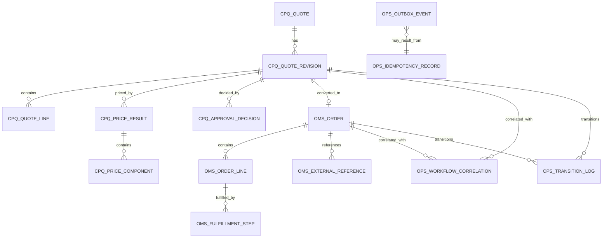

# Part 014 — PostgreSQL Data Model for CPQ/OMS

Data model CPQ/OMS tidak boleh dimulai dari entity Java.

Ia harus dimulai dari pertanyaan:

> Kebenaran apa yang harus tetap bisa dibuktikan saat sistem sudah berjalan bertahun-tahun?

Dalam CPQ/OMS enterprise, database bukan sekadar tempat menyimpan object. Database adalah **evidence store**, **concurrency boundary**, **integrity guard**, dan **operational recovery foundation**.

JPA/EclipseLink membantu mapping dan persistence. Tetapi model data tidak boleh diserahkan sepenuhnya ke ORM.

ORM mengoptimalkan developer experience.

Database schema mengoptimalkan correctness, auditability, queryability, recovery, dan long-term evolution.

Kalau dua hal itu bertabrakan, production-grade system memilih correctness.

---

## 1. Prinsip Utama Data Model CPQ/OMS

### 1.1 Source of Truth Harus Jelas

Untuk setiap data, tanyakan:

```text
Siapa owner-nya?
Apakah ini current state atau historical evidence?
Apakah boleh berubah?
Apakah harus bisa direproduksi?
Apakah harus bisa dicari operator?
Apakah harus ikut event?
Apakah boleh disimpan sebagai snapshot?
```

Tanpa jawaban itu, schema akan berubah menjadi campuran random antara normalized table, JSON blob, audit log, dan read model.

### 1.2 Normalize Core, Snapshot Evidence

Rule praktis:

| Data Type | Storage Shape |
|---|---|
| Lifecycle state | normalized columns + constraints |
| Identity and references | normalized FK/unique indexes |
| Quote/order line structure | normalized enough for query and integrity |
| Price components | normalized because searchable/auditable |
| Approval decision | normalized because compliance-sensitive |
| External payload | JSONB snapshot with envelope |
| Product/config/pricing input snapshot | JSONB snapshot plus version references |
| UI read model | projection table, not source of truth |
| Workflow variables | correlation table + process history, not domain truth |

Jangan ekstrem.

Semuanya normalized akan membuat schema rapuh terhadap variasi product catalog.

Semuanya JSONB akan membuat query, constraint, audit, dan migration sulit.

Production CPQ/OMS butuh kombinasi yang sadar batas.

### 1.3 Immutable Evidence Lebih Penting daripada Update Mudah

Quote revision yang sudah accepted harus immutable.

Price result yang sudah dipakai approval harus immutable.

Approval decision harus immutable.

Order fulfillment evidence harus immutable atau append-only.

Kalau ada koreksi, jangan overwrite evidence lama. Buat correction event/record.

### 1.4 Database Constraint adalah Defense Layer

Application guard penting, tapi tidak cukup.

Race condition, bug deployment, manual operation, dan integration retry bisa melewati asumsi aplikasi.

PostgreSQL harus menjaga invariant kritikal seperti:

- satu current revision per quote,
- satu primary order per accepted quote revision,
- status hanya dari set valid,
- accepted quote punya accepted timestamp,
- order completed punya completed timestamp,
- outbox event punya aggregate identity,
- idempotency key unik dalam scope.

---

## 2. Schema Boundary

Untuk seri ini, kita gunakan schema logis berikut.

```text
cpq       -> quote, quote line, price, approval, product/config snapshots
oms       -> order, order line, fulfillment plan, external reference
ops       -> outbox, idempotency, transition log, audit log, workflow correlation
ref       -> controlled reference data if owned locally
```

Dalam microservices nyata, schema ini bisa berada di database berbeda per service.

Untuk pembelajaran build-from-scratch, satu PostgreSQL instance dengan schema terpisah membantu memahami boundary tanpa mengaburkan model.

Jangan salah tafsir:

> Satu PostgreSQL instance untuk learning/reference implementation tidak berarti semua service bebas join lintas schema di production.

Service owner tetap harus dihormati.

---

## 3. High-Level ERD



ERD ini menunjukkan prinsip, bukan semua kolom.

Yang penting:

- quote punya revision,
- revision punya line/price/approval evidence,
- order berasal dari accepted quote revision,
- order punya line dan fulfillment step,
- workflow correlation terpisah,
- transition/audit/outbox adalah infrastructure evidence yang mengikat lifecycle.

---

## 4. Identity Strategy

Gunakan identifier yang stabil dan tidak bergantung sequence bisnis.

Contoh:

| Entity | ID | Human Number |
|---|---|---|
| Quote | `quote_id UUID` | `quote_number` |
| Quote Revision | `quote_revision_id UUID` | `revision_number` |
| Quote Line | `quote_line_id UUID` | `line_number` |
| Order | `order_id UUID` | `order_number` |
| Order Line | `order_line_id UUID` | `line_number` |
| Price Result | `price_result_id UUID` | none or computed display |
| Approval Decision | `approval_decision_id UUID` | none |

Jangan jadikan display number sebagai primary key.

Display number punya format, reset, tenant policy, migration issue, dan human readability concern.

Primary key harus stabil.

Display number harus unique sesuai policy.

---

## 5. Quote Tables

### 5.1 `cpq_quote`

`cpq_quote` adalah parent identity. Ia menyimpan current pointer dan metadata umum.

```sql
CREATE TABLE cpq_quote (
    quote_id UUID PRIMARY KEY,
    tenant_id UUID NOT NULL,
    quote_number TEXT NOT NULL,
    customer_id UUID NOT NULL,
    current_revision_id UUID NULL,
    lifecycle_status TEXT NOT NULL,
    created_by TEXT NOT NULL,
    created_at TIMESTAMPTZ NOT NULL,
    updated_at TIMESTAMPTZ NOT NULL,
    version BIGINT NOT NULL DEFAULT 0,

    CONSTRAINT uq_quote_number_per_tenant UNIQUE (tenant_id, quote_number),
    CONSTRAINT chk_quote_lifecycle_status CHECK (lifecycle_status IN (
        'ACTIVE', 'ACCEPTED', 'CONVERTED_TO_ORDER', 'EXPIRED', 'CANCELLED'
    ))
);
```

Kenapa ada `lifecycle_status` di parent quote kalau revision juga punya status?

Karena parent quote menjawab pertanyaan:

> Secara keseluruhan, quote ini masih aktif atau sudah selesai?

Revision menjawab:

> Revision tertentu berada di state apa?

Ini membantu query operational tanpa selalu mencari revision terakhir.

Tetapi parent status harus dijaga agar konsisten dengan current revision.

### 5.2 `cpq_quote_revision`

Quote revision adalah evidence boundary.

```sql
CREATE TABLE cpq_quote_revision (
    quote_revision_id UUID PRIMARY KEY,
    quote_id UUID NOT NULL REFERENCES cpq_quote(quote_id),
    tenant_id UUID NOT NULL,
    revision_number INTEGER NOT NULL,
    status TEXT NOT NULL,
    catalog_version_ref TEXT NOT NULL,
    currency_code CHAR(3) NOT NULL,
    valid_from TIMESTAMPTZ NOT NULL,
    valid_until TIMESTAMPTZ NULL,
    current_price_result_id UUID NULL,
    accepted_at TIMESTAMPTZ NULL,
    converted_order_id UUID NULL,
    frozen BOOLEAN NOT NULL DEFAULT FALSE,
    created_by TEXT NOT NULL,
    created_at TIMESTAMPTZ NOT NULL,
    updated_at TIMESTAMPTZ NOT NULL,
    version BIGINT NOT NULL DEFAULT 0,

    CONSTRAINT uq_quote_revision_number UNIQUE (quote_id, revision_number),
    CONSTRAINT chk_quote_revision_status CHECK (status IN (
        'DRAFT',
        'CONFIGURED',
        'PRICED',
        'APPROVAL_REQUIRED',
        'APPROVAL_IN_PROGRESS',
        'APPROVED',
        'REJECTED',
        'ACCEPTED',
        'CONVERTED_TO_ORDER',
        'EXPIRED',
        'CANCELLED'
    )),
    CONSTRAINT chk_quote_validity_window CHECK (
        valid_until IS NULL OR valid_until > valid_from
    ),
    CONSTRAINT chk_quote_accepted_at CHECK (
        (status = 'ACCEPTED' AND accepted_at IS NOT NULL)
        OR
        (status <> 'ACCEPTED')
    )
);
```

Catatan desain:

- `tenant_id` diduplikasi untuk query isolation dan index locality.
- `catalog_version_ref` disimpan sebagai reference string agar quote lama tetap bisa dijelaskan walau catalog service berubah.
- `frozen` membantu enforce mutability policy di application layer.
- `version` untuk optimistic concurrency.

### 5.3 Current Revision Pointer

`cpq_quote.current_revision_id` sebaiknya diberi foreign key setelah kedua table dibuat.

```sql
ALTER TABLE cpq_quote
ADD CONSTRAINT fk_quote_current_revision
FOREIGN KEY (current_revision_id)
REFERENCES cpq_quote_revision(quote_revision_id);
```

Tetapi hati-hati: circular reference bisa menyulitkan insert awal.

Approach umum:

1. insert quote tanpa current revision,
2. insert revision,
3. update quote current revision.

Semua dalam satu transaction.

### 5.4 Unique Current Revision per Quote

Ada dua cara:

1. pointer `current_revision_id` di parent,
2. `is_current` boolean di revision dengan partial unique index.

Untuk query tertentu, `is_current` berguna:

```sql
ALTER TABLE cpq_quote_revision
ADD COLUMN is_current BOOLEAN NOT NULL DEFAULT FALSE;

CREATE UNIQUE INDEX uq_one_current_revision_per_quote
ON cpq_quote_revision(quote_id)
WHERE is_current = TRUE;
```

Kalau memakai dua-duanya, pastikan application service menjaga konsistensi.

Untuk sistem awal, pilih salah satu. Jangan over-model.

---

## 6. Quote Line Model

Quote line bukan sekadar list item.

Ia bisa tree:

- bundle parent,
- child option,
- add-on,
- dependency line,
- discount line,
- generated line.

```sql
CREATE TABLE cpq_quote_line (
    quote_line_id UUID PRIMARY KEY,
    quote_revision_id UUID NOT NULL REFERENCES cpq_quote_revision(quote_revision_id),
    tenant_id UUID NOT NULL,
    parent_quote_line_id UUID NULL REFERENCES cpq_quote_line(quote_line_id),
    line_number TEXT NOT NULL,
    line_type TEXT NOT NULL,
    action_type TEXT NOT NULL,
    product_offering_id TEXT NOT NULL,
    product_spec_id TEXT NULL,
    quantity NUMERIC(18, 6) NOT NULL,
    configuration_snapshot JSONB NOT NULL,
    eligibility_snapshot JSONB NULL,
    created_at TIMESTAMPTZ NOT NULL,
    updated_at TIMESTAMPTZ NOT NULL,
    version BIGINT NOT NULL DEFAULT 0,

    CONSTRAINT uq_quote_line_number UNIQUE (quote_revision_id, line_number),
    CONSTRAINT chk_quote_line_type CHECK (line_type IN (
        'PRIMARY', 'BUNDLE', 'OPTION', 'ADDON', 'DISCOUNT', 'SYSTEM_GENERATED'
    )),
    CONSTRAINT chk_quote_line_action CHECK (action_type IN (
        'ADD', 'CHANGE', 'REMOVE', 'KEEP'
    )),
    CONSTRAINT chk_quote_line_quantity CHECK (quantity > 0)
);
```

### 6.1 Kenapa Configuration Snapshot di Line?

Karena konfigurasi sering berbeda per line.

Line bisa punya:

- selected attributes,
- option choices,
- eligibility proof,
- rule evaluation result,
- catalog characteristic references.

Tetapi jangan semua hal menjadi JSONB.

Kolom yang sering difilter harus dinormalisasi:

- `product_offering_id`,
- `line_type`,
- `action_type`,
- `parent_quote_line_id`,
- `quantity`.

Snapshot digunakan untuk evidence detail.

### 6.2 Tree Integrity

PostgreSQL FK bisa menjaga parent exists, tapi tidak otomatis mencegah cycle pada adjacency list.

Cycle prevention biasanya dilakukan di domain service atau recursive check trigger kalau benar-benar diperlukan.

Untuk CPQ, cycle harus dicegah di configuration engine sebelum line disimpan.

---

## 7. Price Tables

Pricing harus evidence-rich.

### 7.1 `cpq_price_result`

```sql
CREATE TABLE cpq_price_result (
    price_result_id UUID PRIMARY KEY,
    quote_revision_id UUID NOT NULL REFERENCES cpq_quote_revision(quote_revision_id),
    tenant_id UUID NOT NULL,
    pricing_run_id TEXT NOT NULL,
    price_book_ref TEXT NOT NULL,
    pricing_rule_version TEXT NOT NULL,
    rounding_policy_ref TEXT NOT NULL,
    currency_code CHAR(3) NOT NULL,
    subtotal_amount NUMERIC(19, 4) NOT NULL,
    discount_amount NUMERIC(19, 4) NOT NULL DEFAULT 0,
    tax_estimate_amount NUMERIC(19, 4) NULL,
    total_amount NUMERIC(19, 4) NOT NULL,
    approval_required BOOLEAN NOT NULL DEFAULT FALSE,
    approval_reason_snapshot JSONB NULL,
    input_snapshot JSONB NOT NULL,
    trace_snapshot JSONB NOT NULL,
    created_by TEXT NOT NULL,
    created_at TIMESTAMPTZ NOT NULL,

    CONSTRAINT uq_pricing_run UNIQUE (tenant_id, pricing_run_id),
    CONSTRAINT chk_price_amounts_non_negative CHECK (
        subtotal_amount >= 0
        AND discount_amount >= 0
        AND total_amount >= 0
    )
);
```

Kenapa ada `input_snapshot` dan `trace_snapshot`?

- `input_snapshot` menjawab input apa yang dipakai pricing.
- `trace_snapshot` menjawab bagaimana hasil dihitung.

Tanpa trace, pricing engine tidak defensible.

### 7.2 `cpq_price_component`

```sql
CREATE TABLE cpq_price_component (
    price_component_id UUID PRIMARY KEY,
    price_result_id UUID NOT NULL REFERENCES cpq_price_result(price_result_id),
    quote_line_id UUID NULL REFERENCES cpq_quote_line(quote_line_id),
    tenant_id UUID NOT NULL,
    component_type TEXT NOT NULL,
    charge_type TEXT NOT NULL,
    description TEXT NOT NULL,
    amount NUMERIC(19, 4) NOT NULL,
    currency_code CHAR(3) NOT NULL,
    sort_order INTEGER NOT NULL,
    source_rule_ref TEXT NULL,
    override_reason TEXT NULL,
    created_at TIMESTAMPTZ NOT NULL,

    CONSTRAINT chk_price_component_type CHECK (component_type IN (
        'BASE_PRICE', 'DISCOUNT', 'SURCHARGE', 'TAX_ESTIMATE', 'MANUAL_OVERRIDE', 'ROUNDING_ADJUSTMENT'
    )),
    CONSTRAINT chk_charge_type CHECK (charge_type IN (
        'ONE_TIME', 'RECURRING', 'USAGE', 'DEPOSIT'
    ))
);
```

Price component dinormalisasi karena sering dipakai untuk:

- audit,
- dispute,
- explain price,
- approval analysis,
- reporting discount,
- debugging pricing result.

---

## 8. Approval Tables

Approval bukan boolean.

Approval adalah decision evidence.

```sql
CREATE TABLE cpq_approval_decision (
    approval_decision_id UUID PRIMARY KEY,
    quote_revision_id UUID NOT NULL REFERENCES cpq_quote_revision(quote_revision_id),
    price_result_id UUID NOT NULL REFERENCES cpq_price_result(price_result_id),
    tenant_id UUID NOT NULL,
    approval_level TEXT NOT NULL,
    decision TEXT NOT NULL,
    decision_reason_code TEXT NULL,
    decision_reason_text TEXT NULL,
    actor_id TEXT NOT NULL,
    actor_display_name TEXT NULL,
    authority_snapshot JSONB NOT NULL,
    decided_at TIMESTAMPTZ NOT NULL,
    process_instance_id TEXT NULL,
    task_id TEXT NULL,

    CONSTRAINT chk_approval_decision CHECK (decision IN (
        'APPROVED', 'REJECTED', 'REQUEST_CHANGES'
    ))
);
```

`authority_snapshot` penting.

Kalau approval authority user berubah bulan depan, approval lama tetap harus bisa dijelaskan berdasarkan authority saat decision terjadi.

### 8.1 Approval Request vs Approval Decision

Untuk approval kompleks, pisahkan:

- `approval_request`,
- `approval_decision`.

Untuk seri ini, `approval_decision` cukup sebagai awal. Part Camunda/DMN nanti akan memperdalam approval process.

---

## 9. Order Tables

### 9.1 `oms_order`

```sql
CREATE TABLE oms_order (
    order_id UUID PRIMARY KEY,
    tenant_id UUID NOT NULL,
    order_number TEXT NOT NULL,
    order_type TEXT NOT NULL,
    source_quote_revision_id UUID NULL REFERENCES cpq_quote_revision(quote_revision_id),
    customer_id UUID NOT NULL,
    status TEXT NOT NULL,
    submitted_at TIMESTAMPTZ NOT NULL,
    completed_at TIMESTAMPTZ NULL,
    cancelled_at TIMESTAMPTZ NULL,
    fallout_reason_code TEXT NULL,
    fallout_reason_text TEXT NULL,
    created_by TEXT NOT NULL,
    created_at TIMESTAMPTZ NOT NULL,
    updated_at TIMESTAMPTZ NOT NULL,
    version BIGINT NOT NULL DEFAULT 0,

    CONSTRAINT uq_order_number_per_tenant UNIQUE (tenant_id, order_number),
    CONSTRAINT chk_order_type CHECK (order_type IN (
        'PRIMARY', 'AMENDMENT', 'CANCELLATION', 'RENEWAL', 'ADMINISTRATIVE'
    )),
    CONSTRAINT chk_order_status CHECK (status IN (
        'RECEIVED',
        'VALIDATING',
        'REJECTED',
        'DECOMPOSING',
        'READY_FOR_FULFILLMENT',
        'FULFILLING',
        'PARTIALLY_FULFILLED',
        'COMPLETED',
        'CANCELLATION_REQUESTED',
        'CANCELLING',
        'CANCELLED',
        'FALLOUT'
    )),
    CONSTRAINT chk_order_completed_at CHECK (
        (status = 'COMPLETED' AND completed_at IS NOT NULL)
        OR
        (status <> 'COMPLETED')
    ),
    CONSTRAINT chk_order_cancelled_at CHECK (
        (status = 'CANCELLED' AND cancelled_at IS NOT NULL)
        OR
        (status <> 'CANCELLED')
    )
);
```

### 9.2 One Primary Order per Quote Revision

```sql
CREATE UNIQUE INDEX uq_primary_order_per_quote_revision
ON oms_order(source_quote_revision_id)
WHERE source_quote_revision_id IS NOT NULL
  AND order_type = 'PRIMARY';
```

Ini constraint penting.

Application idempotency bisa gagal karena race. Unique partial index menjadi safety net.

### 9.3 `oms_order_line`

```sql
CREATE TABLE oms_order_line (
    order_line_id UUID PRIMARY KEY,
    order_id UUID NOT NULL REFERENCES oms_order(order_id),
    tenant_id UUID NOT NULL,
    parent_order_line_id UUID NULL REFERENCES oms_order_line(order_line_id),
    source_quote_line_id UUID NULL REFERENCES cpq_quote_line(quote_line_id),
    line_number TEXT NOT NULL,
    line_type TEXT NOT NULL,
    action_type TEXT NOT NULL,
    product_offering_id TEXT NOT NULL,
    fulfillment_group TEXT NULL,
    status TEXT NOT NULL,
    quantity NUMERIC(18, 6) NOT NULL,
    order_line_snapshot JSONB NOT NULL,
    created_at TIMESTAMPTZ NOT NULL,
    updated_at TIMESTAMPTZ NOT NULL,
    version BIGINT NOT NULL DEFAULT 0,

    CONSTRAINT uq_order_line_number UNIQUE (order_id, line_number),
    CONSTRAINT chk_order_line_type CHECK (line_type IN (
        'PRIMARY', 'BUNDLE', 'OPTION', 'ADDON', 'SYSTEM_GENERATED'
    )),
    CONSTRAINT chk_order_line_action CHECK (action_type IN (
        'ADD', 'CHANGE', 'REMOVE', 'KEEP'
    )),
    CONSTRAINT chk_order_line_status CHECK (status IN (
        'PENDING', 'READY', 'IN_PROGRESS', 'COMPLETED', 'CANCELLED', 'FAILED', 'SKIPPED'
    )),
    CONSTRAINT chk_order_line_quantity CHECK (quantity > 0)
);
```

Order line tidak boleh hanya copy quote line mentah.

Order line adalah fulfillment obligation. Ia boleh punya field tambahan:

- fulfillment group,
- provisioning metadata,
- external references,
- technical decomposition,
- action type.

Tetapi trace ke quote line tetap penting.

---

## 10. Fulfillment Step Tables

External systems jarang atomic.

Order line bisa butuh banyak step:

- reserve inventory,
- create account,
- provision service,
- schedule installation,
- activate subscription,
- notify billing.

```sql
CREATE TABLE oms_fulfillment_step (
    fulfillment_step_id UUID PRIMARY KEY,
    order_id UUID NOT NULL REFERENCES oms_order(order_id),
    order_line_id UUID NULL REFERENCES oms_order_line(order_line_id),
    tenant_id UUID NOT NULL,
    step_type TEXT NOT NULL,
    target_system TEXT NOT NULL,
    external_correlation_key TEXT NOT NULL,
    status TEXT NOT NULL,
    attempt_count INTEGER NOT NULL DEFAULT 0,
    last_attempt_at TIMESTAMPTZ NULL,
    completed_at TIMESTAMPTZ NULL,
    failed_at TIMESTAMPTZ NULL,
    failure_code TEXT NULL,
    failure_message TEXT NULL,
    request_snapshot JSONB NULL,
    response_snapshot JSONB NULL,
    created_at TIMESTAMPTZ NOT NULL,
    updated_at TIMESTAMPTZ NOT NULL,
    version BIGINT NOT NULL DEFAULT 0,

    CONSTRAINT uq_fulfillment_external_key UNIQUE (target_system, external_correlation_key),
    CONSTRAINT chk_fulfillment_status CHECK (status IN (
        'PENDING', 'SENT', 'ACKNOWLEDGED', 'COMPLETED', 'FAILED', 'UNKNOWN_OUTCOME', 'CANCELLED', 'COMPENSATED'
    )),
    CONSTRAINT chk_fulfillment_attempt_count CHECK (attempt_count >= 0)
);
```

`UNKNOWN_OUTCOME` adalah state penting.

Kalau external call timeout setelah request dikirim, sistem tidak tahu external system berhasil atau gagal.

Jangan langsung retry create request tanpa external correlation key.

Itu bisa membuat duplicate fulfillment.

---

## 11. External Reference Tables

External systems punya ID sendiri.

Jangan simpan semua external ID dalam satu kolom random.

```sql
CREATE TABLE oms_external_reference (
    external_reference_id UUID PRIMARY KEY,
    order_id UUID NOT NULL REFERENCES oms_order(order_id),
    order_line_id UUID NULL REFERENCES oms_order_line(order_line_id),
    tenant_id UUID NOT NULL,
    external_system TEXT NOT NULL,
    external_entity_type TEXT NOT NULL,
    external_entity_id TEXT NOT NULL,
    relationship_type TEXT NOT NULL,
    created_at TIMESTAMPTZ NOT NULL,

    CONSTRAINT uq_external_reference UNIQUE (
        external_system,
        external_entity_type,
        external_entity_id,
        relationship_type
    )
);
```

Ini membantu reconciliation:

- cari order dari external provisioning id,
- cari billing account dari order,
- cari CRM case dari fallout,
- cari fulfillment request dari callback.

---

## 12. Workflow Correlation Table

Camunda 7 process instance harus bisa dikorelasikan ke domain object.

```sql
CREATE TABLE ops_workflow_correlation (
    workflow_correlation_id UUID PRIMARY KEY,
    tenant_id UUID NOT NULL,
    aggregate_type TEXT NOT NULL,
    aggregate_id UUID NOT NULL,
    business_key TEXT NOT NULL,
    process_definition_key TEXT NOT NULL,
    process_definition_version INTEGER NULL,
    process_instance_id TEXT NOT NULL,
    root_process_instance_id TEXT NULL,
    status TEXT NOT NULL,
    started_at TIMESTAMPTZ NOT NULL,
    ended_at TIMESTAMPTZ NULL,
    last_activity_id TEXT NULL,
    last_domain_event_id UUID NULL,
    correlation_id TEXT NOT NULL,

    CONSTRAINT uq_process_instance UNIQUE (process_instance_id),
    CONSTRAINT chk_workflow_correlation_status CHECK (status IN (
        'RUNNING', 'COMPLETED', 'TERMINATED', 'INCIDENT', 'SUSPENDED'
    ))
);

CREATE INDEX ix_workflow_correlation_aggregate
ON ops_workflow_correlation(aggregate_type, aggregate_id);
```

Mengapa tidak cukup mengandalkan Camunda history table?

Karena domain service dan operation dashboard butuh correlation yang stabil tanpa harus join langsung ke internal engine tables.

Camunda history berguna. Tetapi domain observability butuh model sendiri.

---

## 13. Transition Log

Transition log adalah catatan formal state movement.

```sql
CREATE TABLE ops_transition_log (
    transition_id UUID PRIMARY KEY,
    tenant_id UUID NOT NULL,
    aggregate_type TEXT NOT NULL,
    aggregate_id UUID NOT NULL,
    aggregate_version_before BIGINT NOT NULL,
    aggregate_version_after BIGINT NOT NULL,
    from_state TEXT NULL,
    to_state TEXT NOT NULL,
    command_type TEXT NOT NULL,
    command_id UUID NOT NULL,
    actor_type TEXT NOT NULL,
    actor_id TEXT NOT NULL,
    reason_code TEXT NULL,
    reason_text TEXT NULL,
    correlation_id TEXT NOT NULL,
    occurred_at TIMESTAMPTZ NOT NULL,

    CONSTRAINT uq_transition_command UNIQUE (aggregate_type, aggregate_id, command_id)
);

CREATE INDEX ix_transition_log_aggregate
ON ops_transition_log(aggregate_type, aggregate_id, occurred_at DESC);
```

Transition log menjawab:

```text
Bagaimana quote/order sampai ke state ini?
```

Audit log menjawab:

```text
Siapa melakukan apa dan evidence apa yang ditinggalkan?
```

Keduanya overlap, tapi bukan sama.

---

## 14. Audit Log

Audit log lebih luas dari transition log.

```sql
CREATE TABLE ops_audit_log (
    audit_id UUID PRIMARY KEY,
    tenant_id UUID NOT NULL,
    aggregate_type TEXT NOT NULL,
    aggregate_id UUID NOT NULL,
    action_type TEXT NOT NULL,
    actor_type TEXT NOT NULL,
    actor_id TEXT NOT NULL,
    actor_display_name TEXT NULL,
    source_ip TEXT NULL,
    user_agent TEXT NULL,
    before_snapshot JSONB NULL,
    after_snapshot JSONB NULL,
    evidence_snapshot JSONB NULL,
    correlation_id TEXT NOT NULL,
    occurred_at TIMESTAMPTZ NOT NULL
);

CREATE INDEX ix_audit_log_aggregate
ON ops_audit_log(aggregate_type, aggregate_id, occurred_at DESC);

CREATE INDEX ix_audit_log_actor
ON ops_audit_log(actor_id, occurred_at DESC);
```

Audit log tidak boleh menjadi dumping ground semua payload.

Simpan evidence yang menjawab pertanyaan audit:

- siapa,
- melakukan apa,
- kapan,
- melalui channel apa,
- terhadap entity apa,
- dengan alasan apa,
- sebelum/sesudah apa,
- berdasarkan authority/policy apa.

---

## 15. Outbox Table

Kafka publish harus keluar dari committed database state.

Transactional outbox memberi pattern:

1. domain transaction mengubah aggregate,
2. domain transaction insert outbox event,
3. publisher terpisah membaca outbox,
4. publisher mengirim ke Kafka,
5. publisher menandai event published.

```sql
CREATE TABLE ops_outbox_event (
    outbox_event_id UUID PRIMARY KEY,
    tenant_id UUID NOT NULL,
    aggregate_type TEXT NOT NULL,
    aggregate_id UUID NOT NULL,
    aggregate_version BIGINT NOT NULL,
    event_type TEXT NOT NULL,
    event_version INTEGER NOT NULL,
    event_key TEXT NOT NULL,
    payload JSONB NOT NULL,
    headers JSONB NOT NULL,
    correlation_id TEXT NOT NULL,
    causation_id TEXT NULL,
    command_id UUID NULL,
    status TEXT NOT NULL DEFAULT 'PENDING',
    created_at TIMESTAMPTZ NOT NULL,
    published_at TIMESTAMPTZ NULL,
    publish_attempt_count INTEGER NOT NULL DEFAULT 0,
    last_publish_error TEXT NULL,

    CONSTRAINT chk_outbox_status CHECK (status IN (
        'PENDING', 'PUBLISHING', 'PUBLISHED', 'FAILED', 'DEAD'
    )),
    CONSTRAINT chk_outbox_attempt_count CHECK (publish_attempt_count >= 0)
);

CREATE INDEX ix_outbox_pending
ON ops_outbox_event(created_at)
WHERE status = 'PENDING';

CREATE UNIQUE INDEX uq_outbox_event_per_aggregate_version_type
ON ops_outbox_event(aggregate_type, aggregate_id, aggregate_version, event_type);
```

### 15.1 Event Key

Untuk Kafka partitioning, event key biasanya:

```text
quoteId
quoteRevisionId
orderId
```

Pilih key sesuai aggregate ordering yang dibutuhkan.

Kalau semua order event harus ordered per order, gunakan `orderId`.

Kalau quote lifecycle event harus ordered per quote revision, gunakan `quoteRevisionId`.

---

## 16. Idempotency Table

Idempotency harus persisted.

Redis bisa membantu fast lookup, tapi PostgreSQL harus menjadi source of truth untuk command yang menciptakan irreversible side effect.

```sql
CREATE TABLE ops_idempotency_record (
    idempotency_record_id UUID PRIMARY KEY,
    tenant_id UUID NOT NULL,
    idempotency_scope TEXT NOT NULL,
    idempotency_key TEXT NOT NULL,
    command_id UUID NOT NULL,
    command_type TEXT NOT NULL,
    request_hash TEXT NOT NULL,
    status TEXT NOT NULL,
    aggregate_type TEXT NULL,
    aggregate_id UUID NULL,
    response_snapshot JSONB NULL,
    error_snapshot JSONB NULL,
    created_at TIMESTAMPTZ NOT NULL,
    completed_at TIMESTAMPTZ NULL,
    expires_at TIMESTAMPTZ NULL,

    CONSTRAINT uq_idempotency_key UNIQUE (
        tenant_id,
        idempotency_scope,
        idempotency_key
    ),
    CONSTRAINT chk_idempotency_status CHECK (status IN (
        'STARTED', 'COMPLETED', 'FAILED_RETRYABLE', 'FAILED_FINAL'
    ))
);
```

### 16.1 Request Hash

Kalau key sama dipakai untuk payload berbeda, sistem harus menolak.

Contoh:

```text
idempotencyKey: quoteRevisionId:convert-to-order
requestHash A: convert quote X to primary order
requestHash B: convert quote X to amendment order
```

Key sama, payload beda. Itu bukan replay aman. Itu conflict.

---

## 17. Index Strategy by Access Pattern

Jangan membuat index karena “mungkin nanti butuh”.

Mulai dari access pattern.

### 17.1 Quote Access Patterns

| Query | Index |
|---|---|
| find quote by tenant + quote number | `(tenant_id, quote_number)` unique |
| list active quotes by customer | `(tenant_id, customer_id, lifecycle_status, updated_at DESC)` |
| get current revision | parent pointer or partial current revision index |
| list quote revisions | `(quote_id, revision_number DESC)` |
| find expiring quotes | `(valid_until)` where active statuses |

Example:

```sql
CREATE INDEX ix_quote_customer_active
ON cpq_quote(tenant_id, customer_id, updated_at DESC)
WHERE lifecycle_status = 'ACTIVE';

CREATE INDEX ix_quote_revision_expirable
ON cpq_quote_revision(valid_until)
WHERE status IN (
    'DRAFT', 'CONFIGURED', 'PRICED', 'APPROVAL_REQUIRED', 'APPROVAL_IN_PROGRESS', 'APPROVED'
)
AND valid_until IS NOT NULL;
```

### 17.2 Order Access Patterns

| Query | Index |
|---|---|
| find order by tenant + order number | `(tenant_id, order_number)` unique |
| list orders by customer | `(tenant_id, customer_id, submitted_at DESC)` |
| find active fulfillment orders | partial index by active statuses |
| find fallout orders | partial index where status = `FALLOUT` |
| callback by external correlation | unique target system + external key |

Example:

```sql
CREATE INDEX ix_order_customer_recent
ON oms_order(tenant_id, customer_id, submitted_at DESC);

CREATE INDEX ix_order_fallout
ON oms_order(tenant_id, updated_at DESC)
WHERE status = 'FALLOUT';

CREATE INDEX ix_order_active_fulfillment
ON oms_order(tenant_id, updated_at DESC)
WHERE status IN (
    'READY_FOR_FULFILLMENT', 'FULFILLING', 'PARTIALLY_FULFILLED', 'CANCELLATION_REQUESTED', 'CANCELLING'
);
```

### 17.3 Foreign Key Index Discipline

Primary key and unique constraints create indexes on the referenced side.

But high-write child tables still usually need indexes on foreign key columns for joins, deletes, and operational queries.

Examples:

```sql
CREATE INDEX ix_quote_revision_quote
ON cpq_quote_revision(quote_id);

CREATE INDEX ix_quote_line_revision
ON cpq_quote_line(quote_revision_id);

CREATE INDEX ix_price_result_revision
ON cpq_price_result(quote_revision_id);

CREATE INDEX ix_order_line_order
ON oms_order_line(order_id);

CREATE INDEX ix_fulfillment_step_order
ON oms_fulfillment_step(order_id);
```

Index child FKs intentionally. Do not rely on wishful thinking.

---

## 18. JSONB Boundary

JSONB berguna, tapi berbahaya jika dipakai sebagai tempat kabur dari modeling.

Gunakan JSONB untuk:

- immutable input snapshot,
- rule trace,
- external request/response snapshot,
- authority snapshot,
- evidence detail,
- schema-versioned payload.

Jangan gunakan JSONB untuk:

- lifecycle status,
- amount utama,
- customer id,
- quote/order id,
- line relationship,
- field yang sering dicari,
- invariant yang harus dijaga constraint.

### 18.1 Snapshot Envelope

Setiap JSONB snapshot sebaiknya punya envelope:

```json
{
  "schemaName": "quote.configuration.snapshot",
  "schemaVersion": 3,
  "capturedAt": "2026-07-02T10:15:30Z",
  "source": "configuration-service",
  "data": {
    "productOfferingId": "PO-FIBER-1G",
    "selectedOptions": [],
    "attributes": {}
  }
}
```

Tanpa schema version, JSONB akan menjadi legacy blob yang sulit dimigrasikan.

---

## 19. Monetary Amounts

Jangan simpan uang sebagai floating point.

Gunakan `NUMERIC(19,4)` atau precision sesuai domain.

```sql
amount NUMERIC(19, 4) NOT NULL,
currency_code CHAR(3) NOT NULL
```

Rounding policy harus explicit.

Untuk recurring/usage billing, CPQ price mungkin bukan final invoice amount. Jangan mencampur estimate, commitment, dan actual billing.

---

## 20. Temporal Modeling

CPQ sangat bergantung pada waktu:

- quote validity,
- catalog effective date,
- price book validity,
- promotion window,
- approval SLA,
- order submitted time,
- fulfillment due date,
- cancellation window.

Minimal field:

```text
valid_from
valid_until
created_at
updated_at
accepted_at
submitted_at
completed_at
cancelled_at
```

Gunakan `TIMESTAMPTZ`, bukan timestamp naive.

Application tetap harus menyepakati timezone display, tapi database menyimpan instant yang jelas.

---

## 21. Multi-Tenancy Columns

Hampir semua table membawa `tenant_id`.

Alasannya:

- query isolation,
- index locality,
- authorization guard,
- bulk export/delete policy,
- operational troubleshooting,
- future sharding/partitioning possibility.

Tetapi `tenant_id` bukan pengganti authorization.

Application tetap harus memastikan actor boleh mengakses tenant tersebut.

### 21.1 Tenant Mismatch Guard

FK biasa tidak selalu memastikan tenant match antar table kalau FK hanya ke UUID.

Untuk invariant tenant kuat, bisa gunakan composite unique key:

```sql
ALTER TABLE cpq_quote_revision
ADD CONSTRAINT uq_quote_revision_tenant_pair
UNIQUE (tenant_id, quote_revision_id);
```

Lalu child table bisa FK ke `(tenant_id, quote_revision_id)`.

Ini lebih ketat, tapi membuat schema lebih verbose.

Gunakan untuk boundary yang benar-benar perlu hard isolation.

---

## 22. Partitioning Candidate

Jangan langsung partition semua table.

Candidate table untuk partitioning:

- `ops_audit_log`,
- `ops_transition_log`,
- `ops_outbox_event` jika volume tinggi,
- fulfillment history,
- event inbox/consumer dedupe table.

Partitioning biasanya berdasarkan waktu dan/atau tenant.

Tapi partitioning menambah complexity:

- migration lebih sulit,
- index management lebih banyak,
- query planning perlu diperhatikan,
- retention job harus sadar partition.

Rule:

> Partition because access pattern and retention require it, not because table sounds enterprise.

---

## 23. Data Retention and Purging

CPQ/OMS menyimpan commercial evidence. Jangan asal purge.

Bedakan:

| Data | Retention Direction |
|---|---|
| Quote/order core | long retention, policy-based archive |
| Audit log | compliance retention |
| Outbox published event | shorter retention after safe publish/replay window |
| Idempotency record | TTL per command class |
| Workflow correlation | retain while process/history relevant |
| External payload snapshots | may require redaction policy |

Purging harus mempertahankan referential integrity dan audit defensibility.

---

## 24. ORM/EclipseLink Mapping Implications

Karena Part 015 akan membahas EclipseLink JPA, di sini cukup pegang prinsipnya.

### 24.1 Do Not Let ORM Generate Production Schema Blindly

DDL auto-generation boleh membantu local dev awal, tapi production schema harus migration-controlled.

Schema adalah kontrak jangka panjang.

### 24.2 Aggregate Loading Harus Sadar Size

Quote dengan ribuan line dan price component tidak boleh selalu diload seluruh graph.

Pisahkan repository method:

```text
getQuoteHeaderForCommand
getQuoteRevisionForPricing
getQuoteRevisionForApproval
getQuoteRevisionSnapshotForDocument
getOrderForFulfillmentCommand
getOrderSearchProjection
```

JPA mapping yang terlalu nyaman bisa menciptakan accidental huge graph load.

### 24.3 Version Column

Setiap aggregate root mutatable butuh `version`.

EclipseLink/JPA bisa memakai optimistic locking, tetapi domain command tetap harus membawa expected version agar conflict semantic jelas di API.

---

## 25. Migration Safety

Data model CPQ/OMS akan berubah.

Aman bukan berarti tidak berubah. Aman berarti perubahan kompatibel dan bisa di-roll forward/backward secara terkendali.

Safe migration pattern:

1. add nullable column,
2. deploy writer that writes both old and new,
3. backfill,
4. deploy reader that reads new,
5. enforce not null/constraint,
6. remove old path after confidence window.

Jangan lakukan destructive migration bersama code deploy yang belum terbukti.

---

## 26. Reference DDL Order

Urutan pembuatan table penting karena FK.

```text
1. base/reference tables
2. cpq_quote
3. cpq_quote_revision
4. add current_revision FK or current marker
5. cpq_quote_line
6. cpq_price_result
7. cpq_price_component
8. cpq_approval_decision
9. oms_order
10. oms_order_line
11. oms_fulfillment_step
12. oms_external_reference
13. ops_workflow_correlation
14. ops_transition_log
15. ops_audit_log
16. ops_idempotency_record
17. ops_outbox_event
18. indexes
19. grants/roles
```

Untuk microservices nyata, urutan ini dipecah per service migration.

---

## 27. Common Data Model Mistakes

| Mistake | Consequence |
|---|---|
| Quote tanpa revision table | Accepted evidence rusak saat quote diedit. |
| Price total saja tanpa component | Price dispute tidak bisa dijelaskan. |
| Approval boolean saja | Compliance dan authority trace hilang. |
| Order copy quote mentah | Fulfillment obligation tidak jelas. |
| No unique order per quote revision | Duplicate order risk. |
| No idempotency table | Retry membuat side effect ganda. |
| No outbox | Event publish bisa hilang atau mendahului commit. |
| Workflow state disimpan hanya di Camunda | Domain read model dan operation sulit reconcile. |
| Semua payload JSONB | Constraint dan query runtuh. |
| Semua highly normalized | Product variability membuat schema brittle. |

---

## 28. Minimal Production Readiness for Data Model

Sebelum lanjut ke JPA mapping, schema minimal harus punya:

- quote parent,
- quote revision,
- quote line,
- price result,
- price component,
- approval decision,
- order,
- order line,
- fulfillment step,
- workflow correlation,
- transition log,
- audit log,
- outbox event,
- idempotency record,
- status check constraints,
- uniqueness constraints untuk duplicate prevention,
- indexes berdasarkan access pattern,
- version columns untuk optimistic concurrency,
- timestamps dengan `TIMESTAMPTZ`,
- JSONB snapshot dengan schema version,
- migration strategy.

Itu fondasi yang cukup untuk mulai membangun repository, aggregate mapping, dan command transaction.

---

## 29. Final Mental Model

Data model CPQ/OMS production-grade bukan hasil reverse engineering dari class Java.

Ia adalah encoded domain contract.

PostgreSQL menjaga:

```text
identity
referential integrity
lifecycle constraints
uniqueness
concurrency evidence
audit evidence
outbox reliability
idempotency boundary
workflow correlation
operational queryability
```

JPA membantu object mapping.

Camunda membantu orchestration.

Kafka membantu integration event distribution.

Redis membantu speed untuk data ephemeral.

Tetapi data correctness tetap hidup di combination of:

```text
Domain invariant + Database constraint + Transaction boundary + Audit evidence
```

Kalau satu prinsip harus diingat:

> Jangan desain database CPQ/OMS untuk menyimpan object. Desain database untuk mempertahankan bukti bahwa lifecycle komersial dan fulfillment berjalan benar.

---

## 30. Checklist Part 014

- [ ] Quote parent dan quote revision dipisahkan.
- [ ] Accepted quote revision immutable secara policy.
- [ ] Quote line bisa merepresentasikan bundle/tree.
- [ ] Configuration snapshot punya schema version.
- [ ] Price result immutable dan traceable.
- [ ] Price component dinormalisasi.
- [ ] Approval decision menyimpan authority snapshot.
- [ ] Order mereferensikan accepted quote revision.
- [ ] Satu primary order per quote revision dijaga unique index.
- [ ] Order line traceable ke quote line.
- [ ] Fulfillment step punya external correlation key.
- [ ] Unknown outcome dimodelkan eksplisit.
- [ ] Workflow correlation table ada.
- [ ] Transition log dan audit log terpisah.
- [ ] Outbox table ada dengan pending index.
- [ ] Idempotency record persisted di PostgreSQL.
- [ ] Index dibuat berdasarkan access pattern.
- [ ] JSONB dipakai untuk snapshot/evidence, bukan lifecycle core.
- [ ] Semua aggregate mutatable punya version column.
- [ ] Migration strategy tidak bergantung pada destructive deploy.

Part berikutnya akan masuk ke EclipseLink JPA persistence architecture: bagaimana mapping table ini ke aggregate/repository tanpa jatuh ke anemic entity, accidental lazy loading, dan transaction boundary yang kabur.
