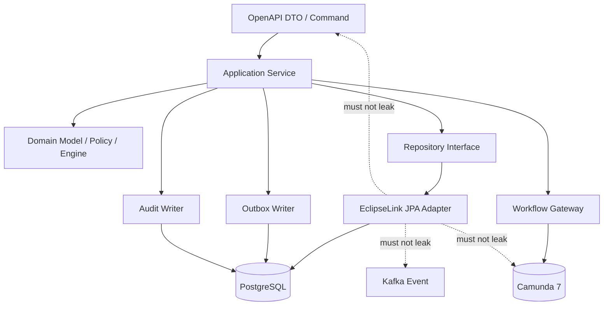
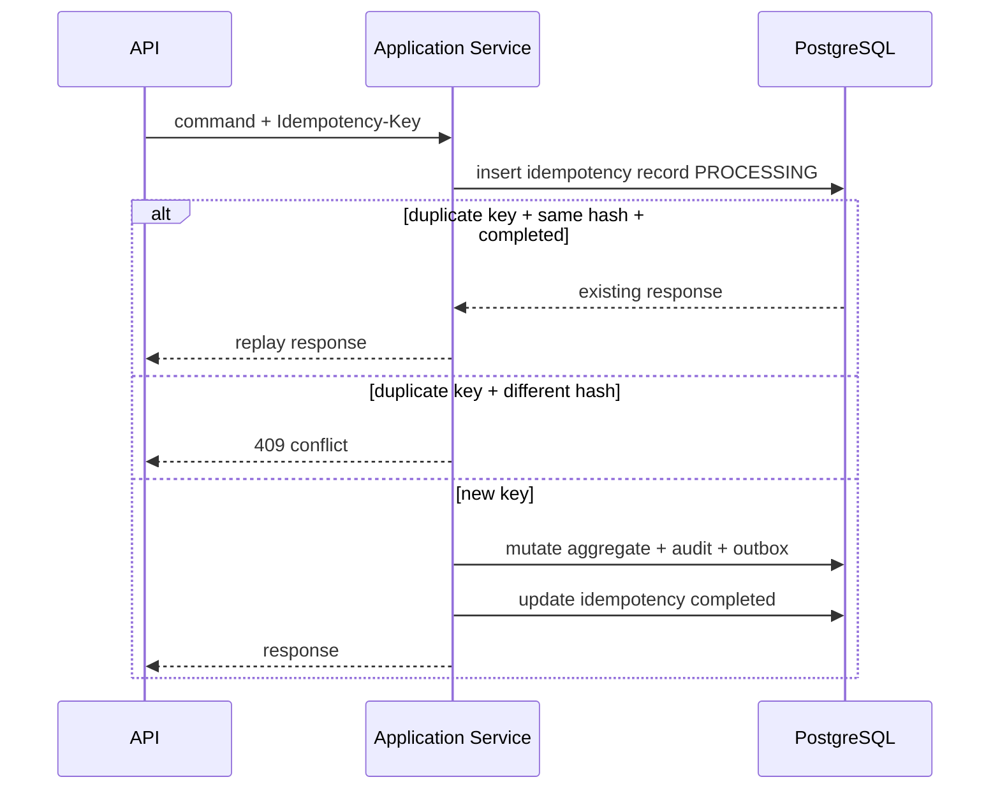

# Part 015 — EclipseLink JPA Persistence Architecture

JPA bukan arsitektur.

JPA adalah **persistence abstraction**.

Kalau kita menjadikan JPA sebagai pusat desain, sistem CPQ/OMS akan berubah menjadi kumpulan entity yang kebetulan punya endpoint. Itu cepat untuk demo, tetapi rapuh untuk enterprise.

Dalam CPQ/OMS production-grade, persistence layer harus menjawab pertanyaan yang lebih keras:

```text
Apa boundary transaksi?
Apa aggregate yang boleh dimutasi bersama?
Apa data yang immutable?
Apa data yang hanya projection?
Apa query yang boleh memakai entity graph?
Apa query yang harus memakai read model?
Apa yang harus dikunci dengan optimistic locking?
Apa yang tidak boleh lazy-load keluar dari transaction boundary?
Apa yang harus tetap bisa dibuktikan lima tahun lagi?
```

EclipseLink JPA akan kita pakai bukan sebagai magic ORM, tetapi sebagai **controlled persistence mechanism**.

Target bagian ini: kamu bisa merancang persistence layer yang tidak sekadar “jalan”, tetapi tahan terhadap concurrency, workflow orchestration, audit, snapshot, migration, dan beban enterprise.

---

## 1. Posisi JPA Dalam CPQ/OMS

JPA berada di antara domain application service dan PostgreSQL.

Ia tidak boleh menjadi boundary publik.

Ia tidak boleh bocor ke API.

Ia tidak boleh bocor ke Kafka event.

Ia tidak boleh bocor ke Camunda process variable.

Ia tidak boleh menjadi format audit.

Mental modelnya:



Lapisan yang penting:

| Layer | Tanggung Jawab | Tidak Boleh |
|---|---|---|
| API DTO | Contract eksternal | Menjadi entity JPA |
| Application service | Use case, transaction boundary, orchestration | Berisi mapping SQL detail |
| Domain object | Invariant, command behavior, business rule | Bergantung pada JPA provider |
| Repository interface | Abstraksi akses aggregate | Mengekspos `EntityManager` |
| JPA adapter | Mapping object-relational | Mengambil keputusan bisnis |
| PostgreSQL | Integrity, constraint, source of truth | Menjadi storage tanpa constraint |

Kalau JPA entity langsung dipakai sebagai request/response API, kamu kehilangan contract governance.

Kalau JPA entity langsung dijadikan Kafka payload, kamu kehilangan event compatibility.

Kalau JPA entity langsung disimpan sebagai Camunda variable, kamu mengikat workflow instance ke class Java internal yang akan berubah.

Itu semua technical debt yang biasanya tidak terlihat saat sprint awal, tetapi muncul saat sistem harus upgrade, migrate, replay, audit, atau debug incident.

---

## 2. Persistence Architecture Yang Kita Inginkan

Untuk CPQ/OMS, persistence architecture harus memenuhi lima kualitas:

### 2.1 Transactional Clarity

Setiap use case harus jelas:

```text
Satu command = satu transaction boundary utama.
```

Contoh:

| Command | Transaction Boundary |
|---|---|
| `CreateQuote` | Insert quote header, revision 1, initial transition log, audit, outbox event |
| `AddQuoteLine` | Load quote revision, validate editable, insert line, update revision version, audit, outbox event |
| `PriceQuote` | Load quote snapshot, evaluate pricing, persist price result, update quote status/flags, audit, outbox event |
| `SubmitForApproval` | Validate priced quote, start workflow correlation record, update quote state, audit, outbox event |
| `AcceptQuote` | Lock quote revision, validate approved/fresh, mark accepted, create order command/outbox, audit |

Jangan desain transaction boundary berdasarkan method repository.

Desain berdasarkan **business command**.

### 2.2 Aggregate-Safe Loading

Tidak semua relationship harus di-load.

Tidak semua graph boleh dimutasi.

Satu aggregate harus punya root yang jelas.

Contoh:

| Aggregate | Root | Owned Data | Referenced Data |
|---|---|---|---|
| Quote Revision | `QuoteRevisionEntity` | Lines, selected options, price result, approval summary | Customer id, catalog publication id |
| Order | `OrderEntity` | Order lines, fulfillment steps, transition log | Quote revision id, account id |
| Product Publication Snapshot | `CatalogPublicationEntity` | Published offering snapshot | Source product master |
| Approval Decision | `ApprovalDecisionEntity` | Decision, approver, reason, policy snapshot | Quote revision id, process instance id |

Aggregate root bukan sekadar entity yang punya banyak child.

Aggregate root adalah tempat invariant dijaga.

### 2.3 Explicit Query Model

JPA bagus untuk aggregate mutation.

JPA tidak selalu bagus untuk operational search.

CPQ/OMS butuh query seperti:

```text
Cari semua quote enterprise customer yang pending approval > 2 hari.
Cari order yang fulfillment step-nya stuck di external inventory reservation.
Cari quote accepted yang belum punya primary order.
Cari order dengan last failure reason tertentu.
Cari semua quote dengan discount override di atas threshold.
```

Query seperti ini sering lintas aggregate, butuh index khusus, dan harus cepat untuk operator.

Solusinya bukan memaksa entity graph menjadi query engine.

Solusinya:

```text
Aggregate table untuk command correctness.
Projection/read model untuk operational query.
```

### 2.4 Provider-Aware Without Provider-Locked Domain

Kita memakai EclipseLink, jadi kita boleh memanfaatkan fitur EclipseLink di adapter layer.

Tetapi domain model tidak boleh bergantung pada EclipseLink.

Contoh yang boleh:

```xml
<property name="eclipselink.weaving" value="true"/>
<property name="eclipselink.logging.level" value="WARNING"/>
```

Contoh yang tidak ideal:

```java
public class QuoteDomainService {
    private org.eclipse.persistence.sessions.Session session;
}
```

Kalau domain service tahu `Session` EclipseLink, domain sudah tercemar oleh provider detail.

### 2.5 Evidence-Preserving Persistence

CPQ/OMS bukan hanya current state.

Ia harus menyimpan evidence.

Evidence yang perlu dipertahankan:

- quote revision saat harga dihitung
- catalog publication version
- pricing input
- pricing output
- price trace
- approval decision
- approval policy version
- accepted quote document version
- order decomposition result
- fulfillment request/response
- state transition log
- manual override reason

JPA entity boleh berubah.

Evidence tidak boleh hilang.

---

## 3. Persistence Unit Strategy

Persistence unit adalah konfigurasi utama yang mengikat entity, provider, transaction strategy, connection, dan provider-specific property.

Dalam sistem microservices, biasanya satu service punya satu persistence unit utama.

Contoh `persistence.xml` untuk service quote:

```xml
<persistence xmlns="https://jakarta.ee/xml/ns/persistence"
             xmlns:xsi="http://www.w3.org/2001/XMLSchema-instance"
             xsi:schemaLocation="https://jakarta.ee/xml/ns/persistence https://jakarta.ee/xml/ns/persistence/persistence_3_1.xsd"
             version="3.1">

  <persistence-unit name="quote-service-pu" transaction-type="JTA">
    <provider>org.eclipse.persistence.jpa.PersistenceProvider</provider>

    <jta-data-source>jdbc/QuoteServiceDS</jta-data-source>

    <class>com.acme.cpq.quote.persistence.entity.QuoteEntity</class>
    <class>com.acme.cpq.quote.persistence.entity.QuoteRevisionEntity</class>
    <class>com.acme.cpq.quote.persistence.entity.QuoteLineEntity</class>
    <class>com.acme.cpq.quote.persistence.entity.PriceResultEntity</class>
    <class>com.acme.cpq.quote.persistence.entity.PriceComponentEntity</class>
    <class>com.acme.cpq.quote.persistence.entity.ApprovalDecisionEntity</class>
    <class>com.acme.cpq.quote.persistence.entity.OutboxEventEntity</class>
    <class>com.acme.cpq.quote.persistence.entity.AuditLogEntity</class>

    <exclude-unlisted-classes>true</exclude-unlisted-classes>

    <properties>
      <property name="eclipselink.target-database" value="PostgreSQL"/>
      <property name="eclipselink.weaving" value="true"/>
      <property name="eclipselink.logging.level" value="WARNING"/>
      <property name="eclipselink.ddl-generation" value="none"/>
    </properties>
  </persistence-unit>
</persistence>
```

Hal penting:

| Konfigurasi | Rekomendasi | Alasan |
|---|---|---|
| `exclude-unlisted-classes` | `true` | Entity harus eksplisit, tidak accidental scanning |
| DDL generation | `none` | Production schema harus migration-managed |
| Target database | PostgreSQL | Provider bisa memilih SQL dialect lebih tepat |
| Weaving | Aktif bila environment mendukung | Lazy loading/change tracking lebih optimal |
| Logging SQL | Jangan `FINE` di production default | Risiko noise dan data leakage |

EclipseLink menggunakan weaving untuk enhancement entity seperti lazy loading, change tracking, fetch group, dan optimisasi internal. Itu berguna, tetapi harus dipahami sebagai runtime behavior, bukan sesuatu yang kamu abaikan.

---

## 4. JTA vs Resource-Local

Dalam Java enterprise stack, ada dua pendekatan umum:

1. **JTA-managed transaction**
2. **Resource-local transaction**

Untuk microservice dengan JAX-RS/Jersey di runtime enterprise seperti Payara/GlassFish/Jakarta EE server, JTA sering lebih natural.

Untuk service yang berdiri sendiri dengan bootstrap manual, resource-local bisa dipakai, tetapi transaction management harus disiplin.

### 4.1 JTA Transaction Boundary

Dengan JTA, container mengelola transaction.

Pseudo pattern:

```java
@ApplicationScoped
public class QuoteCommandService {

    @Inject
    QuoteRepository quoteRepository;

    @Inject
    AuditWriter auditWriter;

    @Inject
    OutboxWriter outboxWriter;

    @Transactional
    public PriceQuoteResult priceQuote(PriceQuoteCommand command) {
        QuoteRevision quote = quoteRepository.loadRevisionForUpdateIntent(
            command.quoteId(),
            command.revision(),
            command.expectedVersion()
        );

        quote.ensureCanBePriced();

        PriceResult price = pricingEngine.price(quote.toPricingInput());
        quote.applyPrice(price);

        auditWriter.record("QUOTE_PRICED", quote.auditSubject(), command.actor());
        outboxWriter.append(QuotePricedEvent.from(quote, price));

        return PriceQuoteResult.from(quote, price);
    }
}
```

Transaction mencakup:

- aggregate load
- invariant check
- mutation
- audit insert
- outbox insert
- commit

Kafka publish tidak dilakukan langsung di transaction ini.

Kafka publish dilakukan oleh outbox publisher setelah commit.

### 4.2 Resource-Local Transaction Boundary

Kalau resource-local:

```java
public PriceQuoteResult priceQuote(PriceQuoteCommand command) {
    EntityManager em = emf.createEntityManager();
    EntityTransaction tx = em.getTransaction();

    try {
        tx.begin();

        QuoteJpaRepository repo = new QuoteJpaRepository(em);
        JpaAuditWriter audit = new JpaAuditWriter(em);
        JpaOutboxWriter outbox = new JpaOutboxWriter(em);

        QuoteRevision quote = repo.loadRevisionForUpdateIntent(
            command.quoteId(),
            command.revision(),
            command.expectedVersion()
        );

        quote.ensureCanBePriced();
        PriceResult price = pricingEngine.price(quote.toPricingInput());
        quote.applyPrice(price);

        audit.record("QUOTE_PRICED", quote.auditSubject(), command.actor());
        outbox.append(QuotePricedEvent.from(quote, price));

        tx.commit();
        return PriceQuoteResult.from(quote, price);
    } catch (RuntimeException e) {
        if (tx.isActive()) tx.rollback();
        throw e;
    } finally {
        em.close();
    }
}
```

Resource-local memberi kontrol, tetapi rawan boilerplate dan inconsistency.

Untuk enterprise system, jangan biarkan setiap developer menulis pattern transaction manual sendiri.

Buat satu command executor.

```java
public final class TransactionalCommandExecutor {
    private final EntityManagerFactory emf;

    public <T> T execute(Function<EntityManager, T> work) {
        EntityManager em = emf.createEntityManager();
        EntityTransaction tx = em.getTransaction();
        try {
            tx.begin();
            T result = work.apply(em);
            tx.commit();
            return result;
        } catch (RuntimeException e) {
            if (tx.isActive()) tx.rollback();
            throw e;
        } finally {
            em.close();
        }
    }
}
```

Tetapi kalau platform menyediakan JTA dengan baik, gunakan JTA.

---

## 5. EntityManager Lifetime

`EntityManager` adalah unit of work.

Jangan perlakukan seperti singleton.

Rule praktis:

```text
Satu request command = satu persistence context = satu transaction boundary utama.
```

Untuk query/read-only request, boleh ada transaction read-only atau request-scoped entity manager, tergantung platform.

Kesalahan umum:

```java
@Singleton
public class BadRepository {
    private final EntityManager em; // bahaya kalau dipakai lintas thread/request
}
```

Repository boleh injected dengan proxy container-managed entity manager, tetapi jangan simpan application-managed entity manager sebagai singleton.

### 5.1 Detached Entity Tidak Boleh Jadi Domain Boundary

Jangan mengembalikan entity JPA detached ke layer API lalu berharap update berikutnya aman.

Anti-pattern:

```java
QuoteRevisionEntity entity = quoteRepository.find(id);
return QuoteResponse.from(entity); // lazy load bisa meledak setelah transaction selesai
```

Lebih aman:

```java
@Transactional
public QuoteDetailView getQuoteDetail(QuoteId id) {
    QuoteRevisionEntity entity = quoteQueryRepository.loadDetail(id);
    return quoteAssembler.toDetailView(entity);
}
```

Keluar dari transaction boundary, return object harus sudah berupa DTO/read model yang lengkap.

---

## 6. Aggregate Repository Pattern

Repository interface sebaiknya berbicara dalam bahasa domain, bukan bahasa JPA.

```java
public interface QuoteRepository {
    QuoteRevision loadEditableRevision(
        QuoteId quoteId,
        int revision,
        long expectedVersion
    );

    void save(QuoteRevision quoteRevision);

    boolean existsAcceptedRevision(QuoteId quoteId);
}
```

JPA adapter:

```java
public final class JpaQuoteRepository implements QuoteRepository {

    private final EntityManager em;
    private final QuoteMapper mapper;

    public QuoteRevision loadEditableRevision(
        QuoteId quoteId,
        int revision,
        long expectedVersion
    ) {
        QuoteRevisionEntity entity = em.createQuery("""
            select qr
            from QuoteRevisionEntity qr
            left join fetch qr.lines
            where qr.quoteId = :quoteId
              and qr.revisionNumber = :revision
        """, QuoteRevisionEntity.class)
        .setParameter("quoteId", quoteId.value())
        .setParameter("revision", revision)
        .getSingleResult();

        if (entity.getVersion() != expectedVersion) {
            throw new ConcurrencyConflictException("Quote revision version mismatch");
        }

        return mapper.toDomain(entity);
    }

    public void save(QuoteRevision quoteRevision) {
        QuoteRevisionEntity entity = mapper.toEntity(quoteRevision);
        em.merge(entity);
    }
}
```

Namun untuk complex aggregate, `merge` harus dipakai hati-hati.

`merge` pada detached graph besar bisa menghasilkan update tidak terduga, orphan handling yang membingungkan, dan query tambahan.

Lebih aman untuk command mutation besar:

1. Load managed entity.
2. Apply perubahan secara eksplisit.
3. Biarkan dirty checking/update terjadi saat flush.

```java
public void applyPrice(QuoteId quoteId, int revision, PriceResult price) {
    QuoteRevisionEntity entity = loadManagedRevision(quoteId, revision);

    entity.ensureStatusAllowsPricing();
    entity.replacePriceResult(PriceResultEntity.from(price));
    entity.markPriced(price.pricedAt());
}
```

---

## 7. Mapping Domain Object vs Persistence Entity

Ada dua pendekatan:

### 7.1 Entity JPA Sebagai Domain Object

```java
@Entity
public class QuoteRevision {
    public void submitForApproval() {
       // invariant here
    }
}
```

Kelebihan:

- lebih sedikit mapping
- behavior dekat dengan data
- cocok untuk aggregate kecil

Kekurangan:

- domain tercemar annotation persistence
- lazy loading bisa masuk ke behavior domain
- test domain butuh provider awareness
- refactoring domain berdampak ke schema mapping

### 7.2 Persistence Entity Terpisah Dari Domain Object

```java
public final class QuoteRevision {
    // pure domain object
}

@Entity
public class QuoteRevisionEntity {
    // persistence mapping
}
```

Kelebihan:

- domain bersih
- persistence bisa dioptimalkan
- DTO/event/workflow mapping lebih eksplisit
- cocok untuk enterprise boundary

Kekurangan:

- butuh mapper
- risiko mapping bug
- boilerplate lebih banyak

Untuk CPQ/OMS enterprise, pilihan yang lebih aman adalah **separate persistence entity untuk aggregate kompleks**.

Tetapi jangan dogmatis.

Untuk entity kecil seperti `IdempotencyRecordEntity`, `OutboxEventEntity`, `AuditLogEntity`, behavior domain tidak kompleks, jadi entity JPA langsung cukup.

Rule:

```text
Semakin tinggi nilai business invariant dan lifecycle complexity,
semakin besar alasan memisahkan domain object dari persistence entity.
```

---

## 8. Optimistic Locking Sebagai Default

CPQ/OMS penuh race condition:

- dua sales rep edit quote yang sama
- approval masuk saat quote direprice
- accept quote diklik dua kali
- order created event diproses ulang
- cancellation datang saat fulfillment berjalan
- manual operator memperbaiki fallout saat retry otomatis berjalan

Default concurrency model harus optimistic locking.

Contoh entity:

```java
@Entity
@Table(name = "quote_revision")
public class QuoteRevisionEntity {

    @Id
    @Column(name = "quote_revision_id")
    private UUID id;

    @Column(name = "quote_id", nullable = false)
    private UUID quoteId;

    @Column(name = "revision_number", nullable = false)
    private int revisionNumber;

    @Version
    @Column(name = "version", nullable = false)
    private long version;

    @Enumerated(EnumType.STRING)
    @Column(name = "status", nullable = false)
    private QuoteRevisionStatus status;
}
```

JPA `@Version` memberi optimistic concurrency control. Persistence provider menggunakan field version untuk mendeteksi conflict saat update/delete.

### 8.1 Expected Version Dari API

Optimistic locking lebih baik kalau dikombinasikan dengan expected version dari client.

Command API:

```json
{
  "quoteId": "...",
  "revision": 3,
  "expectedVersion": 17,
  "reason": "Customer requested new bundle option"
}
```

Application service:

```java
if (entity.getVersion() != command.expectedVersion()) {
    throw new VersionConflictException(
        entity.getVersion(),
        command.expectedVersion()
    );
}
```

Kenapa tidak cukup mengandalkan exception saat flush?

Karena expected version membantu memberi error yang lebih jelas sebelum banyak pekerjaan dilakukan.

Tetapi tetap harus ada `@Version`, karena check manual saja tidak cukup menghadapi race antar-transaction.

### 8.2 Kapan Pessimistic Lock Boleh Dipakai

Pessimistic lock bukan default.

Ia boleh dipakai untuk hot path tertentu:

- final accept quote
- create order from quote
- prevent double order creation
- reserve single scarce inventory
- operational repair yang tidak boleh parallel

Contoh:

```java
QuoteRevisionEntity entity = em.find(
    QuoteRevisionEntity.class,
    id,
    LockModeType.PESSIMISTIC_WRITE
);
```

Atau query:

```java
em.createQuery("""
    select qr
    from QuoteRevisionEntity qr
    where qr.quoteId = :quoteId
      and qr.revisionNumber = :revision
""", QuoteRevisionEntity.class)
.setLockMode(LockModeType.PESSIMISTIC_WRITE)
.setParameter("quoteId", quoteId)
.setParameter("revision", revision)
.getSingleResult();
```

Gunakan dengan disiplin:

| Hal | Risiko |
|---|---|
| Lock terlalu luas | throughput turun |
| Lock terlalu lama | deadlock/wait spike |
| Lock di UI flow | user think time menahan DB resource |
| Lock lintas external call | sangat berbahaya |

Rule keras:

```text
Jangan pernah menahan database transaction saat memanggil external service.
```

External service call harus di luar DB transaction atau dimodelkan sebagai workflow step/outbox command.

---

## 9. Lazy Loading Boundary

Lazy loading bukan musuh.

Lazy loading yang tidak dikendalikan adalah musuh.

Dalam CPQ/OMS, entity graph bisa sangat besar:

```text
Quote
  Revision
    Lines
      Selected Options
      Price Components
      Validation Errors
    Price Result
      Price Components
      Discount Trace
    Approval Decisions
    Documents
```

Kalau semua eager, performance hancur.

Kalau semua lazy tanpa boundary, runtime meledak dengan N+1 query atau lazy initialization failure.

### 9.1 Load Berdasarkan Use Case

Contoh use case:

| Use Case | Data Needed |
|---|---|
| Quote summary list | Header, status, customer, total, updated date |
| Quote detail | Header, current revision, line tree, price summary, approval summary |
| Price quote | Configured line tree, catalog refs, current price input, no documents |
| Submit approval | Price result, discount overrides, approval policy input |
| Generate document | Quote snapshot, line tree, price components, terms, customer data |

Buat query berbeda untuk setiap use case.

Jangan satu `findQuoteEverything()`.

### 9.2 Fetch Join Dengan Batas

```java
select distinct qr
from QuoteRevisionEntity qr
left join fetch qr.lines l
left join fetch l.characteristics c
where qr.quoteId = :quoteId
  and qr.revisionNumber = :revision
```

Fetch join berguna, tetapi hati-hati:

- multiple collection fetch bisa menghasilkan row explosion
- pagination dengan fetch join collection sering bermasalah
- query detail dan query list harus dipisah

Untuk list page, gunakan projection query.

```java
select new com.acme.cpq.quote.query.QuoteSummaryRow(
    q.quoteId,
    q.customerId,
    qr.revisionNumber,
    qr.status,
    qr.totalAmount,
    qr.updatedAt
)
from QuoteEntity q
join q.currentRevision qr
where q.customerId = :customerId
order by qr.updatedAt desc
```

---

## 10. EclipseLink Cache Boundary

EclipseLink punya identity map/cache di level persistence context dan shared cache.

Ini bisa meningkatkan performa, tetapi untuk CPQ/OMS harus dikendalikan.

### 10.1 Cache Yang Aman

| Data | Cache Strategy |
|---|---|
| Reference code kecil | Bisa cache |
| Static enum-like table | Bisa cache |
| Published catalog metadata | Bisa cache dengan invalidation/version |
| Quote mutable current state | Hati-hati, umumnya jangan shared-cache aggressive |
| Order fulfillment state | Jangan mengandalkan cache untuk correctness |
| Audit/outbox | Jangan cache |

### 10.2 Disable Shared Cache Untuk Aggregate Mutable

```java
@Entity
@Cacheable(false)
@Table(name = "quote_revision")
public class QuoteRevisionEntity {
    // ...
}
```

Atau konfigurasi provider-level sesuai kebutuhan.

Reasoning:

```text
Current quote/order state adalah data yang sering berubah,
bernilai tinggi,
dan menjadi dasar keputusan lifecycle.
Correctness lebih penting daripada cache hit.
```

Cache untuk read performance sebaiknya lebih eksplisit:

- Redis untuk published catalog/cache view
- projection table untuk search
- query-specific cache dengan TTL/invalidation

Jangan biarkan ORM shared cache menjadi “invisible source of stale truth”.

---

## 11. DTO, Entity, Domain, Event, Variable: Jangan Campur

Satu data bisnis bisa punya beberapa representasi.

Contoh quote line:

| Representasi | Tujuan |
|---|---|
| `QuoteLineRequest` | API input |
| `QuoteLineEntity` | Persistence mapping |
| `QuoteLine` | Domain behavior/invariant |
| `QuoteLineView` | API output/query projection |
| `QuoteLineSnapshot` | Event/document/audit evidence |
| `QuoteLineWorkflowRef` | Camunda variable minimal |

Ini bukan overengineering.

Ini boundary hygiene.

Anti-pattern:

```java
@Entity
public class QuoteLineDtoEventVariableEverything {
    // JPA annotations
    // JSON annotations
    // Kafka annotations
    // Camunda serialization assumptions
    // business methods
}
```

Itu terlihat hemat di awal, tetapi menjadi pusat kerusakan saat schema API berubah, event harus backward compatible, atau workflow instance lama masih berjalan.

### 11.1 Camunda Variable Boundary

Jangan simpan graph JPA sebagai process variable.

Simpan minimal correlation data:

```json
{
  "quoteId": "Q-2026-000123",
  "quoteRevision": 4,
  "approvalRequestId": "APR-9912",
  "tenantId": "enterprise-id",
  "businessSegment": "B2B_ENTERPRISE"
}
```

Workflow mengambil detail melalui service API atau query adapter saat dibutuhkan.

Kenapa?

Karena process instance bisa hidup lama.

Class Java bisa berubah sebelum process selesai.

Data quote bisa direvisi.

Workflow variable harus menjadi pointer dan decision context minimal, bukan object database hidup.

---

## 12. Outbox Dalam Persistence Layer

Outbox bukan plugin Kafka.

Outbox adalah bagian dari transaction design.

Saat command berhasil, perubahan state dan event intent harus commit bersama.

```java
@Transactional
public void acceptQuote(AcceptQuoteCommand command) {
    QuoteRevisionEntity quote = quoteRepo.loadForAccept(command);
    quote.accept(command.acceptedBy(), command.acceptedAt());

    OrderCreationRequestedEvent event = OrderCreationRequestedEvent.from(quote);

    outbox.append(
        OutboxEventEntity.pending(
            "quote-service",
            "quote.accepted",
            quote.getQuoteId().toString(),
            event.eventId(),
            json.write(event)
        )
    );

    audit.record(...);
}
```

Outbox table minimal:

```sql
create table outbox_event (
    outbox_event_id uuid primary key,
    aggregate_type text not null,
    aggregate_id text not null,
    event_type text not null,
    event_id uuid not null unique,
    payload jsonb not null,
    status text not null,
    attempt_count integer not null default 0,
    next_attempt_at timestamptz,
    created_at timestamptz not null,
    published_at timestamptz
);
```

Outbox writer harus berada di persistence module, tetapi payload schema adalah contract module.

Jangan serialisasi JPA entity langsung.

---

## 13. Audit Writer Dalam Persistence Layer

Audit tidak sama dengan log.

Audit harus menjadi evidence.

```java
public interface AuditWriter {
    void record(AuditRecord record);
}
```

Audit record harus menjawab:

```text
Who?
Did what?
To what subject?
When?
Why?
From where?
Based on what version?
With what result?
```

Contoh audit insert dalam transaction yang sama:

```java
AuditLogEntity audit = new AuditLogEntity(
    UUID.randomUUID(),
    "QUOTE",
    quote.getQuoteId().toString(),
    "QUOTE_ACCEPTED",
    actor.userId(),
    command.reason(),
    json.write(AuditDelta.from(quote.before(), quote.after())),
    clock.instant()
);

em.persist(audit);
```

Audit delta tidak harus menyimpan seluruh object setiap kali.

Tetapi untuk keputusan bernilai tinggi seperti approval, price override, dan acceptance, snapshot evidence jauh lebih aman.

---

## 14. Query Repository vs Command Repository

Pisahkan command repository dan query repository.

```text
Command repository:
- load aggregate
- mutate aggregate
- enforce concurrency
- minimal query semantics

Query repository:
- read optimized
- projection DTO
- pagination
- filter/search
- operational dashboard
```

Contoh:

```java
public interface QuoteCommandRepository {
    QuoteRevisionEntity loadManagedForCommand(QuoteId id, int revision);
}

public interface QuoteQueryRepository {
    Page<QuoteSummaryRow> search(QuoteSearchCriteria criteria, PageRequest page);
    QuoteDetailView getDetail(QuoteId id, int revision);
}
```

Jangan memakai command aggregate loading untuk list page.

Jangan memakai query projection untuk mutation.

Dua jalur ini punya tujuan berbeda.

---

## 15. Entity Lifecycle Event: Pakai Secara Terbatas

JPA lifecycle callback seperti `@PrePersist` dan `@PreUpdate` berguna untuk hal teknis:

```java
@PrePersist
void onCreate() {
    this.createdAt = Instant.now();
    this.updatedAt = this.createdAt;
}

@PreUpdate
void onUpdate() {
    this.updatedAt = Instant.now();
}
```

Tetapi jangan taruh business event di callback entity.

Anti-pattern:

```java
@PostUpdate
void publishKafkaEvent() {
    kafkaProducer.send(...); // jangan
}
```

Kenapa?

- callback berjalan dalam persistence lifecycle, bukan business use case
- event bisa terkirim sebelum commit
- rollback bisa terjadi setelah publish
- tidak punya context command/actor/reason lengkap
- sulit dites

Business event harus ditulis eksplisit ke outbox oleh application service.

---

## 16. Flush Discipline

JPA flush bisa terjadi sebelum commit, misalnya sebelum query tertentu.

Jangan berasumsi semua SQL hanya keluar di akhir method.

Pattern aman:

```java
quote.apply(command);
outbox.append(event);
audit.record(record);

// optional: force flush when you want DB constraint violation now
em.flush();
```

Kapan `flush()` eksplisit berguna?

- ingin menangkap constraint violation sebelum start workflow
- ingin memastikan insert correlation record berhasil sebelum process start
- ingin detect optimistic lock conflict sebelum menjalankan langkah mahal

Tetapi jangan gunakan flush untuk “memaksa urutan bisnis” tanpa desain transaction yang jelas.

---

## 17. Camunda 7 Integration Boundary

Ada dua cara umum menghubungkan service persistence dengan Camunda:

### 17.1 Service Mengupdate DB Lalu Start Process

```text
Transaction 1:
- create approval request record
- update quote state = PENDING_APPROVAL
- write audit
- write outbox QuoteSubmittedForApproval
commit

Then:
- start Camunda process with business key
- update workflow correlation record with processInstanceId
```

Problem:

Kalau DB commit berhasil tetapi Camunda start gagal, quote pending approval tanpa process.

Solusi:

- gunakan outbox/workflow command table
- workflow starter worker memulai process dengan retry
- reconciliation job mencari approval request tanpa process instance

### 17.2 Start Process Dalam Transaction Yang Sama?

Camunda 7 engine bisa berbagi database/transaction dalam deployment tertentu, tetapi coupling-nya tinggi.

Untuk microservice boundary yang jelas, lebih aman memperlakukan Camunda sebagai workflow engine dengan correlation dan retry boundary eksplisit.

Jangan mengorbankan service autonomy hanya untuk ilusi atomicity lintas system.

### 17.3 Workflow Command Table

```sql
create table workflow_command (
    workflow_command_id uuid primary key,
    command_type text not null,
    business_key text not null,
    payload jsonb not null,
    status text not null,
    attempt_count integer not null default 0,
    next_attempt_at timestamptz,
    created_at timestamptz not null,
    completed_at timestamptz
);
```

Application service menulis workflow command dalam DB transaction.

Worker menjalankan command ke Camunda.

Ini sama prinsipnya dengan outbox, tetapi targetnya workflow engine.

---

## 18. Repository Package Layout

Contoh layout quote-service:

```text
quote-service/
  src/main/java/com/acme/cpq/quote/
    api/
      QuoteResource.java
      mapper/
    application/
      QuoteCommandService.java
      QuoteQueryService.java
      command/
      result/
    domain/
      model/
      policy/
      exception/
    persistence/
      entity/
        QuoteEntity.java
        QuoteRevisionEntity.java
        QuoteLineEntity.java
        PriceResultEntity.java
        PriceComponentEntity.java
        ApprovalDecisionEntity.java
        OutboxEventEntity.java
        AuditLogEntity.java
      repository/
        JpaQuoteCommandRepository.java
        JpaQuoteQueryRepository.java
      mapper/
        QuotePersistenceMapper.java
      tx/
        TransactionalCommandExecutor.java
    integration/
      workflow/
      event/
      catalog/
      pricing/
```

Boundary penting:

```text
api -> application -> domain
application -> persistence interface
persistence adapter -> JPA entity
integration -> external system adapter
```

JPA entity jangan diimport oleh package `api`.

Gunakan architecture test untuk menjaga ini.

Contoh ArchUnit-style rule:

```java
noClasses()
  .that().resideInAPackage("..api..")
  .should().dependOnClassesThat().resideInAPackage("..persistence.entity..");
```

---

## 19. Handling Constraint Violation

Database constraint adalah guard terakhir.

Application service tetap harus validasi, tetapi database constraint tetap wajib.

Contoh unique constraint:

```sql
alter table quote_revision
add constraint uq_quote_revision unique (quote_id, revision_number);
```

JPA exception dari constraint violation harus diterjemahkan ke API error model.

```java
try {
    em.flush();
} catch (PersistenceException e) {
    if (constraintDetector.isUniqueViolation(e, "uq_quote_revision")) {
        throw new ConflictException("Quote revision already exists");
    }
    throw e;
}
```

Jangan bocorkan error SQL mentah ke client.

Client butuh error yang stabil:

```json
{
  "type": "https://errors.acme.com/conflict/duplicate-quote-revision",
  "title": "Quote revision already exists",
  "status": 409,
  "code": "QUOTE_REVISION_DUPLICATE",
  "correlationId": "..."
}
```

---

## 20. Idempotency Record Dalam Persistence Layer

Idempotency tidak cukup di Redis.

Redis bisa membantu fast path, tetapi DB tetap harus menjadi source of truth untuk command bernilai tinggi.

Entity:

```java
@Entity
@Table(name = "idempotency_record")
public class IdempotencyRecordEntity {
    @Id
    @Column(name = "idempotency_key")
    private String key;

    @Column(name = "operation", nullable = false)
    private String operation;

    @Column(name = "request_hash", nullable = false)
    private String requestHash;

    @Column(name = "status", nullable = false)
    private String status;

    @Column(name = "response_payload", columnDefinition = "jsonb")
    private String responsePayload;

    @Column(name = "created_at", nullable = false)
    private Instant createdAt;
}
```

Flow:



The invariant:

```text
Same idempotency key + same request hash must not execute command twice.
Same idempotency key + different request hash is a client error.
```

---

## 21. Testing Persistence Architecture

Persistence test harus memakai database nyata, bukan hanya mock repository.

Test yang wajib:

### 21.1 Mapping Test

```text
Given quote revision with line tree and price result
When persisted and reloaded
Then structure, ordering, amounts, and status remain identical
```

### 21.2 Constraint Test

```text
Given quote revision already exists
When inserting same quote_id + revision_number
Then unique constraint violation is translated to ConflictException
```

### 21.3 Optimistic Lock Test

```text
Given two transactions load same quote revision version
When transaction A commits update
And transaction B commits update
Then transaction B fails with optimistic lock conflict
```

### 21.4 Outbox Atomicity Test

```text
Given command mutates quote and appends event
When transaction commits
Then quote state and outbox event both exist

Given command fails after mutation but before commit
Then neither quote mutation nor outbox event exists
```

### 21.5 Lazy Loading Boundary Test

```text
Given quote detail endpoint returns DTO
When transaction is closed
Then serializing DTO does not trigger lazy loading
```

---

## 22. Common Failure Modes

| Failure | Root Cause | Prevention |
|---|---|---|
| API response fails after transaction | DTO assembled from lazy entity | Assemble DTO inside transaction |
| Lost update | No `@Version` / no expected version | Optimistic lock + API version |
| Duplicate order from same quote | Accept command not idempotent | Idempotency + unique primary order constraint |
| Stale quote accepted | Price/approval freshness not checked | Lifecycle invariant before accept |
| Kafka event published but DB rolled back | Direct publish inside transaction | Outbox pattern |
| Workflow started but DB state absent | Camunda call before DB commit | Workflow command/outbox + reconciliation |
| Entity graph update deletes child rows | Blind `merge` detached graph | Load managed aggregate and apply explicit diff |
| ORM cache returns stale state | Shared cache on mutable aggregate | Disable cache for mutable aggregate |
| Query endpoint slow | Entity graph used for search | Projection/read model |
| Audit incomplete | Audit written outside transaction or from logs | Audit table in same command transaction |

---

## 23. Production Checklist

Sebelum persistence layer dianggap production-ready:

```text
[ ] Semua aggregate root punya @Version atau concurrency strategy eksplisit.
[ ] Semua command punya transaction boundary jelas.
[ ] Tidak ada JPA entity di API DTO/event/workflow variable.
[ ] DDL generation disabled di production.
[ ] Migration tool adalah sumber schema change.
[ ] Constraint violation diterjemahkan ke error model stabil.
[ ] Outbox insert terjadi dalam transaction yang sama dengan state mutation.
[ ] Audit insert terjadi dalam transaction yang sama dengan state mutation.
[ ] Query repository tidak memakai aggregate graph untuk search page besar.
[ ] Lazy loading tidak keluar dari transaction boundary.
[ ] Mutable aggregate tidak mengandalkan shared ORM cache untuk correctness.
[ ] Idempotency record tersedia untuk command bernilai tinggi.
[ ] Integration test memakai PostgreSQL nyata.
[ ] Optimistic lock conflict diuji.
[ ] Duplicate accept/order creation diuji.
[ ] Workflow correlation failure punya reconciliation path.
```

---

## 24. Ringkasan Mental Model

JPA/EclipseLink harus dipakai sebagai alat, bukan pusat arsitektur.

Dalam CPQ/OMS enterprise:

```text
API contract protects external compatibility.
Domain model protects business invariants.
JPA adapter maps aggregate state to relational schema.
PostgreSQL protects durable correctness.
Outbox protects event consistency.
Audit protects evidence.
Camunda correlation protects workflow traceability.
Query model protects operational usability.
```

Kalau ada satu prinsip yang harus diingat:

> Persistence architecture yang baik bukan yang membuat entity mudah disimpan, tetapi yang membuat keputusan bisnis tetap benar, bisa diaudit, bisa dipulihkan, dan bisa berevolusi.

Part berikutnya akan masuk lebih rendah: bagaimana mapping quote line tree, order line action, price component, snapshot, approval decision, dan immutable commercial evidence dengan JPA tanpa menghancurkan model domain.

---

## References

- EclipseLink project: `https://eclipse.dev/eclipselink/`
- EclipseLink JPA extensions, including weaving: `https://eclipse.dev/eclipselink/documentation/4.0/jpa/extensions/jpa-extensions.html`
- Jakarta Persistence optimistic locking tutorial: `https://jakarta.ee/learn/docs/jakartaee-tutorial/current/persist/persistence-locking/persistence-locking.html`
- Jakarta Persistence specification: `https://jakarta.ee/specifications/persistence/`
