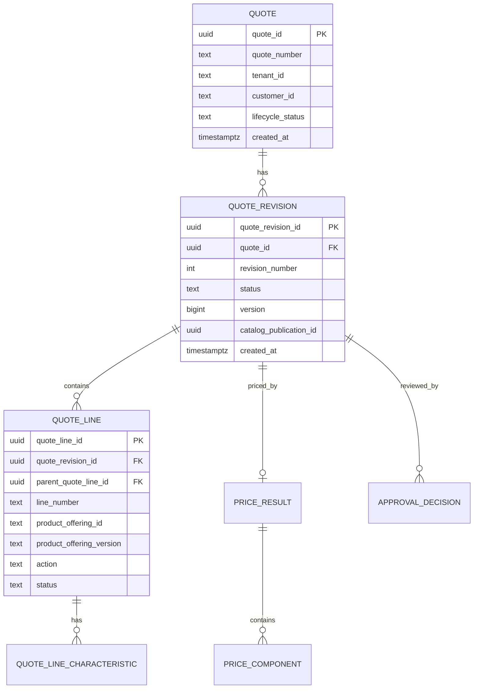
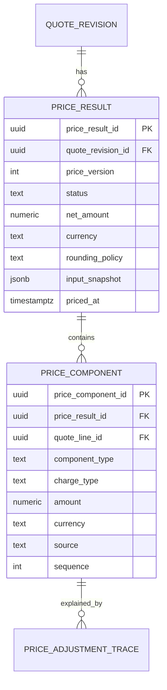
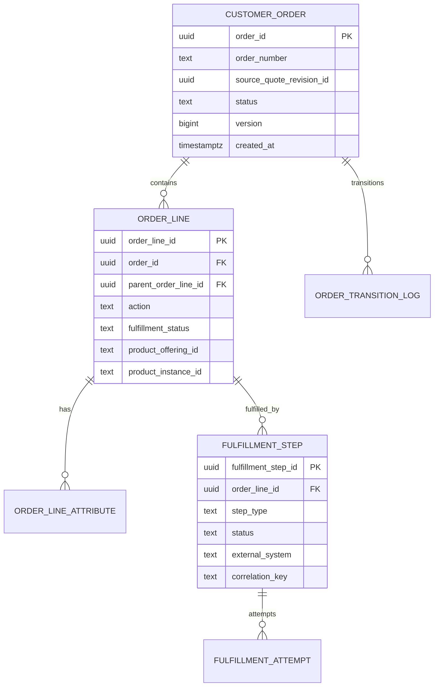

# Part 016 — JPA Mapping for Complex Commercial Models

Bagian sebelumnya membahas architecture persistence.

Sekarang kita masuk ke mapping konkret.

CPQ/OMS bukan sistem entity datar.

Quote dan order adalah struktur komersial yang bertingkat, berubah, punya snapshot, punya kalkulasi, punya approval, punya bukti keputusan, dan harus tetap bisa dijelaskan setelah bertahun-tahun.

Masalahnya: JPA paling nyaman untuk object graph, sementara CPQ/OMS butuh **business evidence graph**.

Dua hal itu mirip, tetapi tidak sama.

Object graph menjawab:

```text
Object apa yang menunjuk object apa?
```

Business evidence graph menjawab:

```text
Keputusan apa dibuat berdasarkan data versi berapa,
oleh siapa,
pada waktu kapan,
dengan konsekuensi apa,
dan apakah hasilnya masih dapat direproduksi?
```

Target bagian ini: kamu bisa mapping model komersial yang kompleks tanpa jatuh ke entity spaghetti, cascade chaos, lazy-loading trap, atau snapshot yang tidak bisa diaudit.

---

## 1. Prinsip Mapping CPQ/OMS

Sebelum menulis annotation, tetapkan prinsip.

### 1.1 Entity Mapping Bukan Domain Truth

JPA entity adalah bentuk penyimpanan.

Domain truth ada di invariant dan lifecycle.

Schema truth ada di PostgreSQL constraint.

Contract truth ada di OpenAPI/schema/event.

Jangan membebani JPA entity menjadi semua hal sekaligus.

### 1.2 Snapshot Lebih Penting Daripada Reference

Dalam CPQ/OMS, banyak data tidak boleh sekadar reference ke master data.

Contoh:

```text
Quote accepted pada 2026-07-02 memakai product offering version 17.
Pada 2026-08-01 product offering version 18 berubah.
Quote lama tetap harus menunjukkan kondisi version 17.
```

Maka quote line harus menyimpan:

- product offering id
- product offering version/publication id
- selected attribute values
- display name saat quote dibuat
- commercial classification saat quote dibuat
- pricing input saat harga dihitung

Jangan hanya menyimpan `product_offering_id` lalu join ke catalog current.

Itu akan memalsukan sejarah.

### 1.3 Mutable Current State dan Immutable History Harus Dipisah

Quote draft bisa berubah.

Accepted quote evidence tidak boleh berubah.

Order fulfillment current state bisa berubah.

Fulfillment event history tidak boleh berubah.

Mapping harus membedakan:

| Data | Mutability |
|---|---|
| `quote_revision.status` | Mutable sampai terminal |
| `quote_line` untuk draft revision | Mutable selama editable |
| `price_result` final untuk revision | Replaceable saat repricing, lalu frozen saat accepted |
| `approval_decision` | Immutable setelah dibuat |
| `quote_acceptance_snapshot` | Immutable |
| `order_fulfillment_step.status` | Mutable |
| `order_transition_log` | Immutable append-only |

### 1.4 Cascade Harus Terbatas

Cascade bukan default.

Cascade berarti operasi pada parent ikut memengaruhi child.

Untuk aggregate-owned child seperti quote line, cascade bisa masuk akal.

Untuk reference seperti customer, catalog, tenant, user, jangan cascade.

Rule:

```text
Cascade hanya untuk child yang lifecycle-nya benar-benar dimiliki aggregate root.
```

---

## 2. Quote Aggregate Mapping

Quote memiliki dua level penting:

1. `quote` sebagai business identity jangka panjang
2. `quote_revision` sebagai versi komersial yang bisa berubah/diterima/expired

Model relasional:



### 2.1 `QuoteEntity`

```java
@Entity
@Table(name = "quote")
public class QuoteEntity {

    @Id
    @Column(name = "quote_id", nullable = false)
    private UUID id;

    @Column(name = "quote_number", nullable = false, unique = true)
    private String quoteNumber;

    @Column(name = "tenant_id", nullable = false)
    private String tenantId;

    @Column(name = "customer_id", nullable = false)
    private String customerId;

    @Enumerated(EnumType.STRING)
    @Column(name = "lifecycle_status", nullable = false)
    private QuoteLifecycleStatus lifecycleStatus;

    @Column(name = "created_at", nullable = false)
    private Instant createdAt;

    @Column(name = "updated_at", nullable = false)
    private Instant updatedAt;

    protected QuoteEntity() {
    }
}
```

`QuoteEntity` tidak perlu memuat semua revision secara default.

Kenapa?

Karena list revision bisa bertambah, dan sebagian use case hanya butuh current revision.

### 2.2 `QuoteRevisionEntity`

```java
@Entity
@Table(
    name = "quote_revision",
    uniqueConstraints = {
        @UniqueConstraint(
            name = "uq_quote_revision_number",
            columnNames = {"quote_id", "revision_number"}
        )
    }
)
public class QuoteRevisionEntity {

    @Id
    @Column(name = "quote_revision_id", nullable = false)
    private UUID id;

    @Column(name = "quote_id", nullable = false)
    private UUID quoteId;

    @Column(name = "revision_number", nullable = false)
    private int revisionNumber;

    @Version
    @Column(name = "version", nullable = false)
    private long version;

    @Enumerated(EnumType.STRING)
    @Column(name = "status", nullable = false)
    private QuoteRevisionStatus status;

    @Column(name = "catalog_publication_id", nullable = false)
    private UUID catalogPublicationId;

    @OneToMany(
        mappedBy = "quoteRevision",
        cascade = CascadeType.ALL,
        orphanRemoval = true
    )
    @OrderBy("lineNumber asc")
    private List<QuoteLineEntity> lines = new ArrayList<>();

    @OneToOne(
        mappedBy = "quoteRevision",
        cascade = CascadeType.ALL,
        orphanRemoval = true,
        fetch = FetchType.LAZY
    )
    private PriceResultEntity priceResult;

    protected QuoteRevisionEntity() {
    }

    public void replaceLines(List<QuoteLineEntity> newLines) {
        this.lines.clear();
        for (QuoteLineEntity line : newLines) {
            addLine(line);
        }
    }

    public void addLine(QuoteLineEntity line) {
        line.attachTo(this);
        this.lines.add(line);
    }

    public void replacePriceResult(PriceResultEntity newPriceResult) {
        if (this.priceResult != null) {
            this.priceResult.detach();
        }
        newPriceResult.attachTo(this);
        this.priceResult = newPriceResult;
    }
}
```

Catatan:

- `quoteId` disimpan sebagai UUID, bukan `@ManyToOne QuoteEntity`, karena banyak command revision tidak butuh quote header object.
- `lines` dimiliki oleh revision.
- `priceResult` dimiliki oleh revision.
- `orphanRemoval` aman hanya kalau replacement memang berarti child lama tidak lagi menjadi current child untuk revision itu.

Namun untuk historical price result yang harus disimpan semua, jangan pakai replacement satu-to-satu. Gunakan `price_result` multi-version.

---

## 3. Quote Line Tree Mapping

Quote line adalah tree.

Bundle punya child option.

Child bisa punya child lagi.

Relasionalnya self-reference:

```sql
create table quote_line (
    quote_line_id uuid primary key,
    quote_revision_id uuid not null references quote_revision(quote_revision_id),
    parent_quote_line_id uuid references quote_line(quote_line_id),
    line_number text not null,
    product_offering_id text not null,
    product_offering_version text not null,
    display_name text not null,
    action text not null,
    status text not null,
    quantity numeric(19, 4) not null,
    position integer not null,
    unique (quote_revision_id, line_number)
);
```

JPA entity:

```java
@Entity
@Table(name = "quote_line")
public class QuoteLineEntity {

    @Id
    @Column(name = "quote_line_id", nullable = false)
    private UUID id;

    @ManyToOne(fetch = FetchType.LAZY, optional = false)
    @JoinColumn(name = "quote_revision_id", nullable = false)
    private QuoteRevisionEntity quoteRevision;

    @ManyToOne(fetch = FetchType.LAZY)
    @JoinColumn(name = "parent_quote_line_id")
    private QuoteLineEntity parent;

    @OneToMany(
        mappedBy = "parent",
        cascade = CascadeType.ALL,
        orphanRemoval = true
    )
    @OrderBy("position asc")
    private List<QuoteLineEntity> children = new ArrayList<>();

    @Column(name = "line_number", nullable = false)
    private String lineNumber;

    @Column(name = "product_offering_id", nullable = false)
    private String productOfferingId;

    @Column(name = "product_offering_version", nullable = false)
    private String productOfferingVersion;

    @Column(name = "display_name", nullable = false)
    private String displayName;

    @Enumerated(EnumType.STRING)
    @Column(name = "action", nullable = false)
    private QuoteLineAction action;

    @Enumerated(EnumType.STRING)
    @Column(name = "status", nullable = false)
    private QuoteLineStatus status;

    @Embedded
    private QuantityEmbeddable quantity;

    @Column(name = "position", nullable = false)
    private int position;

    @OneToMany(
        mappedBy = "quoteLine",
        cascade = CascadeType.ALL,
        orphanRemoval = true
    )
    private List<QuoteLineCharacteristicEntity> characteristics = new ArrayList<>();

    protected QuoteLineEntity() {
    }

    void attachTo(QuoteRevisionEntity revision) {
        this.quoteRevision = revision;
        for (QuoteLineEntity child : children) {
            child.attachTo(revision);
        }
    }

    public void addChild(QuoteLineEntity child) {
        child.parent = this;
        child.attachTo(this.quoteRevision);
        this.children.add(child);
    }
}
```

### 3.1 Tree Mapping Invariant

Quote line tree harus menjaga invariant:

```text
[ ] Semua line dalam satu tree milik quote_revision_id yang sama.
[ ] Child tidak boleh menunjuk parent dari revision lain.
[ ] Tidak boleh ada cycle.
[ ] Root line parent_quote_line_id null.
[ ] line_number unik dalam satu revision.
[ ] position stabil untuk rendering/document generation.
```

JPA tidak otomatis mencegah cycle.

Cycle harus dicek di domain/application layer.

Contoh validator:

```java
public final class QuoteLineTreeValidator {
    public void validate(List<QuoteLine> roots) {
        Set<QuoteLineId> visiting = new HashSet<>();
        Set<QuoteLineId> visited = new HashSet<>();

        for (QuoteLine root : roots) {
            visit(root, visiting, visited);
        }
    }

    private void visit(
        QuoteLine line,
        Set<QuoteLineId> visiting,
        Set<QuoteLineId> visited
    ) {
        if (visiting.contains(line.id())) {
            throw new InvalidConfigurationException("Quote line tree contains cycle");
        }
        if (visited.contains(line.id())) {
            return;
        }

        visiting.add(line.id());
        for (QuoteLine child : line.children()) {
            visit(child, visiting, visited);
        }
        visiting.remove(line.id());
        visited.add(line.id());
    }
}
```

### 3.2 Jangan Load Tree Untuk List Page

Anti-pattern:

```java
select q from QuoteRevisionEntity q
left join fetch q.lines
order by q.updatedAt desc
```

Untuk list page, pakai summary table/projection.

Tree hanya untuk detail/configuration/pricing/document generation.

---

## 4. Characteristic Mapping

Product characteristic yang dipilih dalam quote harus disimpan sebagai snapshot.

```sql
create table quote_line_characteristic (
    quote_line_characteristic_id uuid primary key,
    quote_line_id uuid not null references quote_line(quote_line_id),
    characteristic_code text not null,
    characteristic_name text not null,
    value_type text not null,
    value_text text,
    value_number numeric(19, 6),
    value_boolean boolean,
    value_json jsonb,
    unit_code text,
    source text not null,
    unique (quote_line_id, characteristic_code)
);
```

Entity:

```java
@Entity
@Table(name = "quote_line_characteristic")
public class QuoteLineCharacteristicEntity {

    @Id
    @Column(name = "quote_line_characteristic_id", nullable = false)
    private UUID id;

    @ManyToOne(fetch = FetchType.LAZY, optional = false)
    @JoinColumn(name = "quote_line_id", nullable = false)
    private QuoteLineEntity quoteLine;

    @Column(name = "characteristic_code", nullable = false)
    private String code;

    @Column(name = "characteristic_name", nullable = false)
    private String name;

    @Enumerated(EnumType.STRING)
    @Column(name = "value_type", nullable = false)
    private CharacteristicValueType valueType;

    @Column(name = "value_text")
    private String valueText;

    @Column(name = "value_number", precision = 19, scale = 6)
    private BigDecimal valueNumber;

    @Column(name = "value_boolean")
    private Boolean valueBoolean;

    @Column(name = "value_json", columnDefinition = "jsonb")
    private String valueJson;

    @Column(name = "unit_code")
    private String unitCode;

    @Column(name = "source", nullable = false)
    private String source;
}
```

Kenapa tidak satu kolom `value` text saja?

Karena pricing dan eligibility sering butuh numeric comparison.

Kenapa tetap ada `value_json`?

Karena beberapa characteristic memang structured, misalnya address, region matrix, nested technical selection.

Rule:

```text
Gunakan kolom typed untuk value yang sering difilter/dihitung.
Gunakan JSONB untuk extension shape yang jarang difilter atau perlu menjaga evidence structured.
```

---

## 5. Money Mapping

Jangan mapping money sebagai `double`.

Gunakan `BigDecimal` dengan precision/scale eksplisit.

```java
@Embeddable
public class MoneyEmbeddable {

    @Column(name = "amount", nullable = false, precision = 19, scale = 4)
    private BigDecimal amount;

    @Column(name = "currency", nullable = false, length = 3)
    private String currency;

    protected MoneyEmbeddable() {
    }

    public MoneyEmbeddable(BigDecimal amount, String currency) {
        if (amount == null) throw new IllegalArgumentException("amount required");
        if (currency == null || currency.length() != 3) {
            throw new IllegalArgumentException("currency must be ISO-like 3-letter code");
        }
        this.amount = amount;
        this.currency = currency;
    }
}
```

Kalau satu entity punya banyak money field, gunakan attribute override:

```java
@Embedded
@AttributeOverrides({
    @AttributeOverride(name = "amount", column = @Column(name = "net_amount", precision = 19, scale = 4)),
    @AttributeOverride(name = "currency", column = @Column(name = "net_currency", length = 3))
})
private MoneyEmbeddable netAmount;

@Embedded
@AttributeOverrides({
    @AttributeOverride(name = "amount", column = @Column(name = "gross_amount", precision = 19, scale = 4)),
    @AttributeOverride(name = "currency", column = @Column(name = "gross_currency", length = 3))
})
private MoneyEmbeddable grossAmount;
```

### 5.1 Money Invariant

Dalam satu price result:

```text
[ ] Semua component currency compatible dengan quote currency.
[ ] Rounding policy tersimpan.
[ ] Tax placeholder tidak dicampur dengan net price jika tax engine terpisah.
[ ] Manual override menyimpan actor + reason + previous amount.
[ ] Total bisa direkalkulasi dari components atau discrepancy tersimpan eksplisit.
```

---

## 6. Price Result Mapping

Pricing harus menghasilkan evidence.

Bukan hanya total.

Relasional:



Entity:

```java
@Entity
@Table(name = "price_result")
public class PriceResultEntity {

    @Id
    @Column(name = "price_result_id", nullable = false)
    private UUID id;

    @ManyToOne(fetch = FetchType.LAZY, optional = false)
    @JoinColumn(name = "quote_revision_id", nullable = false)
    private QuoteRevisionEntity quoteRevision;

    @Column(name = "price_version", nullable = false)
    private int priceVersion;

    @Enumerated(EnumType.STRING)
    @Column(name = "status", nullable = false)
    private PriceResultStatus status;

    @Embedded
    @AttributeOverrides({
        @AttributeOverride(name = "amount", column = @Column(name = "net_amount", precision = 19, scale = 4)),
        @AttributeOverride(name = "currency", column = @Column(name = "currency", length = 3))
    })
    private MoneyEmbeddable netAmount;

    @Column(name = "rounding_policy", nullable = false)
    private String roundingPolicy;

    @Column(name = "input_snapshot", nullable = false, columnDefinition = "jsonb")
    private String inputSnapshotJson;

    @Column(name = "priced_at", nullable = false)
    private Instant pricedAt;

    @OneToMany(
        mappedBy = "priceResult",
        cascade = CascadeType.ALL,
        orphanRemoval = true
    )
    @OrderBy("sequence asc")
    private List<PriceComponentEntity> components = new ArrayList<>();

    protected PriceResultEntity() {
    }

    void attachTo(QuoteRevisionEntity revision) {
        this.quoteRevision = revision;
        for (PriceComponentEntity component : components) {
            component.attachTo(this);
        }
    }
}
```

### 6.1 One Price Result or Many?

Ada dua desain:

| Desain | Cocok Untuk | Risiko |
|---|---|---|
| One current `price_result` per revision | Simpler draft quote | Kehilangan history repricing jika tidak diaudit |
| Many `price_result` versions per revision | Enterprise audit, explainability | Query lebih kompleks |

Untuk enterprise CPQ, lebih aman menyimpan banyak price result version.

```sql
create unique index uq_current_price_result
on price_result(quote_revision_id)
where is_current = true;
```

Dengan begitu:

- repricing tidak menghapus hasil lama
- approval bisa menunjuk price result yang disetujui
- acceptance bisa membuktikan price result mana yang diterima

---

## 7. Price Component Mapping

```java
@Entity
@Table(name = "price_component")
public class PriceComponentEntity {

    @Id
    @Column(name = "price_component_id", nullable = false)
    private UUID id;

    @ManyToOne(fetch = FetchType.LAZY, optional = false)
    @JoinColumn(name = "price_result_id", nullable = false)
    private PriceResultEntity priceResult;

    @Column(name = "quote_line_id")
    private UUID quoteLineId;

    @Enumerated(EnumType.STRING)
    @Column(name = "component_type", nullable = false)
    private PriceComponentType componentType;

    @Enumerated(EnumType.STRING)
    @Column(name = "charge_type", nullable = false)
    private ChargeType chargeType;

    @Embedded
    @AttributeOverrides({
        @AttributeOverride(name = "amount", column = @Column(name = "amount", precision = 19, scale = 4)),
        @AttributeOverride(name = "currency", column = @Column(name = "currency", length = 3))
    })
    private MoneyEmbeddable amount;

    @Column(name = "source", nullable = false)
    private String source;

    @Column(name = "source_ref")
    private String sourceRef;

    @Column(name = "sequence", nullable = false)
    private int sequence;

    @Column(name = "trace_json", columnDefinition = "jsonb")
    private String traceJson;

    protected PriceComponentEntity() {
    }

    void attachTo(PriceResultEntity result) {
        this.priceResult = result;
    }
}
```

Kenapa `quoteLineId` bukan `@ManyToOne QuoteLineEntity`?

Karena price component adalah evidence hasil pricing.

Ia menunjuk line yang dihitung, tetapi tidak perlu memuat object line untuk setiap query.

Reference by id lebih stabil dan mengurangi graph explosion.

Jika perlu constraint FK tetap bisa dibuat di database.

---

## 8. Approval Decision Mapping

Approval decision harus immutable.

Relasional:

```sql
create table approval_decision (
    approval_decision_id uuid primary key,
    quote_revision_id uuid not null references quote_revision(quote_revision_id),
    price_result_id uuid references price_result(price_result_id),
    process_instance_id text,
    task_id text,
    decision text not null,
    decided_by text not null,
    decided_at timestamptz not null,
    reason text,
    policy_version text not null,
    decision_snapshot jsonb not null
);
```

Entity:

```java
@Entity
@Table(name = "approval_decision")
public class ApprovalDecisionEntity {

    @Id
    @Column(name = "approval_decision_id", nullable = false)
    private UUID id;

    @Column(name = "quote_revision_id", nullable = false)
    private UUID quoteRevisionId;

    @Column(name = "price_result_id")
    private UUID priceResultId;

    @Column(name = "process_instance_id")
    private String processInstanceId;

    @Column(name = "task_id")
    private String taskId;

    @Enumerated(EnumType.STRING)
    @Column(name = "decision", nullable = false)
    private ApprovalDecision decision;

    @Column(name = "decided_by", nullable = false)
    private String decidedBy;

    @Column(name = "decided_at", nullable = false)
    private Instant decidedAt;

    @Column(name = "reason")
    private String reason;

    @Column(name = "policy_version", nullable = false)
    private String policyVersion;

    @Column(name = "decision_snapshot", nullable = false, columnDefinition = "jsonb")
    private String decisionSnapshotJson;

    protected ApprovalDecisionEntity() {
    }
}
```

Approval decision jangan di-update setelah dibuat.

Kalau approval perlu dibatalkan, buat decision baru:

```text
APPROVED
REVOKED
REAPPROVED
```

Append-only lebih mudah diaudit daripada mutable decision row.

---

## 9. Order Aggregate Mapping

Order berbeda dari quote.

Quote adalah commercial intent.

Order adalah fulfillment obligation.

Order line tidak selalu sama dengan quote line.

Order bisa hasil decomposition.

Relasional:



Entity root:

```java
@Entity
@Table(name = "customer_order")
public class CustomerOrderEntity {

    @Id
    @Column(name = "order_id", nullable = false)
    private UUID id;

    @Column(name = "order_number", nullable = false, unique = true)
    private String orderNumber;

    @Column(name = "tenant_id", nullable = false)
    private String tenantId;

    @Column(name = "source_quote_revision_id", nullable = false)
    private UUID sourceQuoteRevisionId;

    @Version
    @Column(name = "version", nullable = false)
    private long version;

    @Enumerated(EnumType.STRING)
    @Column(name = "status", nullable = false)
    private OrderStatus status;

    @OneToMany(
        mappedBy = "order",
        cascade = CascadeType.ALL,
        orphanRemoval = true
    )
    @OrderBy("position asc")
    private List<OrderLineEntity> lines = new ArrayList<>();

    protected CustomerOrderEntity() {
    }
}
```

---

## 10. Order Line Action Mapping

Order line harus menyimpan action.

Action menentukan fulfillment semantics.

```java
public enum OrderLineAction {
    ADD,
    MODIFY,
    DELETE,
    NO_CHANGE
}
```

Entity:

```java
@Entity
@Table(name = "order_line")
public class OrderLineEntity {

    @Id
    @Column(name = "order_line_id", nullable = false)
    private UUID id;

    @ManyToOne(fetch = FetchType.LAZY, optional = false)
    @JoinColumn(name = "order_id", nullable = false)
    private CustomerOrderEntity order;

    @ManyToOne(fetch = FetchType.LAZY)
    @JoinColumn(name = "parent_order_line_id")
    private OrderLineEntity parent;

    @OneToMany(
        mappedBy = "parent",
        cascade = CascadeType.ALL,
        orphanRemoval = true
    )
    @OrderBy("position asc")
    private List<OrderLineEntity> children = new ArrayList<>();

    @Column(name = "source_quote_line_id")
    private UUID sourceQuoteLineId;

    @Enumerated(EnumType.STRING)
    @Column(name = "action", nullable = false)
    private OrderLineAction action;

    @Enumerated(EnumType.STRING)
    @Column(name = "fulfillment_status", nullable = false)
    private FulfillmentStatus fulfillmentStatus;

    @Column(name = "product_offering_id", nullable = false)
    private String productOfferingId;

    @Column(name = "product_instance_id")
    private String productInstanceId;

    @Column(name = "decomposition_snapshot", nullable = false, columnDefinition = "jsonb")
    private String decompositionSnapshotJson;
}
```

Kenapa `decomposition_snapshot` penting?

Karena order decomposition bisa berubah ketika catalog/rules berubah.

Order yang sudah dibuat harus tetap bisa menjelaskan:

```text
Quote line X menjadi order line A, B, C karena decomposition rule version Y.
```

---

## 11. Fulfillment Step Mapping

Fulfillment step adalah bridge antara order dan external system.

```java
@Entity
@Table(name = "fulfillment_step")
public class FulfillmentStepEntity {

    @Id
    @Column(name = "fulfillment_step_id", nullable = false)
    private UUID id;

    @Column(name = "order_id", nullable = false)
    private UUID orderId;

    @Column(name = "order_line_id")
    private UUID orderLineId;

    @Enumerated(EnumType.STRING)
    @Column(name = "step_type", nullable = false)
    private FulfillmentStepType stepType;

    @Enumerated(EnumType.STRING)
    @Column(name = "status", nullable = false)
    private FulfillmentStepStatus status;

    @Column(name = "external_system", nullable = false)
    private String externalSystem;

    @Column(name = "correlation_key", nullable = false)
    private String correlationKey;

    @Column(name = "request_payload", columnDefinition = "jsonb")
    private String requestPayloadJson;

    @Column(name = "last_response_payload", columnDefinition = "jsonb")
    private String lastResponsePayloadJson;

    @Column(name = "attempt_count", nullable = false)
    private int attemptCount;

    @Column(name = "next_attempt_at")
    private Instant nextAttemptAt;

    @Column(name = "last_error_code")
    private String lastErrorCode;

    @Column(name = "last_error_message")
    private String lastErrorMessage;
}
```

Status step harus lebih detail daripada order status.

Contoh:

```text
PENDING
READY
SENT
ACKNOWLEDGED
COMPLETED
FAILED_RETRYABLE
FAILED_TERMINAL
COMPENSATING
COMPENSATED
UNKNOWN_OUTCOME
```

`UNKNOWN_OUTCOME` sangat penting.

Dalam sistem enterprise, external call bisa timeout setelah external system berhasil memproses.

Jika kita hanya punya `FAILED`, operator bisa salah retry dan membuat duplicate fulfillment.

---

## 12. Immutable Transition Log

Jangan hanya simpan current status.

Simpan transition log.

```java
@Entity
@Table(name = "order_transition_log")
public class OrderTransitionLogEntity {

    @Id
    @Column(name = "order_transition_log_id", nullable = false)
    private UUID id;

    @Column(name = "order_id", nullable = false)
    private UUID orderId;

    @Column(name = "from_status")
    private String fromStatus;

    @Column(name = "to_status", nullable = false)
    private String toStatus;

    @Column(name = "transition", nullable = false)
    private String transition;

    @Column(name = "actor_type", nullable = false)
    private String actorType;

    @Column(name = "actor_id", nullable = false)
    private String actorId;

    @Column(name = "reason")
    private String reason;

    @Column(name = "occurred_at", nullable = false)
    private Instant occurredAt;

    @Column(name = "metadata", columnDefinition = "jsonb")
    private String metadataJson;
}
```

Transition log tidak perlu `@Version` karena append-only.

Tetapi table harus punya index:

```sql
create index ix_order_transition_log_order_time
on order_transition_log(order_id, occurred_at desc);
```

---

## 13. Mapping Snapshot Dengan JSONB

JSONB bukan pelarian dari modeling.

JSONB cocok untuk:

- immutable evidence snapshot
- input/output trace
- external request/response copy
- policy evaluation result
- dynamic catalog attributes yang tidak sering difilter

JSONB tidak cocok untuk:

- status utama
- foreign key utama
- amount yang sering dihitung
- tenant boundary
- lifecycle transition
- field yang perlu unique constraint biasa

Contoh snapshot:

```java
@Embeddable
public class SnapshotRefEmbeddable {

    @Column(name = "snapshot_type", nullable = false)
    private String snapshotType;

    @Column(name = "snapshot_version", nullable = false)
    private String snapshotVersion;

    @Column(name = "snapshot_hash", nullable = false)
    private String snapshotHash;
}
```

Entity acceptance snapshot:

```java
@Entity
@Table(name = "quote_acceptance_snapshot")
public class QuoteAcceptanceSnapshotEntity {

    @Id
    @Column(name = "quote_acceptance_snapshot_id", nullable = false)
    private UUID id;

    @Column(name = "quote_revision_id", nullable = false, unique = true)
    private UUID quoteRevisionId;

    @Column(name = "accepted_by", nullable = false)
    private String acceptedBy;

    @Column(name = "accepted_at", nullable = false)
    private Instant acceptedAt;

    @Column(name = "quote_snapshot", nullable = false, columnDefinition = "jsonb")
    private String quoteSnapshotJson;

    @Column(name = "price_snapshot", nullable = false, columnDefinition = "jsonb")
    private String priceSnapshotJson;

    @Column(name = "approval_snapshot", columnDefinition = "jsonb")
    private String approvalSnapshotJson;

    @Column(name = "snapshot_hash", nullable = false)
    private String snapshotHash;
}
```

`quote_snapshot` adalah evidence.

Jangan update.

Kalau perlu correction, buat correction record.

---

## 14. Embeddable Value Object

Embeddable cocok untuk value object kecil:

- Money
- Quantity
- Period
- ActorRef
- ExternalRef
- SnapshotRef
- Address summary

Contoh `ActorRef`:

```java
@Embeddable
public class ActorRefEmbeddable {

    @Column(name = "actor_type", nullable = false)
    private String actorType;

    @Column(name = "actor_id", nullable = false)
    private String actorId;

    @Column(name = "actor_display_name")
    private String actorDisplayName;
}
```

Attribute override:

```java
@Embedded
@AttributeOverrides({
    @AttributeOverride(name = "actorType", column = @Column(name = "created_by_type")),
    @AttributeOverride(name = "actorId", column = @Column(name = "created_by_id")),
    @AttributeOverride(name = "actorDisplayName", column = @Column(name = "created_by_display_name"))
})
private ActorRefEmbeddable createdBy;
```

### 14.1 Embeddable Jangan Terlalu Besar

Kalau embeddable punya lifecycle, identity, collection, atau perlu query sendiri, jadikan entity.

Embeddable adalah value, bukan mini aggregate.

---

## 15. Enum Mapping

Gunakan `EnumType.STRING`, bukan ordinal.

```java
@Enumerated(EnumType.STRING)
@Column(name = "status", nullable = false)
private QuoteRevisionStatus status;
```

Ordinal berbahaya karena urutan enum bisa berubah.

Namun `EnumType.STRING` juga punya risiko: rename enum merusak data lama.

Solusi lebih kuat:

```java
public enum QuoteRevisionStatus {
    DRAFT("DRAFT"),
    CONFIGURED("CONFIGURED"),
    PRICED("PRICED"),
    PENDING_APPROVAL("PENDING_APPROVAL"),
    APPROVED("APPROVED"),
    ACCEPTED("ACCEPTED"),
    EXPIRED("EXPIRED"),
    CANCELLED("CANCELLED");

    private final String dbCode;
}
```

Lalu pakai converter:

```java
@Converter(autoApply = false)
public class QuoteRevisionStatusConverter
    implements AttributeConverter<QuoteRevisionStatus, String> {

    public String convertToDatabaseColumn(QuoteRevisionStatus attribute) {
        return attribute == null ? null : attribute.dbCode();
    }

    public QuoteRevisionStatus convertToEntityAttribute(String dbData) {
        return QuoteRevisionStatus.fromDbCode(dbData);
    }
}
```

Untuk enum yang sangat stabil, `EnumType.STRING` cukup.

Untuk lifecycle status yang menjadi public/internal contract, converter lebih aman.

---

## 16. Inheritance Mapping: Hindari Jika Tidak Perlu

CPQ sering menggoda kita membuat inheritance:

```java
abstract class QuoteLineEntity
class BundleQuoteLineEntity extends QuoteLineEntity
class SimpleQuoteLineEntity extends QuoteLineEntity
class ServiceQuoteLineEntity extends QuoteLineEntity
class DeviceQuoteLineEntity extends QuoteLineEntity
```

Ini terlihat object-oriented, tetapi sering buruk untuk persistence.

Masalah:

- schema sulit berevolusi
- query menjadi kompleks
- subtype berubah mengikuti catalog/business
- migration sulit
- API/event tetap butuh discriminated schema sendiri

Lebih aman:

```java
@Column(name = "line_kind", nullable = false)
private String lineKind;

@Column(name = "line_payload", columnDefinition = "jsonb")
private String linePayloadJson;
```

Dengan common field sebagai kolom, extension field sebagai JSONB.

Gunakan inheritance JPA hanya jika:

```text
[ ] subtype sangat stabil
[ ] query subtype jelas
[ ] schema cost diterima
[ ] lifecycle subtype benar-benar berbeda
[ ] migration plan jelas
```

Untuk CPQ, subtype product biasanya berubah bersama catalog. Maka composition lebih aman daripada inheritance.

---

## 17. Many-to-Many: Hampir Selalu Hindari

JPA `@ManyToMany` terlihat mudah, tetapi enterprise system sering butuh atribut pada relationship.

Contoh quote line applied promotion:

```text
quote_line_id
promotion_id
promotion_version
applied_amount
reason
source
applied_at
```

Itu bukan many-to-many kosong.

Itu entity sendiri.

```java
@Entity
@Table(name = "quote_line_promotion")
public class QuoteLinePromotionEntity {
    @Id
    private UUID id;

    @Column(name = "quote_line_id", nullable = false)
    private UUID quoteLineId;

    @Column(name = "promotion_id", nullable = false)
    private String promotionId;

    @Column(name = "promotion_version", nullable = false)
    private String promotionVersion;

    @Embedded
    private MoneyEmbeddable appliedAmount;

    @Column(name = "reason", nullable = false)
    private String reason;
}
```

Rule:

```text
Kalau relationship punya business meaning, jadikan entity.
```

---

## 18. Ordering Child Collections

Quote/order line order penting untuk:

- UI rendering
- document generation
- line numbering
- price trace readability
- support investigation

Jangan bergantung pada urutan list di memory.

Simpan `position` atau `line_number`.

```java
@OneToMany(mappedBy = "quoteRevision", cascade = CascadeType.ALL, orphanRemoval = true)
@OrderBy("position asc")
private List<QuoteLineEntity> rootLines = new ArrayList<>();
```

Jika user bisa reorder line, position harus di-update eksplisit.

Line number harus stabil setelah document/acceptance jika dipakai sebagai evidence.

---

## 19. Large Collection Strategy

Jangan mapping semua hal sebagai collection di root.

Misalnya order punya ribuan transition log atau fulfillment attempt.

Jangan:

```java
@OneToMany(mappedBy = "order")
private List<OrderTransitionLogEntity> allLogs;
```

Kalau collection bisa sangat besar, query secara terpisah.

```java
public List<OrderTransitionRow> findRecentTransitions(UUID orderId, int limit) {
    return em.createQuery("""
        select new ...
        from OrderTransitionLogEntity t
        where t.orderId = :orderId
        order by t.occurredAt desc
    """, OrderTransitionRow.class)
    .setParameter("orderId", orderId)
    .setMaxResults(limit)
    .getResultList();
}
```

Aggregate root tidak harus punya collection untuk semua child table.

Mapping collection hanya untuk data yang benar-benar dimutasi bersama root.

---

## 20. Natural Key vs Surrogate Key

Gunakan UUID/surrogate key untuk primary key teknis.

Tetapi tetap simpan natural/business key dengan unique constraint.

Contoh:

| Entity | Surrogate PK | Business Key |
|---|---|---|
| Quote | `quote_id` | `quote_number` |
| Quote Revision | `quote_revision_id` | `(quote_id, revision_number)` |
| Order | `order_id` | `order_number` |
| Quote Line | `quote_line_id` | `(quote_revision_id, line_number)` |
| Outbox Event | `outbox_event_id` | `event_id` |
| Idempotency | `idempotency_key` | `(operation, key)` depending design |

Kenapa tetap butuh business key?

Karena operator, audit, workflow business key, external systems, dan support tidak bekerja dengan UUID mentah.

---

## 21. Mapping External References

External reference jangan selalu menjadi FK.

Contoh:

```java
@Embeddable
public class ExternalReferenceEmbeddable {

    @Column(name = "external_system", nullable = false)
    private String externalSystem;

    @Column(name = "external_id", nullable = false)
    private String externalId;

    @Column(name = "external_version")
    private String externalVersion;
}
```

Untuk external CRM customer:

```java
@Embedded
@AttributeOverrides({
    @AttributeOverride(name = "externalSystem", column = @Column(name = "customer_system")),
    @AttributeOverride(name = "externalId", column = @Column(name = "customer_external_id")),
    @AttributeOverride(name = "externalVersion", column = @Column(name = "customer_external_version"))
})
private ExternalReferenceEmbeddable customerRef;
```

External system consistency tidak dijaga FK.

Ia dijaga lewat integration contract, reconciliation, dan audit.

---

## 22. Mapping Camunda Correlation

Jangan jadikan Camunda process instance sebagai aggregate root.

Simpan correlation record.

```java
@Entity
@Table(name = "workflow_correlation")
public class WorkflowCorrelationEntity {

    @Id
    @Column(name = "workflow_correlation_id", nullable = false)
    private UUID id;

    @Column(name = "business_key", nullable = false)
    private String businessKey;

    @Column(name = "domain_type", nullable = false)
    private String domainType;

    @Column(name = "domain_id", nullable = false)
    private String domainId;

    @Column(name = "process_definition_key", nullable = false)
    private String processDefinitionKey;

    @Column(name = "process_instance_id")
    private String processInstanceId;

    @Column(name = "status", nullable = false)
    private String status;

    @Column(name = "created_at", nullable = false)
    private Instant createdAt;

    @Column(name = "completed_at")
    private Instant completedAt;
}
```

Unique index:

```sql
create unique index uq_active_workflow_business_key
on workflow_correlation(process_definition_key, business_key)
where status in ('STARTING', 'RUNNING');
```

Ini mencegah workflow approval/order orchestration duplicate untuk business key yang sama.

---

## 23. Mapping Idempotency and Deduplication

Idempotency entity:

```java
@Entity
@Table(name = "idempotency_record")
public class IdempotencyRecordEntity {

    @Id
    @Column(name = "idempotency_record_id", nullable = false)
    private UUID id;

    @Column(name = "operation", nullable = false)
    private String operation;

    @Column(name = "idempotency_key", nullable = false)
    private String idempotencyKey;

    @Column(name = "request_hash", nullable = false)
    private String requestHash;

    @Column(name = "status", nullable = false)
    private String status;

    @Column(name = "locked_until")
    private Instant lockedUntil;

    @Column(name = "response_payload", columnDefinition = "jsonb")
    private String responsePayload;

    @Column(name = "created_at", nullable = false)
    private Instant createdAt;

    @Column(name = "completed_at")
    private Instant completedAt;
}
```

Constraint:

```sql
create unique index uq_idempotency_operation_key
on idempotency_record(operation, idempotency_key);
```

Untuk Kafka consumer dedup:

```sql
create table consumed_event (
    consumer_name text not null,
    event_id uuid not null,
    consumed_at timestamptz not null,
    primary key (consumer_name, event_id)
);
```

Entity sederhana cukup.

Tidak perlu aggregate rumit.

---

## 24. Mapping Outbox Event

```java
@Entity
@Table(name = "outbox_event")
public class OutboxEventEntity {

    @Id
    @Column(name = "outbox_event_id", nullable = false)
    private UUID id;

    @Column(name = "event_id", nullable = false, unique = true)
    private UUID eventId;

    @Column(name = "aggregate_type", nullable = false)
    private String aggregateType;

    @Column(name = "aggregate_id", nullable = false)
    private String aggregateId;

    @Column(name = "event_type", nullable = false)
    private String eventType;

    @Column(name = "schema_version", nullable = false)
    private String schemaVersion;

    @Column(name = "payload", nullable = false, columnDefinition = "jsonb")
    private String payloadJson;

    @Column(name = "headers", nullable = false, columnDefinition = "jsonb")
    private String headersJson;

    @Column(name = "status", nullable = false)
    private String status;

    @Column(name = "attempt_count", nullable = false)
    private int attemptCount;

    @Column(name = "next_attempt_at")
    private Instant nextAttemptAt;

    @Column(name = "created_at", nullable = false)
    private Instant createdAt;

    @Column(name = "published_at")
    private Instant publishedAt;
}
```

Outbox event jangan punya relationship ke aggregate entity.

Ia harus tetap bisa dipublish walaupun aggregate mapping berubah.

Outbox adalah integration evidence.

---

## 25. Mapping Audit Log

```java
@Entity
@Table(name = "audit_log")
public class AuditLogEntity {

    @Id
    @Column(name = "audit_log_id", nullable = false)
    private UUID id;

    @Column(name = "subject_type", nullable = false)
    private String subjectType;

    @Column(name = "subject_id", nullable = false)
    private String subjectId;

    @Column(name = "action", nullable = false)
    private String action;

    @Embedded
    @AttributeOverrides({
        @AttributeOverride(name = "actorType", column = @Column(name = "actor_type")),
        @AttributeOverride(name = "actorId", column = @Column(name = "actor_id")),
        @AttributeOverride(name = "actorDisplayName", column = @Column(name = "actor_display_name"))
    })
    private ActorRefEmbeddable actor;

    @Column(name = "reason")
    private String reason;

    @Column(name = "occurred_at", nullable = false)
    private Instant occurredAt;

    @Column(name = "correlation_id", nullable = false)
    private String correlationId;

    @Column(name = "before_snapshot", columnDefinition = "jsonb")
    private String beforeSnapshotJson;

    @Column(name = "after_snapshot", columnDefinition = "jsonb")
    private String afterSnapshotJson;

    @Column(name = "metadata", columnDefinition = "jsonb")
    private String metadataJson;
}
```

Audit log harus append-only.

Aplikasi tidak boleh menyediakan update/delete biasa untuk audit.

Jika perlu retention/legal hold, desainnya explicit governance, bukan CRUD.

---

## 26. Mapper Strategy

Kalau domain object dipisahkan dari entity, mapper harus deterministic.

Contoh mapper entity → domain:

```java
public final class QuoteRevisionMapper {

    public QuoteRevision toDomain(QuoteRevisionEntity entity) {
        List<QuoteLine> rootLines = entity.getLines().stream()
            .filter(line -> line.getParent() == null)
            .map(this::toDomainLine)
            .toList();

        return QuoteRevision.restore(
            new QuoteRevisionId(entity.getId()),
            new QuoteId(entity.getQuoteId()),
            entity.getRevisionNumber(),
            entity.getVersion(),
            entity.getStatus(),
            rootLines,
            toDomainPrice(entity.getCurrentPriceResult())
        );
    }

    private QuoteLine toDomainLine(QuoteLineEntity entity) {
        return QuoteLine.restore(
            new QuoteLineId(entity.getId()),
            entity.getLineNumber(),
            entity.getProductOfferingId(),
            entity.getProductOfferingVersion(),
            entity.getDisplayName(),
            entity.getAction(),
            entity.getChildren().stream()
                .map(this::toDomainLine)
                .toList()
        );
    }
}
```

Entity graph harus sudah di-load sesuai kebutuhan sebelum mapping.

Jangan biarkan mapper memicu lazy loading tersembunyi untuk data besar.

---

## 27. Update Strategy: Replace vs Diff

Untuk child collection, ada dua pendekatan:

### 27.1 Replace All

```java
entity.getLines().clear();
newLines.forEach(entity::addLine);
```

Cocok untuk:

- draft configuration kecil/menengah
- child tidak punya identity penting
- audit snapshot menyimpan before/after

Risiko:

- banyak delete/insert
- line id berubah jika tidak dipertahankan
- audit detail row-level sulit
- price trace ke line lama bisa putus

### 27.2 Apply Diff

```java
LineDiff diff = lineDiffer.diff(existingLines, requestedLines);

for (LineToRemove remove : diff.removals()) {
    entity.removeLine(remove.lineId());
}
for (LineToAdd add : diff.additions()) {
    entity.addLine(mapper.toEntity(add.line()));
}
for (LineToUpdate update : diff.updates()) {
    existingLine.apply(update);
}
```

Cocok untuk:

- quote besar
- line identity penting
- amendment/change order
- audit granular
- UI collaborative editing

Untuk enterprise CPQ, gunakan diff ketika line identity punya makna downstream.

---

## 28. Mapping Versioned Commercial Agreement

Saat quote accepted, buat accepted commercial agreement snapshot.

```sql
create table commercial_agreement_snapshot (
    agreement_snapshot_id uuid primary key,
    quote_revision_id uuid not null unique,
    order_id uuid,
    tenant_id text not null,
    customer_id text not null,
    agreement_number text not null unique,
    quote_snapshot jsonb not null,
    price_snapshot jsonb not null,
    terms_snapshot jsonb not null,
    accepted_by text not null,
    accepted_at timestamptz not null,
    snapshot_hash text not null
);
```

Kenapa perlu ini kalau quote revision sudah ada?

Karena accepted agreement adalah legal/commercial evidence.

Quote revision mungkin masih punya struktur internal yang akan berubah.

Agreement snapshot adalah stable evidence artifact.

---

## 29. Mapping Amendment

Amendment tidak boleh overwrite order lama.

Model:

```text
Original agreement snapshot
  -> Amendment quote
     -> Delta price result
     -> Change order
        -> Order line actions ADD/MODIFY/DELETE
```

Tables:

```sql
create table quote_amendment_context (
    amendment_context_id uuid primary key,
    quote_revision_id uuid not null unique,
    base_agreement_snapshot_id uuid not null,
    base_order_id uuid,
    amendment_type text not null,
    reason text not null,
    context_snapshot jsonb not null
);
```

Entity:

```java
@Entity
@Table(name = "quote_amendment_context")
public class QuoteAmendmentContextEntity {
    @Id
    private UUID id;

    @Column(name = "quote_revision_id", nullable = false, unique = true)
    private UUID quoteRevisionId;

    @Column(name = "base_agreement_snapshot_id", nullable = false)
    private UUID baseAgreementSnapshotId;

    @Column(name = "base_order_id")
    private UUID baseOrderId;

    @Column(name = "amendment_type", nullable = false)
    private String amendmentType;

    @Column(name = "reason", nullable = false)
    private String reason;

    @Column(name = "context_snapshot", nullable = false, columnDefinition = "jsonb")
    private String contextSnapshotJson;
}
```

---

## 30. Validation Layer Around Mapping

Mapping harus dilindungi test dan validation.

Validation level:

```text
API schema validation
  -> command validation
  -> domain invariant validation
  -> persistence mapping validation
  -> database constraint validation
```

Persistence mapping validation contoh:

```java
public final class QuoteRevisionPersistenceValidator {
    public void validateBeforePersist(QuoteRevisionEntity entity) {
        requireNonNull(entity.getId());
        requireNonNull(entity.getQuoteId());
        requireNonNull(entity.getStatus());
        ensureLineTreeBelongsToRevision(entity);
        ensureUniqueLineNumbers(entity);
        ensurePriceComponentsReferenceKnownLines(entity);
    }
}
```

Jangan mengandalkan annotation `nullable=false` sebagai satu-satunya validasi.

`nullable=false` adalah DDL/mapping hint.

Invariant bisnis tetap perlu validasi eksplisit.

---

## 31. Performance Considerations

Mapping kompleks membawa biaya.

### 31.1 Batch Insert

Quote line besar dan price component banyak bisa menghasilkan banyak insert.

Pertimbangkan batching provider/JDBC.

Tetapi jangan mengorbankan readability/transaction correctness sebelum terbukti bottleneck.

### 31.2 Projection Untuk Read

Detail endpoint mungkin boleh load tree.

Search endpoint tidak.

Operational dashboard harus pakai projection.

### 31.3 Avoid Accidental Cartesian Product

Multiple `join fetch` collection bisa membuat row explosion.

Lebih aman:

- query root + one collection
- query child collection separately
- assemble in memory
- atau gunakan projection/read model

### 31.4 Large JSONB

JSONB snapshot besar jangan ikut ke semua query.

Pisahkan table snapshot jika perlu.

```text
quote_revision small current state
quote_revision_snapshot large immutable evidence
```

---

## 32. Testing Mapping

Test mapping harus membuktikan struktur tidak rusak.

### 32.1 Quote Line Tree Round Trip

```text
Given quote revision with bundle line, child option, grandchild characteristic
When persisted and reloaded
Then parent-child relation, line number, position, and characteristic values remain equal
```

### 32.2 Price Result Round Trip

```text
Given price result with recurring charge, one-time charge, discount, surcharge, rounding trace
When persisted and reloaded
Then total amount and ordered components remain equal
```

### 32.3 Approval Evidence Immutability

```text
Given approval decision exists
When application attempts to modify decision
Then update is rejected by application policy/test guard
```

Database cannot easily prevent all updates unless trigger/policy is used.

At minimum, service layer must not expose update path.

### 32.4 Order Decomposition Snapshot

```text
Given accepted quote converted to order
When catalog decomposition rule later changes
Then existing order still contains original decomposition snapshot
```

### 32.5 Duplicate Business Key

```text
Given quote revision 3 already exists
When another quote_revision with same quote_id + revision_number is persisted
Then database rejects it
```

---

## 33. Mapping Anti-Patterns

| Anti-Pattern | Kenapa Buruk | Alternatif |
|---|---|---|
| JPA entity = API DTO = event payload | Semua boundary terkunci bersama | Pisahkan DTO/entity/event/snapshot |
| `double` untuk harga | Precision error | `BigDecimal` |
| `EnumType.ORDINAL` | Data rusak saat enum reorder | STRING/converter |
| Eager semua relationship | Slow query, huge graph | Fetch by use case |
| Lazy semua tanpa DTO boundary | Runtime failure/N+1 | Query-specific loading |
| `@ManyToMany` untuk relationship bisnis | Relationship kehilangan atribut | Join entity eksplisit |
| Blind `merge` detached graph | Update/delete tidak terduga | Load managed + apply diff |
| Inheritance product line berlebihan | Schema kaku | Composition + discriminator + JSONB extension |
| Current catalog join untuk quote lama | Sejarah berubah | Snapshot publication/version/display data |
| Delete audit/decision/history row | Evidence hilang | Append-only correction record |
| Workflow variable berisi entity graph | Process instance fragile | Minimal correlation variable |
| Outbox relationship ke aggregate object | Publish tergantung graph | Payload JSON contract + aggregate id |

---

## 34. Recommended Mapping Decision Matrix

Gunakan matrix ini saat mendesain entity baru.

| Pertanyaan | Jika Ya | Jika Tidak |
|---|---|---|
| Punya identity sendiri? | Entity | Embeddable/value |
| Dimutasi bersama aggregate root? | Child entity/cascade mungkin | Repository/query terpisah |
| Harus append-only? | No update path, transition/history table | Current state table |
| Perlu difilter sering? | Kolom typed + index | JSONB boleh |
| Relationship punya atribut? | Join entity | FK sederhana cukup |
| Bisa sangat besar? | Jangan collection di root | Collection mapping boleh |
| Perlu evidence historis? | Snapshot/version table | Reference ke master boleh |
| Dipakai external contract? | DTO/schema terpisah | Internal entity cukup |
| Butuh workflow correlation? | Correlation record | Tidak perlu Camunda id |

---

## 35. Production Checklist

Sebelum mapping dianggap siap:

```text
[ ] Quote revision dan order root punya @Version.
[ ] Quote line tree punya parent-child invariant test.
[ ] Line number/position disimpan eksplisit.
[ ] Product offering version/publication disimpan di quote line.
[ ] Price result menyimpan component dan trace.
[ ] Price result versioning tidak menghapus evidence lama secara diam-diam.
[ ] Approval decision append-only.
[ ] Accepted quote/agreement snapshot immutable.
[ ] Order line punya action semantics.
[ ] Fulfillment step punya UNKNOWN_OUTCOME status.
[ ] Transition log append-only.
[ ] JSONB hanya dipakai untuk evidence/extension, bukan status utama.
[ ] Money memakai BigDecimal dengan precision/scale.
[ ] Enum ordinal tidak dipakai.
[ ] Many-to-many kosong tidak dipakai untuk relationship bisnis.
[ ] Large collection tidak dimapping ke root secara naif.
[ ] Entity tidak bocor sebagai API response/event/workflow variable.
[ ] Mapping round-trip test tersedia.
[ ] Constraint violation test tersedia.
```

---

## 36. Ringkasan Mental Model

JPA mapping untuk CPQ/OMS bukan latihan annotation.

Ini latihan menjaga kebenaran komersial.

Model yang baik memisahkan:

```text
Current mutable state
Historical immutable evidence
Operational projection
External integration payload
Workflow correlation
Audit trail
```

Quote line tree, price component, approval decision, order line action, fulfillment step, dan snapshot bukan sekadar child table.

Mereka adalah bagian dari jejak keputusan bisnis.

Kalau mapping menghapus jejak itu demi object graph yang lebih “rapi”, desainnya salah.

Prinsip akhirnya:

> Persistensi CPQ/OMS yang baik bukan hanya bisa menyimpan quote dan order, tetapi bisa menjelaskan mengapa quote dan order itu menjadi seperti sekarang.

Part berikutnya akan membahas database migration dan seed data strategy: bagaimana schema, reference data, product catalog seed, migration safety, dan tenant-aware rollout dikelola tanpa menghancurkan production data.

---

## References

- EclipseLink project: `https://eclipse.dev/eclipselink/`
- EclipseLink JPA extensions: `https://eclipse.dev/eclipselink/documentation/4.0/jpa/extensions/jpa-extensions.html`
- Jakarta Persistence specification: `https://jakarta.ee/specifications/persistence/`
- Jakarta Persistence locking tutorial: `https://jakarta.ee/learn/docs/jakartaee-tutorial/current/persist/persistence-locking/persistence-locking.html`
