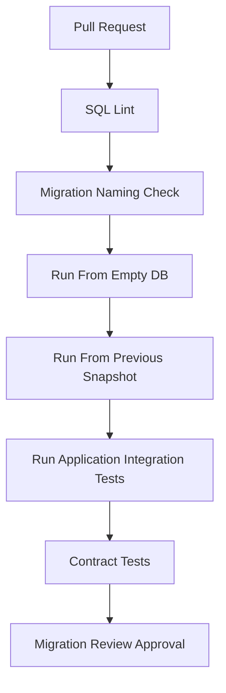

# Part 017 — Database Migration and Seed Data Strategy

Di bagian sebelumnya kita sudah punya model persistence: entity, aggregate, snapshot, outbox, audit, idempotency, dan optimistic lock.

Sekarang pertanyaannya berubah.

Bukan lagi:

```text
Schema seperti apa yang benar?
```

Tapi:

```text
Bagaimana schema yang benar itu berubah berkali-kali tanpa merusak quote, order, workflow, audit, event, dan integrasi yang sedang berjalan?
```

Inilah inti database migration di sistem enterprise.

Migration bukan sekadar folder berisi `V001__create_table.sql`.

Migration adalah **mechanism of controlled change**.

Dalam CPQ/OMS, database berubah karena banyak alasan:

- product catalog makin kompleks;
- pricing rule berubah;
- quote lifecycle bertambah state;
- approval policy butuh evidence baru;
- order fulfillment butuh step baru;
- audit requirement berubah;
- event schema berubah;
- query/reporting butuh index baru;
- production incident memaksa correction script;
- compliance meminta retention/traceability baru.

Kalau migration tidak disiplin, masalahnya bukan cuma deployment gagal.

Masalahnya bisa menjadi:

```text
Quote lama tidak bisa dibuka.
Order lama tidak bisa diaudit.
Process instance Camunda tidak bisa dikorelasikan.
Consumer Kafka membaca event dengan bentuk yang tidak dimengerti.
Pricing result tidak lagi bisa dijelaskan.
```

Target bagian ini: kamu bisa mendesain migration dan seed data strategy yang aman untuk CPQ/OMS production-grade.

---

## 1. Mental Model: Database Is a Product Surface

Database sering dianggap detail internal.

Itu benar hanya sebagian.

Dalam microservices, database memang seharusnya private untuk service owner. Tetapi untuk service itu sendiri, database adalah **produk internal** yang dikonsumsi oleh:

- application code versi lama dan baru;
- background worker;
- event publisher;
- reconciliation job;
- reporting projection;
- admin tooling;
- incident recovery script;
- migration berikutnya;
- manusia yang melakukan audit atau forensics.

Jadi schema bukan sekadar storage.

Schema adalah **long-lived contract between time-separated versions of your own system**.

Versi aplikasi hari ini harus bisa hidup berdampingan dengan data yang dibuat oleh versi aplikasi tahun lalu.

Itulah alasan migration harus diperlakukan seperti API evolution.

---

## 2. Migration Invariant

Sebelum membahas tool, tetapkan invariant.

Tool seperti Flyway atau Liquibase hanya membantu eksekusi dan tracking. Tool tidak otomatis membuat migration aman.

### 2.1 Invariant Utama

Migration CPQ/OMS harus menjaga ini:

```text
Setiap quote/order/process/event/audit record yang valid sebelum migration
harus tetap bisa dibaca, dijelaskan, dan diproses sesuai lifecycle setelah migration,
kecuali ada migration bisnis yang secara eksplisit mengubah statusnya dengan audit trail.
```

Turunannya:

| Invariant | Makna |
|---|---|
| Historical readability | Data lama tetap bisa dibaca oleh sistem baru. |
| Evidence preservation | Snapshot, price trace, approval trace, dan audit tidak hilang. |
| Forward migration | Perbaikan dilakukan dengan migration baru, bukan edit migration lama yang sudah release. |
| Idempotent seed | Seed/reference data aman dijalankan ulang jika strateginya repeatable. |
| Compatibility window | Schema harus mendukung app versi lama dan baru selama rolling deploy. |
| Migration observability | Migration harus meninggalkan evidence: kapan, versi apa, checksum apa, siapa yang menjalankan. |
| Recovery path | Jika migration gagal di tengah, ada runbook yang jelas. |

### 2.2 Migration Bukan Tempat Menyembunyikan Business Logic

Migration boleh melakukan data correction.

Tapi migration tidak boleh menjadi mesin lifecycle diam-diam.

Contoh buruk:

```sql
update quote
set state = 'APPROVED'
where total_amount < 1000000;
```

Ini buruk karena approval bukan sekadar state. Approval membutuhkan decision evidence.

Kalau memang perlu mass transition, migration harus membuat:

- transition log;
- audit log;
- reason code;
- actor/system identity;
- timestamp;
- source migration id;
- mungkin event/outbox jika downstream perlu tahu.

---

## 3. Tooling: Flyway vs Liquibase, Tanpa Fanatisme

Di enterprise Java, dua tool umum adalah Flyway dan Liquibase.

Flyway kuat karena sederhana: migration SQL versioned, repeatable migration, checksum, dan schema history. Dokumentasi Flyway menjelaskan bahwa versioned migrations diterapkan berurutan dan tepat sekali, serta dilacak di `flyway_schema_history`; repeatable migrations diterapkan setelah pending versioned migrations dan harus aman untuk dijalankan ulang.

Liquibase kuat karena changelog/changeset, format deklaratif, precondition, rollback metadata, dan governance workflow. Dokumentasi Liquibase mendefinisikan changeset sebagai unit dasar perubahan dan `DATABASECHANGELOG` sebagai tabel tracking changeset yang sudah dijalankan.

Untuk seri ini, kita akan memakai gaya contoh **Flyway-style SQL migration** karena:

- mudah dibaca;
- dekat dengan PostgreSQL;
- eksplisit;
- cocok untuk engineer yang ingin tahu apa yang benar-benar terjadi pada database.

Namun prinsipnya berlaku juga untuk Liquibase.

### 3.1 Pilihan Tool Tidak Mengganti Discipline

Yang penting bukan tool-nya.

Yang penting adalah policy:

```text
Migration immutable.
Migration tested.
Migration reviewed.
Migration observable.
Migration reversible secara operasional walau tidak selalu SQL rollback.
Migration compatible dengan rolling deployment.
```

---

## 4. Jenis Migration dalam CPQ/OMS

Jangan perlakukan semua migration sama.

Berikut taxonomy yang lebih berguna.

| Jenis | Contoh | Risiko |
|---|---|---|
| Structural DDL | create table, add column, add index | lock, downtime, compatibility |
| Constraint migration | FK, unique, check, not null | existing dirty data, long validation |
| Reference data | state code, reason code, approval role | drift antar environment |
| Catalog seed | product offering, characteristic, bundle | business correctness, effective dating |
| Policy seed | approval threshold, pricing policy | invisible behavior change |
| Backfill | populate new column dari old data | volume, lock, correctness |
| Data correction | fix broken historical rows | auditability, legal defensibility |
| Projection rebuild | rebuild search/read model | stale query, long runtime |
| Repeatable object | view, function, stored helper | idempotency, dependency order |
| Operational migration | partition attach, index concurrently | production lock behavior |

CPQ/OMS biasanya gagal bukan karena create table.

Ia gagal karena reference/catalog/policy seed berubah tanpa versioning.

---

## 5. Repository Layout untuk Migration

Struktur yang sederhana tapi scalable:

```text
services/
  quote-service/
    src/main/java/...
    src/main/resources/
      db/
        migration/
          V001__init_quote_schema.sql
          V002__add_quote_revision_snapshot.sql
          V003__add_quote_transition_log.sql
          R__quote_read_model_views.sql
        seed/
          reference/
            quote_state.seed.sql
            quote_reason_code.seed.sql
          catalog-sample/
            sample_catalog_manifest.yaml
            sample_catalog_seed.sql
          test-only/
            quote_test_fixture.sql
    src/test/resources/
      db/
        migration-test/
          before-v002.sql
          expected-v002.sql
```

Untuk platform multi-service:

```text
platform/
  db/
    conventions/
      migration-naming.md
      seed-data-policy.md
      zero-downtime-ddl.md
  services/
    catalog-service/
    pricing-service/
    quote-service/
    order-service/
    workflow-service/
```

Jangan gabungkan migration semua service ke satu folder global kecuali memang ada satu database monolith yang dimiliki satu runtime.

Dalam microservices, setiap service seharusnya punya ownership schema-nya sendiri.

---

## 6. Naming Convention

Nama migration harus menjawab:

```text
Apa yang berubah?
Kenapa berubah?
Apakah ini structural, seed, atau backfill?
```

Contoh:

```text
V001__create_quote_core_tables.sql
V002__create_quote_line_tree_tables.sql
V003__add_quote_revision_acceptance_guard.sql
V004__add_quote_price_snapshot_hash.sql
V005__create_quote_transition_log.sql
V006__create_quote_outbox.sql
V007__backfill_quote_revision_snapshot_hash.sql
V008__add_not_null_quote_revision_snapshot_hash.sql
R__quote_operational_views.sql
```

Hindari nama seperti:

```text
V017__changes.sql
V018__fix.sql
V019__final_fix.sql
V020__really_final.sql
```

Itu bukan lucu.

Itu future incident.

---

## 7. Versioned Migration Policy

Versioned migration bersifat immutable setelah masuk shared environment.

Artinya:

```text
Kalau V012 sudah pernah dijalankan di dev/staging/prod-like,
jangan edit V012.
Buat V013.
```

Kenapa?

Karena checksum berubah.

Lebih penting lagi, environment yang sudah menjalankan V012 tidak lagi sama dengan environment baru yang menjalankan V012 hasil edit.

Itu menciptakan split reality.

### 7.1 Contoh Versioned Migration

```sql
-- V001__create_quote_core_tables.sql

create table quote (
    id uuid primary key,
    customer_id uuid not null,
    state varchar(40) not null,
    created_at timestamptz not null,
    updated_at timestamptz not null,
    version bigint not null default 0,
    constraint ck_quote_state check (
        state in ('DRAFT', 'CONFIGURED', 'PRICED', 'APPROVAL_REQUIRED', 'APPROVED', 'ACCEPTED', 'EXPIRED', 'CANCELLED')
    )
);

create table quote_revision (
    id uuid primary key,
    quote_id uuid not null references quote(id),
    revision_no integer not null,
    state varchar(40) not null,
    catalog_snapshot_hash varchar(128),
    configuration_snapshot_hash varchar(128),
    price_snapshot_hash varchar(128),
    created_at timestamptz not null,
    created_by varchar(120) not null,
    version bigint not null default 0,
    constraint uq_quote_revision_no unique (quote_id, revision_no)
);
```

### 7.2 Migration Review Questions

Untuk setiap migration, reviewer harus bertanya:

1. Apakah backward compatible dengan versi aplikasi saat ini?
2. Apakah aman untuk rolling deploy?
3. Apakah ada lock besar?
4. Apakah ada backfill? Berapa volume datanya?
5. Apakah constraint akan gagal karena data lama?
6. Apakah migration mengubah behavior bisnis secara diam-diam?
7. Apakah seed data punya owner dan effective date?
8. Apakah ada test untuk database kosong dan database existing?
9. Apakah ada rollback operasional atau forward-fix plan?
10. Apakah read model/projection perlu rebuild?

---

## 8. Repeatable Migration Policy

Repeatable migration cocok untuk object yang bisa dibuat ulang secara idempotent:

- view;
- materialized view definition;
- stored function/helper;
- reporting projection view;
- grant script;
- static lookup refresh yang memang dirancang repeatable.

Contoh:

```sql
-- R__quote_operational_views.sql

create or replace view v_quote_operational_summary as
select
    q.id as quote_id,
    q.customer_id,
    q.state as quote_state,
    qr.revision_no,
    qr.state as revision_state,
    qr.price_snapshot_hash,
    q.updated_at
from quote q
join quote_revision qr on qr.quote_id = q.id
where qr.revision_no = (
    select max(qr2.revision_no)
    from quote_revision qr2
    where qr2.quote_id = q.id
);
```

Rule penting:

```text
Repeatable migration harus benar-benar aman jika dijalankan ulang.
```

Kalau script menghapus lalu insert ulang reference data tanpa memperhatikan FK, itu bukan repeatable yang aman.

---

## 9. Seed Data: Jangan Campur Semua Menjadi Satu

Dalam CPQ/OMS, seed data punya kelas berbeda.

### 9.1 Reference Data

Reference data adalah data kecil, relatif stabil, dan dipakai sebagai vocabulary sistem.

Contoh:

- quote state;
- order state;
- reason code;
- approval role;
- fulfillment step type;
- event type;
- error code;
- currency code subset;
- channel code.

Reference data biasanya harus ada di semua environment.

### 9.2 Catalog Seed

Catalog seed adalah contoh atau initial product catalog.

Ini jauh lebih berbahaya daripada reference data.

Catalog seed bisa mengubah behavior configuration dan pricing.

Contoh:

```text
Product Offering: ENTERPRISE_INTERNET_1G
Characteristic: bandwidth = 1Gbps
Required Option: router
Eligibility: business segment = ENTERPRISE
Effective From: 2026-07-01
```

Catalog seed harus versioned dan effective-dated.

### 9.3 Policy Seed

Policy seed mengubah keputusan.

Contoh:

```text
If discount > 15%, approval required from SALES_MANAGER.
If discount > 30%, approval required from FINANCE_DIRECTOR.
```

Ini tidak boleh dianggap data biasa.

Policy seed adalah **business behavior deployment**.

### 9.4 Test Fixture

Test fixture hanya untuk test.

Jangan pernah masuk production migration.

Folder harus jelas:

```text
seed/reference
seed/sample
seed/test-only
```

---

## 10. Seed Data Strategy

Ada dua pendekatan.

### 10.1 Seed sebagai Versioned Migration

Cocok untuk reference data wajib.

```sql
-- V010__seed_quote_reason_codes.sql

insert into quote_reason_code (code, description, active, created_at)
values
    ('CUSTOMER_REQUEST', 'Customer requested the change', true, now()),
    ('PRICE_REVIEW', 'Quote requires price review', true, now()),
    ('CONFIGURATION_INVALID', 'Configuration is invalid', true, now())
on conflict (code) do update
set
    description = excluded.description,
    active = excluded.active;
```

Ini idempotent dari sisi SQL, tetapi tetap perlu hati-hati.

`on conflict do update` bisa mengubah meaning lama.

Kalau reason code sudah dipakai di audit historical, jangan rename meaning secara sembarangan.

Lebih aman:

```text
Tambah code baru.
Deprecate code lama.
Jangan ubah arti code lama.
```

### 10.2 Seed sebagai Data Package

Cocok untuk catalog/policy yang punya lifecycle sendiri.

Contoh manifest:

```yaml
packageId: catalog-enterprise-internet-2026-07
owner: catalog-team
service: catalog-service
effectiveFrom: 2026-07-01T00:00:00Z
effectiveTo: null
compatibility:
  schemaVersion: catalog-v3
  pricingPolicyVersion: pricing-policy-v5
contains:
  - productSpecifications
  - productOfferings
  - bundleRules
  - eligibilityRules
  - pricingReferences
approval:
  approvedBy: commercial-ops
  approvedAt: 2026-06-25T10:00:00Z
```

Catalog seed bukan cuma SQL.

Ia adalah release artifact.

---

## 11. Effective Dating untuk Catalog dan Policy

CPQ/OMS hampir selalu butuh effective dating.

Jangan overwrite product offering secara destructive.

Gunakan versioning:

```text
ProductOffering(id = PO-001, version = 7, effective_from = 2026-01-01)
ProductOffering(id = PO-001, version = 8, effective_from = 2026-07-01)
```

Quote harus menyimpan snapshot/reference ke versi yang dipakai.

```text
QuoteRevision.catalogVersion = catalog-2026.07
QuoteLine.productOfferingId = PO-001
QuoteLine.productOfferingVersion = 8
QuoteLine.productSnapshot = {...}
```

Rule:

```text
Perubahan catalog baru tidak boleh mengubah quote revision lama.
```

Kalau quote lama perlu reprice/reconfigure, lakukan command eksplisit:

```text
ReconfigureQuoteAgainstCurrentCatalog
RepriceQuoteAgainstCurrentPolicy
```

Bukan migration diam-diam.

---

## 12. Expand-Migrate-Contract Pattern

Untuk zero/low downtime, gunakan pola:

```text
expand -> migrate/backfill -> switch code -> contract
```

### 12.1 Contoh: Menambah Kolom Wajib

Tujuan akhir:

```text
quote_revision.price_snapshot_hash not null
```

Jangan langsung:

```sql
alter table quote_revision
add column price_snapshot_hash varchar(128) not null;
```

Itu akan gagal jika ada row existing dan bisa mengunci besar.

Lakukan bertahap.

#### Step 1 — Expand

```sql
-- V021__add_nullable_price_snapshot_hash.sql
alter table quote_revision
add column price_snapshot_hash varchar(128);
```

Deploy app yang mulai mengisi kolom baru.

#### Step 2 — Backfill

```sql
-- V022__backfill_price_snapshot_hash.sql
update quote_revision
set price_snapshot_hash = encode(sha256(coalesce(price_result_snapshot::text, '')::bytea), 'hex')
where price_snapshot_hash is null;
```

Untuk volume besar, jangan update semua sekaligus.

Gunakan batch job application-side atau migration chunked.

#### Step 3 — Validate

```sql
-- V023__validate_price_snapshot_hash_present.sql
DO $$
BEGIN
    IF EXISTS (
        SELECT 1 FROM quote_revision WHERE price_snapshot_hash IS NULL LIMIT 1
    ) THEN
        RAISE EXCEPTION 'quote_revision.price_snapshot_hash still contains null values';
    END IF;
END $$;
```

#### Step 4 — Contract

```sql
-- V024__set_price_snapshot_hash_not_null.sql
alter table quote_revision
alter column price_snapshot_hash set not null;
```

### 12.2 Why It Matters

Rolling deployment berarti app versi lama dan baru bisa hidup bersamaan beberapa menit atau jam.

Schema harus kompatibel dengan keduanya.

Kalau tidak, satu pod versi baru berhasil, satu pod versi lama crash, lalu request random gagal.

---

## 13. Backfill Strategy

Backfill adalah migration paling sering diremehkan.

Backfill buruk bisa membuat production lambat, deadlock, atau corrupt.

### 13.1 Kapan Backfill Boleh di Migration SQL?

Boleh jika:

- data kecil;
- query deterministic;
- tidak memanggil service external;
- tidak butuh business decision kompleks;
- bisa selesai cepat;
- lock impact dipahami.

### 13.2 Kapan Backfill Harus Application Job?

Gunakan application job jika:

- data besar;
- butuh batching;
- butuh retry;
- butuh progress tracking;
- butuh audit per aggregate;
- butuh event/outbox;
- butuh domain service.

Contoh tracking:

```sql
create table migration_job_progress (
    job_name varchar(120) primary key,
    last_processed_id uuid,
    processed_count bigint not null default 0,
    failed_count bigint not null default 0,
    started_at timestamptz not null,
    updated_at timestamptz not null,
    completed_at timestamptz
);
```

Backfill job harus idempotent.

---

## 14. Constraint Migration

Constraint adalah bentuk executable domain truth.

Tapi constraint harus diperkenalkan dengan hati-hati.

### 14.1 Unique Constraint untuk Idempotency

```sql
create unique index uq_quote_idempotency_key
on idempotency_record(service_name, idempotency_key);
```

### 14.2 Partial Unique Index untuk Business Rule

Contoh: satu accepted revision per quote.

```sql
create unique index uq_one_accepted_revision_per_quote
on quote_revision(quote_id)
where state = 'ACCEPTED';
```

Ini lebih tepat daripada mengecek hanya di Java.

### 14.3 Check Constraint untuk Vocabulary Lokal

```sql
alter table order_line
add constraint ck_order_line_action
check (action in ('ADD', 'MODIFY', 'DISCONNECT', 'NO_CHANGE'));
```

Namun jika vocabulary sangat dinamis dan dikelola admin, gunakan reference table.

---

## 15. PostgreSQL Lock Awareness

DDL bukan sekadar metadata change.

Beberapa operasi bisa mengunci table.

Dalam production-grade system, migration review harus memperhatikan:

- table size;
- lock level;
- transaction duration;
- index build strategy;
- long-running query;
- replication lag;
- autovacuum interaction;
- peak traffic window.

### 15.1 Index Concurrently

Untuk table besar, PostgreSQL mendukung index creation concurrently.

```sql
create index concurrently idx_quote_customer_updated_at
on quote(customer_id, updated_at desc);
```

Catatan penting:

```text
CREATE INDEX CONCURRENTLY tidak boleh dijalankan di dalam transaction block biasa.
```

Tool migration perlu dikonfigurasi agar migration tertentu tidak dibungkus transaction jika diperlukan.

### 15.2 Avoid Giant Transaction

Jangan lakukan:

```sql
update order_line set ... where ...; -- 100 juta row dalam satu transaksi
```

Lebih aman:

- batch by primary key range;
- commit per batch;
- track progress;
- throttle;
- monitor locks;
- stop/resume safely.

---

## 16. JSONB Evolution

Kita sudah menetapkan: JSONB boleh dipakai untuk snapshot/evidence, bukan untuk core relational invariant.

Migration JSONB punya aturan sendiri.

### 16.1 Jangan Mutasi Historical Snapshot Tanpa Reason

Jika quote snapshot lama menyimpan:

```json
{
  "schemaVersion": "quote-snapshot-v1",
  "productOffering": "ENTERPRISE_INTERNET"
}
```

Jangan migration diam-diam menjadi v2 hanya karena aplikasi baru ingin bentuk baru.

Lebih aman:

- reader mendukung v1 dan v2;
- command baru menghasilkan v2;
- migration hanya dilakukan jika ada reason legal/operasional;
- simpan audit jika snapshot historical diubah.

### 16.2 Snapshot Version Field

Setiap JSONB snapshot harus punya version.

```json
{
  "schemaVersion": "price-result-v3",
  "currency": "IDR",
  "components": []
}
```

Tanpa version, reader masa depan hanya bisa menebak.

Dan menebak bukan strategi enterprise.

---

## 17. Camunda 7 Database Boundary

Camunda 7 punya schema engine sendiri.

Rule:

```text
Jangan migration manual tabel internal Camunda kecuali mengikuti dokumentasi/upgrade script resmi Camunda.
```

Aplikasi boleh menyimpan correlation table sendiri:

```sql
create table workflow_correlation (
    aggregate_type varchar(40) not null,
    aggregate_id uuid not null,
    process_instance_id varchar(80) not null,
    business_key varchar(200) not null,
    process_definition_key varchar(120) not null,
    process_definition_version integer,
    started_at timestamptz not null,
    ended_at timestamptz,
    primary key (aggregate_type, aggregate_id, process_instance_id)
);
```

Tapi jangan menambahkan kolom ke tabel `ACT_*`.

Workflow state yang penting untuk domain harus disimpan di domain service, bukan hanya di Camunda engine database.

Camunda menyimpan process execution.

Domain service menyimpan business truth.

---

## 18. Outbox Migration

Outbox adalah bagian dari transaction boundary.

Schema awal:

```sql
create table outbox_event (
    id uuid primary key,
    aggregate_type varchar(80) not null,
    aggregate_id uuid not null,
    event_type varchar(160) not null,
    event_version integer not null,
    payload jsonb not null,
    headers jsonb not null,
    status varchar(40) not null,
    created_at timestamptz not null,
    published_at timestamptz,
    retry_count integer not null default 0,
    last_error text,
    constraint ck_outbox_status check (status in ('NEW', 'PUBLISHING', 'PUBLISHED', 'FAILED'))
);

create index idx_outbox_new_created_at
on outbox_event(created_at)
where status = 'NEW';
```

Saat event schema berubah, jangan update payload event lama kecuali sangat perlu.

Gunakan `event_version`.

Consumer harus version-aware.

---

## 19. Migration untuk Read Model dan Search

Read model bukan source of truth.

Tapi read model tetap operationally critical.

Strategi:

1. schema read model bisa di-drop/rebuild jika derived;
2. rebuild harus punya job terukur;
3. query service harus tahu status projection freshness;
4. admin harus bisa melihat lag;
5. source of truth tetap domain tables.

Contoh:

```sql
create table quote_search_projection (
    quote_id uuid primary key,
    customer_id uuid not null,
    quote_number varchar(80) not null,
    state varchar(40) not null,
    latest_revision_no integer not null,
    total_amount numeric(19, 4),
    currency varchar(3),
    updated_at timestamptz not null,
    projection_version integer not null,
    rebuilt_at timestamptz not null
);
```

Jika projection berubah drastis, buat version baru:

```text
quote_search_projection_v2
```

Lalu cutover setelah rebuild selesai.

---

## 20. Environment Strategy

Migration harus konsisten di semua environment.

Tetapi seed data tidak selalu sama.

| Environment | Migration | Reference Seed | Catalog Seed | Test Fixture |
|---|---:|---:|---:|---:|
| Local | yes | yes | sample | optional |
| CI | yes | yes | minimal deterministic | yes |
| Dev shared | yes | yes | controlled | no random |
| Staging | yes | yes | prod-like | no |
| Production | yes | yes | approved package only | no |

Jangan biarkan developer local punya schema berbeda karena script manual.

Local harus bisa dibangun dari nol:

```text
clone repo -> run compose -> run migrations -> run tests -> system works
```

---

## 21. Migration Testing Strategy

Migration harus dites seperti code.

Minimal test:

### 21.1 Empty Database Test

```text
Database kosong -> semua migration berjalan -> app start -> smoke test pass
```

### 21.2 Upgrade Database Test

```text
Database pada versi N dengan data realistis -> migration N+1 -> invariant tetap benar
```

### 21.3 Backward Compatibility Test

```text
App old + schema expanded -> masih bisa jalan
App new + schema expanded -> bisa jalan
App new + schema contracted -> bisa jalan
```

### 21.4 Dirty Data Test

Siapkan data yang mungkin ada di production:

- null unexpected;
- duplicate candidate;
- orphan historical row;
- old enum value;
- unknown JSON schema version;
- incomplete outbox row.

Migration harus gagal jelas atau memperbaiki dengan audit.

### 21.5 Performance Smoke

Untuk migration berat:

- estimasi row count;
- explain plan;
- lock observation;
- runtime threshold;
- rollback/stop point.

---

## 22. CI Quality Gates untuk Migration

Pipeline minimal:



Quality gate:

- migration filename valid;
- no edit to applied migration;
- all migrations run from empty DB;
- upgrade from previous release snapshot works;
- app starts with migrated schema;
- critical query plans acceptable;
- seed data validation passes;
- no test fixture in production folder.

---

## 23. Production Migration Runbook

Production runbook harus jelas.

Contoh:

```text
Release: quote-service 2026.07.15
Migration Range: V034 - V039
Expected Duration: < 3 minutes for DDL, backfill async 2 hours
Risk: add nullable column, create index concurrently, seed reason code
Pre-check:
  - no failed outbox > threshold
  - no long-running quote transaction
  - replication lag < threshold
  - disk free > threshold
Execution:
  - run schema migration
  - verify schema history
  - deploy app version X
  - start backfill job
  - monitor backfill progress
Post-check:
  - quote create smoke
  - quote price smoke
  - approval smoke
  - outbox publish smoke
Rollback:
  - do not rollback schema unless instructed
  - disable feature flag quote.priceTraceRequired
  - deploy previous app if compatible
  - stop backfill job safely
Forward fix:
  - V040 if correction required
```

Notice: rollback bukan selalu `drop column`.

Untuk database, rollback operasional sering berupa:

- disable feature flag;
- deploy previous compatible app;
- stop job;
- forward-fix migration;
- restore dari backup hanya untuk bencana besar.

---

## 24. Data Correction dengan Audit

Data correction harus menghasilkan evidence.

Buat table:

```sql
create table data_correction_audit (
    id uuid primary key,
    correction_id varchar(120) not null,
    target_table varchar(120) not null,
    target_id varchar(120) not null,
    before_value jsonb,
    after_value jsonb,
    reason text not null,
    approved_by varchar(120),
    executed_by varchar(120) not null,
    executed_at timestamptz not null
);
```

Correction script:

```sql
insert into data_correction_audit (
    id,
    correction_id,
    target_table,
    target_id,
    before_value,
    after_value,
    reason,
    approved_by,
    executed_by,
    executed_at
)
select
    gen_random_uuid(),
    'CORR-2026-07-QUOTE-STATE-001',
    'quote_revision',
    id::text,
    to_jsonb(qr),
    jsonb_set(to_jsonb(qr), '{state}', '"PRICED"'),
    'Correct quote revisions stuck in CONFIGURED after pricing outage INC-8821',
    'commercial-ops-lead',
    'migration-runner',
    now()
from quote_revision qr
where state = 'CONFIGURED'
  and price_snapshot_hash is not null;

update quote_revision
set state = 'PRICED'
where state = 'CONFIGURED'
  and price_snapshot_hash is not null;
```

Ini masih sederhana.

Untuk lifecycle transition, lebih baik correction memanggil domain command/batch job agar transition log dan event tetap konsisten.

---

## 25. Migration Ownership

Setiap migration harus punya owner.

| Migration Type | Owner Utama | Reviewer Wajib |
|---|---|---|
| Quote schema | Quote service team | DB reviewer, domain reviewer |
| Pricing policy seed | Pricing/commercial team | pricing engineer, audit/compliance jika perlu |
| Catalog seed | Catalog team | product/commercial owner |
| Order schema | Order service team | workflow/order architect |
| Camunda deployment metadata | Workflow team | domain service owner |
| Data correction | Owning service team | incident owner, compliance/audit jika high impact |

Enterprise-grade bukan berarti semua orang approve semua hal.

Enterprise-grade berarti owner jelas.

---

## 26. Anti-Patterns

### 26.1 Editing Applied Migration

```text
"Masih dev doang kok."
```

Kalau sudah shared environment, jangan.

### 26.2 Seed Data Tanpa Effective Date

Catalog berubah, quote lama ikut berubah.

Ini fatal.

### 26.3 Enum Database dan Java Tidak Sinkron

DB menerima state yang Java tidak kenal, atau sebaliknya.

Gunakan compatibility test.

### 26.4 Migration Memanggil External Service

Migration harus deterministic.

Jangan panggil pricing service, CRM, billing, atau inventory dari SQL migration.

### 26.5 Menjadikan Migration sebagai Cleanup Sampah

Migration bukan tempat menambal domain model yang buruk tanpa analisis.

### 26.6 Mengubah Historical Snapshot

Ini menghilangkan evidence.

Kalau harus dilakukan, audit harus kuat.

### 26.7 Satu Global Migration untuk Semua Service

Ini mengikat release antar-service dan membunuh independent deployability.

---

## 27. Practical Checklist

Sebelum merge migration:

```text
[ ] Migration punya nama jelas.
[ ] Tidak mengedit migration yang sudah applied di shared environment.
[ ] Bisa run dari empty DB.
[ ] Bisa upgrade dari previous release snapshot.
[ ] Aman untuk rolling deploy.
[ ] Tidak ada destructive change tanpa expand-contract.
[ ] Backfill punya strategi volume.
[ ] Constraint sudah dicek terhadap existing data.
[ ] Seed data punya owner dan effective date jika behavior-affecting.
[ ] Test fixture tidak masuk production migration.
[ ] Camunda internal table tidak dimodifikasi manual.
[ ] Outbox/event compatibility dipertimbangkan.
[ ] Read model rebuild plan jelas jika perlu.
[ ] Runbook production tersedia untuk migration berisiko.
```

---

## 28. Mini Design: Migration Runner Boundary

Jangan biarkan setiap service menjalankan migration secara acak saat startup di production tanpa policy.

Ada beberapa opsi:

| Opsi | Kapan Cocok | Risiko |
|---|---|---|
| App runs migration at startup | local/dev/simple deploy | multiple pod race, startup delay |
| CI/CD migration step | controlled release | pipeline complexity |
| Dedicated migration job | Kubernetes/enterprise deploy | needs orchestration |
| DBA controlled execution | regulated org | slower feedback |

Untuk CPQ/OMS enterprise, opsi terbaik biasanya:

```text
Dedicated migration step/job sebelum app rollout,
dengan lock, observability, dan approval gate.
```

Local environment boleh auto-run.

Production sebaiknya explicit.

---

## 29. Hubungan dengan Part Sebelumnya dan Berikutnya

Part 014 memberi schema.

Part 015-016 memberi persistence mapping.

Part 017 ini memberi cara schema berubah.

Berikutnya Part 018 akan masuk ke service layer JAX-RS/Jersey.

Kenapa urutannya begini?

Karena resource API yang bagus tidak cukup jika persistence dan migration kacau.

API contract terlihat di luar.

Database migration adalah contract dengan waktu.

Keduanya harus konsisten.

---

## 30. Kesimpulan

Database migration dalam CPQ/OMS bukan pekerjaan administratif.

Ia adalah bagian dari architecture.

Jika migration strategy buruk, semua desain bagus sebelumnya akan rusak saat sistem mulai berevolusi.

Pegangan utama:

```text
Schema change is production behavior change.
Seed data is business behavior change.
Backfill is operational workload.
Data correction is evidence-sensitive intervention.
Migration history is audit trail.
```

Engineer top-tier tidak hanya bisa membuat table.

Ia bisa membuat table berubah selama bertahun-tahun tanpa kehilangan kebenaran bisnis.
