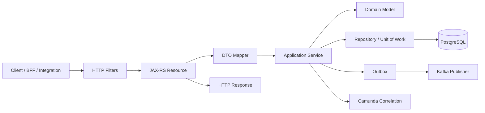
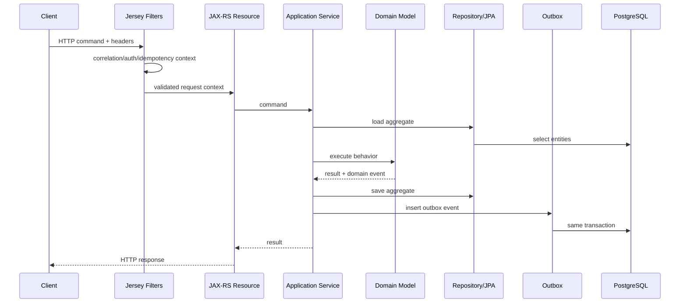
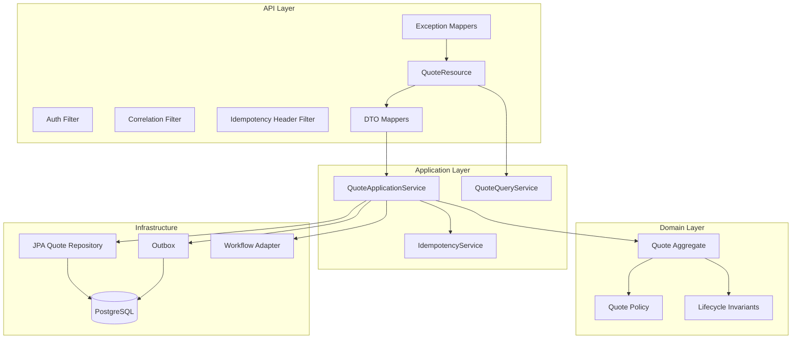

# Part 018 — JAX-RS and Jersey Service Layer

Kita sudah punya domain model, lifecycle invariant, PostgreSQL model, EclipseLink persistence, dan migration strategy.

Sekarang kita masuk ke lapisan yang disentuh oleh dunia luar:

```text
HTTP API service layer dengan JAX-RS dan Jersey.
```

Tetapi jangan salah framing.

Part ini bukan tutorial anotasi `@GET`, `@POST`, dan `@Path` dari nol.

Yang kita bangun adalah **service boundary** untuk CPQ/OMS production-grade.

Pertanyaannya bukan:

```text
Bagaimana membuat endpoint REST?
```

Pertanyaannya:

```text
Bagaimana membuat boundary HTTP yang menjaga contract, lifecycle, transaction, idempotency, authorization, observability, dan domain invariant?
```

JAX-RS/Jakarta REST adalah API standar Java untuk membangun REST-style web services. Jersey adalah implementasi REST framework yang menyediakan implementasi JAX-RS/Jakarta REST plus extension API dan SPI.

Dalam sistem enterprise, framework hanya alat.

Desain boundary yang menentukan apakah service bisa bertahan saat traffic, integrasi, workflow, dan manusia mulai saling bertabrakan.

---

## 1. Mental Model: Resource Is an Adapter, Not the Application

JAX-RS resource class bukan tempat business logic.

Resource class adalah adapter.

Ia menerjemahkan:

```text
HTTP request -> application command/query -> HTTP response
```

Diagramnya:



Resource class tidak boleh menjadi:

- transaction script raksasa;
- tempat query JPA ad-hoc;
- tempat if-else approval policy;
- tempat membuat event payload manual;
- tempat mengakses Camunda engine secara acak;
- tempat menulis audit langsung tanpa domain command.

Resource harus tipis, tetapi tidak bodoh.

Ia tetap bertanggung jawab atas HTTP semantics.

---

## 2. Layering yang Kita Pakai

Struktur service:

```text
quote-service/
  src/main/java/com/acme/cpq/quote/
    api/
      QuoteResource.java
      QuoteAdminResource.java
      QuoteExceptionMapper.java
      CorrelationIdFilter.java
      IdempotencyFilter.java
      SecurityContextMapper.java
    api/dto/
      generated/...
      mapper/QuoteApiMapper.java
    application/
      QuoteApplicationService.java
      command/CreateQuoteCommand.java
      command/ConfigureQuoteCommand.java
      command/PriceQuoteCommand.java
      command/AcceptQuoteCommand.java
      query/QuoteQueryService.java
    domain/
      Quote.java
      QuoteRevision.java
      QuoteLine.java
      QuoteState.java
      QuotePolicy.java
    persistence/
      JpaQuoteRepository.java
      QuoteEntity.java
      QuoteRevisionEntity.java
      JpaUnitOfWork.java
    integration/
      outbox/
      workflow/
      kafka/
```

Boundary rule:

```text
api layer boleh tahu application layer.
application layer boleh tahu domain dan ports.
domain tidak tahu JAX-RS, Jersey, PostgreSQL, Kafka, Redis, atau Camunda.
```

---

## 3. Generated DTO Boundary

Karena seri ini OpenAPI-first, DTO request/response sebaiknya berasal dari contract.

Tapi generated DTO tidak boleh bocor ke domain.

```text
OpenAPI schema -> generated DTO -> mapper -> application command -> domain
```

Kenapa?

Karena API contract dan domain model berubah dengan alasan berbeda.

API DTO peduli:

- compatibility;
- field deprecation;
- JSON shape;
- external naming;
- client ergonomics.

Domain model peduli:

- invariant;
- lifecycle;
- consistency;
- behavior;
- evidence.

Kalau generated DTO dipakai langsung sebagai entity/domain object, kamu mengikat domain ke HTTP contract.

Itu murah di awal, mahal di tahun kedua.

---

## 4. Resource Design: Command-Oriented, Not CRUD-Oriented

CPQ/OMS bukan CRUD.

Quote lifecycle punya command.

Endpoint harus mencerminkan intention.

### 4.1 Buruk: CRUD-Shaped Lifecycle

```http
PATCH /quotes/{quoteId}
{
  "state": "ACCEPTED"
}
```

Ini buruk karena acceptance bukan update field.

Acceptance membutuhkan:

- quote revision check;
- price freshness;
- approval freshness;
- document freshness;
- customer authorization;
- idempotency;
- transition log;
- event;
- possible order creation.

### 4.2 Baik: Command-Shaped Endpoint

```http
POST /quotes/{quoteId}/revisions/{revisionNo}/acceptance
Idempotency-Key: 13d6d6b4-7d4a-4e67-97e2-ef0b4a8b40e2
If-Match: "quote-revision-version-12"
```

Body:

```json
{
  "acceptedBy": "customer-user-123",
  "acceptedAt": "2026-07-02T10:15:30Z",
  "acceptanceChannel": "PORTAL",
  "acceptedDocumentId": "doc-991"
}
```

Response:

```http
202 Accepted
Location: /quotes/{quoteId}/revisions/{revisionNo}/acceptance-requests/{requestId}
```

Atau jika synchronous dan cepat:

```http
200 OK
```

dengan response body transition result.

---

## 5. URI Model untuk Quote Service

Contoh URI:

```text
POST   /quotes
GET    /quotes/{quoteId}
GET    /quotes/{quoteId}/revisions/{revisionNo}
POST   /quotes/{quoteId}/revisions/{revisionNo}/configuration
POST   /quotes/{quoteId}/revisions/{revisionNo}/pricing
POST   /quotes/{quoteId}/revisions/{revisionNo}/approval-requests
POST   /quotes/{quoteId}/revisions/{revisionNo}/acceptance
POST   /quotes/{quoteId}/revisions/{revisionNo}/cancellation
POST   /quotes/{quoteId}/revisions/{revisionNo}/conversion-to-order
GET    /quotes/{quoteId}/transitions
GET    /quotes/{quoteId}/audit
GET    /quotes/search
```

Rule:

```text
Gunakan POST untuk command yang mengubah lifecycle.
Gunakan GET untuk query/read model.
Gunakan PUT/PATCH hanya jika semantics-nya benar-benar replacement/partial update resource, bukan lifecycle command.
```

---

## 6. Resource Skeleton

Contoh JAX-RS resource:

```java
package com.acme.cpq.quote.api;

import com.acme.cpq.quote.api.dto.generated.AcceptQuoteRequestDto;
import com.acme.cpq.quote.api.dto.generated.AcceptQuoteResponseDto;
import com.acme.cpq.quote.api.dto.mapper.QuoteApiMapper;
import com.acme.cpq.quote.application.QuoteApplicationService;
import com.acme.cpq.quote.application.command.AcceptQuoteCommand;
import jakarta.inject.Inject;
import jakarta.validation.Valid;
import jakarta.ws.rs.Consumes;
import jakarta.ws.rs.HeaderParam;
import jakarta.ws.rs.POST;
import jakarta.ws.rs.Path;
import jakarta.ws.rs.PathParam;
import jakarta.ws.rs.Produces;
import jakarta.ws.rs.core.Context;
import jakarta.ws.rs.core.MediaType;
import jakarta.ws.rs.core.Response;
import jakarta.ws.rs.core.SecurityContext;

@Path("/quotes")
@Consumes(MediaType.APPLICATION_JSON)
@Produces(MediaType.APPLICATION_JSON)
public class QuoteResource {

    private final QuoteApplicationService applicationService;
    private final QuoteApiMapper mapper;

    @Inject
    public QuoteResource(
            QuoteApplicationService applicationService,
            QuoteApiMapper mapper
    ) {
        this.applicationService = applicationService;
        this.mapper = mapper;
    }

    @POST
    @Path("/{quoteId}/revisions/{revisionNo}/acceptance")
    public Response acceptQuote(
            @PathParam("quoteId") String quoteId,
            @PathParam("revisionNo") int revisionNo,
            @HeaderParam("Idempotency-Key") String idempotencyKey,
            @HeaderParam("If-Match") String ifMatch,
            @Valid AcceptQuoteRequestDto request,
            @Context SecurityContext securityContext
    ) {
        AcceptQuoteCommand command = mapper.toAcceptCommand(
                quoteId,
                revisionNo,
                idempotencyKey,
                ifMatch,
                request,
                securityContext
        );

        var result = applicationService.acceptQuote(command);

        AcceptQuoteResponseDto response = mapper.toAcceptResponse(result);

        return Response
                .status(Response.Status.ACCEPTED)
                .entity(response)
                .location(result.statusUri())
                .build();
    }
}
```

Resource ini melakukan:

- path/header/body extraction;
- validation trigger;
- mapping ke command;
- memanggil application service;
- mapping ke response;
- HTTP status selection.

Resource ini tidak melakukan:

- query JPA langsung;
- manual transaction;
- domain mutation detail;
- Kafka publish langsung;
- Camunda process start langsung tanpa application service.

---

## 7. Application Service Transaction Boundary

Application service adalah tempat transaction boundary.

```java
public class QuoteApplicationService {

    private final QuoteRepository quoteRepository;
    private final IdempotencyService idempotencyService;
    private final Outbox outbox;
    private final Clock clock;

    @Transactional
    public AcceptQuoteResult acceptQuote(AcceptQuoteCommand command) {
        return idempotencyService.execute(command.idempotencyKey(), () -> {
            Quote quote = quoteRepository.getForUpdate(command.quoteId());

            AcceptQuoteResult result = quote.accept(
                    command.revisionNo(),
                    command.acceptedBy(),
                    command.acceptedAt(),
                    command.expectedVersion(),
                    clock.instant()
            );

            quoteRepository.save(quote);
            outbox.add(result.domainEvent());

            return result;
        });
    }
}
```

Catatan:

```text
Transaksi harus mencakup domain mutation + persistence + outbox insert.
Kafka publish terjadi setelah commit oleh outbox publisher.
```

Kalau resource langsung publish Kafka sebelum commit database, kamu menciptakan event tentang fakta yang mungkin gagal tersimpan.

---

## 8. Request Flow Detail



Setiap layer punya tanggung jawab sempit.

Kalau ada error, exception mapper menerjemahkan ke API error model.

---

## 9. Filters: Cross-Cutting HTTP Concerns

Jersey/JAX-RS menyediakan filter/interceptor mechanism.

Gunakan untuk cross-cutting concern, bukan domain logic.

### 9.1 Correlation ID Filter

Tujuan:

- menerima `X-Correlation-Id` dari client jika ada;
- membuat baru jika tidak ada;
- menaruh di MDC/log context;
- mengembalikan header response;
- meneruskan ke application context.

```java
@Provider
@Priority(Priorities.AUTHENTICATION - 100)
public class CorrelationIdFilter implements ContainerRequestFilter, ContainerResponseFilter {

    public static final String HEADER = "X-Correlation-Id";

    @Override
    public void filter(ContainerRequestContext requestContext) {
        String correlationId = requestContext.getHeaderString(HEADER);
        if (correlationId == null || correlationId.isBlank()) {
            correlationId = UUID.randomUUID().toString();
        }
        requestContext.setProperty(HEADER, correlationId);
        MDC.put("correlationId", correlationId);
    }

    @Override
    public void filter(ContainerRequestContext requestContext, ContainerResponseContext responseContext) {
        Object correlationId = requestContext.getProperty(HEADER);
        if (correlationId != null) {
            responseContext.getHeaders().putSingle(HEADER, correlationId.toString());
        }
        MDC.remove("correlationId");
    }
}
```

### 9.2 Idempotency Header Filter

Filter boleh memastikan command tertentu punya header.

Tapi deduplication result harus di application service, karena perlu transaction dan database record.

Filter responsibility:

```text
missing header -> 400
malformed header -> 400
present header -> attach to context
```

Application responsibility:

```text
same idempotency key + same payload -> return same result
same idempotency key + different payload -> conflict
```

### 9.3 Security Context Mapping

JAX-RS `SecurityContext` harus diterjemahkan ke domain/application actor.

```text
Security principal -> ActorContext(userId, roles, tenantId, channel, authStrength)
```

Jangan sebar parsing JWT claims di resource method.

---

## 10. Validation Strategy

Validation punya beberapa level.

| Level | Contoh | Lokasi |
|---|---|---|
| Syntax validation | required field, string length, enum shape | generated DTO / Bean Validation |
| Semantic request validation | revisionNo positive, header present | mapper/resource/application command factory |
| Domain invariant | quote must be priced before acceptance | domain model |
| Authorization validation | actor can approve discount | policy/authorization service |
| Persistence validation | uniqueness, FK, check constraint | PostgreSQL |

Jangan berharap satu level menyelesaikan semua.

### 10.1 DTO Validation

```java
public class AcceptQuoteRequestDto {
    @NotNull
    private OffsetDateTime acceptedAt;

    @NotBlank
    private String acceptedBy;

    @NotBlank
    private String acceptanceChannel;
}
```

### 10.2 Domain Validation

```java
public AcceptQuoteResult accept(...) {
    if (!state.canAccept()) {
        throw new InvalidQuoteTransitionException(id, state, QuoteTransition.ACCEPT);
    }

    if (!activeRevision.isPriced()) {
        throw new QuoteNotPricedException(id, activeRevision.revisionNo());
    }

    if (activeRevision.requiresApprovalButNotApproved()) {
        throw new ApprovalRequiredException(id, activeRevision.revisionNo());
    }

    // transition...
}
```

DTO validation says request is well-formed.

Domain validation says action is allowed.

Jangan dicampur.

---

## 11. Exception Mapping

API error harus konsisten.

Part 019 akan membahas error model lebih dalam. Di sini kita siapkan mekanisme JAX-RS-nya.

### 11.1 Problem Response Shape

```json
{
  "type": "https://api.acme.com/problems/invalid-quote-transition",
  "title": "Invalid quote transition",
  "status": 409,
  "detail": "Quote 7a... cannot be accepted from state CONFIGURED.",
  "code": "QUOTE_INVALID_TRANSITION",
  "correlationId": "95c2f4b1-02b8-4d85-9979-0d68775a2cfd",
  "fields": []
}
```

### 11.2 Exception Mapper

```java
@Provider
public class DomainExceptionMapper implements ExceptionMapper<DomainException> {

    @Context
    private HttpHeaders headers;

    @Override
    public Response toResponse(DomainException exception) {
        ProblemDto problem = ProblemDto.builder()
                .type(exception.problemType())
                .title(exception.title())
                .status(exception.httpStatus())
                .detail(exception.safeMessage())
                .code(exception.code())
                .correlationId(CurrentCorrelation.id())
                .build();

        return Response
                .status(exception.httpStatus())
                .type(MediaType.APPLICATION_JSON_TYPE)
                .entity(problem)
                .build();
    }
}
```

Rules:

- domain conflict -> `409 Conflict`;
- validation error -> `400 Bad Request` atau `422 Unprocessable Entity`, pilih satu policy;
- auth missing -> `401 Unauthorized`;
- auth forbidden -> `403 Forbidden`;
- not found -> `404 Not Found`;
- stale version -> `412 Precondition Failed` jika memakai `If-Match`;
- async accepted -> `202 Accepted`;
- unexpected error -> `500` dengan safe message.

---

## 12. Optimistic Concurrency via HTTP

Quote revision sering diedit oleh banyak user.

HTTP layer harus membawa concurrency control.

Gunakan ETag/If-Match style.

```http
GET /quotes/{quoteId}/revisions/3
```

Response:

```http
200 OK
ETag: "quote-revision-3-version-17"
```

Command:

```http
POST /quotes/{quoteId}/revisions/3/pricing
If-Match: "quote-revision-3-version-17"
```

Jika version berubah:

```http
412 Precondition Failed
```

Jangan biarkan last write wins untuk quote commercial object.

Last write wins cocok untuk preferensi UI.

Tidak cocok untuk discount, approval, dan acceptance.

---

## 13. Idempotency Design at API Layer

Command yang berbahaya harus idempotent.

Contoh:

- create quote;
- price quote;
- request approval;
- accept quote;
- convert quote to order;
- submit order;
- cancel order.

### 13.1 Idempotency Record

```sql
create table idempotency_record (
    service_name varchar(80) not null,
    idempotency_key varchar(160) not null,
    request_hash varchar(128) not null,
    response_status integer,
    response_body jsonb,
    state varchar(40) not null,
    created_at timestamptz not null,
    completed_at timestamptz,
    primary key (service_name, idempotency_key)
);
```

### 13.2 Behavior

| Situation | Result |
|---|---|
| new key | execute command |
| same key, same request, completed | return stored result |
| same key, same request, in progress | return 409/202 depending policy |
| same key, different request hash | 409 Conflict |
| key expired | reject or treat as new depending policy |

Do not implement idempotency only in Redis for source-of-truth command.

Redis can help short-term coordination, but durable idempotency belongs in PostgreSQL for CPQ/OMS lifecycle commands.

---

## 14. Synchronous vs Asynchronous API Semantics

Some commands are fast.

Some commands start workflow.

### 14.1 Fast Command

Example: local quote draft creation.

```http
201 Created
Location: /quotes/{quoteId}
```

### 14.2 Long Command

Example: convert accepted quote to order with Camunda orchestration.

```http
202 Accepted
Location: /operations/{operationId}
```

The operation resource can expose:

```json
{
  "operationId": "op-123",
  "state": "RUNNING",
  "aggregateType": "QUOTE",
  "aggregateId": "quote-123",
  "processInstanceId": "camunda-process-id",
  "startedAt": "2026-07-02T10:15:30Z"
}
```

Do not fake synchronous success when fulfillment/orchestration is not done.

If order creation is asynchronous, response must say so.

---

## 15. Camunda Boundary from Resource Layer

Resource should not directly contain BPMN orchestration decisions.

Bad:

```java
runtimeService.startProcessInstanceByKey("quoteApproval", businessKey, variables);
```

inside resource method.

Better:

```text
Resource -> QuoteApplicationService.requestApproval(command)
ApplicationService -> domain validates approval need
ApplicationService -> save approval request + outbox/workflow command
WorkflowAdapter -> starts/correlates Camunda process after transaction policy
```

Camunda process start might be in same service transaction if embedded engine and same transaction boundary, or via command/outbox if remote/decoupled.

The architectural point:

```text
HTTP resource should not own workflow semantics.
```

---

## 16. Pagination and Search API

Search endpoint should not expose database details.

Example:

```http
GET /quotes/search?customerId=...&state=PRICED&updatedAfter=2026-07-01T00:00:00Z&pageSize=50&pageToken=...
```

Response:

```json
{
  "items": [],
  "nextPageToken": "opaque-token",
  "resultTime": "2026-07-02T10:15:30Z"
}
```

Rules:

- use opaque page token, not raw offset if data changes rapidly;
- cap page size;
- define sort order;
- return projection shape, not entity graph;
- avoid N+1 load from resource;
- separate operational search from audit export.

---

## 17. Content Negotiation and Versioning

OpenAPI-first does not remove need for runtime compatibility.

Policy options:

1. URI versioning: `/v1/quotes`;
2. media type versioning;
3. header versioning;
4. additive compatible evolution within same version.

For this series, keep simple:

```text
Major version in base path if needed.
Within major version, only additive compatible changes.
Breaking changes require new major contract.
```

Example:

```text
/api/v1/quotes
```

But avoid version obsession.

Most CPQ/OMS APIs can evolve with:

- additive fields;
- enum expansion with compatibility policy;
- deprecated fields;
- new command endpoint;
- new response object field;
- stable error code.

---

## 18. Jersey Application Configuration

Example:

```java
@ApplicationPath("/api/v1")
public class QuoteApplication extends ResourceConfig {

    public QuoteApplication() {
        packages("com.acme.cpq.quote.api");

        register(CorrelationIdFilter.class);
        register(IdempotencyHeaderFilter.class);
        register(SecurityContextFilter.class);

        register(DomainExceptionMapper.class);
        register(ValidationExceptionMapper.class);
        register(NotFoundExceptionMapper.class);
        register(UnexpectedExceptionMapper.class);

        register(JacksonFeature.class);
    }
}
```

Production configuration should make registered components explicit enough to review.

Magic classpath scanning can be convenient, but invisible behavior hurts incident debugging.

---

## 19. Serialization Rules

JSON serialization must be boring.

Boring is good.

Rules:

- timestamps as ISO-8601 with offset/UTC;
- money as decimal string or structured amount, not floating-point;
- enum values stable and documented;
- unknown fields policy defined;
- null vs absent field policy defined;
- no entity lazy proxy serialization;
- no stack traces in API response;
- no internal class names in error response.

Money example:

```json
{
  "amount": "1250000.00",
  "currency": "IDR"
}
```

Avoid:

```json
{
  "amount": 1250000.0000000002
}
```

---

## 20. DTO Mapper Discipline

Mapper is where external representation becomes internal command.

Example:

```java
public AcceptQuoteCommand toAcceptCommand(
        String quoteId,
        int revisionNo,
        String idempotencyKey,
        String ifMatch,
        AcceptQuoteRequestDto request,
        SecurityContext securityContext
) {
    return new AcceptQuoteCommand(
            QuoteId.parse(quoteId),
            revisionNo,
            IdempotencyKey.of(idempotencyKey),
            ExpectedVersion.fromIfMatch(ifMatch),
            ActorContext.from(securityContext),
            request.getAcceptedBy(),
            request.getAcceptedAt().toInstant(),
            AcceptanceChannel.valueOf(request.getAcceptanceChannel())
    );
}
```

Mapper should not:

- load database;
- call pricing service;
- mutate domain;
- decide approval;
- publish event.

Mapper may:

- parse IDs;
- convert date/time;
- convert enum safely;
- normalize string;
- construct command object.

---

## 21. Authorization Boundary

Authorization is not just endpoint-level role check.

CPQ/OMS needs object/action/policy-aware authorization.

Examples:

```text
Can user view this quote?
Can user edit this revision?
Can user override discount 12%?
Can user approve their own discount request?
Can partner submit order for this tenant?
Can operations retry this fulfillment step?
```

Resource can enforce coarse-grained access:

```java
@RolesAllowed("QUOTE_USER")
```

Application/domain policy must enforce fine-grained rules:

```text
actor has approval authority for discount amount and segment
actor belongs to quote tenant
actor is not same as requester if segregation-of-duty rule applies
```

Do not confuse authentication with authorization.

---

## 22. Multi-Tenant Context

If platform is multi-tenant, tenant must be resolved early.

Possible sources:

- JWT claim;
- subdomain;
- request header from trusted gateway;
- path segment;
- mTLS/service identity for internal calls.

Rule:

```text
Tenant context must be part of application command.
Tenant filtering must not rely on frontend honesty.
```

Resource maps tenant context.

Repository enforces tenant scoping.

Database index includes tenant where needed.

Audit logs tenant.

Events include tenant metadata if downstream is tenant-aware.

---

## 23. Response Design

Command response should provide enough information for client to continue without guessing.

Example accept quote response:

```json
{
  "quoteId": "7b7a...",
  "revisionNo": 3,
  "state": "ACCEPTED",
  "transitionId": "tr-991",
  "acceptedAt": "2026-07-02T10:15:30Z",
  "nextActions": [
    {
      "rel": "convert-to-order",
      "href": "/api/v1/quotes/7b7a/revisions/3/conversion-to-order",
      "method": "POST"
    }
  ]
}
```

For async:

```json
{
  "operationId": "op-991",
  "state": "ACCEPTED",
  "statusUrl": "/api/v1/operations/op-991",
  "aggregate": {
    "type": "QUOTE",
    "id": "7b7a..."
  }
}
```

Do not return internal entity dump.

---

## 24. OpenAPI Contract Alignment

Every resource method should be traceable to OpenAPI.

Contract review checks:

```text
[ ] Endpoint has clear command/query semantics.
[ ] Request schema has examples.
[ ] Response schema includes success and error cases.
[ ] Required headers documented.
[ ] Idempotency requirement documented.
[ ] Concurrency header documented.
[ ] Error codes documented.
[ ] Authz scope documented.
[ ] Async operation semantics documented.
```

OpenAPI file is not decoration.

It is source of truth for client/server contract.

---

## 25. Integration Testing with Jersey

Test resource behavior without mocking everything into fantasy.

### 25.1 Resource-Level Test

Useful for:

- routing;
- validation;
- exception mapping;
- serialization;
- headers;
- filters.

### 25.2 Service Integration Test

Useful for:

- JAX-RS -> application -> JPA -> PostgreSQL;
- transaction behavior;
- outbox insert;
- idempotency behavior;
- optimistic lock;
- error response.

Test cases for accept quote:

```text
[ ] accept priced approved quote -> 202/200 + transition log + outbox
[ ] accept unpriced quote -> 409 problem response
[ ] accept stale version -> 412 problem response
[ ] accept with missing idempotency key -> 400 problem response
[ ] retry same idempotency key -> same result
[ ] same idempotency key different payload -> 409
[ ] unauthorized actor -> 403
[ ] unknown quote -> 404
```

---

## 26. Resource Performance Discipline

Resource method should not accidentally create performance disaster.

Watch for:

- N+1 loading during response mapping;
- serializing full quote line tree when summary is enough;
- calling pricing synchronously from list endpoint;
- no page size limit;
- expensive search filters without index;
- large response without compression/streaming policy;
- blocking external calls inside request transaction;
- too-long database transaction while waiting on Camunda/external service.

Rule:

```text
Do not hold DB transaction while calling slow external systems.
```

For external orchestration, persist intent and use async process/outbox.

---

## 27. Admin Resource Boundary

Admin APIs are dangerous.

Separate them.

```text
/api/v1/quotes/...          normal user/integration API
/api/v1/admin/quotes/...    operational/admin API
```

Admin resource examples:

```text
POST /admin/quotes/{quoteId}/revisions/{revisionNo}/force-expiration
POST /admin/quotes/{quoteId}/rebuild-search-projection
GET  /admin/quotes/{quoteId}/diagnostics
```

Admin APIs must have:

- stronger authorization;
- reason required;
- audit required;
- correlation id;
- dry-run if destructive;
- rate limit if heavy;
- explicit warning in OpenAPI.

---

## 28. Anti-Patterns

### 28.1 Entity-as-API

Returning JPA entity directly from resource.

Impact:

- lazy loading leak;
- internal field exposure;
- contract instability;
- security risk;
- recursive serialization.

### 28.2 CRUD Lifecycle Mutation

Using PATCH state to drive lifecycle.

Impact:

- bypassed invariant;
- no transition evidence;
- authorization broken;
- workflow desync.

### 28.3 Resource God Class

One resource with 3000 lines.

Impact:

- impossible review;
- mixed concerns;
- transaction ambiguity;
- test pain.

### 28.4 Exception Stack Trace Response

Impact:

- information leak;
- inconsistent clients;
- poor incident correlation.

### 28.5 Synchronous Everything

Making acceptance wait for order fulfillment, billing, inventory, notification, and document generation.

Impact:

- timeout;
- duplicate request;
- unknown outcome;
- poor user experience.

### 28.6 Hidden Tenant Trust

Taking `tenantId` from request body and trusting it.

Impact:

- data leak;
- broken authorization;
- compliance incident.

---

## 29. Practical Checklist

For every JAX-RS endpoint:

```text
[ ] Is this endpoint command or query?
[ ] Does URI reflect business intention?
[ ] Is request DTO generated from OpenAPI/schema?
[ ] Is DTO mapped to application command, not domain entity?
[ ] Is idempotency required? If yes, is it durable?
[ ] Is optimistic concurrency required? If yes, is If-Match/ETag used?
[ ] Is authorization coarse and fine-grained?
[ ] Is tenant context resolved safely?
[ ] Does application service own transaction boundary?
[ ] Does outbox write happen in same transaction as domain change?
[ ] Does resource avoid direct Kafka/Camunda/JPA business logic?
[ ] Are errors mapped to standard problem response?
[ ] Are headers/correlation IDs propagated?
[ ] Are tests covering success, conflict, validation, authz, retry?
```

---

## 30. Mini Reference Architecture for Quote API



---

## 31. How This Connects to Part 019

Part ini membangun service layer.

Tapi error model baru disentuh secara mekanis.

Part 019 akan memperdalam:

- business errors vs technical errors;
- problem detail shape;
- error code taxonomy;
- retryable vs non-retryable;
- validation field errors;
- conflict semantics;
- stale state;
- workflow incident mapping;
- client behavior contract.

Karena di enterprise CPQ/OMS, error response bukan afterthought.

Error response adalah bagian dari operational model.

---

## 32. Kesimpulan

JAX-RS/Jersey resource layer yang bagus bukan yang paling pendek.

Yang bagus adalah yang menjaga boundary dengan jelas.

Pegangan utama:

```text
Resource handles HTTP.
Application service handles use case and transaction.
Domain handles invariant.
Repository handles persistence.
Outbox handles event durability.
Exception mapper handles API error contract.
Filter handles cross-cutting HTTP context.
OpenAPI handles external contract.
```

Kalau boundary ini dijaga, CPQ/OMS bisa tumbuh tanpa berubah menjadi controller spaghetti.

Kalau boundary ini dilanggar, sistem akan terlihat cepat di awal tetapi membusuk saat lifecycle, approval, pricing, workflow, dan integration mulai kompleks.
