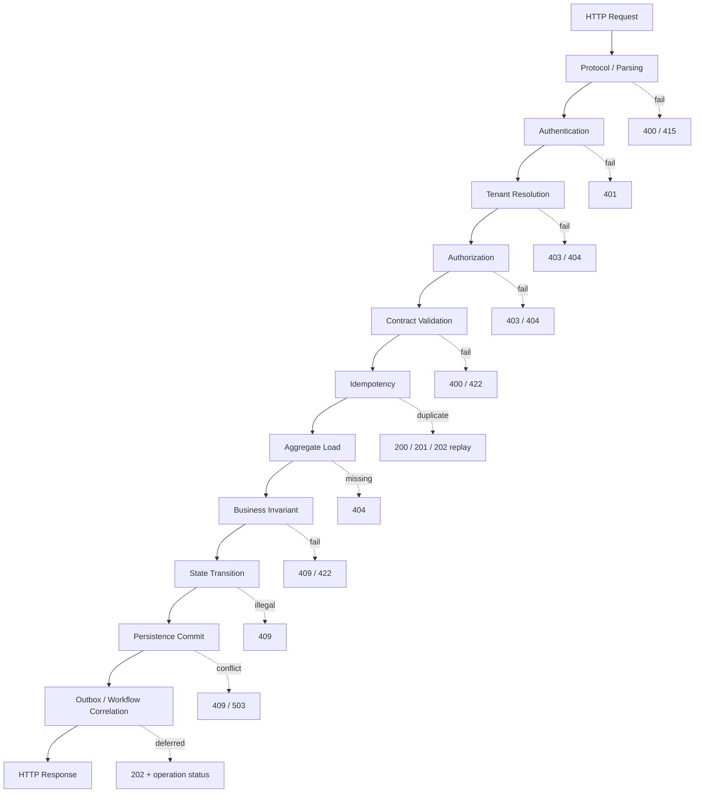
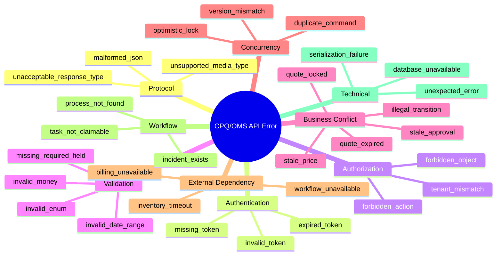
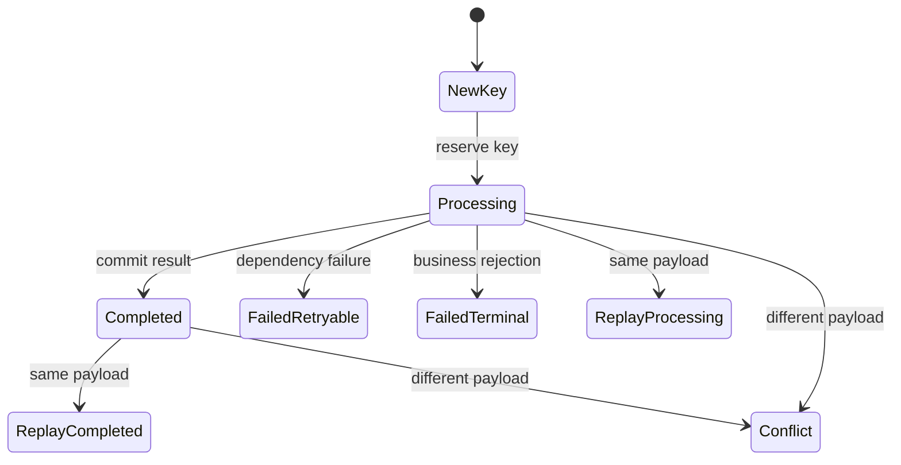
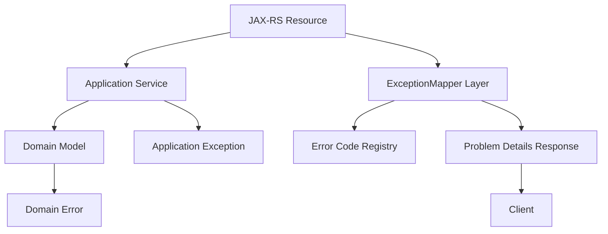

# Part 019 — API Error Model and Problem Details

Kita sudah punya JAX-RS/Jersey service layer.

Sekarang kita perlu menjawab pertanyaan yang sering dianggap kecil, tetapi di sistem enterprise dampaknya besar:

```text
Bagaimana API menyatakan kegagalan?
```

Jangan anggap error response hanya kosmetik.

Di CPQ/OMS, error response adalah bagian dari **contract**.

Ia dipakai oleh:

- frontend untuk menentukan user journey berikutnya;
- integrasi B2B untuk menentukan retry atau manual correction;
- workflow Camunda untuk menentukan apakah process harus retry, escalate, atau incident;
- support team untuk menemukan root cause;
- auditor untuk memahami kenapa keputusan bisnis gagal;
- platform team untuk membedakan bug, data issue, policy issue, dan external dependency issue.

RFC 9457 mendefinisikan **Problem Details for HTTP APIs** sebagai format untuk membawa detail error yang machine-readable tanpa setiap API harus membuat format error baru. Kita akan memakai model itu sebagai dasar, lalu memperluasnya dengan error taxonomy CPQ/OMS.

Part ini bukan tutorial `try-catch`.

Part ini adalah desain **failure language** untuk platform CPQ/OMS.

---

## 1. Mental Model: Error Is a State Transition Result

Dalam sistem sederhana, error sering dipikirkan seperti ini:

```text
request masuk -> exception terjadi -> return 500
```

Dalam CPQ/OMS enterprise, framing itu terlalu lemah.

Command lifecycle yang benar adalah:

```text
request masuk
  -> identity resolved
  -> tenant resolved
  -> contract validated
  -> authorization checked
  -> idempotency checked
  -> aggregate loaded
  -> invariant checked
  -> state transition attempted
  -> side effects planned
  -> transaction committed
  -> response returned
```

Error bisa terjadi di setiap titik.

Setiap titik punya makna berbeda.



Error response yang baik memberi jawaban:

```text
Apa yang gagal?
Apakah caller bisa memperbaiki request?
Apakah caller boleh retry?
Apakah state berubah?
Apakah ada operation id untuk tracking?
Apakah user boleh melihat detailnya?
```

Error response yang buruk hanya berkata:

```json
{
  "message": "Something went wrong"
}
```

Itu tidak cukup untuk enterprise platform.

---

## 2. Prinsip Error Model

Kita pakai prinsip berikut.

### 2.1 Stable for Machines, Useful for Humans

Field yang dikonsumsi mesin harus stabil.

Contoh stabil:

```text
errorCode = QUOTE_ALREADY_ACCEPTED
category = BUSINESS_CONFLICT
retryable = false
```

Contoh tidak stabil:

```text
detail = "Quote Q-123 has already been accepted by John yesterday"
```

`detail` boleh berubah karena ia untuk manusia.

`errorCode` tidak boleh berubah sembarangan karena frontend, workflow, dan integrasi bisa bergantung padanya.

### 2.2 No Stack Trace Across Boundary

Stack trace tidak keluar ke API response.

Stack trace masuk log internal dengan correlation id.

API response cukup memberi:

```text
correlationId
problem type
error code
safe explanation
safe remediation hint
```

### 2.3 Business Error Is Not Always Technical Failure

Contoh:

```text
Cannot accept quote because approval is stale.
```

Itu bukan 500.

Itu business conflict.

Service bekerja benar, justru karena ia menolak state transition yang salah.

### 2.4 Retryability Must Be Explicit

Caller tidak boleh menebak apakah error boleh di-retry.

Kita tambahkan:

```json
"retryable": false
```

atau:

```json
"retryable": true,
"retryAfterSeconds": 30
```

Tetapi hati-hati: `retryable = true` bukan berarti caller boleh hammer service. Retry tetap harus tunduk pada backoff, idempotency key, dan timeout budget.

### 2.5 Security Beats Convenience

Untuk authorization failure, sering lebih aman mengembalikan `404 Not Found` daripada `403 Forbidden` agar keberadaan resource tidak bocor.

Contoh:

```text
GET /quotes/Q-123
```

Jika quote milik tenant lain, response sebaiknya indistinguishable dari resource tidak ada.

---

## 3. Problem Details Base Shape

Base format Problem Details punya konsep seperti:

```json
{
  "type": "https://api.acme.example/problems/quote-already-accepted",
  "title": "Quote already accepted",
  "status": 409,
  "detail": "The quote cannot be modified because it has already been accepted.",
  "instance": "/quotes/Q-2026-000123"
}
```

Kita perlu ekstensi enterprise:

```json
{
  "type": "https://api.acme.example/problems/quote-already-accepted",
  "title": "Quote already accepted",
  "status": 409,
  "detail": "The quote cannot be modified because it has already been accepted.",
  "instance": "/quotes/Q-2026-000123",
  "errorCode": "QUOTE_ALREADY_ACCEPTED",
  "category": "BUSINESS_CONFLICT",
  "severity": "ERROR",
  "retryable": false,
  "correlationId": "corr-01JZK7YV2N8Z8R8V4V1G4RWVJ3",
  "tenantId": "tnt_enterprise_a",
  "businessKey": "quote:Q-2026-000123:rev:3",
  "aggregateId": "Q-2026-000123",
  "aggregateVersion": 17,
  "remediation": "Create a new quote revision before making changes."
}
```

Jangan memasukkan semua field untuk semua error.

Field harus mengikuti kebutuhan kategori error.

---

## 4. CPQ/OMS Error Taxonomy

Error taxonomy adalah bahasa bersama lintas backend, frontend, workflow, support, dan integrasi.



Kita bagi menjadi beberapa kategori utama.

| Category | Meaning | Typical HTTP Status | Retryable |
|---|---|---:|---|
| `PROTOCOL_ERROR` | HTTP parsing/content negotiation problem | 400, 415, 406 | false |
| `AUTHENTICATION_ERROR` | Caller identity not established | 401 | maybe after re-auth |
| `AUTHORIZATION_ERROR` | Caller known but not allowed | 403/404 | false |
| `VALIDATION_ERROR` | Request shape/value invalid | 400/422 | false until fixed |
| `BUSINESS_CONFLICT` | Request shape valid but violates current business state | 409/422 | usually false |
| `CONCURRENCY_CONFLICT` | Version/idempotency/race conflict | 409 | sometimes true after reload |
| `DEPENDENCY_FAILURE` | External service unavailable/timeout | 502/503/504 | maybe |
| `WORKFLOW_FAILURE` | Workflow state/process/task problem | 409/422/503 | depends |
| `TECHNICAL_FAILURE` | Unexpected platform failure | 500 | maybe, with idempotency |

Status code tidak boleh dipilih asal.

Status code adalah signal untuk HTTP client, load balancer, retry library, browser, dan monitoring.

---

## 5. Status Code Mapping untuk CPQ/OMS

### 5.1 `400 Bad Request`

Dipakai saat request secara sintaks atau format tidak valid.

Contoh:

```text
JSON malformed.
Invalid UUID format.
Invalid money string.
Unknown enum value.
Invalid pagination parameter.
```

Jangan gunakan 400 untuk semua business rule.

Kalau request valid secara contract tetapi state bisnis menolak, gunakan `409` atau `422`.

### 5.2 `401 Unauthorized`

Dipakai saat caller belum authenticated.

Contoh:

```text
Missing Authorization header.
Expired access token.
Invalid token signature.
Wrong issuer/audience.
```

Jangan return 401 untuk user yang sudah authenticated tetapi tidak punya akses ke quote.

Itu authorization, bukan authentication.

### 5.3 `403 Forbidden`

Dipakai saat caller authenticated tetapi tidak punya permission.

Contoh:

```text
Sales agent tries to approve own quote above discount threshold.
User tries to access admin endpoint.
Service account lacks required scope.
```

Tetapi untuk object-level resource, pertimbangkan `404` agar keberadaan resource tidak bocor.

### 5.4 `404 Not Found`

Dipakai saat resource tidak ditemukan atau sengaja disembunyikan.

Contoh:

```text
Quote id does not exist.
Order id exists but belongs to different tenant.
User cannot see this object and policy hides existence.
```

### 5.5 `409 Conflict`

Ini status paling penting untuk CPQ/OMS lifecycle.

Dipakai saat request valid tetapi bertabrakan dengan current state.

Contoh:

```text
Cannot modify accepted quote.
Cannot submit quote because price is stale.
Cannot cancel order because fulfillment already completed.
If-Match version mismatch.
Duplicate command with different payload.
```

`409` cocok untuk state conflict.

### 5.6 `422 Unprocessable Content`

Dipakai saat payload syntactically valid tetapi secara semantic tidak bisa diproses.

Contoh:

```text
Selected product option violates catalog constraint.
Discount percent exceeds allowed maximum for submitted policy.
Quote line characteristic combination is invalid.
```

Perbedaan praktis:

```text
400 = request shape invalid
422 = domain input invalid
409 = current system state conflicts with requested transition
```

### 5.7 `423 Locked`

Bisa digunakan untuk resource yang sedang locked.

Contoh:

```text
Quote is locked for approval review.
Quote revision is being converted to order.
```

Namun banyak API cukup memakai `409` dengan `errorCode = QUOTE_LOCKED`.

Pilih satu policy dan konsisten.

### 5.8 `429 Too Many Requests`

Dipakai untuk rate limit.

Contoh:

```text
Pricing preview endpoint hit too frequently.
Partner integration exceeds quota.
```

Response harus menyertakan retry hint jika aman.

### 5.9 `500 Internal Server Error`

Dipakai untuk bug atau unexpected server failure.

Jangan gunakan 500 untuk business rejection.

### 5.10 `502`, `503`, `504`

Dipakai untuk dependency problem.

Contoh:

```text
Inventory service timeout -> 504
Billing service unavailable -> 503
Gateway receives invalid response from external ERP -> 502
```

---

## 6. Error Code Registry

Enterprise API harus punya registry error code.

Bukan enum random tersebar di codebase.

Contoh struktur:

```yaml
QUOTE_ALREADY_ACCEPTED:
  category: BUSINESS_CONFLICT
  httpStatus: 409
  type: https://api.acme.example/problems/quote-already-accepted
  title: Quote already accepted
  retryable: false
  owner: quote-service
  safeForExternal: true

QUOTE_PRICE_STALE:
  category: BUSINESS_CONFLICT
  httpStatus: 409
  type: https://api.acme.example/problems/quote-price-stale
  title: Quote price is stale
  retryable: false
  owner: quote-service
  safeForExternal: true

ORDER_FULFILLMENT_UNKNOWN_OUTCOME:
  category: WORKFLOW_FAILURE
  httpStatus: 202
  type: https://api.acme.example/problems/order-fulfillment-unknown-outcome
  title: Order fulfillment status is being reconciled
  retryable: false
  owner: order-service
  safeForExternal: true
```

Registry membantu:

- OpenAPI documentation;
- frontend error handling;
- integration guide;
- support playbook;
- localization;
- monitoring label cardinality control;
- audit classification;
- regression testing.

Jangan membuat error code dari exception class name.

Bad:

```text
NullPointerException
JpaOptimisticLockException
ProcessEngineException
```

Good:

```text
QUOTE_VERSION_CONFLICT
ORDER_ALREADY_CANCELLED
APPROVAL_TASK_NOT_CLAIMABLE
```

---

## 7. Validation Error Shape

Validation error harus menjelaskan field yang salah.

Contoh:

```json
{
  "type": "https://api.acme.example/problems/request-validation-failed",
  "title": "Request validation failed",
  "status": 422,
  "detail": "The request contains invalid business input.",
  "errorCode": "REQUEST_VALIDATION_FAILED",
  "category": "VALIDATION_ERROR",
  "correlationId": "corr-01JZK8B3ZP9ZSP7Z0QQS6HQ95B",
  "retryable": false,
  "violations": [
    {
      "field": "lines[0].characteristics.bandwidth",
      "code": "INVALID_OPTION",
      "message": "Bandwidth '10Gbps' is not available for this product offering."
    },
    {
      "field": "requestedValidUntil",
      "code": "DATE_TOO_FAR",
      "message": "Quote validity cannot exceed 90 days."
    }
  ]
}
```

Field path harus mengacu ke API contract, bukan entity field internal.

Jangan bocorkan:

```text
quoteRevision.lineItems[0].charValues[3].val
```

Gunakan bahasa contract:

```text
lines[0].characteristics.bandwidth
```

---

## 8. Business Conflict Examples

### 8.1 Quote Already Accepted

```json
{
  "type": "https://api.acme.example/problems/quote-already-accepted",
  "title": "Quote already accepted",
  "status": 409,
  "detail": "The quote cannot be modified because it has already been accepted.",
  "errorCode": "QUOTE_ALREADY_ACCEPTED",
  "category": "BUSINESS_CONFLICT",
  "retryable": false,
  "aggregateId": "Q-2026-000123",
  "aggregateVersion": 19,
  "remediation": "Create a new quote revision."
}
```

### 8.2 Quote Price Stale

```json
{
  "type": "https://api.acme.example/problems/quote-price-stale",
  "title": "Quote price is stale",
  "status": 409,
  "detail": "The quote must be repriced before it can be submitted for approval.",
  "errorCode": "QUOTE_PRICE_STALE",
  "category": "BUSINESS_CONFLICT",
  "retryable": false,
  "aggregateId": "Q-2026-000123",
  "priceResultId": "PR-8811",
  "priceBookVersion": "PB-2026-Q3-v4",
  "remediation": "Run pricing again and resubmit the quote."
}
```

### 8.3 Approval Stale

```json
{
  "type": "https://api.acme.example/problems/quote-approval-stale",
  "title": "Quote approval is stale",
  "status": 409,
  "detail": "The quote changed after approval and must be approved again.",
  "errorCode": "QUOTE_APPROVAL_STALE",
  "category": "BUSINESS_CONFLICT",
  "retryable": false,
  "approvalDecisionId": "AD-7712",
  "approvedRevision": 2,
  "currentRevision": 3
}
```

---

## 9. Idempotency Error Semantics

Idempotency bukan hanya menyimpan response.

Idempotency harus membedakan:

```text
same key + same payload + completed result -> replay result
same key + same payload + still running -> return operation status
same key + different payload -> conflict
same key + expired record -> policy decision
```



Duplicate key with different payload:

```json
{
  "type": "https://api.acme.example/problems/idempotency-key-conflict",
  "title": "Idempotency key conflict",
  "status": 409,
  "detail": "The idempotency key was already used with a different request payload.",
  "errorCode": "IDEMPOTENCY_KEY_CONFLICT",
  "category": "CONCURRENCY_CONFLICT",
  "retryable": false,
  "idempotencyKey": "idem-01JZK8QBN9KX8Z8R1BWX5RQP49"
}
```

Long-running command already accepted:

```json
{
  "type": "https://api.acme.example/problems/operation-in-progress",
  "title": "Operation is still in progress",
  "status": 202,
  "detail": "The previous request with the same idempotency key is still being processed.",
  "errorCode": "OPERATION_IN_PROGRESS",
  "category": "CONCURRENCY_CONFLICT",
  "retryable": true,
  "operationId": "op-20260702-00099",
  "statusUrl": "/operations/op-20260702-00099",
  "retryAfterSeconds": 5
}
```

---

## 10. JAX-RS Exception Mapping Architecture

Exception mapping harus centralized.

Tetapi jangan semua exception menjadi satu mapper raksasa tanpa taxonomy.



Contoh tipe domain error:

```java
public sealed interface DomainError permits QuoteError, OrderError {
    String errorCode();
    ErrorCategory category();
    boolean retryable();
}

public enum QuoteError implements DomainError {
    QUOTE_ALREADY_ACCEPTED("QUOTE_ALREADY_ACCEPTED", ErrorCategory.BUSINESS_CONFLICT, false),
    QUOTE_PRICE_STALE("QUOTE_PRICE_STALE", ErrorCategory.BUSINESS_CONFLICT, false),
    QUOTE_VERSION_CONFLICT("QUOTE_VERSION_CONFLICT", ErrorCategory.CONCURRENCY_CONFLICT, true);

    private final String errorCode;
    private final ErrorCategory category;
    private final boolean retryable;

    QuoteError(String errorCode, ErrorCategory category, boolean retryable) {
        this.errorCode = errorCode;
        this.category = category;
        this.retryable = retryable;
    }

    public String errorCode() { return errorCode; }
    public ErrorCategory category() { return category; }
    public boolean retryable() { return retryable; }
}
```

Application exception:

```java
public final class ApplicationProblemException extends RuntimeException {
    private final String errorCode;
    private final Map<String, Object> attributes;

    public ApplicationProblemException(
            String errorCode,
            String message,
            Map<String, Object> attributes
    ) {
        super(message);
        this.errorCode = errorCode;
        this.attributes = Map.copyOf(attributes);
    }

    public String errorCode() {
        return errorCode;
    }

    public Map<String, Object> attributes() {
        return attributes;
    }
}
```

Problem model:

```java
public record ApiProblem(
        URI type,
        String title,
        int status,
        String detail,
        String instance,
        String errorCode,
        String category,
        boolean retryable,
        String correlationId,
        Map<String, Object> extensions
) {}
```

JAX-RS mapper:

```java
@Provider
public final class ApplicationProblemExceptionMapper
        implements ExceptionMapper<ApplicationProblemException> {

    private final ErrorRegistry registry;
    private final RequestContext requestContext;

    public Response toResponse(ApplicationProblemException exception) {
        ErrorDescriptor descriptor = registry.find(exception.errorCode());

        ApiProblem problem = new ApiProblem(
                descriptor.type(),
                descriptor.title(),
                descriptor.httpStatus(),
                safeDetail(exception, descriptor),
                requestContext.path(),
                descriptor.errorCode(),
                descriptor.category().name(),
                descriptor.retryable(),
                requestContext.correlationId(),
                safeExtensions(exception.attributes(), descriptor)
        );

        return Response
                .status(descriptor.httpStatus())
                .type("application/problem+json")
                .entity(problem)
                .build();
    }
}
```

`safeExtensions` penting.

Tidak semua exception attribute boleh keluar.

---

## 11. Exception-to-Problem Mapping Table

| Internal Source | Example | External Error | Status |
|---|---|---|---:|
| JSON parser | malformed JSON | `MALFORMED_JSON` | 400 |
| Bean validation | missing required field | `REQUEST_VALIDATION_FAILED` | 400/422 |
| Domain guard | accepted quote modified | `QUOTE_ALREADY_ACCEPTED` | 409 |
| Optimistic lock | stale aggregate version | `QUOTE_VERSION_CONFLICT` | 409 |
| Idempotency store | key reused with different hash | `IDEMPOTENCY_KEY_CONFLICT` | 409 |
| JPA no result | quote not found | `QUOTE_NOT_FOUND` | 404 |
| Policy engine | discount not allowed | `DISCOUNT_NOT_ALLOWED` | 422/403 |
| Camunda task service | task already claimed | `APPROVAL_TASK_NOT_CLAIMABLE` | 409 |
| Camunda runtime | process not found | `WORKFLOW_INSTANCE_NOT_FOUND` | 404/409 |
| External inventory | timeout | `INVENTORY_TIMEOUT` | 504 |
| Database | connection unavailable | `DATABASE_UNAVAILABLE` | 503 |
| Unknown bug | NullPointerException | `INTERNAL_ERROR` | 500 |

Important rule:

```text
The public error code describes the business/platform meaning,
not the internal exception class.
```

---

## 12. Workflow and Camunda Error Responses

Camunda 7 introduces a special class of errors:

```text
business command accepted,
but workflow orchestration is asynchronous or incidented.
```

Do not hide this behind generic 500.

Example: submit order triggers process instance start, but engine is unavailable before transaction commit.

Possible policy:

```text
If order state and outbox commit succeeded, return 202 and reconcile workflow start asynchronously.
If nothing committed, return 503 retryable.
If workflow process exists but is incidented, return operation status with workflow incident visibility.
```

Problem response for incidented workflow:

```json
{
  "type": "https://api.acme.example/problems/order-workflow-incident",
  "title": "Order workflow requires operational attention",
  "status": 409,
  "detail": "The order cannot continue until the workflow incident is resolved.",
  "errorCode": "ORDER_WORKFLOW_INCIDENT",
  "category": "WORKFLOW_FAILURE",
  "retryable": false,
  "businessKey": "order:O-2026-000991",
  "processInstanceId": "safe-external-process-ref-731",
  "remediation": "Contact operations or resolve the workflow incident from the control plane."
}
```

Do not expose raw Camunda internal IDs to every external caller unless those IDs are part of your public support contract.

For external APIs, use safe references.

For internal admin APIs, raw IDs may be acceptable with authorization.

---

## 13. Error Disclosure Levels

Not every caller gets the same detail.

| Caller | Detail Level |
|---|---|
| Public customer API | minimal safe detail |
| Partner integration | safe machine-readable detail |
| Internal BFF | richer business remediation |
| Admin console | operational details with permission |
| Support/audit export | full decision trace, not stack trace |

Example:

Public:

```json
{
  "errorCode": "QUOTE_NOT_FOUND",
  "title": "Quote not found",
  "status": 404
}
```

Admin:

```json
{
  "errorCode": "QUOTE_HIDDEN_BY_TENANT_POLICY",
  "title": "Quote hidden by tenant policy",
  "status": 404,
  "tenantId": "tnt_enterprise_a",
  "requestedTenantId": "tnt_enterprise_b",
  "authorizationPolicyId": "policy-tenant-object-read-v7"
}
```

Same underlying condition.

Different authorized detail.

---

## 14. Logging Contract

Every problem response must be traceable internally.

Minimum log fields:

```text
timestamp
level
service
environment
correlationId
requestId
operationId
tenantId
principalId or serviceAccountId
method
pathTemplate
httpStatus
errorCode
category
aggregateType
aggregateId
aggregateVersion
idempotencyKey hash
businessKey
processInstanceId if safe
exceptionClass internal
stackTrace internal for unexpected errors
```

Do not log raw sensitive payloads.

For CPQ/OMS, quote may contain commercial terms, discount, customer-specific pricing, contract terms, and personally identifiable data.

Log shape, IDs, and classification.

Not full request body.

---

## 15. OpenAPI Contract for Errors

Every endpoint should reference shared problem schemas.

Example OpenAPI fragment:

```yaml
components:
  schemas:
    Problem:
      type: object
      required:
        - type
        - title
        - status
        - errorCode
        - category
        - correlationId
      properties:
        type:
          type: string
          format: uri
        title:
          type: string
        status:
          type: integer
        detail:
          type: string
        instance:
          type: string
        errorCode:
          type: string
        category:
          type: string
        retryable:
          type: boolean
        correlationId:
          type: string
        violations:
          type: array
          items:
            $ref: '#/components/schemas/Violation'

    Violation:
      type: object
      required:
        - field
        - code
        - message
      properties:
        field:
          type: string
        code:
          type: string
        message:
          type: string
```

Endpoint response:

```yaml
paths:
  /quotes/{quoteId}/submit-for-approval:
    post:
      responses:
        '202':
          description: Approval workflow accepted
        '409':
          description: Quote state conflict
          content:
            application/problem+json:
              schema:
                $ref: '#/components/schemas/Problem'
```

Do not document only happy path.

For enterprise APIs, error response is as important as success response.

---

## 16. Testing Error Model

Test bukan hanya `status == 400`.

Test harus memverifikasi contract.

Example test categories:

```text
malformed JSON returns MALFORMED_JSON
invalid characteristic returns REQUEST_VALIDATION_FAILED with field path
stale quote version returns QUOTE_VERSION_CONFLICT
accepted quote modification returns QUOTE_ALREADY_ACCEPTED
expired quote acceptance returns QUOTE_EXPIRED
idempotency key conflict returns IDEMPOTENCY_KEY_CONFLICT
unauthorized object access hides resource existence
workflow task already claimed returns APPROVAL_TASK_NOT_CLAIMABLE
inventory timeout returns INVENTORY_TIMEOUT with retryable=true
unexpected error returns INTERNAL_ERROR without stack trace
```

Example assertion style:

```java
assertThat(response.status()).isEqualTo(409);
assertThat(problem.errorCode()).isEqualTo("QUOTE_VERSION_CONFLICT");
assertThat(problem.category()).isEqualTo("CONCURRENCY_CONFLICT");
assertThat(problem.retryable()).isTrue();
assertThat(problem.correlationId()).isNotBlank();
assertThat(problem.detail()).doesNotContain("OptimisticLockException");
```

---

## 17. Anti-Patterns

### 17.1 Always Return 200

Bad:

```json
{
  "success": false,
  "error": "Quote invalid"
}
```

HTTP already has semantics.

Use it.

### 17.2 Always Return 500

This destroys client behavior.

Business conflict is not server crash.

### 17.3 Error Message as Contract

Bad:

```text
if message contains "stale" then reprice
```

Use stable `errorCode`.

### 17.4 Raw Exception Leak

Bad:

```json
{
  "exception": "org.eclipse.persistence.exceptions.OptimisticLockException",
  "stackTrace": "..."
}
```

Internal exceptions are implementation details.

### 17.5 Error Code Explosion

Do not create a new error code for every tiny wording variation.

Good taxonomy is specific enough for action, not infinite.

### 17.6 Hiding Retry Semantics

Without retry guidance, integration partners create their own retry logic.

That produces duplicate orders, duplicate submissions, and traffic storms.

---

## 18. Practical Implementation Checklist

A CPQ/OMS service is not API-ready until:

- every public endpoint has documented error responses;
- every error response uses `application/problem+json`;
- error code registry exists;
- business errors are not 500;
- stack traces never leave service boundary;
- correlation id is always returned;
- validation errors include contract field path;
- idempotency conflicts have stable semantics;
- authorization failures do not leak forbidden object existence;
- workflow incidents are represented as operational states;
- retryability is explicit;
- OpenAPI documents shared problem schemas;
- tests assert error code, category, status, and safe disclosure.

---

## 19. Final Mental Model

Error handling is not an afterthought.

In CPQ/OMS, error handling is part of the domain model.

A quote can be stale.

An approval can be obsolete.

An order can be partially fulfilled.

A workflow can be incidented.

An external system can have unknown outcome.

A tenant boundary can intentionally hide resource existence.

A production-grade API must express all of that precisely.

The goal is not to make errors pretty.

The goal is to make failure **understandable, actionable, safe, observable, and contractually stable**.

---

## References

- RFC 9457 — Problem Details for HTTP APIs: https://www.rfc-editor.org/info/rfc9457/
- RFC 9110 — HTTP Semantics: https://www.rfc-editor.org/rfc/rfc9110.html
- OpenAPI Specification: https://spec.openapis.org/oas/latest.html
- Jakarta RESTful Web Services: https://jakarta.ee/specifications/restful-ws/
