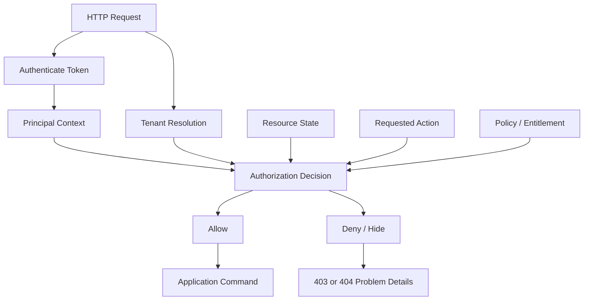
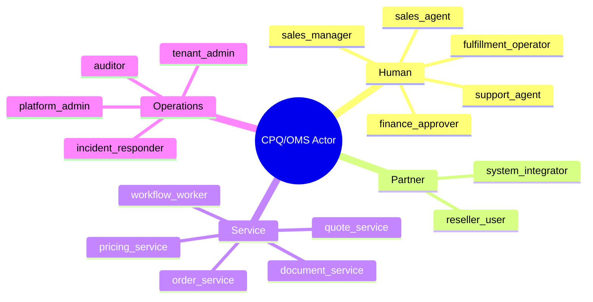
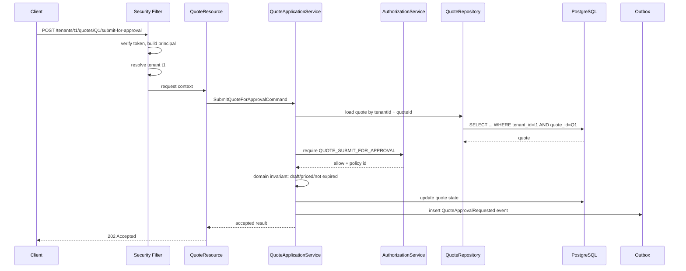

# Part 020 — Security, Authorization, and Tenant Boundaries

Kita sudah mendesain API error model.

Sekarang kita masuk ke boundary yang lebih berbahaya:

```text
Siapa boleh melakukan apa, terhadap objek mana, pada tenant mana, dalam state apa?
```

Security CPQ/OMS bukan hanya login.

Security CPQ/OMS adalah business invariant.

Contoh:

```text
Sales agent boleh membuat quote untuk account miliknya.
Sales manager boleh approve discount sampai threshold tertentu.
Finance boleh melihat commercial term tertentu.
Partner hanya boleh melihat quote yang dibuat melalui channel-nya.
Fulfillment service boleh membaca order instruction, tetapi tidak boleh mengubah price.
Workflow worker boleh menyelesaikan task tertentu, tetapi tidak boleh melewati approval policy.
```

Jika boundary ini salah, sistem bisa tetap terlihat berjalan normal, tetapi secara bisnis dan audit sudah rusak.

Part ini membahas security dari sisi architecture dan implementation boundary, bukan checklist compliance generik.

---

## 1. Mental Model: Authorization Is a Domain Decision

Authentication menjawab:

```text
Siapa caller ini?
```

Authorization menjawab:

```text
Apakah caller ini boleh melakukan action ini terhadap resource ini dalam context ini?
```

Dalam CPQ/OMS, authorization tidak cukup dengan role.

Role hanya satu input.

Authorization decision perlu mempertimbangkan:

```text
principal
role/group
scope
tenant
channel
account relationship
quote owner
quote status
discount amount
approval threshold
order state
task assignment
delegation
time/effective policy
service identity
```

Diagram:



Authorization bukan annotation sederhana di resource method.

Annotation bisa membantu coarse-grained security.

Tetapi object-level dan state-aware authorization harus berada dekat dengan application command.

---

## 2. Assets yang Harus Dilindungi

Sebelum bicara OAuth, JWT, atau RBAC, tentukan dulu asset.

CPQ/OMS punya asset sensitif:

| Asset | Why Sensitive |
|---|---|
| Product catalog | Bisa mengandung commercial availability, partner-only offering, regulated product metadata |
| Price book | Berisi price strategy dan margin-sensitive data |
| Discount policy | Bisa disalahgunakan untuk revenue leakage |
| Quote | Berisi customer intent, price, discount, contract term |
| Approval decision | Bukti legal/commercial authority |
| Order | Fulfillment obligation dan customer commitment |
| Fulfillment instruction | Bisa mengandung address, provisioning info, service detail |
| Workflow task | Bisa dipakai untuk bypass approval atau force progression |
| Audit log | Bukti defensibility; tidak boleh bisa dimanipulasi |
| Generated document | Bisa menjadi customer-facing legal/commercial artifact |

Threat model tanpa asset model hanya ritual.

---

## 3. Actor Model

Kita definisikan actor bukan hanya `user`.

```text
Human user
Partner user
Internal service account
Workflow worker
Admin/operator
Batch job
Support agent
Auditor/read-only reviewer
External system callback
```

Masing-masing punya authority berbeda.



Kesalahan umum:

```text
Semua internal service dipercaya penuh.
```

Itu berbahaya.

Internal service juga harus punya least privilege.

---

## 4. Authentication Boundary

Untuk API modern, biasanya authentication dilakukan oleh identity provider dan gateway.

Service tetap tidak boleh buta.

Service minimal harus menerima security context yang sudah diverifikasi atau memverifikasi token sesuai deployment model.

Jika service menerima JWT, validasi minimum:

```text
signature valid
issuer allowed
audience matches service/API
expiration not passed
not-before respected
algorithm allowed
key id resolved from trusted JWKS
required claims present
subject stable
scopes/roles/groups trustworthy
```

JWT adalah format compact untuk merepresentasikan claims, tetapi JWT bukan otomatis aman. Token harus divalidasi, dan claims harus dipahami dalam context authorization.

Bad:

```java
String userId = jwt.getClaim("sub");
// assume allowed
```

Better:

```java
PrincipalContext principal = tokenVerifier.verify(accessToken);
TenantContext tenant = tenantResolver.resolve(principal, request);
authorizationService.requireAllowed(
    principal,
    tenant,
    Action.SUBMIT_QUOTE,
    quoteResourceRef
);
```

---

## 5. Security Context Shape

Setelah authentication, service harus membangun context eksplisit.

```java
public record PrincipalContext(
        String principalId,
        PrincipalType type,
        String subject,
        Set<String> scopes,
        Set<String> roles,
        Set<String> groups,
        Set<String> tenantIds,
        String channel,
        String clientId,
        boolean serviceAccount
) {}

public record TenantContext(
        String tenantId,
        String tenantSegment,
        String region,
        boolean crossTenantAdmin
) {}

public record RequestSecurityContext(
        PrincipalContext principal,
        TenantContext tenant,
        String correlationId,
        String requestId
) {}
```

Jangan menyebar parsing token ke semua resource.

Buat satu boundary:

```text
HTTP filter -> token verifier -> principal context -> tenant context -> request context
```

---

## 6. Tenant Resolution

Multi-tenancy rusak ketika tenant dianggap hanya field biasa.

Tenant harus diselesaikan dari beberapa input:

```text
token claims
request path
request header jika internal policy mengizinkan
domain object tenant ownership
service account entitlement
```

Contoh endpoint:

```text
POST /tenants/{tenantId}/quotes
GET  /tenants/{tenantId}/quotes/{quoteId}
```

Resolution rule:

```text
path tenantId must be present in principal.allowedTenantIds
object tenantId must equal path tenantId
service account must have tenant or cross-tenant scope
admin cross-tenant access must be explicit and audited
```

Pseudo-code:

```java
public TenantContext resolveTenant(PrincipalContext principal, String tenantIdFromPath) {
    if (principal.tenantIds().contains(tenantIdFromPath)) {
        return tenantRepository.load(tenantIdFromPath);
    }

    if (principal.serviceAccount() && principal.scopes().contains("tenant:cross:read")) {
        return tenantRepository.load(tenantIdFromPath).asCrossTenantAdmin();
    }

    throw Problems.forbiddenOrHidden("TENANT_ACCESS_DENIED");
}
```

Do not trust tenant id from request body.

Request body tenant id boleh divalidasi, tetapi bukan sumber kebenaran.

---

## 7. Object-Level Authorization

OWASP API Security Top 10 menempatkan Broken Object Level Authorization sebagai risiko utama API. Polanya sederhana: attacker mengganti object id di request dan API gagal memverifikasi apakah caller boleh mengakses object tersebut.

Di CPQ/OMS, ini sangat kritis.

Contoh serangan:

```text
GET /tenants/t1/quotes/Q-100
GET /tenants/t1/quotes/Q-101
```

Jika Q-101 milik account lain dan tetap terbaca, sistem bocor.

Object-level authorization harus ada pada setiap command/query yang menerima object id dari caller.

```java
Quote quote = quoteRepository.findById(quoteId)
        .orElseThrow(() -> Problems.notFound("QUOTE_NOT_FOUND"));

if (!quote.tenantId().equals(tenantContext.tenantId())) {
    throw Problems.notFound("QUOTE_NOT_FOUND"); // hide existence
}

authorizationService.requireAllowed(
        principal,
        tenantContext,
        Action.READ_QUOTE,
        new QuoteResourceRef(quote.id(), quote.accountId(), quote.ownerId(), quote.status())
);
```

Jangan authorize hanya berdasarkan endpoint.

Bad:

```java
@RolesAllowed("SALES")
@GET
@Path("/quotes/{quoteId}")
public QuoteDto getQuote(...) { ... }
```

Ini hanya menjawab:

```text
Apakah caller sales?
```

Belum menjawab:

```text
Apakah quote ini milik account/channel/tenant yang boleh dia lihat?
```

---

## 8. RBAC, ABAC, and Relationship Checks

### 8.1 RBAC

Role-based access control cocok untuk coarse-grained permission.

Contoh:

```text
SALES_AGENT can create quote
SALES_MANAGER can approve discount
FINANCE can view margin
FULFILLMENT can update fulfillment step
SUPPORT can read operational state
```

Tetapi RBAC saja tidak cukup.

### 8.2 ABAC

Attribute-based access control mempertimbangkan attribute.

Contoh:

```text
sales_manager can approve discount <= manager.threshold
approver cannot approve own quote
partner_user can read quote where quote.channel == partner.channel
finance can view margin only in assigned region
```

### 8.3 Relationship-Based Checks

Object relationship sering lebih penting dari role.

Contoh:

```text
user is account owner
user is delegated approver
user is task assignee
user is candidate group member
service account owns this integration channel
```

Model praktis:

```java
public record AuthorizationRequest(
        PrincipalContext principal,
        TenantContext tenant,
        Action action,
        ResourceRef resource,
        Map<String, Object> attributes
) {}

public enum Decision {
    ALLOW,
    DENY,
    HIDE
}
```

Policy result:

```java
public record AuthorizationDecision(
        Decision decision,
        String policyId,
        String reasonCode,
        boolean auditRequired
) {}
```

Policy decision harus bisa diaudit.

---

## 9. Action Model

Action harus eksplisit.

Jangan hanya `READ` dan `WRITE`.

CPQ/OMS perlu action spesifik:

```text
QUOTE_CREATE
QUOTE_READ
QUOTE_EDIT_LINE
QUOTE_REPRICE
QUOTE_SUBMIT_FOR_APPROVAL
QUOTE_APPROVE
QUOTE_REJECT
QUOTE_ACCEPT
QUOTE_CREATE_REVISION
QUOTE_VIEW_MARGIN
ORDER_CREATE_FROM_QUOTE
ORDER_READ
ORDER_CANCEL
ORDER_AMEND
ORDER_UPDATE_FULFILLMENT_STEP
WORKFLOW_CLAIM_TASK
WORKFLOW_COMPLETE_TASK
CATALOG_PUBLISH
PRICEBOOK_PUBLISH
POLICY_OVERRIDE
AUDIT_READ
ADMIN_RETRY_WORKFLOW_INCIDENT
```

Kenapa spesifik?

Karena `WRITE_QUOTE` terlalu luas.

User yang boleh edit characteristic belum tentu boleh approve discount.

Service yang boleh update fulfillment step tidak boleh mengubah price.

---

## 10. State-Aware Authorization

Authorization bergantung pada state.

Contoh:

```text
A sales agent may edit DRAFT quote.
A sales agent may not edit APPROVAL_PENDING quote.
A manager may approve APPROVAL_PENDING quote.
The same manager may not approve if they are quote owner.
No one may edit ACCEPTED quote except by creating new revision.
```

Authorization check membutuhkan resource snapshot.

```java
authorizationService.requireAllowed(
    principal,
    tenant,
    Action.QUOTE_EDIT_LINE,
    QuoteResourceRef.from(quote)
);

quote.editLine(command.lineId(), command.change());
```

Urutan penting:

```text
load resource -> tenant check -> authorization check -> domain invariant -> persist
```

Domain invariant tetap perlu walaupun authorization lolos.

Authorization berkata caller boleh mencoba action.

Domain invariant berkata action valid terhadap lifecycle.

---

## 11. Approval Authority Boundary

Approval adalah security-sensitive action.

Approval tidak boleh hanya:

```text
user has APPROVER role
```

Approval perlu authority model:

```text
discount threshold
margin threshold
product family
region
tenant
channel
delegation
conflict of interest
approval level
approval expiration
```

Example policy:

```text
If discount <= 10%, sales manager can approve.
If discount > 10% and <= 25%, finance approver required.
If manual price override exists, pricing governance required.
If approver is quote owner, deny.
If quote changed after approval, approval stale.
```

Approval decision record harus menyimpan:

```text
approver id
approver groups at decision time
policy version
approval level
approved quote revision
approved price result id
decision timestamp
reason/comment
```

Jangan hanya menyimpan `approved = true`.

---

## 12. Service-to-Service Authorization

Internal service call harus tetap scoped.

Contoh scopes:

```text
quote:read
quote:write-command
pricing:evaluate
pricing:read-trace
order:create
order:update-fulfillment
workflow:correlate
notification:send
catalog:read-published
catalog:publish
```

Service account jangan menggunakan human admin token.

Bad:

```text
All services share one admin credential.
```

Better:

```text
quote-service has quote scopes
pricing-service has pricing scopes
order-service has order scopes
workflow-worker has task-specific scopes
admin-control-plane has audited elevated scopes
```

Service-to-service token harus punya:

```text
issuer
audience
client_id
scopes
expiration
key rotation
mTLS or trusted network layer where appropriate
```

OAuth 2.0 Security Best Current Practice memperbarui threat model dan rekomendasi keamanan OAuth 2.0. Dalam desain enterprise, jangan mengandalkan asumsi lama seperti implicit trust dan long-lived bearer token tanpa kontrol kuat.

---

## 13. Tenant Boundary in Database

Database query harus selalu tenant-scoped.

Bad:

```java
select q from QuoteEntity q where q.quoteId = :quoteId
```

Better:

```java
select q from QuoteEntity q
where q.tenantId = :tenantId
  and q.quoteId = :quoteId
```

Untuk repository:

```java
Optional<QuoteEntity> findByTenantIdAndQuoteId(String tenantId, String quoteId);
```

Tenant filter tidak boleh optional.

Untuk admin cross-tenant query, buat method berbeda:

```java
Optional<QuoteEntity> findByQuoteIdForAdmin(String quoteId, AdminAccessContext adminContext);
```

Dengan begitu cross-tenant access terlihat jelas di code review.

---

## 14. Tenant Boundary in Cache

Redis key harus tenant-aware.

Bad:

```text
quote:Q-123
price-preview:hash123
catalog:active
```

Good:

```text
tnt:t1:quote:Q-123
tnt:t1:price-preview:hash123
tnt:t1:catalog:active
```

Jika product catalog shared across tenants, tetap eksplisit:

```text
catalog:global:offering:PO-100
catalog:tnt:t1:overlay:PO-100
```

Cache leak sering terjadi bukan karena SQL salah, tetapi karena cache key tidak punya tenant dimension.

Cache value juga jangan menyimpan data yang terlalu luas lalu difilter di application setelah retrieval.

---

## 15. Tenant Boundary in Kafka Events

Event harus membawa tenant metadata.

Example envelope:

```json
{
  "eventId": "evt-01JZK9HTGE6R3KJPGN2AGJ5T8T",
  "eventType": "QuotePriceCalculated",
  "tenantId": "tnt_enterprise_a",
  "aggregateType": "QUOTE",
  "aggregateId": "Q-2026-000123",
  "aggregateVersion": 12,
  "occurredAt": "2026-07-02T08:15:30Z",
  "producer": "pricing-service",
  "payload": {}
}
```

Consumers harus enforce tenant authorization.

Jangan membuat consumer yang memproses semua tenant tanpa alasan.

Untuk multi-tenant enterprise, pertimbangkan:

```text
topic per domain + tenant metadata
atau topic per regulated tenant/region jika isolation requirement tinggi
```

Partition key sering:

```text
tenantId + aggregateId
```

Bukan hanya aggregateId jika id bisa collision antar-tenant.

---

## 16. Tenant Boundary in Camunda 7

Camunda 7 punya konsep user, group, dan tenant sebagai string identity/segmentation. Dokumentasi Camunda menekankan securing Camunda 7 sebelum go-live, termasuk authorization REST API, hak akses resource seperti process definition, serta integrasi SSO. Camunda juga memperlakukan user, group, dan tenant sebagai text strings yang perlu dipetakan ke model identity organisasi.

Prinsip untuk CPQ/OMS:

```text
Do not let Camunda become an authorization bypass.
```

Workflow task security harus konsisten dengan application authorization.

User task candidate group:

```xml
<bpmn:userTask id="ApproveQuote" camunda:candidateGroups="sales-manager" />
```

Itu tidak cukup.

Saat complete task:

```text
user must be authenticated
user must belong to candidate/assignee context
user must belong to tenant
user must have approval authority for quote revision
quote must still be approval-pending
price result must still match approved revision
```

Camunda task completion endpoint sebaiknya tidak expose raw task completion sebagai generic API.

Bad:

```text
POST /workflow/tasks/{taskId}/complete
```

Better:

```text
POST /quotes/{quoteId}/approval-tasks/{taskId}/approve
POST /quotes/{quoteId}/approval-tasks/{taskId}/reject
```

Application command tetap domain-specific.

Camunda task id hanya correlation detail.

---

## 17. Admin and Operator Boundary

Admin API paling sering menjadi bypass.

Pisahkan:

```text
business admin
platform admin
tenant admin
workflow operator
support read-only
security auditor
break-glass operator
```

Break-glass access harus:

```text
explicit
short-lived
audited
reason-required
reviewable
limited by action
limited by tenant/resource
```

Operator boleh retry incident, tetapi tidak otomatis boleh approve quote.

Support boleh lihat operational status, tetapi tidak otomatis boleh lihat margin.

Auditor boleh baca history, tetapi tidak boleh mutate business state.

---

## 18. Field-Level and Property-Level Authorization

OWASP juga menyoroti broken object property level authorization. Dalam CPQ/OMS, ini nyata.

Contoh quote response:

```json
{
  "quoteId": "Q-123",
  "totalPrice": "100000.00",
  "discountPercent": "25.00",
  "marginPercent": "5.20",
  "internalCost": "76000.00"
}
```

Tidak semua user boleh melihat `marginPercent` atau `internalCost`.

Field-level policy:

```text
SALES_AGENT: can view total price, cannot view internal cost
SALES_MANAGER: can view discount and margin band
FINANCE: can view margin and cost
PARTNER: can view customer-facing price only
AUDITOR: can view historical decision trace
```

Implementasi:

```java
QuoteView view = quoteReadModel.load(tenantId, quoteId);
QuoteDto dto = quoteDtoMapper.toDto(view, fieldPolicy.forPrincipal(principal));
```

Jangan hanya hide field di frontend.

Backend harus enforce.

---

## 19. Write Authorization and Mass Assignment

Mass assignment terjadi saat API menerima field yang tidak boleh caller set.

Bad request shape:

```json
{
  "productOfferingId": "PO-100",
  "discountPercent": 40,
  "approved": true,
  "approvalLevel": "FINANCE"
}
```

Jika DTO langsung di-map ke entity, caller bisa menyetel field internal.

Command schema harus action-specific.

Good:

```json
{
  "productOfferingId": "PO-100",
  "characteristics": {
    "bandwidth": "1Gbps"
  }
}
```

Discount override pakai command berbeda:

```text
POST /quotes/{quoteId}/discount-overrides
```

Approval pakai command berbeda:

```text
POST /quotes/{quoteId}/approval-tasks/{taskId}/approve
```

Setiap command punya authorization sendiri.

---

## 20. Audit Trail for Security Decisions

Authorization denial tidak selalu perlu audit detail tinggi.

Tetapi action sensitif perlu audit.

Audit for:

```text
quote approval
discount override
price override
order cancellation
order amendment
workflow incident retry
admin cross-tenant read
policy change
catalog publish
price book publish
break-glass access
```

Audit record:

```json
{
  "auditId": "aud-01JZK9ZJSSQKZ7716HEHQNERAM",
  "tenantId": "tnt_enterprise_a",
  "actorId": "user-8841",
  "actorType": "HUMAN",
  "action": "QUOTE_APPROVE",
  "resourceType": "QUOTE",
  "resourceId": "Q-2026-000123",
  "decision": "ALLOW",
  "policyId": "quote-approval-policy-v12",
  "reasonCode": "DISCOUNT_WITHIN_MANAGER_THRESHOLD",
  "correlationId": "corr-...",
  "occurredAt": "2026-07-02T08:19:10Z"
}
```

Audit bukan log biasa.

Audit harus queryable, durable, and tamper-evident according to your platform requirement.

---

## 21. Security Failure Modes

### 21.1 Tenant Mismatch Hidden by Cache

Database query tenant-safe, tetapi cache key tidak.

Result: user tenant B receives tenant A quote preview.

### 21.2 Task Completion Bypass

Camunda task endpoint only checks user is logged in.

Result: user completes approval task without approval authority.

### 21.3 Service Account Overreach

Notification service has admin token.

Result: notification service bug can read price book and quote margin.

### 21.4 Field-Level Leak

Backend returns margin field and frontend hides it.

Result: API caller sees hidden margin from dev tools or direct API.

### 21.5 Cross-Tenant Admin Without Audit

Support tool can search all quotes but does not require reason.

Result: privacy and compliance exposure.

### 21.6 Stale Role Claim

JWT contains old role for hours after user changed teams.

Result: user keeps approval power too long.

Mitigation:

```text
short token lifetime
centralized policy lookup for critical actions
role version claim
revocation strategy for high-risk events
```

---

## 22. Implementation Flow for Command Endpoint

Example: submit quote for approval.



If authorization fails:

```text
No domain mutation.
No outbox event.
Problem Details returned.
Audit denial if sensitive.
```

---

## 23. Testing Security

Security tests must be scenario-based.

Test matrix:

| Scenario | Expected |
|---|---|
| user from tenant A reads tenant B quote | 404 or 403 according to policy |
| sales agent edits own draft quote | allow |
| sales agent edits approval-pending quote | deny |
| manager approves own quote | deny |
| manager approves discount above threshold | deny/escalate |
| finance views margin | allow |
| partner views margin | field absent |
| workflow worker updates price | deny |
| order service creates order from accepted quote | allow service scope |
| notification service reads quote margin | deny |
| support cross-tenant read without reason | deny |
| admin break-glass with reason | allow + audit |
| reused old token after role revoked | deny for critical action if policy lookup required |

Do not rely only on unit tests.

Use integration tests that hit JAX-RS resources with real security context simulation.

---

## 24. Practical Checklist

A CPQ/OMS service is not security-ready until:

- token validation is explicit and tested;
- issuer/audience/expiration/algorithm are verified;
- tenant is resolved before resource access;
- repository methods are tenant-scoped by default;
- every object-id endpoint has object-level authorization;
- authorization action names are domain-specific;
- approval authority is policy-driven and audited;
- field-level authorization is enforced on backend;
- service accounts use least privilege;
- Redis keys include tenant dimension;
- Kafka events include tenant metadata;
- Camunda task completion is domain-authorized;
- admin APIs are separated and audited;
- break-glass access requires reason and is reviewable;
- error model does not leak forbidden object existence;
- security tests cover horizontal and vertical privilege escalation.

---

## 25. Final Mental Model

Security in CPQ/OMS is not a wrapper around endpoints.

It is a set of invariants across identity, tenant, object, action, state, policy, workflow, event, cache, and audit.

The core authorization question is always:

```text
Can this principal perform this action on this resource,
within this tenant, at this lifecycle state,
under this policy version,
with this level of evidence?
```

If the system cannot answer that question consistently, it is not enterprise-grade.

---

## References

- RFC 7519 — JSON Web Token: https://datatracker.ietf.org/doc/html/rfc7519
- RFC 9700 — Best Current Practice for OAuth 2.0 Security: https://www.rfc-editor.org/info/rfc9700/
- OWASP API Security Top 10 2023: https://owasp.org/API-Security/editions/2023/en/0x00-header/
- OWASP API1:2023 Broken Object Level Authorization: https://owasp.org/API-Security/editions/2023/en/0xa1-broken-object-level-authorization/
- OWASP API3:2023 Broken Object Property Level Authorization: https://owasp.org/API-Security/editions/2023/en/0xa3-broken-object-property-level-authorization/
- Camunda 7 Security Best Practices: https://docs.camunda.io/docs/8.7/components/best-practices/operations/securing-camunda-c7/
