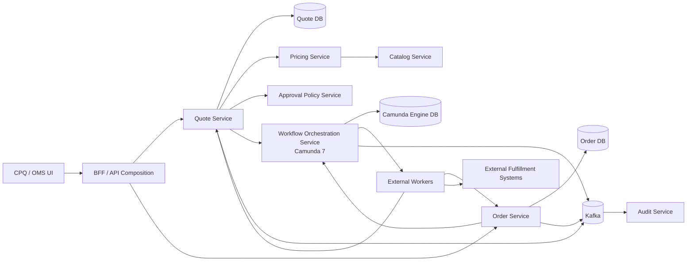
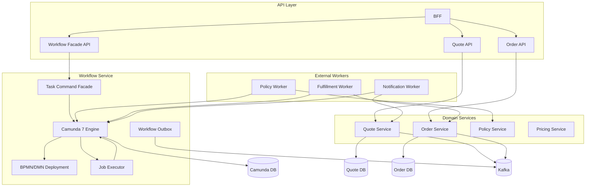

# Part 021 — Camunda 7 Architecture Positioning

Kita sudah membangun API boundary, error model, security model, persistence model, dan lifecycle invariant.

Sekarang kita masuk ke komponen yang sering membuat enterprise system menjadi jelas — atau justru menjadi monster:

```text
workflow engine
```

Dalam seri ini, workflow engine yang dipakai adalah **Camunda 7**.

Tetapi Camunda 7 tidak boleh dipahami sebagai:

```text
tempat menaruh semua business logic
```

Camunda 7 harus dipahami sebagai:

```text
runtime untuk mengorkestrasi lifecycle bisnis yang panjang, terlihat, audit-friendly, recoverable, dan melibatkan human/system handoff.
```

Perbedaan ini penting.

Jika Camunda dipakai sebagai dumping ground logic, sistem akan menjadi sulit dites, sulit diubah, dan sulit dimigrasikan.

Jika Camunda dipakai sebagai orchestration layer yang jelas boundary-nya, ia menjadi peta operasional yang kuat untuk CPQ/OMS.

---

## 1. Masalah yang Camunda Pecahkan dalam CPQ/OMS

CPQ/OMS punya banyak proses yang tidak selesai dalam satu HTTP transaction.

Contoh:

```text
Quote dibuat.
Quote dikonfigurasi.
Quote dihitung harganya.
Discount override diajukan.
Approval menunggu manager.
Approval melewati SLA.
Quote direvisi.
Quote diterima customer.
Order dibuat.
Order didekomposisi.
Fulfillment system gagal.
Manual fallout team memperbaiki.
Order dilanjutkan.
```

Sebagian langkah sinkron.

Sebagian asinkron.

Sebagian otomatis.

Sebagian manual.

Sebagian bisa diulang.

Sebagian tidak boleh diulang.

Sebagian harus bisa dikompensasi.

Sebagian harus terlihat oleh operasi.

Di sinilah workflow engine berguna.

Tanpa workflow engine, flow seperti ini sering berubah menjadi:

```text
status column + scheduled job + retry table + if/else service + random admin script
```

Itu bisa jalan.

Tetapi dalam enterprise CPQ/OMS, model seperti itu cepat kehilangan observability dan auditability.

---

## 2. Mental Model: Camunda Is Not the Domain Model

Kesalahan umum:

```text
Quote state = process activity name
Order state = process token position
Business invariant = BPMN gateway expression
```

Itu rapuh.

Model yang lebih sehat:

```text
PostgreSQL domain state = source of truth
Camunda process instance = orchestration state
Kafka event = integration fact
Redis = ephemeral acceleration
API = command boundary
```

Camunda boleh memutuskan langkah berikutnya dalam workflow.

Tetapi kebenaran domain tetap harus dikunci oleh domain service dan database constraint.

Contoh:

```text
ApproveQuoteTask selesai di Camunda.
↓
Quote service tetap harus mengecek:
- quote masih pada revision yang sama
- price belum stale
- approver punya authority
- approval threshold cocok
- quote belum expired
- tenant cocok
```

BPMN boleh menunjukkan bahwa approval sudah selesai.

Tetapi domain service tetap menentukan apakah quote boleh berpindah ke `APPROVED`.

Camunda mengorkestrasi.

Domain memutuskan.

Database menjaga.

---

## 3. Posisi Camunda dalam Reference Architecture

Dalam seri ini, Camunda ditempatkan sebagai **Workflow Orchestration Service**.



Camunda bukan pemilik semua data.

Camunda menyimpan:

```text
process definition
process instance
execution token
task
job
incident
history
process variables
```

Domain services menyimpan:

```text
quote
quote revision
quote line
price result
approval decision
order
order line
fulfillment step
business transition log
```

Process variable hanya membawa data yang dibutuhkan untuk routing dan correlation.

Jangan masukkan seluruh quote/order object sebagai process variable.

---

## 4. Keputusan Paling Penting: Engine Topology

Camunda 7 dapat diposisikan dengan beberapa topology.

Untuk enterprise CPQ/OMS, pilihan topology lebih penting daripada sekadar “pakai Camunda”.

Tiga model utama:

```text
1. embedded engine
2. shared engine
3. remote/workflow service engine
```

Mari kita bedah.

---

## 5. Embedded Engine

Embedded engine berarti process engine hidup di dalam aplikasi Java yang sama dengan business service.

Contoh:

```text
quote-service.jar
  - Quote API
  - Quote domain service
  - Camunda process engine
  - BPMN deployment
  - JavaDelegate classes
```

Secara mental:

```text
service owns workflow runtime locally
```

Kelebihan:

```text
low latency
simple local API access
same transaction possible between domain code and engine command
simple developer experience for smaller systems
```

Kekurangan:

```text
engine lifecycle mengikuti service lifecycle
scaling workflow mengikuti service scaling
BPMN deployment terikat artifact service
job executor contention dengan API traffic
sulit jika banyak service ingin memakai engine yang sama
migration fence lebih lemah jika delegate sangat terikat domain internals
```

Dalam CPQ/OMS besar, embedded engine cocok hanya jika:

```text
workflow benar-benar milik satu bounded context
process volume rendah/sedang
process tidak perlu dioperasikan sebagai platform bersama
team siap menjaga boundary delegate
```

Contoh layak:

```text
quote-service memiliki small approval workflow internal
```

Contoh berisiko:

```text
order orchestration lintas inventory, billing, shipping, activation, notification, dan manual fallout dimasukkan embedded ke order-service
```

Itu bisa menjadikan order-service terlalu besar.

---

## 6. Shared Process Engine

Shared process engine berarti process engine dikontrol oleh runtime container dan dapat dipakai oleh lebih dari satu process application.

Model konseptual:

```text
Tomcat / application server
  - shared Camunda engine
  - process application A
  - process application B
  - process application C
```

Keuntungan:

```text
engine lifecycle bisa dipisah dari aplikasi proses
beberapa process application bisa berbagi engine
aplikasi bisa redeploy tanpa selalu memulai engine baru
Camunda webapps/admin tooling lebih natural
```

Dokumentasi Camunda menjelaskan shared process engine sebagai engine yang dikontrol independen dari aplikasi dan dijalankan/dihentikan oleh runtime container seperti Tomcat. Model ini memungkinkan beberapa aplikasi atau satu aplikasi modular memakai process engine yang sama.

Kelemahan:

```text
shared operational blast radius
lebih banyak coupling ke container model
deployment/versioning process application harus disiplin
classloading dan delegate compatibility bisa menjadi masalah
microservice independence berkurang jika semua bergantung pada shared runtime
```

Shared engine cocok jika:

```text
organisasi punya workflow platform team
proses lintas domain cukup banyak
Camunda webapp/operations dipakai intensif
runtime container governance kuat
```

Tetapi untuk microservices CPQ/OMS modern, shared engine perlu pagar:

```text
jangan biarkan semua service langsung memanggil semua process definition
jangan jadikan shared engine sebagai database integrasi
jangan jadikan process variable sebagai canonical data model
```

---

## 7. Remote Workflow Service

Remote workflow service berarti Camunda 7 dibungkus sebagai service tersendiri.

Modelnya:

```text
workflow-service
  - Camunda 7 engine
  - BPMN/DMN deployment
  - workflow REST facade
  - worker coordination
  - process event publisher
  - operational APIs
```

Service lain tidak langsung menyentuh engine API secara bebas.

Mereka memanggil command yang lebih domain-oriented:

```http
POST /workflow/quote-approval-processes
POST /workflow/order-fulfillment-processes
POST /workflow/messages/quote-approved
POST /workflow/tasks/{taskId}/complete
```

Keuntungan:

```text
workflow runtime isolated
engine bisa dioperasikan sebagai platform internal
BPMN deployment punya ownership jelas
business services tidak membawa dependency engine penuh
migration fence lebih kuat
monitoring workflow lebih terpusat
```

Kekurangan:

```text
extra network hop
transaction boundary lebih eksplisit
butuh correlation design yang matang
butuh anti-corruption API agar tidak sekadar expose Camunda REST mentah
butuh worker model yang disiplin
```

Untuk seri ini, kita akan mengambil posisi:

```text
Camunda 7 ditempatkan sebagai workflow orchestration service.
```

Alasannya:

```text
CPQ/OMS besar biasanya lintas bounded context.
Workflow perlu operation visibility.
Camunda 7 lifecycle perlu migration fence.
Business service sebaiknya tidak terkunci terlalu dalam ke engine API.
```

---

## 8. Jangan Expose Camunda REST API Mentah ke Semua Service

Camunda punya REST API.

Tetapi itu bukan berarti seluruh service boleh langsung melakukan:

```text
/start process definition by key
/complete arbitrary task
/set arbitrary variable
/correlate arbitrary message
```

Jika ini dibiarkan, workflow menjadi distributed shared mutable state.

Pola yang lebih sehat:

```text
Business service -> workflow facade command -> Camunda RuntimeService/TaskService
```

Contoh facade:

```java
public interface QuoteApprovalWorkflowPort {
    WorkflowInstanceId startApproval(QuoteApprovalStartCommand command);
    void notifyQuoteRepriced(QuoteRepricedWorkflowMessage message);
    void cancelApproval(QuoteApprovalCancelCommand command);
}
```

Facade mengecek:

```text
process key valid
business key format valid
tenant valid
caller authority valid
allowed message valid
variable whitelist valid
idempotency valid
```

Camunda API tetap ada.

Tetapi ia dibungkus dengan semantic boundary.

---

## 9. Business Key Strategy

Setiap process instance yang penting harus punya business key.

Dalam CPQ/OMS, business key jangan asal `UUID` tanpa makna.

Pola yang baik:

```text
quoteApproval:{tenantId}:{quoteId}:{revisionNo}
orderFulfillment:{tenantId}:{orderId}
orderCancellation:{tenantId}:{orderId}:{cancellationId}
```

Business key membantu:

```text
correlation
search
incident triage
audit investigation
idempotent start
human support
log tracing
```

Tetapi business key tidak boleh memuat data sensitif seperti nama customer, email, nomor identitas, atau nilai commercial confidential.

Gunakan ID.

Bukan PII.

---

## 10. Process Definition Ownership

Dalam platform CPQ/OMS, process definition harus punya owner.

Contoh:

| Process Definition | Owner | Purpose |
|---|---|---|
| `quote-approval-v1` | Quote/Commercial Policy Team | Approval discount dan override |
| `order-fulfillment-v1` | OMS Team | Fulfillment orchestration |
| `order-cancellation-v1` | OMS Team | Cancellation and compensation |
| `quote-expiration-v1` | Quote Team | Expiration lifecycle |
| `manual-fallout-v1` | Operations Team + OMS Team | Manual recovery flow |

Ownership berarti:

```text
siapa mendesain BPMN
siapa review perubahan
siapa define incidents
siapa define retry policy
siapa define SLA
siapa maintain worker contract
siapa approve deployment
```

Tanpa ownership, BPMN akan menjadi diagram yang semua orang ubah tetapi tidak ada yang bertanggung jawab.

---

## 11. BPMN Versioning Strategy

Camunda 7 menyimpan process definition version.

Setiap deploy process definition dengan key yang sama menghasilkan version baru.

Masalah enterprise bukan “bisa versioning atau tidak”.

Masalah enterprise adalah:

```text
process instance lama mengikuti definition lama
process instance baru mengikuti definition baru
bagaimana jika process lama perlu dimigrasikan?
bagaimana jika worker contract berubah?
bagaimana jika variable shape berubah?
bagaimana jika task name berubah dan UI bergantung pada task definition key?
```

Prinsip:

```text
BPMN version is runtime version.
Business process version is product decision.
Worker contract version is integration contract.
Task form version is UX contract.
```

Jangan campur semuanya.

Gunakan convention:

```text
process key: quote-approval
process definition version: managed by Camunda deployment
business version variable: approvalPolicyVersion
worker topic: quote-policy-evaluation.v1
form key: quote-approval-review.v2
```

---

## 12. Process Variables: Small, Stable, Intentional

Process variable bukan document store.

Process variable idealnya memuat:

```text
tenantId
quoteId
quoteRevision
orderId
customerAccountId
policyVersion
priceResultId
requestedDiscountPercent
approvalLevel
correlationId
```

Jangan simpan:

```text
full quote JSON
full order JSON
full product catalog snapshot
full price breakdown jika sudah ada di domain DB
sensitive customer data
large document payload
```

Alasannya:

```text
Camunda history table membesar
serialization compatibility menjadi masalah
variable update menjadi coupling point
process migration makin sulit
security exposure lebih besar
```

Lebih baik:

```text
Process variable menyimpan reference.
Domain service menyimpan full state.
Worker mengambil current/snapshot state dari service yang punya data.
```

---

## 13. Job Executor Positioning

Camunda job executor menjalankan asynchronous continuation, timer, dan job lain.

Dalam CPQ/OMS, job executor harus dipahami sebagai operational workload.

Bukan background magic.

Pertanyaan yang harus dijawab:

```text
berapa banyak process instance aktif?
berapa banyak timer SLA?
berapa banyak async service task?
berapa banyak retry gagal?
apakah job executor berbagi thread dengan API?
apakah node semua boleh acquire job?
apakah deployment-aware job executor dibutuhkan?
```

Untuk enterprise, hindari desain yang tidak tahu jawaban ini.

Pola sehat:

```text
workflow-service API node
workflow-service worker/job-executor node
Camunda DB tuned separately
job executor metrics exposed
incident rate monitored
retry policy explicit per task type
```

Jika job executor dan API bercampur tanpa kontrol, traffic API bisa terganggu oleh retry storm workflow.

---

## 14. Transaction Boundary in Camunda

Camunda process execution berjalan dalam transaction boundary tertentu.

User task, receive task, message catch event, timer catch event, dan external task adalah wait state: engine akan persist state lalu menunggu intervensi berikutnya.

Dalam CPQ/OMS, wait state berguna untuk memisahkan long-running process dari HTTP transaction.

Contoh:

```text
Submit quote for approval
  -> domain transition SUBMITTED_FOR_APPROVAL
  -> start Camunda process
  -> process reaches user task
  -> HTTP request returns
```

Jangan mencoba membuat flow approval selesai dalam satu transaction.

Itu bukan long-running workflow.

Itu hanya synchronous function call yang kebetulan digambar di BPMN.

---

## 15. JavaDelegate vs External Task

Camunda 7 mendukung beberapa cara menjalankan service task.

Dua yang penting:

```text
JavaDelegate
External Task
```

### JavaDelegate

JavaDelegate berjalan di dalam engine process application.

Cocok untuk:

```text
logic kecil yang dekat dengan workflow runtime
routing ringan
variable transformation kecil
calling internal domain facade jika deployment satu boundary
```

Risiko:

```text
BPMN menjadi tightly coupled ke Java class
redeploy process sering butuh redeploy code
business logic bocor ke workflow runtime
migration fence melemah
failure/retry harus hati-hati dengan remote calls
```

### External Task

External task memakai pola pull: worker mengambil task dari engine, mengunci task, memproses, lalu complete/fail/BPMN error.

Cocok untuk:

```text
microservice integration
long-running remote call
external system call
worker scaling independent
isolation dari engine runtime
migration fence lebih baik
```

Risiko:

```text
lock duration salah
worker duplicate processing jika timeout
retries tidak dirancang
BPMN error tidak dibedakan dari technical failure
topic contract tidak versioned
```

Untuk seri ini:

```text
Gunakan external task untuk integrasi antar-service dan external system.
Gunakan JavaDelegate sangat terbatas untuk logic workflow-internal.
```

---

## 16. External Task Contract

External task topic adalah contract.

Jangan namai topic terlalu teknis:

```text
Bad:
callQuoteService
httpPostPricing
executeStep1
```

Gunakan nama capability:

```text
quote.validate-freshness.v1
quote.evaluate-approval-policy.v1
order.reserve-inventory.v1
order.create-fulfillment-ticket.v1
notification.send-approval-request.v1
```

Contract tiap topic harus mendefinisikan:

```text
topic name
input variables
output variables
BPMN errors
technical failure retry policy
lock duration
idempotency key
owning team
observability tags
```

Contoh contract:

```yaml
topic: quote.evaluate-approval-policy.v1
owner: commercial-policy-team
input:
  - tenantId
  - quoteId
  - quoteRevision
  - priceResultId
output:
  - approvalRequired
  - approvalLevel
  - approvalPolicyVersion
bpmnErrors:
  - QUOTE_NOT_APPROVABLE
  - POLICY_NOT_FOUND
technicalRetry:
  retries: 5
  backoff: exponential
lockDuration: 60s
idempotencyKey: "quote-policy:${tenantId}:${quoteId}:${quoteRevision}"
```

---

## 17. BPMN Error vs Technical Failure

Jangan samakan business rejection dengan exception.

Contoh:

```text
Policy says discount cannot be approved.
```

Itu bukan technical failure.

Itu business outcome.

Modelkan sebagai BPMN error atau process path eksplisit.

Contoh technical failure:

```text
Policy service timeout.
Database connection failed.
Worker crashed after remote call.
```

Itu retryable technical failure.

Dalam external task:

```text
business outcome -> handleBpmnError(...)
technical failure -> handleFailure(...)
```

Perbedaan ini menentukan apakah process masuk path bisnis atau incident/retry.

---

## 18. Workflow and Domain State Synchronization

Camunda state dan domain state harus sinkron secara konseptual, tetapi tidak harus berada dalam satu table.

Gunakan correlation table:

```sql
create table workflow_instance_link (
    id uuid primary key,
    tenant_id varchar(64) not null,
    aggregate_type varchar(64) not null,
    aggregate_id uuid not null,
    aggregate_version int not null,
    process_key varchar(128) not null,
    process_instance_id varchar(64) not null,
    business_key varchar(255) not null,
    status varchar(64) not null,
    created_at timestamptz not null,
    completed_at timestamptz null,
    unique (tenant_id, process_key, business_key)
);
```

Jangan bergantung hanya pada Camunda tables untuk business lookup.

Kenapa?

```text
Camunda table adalah engine internals.
Business read model butuh bahasa bisnis.
Operational UI butuh aggregate-aware search.
Migration fence butuh data korelasi di luar engine internals.
```

---

## 19. Outbox for Workflow Events

Workflow event penting harus dipublikasikan secara terkontrol.

Contoh:

```text
QuoteApprovalStarted
QuoteApprovalTaskAssigned
QuoteApprovalEscalated
QuoteApprovalCompleted
OrderFulfillmentStarted
OrderFulfillmentIncidentRaised
OrderFulfillmentCompleted
```

Jangan biarkan consumer membaca Camunda DB langsung.

Gunakan:

```text
Camunda listener / domain service callback
↓
workflow event outbox
↓
publisher
↓
Kafka
```

Tetapi listener juga harus hati-hati.

Listener yang melakukan network call langsung di transaction engine bisa membuat engine lambat dan rapuh.

Lebih baik listener menulis event kecil ke outbox jika berada dalam boundary yang sama.

---

## 20. Human Task Boundary

Human task di Camunda menyimpan task lifecycle.

Tetapi authorization task enterprise tetap perlu domain guard.

Contoh task:

```text
Review Quote Discount Override
```

Task candidate group:

```text
sales-manager-l2
```

Itu belum cukup.

Sebelum task complete, workflow facade harus mengecek:

```text
caller masih anggota group yang valid
caller punya approval authority untuk tenant/channel/account
caller bukan requester jika four-eyes rule berlaku
quote revision masih sama
approval policy belum stale
task definition key cocok
task belum completed
```

Task completion harus command-shaped:

```http
POST /workflow/tasks/{taskId}/commands/approve-quote
```

Bukan generic:

```http
POST /camunda/task/{taskId}/complete
```

---

## 21. Tenant Boundary in Camunda

Jika CPQ/OMS multi-tenant, tenant harus hadir di semua boundary:

```text
process definition deployment
process instance
business key
task query
external task topic handling
authorization
history cleanup/search
logs/events
```

Tetapi jangan berharap tenant id di Camunda otomatis menyelesaikan semua isolasi.

Tenant model harus tetap dikunci di:

```text
API layer
workflow facade
domain service
PostgreSQL predicates
Kafka topic/header
Redis key namespace
observability tags
```

Camunda tenant adalah satu lapisan.

Bukan seluruh security model.

---

## 22. Incident Model

Incident bukan hanya “job failed”.

Dalam CPQ/OMS, incident harus diklasifikasikan secara operasional:

| Incident Type | Example | Owner | Recovery |
|---|---|---|---|
| Technical retry exhausted | Pricing service unavailable | Platform/Service owner | retry after fix |
| Business data invalid | Quote line references retired offering | Catalog/Quote owner | manual correction/reprice |
| External unknown outcome | Fulfillment API timed out after submit | Fulfillment ops | reconciliation |
| Authorization inconsistency | Approver removed during task | Security/Commercial ops | reassign/re-evaluate |
| Process model defect | Gateway condition cannot resolve | Workflow owner | hotfix BPMN/migration |

Setiap incident harus punya:

```text
business key
process instance id
aggregate id
tenant id
correlation id
last command id
last event id
worker topic
affected customer/account
safe recovery actions
```

Tanpa ini, ops hanya melihat technical stacktrace.

Itu tidak cukup.

---

## 23. Process Migration Fence

Camunda 7 masih relevan untuk banyak enterprise estate, tetapi desain baru harus punya migration fence.

Migration fence berarti:

```text
business services tidak bergantung langsung pada Camunda internals
process variables kecil dan contract-based
BPMN tidak menyimpan full business data
task UI tidak hardcode engine-specific details terlalu dalam
external task topic punya versioned contract
workflow events diterbitkan sebagai domain/integration events
process correlation disimpan di table milik platform
```

Dengan fence ini, jika suatu hari workflow runtime berubah, domain core tidak harus dibongkar total.

Tanpa fence, semua service akan menjadi Camunda-specific.

---

## 24. Anti-Patterns

### Anti-pattern 1: Workflow God Service

```text
Semua business rule, pricing decision, quote mutation, order mutation, notification, audit, dan integration logic ditaruh di Camunda delegate.
```

Akibat:

```text
BPMN terlihat seperti architecture diagram, tetapi sebenarnya menjadi monolith tersembunyi.
```

### Anti-pattern 2: Process Variable as Database

```text
Full quote/order JSON disimpan dan dimutasi sebagai process variable.
```

Akibat:

```text
history membengkak
schema evolution sulit
audit bingung
security exposure besar
replay tidak jelas
```

### Anti-pattern 3: Generic Complete Task API

```text
Frontend bisa complete task apa saja dengan arbitrary variables.
```

Akibat:

```text
approval bisa dilewati
field bisa di-inject
state bisa rusak
```

### Anti-pattern 4: Every Failure Is an Incident

```text
Customer not eligible dianggap exception.
Discount rejected dianggap failure.
```

Akibat:

```text
ops noise tinggi
business path tidak terlihat
retry salah sasaran
```

### Anti-pattern 5: BPMN as Source of Truth

```text
Quote dianggap approved karena process token sudah melewati gateway.
```

Akibat:

```text
domain invariant bisa dilewati oleh process manipulation atau migration bug.
```

---

## 25. Recommended Architecture for This Series

Kita akan memakai model berikut:

```text
workflow-service owns Camunda 7 engine
business services own domain state
external workers execute integration tasks
domain services guard all state transitions
workflow facade exposes semantic workflow commands
Kafka publishes workflow/domain integration events
PostgreSQL stores domain state and workflow correlation
Redis only accelerates selected ephemeral lookups
```

Diagram detail:



---

## 26. Implementation Skeleton

Repository layout:

```text
services/
  workflow-service/
    src/main/java/com/acme/cpqoms/workflow/
      api/
        WorkflowResource.java
        TaskResource.java
      application/
        StartQuoteApprovalUseCase.java
        CompleteQuoteApprovalTaskUseCase.java
      camunda/
        CamundaProcessStarter.java
        CamundaTaskGateway.java
        CamundaMessageCorrelator.java
      contract/
        QuoteApprovalWorkflowCommand.java
        CompleteApprovalTaskCommand.java
      listener/
        WorkflowEventListener.java
      outbox/
        WorkflowOutboxRepository.java
    src/main/resources/
      bpmn/
        quote-approval.bpmn
        order-fulfillment.bpmn
      dmn/
        discount-approval-policy.dmn
      META-INF/
        processes.xml
```

Workflow facade resource:

```java
@Path("/workflow/quote-approvals")
@Consumes(MediaType.APPLICATION_JSON)
@Produces(MediaType.APPLICATION_JSON)
public class QuoteApprovalWorkflowResource {

    private final StartQuoteApprovalUseCase startUseCase;

    @POST
    public Response start(StartQuoteApprovalRequest request,
                          @Context SecurityContext securityContext) {
        StartQuoteApprovalResult result = startUseCase.execute(request, securityContext);
        return Response.accepted(result).build();
    }
}
```

Use case:

```java
public final class StartQuoteApprovalUseCase {

    private final QuoteClient quoteClient;
    private final CamundaProcessStarter processStarter;
    private final WorkflowLinkRepository linkRepository;

    public StartQuoteApprovalResult execute(StartQuoteApprovalRequest request,
                                            SecurityContext securityContext) {
        QuoteApprovalSnapshot quote = quoteClient.getApprovalSnapshot(
            request.tenantId(),
            request.quoteId(),
            request.quoteRevision()
        );

        quote.assertSubmittableForApproval();

        String businessKey = BusinessKeys.quoteApproval(
            request.tenantId(),
            request.quoteId(),
            request.quoteRevision()
        );

        ProcessInstanceRef instance = processStarter.startIfAbsent(
            "quote-approval",
            businessKey,
            Map.of(
                "tenantId", request.tenantId(),
                "quoteId", request.quoteId().toString(),
                "quoteRevision", request.quoteRevision(),
                "priceResultId", quote.priceResultId().toString(),
                "requestedDiscountPercent", quote.requestedDiscountPercent()
            )
        );

        linkRepository.saveIfAbsent(instance.toWorkflowLink("QUOTE", request.quoteId()));

        return StartQuoteApprovalResult.accepted(instance.processInstanceId(), businessKey);
    }
}
```

Notice the pattern:

```text
workflow starts with references and facts
not with full domain aggregate
```

---

## 27. Practical Decision Matrix

| Decision | Default for This Series | Reason |
|---|---|---|
| Engine topology | Workflow service with Camunda 7 | Better isolation and migration fence |
| Service task pattern | External task for cross-service work | Better microservice boundary |
| JavaDelegate usage | Minimal | Avoid coupling BPMN to domain internals |
| Process variables | Small references | Avoid history bloat and serialization coupling |
| Domain state source | Business service DB | Domain invariant remains outside engine |
| Human task completion | Semantic task command API | Avoid arbitrary task completion |
| Event publishing | Outbox | Avoid consumers reading engine DB |
| Tenant boundary | API + domain + engine + data + event | Tenant isolation is multi-layer |
| Failure model | BPMN error vs technical failure | Avoid retrying business outcomes |
| Migration fence | Required | Camunda 7 lifecycle demands discipline |

---

## 28. Review Checklist

Sebelum lanjut ke BPMN quote approval, pastikan desain Camunda menjawab:

```text
[ ] Apakah Camunda menjadi orchestrator, bukan domain source of truth?
[ ] Apakah engine topology dipilih secara sadar?
[ ] Apakah process variable kecil dan stabil?
[ ] Apakah business key punya convention?
[ ] Apakah workflow facade membungkus Camunda API?
[ ] Apakah external task topic punya contract?
[ ] Apakah technical failure dan business outcome dibedakan?
[ ] Apakah tenant boundary hadir di workflow?
[ ] Apakah incident bisa ditelusuri ke quote/order/customer/account?
[ ] Apakah ada migration fence dari Camunda internals?
```

Jika sebagian besar jawaban belum jelas, jangan mulai menggambar BPMN besar.

BPMN besar di atas boundary yang tidak jelas hanya membuat kekacauan terlihat lebih formal.

---

## 29. What Comes Next

Part berikutnya akan membangun BPMN quote approval.

Kita akan membahas:

```text
approval start
quote freshness validation
approval policy evaluation
single-level approval
multi-level approval
four-eyes rule
rejection path
rework loop
SLA timer
escalation notification
approval completion
quote state transition
incident/fallout path
```

Tujuannya bukan membuat diagram cantik.

Tujuannya membuat workflow yang:

```text
bisa dibaca bisnis
bisa dijalankan engine
bisa dites developer
bisa dipulihkan ops
bisa diaudit compliance
```

---

## References

- Camunda docs: Shared Process Engine — `https://docs.camunda.org/get-started/archive/spring/shared-process-engine/`
- Camunda docs: Embedded Process Engine — `https://docs.camunda.org/get-started/archive/spring/embedded-process-engine/`
- Camunda docs: External Tasks — `https://docs.camunda.org/manual/7.5/user-guide/process-engine/external-tasks/`
- Camunda best practices: Understanding transaction handling in Camunda 7 — `https://unsupported.docs.camunda.io/8.3/docs/components/best-practices/development/understanding-transaction-handling-c7/`
- Camunda BPMN reference — `https://camunda.com/bpmn/reference/`
