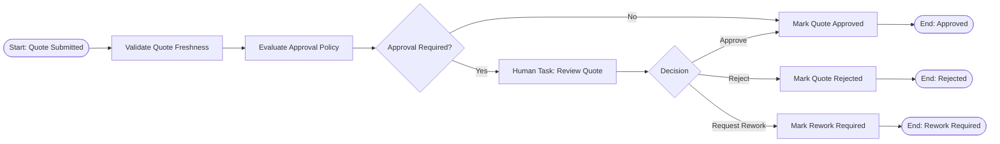
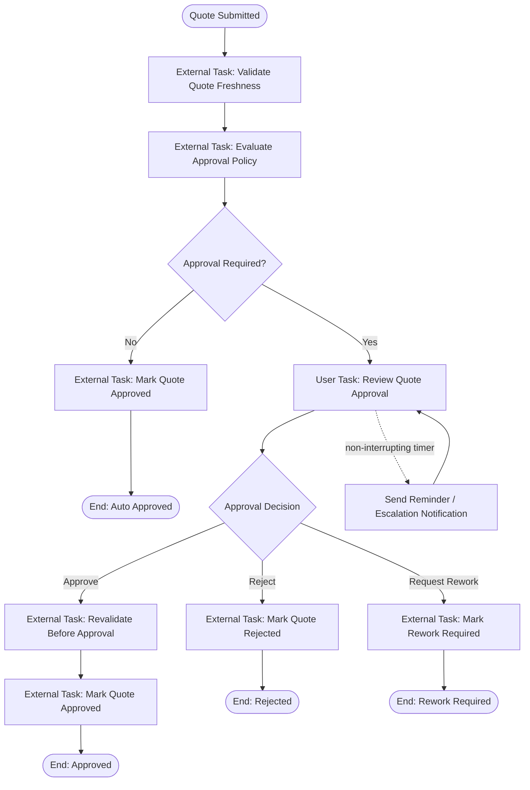
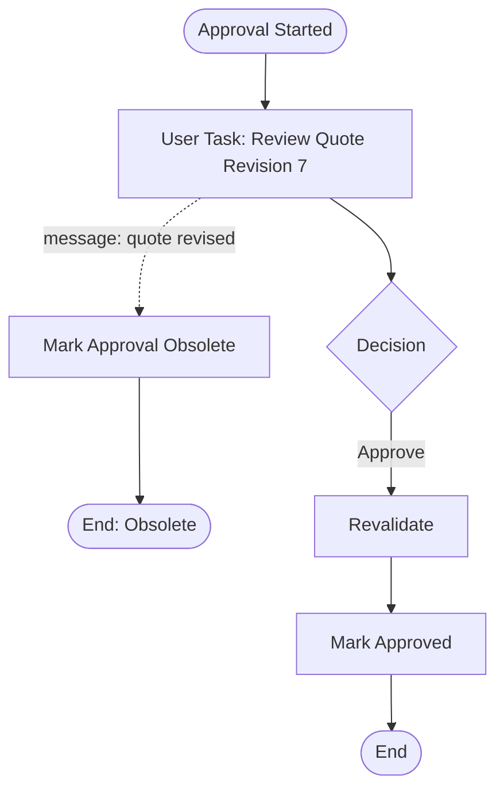
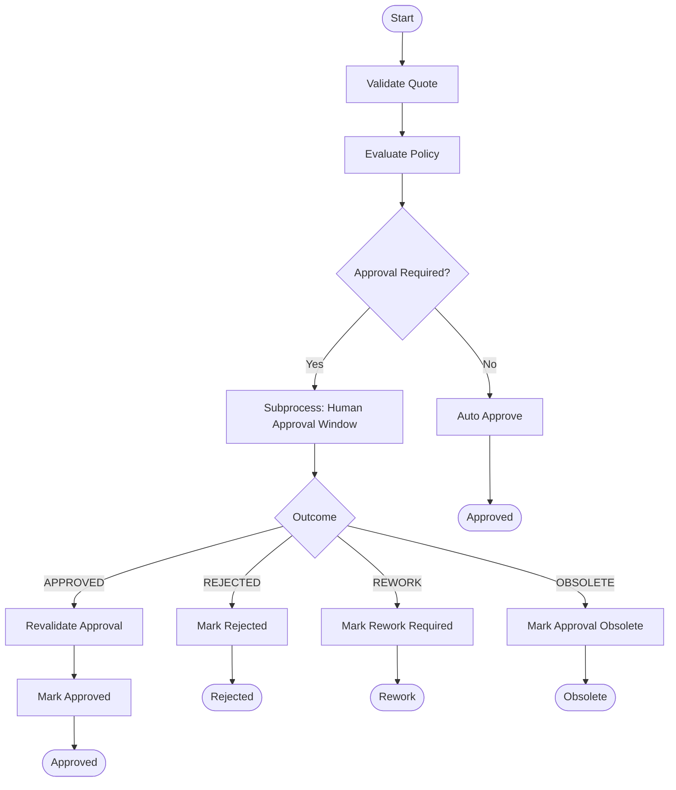
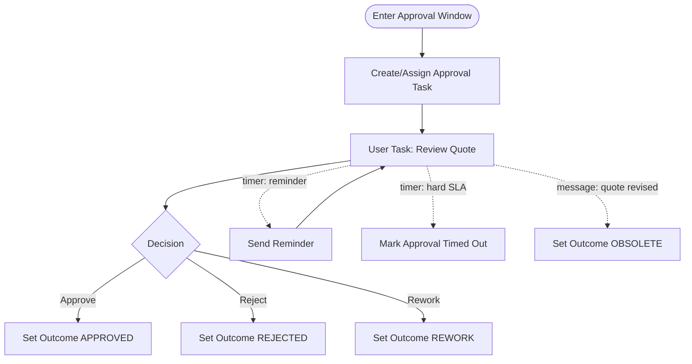
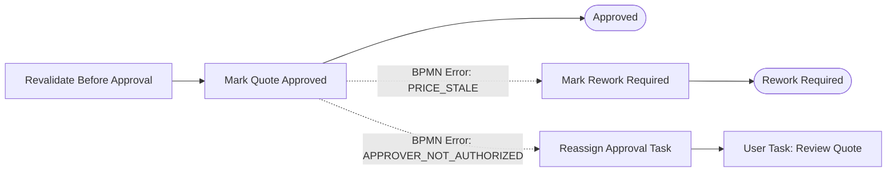
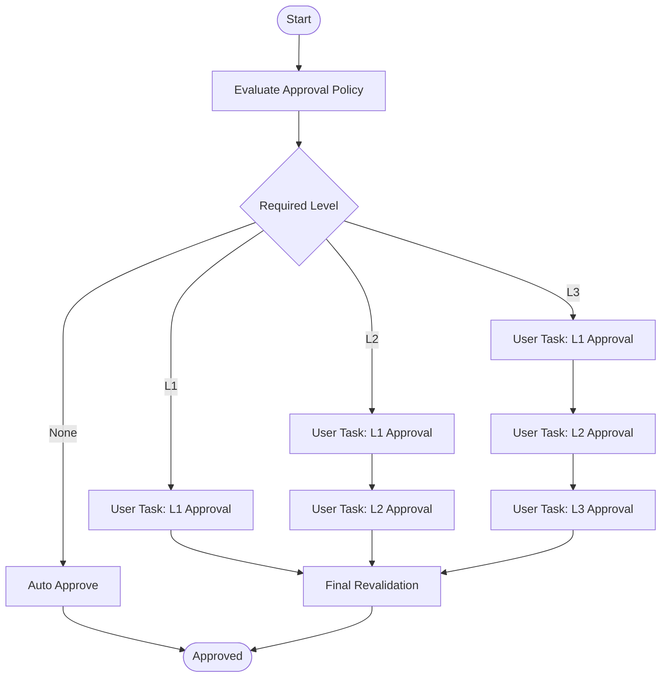
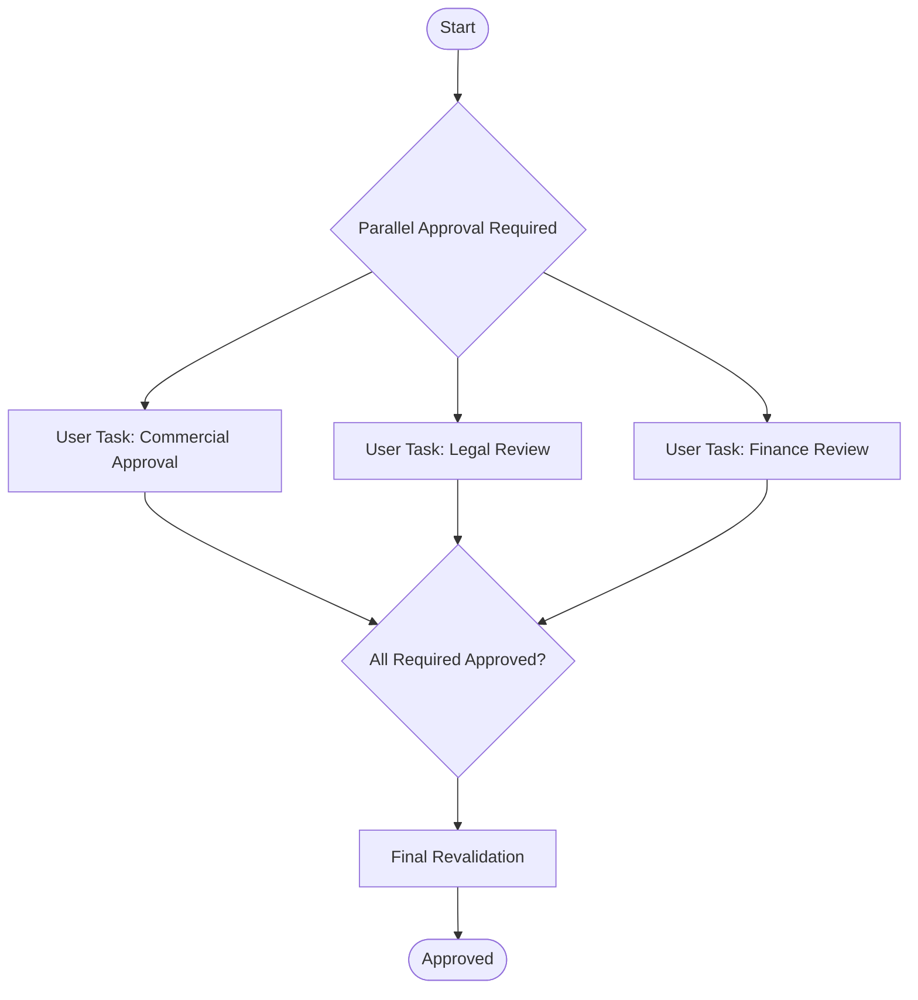

# Part 022 — BPMN Modeling for Quote Approval

Part sebelumnya menentukan posisi Camunda 7 dalam arsitektur.

Sekarang kita mulai menggambar proses nyata:

```text
quote approval
```

Quote approval adalah workflow klasik CPQ.

Tetapi jangan remehkan.

Banyak sistem CPQ gagal bukan karena tidak bisa membuat quote, tetapi karena approval-nya tidak menjawab pertanyaan enterprise:

```text
Siapa boleh approve?
Berdasarkan policy versi mana?
Untuk discount berapa?
Untuk quote revision mana?
Apa yang terjadi jika quote berubah saat approval berjalan?
Apa yang terjadi jika approver tidak merespons?
Apa yang terjadi jika approver menolak?
Apa yang terjadi jika approver approve setelah harga stale?
Bagaimana audit menjelaskan keputusan itu dua tahun kemudian?
```

BPMN harus membantu menjawab semua itu.

Bukan hanya menggambar kotak “Approve Quote”.

---

## 1. Target Workflow

Kita ingin membangun workflow approval yang menangani:

```text
submit quote for approval
validate quote freshness
evaluate approval policy
skip approval jika tidak perlu
assign approval task
apply four-eyes rule
wait for human approval
handle approve/reject/request-rework
handle SLA timer
send escalation notification
re-evaluate jika quote berubah
complete quote approval
publish workflow events
```

Secara domain, quote lifecycle yang relevan:

```text
DRAFT
CONFIGURED
PRICED
SUBMITTED_FOR_APPROVAL
APPROVAL_IN_PROGRESS
APPROVED
REJECTED
REWORK_REQUIRED
ACCEPTED
EXPIRED
```

BPMN tidak menggantikan state machine ini.

BPMN mengorkestrasi perjalanan menuju transisi state yang dijaga oleh quote service.

---

## 2. Approval Is a Business Decision, Not a Task Name

Kalimat:

```text
Manager approves quote
```

terlihat sederhana.

Dalam sistem enterprise, itu sebenarnya kumpulan keputusan:

```text
Apakah approval diperlukan?
Approval level berapa?
Siapa kandidat approver?
Apakah requester boleh approve sendiri?
Apa batas authority approver?
Apa data yang perlu dilihat approver?
Apa yang terjadi jika quote berubah?
Apa SLA-nya?
Apa path jika reject?
Apa path jika rework?
```

BPMN hanya satu bagian.

Decision logic sebaiknya ditempatkan di DMN/policy service/domain service, bukan disembunyikan dalam gateway expression panjang.

Gateway expression harus membaca hasil keputusan.

Bukan menghitung seluruh keputusan.

---

## 3. Minimal BPMN First

Mulai dari flow paling kecil:



Ini belum lengkap.

Tetapi ini sudah menunjukkan struktur penting:

```text
freshness check
policy decision
conditional approval
human decision
state transition by domain service
```

Jangan langsung menggambar 40 aktivitas.

Mulai dari invariant.

---

## 4. BPMN Role Assignment

Dalam Camunda 7, user task bisa memakai candidate user/group.

Tetapi untuk enterprise CPQ, candidate group saja tidak cukup.

Contoh:

```text
candidateGroup = sales-manager-l2
```

Ini tidak menjawab:

```text
manager untuk tenant mana?
manager untuk region mana?
manager punya authority sampai discount berapa?
manager boleh approve quote yang dibuat bawahannya?
manager boleh approve quote untuk partner channel ini?
```

Jadi pola yang lebih baik:

```text
BPMN task has technical candidate group.
Task completion API performs domain authorization.
Policy service determines approver candidates and authority.
```

Process variable:

```text
approvalLevel = L2
candidateGroup = sales-manager-l2
approvalPolicyVersion = 2026.07
requesterUserId = u123
```

Tetapi task completion tetap mengecek authority saat runtime.

---

## 5. Four-Eyes Principle

Four-eyes principle berarti orang yang mengajukan tidak boleh menjadi orang yang menyetujui.

BPMN example dari Camunda menggunakan ide approval dua orang untuk memastikan request disetujui sebelum menjadi approved. Di CPQ, kita dapat memodifikasi prinsip ini untuk menghindari self-approval.

Rule:

```text
Approver user id must not equal requester user id.
```

Tetapi enterprise sering butuh rule yang lebih luas:

```text
Approver must not be the quote owner.
Approver must not be subordinate of requester if threshold above X.
Approver must have active authority at decision time.
Approver must belong to same tenant/business unit unless global approver.
```

Jangan letakkan rule ini hanya di BPMN gateway.

Letakkan di approval policy/domain authorization.

BPMN cukup membaca outcome:

```text
approvalAllowed = true/false
violationCode = SELF_APPROVAL_NOT_ALLOWED
```

---

## 6. Expanded BPMN with SLA Timer

Approval yang menunggu manusia harus punya timer.

Timer bukan hanya reminder.

Timer adalah operational guarantee.



Di BPMN asli, timer boundary event dapat ditempel ke user task.

Untuk reminder, gunakan non-interrupting timer agar task tetap aktif.

Untuk timeout yang membatalkan task, gunakan interrupting timer.

Bedanya:

```text
non-interrupting timer -> mengirim reminder/escalation, task tetap hidup
interrupting timer -> task dibatalkan dan flow pindah ke path timeout
```

Untuk quote approval, biasanya reminder pertama non-interrupting.

Setelah SLA keras, mungkin interrupting.

---

## 7. Escalation: BPMN Escalation vs Business Escalation

Kata “escalation” sering membingungkan.

Ada BPMN escalation event.

Ada business escalation seperti:

```text
kirim reminder ke manager
naikkan ke manager level 3
buat task baru untuk regional director
```

Dalam BPMN 2.0, escalation event terutama dipakai untuk komunikasi antara subprocess dan parent process. Camunda reference juga menjelaskan escalation sebagai event untuk melaporkan ke parent process tanpa diperlakukan sebagai error.

Untuk quote approval sederhana, kita tidak harus memakai BPMN escalation event.

Sering lebih jelas menggunakan:

```text
non-interrupting timer boundary event
↓
send escalation notification task
↓
optional update candidate group / create additional task
```

Gunakan BPMN escalation event jika:

```text
approval task berada dalam embedded subprocess
parent process harus menangani escalation secara eksplisit
escalation bukan error
subprocess tetap boleh berjalan atau perlu dibatalkan sesuai model
```

Jangan memakai escalation event hanya karena namanya cocok.

BPMN simbol harus mengikuti semantics.

---

## 8. Task Outcome Model

Human task tidak boleh complete dengan arbitrary variables.

Gunakan outcome terbatas:

```text
APPROVE
REJECT
REQUEST_REWORK
```

Command:

```json
{
  "decision": "APPROVE",
  "comment": "Discount justified for strategic account",
  "approvalVersion": 3,
  "expectedQuoteRevision": 7
}
```

Semua field harus divalidasi:

```text
decision allowed
comment required for reject/rework
expected quote revision matches
approval task belongs to quote
caller allowed to complete this task
idempotency key valid
```

BPMN gateway membaca `approvalDecision`.

Tetapi completion API yang mengisi variable harus domain-aware.

---

## 9. Revalidation Before Approval

Jangan langsung mark quote approved setelah user klik approve.

Selalu revalidate.

Kenapa?

Selama task menunggu:

```text
catalog bisa berubah
pricing policy bisa berubah
quote bisa direvisi
customer account bisa berubah status
approver bisa kehilangan authority
discount threshold bisa berubah
quote bisa expired
```

Sebelum transisi final ke `APPROVED`, lakukan:

```text
quote revision check
price result freshness check
approval policy freshness check
approver authority check
quote expiration check
tenant/account status check
```

Jika gagal, jangan paksa approve.

Path yang mungkin:

```text
REWORK_REQUIRED
APPROVAL_REEVALUATION_REQUIRED
QUOTE_STALE
APPROVAL_INVALIDATED
```

BPMN harus memodelkan ini.

---

## 10. Approval Invalidated by Quote Change

Quote bisa berubah saat approval berjalan.

Ada dua cara desain:

### Option A: Lock quote during approval

```text
Saat SUBMITTED_FOR_APPROVAL, quote tidak bisa diedit.
Jika butuh edit, approval dibatalkan dan quote kembali ke DRAFT/REWORK.
```

Kelebihan:

```text
simple
approval jelas untuk revision tertentu
```

Kekurangan:

```text
kurang fleksibel untuk sales iteration
```

### Option B: Allow new revision

```text
Revision yang sedang approval tetap immutable.
Edit membuat revision baru.
Approval lama dibatalkan/obsolete.
```

Kelebihan:

```text
lebih enterprise-grade
history jelas
sales bisa iterasi
```

Kekurangan:

```text
workflow correlation lebih kompleks
```

Untuk seri ini, gunakan Option B:

```text
approval selalu terhadap quote revision tertentu
perubahan quote membuat revision baru
workflow approval lama menjadi obsolete/cancelled
```

---

## 11. Message Correlation for Quote Revision Change

Jika quote revision baru dibuat, workflow approval lama harus diberi tahu.

Flow:

```text
Quote service creates revision 8.
Quote service emits QuoteRevisionCreated.
Workflow service receives event.
Workflow service correlates message to process with business key quoteApproval:tenant:quoteId:7.
Process moves to obsolete/cancelled path.
```

BPMN concept:



Dalam BPMN asli, gunakan boundary message event atau event subprocess sesuai readability.

Untuk CPQ, event subprocess sering lebih jelas jika banyak aktivitas dapat diinterupsi oleh quote revision change.

---

## 12. Process Variable Design

Untuk quote approval, process variable cukup:

```yaml
tenantId: t001
quoteId: 2f6a...
quoteRevision: 7
quoteOwnerUserId: u100
requesterUserId: u100
customerAccountId: a200
priceResultId: p300
requestedDiscountPercent: 18.5
approvalRequired: true
approvalLevel: L2
approvalPolicyVersion: 2026.07
approvalDecision: APPROVE
approverUserId: u900
```

Jangan simpan:

```text
full quote line tree
full product catalog data
full pricing breakdown
customer PII
large document
```

Task UI dapat mengambil detail dari Quote API:

```http
GET /quotes/{quoteId}/revisions/{revision}/approval-view
```

Workflow variable hanya membantu routing.

---

## 13. BPMN Shape with Subprocess

Untuk flow approval enterprise, kita bisa bungkus review dalam subprocess.

Ini berguna untuk SLA/escalation/obsolete handling.



Inside subprocess:



Kenapa subprocess?

```text
approval window punya internal events sendiri
parent process tetap bersih
escalation semantics lebih jelas
obsolete/timeout path lebih mudah dibaca
```

---

## 14. SLA Model

SLA approval harus eksplisit.

Contoh:

```text
L1 approval: reminder after 4 business hours, hard timeout after 2 business days
L2 approval: reminder after 8 business hours, escalate after 1 business day, hard timeout after 3 business days
L3 approval: reminder after 1 business day, escalate to director after 2 business days, hard timeout after 5 business days
```

Jangan hardcode timer di BPMN jika policy sering berubah.

Gunakan variable:

```text
reminderDueAt
hardTimeoutAt
escalationDueAt
```

Policy evaluation menghasilkan SLA dates.

Timer memakai expression.

Tetapi hati-hati:

```text
perubahan variable setelah timer job dibuat tidak selalu berarti timer otomatis berubah sesuai harapan desain
```

Untuk perubahan SLA, modelkan explicitly:

```text
cancel/recreate approval task
restart approval subprocess
atau gunakan management operation yang terkendali
```

---

## 15. Business Calendar Problem

Approval SLA jarang memakai waktu kalender mentah.

Contoh:

```text
4 business hours
2 business days
exclude weekend
exclude public holiday
tenant-specific timezone
regional holiday
```

Jangan biarkan BPMN menghitung semua itu.

Gunakan SLA service:

```text
input: tenant, region, approvalLevel, submittedAt
output: reminderDueAt, escalationDueAt, hardTimeoutAt
```

BPMN hanya memakai timestamp hasil perhitungan.

Ini menjaga process model tetap sederhana.

---

## 16. Approval Task Data View

Approver butuh melihat data yang tepat.

Jangan biarkan UI merakit dari 12 endpoint tanpa contract.

Buat approval view:

```http
GET /quotes/{quoteId}/revisions/{revision}/approval-view
```

Response:

```json
{
  "quoteId": "...",
  "revision": 7,
  "customer": {
    "accountId": "...",
    "displayName": "Acme Enterprise"
  },
  "commercialSummary": {
    "listTotal": "100000.00",
    "discountTotal": "18500.00",
    "netTotal": "81500.00",
    "currency": "USD"
  },
  "policy": {
    "approvalLevel": "L2",
    "policyVersion": "2026.07",
    "reasons": ["DISCOUNT_ABOVE_L1_THRESHOLD"]
  },
  "priceTraceId": "...",
  "documents": [
    { "type": "QUOTE_PDF", "artifactId": "..." }
  ]
}
```

View ini harus snapshot-safe.

Approver harus menilai revision yang sama dengan workflow.

---

## 17. Completing the Task

Task completion endpoint:

```http
POST /workflow/tasks/{taskId}/commands/complete-quote-approval
Idempotency-Key: task-approval:u900:task123:decision1
```

Body:

```json
{
  "tenantId": "t001",
  "quoteId": "2f6a...",
  "quoteRevision": 7,
  "decision": "APPROVE",
  "comment": "Strategic account. Discount justified by 3-year term.",
  "expectedTaskVersion": 3
}
```

Use case:

```java
public CompleteApprovalResult execute(CompleteQuoteApprovalCommand command,
                                      SecurityContext securityContext) {
    TaskRef task = camundaTaskGateway.getTask(command.taskId());

    task.assertDefinitionKey("ReviewQuoteApproval");
    task.assertTenant(command.tenantId());
    task.assertBusinessObject("QUOTE", command.quoteId(), command.quoteRevision());

    authorizationService.assertCanApproveQuote(
        securityContext.principal(),
        command.tenantId(),
        command.quoteId(),
        command.quoteRevision(),
        command.decision()
    );

    quoteClient.assertApprovalTaskStillValid(
        command.tenantId(),
        command.quoteId(),
        command.quoteRevision(),
        securityContext.userId()
    );

    camundaTaskGateway.complete(
        command.taskId(),
        Map.of(
            "approvalDecision", command.decision().name(),
            "approverUserId", securityContext.userId(),
            "approvalComment", command.comment()
        )
    );

    return CompleteApprovalResult.accepted();
}
```

Task completion is not a raw Camunda operation.

It is a business command.

---

## 18. Mark Quote Approved

After human decision, BPMN calls an external task:

```text
quote.mark-approved.v1
```

Worker behavior:

```java
public void handle(ExternalTask task, ExternalTaskService service) {
    MarkQuoteApprovedCommand command = new MarkQuoteApprovedCommand(
        variable(task, "tenantId"),
        uuid(task, "quoteId"),
        integer(task, "quoteRevision"),
        variable(task, "approverUserId"),
        variable(task, "approvalPolicyVersion"),
        task.getProcessInstanceId()
    );

    try {
        quoteClient.markApproved(command);
        service.complete(task);
    } catch (BusinessConflictException e) {
        service.handleBpmnError(task, "QUOTE_APPROVAL_INVALIDATED", e.getMessage());
    } catch (Exception e) {
        service.handleFailure(task, e.getMessage(), stackTrace(e), 3, 60_000L);
    }
}
```

Business conflict menjadi BPMN error.

Technical failure menjadi retry/incident.

---

## 19. BPMN Error Paths

Error yang perlu dimodelkan:

```text
QUOTE_NOT_FOUND
QUOTE_REVISION_OBSOLETE
QUOTE_EXPIRED
PRICE_STALE
APPROVER_NOT_AUTHORIZED
POLICY_VERSION_STALE
QUOTE_APPROVAL_INVALIDATED
```

Jangan semua error masuk incident.

Beberapa adalah business path.

Contoh:



---

## 20. Multi-Level Approval

Discount mungkin butuh approval bertingkat.

Contoh:

```text
0-10%: no approval
10-20%: L1 manager
20-35%: L2 director
>35%: VP approval
```

Jangan hardcode level ini di BPMN.

Policy service menghasilkan approval chain:

```json
{
  "approvalRequired": true,
  "levels": [
    { "level": "L1", "candidateGroup": "sales-manager-l1" },
    { "level": "L2", "candidateGroup": "sales-director-l2" }
  ]
}
```

BPMN options:

```text
sequential multi-instance user task
explicit L1 -> L2 -> L3 tasks
call activity for approval level
```

Untuk enterprise audit, explicit tasks lebih mudah dibaca jika jumlah level kecil.

Untuk dynamic chain, multi-instance lebih fleksibel tetapi lebih sulit di-debug.

Default seri ini:

```text
Use explicit model for 1-3 known levels.
Use dynamic multi-instance only when approval chain truly variable.
```

---

## 21. Sequential Approval Diagram



This is verbose.

But sometimes verbose is good.

Enterprise process diagrams are not code-golf.

They are shared operational language.

---

## 22. Parallel Approval

Some quote approval needs parallel approval:

```text
commercial approval
legal approval
finance approval
```

Pattern:



Be careful.

Parallel approval introduces race conditions:

```text
one approver rejects while another approves
quote revised while two tasks active
one task times out while others complete
legal requests rework while commercial approves
```

You need an outcome aggregation policy:

```text
any reject -> rejected
any rework -> rework required unless already rejected
all approve -> approved
timeout -> escalated/reassigned
obsolete -> cancel all active tasks
```

---

## 23. Approval Audit Trail

Every decision must create durable business audit.

Not only Camunda history.

Record:

```text
approvalDecisionId
quoteId
quoteRevision
approvalLevel
approverUserId
requesterUserId
decision
comment
policyVersion
priceResultId
decidedAt
processInstanceId
taskId
correlationId
tenantId
```

Why not only Camunda history?

```text
Camunda history is engine-centric.
Business audit needs domain-centric query and retention policy.
Regulatory/enterprise review should not require reading engine internals.
```

Camunda history helps.

Domain audit is still required.

---

## 24. Testing the BPMN

Test cases:

```text
quote below threshold auto-approves
quote above threshold creates approval task
self-approval rejected
authorized approver can approve
reject decision marks quote rejected
request rework marks quote rework required
stale price blocks final approval
quote revision change cancels old approval
reminder timer sends notification and keeps task active
hard timeout reassigns or terminates approval
worker technical failure retries
worker business error follows BPMN error path
```

Test at layers:

```text
policy service unit test
workflow facade integration test
BPMN process test
external worker contract test
quote service transition test
end-to-end scenario test
```

Do not test BPMN only by clicking UI.

Workflow is code.

Treat it as code.

---

## 25. Operational Queries

Ops needs to answer:

```text
Which approvals are overdue?
Which approvals are waiting for L2?
Which quotes are blocked by stale price?
Which approvers have many pending tasks?
Which approval processes are obsolete due to revision change?
Which approvals created incidents in policy evaluation?
```

Build read model:

```sql
create table quote_approval_work_item (
    id uuid primary key,
    tenant_id varchar(64) not null,
    quote_id uuid not null,
    quote_revision int not null,
    process_instance_id varchar(64) not null,
    task_id varchar(64),
    approval_level varchar(32) not null,
    status varchar(64) not null,
    candidate_group varchar(128),
    assignee_user_id varchar(128),
    due_at timestamptz,
    escalated_at timestamptz,
    created_at timestamptz not null,
    updated_at timestamptz not null
);
```

This read model can be fed by:

```text
workflow task listener
workflow events
scheduled reconciliation
```

But do not make it the source of truth for decision.

It is operational projection.

---

## 26. Notification Strategy

Approval notification should be event-driven and idempotent.

Events:

```text
QuoteApprovalTaskCreated
QuoteApprovalReminderDue
QuoteApprovalEscalated
QuoteApprovalCompleted
QuoteApprovalRejected
QuoteApprovalReworkRequested
```

Notification service decides channel:

```text
email
in-app notification
Slack/Teams
SMS for critical escalation
```

Idempotency key:

```text
notification:quote-approval-reminder:{tenantId}:{quoteId}:{revision}:{taskId}:{reminderNo}
```

Never send notification directly from a gateway expression.

Use service task/external worker/event.

---

## 27. BPMN Naming Convention

Use stable technical names.

Process:

```text
quote-approval
```

Activities:

```text
ValidateQuoteFreshness
EvaluateApprovalPolicy
ReviewQuoteApproval
SendApprovalReminder
RevalidateBeforeApproval
MarkQuoteApproved
MarkQuoteRejected
MarkQuoteReworkRequired
MarkApprovalObsolete
```

Events:

```text
QuoteRevisedMessage
ApprovalReminderTimer
ApprovalHardTimeoutTimer
QuoteApprovalInvalidatedError
```

Avoid:

```text
Task 1
Manager Review
Check
Do Approval
```

Bad names become operational pain.

Ops will see these names in incidents and history.

---

## 28. Minimal BPMN XML Sketch

This is not complete production XML, but it shows the shape.

```xml
<bpmn:process id="quote-approval" name="Quote Approval" isExecutable="true">
  <bpmn:startEvent id="Start_QuoteSubmitted" />

  <bpmn:serviceTask id="ValidateQuoteFreshness"
                    name="Validate Quote Freshness"
                    camunda:type="external"
                    camunda:topic="quote.validate-freshness.v1" />

  <bpmn:serviceTask id="EvaluateApprovalPolicy"
                    name="Evaluate Approval Policy"
                    camunda:type="external"
                    camunda:topic="quote.evaluate-approval-policy.v1" />

  <bpmn:exclusiveGateway id="Gateway_ApprovalRequired"
                         name="Approval Required?" />

  <bpmn:userTask id="ReviewQuoteApproval"
                 name="Review Quote Approval"
                 camunda:candidateGroups="${candidateGroup}" />

  <bpmn:boundaryEvent id="Timer_ApprovalReminder"
                      attachedToRef="ReviewQuoteApproval"
                      cancelActivity="false">
    <bpmn:timerEventDefinition>
      <bpmn:timeDate>${reminderDueAt}</bpmn:timeDate>
    </bpmn:timerEventDefinition>
  </bpmn:boundaryEvent>

  <bpmn:serviceTask id="SendApprovalReminder"
                    name="Send Approval Reminder"
                    camunda:type="external"
                    camunda:topic="notification.send-approval-reminder.v1" />
</bpmn:process>
```

Do not copy this blindly.

Use it as skeleton.

Production BPMN needs full sequence flows, error boundary events, message events, execution listeners only where justified, and model validation.

---

## 29. Anti-Patterns

### Anti-pattern 1: Approval Rule in Gateway Expression

```text
${discount > 15 && customer.segment == 'ENTERPRISE' && region == 'APAC' && ...}
```

This hides policy in BPMN.

Move to policy service/DMN.

### Anti-pattern 2: Approver Authority Checked Only at Assignment

Approver authority can change after assignment.

Check again at completion.

### Anti-pattern 3: Approving Mutable Quote

Approval must apply to immutable quote revision.

Never approve “current quote” without revision.

### Anti-pattern 4: Timer Without Owner

A timer fires, but nobody knows what should happen.

Every timer needs business meaning and recovery owner.

### Anti-pattern 5: Generic Task Completion

Generic task completion allows invalid variable injection.

Use semantic command API.

---

## 30. Implementation Checklist

Before declaring quote approval ready:

```text
[ ] Approval process key is stable.
[ ] Business key includes tenant, quote id, and revision.
[ ] Process variables are small and reference-based.
[ ] Approval policy evaluation is externalized.
[ ] User task candidate group is not the only authorization control.
[ ] Task completion is semantic and domain-guarded.
[ ] Four-eyes rule is enforced at completion.
[ ] Final approval revalidates quote freshness.
[ ] Quote revision change invalidates old approval.
[ ] SLA reminder and hard timeout are modeled.
[ ] Business errors are separate from technical failures.
[ ] Approval decision is written to domain audit.
[ ] Operational read model exists for pending approvals.
[ ] Notification is idempotent.
[ ] BPMN has tests for happy path and failure path.
```

---

## 31. What Comes Next

Quote approval uses policy decisions.

Part berikutnya akan masuk ke **DMN for Commercial Decisions**.

Kita akan membahas:

```text
when to use DMN
when not to use DMN
discount approval table
eligibility decision
manual override policy
rule versioning
hit policy
explainability
DMN + domain service boundary
DMN testing
```

BPMN menjawab:

```text
What happens next?
```

DMN menjawab:

```text
What decision should be made?
```

Dalam enterprise CPQ/OMS, keduanya harus dipisahkan dengan jelas.

---

## References

- Camunda BPMN reference — `https://camunda.com/bpmn/reference/`
- Camunda BPMN examples: Four-Eyes Principle — `https://camunda.com/bpmn/examples/`
- Camunda docs: External Tasks — `https://docs.camunda.org/manual/7.5/user-guide/process-engine/external-tasks/`
- Camunda best practices: Understanding transaction handling in Camunda 7 — `https://unsupported.docs.camunda.io/8.3/docs/components/best-practices/development/understanding-transaction-handling-c7/`
