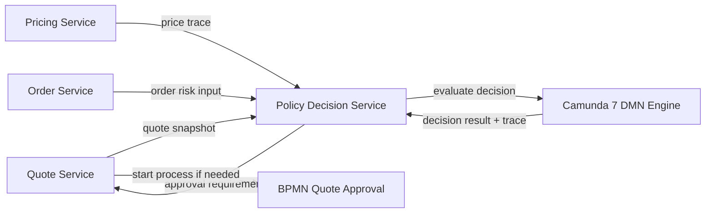
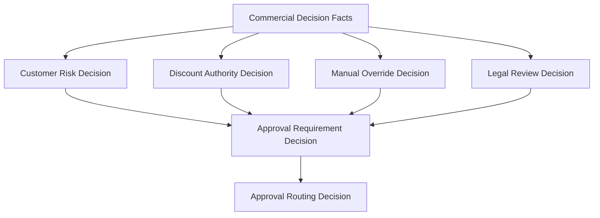
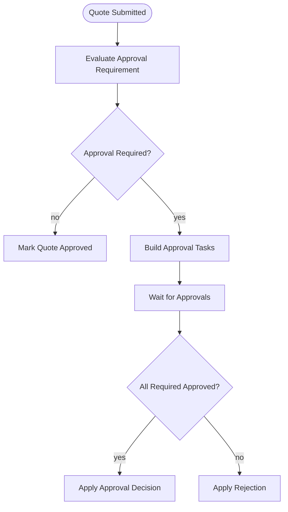

# Part 023 — DMN for Commercial Decisions

Part sebelumnya membangun workflow quote approval dengan BPMN.

Sekarang kita pisahkan satu hal yang sering dicampur ke BPMN secara keliru:

```text
business decision
```

BPMN menjawab:

```text
apa urutan kerja yang harus terjadi?
```

DMN menjawab:

```text
keputusan bisnis apa yang harus diambil berdasarkan data tertentu?
```

Dalam CPQ/OMS, keputusan komersial tidak boleh tersebar di `if-else` service layer, expression gateway BPMN, frontend, stored procedure, dan spreadsheet manual.

Jika keputusan tersebar, sistem akan gagal menjawab pertanyaan sederhana:

```text
Kenapa quote ini butuh approval level L3?
Kenapa diskon 18% ditolak?
Policy versi mana yang dipakai saat quote diterima?
Apakah policy hari ini sama dengan policy saat quote dibuat?
Siapa yang mengubah rule?
Apakah perubahan rule berdampak pada quote yang sedang approval?
```

DMN adalah alat untuk membuat keputusan bisnis menjadi explicit, versioned, testable, dan explainable.

Bukan karena DMN selalu lebih kuat dari kode.

Tetapi karena untuk banyak policy enterprise, tabel keputusan lebih mudah diaudit, direview, dan dijelaskan daripada kode imperative.

---

## 1. Posisi DMN Dalam CPQ/OMS

Jangan mulai dari “kita pakai DMN untuk semua rule”.

Itu salah.

DMN cocok untuk keputusan yang punya karakteristik berikut:

```text
input jelas
output jelas
rule relatif deklaratif
business owner bisa review
hasil perlu dijelaskan
perubahan policy cukup sering
keputusan perlu diaudit
```

Contoh yang cocok:

```text
apakah quote eligible untuk approval?
approval level apa yang dibutuhkan?
siapa candidate approval group?
berapa maksimum discount tanpa approval?
apakah manual price override diperbolehkan?
apakah customer eligible untuk product offering?
apakah quote perlu legal review?
apakah order high-risk dan perlu manual review?
```

Contoh yang kurang cocok:

```text
optimasi harga kompleks berbasis statistik
constraint solving konfigurasi besar
ranking recommendation real-time
algoritma search
network planning
fulfillment decomposition yang sangat graph-heavy
```

Mental model-nya:

```text
DMN = decision boundary
BPMN = orchestration boundary
Domain service = invariant boundary
Database = truth boundary
Kafka = integration boundary
```

DMN tidak menggantikan domain service.

DMN memberikan recommendation/decision result.

Domain service tetap memvalidasi apakah decision result boleh diterapkan.

---

## 2. Commercial Decisions yang Akan Kita Modelkan

Dalam seri ini, kita akan memakai DMN untuk lima keputusan utama.

```text
1. Discount Approval Decision
2. Manual Override Decision
3. Quote Risk Decision
4. Product Eligibility Decision
5. Order Review Decision
```

Diagram posisi:



Penting:

`Policy Decision Service` adalah boundary aplikasi kita.

Camunda DMN engine adalah execution engine.

Jangan biarkan semua service memanggil DMN engine langsung dengan variable bebas.

Jika semua service bisa memanggil DMN langsung, kita kehilangan contract, audit, versioning, dan testing strategy.

---

## 3. DMN Bukan Tempat Menyimpan Semua Context

Kesalahan umum:

```text
Masukkan seluruh quote sebagai process variable / decision variable.
```

Ini berbahaya.

DMN input harus ringkas, eksplisit, dan stabil.

Contoh input yang buruk:

```json
{
  "quote": {
    "id": "Q-1001",
    "customer": { "...": "..." },
    "lines": [ { "...": "..." } ],
    "price": { "...": "..." },
    "approval": { "...": "..." }
  }
}
```

Contoh input yang lebih baik:

```json
{
  "tenantId": "enterprise-id",
  "quoteType": "NEW_SALE",
  "customerSegment": "ENTERPRISE",
  "customerRiskTier": "MEDIUM",
  "salesChannel": "DIRECT",
  "contractTermMonths": 36,
  "currency": "IDR",
  "totalRecurringAmount": 250000000,
  "maxDiscountPercent": 18.5,
  "hasManualPriceOverride": true,
  "hasNonStandardTerm": false,
  "productFamilySet": ["CONNECTIVITY", "MANAGED_SERVICE"],
  "requesterRole": "ACCOUNT_MANAGER",
  "requesterRegion": "APAC",
  "quoteRevision": 7,
  "pricingPolicyVersion": "price-policy-2026.07.01",
  "catalogPublicationId": "catpub-2026.07"
}
```

Rule tidak perlu tahu seluruh object graph.

Rule perlu tahu facts.

Facts harus dibangun oleh domain service dengan logic yang testable.

```text
Quote aggregate -> Decision Facts -> DMN -> Decision Result -> Domain Command
```

---

## 4. Decision Facts

Kita buat contract internal bernama `CommercialDecisionFacts`.

```java
public record CommercialDecisionFacts(
    String tenantId,
    String quoteId,
    int quoteRevision,
    String quoteType,
    String customerSegment,
    String customerRiskTier,
    String salesChannel,
    int contractTermMonths,
    String currency,
    BigDecimal totalRecurringAmount,
    BigDecimal totalOneTimeAmount,
    BigDecimal maxDiscountPercent,
    boolean hasManualPriceOverride,
    boolean hasNonStandardTerm,
    boolean hasStrategicProduct,
    Set<String> productFamilySet,
    String requesterUserId,
    String requesterRole,
    String requesterRegion,
    String catalogPublicationId,
    String pricingPolicyVersion,
    Instant evaluatedAt
) {}
```

Perhatikan field-nya.

Tidak ada entity JPA.

Tidak ada lazy relation.

Tidak ada object `QuoteLineEntity`.

Tidak ada object `CustomerEntity`.

DMN input adalah snapshot facts.

Jika facts berubah, decision result bisa berubah.

Karena itu, facts yang dipakai harus disimpan bersama decision trace.

---

## 5. Decision Result

Output DMN juga tidak boleh hanya boolean.

Output harus menjawab:

```text
apa keputusan?
kenapa?
apa konsekuensinya?
siapa aktor berikutnya?
berapa authority level?
apakah keputusan blocking?
apakah decision reusable untuk workflow?
```

Contoh result:

```java
public record ApprovalRequirementDecision(
    boolean approvalRequired,
    String approvalLevel,
    String approvalGroup,
    String reasonCode,
    String reasonText,
    boolean legalReviewRequired,
    boolean financeReviewRequired,
    boolean executiveApprovalRequired,
    String decisionKey,
    String decisionVersion,
    String policyVersion,
    Map<String, Object> matchedRuleAttributes
) {}
```

`reasonText` boleh user-facing.

`reasonCode` harus machine-readable.

Contoh:

```text
DISCOUNT_EXCEEDS_ROLE_LIMIT
MANUAL_OVERRIDE_REQUIRES_APPROVAL
HIGH_RISK_CUSTOMER_REQUIRES_REVIEW
NON_STANDARD_TERM_REQUIRES_LEGAL
```

Kode semacam ini penting untuk:

```text
UI explanation
audit report
operational dashboard
analytics
regression test
policy impact analysis
```

---

## 6. Decision Requirements Graph

Jangan hanya membuat satu tabel besar.

Untuk CPQ/OMS enterprise, keputusan sering perlu dipecah.

Contoh:

```text
Customer Risk Decision
        ↓
Discount Authority Decision
        ↓
Approval Requirement Decision
        ↓
Approval Routing Decision
```

Dalam DMN, ini bisa dimodelkan sebagai decision requirements graph.

Mental model:



Rule kecil lebih mudah dites daripada rule monster.

Tetapi terlalu banyak decision juga membuat debugging sulit.

Gunakan prinsip ini:

```text
pecah decision jika output-nya punya makna bisnis sendiri
jangan pecah hanya agar tabel terlihat rapi
```

---

## 7. Hit Policy Sebagai Semantik Bisnis

Hit policy bukan pilihan teknis.

Hit policy adalah makna bisnis.

Contoh:

```text
UNIQUE
hanya satu rule boleh match
cocok untuk klasifikasi eksklusif

FIRST
rule pertama yang match menang
cocok jika rule order memang bagian dari policy

COLLECT
semua rule yang match dikumpulkan
cocok untuk daftar reason/flag/review requirements
```

Untuk CPQ/OMS, saya biasanya memakai pendekatan berikut:

| Decision | Hit Policy | Alasan |
|---|---|---|
| Customer Risk Tier | UNIQUE | Satu customer harus punya satu risk tier efektif. |
| Discount Authority | UNIQUE | Satu authority bracket harus menang. |
| Approval Reason Flags | COLLECT | Satu quote bisa punya banyak alasan approval. |
| Approval Routing | FIRST / UNIQUE | Tergantung apakah routing disusun priority atau mutually exclusive. |
| Manual Override Policy | UNIQUE | Override biasanya menghasilkan satu keputusan final. |

Jangan memakai `FIRST` untuk menutupi rule yang overlap.

`FIRST` boleh jika ordering adalah bagian dari policy.

Jika tidak, gunakan `UNIQUE` dan biarkan test menangkap overlap.

Camunda documentation untuk pembuatan DMN decision table menjelaskan bahwa hit policy `UNIQUE` berarti hanya satu rule yang boleh match dan default hit policy-nya adalah `UNIQUE`.

---

## 8. Discount Approval Decision

Kita mulai dari decision paling klasik.

Pertanyaan:

```text
Untuk quote ini, approval level apa yang dibutuhkan berdasarkan diskon maksimum?
```

Input facts:

```text
customerSegment
requesterRole
maxDiscountPercent
totalRecurringAmount
contractTermMonths
customerRiskTier
hasManualPriceOverride
```

Output:

```text
approvalRequired
approvalLevel
approvalGroup
reasonCode
```

Contoh table konseptual:

| Customer Segment | Requester Role | Max Discount % | TCV Range | Risk Tier | Approval Level | Approval Group | Reason |
|---|---|---:|---:|---|---|---|---|
| SMB | SALES_REP | `<= 5` | any | any | NONE | none | WITHIN_LIMIT |
| SMB | SALES_REP | `> 5` | any | any | L1 | SALES_MANAGER | DISCOUNT_EXCEEDS_LIMIT |
| ENTERPRISE | ACCOUNT_MANAGER | `<= 10` | `< 1B` | LOW | NONE | none | WITHIN_LIMIT |
| ENTERPRISE | ACCOUNT_MANAGER | `> 10` | `< 1B` | LOW | L2 | REGIONAL_DIRECTOR | DISCOUNT_EXCEEDS_LIMIT |
| ENTERPRISE | ACCOUNT_MANAGER | any | `>= 1B` | any | L3 | VP_SALES | HIGH_VALUE_QUOTE |
| any | any | any | any | HIGH | L3 | RISK_COMMITTEE | HIGH_RISK_CUSTOMER |

Masalah yang langsung terlihat:

Rule terakhir `any/high risk` bisa overlap dengan rule lain.

Jika hit policy `UNIQUE`, overlap ini salah.

Jika hit policy `COLLECT`, kita perlu agregasi hasil.

Untuk enterprise CPQ, lebih baik pisahkan:

```text
Discount Authority Decision
Customer Risk Decision
Approval Aggregation Decision
```

Jangan jadikan satu tabel besar jika rule punya dimensi berbeda.

---

## 9. Approval Aggregation

Satu quote bisa memicu banyak alasan approval:

```text
DISCOUNT_EXCEEDS_LIMIT
HIGH_VALUE_QUOTE
HIGH_RISK_CUSTOMER
MANUAL_PRICE_OVERRIDE
NON_STANDARD_TERM
```

Pertanyaan berikutnya:

```text
Dari semua alasan ini, approval route final apa?
```

Ini aggregation decision.

Input:

```json
{
  "approvalReasonCodes": [
    "DISCOUNT_EXCEEDS_LIMIT",
    "MANUAL_PRICE_OVERRIDE",
    "NON_STANDARD_TERM"
  ],
  "highestMonetaryRisk": "MEDIUM",
  "customerSegment": "ENTERPRISE",
  "region": "APAC"
}
```

Output:

```json
{
  "approvalRequired": true,
  "approvalLevel": "L3",
  "approvalGroups": ["VP_SALES", "LEGAL_REVIEW"],
  "approvalMode": "PARALLEL_THEN_FINAL",
  "blocking": true
}
```

Ini menjaga rule tetap jernih.

Discount rule tidak perlu tahu legal policy.

Legal rule tidak perlu tahu discount bracket.

Approval aggregation yang menyatukan konsekuensi.

---

## 10. Manual Override Decision

Manual override sering terlihat kecil.

Padahal ini salah satu area paling berisiko.

Manual override berarti user mencoba melewati hasil engine.

Pertanyaannya bukan hanya:

```text
boleh atau tidak?
```

Tetapi:

```text
boleh untuk role apa?
batas deviasi berapa?
harus diberi reason code apa?
harus approval level berapa?
apakah override mengubah quote expiry?
apakah override harus terlihat di proposal document?
apakah override boleh masuk order tanpa repricing?
```

Contoh decision output:

```json
{
  "overrideAllowed": true,
  "requiresApproval": true,
  "approvalLevel": "L2",
  "maxAllowedDeviationPercent": 7.5,
  "requiresReason": true,
  "requiresAttachment": false,
  "reasonCode": "MANUAL_OVERRIDE_ABOVE_STANDARD_LIMIT"
}
```

Domain service tetap melakukan enforcement.

DMN tidak boleh menjadi satu-satunya pagar.

```java
public void applyManualOverride(ApplyManualOverrideCommand command) {
    QuoteRevision quote = quoteRepository.getForUpdate(command.quoteRevisionId());

    CommercialDecisionFacts facts = decisionFactFactory.from(quote, command);
    ManualOverrideDecision decision = policyDecisionService.evaluateManualOverride(facts);

    if (!decision.overrideAllowed()) {
        throw new BusinessConflictException("MANUAL_OVERRIDE_NOT_ALLOWED");
    }

    quote.applyManualOverride(
        command.lineId(),
        command.newAmount(),
        command.reasonCode(),
        decision
    );

    quoteRepository.save(quote);
    outbox.publish(QuoteEvents.manualOverrideApplied(quote, decision));
}
```

Decision result masuk ke aggregate.

Tetapi aggregate tetap memutuskan transisi valid atau tidak.

---

## 11. Product Eligibility Decision

Product eligibility sering bercampur dengan configuration engine.

Pisahkan dengan hati-hati.

Configuration engine menjawab:

```text
opsi produk ini kompatibel dengan opsi lain?
```

Eligibility decision menjawab:

```text
customer/channel/region ini boleh membeli offering ini?
```

Contoh facts:

```text
customerSegment
customerCountry
salesChannel
productOfferingId
productFamily
customerRiskTier
contractType
regulatoryZone
```

Output:

```text
eligible
ineligibilityReasonCode
requiresSpecialHandling
requiresDocument
```

Contoh use case:

```text
Product managed-security hanya boleh untuk enterprise customer.
Product regulated-connectivity tidak boleh dijual di region tertentu.
Promo tertentu hanya berlaku untuk channel partner.
High-risk customer perlu review sebelum product tertentu dijual.
```

Jika eligibility gagal, quote line tidak boleh hanya diberi warning.

Domain invariant harus jelas:

```text
quote cannot be submitted if it contains ineligible product offering
```

---

## 12. Quote Risk Decision

Risk decision membantu workflow routing.

Tidak semua risk harus financial.

Contoh risk dimensions:

```text
commercial risk
fulfillment risk
legal risk
customer risk
product risk
operational risk
```

Output tidak cukup satu field `riskLevel`.

Gunakan reason vector.

```json
{
  "riskLevel": "HIGH",
  "riskReasons": [
    "HIGH_VALUE_CONTRACT",
    "NON_STANDARD_TERM",
    "NEW_CUSTOMER_WITH_LARGE_COMMITMENT"
  ],
  "requiresManualReview": true,
  "reviewGroup": "COMMERCIAL_RISK"
}
```

Reason vector berguna untuk:

```text
approval explanation
operational routing
reporting
policy tuning
regression test
```

---

## 13. Order Review Decision

Tidak semua keputusan terjadi sebelum order.

Saat quote diterima dan order dibuat, ada risiko baru:

```text
inventory unavailable
customer data mismatch
fulfillment system unavailable
contract data incomplete
payment hold
fraud/risk signal
external validation failure
```

Order review decision menjawab:

```text
boleh lanjut otomatis atau perlu manual fallout/review?
```

Contoh output:

```json
{
  "autoFulfillmentAllowed": false,
  "reviewRequired": true,
  "reviewQueue": "ORDER_RISK_REVIEW",
  "reasonCode": "CONTRACT_DATA_INCOMPLETE",
  "blocking": true
}
```

BPMN order orchestration memakai result ini untuk routing.

Tetapi order service tetap menyimpan state dan invariant.

---

## 14. Versioning Policy

DMN versioning adalah topik enterprise.

Tidak cukup mengatakan:

```text
Camunda punya deployment version.
```

Kita butuh business version.

Contoh:

```text
decisionKey: discount-approval
decisionDefinitionVersion: 42
policyVersion: commercial-policy-2026.07
catalogPublicationId: catpub-2026.07
pricingPolicyVersion: price-policy-2026.07.01
```

Mengapa perlu banyak versi?

Karena version di engine bukan selalu version yang dipahami bisnis.

Business policy version harus bisa muncul di audit report:

```text
Quote Q-1001 revision 7 approved using commercial-policy-2026.07.
```

Jika policy berubah besok, historical quote tidak boleh kehilangan penjelasan.

---

## 15. Decision Snapshot

Setiap decision evaluation penting harus menghasilkan record.

Tabel konseptual:

```sql
create table commercial_decision_audit (
    id uuid primary key,
    tenant_id text not null,
    subject_type text not null,
    subject_id text not null,
    subject_revision int,
    decision_key text not null,
    decision_definition_id text,
    decision_version int,
    policy_version text not null,
    input_facts jsonb not null,
    output_result jsonb not null,
    matched_rules jsonb,
    evaluated_at timestamptz not null,
    evaluated_by text,
    correlation_id text,
    process_instance_id text
);

create index idx_decision_audit_subject
on commercial_decision_audit (tenant_id, subject_type, subject_id, subject_revision);

create index idx_decision_audit_decision
on commercial_decision_audit (tenant_id, decision_key, policy_version, evaluated_at desc);
```

Ini bukan sekadar log.

Ini evidence.

Jika customer dispute terjadi, record ini menjawab:

```text
facts apa yang dipakai?
policy versi apa?
output apa?
workflow apa yang memakai output itu?
```

---

## 16. Camunda 7 Integration Shape

Ada dua pola umum.

### Pattern A — BPMN Calls DMN Directly

BPMN memakai business rule task.

```text
BPMN process -> Business Rule Task -> DMN decision
```

Kelebihan:

```text
simple
native Camunda
visual
mudah untuk workflow-local decision
```

Kekurangan:

```text
service lain sulit reuse
contract facts mudah bocor
risk variable bebas
versioning bisnis sering kurang eksplisit
testing bisa tersebar antara BPMN dan domain test
```

Pattern ini cocok untuk decision kecil yang benar-benar milik workflow.

Contoh:

```text
routing escalation notification berdasarkan task age
```

### Pattern B — Domain/Policy Service Calls DMN

```text
Quote Service -> Policy Decision Service -> DMN Engine
BPMN only receives decision summary
```

Kelebihan:

```text
contract jelas
reuse lintas service
audit lebih konsisten
facts dibangun oleh domain logic
evaluation bisa dipanggil sebelum process start
lebih mudah distub pada test workflow
```

Kekurangan:

```text
lebih banyak kode boundary
perlu governance deployment decision
perlu version selection eksplisit
```

Untuk CPQ/OMS enterprise, gunakan Pattern B sebagai default.

BPMN boleh memanggil DMN langsung hanya jika decision itu workflow-local dan tidak perlu dipakai service lain.

---

## 17. Decision API Internal

Expose decision evaluation sebagai internal API.

```http
POST /internal/policy-decisions/approval-requirement/evaluate
```

Request:

```json
{
  "subjectType": "QUOTE_REVISION",
  "subjectId": "Q-1001",
  "subjectRevision": 7,
  "facts": {
    "tenantId": "enterprise-id",
    "quoteType": "NEW_SALE",
    "customerSegment": "ENTERPRISE",
    "maxDiscountPercent": 18.5,
    "totalRecurringAmount": 250000000,
    "customerRiskTier": "MEDIUM",
    "hasManualPriceOverride": true
  },
  "requestedPolicyVersion": "commercial-policy-2026.07"
}
```

Response:

```json
{
  "decisionId": "dec-8ac7",
  "decisionKey": "approval-requirement",
  "policyVersion": "commercial-policy-2026.07",
  "result": {
    "approvalRequired": true,
    "approvalLevel": "L3",
    "approvalGroups": ["VP_SALES"],
    "reasonCodes": ["DISCOUNT_EXCEEDS_LIMIT", "MANUAL_OVERRIDE"]
  },
  "trace": {
    "matchedRuleIds": ["R-102", "R-210"],
    "evaluatedAt": "2026-07-02T10:15:30Z"
  }
}
```

Internal API bukan berarti bebas auth.

Service-to-service authorization tetap harus jalan.

---

## 18. DMN Deployment Governance

Rule adalah production code.

Perlakukan seperti code.

Minimum governance:

```text
DMN file stored in repository
review required
semantic diff required
scenario test required
approval from business owner
deployment version tracked
rollback plan available
impact analysis documented
```

Repository layout:

```text
workflow/
  decisions/
    approval-requirement.dmn
    discount-authority.dmn
    manual-override-policy.dmn
    product-eligibility.dmn
  tests/
    approval-requirement-scenarios.csv
    manual-override-policy-scenarios.csv
```

Jangan edit DMN langsung di production Cockpit lalu lupa commit.

Itu sama seperti hotfix tanpa source control.

---

## 19. Scenario Test Matrix

DMN harus dites berbasis scenario.

Contoh CSV:

```csv
caseId,customerSegment,requesterRole,maxDiscountPercent,totalRecurringAmount,customerRiskTier,hasManualOverride,expectedApprovalRequired,expectedLevel,expectedReason
C001,SMB,SALES_REP,3,10000000,LOW,false,false,NONE,WITHIN_LIMIT
C002,SMB,SALES_REP,8,10000000,LOW,false,true,L1,DISCOUNT_EXCEEDS_LIMIT
C003,ENTERPRISE,ACCOUNT_MANAGER,12,500000000,LOW,false,true,L2,DISCOUNT_EXCEEDS_LIMIT
C004,ENTERPRISE,ACCOUNT_MANAGER,5,2000000000,LOW,false,true,L3,HIGH_VALUE_QUOTE
C005,ENTERPRISE,ACCOUNT_MANAGER,5,500000000,HIGH,false,true,L3,HIGH_RISK_CUSTOMER
C006,ENTERPRISE,ACCOUNT_MANAGER,5,500000000,LOW,true,true,L2,MANUAL_OVERRIDE
```

Testing goal:

```text
each rule hit at least once
each boundary value tested
each enum value intentionally handled
no accidental overlap for UNIQUE decision
no missing rule for mandatory classification
reason codes stable
policy version expected
```

---

## 20. Boundary Value Tests

Discount thresholds wajib diuji di titik batas.

Jika policy mengatakan:

```text
0% - 5% no approval
>5% - 10% L1
>10% - 20% L2
>20% L3
```

Test harus mencakup:

```text
0
5
5.0001
10
10.0001
20
20.0001
```

Banyak bug approval terjadi di operator:

```text
< vs <=
> vs >=
```

Bug kecil ini bisa bernilai miliaran.

---

## 21. Completeness and Overlap

Untuk decision `UNIQUE`, dua masalah utama:

```text
overlap: lebih dari satu rule match
missing: tidak ada rule match
```

Missing rule bisa menyebabkan:

```text
runtime error
fallback salah
approval ter-skip
quote stuck
```

Overlap rule bisa menyebabkan:

```text
hasil tidak deterministik
rule order tidak sengaja menentukan output
approval level salah
```

Rule table enterprise harus punya explicit default.

Tetapi default tidak boleh menyembunyikan policy gap.

Contoh default yang baik:

```text
approvalRequired = true
approvalLevel = MANUAL_POLICY_REVIEW
reasonCode = POLICY_GAP_REQUIRES_REVIEW
```

Default yang buruk:

```text
approvalRequired = false
```

Dalam domain komersial, unknown biasanya harus fail-closed.

---

## 22. Policy Selection

Pertanyaan penting:

```text
Saat quote revision 7 dievaluasi, policy version mana yang dipakai?
```

Pilihan:

### Latest Policy

Selalu pakai policy terbaru.

Cocok untuk:

```text
risk rule yang harus selalu mengikuti kebijakan terkini
compliance rule yang tidak boleh menggunakan versi lama
```

Risiko:

```text
quote yang sedang approval bisa berubah hasilnya tiba-tiba
sales tidak bisa reproduce alasan kemarin
```

### Quote-Locked Policy

Quote menyimpan policy version saat pertama kali disubmit.

Cocok untuk:

```text
commercial agreement yang perlu stabil selama approval
proposal yang sudah dikirim ke customer
```

Risiko:

```text
policy baru tidak berlaku untuk quote lama
perlu rule kapan quote harus re-evaluate
```

### Event-Based Policy Switch

Policy baru berlaku hanya untuk quote yang dibuat setelah tanggal tertentu.

Cocok untuk:

```text
pricing campaign
regulatory cutoff
catalog publication
```

Rekomendasi CPQ:

```text
Use quote-locked commercial policy for approval stability.
Use latest mandatory compliance policy for safety-critical checks.
Make the distinction explicit.
```

---

## 23. Decision Drift

Decision drift terjadi saat facts berubah setelah decision dibuat.

Contoh:

```text
quote line berubah
price expired
customer risk berubah
policy berubah
catalog publication berubah
manual override ditambahkan
```

Decision result lama tidak boleh terus dianggap valid.

Quote aggregate perlu menyimpan:

```text
approvalDecisionId
approvalDecisionFactsHash
approvalDecisionPolicyVersion
approvalDecisionEvaluatedAt
```

Jika facts hash berubah, approval decision stale.

```java
if (!quote.currentDecisionFactsHash().equals(quote.approvalDecisionFactsHash())) {
    quote.markApprovalStale("DECISION_FACTS_CHANGED");
}
```

Ini penting untuk mencegah kasus:

```text
approve quote murah
ubah quote jadi mahal
pakai approval lama
```

---

## 24. Decision Facts Hash

Hash bukan security feature utama.

Hash adalah drift detection.

Contoh:

```java
String factsHash = canonicalJsonHasher.sha256(facts);
```

Syarat:

```text
canonical serialization
field order stable
decimal normalization
timezone normalization
enum exact string
no volatile fields kecuali memang bagian dari facts
```

Jangan memasukkan `evaluatedAt` ke hash jika hash dipakai untuk membandingkan business facts.

Jika tidak, setiap evaluasi akan berbeda.

---

## 25. Decision Trace di UI

Approver tidak boleh melihat black box.

UI approval harus menampilkan ringkasan:

```text
Approval required because:
- Max discount 18.5% exceeds Account Manager authority limit 10%.
- Manual price override was applied on line L-2.
- Customer risk tier is Medium.

Required approval:
- VP Sales
- Finance Review
```

Tetapi jangan expose seluruh internal rule jika sensitif.

Ada tiga layer explanation:

```text
customer-facing explanation
sales-facing explanation
internal audit explanation
```

DMN output harus mendukung ketiganya.

---

## 26. Decision and BPMN Boundary

BPMN quote approval memakai decision result seperti ini:

```text
approvalRequired = true
approvalMode = PARALLEL_THEN_FINAL
approvalGroups = [SALES_DIRECTOR, FINANCE]
reasonCodes = [DISCOUNT_EXCEEDS_LIMIT, MANUAL_OVERRIDE]
```

BPMN tidak menghitung ulang diskon.

BPMN tidak mengulang policy.

BPMN hanya mengorkestrasi tasks.



Quote service tetap menjadi owner status quote.

---

## 27. DMN and Kafka

Jangan publish event setiap kali DMN dievaluasi jika evaluasi hanya preview.

Bedakan:

```text
simulation evaluation
preview evaluation
committed evaluation
```

Hanya committed decision yang mempengaruhi lifecycle perlu event.

Contoh event:

```json
{
  "eventType": "CommercialDecisionEvaluated",
  "subjectType": "QUOTE_REVISION",
  "subjectId": "Q-1001",
  "subjectRevision": 7,
  "decisionKey": "approval-requirement",
  "policyVersion": "commercial-policy-2026.07",
  "resultSummary": {
    "approvalRequired": true,
    "approvalLevel": "L3",
    "reasonCodes": ["DISCOUNT_EXCEEDS_LIMIT"]
  }
}
```

Jangan publish full facts ke Kafka jika berisi data sensitif.

Publish summary dan simpan full evidence di audit store.

---

## 28. DMN and Redis

Redis boleh membantu untuk:

```text
cache policy metadata
cache read-only decision table metadata
cache simulation result dengan TTL pendek
rate limit evaluation endpoint
```

Redis tidak boleh menjadi source of truth decision.

Jangan hanya menyimpan decision result di Redis tanpa PostgreSQL audit.

Jika Redis hilang, audit tetap harus lengkap.

---

## 29. Policy Impact Analysis

Sebelum deploy policy baru, enterprise team perlu tahu dampaknya.

Pertanyaan:

```text
Berapa quote aktif yang akan berubah approval level?
Berapa quote yang sebelumnya no approval menjadi L2?
Berapa quote yang akan butuh legal review?
Apakah policy baru membuat lebih banyak order masuk manual review?
```

Cara membangun:

```text
ambil sample/historical quote facts
run old policy
run new policy
compare result
produce impact report
```

Tabel comparison:

| Quote | Old Result | New Result | Impact |
|---|---|---|---|
| Q-1001 R7 | L2 | L3 | approval escalated |
| Q-1002 R3 | NONE | L1 | new approval needed |
| Q-1003 R1 | L3 | L3 | no change |

Tanpa impact analysis, rule deployment adalah perjudian.

---

## 30. Avoiding DMN Abuse

DMN bisa disalahgunakan.

Anti-pattern:

```text
menaruh seluruh pricing formula besar di DMN
menaruh service call di expression decision
menaruh data lookup kompleks di DMN
membuat tabel 5000 baris tanpa ownership
menggunakan FIRST untuk menutupi overlap
mengubah rule langsung di production
menganggap DMN output selalu benar tanpa domain validation
```

Rule of thumb:

```text
DMN decides.
Domain enforces.
Workflow orchestrates.
Database records.
Audit explains.
```

---

## 31. Implementation Skeleton

Interface:

```java
public interface CommercialPolicyDecisionService {
    ApprovalRequirementDecision evaluateApprovalRequirement(CommercialDecisionFacts facts);

    ManualOverrideDecision evaluateManualOverride(CommercialDecisionFacts facts);

    ProductEligibilityDecision evaluateProductEligibility(ProductEligibilityFacts facts);

    OrderReviewDecision evaluateOrderReview(OrderReviewFacts facts);
}
```

Implementation boundary:

```java
public final class CamundaDmnCommercialPolicyDecisionService
        implements CommercialPolicyDecisionService {

    private final DecisionFactsNormalizer normalizer;
    private final DmnEngineClient dmnEngineClient;
    private final DecisionAuditRepository auditRepository;
    private final PolicyVersionResolver policyVersionResolver;

    @Override
    public ApprovalRequirementDecision evaluateApprovalRequirement(CommercialDecisionFacts facts) {
        CommercialDecisionFacts normalized = normalizer.normalize(facts);
        String policyVersion = policyVersionResolver.resolveApprovalPolicyVersion(normalized);

        DmnEvaluationResult raw = dmnEngineClient.evaluate(
            "approval-requirement",
            policyVersion,
            normalized
        );

        ApprovalRequirementDecision decision = ApprovalRequirementDecisionMapper.from(raw);

        auditRepository.insert(DecisionAuditRecord.from(
            normalized,
            decision,
            raw.trace()
        ));

        return decision;
    }
}
```

Notice:

```text
normalization before evaluation
evaluate by decision key + policy version
map raw result into typed result
audit immediately in same transaction boundary if committed decision
```

---

## 32. Transaction Boundary

Decision evaluation bisa terjadi dalam dua mode.

### Pure Evaluation

Dipakai untuk preview/simulation.

```text
no domain mutation
optional audit
safe to retry
no event
```

### Committed Evaluation

Dipakai saat command lifecycle.

```text
domain mutation
audit required
outbox event may be required
idempotency required
```

Contoh submit quote:

```text
transaction begin
  load quote revision
  validate quote submit invariant
  build decision facts
  evaluate approval requirement
  store decision audit
  apply decision result to quote
  save quote
  insert outbox event
transaction commit
```

Jika decision audit berhasil tapi quote update gagal, evidence akan membingungkan.

Karena itu committed decision sebaiknya berada dalam transaksi yang sama dengan domain mutation jika topology memungkinkan.

Jika DMN engine remote, simpan audit setelah raw result diterima dan sebelum commit mutation.

---

## 33. Idempotency

Command submit quote bisa dikirim dua kali.

DMN evaluation bisa berjalan dua kali.

Itu tidak boleh membuat dua decision aktif yang berbeda untuk command yang sama.

Gunakan idempotency key:

```text
SUBMIT_QUOTE:{quoteId}:{revision}:{commandId}
```

Decision audit record bisa menyimpan:

```text
command_id
idempotency_key
```

Jika request duplicate, kembalikan decision result yang sama.

Jangan re-evaluate policy terbaru untuk duplicate command lama.

---

## 34. Security

Decision evaluation bisa membocorkan policy.

Contoh serangan:

```text
user mencoba banyak kombinasi discount untuk menemukan approval threshold
partner mencoba infer pricing authority
internal user mencoba bypass approval dengan memilih field tertentu
```

Proteksi:

```text
internal endpoint only
service-to-service auth
rate limit simulation endpoint
field-level authorization
separate preview vs committed evaluation
log unusual simulation pattern
never trust facts from frontend directly
```

Facts harus dibangun server-side.

Frontend boleh mengirim quote draft, tetapi decision facts harus dihasilkan oleh trusted service.

---

## 35. Failure Modes

| Failure | Dampak | Handling |
|---|---|---|
| DMN engine unavailable | Quote submit gagal atau stuck | Fail closed; return retryable technical error. |
| Missing rule | Approval salah atau runtime error | Default manual review; raise policy incident. |
| Overlapping UNIQUE rule | Non-deterministic/engine error | CI test blocks deployment. |
| Policy version not found | Cannot evaluate | Fail closed; operational incident. |
| Facts schema mismatch | Decision wrong | Schema validation before evaluation. |
| Audit insert failed | Decision not defensible | Rollback committed command. |
| Policy deployed without tests | Unknown impact | CI/CD gate reject. |
| Decision drift undetected | Approval bypass | Facts hash and stale decision check. |

Default CPQ stance:

```text
When policy is uncertain, require manual review.
Do not silently approve.
```

---

## 36. Production Readiness Checklist

Sebelum DMN commercial decision dianggap production-ready:

```text
[ ] Each decision has typed input facts.
[ ] Each decision has typed output result.
[ ] Each decision has owner.
[ ] Each decision has business policy version.
[ ] Each decision has scenario tests.
[ ] Boundary values are tested.
[ ] UNIQUE tables are tested for overlap/missing behavior.
[ ] Default result is fail-closed.
[ ] Decision audit stores input facts and output result.
[ ] Facts hash is stored for drift detection.
[ ] Policy impact analysis exists.
[ ] DMN deployment is source-controlled.
[ ] BPMN does not duplicate policy logic.
[ ] Domain service enforces invariant after decision.
[ ] Sensitive policy explanation is redacted by audience.
```

---

## 37. Final Mental Model

DMN dalam CPQ/OMS bukan “rule engine tambahan”.

DMN adalah alat untuk mengubah policy menjadi keputusan yang:

```text
explicit
versioned
testable
explainable
auditable
replayable
```

Tetapi DMN bukan pemilik kebenaran domain.

Susunan yang sehat:

```text
Quote/Order Service owns state and invariants.
Policy Decision Service owns decision contract.
Camunda DMN executes decision tables.
Camunda BPMN orchestrates human/system workflow.
PostgreSQL stores evidence.
Kafka distributes committed facts/events.
Redis optimizes only ephemeral/read paths.
```

Jika satu kalimat harus diingat:

```text
Use DMN to decide why approval is needed; use BPMN to route the approval; use the domain model to enforce what the approval changes.
```

---

## Referensi Singkat

- Camunda 7 DMN getting started documentation menjelaskan konfigurasi hit policy `UNIQUE` dan default hit policy untuk decision table.
- Camunda 7 external task API/Javadocs menunjukkan operasi seperti `handleFailure`, `lock`, dan endpoint client seperti `/external-task/fetchAndLock`, `/external-task/{id}/complete`, `/external-task/{id}/failure`, dan `/external-task/{id}/bpmnError`.
- DMN sebagai Decision Model and Notation adalah notasi standar untuk menangkap decision logic dalam business application; literatur akademik juga menyoroti pentingnya analisis correctness/completeness pada decision table.
