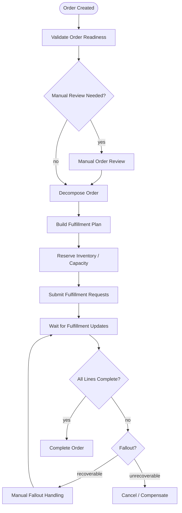
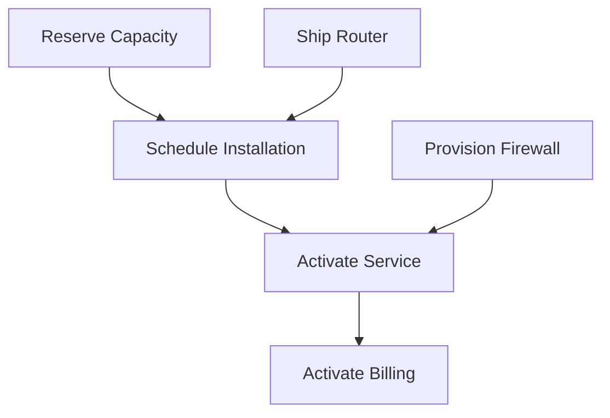
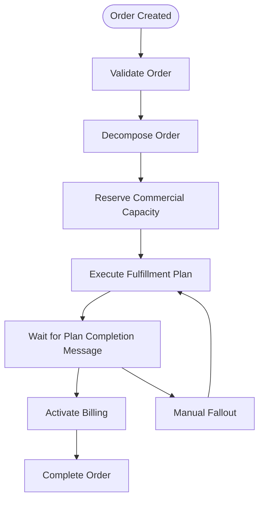
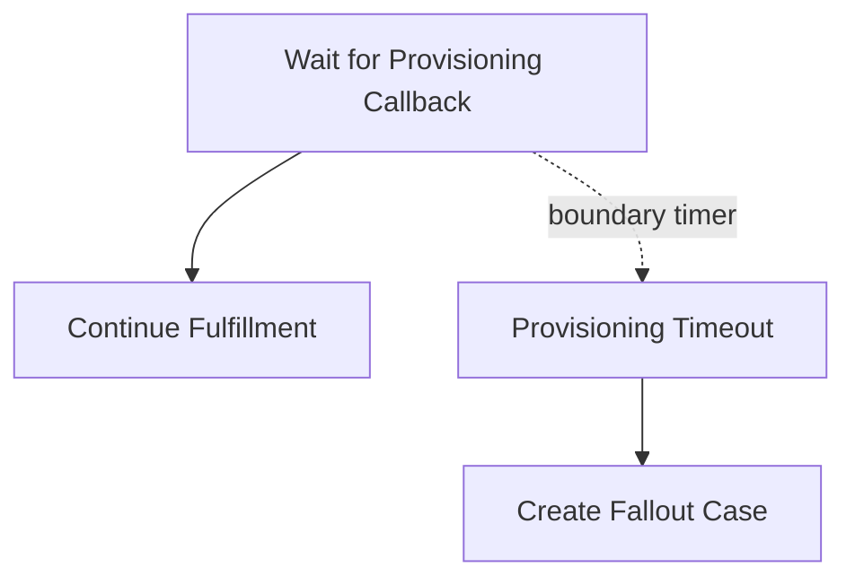
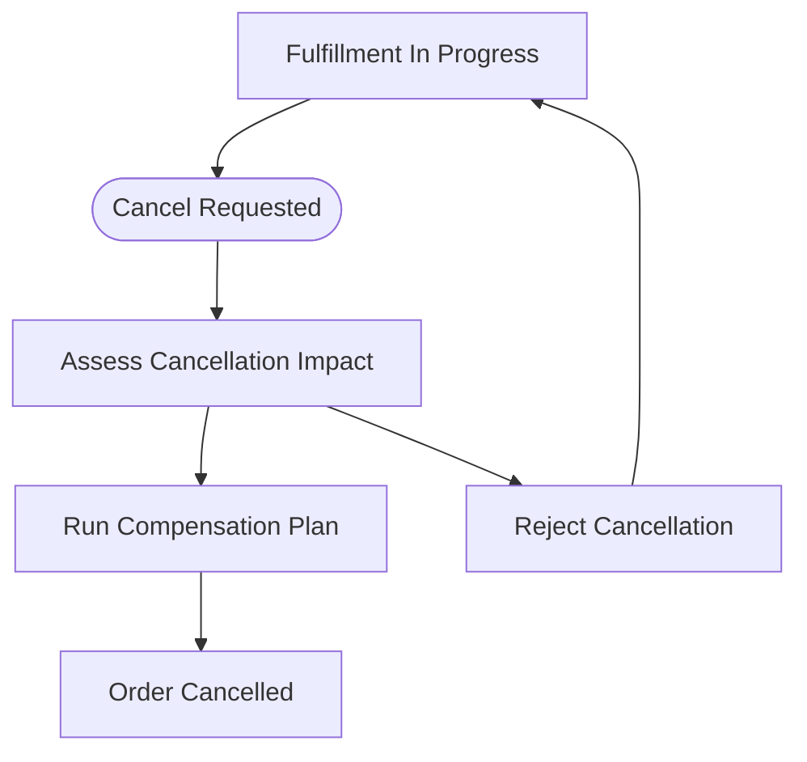
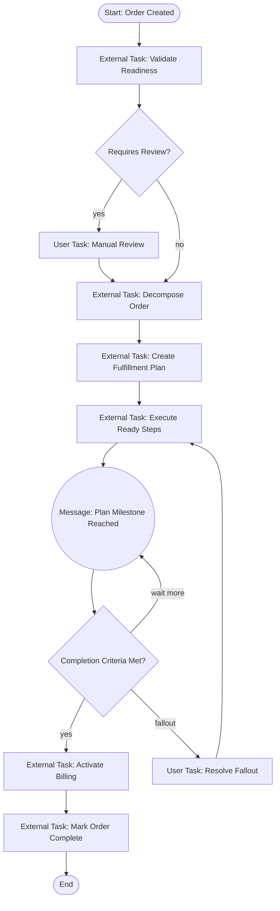
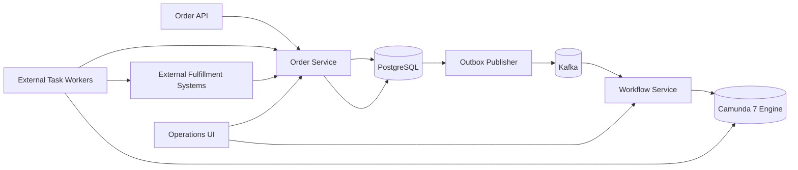

# Part 024 — Order Orchestration With Camunda 7

Quote approval selesai saat organisasi setuju pada commercial intent.

Order dimulai saat organisasi menerima fulfillment obligation.

Perbedaan ini penting.

Quote approval masih berada di wilayah:

```text
boleh menjual?
harga disetujui?
term diterima?
customer boleh menerima proposal ini?
```

Order orchestration berada di wilayah:

```text
apa yang harus dilakukan agar janji itu benar-benar terpenuhi?
apa yang harus dipesan?
ke sistem mana?
urutan mana?
bagaimana jika sebagian gagal?
bagaimana jika status external system tidak jelas?
bagaimana operator memulihkan order yang stuck?
```

Di CPQ/OMS enterprise, order process hampir selalu long-running.

Tidak boleh dimodelkan sebagai satu transaksi database panjang.

Kita butuh orchestration.

Camunda 7 cocok untuk mengorkestrasi long-running process dengan human task, service task, external task, timer, retry, incident, dan compensation path.

Tetapi Camunda tidak boleh menjadi domain model order.

Order service tetap pemilik state order.

Camunda adalah process executor.

---

## 1. Target Orchestration

Order orchestration yang kita bangun menangani:

```text
create order from accepted quote
validate order readiness
decompose order lines
build fulfillment plan
reserve inventory/capacity
submit fulfillment requests to external systems
wait for asynchronous responses
handle partial success
handle retryable failure
handle business fallout
handle manual intervention
complete order
publish lifecycle events
```

High-level BPMN:



Diagram ini bukan final BPMN XML.

Ini peta mental.

Tujuannya agar kita bisa membahas responsibility boundary dulu sebelum menggambar simbol.

---

## 2. Order Service vs Camunda Process

Ini invariant paling penting:

```text
Order service owns order state.
Camunda process owns orchestration progress.
```

Order state:

```text
CREATED
VALIDATED
DECOMPOSED
FULFILLMENT_IN_PROGRESS
PARTIALLY_FULFILLED
COMPLETED
CANCELLED
FAILED
FALLOUT
```

Process progress:

```text
currently validating
currently reserving inventory
waiting for external system response
waiting for manual fallout resolution
retrying failed task
```

Jangan mencampur keduanya.

Jika proses sedang berada di task `Submit CRM Order`, order domain belum tentu punya state `SUBMIT_CRM_ORDER`.

Itu operational step, bukan domain state.

Domain state harus stabil dan bermakna bisnis.

Process activity bisa berubah mengikuti implementasi.

---

## 3. Correlation Keys

Order orchestration butuh correlation yang konsisten.

Gunakan business key:

```text
ORDER:{tenantId}:{orderId}
```

Simpan mapping:

```sql
create table workflow_correlation (
    id uuid primary key,
    tenant_id text not null,
    subject_type text not null,
    subject_id text not null,
    process_key text not null,
    process_instance_id text not null,
    business_key text not null,
    started_at timestamptz not null,
    ended_at timestamptz,
    status text not null,
    unique (tenant_id, subject_type, subject_id, process_key)
);
```

Mengapa perlu tabel sendiri?

Karena order service perlu menjawab:

```text
workflow instance mana yang mengorkestrasi order ini?
apakah process masih berjalan?
apakah process stuck?
apa business key-nya?
```

Jangan bergantung penuh pada query Camunda history untuk semua screen operasional.

Camunda history penting.

Tetapi operational read model aplikasi tetap perlu.

---

## 4. Starting the Process

Order process sebaiknya dimulai setelah order transaction commit.

Kesalahan umum:

```text
create order in DB
start Camunda process in same method
publish event
```

Jika salah satu gagal, consistency menjadi rumit.

Gunakan outbox.

Flow:

```text
POST /orders/from-quote
  transaction begin
    validate accepted quote
    create order
    insert order lines
    insert workflow_start_requested outbox event
  transaction commit

outbox publisher
  publishes OrderCreated event
  or calls workflow starter reliably
```

Ada dua pilihan.

### Option A — Service Starts Camunda After Commit

Aplikasi order punya component yang membaca outbox dan memanggil Camunda RuntimeService/REST API.

```text
Outbox -> Workflow Starter -> Camunda RuntimeService.startProcessInstanceByKey
```

Kelebihan:

```text
explicit ownership
can retry start process
can store correlation after success
```

### Option B — Kafka Event Starts Workflow Consumer

OrderCreated event dikonsumsi oleh workflow service.

```text
Order Service -> Kafka OrderCreated -> Workflow Service -> Camunda
```

Kelebihan:

```text
service decoupling
workflow service isolated
```

Risiko:

```text
ordering/correlation harus kuat
consumer idempotency wajib
latency lebih tinggi
```

Untuk enterprise CPQ/OMS, saya cenderung memilih workflow service yang khusus memulai dan mengelola Camunda process, tetapi tetap dengan outbox dari order service.

---

## 5. Idempotent Process Start

Process start harus idempotent.

Jika outbox publisher retry, jangan membuat dua process instance untuk order yang sama.

Approach:

```text
workflow_correlation unique constraint on (tenant_id, subject_type, subject_id, process_key)
```

Pseudo-code:

```java
public void startOrderFulfillmentProcess(OrderCreatedEvent event) {
    Optional<WorkflowCorrelation> existing = correlationRepository.find(
        event.tenantId(), "ORDER", event.orderId(), "order-fulfillment"
    );

    if (existing.isPresent()) {
        return;
    }

    ProcessInstance instance = runtimeService.startProcessInstanceByKey(
        "order-fulfillment",
        "ORDER:" + event.tenantId() + ":" + event.orderId(),
        Map.of(
            "tenantId", event.tenantId(),
            "orderId", event.orderId(),
            "orderVersion", event.orderVersion()
        )
    );

    correlationRepository.insert(...);
}
```

Race condition tetap mungkin jika dua worker bersamaan.

Karena itu, unique constraint tetap wajib.

---

## 6. Process Variables: Minimal and Stable

Jangan masukkan seluruh order ke process variables.

Process variables minimal:

```text
tenantId
orderId
orderVersion
correlationId
workflowRunId
```

Jika process butuh detail order, worker memanggil order service.

Mengapa?

Karena order berubah.

Process variable snapshot bisa stale.

Jika menyimpan object order besar di Camunda variable, kita menciptakan second source of truth.

Gunakan Camunda variable sebagai pointer dan small decision output.

Bukan sebagai database bayangan.

---

## 7. Validate Order Readiness

Task pertama:

```text
Validate Order Readiness
```

Ini bukan validasi schema.

Validasi readiness menjawab:

```text
quote accepted?
quote revision locked?
price still valid or accepted under locked terms?
approval valid?
customer exists?
billing account ready?
contract data complete?
no duplicate order for quote revision?
required documents generated?
```

Worker memanggil order service command:

```http
POST /internal/orders/{orderId}/commands/validate-readiness
```

Response:

```json
{
  "orderId": "O-1001",
  "status": "VALIDATED",
  "manualReviewRequired": false,
  "reasons": []
}
```

Jika gagal business validation:

```text
BPMN error -> manual review/fallout path
```

Jika gagal technical error:

```text
external task failure -> retry/incident
```

Bedakan dua hal ini.

Business invalid tidak akan sembuh dengan retry.

Technical failure mungkin sembuh.

---

## 8. BPMN Error vs Technical Failure

Untuk external task worker:

```text
Business error => handleBpmnError
Technical error => handleFailure
Success => complete
```

Contoh:

```java
try {
    OrderReadinessResult result = orderClient.validateReadiness(orderId);

    if (result.manualReviewRequired()) {
        externalTaskService.handleBpmnError(
            task.getId(),
            task.getWorkerId(),
            "ORDER_REQUIRES_MANUAL_REVIEW",
            "Order requires manual review before fulfillment"
        );
        return;
    }

    externalTaskService.complete(task.getId(), task.getWorkerId(), Map.of(
        "readinessValidated", Variables.booleanValue(true)
    ));
} catch (HttpServerErrorException | TimeoutException e) {
    externalTaskService.handleFailure(
        task.getId(),
        task.getWorkerId(),
        "ORDER_SERVICE_UNAVAILABLE",
        stackTrace(e),
        nextRetries(task),
        retryTimeoutMillis()
    );
}
```

Camunda 7 external task API menyediakan operasi untuk failure handling dan lock/fetch pattern; client constants juga menunjukkan endpoint seperti `/external-task/fetchAndLock`, `/external-task/{id}/complete`, `/external-task/{id}/failure`, dan `/external-task/{id}/bpmnError`.

---

## 9. Decomposition

Order decomposition mengubah commercial order line menjadi fulfillment work items.

Contoh quote/order line:

```text
Managed Connectivity Bundle
  - Internet Access 1Gbps
  - Router Rental
  - Managed Firewall
  - Installation Service
```

Fulfillment work items:

```text
reserve access capacity
ship router
provision firewall policy
schedule installation
activate billing
```

Jangan menaruh decomposition logic di BPMN.

BPMN hanya memanggil decomposition service.

```text
BPMN task: Decompose Order
Order Service / Fulfillment Planning Service: creates fulfillment plan
```

Decomposition result disimpan di PostgreSQL.

```sql
create table fulfillment_plan (
    id uuid primary key,
    tenant_id text not null,
    order_id uuid not null,
    plan_version int not null,
    status text not null,
    created_at timestamptz not null,
    unique (tenant_id, order_id, plan_version)
);

create table fulfillment_step (
    id uuid primary key,
    tenant_id text not null,
    plan_id uuid not null references fulfillment_plan(id),
    step_key text not null,
    step_type text not null,
    target_system text not null,
    depends_on_step_keys text[] not null default '{}',
    status text not null,
    request_payload jsonb,
    response_payload jsonb,
    external_reference text,
    attempt_count int not null default 0,
    created_at timestamptz not null,
    updated_at timestamptz not null,
    unique (tenant_id, plan_id, step_key)
);
```

BPMN bisa mengorkestrasi plan.

Tetapi plan adalah data domain/operations.

---

## 10. Fulfillment Plan DAG

Fulfillment step biasanya bukan list linear.

Lebih mirip DAG.



BPMN bisa memodelkan beberapa parallel branch.

Tetapi untuk product catalog yang kompleks, menggambar semua kombinasi di BPMN akan meledak.

Pattern yang lebih scalable:

```text
BPMN orchestrates plan lifecycle.
Fulfillment planning service owns step graph.
Workers execute ready steps.
BPMN waits for plan completion/fallout event.
```

Jadi BPMN tidak perlu berubah setiap produk baru punya step fulfillment berbeda.

---

## 11. Two Orchestration Styles

### Style A — BPMN Explicit Step Orchestration

BPMN menggambar task satu per satu:

```text
Reserve Inventory -> Submit CRM -> Submit Provisioning -> Activate Billing
```

Cocok jika:

```text
process stable
jumlah step kecil
urutan bisnis perlu terlihat eksplisit
compliance butuh diagram jelas
```

Risiko:

```text
BPMN berubah setiap produk/integrasi berubah
model jadi besar
parallel path meledak
```

### Style B — BPMN Plan-Level Orchestration

BPMN menggambar lifecycle plan:

```text
Create Plan -> Execute Plan -> Wait Completion -> Handle Fallout
```

Detail step ada di fulfillment plan table.

Cocok jika:

```text
produk banyak
step dinamis
external system banyak
catalog-driven fulfillment
```

Risiko:

```text
Cockpit tidak menampilkan semua detail step secara native
perlu operational UI sendiri
```

Untuk CPQ/OMS enterprise, gunakan hybrid:

```text
BPMN explicit untuk milestone bisnis besar.
Fulfillment plan DAG untuk detail teknis/dinamis.
```

---

## 12. Hybrid BPMN

Hybrid diagram:



BPMN tetap memberi visibility milestone.

Fulfillment plan memberi flexibility.

---

## 13. External Task Worker Design

Gunakan external task untuk memisahkan Camunda engine dari service implementation.

Worker pattern:

```text
poll task
lock task
load process variables
call domain/internal API
handle result
complete / bpmnError / failure
```

Worker harus stateless.

Worker tidak boleh menyimpan progress utama di memory.

Progress utama disimpan di:

```text
order service database
fulfillment plan database
external system reference
audit/transition log
Camunda process state
```

Minimal worker class:

```java
public final class ValidateOrderReadinessWorker implements ExternalTaskHandler {

    private final OrderInternalClient orderClient;

    @Override
    public void execute(ExternalTask task, ExternalTaskService service) {
        String tenantId = task.getVariable("tenantId");
        String orderId = task.getVariable("orderId");

        try {
            OrderReadinessResult result = orderClient.validateReadiness(tenantId, orderId);

            if (result.requiresManualReview()) {
                service.handleBpmnError(
                    task.getId(),
                    "ORDER_REQUIRES_MANUAL_REVIEW",
                    result.primaryReason()
                );
                return;
            }

            service.complete(task.getId(), Map.of(
                "orderReadinessStatus", "VALIDATED"
            ));
        } catch (RetryableRemoteException e) {
            service.handleFailure(
                task.getId(),
                "Retryable order readiness failure",
                e.getMessage(),
                calculateRetries(task),
                calculateRetryTimeout()
            );
        }
    }
}
```

Dalam implementasi nyata, gunakan overload dengan `workerId` sesuai client API yang dipakai.

---

## 14. Worker Idempotency

External task worker bisa dieksekusi ulang.

Alasannya:

```text
worker timeout sebelum complete
network error setelah domain command sukses tapi sebelum Camunda complete
Camunda lock expired
worker crash
retry configured
```

Karena itu, command yang dipanggil worker harus idempotent.

Contoh command:

```http
POST /internal/orders/{orderId}/commands/validate-readiness
Idempotency-Key: ORDER_VALIDATE:{orderId}:{processInstanceId}:{activityId}
```

Jika command sudah pernah berhasil, service mengembalikan result yang sama.

Jangan mengandalkan “task hanya sekali”.

Dalam distributed system, itu asumsi lemah.

---

## 15. The Unknown Outcome Problem

Kasus paling menyebalkan:

```text
worker calls external provisioning system
external system returns success
worker fails before storing response
Camunda retries
worker calls external system again
```

Jika external call tidak idempotent, bisa terjadi duplicate order.

Solusi:

```text
use external idempotency/reference key
store outbound request before sending
store external correlation id
reconcile before retry
```

Pattern:

```text
1. Create fulfillment_step with status READY.
2. Mark step SUBMITTING with request id.
3. Call external system with request id.
4. Store external reference and mark SUBMITTED.
5. Complete Camunda task.
```

Jika crash setelah step 3, retry melihat step `SUBMITTING` dan melakukan reconciliation:

```text
query external system by request id
if found: store external reference
if not found: resend safely
```

---

## 16. Async Response Correlation

External systems sering async.

Flow:

```text
submit request
receive external reference
wait for callback/event
correlate message to process
update fulfillment step
continue process if milestone reached
```

Use message correlation:

```text
messageName: FulfillmentPlanCompleted
businessKey: ORDER:{tenantId}:{orderId}
variables:
  fulfillmentPlanId
  completionStatus
```

Tetapi jangan hanya mengandalkan Camunda message.

Callback handler harus terlebih dulu update domain/fulfillment DB.

Flow aman:

```text
external callback received
validate signature/auth
find fulfillment step by external reference
update step status transactionally
if plan milestone reached, insert outbox WorkflowMessageRequested
publisher correlates message to Camunda
```

Kenapa tidak langsung correlate message di callback transaction?

Karena jika callback update DB berhasil tapi Camunda correlate gagal, kita perlu retry.

Outbox membuat retry jelas.

---

## 17. Wait States

BPMN wait state adalah tempat process berhenti menunggu event.

Contoh:

```text
waiting for inventory reservation
waiting for provisioning completion
waiting for customer installation schedule
waiting for manual fallout resolution
```

Wait state bagus karena process tidak memakai thread selama menunggu.

Tetapi wait state harus punya:

```text
correlation key
timeout policy
fallback path
operational visibility
```

Jangan membuat receive task tanpa timer.

Jika event tidak pernah datang, order akan stuck selamanya.

---

## 18. Timer and SLA

Setiap wait penting perlu timer.

Contoh:

```text
Inventory reservation must complete in 10 minutes.
Provisioning must respond in 4 hours.
Installation scheduling must complete in 2 business days.
Manual fallout must be touched within 1 business day.
```

BPMN pattern:



Timer tidak selalu berarti cancel.

Timer bisa berarti:

```text
send reminder
raise priority
open fallout case
retry status query
escalate to operations
```

---

## 19. Incident vs Fallout

Camunda incident dan business fallout berbeda.

| Concept | Meaning | Owner |
|---|---|---|
| Incident | Engine/task technical failure | Platform/engineering/operations |
| Fallout | Business/order exception requiring handling | Business operations/order management |

Contoh incident:

```text
worker throws exception repeatedly
DMN deployment missing
database unavailable
external task retries exhausted
```

Contoh fallout:

```text
customer address invalid
inventory not available
customer failed credit check
contract document missing
external system rejected order as business invalid
```

Jangan memakai Camunda incident sebagai satu-satunya fallout queue.

Buat business fallout case/read model.

---

## 20. Manual Fallout Handling

Manual fallout adalah bagian normal dari OMS enterprise.

Modelkan dengan serius.

Fallout case data:

```sql
create table order_fallout_case (
    id uuid primary key,
    tenant_id text not null,
    order_id uuid not null,
    fulfillment_step_id uuid,
    severity text not null,
    reason_code text not null,
    status text not null,
    assigned_group text,
    assigned_user text,
    opened_at timestamptz not null,
    due_at timestamptz,
    resolved_at timestamptz,
    resolution_code text,
    resolution_note text
);
```

BPMN user task:

```text
Resolve Order Fallout
```

Completion actions:

```text
retry step
skip step with approval
replace fulfillment target
cancel order
request customer data
escalate
```

Jangan buat task completion hanya field `approved=true`.

Task completion harus semantic.

---

## 21. Semantic Manual Actions

Contoh endpoint:

```http
POST /orders/{orderId}/fallout-cases/{caseId}/actions/retry-step
POST /orders/{orderId}/fallout-cases/{caseId}/actions/skip-step
POST /orders/{orderId}/fallout-cases/{caseId}/actions/cancel-order
POST /orders/{orderId}/fallout-cases/{caseId}/actions/request-more-info
```

Setiap action punya invariant.

Contoh skip step:

```text
hanya role tertentu
harus ada reason
harus ada approval jika step mandatory
harus mencatat downstream impact
```

BPMN task completion memanggil domain command.

Domain command memutuskan apakah action valid.

---

## 22. Updating Order State

BPMN tidak boleh langsung menulis table order.

Worker memanggil order internal API.

Contoh:

```http
POST /internal/orders/{orderId}/commands/mark-fulfillment-started
POST /internal/orders/{orderId}/commands/mark-line-fulfilled
POST /internal/orders/{orderId}/commands/mark-order-completed
POST /internal/orders/{orderId}/commands/mark-fallout
```

Setiap command:

```text
validates current state
uses optimistic lock
writes transition log
writes audit
inserts outbox event
returns new version
```

This keeps process and domain consistent.

---

## 23. Order Completion

Order complete bukan berarti BPMN mencapai end event.

Order complete berarti domain invariant terpenuhi.

Contoh invariant:

```text
all mandatory order lines fulfilled or waived with authority
no blocking fallout case open
billing activation completed or explicitly deferred
customer-facing completion communication sent or scheduled
completion audit recorded
```

BPMN final task should call:

```http
POST /internal/orders/{orderId}/commands/complete-order
```

Domain may reject:

```text
ORDER_HAS_OPEN_BLOCKING_FALLOUT
MANDATORY_LINE_NOT_FULFILLED
BILLING_NOT_ACTIVATED
```

If rejected, BPMN routes to fallout.

---

## 24. Partial Fulfillment

Enterprise orders often partially fulfill.

Example:

```text
Internet access active.
Router shipped.
Managed firewall delayed.
Billing partially active.
```

Do not collapse this into one status too early.

Model line-level state:

```text
NOT_STARTED
IN_PROGRESS
FULFILLED
FAILED
WAIVED
CANCELLED
```

Order aggregate status can be derived/coarse:

```text
FULFILLMENT_IN_PROGRESS
PARTIALLY_FULFILLED
COMPLETED
FALLOUT
```

BPMN can wait until mandatory completion criteria are met.

---

## 25. Cancellation During Fulfillment

Customer may cancel after fulfillment starts.

Cancellation is not simply:

```text
set status = CANCELLED
```

Need answer:

```text
which steps are completed?
which steps can be reversed?
which steps are irreversible?
which charges apply?
which external systems need cancel request?
which customer communication is required?
```

Part 025 will go deep into compensation/saga.

For now, design order process with cancellation boundary:



Do not add cancellation as afterthought.

---

## 26. Retry Strategy

Retry is not a moral good.

Retry is useful only for transient failures.

Classify errors:

```text
retryable technical error
non-retryable technical error
business rejection
unknown outcome
policy/manual review required
```

Example retry policy:

| Failure | Retry? | Delay | After Exhausted |
|---|---:|---|---|
| HTTP 503 external system | yes | exponential/backoff | incident + fallout if business impact |
| timeout before response | yes with reconciliation | short then longer | unknown outcome investigation |
| invalid customer address | no | none | business fallout |
| missing mapping config | no until config fixed | none | incident |
| duplicate external request | no blind retry | reconcile | manual review |

Camunda retries are not enough alone.

Domain/service layer needs idempotency and reconciliation.

---

## 27. Async Boundaries

Set async boundaries around operations that:

```text
call external systems
may take long time
need independent retry
should not rollback previous process progress
can create incidents independently
```

But too many async boundaries create noise.

Use them deliberately.

For order orchestration:

```text
before/after external task milestones
before waiting for callback
before manual fallout task
before compensation segment
```

Keep transaction boundary understandable.

---

## 28. Event Model

Order orchestration emits events.

Not every BPMN activity emits a domain event.

Events should represent business facts:

```text
OrderCreated
OrderValidated
OrderDecomposed
FulfillmentPlanCreated
FulfillmentStarted
OrderLineFulfilled
OrderFalloutOpened
OrderFalloutResolved
OrderCompleted
OrderCancelled
```

Avoid event spam:

```text
ValidateOrderTaskStarted
ValidateOrderTaskEnded
BpmnGatewayTaken
```

Those are process telemetry, not domain events.

Process telemetry belongs in observability/history.

Domain events belong in Kafka.

---

## 29. Outbox for Workflow Events

When order service changes state:

```text
update order
insert transition log
insert outbox event
commit
```

Outbox event examples:

```json
{
  "eventType": "OrderFalloutOpened",
  "tenantId": "enterprise-id",
  "orderId": "O-1001",
  "orderVersion": 12,
  "falloutCaseId": "F-77",
  "reasonCode": "INVENTORY_RESERVATION_FAILED"
}
```

Workflow can react to this via message correlation if needed.

Do not let Camunda process be the only publisher of business lifecycle events.

The domain service should publish business facts.

---

## 30. Operational Read Model

Operators need a screen that answers:

```text
where is my order stuck?
what system are we waiting for?
which fulfillment step failed?
who owns the fallout?
what retry happened?
what was the last external reference?
what is the process instance id?
```

Build read model:

```text
order_summary
order_line_summary
fulfillment_step_summary
fallout_case_summary
workflow_correlation_summary
```

Do not force operators to understand raw BPMN tokens.

Cockpit is useful for process engineers.

Business operations need business-centric view.

---

## 31. Observability

Every log from worker should include:

```text
tenantId
orderId
orderVersion
processInstanceId
businessKey
activityId
externalTaskId
workerId
fulfillmentStepId
correlationId
externalReference
```

Metrics:

```text
order_fulfillment_duration
order_fulfillment_step_duration
external_task_failure_count
external_task_retry_count
fallout_case_open_count
fallout_case_age
process_instance_stuck_count
message_correlation_failure_count
```

Traces should connect:

```text
Camunda worker -> order service -> external system -> callback -> workflow message correlation
```

---

## 32. BPMN Modeling Detail

A practical order process might use:

```text
start event
service/external tasks
gateways
parallel gateway
receive/message catch event
boundary timer
boundary error
user task
end events
```

But do not model every exception as gateway.

Use layers:

```text
expected business paths in BPMN
technical retries in task configuration/worker
business fallout in user task/subprocess
unexpected platform issues as incidents
```

If every HTTP status code becomes a BPMN branch, model becomes unreadable.

---

## 33. Example BPMN Skeleton



This skeleton keeps domain logic outside BPMN but makes milestones visible.

---

## 34. Worker Topic Design

External task topics:

```text
order.validate-readiness
order.decompose
order.create-fulfillment-plan
fulfillment.execute-ready-steps
billing.activate
order.complete
notification.send-order-update
```

Topic naming should reflect capability, not class name.

Bad:

```text
ValidateOrderDelegate
DoStuffTask
TaskA
```

Good:

```text
order.validate-readiness
fulfillment.reserve-capacity
billing.activate-order
```

---

## 35. Worker Deployment

Workers can be deployed with service or separately.

### Co-located Worker

Worker lives inside order service deployment.

Pros:

```text
low latency
direct access to domain code
simple deployment for small team
```

Cons:

```text
scales with service, not task demand
couples workflow execution to service release
risk of transaction shortcut misuse
```

### Separate Worker Service

Worker is separate app that calls internal APIs.

Pros:

```text
clear boundary
independent scaling
less chance of bypassing service API
```

Cons:

```text
more network calls
more deployment units
requires internal API maturity
```

For enterprise CPQ/OMS, separate workflow-worker service is often cleaner.

But for early build-from-scratch, co-located can be acceptable if boundaries are enforced in code.

---

## 36. Tenant Boundary

Order workflow must include tenant.

Every worker call includes:

```text
tenantId
subjectId
correlationId
```

Never infer tenant only from order id.

Multi-tenant safety:

```text
business key contains tenant
process variable contains tenant
domain API checks tenant
workflow_correlation unique by tenant
Kafka event includes tenant
Redis keys include tenant namespace
operator UI filters by tenant authorization
```

---

## 37. Security Boundary

Worker identity is powerful.

If compromised, it can move orders.

Protect internal APIs:

```text
mTLS or strong service auth
scoped service token
authorize worker per command
validate tenant access
log every command as system actor with worker id
rate limit dangerous actions
```

Do not let worker call public user APIs.

Make internal command APIs explicit.

---

## 38. Testing Strategy

Order orchestration testing has layers.

### Domain Tests

```text
order cannot complete with open blocking fallout
order cannot decompose twice unless idempotent
manual fallout action requires authority
line completion updates aggregate correctly
```

### Worker Tests

```text
success -> complete external task
business error -> BPMN error
technical error -> failure with retries
unknown outcome -> reconciliation path
```

### BPMN Tests

```text
order created reaches validate task
manual review path routes to user task
fallout path loops back correctly
completion path reaches end event
boundary timer opens fallout
```

### Integration Tests

```text
order service + Camunda + PostgreSQL + worker
Kafka outbox publishing
message correlation
idempotent process start
```

### Failure Tests

```text
worker crashes after domain command success
Camunda complete call times out
external callback arrives before process wait state
duplicate callback arrives
outbox publisher retries
```

These are not optional for top-tier OMS.

---

## 39. Callback Before Wait State

A subtle race:

```text
process submits external request
external system responds very fast
callback tries to correlate message
process has not reached wait state yet
correlation fails
```

Solutions:

```text
update domain DB first
store callback event
process later checks current state
use outbox retry for message correlation
make correlation retryable
```

Do not assume event ordering across systems.

---

## 40. Reconciliation

Every external integration needs reconciliation.

Periodic job:

```text
find fulfillment steps in SUBMITTED/UNKNOWN for too long
query external system by externalReference/requestId
update state if found
open fallout if inconsistent
insert audit
possibly correlate workflow message
```

Reconciliation is what separates demo OMS from production OMS.

Demo systems assume callbacks always arrive.

Production systems assume callbacks can be late, duplicated, missing, malformed, or contradictory.

---

## 41. History and Cleanup

Camunda history can grow fast.

Order workflows are long-running and variable-heavy if misused.

Guidelines:

```text
keep variables small
store business details in domain tables
set history level deliberately
configure cleanup policy
archive domain audit separately
avoid storing large payloads in variables
```

The audit required for regulatory/commercial defensibility should not depend only on Camunda history retention.

Store business audit in your own tables.

---

## 42. Process Version Migration

Orders can run for days or months.

New BPMN version may be deployed while old orders still run.

Questions:

```text
Do existing orders continue on old process definition?
Do we migrate active instances?
Which changes are safe?
How do we test migration?
What if active token is at removed activity?
```

Default stance:

```text
existing instances stay on old definition unless there is strong reason to migrate
new orders use new definition
migration is explicit and tested
```

Avoid deploying breaking BPMN changes casually.

---

## 43. Architecture Summary

Final architecture for order orchestration:



Key principle:

```text
Camunda coordinates work.
Order service records truth.
Workers execute commands.
Outbox carries committed facts.
Operations UI manages exceptions.
```

---

## 44. Failure Mode Table

| Failure | Where It Appears | Correct Response |
|---|---|---|
| Worker crashes after command success | Camunda task retries | Domain command idempotency returns same result. |
| External system timeout | Worker | Store unknown outcome, reconcile, retry safely. |
| Callback missing | Wait state | Timer triggers status query/fallout. |
| Duplicate callback | Order service | Idempotent callback handling. |
| Invalid customer data | Domain validation | BPMN error to manual review/fallout. |
| Process not started after order created | Workflow outbox | Retry start; correlation unique constraint. |
| Message correlation fails | Workflow publisher | Retry; process can also poll/check state. |
| Camunda incident | Engine/worker | Platform incident plus business impact assessment. |
| BPMN version changed | Runtime | Existing instance continues or explicit migration. |
| Operator resolves fallout incorrectly | Manual action | Domain invariant rejects invalid action; audit records attempt. |

---

## 45. Production Checklist

Before order orchestration is production-ready:

```text
[ ] Order service owns domain state.
[ ] Camunda variables are minimal pointers.
[ ] Process start is idempotent.
[ ] Workflow correlation table exists.
[ ] External task workers are idempotent.
[ ] Business errors and technical failures are separated.
[ ] External requests use idempotency/reference keys.
[ ] Unknown outcome reconciliation exists.
[ ] Wait states have timers.
[ ] Fallout cases are modeled as business objects.
[ ] Manual task completion uses semantic domain commands.
[ ] Domain events are emitted from domain state changes, not arbitrary BPMN activity changes.
[ ] Operational read model exists.
[ ] Observability includes process/order/external correlation ids.
[ ] Process version migration policy exists.
[ ] Camunda history is not the only audit store.
```

---

## 46. Final Mental Model

Order orchestration is not “draw the order flow in BPMN”.

It is a consistency architecture for long-running fulfillment.

The hard parts are not the happy path.

The hard parts are:

```text
idempotency
unknown outcome
partial fulfillment
manual fallout
message correlation
long-running versioning
operator recovery
audit and explanation
```

If one sentence must be remembered:

```text
Use Camunda 7 to coordinate the order journey, but make every irreversible business fact pass through the order domain model.
```

Part berikutnya akan go deeper into compensation and saga design.

That is where we handle the uncomfortable truth:

```text
not every fulfilled step can be undone, and not every failed step should rollback the whole order.
```

---

## Referensi Singkat

- Camunda 7 external task API/Javadocs menunjukkan operasi untuk locking dan failure handling, termasuk `handleFailure` dan `lock`.
- Camunda external task client constants menunjukkan endpoint umum seperti `/external-task/fetchAndLock`, `/external-task/{id}/complete`, `/external-task/{id}/failure`, dan `/external-task/{id}/bpmnError`.
- Camunda documentation/blog material membahas transaction subprocess, cancel event, dan compensation task sebagai bagian dari pemodelan proses yang perlu menangani pembatalan/kompensasi pada long-running process.
