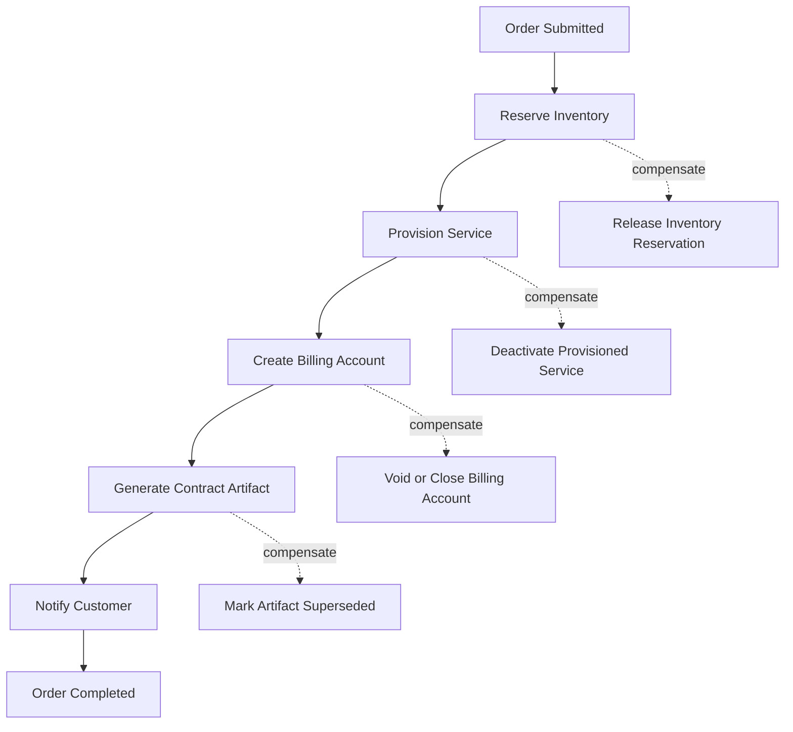
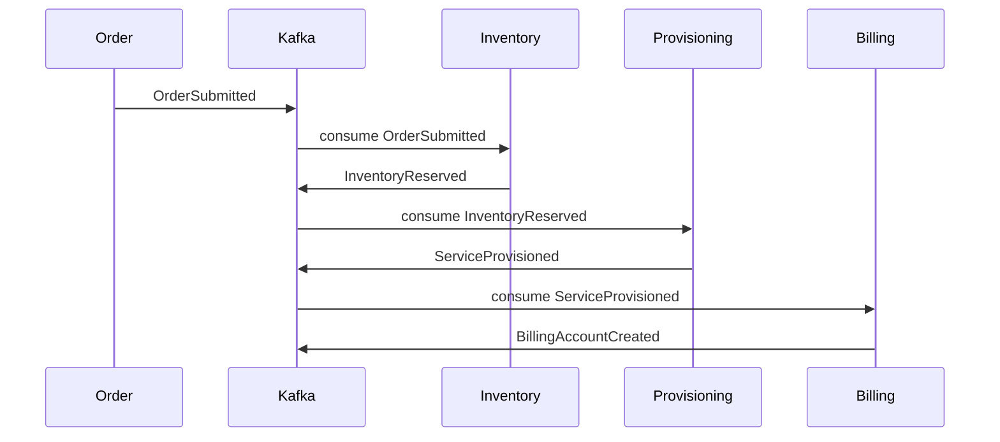
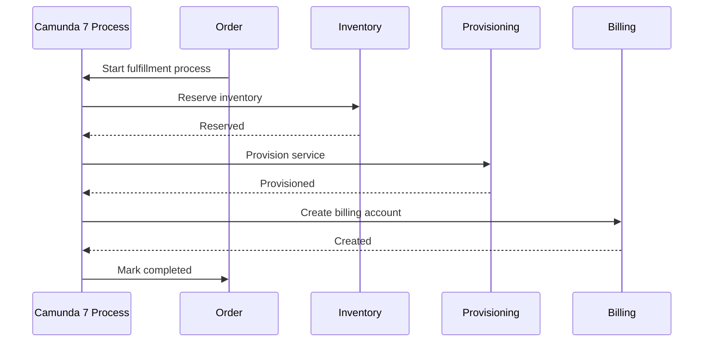
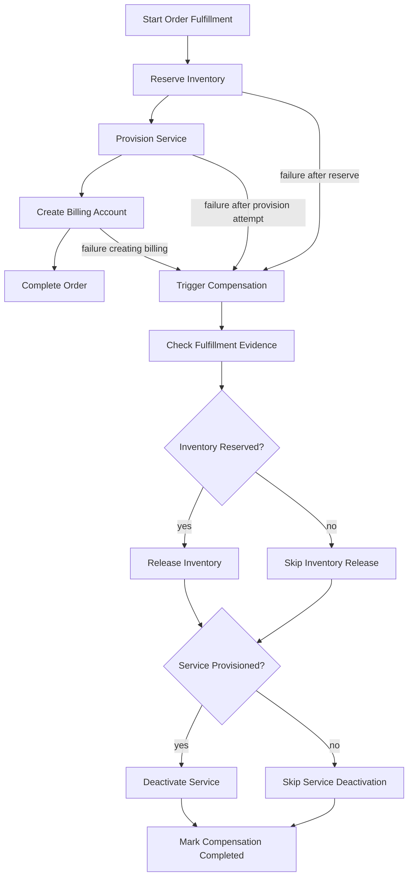
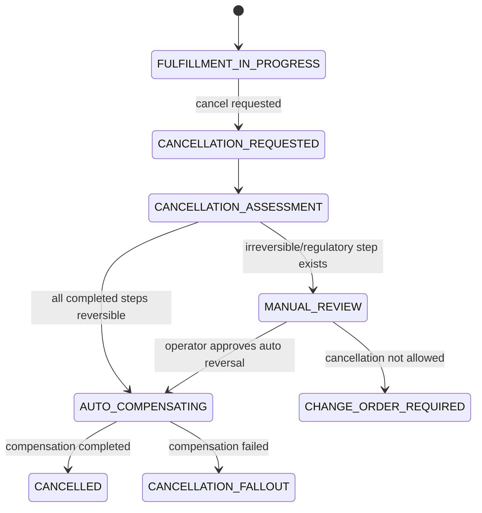
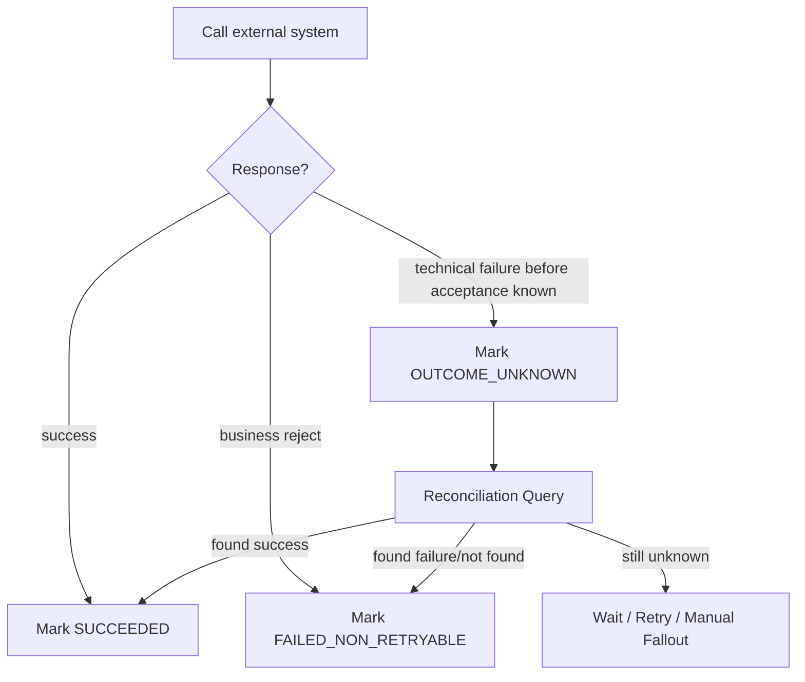
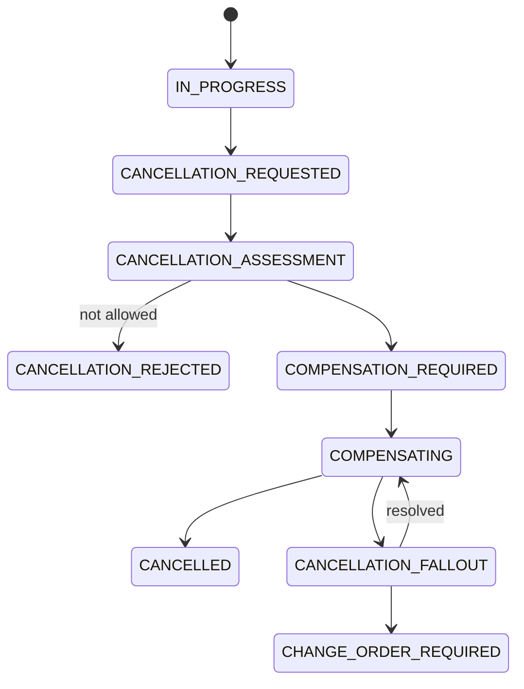
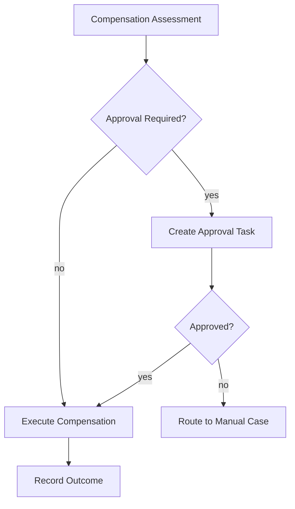
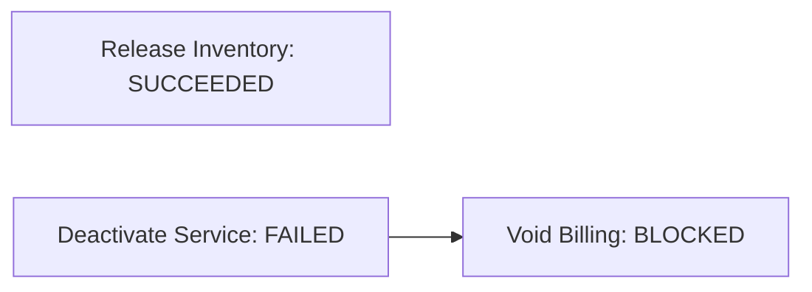
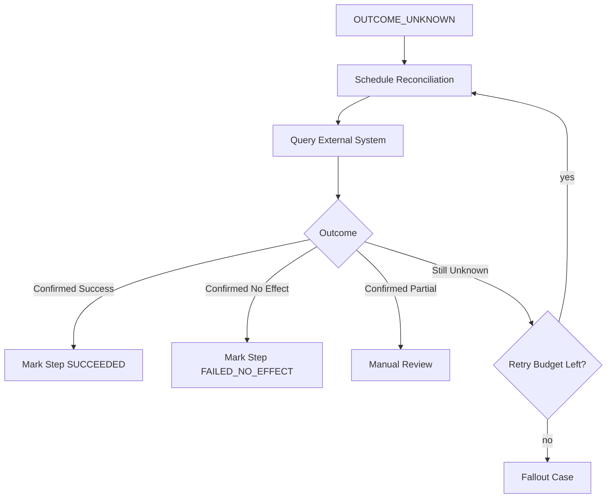

# Part 025 — Compensation and Saga Design

Sistem CPQ/OMS enterprise tidak gagal karena tidak punya endpoint `cancelOrder`.

Sistem gagal karena tidak bisa menjawab pertanyaan yang lebih sulit:

> “Jika order sudah melewati 6 sistem eksternal, 3 langkah berhasil, 1 langkah timeout, 1 langkah statusnya tidak diketahui, dan customer membatalkan order, apa yang benar-benar harus terjadi?”

Itulah wilayah compensation dan saga.

Di sistem kecil, rollback berarti membatalkan transaksi database. Di CPQ/OMS enterprise, rollback hampir tidak pernah sesederhana itu. Begitu order sudah dikirim ke inventory, provisioning, billing, shipping, CRM, partner, atau sistem fulfillment lain, efeknya sudah keluar dari transaksi lokal. Yang bisa dilakukan bukan rollback database, melainkan **forward recovery**: menjalankan aksi bisnis baru yang secara eksplisit membalik, menetralkan, atau menutup efek bisnis sebelumnya.

Compensation bukan fitur BPMN semata. Compensation adalah model kebenaran.

Tujuan part ini:

1. membedakan rollback, cancellation, reversal, compensation, retry, dan fallout;
2. membangun saga design untuk order fulfillment;
3. menentukan kapan compensation harus dimodelkan di BPMN Camunda 7 dan kapan cukup di service domain;
4. merancang data model untuk compensation yang audit-friendly;
5. menjaga idempotency dan unknown outcome;
6. membuat recovery playbook yang bisa dipakai saat production incident.

---

## 1. Mental Model: Transaction Ends, Obligation Continues

Dalam CPQ/OMS, transaksi database biasanya pendek.

Contoh:

```text
POST /orders/{orderId}/submit
  -> validate order
  -> save order status = SUBMITTED
  -> insert outbox event OrderSubmitted
  -> commit
```

Setelah commit, order fulfillment dimulai.

```text
OrderSubmitted
  -> reserve inventory
  -> activate service
  -> create billing account
  -> generate contract artifact
  -> notify customer
```

Setiap langkah bisa punya efek di sistem lain. Efek itu tidak otomatis hilang saat process gagal.

Maka jangan berpikir:

> “Kalau process gagal, rollback saja.”

Berpikirlah:

> “Setiap langkah yang menciptakan efek eksternal harus punya model akibat, status, dan jika perlu aksi pembalik.”

Ini inti saga.

---

## 2. Vocabulary yang Harus Dipisahkan

Banyak sistem buruk karena memakai satu kata: “rollback”. Di enterprise OMS, kata itu terlalu kasar.

| Istilah | Makna | Contoh |
|---|---|---|
| Database rollback | Membatalkan perubahan sebelum commit transaksi lokal | Insert order gagal validasi, transaction rollback |
| Retry | Mengulang aksi yang sama karena kegagalan teknis sementara | Timeout call inventory, retry dengan backoff |
| Cancellation | Customer/bisnis membatalkan intention yang belum selesai | Cancel order sebelum provisioning |
| Reversal | Membuat aksi bisnis lawan untuk efek yang sudah berhasil | Release reservation, void invoice |
| Compensation | Proses terkontrol untuk menetralkan efek dari langkah yang sudah committed | Jika billing account sudah dibuat, close/suspend account |
| Fallout | Work item manual karena sistem tidak bisa menentukan atau menyelesaikan outcome otomatis | Partner API timeout dan tidak ada reconciliation endpoint |
| Reconciliation | Membandingkan state internal dengan state eksternal untuk menentukan outcome sebenarnya | Query fulfillment system untuk status order |
| Abandonment | Menghentikan proses internal tanpa membalik efek eksternal | Dangerous; hanya valid jika efek eksternal memang tidak ada |

Rule pertama:

> Jangan gunakan satu status `ROLLBACK_FAILED`. Gunakan bahasa domain yang menjelaskan efek bisnis yang sedang diperbaiki.

---

## 3. Saga dalam CPQ/OMS

Saga adalah sequence transaksi lokal yang berkoordinasi untuk mencapai outcome bisnis besar. Setiap langkah melakukan commit lokal. Jika langkah setelahnya gagal, sistem menjalankan compensation untuk langkah yang sudah berhasil.

Dalam order fulfillment:



Namun ini hanya gambar sederhana. Realitas enterprise lebih rumit:

1. tidak semua langkah bisa dibalik sempurna;
2. compensation bisa gagal;
3. compensation bisa butuh approval manual;
4. external API bisa timeout setelah sebenarnya berhasil;
5. beberapa efek tidak boleh dibatalkan karena alasan hukum/komersial;
6. order amendment bisa lebih tepat daripada cancellation;
7. customer communication harus dikontrol agar tidak mengirim informasi salah.

Jadi saga bukan sekadar “list of steps”. Saga adalah **stateful evidence system**.

---

## 4. Dua Model Saga: Orchestration vs Choreography

Ada dua pola umum.

### 4.1 Choreography

Setiap service bereaksi terhadap event dari service lain.



Kelebihan:

- loose coupling;
- service autonomous;
- cocok untuk propagation event sederhana.

Kekurangan:

- sulit melihat end-to-end state;
- compensation tersebar;
- exception handling menjadi sulit;
- tidak ideal untuk long-running order yang butuh visibility operasional.

### 4.2 Orchestration

Satu process mengatur langkah-langkah besar.



Kelebihan:

- visibility jelas;
- incident handling lebih operasional;
- cocok untuk SLA, wait state, human task, compensation;
- mudah menghubungkan process instance dengan business key.

Kekurangan:

- risiko workflow god object;
- process model bisa terlalu teknis;
- domain invariant bisa bocor ke BPMN;
- perlu disiplin variable contract.

Untuk CPQ/OMS enterprise dengan Camunda 7, default yang masuk akal:

> Gunakan **orchestration untuk lifecycle order utama**, dan gunakan Kafka untuk state propagation, read model, integration event, dan downstream reaction.

Jangan jadikan Kafka sebagai hidden workflow engine jika bisnis butuh audit, SLA, manual recovery, dan operational visibility.

---

## 5. Prinsip Utama Compensation

### Prinsip 1 — Compensation hanya untuk efek yang sudah berhasil

Jangan compensate langkah yang belum terbukti berhasil.

Salah:

```text
call inventory reserve timeout
-> assume reserved
-> call release reservation
```

Masalahnya: timeout bukan bukti sukses. Bisa gagal sebelum diterima. Bisa berhasil tapi response hilang. Bisa sedang diproses.

Benar:

```text
call inventory reserve timeout
-> mark outcome UNKNOWN
-> run reconciliation
-> if RESERVED, release reservation
-> if NOT_FOUND, no compensation needed
-> if STILL_PROCESSING, wait or fallout
```

### Prinsip 2 — Compensation adalah command baru

Compensation bukan undo internal.

```text
ReserveInventoryCommand
ReleaseInventoryReservationCommand
```

Keduanya command bisnis yang berbeda. Keduanya harus punya:

- idempotency key;
- audit trail;
- outcome status;
- error model;
- retry policy;
- authorization boundary;
- external correlation id.

### Prinsip 3 — Compensation harus idempotent

Saat incident, operator sering mengulang aksi. Worker juga bisa retry. Network bisa membuat duplicate.

Maka compensation command harus aman dipanggil berkali-kali.

Contoh release reservation:

```text
releaseReservation(orderId, reservationId, compensationId)

If reservation already released:
  return RELEASED
If reservation not found and never existed:
  return NO_EFFECT
If reservation consumed by fulfillment:
  return CANNOT_RELEASE_REQUIRES_MANUAL_REVIEW
```

### Prinsip 4 — Compensation tidak selalu mengembalikan dunia ke kondisi semula

Jika kontrak sudah dikirim ke customer, kita tidak bisa “menghapus fakta” bahwa dokumen pernah dikirim. Yang bisa dilakukan:

- mark document as superseded;
- issue correction notice;
- create revised document;
- store explanation;
- prevent old document from being used for acceptance.

Compensation adalah “membuat keadaan berikutnya benar”, bukan menghapus masa lalu.

### Prinsip 5 — Compensation failure adalah first-class state

Jika compensation gagal, jangan sembunyikan di log.

Harus ada state:

```text
COMPENSATION_PENDING
COMPENSATION_IN_PROGRESS
COMPENSATION_PARTIALLY_COMPLETED
COMPENSATION_FAILED
COMPENSATION_REQUIRES_MANUAL_REVIEW
COMPENSATION_COMPLETED
```

Sistem enterprise tidak boleh kehilangan jejak kegagalan reversal.

---

## 6. Compensation Classification

Tidak semua langkah order punya jenis compensation yang sama.

| Step | Efek | Compensation | Reversibility |
|---|---|---|---|
| Reserve inventory | Hold stock/capacity | Release reservation | Usually reversible |
| Allocate serial number | Assign resource | Unassign/release | Reversible if not activated |
| Provision service | Create/activate service | Deactivate/suspend | Sometimes reversible |
| Ship physical goods | Handoff ke carrier | Return/RMA/cancel shipment | Partially reversible |
| Create invoice | Financial document | Void/credit note | Regulated, not simple delete |
| Send email | Customer communication | Correction notice | Not reversible |
| Generate quote PDF | Artifact created | Supersede artifact | Not deleted, only superseded |
| Start contract | Legal/commercial obligation | Terminate/amend | Requires policy/legal handling |

Design consequence:

> Setiap fulfillment step harus menyatakan reversibility class.

Contoh enum:

```java
public enum ReversibilityClass {
    FULLY_REVERSIBLE,
    CONDITIONALLY_REVERSIBLE,
    NOT_REVERSIBLE_BUT_SUPERSEDABLE,
    NOT_REVERSIBLE_REQUIRES_MANUAL_CASE,
    REVERSAL_REGULATED
}
```

Ini bukan dekorasi. Ini dipakai untuk menentukan apakah cancel order bisa otomatis atau harus human review.

---

## 7. Compensation Capability Matrix

Untuk setiap integration action, buat matrix seperti ini:

| Capability | Reserve Inventory | Provision Service | Create Billing Account | Send Contract Email |
|---|---:|---:|---:|---:|
| Has external correlation id | Yes | Yes | Yes | Yes |
| Has query/reconciliation API | Yes | Sometimes | Yes | No |
| Has reversal API | Yes | Yes | Sometimes | No |
| Reversal idempotent | Must be | Must be | Must be | N/A |
| Reversal can fail | Yes | Yes | Yes | N/A |
| Requires approval | Sometimes | Sometimes | Often | No |
| Creates customer-visible effect | No | Maybe | Maybe | Yes |
| Can be retried safely | Yes, with idempotency | Yes, with idempotency | Depends | No |
| Needs manual case | On unknown outcome | On partial activation | On financial conflict | On correction scenario |

Tanpa matrix ini, BPMN akan menipu. Diagram terlihat rapi, tetapi production recovery tidak jelas.

---

## 8. Saga State Model

Jangan hanya pakai process instance Camunda sebagai state. Order service tetap harus punya state evidence sendiri.

Minimal model:

```text
order_fulfillment_step
- id
- order_id
- step_type
- step_sequence
- status
- attempt_count
- external_system
- external_correlation_id
- external_reference
- reversibility_class
- compensation_status
- compensation_step_id
- last_error_code
- last_error_message
- outcome_confirmed_at
- created_at
- updated_at
```

Status step:

```text
PLANNED
STARTED
SUCCEEDED
FAILED_RETRYABLE
FAILED_NON_RETRYABLE
OUTCOME_UNKNOWN
REQUIRES_MANUAL_REVIEW
SKIPPED
COMPENSATED
COMPENSATION_FAILED
```

Compensation status:

```text
NOT_REQUIRED
ELIGIBLE
PENDING
IN_PROGRESS
SUCCEEDED
FAILED_RETRYABLE
FAILED_NON_RETRYABLE
BLOCKED_BY_UNKNOWN_OUTCOME
BLOCKED_BY_POLICY
REQUIRES_MANUAL_REVIEW
```

Reasoning:

- Camunda process is execution state.
- Order fulfillment table is business evidence.
- Audit log is immutable history.
- Outbox is publication mechanism.

Jika semua state hanya ada di Camunda variables, domain service dan reporting akan rapuh.

---

## 9. BPMN Compensation vs Domain Compensation

Camunda/BPMN punya konsep compensation event dan compensation handler. Compensation event membantu memodelkan aksi pembalik untuk aktivitas yang sudah berhasil. Namun, dalam CPQ/OMS, jangan otomatis menaruh semua logic compensation di BPMN.

Gunakan pembagian ini:

| Concern | Lokasi yang tepat |
|---|---|
| Menentukan order harus masuk cancellation flow | Order service/domain policy |
| Menentukan step mana yang sudah berhasil | Order fulfillment evidence table |
| Menentukan urutan compensation | BPMN orchestration atau domain compensation plan |
| Menjalankan call reversal eksternal | Worker/service adapter |
| Menyimpan outcome compensation | Order service database |
| Menampilkan status ke operator | Operational read model |
| Mencatat audit | Audit service/event |

BPMN cocok untuk menggambarkan **control flow compensation**.
Domain service cocok untuk menjaga **business truth**.

---

## 10. Compensation BPMN Pattern

### 10.1 Straight-line saga dengan compensation subprocess



Key idea:

> Compensation flow should query business evidence, not guess from BPMN path alone.

### 10.2 Cancellation request during active fulfillment



Cancellation bukan event sederhana. Ia adalah request yang butuh assessment.

---

## 11. Compensation Planning Algorithm

Saat order perlu dibatalkan atau fulfillment gagal setelah efek parsial, sistem perlu membuat compensation plan.

Pseudo-algorithm:

```text
buildCompensationPlan(orderId, reason):
  steps = loadFulfillmentSteps(orderId)
  successful = steps where status in [SUCCEEDED, OUTCOME_CONFIRMED]
  unknown = steps where status == OUTCOME_UNKNOWN

  if unknown not empty:
      return BLOCKED_BY_UNKNOWN_OUTCOME with reconciliation tasks

  compensationItems = []

  for step in reverse(successful by step_sequence):
      policy = loadCompensationPolicy(step.step_type, step.external_system)

      if policy.reversibility == NOT_REVERSIBLE_REQUIRES_MANUAL_CASE:
          compensationItems.add(manualCase(step))
      else if policy.requiresApproval(reason, step):
          compensationItems.add(approvalBeforeCompensation(step))
      else:
          compensationItems.add(autoCompensationCommand(step))

  return CompensationPlan(orderId, reason, compensationItems)
```

Reverse order biasanya benar karena efek paling akhir sering bergantung pada efek sebelumnya.

Contoh:

```text
1. Reserve inventory
2. Provision service
3. Create billing account

Compensate:
1. Void billing account
2. Deactivate service
3. Release inventory
```

Namun jangan menjadikan reverse order sebagai dogma. Ada kasus di mana release inventory boleh dilakukan sebelum billing void jika sistem billing tidak bergantung pada reservation.

Maka `compensation_policy` harus explicit.

---

## 12. Data Model: Compensation Plan

Tambahkan tabel khusus agar compensation bukan hanya proses transient.

```sql
create table compensation_plan (
    id uuid primary key,
    order_id uuid not null,
    reason_code varchar(80) not null,
    status varchar(40) not null,
    requested_by varchar(120),
    requested_at timestamptz not null,
    approved_by varchar(120),
    approved_at timestamptz,
    process_instance_id varchar(80),
    created_at timestamptz not null,
    updated_at timestamptz not null
);

create table compensation_item (
    id uuid primary key,
    compensation_plan_id uuid not null references compensation_plan(id),
    fulfillment_step_id uuid not null,
    sequence_no integer not null,
    action_type varchar(80) not null,
    status varchar(40) not null,
    external_system varchar(80),
    external_correlation_id varchar(120),
    idempotency_key varchar(160) not null,
    attempt_count integer not null default 0,
    last_error_code varchar(120),
    last_error_message text,
    started_at timestamptz,
    completed_at timestamptz,
    created_at timestamptz not null,
    updated_at timestamptz not null,
    unique (idempotency_key)
);
```

Status compensation plan:

```text
DRAFT
BLOCKED_BY_UNKNOWN_OUTCOME
WAITING_APPROVAL
APPROVED
IN_PROGRESS
PARTIALLY_COMPLETED
COMPLETED
FAILED
REQUIRES_MANUAL_REVIEW
ABORTED
```

Status compensation item:

```text
PENDING
IN_PROGRESS
SUCCEEDED
FAILED_RETRYABLE
FAILED_NON_RETRYABLE
SKIPPED_NO_EFFECT
REQUIRES_MANUAL_REVIEW
```

Important invariant:

```text
A compensation plan cannot be COMPLETED unless every compensation item is SUCCEEDED, SKIPPED_NO_EFFECT, or explicitly waived with approval.
```

---

## 13. Idempotency Design for Compensation

Idempotency key harus stabil.

Contoh:

```text
compensation:{orderId}:{fulfillmentStepId}:{actionType}
```

Jangan gunakan random UUID untuk setiap retry, karena retry akan dianggap command baru.

Payload compensation juga harus membawa reason:

```json
{
  "compensationId": "cmp-123",
  "orderId": "ord-10001",
  "fulfillmentStepId": "step-03",
  "actionType": "RELEASE_INVENTORY_RESERVATION",
  "reasonCode": "ORDER_CANCELLED_BY_CUSTOMER",
  "idempotencyKey": "compensation:ord-10001:step-03:release-inventory",
  "requestedBy": "system",
  "evidence": {
    "reservationId": "res-9191",
    "reservedAt": "2026-07-02T10:15:00Z"
  }
}
```

External systems may not support idempotency natively. In that case:

1. store internal idempotency record;
2. use external correlation/reference if available;
3. query before retry;
4. detect duplicate outcome;
5. escalate if ambiguity remains.

---

## 14. Unknown Outcome Problem

Unknown outcome adalah salah satu masalah paling berbahaya.

Contoh:

```text
OMS -> Inventory: reserve
Inventory processes successfully
Network timeout before response reaches OMS
OMS marks reserve as failed
OMS tries compensation incorrectly
```

Outcome sebenarnya: inventory reserved.
OMS perception: failure.

Jika OMS langsung lanjut tanpa reconciliation, stock bisa tertahan.

### Correct pattern



Rules:

- Timeout is not failure.
- 5xx is not always failure.
- Connection refused before request sent may be failure.
- Connection drop after request sent is unknown.
- External system returning duplicate/correlation conflict may mean original succeeded.

Worker harus bisa membedakan:

```java
enum ExternalCallOutcome {
    SUCCESS_CONFIRMED,
    BUSINESS_REJECTED,
    TECHNICAL_RETRYABLE,
    OUTCOME_UNKNOWN,
    SECURITY_OR_CONTRACT_ERROR
}
```

---

## 15. Retry vs Compensation

Jangan kompensasi sesuatu yang seharusnya retry.

| Situation | Action |
|---|---|
| Temporary 503 from inventory before any effect | Retry reserve |
| Timeout after request sent | Reconcile first |
| Business rejection: product not available | Do not retry blindly; route to fallout/reconfigure |
| Provision succeeded, billing failed | Compensate provision if order cannot continue |
| Customer cancels after partial fulfillment | Build cancellation/compensation plan |
| Duplicate completion event | Deduplicate, no compensation |

Retry handles uncertainty/temporary failure.
Compensation handles undesired committed effects.

---

## 16. Camunda 7 External Task Worker Pattern

External task worker should not contain random compensation logic. It should call domain service APIs.

Bad:

```text
Worker directly updates order tables and calls external systems.
```

Better:

```text
Camunda external task
  -> worker receives task
  -> worker calls Order Service: executeFulfillmentStep(stepId)
  -> Order Service manages transaction, idempotency, evidence, outbox
  -> worker completes task based on domain outcome
```

For compensation:

```text
Camunda compensation task
  -> worker calls Order Service: executeCompensationItem(itemId)
  -> Order Service calls adapter/external system
  -> Order Service stores result
  -> worker completes/fails/BPMN-error based on structured outcome
```

This keeps Camunda as orchestration engine, not source of business truth.

---

## 17. BPMN Error vs Technical Failure

In Camunda external task handling, business error and technical failure should be separated.

Use BPMN error for business path:

```text
Inventory says: reservation impossible because product discontinued.
```

Use technical failure/retry for technical issue:

```text
Inventory API timeout, temporary 503, network partition.
```

Use manual fallout if outcome cannot be determined:

```text
Inventory request timed out after being accepted and reconciliation API is unavailable.
```

Mapping:

| Domain outcome | Camunda handling |
|---|---|
| Step succeeded | Complete task |
| Business reject with modeled path | BPMN error |
| Retryable technical error | Report failure with retries/backoff |
| Non-retryable technical/config error | Incident/manual case |
| Unknown outcome | Route to reconciliation/fallout path |
| Compensation requires approval | User task |

---

## 18. Compensation in Order Cancellation

Cancellation should not mutate order from `IN_PROGRESS` to `CANCELLED` immediately.

Correct lifecycle:



`CANCELLED` must mean:

> The order obligation has been safely terminated according to policy, and required compensation or manual waiver has been recorded.

It must not mean:

> Somebody clicked cancel.

---

## 19. Compensation Policy

Compensation decision should be policy-driven.

Example policy table:

```sql
create table compensation_policy (
    id uuid primary key,
    step_type varchar(80) not null,
    external_system varchar(80) not null,
    reversibility_class varchar(80) not null,
    compensation_action_type varchar(80),
    requires_approval boolean not null default false,
    approval_policy_code varchar(80),
    max_auto_age_minutes integer,
    manual_review_required_after_customer_notification boolean not null default false,
    effective_from timestamptz not null,
    effective_to timestamptz,
    unique (step_type, external_system, effective_from)
);
```

Example:

| Step Type | Reversibility | Action | Rule |
|---|---|---|---|
| INVENTORY_RESERVATION | FULLY_REVERSIBLE | RELEASE_RESERVATION | auto if not consumed |
| SERVICE_PROVISIONING | CONDITIONALLY_REVERSIBLE | DEACTIVATE_SERVICE | approval if active > 24h |
| BILLING_ACCOUNT_CREATE | REVERSAL_REGULATED | VOID_OR_CLOSE_ACCOUNT | approval required |
| CONTRACT_EMAIL_SENT | NOT_REVERSIBLE_BUT_SUPERSEDABLE | SEND_CORRECTION_NOTICE | manual review |

---

## 20. Event Model for Compensation

Compensation lifecycle should publish integration events.

Events:

```text
CompensationPlanCreated
CompensationPlanApproved
CompensationStarted
CompensationItemStarted
CompensationItemSucceeded
CompensationItemFailed
CompensationRequiresManualReview
CompensationCompleted
CompensationAborted
```

Event payload should include:

```json
{
  "eventType": "CompensationItemSucceeded",
  "eventId": "evt-123",
  "occurredAt": "2026-07-02T10:20:00Z",
  "aggregateType": "CompensationPlan",
  "aggregateId": "cmp-9001",
  "orderId": "ord-10001",
  "tenantId": "tenant-a",
  "correlationId": "corr-777",
  "causationId": "cmd-444",
  "itemId": "cmp-item-2",
  "actionType": "RELEASE_INVENTORY_RESERVATION",
  "result": "SUCCEEDED"
}
```

Events are not compensation themselves. They are evidence propagation.

---

## 21. Audit Model

Audit must answer:

1. Who requested cancellation?
2. Why was compensation required?
3. Which external effects were detected?
4. Which compensation actions were generated?
5. Which ones succeeded/failed/skipped?
6. Who approved manual compensation?
7. What was communicated to customer?
8. Why was any effect not reversed?

Audit table example:

```sql
create table order_compensation_audit (
    id uuid primary key,
    order_id uuid not null,
    compensation_plan_id uuid,
    actor_type varchar(40) not null,
    actor_id varchar(120),
    action varchar(120) not null,
    reason_code varchar(80),
    before_state jsonb,
    after_state jsonb,
    evidence jsonb,
    occurred_at timestamptz not null
);
```

Do not store only string messages. Store machine-readable evidence.

---

## 22. Human Approval for Compensation

Some compensation requires approval.

Examples:

- voiding billing account;
- cancelling after customer-visible communication;
- reversing a discount-backed contract;
- cancelling a partially provisioned enterprise service;
- waiving compensation because reversal would be worse.

BPMN pattern:



Approval must not be a raw task completion.

Task completion command should include:

```json
{
  "decision": "APPROVE_COMPENSATION",
  "reasonCode": "CUSTOMER_CANCELLED_BEFORE_BILLING_CYCLE",
  "comment": "Provisioning was active for less than 10 minutes; no billing impact.",
  "riskAcknowledged": true
}
```

---

## 23. Compensation Failure Handling

Compensation itself can fail.

Example:

```text
Release reservation API returns 500 repeatedly.
```

Handling:

1. retry with backoff if retryable;
2. run reconciliation if outcome unknown;
3. create manual case if non-retryable;
4. prevent order from becoming `CANCELLED` until resolved or waived;
5. publish `CompensationItemFailed`;
6. expose in operation dashboard;
7. attach evidence and last known external state.

Do not mark order cancelled because “cancel process started”.

---

## 24. Partial Compensation

Partial compensation is normal.

Example:

```text
Inventory released: succeeded
Provisioning deactivated: failed
Billing void: blocked until provisioning deactivated
```

State:

```text
CompensationPlan.status = PARTIALLY_COMPLETED
```

Operator view should show dependency:



Do not flatten all failures into one `FAILED` status. That kills recovery.

---

## 25. Reconciliation Loop

Reconciliation is mandatory when external outcome can be unknown.

Process:



Reconciliation must record:

- query timestamp;
- external response;
- interpreted outcome;
- confidence level;
- next action.

---

## 26. Designing External Adapter Contracts

Every fulfillment adapter should expose structured methods:

```java
public interface InventoryAdapter {
    ExternalActionResult reserve(ReserveInventoryRequest request);
    ExternalActionResult release(ReleaseReservationRequest request);
    ExternalActionStatus queryReservation(String reservationId, String correlationId);
}
```

Result shape:

```java
public final class ExternalActionResult {
    private ExternalCallOutcome outcome;
    private String externalReference;
    private String externalCorrelationId;
    private String businessErrorCode;
    private String technicalErrorCode;
    private boolean retryable;
    private boolean reconciliationRecommended;
    private Map<String, Object> evidence;
}
```

Never let raw HTTP status code leak directly into saga logic. Convert external response into domain-aware outcome.

---

## 27. Compensation and Order Amendments

Sometimes the right answer is not cancellation. It is amendment.

Example:

- Customer ordered package A.
- Inventory reserved package A.
- Provisioning partially activated package A.
- Customer changes to package B.

Naive approach:

```text
cancel order A
create new order B
```

Better approach:

```text
create change order
compute delta
compensate only obsolete fulfillment steps
preserve still-valid obligations
```

Change order needs a delta model:

```text
OLD: line internet-100Mbps active
NEW: line internet-500Mbps requested
DELTA: upgrade bandwidth, keep account, adjust billing
```

Compensation should be scoped to obsolete effects, not entire order.

---

## 28. Compensation and Price/Quote Commitments

Quote acceptance may create commercial commitments:

- locked price;
- discount approval;
- promotion reservation;
- contract validity;
- credit check approval;
- inventory hold.

If order fails, some commitments must be released.

Examples:

| Commitment | Compensation |
|---|---|
| Price lock | Expire or release price lock |
| Promotion usage | Release promotion allocation |
| Approval decision | Mark unused or superseded |
| Quote document | Supersede artifact |
| Inventory hold | Release reservation |

This prevents “ghost commitments” that block future sales or distort revenue reports.

---

## 29. Testing Compensation

Compensation must be tested like core business logic.

Test scenarios:

1. all fulfillment steps succeed, then customer cancels;
2. reserve succeeds, provision fails, inventory release succeeds;
3. reserve timeout, reconciliation finds reservation, release succeeds;
4. reserve timeout, reconciliation finds no reservation, release skipped;
5. billing created, void requires approval;
6. customer email sent, cancellation requires manual case;
7. compensation item fails retryably, then succeeds;
8. compensation item succeeds but worker crashes before completing Camunda task;
9. duplicate compensation command is ignored idempotently;
10. compensation plan cannot complete while item failed.

Invariant test example:

```java
@Test
void cannotMarkOrderCancelledWhileCompensationItemFailed() {
    Order order = fixture.orderWithCompensationPlan()
        .item("RELEASE_INVENTORY", SUCCEEDED)
        .item("DEACTIVATE_SERVICE", FAILED_NON_RETRYABLE)
        .build();

    assertThrows(DomainInvariantViolation.class,
        () -> order.markCancelled());
}
```

---

## 30. Operational Dashboard

A production CPQ/OMS needs a compensation dashboard.

Columns:

| Field | Purpose |
|---|---|
| Order ID | Business object |
| Customer/tenant | Scope |
| Compensation reason | Why reversal started |
| Plan status | Overall state |
| Failed item | Bottleneck |
| External system | Where issue is |
| Age | SLA risk |
| Next action | Operator guidance |
| Assigned group | Ownership |
| Risk class | Business priority |

Operator actions:

- retry item;
- run reconciliation;
- approve compensation;
- waive compensation with reason;
- create change order;
- escalate to external system team;
- attach evidence;
- close manual case.

Never require operator to inspect raw Camunda variables to understand compensation.

---

## 31. Common Anti-Patterns

### Anti-pattern 1 — Rollback fantasy

Assuming distributed rollback is available across external systems.

Fix:

> Model explicit reversal actions.

### Anti-pattern 2 — Timeout means failure

Treating all timeout as failed operation.

Fix:

> Introduce `OUTCOME_UNKNOWN` and reconciliation.

### Anti-pattern 3 — Compensation hidden in worker code

Worker decides reversal without domain evidence.

Fix:

> Domain service builds compensation plan; worker executes one item.

### Anti-pattern 4 — Process variable as compensation database

All state lives inside Camunda variables.

Fix:

> Store compensation plan and item state in order database.

### Anti-pattern 5 — No manual state

System either succeeds or fails.

Fix:

> Add manual review/fallout as first-class lifecycle states.

### Anti-pattern 6 — Compensation deletes history

Deleting invoices/documents/orders.

Fix:

> Supersede, void, reverse, or amend with audit trail.

---

## 32. Production Checklist

Before claiming compensation design is production-grade:

- [ ] Every external effect has outcome classification.
- [ ] Every external effect has reversibility classification.
- [ ] Timeout can become `OUTCOME_UNKNOWN`.
- [ ] Reconciliation path exists for unknown outcome.
- [ ] Compensation plan is persisted.
- [ ] Compensation item is persisted.
- [ ] Compensation commands are idempotent.
- [ ] Compensation can be approved or rejected where required.
- [ ] Partial compensation is visible.
- [ ] Compensation failure creates actionable fallout.
- [ ] Order cannot become cancelled/completed if compensation invariant is violated.
- [ ] Audit trail records actor, reason, evidence, and outcome.
- [ ] Kafka events are emitted from outbox, not directly from worker memory.
- [ ] Operator dashboard exposes next action.
- [ ] Tests cover crash-after-side-effect-before-complete.

---

## 33. Key Takeaways

Compensation and saga design is where enterprise OMS becomes real.

The key lessons:

1. distributed rollback is not the model;
2. compensation is a business command, not technical undo;
3. unknown outcome must be first-class;
4. compensation needs persisted plan and item evidence;
5. Camunda 7 orchestrates flow, but domain service owns truth;
6. not every effect is reversible;
7. cancellation is a process, not a status flip;
8. manual fallout is not failure of design — hidden fallout is;
9. audit must explain why the final state is defensible;
10. a top-tier engineer designs recovery before the happy path goes live.

A CPQ/OMS without compensation design is not production-grade. It is only a demo that has not yet met production failure.

---

## References

- Camunda 7 Documentation — External Tasks: https://docs.camunda.org/manual/latest/user-guide/process-engine/external-tasks/
- Camunda BPMN Reference — Compensation, Error, Escalation, Timer concepts: https://camunda.com/bpmn/reference/
- Camunda 7 Documentation — Dealing with problems and exceptions: https://docs.camunda.io/docs/components/best-practices/development/dealing-with-problems-and-exceptions/
- Camunda 7 Documentation — Deciding about your stack: https://docs.camunda.io/docs/components/best-practices/architecture/deciding-about-your-stack-c7/
- Enterprise Integration Patterns — Compensating Transaction pattern concept: https://www.enterpriseintegrationpatterns.com/
