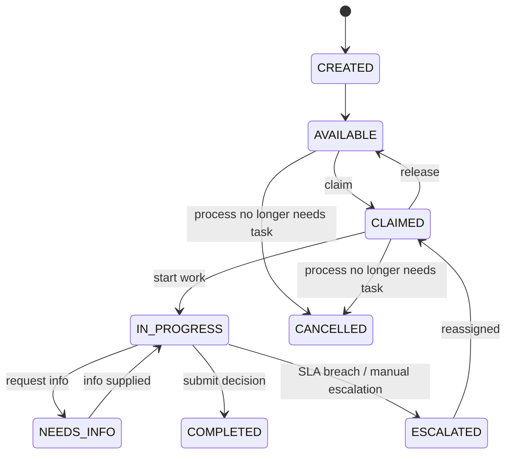
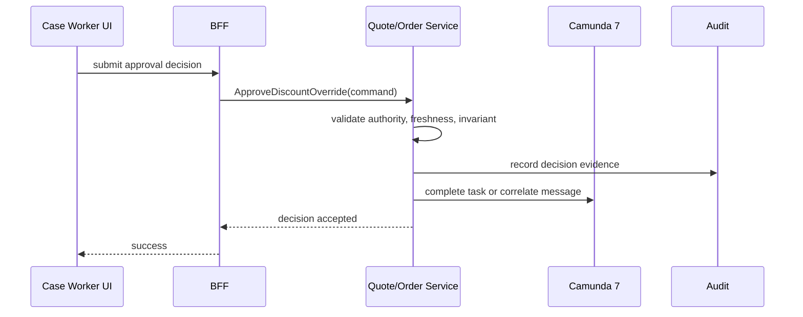
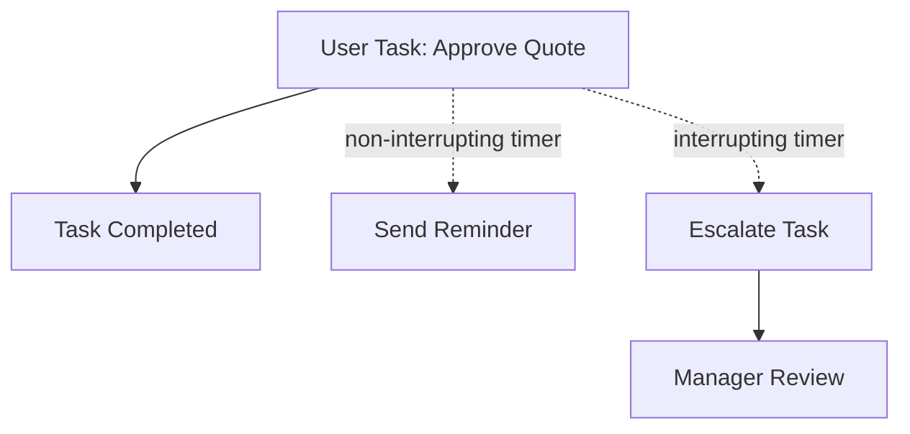
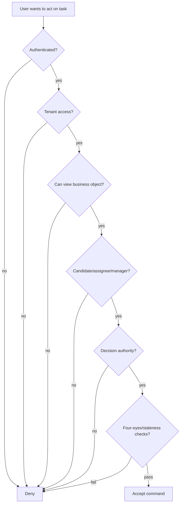
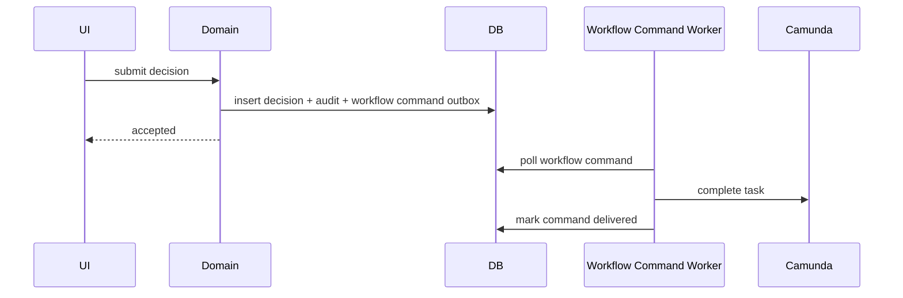

# Part 026 — Human Tasks and Case Worker Experience

Human task bukan “screen untuk approve”.

Dalam CPQ/OMS enterprise, human task adalah **control point** untuk keputusan yang tidak boleh atau tidak bisa diselesaikan otomatis. Ia adalah tempat manusia mengambil tanggung jawab atas exception, approval, ambiguity, policy override, compensation, dan recovery.

Sistem yang buruk membuat manusia menjadi garbage collector dari failure yang tidak dimodelkan.

Sistem yang baik membuat manusia menjadi decision maker dengan konteks, bukti, batas kewenangan, dan audit trail yang jelas.

Part ini membahas bagaimana mendesain human task dan case-worker experience untuk CPQ/OMS yang production-grade:

1. task lifecycle;
2. assignment model;
3. worklist design;
4. approval task design;
5. fallout task design;
6. manual compensation task;
7. authorization dan four-eyes rule;
8. Camunda 7 boundary;
9. operational UX;
10. audit dan defensibility.

---

## 1. Mental Model: Human Task Is a Domain Decision Point

Jangan mulai dari pertanyaan:

> “Form apa yang perlu ditampilkan?”

Mulailah dari pertanyaan:

> “Keputusan apa yang harus dibuat, oleh siapa, berdasarkan evidence apa, dengan akibat apa?”

Contoh buruk:

```text
Task: Review Order
Buttons: Approve / Reject
```

Terlalu kabur.

Contoh lebih benar:

```text
Task: Approve Discount Override
Decision:
  - approve override
  - reject override
  - request reprice
  - escalate to regional approver
Evidence:
  - requested discount
  - allowed discount threshold
  - margin impact
  - customer segment
  - previous approval history
  - quote revision snapshot
Authority:
  - approver must have discount authority for this tenant/region/product
  - approver cannot be quote owner
Outcome:
  - write approval decision
  - mark quote approval status
  - publish event
  - continue Camunda process
```

Human task adalah command boundary.

---

## 2. Human Task Categories in CPQ/OMS

Tidak semua human task sama.

| Category | Example | Primary Risk |
|---|---|---|
| Approval task | Approve discount, approve cancellation, approve manual price override | Unauthorized or stale approval |
| Fallout task | Fix failed fulfillment, resolve unknown outcome | Incorrect recovery |
| Review task | Review high-risk quote/order | Superficial rubber-stamping |
| Data correction task | Fix customer data, address, product mapping | Hidden data mutation |
| Compensation task | Approve or execute reversal | Irreversible side effect |
| Escalation task | SLA breach, blocked order | Lost ownership |
| Exception classification task | Decide if failure is technical/business/regulatory | Wrong path selection |
| Communication task | Send correction notice or customer update | Wrong external message |

Each category needs different UI, authorization, audit, and workflow semantics.

---

## 3. Task Lifecycle

A robust task lifecycle separates availability, assignment, work, decision, and completion.



Camunda user tasks provide process-level task semantics, but enterprise CPQ/OMS usually needs additional domain-level task state or read model for richer work management.

Why?

Because a business worklist often needs:

- priority calculation;
- risk classification;
- SLA clock;
- ownership history;
- business object summary;
- evidence snapshot;
- authorization reason;
- decision payload;
- comments and attachments;
- manager reassignment;
- queue analytics.

Camunda task alone is not enough as enterprise UX model.

---

## 4. Camunda 7 Boundary for Human Tasks

Camunda 7 should own:

- process waiting point;
- task creation;
- task completion signal;
- candidate user/group metadata;
- due date/follow-up date if modeled;
- process continuation.

Domain services should own:

- quote/order truth;
- approval decision record;
- compensation plan;
- fallout case;
- authorization policy;
- business evidence;
- audit trail;
- task read model enrichment.

BFF/UI should own:

- task list query composition;
- user-specific filters;
- presentation of evidence;
- command submission shape;
- field-level display rules.

Do not let UI complete Camunda task directly without domain command validation.

Correct flow:



Wrong flow:

```text
UI -> Camunda REST: complete task with { approved: true }
```

That bypasses domain authority and evidence rules.

---

## 5. Worklist Is Not a Queue Table

A worklist is a decision surface.

Bad worklist:

| Task | Created |
|---|---|
| Review Quote | 2026-07-02 |
| Fix Order | 2026-07-02 |

Good worklist:

| Field | Why it matters |
|---|---|
| Task type | What kind of decision is required |
| Business object | Quote/order/customer context |
| Priority | What should be handled first |
| SLA due | Operational risk |
| Risk class | Commercial/regulatory impact |
| Current owner | Accountability |
| Candidate group | Routing |
| Blocker | Why it exists |
| Next action | What worker should do |
| Age | Staleness |
| Tenant/region/product | Segmentation |

Example row:

```text
Task: Approve Discount Override
Quote: Q-2026-000918 rev 3
Customer: Acme Manufacturing
Requested discount: 32%
Approver threshold exceeded by: 7%
Margin impact: -4.2%
SLA due: 2h 14m
Candidate group: regional-sales-director-id
Risk: HIGH
Next action: approve, reject, request reprice, escalate
```

This is not UI decoration. It reduces wrong decisions.

---

## 6. Task Read Model

Do not query Camunda, quote, order, pricing, catalog, customer, and audit services live for every worklist row. Build a task read model.

```text
case_work_item
- id
- camunda_task_id
- process_instance_id
- business_key
- tenant_id
- business_object_type
- business_object_id
- business_object_version
- task_type
- title
- status
- priority
- risk_class
- candidate_groups
- assignee
- due_at
- created_at
- updated_at
- last_event_at
- summary_json
- blocker_code
- next_action_codes
```

This read model can be updated from:

- Camunda task creation/completion events;
- domain events such as `QuoteApprovalRequested`;
- SLA scheduler;
- assignment events;
- manual comments.

It is okay if read model is eventually consistent, as long as command submission revalidates domain invariants.

Rule:

> Worklist can be stale; decision command must not be stale.

---

## 7. Approval Task Design

Approval must answer:

1. what exactly is being approved;
2. against which version/snapshot;
3. by whom;
4. under which authority;
5. with what reason;
6. with what expiry;
7. what happens if quote/order changes after approval.

### Approval command

```json
{
  "taskId": "task-123",
  "quoteId": "quote-9001",
  "quoteRevision": 3,
  "decision": "APPROVE",
  "reasonCode": "STRATEGIC_CUSTOMER_RETENTION",
  "comment": "Approved due to committed multi-year expansion opportunity.",
  "evidenceVersion": "pricing-result-771",
  "expectedQuoteVersion": 12
}
```

### Domain validation

Before accepting:

- task exists and is active;
- user is allowed to act;
- user is not forbidden by four-eyes rule;
- quote revision still matches;
- price result is still current;
- requested discount still matches approval request;
- approval authority covers amount/region/product;
- decision payload has required reason;
- no higher-level approval is still required.

If any fails, do not complete task.

---

## 8. Four-Eyes Rule

Four-eyes rule means one person cannot both create/request and approve the same sensitive action.

In CPQ:

```text
quote owner != discount approver
price override requester != price override approver
cancellation requester != cancellation approver when regulatory/billing impact exists
manual compensation executor != compensation approver for high-risk actions
```

State model:

```text
approval_request
- requested_by
- requested_at
- required_authority
- forbidden_approver_user_ids
- forbidden_approver_role_codes
```

Validation:

```java
if (approvalRequest.wasRequestedBy(actor.userId())) {
    throw new AuthorizationDenied("FOUR_EYES_VIOLATION");
}
```

Do not rely only on UI hiding buttons. Enforce in domain service.

---

## 9. Stale Approval Problem

A common failure:

```text
Approver opens quote approval task.
Sales rep changes quote lines.
Approver clicks approve on old data.
System approves new quote accidentally.
```

Fix:

- approval request references immutable quote revision;
- approval decision references evidence version;
- command includes expected quote version;
- domain revalidates freshness;
- if stale, task becomes obsolete and new approval is requested.

State:

```text
APPROVAL_REQUESTED
APPROVED
REJECTED
OBSOLETE_DUE_TO_QUOTE_CHANGE
EXPIRED
ESCALATED
```

Do not approve moving target.

---

## 10. Fallout Task Design

Fallout task is not “something failed”. It is a structured recovery case.

A good fallout task includes:

- failure classification;
- affected step;
- external system;
- last request/response summary;
- known business impact;
- recommended next actions;
- safe actions;
- forbidden actions;
- reconciliation status;
- SLA;
- owner group;
- escalation route.

Example:

```text
Task: Resolve Inventory Reservation Unknown Outcome
Order: ORD-2026-000117
Step: Reserve inventory
External system: INV-CORE
Last outcome: request timed out after acceptance unknown
Risk: stock may be held without OMS state
Recommended action:
  1. Run reconciliation query
  2. If reservation exists, confirm step and continue or release if cancellation requested
  3. If not found, mark no-effect and retry reserve if order still active
Forbidden action:
  - Do not manually mark failed without reconciliation
```

Fallout task should guide decisions. Otherwise operator becomes detective under pressure.

---

## 11. Case vs Task

A task is one unit of work.
A case is a container for related work around a business exception.

Example:

```text
Case: Order ORD-1001 fulfillment fallout
  Task 1: Reconcile inventory reservation
  Task 2: Contact provisioning support
  Task 3: Approve compensation waiver
  Task 4: Send customer update
```

Data model:

```text
case_record
- id
- case_type
- business_object_type
- business_object_id
- status
- severity
- owner_group
- owner_user
- opened_reason
- opened_at
- closed_at
- closure_reason

case_task
- id
- case_id
- camunda_task_id
- task_type
- status
- assignee
- due_at
- summary
```

Camunda can orchestrate cases, but operational case record should live in domain/operations database for search, reporting, and lifecycle analytics.

---

## 12. Assignment Model

Assignment should separate eligibility from ownership.

| Concept | Meaning |
|---|---|
| Candidate user | User allowed to claim task |
| Candidate group | Group whose members may claim task |
| Assignee | Current owner of task |
| Owner | Person accountable, may differ from delegated assignee |
| Delegated user | Temporary actor asked to provide input |
| Watcher | Can view but not decide |
| Escalation owner | Manager/team responsible after SLA breach |

Camunda user tasks support assignment concepts such as assignee and candidate groups. For enterprise control, use these as workflow metadata, but enforce real authority in domain service.

Example:

```text
Candidate group says: this task belongs to regional-sales-directors.
Domain authorization says: this actor has authority for tenant A, region APAC, product family broadband, discount <= 35%.
```

Both are needed.

---

## 13. Claim, Release, Delegate, Reassign

### Claim

Worker takes ownership.

Rules:

- only eligible users can claim;
- task status becomes claimed/in progress;
- audit records claim;
- SLA may continue running;
- manager sees owner.

### Release

Worker gives task back to queue.

Rules:

- allowed if no irreversible partial work was submitted;
- comments should remain;
- audit records release.

### Delegate

Worker asks another person to provide input but retains accountability.

Example:

```text
Sales director delegates legal risk assessment to legal team.
Legal team provides recommendation.
Sales director makes final decision.
```

### Reassign

Manager moves task to another assignee.

Rules:

- requires manager/admin authority;
- reason required;
- audit records old/new assignee;
- old draft decision should not silently transfer if sensitive.

---

## 14. SLA and Escalation

SLA is not a timer decoration. It changes operational responsibility.

For each task type define:

```text
initial_due_duration
warning_before_due
escalation_after_due
auto_escalation_group
business_calendar
priority_formula
```

Example:

| Task | SLA | Escalation |
|---|---:|---|
| Discount approval normal | 8 business hours | Sales manager |
| High-value quote approval | 2 business hours | Regional director |
| Order fallout customer-impacting | 1 hour | Operations lead |
| Compensation failure billing | 30 minutes | Billing operations |

BPMN pattern:



Non-interrupting timer can send reminders while task remains open. Interrupting timer changes path/ownership.

---

## 15. Task Forms: Evidence Before Input

A task form should not start with fields. It should start with evidence.

Recommended layout:

```text
Header
  - task type
  - business object
  - status
  - SLA
  - priority/risk

Decision summary
  - what decision is requested
  - consequence of each decision

Evidence
  - quote/order snapshot
  - price trace
  - approval threshold
  - policy result
  - external system evidence
  - previous decisions

Actions
  - approve/reject/request info/escalate/retry/reconcile

Decision input
  - reason code
  - comment
  - required acknowledgements

Audit preview
  - what will be recorded
```

Good task UX reduces bad audit outcomes.

---

## 16. Reason Codes

Free-text comment is not enough.

Reason code enables reporting, governance, analytics, and compliance.

Examples:

```text
STRATEGIC_CUSTOMER_RETENTION
COMPETITIVE_MATCH
PRICE_BOOK_EXCEPTION
BILLING_SYSTEM_FAILURE
CUSTOMER_CANCELLED_BEFORE_FULFILLMENT
EXTERNAL_SYSTEM_OUTAGE
MANUAL_DATA_CORRECTION
REGULATORY_REVIEW_REQUIRED
```

Comment explains nuance. Reason code classifies decision.

Rules:

- reason code required for approve/reject/waive/escalate;
- reason code set depends on task type;
- high-risk reason may require extra approval;
- reason code must be immutable after decision, unless corrected through audit correction process.

---

## 17. Comments, Attachments, and Evidence

Case worker needs comments and attachments, but they must not become uncontrolled truth.

Classify evidence:

| Type | Example | Governance |
|---|---|---|
| System evidence | price trace, external response | immutable, system-generated |
| User comment | explanation | editable only before submit |
| Attachment | customer email, PDF, screenshot | virus scan, access control |
| Decision payload | approve/reject/retry | immutable after submit |
| Correction | audit correction reason | new record, do not overwrite |

Never store critical decision only in comment text.

---

## 18. Authorization Model for Tasks

Authorization has layers.



Task visibility and decision authority are different.

A user may view a task but not approve it.
A user may be in candidate group but still lack authority for the specific discount or tenant.

---

## 19. Field-Level Security

Commercial data can be sensitive.

Examples:

- margin;
- cost basis;
- competitor price;
- internal approval notes;
- fraud/risk score;
- legal assessment.

Worklist/form should render based on field-level authorization.

```text
Sales rep:
  can see requested discount, not internal margin.
Sales manager:
  can see margin summary.
Finance approver:
  can see cost and margin details.
External partner:
  can see only partner-scoped order details.
```

Do not include hidden sensitive fields in API response and rely on frontend to hide them.

---

## 20. Completing a Task Safely

Task completion must be transactionally safe.

Desired sequence:

```text
1. Receive command.
2. Validate task active.
3. Validate actor authority.
4. Validate business object version.
5. Validate decision payload.
6. Write domain decision record.
7. Write audit record.
8. Write outbox event.
9. Complete Camunda task or correlate message.
10. Commit or apply reliable coordination pattern.
```

The tricky part is step 9 with Camunda and local database.

Options:

### Option A — Domain first, then complete Camunda

Risk: domain commits but Camunda complete fails.

Mitigation:

- store pending workflow command;
- retry completion;
- idempotent task completion command;
- reconciliation job detects domain decision not reflected in process.

### Option B — Camunda first, then domain commit

Risk: process moves forward but domain decision not stored.

Usually worse.

Default recommendation:

> Commit domain decision first, then complete/correlate workflow through a reliable workflow command/outbox mechanism.

---

## 21. Workflow Command Outbox

Use workflow command outbox to coordinate domain decision and Camunda task completion.

```sql
create table workflow_command_outbox (
    id uuid primary key,
    command_type varchar(80) not null,
    process_instance_id varchar(80),
    task_id varchar(80),
    business_key varchar(120),
    payload jsonb not null,
    status varchar(40) not null,
    attempt_count integer not null default 0,
    last_error text,
    created_at timestamptz not null,
    updated_at timestamptz not null
);
```

Flow:



This avoids losing decisions when Camunda REST/API call fails after domain commit.

---

## 22. Manual Recovery Tasks

Manual recovery task should expose safe operations only.

Example operations for external fulfillment fallout:

- run reconciliation;
- retry command;
- mark external success with evidence;
- mark no-effect with evidence;
- create compensation plan;
- escalate to partner team;
- pause order;
- resume order;
- create customer update task.

Dangerous operations:

- force order completed;
- delete fulfillment step;
- manually edit process variable;
- bypass compensation;
- directly change order status.

If dangerous operation is necessary, require:

- elevated role;
- reason code;
- second approval;
- immutable audit;
- post-action reconciliation.

---

## 23. Case Worker UX for Unknown Outcome

Unknown outcome task should prevent premature resolution.

Screen should show:

```text
Known facts:
  - Request sent at 10:15:00
  - Timeout at 10:15:30
  - External correlation id: inv-req-119
  - No confirmed response

Risk:
  - Inventory may be reserved without OMS state

Recommended steps:
  1. Query reservation by correlation id
  2. If exists, attach result and mark step succeeded
  3. If not found, attach query result and mark no-effect
  4. If query unavailable, escalate to inventory operations

Disabled action:
  - Mark failed without evidence
```

The UI should encode recovery discipline.

---

## 24. Audit Trail for Human Tasks

Audit must include:

```text
TaskCreated
TaskAssigned
TaskClaimed
TaskReleased
TaskDelegated
TaskEscalated
TaskDecisionSubmitted
TaskCompleted
TaskCancelled
TaskExpired
```

Decision audit should include:

```json
{
  "taskId": "task-123",
  "taskType": "DISCOUNT_APPROVAL",
  "actorId": "user-77",
  "actorRoles": ["REGIONAL_SALES_DIRECTOR"],
  "decision": "APPROVE",
  "reasonCode": "STRATEGIC_CUSTOMER_RETENTION",
  "businessObject": {
    "type": "QUOTE",
    "id": "quote-9001",
    "revision": 3,
    "version": 12
  },
  "evidence": {
    "pricingResultId": "price-771",
    "requestedDiscountPercent": 32,
    "authorityLimitPercent": 35
  },
  "occurredAt": "2026-07-02T12:00:00Z"
}
```

Audit is not a log message. It is evidence.

---

## 25. Human Task APIs

Recommended API shape:

```http
GET /work-items?status=available&taskType=DISCOUNT_APPROVAL
GET /work-items/{workItemId}
POST /work-items/{workItemId}/claim
POST /work-items/{workItemId}/release
POST /work-items/{workItemId}/decisions
POST /work-items/{workItemId}/escalate
POST /work-items/{workItemId}/comments
GET /cases/{caseId}
POST /cases/{caseId}/tasks/{taskId}/actions/reconcile
```

Decision endpoint should be command-shaped:

```http
POST /work-items/{id}/decisions
```

Payload:

```json
{
  "decisionType": "APPROVE_DISCOUNT_OVERRIDE",
  "reasonCode": "COMPETITIVE_MATCH",
  "comment": "Approved to match competitor offer for enterprise renewal.",
  "expectedBusinessObjectVersion": 12,
  "evidenceAcknowledgement": true
}
```

Do not expose raw Camunda task completion API to general frontend.

---

## 26. BFF Role

A frontend-facing BFF can compose task experience:

```text
BFF fetches:
  - work item read model
  - quote/order summary
  - price trace summary
  - approval policy summary
  - audit timeline
  - allowed actions
```

But BFF must not decide authority. It can ask domain service:

```http
GET /work-items/{id}/allowed-actions
```

Response:

```json
{
  "actions": [
    {
      "code": "APPROVE",
      "enabled": true,
      "requiredFields": ["reasonCode", "comment"]
    },
    {
      "code": "REJECT",
      "enabled": true,
      "requiredFields": ["reasonCode"]
    },
    {
      "code": "APPROVE_WITH_OVERRIDE",
      "enabled": false,
      "disabledReason": "AUTHORITY_LIMIT_EXCEEDED"
    }
  ]
}
```

Allowed actions are domain output, not frontend logic.

---

## 27. Task Search and Filtering

Common filters:

- my tasks;
- available tasks;
- candidate group;
- overdue;
- high priority;
- customer-impacting;
- task type;
- tenant;
- product family;
- region;
- external system;
- failed compensation;
- unknown outcome;
- quote/order/customer id.

Index task read model accordingly.

PostgreSQL example:

```sql
create index idx_work_item_status_priority
on case_work_item (status, priority desc, due_at);

create index idx_work_item_assignee_status
on case_work_item (assignee, status, due_at);

create index idx_work_item_business_object
on case_work_item (business_object_type, business_object_id);

create index idx_work_item_tenant_group_status
on case_work_item (tenant_id, status, due_at);
```

If candidate groups are array/json, consider normalized table:

```text
case_work_item_candidate_group
- work_item_id
- group_code
```

This avoids slow JSON scanning for main queues.

---

## 28. Task Priority Formula

Priority should not be arbitrary.

Example formula:

```text
priority_score =
  base_task_type_weight
  + customer_tier_weight
  + revenue_impact_weight
  + sla_urgency_weight
  + risk_weight
  + escalation_weight
```

Example:

| Factor | Score |
|---|---:|
| High-value quote approval | +40 |
| Platinum customer | +30 |
| Due within 1 hour | +20 |
| Regulatory risk | +50 |
| Already escalated | +25 |

Priority must be explainable:

```json
{
  "priorityScore": 135,
  "reasons": [
    "REGULATORY_RISK:+50",
    "HIGH_VALUE_QUOTE:+40",
    "PLATINUM_CUSTOMER:+30",
    "DUE_WITHIN_1H:+15"
  ]
}
```

Operators trust queues more when priority is explainable.

---

## 29. Avoiding Rubber-Stamp Approval

Approvals become useless if approvers click without understanding.

Design techniques:

- show delta from policy threshold;
- show margin impact;
- require reason for risky approval;
- require acknowledgement for irreversible action;
- prevent approval if evidence stale;
- sample approvals for audit review;
- show historical approval pattern;
- require second approval for exceptional cases;
- display “what happens next”.

Example approval warning:

```text
This approval allows a 32% discount.
Your standard limit for this product family is 25%.
Approval will trigger regional finance review if accepted.
Quote revision: 3
Price result: price-771 generated 11 minutes ago
```

---

## 30. Task Cancellation and Obsolescence

Tasks can become obsolete.

Examples:

- quote revised while approval task open;
- order cancelled while fallout task open;
- compensation plan rebuilt;
- policy changed and old approval no longer valid;
- customer withdraws request.

Do not leave obsolete tasks in queue.

State:

```text
CANCELLED_PROCESS_ENDED
OBSOLETE_BUSINESS_OBJECT_CHANGED
OBSOLETE_POLICY_CHANGED
OBSOLETE_SUPERSEDED_BY_NEW_TASK
```

Operator should see why task disappeared or was cancelled.

---

## 31. Notification Strategy

Task notifications should be useful, not noisy.

Events that may notify:

- task assigned;
- high-priority task created;
- SLA warning;
- task escalated;
- delegated task waiting;
- customer-impacting fallout;
- compensation failure;
- task reassigned.

Avoid notifying every task creation to large group.

Notification should include:

- task type;
- business object;
- risk/priority;
- due time;
- direct link;
- required action.

Do not include sensitive commercial fields in email/slack unless channel is approved.

---

## 32. Metrics

Measure human work as part of system health.

Metrics:

```text
work_items_created_total{task_type}
work_items_completed_total{task_type,decision}
work_item_age_seconds{task_type,status}
work_item_sla_breach_total{task_type}
approval_rejection_rate{policy_code}
fallout_resolution_time_seconds{external_system}
compensation_manual_review_total{reason_code}
reassignment_count{task_type}
obsolete_task_count{reason}
```

Business analytics:

- which products cause most fallout;
- which approvals are frequently rejected;
- which external systems produce unknown outcome;
- which teams are overloaded;
- which policy thresholds cause friction;
- how much revenue is blocked in pending approval.

Human task metrics reveal design problems.

---

## 33. Testing Human Tasks

Test beyond “task exists”.

Scenarios:

1. discount approval task created when threshold exceeded;
2. approver in candidate group but lacking domain authority cannot approve;
3. quote owner cannot approve own quote;
4. approval fails when quote revision changes;
5. task becomes obsolete after reprice;
6. SLA timer escalates task;
7. release returns task to candidate group;
8. delegation preserves original owner;
9. fallout task prevents unsafe resolution without evidence;
10. workflow command outbox retries Camunda completion;
11. duplicate decision command is idempotent;
12. field-level security hides margin for unauthorized actor.

Camunda BPMN tests should assert process path.
Domain tests should assert authority and invariant.
API tests should assert error model and version checks.
UI/BFF tests should assert allowed actions and evidence display.

---

## 34. Common Anti-Patterns

### Anti-pattern 1 — Raw Camunda Tasklist as enterprise UI

Tasklist is useful for basic workflow operations, but CPQ/OMS case workers need domain evidence, policy explanation, queue analytics, and safe actions.

Fix:

> Build domain worklist/read model and use Camunda as workflow engine.

### Anti-pattern 2 — Complete task first, validate later

Process moves forward before domain decision is valid.

Fix:

> Domain command validates and persists decision first; workflow completion is reliable side effect.

### Anti-pattern 3 — Candidate group equals authorization

User is in group, so system allows approval.

Fix:

> Candidate group controls routing; domain authority controls decision.

### Anti-pattern 4 — Task without evidence

Approver sees only approve/reject buttons.

Fix:

> Show decision evidence, policy threshold, consequences, and freshness.

### Anti-pattern 5 — Comments as data model

Critical reason is stored only as free text.

Fix:

> Use reason code + structured payload + comment.

### Anti-pattern 6 — Hidden manual work

Operators fix data directly in database or Camunda Cockpit without domain audit.

Fix:

> Provide explicit manual recovery actions and audit trail.

---

## 35. Production Checklist

Before human task design is production-grade:

- [ ] Every task type has clear decision semantics.
- [ ] Task completion uses domain command, not raw Camunda completion.
- [ ] Worklist has domain read model.
- [ ] Task assignment is separated from decision authority.
- [ ] Four-eyes rule enforced in backend.
- [ ] Stale approval is prevented.
- [ ] Reason codes are required for sensitive decisions.
- [ ] Comments and attachments are governed.
- [ ] SLA and escalation are explicit.
- [ ] Obsolete tasks are cancelled/marked properly.
- [ ] Fallout tasks include recommended and forbidden actions.
- [ ] Compensation tasks include risk and reversibility evidence.
- [ ] Field-level security is enforced server-side.
- [ ] Audit trail captures actor, reason, evidence, and outcome.
- [ ] Metrics expose queue health and bottlenecks.
- [ ] Manual override requires elevated authority and audit.

---

## 36. Key Takeaways

Human task design is not a secondary UI problem. It is part of system correctness.

The essential ideas:

1. human task is a decision point, not just a form;
2. routing and authority are different;
3. task completion must go through domain command validation;
4. worklist needs domain read model;
5. approval must bind to immutable evidence/version;
6. fallout must guide safe recovery;
7. case worker UX should prevent unsafe shortcuts;
8. audit must capture structured decision evidence;
9. SLA and escalation are part of lifecycle;
10. hidden manual work is a production risk.

A CPQ/OMS system becomes enterprise-grade when its human workflow is as carefully modeled as its automated workflow.

Without that, every exception becomes tribal knowledge.

---

## References

- Camunda 7 Documentation — User Task: https://docs.camunda.org/manual/latest/reference/bpmn20/tasks/user-task/
- Camunda 7 Documentation — Task Service: https://docs.camunda.org/manual/latest/user-guide/process-engine/process-engine-api/#task-service
- Camunda 7 Best Practices — Extending human task management in Camunda 7: https://docs.camunda.io/docs/components/best-practices/architecture/extending-human-task-management-c7/
- Camunda BPMN Reference — User tasks, timers, escalation, four-eyes examples: https://camunda.com/bpmn/reference/
- Camunda 7 Documentation — Securing Camunda 7: https://docs.camunda.io/docs/components/best-practices/operations/securing-camunda-c7/
