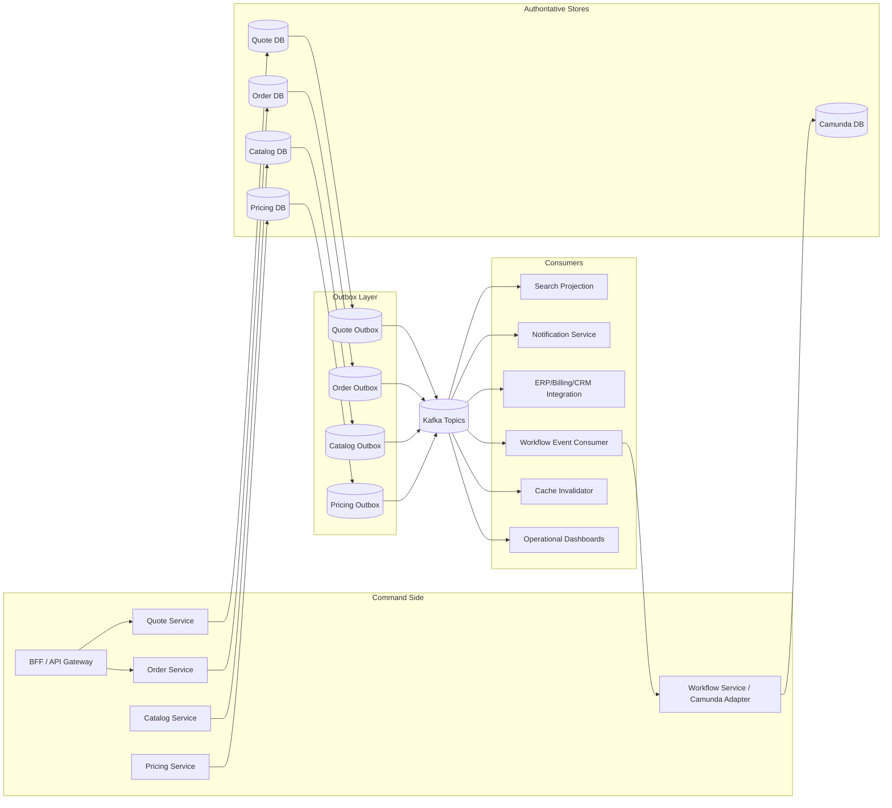
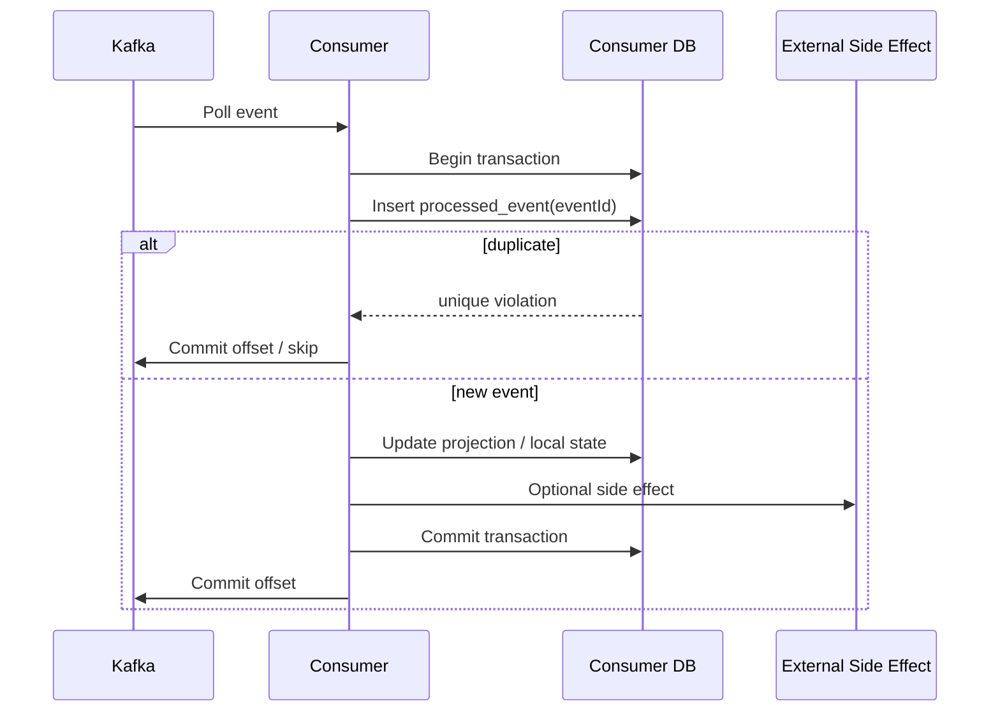
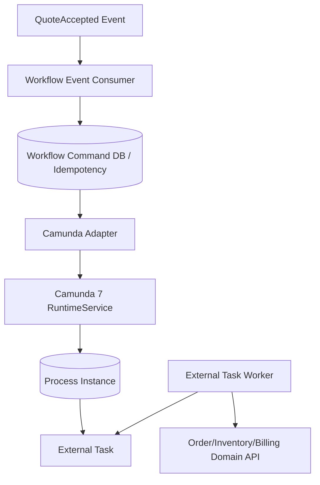
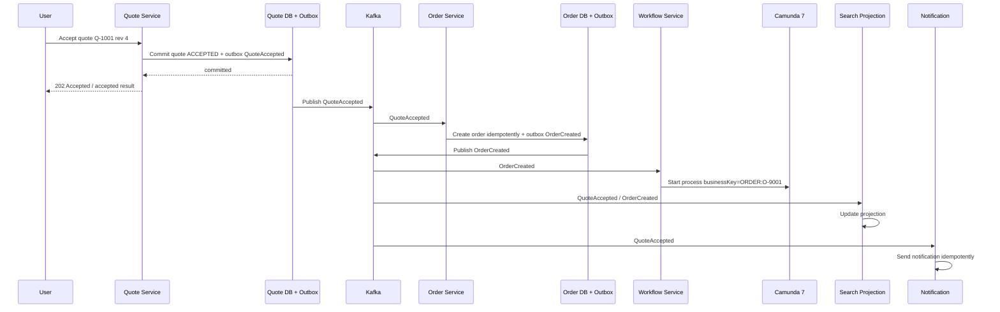

# Part 027 — Kafka Event Architecture for CPQ/OMS

Kafka di CPQ/OMS bukan “message queue supaya service bisa saling panggil secara async”. Itu terlalu dangkal.

Dalam sistem CPQ/OMS enterprise, Kafka adalah **integration log**: tempat service mempublikasikan fakta bisnis yang sudah committed agar service lain bisa membangun read model, trigger workflow, sinkronisasi sistem eksternal, atau melakukan proses lanjutan tanpa coupling langsung ke transaction boundary service asal.

Kafka bukan database utama. Kafka bukan workflow engine. Kafka bukan audit ledger tunggal. Kafka bukan pengganti API command. Kafka bukan tempat menyimpan semua perubahan internal entity.

Mental model yang benar:

> PostgreSQL menyimpan kebenaran transaksional.  
> Domain service memutuskan perubahan state.  
> Outbox menjamin event mengikuti commit database.  
> Kafka menyebarkan fakta committed.  
> Consumer membangun konsekuensi secara idempotent.  
> Camunda mengorkestrasi proses long-running, bukan menjadi event bus.

Kalau prinsip ini dilanggar, CPQ/OMS akan terlihat “modern”, tapi operasionalnya rapuh: event ganda merusak read model, event hilang membuat order tidak jalan, replay memicu workflow duplikat, dan setiap service akhirnya membaca event tanpa tahu mana yang authoritative.

---

## 1. Masalah Yang Diselesaikan Kafka

CPQ/OMS memiliki banyak konsekuensi lintas capability:

- quote accepted harus membuat order,
- order submitted harus memulai orchestration,
- catalog published harus menghapus cache dan memperbarui eligibility projection,
- price recalculated harus mengubah approval requirement,
- order fulfilled harus memberi tahu billing atau contract system,
- fulfillment failed harus membuat fallout task,
- approval completed harus membuka command berikutnya.

Tanpa Kafka, desain biasanya jatuh ke salah satu dari dua ekstrem:

1. **Synchronous spider web**  
   Quote Service memanggil Order Service, Workflow Service, Notification Service, Audit Service, Search Service, dan Integration Service secara langsung dalam satu request path.

2. **Shared database integration**  
   Banyak service membaca tabel `quote`, `order`, atau `approval` langsung karena “lebih gampang”.

Keduanya buruk.

Synchronous spider web membuat latency dan failure propagation tidak terkendali. Shared database integration merusak service ownership dan membuat schema database menjadi public API tersembunyi.

Kafka memberi boundary yang lebih sehat:

- service owner publish fakta setelah commit,
- consumer memilih sendiri kapan dan bagaimana bereaksi,
- producer tidak perlu tahu siapa consumer,
- consumer tidak perlu memanggil producer untuk mencari “apa yang baru terjadi”,
- read model dapat dibangun terpisah,
- integration external dapat dibuat resilient.

Tapi Kafka hanya menyelesaikan sebagian masalah. Ia tidak otomatis menyelesaikan:

- idempotency,
- ordering lintas aggregate,
- schema evolution,
- business compensation,
- workflow correctness,
- authorization,
- data retention policy,
- event meaning.

Itu tetap tanggung jawab arsitektur.

---

## 2. Event Dalam CPQ/OMS Adalah Fakta, Bukan Perintah

Kesalahan umum: memakai event sebagai command terselubung.

Contoh buruk:

```json
{
  "type": "CreateOrderPlease",
  "quoteId": "Q-1001"
}
```

Nama ini bukan fakta. Ini instruksi. Kalau order gagal dibuat, apa arti event itu? Apakah quote sudah accepted? Apakah order wajib dibuat? Siapa pemilik retry? Siapa yang menentukan idempotency?

Event yang benar menyatakan fakta bisnis yang sudah terjadi:

```json
{
  "eventType": "QuoteAccepted",
  "quoteId": "Q-1001",
  "quoteRevision": 4,
  "acceptedAt": "2026-07-02T10:15:30Z",
  "acceptedBy": "user-42"
}
```

Dari fakta itu, Order Service bisa memutuskan: “untuk quote revision ini, buat order jika belum pernah dibuat”.

Perbedaan ini penting:

| Bentuk | Makna | Pemilik Keputusan | Risiko |
|---|---|---|---|
| Command | “Lakukan X” | Receiver | Sender sering mengasumsikan hasil |
| Event | “X sudah terjadi” | Producer untuk fakta, consumer untuk konsekuensi | Consumer harus idempotent |
| Query | “Berikan data X” | Receiver | Bukan untuk integrasi perubahan |

Di CPQ/OMS, Kafka event idealnya berisi **business fact** yang sudah committed, bukan request untuk melakukan command.

---

## 3. Event Taxonomy

Tidak semua event sama. Top 1% engineer membedakan jenis event sebelum membuat topic.

### 3.1 Domain Event

Domain event adalah fakta yang lahir dari aggregate/domain service.

Contoh:

- `ProductCatalogPublished`
- `QuoteConfigured`
- `QuotePriced`
- `QuoteSubmittedForApproval`
- `QuoteApproved`
- `QuoteAccepted`
- `OrderCreated`
- `OrderSubmitted`
- `OrderLineFulfillmentStarted`
- `OrderLineFulfillmentFailed`
- `OrderCompleted`

Domain event merepresentasikan perubahan state bisnis yang berarti.

### 3.2 Integration Event

Integration event adalah event yang dirancang untuk consumption lintas boundary. Isinya stabil, disaring, dan tidak membocorkan internal entity.

Tidak semua domain event perlu menjadi integration event. Contoh internal domain event seperti `QuoteLineReordered` mungkin tidak perlu keluar dari Quote Service.

### 3.3 Projection Event

Projection event dipakai untuk membangun read model/search model.

Contoh:

- `QuoteSearchProjectionUpdated`
- `OrderOperationalProjectionUpdated`

Dalam banyak kasus, projection event tidak perlu public. Search Service dapat consume domain/integration event dan membangun index sendiri.

### 3.4 Workflow Signal Event

Workflow signal event adalah event yang dipakai untuk menggerakkan proses Camunda.

Contoh:

- `OrderCreated` memulai process instance,
- `FulfillmentCallbackReceived` mengorelasikan external task/callback,
- `PaymentConfirmed` melanjutkan order process.

Penting: event ini tetap fakta, bukan “complete BPMN task now”. Workflow Service yang menerjemahkan fakta ke correlation command Camunda.

### 3.5 Audit Event

Audit event adalah catatan untuk analisis/observability. Namun audit defensible tidak boleh hanya bergantung pada Kafka retention.

Audit authoritative tetap harus ada di database/service audit store karena Kafka topic bisa berubah retention, compaction, atau aksesnya.

---

## 4. Arsitektur Event CPQ/OMS



Prinsip utama:

1. Producer event adalah service yang memiliki fakta bisnis.
2. Event keluar melalui outbox, bukan langsung dari handler domain.
3. Kafka topic adalah public integration contract.
4. Consumer tidak boleh mengubah database producer.
5. Workflow consumer tidak langsung menulis domain state tanpa command API/domain service.
6. Search/read model dapat tertinggal, tetapi harus bisa catch up.

---

## 5. Topic Ownership

Topic harus punya owner. Tanpa owner, topic menjadi landfill.

Contoh mapping:

| Topic | Owner | Isi | Consumer Umum |
|---|---|---|---|
| `cpq.catalog.events.v1` | Catalog Service | Catalog publication, offering lifecycle | Config, Pricing, Cache, Search |
| `cpq.pricing.events.v1` | Pricing Service | Price list publication, policy changes | Quote, Approval, Cache |
| `cpq.quote.events.v1` | Quote Service | Quote lifecycle facts | Order, Workflow, Search, Notification |
| `oms.order.events.v1` | Order Service | Order lifecycle facts | Workflow, Search, Billing, Notification |
| `oms.fulfillment.events.v1` | Fulfillment/Integration Service | Fulfillment result facts | Order, Workflow, Ops |
| `workflow.process.events.v1` | Workflow Service | Process lifecycle facts | Ops, Search, Audit |

Topic owner bertanggung jawab terhadap:

- event naming,
- schema evolution,
- compatibility,
- retention recommendation,
- partition key rule,
- event semantic documentation,
- deprecation policy,
- sample event fixtures,
- consumer impact analysis.

Ownership topic tidak boleh diberikan ke “platform team” hanya karena Kafka dikelola platform. Platform team mengelola cluster. Domain team mengelola contract.

---

## 6. Topic Naming Strategy

Naming topic harus menunjukkan domain, stream, dan versi contract.

Format yang cukup sehat:

```txt
<domain>.<capability>.<stream>.v<major>
```

Contoh:

```txt
cpq.quote.events.v1
cpq.catalog.events.v1
cpq.pricing.events.v1
oms.order.events.v1
oms.fulfillment.events.v1
workflow.process.events.v1
```

Hindari:

```txt
events
quote
order-topic
prod-cpq-event-topic-new
service-a-to-service-b
```

Nama topic `service-a-to-service-b` menandakan point-to-point coupling. Event stream seharusnya dimiliki oleh fakta, bukan oleh jalur komunikasi dua service.

---

## 7. Event Envelope

Event payload perlu dibagi menjadi envelope dan data.

Envelope menjawab:

- event apa ini,
- siapa yang menerbitkan,
- kapan diterbitkan,
- aggregate apa yang berubah,
- correlation apa yang terkait,
- schema versi berapa,
- tenant mana,
- trace request apa,
- urutan aggregate berapa.

Data menjawab:

- fakta bisnis apa yang terjadi.

Contoh envelope:

```json
{
  "eventId": "evt_01J2VMT8N9G6XW2D7XWQH7K5YD",
  "eventType": "QuoteAccepted",
  "eventVersion": 1,
  "occurredAt": "2026-07-02T10:15:30Z",
  "publishedAt": "2026-07-02T10:15:31Z",
  "producer": "quote-service",
  "tenantId": "tenant_enterprise_a",
  "aggregateType": "QUOTE",
  "aggregateId": "Q-1001",
  "aggregateVersion": 17,
  "correlationId": "corr_9a2f",
  "causationId": "cmd_accept_quote_8891",
  "traceId": "00-4bf92f3577b34da6a3ce929d0e0e4736-00f067aa0ba902b7-01",
  "data": {
    "quoteId": "Q-1001",
    "quoteRevision": 4,
    "acceptedBy": "user-42",
    "acceptedAt": "2026-07-02T10:15:30Z",
    "totalAmount": {
      "currency": "USD",
      "amount": "12000.00"
    }
  }
}
```

### 7.1 `eventId`

Global unique id untuk deduplication consumer.

### 7.2 `eventType`

Nama semantic event, bukan nama class Java.

Baik:

```txt
QuoteAccepted
OrderSubmitted
CatalogPublished
```

Buruk:

```txt
QuoteEntityUpdated
QuoteServiceEvent
UpdateEvent
```

### 7.3 `aggregateId`

Identifier business aggregate yang menjadi partition key utama.

### 7.4 `aggregateVersion`

Versi aggregate setelah event terjadi. Ini berguna untuk:

- mendeteksi event out-of-order per aggregate,
- membangun projection secara aman,
- debug lifecycle,
- reconciliation.

### 7.5 `correlationId`

ID untuk menghubungkan request, event, workflow, dan log.

### 7.6 `causationId`

ID command/event yang menyebabkan event ini. Ini membuat causal chain bisa ditelusuri.

---

## 8. Partition Key Design

Kafka ordering hanya dapat diasumsikan secara praktis dalam batas partition. Maka partition key adalah keputusan domain.

Rule default:

> Pilih partition key berdasarkan aggregate yang membutuhkan ordering.

Untuk quote event:

```txt
key = tenantId + ':' + quoteId
```

Untuk order event:

```txt
key = tenantId + ':' + orderId
```

Untuk catalog publication:

```txt
key = tenantId + ':' + catalogId
```

Untuk pricing policy publication:

```txt
key = tenantId + ':' + priceBookId
```

Jangan gunakan random UUID sebagai key untuk event lifecycle aggregate. Itu menghancurkan ordering per aggregate.

Jangan gunakan tenantId saja sebagai key. Itu membuat satu tenant besar menjadi hot partition.

Jangan gunakan eventType saja sebagai key. Itu membuat semua event type tertentu masuk satu partition dan tidak menjaga order per aggregate.

### 8.1 Partitioning Trade-Off

| Key | Ordering | Parallelism | Risiko |
|---|---:|---:|---|
| `quoteId` | Baik per quote | Baik | Cross-tenant collision jika ID tidak globally unique |
| `tenantId:quoteId` | Baik per tenant+quote | Baik | Key lebih panjang |
| `tenantId` | Baik per tenant | Buruk untuk tenant besar | Hot partition |
| random UUID | Buruk | Tinggi | Lifecycle event out-of-order |
| eventType | Buruk per aggregate | Buruk untuk hot event | Bottleneck |

### 8.2 Ordering Lintas Aggregate

Jangan menjanjikan ordering lintas aggregate.

Contoh:

- `QuoteAccepted(Q-1)` dan `CatalogPublished(C-1)` tidak punya total order global yang bisa diandalkan untuk business decision.
- Kalau Quote Service butuh catalog version tertentu, simpan `catalogVersion` di quote snapshot.
- Kalau Order Service butuh price version tertentu, simpan `priceSnapshotId` atau `quoteRevisionId`.

Kafka tidak boleh dipakai untuk menggantikan snapshot boundary.

---

## 9. Event Granularity

Event terlalu halus membuat noise. Event terlalu besar membuat consumer sulit bereaksi.

### 9.1 Buruk: Entity Change Event

```json
{
  "eventType": "QuoteUpdated",
  "changedFields": ["status", "total", "updatedAt"]
}
```

Masalah:

- consumer harus tahu arti field,
- business semantic hilang,
- event menjadi database replication,
- compatibility sulit.

### 9.2 Lebih Baik: Semantic Lifecycle Event

```json
{
  "eventType": "QuoteSubmittedForApproval",
  "data": {
    "quoteId": "Q-1001",
    "quoteRevision": 4,
    "approvalReasonCodes": ["DISCOUNT_ABOVE_THRESHOLD"],
    "requestedApproverGroups": ["SALES_MANAGER"]
  }
}
```

Consumer bisa bereaksi tanpa reverse-engineer perubahan field.

### 9.3 Event Payload Size

Event harus cukup kaya untuk consumer umum, tapi tidak menjadi snapshot database raksasa.

Rule praktis:

- masukkan identifier dan facts yang sering dipakai,
- masukkan version/snapshot id untuk lookup jika consumer perlu detail,
- jangan masukkan sensitive data jika tidak semua consumer boleh lihat,
- jangan masukkan full quote line tree ke semua event jika hanya dibutuhkan consumer tertentu,
- jangan mengharuskan consumer memanggil producer untuk setiap event sederhana.

Balance-nya domain-specific.

Untuk `QuoteAccepted`, sering masuk akal menyertakan:

- quote id,
- revision,
- accepted by,
- accepted at,
- customer account id,
- total amount,
- currency,
- product family summary,
- approval decision id,
- price result id.

Tapi full line tree dan price trace mungkin lebih aman di endpoint/query internal yang dikontrol authorization.

---

## 10. Canonical Event Streams CPQ/OMS

### 10.1 Catalog Events

| Event | Meaning | Key |
|---|---|---|
| `ProductOfferingCreated` | Offering baru dibuat dalam draft catalog | `tenantId:offeringId` |
| `ProductOfferingChanged` | Offering berubah sebelum publish | `tenantId:offeringId` |
| `CatalogPublished` | Catalog version resmi tersedia | `tenantId:catalogId` |
| `ProductOfferingRetired` | Offering tidak lagi eligible untuk quote baru | `tenantId:offeringId` |

Catalog events harus selalu membawa effective date/version.

```json
{
  "eventType": "CatalogPublished",
  "data": {
    "catalogId": "CAT-2026-Q3",
    "catalogVersion": 18,
    "effectiveFrom": "2026-07-01T00:00:00Z",
    "publishedBy": "catalog-admin-1"
  }
}
```

### 10.2 Pricing Events

| Event | Meaning | Key |
|---|---|---|
| `PriceBookPublished` | Price book version resmi tersedia | `tenantId:priceBookId` |
| `PricingPolicyChanged` | Policy pricing berubah | `tenantId:policyId` |
| `PromotionActivated` | Promotion aktif | `tenantId:promotionId` |
| `PromotionExpired` | Promotion expired | `tenantId:promotionId` |

Pricing events harus membuat Quote Service bisa menentukan apakah quote lama perlu reprice.

### 10.3 Quote Events

| Event | Meaning | Key |
|---|---|---|
| `QuoteCreated` | Quote draft dibuat | `tenantId:quoteId` |
| `QuoteConfigured` | Konfigurasi valid disimpan | `tenantId:quoteId` |
| `QuotePriced` | Harga dihitung dan disimpan | `tenantId:quoteId` |
| `QuoteSubmittedForApproval` | Quote masuk approval | `tenantId:quoteId` |
| `QuoteApproved` | Approval final diberikan | `tenantId:quoteId` |
| `QuoteRejected` | Approval ditolak | `tenantId:quoteId` |
| `QuoteAccepted` | Customer/user menerima quote | `tenantId:quoteId` |
| `QuoteExpired` | Quote melewati validity | `tenantId:quoteId` |
| `QuoteCancelled` | Quote dibatalkan sebelum menjadi order | `tenantId:quoteId` |

Quote event harus membawa `quoteRevision`. Tanpa revision, consumer tidak bisa membedakan event lama vs event baru.

### 10.4 Order Events

| Event | Meaning | Key |
|---|---|---|
| `OrderCreated` | Order dibuat dari accepted quote | `tenantId:orderId` |
| `OrderSubmitted` | Order siap orchestration | `tenantId:orderId` |
| `OrderValidationFailed` | Order tidak lolos validasi | `tenantId:orderId` |
| `OrderDecomposed` | Fulfillment plan dibuat | `tenantId:orderId` |
| `OrderFulfillmentStarted` | Fulfillment berjalan | `tenantId:orderId` |
| `OrderLineCompleted` | Satu order line selesai | `tenantId:orderId` |
| `OrderLineFailed` | Satu order line gagal | `tenantId:orderId` |
| `OrderFalloutRaised` | Butuh intervensi manual | `tenantId:orderId` |
| `OrderCompleted` | Semua obligation selesai | `tenantId:orderId` |
| `OrderCancelled` | Order dibatalkan | `tenantId:orderId` |

Order event harus bisa dipakai untuk operational dashboard tanpa membaca Camunda table langsung.

---

## 11. Consumer Design

Consumer CPQ/OMS harus diasumsikan akan mengalami:

- menerima event duplikat,
- crash setelah side effect tapi sebelum commit offset,
- lag saat traffic naik,
- menerima event schema versi lama,
- menerima event yang tidak relevan,
- gagal memproses external dependency,
- perlu replay.

Karena itu consumer harus idempotent.

### 11.1 Consumer Idempotency Table

Contoh:

```sql
CREATE TABLE processed_event (
  event_id           VARCHAR(64) PRIMARY KEY,
  consumer_name      VARCHAR(128) NOT NULL,
  event_type         VARCHAR(128) NOT NULL,
  aggregate_type     VARCHAR(64) NOT NULL,
  aggregate_id       VARCHAR(128) NOT NULL,
  processed_at       TIMESTAMPTZ NOT NULL DEFAULT now()
);
```

Kalau satu database dipakai oleh satu consumer service, primary key bisa `event_id`. Kalau satu DB dipakai beberapa consumer process dengan nama berbeda, gunakan unique `(consumer_name, event_id)`.

### 11.2 Consumer Flow



External side effect di tengah transaksi perlu hati-hati. Kalau side effect berhasil tapi DB commit gagal, system masuk unknown outcome. Untuk side effect penting, consumer sering perlu outbox lagi.

Pattern-nya recursive:

> consume event → update local DB → write local outbox → publisher calls external system.

---

## 12. Retry, DLQ, dan Poison Event

Tidak semua error sama.

| Error | Contoh | Handling |
|---|---|---|
| Transient technical | DB timeout, network issue | Retry with backoff |
| Dependency unavailable | ERP down | Retry bounded, circuit breaker, later retry |
| Schema incompatible | Field wajib hilang | Stop consumer / DLQ / alert |
| Business conflict | Quote revision tidak dikenal | Reconciliation / DLQ bisnis |
| Authorization/config | Tenant mapping hilang | DLQ + ops task |
| Poison event | Event valid tapi selalu gagal karena bug/data | Quarantine + fix + replay |

DLQ bukan tempat sampah permanen. DLQ adalah operational queue yang harus punya owner, dashboard, SLA, dan replay mechanism.

DLQ event harus membawa:

- original topic,
- original partition,
- original offset,
- event id,
- failure reason,
- stack trace hash,
- first failed at,
- last failed at,
- retry count,
- consumer name.

---

## 13. Replay Semantics

Kafka membuat replay mungkin. Tapi “bisa replay” bukan berarti “aman replay”.

Consumer harus diklasifikasikan:

| Consumer | Replay Aman? | Catatan |
|---|---:|---|
| Search projection | Ya | Rebuild index/read model |
| Operational dashboard | Ya | Recompute projection |
| Notification sender | Tidak langsung | Bisa mengirim email ganda |
| External ERP integration | Tidak langsung | Bisa membuat order duplikat |
| Workflow starter | Tidak langsung | Bisa start process duplikat |
| Cache invalidator | Umumnya ya | Side effect ephemeral |

Untuk consumer dengan side effect eksternal, replay harus memakai idempotency key atau replay mode khusus.

Contoh Workflow Starter:

```txt
idempotencyKey = eventType + ':' + aggregateId + ':' + aggregateVersion
```

Sebelum start Camunda process, Workflow Service harus cek apakah process untuk business key tersebut sudah ada atau apakah local workflow command sudah pernah diproses.

---

## 14. Kafka dan Camunda 7 Boundary

Kafka dan Camunda 7 sering tercampur dalam desain yang salah.

Perbedaan mental model:

| Concern | Kafka | Camunda 7 |
|---|---|---|
| Primary abstraction | Event log | Process instance |
| Data | Facts over time | Workflow state and variables |
| Ownership | Topic owner/domain service | Process owner/workflow service |
| Ordering | Per partition | Per process instance path/job execution |
| Retry | Consumer/publisher responsibility | Job executor/external task retry |
| Human task | Tidak ada | Ada |
| Compensation model | Tidak built-in sebagai BPMN | Native BPMN compensation patterns |
| Query operational | Consumer lag/offset | Process/task/incident state |

Boundary yang sehat:



Kafka event tidak langsung menjadi process variable raksasa. Workflow Service memilih fakta minimal yang diperlukan:

- `tenantId`,
- `businessKey`,
- `orderId` atau `quoteId`,
- `revision`,
- command/correlation id,
- pointer ke snapshot/domain data.

---

## 15. Event Versioning

Event schema akan berubah. Yang penting adalah cara berubah.

### 15.1 Backward-Compatible Changes

Umumnya aman:

- menambah optional field,
- menambah enum value jika consumer siap unknown value,
- menambah nested optional object,
- memperlonggar constraint.

### 15.2 Breaking Changes

Berbahaya:

- menghapus field,
- mengubah type field,
- mengganti semantic field,
- mengubah required menjadi format lain,
- mengubah partition key rule,
- mengubah event meaning tanpa rename.

Breaking changes harus memakai topic major version baru, misalnya:

```txt
cpq.quote.events.v2
```

Bukan diam-diam mengubah `v1`.

### 15.3 Semantic Versioning Event

`eventVersion` di envelope bukan selalu sama dengan topic major version.

- topic major version: compatibility contract besar,
- eventVersion: versi payload untuk event type tertentu.

---

## 16. Retention dan Compaction

Tidak semua topic perlu retention yang sama.

| Topic | Retention | Compaction | Reasoning |
|---|---|---:|---|
| Quote lifecycle events | Medium/long | Tidak | Butuh historical sequence |
| Order lifecycle events | Long | Tidak | Operational/replay penting |
| Catalog latest state projection | Long | Bisa | Latest state per offering/version |
| Cache invalidation | Short | Tidak | Ephemeral |
| DLQ | Long enough for ops SLA | Tidak | Butuh investigasi |
| Audit export | Long/regulated | Tergantung | Jangan jadi audit store tunggal |

Log compaction cocok untuk topic “latest value by key”, bukan untuk lifecycle event stream yang butuh sequence historis lengkap.

---

## 17. Event Contract Review Checklist

Sebelum event dipublikasikan, jawab pertanyaan ini:

1. Fakta bisnis apa yang sudah terjadi?
2. Service mana pemilik fakta?
3. Aggregate apa yang menjadi partition key?
4. Apakah event semantic atau hanya entity update?
5. Apakah payload membocorkan internal schema?
6. Apakah ada tenant id?
7. Apakah ada correlation id dan causation id?
8. Apakah ada aggregate version?
9. Apakah consumer bisa idempotent?
10. Apakah event aman untuk replay?
11. Apakah schema backward-compatible?
12. Apa retention policy?
13. Siapa owner DLQ?
14. Apa dampak kalau event terlambat 30 menit?
15. Apa dampak kalau event diproses dua kali?
16. Apa dampak kalau consumer memproses event versi lama?
17. Apakah event membawa PII atau commercial sensitive data?
18. Apakah event perlu encryption/masking/filtering?
19. Apakah workflow akan dimulai dari event ini?
20. Bagaimana mencegah workflow duplikat?

Kalau tim tidak bisa menjawab ini, event belum siap menjadi public integration contract.

---

## 18. Anti-Pattern

### 18.1 Event Sebagai Database Row Dump

```json
{
  "eventType": "QuoteUpdated",
  "quoteTableRow": { }
}
```

Ini membuat consumer bergantung pada internal schema.

### 18.2 Semua Service Publish Semua Event

Kalau semua service publish event tentang quote, tidak ada authoritative owner.

Rule:

> Hanya Quote Service yang boleh publish lifecycle fact tentang Quote aggregate.

Service lain boleh publish event tentang konsekuensinya sendiri, misalnya Workflow Service publish `QuoteApprovalProcessStarted`, bukan `QuoteSubmittedForApproval`.

### 18.3 One Topic Per Consumer

`quote-events-for-search`, `quote-events-for-notification`, `quote-events-for-order` adalah smell. Topic harus dimiliki oleh fact stream, bukan consumer.

### 18.4 Kafka Untuk Request/Reply Internal

Kalau caller butuh response langsung untuk user journey, pakai API command/query. Kafka tidak cocok untuk semua request-response interaction.

### 18.5 Workflow Dari Event Tanpa Idempotency

`QuoteAccepted` replay bisa membuat order process ganda jika Workflow Service tidak punya idempotency.

### 18.6 Menganggap Kafka Exactly-Once Menyelesaikan Semua

Kafka bisa memberi delivery/processing guarantees dalam boundary Kafka tertentu, tetapi external DB, API call, email, ERP, dan Camunda start process tetap butuh idempotency dan transaction design sendiri.

---

## 19. Production Metrics

Kafka event architecture harus bisa diamati.

Minimal metrics:

- producer publish success/failure,
- outbox pending count,
- outbox oldest unprocessed age,
- consumer lag per group,
- consumer processing latency,
- event processing error rate,
- DLQ count by event type,
- duplicate event count,
- replay throughput,
- schema validation failure,
- partition skew,
- hot key,
- publish latency,
- end-to-end event propagation latency.

Business metrics:

- accepted quote to order created latency,
- order created to workflow started latency,
- order submitted to first fulfillment action latency,
- fulfillment failed to fallout task created latency,
- catalog published to cache invalidated latency,
- pricing policy changed to affected quote detected latency.

Technical lag tanpa business lag tidak cukup. CPQ/OMS butuh tahu konsekuensi bisnis tertunda di mana.

---

## 20. Minimal Reference Implementation Shape

Package layout consumer/publisher:

```txt
quote-service/
  src/main/java/com/acme/cpq/quote/
    api/
    application/
    domain/
    persistence/
    events/
      QuoteEventFactory.java
      QuoteEventEnvelope.java
      QuoteEventType.java
    outbox/
      OutboxRecord.java
      OutboxRepository.java
      OutboxPublisher.java

order-service/
  src/main/java/com/acme/oms/order/
    consumer/
      QuoteAcceptedConsumer.java
      EventIdempotencyRepository.java
    application/
      CreateOrderFromQuoteUseCase.java
```

Consumer skeleton:

```java
public final class QuoteAcceptedConsumer {

    private final EventIdempotencyRepository idempotency;
    private final CreateOrderFromQuoteUseCase useCase;

    public void handle(EventEnvelope<QuoteAcceptedData> event) {
        idempotency.processOnce(event.eventId(), () -> {
            CreateOrderFromQuoteCommand command = new CreateOrderFromQuoteCommand(
                event.tenantId(),
                event.data().quoteId(),
                event.data().quoteRevision(),
                event.correlationId(),
                event.eventId()
            );

            useCase.execute(command);
        });
    }
}
```

Use case tetap harus idempotent. Consumer idempotency saja tidak cukup karena event berbeda bisa menyebabkan command bisnis yang sama, misalnya replay dari migration atau duplicate semantic event.

---

## 21. Invariant Event Architecture

Pegang invariant ini:

1. Event public harus menyatakan fakta committed.
2. Event harus punya single authoritative producer.
3. Event tidak boleh menggantikan command authorization.
4. Consumer harus idempotent.
5. Replay tidak boleh menyebabkan side effect duplikat tanpa kontrol.
6. Partition key harus mengikuti aggregate ordering requirement.
7. Schema evolution harus backward-compatible atau topic major version baru.
8. Kafka event tidak boleh menjadi satu-satunya audit source untuk regulatory defensibility.
9. Workflow start/correlation dari event harus punya idempotency key.
10. Topic bukan milik consumer, topic milik fact stream.

---

## 22. Latihan Desain

Ambil scenario:

> Customer menerima quote Q-1001 revision 4. Sistem harus membuat order, memulai orchestration, membuat dokumen acceptance, mengirim notifikasi, dan memperbarui search dashboard.

Desain event flow:

1. Quote Service commit `ACCEPTED` ke PostgreSQL.
2. Quote Service menulis `QuoteAccepted` ke outbox dalam transaksi yang sama.
3. Outbox publisher menerbitkan ke `cpq.quote.events.v1` dengan key `tenantId:Q-1001`.
4. Order Service consume dan menjalankan `CreateOrderFromQuoteUseCase` secara idempotent.
5. Order Service commit order dan menulis `OrderCreated` ke outbox.
6. Workflow Service consume `OrderCreated` dan start Camunda process dengan business key `ORDER:<orderId>` secara idempotent.
7. Search Service consume `QuoteAccepted` dan `OrderCreated` untuk projection.
8. Notification Service consume `QuoteAccepted` tapi menggunakan notification idempotency key.
9. Document Service consume `QuoteAccepted` atau menerima command dari Quote Service tergantung requirement document generation.

Diagram:



Perhatikan: Quote Service tidak memanggil semua service secara sinkron. Setiap side effect punya owner dan idempotency.

---

## 23. Referensi

- Apache Kafka Documentation — https://kafka.apache.org/documentation/
- Apache Kafka APIs — https://kafka.apache.org/42/apis/
- Debezium Outbox Event Router — https://debezium.io/documentation/reference/stable/transformations/outbox-event-router.html
- Debezium Change Data Capture — https://debezium.io/
- Microservices.io Transactional Outbox Pattern — https://microservices.io/patterns/data/transactional-outbox.html
