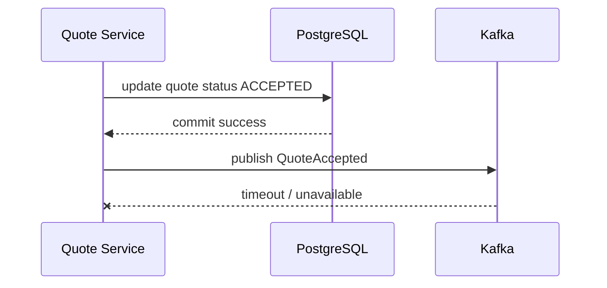
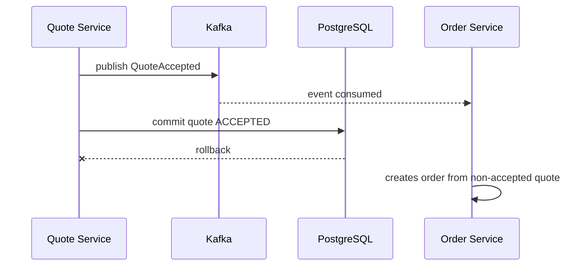
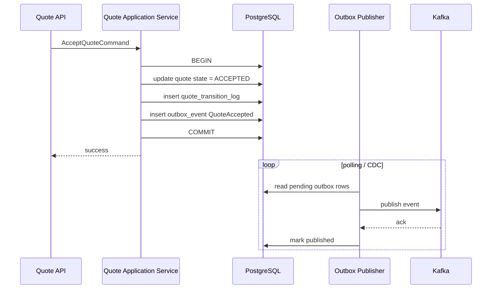
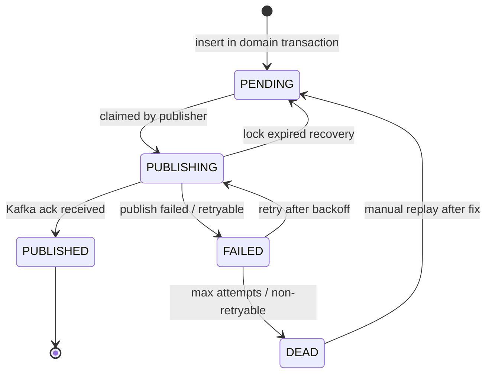
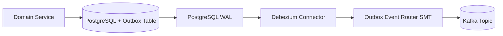
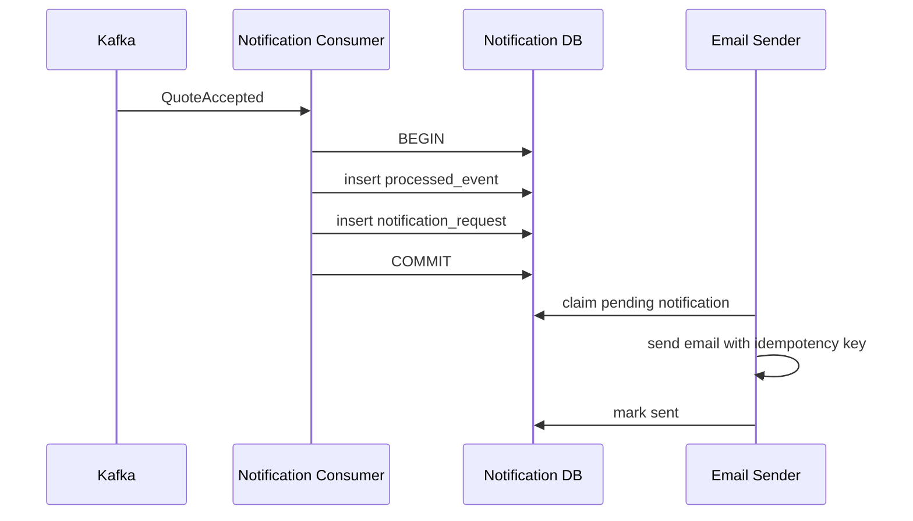
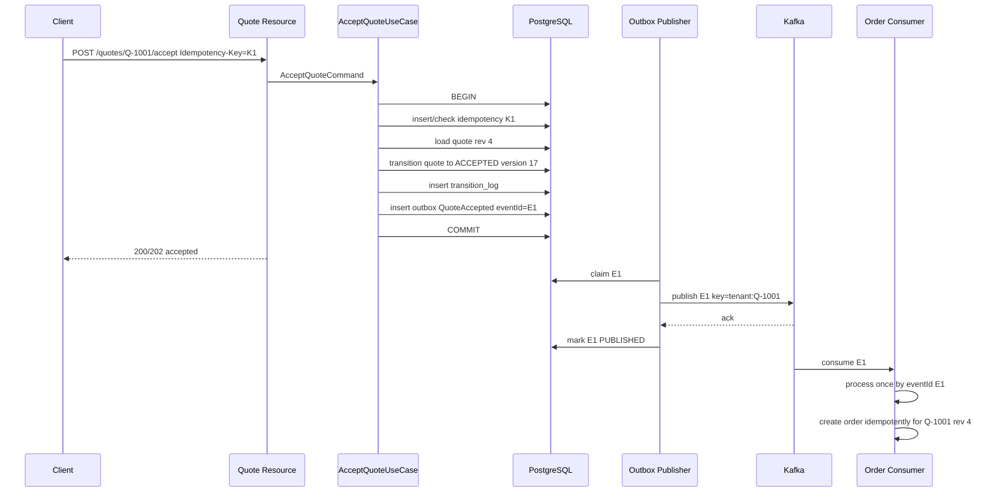

# Part 028 — Transactional Outbox and Event Publishing

Part sebelumnya menjelaskan event architecture. Sekarang kita masuk ke bagian yang membuat event architecture benar-benar bisa hidup di production: **transactional outbox**.

Masalahnya sederhana tapi mematikan:

> Bagaimana memastikan perubahan state di PostgreSQL dan event ke Kafka tidak saling hilang?

Contoh:

1. Quote Service mengubah quote menjadi `ACCEPTED`.
2. Quote Service harus publish `QuoteAccepted` ke Kafka.
3. Order Service consume event dan membuat order.

Kalau update database berhasil tapi publish Kafka gagal, quote sudah accepted tetapi order tidak pernah dibuat.

Kalau publish Kafka berhasil tapi database rollback, consumer melihat event palsu: quote accepted padahal database tidak committed.

Inilah **dual-write problem**.

Transactional outbox menyelesaikannya dengan prinsip:

> Jangan publish Kafka dalam transaksi bisnis secara langsung.  
> Tulis event ke tabel outbox dalam transaksi database yang sama dengan perubahan aggregate.  
> Publisher terpisah membaca outbox dan menerbitkan event ke Kafka secara retryable.

---

## 1. Dual-Write Problem

Desain naïf:

```java
@Transactional
public void acceptQuote(AcceptQuoteCommand command) {
    Quote quote = quoteRepository.get(command.quoteId());
    quote.accept(command.userId());
    quoteRepository.save(quote);

    kafkaProducer.send("cpq.quote.events.v1", quoteAcceptedEvent(quote));
}
```

Kode ini terlihat benar, tapi menyimpan bom waktu.

### 1.1 Failure Case A — DB Commit Berhasil, Kafka Publish Gagal



Akibat:

- quote accepted,
- event tidak ada,
- order tidak dibuat,
- user melihat quote accepted tapi fulfillment tidak bergerak,
- reconciliation harus menemukan gap.

### 1.2 Failure Case B — Kafka Publish Berhasil, DB Rollback



Akibat:

- event palsu,
- order bisa dibuat dari state yang tidak pernah committed,
- audit kacau,
- compensation menjadi sulit.

### 1.3 Why Kafka Transaction Alone Does Not Fix DB Dual-Write

Kafka transaction dapat membantu atomicity dalam boundary Kafka producer/consumer tertentu. Tapi CPQ/OMS memakai PostgreSQL sebagai source of truth. Kalau transaksi database dan transaksi Kafka tidak berada dalam satu atomic transaction manager yang benar-benar didukung end-to-end, tetap ada boundary yang bisa pecah.

Solusi pragmatis enterprise: transactional outbox.

---

## 2. Transactional Outbox Mental Model

Dalam transaksi domain yang sama:

1. ubah aggregate,
2. tulis audit/transition log,
3. tulis outbox record,
4. commit.

Setelah commit:

1. outbox publisher membaca record pending,
2. publish ke Kafka,
3. tandai record published atau simpan metadata publish,
4. retry jika gagal.



Outbox membuat state domain dan event intent memiliki nasib commit yang sama.

Kalau commit gagal, event tidak muncul di outbox.

Kalau commit berhasil tapi Kafka down, event tetap tertahan di outbox dan bisa dipublish nanti.

---

## 3. Outbox Table Design

Minimal table:

```sql
CREATE TABLE outbox_event (
  id                  VARCHAR(64) PRIMARY KEY,
  tenant_id           VARCHAR(64) NOT NULL,
  aggregate_type      VARCHAR(64) NOT NULL,
  aggregate_id        VARCHAR(128) NOT NULL,
  aggregate_version   BIGINT NOT NULL,
  event_type          VARCHAR(128) NOT NULL,
  event_version       INTEGER NOT NULL,
  topic               VARCHAR(255) NOT NULL,
  partition_key       VARCHAR(255) NOT NULL,
  payload             JSONB NOT NULL,
  headers             JSONB NOT NULL DEFAULT '{}'::jsonb,
  status              VARCHAR(32) NOT NULL,
  attempt_count       INTEGER NOT NULL DEFAULT 0,
  next_attempt_at     TIMESTAMPTZ NOT NULL DEFAULT now(),
  locked_by           VARCHAR(128),
  locked_until        TIMESTAMPTZ,
  published_at        TIMESTAMPTZ,
  last_error_code     VARCHAR(128),
  last_error_message  TEXT,
  created_at          TIMESTAMPTZ NOT NULL DEFAULT now(),
  updated_at          TIMESTAMPTZ NOT NULL DEFAULT now(),

  CONSTRAINT ck_outbox_status CHECK (
    status IN ('PENDING', 'PUBLISHING', 'PUBLISHED', 'FAILED', 'DEAD')
  )
);

CREATE INDEX idx_outbox_publishable
  ON outbox_event (status, next_attempt_at, created_at)
  WHERE status IN ('PENDING', 'FAILED');

CREATE INDEX idx_outbox_aggregate
  ON outbox_event (tenant_id, aggregate_type, aggregate_id, aggregate_version);

CREATE UNIQUE INDEX uq_outbox_aggregate_event_version
  ON outbox_event (tenant_id, aggregate_type, aggregate_id, aggregate_version, event_type);
```

### 3.1 Field Meaning

| Field | Fungsi |
|---|---|
| `id` | `eventId`, dipakai untuk deduplication consumer |
| `tenant_id` | tenant boundary dan routing |
| `aggregate_type` | `QUOTE`, `ORDER`, `CATALOG`, dll |
| `aggregate_id` | business aggregate id |
| `aggregate_version` | versi aggregate setelah perubahan |
| `event_type` | semantic event name |
| `event_version` | versi schema event type |
| `topic` | target Kafka topic |
| `partition_key` | key Kafka untuk ordering |
| `payload` | full event envelope/payload |
| `headers` | optional Kafka headers |
| `status` | lifecycle publish |
| `attempt_count` | retry tracking |
| `next_attempt_at` | backoff control |
| `locked_by` | publisher instance claim |
| `locked_until` | recovery dari crashed publisher |
| `published_at` | timestamp sukses publish |
| `last_error_*` | diagnosis |

### 3.2 Why Store Topic and Partition Key?

Jangan hitung ulang topic dan partition key di publisher dari payload saja. Topic dan key adalah bagian dari publish intent yang dihasilkan oleh domain service saat transaksi commit.

Kalau rule topic/key berubah setelah outbox row dibuat, event lama tetap harus dipublish sesuai contract saat event dibuat.

---

## 4. Outbox Lifecycle



Lifecycle harus eksplisit. Jangan hanya pakai boolean `published`.

Boolean tidak cukup untuk menjawab:

- sedang diproses atau belum?
- berapa kali gagal?
- kapan retry?
- siapa yang memegang lock?
- error terakhir apa?
- apakah dead-letter?
- apakah bisa replay?

---

## 5. Writing Outbox Dalam Domain Transaction

Accept quote use case:

```java
public final class AcceptQuoteUseCase {

    private final QuoteRepository quoteRepository;
    private final OutboxRepository outboxRepository;
    private final EventFactory eventFactory;

    @Transactional
    public AcceptQuoteResult execute(AcceptQuoteCommand command) {
        Quote quote = quoteRepository.findForUpdateOrOptimistic(command.quoteId());

        quote.accept(command.userId(), command.expectedRevision());

        quoteRepository.save(quote);

        OutboxEvent event = eventFactory.quoteAccepted(
            quote,
            command.correlationId(),
            command.commandId()
        );

        outboxRepository.insert(event);

        return new AcceptQuoteResult(
            quote.id(),
            quote.revision(),
            quote.status()
        );
    }
}
```

Penting:

- event dibuat dari aggregate state setelah command berhasil,
- event ditulis sebelum commit,
- tidak ada `kafkaProducer.send()` di use case,
- `commandId` menjadi causation id,
- `correlationId` dibawa dari request boundary,
- `aggregateVersion` berasal dari quote version final.

---

## 6. Outbox Entity Mapping Dengan JPA/EclipseLink

Contoh sederhana:

```java
@Entity
@Table(name = "outbox_event")
public class OutboxEventEntity {

    @Id
    @Column(name = "id", nullable = false, length = 64)
    private String id;

    @Column(name = "tenant_id", nullable = false, length = 64)
    private String tenantId;

    @Column(name = "aggregate_type", nullable = false, length = 64)
    private String aggregateType;

    @Column(name = "aggregate_id", nullable = false, length = 128)
    private String aggregateId;

    @Column(name = "aggregate_version", nullable = false)
    private long aggregateVersion;

    @Column(name = "event_type", nullable = false, length = 128)
    private String eventType;

    @Column(name = "event_version", nullable = false)
    private int eventVersion;

    @Column(name = "topic", nullable = false, length = 255)
    private String topic;

    @Column(name = "partition_key", nullable = false, length = 255)
    private String partitionKey;

    @Column(name = "payload", nullable = false, columnDefinition = "jsonb")
    private String payloadJson;

    @Column(name = "headers", nullable = false, columnDefinition = "jsonb")
    private String headersJson;

    @Enumerated(EnumType.STRING)
    @Column(name = "status", nullable = false, length = 32)
    private OutboxStatus status;

    @Column(name = "attempt_count", nullable = false)
    private int attemptCount;

    @Column(name = "next_attempt_at", nullable = false)
    private OffsetDateTime nextAttemptAt;

    @Column(name = "locked_by", length = 128)
    private String lockedBy;

    @Column(name = "locked_until")
    private OffsetDateTime lockedUntil;

    @Column(name = "published_at")
    private OffsetDateTime publishedAt;

    // getters omitted
}
```

Untuk `jsonb`, JPA standar tidak memberi mapping kaya seperti object native tanpa custom converter/provider-specific extension. Dalam sistem enterprise, lebih aman menyimpan canonical JSON string yang sudah divalidasi schema, lalu query JSONB hanya untuk kebutuhan operasional yang sangat terbatas.

Jangan menjadikan outbox payload sebagai model query utama.

---

## 7. Publisher Pattern: Polling With Claim

Polling publisher paling mudah dikontrol dari Java service.

Claim query:

```sql
WITH candidate AS (
  SELECT id
  FROM outbox_event
  WHERE status IN ('PENDING', 'FAILED')
    AND next_attempt_at <= now()
    AND (locked_until IS NULL OR locked_until < now())
  ORDER BY created_at
  FOR UPDATE SKIP LOCKED
  LIMIT :batchSize
)
UPDATE outbox_event oe
SET status = 'PUBLISHING',
    locked_by = :publisherId,
    locked_until = now() + interval '2 minutes',
    updated_at = now()
FROM candidate
WHERE oe.id = candidate.id
RETURNING oe.*;
```

`FOR UPDATE SKIP LOCKED` memungkinkan banyak publisher instance mengambil batch berbeda tanpa saling menunggu row yang sedang dikunci.

Publisher loop:

```java
public final class OutboxPublisher {

    private final OutboxRepository outbox;
    private final KafkaEventProducer kafka;
    private final String publisherId;

    public void publishBatch() {
        List<OutboxEvent> events = outbox.claimPublishable(publisherId, 100);

        for (OutboxEvent event : events) {
            try {
                kafka.publish(
                    event.topic(),
                    event.partitionKey(),
                    event.payload(),
                    event.headers()
                );
                outbox.markPublished(event.id());
            } catch (RetryablePublishException ex) {
                outbox.markFailed(event.id(), ex.code(), ex.getMessage(), nextBackoff(event));
            } catch (NonRetryablePublishException ex) {
                outbox.markDead(event.id(), ex.code(), ex.getMessage());
            }
        }
    }
}
```

### 7.1 Mark Published After Kafka Ack

Record boleh ditandai `PUBLISHED` hanya setelah Kafka ack sukses sesuai producer config yang dipilih.

Kalau publisher crash setelah Kafka ack tapi sebelum mark published, event bisa dikirim ulang saat lock expired. Karena itu consumer tetap harus idempotent.

Transactional outbox menjamin **at-least-once publishing**, bukan exactly-once end-to-end.

---

## 8. Backoff Strategy

Retry harus terkendali.

Contoh:

```txt
attempt 1: retry after 5 seconds
attempt 2: retry after 15 seconds
attempt 3: retry after 1 minute
attempt 4: retry after 5 minutes
attempt 5: retry after 15 minutes
attempt 6+: retry every 1 hour or move to DEAD depending policy
```

Backoff harus mempertimbangkan:

- jenis error,
- topic criticality,
- consumer/business SLA,
- Kafka outage vs serialization bug,
- DLQ/DEAD ownership.

Schema serialization error biasanya non-retryable sampai code/data diperbaiki. Kafka temporary unavailable retryable.

---

## 9. Ordering Dalam Outbox

Ordering punya dua lapisan:

1. order event di outbox,
2. order event di Kafka partition.

Jika Quote aggregate menghasilkan event:

1. `QuoteConfigured` aggregateVersion 10,
2. `QuotePriced` aggregateVersion 11,
3. `QuoteSubmittedForApproval` aggregateVersion 12,
4. `QuoteApproved` aggregateVersion 13,
5. `QuoteAccepted` aggregateVersion 14.

Maka outbox publisher sebaiknya tidak menerbitkan `QuoteAccepted` sebelum event sebelumnya untuk aggregate yang sama jika event itu punya dependency semantic.

Namun global ordering semua outbox row tidak perlu dan tidak scalable.

Practical rule:

- maintain order per aggregate,
- gunakan partition key aggregate,
- consumer validasi `aggregateVersion` jika projection membutuhkan sequence,
- jangan desain business logic yang butuh total order lintas aggregate.

### 9.1 Aggregate-Level Publish Guard

Publisher bisa memilih candidate dengan urutan created_at. Tapi kalau satu event aggregate gagal, event berikutnya untuk aggregate yang sama bisa tetap terambil oleh batch lain.

Untuk strict per-aggregate publish order, tambahkan guard:

```sql
SELECT oe.*
FROM outbox_event oe
WHERE oe.status IN ('PENDING', 'FAILED')
  AND oe.next_attempt_at <= now()
  AND NOT EXISTS (
    SELECT 1
    FROM outbox_event prior
    WHERE prior.tenant_id = oe.tenant_id
      AND prior.aggregate_type = oe.aggregate_type
      AND prior.aggregate_id = oe.aggregate_id
      AND prior.aggregate_version < oe.aggregate_version
      AND prior.status NOT IN ('PUBLISHED')
  )
ORDER BY oe.created_at
LIMIT :batchSize;
```

Trade-off: query lebih mahal. Gunakan hanya jika ordering ketat per aggregate diperlukan.

Alternatif: consumer dapat buffer/detect missing version. Lebih kompleks di consumer.

---

## 10. CDC Outbox Dengan Debezium

Polling publisher bukan satu-satunya pilihan. Alternatif yang sering dipakai adalah CDC outbox:

1. service menulis outbox row ke PostgreSQL,
2. Debezium connector membaca perubahan database log,
3. Debezium Outbox Event Router mengubah row menjadi Kafka event,
4. event masuk topic sesuai route.



Kelebihan:

- mengurangi custom publisher code,
- capture perubahan database secara durable,
- cocok untuk banyak service dengan pola seragam,
- publish mengikuti database log.

Trade-off:

- butuh Kafka Connect/Debezium operations,
- observability pindah sebagian ke connector,
- routing/transform harus disiplin,
- local development lebih kompleks,
- handling publish failure mengikuti operational model connector,
- schema/payload tetap tanggung jawab domain service.

Dalam CPQ/OMS enterprise, dua pendekatan valid:

| Approach | Cocok Jika | Risiko |
|---|---|---|
| Polling Publisher | Tim ingin kontrol penuh di service Java | Custom code, tuning polling, duplicate publish |
| Debezium CDC Outbox | Platform Kafka Connect matang | Ops complexity, connector dependency |

Yang tidak valid: publish langsung dari transaction handler tanpa outbox.

---

## 11. Outbox Payload Construction

Event factory harus dekat dengan domain/application layer, bukan di publisher.

```java
public final class QuoteEventFactory {

    public OutboxEvent quoteAccepted(
        Quote quote,
        String correlationId,
        String causationId
    ) {
        String eventId = EventIds.newId();
        String partitionKey = quote.tenantId() + ":" + quote.id();

        QuoteAcceptedPayload payload = new QuoteAcceptedPayload(
            eventId,
            "QuoteAccepted",
            1,
            quote.acceptedAt(),
            null,
            "quote-service",
            quote.tenantId(),
            "QUOTE",
            quote.id(),
            quote.version(),
            correlationId,
            causationId,
            new QuoteAcceptedData(
                quote.id(),
                quote.revisionNumber(),
                quote.customerAccountId(),
                quote.acceptedBy(),
                quote.acceptedAt(),
                quote.totalAmount()
            )
        );

        return OutboxEvent.pending(
            eventId,
            quote.tenantId(),
            "QUOTE",
            quote.id(),
            quote.version(),
            "QuoteAccepted",
            1,
            "cpq.quote.events.v1",
            partitionKey,
            Json.canonical(payload),
            Json.object("eventType", "QuoteAccepted")
        );
    }
}
```

Publisher hanya mengirim payload. Publisher tidak boleh “mengerti domain quote accepted”.

---

## 12. Idempotency Di Producer Side

Outbox table dapat mencegah event duplikat untuk aggregate/version/type.

Unique index:

```sql
CREATE UNIQUE INDEX uq_outbox_aggregate_event_version
  ON outbox_event (tenant_id, aggregate_type, aggregate_id, aggregate_version, event_type);
```

Namun ini tidak cukup untuk idempotent command.

Accept quote command juga harus punya idempotency record:

```sql
CREATE TABLE idempotency_record (
  tenant_id       VARCHAR(64) NOT NULL,
  idempotency_key VARCHAR(128) NOT NULL,
  command_type    VARCHAR(128) NOT NULL,
  request_hash    VARCHAR(128) NOT NULL,
  response_json   JSONB,
  status          VARCHAR(32) NOT NULL,
  created_at      TIMESTAMPTZ NOT NULL DEFAULT now(),
  updated_at      TIMESTAMPTZ NOT NULL DEFAULT now(),
  PRIMARY KEY (tenant_id, idempotency_key)
);
```

Producer idempotency dan consumer idempotency adalah dua hal berbeda.

| Layer | Mencegah |
|---|---|
| API idempotency key | command user/API diproses dua kali |
| Aggregate invariant | state transition ilegal |
| Outbox unique constraint | event publish intent duplikat |
| Kafka producer idempotence | duplicate send dalam producer session tertentu |
| Consumer processed_event | side effect consumer duplikat |
| Domain command idempotency receiver | semantic duplicate lintas event/replay |

Enterprise reliability biasanya butuh beberapa lapisan ini sekaligus.

---

## 13. Consumer Idempotency dan Outbox Pairing

Consumer yang punya side effect keluar harus memakai outbox lokal juga.

Contoh Notification Service:

1. consume `QuoteAccepted`,
2. simpan `notification_request`,
3. simpan `processed_event`,
4. commit,
5. notification publisher mengirim email,
6. mark sent.

Jangan kirim email langsung di Kafka consumer sebelum commit idempotency.



Pattern yang sama berlaku untuk:

- ERP command sender,
- billing integration,
- webhook delivery,
- document generation request,
- Camunda process starter.

---

## 14. Failure Matrix

| Failure | State | Expected Recovery |
|---|---|---|
| Domain transaction rollback | No aggregate change, no outbox | Nothing published |
| Domain commit success, app crashes before response | Aggregate + outbox committed | Client retry handled by idempotency |
| Kafka unavailable | Outbox PENDING/FAILED grows | Retry when Kafka recovers |
| Publisher crashes after claim before publish | Row PUBLISHING lock expires | Reclaimed later |
| Publisher crashes after Kafka ack before mark published | Event may be published again | Consumer idempotency absorbs duplicate |
| Serialization bug | Row DEAD/non-retryable | Fix code/data, replay |
| Wrong topic config | Publish fails | Config fix, retry |
| Consumer fails after side effect before offset commit | Event redelivered | Consumer/domain idempotency |
| Consumer schema incompatible | Consumer stops/DLQ | Deploy compatible consumer or migration |
| Outbox table huge | Slow claim, storage pressure | Partition/cleanup/archive |

The point is not eliminating every duplicate. The point is making duplicates safe.

---

## 15. Cleanup and Retention

Outbox table will grow forever if ignored.

Policy example:

| Status | Retention |
|---|---|
| `PUBLISHED` | 7–30 days hot, archive if needed |
| `DEAD` | keep until resolved + postmortem window |
| `PENDING/FAILED` | never auto-delete |
| `PUBLISHING` expired | reclaim |

Cleanup query:

```sql
DELETE FROM outbox_event
WHERE status = 'PUBLISHED'
  AND published_at < now() - interval '30 days';
```

Untuk volume besar, gunakan partitioning by `created_at` atau `published_at`. Jangan delete jutaan row tanpa strategi batch/partition drop.

Operationally lebih baik:

- partition bulanan/mingguan,
- archive partition jika dibutuhkan audit/forensics,
- drop old partition sesuai retention,
- monitor table bloat dan index bloat.

---

## 16. Outbox Monitoring

Minimal dashboard:

```sql
-- pending count by topic
SELECT topic, status, count(*)
FROM outbox_event
GROUP BY topic, status
ORDER BY topic, status;

-- oldest pending age
SELECT topic,
       min(created_at) AS oldest_created_at,
       now() - min(created_at) AS oldest_age
FROM outbox_event
WHERE status IN ('PENDING', 'FAILED')
GROUP BY topic;

-- dead events by type
SELECT event_type, last_error_code, count(*)
FROM outbox_event
WHERE status = 'DEAD'
GROUP BY event_type, last_error_code
ORDER BY count(*) DESC;

-- stuck publishing locks
SELECT id, topic, event_type, locked_by, locked_until
FROM outbox_event
WHERE status = 'PUBLISHING'
  AND locked_until < now();
```

Metrics:

- outbox pending count,
- oldest pending age,
- publish throughput,
- publish error rate,
- publish latency from `created_at` to `published_at`,
- dead event count,
- lock expiration count,
- retry count distribution,
- topic-level backlog,
- tenant-level backlog.

Business metric penting:

- quote accepted to event published latency,
- order created to workflow started latency,
- order failure to fallout event published latency.

---

## 17. Exactly-Once Illusion

Dalam enterprise CPQ/OMS, kalimat “kita pakai Kafka exactly-once” sering menjadi red flag jika dipakai untuk mengabaikan idempotency.

End-to-end flow CPQ/OMS melewati:

- HTTP request,
- PostgreSQL transaction,
- JPA flush,
- outbox record,
- Kafka producer,
- Kafka broker,
- consumer poll,
- consumer database,
- Camunda API,
- external ERP/Billing/Inventory API,
- email/webhook/document generation.

Tidak semua boundary itu berada dalam satu exactly-once transaction.

Prinsip yang lebih defensible:

> Design for at-least-once delivery and exactly-once business effect.

Exactly-once business effect dicapai dengan:

- idempotency keys,
- unique constraints,
- aggregate invariants,
- processed event table,
- external idempotency key,
- workflow business key,
- reconciliation,
- manual recovery.

---

## 18. Outbox Untuk Camunda Workflow Commands

Workflow Service juga sebaiknya memakai command/outbox internal untuk mencegah duplikasi Camunda start/correlation.

Scenario:

- consume `OrderCreated`,
- start Camunda process.

Jangan langsung:

```java
consumer.handle(event) {
    runtimeService.startProcessInstanceByKey("orderFulfillment", event.orderId());
}
```

Lebih aman:

1. consumer simpan `workflow_command` dengan idempotency key,
2. worker claim command,
3. call Camunda RuntimeService,
4. mark command completed,
5. if crash, retry safely by checking business key/process mapping.

Table:

```sql
CREATE TABLE workflow_command (
  id                  VARCHAR(64) PRIMARY KEY,
  tenant_id           VARCHAR(64) NOT NULL,
  command_type        VARCHAR(128) NOT NULL,
  business_key        VARCHAR(255) NOT NULL,
  source_event_id     VARCHAR(64) NOT NULL,
  payload             JSONB NOT NULL,
  status              VARCHAR(32) NOT NULL,
  attempt_count       INTEGER NOT NULL DEFAULT 0,
  camunda_process_instance_id VARCHAR(64),
  created_at          TIMESTAMPTZ NOT NULL DEFAULT now(),
  updated_at          TIMESTAMPTZ NOT NULL DEFAULT now(),
  UNIQUE (tenant_id, command_type, business_key)
);
```

This protects against event replay starting duplicate process instances.

---

## 19. Publisher Deployment Topology

Ada tiga pilihan umum.

### 19.1 Publisher Embedded In Each Service

Service domain menjalankan scheduled publisher sendiri.

Kelebihan:

- mudah deploy,
- dekat dengan DB service,
- tidak butuh service baru.

Risiko:

- scaling API juga scaling publisher kecuali dikontrol,
- deploy domain service memengaruhi publisher,
- perlu leader/claim logic.

### 19.2 Dedicated Publisher Per Service

Satu deployment terpisah untuk publish outbox milik service tertentu.

Kelebihan:

- scaling terpisah,
- failure isolation lebih baik,
- operational metrics jelas.

Risiko:

- deployment lebih banyak,
- config lebih banyak.

### 19.3 Platform CDC Publisher

Debezium/Kafka Connect menangani capture.

Kelebihan:

- standardisasi,
- durable CDC,
- sedikit custom polling code.

Risiko:

- platform dependency,
- debugging butuh skill connector,
- routing config harus matang.

Untuk seri build-from-scratch ini, kita akan mulai dengan **dedicated polling publisher** karena paling eksplisit untuk memahami correctness. Setelah itu, arsitektur bisa dimigrasikan ke Debezium CDC outbox jika platform maturity tersedia.

---

## 20. Testing Strategy

### 20.1 Unit Test

- event factory menghasilkan envelope benar,
- partition key benar,
- aggregate version benar,
- payload tidak null,
- sensitive field tidak bocor,
- schema validation pass.

### 20.2 Integration Test Database

- domain command menulis aggregate + outbox dalam satu transaksi,
- rollback tidak meninggalkan outbox,
- unique constraint mencegah event duplikat,
- claim query tidak double-claim,
- lock expiration reclaim berjalan.

### 20.3 Kafka Integration Test

- publisher mengirim topic/key/header/payload benar,
- publisher mark published hanya setelah ack,
- retry saat Kafka unavailable,
- duplicate publish diserap consumer.

### 20.4 Failure Injection

Simulasikan:

- crash setelah DB commit,
- crash setelah claim sebelum publish,
- crash setelah publish sebelum mark published,
- serialization error,
- Kafka timeout,
- DB lock timeout,
- duplicate command,
- duplicate event.

Kalau desain tidak diuji dengan failure injection, outbox hanya pattern di diagram.

---

## 21. Production Checklist

Sebelum outbox dipakai di production:

1. Outbox row ditulis dalam transaksi aggregate yang sama.
2. Tidak ada publish Kafka langsung dari domain transaction handler.
3. Outbox table punya status lifecycle eksplisit.
4. Claim query aman untuk multi-instance publisher.
5. Lock expiration bisa recover crashed publisher.
6. Retry/backoff jelas.
7. Non-retryable error masuk `DEAD` dengan alert.
8. Publisher mark `PUBLISHED` hanya setelah Kafka ack.
9. Consumer idempotency tersedia.
10. Domain receiver command juga idempotent.
11. Event schema divalidasi sebelum insert outbox atau sebelum publish.
12. Topic dan partition key disimpan di outbox row.
13. Correlation/causation id tersedia.
14. Aggregate version tersedia.
15. Metrics pending count dan oldest age tersedia.
16. DLQ/dead event owner jelas.
17. Cleanup/retention policy ada.
18. Replay procedure terdokumentasi.
19. Runbook Kafka outage tersedia.
20. Reconciliation job bisa menemukan gap bisnis.

---

## 22. Invariant Transactional Outbox

Pegang invariant ini:

1. Kalau aggregate commit, publish intent harus commit.
2. Kalau aggregate rollback, publish intent tidak boleh ada.
3. Publisher boleh mengirim event lebih dari sekali.
4. Consumer wajib aman menerima event lebih dari sekali.
5. Event tidak boleh dipublish sebelum database commit.
6. Event payload harus dibuat dari state committed candidate, bukan query ulang sembarangan setelah commit.
7. Topic/key/schema adalah bagian dari publish intent.
8. Published status tidak boleh ditandai sebelum Kafka ack.
9. Outbox backlog adalah incident bisnis jika melewati SLA.
10. Exactly-once business effect lebih penting daripada klaim exactly-once transport.

---

## 23. Mini Capstone

Implementasi flow `AcceptQuote` production-grade:



This is the smallest reliable path. Everything else is optimization.

---

## 24. Referensi

- Debezium Outbox Event Router — https://debezium.io/documentation/reference/stable/transformations/outbox-event-router.html
- Debezium Change Data Capture — https://debezium.io/
- Microservices.io Transactional Outbox Pattern — https://microservices.io/patterns/data/transactional-outbox.html
- Apache Kafka Documentation — https://kafka.apache.org/documentation/
- Apache Kafka APIs — https://kafka.apache.org/42/apis/
