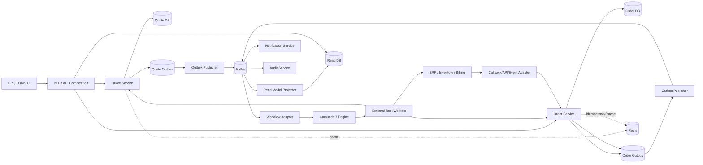
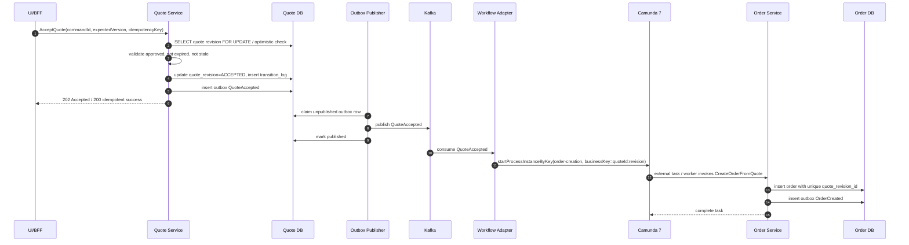
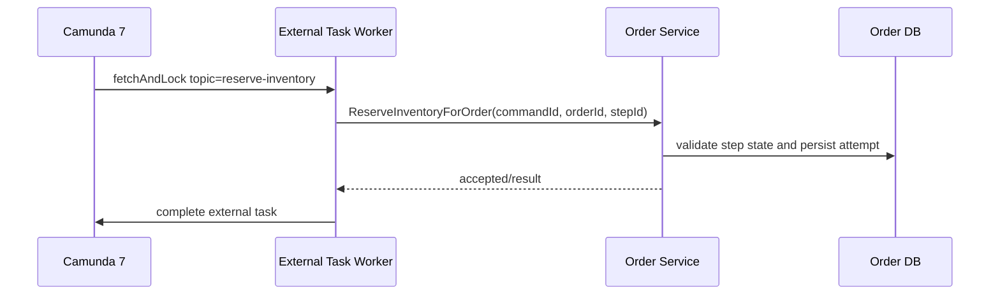
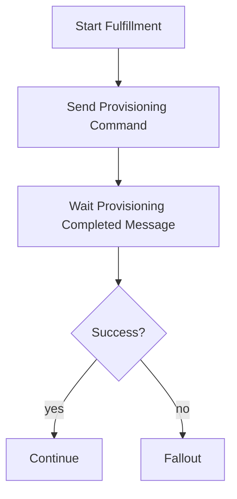
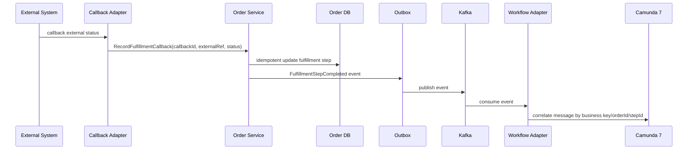

# Part 029 — Command, Event, and Workflow Consistency

Di part sebelumnya kita sudah membangun event architecture dan transactional outbox. Sekarang masalahnya naik satu level: **bagaimana command, event, dan workflow tetap konsisten ketika masing-masing punya jam, transaksi, dan mode kegagalan sendiri?**

Di sistem CPQ/OMS enterprise, inkonsistensi jarang muncul sebagai bug spektakuler. Ia muncul sebagai kasus operasional kecil:

- quote sudah diterima user, tetapi order belum pernah dibuat;
- order sudah dibuat, tetapi process instance Camunda gagal start;
- Kafka event sudah terkirim, tetapi read model belum update;
- Camunda sudah menunggu callback fulfillment, tetapi external system mengirim callback dua kali;
- approval task masih aktif, padahal quote revision sudah berubah;
- order status berubah menjadi `FULFILLING`, tetapi fulfillment step gagal tanpa incident yang bisa dicari;
- retry menghasilkan duplicate order, duplicate reservation, duplicate notification, atau duplicate invoice handoff.

Engineer biasa menyebut ini “eventual consistency”. Engineer yang matang bertanya: **eventual ke state apa, lewat mekanisme apa, dengan bukti apa, dan siapa yang memperbaiki kalau tidak pernah converge?**

Part ini membahas consistency architecture yang menyambungkan:

1. synchronous command di service domain;
2. PostgreSQL transaction sebagai source of truth;
3. Kafka event sebagai published business fact;
4. Camunda 7 sebagai long-running process coordinator;
5. Redis sebagai ephemeral accelerator, bukan authority;
6. reconciliation loop sebagai safety net.

Tujuannya bukan membuat distributed system menjadi “simple”. Tujuannya membuat kompleksitasnya **terlihat, terukur, dan bisa dipulihkan**.

---

## 1. Mental Model: Three Clocks Problem

CPQ/OMS punya tiga jenis waktu.

### 1.1 Command time

Command time adalah waktu ketika sistem menerima intent eksplisit:

- `ConfigureQuote`
- `PriceQuote`
- `SubmitQuoteForApproval`
- `ApproveQuote`
- `AcceptQuote`
- `CreateOrderFromQuote`
- `StartFulfillment`
- `CancelOrder`
- `RetryFulfillmentStep`

Command harus diproses secara deterministik berdasarkan current state, authorization, tenant, version, dan invariant.

Command time bersifat **synchronous dan transactional**. Ia harus menjawab:

> Apakah intent ini diterima sebagai perubahan state yang valid?

Jika command sukses, state authority berubah di PostgreSQL.

### 1.2 Event time

Event time adalah waktu ketika fakta bisnis yang sudah committed disiarkan ke dunia luar:

- `QuotePriced`
- `QuoteSubmittedForApproval`
- `QuoteApproved`
- `QuoteAccepted`
- `OrderCreated`
- `OrderFulfillmentStarted`
- `FulfillmentStepFailed`
- `OrderCompleted`

Event tidak boleh berarti “saya ingin melakukan sesuatu”. Event berarti:

> Sesuatu sudah terjadi dan sudah tercatat di source of truth.

Event time bersifat **asynchronous dan replayable**. Ia harus menjawab:

> Konsumen mana yang perlu tahu bahwa fakta ini sudah terjadi?

### 1.3 Workflow time

Workflow time adalah waktu proses panjang:

- approval menunggu manusia;
- fulfillment menunggu external system;
- cancellation menunggu compensation;
- SLA timer menunggu durasi tertentu;
- incident menunggu operator;
- callback menunggu event atau message correlation.

Workflow time bersifat **long-running dan partially observable**. Ia harus menjawab:

> Langkah proses bisnis mana yang sedang menunggu, selesai, gagal, atau perlu intervensi?

### 1.4 Masalah inti

Tiga waktu ini tidak pernah benar-benar sinkron.

Command bisa commit sebelum event publish. Event bisa sampai ke consumer sebelum process instance siap menunggu message. Workflow bisa retry setelah command sudah dianggap expired. Callback bisa datang setelah cancellation. User bisa edit quote saat approval task masih terbuka.

Karena itu desain enterprise harus dimulai dari aturan ini:

> Jangan mengandalkan timing. Andalkan identity, version, idempotency, invariant, dan reconciliation.

---

## 2. Core Principle: Authority Must Be Singular

Distributed architecture tidak berarti semua komponen berhak menentukan kebenaran.

Untuk setiap fakta bisnis, harus ada satu authority.

| Fakta | Authority | Bukan Authority |
|---|---|---|
| Quote revision current state | Quote Service PostgreSQL | Camunda variable, Kafka topic, Redis cache |
| Price result accepted for quote revision | Pricing/Quote persisted snapshot | Redis preview cache, frontend total |
| Approval decision | Approval/Quote domain table | Human task completion alone |
| Order lifecycle state | Order Service PostgreSQL | Camunda activity state alone |
| Fulfillment step state | Order/Fulfillment domain table | External callback raw payload alone |
| Process position | Camunda 7 engine DB | Domain order status alone |
| Published event status | Outbox table + publisher | Kafka consumer assumption |
| Read model state | Projection store | Primary command store |

Rule praktis:

> Camunda boleh mengorkestrasi proses, tetapi tidak boleh menjadi satu-satunya tempat menyimpan fakta domain yang harus diaudit secara bisnis.

Camunda process instance bisa mengatakan “sedang menunggu approval”. Tetapi apakah quote revision masih valid untuk approval harus dicek ke Quote Service.

Kafka bisa memberi tahu `QuoteApproved`. Tetapi apakah user boleh accept quote tetap dicek ke Quote Service.

Redis bisa menyimpan quote summary cache. Tetapi total harga final yang sah harus berasal dari persisted quote price snapshot.

---

## 3. Reference Consistency Architecture



Perhatikan arah authority:

- UI mengirim command ke domain service.
- Domain service commit ke DB sendiri.
- Domain service menulis outbox dalam transaksi yang sama.
- Publisher mengirim event ke Kafka.
- Consumer membangun read model, notification, workflow trigger, audit, dan integration side effect.
- Camunda worker memanggil command API domain service, bukan update DB langsung.
- External callback masuk kembali ke domain service sebagai command/idempotent message.

Arsitektur ini menolak dua shortcut berbahaya:

1. service langsung publish Kafka tanpa outbox setelah DB commit;
2. Camunda worker langsung mengubah tabel domain service.

---

## 4. Command, Event, Workflow: Jangan Dicampur

### 4.1 Command

Command adalah permintaan perubahan state.

Command harus memiliki:

```json
{
  "commandId": "cmd_01J...",
  "tenantId": "tenant_enterprise_a",
  "actorId": "user_123",
  "aggregateId": "quote_9001",
  "expectedVersion": 7,
  "reason": "customer accepted approved quote",
  "payload": {}
}
```

Command harus divalidasi terhadap:

- authentication;
- authorization;
- tenant scope;
- aggregate existence;
- aggregate state;
- expected version;
- idempotency key;
- business invariant;
- stale snapshot;
- duplicate side effect.

Command boleh gagal. Gagal command bukan event. Misalnya `AcceptQuote` gagal karena quote expired. Jangan publish `QuoteAcceptanceFailed` kecuali kegagalan itu sendiri adalah fakta bisnis yang perlu diaudit/ditindaklanjuti.

### 4.2 Event

Event adalah fakta setelah commit.

```json
{
  "eventId": "evt_01J...",
  "eventType": "QuoteAccepted",
  "tenantId": "tenant_enterprise_a",
  "aggregateType": "QUOTE",
  "aggregateId": "quote_9001",
  "aggregateVersion": 8,
  "occurredAt": "2026-07-02T10:15:30Z",
  "traceId": "trace_abc",
  "causationId": "cmd_01J...",
  "correlationId": "quote_9001",
  "schemaVersion": 1,
  "payload": {
    "quoteRevisionId": "qr_9001_004",
    "acceptedBy": "user_123"
  }
}
```

Event harus mengandung cukup identity untuk:

- deduplication;
- ordering per aggregate;
- replay;
- audit tracing;
- workflow correlation;
- read model update;
- debugging production.

Event tidak boleh membutuhkan join ke lima service hanya untuk tahu apa yang terjadi. Tetapi event juga tidak perlu membawa seluruh aggregate graph.

### 4.3 Workflow command/message

Workflow interaction berbeda dari event biasa.

Camunda bisa menerima:

- process start request;
- message correlation;
- external task completion;
- BPMN error;
- incident retry;
- variable update.

Semua interaction ke Camunda harus punya:

- stable business key;
- process definition key/version policy;
- idempotency record;
- correlation key;
- semantic meaning;
- retry policy;
- failure classification.

Jangan jadikan Camunda message sebagai event bus umum. Kafka untuk broadcast facts. Camunda message untuk melanjutkan process instance tertentu atau memulai process tertentu.

---

## 5. Consistency Contract

Sebuah use case enterprise harus punya consistency contract eksplisit.

Contoh: `AcceptQuote`.

| Layer | Contract |
|---|---|
| API | `POST /quotes/{quoteId}/revisions/{revisionId}/accept` idempotent by `Idempotency-Key` |
| Domain | Quote must be `APPROVED`, not expired, price snapshot fresh, document generated or marked not required |
| DB | Transition quote revision to `ACCEPTED`, increment version, write transition log, write outbox `QuoteAccepted` |
| Event | Publish `QuoteAccepted` ordered by `quoteId` |
| Workflow | Start order creation workflow or trigger workflow adapter to call Order Service |
| Order | `CreateOrderFromQuote` command must be idempotent by quote revision id |
| Read model | Quote appears accepted; order link eventually appears |
| Reconciliation | If quote accepted but no order exists after threshold, raise operational exception |

Ini adalah bentuk berpikir yang dibutuhkan di sistem besar.

Bukan “saat event diterima, create order”. Terlalu dangkal.

Yang benar:

> Bila quote accepted sudah committed, sistem harus eventually memiliki order tepat satu untuk quote revision tersebut, atau menghasilkan exception yang bisa dilihat dan dipulihkan.

Itu consistency contract.

---

## 6. Example: Accept Quote to Create Order



Ada beberapa pagar penting:

1. Quote acceptance tidak menunggu order selesai.
2. Order creation idempotent berdasarkan `sourceQuoteRevisionId`.
3. Order table punya unique constraint terhadap accepted quote revision.
4. Workflow business key memakai identity bisnis, bukan random technical id.
5. Jika process start berhasil tetapi external task gagal, incident terlihat di Camunda.
6. Jika event consumed dua kali, order tetap satu.
7. Jika workflow adapter down, Kafka replay/consumer retry bisa catch up.
8. Jika Camunda start berhasil tetapi response timeout, adapter perlu idempotency/correlation query.

---

## 7. State Convergence, Not Wishful Eventual Consistency

Eventual consistency tidak boleh berarti “semoga nanti benar”. Harus ada target convergence.

### 7.1 Convergence invariant

Contoh invariant:

```text
For every accepted quote revision,
there must eventually be exactly one order,
or one unresolved operational exception explaining why order creation cannot proceed.
```

Invariant ini bisa dites dan dimonitor.

### 7.2 Convergence query

```sql
select
  qr.quote_revision_id,
  qr.quote_id,
  qr.accepted_at,
  o.order_id,
  oe.exception_id
from quote_revision qr
left join customer_order o
  on o.source_quote_revision_id = qr.quote_revision_id
left join operational_exception oe
  on oe.aggregate_type = 'QUOTE_REVISION'
 and oe.aggregate_id = qr.quote_revision_id
 and oe.exception_type = 'ORDER_CREATION_MISSING'
 and oe.status in ('OPEN', 'IN_PROGRESS')
where qr.state = 'ACCEPTED'
  and qr.accepted_at < now() - interval '10 minutes'
  and o.order_id is null
  and oe.exception_id is null;
```

Jika query ini mengembalikan row, sistem tidak converged.

### 7.3 Reconciliation command

Reconciliation tidak boleh langsung update state sembarangan. Ia harus menghasilkan command:

```text
ReconcileAcceptedQuoteWithoutOrder(quoteRevisionId)
```

Command ini bisa:

- retry start workflow;
- call Order Service idempotently;
- create operational exception;
- mark process correlation issue;
- notify operator.

Reconciliation adalah bagian dari desain, bukan script darurat.

---

## 8. Command Processing Algorithm

Command handler enterprise biasanya mengikuti struktur ini:

```java
public CommandResult acceptQuote(AcceptQuoteCommand command) {
    RequestContext ctx = contextResolver.resolve(command);

    authorization.require(ctx, Permission.ACCEPT_QUOTE, command.quoteId());

    IdempotencyResult existing = idempotencyStore.find(command.idempotencyKey(), ctx.tenantId());
    if (existing.isCompleted()) {
        return existing.toCommandResult();
    }

    return transaction.inRequired(() -> {
        QuoteRevision quote = quoteRepository.getRevisionForUpdate(
            ctx.tenantId(),
            command.quoteId(),
            command.revisionId()
        );

        quote.requireVersion(command.expectedVersion());
        quote.accept(ctx.actorId(), command.reason(), clock.now());

        quoteRepository.save(quote);

        transitionLog.append(quote.transitionEvidence());

        outbox.append(DomainEvent.quoteAccepted(
            ctx.tenantId(),
            quote.quoteId(),
            quote.revisionId(),
            quote.version(),
            command.commandId(),
            ctx.traceId()
        ));

        CommandResult result = CommandResult.accepted(quote.version());
        idempotencyStore.markCompleted(command.idempotencyKey(), result);
        return result;
    });
}
```

Poin penting:

- authorization sebelum mutasi;
- idempotency sebelum transaksi atau di dalam transaksi dengan unique key;
- aggregate loaded dengan version/concurrency control;
- domain method menjaga invariant;
- transition log dan outbox berada dalam transaksi yang sama;
- command result disimpan untuk replay request;
- tidak ada Kafka publish langsung dari command handler.

---

## 9. Event Consumer Algorithm

Consumer juga harus deterministic dan idempotent.

```java
public void onQuoteAccepted(EventEnvelope<QuoteAcceptedPayload> event) {
    if (processedEventStore.alreadyProcessed(event.eventId(), consumerName)) {
        return;
    }

    transaction.inRequired(() -> {
        processedEventStore.markProcessing(event.eventId(), consumerName);

        QuoteAcceptedPayload payload = event.payload();

        workflowStarter.startOrderCreationIfAbsent(
            event.tenantId(),
            payload.quoteRevisionId(),
            event.correlationId(),
            event.eventId()
        );

        processedEventStore.markProcessed(event.eventId(), consumerName);
    });
}
```

Idempotency consumer tidak cukup hanya “Kafka offset committed”. Offset menjawab posisi consumer dalam topic, bukan apakah side effect domain sudah terjadi.

Untuk side effect penting, simpan processed event record atau gunakan unique business constraint.

---

## 10. Workflow Starter Idempotency

Start process instance harus aman terhadap retry.

Desain sederhana:

```sql
create table workflow_correlation (
  workflow_correlation_id uuid primary key,
  tenant_id text not null,
  business_key text not null,
  process_definition_key text not null,
  process_instance_id text,
  source_event_id uuid not null,
  status text not null,
  created_at timestamptz not null,
  updated_at timestamptz not null,
  unique (tenant_id, process_definition_key, business_key)
);
```

Algorithm:

```text
startOrderCreationIfAbsent(tenantId, quoteRevisionId):
  businessKey = "order-creation:" + quoteRevisionId

  try insert workflow_correlation(status=STARTING)
    if duplicate:
      load existing
      if processInstanceId exists: return existing
      if status STARTING too old: attempt recovery
      return

  call Camunda startProcessInstanceByKey(processDefinitionKey, businessKey, variables)

  update workflow_correlation processInstanceId, status=STARTED
```

Problem tersulit: call ke Camunda sukses, tetapi response timeout sebelum DB correlation update.

Recovery strategy:

1. query Camunda by business key;
2. jika process instance ditemukan, update correlation table;
3. jika tidak ditemukan, retry start;
4. jika ambiguous terlalu lama, create operational exception.

Jangan menganggap timeout berarti gagal. Timeout berarti unknown.

---

## 11. Business Key and Correlation Key

Camunda 7 mendukung business key untuk mengaitkan process instance dengan identifier bisnis yang bermakna. Dalam CPQ/OMS, business key harus stabil dan domain-oriented.

Contoh:

| Workflow | Business Key |
|---|---|
| Quote approval | `quote-approval:{quoteRevisionId}` |
| Order creation | `order-creation:{quoteRevisionId}` |
| Order fulfillment | `order-fulfillment:{orderId}` |
| Cancellation | `order-cancellation:{orderId}:{cancelRequestId}` |
| Compensation | `order-compensation:{orderId}:{compensationPlanId}` |

Jangan gunakan:

- Camunda process instance id sebagai external business identity;
- Kafka offset sebagai correlation id;
- frontend request id sebagai long-term workflow identity;
- random UUID tanpa domain meaning untuk workflow yang perlu dicari operator.

Untuk message correlation, pakai identity yang bisa direkonstruksi oleh callback adapter.

Contoh external fulfillment callback:

```json
{
  "tenantId": "tenant_a",
  "externalOrderRef": "erp-991",
  "fulfillmentStepId": "step_123",
  "externalStatus": "COMPLETED",
  "callbackId": "cb_abc"
}
```

Callback adapter harus memetakan `externalOrderRef` atau `fulfillmentStepId` ke `orderId` dan process business key. Jangan meminta external system mengirim Camunda process instance id.

---

## 12. Camunda Variables Are Not Domain State

Camunda variables berguna untuk routing process, tetapi buruk sebagai source of truth domain.

### 12.1 Variable yang aman

```json
{
  "tenantId": "tenant_a",
  "orderId": "ord_9001",
  "quoteRevisionId": "qr_9001_004",
  "fulfillmentPlanId": "fp_100",
  "orderVersion": 3,
  "riskTier": "HIGH"
}
```

Variable ini kecil, stabil, dan membantu workflow routing.

### 12.2 Variable yang berbahaya

```json
{
  "entireQuote": { "...": "huge nested object" },
  "entireCatalog": { "...": "versioned catalog payload" },
  "priceCalculationTrace": ["thousands", "of", "items"],
  "customerSensitiveData": { "...": "PII" }
}
```

Masalahnya:

- data bisa stale;
- audit domain tersebar;
- process migration sulit;
- Camunda DB membengkak;
- sensitive data exposure meningkat;
- model domain dan model workflow menjadi coupling.

Rule:

> Simpan identifier dan routing facts di Camunda. Simpan business truth di domain service.

---

## 13. Pattern: Process Sends Command to Domain Service

Camunda external task worker tidak boleh “melakukan fulfillment dengan mengubah DB langsung”. Ia harus mengirim command ke service owner.



Kenapa?

Karena hanya Order Service yang tahu:

- apakah order masih aktif;
- apakah step sudah cancelled;
- apakah retry masih boleh;
- apakah fulfillment attempt duplicate;
- apakah tenant/authorization valid;
- apakah compensation sudah dimulai.

External task worker adalah adapter, bukan owner business invariant.

---

## 14. Pattern: Domain Event Triggers Workflow

Tidak semua event harus trigger workflow. Tetapi beberapa event menjadi process trigger.

| Event | Workflow reaction |
|---|---|
| `QuoteSubmittedForApproval` | Start quote approval process |
| `QuoteAccepted` | Start order creation process |
| `OrderCreated` | Start order fulfillment process |
| `FulfillmentStepFailed` | Start fallout process or correlate error boundary |
| `CancellationRequested` | Start cancellation process |
| `CompensationPlanCreated` | Start compensation process |

Event-triggered workflow harus idempotent. Jika event replay, workflow tidak boleh dobel.

Workflow starter harus punya unique key:

```text
tenantId + processDefinitionKey + businessKey
```

---

## 15. Pattern: Workflow Waits for Domain Event

Kadang process menunggu event dari domain service atau external adapter.

Contoh order fulfillment:



Jangan langsung correlate ke Camunda dari external system tanpa domain validation.

Better flow:



Kenapa lebih panjang?

Karena external callback adalah untrusted input. Ia harus melewati domain invariant, idempotency, audit, dan state transition sebelum workflow dilanjutkan.

---

## 16. Stale Events and Aggregate Versions

Kafka preserves ordering only within partition. Jika partition key adalah aggregate id, event untuk aggregate yang sama bisa diproses berurutan oleh consumer group tertentu. Tetapi consumer masih harus defensif.

Gunakan `aggregateVersion`.

Projection update:

```sql
update quote_read_model
set
  state = :new_state,
  version = :event_version,
  updated_at = :occurred_at
where tenant_id = :tenant_id
  and quote_id = :quote_id
  and version < :event_version;
```

Jika event lama datang setelah event baru, update tidak berlaku.

Untuk consumer yang butuh strict sequence:

```text
if event.version == currentVersion + 1:
  apply
else if event.version <= currentVersion:
  duplicate/stale, ignore
else:
  gap detected, pause/retry/rebuild aggregate projection
```

Jangan diam-diam apply event dengan version lompat jika projection membutuhkan completeness.

---

## 17. Race Conditions You Must Design For

### 17.1 Quote accepted twice

Penyebab:

- user double click;
- retry client;
- network timeout;
- BFF retry;
- duplicate command from integration.

Protection:

- idempotency key;
- quote revision state transition guard;
- optimistic version;
- unique order by quote revision;
- idempotent workflow starter.

### 17.2 Approval completes after quote was revised

Penyebab:

- approver membuka task lama;
- sales user membuat revision baru;
- tasklist tidak refresh;
- process masih aktif untuk old revision.

Protection:

- approval task carries `quoteRevisionId`;
- domain service validates revision is still approval candidate;
- completion command checks expected version;
- old workflow cancelled or marked obsolete;
- approval decision tied to revision, not quote root.

### 17.3 Callback arrives after cancellation

Penyebab:

- external provisioning slow;
- order cancelled while external work in-flight;
- callback delivered late.

Protection:

- callback recorded idempotently;
- domain state machine rejects invalid transition or records late callback;
- compensation workflow decides next step;
- no direct Camunda correlation before domain validation.

### 17.4 Workflow retries command already succeeded

Penyebab:

- external task worker timeout after service call;
- Camunda task not completed;
- worker crashes after command success before complete.

Protection:

- command idempotency based on workflow task id or step id;
- domain service returns prior result;
- worker then completes Camunda task;
- reconciliation detects task stuck although domain step completed.

### 17.5 Event published but consumer side effect partially failed

Penyebab:

- consumer starts Camunda but fails before marking processed;
- notification sent but processed_event insert failed;
- projection DB down.

Protection:

- consumer side effects idempotent;
- processed event table transaction around local side effect;
- unique business constraints;
- retry/DLQ;
- reconciliation.

---

## 18. Workflow and Event: Which One Should Drive?

Ada dua model umum.

### 18.1 Workflow-driven

Camunda process explicitly calls services in sequence.

Good for:

- order fulfillment;
- compensation;
- cancellation;
- human task-heavy processes;
- SLA and escalation;
- long-running orchestration with visibility.

Risk:

- process becomes god object;
- variables become domain state;
- service autonomy decreases;
- process model too detailed.

### 18.2 Event-driven

Services react to events and progress independently.

Good for:

- read model projection;
- notification;
- analytics;
- audit;
- loose integration;
- downstream enrichment.

Risk:

- hidden process;
- hard to know current business progress;
- cascading failures invisible;
- compensation harder.

### 18.3 Hybrid rule

Use workflow when the business needs visible long-running coordination.

Use event-driven when downstream reactions are optional, independent, or naturally asynchronous.

For CPQ/OMS:

| Capability | Preferred driver |
|---|---|
| Quote read model | Event-driven |
| Quote approval | Workflow-driven + domain validation |
| Order creation from accepted quote | Event-triggered workflow + idempotent command |
| Order fulfillment | Workflow-driven |
| Notification | Event-driven |
| Audit | Event-driven + domain transition log |
| Compensation | Workflow-driven |
| Search indexing | Event-driven |
| Billing handoff | Workflow-driven if contractual, event-driven if informational |

---

## 19. Inbox Pattern for Consumers

Outbox handles producer consistency. Inbox handles consumer side-effect consistency.

```sql
create table consumer_inbox (
  consumer_name text not null,
  event_id uuid not null,
  tenant_id text not null,
  event_type text not null,
  aggregate_type text not null,
  aggregate_id text not null,
  aggregate_version bigint not null,
  status text not null,
  received_at timestamptz not null,
  processed_at timestamptz,
  error_code text,
  error_message text,
  primary key (consumer_name, event_id)
);
```

Processing:

```text
begin transaction
  insert inbox row status=PROCESSING
  perform local side effect
  mark inbox PROCESSED
commit
commit Kafka offset after local transaction success
```

Jika consumer crash setelah local transaction commit but before Kafka offset commit, Kafka redelivers. Inbox prevents duplicate side effect.

Jika consumer crash before local transaction commit, no side effect persists, retry is safe.

---

## 20. Idempotency Domains

Idempotency bukan satu tabel global untuk semua hal. Ada beberapa domain idempotency.

| Domain | Key | Purpose |
|---|---|---|
| API command | `tenantId + idempotencyKey + route` | Prevent duplicate client command result |
| Aggregate transition | `aggregateId + expectedVersion + commandType` | Prevent invalid double transition |
| Order from quote | `tenantId + sourceQuoteRevisionId` | Ensure one order per accepted quote revision |
| Workflow start | `tenantId + processDefinitionKey + businessKey` | Prevent duplicate process instance |
| External callback | `tenantId + externalSystem + callbackId` | Prevent duplicate callback handling |
| Event consumer | `consumerName + eventId` | Prevent duplicate side effect |
| Notification | `tenantId + notificationType + businessObjectId + templateVersion` | Prevent duplicate notification |
| Fulfillment step attempt | `tenantId + stepId + attemptNo` | Separate retry attempts from duplicate request |

Idempotency key harus sesuai business meaning. Jika terlalu luas, legitimate retry terblokir. Jika terlalu sempit, duplicate lolos.

---

## 21. When to Use Synchronous Calls vs Events

### 21.1 Synchronous call cocok jika caller butuh jawaban untuk melanjutkan command

Contoh:

- Quote Service memanggil Pricing Service untuk price preview/final price.
- Order Service memanggil Quote Service untuk validate quote acceptance saat create order.
- BFF memanggil Search Service untuk load dashboard.

Tetapi hati-hati: synchronous dependency masuk ke availability path.

### 21.2 Event cocok jika consumer tidak perlu menjawab command asal

Contoh:

- search projection;
- notification;
- audit enrichment;
- workflow start setelah accepted quote;
- downstream CRM update.

### 21.3 Workflow cocok jika ada business process long-running

Contoh:

- order fulfillment;
- approval;
- cancellation;
- compensation;
- fallout management.

Decision rule:

```text
Does the command need the result now?
  yes -> synchronous call, with timeout and fallback rule
  no -> event

Does the reaction represent visible long-running business progress?
  yes -> workflow
  no -> normal event consumer
```

---

## 22. Timeout Is Not Failure

Ini prinsip yang sangat penting.

Jika service A memanggil service B dan timeout, service A tidak tahu apakah B:

- tidak pernah menerima request;
- menerima request tapi gagal sebelum commit;
- menerima request dan sukses commit;
- menerima request, sukses commit, tapi response hilang;
- masih memproses.

Jadi timeout adalah **unknown outcome**.

Cara benar:

1. command ke B harus idempotent;
2. A menyimpan attempt/correlation;
3. A retry dengan idempotency key yang sama;
4. B mengembalikan prior result jika sudah sukses;
5. jika masih ambiguous, reconciliation.

Jangan menulis code seperti:

```java
try {
    orderClient.createOrder(request);
} catch (TimeoutException e) {
    markOrderCreationFailed(); // wrong: outcome unknown
}
```

Better:

```java
try {
    orderClient.createOrder(request);
    markAttemptSucceeded();
} catch (TimeoutException e) {
    markAttemptUnknown();
    scheduleReconciliation();
}
```

---

## 23. Consistency Matrix for CPQ/OMS

| Scenario | Authority | Async reaction | Required safety net |
|---|---|---|---|
| Quote configured | Quote Service | read model, price preview invalidation | stale cache invalidation |
| Quote priced | Pricing/Quote snapshot | approval eligibility, read model | price trace reproducibility |
| Quote submitted | Quote Service | start approval process | obsolete workflow cancellation |
| Quote approved | Quote/Approval | document generation, notification | approval freshness check |
| Quote accepted | Quote Service | order creation workflow | accepted quote without order reconciliation |
| Order created | Order Service | fulfillment workflow, search projection | duplicate prevention by quote revision |
| Fulfillment started | Order Service | external tasks | stuck step monitor |
| Fulfillment callback | Order Service | workflow correlation | duplicate/late callback handling |
| Step failed | Order Service | fallout process | incident + operational exception |
| Order cancelled | Order Service | compensation | late callback reconciliation |
| Compensation completed | Order Service | audit/read model | partial compensation exception |

---

## 24. Database Constraints as Consistency Allies

Application logic is not enough. Use database constraints for invariants that must never be violated.

Examples:

```sql
alter table customer_order
add constraint uq_order_source_quote_revision
unique (tenant_id, source_quote_revision_id);
```

```sql
create unique index uq_active_quote_approval_process
on workflow_correlation (tenant_id, business_key, process_definition_key)
where status in ('STARTING', 'STARTED');
```

```sql
alter table consumer_inbox
add constraint ck_consumer_inbox_status
check (status in ('PROCESSING', 'PROCESSED', 'FAILED'));
```

```sql
alter table fulfillment_callback
add constraint uq_external_callback
unique (tenant_id, external_system, external_callback_id);
```

Constraint is not “just DB detail”. It is the last line of defense when retries, duplicate messages, and human operations collide.

---

## 25. Read Model Consistency

Read model harus jujur tentang staleness.

Jangan tampilkan dashboard seolah-olah projection selalu real-time.

Tambahkan metadata:

```json
{
  "quoteId": "quote_9001",
  "state": "ACCEPTED",
  "latestOrderId": "ord_777",
  "projectionVersion": 8,
  "lastEventId": "evt_abc",
  "projectedAt": "2026-07-02T10:16:02Z"
}
```

Untuk UI enterprise, sering lebih baik menampilkan:

```text
Quote accepted. Order creation is in progress.
Last updated 12 seconds ago.
```

daripada memalsukan synchronous consistency.

### 25.1 Command result should not depend on read model

Setelah command sukses, API command response bisa mengembalikan authoritative result dari command store.

Jangan langsung membaca projection yang mungkin belum update.

Wrong:

```text
AcceptQuote -> write Quote DB -> publish event -> immediately read Quote Search Projection -> return projection
```

Better:

```text
AcceptQuote -> write Quote DB -> return command result from transaction
```

Projection catch-up untuk halaman list/search.

---

## 26. Workflow Read Model

Camunda history bagus untuk process analysis, tetapi aplikasi CPQ/OMS butuh operational read model sendiri.

Contoh `order_workflow_status_view`:

| Field | Meaning |
|---|---|
| `order_id` | Domain order id |
| `process_instance_id` | Camunda process instance id |
| `business_key` | Stable workflow key |
| `current_stage` | Business-friendly stage |
| `current_wait_reason` | `WAITING_EXTERNAL_CALLBACK`, `WAITING_HUMAN_REVIEW`, etc |
| `incident_count` | Active incident count |
| `last_task_name` | Last known task/activity |
| `last_updated_at` | Projection timestamp |

UI operator tidak seharusnya membutuhkan akses langsung ke Camunda internal schema.

---

## 27. Reconciliation Architecture

Reconciliation terdiri dari tiga jenis.

### 27.1 Intra-service reconciliation

Mencari state internal yang tidak masuk akal.

Contoh:

- quote accepted tanpa transition log;
- outbox stuck `PENDING` terlalu lama;
- order `FULFILLING` tanpa active fulfillment step;
- idempotency record `PROCESSING` terlalu lama.

### 27.2 Cross-service reconciliation

Mencari divergence antar-service.

Contoh:

- quote accepted tetapi order missing;
- order created tetapi fulfillment workflow missing;
- order completed tetapi billing handoff missing;
- cancellation completed tetapi compensation incomplete.

### 27.3 External reconciliation

Mencari divergence dengan external system.

Contoh:

- ERP says provisioned, OMS says pending;
- inventory hold expired externally, OMS says reserved;
- billing account created, OMS callback missing.

### 27.4 Reconciliation output

Jangan hanya log.

Output harus berupa:

- command retry;
- operational exception;
- incident;
- dashboard item;
- metric;
- audit record.

---

## 28. Operational Exception Model

Operational exception adalah domain object untuk work yang gagal converge.

```sql
create table operational_exception (
  exception_id uuid primary key,
  tenant_id text not null,
  aggregate_type text not null,
  aggregate_id text not null,
  exception_type text not null,
  severity text not null,
  status text not null,
  detected_at timestamptz not null,
  detected_by text not null,
  summary text not null,
  evidence jsonb not null,
  assigned_group text,
  resolved_at timestamptz,
  resolution_code text,
  resolution_note text
);
```

Examples:

- `ACCEPTED_QUOTE_WITHOUT_ORDER`
- `ORDER_WITHOUT_FULFILLMENT_PROCESS`
- `FULFILLMENT_CALLBACK_UNKNOWN_OUTCOME`
- `CAMUNDA_PROCESS_START_AMBIGUOUS`
- `OUTBOX_EVENT_STUCK`
- `PROJECTION_LAG_EXCEEDED`

Operational exception is how distributed consistency becomes manageable by humans.

---

## 29. Observability: IDs That Must Flow

Every command/event/workflow should carry:

| ID | Purpose |
|---|---|
| `traceId` | technical tracing across HTTP/Kafka/workers |
| `correlationId` | business journey correlation |
| `causationId` | command/event that caused this event |
| `commandId` | idempotent command identity |
| `eventId` | event identity |
| `aggregateId` | domain object identity |
| `aggregateVersion` | ordering/staleness guard |
| `processInstanceId` | Camunda technical process instance |
| `businessKey` | Camunda business identity |
| `tenantId` | segmentation and authorization |
| `actorId` | human/system actor |

If production incident happens and these IDs are missing, debugging becomes archaeology.

---

## 30. Anti-Patterns

### 30.1 Event as command

Bad:

```text
OrderService consumes QuoteAccepted and assumes it must create order.
```

Better:

```text
QuoteAccepted triggers CreateOrderFromQuote command through workflow or order adapter. Order Service validates idempotency and invariant.
```

### 30.2 Camunda as database

Bad:

```text
Store full order state in process variables and query Camunda as OMS.
```

Better:

```text
Store order state in Order Service. Use Camunda for process progress and wait states.
```

### 30.3 Kafka as source of truth for current state

Bad:

```text
To know quote status, replay topic from beginning every time.
```

Better:

```text
Quote Service DB owns current state. Kafka supports integration and projection.
```

### 30.4 Redis as consistency lock for money/order correctness

Bad:

```text
Use Redis lock as the only protection against duplicate order creation.
```

Better:

```text
Use database unique constraint and idempotent command. Redis can reduce contention but cannot be the sole authority.
```

### 30.5 No reconciliation because “Kafka retries”

Kafka retry helps delivery. It does not prove business convergence.

---

## 31. Test Strategy

### 31.1 Command consistency tests

Test:

- invalid transition rejected;
- expected version mismatch rejected;
- duplicate idempotency key returns same result;
- outbox row created in same transaction;
- failure rolls back state and outbox;
- authorization prevents cross-tenant command.

### 31.2 Event consumer tests

Test:

- duplicate event ignored;
- stale version ignored;
- version gap detected;
- side effect idempotent;
- consumer crash simulation;
- DLQ path.

### 31.3 Workflow consistency tests

Test:

- duplicate workflow start returns existing correlation;
- process start timeout treated as unknown;
- business key query recovers ambiguous start;
- external task retry calls idempotent domain command;
- BPMN error maps to domain fallout;
- message correlation late/duplicate handled.

### 31.4 Reconciliation tests

Test:

- accepted quote without order detected;
- order without workflow detected;
- stuck fulfillment step detected;
- outbox stuck detected;
- projection lag detected;
- operational exception deduplicated.

---

## 32. Production Checklist

Before shipping any CPQ/OMS flow, answer these:

- What is the source of truth for every state transition?
- What command changes the state?
- What invariant does the command enforce?
- What event is emitted after commit?
- Is the event generated from outbox in same transaction?
- What partition key preserves required ordering?
- Is the consumer idempotent?
- Does the event carry aggregate version?
- Does the workflow have stable business key?
- Can workflow start be retried safely?
- What happens if Camunda call times out?
- What happens if worker succeeds domain command but fails task completion?
- What happens if callback arrives twice?
- What happens if callback arrives after cancellation?
- What query proves convergence?
- What operational exception is created if convergence fails?
- What dashboard shows stuck state?
- What runbook fixes it?

Jika pertanyaan ini tidak bisa dijawab, sistem belum enterprise-grade.

---

## 33. Minimal Reference Implementation Plan

Untuk repository seri ini, implementasi bertahapnya bisa seperti ini:

```text
module: quote-service
  - AcceptQuoteCommandHandler
  - QuoteRevision aggregate
  - TransitionLogRepository
  - OutboxRepository
  - IdempotencyRepository

module: order-service
  - CreateOrderFromQuoteCommandHandler
  - Order aggregate
  - FulfillmentStep aggregate/entity
  - ExternalCallbackCommandHandler
  - OperationalExceptionRepository

module: workflow-adapter
  - QuoteAcceptedConsumer
  - OrderCreatedConsumer
  - WorkflowCorrelationRepository
  - CamundaProcessStarter
  - CamundaMessageCorrelator

module: eventing
  - EventEnvelope
  - OutboxPublisher
  - ConsumerInbox

module: reconciliation
  - AcceptedQuoteWithoutOrderJob
  - OrderWithoutWorkflowJob
  - StuckFulfillmentStepJob
```

Ini bukan layering teknis belaka. Ini adalah shape dari consistency architecture.

---

## 34. Summary

Command, event, dan workflow tidak boleh dicampur.

- Command adalah intent untuk mengubah state.
- Event adalah fakta setelah commit.
- Workflow adalah koordinasi long-running.
- PostgreSQL domain DB adalah source of truth untuk domain state.
- Outbox menyambungkan DB commit ke Kafka publish.
- Inbox/idempotency menyambungkan Kafka consume ke side effect.
- Camunda mengorkestrasi proses, bukan menggantikan domain model.
- Business key dan correlation key harus stabil dan bermakna.
- Timeout berarti unknown, bukan failure.
- Eventual consistency butuh target convergence dan reconciliation.

Top 1% engineering dalam CPQ/OMS bukan sekadar bisa menggambar microservices. Yang membedakan adalah kemampuan menjawab:

> Saat semua komponen retry, timeout, duplicate, crash, dan recover dalam urutan yang tidak ideal, invariant bisnis mana yang tetap benar?

Itu inti part ini.

---

## References

- Apache Kafka Documentation — https://kafka.apache.org/documentation/
- Camunda 7 RuntimeService Javadocs, business key usage — https://docs.camunda.org/javadoc/camunda-bpm-platform/7.3/org/camunda/bpm/engine/RuntimeService.html
- Camunda 7 MessageCorrelationBuilder Javadocs — https://docs.camunda.org/javadoc/camunda-bpm-platform/7.19/org/camunda/bpm/engine/runtime/MessageCorrelationBuilder.html
- Camunda 7 ExternalTaskService Javadocs — https://docs.camunda.org/javadoc/camunda-bpm-platform/7.15/org/camunda/bpm/client/task/ExternalTaskService.html
- Debezium Outbox Event Router — https://debezium.io/documentation/reference/stable/transformations/outbox-event-router.html
