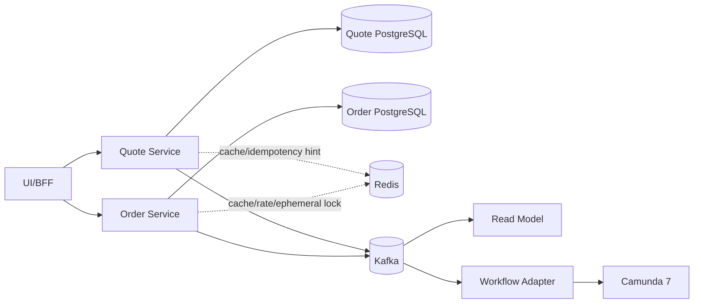
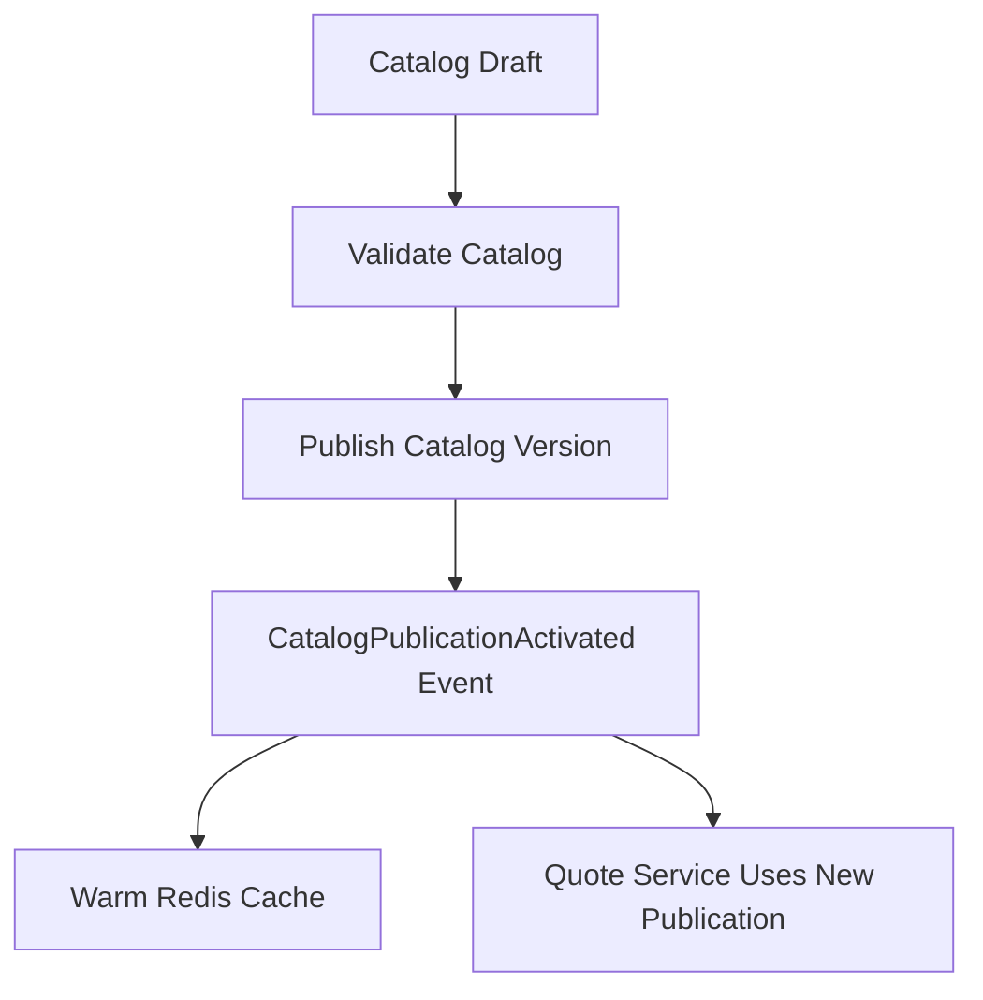
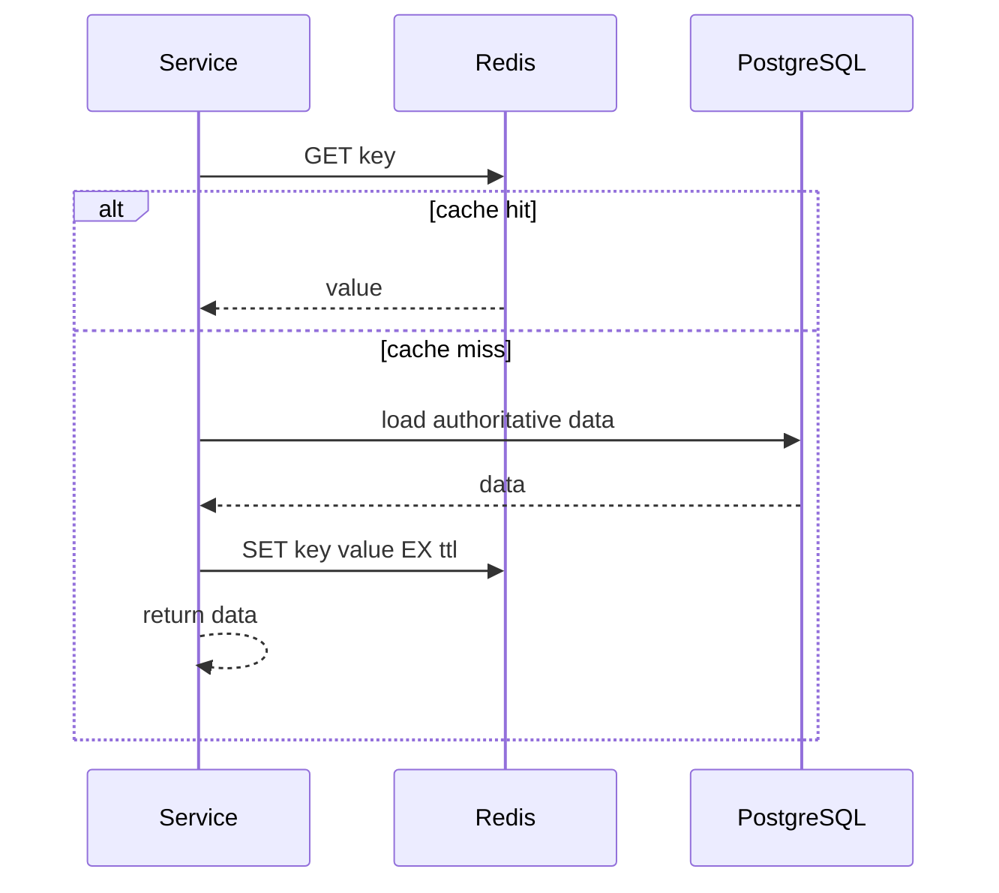

# Part 030 — Redis Usage Boundaries in Enterprise CPQ

Redis sangat menggoda. Cepat, sederhana, fleksibel, dan bisa dipakai untuk banyak hal: cache, session, rate limit, lock, queue, counter, stream, pub/sub, leaderboard, deduplication, dan sebagainya.

Justru karena itu Redis berbahaya di sistem CPQ/OMS enterprise.

CPQ/OMS memuat fakta bisnis bernilai tinggi:

- quote yang sudah disetujui;
- harga yang harus bisa dibuktikan;
- approval authority;
- order obligation;
- fulfillment state;
- compensation evidence;
- audit trail.

Jika Redis dipakai sebagai source of truth untuk fakta tersebut, desainnya rapuh. Redis boleh mempercepat, mengurangi load, menyimpan ephemeral state, dan membantu koordinasi ringan. Tetapi Redis tidak boleh menjadi satu-satunya penjaga kebenaran bisnis.

Rule utama part ini:

> Redis is an accelerator, not the authority.

Kita akan membahas batas penggunaan Redis secara konkret dalam enterprise CPQ/OMS.

---

## 1. Redis Position in the Architecture



Redis duduk di sisi service sebagai performance and coordination helper.

Yang boleh disimpan di Redis:

- cached product catalog snapshot;
- cached eligibility result;
- cached price preview;
- cache for read model fragments;
- rate limit counters;
- ephemeral idempotency fast-path;
- short-lived distributed lock untuk mengurangi duplicate work;
- session-like UI workflow state yang tidak authoritative;
- background job throttle;
- temporary calculation artifact yang bisa direcompute;
- negative cache untuk missing lookup;
- lightweight pub/sub untuk best-effort local invalidation, bukan critical business event.

Yang tidak boleh hanya di Redis:

- accepted quote state;
- final approved price evidence;
- approval decision;
- order state;
- fulfillment result;
- compensation outcome;
- audit trail;
- outbox event;
- legal document record;
- invoice handoff state;
- tenant security boundary.

Redis boleh punya copy. PostgreSQL/domain service tetap authority.

---

## 2. Redis Use Case Matrix for CPQ/OMS

| Use Case | Redis Fit | Source of Truth | Notes |
|---|---:|---|---|
| Product catalog cache | Strong | Catalog DB | TTL + versioned invalidation |
| Eligibility result cache | Strong | Catalog/Policy service | Key must include policy/catalog version |
| Price preview cache | Medium | Pricing/Quote DB for final price | Preview can be stale; final price cannot |
| Final quote price | Weak as authority | Quote/Pricing DB | Redis may cache display result only |
| API rate limit | Strong | Redis | Best-effort or strict depending design |
| Idempotency fast-path | Medium | PostgreSQL for critical command | Redis can reduce duplicate load |
| Distributed lock | Medium/Weak | DB constraints | Use as optimization, not correctness anchor |
| Work queue | Weak for critical domain | Kafka/Camunda/DB | Redis Streams may fit local processing, not cross-domain durable facts |
| Pub/Sub invalidation | Medium | Event/outbox/Kafka | Pub/Sub at-most-once, not business event transport |
| Session/token cache | Strong | Auth provider/session DB depending architecture | TTL discipline required |
| Search result cache | Medium | Search/read DB | Staleness must be visible |
| Quote editing draft buffer | Medium | Quote DB when saved | Dangerous if user assumes saved |
| Counter/metrics | Strong | Metrics system for long-term | Good for real-time counters |

---

## 3. Catalog Cache

Product catalog is read-heavy and versioned. Redis is a good fit.

But the key must include version.

Bad key:

```text
catalog:offering:internet-1gb
```

Better key:

```text
catalog:{tenantId}:publication:{publicationId}:offering:{offeringId}
```

Best practice:

- include tenant;
- include catalog publication id/version;
- include market/segment if relevant;
- include locale/currency if rendering matters;
- use TTL;
- invalidate on publication event;
- never mutate cached object in place;
- treat cache miss as normal path.

### 3.1 Catalog publication model



A quote must reference the publication used during configuration/pricing:

```json
{
  "quoteRevisionId": "qr_123",
  "catalogPublicationId": "catpub_2026_07_01",
  "configuredAt": "2026-07-02T10:00:00Z"
}
```

Jika Redis cache hilang, quote masih bisa dibuktikan dari snapshot di DB.

---

## 4. Pricing Cache: Preview vs Final

Pricing has two modes.

### 4.1 Price preview

Price preview is interactive. User changes options and expects fast feedback.

Redis can cache:

- configuration hash;
- catalog publication id;
- price book id;
- customer segment;
- currency;
- contract term;
- promotion context;
- tax approximation context if applicable.

Example key:

```text
price-preview:{tenantId}:{catalogPublicationId}:{priceBookId}:{currency}:{configHash}:{customerSegment}:{term}
```

Value:

```json
{
  "calculatedAt": "2026-07-02T10:00:00Z",
  "expiresAt": "2026-07-02T10:05:00Z",
  "resultHash": "sha256...",
  "summary": {
    "monthlyRecurring": "120000.00",
    "oneTime": "250000.00"
  },
  "warnings": ["Tax estimate is not final"]
}
```

### 4.2 Final price

Final price is evidence. It must be persisted.

Final price result belongs in PostgreSQL:

- price result id;
- price component rows;
- rounding evidence;
- discount trace;
- manual override reason;
- approval trigger evidence;
- price book version;
- input snapshot hash.

Redis may cache final price for display, but cannot be the proof.

Rule:

```text
Preview can be cached.
Final accepted/approved price must be persisted.
```

---

## 5. Cache Key Design

Redis key design is architecture.

A good key includes all dimensions that affect result.

### 5.1 Key template

```text
{domain}:{tenant}:{scope}:{version}:{object}:{id}:{variant}
```

Examples:

```text
catalog:tenant-a:publication:2026-07-01:offering:internet-1gb:v1
eligibility:tenant-a:policy:pol-v44:customer:cust-9001:offering:internet-1gb
price-preview:tenant-a:pb:pb-2026-q3:cfg:9f2a...:currency:IDR
quote-summary:tenant-a:quote:quote-9001:revision:4
rate-limit:tenant-a:user:user-123:route:accept-quote:window:202607021015
idem-fast:tenant-a:route:accept-quote:key:abc123
lock:tenant-a:quote:quote-9001:revision:4:price-finalization
```

### 5.2 Key mistakes

Bad:

```text
price:quote-9001
```

Why bad?

- tenant missing;
- revision missing;
- price book missing;
- currency missing;
- cache invalidation unclear;
- cross-tenant leakage risk;
- old revision can overwrite new revision.

In enterprise CPQ, a key without tenant and version is usually wrong.

---

## 6. TTL Discipline

Redis data must have lifetime discipline.

Use TTL when:

- data is cache;
- data is session-like;
- data is temporary lock;
- data is rate limit window;
- data is ephemeral idempotency fast path;
- data is draft UI state;
- stale value is tolerable for bounded duration.

Do not use TTL as the only lifecycle mechanism for:

- legal quote validity;
- order cancellation deadline;
- approval SLA;
- fulfillment timeout;
- compensation deadline.

Those belong in domain DB/Camunda timers, with Redis possibly accelerating reads.

### 6.1 TTL examples

| Key | TTL | Reason |
|---|---:|---|
| Product offering cache | 15 min to hours | bounded staleness + versioned invalidation |
| Eligibility result | 1-10 min | policy/customer context changes |
| Price preview | 1-5 min | interactive calculation, not evidence |
| Quote summary cache | 30 sec to 5 min | read optimization |
| API idempotency fast-path | 5-30 min | duplicate request burst |
| Critical idempotency DB record | days/months | audit/retry safety |
| Distributed lock | seconds | avoid deadlock |
| Rate limit counter | window duration | algorithm-specific |
| Negative cache | seconds/minutes | avoid long false absence |

### 6.2 TTL jitter

If thousands of keys expire at the same time, cache stampede happens.

Use jitter:

```java
Duration baseTtl = Duration.ofMinutes(10);
Duration jitter = Duration.ofSeconds(ThreadLocalRandom.current().nextInt(0, 90));
Duration ttl = baseTtl.plus(jitter);
```

---

## 7. Cache-Aside Pattern

Cache-aside is the default safe pattern for CPQ/OMS.



Rules:

- service can function without Redis;
- Redis miss is normal;
- Redis failure should degrade performance, not correctness;
- data loaded from authority;
- value has TTL;
- invalidation is event-driven where possible;
- stale tolerance is explicit.

### 7.1 Write path

For authoritative write:

```text
write PostgreSQL -> write outbox event -> publish event -> consumers invalidate/update cache
```

Do not make successful domain write depend on Redis invalidation success.

If Redis invalidation fails:

- rely on TTL as backstop;
- retry invalidation;
- monitor invalidation lag;
- for critical display, read-through with version check.

---

## 8. Cache Invalidation Strategy

There are three realistic strategies.

### 8.1 Versioned keys

Instead of deleting old key, create new key with new version.

Example:

```text
catalog:tenant-a:publication:2026-07-01:offering:x
catalog:tenant-a:publication:2026-08-01:offering:x
```

Benefits:

- no race between old and new value;
- quote can still reference old publication;
- cache can expire naturally;
- safer for audit/reproducibility.

### 8.2 Delete on event

On event:

```text
CatalogPublicationActivated -> DEL active-catalog-summary:tenant-a
PriceBookUpdated -> DEL pricing-policy:tenant-a:pb-2026-q3
QuoteChanged -> DEL quote-summary:tenant-a:quote-9001
```

Good for non-versioned summary cache.

### 8.3 Short TTL only

Accept bounded staleness.

Good for low-risk display cache.

Bad for approval decision, final price, fulfillment state.

### 8.4 Hybrid

For CPQ, use hybrid:

- versioned keys for catalog/price book/policy;
- event invalidation for quote/order summary;
- short TTL for dashboard fragments;
- explicit revalidation before irreversible command.

---

## 9. Stampede Protection

When popular key expires, many requests hit DB simultaneously.

### 9.1 Single-flight lock

```text
1. GET cache key
2. if miss, SET lock key NX PX 5000
3. if lock acquired, load DB and SET cache
4. if lock not acquired, wait small backoff and retry GET
5. if still miss, load DB with rate guard or return degraded response
```

Use this as load protection, not correctness.

### 9.2 Stale-while-revalidate

Store value plus soft/hard expiry:

```json
{
  "data": { "...": "..." },
  "softExpiresAt": "2026-07-02T10:05:00Z",
  "hardExpiresAt": "2026-07-02T10:15:00Z"
}
```

If soft expired but hard valid:

- return stale value with background refresh;
- prevent request storm.

Good for catalog display. Dangerous for final price decision unless revalidated.

---

## 10. Redis for Idempotency

Redis can help with idempotency, but must be scoped.

### 10.1 Fast-path idempotency

For duplicate client retries within seconds/minutes:

```text
idem-fast:{tenant}:{route}:{idempotencyKey}
```

Value:

```json
{
  "status": "COMPLETED",
  "httpStatus": 202,
  "resultHash": "sha256...",
  "completedAt": "2026-07-02T10:00:00Z"
}
```

Good for:

- reduce DB load;
- return same response quickly;
- protect from user double-click.

### 10.2 Critical command idempotency belongs in DB

For commands like:

- accept quote;
- create order;
- approve quote;
- cancel order;
- record fulfillment callback;

use PostgreSQL idempotency table/unique constraints.

Redis key can expire. DB record must remain long enough for audit and retry semantics.

### 10.3 Correct layering

```text
Check Redis fast-path
  hit -> return cached command result
  miss -> execute DB-backed idempotent command
          write Redis fast-path result best-effort
```

If Redis down, command still safe.

---

## 11. Redis Locks: Use Carefully

Redis locks are useful for reducing duplicate work, not for replacing domain constraints.

### 11.1 Suitable lock use

- prevent multiple nodes warming same expensive cache key;
- prevent duplicate price preview recomputation;
- throttle background rebuild;
- coordinate non-critical scheduled job;
- reduce contention before DB unique constraint.

### 11.2 Dangerous lock use

- sole protection against duplicate order creation;
- sole protection against double approval;
- sole protection against duplicate payment/billing handoff;
- long-running fulfillment lock;
- lock without fencing token;
- lock duration shorter than business operation but no revalidation.

### 11.3 Lock with owner token

Never release lock blindly.

Pseudo-flow:

```text
SET lock:key ownerToken NX PX 5000
if success:
  do short work
  release only if value == ownerToken using Lua compare-and-del
```

Why owner token matters?

Because lock may expire, another process may acquire it, and old process must not delete the new owner's lock.

### 11.4 Fencing token for stronger correctness

If lock guards external side effect, use fencing token from authoritative monotonic source.

But often simpler: don't use Redis lock as correctness guard. Use DB transaction, version, unique constraint, and idempotent command.

---

## 12. Rate Limiting

Redis is good for rate limit counters.

CPQ/OMS rate limit dimensions:

- tenant;
- user;
- API route;
- customer account;
- quote id;
- integration client id;
- expensive operation type.

Examples:

```text
rate:tenant-a:user-123:price-preview:window:202607021015
rate:tenant-a:client-erp-adapter:create-order:window:202607021015
rate:tenant-a:quote-9001:reprice:window:2026070210
```

### 12.1 Rate limit types

| Type | Fit |
|---|---|
| Fixed window | simple, bursty at boundary |
| Sliding window with sorted set | more accurate, more memory |
| Token bucket | good for smoothing |
| Leaky bucket | good for steady processing |

For CPQ pricing preview, token bucket or sliding window is often better than fixed window because pricing can be CPU/DB expensive.

### 12.2 Rate limit response

Return structured error:

```json
{
  "type": "https://errors.example.com/rate-limit-exceeded",
  "title": "Rate limit exceeded",
  "status": 429,
  "detail": "Too many price preview requests for this quote.",
  "retryAfterSeconds": 15
}
```

Rate limiting must not hide deeper performance bugs. Monitor rate-limit hits by route/tenant.

---

## 13. Redis Pub/Sub Boundary

Redis Pub/Sub is useful for best-effort signals, not durable business events.

Good uses:

- local cache invalidation hints;
- local node coordination;
- development environment notifications;
- low-risk UI refresh signal.

Bad uses:

- `QuoteAccepted` business event;
- `OrderCreated` integration event;
- fulfillment callback transport;
- audit event;
- billing handoff.

For critical domain events, use outbox + Kafka.

Reason:

- Redis Pub/Sub message can be lost if subscriber is disconnected;
- no replay for missed subscribers;
- no durable consumer group semantics like Kafka topic retention;
- weak auditability.

---

## 14. Redis Streams Boundary

Redis Streams are more durable than Pub/Sub and can support consumer groups. But in this architecture, Kafka is already the cross-service durable event backbone.

Use Redis Streams only when:

- scope is local to one service;
- processing is ephemeral;
- replay requirement is limited;
- operational team accepts Redis stream retention/consumer group management;
- it does not replace Kafka for enterprise integration facts.

Possible CPQ/OMS uses:

- local cache warming queue;
- local async calculation result queue;
- transient UI notification stream;
- background cleanup job inside a service.

Avoid Redis Streams for:

- order lifecycle events;
- quote approval events;
- audit trail;
- inter-service contract events already governed by Kafka.

---

## 15. Redis and Camunda 7 Boundary

Redis should not become a shadow workflow engine.

Do not store:

```text
order:ord-123:current-task = "WAITING_INVENTORY"
```

as authoritative workflow state.

Camunda owns process position. Order Service owns domain state. Redis may cache a view.

Good cache:

```text
workflow-summary:tenant-a:order:ord-123
```

Value:

```json
{
  "orderId": "ord-123",
  "businessKey": "order-fulfillment:ord-123",
  "currentStage": "WAITING_INVENTORY_CALLBACK",
  "incidentCount": 0,
  "projectedAt": "2026-07-02T10:10:00Z",
  "ttlSeconds": 60
}
```

This value is derived. If missing, rebuild from domain/workflow read model.

---

## 16. Redis and Tenant Boundary

Every Redis key must include tenant unless the value is truly global and safe.

Bad:

```text
quote-summary:quote-9001
```

Good:

```text
quote-summary:tenant-a:quote-9001
```

Better in Redis Cluster hash-tag context when multi-key ops needed:

```text
quote-summary:{tenant-a}:quote-9001
quote-lock:{tenant-a}:quote-9001
```

Tenant isolation concerns:

- key collision;
- accidental cross-tenant read;
- cache poisoning;
- stale policy from another tenant;
- operational debugging leakage;
- backup/snapshot exposure.

Never trust frontend-supplied tenant id directly for Redis key. Resolve tenant from authenticated context.

---

## 17. Serialization Strategy

Redis value serialization must be versioned.

Bad:

```json
{"state":"APPROVED","total":1000}
```

Better:

```json
{
  "schemaVersion": 2,
  "tenantId": "tenant-a",
  "objectType": "QuoteSummaryCache",
  "objectId": "quote-9001",
  "sourceVersion": 7,
  "generatedAt": "2026-07-02T10:00:00Z",
  "payload": {
    "state": "APPROVED",
    "total": "1000.00",
    "currency": "IDR"
  }
}
```

Why?

Because rolling deployments may have old and new service versions reading same Redis keys.

Strategies:

- include `schemaVersion`;
- use backward-compatible JSON;
- include `sourceVersion` from aggregate or publication;
- avoid Java native serialization;
- compress only when needed;
- enforce max value size.

---

## 18. Cache Poisoning and Authorization

Do not cache unauthorized response as if it were object data.

Bad:

```text
GET /quotes/quote-9001 summary -> user A has discount visibility -> cache quote-summary:quote-9001
GET /quotes/quote-9001 summary -> user B receives same cached sensitive fields
```

Fix:

Separate object cache from view cache.

### 18.1 Object cache

Contains internal data. Retrieved by service only after authorization.

```text
quote-object-cache:tenant-a:quote-9001:revision-4
```

### 18.2 View cache

Includes authorization-sensitive shape.

```text
quote-view-cache:tenant-a:user-role-sales-manager:quote-9001:revision-4
```

But be careful: per-user view cache can explode. Often better to cache object internally and apply field-level authorization on every response.

Rule:

> Authorization must not be bypassed because Redis returned a value.

---

## 19. Negative Caching

Negative cache stores “not found” or “not eligible”.

Useful for:

- missing catalog item lookup;
- customer not eligible for offer;
- invalid promo code;
- repeated search misses.

Danger:

- false negative after data changes;
- long TTL blocks newly valid case;
- hard to explain to user.

Use short TTL and versioned dimensions.

Example:

```text
eligibility-negative:tenant-a:policy-v44:customer-123:offering-x = NOT_ELIGIBLE, ttl=60s
```

For eligibility, include policy version. If policy changes, key changes.

---

## 20. Hot Key Management

CPQ can create hot keys:

- popular product offering;
- common price book;
- homepage catalog;
- default eligibility matrix;
- tenant-level config;
- global promotion.

Symptoms:

- one Redis shard saturated;
- latency spikes for all services;
- CPU high on Redis node;
- network hot spot.

Mitigations:

- local in-process cache for ultra-hot immutable reference data;
- key sharding for counters;
- cache warming;
- TTL jitter;
- compression/value size control;
- avoid large hash with one hot field pattern;
- monitor command/keyspace stats;
- separate Redis clusters for different workloads if needed.

Do not solve every hot key with longer TTL. Staleness may violate business requirement.

---

## 21. Memory and Eviction Discipline

Redis memory is finite. Eviction policy matters.

Workload separation matters more.

Avoid mixing in one Redis database:

- critical idempotency keys;
- huge catalog cache;
- session keys;
- rate limit counters;
- temporary price preview results;
- lock keys.

If a price preview burst evicts idempotency keys, duplicate command protection may weaken.

Better:

- separate logical Redis databases/clusters by workload criticality;
- define maxmemory policy explicitly;
- track eviction count;
- alert on evictions for critical keyspaces;
- keep value sizes bounded;
- use TTL everywhere for cache-like data.

### 21.1 Suggested separation

| Redis workload | Criticality | Isolation recommendation |
|---|---|---|
| Catalog cache | medium | shared cache cluster ok |
| Price preview cache | medium/high load | separate from critical idempotency |
| Rate limit | medium | separate or prefix-monitored |
| Session | high | separate if auth/session critical |
| Idempotency fast-path | medium | DB still authoritative |
| Lock | low/medium | short TTL, separate metrics |
| Pub/Sub invalidation | low | no persistence expectation |

---

## 22. Redis Failure Modes

Design for Redis failure explicitly.

### 22.1 Redis unavailable

Expected behavior:

- catalog reads fall back to DB/service;
- price preview recomputes;
- rate limit may fail open or fail closed depending policy;
- lock optimization skipped;
- idempotency DB still protects critical commands;
- UI may slow down but domain correctness holds.

### 22.2 Redis returns stale value

Mitigation:

- source version in value;
- revalidate before irreversible command;
- short TTL;
- event invalidation;
- versioned keys.

### 22.3 Redis evicts key early

Mitigation:

- cache miss handling;
- no correctness dependency;
- monitor evictions;
- proper memory sizing.

### 22.4 Redis split brain / failover ambiguity

Mitigation:

- do not rely on Redis lock for correctness-critical operations;
- DB unique constraints;
- idempotent command;
- reconciliation.

### 22.5 Redis slow

Mitigation:

- timeouts;
- circuit breaker;
- local fallback;
- bounded value size;
- command latency monitoring.

---

## 23. Java Integration Boundary

Service code should hide Redis behind explicit ports.

Bad:

```java
redisTemplate.opsForValue().set("quote:" + id, quote);
```

Better:

```java
public interface QuoteSummaryCache {
    Optional<QuoteSummary> get(TenantId tenantId, QuoteId quoteId, QuoteVersion version);
    void put(TenantId tenantId, QuoteId quoteId, QuoteVersion version, QuoteSummary summary, Duration ttl);
    void evict(TenantId tenantId, QuoteId quoteId);
}
```

Benefits:

- key strategy centralized;
- serialization centralized;
- TTL enforced;
- tenant safety enforced;
- metrics added once;
- test doubles easy;
- migration from Redis client/library possible.

### 23.1 Redis timeout wrapper

```java
public Optional<QuoteSummary> get(...) {
    try {
        return redisClient.get(key).timeout(Duration.ofMillis(50));
    } catch (RedisUnavailableException | TimeoutException e) {
        metrics.increment("redis.cache.failure", tags);
        return Optional.empty();
    }
}
```

Do not let Redis latency dominate command path for critical operations.

---

## 24. Cache Contract Testing

Redis cache has contracts too.

Test:

- key includes tenant;
- key includes publication/version where required;
- TTL is set;
- stale value rejected if source version mismatches;
- missing Redis falls back safely;
- invalidation event deletes correct keys;
- serialization version compatibility;
- sensitive fields not leaked in view cache;
- negative cache TTL short;
- duplicate price preview requests single-flight;
- lock release checks owner token.

A cache without tests becomes hidden state.

---

## 25. Redis Observability

Metrics to track:

| Metric | Why |
|---|---|
| hit ratio by keyspace | identify cache value |
| miss count by keyspace | detect invalidation or TTL problem |
| Redis latency p95/p99 | protect API latency |
| command error count | detect outage |
| eviction count | memory pressure |
| expired key count | TTL churn |
| memory usage | capacity planning |
| hot key stats | shard pressure |
| lock acquire fail count | contention |
| lock duration | wrong lock scope |
| cache value size | memory/network risk |
| rate limit hit count | abuse or bad UI behavior |

Business metrics:

- price preview cache hit ratio;
- catalog cache hit ratio;
- quote summary cache staleness;
- number of commands served by Redis idempotency fast-path;
- fallback-to-DB count due to Redis failure.

---

## 26. Redis Security

Redis security matters because cache can contain sensitive commercial data.

Controls:

- network isolation;
- TLS if supported in deployment;
- authentication/ACL;
- no public exposure;
- separate credentials per service/workload;
- avoid storing unnecessary PII;
- encrypt sensitive fields if policy requires;
- key prefix by service/tenant;
- audit administrative access;
- restrict dangerous commands in managed/production environment;
- separate environments.

Never store raw JWT/session secret/customer sensitive data casually because “it is just cache”. Cache leaks are still data leaks.

---

## 27. Practical CPQ/OMS Redis Design

### 27.1 Redis keyspaces

```text
catalog:{tenant}:publication:{publicationId}:offering:{offeringId}
catalog-index:{tenant}:active-publication

eligibility:{tenant}:policy:{policyVersion}:customer:{customerId}:offering:{offeringId}

price-preview:{tenant}:pb:{priceBookId}:cfg:{configHash}:ctx:{contextHash}

quote-summary:{tenant}:quote:{quoteId}:revision:{revisionNo}
order-summary:{tenant}:order:{orderId}:version:{version}

idem-fast:{tenant}:route:{routeName}:key:{idempotencyKey}

rate:{tenant}:actor:{actorId}:route:{route}:window:{windowId}

lock:{tenant}:cache-warm:{keyHash}
lock:{tenant}:quote:{quoteId}:preview:{configHash}

workflow-summary:{tenant}:order:{orderId}
```

### 27.2 TTL table

```text
catalog offering               1h + versioned invalidation
active catalog pointer         1m + event invalidation
eligibility result             2m
price preview                  2m
quote summary                  1m
order summary                  30s
workflow summary               30s
idempotency fast-path          30m
rate window                    window + grace
cache warm lock                5s-30s
preview calculation lock       5s-15s
negative eligibility           30s-60s
```

### 27.3 Failure policy

```text
catalog cache down       -> fallback to Catalog Service/DB, slower
price preview cache down -> recompute with rate protection
quote summary cache down -> read from DB/read model
rate limit Redis down    -> fail open for internal low-risk, fail closed for public abusive route
lock Redis down          -> skip optimization, rely on DB constraints
idempotency Redis down   -> use DB idempotency only
```

---

## 28. Anti-Patterns

### 28.1 Redis as order database

If order state is stored only in Redis, the system is not defensible.

### 28.2 Cache key without tenant

Cross-tenant leakage is not a performance bug. It is a security incident.

### 28.3 Cache final price without persisted trace

When customer disputes a quote, “Redis had the value yesterday” is not evidence.

### 28.4 Infinite TTL for mutable catalog object

Mutable business config needs versioning and invalidation.

### 28.5 Lock as correctness

Redis lock can reduce duplicate work. It should not be the only reason duplicate order cannot happen.

### 28.6 Pub/Sub as Kafka replacement

Pub/Sub is not durable business event architecture.

### 28.7 Cache hides authorization

Never serve sensitive fields from cache before checking authorization.

### 28.8 One giant Redis cluster for everything

Critical and non-critical workloads evict or slow each other.

---

## 29. Design Review Checklist

For every Redis usage, answer:

- What is the source of truth if Redis is empty?
- What happens if Redis is down?
- What happens if Redis has stale value?
- Does the key include tenant?
- Does the key include version/publication/policy dimensions?
- What is the TTL?
- Is TTL jitter needed?
- Is invalidation event-driven, versioned, or TTL-only?
- Does cached value include schema version?
- Does cached value include source version?
- Can this cache leak unauthorized fields?
- Is the value size bounded?
- Can this key become hot?
- What metric proves hit/miss/latency/eviction?
- Does the command remain correct without Redis?
- Is Redis lock only an optimization?
- Is critical idempotency also stored in PostgreSQL?
- Is Pub/Sub only best-effort?
- Is Redis Stream local-scope only?

If answer to “what happens if Redis is empty?” is “business breaks”, review the design.

---

## 30. Minimal Implementation Interfaces

```java
public interface CatalogCache {
    Optional<CatalogOfferingSnapshot> getOffering(
        TenantId tenantId,
        CatalogPublicationId publicationId,
        OfferingId offeringId
    );

    void putOffering(
        TenantId tenantId,
        CatalogPublicationId publicationId,
        OfferingId offeringId,
        CatalogOfferingSnapshot value,
        Duration ttl
    );
}
```

```java
public interface PricePreviewCache {
    Optional<PricePreviewResult> get(PricePreviewCacheKey key);
    void put(PricePreviewCacheKey key, PricePreviewResult result, Duration ttl);
}
```

```java
public interface FastIdempotencyCache {
    Optional<CachedCommandResult> get(TenantId tenantId, RouteName route, IdempotencyKey key);
    void putCompleted(TenantId tenantId, RouteName route, IdempotencyKey key, CachedCommandResult result, Duration ttl);
}
```

```java
public interface ShortLivedLock {
    Optional<LockLease> tryAcquire(LockKey key, Duration ttl);
    void release(LockLease lease);
}
```

Notice: these interfaces speak domain language. They do not expose Redis commands to domain service.

---

## 31. Summary

Redis is powerful in CPQ/OMS if used with discipline.

Use Redis for:

- catalog cache;
- eligibility cache;
- price preview cache;
- read summary cache;
- rate limiting;
- ephemeral idempotency fast-path;
- short-lived optimization lock;
- best-effort invalidation;
- local ephemeral streams where appropriate.

Do not use Redis as sole authority for:

- quote lifecycle;
- final price evidence;
- approval decision;
- order lifecycle;
- fulfillment result;
- compensation outcome;
- audit trail;
- critical event delivery.

A top-tier engineer does not ask “can Redis do it?” Redis can do many things.

The better question is:

> If Redis loses this key, returns stale data, evicts under pressure, fails over mid-operation, or becomes temporarily unreachable, does the CPQ/OMS business invariant still hold?

If yes, Redis is in the right place. If no, move authority back to PostgreSQL/domain service/Camunda/Kafka and use Redis only as acceleration.

---

## References

- Redis cache-aside documentation — https://redis.io/docs/latest/develop/use-cases/cache-aside/
- Redis key expiration command documentation — https://redis.io/docs/latest/commands/expire/
- Redis TTL command documentation — https://redis.io/docs/latest/commands/ttl/
- Redis key eviction documentation — https://redis.io/docs/latest/develop/reference/eviction/
- Redis distributed locks documentation — https://redis.io/docs/latest/develop/clients/patterns/distributed-locks/
- Redis Pub/Sub documentation — https://redis.io/docs/latest/develop/pubsub/
- Redis Streams documentation — https://redis.io/docs/latest/develop/data-types/streams/
