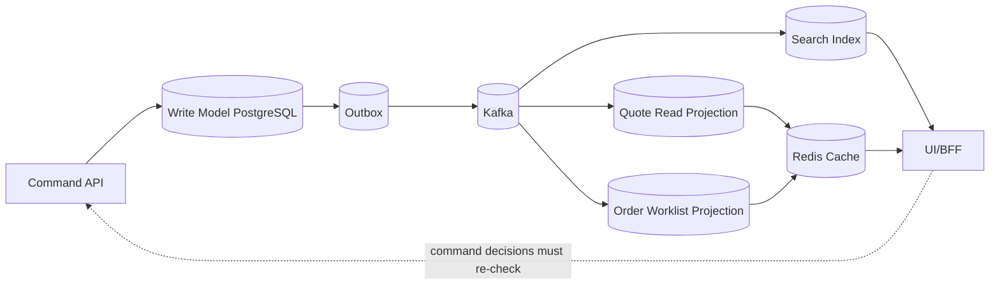
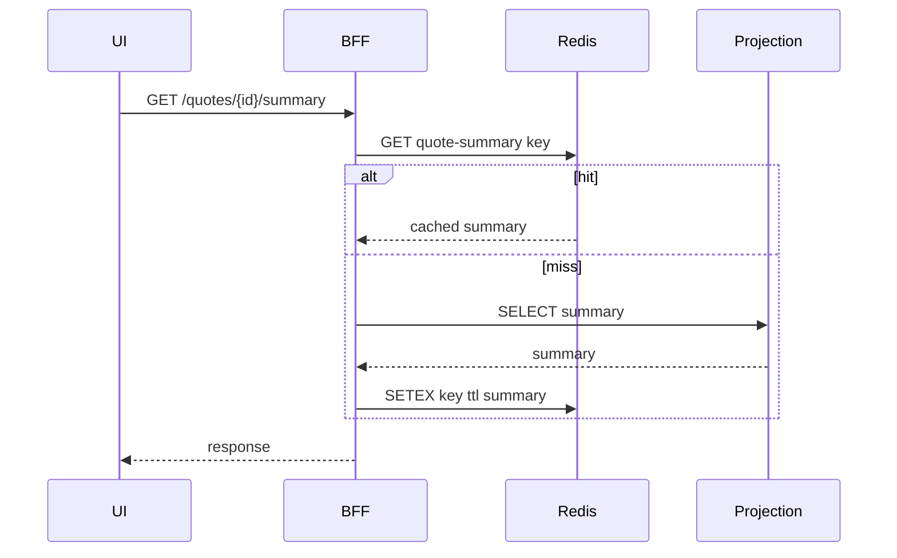
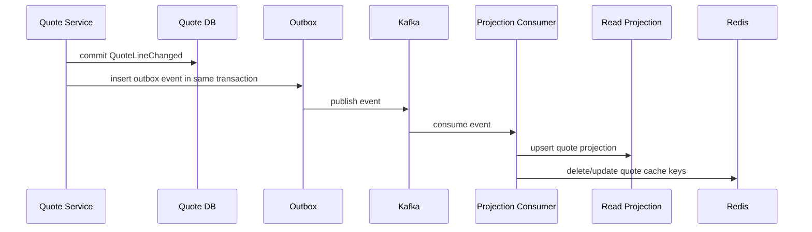
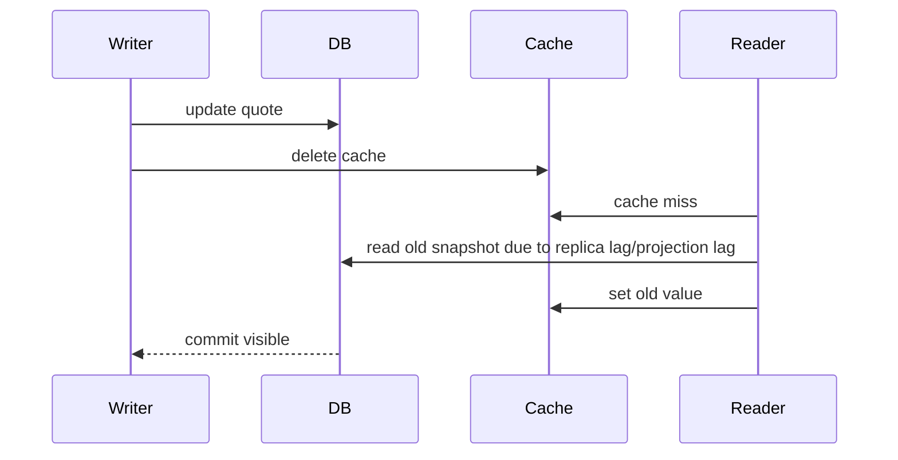
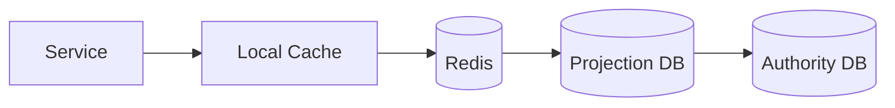
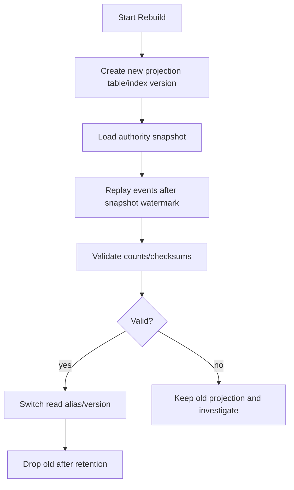

# Part 031 — Cache Invalidation and Read Models

Cache invalidation sering dianggap masalah teknis kecil: hapus key setelah update, beri TTL, selesai.

Di CPQ/OMS enterprise, itu cara berpikir yang terlalu dangkal.

Cache dan read model menyentuh fakta bisnis yang mahal:

- product offering yang boleh dijual;
- eligibility result yang memengaruhi pilihan sales;
- harga yang terlihat oleh customer;
- quote revision yang sedang dinegosiasikan;
- approval status yang menentukan boleh/tidaknya quote diterima;
- order status yang dipakai operational team untuk menangani fallout;
- workflow task yang menentukan siapa harus bertindak berikutnya.

Jika cache salah, user melihat data basi. Jika read model salah, operation team mengambil keputusan keliru. Jika invalidation tidak jelas, sistem terasa cepat tetapi tidak bisa dipercaya.

Prinsip utama part ini:

> A read model is allowed to be stale only when the system explicitly knows how stale it may be, how it becomes fresh again, and which decisions are forbidden while it is stale.

Redis boleh dipakai untuk mempercepat read. Projection table boleh dipakai untuk query. Search index boleh dipakai untuk pencarian. Tetapi semua itu adalah **derived view**, bukan authority.

---

## 1. Mental Model: Authority, Projection, Cache

Kita mulai dari tiga istilah yang sering dicampur.

| Layer | Pertanyaan yang dijawab | Boleh stale? | Boleh jadi source of truth? |
|---|---|---:|---:|
| Authority / write model | “Apa fakta bisnis yang benar?” | Tidak untuk command decision | Ya |
| Projection / read model | “Bagaimana fakta itu mudah dibaca?” | Ya, dengan SLA | Tidak |
| Cache | “Bagaimana read yang sama bisa lebih cepat?” | Ya, dengan TTL/invalidation | Tidak |

Dalam CPQ/OMS:

- `quote_revision` di PostgreSQL adalah authority.
- `quote_search_projection` adalah read model.
- `redis:quote-summary:{tenant}:{quoteId}:{revision}` adalah cache.

Jangan membalik urutannya.



Rule desain:

- command tidak boleh diputuskan hanya dari cache;
- approval tidak boleh diputuskan hanya dari read model;
- accept quote harus re-check authority;
- order cancellation harus re-check authority;
- stale read boleh untuk display, bukan untuk final mutation.

---

## 2. CPQ/OMS Read Surfaces

Read model tidak satu bentuk. Setiap surface memiliki tolerance, query pattern, dan freshness requirement berbeda.

| Surface | Contoh | Freshness expectation | Source terbaik |
|---|---|---:|---|
| Quote editor | current quote lines, price summary | sangat tinggi | PostgreSQL authority + short cache |
| Quote list | search by status/customer/sales owner | medium | projection table/search index |
| Product picker | published catalog, option tree | high but versioned | catalog projection + Redis |
| Price preview | temporary computed price | seconds/minutes | Redis + reprice authority on submit |
| Approval worklist | pending tasks by approver | high | workflow/task projection |
| Order dashboard | fulfillment status, fallout | medium/high | order projection |
| Audit viewer | immutable event/transition timeline | exact-ish | audit/transition table |
| Reporting export | daily/weekly business report | bounded batch freshness | reporting schema/warehouse |

Kesalahan umum: satu read model dipaksa melayani semua surface.

Akibatnya:

- quote editor menjadi lambat karena query list terlalu kompleks;
- search index dipakai untuk command validation;
- operational dashboard memakai query join berat ke write table;
- Redis menyimpan terlalu banyak payload dan menjadi shadow database.

Read model yang baik dimulai dari **query use case**, bukan dari entity.

---

## 3. Freshness Classes

Tidak semua data perlu real-time. Tetapi setiap data perlu freshness class yang eksplisit.

| Class | Meaning | Example | Allowed decision |
|---|---|---|---|
| Strong-read required | Must read authority before decision | accept quote, submit order | mutation allowed only after authority check |
| Bounded stale | May be stale within small budget | product picker after catalog publish | display/select, revalidate on command |
| Eventually visible | Appears after async projection | quote list, order dashboard | informational only |
| Snapshot stable | Frozen for historical proof | accepted quote document | read exact snapshot |
| Ephemeral | Temporary convenience | price preview, wizard state | must recompute before finalization |

Dalam CPQ/OMS, stale data bukan hanya UX issue. Ia bisa menjadi commercial defect.

Contoh:

- sales melihat discount policy lama;
- approval worklist masih menunjukkan task yang sudah diselesaikan;
- quote list menampilkan quote sebagai approved padahal revision baru sudah membuat approval stale;
- product picker masih menampilkan product offering yang sudah withdrawn;
- order dashboard menyembunyikan fallout yang butuh tindakan manual.

Maka setiap read endpoint harus punya metadata freshness:

```json
{
  "data": {},
  "freshness": {
    "source": "QUOTE_PROJECTION",
    "projectionLagMs": 842,
    "builtFromEventSequence": 913882,
    "generatedAt": "2026-07-02T10:15:30Z",
    "stalenessPolicy": "EVENTUALLY_VISIBLE"
  }
}
```

Tidak semua API harus expose metadata ini ke end user, tetapi service harus bisa mengukurnya.

---

## 4. Cache Invalidation Is a Domain Problem

Cache invalidation tidak cukup dengan “hapus setelah update”. Pertanyaan yang benar:

1. Fakta bisnis apa yang berubah?
2. Read surface apa yang bergantung pada fakta itu?
3. Apakah cache key bisa di-versioning sehingga tidak perlu delete massal?
4. Apakah stale data masih aman untuk display?
5. Apakah command berikutnya akan revalidate authority?
6. Bagaimana jika invalidation event terlambat, duplicate, atau hilang?

Contoh perubahan domain dan dampaknya:

| Domain event | Cache/read model terdampak |
|---|---|
| `CatalogPublished` | product picker, config rule cache, eligibility cache |
| `PricingPolicyPublished` | price preview cache, quote pricing freshness indicator |
| `QuoteLineChanged` | quote summary, quote list, price result freshness |
| `QuotePriced` | quote summary, approval trigger projection |
| `QuoteApprovalCompleted` | quote status, approver worklist, audit timeline |
| `QuoteAccepted` | quote list, order creation eligibility, customer portal |
| `OrderStateChanged` | order dashboard, customer portal, fallout worklist |
| `FulfillmentStepFailed` | fallout queue, SLA dashboard, notification read model |
| `TenantPolicyChanged` | approval cache, entitlement cache, BFF menu cache |

Domain event harus menjadi trigger invalidation/projection, bukan hidden database update.

---

## 5. Cache Strategy Taxonomy

Ada beberapa strategi cache. Jangan pilih satu untuk semua.

### 5.1 Cache-aside

Service mencoba baca dari Redis. Jika miss, baca dari source/projection, lalu isi cache.

Cocok untuk:

- product offering detail;
- catalog option tree;
- quote summary read;
- dashboard fragment;
- eligibility result yang mahal dihitung.

Tidak cocok untuk:

- command authority;
- approval final decision;
- inventory commitment;
- fulfillment result.



### 5.2 Write-through / write-behind

Biasanya tidak direkomendasikan untuk CPQ/OMS authority. Ia menggoda karena terlihat konsisten, tetapi bisa membuat Redis dan DB menjadi dua authority.

Untuk CPQ/OMS, lebih aman:

- write ke PostgreSQL authority;
- publish event via outbox;
- projection/cache update asynchronously;
- command berikutnya re-check authority.

### 5.3 Versioned key cache

Daripada menghapus key lama, gunakan version stamp dalam key.

Contoh:

```text
catalog:offering-tree:{tenantId}:{catalogPublicationId}:{offeringId}
pricing:preview:{tenantId}:{priceBookVersion}:{configHash}
quote:summary:{tenantId}:{quoteId}:rev:{revisionNo}:v:{projectionVersion}
approval:policy:{tenantId}:{approvalPolicyVersion}:{commercialSegment}
```

Keunggulan:

- invalidation massal lebih sederhana;
- data lama otomatis tidak terbaca ketika version berubah;
- TTL membersihkan sisa key lama;
- race antara update dan delete berkurang.

Trade-off:

- key cardinality meningkat;
- perlu monitoring memory;
- version source harus jelas.

### 5.4 Event-driven invalidation

Projection consumer menerima event lalu menghapus/memperbarui cache terkait.

Cocok untuk:

- quote summary;
- order dashboard row;
- approval worklist;
- catalog publication;
- pricing policy publication.

Harus idempotent. Duplicate invalidation tidak boleh berbahaya.

### 5.5 TTL as safety net, not correctness guarantee

TTL membantu membatasi stale lifetime. Tetapi TTL saja tidak cukup untuk data yang berdampak keputusan bisnis.

TTL yang benar:

- pendek untuk volatile data;
- lebih panjang untuk versioned immutable snapshot;
- diberi jitter untuk mengurangi stampede;
- diukur melalui hit ratio dan stale incident;
- tidak dipakai sebagai satu-satunya mechanism untuk approval/acceptance correctness.

---

## 6. Redis Key Design for CPQ/OMS

Key design adalah API internal. Ia harus konsisten, tenant-safe, dan bisa diobservasi.

Format umum:

```text
{domain}:{purpose}:{tenantId}:{scope}:{id-or-hash}:v:{version}
```

Contoh:

```text
catalog:offering-tree:tnt-123:publication:catpub-2026-07:offer:internet-1g
config:eligibility:tnt-123:catpub-2026-07:customer-seg:enterprise:hash:8af32
pricing:preview:tnt-123:pb:pb-2026q3:cfg:6e8b9a:user:sales-919
quote:summary:tnt-123:quote:q-10029:rev:4:proj:18820
order:dashboard-row:tnt-123:order:o-88219:proj:6631
idemp:quote-command:tnt-123:quote:q-10029:key:4b917
```

Key harus menyertakan:

- tenant jika sistem multi-tenant;
- domain/purpose;
- aggregate id atau deterministic hash;
- version stamp jika data versioned;
- TTL class.

Jangan menyimpan key seperti:

```text
quote:123
price:abc
user-cache
all-products
```

Key seperti itu tidak memberi informasi cukup untuk invalidation, audit, atau debugging.

---

## 7. Version Stamps

Version stamp adalah mekanisme murah untuk mencegah stale read tersembunyi.

CPQ/OMS punya beberapa version source:

| Version stamp | Authority | Dipakai untuk |
|---|---|---|
| `catalogPublicationId` | Catalog service | product picker, config engine |
| `priceBookVersion` | Pricing service | price preview, quote pricing |
| `approvalPolicyVersion` | Policy service | approval decision, approval task |
| `quoteRevisionNo` | Quote service | quote summary, quote document |
| `priceResultId` | Pricing service/Quote snapshot | price trace, accepted quote |
| `orderVersion` | Order service | order dashboard, command If-Match |
| `projectionSequence` | Projection service | read model freshness |
| `schemaVersion` | Contract registry | payload decoding |

A good read response often carries these versions:

```json
{
  "quoteId": "q-10029",
  "revision": 4,
  "status": "PRICED",
  "catalogPublicationId": "catpub-2026-07",
  "priceBookVersion": "pb-2026q3",
  "priceResultId": "pr-8831",
  "approvalPolicyVersion": "ap-2026-07-a",
  "projectionSequence": 18820
}
```

Command dapat memakai version ini untuk revalidation:

```http
POST /quotes/q-10029/commands/submit-for-approval
If-Match: "quote-rev-4"
Idempotency-Key: 07e5e8c1-880a-4a2d-9b7e-44b84e441f01
```

Jika authority berubah, command harus gagal dengan conflict, bukan diam-diam memakai stale read.

---

## 8. Read Model Design: Table, Document, or Cache?

Pilih storage berdasarkan query pattern.

| Need | Better fit | Reason |
|---|---|---|
| Exact lifecycle lookup by ID | PostgreSQL projection table | transactional-ish, indexed |
| Quote/order list with filters | PostgreSQL projection or search index | depends on text/search complexity |
| Full text search | PostgreSQL FTS or search engine | ranking/tokenization |
| Worklist by assignee/SLA | PostgreSQL projection | predictable filters/sorts |
| Dashboard counters | aggregate projection table | cheap query |
| Large analytics | reporting DB/warehouse | isolate OLTP |
| Sub-ms repeated read | Redis cache | bounded stale acceleration |
| Immutable quote document | object storage + metadata table | artifact immutability |

Read model bukan sinonim Redis.

Projection table sering lebih tepat daripada cache karena:

- bisa di-index;
- bisa di-query kompleks;
- bisa di-rebuild;
- bisa menyimpan projection sequence;
- bisa diaudit;
- bisa join terbatas untuk operational query.

Redis paling baik untuk frequently repeated read dengan known key.

Search index paling baik untuk flexible search, relevance, tokenization, atau faceted query.

---

## 9. Projection Pipeline

Read model idealnya dibangun dari event yang keluar dari write model.



Projection consumer harus:

- idempotent;
- track event id;
- handle out-of-order event per aggregate;
- store last processed sequence;
- expose lag metric;
- support rebuild from event log or authority snapshot;
- avoid hidden coupling to write table internals.

Projection table contoh:

```sql
CREATE TABLE quote_list_projection (
  tenant_id              text NOT NULL,
  quote_id               uuid NOT NULL,
  current_revision_no    int NOT NULL,
  customer_id            uuid NOT NULL,
  sales_owner_id         uuid NOT NULL,
  status                 text NOT NULL,
  total_amount_minor     bigint,
  currency               char(3),
  approval_status        text,
  price_freshness        text NOT NULL,
  last_business_event_at timestamptz NOT NULL,
  projection_sequence    bigint NOT NULL,
  projection_updated_at  timestamptz NOT NULL DEFAULT now(),
  PRIMARY KEY (tenant_id, quote_id)
);

CREATE INDEX idx_quote_list_by_owner_status
  ON quote_list_projection (tenant_id, sales_owner_id, status, projection_updated_at DESC);

CREATE INDEX idx_quote_list_by_customer
  ON quote_list_projection (tenant_id, customer_id, projection_updated_at DESC);
```

Projection tidak harus normalized seperti write model. Ia boleh denormalized karena tujuannya query.

---

## 10. Projection Event Handler Shape

Pseudo-code Java:

```java
public final class QuoteProjectionConsumer {
  private final ProjectionRepository projectionRepository;
  private final ProcessedEventRepository processedEventRepository;
  private final CacheInvalidator cacheInvalidator;

  public void handle(EventEnvelope envelope) {
    if (processedEventRepository.exists(envelope.eventId())) {
      return;
    }

    projectionRepository.withTransaction(() -> {
      if (processedEventRepository.existsForUpdate(envelope.eventId())) {
        return;
      }

      switch (envelope.eventType()) {
        case "QuoteCreated" -> applyQuoteCreated(envelope);
        case "QuoteLineChanged" -> applyQuoteLineChanged(envelope);
        case "QuotePriced" -> applyQuotePriced(envelope);
        case "QuoteSubmittedForApproval" -> applyQuoteSubmitted(envelope);
        case "QuoteApprovalCompleted" -> applyApprovalCompleted(envelope);
        case "QuoteAccepted" -> applyQuoteAccepted(envelope);
        default -> storeUnknownButDoNotCrash(envelope);
      }

      processedEventRepository.markProcessed(
        envelope.eventId(),
        envelope.aggregateId(),
        envelope.aggregateVersion(),
        envelope.publishedAt()
      );
    });

    cacheInvalidator.invalidateFor(envelope);
  }
}
```

Perhatikan urutannya:

1. projection update dalam DB transaction;
2. processed event dicatat dalam transaction yang sama;
3. cache invalidation boleh dilakukan setelah commit;
4. jika invalidation gagal, TTL menjadi safety net dan retry job bisa membersihkan.

Jangan invalidasi Redis sebelum projection commit jika UI akan reload dari projection. Itu bisa menyebabkan cache miss yang membaca projection lama lalu mengisi cache lama lagi.

---

## 11. Invalidation Timing Problem

Masalah klasik:



Solusi tergantung architecture:

- jika baca authority primary, delete after commit;
- jika baca projection, invalidasi setelah projection update;
- jika ada replica lag, response harus expose freshness/lag;
- gunakan versioned keys agar old value tidak cocok dengan new version;
- gunakan short TTL untuk volatile payload;
- gunakan command revalidation pada mutation.

Di CPQ/OMS, jangan hanya berdebat “delete before or after update”. Tanyakan dulu: cache ini membaca dari authority, projection, replica, atau search index?

---

## 12. Catalog Cache Invalidation

Catalog memiliki pola berbeda dari quote/order.

Catalog biasanya dipublish sebagai versioned publication:

```text
DRAFT catalog -> VALIDATED -> PUBLISHED publication id
```

Saat publication baru aktif:

- offering tree cache harus memakai `catalogPublicationId` baru;
- config rule cache harus memakai publication baru;
- eligibility cache harus invalidated atau versioned;
- existing quote tidak otomatis berubah karena quote menyimpan snapshot;
- draft quote bisa diberi warning “catalog version changed”.

Key design:

```text
catalog:publication:tnt-123:active
catalog:offering-tree:tnt-123:pub:catpub-2026-07:offer:internet-1g
catalog:rules:tnt-123:pub:catpub-2026-07:rule-set:bundle-compatibility
```

Active publication pointer boleh cache pendek:

```json
{
  "tenantId": "tnt-123",
  "activeCatalogPublicationId": "catpub-2026-07",
  "effectiveFrom": "2026-07-01T00:00:00Z"
}
```

Tetapi command `addQuoteLine` tetap harus membaca active publication dari Catalog authority atau strongly consistent publication cache yang memiliki revalidation.

---

## 13. Pricing Cache Invalidation

Pricing lebih berbahaya daripada catalog cache karena harga berdampak finansial.

Gunakan prinsip:

- price preview boleh cache;
- accepted price harus snapshot;
- final submit harus reprice/revalidate;
- manual override harus mengubah freshness;
- price policy publication harus menghasilkan new version.

Key design:

```text
pricing:preview:{tenant}:{priceBookVersion}:{pricingPolicyVersion}:{configHash}:{customerSegment}:{currency}
```

Payload harus membawa trace:

```json
{
  "pricePreviewId": "pp-771",
  "priceBookVersion": "pb-2026q3",
  "pricingPolicyVersion": "policy-2026-07-a",
  "configHash": "6e8b9a",
  "total": { "currency": "USD", "minor": 129900 },
  "expiresAt": "2026-07-02T10:20:00Z",
  "notValidForAcceptance": true
}
```

`notValidForAcceptance` penting. UI boleh menampilkan preview cepat, tetapi acceptance harus memakai persisted `price_result` yang valid untuk quote revision.

---

## 14. Quote Summary Cache

Quote summary sering dibaca banyak kali saat user mengedit quote.

Masalahnya, quote berubah cepat:

- line ditambah;
- characteristic diubah;
- price menjadi stale;
- approval menjadi stale;
- document menjadi stale;
- revision berubah.

Cache key harus mengikat revision:

```text
quote:summary:{tenant}:{quoteId}:rev:{revisionNo}:projection:{projectionSequence}
```

Jika quote line berubah:

1. write model commit `QuoteLineChanged` dengan version baru;
2. outbox publish event;
3. projection update summary;
4. cache invalidator hapus old summary atau biarkan versioned key mati via TTL;
5. UI response untuk command bisa langsung mengembalikan summary dari authority agar user tidak menunggu projection.

Hybrid pattern:

- command response reads authority and returns immediate state;
- list/search updates through projection asynchronously;
- cache accelerates repeated GET.

Ini menjaga UX tetap responsif tanpa membohongi user tentang command result.

---

## 15. Approval Worklist Read Model

Approval worklist tidak cocok hanya dari Camunda task query langsung jika enterprise scale tinggi dan butuh domain filters.

Worklist butuh:

- assignee/candidate group;
- tenant;
- quote total;
- discount percentage;
- customer segment;
- quote revision;
- due date;
- SLA bucket;
- escalation level;
- blocked reason;
- task status;
- domain authorization.

Banyak field tersebut tidak natural di Camunda task table.

Solusi: task projection.

```sql
CREATE TABLE approval_worklist_projection (
  tenant_id              text NOT NULL,
  task_id                text NOT NULL,
  process_instance_id    text NOT NULL,
  business_key           text NOT NULL,
  quote_id               uuid NOT NULL,
  quote_revision_no      int NOT NULL,
  customer_id            uuid NOT NULL,
  approver_user_id       text,
  candidate_group        text,
  approval_level         int NOT NULL,
  approval_reason        text NOT NULL,
  amount_minor           bigint NOT NULL,
  currency               char(3) NOT NULL,
  due_at                 timestamptz,
  escalation_level       int NOT NULL DEFAULT 0,
  status                 text NOT NULL,
  projection_updated_at  timestamptz NOT NULL DEFAULT now(),
  PRIMARY KEY (tenant_id, task_id)
);
```

Projection source:

- Camunda task events if integrated;
- workflow adapter events;
- domain quote events;
- scheduled SLA recalculation.

On task completion, command still goes through workflow/domain command endpoint. Worklist projection is not allowed to directly mutate quote state.

---

## 16. Order Dashboard Read Model

Order dashboard harus mendukung operations:

- find orders stuck in state;
- find fulfillment step failed;
- find SLA breach;
- find external system unknown outcome;
- filter by customer, product, region, fulfillment partner;
- open timeline;
- assign case worker.

Write model biasanya terlalu normalized untuk query ini.

Projection table:

```sql
CREATE TABLE order_operational_projection (
  tenant_id                 text NOT NULL,
  order_id                  uuid NOT NULL,
  customer_id               uuid NOT NULL,
  order_status              text NOT NULL,
  fulfillment_status        text NOT NULL,
  fallout_status            text NOT NULL,
  current_blocker_code      text,
  current_blocker_message   text,
  current_owner_user_id     text,
  current_owner_group       text,
  next_action               text,
  last_fulfillment_event_at timestamptz,
  due_at                    timestamptz,
  sla_bucket                text NOT NULL,
  projection_sequence       bigint NOT NULL,
  projection_updated_at     timestamptz NOT NULL DEFAULT now(),
  PRIMARY KEY (tenant_id, order_id)
);
```

Cache dashboard counters, bukan seluruh dashboard besar.

Contoh:

```text
order:ops-counter:tnt-123:bucket:fallout-open:v:20260702T1015
order:ops-counter:tnt-123:bucket:sla-breach:v:20260702T1015
```

Counters boleh stale beberapa menit jika UI jelas. Tetapi “resolve fallout” command harus membaca authority.

---

## 17. Cache Stampede and Hot Keys

CPQ punya hot key natural:

- active catalog publication;
- top product offerings;
- popular bundle trees;
- current price book metadata;
- approval policy by tenant;
- dashboard counters during morning operations.

Masalah stampede terjadi saat banyak request miss bersamaan dan semua menghantam DB/projection.

Mitigasi:

1. TTL jitter.
2. Single-flight per node.
3. Short Redis lock untuk rebuild cache, bukan untuk business lock.
4. Serve stale-while-revalidate untuk non-critical display.
5. Warm cache setelah catalog/pricing publication.
6. Precompute high-traffic read model.
7. Break large hot keys menjadi smaller fragments.

Pseudo-code:

```java
public <T> T getWithSingleFlight(CacheKey key, Supplier<T> loader) {
  T cached = redis.get(key);
  if (cached != null) return cached;

  return singleFlight.execute(key.toString(), () -> {
    T secondCheck = redis.get(key);
    if (secondCheck != null) return secondCheck;

    T loaded = loader.get();
    redis.setex(key, ttlWithJitter(key), loaded);
    return loaded;
  });
}
```

Jangan memakai distributed lock panjang untuk menyelesaikan stampede. Lock Redis untuk cache rebuild harus pendek, best-effort, dan tidak memegang transaksi bisnis.

---

## 18. Negative Caching

Negative cache menyimpan “tidak ditemukan” atau “tidak eligible”. Ini berguna tetapi berbahaya.

Cocok:

- product offering id tidak ditemukan dalam publication tertentu;
- eligibility negative untuk customer segment dan version tertentu;
- no open approval task for exact quote revision.

Berbahaya:

- customer tidak punya entitlement jika entitlement bisa baru saja berubah;
- inventory tidak tersedia jika inventory berubah cepat;
- quote tidak ditemukan jika projection lag.

Rule:

- TTL negative cache harus lebih pendek;
- key harus versioned;
- response harus distinguish `NOT_FOUND_AUTHORITY` vs `NOT_VISIBLE_IN_PROJECTION_YET`;
- command tidak boleh bergantung pada negative cache.

---

## 19. Local Cache + Redis Cache

Kadang service memakai local in-memory cache di atas Redis.

Ini bisa meningkatkan latency, tetapi invalidation menjadi dua level.



Gunakan local cache hanya untuk:

- tiny immutable reference data;
- versioned policy metadata;
- configuration schema;
- route table;
- compiled DMN/config rule artifact.

Jangan local-cache:

- quote mutable state;
- approval task state;
- order fulfillment state;
- authorization decision tanpa short TTL dan version.

Local cache invalidation bisa dilakukan dengan:

- versioned keys;
- periodic refresh;
- Kafka invalidation event;
- Redis pub/sub sebagai hint only;
- short TTL.

Jika invalidation channel hilang, TTL harus tetap memulihkan.

---

## 20. Read Model Rebuild

Projection bisa rusak karena bug, schema change, missed event, atau logic evolution.

Maka projection harus rebuildable.

Rebuild sources:

1. event log jika event cukup lengkap;
2. authority snapshot jika projection berasal dari current state;
3. hybrid: authority snapshot + recent events;
4. dedicated reindex job.

Rebuild strategy:



Jangan rebuild production projection in-place jika query harus tetap available.

Gunakan versioned projection:

```text
quote_search_projection_v17
quote_search_projection_v18_building
```

Atau gunakan `projection_version` column dan switch active version di config.

---

## 21. Projection Lag and User Experience

Eventual consistency harus terlihat dalam UX yang benar.

Contoh setelah quote submit:

- command response langsung menampilkan `SUBMITTED_FOR_APPROVAL` dari authority;
- quote list mungkin butuh beberapa detik update;
- UI bisa optimistic update row lokal;
- jika projection lag tinggi, tampilkan “updating…”;
- refresh endpoint dapat menyediakan `projectionLagMs`.

Jangan membuat user bingung:

- submit berhasil tetapi list masih draft;
- approval selesai tetapi task masih muncul;
- order resolved tetapi dashboard masih merah.

Kalau lag tidak bisa dihilangkan, desain UX untuk mengakui lag.

---

## 22. Invalidation Event Catalog

Buat daftar invalidation sebagai artifact arsitektur.

| Event | Cache keys | Projection actions | Stale budget |
|---|---|---|---:|
| `CatalogPublished` | `catalog:*:{newPub}`, active pointer | update catalog publication projection | 30s |
| `PricingPolicyPublished` | `pricing:preview:*oldPolicy*` via version switch | update pricing policy read model | 30s |
| `QuoteLineChanged` | `quote:summary:{quote}:rev:{old}` | upsert quote list, mark price stale | 5s |
| `QuotePriced` | `quote:summary`, `approval-trigger` | update total/status/freshness | 5s |
| `ApprovalTaskCreated` | `worklist:{approver}` | insert worklist row | 5s |
| `ApprovalTaskCompleted` | `worklist:{approver}`, `quote:summary` | mark task completed | 5s |
| `OrderFulfillmentFailed` | `order:dashboard`, counters | update fallout queue | 10s |
| `OrderCompleted` | `order:dashboard`, customer portal | mark completed, update counters | 30s |

Artifact ini harus direview seperti API contract. Tanpa daftar ini, invalidation akan tersebar di kode dan sulit diaudit.

---

## 23. When Not to Cache

Jangan cache hanya karena bisa.

Hindari cache jika:

- query jarang dipanggil;
- payload sangat besar;
- invalidation lebih mahal daripada query;
- data sangat volatile;
- stale data menyebabkan keputusan salah;
- query sudah cepat dengan index benar;
- cache key cardinality tidak terkontrol;
- tidak ada owner untuk invalidation.

Contoh:

- final acceptance validation: jangan cache;
- order compensation decision: jangan cache;
- authorization for high-risk approval: boleh short cache untuk policy metadata, tetapi decision final harus re-evaluate;
- audit timeline: cache hanya rendered page fragment, bukan truth.

Cache adalah debt. Setiap cache butuh owner, TTL, invalidation source, metric, dan removal strategy.

---

## 24. Failure Matrix

| Failure | Effect | Mitigation |
|---|---|---|
| Redis down | slower reads, cache miss | degrade to projection/authority, timeout short |
| Projection consumer lag | stale list/dashboard | expose lag, alert, command revalidation |
| Invalidation event missed | stale cache until TTL | TTL, reconciliation invalidator, versioned key |
| Duplicate event | repeated invalidation/update | idempotent consumer |
| Out-of-order event | projection regression | aggregate version guard |
| Search index rebuild failure | old search result remains | blue/green index, alias switch only after validation |
| Hot key overload | Redis/DB pressure | sharding key, precompute, single-flight |
| Cache stores unauthorized payload | data leak | tenant key, authz-filtered cache, field-level cache discipline |
| Negative cache stale | false not-found/not-eligible | short TTL, version key, command recheck |
| Projection schema bug | wrong dashboard | rebuild, validation, shadow projection |

---

## 25. Testing Cache and Read Models

Cache bugs rarely appear in happy-path unit tests.

Test categories:

### 25.1 Projection contract test

Given event sequence:

```text
QuoteCreated -> QuoteLineAdded -> QuotePriced -> SubmittedForApproval
```

Projection should become:

```json
{
  "status": "SUBMITTED_FOR_APPROVAL",
  "priceFreshness": "FRESH",
  "approvalStatus": "PENDING"
}
```

### 25.2 Duplicate event test

Same event consumed twice should not double count totals or duplicate task rows.

### 25.3 Out-of-order event test

`QuotePriced(v5)` arriving after `QuoteLineChanged(v6)` must not mark price fresh for revision 6.

### 25.4 Cache invalidation test

After `QuoteLineChanged`, old quote summary cache must not be served for current revision.

### 25.5 Projection lag test

Command response must be correct even if projection has not caught up.

### 25.6 Authorization cache test

User from tenant A must never receive tenant B cached payload even if IDs collide.

### 25.7 Rebuild equivalence test

Projection built from replay must equal projection built from snapshot for same watermark.

---

## 26. Operational Metrics

Minimum metrics:

### Redis

- hit ratio by key family;
- memory usage by namespace approximation;
- evictions;
- expired keys;
- command latency;
- hot keys;
- cache set errors;
- cache payload size;
- negative cache hit ratio.

### Projection

- consumer lag;
- projection sequence lag;
- projection update latency;
- failed events;
- duplicate event count;
- out-of-order event count;
- rebuild duration;
- last successful rebuild validation.

### User-visible consistency

- command-to-list-visible latency;
- approval complete-to-task-disappear latency;
- order event-to-dashboard-visible latency;
- stale read incidents;
- support tickets caused by delayed projection.

Metrics harus dipecah per tenant jika enterprise multi-tenant.

---

## 27. Reference Design Checklist

Gunakan checklist ini sebelum menambahkan read model/cache baru.

### Read model checklist

- [ ] Query use case jelas.
- [ ] Owner service jelas.
- [ ] Source event/authority jelas.
- [ ] Projection schema tidak bocor menjadi write schema.
- [ ] Projection bisa rebuild.
- [ ] Lag bisa diukur.
- [ ] Authorization diterapkan.
- [ ] Tenant boundary jelas.
- [ ] Duplicate event aman.
- [ ] Out-of-order event aman.
- [ ] Backfill plan ada.

### Cache checklist

- [ ] Cache key memiliki namespace dan tenant.
- [ ] TTL ditentukan.
- [ ] Version stamp dipakai jika relevan.
- [ ] Invalidation source jelas.
- [ ] Command tidak bergantung pada cache.
- [ ] Payload tidak mengandung unauthorized data.
- [ ] Memory/cardinality diperkirakan.
- [ ] Failure mode saat Redis down jelas.
- [ ] Cache bisa dihapus tanpa merusak correctness.

---

## 28. Mini Implementation Blueprint

Package structure:

```text
quote-readmodel-service/
  src/main/java/com/acme/cpq/readmodel/
    api/
      QuoteSearchResource.java
      QuoteSummaryResource.java
    projection/
      QuoteProjectionConsumer.java
      QuoteProjectionRepository.java
      ProjectionEventHandler.java
    cache/
      QuoteSummaryCache.java
      CacheKeyFactory.java
      CacheInvalidator.java
      TtlPolicy.java
    authz/
      ReadAuthorizationService.java
    model/
      QuoteListRow.java
      QuoteSummaryView.java
      ProjectionMetadata.java
```

Important boundary:

- API reads projection/cache;
- projection consumer writes projection;
- cache invalidator never writes authority;
- command service owns mutation;
- read model service may call authorization service;
- read model service must not start Camunda process directly.

---

## 29. A Better Way to Think About It

Jangan tanyakan:

> “Should we cache this?”

Tanyakan:

> “What decision will be made from this read, how stale may it be, and where is the authority checked before irreversible action?”

Itulah perbedaan antara cache sebagai performance hack dan cache sebagai bagian dari enterprise architecture.

Dalam CPQ/OMS, read model yang baik bukan sekadar cepat. Ia harus:

- menjelaskan freshness;
- menjaga tenant boundary;
- bisa rebuild;
- bisa diobservasi;
- tidak mengambil alih authority;
- tidak menyembunyikan workflow lag;
- tidak membuat stale data menjadi commercial commitment.

---

## 30. Closing Mental Model

Write model adalah ledger of truth.

Event stream adalah propagation mechanism.

Projection adalah query-optimized memory of the system.

Redis adalah acceleration layer.

Search index adalah discovery layer.

Reporting schema adalah analysis layer.

Jika setiap layer tahu posisinya, sistem bisa cepat tanpa rapuh. Jika satu layer pura-pura menjadi semuanya, CPQ/OMS akan sulit dijelaskan, sulit diaudit, dan sulit dipulihkan.

Part berikutnya akan membahas search, reporting, dan operational queries secara lebih dalam: bagaimana membangun query surface untuk quote/order/workflow tanpa menghancurkan OLTP write model.
